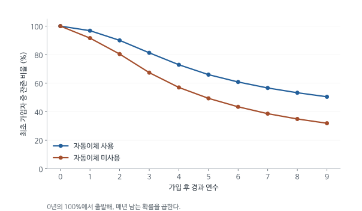

# Home Alarm LTV - 오래 남는 고객은 회사에 얼마나 더 가치가 있을까

Week 01 / 2026-09-02 / Session 1

[원문 PDF](<Case -- Homealarm LTV.pdf>) | [QnA](<Case -- Homealarm LTV_QnA.md>)

## 1. 자동이체를 권하는 데 얼마까지 써도 될까

Home Alarm은 가정과 사업장에 보안 서비스를 제공하는 회사다. 고객은 서비스를 이용하는 동안 매달 요금을 낸다. 회사에는 한 번의 판매보다 고객이 몇 년 동안 서비스를 유지하는지가 중요하다. 설치할 때 드는 비용을 회수하고 이후에도 매달 이익을 얻어야 하기 때문이다.

마케팅 부사장 Kevin Starke는 고객 이탈을 분석한 MBA 학생들의 발표를 듣는다. 이탈은 고객이 계약을 해지해 더 이상 요금을 내지 않는 것을 뜻한다. 학생들은 신용등급이 좋은 고객이 오래 남는다는 익숙한 결과와 함께, 자동이체 가입자의 이탈률이 낮다는 결과를 제시했다. 자동이체는 계좌나 카드에서 요금이 자동으로 결제되는 방식이다. 비교 고객은 월별 청구서를 받고 수표 등으로 직접 납부한다.

Kevin에게 자동이체가 특히 관심을 끈 이유는 회사가 가입을 권유할 수 있는 행동이기 때문이다. 고객의 신용등급을 곧바로 바꾸기는 어렵지만, 영업사원에게 자동이체를 안내하도록 교육하거나 고객에게 가입 보상을 지급하는 방안은 실행할 수 있다. 다만 그 방안에 돈을 쓰려면 자동이체 고객이 회사에 얼마나 더 많은 이익을 남기는지부터 알아야 한다.

두 집단의 과거 월매출은 약 30달러로 비슷했다. 한 달 매출만 비교하면 가치 차이가 거의 없어 보인다. 하지만 같은 금액을 매달 내더라도 2년 만에 해지하는 고객과 8년 동안 남는 고객이 회사에 남기는 총이익은 다르다. 미래에 받을 이익까지 가입 시점의 가치로 환산한 금액을 고객생애가치, LTV라고 부른다.

아래 계산은 현재의 자동이체 고객과 미사용 고객이 앞으로 얼마나 다른 가치를 보일지 예측한다. 계산 순서는 실제 질문을 따른다. 몇 명이 계속 남는지 알아보고, 남은 고객 한 명에게서 얻는 마진을 계산한 뒤, 미래의 이익을 현재가치로 바꿔 더한다. 마지막에는 이 예측 차이를 자동이체 전환 정책의 효과로 써도 되는지 검토한다.

고객생애가치는 고객이 부유한지 또는 매달 얼마나 큰 금액을 내는지와 같은 지표가 아니다. 회사 관점에서 앞으로 받을 금액과 지출할 금액의 차이를 기간 전체에 걸쳐 계산한 값이다. 월 요금이 같아도 해지 시점이 다르면 이익이 다르고, 오래 남아도 서비스 비용이 훨씬 크면 가치가 낮을 수 있다. 이 사례에서는 미래 요금과 비용 가정을 두 집단에 똑같이 적용하므로 가치 차이의 계산상 원천이 잔존확률에 집중된다.

설치 시점에는 회사가 먼저 큰 비용을 부담한다. 이 때문에 첫 달 요금만으로 고객 수익성을 판단하면 신규 고객 대부분이 손해처럼 보일 수 있다. 반대로 장기 매출만 더하고 설치비를 빼지 않으면 신규 고객 획득의 수익성을 과장한다. 기간을 명시하고 최초 비용과 이후 운영이익을 함께 놓아야 하는 이유다.

## 2. 9년 전 가입자 기록에서 미래의 잔존확률을 구한다

Kevin은 데이터 담당자 Mark Pohl에게 9년 전 같은 달에 가입한 고객들의 기록을 요청한다. 가입 시기가 비슷한 고객들을 따라가며 1년차, 2년차, 그 이후에 얼마나 해지했는지 확인하려는 것이다. 사업환경이 비교적 안정적이어서 과거 고객의 이탈률이 앞으로 가입할 고객의 이탈을 예측하는 데도 유용하다고 가정한다.

| 서비스 연차 | 자동이체 미사용 | 자동이체 사용 |
|---|---:|---:|
| 1 | 8.4% | 3.2% |
| 2 | 12.2% | 7.0% |
| 3 | 16.2% | 9.7% |
| 4 | 15.4% | 10.3% |
| 5 | 13.4% | 9.5% |
| 6 | 12.0% | 7.8% |
| 7 | 11.1% | 6.9% |
| 8 | 9.6% | 5.9% |
| 9 | 8.6% | 5.3% |

원문 p.3. 이탈률은 해당 연차에 도달한 고객 중 그해 이탈하는 비율로 사용한다. 2년차 이탈률 12.2%를 최초 가입자의 12.2%로 단순 차감하면 분모가 달라진다.

### 원문 이탈률 표를 읽는 법

위 표는 원문 PDF 3쪽에 있는 이 케이스의 유일한 표를 옮긴 것이다. 원문에는 Table 번호나 제목이 없고, Mark Pohl이 다음 날 전달한 자료로 소개된다. 원문 표의 마지막 행인 Initial RMR은 위 표에서 생략했으며 3절에서 따로 발췌한다. 이 표가 필요한 이유는 Kevin의 질문 때문이다. 학생들은 자동이체 고객이 덜 이탈한다는 사실까지만 보였고, 그 차이가 금액으로 얼마인지는 계산하지 못했다. 금액을 구하려면 두 집단이 연차별로 얼마나 줄어드는지부터 알아야 한다.

행은 가입 후 서비스 연차이고, 원문 표기는 'first year of service'부터 'ninth year of service'까지다. 열은 납부 방식에 따른 두 집단으로, 원문 표기는 'Not on auto-pay'와 'On auto-pay'다. 칸의 값은 원문 열 제목 'Attrition rate during:'이 가리키듯 해당 연차 동안의 이탈률(%)이다. 원문은 이 비율의 분모를 명시하지 않는다. 본문은 Kevin이 1년차부터 9년차의 이탈률 추정치를 얻으려 했다는 원문 설명에 따라 그해 시작까지 남은 고객을 분모로 해석한다.

대표 수치를 읽어 보면 1년차 이탈률은 미사용 8.4%, 자동이체 3.2%로 5.2%포인트 차이가 난다. 비율로는 미사용 집단의 1년차 이탈률이 자동이체 집단의 약 2.6배다. 차이가 가장 큰 해는 3년차로, 16.2%와 9.7%의 차이는 6.5%포인트다. 이후 차이는 줄어들어 9년차에는 8.6%와 5.3%, 즉 3.3%포인트가 된다. 9개 연차 모두에서 자동이체 집단의 이탈률이 낮다. 두 집단 모두 이탈률이 초반에 올라갔다가 내려가며, 정점은 미사용 집단이 3년차(16.2%), 자동이체 집단이 4년차(10.3%)다.

이 차이가 누적되면 격차가 커진다. 이어서 설명하는 곱셈식을 9년차까지 적용하면 최초 가입자 중 9년차 이탈까지 거친 뒤 남는 비율은 미사용 약 31.9%, 자동이체 약 50.5%다. 이 두 값은 원문 표에 없는 재계산 값이다. 연차별 차이는 3~7%포인트 수준이지만, 9년 뒤 잔존율은 약 18.6%포인트 벌어진다.

이 표로 말할 수 있는 것은 9년 전 6월에 가입한 코호트에서 자동이체 고객이 모든 연차에 걸쳐 덜 이탈했다는 관측 사실이다. 원문은 사업환경이 안정적이라는 이유로 이를 미래 이탈률의 추정치로 쓴다. 반면 표에는 각 집단의 가입자 수가 없다. Kevin은 가입자 수를 요청했지만 전달된 표에는 비율만 있으므로 표본 크기, 표준오차, 차이의 통계적 유의성을 판단할 수 없다. 신용등급 같은 다른 고객 특성을 통제하지 않은 단순 비교라는 점도 한계다. 자동이체로 전환하면 이탈률이 이만큼 내려간다는 인과적 결론은 이 표에서 나오지 않는다. 표 아래 본문은 두 집단을 주거용 고객으로 설명한다. 표에는 10년차 이후 이탈률이 없어 그 이후의 고객 유지 여부는 별도 가정이 필요하다.

첫해에 1,000명 중 84명이 해지했다면 916명이 남는다. 둘째 해에는 이 916명 중 12.2%가 해지한다. 이탈률을 연도별로 단순히 더하지 않고, 앞해까지 남은 비율에 올해 남는 비율을 곱하는 이유다.

이 계산을 여러 해에 적용하기 위해 집단을 $g\in\{N,A\}$로 쓰자. $N$은 미사용, $A$는 자동이체다. $q_{g,t}$는 $t$년차 조건부 이탈확률이고, $S_{g,t}$는 처음 가입한 고객이 $t$년차 이탈까지 통과해 남아 있을 확률이다.

$$
S_{g,0}=1,\qquad S_{g,t}=S_{g,t-1}(1-q_{g,t}).
$$

앞해까지 생존해야 올해의 이탈위험을 겪는다. 조건부 확률의 곱셈 법칙에 따라

$$
S_{g,t}=\prod_{k=1}^{t}(1-q_{g,k})
$$

가 된다. 이 식은 연도별 이탈 사건이 무조건 독립이라는 가정을 뜻하지 않는다. 살아남았다는 조건 아래의 연차별 이탈확률을 연쇄적으로 곱한 것이다.

### 첫 두 해를 손으로 계산

미사용 집단:

$$
S_{N,1}=1-0.084=0.916,
$$

$$
S_{N,2}=0.916(1-0.122)=0.916\times0.878=0.804248.
$$

자동이체 집단:

$$
S_{A,1}=0.968,\qquad S_{A,2}=0.968\times0.930=0.900240.
$$

처음 고객 1,000명이면 2년차까지 남는 예상 고객은 약 804명과 900명이다. 자동이체 집단은 동일한 최초 가입자 수에서 약 96명이 더 남는다. 각 고객의 연간 마진이 같더라도 이 잔존 고객 수의 차이가 미래 이익의 차이를 만든다.

이탈률 표는 ‘현재 9년차인 고객 중 누가 더 충성스러운가’만 비교하려고 만든 자료가 아니다. 같은 시기에 출발한 고객이 해마다 얼마나 줄었는지 복원하려는 것이다. 가입 후 1년차와 9년차는 서로 다른 조건에서 계산한 비율이다. 후반으로 갈수록 장기 이용에 적합한 고객이 이미 선별되어 남았을 수 있으므로, 연차별 이탈률이 내려간다고 같은 고객의 충성도가 저절로 올라갔다고 해석할 수 없다.

연도별 이탈률은 달력상의 경기 변화와도 구별한다. 표의 3년차는 계약을 시작한 뒤 세 번째 해이다. 이 사례의 과거 고객은 같은 달에 가입했으므로 그들에게는 같은 달력 기간이지만, 앞으로 가입할 고객의 3년차는 다른 달력 기간에 해당한다. 여기서는 과거 코호트의 연차별 경험을 새 고객에게 적용한다. 요금제나 경쟁 환경이 크게 달라졌다면 그 예측 가정부터 다시 검토해야 하며, 정확한 곱셈만으로 과거의 적용 가능성을 보장할 수는 없다.

생존확률과 해당 연도 이탈률은 서로 보완적인 설명이다. 예를 들어 2년차 이탈률이 10%라는 말은 그해 시작까지 도달한 고객 열 명 중 한 명이 나간다는 뜻이다. 최초 고객 중 얼마나 남았는지 알고 싶으면 첫해에 이미 나간 사람을 먼저 제외해야 한다. 이 순서를 무시하고 이탈률을 합하면 이미 계약을 끝낸 고객에게 다음 해 위험을 다시 적용하게 된다.

### 연차별 해지율의 분모가 바뀐다는 뜻

$h_t$를 $t$년차 시작까지 계약을 유지한 고객 중 그해 해지하는 비율이라고 하자. 이것은 최초 가입자 전체 중 해지한 비율과 다르다. 설명을 위한 가상 코호트 100명에서 첫해 해지율이 10%, 둘째 해가 20%라면 첫해에 10명이 나가고, 둘째 해에는 남은 90명의 20%인 18명이 나간다. 2년차 잔존자는 72명이다.

$$
\begin{aligned}
S_1&=1-h_1=0.9,\\
S_2&=P(\text{1년차 잔존})\,
P(\text{2년차 잔존}\mid\text{1년차 잔존})\\
&=S_1(1-h_2)=0.9\times0.8=0.72.
\end{aligned}
$$

두 해의 해지율을 그냥 더한 $1-0.1-0.2=0.7$은 2년차 비율의 분모를 100명으로 잘못 바꾼 계산이다. 반면 ‘첫해 최초 고객의 10%, 둘째 해 최초 고객의 18%가 나갔다’고 보고된 자료라면 $1-0.1-0.18=0.72$로 빼는 것이 맞다. 곱셈 공식 자체보다 표가 어떤 분모로 작성되었는지 먼저 읽어야 한다.

위 곱은 두 해 해지가 독립이라는 가정으로 얻은 식도 아니다. 조건부확률의 곱셈법칙이다. 오래 남은 고객들의 성향이 달라져 연차별 $h_t$가 바뀌어도 그해 생존자를 분모로 계산했다면 같은 식을 쓴다. 실제 케이스에서는 표에 주어진 각 연차의 비율을 차례로 적용한다.

<!-- learning-figure:ltv-survival -->

*그림 설명: 원문 이탈률 표를 본문의 곱셈식으로 재계산했다. 두 집단의 관측 차이이며 자동이체의 인과효과 추정치는 아니다.*

세로축의 분모는 매년 남은 고객이 아니라 최초 가입자다. 미사용 집단의 2년차 잔존율은 약 80.4%다. 첫해에 남은 91.6%에 둘째 해 잔존확률 87.8%를 곱한 위치를 선 위에서 확인할 수 있다.

<!-- /learning-figure -->

## 3. 요금 40달러 중 회사에 남는 금액을 계산한다

LTV에는 고객이 내는 요금 전액 대신 서비스를 제공하는 비용을 뺀 마진을 사용한다. 요금이 들어올 때마다 서비스비도 함께 발생하므로, 매출만 더하면 회사가 얻는 가치를 과대평가한다.

과거 첫 월 매출은 미사용 \$30.63, 자동이체 \$30.14였다. 하지만 케이스가 향후 계산에 지정한 월 매출은 두 집단 모두 \$40이다. 과거 매출을 그대로 넣으면 원문 가정과 달라진다.

과거 매출 수치는 원문 p.3 이탈률 표의 마지막 행에 있다. 앞의 이탈률 행과 단위가 다르므로 그 행만 따로 발췌한다.

| 원문 p.3 표 발췌 | 자동이체 미사용 | 자동이체 사용 |
|---|---:|---:|
| Initial RMR | \$30.63 | \$30.14 |

*발췌: 원문 PDF 3쪽 이탈률 표(번호 없음)의 마지막 행. 이탈률 행 9개는 2절 표에 있다.*

RMR은 recurring monthly revenue, 곧 고객 한 명이 매달 반복해서 내는 요금이다. 원문 요청 목록의 표현은 가입 초기 월 반복매출의 평균이며, 단위는 고객 한 명당 한 달 달러다. 연간 금액이나 비율로 읽으면 안 된다. 두 집단의 차이는 \$0.49로, 미사용 집단이 오히려 조금 높다. Kevin은 두 값이 약 \$30으로 비슷하므로 두 집단에 같은 RMR을 가정해도 된다고 판단했다. 따라서 LTV 차이가 월 요금이 아닌 이탈률에서 나온다는 1절의 설명은 이 행에 근거한다. 이 행은 가입 당시의 평균만 보여 주므로, 가입 후 몇 년이 지난 뒤 두 집단의 요금 수준은 알 수 없다. 표준편차나 가입자 수도 없어 \$0.49 차이가 우연인지 판단할 수 없다. 계산에 쓰는 \$40은 요금 인상을 반영한 다음 해 평균 RMR로, 표 밖 본문에서 주어진 가정이다.

1년차 매출:

$$
R_1=12\times40=480.
$$

서비스 변동비는 매출의 15%, 기존 고객 마케팅비는 5%다.

$$
C_1=0.15\times480=72,\qquad M_1=0.05\times480=24.
$$

따라서 생존 고객 한 명의 1년차 마진은

$$
m_1=480-72-24=384.
$$

이후 요금과 해당 비용이 모두 연 3%씩 증가하므로

$$
m_t=384(1.03)^{t-1}.
$$

지수는 $t-1$이다. $t=1$을 넣었을 때 384가 그대로 나와야 하므로 첫해부터 3%를 한 번 더 올리지 않는다.

비용 비율에도 분모가 있다. 이 사례의 서비스비 15%와 기존 고객 마케팅비 5%는 매출에 적용한다. 이미 비용을 뺀 이익에 다시 같은 비율을 적용하면 다른 가정이 된다. 계산표를 만들 때 매출, 서비스비, 마케팅비, 마진을 별도 열로 두면 어떤 금액에 비율을 곱했는지 확인하기 쉽다. 이렇게 구분하는 이유는 계산 형식을 갖추기 위해서라기보다 현금흐름의 경제적 의미를 유지하기 위해서다.

## 4. 왜 마진에 생존확률을 곱하는가

처음 가입한 고객이 $t$년차에 기여하는 마진을 $V_{g,t}$라 하자. 생존하면 $m_t$, 이탈했으면 0이다. 따라서

$$
E[V_{g,t}]=S_{g,t}m_t+(1-S_{g,t})\times0=S_{g,t}m_t.
$$

원문은 그해 이탈 고객이 모두 연초에 나간다고 가정한다. 그래서 $t$년차 이탈을 이미 반영한 $S_{g,t}$를 쓴다. 연말에 이탈하는 가정이라면 그해 마진에는 $S_{g,t-1}$를 써야 한다. 어느 표기를 선택하든 현금흐름 시점과 맞아야 한다.

기대마진은 실제 한 고객이 소수점만큼 살아남는다는 뜻이 아니다. 처음 계약한 고객을 많이 모았을 때 그 연도에 얻을 평균 기여액이다. 어떤 고객은 이미 해지해 0을 내고, 남은 고객은 1년치 마진을 낸다. 두 경우의 비중을 반영하면 최초 고객 한 명당 기대값이 된다. 그래서 잔존 고객 한 명당 마진과 최초 고객 한 명당 기대마진은 분모가 다르다.

연초 이탈 가정은 계산을 단순하게 하지만 금액에 영향을 준다. 현실에서 고객이 반년 이용한 뒤 해지했다면 그해에도 일부 요금을 받는다. 여기서는 원문이 지정한 연초 이탈을 적용해 그 부분을 0으로 계산한다. 다른 분석가가 월별 이탈을 적용해 더 높은 값을 얻었을 때에는 수치만 대조할 것이 아니라, 어느 시점까지 서비스비와 요금을 인정했는지 확인해야 한다.

## 5. 5년 뒤 받을 돈을 지금 받는 돈과 비교하려면

회사는 자동이체 가입을 권유하는 비용을 지금 지출하고, 고객이 남아서 내는 요금은 나중에 받는다. 두 시점의 돈을 비교하려면 미래 금액을 현재 시점의 가치로 환산해야 한다. 예를 들어 현재 100달러를 연 10%로 운용하면 1년 뒤 110달러가 된다. 같은 기준에서 1년 뒤 받을 110달러의 현재가치는 100달러다. 미래 금액을 1.10으로 나누는 계산이 여기서 나온다.

원문은 연 10%의 할인율을 사용한다. 2년 뒤 금액은 1.10을 두 번, $t$년 뒤 금액은 $t$번 나눈다. 앞에서 구한 연도별 기대마진에 적용하면

$$
PV_{g,t}=\frac{S_{g,t}\,384(1.03)^{t-1}}{(1.10)^t}.
$$

분자의 생존확률은 그해에 요금을 낼 고객이 남아 있을지를 반영한다. 분모의 할인계수는 남아 있는 고객에게서 돈을 받더라도 그 수취 시점이 늦다는 점을 반영한다. 고객 이탈이 전혀 없어도 미래 돈은 할인하고, 할인율이 0이어도 해지한 고객에게서는 마진을 얻지 못한다.

첫해 미사용 집단:

$$
PV_{N,1}=\frac{0.916\times384}{1.10}=319.77.
$$

둘째 해 미사용 집단:

$$
PV_{N,2}=\frac{0.804248\times395.52}{1.10^2}=262.89.
$$

각 연도의 값을 반올림하지 않은 채 합산한 후 최종 금액을 반올림한다.

성장률 3%와 할인율 10%는 서로 다른 일을 한다. 성장률은 나중에 받을 명목 마진을 크게 만들고, 할인율은 그 돈을 현재 금액으로 환산할 때 낮춘다. 생존확률도 해가 갈수록 낮아진다. 그래서 요금이 매년 올라가도 먼 미래의 기대 현재가치가 계속 커지는 것은 아니다. 이 세 요소가 연도별 기여액을 함께 결정한다.

할인율을 높이면 특히 먼 미래의 이익이 더 크게 줄어든다. 오래 남는 자동이체 고객의 장점 중 많은 부분이 먼 미래에 있다면, 회사가 미래 현금흐름을 평가하는 기준에 따라 두 집단의 가치 차이도 달라진다. 제시된 10%는 이 사례의 계산 가정이다. 다른 할인율을 쓰는 민감도 분석은 예측의 조건을 살펴보는 일이며 자동이체의 인과효과를 검증하는 절차와는 다르다.

## 6. 연도별 이익을 합하고 설치비를 포함한다

이제 각 연도의 기대마진을 가입 시점의 달러로 환산했으므로 서로 더할 수 있다. 제공된 이탈률은 9년차까지이므로 우선 그 기간의 운영마진을 합한다. 합 기호 $\sum_{t=1}^{9}$는 앞서 계산한 1년차부터 9년차까지의 현재가치를 모두 더하라는 뜻이다.

$$
LTV_g^{\mathrm{운영}}=\sum_{t=1}^{9}PV_{g,t}.
$$

신규 고객 가입 시점의 설치 순현금흐름까지 포함하면

$$
LTV_g^{\mathrm{신규}}=(195-492)+LTV_g^{\mathrm{운영}}
=-297+LTV_g^{\mathrm{운영}}.
$$

| 9년 절단, 연초 이탈, 연말 할인 | 미사용 | 자동이체 | 차이 |
|---|---:|---:|---:|
| 미래 운영마진 현재가치 | \$1,427.71 | \$1,774.82 | \$347.11 |
| 설치 순현금흐름 포함 | \$1,130.71 | \$1,477.82 | \$347.11 |

두 집단에 같은 설치비가 들어가므로 차이는 같다. 기존 요약의 약 \$1,428과 \$1,775는 운영마진 기준이다. 설치비 포함 신규 고객 LTV와 혼용하지 않아야 한다.

9년 후 생존 고객이 있으므로 위 값은 무한기간 LTV가 아니다. 장기 이탈률이나 종료가치를 가정하지 않고 관측된 9년 자료까지만 사용했다.

9년 이후 가치를 0으로 두었다고 9년이 지나면 모든 고객이 해지한다는 뜻은 아니다. 자료가 제공하는 범위 안에서만 금액을 계산하기 위해 뒤의 기여를 포함하지 않은 것이다. 이후에도 양의 마진이 지속된다는 별도 가정을 두면 전체 값은 더 커질 수 있다. 두 집단의 추가 가치가 얼마나 다른지는 10년차 이후 이탈과 비용을 알아야 결정된다.

설치비가 양쪽에서 똑같이 빠져 차이가 유지되는 것도 그 비용이 중요하지 않다는 뜻은 아니다. 자동이체 전환 방안을 비교할 때는 공통비가 상쇄되지만, 새 고객을 확보하는 사업 자체가 이익인지 판단할 때는 설치비를 포함한 수준을 보아야 한다. ‘무슨 값이 맞는가’에 답하려면 먼저 전체 고객 수익성을 묻는지, 두 정책의 차이만 묻는지 구분한다.

연차별 계산표를 검토할 때에는 먼저 확률의 출발점과 금액의 기준시점을 확인하면 된다. 최초 고객의 잔존확률은 1에서 시작하고, 마진은 남은 고객 한 명이 한 해에 내는 값이며, 현재가치는 가입 시점의 금액이다. 이 세 기준이 섞이면 숫자는 그럴듯해도 다른 대상을 계산하게 된다. 예를 들어 생존 고객당 마진에 다시 해지 전 고객 수를 적용하면 그해 이미 떠난 고객에게 수익을 부여할 수 있다.

이 계산은 평균적인 미래를 예측하므로 개별 고객의 실제 수익과 일치할 필요는 없다. 어떤 고객은 첫해 해지하고 어떤 고객은 9년 이후에도 남는다. 실제 운영에서 예측을 평가하려면 비슷한 조건의 새 가입자들을 추적해 예측한 집단 평균과 실현된 평균 현금흐름을 비교한다. 이는 예측모형의 점검이며 납부 방식 변경의 인과적 평가와는 다른 검증이다.

### 해지율을 낮추는 가치가 왜 뒤의 여러 해에 남는가

가입 시점 순비용을 $K$, 그해 생존 고객의 연간 마진을 $m_t$, 할인율을 $r$라고 쓰면 이 사례의 계산은 $LTV=-K+\sum_{t=1}^{9}m_tS_t/(1+r)^t$다. 여기서 ‘3년차 이탈률을 조금 낮추면 3년차 이익만 늘까?’라고 물어보자. 추가로 남은 고객 일부는 4년차와 그 이후에도 요금을 낸다. 다른 연차의 조건부 해지율과 마진은 그대로라고 가정하면

$$
S_t=\prod_{j=1}^{t}(1-h_j),\qquad
\frac{\partial S_t}{\partial h_k}=
\begin{cases}
0,&t<k,\\
-S_t/(1-h_k),&t\ge k.
\end{cases}
$$

곱에서 $h_k$가 들어 있는 한 항만 미분하므로 $t\ge k$일 때 음수가 붙고 나머지 잔존확률의 곱이 남는다. $h_k<1$에서 이를 LTV에 대입하면

$$
\frac{\partial LTV}{\partial h_k}
=-\sum_{t=k}^{9}\frac{m_tS_t}{(1+r)^t(1-h_k)}.
$$

해지율이 1%포인트 낮아질 때의 가치 변화는 이 미분값에 $-0.01$을 곱해 근사한다. 마진이 양수이면 가치가 증가하고, 뒤에 받을 마진이 많을수록 증가폭도 커진다. 이 식은 원문 자료로 얻은 정책효과가 아닌 민감도 해설이다. 자동이체 권유가 정말로 $h_k$를 낮추는지, 추가로 남은 고객의 미래 해지율이 기존 생존자와 같은지는 별도 증거가 필요하다. 어느 해의 해지율을 낮추면 가치가 큰지 계산하는 일과, 어느 정책이 그 변화를 만드는지 알아내는 일은 서로 다른 단계다.

## 7. 가치 차이 347달러가 자동이체 가입 보상의 예산인가

계산을 마친 Kevin은 347달러보다 적은 돈을 써서 고객을 자동이체로 전환하면 이익이라고 생각할 수 있다. 여기서 확인해야 할 것은 자동이체를 가입시키는 행동이 실제로 그 가치 차이를 만들어 내는지다. 원래 자동이체를 선택한 고객은 신용상태가 좋거나 서비스를 오래 이용할 계획이었을 수 있다. 그런 성향 때문에 오래 남았다면 납부 방식만 바꿔도 같은 이익이 생긴다고 기대하기 어렵다.

$D_i$를 자동이체 여부, $L_i(d)$를 해당 상태에서의 고객가치라 놓으면

$$
\begin{aligned}
E[L\mid D=1]-E[L\mid D=0]
&=E[L(1)-L(0)\mid D=1]\\
&\quad+E[L(0)\mid D=1]-E[L(0)\mid D=0].
\end{aligned}
$$

첫 번째 줄의 오른쪽 항은 현재 자동이체 고객이 자동이체를 사용하는 상태와 사용하지 않는 상태의 가치 차이다. 두 번째 줄은 그들이 자동이체를 쓰지 않았더라도 미사용 고객보다 얼마나 더 가치 있었을지를 나타낸다. 두 번째 줄을 선택편향이라고 부른다. 관측자료의 평균 차이에는 두 항이 모두 들어 있으므로 347달러 전부를 가입 권유의 수익으로 계산할 수는 없다. 보상 때문에 새로 가입할 고객의 반응을 알아보려면 별도의 실험이 필요하다.

관찰된 자동이체 집단에는 이미 장기 이용을 예상해 그 방식을 고른 고객이 많을 수 있다. 보상 때문에 새로 가입할 사람은 그 집단의 평균 고객과 다르다. 예컨대 이사를 앞둔 고객은 보상은 받지만 예정대로 서비스를 끝낼 수 있다. 반대로 매달 청구서를 보면서 해지를 고민하던 고객에게는 납부 방식 자체가 행동을 바꿀 수도 있다. 원문 표는 이 두 경로를 따로 보여 주지 않는다.

회사가 지급하는 보상은 새로 전환한 고객뿐 아니라 보상 없이도 가입했을 고객에게 갈 수도 있다. 설령 전환 자체가 긍정적 효과를 내더라도 보상 정책의 순이익은 전환 효과, 추가 전환 비율, 전체 지급 비용에 달려 있다. 그래서 LTV 차이를 확인한 뒤에도 정책을 실제로 배정해 보는 후속 사례가 필요하다. 예측 결과가 실험의 가설과 예산 검토를 도울 수는 있지만 그 실험 결과를 대신하지는 못한다.

## 8. 다음 케이스의 \$40과 계산값을 구별하기

앞의 가정으로 첫 두 해 운영마진 현재가치의 차이를 계산하면

$$
(337.92+294.27)-(319.77+262.89)=49.53
$$

달러다. 표시 수치는 반올림되어 있고 정확 계산은 코드에 있다. 후속 Testing 케이스는 \$40 인센티브를 별도로 제시한다. 두 파일의 수치가 정확히 일치한다고 주장하면 안 된다. \$40은 후속 케이스의 제안 금액이며, 여기서의 \$49.53은 명시한 가정에 따른 재현값이다.

1년짜리 실험으로 9년 LTV를 직접 관측할 수도 없다. 첫해 이탈과 마진을 측정한 뒤 장기 효과를 예측하려면 지속성에 대한 추가 가정을 공개해야 한다.

가입 보상 규모를 검토할 때 계산의 평균 대상도 확인해야 한다. 현재 자동이체 고객의 평균가치는 그 집단에 속한 고객들의 예상 현금흐름이다. 현재 미사용 고객에게 새 제안을 보냈을 때의 평균 추가이익은 제안을 거절한 고객과 이미 가입하려던 고객까지 포함한 정책 결과다. 앞의 높은 가치 집단 평균을 뒤의 정책 대상 한 명당 이익으로 바로 옮길 수 없는 이유가 여기에 있다.

회사가 추가로 수집하면 도움이 되는 자료도 이 구별에서 나온다. 가입 권유 이전 고객 특성, 어떤 안내나 보상을 제시했는지, 실제 납부방식, 해지와 연체, 서비스 비용을 함께 기록하면 정책이 어디에서 성과를 냈는지 살필 수 있다. 다만 기록을 더 많이 모았다는 사실만으로 자기선택이 해결되는 것은 아니다. 비교 가능한 방식으로 권유를 배정하는 설계가 필요하다. LTV 표는 그런 실험의 결과를 장기 가치로 해석할 계산 틀을 제공한다.

## 9. CEO에게 보고할 계산 결과와 다음 결정

제시된 이탈률과 비용을 사용하면 9년간 자동이체 고객의 운영마진 현재가치는 약 1,774.82달러, 미사용 고객은 약 1,427.71달러다. 가입 시점 설치 순비용 297달러를 포함하면 각각 약 1,477.82달러와 1,130.71달러가 된다. 두 집단의 차이는 어느 정의에서나 약 347.11달러다.

이 차이는 자동이체를 장려할 방안을 시험해 볼 이유가 된다. 곧바로 고객 한 명당 347달러를 보상해도 된다는 결론까지 주지는 않는다. CEO에게는 계산의 근거인 연차별 이탈률, 향후 요금 40달러, 비용 비율, 연초 이탈과 9년 종료 가정을 설명하고, 가입 권유가 실제로 잔존율과 이익을 개선하는지는 다음 실험에서 확인하자고 제안할 수 있다. 뒤의 Homealarm Testing은 바로 이 결정을 어떻게 평가할지 다루는 후속 사례다.

## 출처와 추가 해설의 범위

PDF 3쪽 전체를 읽고 p.3 이탈률 표를 이미지와 대조했다. 원문은 계산에 필요한 가정을 제공하지만 LTV 정답을 제시하지 않는다. 본문의 값은 9년까지 계산하고 이후 잔존가치를 0으로 두는 재현 계산이다. 원문에는 별도 Preparation questions 목록이 없고 마지막 문단에서 CEO 보고를 위한 계산을 요구한다.

계산 코드와 연도별 결과는 `documents/검증/verify_learning_examples.py` 및 같은 이름의 JSON에 보관했다.
