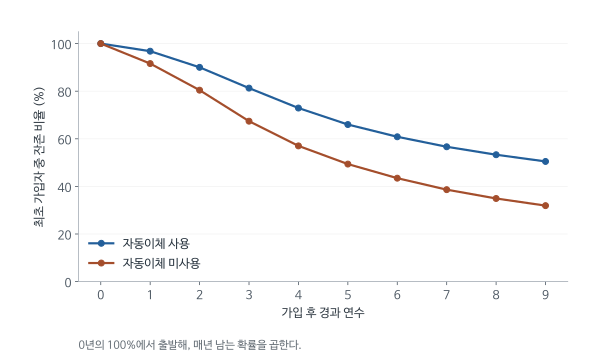

# Home Alarm LTV - 오래 남는 고객은 회사에 얼마나 더 가치가 있을까

Week 01 / 2026-09-02 / Session 1

[원문 PDF](<Case -- Homealarm LTV.pdf>) | [개념 퀴즈](<Case -- Homealarm LTV_QnA.md>) | [수식·모델 퀴즈](<Case -- Homealarm LTV_수식모델퀴즈.md>) | [실무 Cheat Sheet](<Case -- Homealarm LTV_실무CheatSheet.md>)

## 1. 자동이체를 권하는 데 얼마까지 써도 될까

Home Alarm은 미국에서 규모가 큰 비상장 보안 서비스 회사 가운데 하나다. 지난 10년 동안 빠르게 성장해 가정 고객과 사업장 고객을 합쳐 8만 명이 넘는 고객을 두었고, 침입 감지, 화재 감지, 출입 통제, 영상 감시를 제공한다. 고객은 서비스를 이용하는 동안 매달 요금을 낸다. 이런 구독형 사업에서는 한 번의 판매보다 고객이 몇 년 동안 서비스를 유지하는지가 수익을 좌우한다. 설치할 때 드는 비용을 회수하고 이후에도 매달 이익을 얻어야 하기 때문이다.

원문에 따르면 Home Alarm은 고객 서비스가 좋아 상장 경쟁사보다 이탈률(churn rate)이 이미 훨씬 낮았다. 그래도 마케팅 부사장 Kevin Starke와 CEO는 이탈을 더 줄일 방법이 있는지 알고 싶었고, UC Berkeley Haas 경영대학원 MBA 학생들의 수업 프로젝트에 회사 자료를 제공해 이탈 요인을 분석하게 했다. 사례는 5월 어느 오후 Kevin이 그 발표를 듣고 사무실로 돌아온 장면에서 시작한다.

이탈(churn)은 고객이 계약을 해지해 더 이상 요금을 내지 않는 것을 뜻한다. 학생들은 신용등급이 좋은 고객이 오래 남는다는 익숙한 결과와 함께, 가정 고객 가운데 자동이체 가입자의 해지가 적다는 결과를 제시했다. 자동이체는 계좌나 신용카드에서 월 요금이 자동으로 빠져나가는 방식이다. 비교 대상 고객은 월별 청구서를 받고 수표로 납부한다.

Kevin이 자동이체 결과에 주목한 이유는 회사가 대규모로 실행할 수 있는 조치이기 때문이다. 고객의 신용등급은 회사가 곧바로 바꿀 수 없지만, 영업사원에게 자동이체를 안내하도록 교육하거나 고객에게 가입 보상을 지급하는 방안은 실행할 수 있다. Kevin은 신규 가정 고객에게 자동이체를 강하게 권하는 방안에서 더 나아가 기존 고객을 자동이체로 전환하는 방안까지 떠올린다. 그런데 학생들은 자동이체 고객이 덜 이탈한다는 증거까지만 보였고, 그 차이가 금액으로 얼마인지는 계산하지 못했다. 원문은 Kevin의 질문을 "자동이체 고객은 그렇지 않은 고객보다 얼마나 더 수익성이 높은가"로 적는다. 이 답이 있어야 영업사원 보상과 고객 보상에 얼마까지 쓸 수 있는지 정할 수 있고, CEO에게 제안할 만큼 자동이체에 돈이 걸려 있는지도 판단할 수 있다.

두 집단의 과거 월매출은 약 30달러로 비슷했다. 한 달 매출만 비교하면 가치 차이가 거의 없어 보인다. 원문도 지적하듯 자동이체의 차이가 고객을 더 오래 붙잡아 두는 데 있다면 가치 차이는 시간이 지나야 드러난다. 같은 금액을 매달 내더라도 2년 만에 해지하는 고객과 8년 동안 남는 고객이 회사에 남기는 총이익은 다르다. 미래에 받을 이익까지 가입 시점의 가치로 환산한 금액을 고객생애가치(customer lifetime value), LTV라고 부른다. 원문은 LTV를 고객이 앞으로 회사에 남길 가치로 정의하면서 두 가지를 반영하라고 한다. 하나는 고객이 중간에 떠날 수 있다는 점이고, 다른 하나는 화폐의 시간가치 때문에 먼 미래의 이익이 가까운 미래의 같은 이익보다 회사에 덜 가치 있다는 점이다. 4절은 앞의 요소를, 5절은 뒤의 요소를 계산식에 넣는다.

아래 계산은 현재의 자동이체 고객과 미사용 고객이 앞으로 얼마나 다른 가치를 보일지 예측한다. 계산 순서는 실제 질문을 따른다. 몇 명이 계속 남는지 알아보고(2절), 남은 고객 한 명에게서 얻는 마진을 계산한 뒤(3절), 두 값을 곱해 연도별 기대이익을 만들고(4절), 미래의 이익을 현재가치(present value)로 바꿔 더한다(5절, 6절). 마지막에는 이 예측 차이를 자동이체 전환 정책의 효과로 써도 되는지 검토한다(7절, 8절).

LTV는 회사 관점에서 앞으로 받을 금액과 지출할 금액의 차이를 기간 전체에 걸쳐 합산한 값이다. 고객의 소득이나 월 결제액의 크기를 재는 지표와는 다르다. 월 요금이 같아도 해지 시점이 다르면 이익이 다르고, 오래 남아도 서비스 비용이 훨씬 크면 가치가 낮을 수 있다. 이 사례에서는 미래 요금과 비용 가정을 두 집단에 똑같이 적용하므로 가치 차이의 계산상 원천이 잔존확률 하나로 모인다.

설치 시점에는 회사가 먼저 큰 비용을 부담한다. 원문 기준으로 회사는 설치 요금 195달러를 받고 설치에 평균 492달러를 쓴다. 이 때문에 첫 달 요금만으로 고객 수익성을 판단하면 신규 고객 대부분이 손해처럼 보일 수 있다. 반대로 장기 매출만 더하고 설치비를 빼지 않으면 신규 고객 획득의 수익성을 과장한다. 기간을 명시하고 최초 비용과 이후 운영이익을 함께 놓아야 하는 이유다.

## 2. 9년 전 가입자 기록에서 미래의 잔존확률을 구한다

Kevin은 고객센터 관리자이자 사내 데이터베이스 전문가인 Mark Pohl에게 9년 전 6월 한 달 동안 가입한 고객 전체의 기록을 요청한다. 같은 달에 출발한 고객 집단을 코호트라고 부른다. 코호트를 따라가면 1년차, 2년차, 그 이후에 누가 해지했는지 최초 가입자 기준으로 복원할 수 있다. 현재 남아 있는 고객만 보면 이미 떠난 고객이 자료에서 빠지므로 이런 복원이 불가능하다.

원문의 요청 목록은 네 가지다. 자동이체 사용 여부별로 9년 전 6월에 서비스를 시작한 가정 고객 수, 그중 가입 1년 후부터 9년 후까지 각 시점에 남아 있던 고객 수, 전형적인 설치 요금과 설치 비용, 가입 초기 월 반복매출(RMR)의 평균이다. 원문은 사업환경이 꽤 안정적이므로 과거 고객의 기록이 앞으로의 이탈률을 잘 추정한다고 가정한다. 이 가정이 있어야 9년 전 코호트의 경험을 오늘 가입하는 고객의 예측에 쓸 수 있다.

| 서비스 연차 | 자동이체 미사용 | 자동이체 사용 |
|---|---:|---:|
| 1 | 8.4% | 3.2% |
| 2 | 12.2% | 7.0% |
| 3 | 16.2% | 9.7% |
| 4 | 15.4% | 10.3% |
| 5 | 13.4% | 9.5% |
| 6 | 12.0% | 7.8% |
| 7 | 11.1% | 6.9% |
| 8 | 9.6% | 5.9% |
| 9 | 8.6% | 5.3% |

원문 p.3. 이탈률은 해당 연차 시작까지 남은 고객 중 그해 이탈하는 비율로 사용한다. 2년차 이탈률 12.2%를 최초 가입자 전체에 그대로 적용하면 분모가 달라진다.

### 원문 이탈률 표를 읽는 법

위 표는 원문 PDF 3쪽에 있는 이 케이스의 유일한 표를 옮긴 것이다. 원문에는 Table 번호나 제목이 없고, Mark Pohl이 다음 날 일과가 끝날 무렵 전달한 자료로 소개된다. 원문 표의 마지막 행인 Initial RMR은 위 표에서 생략했으며 3절에서 따로 발췌한다. 이 표가 필요한 이유는 Kevin의 질문에 있다. 금액 차이를 구하려면 두 집단이 연차별로 얼마나 줄어드는지부터 알아야 한다.

행은 가입 후 서비스 연차이고, 원문 표기는 'first year of service'부터 'ninth year of service'까지다. 열은 납부 방식에 따른 두 집단으로, 원문 표기는 'Not on auto-pay'와 'On auto-pay'다. 칸의 값은 원문 열 제목 'Attrition rate during:'이 가리키듯 해당 연차 동안의 이탈률(%)이다. 원문은 이 비율의 분모를 명시하지 않는다. 이 문서는 Kevin이 1년차부터 9년차까지 각 연차의 이탈률 추정치를 얻으려 했다는 원문 설명에 따라, 그해 시작까지 남은 고객을 분모로 해석한다.

대표 수치를 보면 1년차 이탈률은 미사용 8.4%, 자동이체 3.2%로 5.2%포인트 차이가 난다. 비율로는 미사용 집단의 1년차 이탈률이 자동이체 집단의 약 2.6배다. 차이가 가장 큰 해는 3년차로, 16.2%와 9.7%의 차이는 6.5%포인트다. 이후 차이는 줄어들어 9년차에는 8.6%와 5.3%, 3.3%포인트가 된다. 9개 연차 모두에서 자동이체 집단의 이탈률이 낮다. 두 집단 모두 이탈률이 초반에 올라갔다가 내려가며, 정점은 미사용 집단이 3년차(16.2%), 자동이체 집단이 4년차(10.3%)다. 원문은 이탈률이 이런 모양을 보이는 이유를 설명하지 않으며, LTV 계산에는 각 연차의 값만 필요하다.

이 차이가 누적되면 격차가 커진다. 이어서 설명하는 곱셈식을 9년차까지 적용하면 최초 가입자 중 9년차 이탈까지 거친 뒤 남는 비율은 미사용 약 31.9%, 자동이체 약 50.5%다. 이 두 값은 원문 표에 없는 재계산 값이다. 연차별 차이는 3.3-6.5%포인트 수준이지만, 9년 뒤 잔존율은 약 18.6%포인트 벌어진다.

이 표로 말할 수 있는 것은 9년 전 6월에 가입한 코호트에서 자동이체 고객이 모든 연차에 걸쳐 덜 이탈했다는 관측 사실이다. 원문은 사업환경이 안정적이라는 이유로 이를 미래 이탈률의 추정치로 쓴다. 한편 Kevin은 연차별 잔존 고객 수를 요청했지만 전달된 표에는 비율만 있고 각 집단의 가입자 수가 없다. 그래서 표본 크기, 표준오차(standard error), 차이의 통계적 유의성을 판단할 수 없다. 신용등급 같은 다른 고객 특성을 통제하지 않은 단순 비교라는 점도 한계다. 자동이체로 전환하면 이탈률이 이만큼 내려간다는 인과적 결론은 이 표에서 나오지 않는다. 표 아래 본문은 두 집단을 가정(주거용) 고객으로 설명한다. 표에는 10년차 이후 이탈률이 없어 그 이후의 고객 유지 여부는 별도 가정이 필요하다.

첫해에 1,000명 중 84명이 해지했다면 916명이 남는다. 둘째 해에는 이 916명 중 12.2%가 해지한다. 이탈률을 연도별로 단순히 더하지 않고, 앞해까지 남은 비율에 올해 남는 비율을 곱하는 이유다.

이 계산을 여러 해에 적용하기 위해 집단을 $g\in\{N,A\}$로 표기한다. $N$은 미사용, $A$는 자동이체다. $q_{g,t}$는 $t$년차 조건부 이탈확률, 곧 $t$년차 시작까지 남은 고객이 그해 해지할 확률이다. $S_{g,t}$는 처음 가입한 고객이 $t$년차 이탈까지 통과해 남아 있을 확률이다.

$$
S_{g,0}=1,\qquad S_{g,t}=S_{g,t-1}(1-q_{g,t}).
$$

첫 식은 가입 시점에 모든 고객이 남아 있다는 출발점이다. 둘째 식은 $t$년차까지 남으려면 먼저 $t-1$년차까지 남고($S_{g,t-1}$), 그 상태에서 $t$년차에 해지하지 않아야 한다($1-q_{g,t}$)는 뜻이다. 앞해까지 생존해야 올해의 이탈위험을 겪는다. 이 점화식을 $t=1$부터 차례로 펼치면 조건부 확률의 곱셈 법칙에 따라

$$
S_{g,t}=\prod_{k=1}^{t}(1-q_{g,k})
$$

가 된다. 예를 들어 미사용 집단의 3년차 잔존확률은 $S_{N,3}=0.916\times0.878\times0.838\approx0.6740$이다. 이 곱셈은 연도별 이탈 사건이 서로 독립이라는 가정에서 나온 것이 아니다. 살아남았다는 조건 아래의 연차별 이탈확률을 연쇄적으로 곱한 것이며, 표의 비율이 그해 생존자를 분모로 계산되었다는 점만 필요하다.

### 첫 두 해를 손으로 계산

미사용 집단:

$$
S_{N,1}=1-0.084=0.916,
$$

$$
S_{N,2}=0.916(1-0.122)=0.916\times0.878=0.804248.
$$

자동이체 집단:

$$
S_{A,1}=0.968,\qquad S_{A,2}=0.968\times0.930=0.900240.
$$

처음 고객 1,000명이면 2년차까지 남는 예상 고객은 약 804명과 900명이다. 자동이체 집단은 동일한 최초 가입자 수에서 약 96명이 더 남는다. 각 고객의 연간 마진이 같더라도 이 잔존 고객 수의 차이가 미래 이익의 차이를 만든다. 9년차까지의 전체 잔존확률은 6절의 연도별 계산표에 정리했다.

원문 이탈률 표의 목적은 같은 시기에 출발한 고객이 해마다 얼마나 줄었는지 복원하는 데 있다. 연차마다 비율의 분모가 되는 고객이 다르다. 1년차 비율은 그달 가입자 전체를, 9년차 비율은 8년을 유지한 고객만을 분모로 한다. 후반으로 갈수록 장기 이용에 적합한 고객이 이미 선별되어 남았을 수 있으므로, 연차별 이탈률이 내려간다고 같은 고객의 충성도가 저절로 올라갔다고 해석할 수 없다.

연도별 이탈률은 달력상의 경기 변화와도 구별한다. 표의 3년차는 계약을 시작한 뒤 세 번째 해이다. 이 사례의 과거 고객은 같은 달에 가입했으므로 그들에게는 같은 달력 기간이지만, 앞으로 가입할 고객의 3년차는 다른 달력 기간에 해당한다. 여기서는 과거 코호트의 연차별 경험을 새 고객에게 적용한다. 요금제나 경쟁 환경이 크게 달라졌다면 그 예측 가정부터 다시 검토해야 하며, 곱셈을 정확히 했다고 과거 자료의 적용 가능성이 보장되지는 않는다.

### 연차별 해지율의 분모가 바뀐다는 뜻

$h_t$를 $t$년차 시작까지 계약을 유지한 고객 중 그해 해지하는 비율이라고 하자. 앞의 $q_{g,t}$에서 집단 첨자 $g$를 뺀 같은 양이며, 이 소절과 6절의 민감도 식은 이 기호를 쓴다. 이 비율은 최초 가입자 전체 중 해지한 비율과 다르다. 설명을 위한 가상 코호트 100명에서 첫해 해지율이 10%, 둘째 해가 20%라면 첫해에 10명이 나가고, 둘째 해에는 남은 90명의 20%인 18명이 나간다. 2년차 잔존자는 72명이다.

$$
\begin{aligned}
S_1&=1-h_1=0.9,\\
S_2&=P(\text{1년차 잔존})\,
P(\text{2년차 잔존}\mid\text{1년차 잔존})\\
&=S_1(1-h_2)=0.9\times0.8=0.72.
\end{aligned}
$$

두 해의 해지율을 그냥 더한 $1-0.1-0.2=0.7$은 2년차 비율의 분모를 100명으로 잘못 바꾼 계산이다. 이 방식은 첫해에 이미 떠난 10명에게 둘째 해 해지 위험을 한 번 더 적용한다. 반면 '첫해 최초 고객의 10%, 둘째 해 최초 고객의 18%가 나갔다'고 보고된 자료라면 $1-0.1-0.18=0.72$로 빼는 것이 맞다. 곱셈 공식을 적용하기 전에 표가 어떤 분모로 작성되었는지 먼저 확인해야 한다.

앞에서 말했듯 이 곱은 조건부확률의 곱셈법칙에서 나온다. 오래 남은 고객들의 성향이 달라져 연차별 $h_t$가 바뀌어도 그해 생존자를 분모로 계산했다면 같은 식을 쓴다. 실제 케이스에서는 표에 주어진 각 연차의 비율을 차례로 적용한다.

<!-- learning-figure:ltv-survival -->

*그림 설명: 원문 이탈률 표를 본문의 곱셈식으로 재계산했다. 두 집단의 관측 차이이며 자동이체의 인과효과 추정치는 아니다.*

세로축의 분모는 매년 남은 고객이 아니라 최초 가입자다. 미사용 집단의 2년차 잔존율은 약 80.4%다. 첫해에 남은 91.6%에 둘째 해 잔존확률 87.8%를 곱한 위치를 선 위에서 확인할 수 있다.

<!-- /learning-figure -->

## 3. 요금 40달러 중 회사에 남는 금액을 계산한다

2절에서 몇 명이 남는지를 구했으니, 이제 남은 고객 한 명이 한 해에 회사에 얼마를 남기는지 구한다. LTV에는 고객이 내는 요금 전액 대신 서비스를 제공하는 비용을 뺀 마진을 사용한다. 요금이 들어올 때마다 서비스비도 함께 발생하므로, 매출만 더하면 회사가 얻는 가치를 과대평가한다.

과거 첫 월 매출은 미사용 \$30.63, 자동이체 \$30.14였다. 하지만 케이스가 향후 계산에 지정한 월 매출은 두 집단 모두 \$40이다. 원문에 따르면 전반적인 요금 인상으로 다음 해 고객 평균 RMR이 40달러가 될 예정이었다. 과거 매출을 그대로 넣으면 원문 가정과 달라진다.

과거 매출 수치는 원문 p.3 이탈률 표의 마지막 행에 있다. 앞의 이탈률 행과 단위가 다르므로 그 행만 따로 발췌한다.

| 원문 p.3 표 발췌 | 자동이체 미사용 | 자동이체 사용 |
|---|---:|---:|
| Initial RMR | \$30.63 | \$30.14 |

*발췌: 원문 PDF 3쪽 이탈률 표(번호 없음)의 마지막 행. 이탈률 행 9개는 2절 표에 있다.*

RMR은 recurring monthly revenue, 곧 고객 한 명이 매달 반복해서 내는 요금이다. 원문 요청 목록의 표현은 가입 초기 월 반복매출의 평균이며, 단위는 고객 한 명당 한 달 달러다. 연간 금액이나 비율로 읽으면 안 된다. 두 집단의 차이는 \$0.49로, 미사용 집단이 오히려 조금 높다. Kevin은 두 값이 약 \$30으로 비슷하므로 두 집단에 같은 RMR을 가정해도 된다고 판단했다. LTV 차이가 월 요금이 아닌 이탈률에서 나온다는 1절의 설명은 이 행에 근거한다. 이 행은 가입 당시의 평균만 보여 주므로, 가입 후 몇 년이 지난 뒤 두 집단의 요금 수준은 알 수 없다. 표준편차나 가입자 수도 없어 \$0.49 차이가 우연인지 판단할 수 없다. 계산에 쓰는 \$40은 요금 인상을 반영한 다음 해 평균 RMR로, 표 밖 본문에서 주어진 가정이다.

1년차 매출:

$$
R_1=12\times40=480.
$$

서비스 변동비는 매출의 15%, 기존 고객 마케팅비는 5%다. 원문은 두 비용을 월 금액으로도 적는다. 서비스 변동비는 월 6달러(40달러의 15%)이고 첫 1년에 72달러다. 마케팅비는 월 2달러(40달러의 5%)이고 첫 1년에 24달러다. 이 마케팅비는 이미 가입한 고객에게 쓰는 비용이며, 원문은 가입 시점에는 마케팅비를 배정하지 않는다고 명시한다. 6절의 가입 시점 현금흐름에 설치 요금과 설치 비용만 들어가는 이유다.

$$
C_1=0.15\times480=72,\qquad M_1=0.05\times480=24.
$$

따라서 생존 고객 한 명의 1년차 마진은

$$
m_1=480-72-24=384.
$$

이며, 매출의 80%(1-0.15-0.05)에 해당한다. 원문은 요금이 이후 매년 3%씩 오르고, 서비스비와 마케팅비도 같은 요금 인상 때문에 매년 3%씩 오른다고 가정한다. 세 항목이 같은 비율로 오르므로 마진도 연 3%씩 늘고 마진율은 모든 해에 80%로 유지된다.

$$
m_t=384(1.03)^{t-1}.
$$

지수는 $t-1$이다. $t=1$을 넣었을 때 384가 그대로 나와야 하므로 첫해부터 3%를 한 번 더 올리지 않는다. 이 식으로 2년차 마진은 $384\times1.03=395.52$달러, 9년차 마진은 $384\times1.03^8\approx486.44$달러다.

비용 비율에도 분모가 있다. 이 사례의 서비스비 15%와 기존 고객 마케팅비 5%는 매출에 적용한다. 이미 비용을 뺀 이익에 다시 같은 비율을 적용하면 다른 가정이 된다. 계산표를 만들 때 매출, 서비스비, 마케팅비, 마진을 별도 열로 두면 어떤 금액에 비율을 곱했는지, 각 비용이 어느 현금흐름에서 나왔는지 확인하기 쉽다. 원문은 고정비를 언급하지 않는다. 이 계산의 마진은 고객 한 명의 유지 여부에 따라 늘거나 줄어드는 비용만 뺀 값이다.

## 4. 왜 마진에 생존확률을 곱하는가

2절의 잔존확률은 최초 가입자 한 명이 $t$년차에 남아 있을 확률이고, 3절의 마진은 남아 있는 고객 한 명이 그해 내는 금액이다. 두 값의 분모가 다르므로 최초 가입자 한 명 기준의 금액으로 맞춰야 한다. 처음 가입한 고객이 $t$년차에 기여하는 마진을 $V_{g,t}$라 하자. 생존하면 $m_t$, 이탈했으면 0이다. 따라서

$$
E[V_{g,t}]=S_{g,t}m_t+(1-S_{g,t})\times0=S_{g,t}m_t.
$$

원문은 그해 이탈 고객이 모두 연초에 나간다고 가정한다. 그래서 $t$년차 이탈을 이미 반영한 $S_{g,t}$를 쓴다. 연말에 이탈하는 가정이라면 그해 마진에는 $S_{g,t-1}$를 써야 한다. 어느 표기를 선택하든 현금흐름 시점과 맞아야 한다.

기대마진 $S_{g,t}m_t$는 처음 계약한 고객을 많이 모았을 때 그 연도에 얻는 평균 기여액이다. 한 고객이 소수점만큼 살아남는다는 뜻으로 읽을 필요는 없다. 미사용 집단의 1년차를 예로 들면, 최초 고객 1,000명 중 916명이 384달러씩 내고 84명은 0을 내므로 총액은 351,744달러이고 최초 고객 한 명당 351.74달러가 된다. 이 값이 $0.916\times384$와 같다. 잔존 고객 한 명당 마진(384달러)과 최초 고객 한 명당 기대마진(351.74달러)은 분모가 다른 금액이다.

Kevin은 연초 이탈 가정을 보수적인 선택이라고 설명한다. 현실에서 고객이 반년 이용한 뒤 해지했다면 회사는 그해에도 일부 요금을 받는다. 연초 이탈 가정은 그 부분을 0으로 두므로 LTV 수준을 낮게 잡는다. 이 가정이 금액을 얼마나 바꾸는지 보기 위해 반대쪽 끝인 연말 이탈, 곧 그해 이탈자도 1년치 마진을 모두 낸다는 가정으로 같은 계산을 해 보았다. 원문에 없는 교육용 보충 계산이며 할인 방식 등 나머지 가정은 5절, 6절과 같다. 이 경우 운영마진 현재가치는 미사용 약 \$1,624.29, 자동이체 약 \$1,913.46으로 연초 이탈 가정보다 각각 약 197달러와 139달러 높다. 그런데 두 집단의 차이는 약 \$289.17로 연초 이탈 가정의 \$347.11보다 작다. 연말 이탈에서는 이탈률 차이가 한 해 늦게 금액에 반영되기 때문이다. 연초 이탈 가정은 각 집단의 LTV 수준에 대해서는 보수적이지만, 두 집단의 차이를 작게 잡는 가정은 아니다.

다른 분석가가 월별 이탈을 적용해 다른 값을 얻었다면, 수치를 대조하기 전에 각 계산이 어느 시점까지 서비스비와 요금을 인정했는지부터 확인한다.

## 5. 5년 뒤 받을 돈을 지금 받는 돈과 비교하려면

4절의 기대마진은 해마다 다른 시점에 들어오는 돈이다. 회사는 자동이체 가입을 권유하는 비용을 지금 지출하고, 고객이 남아서 내는 요금은 나중에 받는다. 두 시점의 돈을 비교하려면 미래 금액을 현재 시점의 가치로 환산해야 한다. 예를 들어 현재 100달러를 연 10%로 운용하면 1년 뒤 110달러가 된다. 같은 기준에서 1년 뒤 받을 110달러의 현재가치는 100달러다. 미래 금액을 1.10으로 나누는 계산이 여기서 나온다.

원문은 Home Alarm이 관행적으로 써 온 연 10%의 할인율을 사용한다. 2년 뒤 금액은 1.10을 두 번, $t$년 뒤 금액은 $t$번 나눈다. 앞에서 구한 연도별 기대마진에 적용하면

$$
PV_{g,t}=\frac{S_{g,t}\,384(1.03)^{t-1}}{(1.10)^t}.
$$

분자의 생존확률은 그해에 요금을 낼 고객이 남아 있을지를 반영한다. 분모의 할인계수는 남아 있는 고객에게서 돈을 받더라도 그 수취 시점이 늦다는 점을 반영한다. 고객 이탈이 전혀 없어도 미래 돈은 할인하고, 할인율이 0이어도 해지한 고객에게서는 마진을 얻지 못한다. 할인계수 $1/1.10^t$는 1년차에 약 0.909, 9년차에 약 0.424다. 9년차 말에 받는 1달러는 가입 시점 기준으로 약 42센트의 가치다.

원문은 할인율만 지정하고, 한 해의 마진이 연중 어느 시점에 들어온다고 볼지는 정하지 않는다. 이 문서는 $t$년차 마진 전체를 $t$년차 말에 받는 것으로 보고 1.10으로 $t$번 나눈다(연말 할인). 가입 시점의 설치 현금흐름은 0시점에 발생하므로 할인하지 않는다. 교육용 보충으로 $t$년차 마진을 그해 초에 받는다고 보면 모든 연도의 할인 횟수가 하나씩 줄어, 운영마진 현재가치가 정확히 1.1배가 된다. 미사용 약 \$1,570.48, 자동이체 약 \$1,952.31, 차이 약 \$381.83이다. 같은 원문 가정에서도 시점 규약에 따라 금액이 이만큼 달라지므로, 다른 풀이와 값을 비교할 때는 이탈 시점과 할인 시점의 규약부터 맞춰야 한다.

첫해 미사용 집단:

$$
PV_{N,1}=\frac{0.916\times384}{1.10}=319.77.
$$

둘째 해 미사용 집단:

$$
PV_{N,2}=\frac{0.804248\times395.52}{1.10^2}=262.89.
$$

각 연도의 값을 반올림하지 않은 채 합산한 후 최종 금액을 반올림한다.

성장률 3%와 할인율 10%는 서로 다른 일을 한다. 성장률은 나중에 받을 명목 마진을 크게 만들고, 할인율은 그 돈을 현재 금액으로 환산할 때 낮춘다. 두 효과만 합쳐도 생존 고객 한 명의 마진 현재가치는 해마다 약 6.4%씩 줄어든다($1.03/1.10\approx0.936$). 여기에 생존확률까지 해마다 낮아진다. 그래서 요금이 매년 올라가도 먼 미래의 기대 현재가치는 계속 작아진다. 이 세 요소가 연도별 기여액을 함께 결정한다.

할인율을 높이면 특히 먼 미래의 이익이 더 크게 줄어든다. 오래 남는 자동이체 고객의 장점 중 많은 부분이 먼 미래에 있으므로, 회사가 미래 현금흐름을 평가하는 기준에 따라 두 집단의 가치 차이도 달라진다. 제시된 10%는 이 사례의 계산 가정이다. 다른 할인율을 쓰는 민감도 분석은 예측의 조건을 살펴보는 일이며 자동이체의 인과효과를 검증하는 절차와는 다르다.

## 6. 연도별 이익을 합하고 설치비를 포함한다

이제 각 연도의 기대마진을 가입 시점의 달러로 환산했으므로 서로 더할 수 있다. 제공된 이탈률은 9년차까지이므로 우선 그 기간의 운영마진을 합한다. 합 기호 $\sum_{t=1}^{9}$는 앞서 계산한 1년차부터 9년차까지의 현재가치를 모두 더하라는 뜻이다.

$$
LTV_g^{\mathrm{운영}}=\sum_{t=1}^{9}PV_{g,t}.
$$

아래 표는 5절의 식을 1년차부터 9년차까지 적용한 결과다. 원문에는 없는 이 문서의 재계산이며, 각 값은 반올림 전 값으로 계산한 뒤 표시할 때만 반올림했으므로 열을 직접 더하면 끝자리가 조금 다를 수 있다. 금액 단위는 달러다.

| 연차 | 생존 고객 마진 | 할인계수 | 미사용 잔존확률 | 미사용 PV | 자동이체 잔존확률 | 자동이체 PV | PV 차이 |
|---:|---:|---:|---:|---:|---:|---:|---:|
| 1 | 384.00 | 0.9091 | 0.9160 | 319.77 | 0.9680 | 337.92 | 18.15 |
| 2 | 395.52 | 0.8264 | 0.8042 | 262.89 | 0.9002 | 294.27 | 31.38 |
| 3 | 407.39 | 0.7513 | 0.6740 | 206.28 | 0.8129 | 248.81 | 42.53 |
| 4 | 419.61 | 0.6830 | 0.5702 | 163.41 | 0.7292 | 208.98 | 45.57 |
| 5 | 432.20 | 0.6209 | 0.4938 | 132.51 | 0.6599 | 177.09 | 44.59 |
| 6 | 445.16 | 0.5645 | 0.4345 | 109.19 | 0.6084 | 152.89 | 43.70 |
| 7 | 458.52 | 0.5132 | 0.3863 | 90.89 | 0.5665 | 133.28 | 42.39 |
| 8 | 472.27 | 0.4665 | 0.3492 | 76.94 | 0.5330 | 117.44 | 40.50 |
| 9 | 486.44 | 0.4241 | 0.3192 | 65.84 | 0.5048 | 104.14 | 38.29 |
| 합계 | | | | 1,427.71 | | 1,774.82 | 347.11 |

두 집단의 PV는 모두 1년차가 가장 크고 해마다 줄어든다. PV 차이 열은 다르게 움직인다. 1년차 18.15달러에서 4년차 45.57달러까지 커졌다가 천천히 줄어든다. 자동이체 집단의 잔존 우위는 해마다 누적되어 커지고(2절), 할인은 먼 미래의 금액을 줄인다(5절). 초반에는 앞의 힘이, 후반에는 뒤의 힘이 더 크게 작용한 결과다. 347.11달러 가운데 첫 2년에 생기는 몫은 49.53달러로 약 14%이고, 나머지 약 86%는 3년차 이후에 생긴다.

가입 시점의 설치 순현금흐름까지 포함하면

$$
LTV_g^{\mathrm{신규}}=(195-492)+LTV_g^{\mathrm{운영}}
=-297+LTV_g^{\mathrm{운영}}.
$$

Kevin은 두 집단별 설치 요금과 설치 비용을 요청했지만, 원문이 주는 값은 집단 구분 없는 전형적 수치 하나다. Kevin도 "LTV 계산에 필요하다면" 쓰겠다고 적어, 설치비를 LTV에 넣을지를 판단의 대상으로 남긴다. 아래 표가 두 정의를 함께 보여 주는 이유다.

| 9년 절단, 연초 이탈, 연말 할인 | 미사용 | 자동이체 | 차이 |
|---|---:|---:|---:|
| 미래 운영마진 현재가치 | \$1,427.71 | \$1,774.82 | \$347.11 |
| 설치 순현금흐름 포함 | \$1,130.71 | \$1,477.82 | \$347.11 |

두 집단에 같은 설치비가 들어가므로 차이는 같다. 이전 주차별 통합 요약에 적었던 약 \$1,428과 \$1,775는 운영마진 기준이다. 설치비 포함 신규 고객 LTV와 혼용하지 않아야 한다. 설치 순비용 297달러는 미사용 집단의 1년차 운영마진 현재가치 319.77달러보다 작다. 이 가정 아래서는 두 집단 모두 기대값 기준으로 첫해 안에 설치 손실을 회수한다.

9년 후 생존 고객이 있으므로 위 값은 무한기간 LTV가 아니다. 장기 이탈률이나 종료가치를 가정하지 않고 관측된 9년 자료까지만 사용했다. 9년 이후 가치를 0으로 둔 것은 자료가 제공하는 범위 안에서만 금액을 계산하기 위한 선택이며, 9년 뒤 모든 고객이 해지한다는 가정과는 다르다. 9년 뒤에도 최초 가입자 중 미사용 약 32%, 자동이체 약 50%가 남아 있다. 이후에도 양의 마진이 지속된다는 별도 가정을 두면 전체 값은 더 커진다. 10년차 이후에도 자동이체 집단의 이탈률이 미사용 집단과 같거나 낮다면, 절단으로 빠진 가치는 남은 고객이 많은 자동이체 집단에서 더 크고 347.11달러는 차이를 작게 잡은 값이 된다. 그 크기는 10년차 이후의 이탈과 비용을 알아야 정할 수 있다.

설치비가 양쪽에서 똑같이 빠져 차이가 유지된다고 해서 그 비용을 무시해도 되는 것은 아니다. 자동이체 전환 방안을 비교할 때는 공통비가 상쇄되지만, 새 고객을 확보하는 사업 자체가 이익인지 판단할 때는 설치비를 포함한 수준을 보아야 한다. '어느 값이 맞는가'에 답하려면 먼저 전체 고객 수익성을 묻는지, 두 정책의 차이만 묻는지 구분한다.

연차별 계산표를 검토할 때에는 먼저 확률의 출발점과 금액의 기준시점을 확인하면 된다. 최초 고객의 잔존확률은 1에서 시작하고, 마진은 남은 고객 한 명이 한 해에 내는 값이며, 현재가치는 가입 시점의 금액이다. 이 세 기준이 섞이면 숫자는 그럴듯해도 다른 대상을 계산하게 된다. 예를 들어 생존 고객당 마진에 다시 해지 전 고객 수를 적용하면 그해 이미 떠난 고객에게 수익을 부여할 수 있다.

이 계산은 평균적인 미래를 예측하므로 개별 고객의 실제 수익과 일치할 필요는 없다. 어떤 고객은 첫해 해지하고 어떤 고객은 9년 이후에도 남는다. 실제 운영에서 예측을 평가하려면 비슷한 조건의 새 가입자들을 추적해 예측한 집단 평균과 실현된 평균 현금흐름을 비교한다. 이는 예측모형의 점검이며 납부 방식 변경의 인과적 평가와는 다른 검증이다.

### 해지율을 낮추는 가치가 왜 뒤의 여러 해에 남는가

위 표에서 PV 차이가 1년차에 끝나지 않고 9년 내내 이어진 이유를 식으로 확인한다. 가입 시점 순비용을 $K$(이 사례에서는 297달러), 그해 생존 고객의 연간 마진을 $m_t$, 할인율을 $r$라고 쓰면 이 사례의 계산은 $LTV=-K+\sum_{t=1}^{9}m_tS_t/(1+r)^t$다. 3년차 이탈률을 조금 낮추면 3년차 이익만 늘어나는 것처럼 보일 수 있다. 실제로는 추가로 남은 고객 일부가 4년차와 그 이후에도 요금을 낸다. 다른 연차의 조건부 해지율과 마진은 그대로라고 가정하면

$$
S_t=\prod_{j=1}^{t}(1-h_j),\qquad
\frac{\partial S_t}{\partial h_k}=
\begin{cases}
0,&t<k,\\
-S_t/(1-h_k),&t\ge k.
\end{cases}
$$

$t<k$이면 $S_t$의 곱에 $h_k$가 들어 있지 않으므로 미분값이 0이다. $t\ge k$이면 곱에서 $h_k$가 들어 있는 한 항 $(1-h_k)$만 미분해 $-1$이 되고, 나머지 잔존확률의 곱이 남는다. 그 나머지 곱이 $S_t/(1-h_k)$다. $h_k<1$에서 이를 LTV에 대입하면

$$
\frac{\partial LTV}{\partial h_k}
=-\sum_{t=k}^{9}\frac{m_tS_t}{(1+r)^t(1-h_k)}.
$$

합이 $t=k$에서 시작해 9년차까지 이어지는 점이 이 소절의 제목에 대한 답이다. $k$년차 해지율 하나가 $k$년차부터 9년차까지의 모든 잔존확률에 곱해져 있기 때문이다. 해지율이 1%포인트 낮아질 때의 가치 변화는 이 미분값에 $-0.01$을 곱해 근사한다. $S_t/(1-h_k)$에는 $h_k$가 들어 있지 않아 $S_t$가 $h_k$의 일차식이므로, 다른 연차를 고정하고 한 해의 해지율만 바꾸면 이 근사는 정확한 변화량과 같다. 마진이 양수이면 가치가 증가하고, 뒤에 받을 마진이 많을수록 증가폭도 커진다.

교육용 보충으로 미사용 집단의 값을 넣어 보면, 1년차 해지율을 8.4%에서 7.4%로 1%포인트 낮출 때 운영마진 현재가치는 약 15.59달러 늘어난다. 같은 1%포인트를 3년차에서 낮추면 약 10.08달러, 5년차에서는 약 5.49달러, 9년차에서는 약 0.72달러다. 이른 연차의 해지율일수록 그 뒤의 더 많은 해에 영향을 주고, 늦은 연차의 이익은 할인과 이미 줄어든 잔존 고객 때문에 작기 때문이다.

이 식은 원문 자료로 얻은 정책효과가 아닌 민감도 해설이다. 자동이체 권유가 정말로 $h_k$를 낮추는지, 추가로 남은 고객의 미래 해지율이 기존 생존자와 같은지는 별도 증거가 필요하다. 어느 해의 해지율을 낮추면 가치가 큰지 계산하는 일과, 어느 정책이 그 변화를 만드는지 알아내는 일은 서로 다른 단계다.

## 7. 가치 차이 347달러가 자동이체 가입 보상의 예산인가

계산을 마친 Kevin은 347달러보다 적은 돈을 써서 고객을 자동이체로 전환하면 이익이라고 생각할 수 있다. 여기서 확인해야 할 것은 자동이체를 가입시키는 행동이 실제로 그 가치 차이를 만들어 내는지다. 원래 자동이체를 선택한 고객은 신용상태가 좋거나 서비스를 오래 이용할 계획이었을 수 있다. 학생들의 분석에서도 신용등급이 좋은 고객이 오래 남는다는 결과가 함께 나왔다. 그런 성향 때문에 오래 남았다면 납부 방식만 바꿔도 같은 이익이 생긴다고 기대하기 어렵다.

이 문제를 식으로 나누어 보기 위해 $D_i$를 고객 $i$의 자동이체 여부(사용 1, 미사용 0)로 둔다. $L_i(1)$과 $L_i(0)$은 같은 고객 $i$가 자동이체를 쓰는 경우와 쓰지 않는 경우에 회사에 남길 가치다. 한 고객에게서 둘 중 하나만 관측되므로 이런 값을 잠재결과(potential outcome)라고 부른다. 관측되는 평균 차이는 다음처럼 분해된다.

$$
\begin{aligned}
E[L\mid D=1]-E[L\mid D=0]
&=E[L(1)-L(0)\mid D=1]\\
&\quad+E[L(0)\mid D=1]-E[L(0)\mid D=0].
\end{aligned}
$$

왼쪽은 현재 자동이체 고객과 미사용 고객의 평균 가치 차이이며, 6절의 347.11달러가 원문 자료로 계산한 이 값이다. 오른쪽은 $E[L(0)\mid D=1]$을 한 번 빼고 한 번 더해 얻은 항등식이다. 첫 번째 줄의 오른쪽 항은 현재 자동이체 고객이 자동이체를 사용하는 상태와 사용하지 않는 상태의 가치 차이, 곧 자동이체를 쓰는 고객에게서 나타나는 평균 효과다. 두 번째 줄은 그들이 자동이체를 쓰지 않았더라도 미사용 고객보다 얼마나 더 가치 있었을지를 나타낸다. 두 번째 줄을 선택편향(selection bias)이라고 부른다. $E[L(0)\mid D=1]$은 관측할 수 없으므로 원문 자료만으로는 두 항을 나눌 수 없다. 관측자료의 평균 차이에는 두 항이 모두 들어 있으므로 347달러 전부를 가입 권유의 수익으로 계산할 수는 없다. 설명을 위한 가상 수치로 두 번째 줄이 200달러라면 자동이체 자체의 효과는 147달러이고, 보상 예산의 상한도 그만큼 낮아진다. 원문 자료로는 두 항의 실제 크기를 알 수 없다. 보상 때문에 새로 가입할 고객의 반응을 알아보려면 별도의 실험이 필요하다.

첫 번째 줄의 효과조차 정책 대상에게 그대로 옮겨지지 않을 수 있다. 관찰된 자동이체 집단에는 이미 장기 이용을 예상해 그 방식을 고른 고객이 많을 수 있다. 보상 때문에 새로 가입할 사람은 그 집단의 평균 고객과 다르다. 예컨대 이사를 앞둔 고객은 보상은 받지만 예정대로 서비스를 끝낼 수 있다. 반대로 매달 청구서를 보면서 해지를 고민하던 고객에게는 납부 방식 자체가 행동을 바꿀 수도 있다. 원문 표는 이 두 경로를 따로 보여 주지 않는다.

Kevin이 함께 떠올린 기존 고객 전환에는 또 다른 문제가 있다. 이 문서의 LTV는 가입 시점에서 앞을 내다본 값이다. 이미 3년을 이용한 고객이라면 앞으로의 가치는 4년차 이후의 이탈률과 마진으로 계산해야 하고, 설치비는 이미 지출된 비용이다. 따라서 347.11달러를 기존 고객 한 명을 전환할 때의 가치로 그대로 쓸 수 없다.

회사가 지급하는 보상은 새로 전환한 고객뿐 아니라 보상 없이도 가입했을 고객에게 갈 수도 있다. 설령 전환 자체가 긍정적 효과를 내더라도 보상 정책의 순이익은 전환 효과, 추가 전환 비율, 전체 지급 비용에 달려 있다. 그래서 LTV 차이를 확인한 뒤에도 정책을 실제로 배정해 보는 후속 사례가 필요하다. 예측 결과가 실험의 가설과 예산 검토를 도울 수는 있지만 그 실험 결과를 대신하지는 못한다.

## 8. 다음 케이스의 \$40과 계산값을 구별하기

앞의 가정으로 첫 두 해 운영마진 현재가치의 차이를 계산하면

$$
(337.92+294.27)-(319.77+262.89)=49.53
$$

달러다. 6절 표의 1년차 차이 18.15달러와 2년차 차이 31.38달러를 더한 값과 같다. 표시 수치는 반올림되어 있고 정확 계산은 코드에 있다. 후속 Testing 케이스는 \$40 인센티브를 별도로 제시한다. 두 파일의 수치가 정확히 일치한다고 주장하면 안 된다. \$40은 후속 케이스의 제안 금액이며, 여기서의 \$49.53은 이 문서가 명시한 가정(연초 이탈, 연말 할인, 월 40달러에서 시작하는 요금과 비용)에 따른 재현값이다. 이탈 시점이나 할인 규약을 바꾸면 첫 두 해 차이도 달라진다.

측정 기간이 1년인 실험이라면 9년 LTV를 직접 관측할 수 없다. 6절 표에서 1년차에 생기는 PV 차이는 18.15달러로 전체 347.11달러의 약 5%다. 첫해 이탈과 마진을 측정한 뒤 장기 효과를 예측하려면, 첫해에 관측한 이탈률 차이가 이후 연차에도 이어진다는 지속성 가정을 공개해야 한다.

가입 보상 규모를 검토할 때 계산의 평균 대상도 확인해야 한다. 현재 자동이체 고객의 평균가치는 그 집단에 속한 고객들의 예상 현금흐름이다. 현재 미사용 고객에게 새 제안을 보냈을 때의 평균 추가이익은 제안을 거절한 고객과 이미 가입하려던 고객까지 포함한 정책 결과다. 앞의 높은 가치 집단 평균을 뒤의 정책 대상 한 명당 이익으로 바로 옮길 수 없는 이유가 여기에 있다.

회사가 추가로 수집하면 도움이 되는 자료도 이 구별에서 나온다. 가입 권유 이전 고객 특성, 어떤 안내나 보상을 제시했는지, 실제 납부방식, 해지와 연체, 서비스 비용을 함께 기록하면 정책이 어디에서 성과를 냈는지 살필 수 있다. 다만 기록을 더 많이 모았다는 사실만으로 자기선택이 해결되지는 않는다. 비교 가능한 방식으로 권유를 배정하는 설계가 필요하다. LTV 표는 그런 실험의 결과를 장기 가치로 해석할 계산 틀을 제공한다.

## 9. CEO에게 보고할 계산 결과와 다음 결정

원문은 Kevin이 CEO와 회의를 잡아 두었고 그 전에 LTV 계산을 마쳐야 한다는 장면으로 끝난다. 제시된 이탈률과 비용을 사용하면 9년간 자동이체 고객의 운영마진 현재가치는 약 1,774.82달러, 미사용 고객은 약 1,427.71달러다. 가입 시점 설치 순비용 297달러를 포함하면 각각 약 1,477.82달러와 1,130.71달러가 된다. 두 집단의 차이는 어느 정의에서나 약 347.11달러다. 월매출이 거의 같은 두 집단 사이에서 이 차이는 전부 잔존확률의 차이에서 나왔고, 그 대부분은 3년차 이후에 생긴다.

이 차이는 자동이체를 장려할 방안을 시험해 볼 이유가 된다. 곧바로 고객 한 명당 347달러를 보상해도 된다는 결론까지 주지는 않는다. 347.11달러는 현재 두 집단의 관측 차이이고, 그 안에는 자동이체 자체의 효과와 원래 오래 남을 고객이 자동이체를 고른 선택의 몫이 섞여 있기 때문이다. CEO에게는 계산의 근거인 연차별 이탈률, 향후 요금 40달러, 비용 비율, 연초 이탈과 9년 종료 가정을 설명하고, 가입 권유가 실제로 잔존율과 이익을 개선하는지는 다음 실험에서 확인하자고 제안할 수 있다. 뒤의 Homealarm Testing은 바로 이 결정을 어떻게 평가할지 다루는 후속 사례다.

## 출처와 추가 해설의 범위

PDF 3쪽 전체를 읽고 p.3 이탈률 표를 이미지와 대조했다. 원문은 Kellogg School of Management(Northwestern University)의 Florian Zettelmeyer가 2013년에 작성한 수업 토론용 사례이며, 원문 표지에 따르면 이름과 자료는 기밀 보호를 위해 변형되었다. 원문은 계산에 필요한 가정을 제공하지만 LTV 정답을 제시하지 않는다. 본문의 값은 9년까지 계산하고 이후 잔존가치를 0으로 두는 재현 계산이다. 원문에는 별도 Preparation questions 목록이 없고 마지막 문단에서 CEO 보고를 위한 계산을 요구한다.

계산 코드와 연도별 결과는 `documents/검증/verify_learning_examples.py` 및 같은 이름의 JSON에 보관했다.

2026-09-28 보강: PDF 3쪽 텍스트를 다시 대조해 회사 배경, Kevin의 자료 요청 목록, 월 비용 금액, 가입 시점 마케팅비 부재, 설치비의 "필요하다면" 단서를 본문에 반영했다. 9년 연도별 잔존확률, 마진, 할인계수, PV 계산표(6절)와 연차별 PV 차이의 해석을 새로 넣었다. 연말 이탈 가정과 연초 할인 규약의 교육용 민감도 계산(4절, 5절), 해지율 1%포인트 인하의 연차별 가치(6절 소절), 잠재결과 기호 정의와 기존 고객 전환의 기준시점 문제(7절)를 추가했다. 추가 계산은 모두 Python으로 재현했으며, 기존 표시수식과 표 행은 바꾸지 않고 문체를 교정했다.
