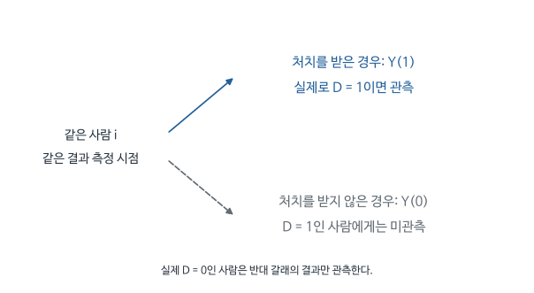

# MHE Ch.2 - 두 집단의 차이를 처치의 효과로 해석하려면

Week 02 / 2026-09-09 / Session 2

[원문 PDF](<MHE Ch2 The Experimental Ideal (2009).pdf>) | [QnA](<MHE Ch2 The Experimental Ideal (2009)_QnA.md>)

## 1. 왜 계량경제학 책이 무작위 실험에서 출발하는가

경제학과 마케팅의 많은 질문은 어떤 결정을 바꾸었을 때 결과가 얼마나 달라지는지를 묻는다. 학급당 학생 수를 줄이면 성적이 오르는가? 광고를 보내면 구매가 늘어나는가? 직업훈련을 제공하면 소득이 높아지는가? 이런 질문에 답하려면 현재 서로 다른 결정을 내린 사람들의 결과를 비교하는 것만으로 충분한지 먼저 따져야 한다.

Angrist와 Pischke는 무작위 실험을 그 비교의 기준으로 삼는다. 연구자가 처치를 무작위로 배정하면 원래 능력이나 구매 의향 때문에 처치 여부가 달라지는 문제를 피할 수 있기 때문이다. 실제로는 실험을 하기 어려운 연구도 많다. 그래도 이상적인 실험에서 어떤 집단을 비교했을지 생각하면, 관찰자료에 어떤 비교가 부족하고 무엇을 가정해야 하는지 알기 쉬워진다. 장 제목의 Experimental Ideal은 이 기준을 뜻한다.

이 장은 먼저 병원 입원자와 비입원자의 건강을 비교해 선택편향을 설명한다. 다음으로 학급 규모를 무작위로 바꾼 Tennessee STAR 실험을 살펴본다. 마지막에는 실험의 집단 평균 차이가 익숙한 회귀식에서 어떻게 표현되는지 연결한다. 잠재결과 표기와 회귀분석이 같은 질문을 다른 방식으로 다룬다는 것을 이해하는 순서다.

### 입원한 사람이 더 아프면 입원이 해로운가

책은 2005년 미국 건강조사 NHIS에서 지난 12개월 동안 입원한 사람과 입원하지 않은 사람의 건강을 비교한다. 건강점수는 1이 나쁨, 5가 매우 좋음이다.

| 지난 12개월 입원 | 표본수 | 평균 건강 | 평균의 표준오차 |
|---|---:|---:|---:|
| 입원 | 7,774 | 3.21 | 0.014 |
| 비입원 | 90,049 | 3.93 | 0.003 |

입원자 평균에서 비입원자 평균을 빼면 $3.21-3.93=-0.72$다. 입원자가 덜 건강하다는 사실은 분명하다. 그런데 병원 치료가 사람을 덜 건강하게 만들었다는 결론은 이상하다. 건강이 나빴기 때문에 입원했을 가능성이 있기 때문이다.

치료의 효과를 알려면 입원자들이 입원하지 않았을 경우와 비교해야 한다. 그들의 건강이 치료 없이 2점이었을 것이라면 관측된 3.21점은 개선을 뜻한다. 치료 없이도 4점이었을 것이라면 해석이 달라진다. 표에는 이 비교에 필요한 값이 없다. 다음 절의 잠재결과는 이 관측되지 않는 비교 대상을 정확하게 적기 위한 표기다.

병원 사례에서 표본이 약 10만 명이나 된다는 사실은 선택편향의 문제를 해결하지 않는다. 이 정도 자료면 입원자의 건강점수가 낮다는 관계를 매우 정밀하게 확인할 수 있다. 그런데 관계의 정밀도와 치료의 효과는 다른 질문이다. 원래 아픈 사람이 입원하는 선택을 그대로 두고 사람 수만 늘리면 그 선택 관계를 더 정밀하게 측정한다.

저자들이 이런 직관적인 예로 시작하는 이유는 회귀계수에도 같은 문제가 있다는 점을 이해시키기 위해서다. 표를 보고는 ‘아픈 사람이 병원에 갔겠지’라고 판단하면서, 회귀식에 넣으면 음의 계수를 입원의 해로운 효과라고 읽는 것은 일관되지 않다. 계산 방식보다 어느 비교가 어떤 대안을 대신하는지 먼저 확인해야 한다.

## 2. 한 사람에게 일어날 수 있는 두 결과를 적는다

관심 있는 처치를 입원이라고 하자. 어떤 사람이 실제로 입원했더라도, 그 사람이 입원하지 않았을 때의 건강을 개념적으로 생각할 수 있다. 반대로 입원하지 않은 사람에게도 입원했을 때의 건강을 정의한다. 두 상태에서 가능한 결과를 잠재결과라고 부른다.

| 기호 | 뜻 |
|---|---|
| $i$ | 한 사람 |
| $D_i$ | 입원했다면 1, 하지 않았다면 0 |
| $Y_i(1)$ | 그 사람이 입원했을 때의 건강 |
| $Y_i(0)$ | 그 사람이 입원하지 않았을 때의 건강 |
| $Y_i$ | 실제로 관측한 건강 |

원문은 $y_{1i},y_{0i},d_i$를 쓴다. 이 문서의 $Y_i(1),Y_i(0),D_i$와 같은 뜻이다. 0과 1은 건강 상태의 높고 낮음이 아닌 처치 상태다.

개인 효과는

$$
\tau_i=Y_i(1)-Y_i(0)
$$

이다. 한 사람에게 같은 시점의 두 상태를 모두 관측할 수 없어 개인 효과를 직접 계산하지 못한다. 그 사람의 지난해 건강은 올해 비입원 잠재결과와 같지 않다. 시간이 흐르며 질병과 환경도 바뀌기 때문이다.

책 식 (2.1.1)을 처음부터 만들면

$$
\begin{aligned}
Y_i&=D_iY_i(1)+(1-D_i)Y_i(0)\\
&=D_iY_i(1)+Y_i(0)-D_iY_i(0)\\
&=Y_i(0)+D_i\{Y_i(1)-Y_i(0)\}.
\end{aligned}
$$

첫 줄은 실제 배정에 맞는 잠재결과를 선택한다. 둘째는 괄호를 풀고, 셋째는 $D_i$를 묶는다. 이 단계에는 무작위 배정이나 상수효과 가정이 없다.

기호 속 괄호와 첨자는 서로 다른 정보를 준다. 아래첨자 i는 같은 사람을 계속 가리키고, 괄호 속 숫자는 그 사람이 어떤 처치를 받는 상황을 생각하는지 나타낸다. 따라서 두 잠재결과를 뺄 때는 사람이 바뀌지 않는다. 이것이 두 집단의 관측 평균을 빼는 계산과 개념적으로 다른 출발점이다.

개인 효과를 못 본다는 사실이 평균효과도 영원히 못 본다는 뜻은 아니다. 무작위 배정으로 만든 다른 집단이 같은 종류의 사람들을 대표하면, 그 집단의 평균으로 빠진 평균을 추정할 수 있다. 어떤 개인의 반사실을 정확히 맞힌다는 주장 없이도 집단 전체의 평균 비교가 가능하다. 잠재결과의 정의와 실제 추정의 단위가 달라도 되는 이유다.

<!-- learning-figure:potential-outcomes -->

*그림 설명: 잠재결과 기호를 설명하기 위한 개념도다.*

두 갈래는 같은 사람의 과거와 현재가 아니다. 같은 시점에 처치를 받았을 경우와 받지 않았을 경우다. 비교집단은 관측하지 못한 갈래의 평균을 추정하는 데 쓰이며, 그 사람의 숨겨진 결과를 직접 보여 주지는 않는다.

<!-- /learning-figure -->

## 3. 개인의 효과를 관측할 수 없을 때 어떤 평균을 구할까

개인마다 효과가 달라도 특정 집단의 평균효과는 유용하다. 예를 들어 이미 병원에 온 환자에게 치료를 제공할지 결정하는 질문과 전체 인구에게 치료를 확대할지 결정하는 질문은 평균을 내야 하는 대상이 다르다.

조건부 평균에서 $E$는 평균을 뜻하고, 세로줄 오른쪽은 누구를 포함해 평균을 낼지 정하는 조건이다. $E[Y_i(0)\mid D_i=1]$은 실제 입원자들이 입원하지 않았더라면 보였을 건강의 평균이다. 이 값은 관측되지 않는다. $E[Y_i(0)\mid D_i=0]$은 실제 비입원자들의 관측 건강 평균이다. 괄호 속 처치 상태가 같아도 평균 내는 사람들이 다르다.

정책의 대상에 따라 다음 세 평균을 사용한다. 뒤에서 나오는 ATE, ATT, ATU는 서로 다른 계산법의 이름이 아니라 평균을 내는 집단이 다르다는 표시다.

$$
ATE=E[Y_i(1)-Y_i(0)],
$$

$$
ATT=E[Y_i(1)-Y_i(0)\mid D_i=1],
$$

$$
ATU=E[Y_i(1)-Y_i(0)\mid D_i=0].
$$

ATE는 목표 모집단 전체, ATT는 실제 처치자, ATU는 실제 비처치자의 평균 효과다. 병원 치료가 중증 환자에게 더 유익하다면 이 평균들은 다를 수 있다.

ATT와 ATU를 구별하는 이유는 정책 대상이 바뀌면 효과도 달라질 수 있기 때문이다. 현재 입원자에게는 중증 환자가 많고 비입원자에게는 건강한 사람이 많다고 하자. 두 집단에 같은 입원 처치를 제공하더라도 얻는 이익이 다를 수 있다. 이미 처치받은 사람의 효과가 크다는 결과만으로 모든 비처치자에게 확대하는 정책의 효과를 계산하면 대상이 달라진다.

무작위 실험에서는 처치집단이 원래 아팠기 때문에 선택된 집단이 아니므로 이 구별이 단순해진다. 그러나 실험을 자원한 사람과 자원하지 않은 사람의 차이는 여전히 남을 수 있다. 무작위로 무엇을 정했는지를 정확히 적으면 실험 내부에서 없앤 선택과 연구 참여 단계에 남은 선택을 혼동하지 않는다.

## 4. 관측된 건강 차이에 처음부터 달랐던 건강이 섞이는 과정

앞의 표가 주는 값은 입원자의 실제 건강에서 비입원자의 실제 건강을 뺀 것이다. 우리가 원하는 ATT는 입원자의 실제 건강에서 그 입원자들이 입원하지 않았을 때의 건강을 뺀 것이다. 두 계산의 차이를 보려면 빠져 있는 평균 $E[Y_i(0)\mid D_i=1]$을 한 번 더하고 한 번 빼면 된다. 같은 값을 더했다 빼므로 전체 값은 변하지 않는다.

$$
\begin{aligned}
\Delta_{obs}
&=E[Y_i\mid D_i=1]-E[Y_i\mid D_i=0]\\
&=E[Y_i(1)\mid D_i=1]-E[Y_i(0)\mid D_i=0]\\
&=E[Y_i(1)\mid D_i=1]-E[Y_i(0)\mid D_i=1]\\
&\quad+E[Y_i(0)\mid D_i=1]-E[Y_i(0)\mid D_i=0]\\
&=ATT+\text{선택편향}.
\end{aligned}
$$

첫 줄은 관찰 비교의 정의다. 둘째는 관측 결과를 잠재결과로 바꾼다. 셋째에서 필요한 반사실 평균을 더하고 빼며, 마지막은 항의 이름을 붙인다.

### 가상 숫자로 부호 뒤집기

입원자의 비입원 잠재건강 평균이 2.50이고, 입원이 이를 0.71 높여 관측값이 3.21이 되었다고 하자. 비입원자의 관측 평균은 3.93이다.

$$
-0.72=+0.71+(2.50-3.93)=+0.71-1.43.
$$

치료는 도움이 되었지만 관찰 차이는 음수다. 이 숫자는 설명용이며 NHIS 자료에서 반사실 2.50을 추정했다는 뜻이 아니다.

선택편향에서 기준이 되는 건강은 입원 전의 실제 건강과 정확히 같은 개념은 아니다. 연구가 묻는 결과 시점에 입원하지 않았다면 보였을 건강이다. 입원 전 건강을 관측해 조정하는 것은 좋은 출발점일 수 있지만 그 사이 질병의 진행이나 다른 치료가 달라질 수 있다. 반사실을 단지 과거값으로 바꾸면 시간에 따른 변화까지 치료효과에 포함될 위험이 있다.

관측된 건강 차이가 음수일 때 병원이 해롭다는 설명과 원래 아픈 사람이 선택되었다는 설명이 함께 가능하다. 위 숫자 예는 후자의 설명이 효과의 부호를 뒤집을 만큼 클 수 있음을 보여 준다. 실제 선택편향을 1.43으로 추정한 것은 아니다. 관측되지 않는 항에 여러 값이 가능하다는 사실을 보여 주는 계산이다.

## 5. 무작위 배정으로 비교집단을 만드는 이유

이번에는 원래 건강이 나쁜 사람이 스스로 입원하는 상황에서 벗어나, 비교 가능한 참가자들에게 처치 여부를 무작위로 정했다고 생각하자. 동전 던지기 같은 배정 절차는 각 사람의 잠재 건강에 따라 다르게 작동하지 않는다. 이 성질을 통계적 독립이라고 하며 $\perp$로 적는다. 이상적인 무작위 배정은

$$
D_i\perp (Y_i(0),Y_i(1))
$$

라는 조건을 만족한다. 어느 집단에 배정되었는지 알아도 그 사람이 원래 어떤 잠재결과를 가졌는지 체계적으로 예상할 수 없다는 뜻이다. 그래서 비처치 잠재결과의 평균은

$$
E[Y_i(0)\mid D_i=1]=E[Y_i(0)\mid D_i=0]=E[Y_i(0)]
$$

가 성립해 선택편향이 0이다. 같은 방식으로 $Y_i(1)$에도 조건을 제거할 수 있다.

$$
\begin{aligned}
E[Y_i\mid D_i=1]-E[Y_i\mid D_i=0]
&=E[Y_i(1)]-E[Y_i(0)]\\
&=E[Y_i(1)-Y_i(0)]=ATE.
\end{aligned}
$$

이 결과에 모든 사람의 효과가 같다는 가정은 필요하지 않다. 평균을 식별하는 논리와 개인별 효과를 같게 놓는 회귀 표현은 구분해야 한다.

무작위 배정은 실험 참가자 안의 비교를 정당화한다. 참가자가 전체 국민의 대표표본인지, 실제로 처치를 이행했는지, 추적 이탈이 있었는지는 별도 문제다.

독립이라는 말은 두 집단의 모든 관측 평균이 소수점까지 같다는 뜻이 아니다. 배정 절차가 잠재결과를 보고 한쪽을 더 자주 선택하지 않는다는 뜻이다. 작은 실험에서는 동전 던지기만으로도 한 집단에 아픈 사람이 우연히 더 많을 수 있다. 반복 배정의 불확실성을 계산하는 표준오차와 신뢰구간이 필요한 이유다.

상수효과도 필요하지 않다. 어떤 사람은 치료로 크게 좋아지고 어떤 사람은 거의 달라지지 않아도, 배정이 두 잠재결과와 독립이면 평균 비교를 정당화할 수 있다. 뒤에서 등장하는 상수효과 회귀식은 잠재결과를 익숙한 선형식과 연결하기 위한 단순화다. 그 단순화를 앞의 무작위화 논리에 거꾸로 적용하지 않는다.

### 한 번의 실험에서 집단이 달라도 평균적으로 공정하다는 뜻

무작위 배정의 ‘평균적으로’는 실험을 여러 번 했을 때의 배정 평균을 말한다. 이를 분명히 보려고 잠재결과가 정해진 $N$명 중 정확히 $n_1$명을 처치군으로 뽑는 완전 무작위 배정을 생각하자. $D_i$는 추첨 결과이고 $P(D_i=1)=n_1/N$이다. 처치군의 관측 평균은

$$
\overline Y_1=\frac{1}{n_1}\sum_{i=1}^{N}D_iY_i(1).
$$

배정만 다시 뽑는 평균을 $E_D$라고 표시하면, 잠재결과는 고정되어 있으므로

$$
\begin{aligned}
E_D[\overline Y_1]
&=\frac{1}{n_1}\sum_i E_D[D_i]Y_i(1)\\
&=\frac{1}{n_1}\sum_i\frac{n_1}{N}Y_i(1)
=\frac{1}{N}\sum_iY_i(1).
\end{aligned}
$$

대조군도 같은 방식으로 계산하면 $E_D[\overline Y_0]=N^{-1}\sum_iY_i(0)$이다. 두 식을 빼면 평균차이가 실험 참여자들의 평균처치효과를 평균적으로 맞힌다는 결과를 얻는다. 추첨 한 번에서 두 집단의 원래 능력이 정확히 같다는 주장은 사용하지 않았다.

예를 들어 우연히 성적이 높은 학생이 작은 학급에 더 많이 뽑힐 수 있다. 그 가능성 때문에 표준오차와 신뢰구간이 필요하다. 학생 수를 늘리면 우연한 구성 차이가 작아지는 경향이 있지만, 추첨 후 특정 학생을 제외하면 위 식의 동일한 포함확률 논리를 그대로 쓸 수 없다. 무작위 배정과 사후 표본 유지가 함께 중요하다.

## 6. 작은 학급이 성적을 높이는지 알아보려 한 STAR 실험

교육당국이 학급당 학생 수를 줄이려면 교사와 교실을 더 확보해야 한다. 비용을 지출할 만큼 학습이 개선되는지 알아보는 것이 정책 질문이다. 관찰자료에서 큰 학급과 작은 학급의 학생 성적만 비교하면 결론이 흔들릴 수 있다. 학습에 어려움이 있는 학생을 작은 학급에 배치하는 학교에서는 작은 학급의 성적이 낮게 보일 수 있고, 자원이 많은 학교가 작은 학급을 운영한다면 반대 방향의 차이도 생길 수 있다.

Tennessee STAR는 이 문제를 무작위 배정으로 해결하려 했다. 1985-86학년도 유치원 코호트에서 시작해 3학년까지 진행한 실험으로, 전체 참여 규모는 약 11,600명이었다. 학교 안에서 학생들을 다음 세 유형의 학급에 배정했다.

| 집단 | 계획된 학급 규모와 보조교사 |
|---|---|
| 소규모 | 13-17명 |
| 일반 | 22-25명, 시간제 보조교사 |
| 일반+보조 | 22-25명, 전일제 보조교사 |

소규모 학급과 일반 학급을 비교하면 학생 수를 줄이는 방안의 효과를 평가한다. 일반 학급과 전일제 보조교사가 있는 일반 학급을 비교하면 학급당 학생 수를 유지하면서 인력을 늘리는 방안의 효과를 평가한다. 서로 다른 교육정책을 같은 실험에서 검토한 것이다.

다음 회귀표에서 사용한 표본은 5,681명이다. 약 11,600명은 여러 학년에 걸친 실험 전체 규모이고, 5,681명은 해당 표를 추정할 때 포함한 학생 수다. 효과를 보고할 때는 어느 시점의 어떤 표본에서 얻은 결과인지 함께 확인해야 한다.

STAR가 보조교사 집단을 따로 둔 이유를 정책 선택으로 생각해 보자. 학생당 교사 인력을 늘리는 방법에는 학급을 둘로 나누는 방식과 큰 학급에 도움을 줄 인력을 추가하는 방식이 있다. 두 방안의 비용과 수업 방식이 다르다. ‘교육 자원이 많을수록 좋다’라는 추상적인 질문보다 실제 시행 가능한 대안을 직접 비교하는 편이 예산 결정에 유용하다.

실험에 들어오는 학교 자체는 아무 제한 없이 미국 학교 전체에서 뽑힌 집합이 아니다. 한 학교 안에 서로 다른 학급 유형을 운영할 수 있어야 했다는 설계 조건도 적용 범위와 관련된다. 학교 내부의 무작위 배정은 그 학교 안 비교를 돕지만, 매우 작은 학교나 다른 학년에서 같은 효과가 날지는 추가 근거가 필요하다.

## 7. 무작위 배정이 실행되고 학급 규모가 실제로 달라졌는가

실험을 설계했다고 바로 성적 차이부터 해석할 수는 없다. 소규모 학급에 처음부터 유리한 학생이 집중되었는지, 배정 후 실제로 학급 크기가 달랐는지 확인할 필요가 있다. Table 2.2.1은 이를 위해 학생 특성과 학급 규모, 성적을 함께 보여 준다. 무료급식 비율은 가정의 경제적 배경을 살펴보는 지표다.

| 항목 | 소규모 | 일반 | 일반+보조 |
|---|---:|---:|---:|
| 무료급식 | .47 | .48 | .50 |
| 나이 | 5.44 | 5.43 | 5.42 |
| 추적 이탈 | .49 | .52 | .53 |
| 유치원 학급 규모 | 15.10 | 22.40 | 22.80 |
| 유치원 백분위 성적 | 54.70 | 48.90 | 50.00 |

이탈은 3학년 완료 전 추적에서 사라진 비율이다. ‘유치원 시험의 결측률 49%’로 읽으면 안 된다. 원문 각주 4는 초기 유치원 결과를 이탈 영향이 적은 결과로 강조한다.

공변량 차이가 유의하지 않다는 것은 완벽한 균형의 증명이 아니다. 설계 기록을 확인하고, 표는 구현 오류를 찾는 보조 증거로 사용한다.

앞의 균형표는 원문 Table 2.2.1에서 세 집단의 평균만 옮긴 것이다. 원문에는 백인/아시아계 비율 행과, 세 집단 평균이 모두 같은지 검정한 $p$값 열이 더 있다. 저자들이 "무작위 배정이 의도대로 작동했다"고 판단한 근거가 바로 이 $p$값이므로 원문 표 전체를 아래에 옮긴다. 행과 열은 생략하지 않았고 변수 이름만 우리말로 바꾸었다.

| 변수 | 소규모 | 일반 | 일반+보조 | 세 집단 평균이 같다는 검정의 $p$값 |
|---|---:|---:|---:|---:|
| 무료급식 | .47 | .48 | .50 | .09 |
| 백인/아시아계 | .68 | .67 | .66 | .26 |
| 1985년 나이 | 5.44 | 5.43 | 5.42 | .32 |
| 추적 이탈률 | .49 | .52 | .53 | .02 |
| 유치원 학급 규모 | 15.10 | 22.40 | 22.80 | .00 |
| 유치원 백분위 성적 | 54.70 | 48.90 | 50.00 | .00 |

*출처: Angrist and Pischke (2009), Table 2.2.1, PDF 9쪽(책 p.19). 원문 표 전체이며 원문은 Krueger (1999) table I을 옮겼다고 밝힌다. 유치원 때 STAR에 들어온 학생들의 처치 상태별 평균이다. 마지막 열은 세 집단 평균이 모두 같다는 가설의 $F$검정 $p$값이다. 성적은 Stanford Achievement Test 세 과목 백분위 점수의 평균이다.*

가운데 세 열은 집단별 평균이고 마지막 열만 검정 결과다. 행마다 단위가 다르다. 무료급식, 백인/아시아계, 이탈률은 0과 1 사이의 비율이고 나이는 연, 학급 규모는 학생 수, 성적은 백분위 점수다. 마지막 열의 $p$값은 세 평균이 한꺼번에 같다는 가설 하나를 검정한 결과다. 따라서 $p$값이 작더라도 어느 두 집단이 다른지는 이 열에서 알 수 없다.

사전 특성 세 행부터 보자. 무료급식 비율은 소규모 .47, 일반+보조 .50으로 3%포인트 차이가 난다. 세 집단 전체의 평균이 같다는 검정은 $p=.09$로, 5% 기준에서는 유의하지 않지만 10% 기준에서는 유의하다. 인종($p=.26$)과 나이($p=.32$)도 세 집단 평균이 다르다는 뚜렷한 증거는 없다. 원문이 "none is significantly different from zero"라고 쓴 것은 이 세 행을 가리킨다. 이탈률은 사정이 다르다. 집단별 평균은 .49, .52, .53이고, 세 평균이 같다는 가설은 $p=.02$로 5% 수준에서 기각된다. 이것은 .49와 .53 두 값만 비교한 검정 결과는 아니다.  원문도 이를 "적어도 원리상 잠재적 문제"라고 인정한다.

학급 규모 행은 배정이 실제 환경 차이를 만들었는지 보여 준다. 소규모 학급은 평균 15.10명으로 일반 학급 22.40명보다 7.3명 적다. 일반 학급보다 약 3분의 1($7.3/22.4\approx0.33$)이 줄었다. $p$값 .00은 0이라는 뜻이 아니다. 소수 둘째 자리에서 반올림해 0이 되었다는 뜻이므로 .005보다 작다고 읽는다. 마지막 행의 성적 차이는 $54.70-48.90=5.80$ 백분위점이다. 이 값은 학교 차이를 조정하지 않은 단순 평균 차이이므로 뒤의 Table 2.2.2 회귀계수와 구분해야 한다.

이 표로 말할 수 있는 것은 두 가지다. 관측된 사전 특성 세 가지는 배정된 학급 유형과 뚜렷한 관련이 없었고, 배정은 의도한 대로 학급 규모 차이를 만들었다. 반면 학생의 사전 능력이 균형을 이루었는지는 이 표로 직접 확인할 수 없다. 원문 p.18은 STAR 자료에 처치 전 시험 점수가 없다고 밝힌다. 이탈률 차이는 3학년 완료 전까지 누적된 값이다. 원문 각주 4는 유치원 결과가 이 추적 이탈의 영향을 받지 않았다고 설명하지만 고학년 성적을 비교할 때는 남은 학생 구성이 달라졌을 가능성을 따로 따져야 한다.

균형표에서 학생 특성과 실제 학급 규모를 함께 보는 것은 두 가지 점검을 분리하기 위해서다. 사전 특성은 배정에 원래 유리한 학생이 집중되었는지 살핀다. 실제 학급 규모는 배정한 정책이 의도한 교육환경 차이를 만들었는지 확인한다. 둘째 차이가 거의 없다면 성적 효과가 작게 나와도 작은 학급이 도움이 없어서인지 실제 규모가 달라지지 않아서인지 구분하기 어렵다.

추적 이탈은 또 다른 단계의 문제다. 처음 두 집단이 비슷했더라도 성적이 낮은 학생이 한쪽에서 더 많이 빠지면 남아 있는 학생의 평균은 공정한 비교가 아닐 수 있다. 이탈률이 비슷하다고 이탈자의 특성까지 같다는 보장은 없다. 초기 결과와 장기 결과를 나누어 보는 이유는 각 시점에서 처음의 배정 비교가 얼마나 유지되는지 다르기 때문이다.

## 8. 잠재결과를 익숙한 회귀식으로 표현한다

지금까지는 집단의 평균을 비교했다. 실제 분석에서 자주 쓰는 $Y=\alpha+\rho D+\eta$라는 회귀식도 같은 내용을 표현할 수 있다. 먼저 설명을 단순하게 하려고 모든 사람에게 처치가 같은 크기 $\rho$의 영향을 준다고 가정하자. 이를 상수효과라고 부르며 $Y_i(1)-Y_i(0)=\rho$로 적는다. 앞서 만든 관측결과 식에 대입하면 다음과 같다.

$$
Y_i=Y_i(0)+\rho D_i.
$$

비처치 잠재결과를 평균과 평균에서의 편차로 나누자.

$$
\alpha=E[Y_i(0)],\qquad \eta_i=Y_i(0)-E[Y_i(0)].
$$

그러면 $Y_i(0)=\alpha+\eta_i$이므로

$$
Y_i=\alpha+\rho D_i+\eta_i.
$$

책 식 (2.3.1)의 절편 $\alpha$는 아무도 처치받지 않았을 때의 평균 결과다. $\rho D_i$는 처치 때문에 더해지는 부분이고, $\eta_i$는 개인의 원래 결과가 전체 평균과 다른 정도다. 회귀식의 오차라는 말이 단순한 측정 실수만을 뜻하지 않는다는 점을 여기서 볼 수 있다.

$E[\eta_i]=0$은 평균에서 편차를 만들었으므로 정의상 맞다. 그러나 원래 건강이 나쁜 사람에게 입원이 집중되면 입원자 집단의 편차 평균은 음수일 수 있다. 따라서 $E[\eta_i\mid D_i]=0$은 별도의 조건이다.

$$
\begin{aligned}
E[Y\mid D=1]&=\alpha+\rho+E[\eta\mid D=1],\\
E[Y\mid D=0]&=\alpha+E[\eta\mid D=0].
\end{aligned}
$$

두 식을 빼면 회귀 오차와 처치의 관련성이 선택편향으로 다시 나타난다. 무작위 배정이 그 조건부 오차 평균 차이를 제거한다.

회귀식의 오차를 ‘아무 의미 없는 잡음’이라고 이해하면 이 장의 연결을 놓친다. 입원하지 않았을 때의 건강에는 나이와 질병, 환경처럼 결과를 체계적으로 바꾸는 요인이 들어 있다. 그중 회귀식에 따로 적지 않은 부분이 오차에 남는다. 병원에 갈지 말지가 그 부분과 관련되면 처치계수가 선택편향을 포함한다.

평균이 0이라는 조건과 처치집단별 평균이 0이라는 조건도 다르다. 전체에서 양의 편차와 음의 편차가 상쇄되어도 한 집단에 음의 편차가 몰릴 수 있다. 실제로 원래 건강이 나쁜 사람에게 입원이 집중되면 그런 일이 생긴다. 무작위화는 처치 여부와 그 편차의 체계적인 연결을 끊는다. 오차를 평균 0으로 이름 붙이는 작업과는 다르다.

## 9. 회귀를 실행하면 왜 집단 평균 차이가 나오는가

처치더미는 처치받은 사람에게 1, 받지 않은 사람에게 0을 붙인 변수다. 절편 $a$와 이 더미의 계수 $b$만 있는 회귀에서는 비처치집단의 예측값이 $a$, 처치집단의 예측값이 $a+b$다. OLS는 예측값과 실제 값의 차이를 제곱해 더한 값을 가장 작게 만드는 계수를 고른다. 그 목적함수를 집단별로 쓰면 다음과 같다.

$$
\min_{a,b}\left\{\sum_{D_i=0}(Y_i-a)^2+\sum_{D_i=1}(Y_i-a-b)^2\right\}.
$$

두 집단의 예측값을 $m_0=a$, $m_1=a+b$라고 바꾸면 각 집단의 제곱오차를 따로 최소화하는 문제가 된다. 숫자들의 제곱거리 합을 최소화하는 상수는 평균이므로

$$
\widehat m_0=\overline Y_0,\qquad\widehat m_1=\overline Y_1.
$$

따라서

$$
\widehat b=\widehat m_1-\widehat m_0=\overline Y_1-\overline Y_0.
$$

이는 무작위 배정이 없어도 성립하는 OLS의 대수적 성질이다. 그 계수를 인과효과로 해석할 수 있는지는 앞 절의 식별 조건이 결정한다.

집단 평균차이와 회귀계수가 일치한다는 결과는 컴퓨터가 새로운 정보를 만들어 낸다는 뜻이 아니다. 두 집단의 예측값을 각각 하나씩 정할 때 제곱오차를 가장 작게 만드는 값이 집단 평균이므로 같은 숫자가 나온다. 병원 자료에 이 회귀를 적용해도 평균차이가 인과효과로 바뀌지는 않는다.

회귀를 쓰는 실질적 장점은 설계를 반영한 추가 변수와 불확실성 계산을 한 체계 안에서 처리하기 쉽다는 것이다. 예컨대 여러 학교의 서로 다른 기본 성적을 반영하고, 학급 안 학생의 오차가 관련되는 점을 고려할 수 있다. 그러나 이런 계산상의 확장도 어떤 학생들을 비교하는지에 대한 설명을 대신하지 않는다.

## 10. 학교와 학생 특성을 회귀식에 넣는 이유

학교마다 학생의 가정환경과 시설, 교육 여건이 다르다. STAR는 학교 안에서 무작위 배정했다. 학교마다 소규모 학급 배정 비율이 다를 수 있어 학교 간 구성 차이를 조정해야 한다. 학교별 절편을 넣는 것은 설계를 반영하는 역할이다.

예를 들어 모든 학교를 합쳤을 때 자원이 많은 학교 학생이 소규모 집단에 더 큰 비중으로 들어 있다면, 학교 안의 무작위 비교와 전체 단순 비교는 달라진다. 학교별 절편을 두면 같은 학교 안의 차이를 이용한다. 이것을 학교 고정효과라고 한다.

학생의 사전 특성을 추가하는 데는 또 다른 이유가 있다. 결과를 잘 예측하는 변수를 넣으면 회귀식이 설명하지 못한 잔차의 변동이 줄어든다. 무작위 배정과 균형 덕분에 처치계수는 비슷하게 유지되면서 정밀도가 좋아질 수 있다. 사후 성적이나 처치의 결과를 무조건 넣는다는 뜻은 아니다.

Table 2.2.2에서 소규모 학급 계수는 열 1부터 4까지 4.82, 5.37, 5.36, 5.37이다. 표준오차는 2.19, 1.26, 1.21, 1.19다. 학교 FE 도입과 사전 특성 추가를 구분해서 읽는다.

성적의 단위는 백분위 점수다. 5.37을 점수의 5.37% 증가로 읽지 않는다. 원문은 약 0.2 표준편차 크기라고 해석한다. 표의 표준오차는 학급 내 잔차 상관을 허용한다.

위 계수들이 나온 원문 Table 2.2.2 전체를 옮긴다. 앞 절에서 회귀계수가 집단 평균 차이와 같다는 점, 이 절에서 학교 고정효과와 학생 특성이 서로 다른 역할을 한다는 점을 설명했다. 이 표는 두 주장을 실제 숫자로 확인하게 해 준다. 원문은 계수 아래 줄에 표준오차를 따로 적는데, 여기서는 같은 칸의 괄호 안에 적었다. 행과 열은 생략하지 않았다.

| 설명변수 | (1) | (2) | (3) | (4) |
|---|---:|---:|---:|---:|
| 소규모 학급 | 4.82 (2.19) | 5.37 (1.26) | 5.36 (1.21) | 5.37 (1.19) |
| 일반+보조 학급 | .12 (2.23) | .29 (1.13) | .53 (1.09) | .31 (1.07) |
| 백인/아시아계 | - | - | 8.35 (1.35) | 8.44 (1.36) |
| 여학생 | - | - | 4.48 (.63) | 4.39 (.63) |
| 무료급식 | - | - | -13.15 (.77) | -13.07 (.77) |
| 백인 교사 | - | - | - | -.57 (2.10) |
| 교사 경력 | - | - | - | .26 (.10) |
| 교사 석사학위 | - | - | - | -0.51 (1.06) |
| 학교 고정효과 | 없음 | 있음 | 있음 | 있음 |
| $R^2$ | .01 | .25 | .31 | .31 |

*출처: Angrist and Pischke (2009), Table 2.2.2, PDF 10쪽(책 p.20). 원문 표 전체이며 원문은 Krueger (1999) table V를 바탕으로 했다고 밝힌다. 종속변수는 Stanford Achievement Test 백분위 점수이고 표본은 5,681명이다. 괄호 안은 학급 내 잔차 상관을 허용한 강건 표준오차다. "-"는 그 열의 회귀식에 해당 변수를 넣지 않았다는 뜻이다. 원문 표에는 유의성 별표가 없다.*

열은 회귀식 하나씩을 뜻한다. 오른쪽으로 갈수록 통제변수가 늘어난다. (1)은 두 처치 더미만 넣었고 (2)는 학교 고정효과를 더했다. (3)은 학생 특성을, (4)는 교사 특성까지 추가했다. 소규모 학급과 일반+보조 학급 더미의 기준 집단은 시간제 보조교사가 있는 일반 학급이다. 여기서 일반+보조는 전일제 보조교사를 추가한 학급이므로 보조교사가 전혀 없는 학급과 비교한 실험은 아니다. 소규모 학급 계수 5.37은 같은 학교의 일반 학급 학생보다 유치원 백분위 점수가 평균 5.37점 높다는 뜻이다.

표에 별표가 없으므로 유의성은 계수를 표준오차로 나누어 직접 판단한다. 열 (1)의 소규모 학급 $t$값은 $4.82/2.19\approx2.20$, 열 (4)는 $5.37/1.19\approx4.51$이다. 열 (4)의 95% 신뢰구간은 $5.37\pm1.96\times1.19$, 곧 약 3.0점에서 7.7점이다. 일반+보조 학급은 열 (4)에서 $.31/1.07\approx0.29$이고 신뢰구간은 약 -1.8점에서 2.4점으로 0을 넉넉히 포함한다. 원문의 "소규모 효과는 유의하고 보조교사 효과는 작고 유의하지 않다"는 이 비교를 말한다.

열 사이의 변화가 이 절의 논리와 맞아떨어진다. (1)에서 (2)로 가면 학교 고정효과가 들어가며 계수는 4.82에서 5.37로 조금 움직이고 표준오차는 2.19에서 1.26으로 크게 준다. 학교 안에서만 무작위 배정했다는 설계를 반영하는 단계다. 원문은 그 조정의 결과가 "rather minor"했지만 확인해 보기 전에는 알 수 없었다고 적는다. (2)에서 (3)으로 가면 계수는 5.37에서 5.36으로 거의 그대로이고 표준오차는 1.26에서 1.21로 줄며 $R^2$는 .25에서 .31로 오른다. 무작위 배정으로 학생 특성이 학급 유형과 체계적으로 연결되지 않으면 이를 통제해도 처치계수는 크게 달라지지 않을 수 있다. 반면 학생 특성이 성적을 설명하는 만큼 잔차가 줄어 정밀도가 좋아질 수 있다는 앞의 설명과 맞는다. 교사 특성을 더한 (4)에서도 소규모 학급 계수와 표준오차는 거의 변하지 않는다. 원문은 교사도 학급에 무작위로 배정되었기 때문이라고 설명한다.

통제변수 계수는 인과효과로 읽지 않는다. 무료급식 -13.15는 학교와 학급 유형, 인종과 성별을 함께 통제했을 때 무료급식 학생의 점수가 평균 13점가량 낮다는 연관을 보여 줄 뿐이다. 무료급식은 가정 소득을 대리하는 변수이고 무작위로 배정된 것도 아니다. 교사 경력 .26(표준오차 .10)은 경력 한 단위당 약 0.26점이라는 연관이지만, 원문 표는 경력의 단위를 적지 않았다. 열 (1)의 $R^2=.01$도 오해하기 쉽다. 학급 유형이 성적 변동의 1%만 설명한다는 뜻이며, 효과가 작거나 추정이 틀렸다는 뜻은 아니다.

원문 해석을 거꾸로 계산하면 효과 5점이 $0.2\sigma$이므로 백분위 점수의 표준편차는 대략 25점이다. 원문이 표준편차를 직접 보고하지 않아 이 값은 어림셈일 뿐이다. 또 열 (1)의 4.82는 Table 2.2.1의 단순 성적 차이 5.80과 다르다. 두 표가 모두 조정 전 비교이므로 표본 차이 때문으로 보이지만, 원문은 이 차이를 설명하지 않으므로 이유를 단정하지 않는다. 원문 p.23의 본문은 학생 통제변수로 "race, age, and free lunch status"를 언급하는데 표에는 나이 행이 없고 여학생 행이 있다. 원문 표기를 그대로 두고 여기서 불일치만 알린다.

이 표가 뒷받침하는 결론은 이 정도다. 실험에 참여한 테네시 학교에서 소규모 학급 배정은 유치원 백분위 성적을 약 5점 높였고, 이 추정은 통제변수 구성과 무관하게 안정적이다. 이 표만으로는 보조교사 효과가 정확히 0이라고 말할 수 없다. 신뢰구간이 2점 남짓한 양의 효과도 포함하기 때문이다. 소규모 학급과 보조교사 효과의 차이를 직접 검정한 값도 표에 없다. 고학년이나 장기 성과, 다른 지역의 효과, 비용 대비 효과 역시 이 표의 범위 밖이다.

학교 고정효과와 학생의 사전 특성은 같은 ‘통제변수 추가’라는 이름 아래 있어도 역할이 다를 수 있다. 학교 안 배정을 반영하려면 학교별 기본 수준을 구분하는 것이 설계와 연결된다. 사전 성적을 잘 예측하는 학생 특성은 이미 비교 가능한 집단 안에서도 잔차를 줄여 정밀도를 개선할 수 있다. 그래서 계수가 거의 같으면서 표준오차가 작아지는 결과가 자연스럽다.

교사가 담당한 모든 학생은 같은 수업과 교실환경을 공유한다. 학생 수만큼 독립적인 충격이 생긴다고 생각하면 공통환경에서 나온 성적 변동을 과소평가할 수 있다. 학급 내 상관을 허용한 표준오차는 이런 공동 변동을 반영한다. 학교 고정효과를 넣었다고 학급 안 잔차의 상관까지 자동으로 사라지는 것은 아니다.

### 학교 안에서 배정했다면 어떤 평균을 비교해야 할까

학교별로 학생을 배정했는데 작은 학급 배정 비율이 학교마다 다르면 전체 평균만 빼는 비교가 헷갈릴 수 있다. 아래는 STAR의 실제 수치가 아닌 설계 이해용 예다. A학교의 대조 성적은 50점, B학교는 80점이고 작은 학급의 효과는 두 학교 모두 5점이라고 하자. 학생은 각각 100명인데 A학교에서는 80명, B학교에서는 20명을 작은 학급에 배정했다.

$$
\begin{aligned}
\overline Y_1&=(80\times55+20\times85)/100=61,\\
\overline Y_0&=(20\times50+80\times80)/100=74.
\end{aligned}
$$

전체 평균차이는 -13점인데 각 학교 안 차이는 모두 +5점이다. 전체 처치군에는 기본 성적이 낮은 A학교 학생이 많고, 대조군에는 B학교 학생이 많아서 생긴 결과다. 무작위 배정이 이루어진 학교 안에서 먼저 비교하고, 목표로 삼은 학생 구성에 맞춰 그 차이를 평균 내야 한다. 이 예에서는 $0.5\times5+0.5\times5=5$점이다.

학교 고정효과를 넣는 이유도 이 비교를 회귀에 반영하려는 데 있다. 효과가 학교마다 다르면 공통 계수 회귀의 가중치와 학생 수 가중평균이 일치하는지도 살펴야 한다. ‘실험이니까 아무 평균차이나 같다’고 외우기보다 실제로 어떤 범위에서 추첨했고 각 학생의 배정확률이 얼마였는지 알아야 한다. 이 장의 실험 논리는 다음 자료의 캠페인별 무작위 발송과도 같은 문제를 다룬다.

## 11. ‘효과가 있다’ 이후의 질문

학급당 인원을 줄이는 데는 교사와 교실 비용이 든다. 효과가 양수여도 비용 대비 최선인지는 다른 질문이다. 전일제 보조교사 효과가 유의하지 않다는 결과도 효과가 정확히 0이라는 증명이 아니다.

STAR에는 이탈, 학년 이후 재배정, 학급 이동 등 구현 문제가 있었다. 실험이라는 이름으로 이런 문제를 생략하면 안 된다. 무엇이 무작위였고 분석 시점에 그 비교가 유지되는지 확인한다.

소규모 학급의 양의 효과와 보조교사 효과의 불확실성은 정책 선택에 서로 다른 정보를 준다. 한 방안의 추정치가 유의하고 다른 방안이 유의하지 않다고 해서 두 효과의 차이까지 유의하다고 결론 내릴 수는 없다. 두 방안을 직접 비교하려면 그 차이의 추정과 불확실성을 평가해야 한다. 또한 성적 향상을 얻는 비용이 어느 쪽에서 더 큰지도 함께 보아야 한다.

백분위 점수 5점은 시험 문제를 5% 더 맞혔다는 뜻도 아니다. 시험 점수 분포 안에서의 위치를 표현하는 단위다. 원문의 표준편차 환산은 크기를 비교하기 위한 또 다른 척도다. 숫자 옆의 결과변수 정의를 읽지 않으면 같은 계수를 서로 다른 교육효과로 해석하게 된다.

## 12. 준실험으로 넘어가는 연결

책 p.21은 이스라엘 학급 정원 40명 규칙을 소개한다. 학년 학생수가 40명에서 41명이 되면 두 학급으로 나뉘어 학급 규모가 크게 줄 수 있다. 주변의 학생들이 다른 특성에서 비교 가능하다면 이 규칙이 실험에 가까운 변이를 줄 수 있다.

제도에서 변이가 생겼다는 사실만으로 무작위성이 증명되지는 않는다. 등록 조작, 다른 제도 변화, 국지적 비교의 범위를 확인해야 한다. 이것이 뒤의 IV와 RD 학습으로 이어진다.

정원 규칙의 예에서는 학년 전체 학생 수가 조금 달라질 때 평균 학급 규모가 크게 달라진다. 40명 학년과 41명 학년은 규모가 비슷하지만 규칙이 적용되면 한 학급과 두 학급으로 나뉠 수 있다. 단순히 큰 학교와 작은 학교를 비교하는 대신 이런 제도적 경계 주변의 변화를 이용하려는 생각이다.

학생 수가 규칙 경계를 넘도록 학교나 학부모가 선택했다면 비교 가능성이 약해질 수 있다. 같은 경계에서 다른 자원도 함께 바뀌면 학급 규모만의 효과로 해석하기 어렵다. 이 예는 관찰자료에서도 무작위 실험에 가까운 비교를 찾을 수 있다는 가능성을 소개한다. 이름이 자연실험이라는 이유만으로 조건 점검을 생략하라는 뜻은 아니다.

책의 실험적 이상을 다른 사례에 적용할 때에는 가상의 완벽한 실험을 먼저 한 문장으로 써 보는 것이 도움이 된다. 광고라면 같은 시기 적격 고객에게 발송을 무작위로 정하고 구매를 비교하는 것이다. 직업훈련이라면 자격을 갖춘 구직자에게 훈련 기회를 무작위로 제공하고 이후 소득을 비교한다. 이 문장을 적으면 실제 관찰자료가 어디에서 달라지는지 보인다. 고객이 스스로 광고를 찾아보거나 실직 직후 훈련을 선택했다면 그 선택 과정이 추가로 설명되어야 한다.

여기서 이상적이라는 말은 현실의 모든 실험이 흠이 없다는 뜻이 아니다. 배정 이후 이탈, 불이행, 다른 사람에게 미치는 영향이 있으면 처음의 비교가 바뀔 수 있다. 실험이라는 명칭을 확인한 뒤 실제 실행을 읽는 이유다. 관찰자료 연구도 마찬가지로 방법 이름보다 비교를 정당화하는 과정을 살핀다.

마지막으로 실험이 답한 질문과 정책 목적의 거리를 평가한다. 성적의 단기 개선을 확인한 실험이 장기 소득이나 사회 전체의 편익까지 직접 추정한 것은 아니다. 결과변수와 추적기간을 분명히 적으면 실험의 강점을 유지하면서도 무엇을 추가로 연구해야 하는지 알 수 있다.

## 13. 이 장의 논리가 다음 분석에 남기는 기준

처치집단과 비교집단의 평균 차이는 손쉽게 계산된다. 회귀계수도 그 차이를 계산하는 한 방법이다. 어려운 부분은 그 차이에 원래 집단 특성이 얼마나 포함되었는지 알아내는 일이다. 무작위 실험은 처치 여부가 원래 결과와 체계적으로 연결되지 않도록 배정해서 이 문제를 해결한다.

이후에 배울 매칭, 고정효과, 도구변수, 회귀불연속도 같은 목적을 가진다. 모두 무작위 실험을 그대로 실행할 수 없는 상황에서 비교 가능한 변화를 찾으려는 방법이다. 새로운 기법을 읽을 때는 ‘이 방법에서 비교집단은 어떻게 만들어졌고, 처치가 없었을 결과를 대신한다고 볼 근거가 무엇인가’를 먼저 묻는 것이 이 장과의 연결이다.

## 출처와 추가 해설의 범위

Angrist와 Pischke, Mostly Harmless Econometrics (2009), 책 pp.11-24, 발췌 PDF 14쪽 전체를 확인했다. Table 2.2.2는 이미지로도 대조했다. 본문의 중간 대수, 작은 숫자 예, OLS 최소화 전개는 원문의 논리를 따라 풀어쓴 교육용 보충이다.

수치 메모: 병원 예시에서 원문은 t=58.9를 보고한다. 표시된 평균과 표준오차만으로 이를 정확히 재현할 수 없어 본문에서는 평균 건강 차이를 사용했다. STAR의 이탈률 .49/.52/.53은 3학년 완료 전 추적 이탈이며 유치원 시험 결측률과 다르다.
