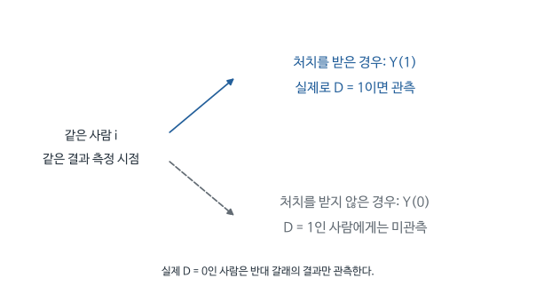

# MHE Ch.2 - 두 집단의 차이를 처치의 효과로 해석하려면

Week 02 / 2026-09-09 / Session 2

[원문 PDF](<MHE Ch2 The Experimental Ideal (2009).pdf>) | [개념 퀴즈](<MHE Ch2 The Experimental Ideal (2009)_QnA.md>) | [수식·모델 퀴즈](<MHE Ch2 The Experimental Ideal (2009)_수식모델퀴즈.md>) | [실무 Cheat Sheet](<MHE Ch2 The Experimental Ideal (2009)_실무CheatSheet.md>)

## 1. 왜 계량경제학 책이 무작위 실험에서 출발하는가

경제학과 마케팅의 많은 질문은 어떤 결정을 바꾸었을 때 결과가 얼마나 달라지는지를 묻는다. 학급당 학생 수를 줄이면 성적이 오르는지, 광고를 보내면 구매가 늘어나는지, 직업훈련을 제공하면 소득이 높아지는지가 모두 이런 질문이다. 답하려면 지금 서로 다른 결정을 내린 사람들의 결과를 비교하는 것만으로 충분한지부터 검토해야 한다.

이 문서는 Angrist와 Pischke의 계량경제학 교재 Mostly Harmless Econometrics(2009, 제목의 MHE) 2장을 정리한다. Angrist와 Pischke는 무작위 실험(randomized experiment)을 그 비교의 기준으로 삼는다. 연구자가 처치를 무작위로 배정하면 원래 능력이나 구매 의향(purchase intent) 때문에 처치 여부가 달라지는 문제를 피할 수 있기 때문이다. 실제로는 실험을 수행하기 어려운 연구도 많다. 그래도 이상적인 실험에서 어떤 집단을 비교했을지 생각하면, 관찰자료(observational data)에 어떤 비교가 부족하고 무엇을 가정해야 하는지 파악하기 쉬워진다. 장 제목의 Experimental Ideal은 이 기준을 뜻한다.

장 첫머리의 사례가 이 기준이 어디서 왔는지 보여 준다. 1962년 미국 미시간주 Ypsilanti에서 흑인 미취학 아동 123명을 대상으로 진행한 Perry preschool project는 아이들을 무작위로 나누어 처치집단(treatment group)에게만 유아교육과 가정방문을 결합한 집중 프로그램을 제공했다. 참여자가 27세가 된 1993년까지 추적 자료가 축적되었고, 규모가 작은 이 실험은 1964년에 시작되어 수백만 명의 미국 아동이 거쳐 간 연방 유아교육 사업 Head Start의 지적 근거가 되었다. 장의 첫 문장은 "가장 신뢰받고 영향력 있는 연구설계는 무작위 배정을 사용한다"이고, 이 실험이 그 사례다. 유아교육에 대한 정책 관심이 다시 높아지면서 Perry 자료는 계속 주목받았다. 최근의 한 재분석은 원래 결과를 대부분 확인했지만, 전체의 양의 효과가 전적으로 여아에게서 비롯되었고 남아에게는 효과가 없어 보였다(Anderson 2008, 교재 각주 1). 같은 실험 안에서도 집단마다 효과가 다를 수 있다는 이 관찰은 3절에서 누구의 평균효과를 구하는지 구분하는 이유와 이어진다.

이 장은 먼저 병원 입원자와 비입원자의 건강을 비교해 선택편향(selection bias)을 설명한다. 다음으로 학급 규모를 무작위로 바꾼 Tennessee STAR 실험을 살펴본다. 마지막에는 실험의 집단 평균 차이가 익숙한 회귀식에서 어떻게 표현되는지 연결한다. 잠재결과(potential outcome) 표기와 회귀분석(regression analysis)이 같은 질문을 다른 방식으로 다룬다는 것을 이해하는 순서다.

### 입원한 사람이 더 아프면 입원이 해로운가

저자들은 이 문제를 병원 입원이라는 비유로 설명한다. 응급실을 1차 진료처럼 이용하는 가난한 노인 인구를 떠올리고, 그중 일부가 입원한다고 하자. 입원 치료는 비싸고 병상을 차지하며 효과가 크지 않을 수도 있다. 취약한 환자가 다른 환자에게 노출되어 오히려 건강이 나빠질 가능성도 있다. 그래도 입원자는 여러 의료 서비스를 받으므로 "병원이 사람을 더 건강하게 만드는가"에 대한 답은 '그렇다'일 것 같다. 자료가 이 예상을 뒷받침하는지 확인하는 첫 단계는 가장 자연스러운 비교, 곧 병원에 다녀온 사람과 다녀오지 않은 사람의 건강 비교다.

자료는 2005년 미국 국민건강면접조사(NHIS)다. "지난 12개월 동안 병원에 하룻밤 이상 입원했는가"라는 문항으로 입원 여부를 구분하고, "전반적인 건강이 최상, 매우 좋음, 좋음, 보통, 나쁨 중 어디인가"라는 자가평가 문항을 점수로 변환했다. 건강점수는 1이 나쁨(poor), 5가 최상(excellent)이다. 자료 한 행은 응답자 한 명이다.

| 지난 12개월 입원 | 표본수 | 평균 건강 | 평균의 표준오차 |
|---|---:|---:|---:|
| 입원 | 7,774 | 3.21 | 0.014 |
| 비입원 | 90,049 | 3.93 | 0.003 |

입원자 평균에서 비입원자 평균을 빼면 $3.21-3.93=-0.72$다. 저자들은 이를 비입원자에게 유리한, 크고 매우 유의한 차이라고 부르며 $t$값이 58.9라고 보고한다. 입원자가 덜 건강하다는 사실은 분명하다. 그런데 병원 치료가 사람을 덜 건강하게 만들었다는 결론은 이상하다. 건강이 나빴기 때문에 입원했을 가능성이 있기 때문이다. 한 가지 지적이 더 있다. 입원 치료를 받은 뒤에도 입원자는 한 번도 입원하지 않은 사람보다 평균적으로 덜 건강할 수 있지만, 그래도 입원하지 않았을 때의 자기 자신보다는 나아졌을 수 있다.

치료의 효과를 알려면 입원자들이 입원하지 않았을 경우와 비교해야 한다. 그들의 건강이 치료 없이 2점이었을 것이라면 관측된 3.21점은 개선을 뜻한다. 치료 없이도 4점이었을 것이라면 해석이 달라진다. 표에는 이 비교에 필요한 값이 없다. 다음 절의 잠재결과는 이 관측되지 않는 비교 대상을 정확하게 적기 위한 표기다.

병원 사례에서 표본이 약 10만 명이나 된다는 사실은 선택편향의 문제를 해결하지 않는다. 이 정도 자료면 입원자의 건강점수가 낮다는 관계를 매우 정밀하게 확인할 수 있다. 그런데 관계의 정밀도(precision)와 치료의 효과는 다른 질문이다. $t=58.9$는 "입원자와 비입원자의 평균 건강이 같다"는 가설을 강하게 기각할 뿐, 그 차이가 치료에서 왔는지 입원 전 건강 차이에서 왔는지는 알려 주지 않는다. 원래 아픈 사람이 입원하는 선택을 그대로 둔 채 표본 크기(sample size)만 늘리면 그 선택 관계를 더 정밀하게 측정할 뿐이다.

저자들이 이런 직관적인 예로 시작하는 이유는 회귀계수에도 같은 문제가 있다는 점을 이해시키기 위해서다. 표를 보고는 ‘아픈 사람이 병원에 갔겠지’라고 판단하면서, 같은 자료로 건강을 입원 더미(입원했으면 1, 아니면 0인 변수)에 회귀한 뒤 음의 계수를 입원의 해로운 효과로 해석하는 것은 일관되지 않다. 9절에서 보듯 그 계수는 표의 평균 차이 -0.72와 같은 값이다. 평균의 차이를 구하든 회귀분석을 하든 먼저 확인할 것은 어느 집단의 결과가 누구의 반사실(counterfactual)을 대신하고 있는가다.

## 2. 한 사람에게 일어날 수 있는 두 결과를 적는다

관심 있는 처치를 입원이라고 하자. 어떤 사람이 실제로 입원했더라도, 그 사람이 입원하지 않았을 때의 건강을 개념적으로 생각할 수 있다. 반대로 입원하지 않은 사람에게도 입원했을 때의 건강을 정의한다. 두 상태에서 가능한 결과를 잠재결과라고 부른다.

| 기호 | 뜻 |
|---|---|
| $i$ | 한 사람 |
| $D_i$ | 입원했다면 1, 하지 않았다면 0 |
| $Y_i(1)$ | 그 사람이 입원했을 때의 건강 |
| $Y_i(0)$ | 그 사람이 입원하지 않았을 때의 건강 |
| $Y_i$ | 실제로 관측한 건강 |

교재는 $y_{1i},y_{0i},d_i$를 사용한다. 이 문서의 $Y_i(1),Y_i(0),D_i$와 같은 뜻이다. 0과 1은 건강 상태의 높고 낮음이 아닌 처치 상태(treatment status)다. 잠재결과 개념은 현대 인과효과(causal effect) 연구의 기본 구성요소다. 이 개념을 발전시킨 연구자는 Rubin이고, 잠재결과에 기초한 이 인과 틀은 Rubin 인과모형(Rubin causal model)이라고도 불린다(Rubin 1974, 1977; Holland 1986; 교재 각주 2).

개인 효과는

$$
\tau_i=Y_i(1)-Y_i(0)
$$

이다. 한 사람에게 같은 시점의 두 상태를 모두 관측할 수 없어 개인 효과를 직접 계산하지 못한다. 그 사람의 지난해 건강은 올해 비입원 잠재결과와 같지 않다. 시간이 흐르며 질병과 환경도 바뀌기 때문이다.

책 식 (2.1.1)을 처음부터 도출하면

$$
\begin{aligned}
Y_i&=D_iY_i(1)+(1-D_i)Y_i(0)\\
&=D_iY_i(1)+Y_i(0)-D_iY_i(0)\\
&=Y_i(0)+D_i\{Y_i(1)-Y_i(0)\}.
\end{aligned}
$$

첫 줄은 실제 배정에 맞는 잠재결과를 선택한다. $D_i=1$이면 $1-D_i=0$이어서 $Y_i(1)$만 남고, $D_i=0$이면 $Y_i(0)$만 남는다. 둘째 줄은 괄호를 전개하고, 셋째 줄은 $D_i$가 붙은 항을 묶는다. 마지막 식에 $D_i=1$을 대입하면 $Y_i(0)+Y_i(1)-Y_i(0)=Y_i(1)$, $D_i=0$을 대입하면 $Y_i(0)$가 되어 교재의 경우별 표기와 같아진다. 식 하나로 두 경우를 표현하면 관측결과(observed outcome)가 "처치가 없을 때의 결과"에 "처치를 받은 사람에게만 더해지는 개인 효과"를 더한 형태라는 점이 드러나고, 8절에서 이 식을 회귀식으로 바꿀 수 있다. 이 단계에는 무작위 배정이나 상수효과(constant effects) 가정, 곧 모든 사람의 처치효과가 같다는 가정이 없다.

이 표기에는 교재 2장이 따로 이름 붙이지 않은 전제가 있다. 한 사람의 잠재결과는 그 사람 자신의 처치 여부에만 의존하고, 다른 사람이 입원했는지와는 무관하다고 가정한다. 병상이 붐벼 다른 환자의 입원이 내 치료의 질을 떨어뜨린다면 $Y_i(1)$과 $Y_i(0)$ 두 값만으로는 한 사람의 결과를 모두 표현할 수 없다. 또 '입원'이 누구에게나 같은 내용의 처치라고 가정한다. 인과추론(causal inference) 문헌은 이 두 조건을 묶어 SUTVA(stable unit treatment value assumption)라고 부른다. 원문에 없는 용어이므로 교육용 보충으로만 제시한다.

기호 속 괄호와 첨자는 서로 다른 정보를 준다. 아래첨자 i는 같은 사람을 계속 가리키고, 괄호 속 숫자는 그 사람이 어떤 처치를 받는 상황을 생각하는지 나타낸다. 따라서 두 잠재결과의 차이를 계산할 때는 사람이 바뀌지 않는다. 이것이 두 집단의 관측 평균의 차이를 구하는 계산과 개념적으로 다른 출발점이다.

모집단 안에는 $Y_i(1)$과 $Y_i(0)$ 각각의 분포가 있고, 그래서 처치효과도 사람마다 다를 수 있다. 누구에게서도 두 잠재결과를 함께 관측할 수 없으므로 입원의 효과는 입원한 사람과 하지 않은 사람의 평균 건강을 비교해 추론할 수밖에 없다. 개인 효과를 관측할 수 없다는 사실이 평균효과까지 알 수 없다는 뜻은 아니다. 무작위 배정으로 만든 다른 집단이 같은 종류의 사람들을 대표하면, 그 집단의 평균으로 관측되지 않은 평균을 추정할 수 있다. 어떤 개인의 반사실을 정확히 예측한다는 주장 없이도 집단 전체의 평균 비교가 가능하다. 잠재결과의 정의와 실제 추정의 단위가 달라도 되는 이유다.

<!-- learning-figure:potential-outcomes -->

*그림 설명: 잠재결과 기호를 설명하기 위한 개념도다.*

두 갈래는 같은 사람의 과거와 현재가 아니다. 같은 시점에 처치를 받았을 경우와 받지 않았을 경우다. 비교집단은 관측하지 못한 갈래의 평균을 추정하는 데 쓰이며, 그 사람의 숨겨진 결과를 직접 보여 주지는 않는다.

<!-- /learning-figure -->

## 3. 개인의 효과를 관측할 수 없을 때 어떤 평균을 구할까

개인마다 효과가 달라도 특정 집단의 평균효과는 유용하다. 예를 들어 이미 병원에 온 환자에게 치료를 제공할지 결정하는 질문과 전체 인구에게 치료를 확대할지 결정하는 질문은 평균을 내야 하는 대상이 다르다.

조건부 평균(conditional mean)에서 $E$는 평균을 뜻하고, 세로줄 오른쪽은 누구를 포함해 평균을 낼지 정하는 조건이다. $E[Y_i(0)\mid D_i=1]$은 실제 입원자들이 입원하지 않았더라면 보였을 건강의 평균이다. 이 값은 관측되지 않는다. $E[Y_i(0)\mid D_i=0]$은 실제 비입원자들의 관측 건강 평균이다. 괄호 속 처치 상태가 같아도 평균 내는 사람들이 다르다.

이 장에서 처음 사용하는 조건부 기댓값(conditional expectation) $E[Y_i\mid D_i=1]$은 한 변수의 값을 고정했을 때 다른 변수의 모집단 평균(population mean), 또는 무한히 큰 표본에서의 평균이다(교재 각주 3). NHIS 표의 3.21과 3.93은 이 모집단 평균을 추정한 표본 평균(sample mean)이고, 표준오차(standard error) 0.014와 0.003은 그 추정의 불확실성이다. 아래의 분해와 무작위 배정 논리는 모두 모집단 평균에 관한 이야기이며, 표본에서 생기는 우연한 차이는 5절 끝에서 따로 다룬다. 정식 정의는 3장에서 다룬다.

정책의 대상에 따라 다음 세 평균을 사용한다. 아래의 ATE(전체의 평균처치효과), ATT(처치받은 사람의 평균처치효과), ATU(처치받지 않은 사람의 평균처치효과)는 계산법이 서로 다른 것이 아니고, 평균을 내는 집단만 다르다.

$$
ATE=E[Y_i(1)-Y_i(0)],
$$

$$
ATT=E[Y_i(1)-Y_i(0)\mid D_i=1],
$$

$$
ATU=E[Y_i(1)-Y_i(0)\mid D_i=0].
$$

ATE는 목표 모집단(target population) 전체, ATT는 실제 처치자, ATU는 실제 비처치자의 평균 효과다. 병원 치료가 중증 환자에게 더 유익하다면 이 평균들은 다를 수 있다. 교재 2장은 ATT(average treatment effect on the treated)와 전체 평균효과 $E[Y_i(1)-Y_i(0)]$만 사용한다. ATU는 두 집단을 대칭적으로 비교하려고 이 문서가 덧붙인 교육용 보충이다.

세 평균은 서로 연결되어 있다. 처치받은 사람의 비율을 $p=P(D_i=1)$이라고 하면 전체 평균은 두 집단 평균을 인원 비중으로 가중한 값이다(교육용 보충).

$$
ATE=p\cdot ATT+(1-p)\cdot ATU.
$$

전체 인구의 평균효과는 처치자와 비처치자의 평균효과 사이 어딘가에 있고, 처치받은 사람이 적을수록 ATU에 가깝다. NHIS 표본에서 입원자 비율은 $7{,}774/97{,}823\approx0.08$이므로, 이 모집단의 ATE는 대부분 입원하지 않은 사람들이 입원했을 때 얻을 효과로 정해진다. 병원이 실제로 필요한 사람을 잘 선별해 입원시킨다면 ATT와 ATE는 크게 다를 수 있다.

ATT와 ATU를 구별하는 이유는 정책 대상이 바뀌면 효과도 달라질 수 있기 때문이다. 현재 입원자에게는 중증 환자가 많고 비입원자에게는 건강한 사람이 많다고 하자. 두 집단에 같은 입원 처치를 제공하더라도 얻는 이익이 다를 수 있다. 이미 처치받은 사람의 효과가 크다는 결과만으로 모든 비처치자에게 확대하는 정책의 효과를 계산하면 대상이 달라진다.

무작위 실험에서는 처치집단이 원래 아팠기 때문에 선택된 집단이 아니므로 이 구별이 단순해진다. 그러나 실험을 자원한 사람과 자원하지 않은 사람의 차이는 여전히 남을 수 있다. 무엇을 무작위로 결정했는지를 명시하면 실험 내부에서 제거한 선택과 연구 참여 단계에 남은 선택을 혼동하지 않는다.

## 4. 관측된 건강 차이에 처음부터 달랐던 건강이 섞이는 과정

앞의 표가 주는 값은 입원자의 실제 건강에서 비입원자의 실제 건강을 뺀 것이다. 우리가 원하는 ATT는 입원자의 실제 건강에서 그 입원자들이 입원하지 않았을 때의 건강을 뺀 것이다. 두 계산의 차이를 확인하려면 빠져 있는 평균 $E[Y_i(0)\mid D_i=1]$을 한 번 더하고 한 번 빼면 된다. 같은 값을 더했다 빼므로 전체 값은 변하지 않는다.

$$
\begin{aligned}
\Delta_{obs}
&=E[Y_i\mid D_i=1]-E[Y_i\mid D_i=0]\\
&=E[Y_i(1)\mid D_i=1]-E[Y_i(0)\mid D_i=0]\\
&=E[Y_i(1)\mid D_i=1]-E[Y_i(0)\mid D_i=1]\\
&\quad+E[Y_i(0)\mid D_i=1]-E[Y_i(0)\mid D_i=0]\\
&=ATT+\text{선택편향}.
\end{aligned}
$$

첫 줄은 관찰 비교의 정의다. 둘째 줄은 2절의 식 (2.1.1)에서 도출된다. 입원자만 모아 평균을 내면 이들은 모두 $D_i=1$이므로 관측 건강 $Y_i$가 곧 $Y_i(1)$이고, 비입원자는 모두 $D_i=0$이므로 $Y_i=Y_i(0)$이다. 따라서 둘째 줄은 아무 가정 없이 첫 줄과 같다. 셋째 줄에서 관측되지 않는 반사실 평균 $E[Y_i(0)\mid D_i=1]$을 빼고 곧바로 다시 더한다. 마지막 줄은 두 묶음에 이름을 붙인다.

첫 묶음은 한 줄에서 $E[Y_i(1)\mid D_i=1]-E[Y_i(0)\mid D_i=1]=E[Y_i(1)-Y_i(0)\mid D_i=1]$로 합칠 수 있다. 같은 사람들(실제 입원자)의 두 평균을 뺀 값은 그 사람들의 개인 효과를 평균한 값과 같기 때문이다. 기댓값의 선형성(linearity of expectation)이라고 부르는 성질이며, 두 평균이 같은 집단에 대한 것이어야 성립한다. 처음의 관찰 비교 $E[Y_i(1)\mid D_i=1]-E[Y_i(0)\mid D_i=0]$은 평균 내는 집단이 서로 달라 이렇게 합칠 수 없다. 그래서 개인 효과의 평균으로 해석할 수 없다.

### 왜 이렇게 분해하는가

책에서는 이 분해가 한 줄로 지나가지만, 장의 나머지 논의는 모두 이 식에 의존한다.

이 식은 항등식(identity)이다. 어떤 자료에서든, 무작위 배정이 있든 없든 성립한다. 관찰 차이가 인과효과와 다르다는 막연한 의심을 "정확히 어떤 항만큼 다른가"라는 질문으로 구체화한다.

분해는 우리가 원하는 답(ATT)과 처치를 누가 받았는지에서만 생기는 차이(선택편향)를 분리한다. 선택편향 항 $E[Y_i(0)\mid D_i=1]-E[Y_i(0)\mid D_i=0]$에는 처치효과가 전혀 들어 있지 않다. 두 집단 모두 처치가 없는 상태의 건강을 비교하기 때문이다. 입원이 아무 효과가 없더라도 이 항은 0이 아닐 수 있다.

그래서 관찰 비교가 ATT와 같아지는 조건도 하나의 등식으로 정해진다. 실제 입원자가 입원하지 않았을 때의 평균 건강이 실제 비입원자의 평균 건강과 같으면, 곧 $E[Y_i(0)\mid D_i=1]=E[Y_i(0)\mid D_i=0]$이면 선택편향이 0이다. 5절의 무작위 배정은 이 등식을 설계로 성립시키고, 뒤의 장들에서 나오는 통제변수(control variable), 고정효과(fixed effects), 도구변수(instrumental variable) 같은 방법은 무작위 배정이 없을 때 선택편향 항을 제거하거나 회피하려는 시도로 볼 수 있다. 책이 "대부분의 실증경제학 연구의 목표는 선택편향을 극복하는 것"이라고 서술하는 것도 이 때문이다.

병원 사례에서 선택편향의 부호는 음수로 예상된다. 아픈 사람이 건강한 사람보다 치료를 찾을 가능성이 높아 입원자의 $Y_i(0)$가 낮기 때문이다. 저자들에 따르면 이 음의 선택편향은 절댓값이 매우 커서 양의 처치효과를 완전히 가릴 수도 있다. 아래 두 계산이 그 상황을 수치로 보여 준다.

### 가상 수치로 보는 부호 역전

입원자의 비입원 잠재건강 평균이 2.50이고, 입원이 이를 0.71 높여 관측값이 3.21이 되었다고 하자. 비입원자의 관측 평균은 3.93이다.

$$
-0.72=+0.71+(2.50-3.93)=+0.71-1.43.
$$

치료는 도움이 되었지만 관찰 차이는 음수다. 이 수치는 설명용이며 NHIS 자료에서 반사실 2.50을 추정했다는 뜻이 아니다.

선택편향에서 기준이 되는 건강은 입원 전의 실제 건강과 정확히 같은 개념은 아니다. 연구가 묻는 결과 시점에 입원하지 않았다면 보였을 건강이다. 입원 전 건강을 관측해 조정하는 것은 좋은 출발점일 수 있지만 그 사이 질병의 진행이나 다른 치료가 달라질 수 있다. 반사실을 단지 과거값으로 대체하면 시간에 따른 변화까지 치료효과에 포함될 위험이 있다.

관측된 건강 차이가 음수일 때 병원이 해롭다는 설명과 원래 아픈 사람이 선택되었다는 설명이 함께 가능하다. 위 수치 예는 후자의 설명이 효과의 부호를 뒤집을 만큼 클 수 있음을 보여 준다. 실제 선택편향을 1.43으로 추정한 것은 아니다. 관측되지 않는 항에 여러 값이 가능하다는 사실을 보여 주는 계산이다.

<!-- learning-interactive:selection-bias -->
**직접 조작해 보기: 관측된 건강 차이 가운데 얼마가 입원의 효과이고 얼마가 선택편향인가.** 비입원자 평균 3.93과 입원자 비율 8%는 NHIS 표에서, 입원자의 원래 건강 차이 -1.43과 입원의 효과 +0.71은 위의 가상 수치에서 가져온 기본값이라 두 집단 평균이 표의 3.21과 3.93으로 재현되며, 그림의 값은 모두 모집단 평균이어서 표본의 우연한 차이는 들어 있지 않다. 원래 건강 차이의 절댓값이 입원의 효과보다 크면(기본값에서는 -0.71 아래) 관측 차이의 부호가 효과와 반대가 되고, 0으로 옮기면 관측 차이가 ATT와 같아진다. 무작위 배정을 켜면 두 집단의 $Y_i(0)$ 평균이 같아져 선택편향 막대가 사라지고 관측 차이가 ATE와 같아지며, 두 사람 유형의 효과를 다르게 두면 이 ATE가 스스로 입원한 사람의 ATT와 달라진다. 더 알아보기: [Causal Inference: The Mixtape](https://mixtape.scunning.com/)의 잠재결과 장.
<!-- /learning-interactive -->

### 네 사람의 잠재결과로 다시 계산하기

위 예는 집단 평균만 가정했다. 사람마다 두 잠재결과를 모두 안다고 가정하면 분해의 각 항이 어디서 오는지 더 분명해진다. 아래 네 사람은 모두 가상이며, 연구자는 실제로 마지막 열만 관측한다.

| 사람 | 실제 입원 $D_i$ | $Y_i(0)$ | $Y_i(1)$ | 개인 효과 $Y_i(1)-Y_i(0)$ | 관측 $Y_i$ |
|---|---:|---:|---:|---:|---:|
| 가 (중증) | 1 | 2.0 | 3.0 | +1.0 | 3.0 |
| 나 (중증) | 1 | 3.0 | 3.5 | +0.5 | 3.5 |
| 다 (건강) | 0 | 4.0 | 3.8 | -0.2 | 4.0 |
| 라 (건강) | 0 | 4.0 | 4.0 | 0.0 | 4.0 |

아픈 두 사람만 입원했고, 입원은 이들에게 도움이 되었다. 건강한 '다'에게는 입원이 오히려 약간 해로운 것으로 가정했다. 앞에서 언급한 다른 환자로부터의 감염 같은 경우를 상정한 설정이다. 관측값으로 계산한 관찰 차이는 $(3.0+3.5)/2-(4.0+4.0)/2=3.25-4.00=-0.75$다. 분해의 두 항은 다음과 같다.

$$
\begin{aligned}
ATT&=\tfrac{1}{2}(1.0+0.5)=0.75,\\
\text{선택편향}&=E[Y_i(0)\mid D_i=1]-E[Y_i(0)\mid D_i=0]=\tfrac{2.0+3.0}{2}-\tfrac{4.0+4.0}{2}=2.5-4.0=-1.5,\\
ATT+\text{선택편향}&=0.75-1.5=-0.75.
\end{aligned}
$$

관찰 차이 -0.75가 정확히 재현된다. 입원자에게 입원은 평균 0.75점 도움이 되었지만, 입원자가 처음부터 1.5점 덜 건강했기 때문에 관측 비교는 음수가 되었다. 연구자가 실제로 가진 자료는 관측 $Y_i$ 열과 $D_i$ 열뿐이다. $Y_i(0)$ 열의 입원자 두 칸(2.0과 3.0)은 누구도 관측할 수 없으므로 선택편향 -1.5도 자료만으로는 계산할 수 없다.

같은 표에서 나머지 평균효과도 구할 수 있다. 비입원자에게 입원을 시켰다면 효과는 $ATU=\tfrac{1}{2}(-0.2+0.0)=-0.1$이고, 네 사람 전체의 효과는 $ATE=\tfrac{1}{4}(1.0+0.5-0.2+0.0)=0.325$다. 3절의 관계식으로도 $0.5\times0.75+0.5\times(-0.1)=0.325$다. 이미 입원한 사람에게 치료는 이로웠지만 모두에게 입원을 확대하는 정책의 평균 이익은 그 절반에도 못 미친다.

### ATT 기준 분해와 ATE 기준 분해

교재가 관찰 차이를 ATT 기준으로 분해한 이유는 ATE 기준으로 분해하면 드러난다. 아래 식은 원문에 없는 교육용 보충이다. 3절의 $ATE=p\cdot ATT+(1-p)\cdot ATU$를 이용해 ATT를 ATE로 치환하면 다음 항등식을 얻는다.

$$
E[Y_i\mid D_i=1]-E[Y_i\mid D_i=0]=ATE+\text{선택편향}+(1-p)(ATT-ATU).
$$

ATE를 목표로 삼으면 선택편향 외에 항이 하나 더 생긴다. 처치받은 사람과 받지 않은 사람의 효과 크기(effect size)가 다르면 생기는 차이다. 네 사람 예에 대입하면 $0.325+(-1.5)+0.5\times(0.75-(-0.1))=0.325-1.5+0.425=-0.75$로 역시 관찰 차이와 같다. ATT 기준 분해는 이 셋째 항 없이 두 항만 남기므로, "관찰 비교가 편향되는 이유는 비처치 상태의 출발점 차이"라는 한 가지 문제에 집중할 수 있다. 5절에서 보듯 무작위 배정은 두 불일치를 모두 제거한다.

## 5. 무작위 배정으로 비교집단을 만드는 이유

이번에는 원래 건강이 나쁜 사람이 스스로 입원하는 상황에서 벗어나, 비교 가능한 참가자들에게 처치 여부를 무작위로 결정했다고 가정하자. 동전 던지기 같은 배정 절차는 각 사람의 잠재 건강에 따라 다르게 작동하지 않는다. 이 성질을 통계적 독립(statistical independence)이라고 하며 $\perp$로 표기한다. 이상적인 무작위 배정은

$$
D_i\perp (Y_i(0),Y_i(1))
$$

라는 조건을 만족한다. 어느 집단에 배정되었는지 알아도 그 사람이 원래 어떤 잠재결과를 가졌는지 체계적으로 예상할 수 없다는 뜻이다. 그래서 비처치 잠재결과의 평균은

$$
E[Y_i(0)\mid D_i=1]=E[Y_i(0)\mid D_i=0]=E[Y_i(0)]
$$

가 성립해 선택편향이 0이다. 같은 방식으로 $Y_i(1)$에도 조건을 제거할 수 있다.

$$
\begin{aligned}
E[Y_i\mid D_i=1]-E[Y_i\mid D_i=0]
&=E[Y_i(1)]-E[Y_i(0)]\\
&=E[Y_i(1)-Y_i(0)]=ATE.
\end{aligned}
$$

이 결과는 두 단계를 거쳐 도출된다. 먼저 $Y_i(0)$와 $D_i$가 독립이라는 성질만으로 $E[Y_i(0)\mid D_i=1]$을 $E[Y_i(0)\mid D_i=0]$으로 대체한다. 4절 분해의 선택편향 항이 0이 되므로 관찰 차이는 ATT와 같아진다. 다음으로 $Y_i(1)$까지 $D_i$와 독립이면 처치집단의 평균효과가 전체의 평균효과와 같아져 $E[Y_i(1)-Y_i(0)\mid D_i=1]=E[Y_i(1)-Y_i(0)]$이 된다. 책의 표현으로는 "무작위로 배정된 입원이 입원자에게 미친 효과는 무작위로 고른 환자에게 미칠 효과와 같다." 저자들이 더 강조하는 것은 첫 단계, 곧 선택편향의 제거다.

두 단계가 서로 다른 조건을 요구한다는 점은 무작위 배정이 없는 가상 상황에서 드러난다(교육용 예). 네 사람의 $Y_i(0)$가 모두 3이고, 두 사람에게만 처치효과 1이 있으며, 효과가 있는 그 두 사람만 스스로 처치를 선택한다고 하자. 선택편향은 $3-3=0$이어서 관찰 차이 $4-3=1$은 ATT 1과 같다. 그런데 ATE는 $(1+1+0+0)/4=0.5$다. 출발점이 같아도 효과가 큰 사람이 처치를 선택하면 관찰 차이는 처치자에 대한 답일 뿐 전체에 대한 답이 되지 못한다. 무작위 배정은 배정이 $Y_i(0)$와도, 개인 효과와도 무관하게 만들어 두 문제를 함께 제거한다.

이 결과를 얻는 데 모든 사람의 효과가 같다는 가정은 사용하지 않았다. 평균을 식별하는 논리와 개인별 효과를 동일하게 가정하는 회귀 표현은 구분해야 한다.

무작위 배정은 실험 참가자 안의 비교를 정당화한다. 참가자가 전체 국민의 대표표본(representative sample)인지, 실제로 처치를 이행했는지, 추적 이탈이 있었는지는 별도 문제다.

독립이라는 말은 두 집단의 모든 관측 평균이 소수점까지 같다는 뜻이 아니다. 배정 절차가 잠재결과를 보고 한쪽을 더 자주 선택하지 않는다는 뜻이다. 작은 실험에서는 동전 던지기만으로도 한 집단에 아픈 사람이 우연히 더 많을 수 있다. 반복 배정의 불확실성을 계산하는 표준오차와 신뢰구간(confidence interval)이 필요한 이유다.

상수효과가 필요 없다는 점은 8절의 회귀식과 비교할 때 다시 중요해진다. 어떤 사람은 치료로 크게 좋아지고 어떤 사람은 거의 달라지지 않아도, 배정이 두 잠재결과와 독립이면 평균 비교를 정당화할 수 있다. 뒤에서 등장하는 상수효과 회귀식은 잠재결과를 익숙한 선형식과 연결하기 위한 단순화다. 무작위화(randomization) 논리가 상수효과를 전제한다고 거꾸로 이해하면 안 되는 이유다.

### 한 번의 실험에서 집단이 달라도 평균적으로 공정하다는 뜻

무작위 배정의 ‘평균적으로’는 실험을 여러 번 했을 때의 배정 평균을 말한다. 이를 분명히 보려고 잠재결과가 정해진 $N$명 중 정확히 $n_1$명을 처치군으로 배정하는 완전 무작위 배정(complete randomization)을 생각하자. $D_i$는 추첨 결과이고 $P(D_i=1)=n_1/N$이다. 처치군의 관측 평균은

$$
\overline Y_1=\frac{1}{n_1}\sum_{i=1}^{N}D_iY_i(1).
$$

배정만 반복해 추첨할 때의 평균을 $E_D$라고 표시하면, 잠재결과는 고정되어 있으므로

$$
\begin{aligned}
E_D[\overline Y_1]
&=\frac{1}{n_1}\sum_i E_D[D_i]Y_i(1)\\
&=\frac{1}{n_1}\sum_i\frac{n_1}{N}Y_i(1)
=\frac{1}{N}\sum_iY_i(1).
\end{aligned}
$$

대조군(control group)도 같은 방식으로 계산하면 $E_D[\overline Y_0]=N^{-1}\sum_iY_i(0)$이다. 두 식의 차이를 구하면 평균차이의 배정 평균이 실험 참여자들의 평균처치효과(average treatment effect)와 일치한다는 결과를 얻는다. 추첨 한 번에서 두 집단의 원래 능력이 정확히 같다는 주장은 사용하지 않았다.

예를 들어 우연히 성적이 높은 학생이 작은 학급에 더 많이 배정될 수 있다. 그 가능성 때문에 표준오차와 신뢰구간이 필요하다. 학생 수를 늘리면 우연한 구성 차이가 작아지는 경향이 있지만, 추첨 후 특정 학생을 제외하면 위 식의 동일한 포함확률(inclusion probability) 논리를 그대로 적용할 수 없다. 무작위 배정과 사후 표본 유지가 함께 중요하다.

### 병원 비유는 현실에서 얼마나 들어맞는가

저자들은 병원 이야기가 비유에 그치지 않는다는 점을 보이려고 무작위 실험이 관찰 비교와 다른 결론에 이른 사례 두 가지를 제시한다.

첫 사례는 의학의 호르몬 대체요법(HRT)이다. 중년 여성의 폐경 증상을 줄이려고 권장되던 치료로, 간호사를 대상으로 한 대규모 비실험 조사 Nurses Health Study에서는 HRT 사용자의 건강이 더 좋게 나타났다. 그런데 책 집필 당시 최근에 끝난 무작위 시험(Women's Health Initiative)에서는 이점이 거의 없었고, 비실험 자료(nonexperimental data)에서는 보이지 않던 심각한 부작용까지 드러났다. 원문은 관찰 비교가 왜 편향되었는지 구체적으로 설명하지 않는다. 4절의 분해로 해석하면 HRT를 사용한 여성들이 사용하지 않았더라도 원래 더 건강했을 가능성, 곧 양의 선택편향이 한 가지 해석이다. 병원 사례와 부호만 반대다.

둘째 사례는 저자들의 분야인 노동경제학에서 대표적으로 거론되는 정부 지원 직업훈련 평가다. 장기실업자, 약물중독자, 출소자처럼 불리한 처지의 노동자에게 강의와 현장훈련을 제공해 고용과 소득을 높이려는 프로그램이다. 참가자와 비참가자를 비교한 비실험 연구(nonexperimental study)는 훈련 뒤 참가자의 소득이 그럴듯한 비교집단(comparison group)보다 낮다는 역설적인 결과를 자주 보고했다(Ashenfelter 1978, Ashenfelter and Card 1985, Lalonde 1995 등). 교재는 여기서도 선택편향을 자연스러운 설명으로 제시한다. 이 프로그램은 애초에 소득 잠재력이 낮은 사람을 위해 만들어졌으므로 참가자의 $Y_i(0)$가 낮고, 선택편향은 병원 사례처럼 음수다. 무작위 평가에서는 대체로 양의 효과가 추정되었다(Lalonde 1986, Orr et al. 1996 등).

사회과학에서 무작위 실험은 의학만큼 흔하지는 않지만 늘고 있다. 특히 교육 연구에서 빠르게 늘고 있으며, 2002년 미국 의회가 통과시킨 Education Sciences Reform Act는 연방 지원 교육 연구에 엄밀한 실험 또는 준실험(quasi-experiment) 설계를 요구했다. 준실험은 연구자가 처치를 무작위로 배정하지는 않지만 제도나 우연이 만든 변화를 이용해 실험과 비슷한 비교를 만드는 설계이며, 12절에서 예를 본다. 다음 절의 Tennessee STAR는 이 분야의 선구적인 무작위 연구다.

## 6. 작은 학급이 성적을 높이는지 알아보려 한 STAR 실험

노동경제학자들은 교실 환경의 특징과 아동의 학습 사이 인과관계를 오래 연구해 왔고, 저자들은 이 분야를 '교육 생산(education production)'이라고 부른다. 학교 환경의 여러 특징을 비용이 드는 투입물로, 학생의 학습을 학교가 생산하는 산출물로 보는 관점이다. 이 분야의 주요 질문은 비용 대비 어떤 투입물이 가장 많은 학습을 산출하는가다. 학급 규모는 비용이 가장 큰 투입물 가운데 하나다. 교육당국이 학급당 학생 수를 줄이려면 교사와 교실을 더 확보해야 한다. 비용을 지출할 만큼 학습이 개선되는지 확인하는 것이 정책 질문이다.

비실험 자료를 사용한 교육 생산 연구의 상당수는 학급 규모와 학습 사이에 관계가 거의 없다고 보고했다. 그대로 받아들인다면 교사 채용을 줄여 예산을 절감해도 성취가 줄지 않는다는 결론이 도출된다. 그러나 관찰자료에서 큰 학급과 작은 학급의 학생 성적만 비교하면 결론의 신뢰성이 떨어질 수 있다. 저자들이 지적하듯 성적이 낮은 학생을 일부러 작은 학급에 모으는 경우가 많다. 그런 학교에서는 작은 학급의 성적이 낮게 나타나고, 병원 사례처럼 음의 선택편향이 실제 효과를 가린다. 반대로 자원이 많은 학교가 작은 학급을 운영한다면 양의 방향 차이도 생길 수 있다. 무작위 실험은 서로 다른 크기의 학급에 배정된 학생들이 다른 면에서는 비교 가능하도록 만들어, 책의 표현대로 사과와 사과를 비교하게 한다.

Tennessee STAR는 이 문제를 무작위 배정으로 해결하려 했다. 비용은 약 1,200만 달러였다. 1985-86학년도 유치원 코호트에서 시작해 이 코호트가 3학년이 될 때까지 4년간 진행했고, 참여 규모는 약 11,600명이었다. 당시 테네시주 일반 학급의 평균 규모는 약 22.3명이었다. 학교 안에서 학생들을 다음 세 유형의 학급에 배정했다.

| 집단 | 계획된 학급 규모와 보조교사 |
|---|---|
| 소규모 | 13-17명 |
| 일반 | 22-25명, 시간제 보조교사 |
| 일반+보조 | 22-25명, 전일제 보조교사 |

소규모 학급과 일반 학급을 비교하면 학생 수를 줄이는 방안의 효과를 평가한다. 일반 학급과 전일제 보조교사가 있는 일반 학급을 비교하면 학급당 학생 수를 유지하면서 인력을 늘리는 방안의 효과를 평가한다. 서로 다른 교육정책을 같은 실험에서 검토한 것이다.

다음 회귀표에서 사용한 표본은 5,681명이다. 약 11,600명은 여러 학년에 걸친 실험 전체 규모이고, 5,681명은 해당 표를 추정할 때 포함한 학생 수다. 효과를 보고할 때는 어느 시점의 어떤 표본에서 얻은 결과인지 함께 확인해야 한다.

STAR가 보조교사 집단을 따로 설정한 이유를 정책 선택의 관점에서 검토한다. 학생당 교사 인력을 늘리는 방법에는 학급을 둘로 나누는 방식과 큰 학급에 도움을 줄 인력을 추가하는 방식이 있다. 두 방안의 비용과 수업 방식이 다르다. ‘교육 자원이 많을수록 좋다’라는 추상적인 질문보다 실제 시행 가능한 대안을 직접 비교하는 편이 예산 결정에 유용하다.

실험에 참여한 학교 자체는 미국 학교 전체에서 무작위로 추출된 집합이 아니다. 학년마다 학급이 최소 세 개 있는 학교가 참여 여부를 스스로 선택할 수 있었다. 세 유형의 학급을 한 학교 안에 동시에 운영하려면 필요한 조건이지만, 참여 학교가 자발적으로 참여했고 일정 규모 이상이었다는 점은 결과의 적용 범위와 관련된다. 학교 내부의 무작위 배정은 그 학교 안 비교를 돕지만, 매우 작은 학교나 다른 학년에서 같은 효과가 나타날지는 추가 근거가 필요하다.

## 7. 무작위 배정이 실행되고 학급 규모가 실제로 달라졌는가

실험을 설계했다고 바로 성적 차이부터 해석할 수는 없다. 무작위 실험을 평가할 때 가장 먼저 물을 질문은 "무작위화가 처치집단 사이에 참여자 특성을 균형 있게 만들었는가"다. 보통은 처치 전 결과(pretreatment outcome, 예를 들어 사전 시험 점수)나 다른 공변량(covariate)을 집단별로 비교한다. STAR 자료에는 처치 전 시험 점수가 없어서 인종, 나이 같은 아동 특성만 비교할 수 있다. 여기에 배정 후 실제로 학급 크기가 달라졌는지도 확인해야 한다. Table 2.2.1은 이를 위해 학생 특성과 학급 규모, 성적을 함께 보여 준다. 이 표와 뒤의 Table 2.2.2는 STAR 자료를 계량경제학적으로 분석한 Krueger (1999)의 표를 옮긴 것이다. 무료급식은 가난한 아동만 받을 수 있으므로 가구 소득의 좋은 지표가 된다.

| 항목 | 소규모 | 일반 | 일반+보조 |
|---|---:|---:|---:|
| 무료급식 | .47 | .48 | .50 |
| 나이 | 5.44 | 5.43 | 5.42 |
| 추적 이탈 | .49 | .52 | .53 |
| 유치원 학급 규모 | 15.10 | 22.40 | 22.80 |
| 유치원 백분위 성적 | 54.70 | 48.90 | 50.00 |

이탈은 3학년을 마치기 전에 추적에서 사라진 학생의 비율이다. 유치원 시험 점수가 49% 누락되었다는 뜻으로 해석하면 이탈이 일어난 시점을 잘못 이해하게 된다. 이탈 전에 측정한 유치원 결과는 이탈의 영향을 받지 않으므로 가장 신뢰할 만하다(교재 각주 4).

공변량 차이가 유의하지 않다고 해서 균형이 증명되지는 않는다. 관측된 몇 가지 특성만 비교했고, 유의하지 않다는 결과는 차이를 찾지 못했다는 뜻이기 때문이다. 무작위 배정의 근거는 배정 절차 자체에 있다. 이 표는 실행 과정에서 배정이 흐트러진 흔적이 있는지 찾는 보조 증거다.

앞의 균형표(balance table)는 Table 2.2.1에서 세 집단의 평균만 옮긴 것이다. 책의 표에는 백인/아시아계 비율 행과, 세 집단 평균이 모두 같은지 검정한 $p$값 열이 더 있다. 저자들이 "무작위 배정이 의도대로 작동했다"고 판단한 근거가 바로 이 $p$값이므로 표 전체를 아래에 옮긴다. 행과 열은 생략하지 않았고 변수 이름만 우리말로 바꾸었다.

| 변수 | 소규모 | 일반 | 일반+보조 | 세 집단 평균이 같다는 검정의 $p$값 |
|---|---:|---:|---:|---:|
| 무료급식 | .47 | .48 | .50 | .09 |
| 백인/아시아계 | .68 | .67 | .66 | .26 |
| 1985년 나이 | 5.44 | 5.43 | 5.42 | .32 |
| 추적 이탈률 | .49 | .52 | .53 | .02 |
| 유치원 학급 규모 | 15.10 | 22.40 | 22.80 | .00 |
| 유치원 백분위 성적 | 54.70 | 48.90 | 50.00 | .00 |

*출처: Angrist and Pischke (2009), Table 2.2.1, PDF 9쪽(책 p.19). 책의 표 전체이며, 출전은 Krueger (1999) table I이다. 유치원 때 STAR에 참여한 학생들의 처치 상태별 평균이다. 마지막 열은 세 집단 평균이 모두 같다는 가설의 $F$검정 $p$값이다. 성적은 Stanford Achievement Test 세 과목 백분위 점수의 평균이다.*

가운데 세 열은 집단별 평균이고 마지막 열만 검정 결과다. 행마다 단위가 다르다. 무료급식, 백인/아시아계, 이탈률(attrition rate)은 0과 1 사이의 비율이고 나이는 연, 학급 규모는 학생 수, 성적은 백분위 점수다. 마지막 열의 $p$값은 세 평균이 한꺼번에 같다는 가설 하나를 검정한 결과다. 따라서 $p$값이 작더라도 어느 두 집단이 다른지는 이 열에서 알 수 없다.

먼저 사전 특성(pretreatment characteristic) 세 행을 검토한다. 무료급식 비율은 소규모 .47, 일반+보조 .50으로 3%포인트(percentage points) 차이가 난다. 세 집단 전체의 평균이 같다는 검정은 $p=.09$로, 5% 기준에서는 유의하지 않지만 10% 기준에서는 유의하다. 인종($p=.26$)과 나이($p=.32$)도 세 집단 평균이 다르다는 뚜렷한 증거는 없다. 저자들이 "none is significantly different from zero"라고 기술한 것은 이 세 행을 가리킨다. 이탈률은 사정이 다르다. 집단별 평균은 .49, .52, .53이고, 세 평균이 같다는 가설은 $p=.02$로 5% 수준에서 기각된다. 이것은 .49와 .53 두 값만 비교한 검정 결과는 아니다. 교재도 이를 "적어도 원리상 잠재적 문제"라고 인정한다.

학급 규모 행은 배정이 실제 환경 차이를 만들었는지 보여 준다. 소규모 학급은 평균 15.10명으로 일반 학급 22.40명보다 7.3명 적다. 일반 학급보다 약 3분의 1($7.3/22.4\approx0.33$)이 줄었다. $p$값 .00은 0이라는 뜻이 아니다. 소수 둘째 자리에서 반올림해 0이 되었다는 뜻이므로 .005보다 작다고 해석한다. 마지막 행의 성적 차이는 $54.70-48.90=5.80$ 백분위점이다. 이 값은 학교 차이를 조정하지 않은 단순 평균 차이이므로 뒤의 Table 2.2.2 회귀계수와 구분해야 한다.

이 표로 말할 수 있는 것은 두 가지다. 관측된 사전 특성 세 가지는 배정된 학급 유형과 뚜렷한 관련이 없었고, 배정은 의도한 대로 학급 규모 차이를 만들었다. 반면 학생의 사전 능력이 균형을 이루었는지는 이 표로 직접 확인할 수 없다. STAR 자료에는 처치 전 시험 점수가 없기 때문이다(책 p.18). 이탈률 차이는 3학년 완료 전까지 누적된 값이다. 유치원 결과는 이 추적 이탈의 영향을 받지 않았지만(교재 각주 4), 고학년 성적을 비교할 때는 남은 학생 구성이 달라졌을 가능성을 따로 검토해야 한다.

균형표에서 학생 특성과 실제 학급 규모를 함께 제시하는 것은 두 가지 점검을 분리하기 위해서다. 사전 특성은 배정에 원래 유리한 학생이 집중되었는지 살핀다. 실제 학급 규모는 배정한 정책이 의도한 교육환경 차이를 만들었는지 확인한다. 둘째 차이가 거의 없다면 성적 효과가 작게 추정되어도 작은 학급이 도움이 없어서인지 실제 규모가 달라지지 않아서인지 구분하기 어렵다. 예를 들어 일반 학급에 배정된 아이의 부모 상당수가 교사와 교장에게 요청해 자녀를 작은 학급으로 옮겼다면 집단 사이의 학급 규모 차이는 훨씬 작아졌을 것이다. 소규모 배정 학급이 실제로 7명 이상 작았다는 행은 그런 일이 대규모로 일어나지 않았다는 증거다.

추적 이탈은 또 다른 단계의 문제다. 처음 두 집단이 비슷했더라도 성적이 낮은 학생이 한쪽에서 더 많이 이탈하면 남아 있는 학생의 평균은 공정한 비교가 아닐 수 있다. 이탈률이 비슷하다고 이탈자의 특성까지 같다는 보장은 없다. 초기 결과와 장기 결과를 구분해 분석하는 이유는 각 시점에서 처음의 배정 비교가 얼마나 유지되는지 다르기 때문이다.

## 8. 잠재결과를 익숙한 회귀식으로 표현한다

지금까지는 집단의 평균을 비교했다. 실제 분석에서 자주 사용하는 $Y=\alpha+\rho D+\eta$라는 회귀식도 같은 내용을 표현할 수 있다. 먼저 설명을 단순하게 하려고 모든 사람에게 처치가 같은 크기 $\rho$의 영향을 준다고 가정하자. 이를 상수효과라고 부르며 $Y_i(1)-Y_i(0)=\rho$로 적는다. 앞서 도출한 관측결과 식에 대입하면 다음과 같다.

$$
Y_i=Y_i(0)+\rho D_i.
$$

비처치 잠재결과를 평균과 평균에서의 편차로 분해하자.

$$
\alpha=E[Y_i(0)],\qquad \eta_i=Y_i(0)-E[Y_i(0)].
$$

그러면 $Y_i(0)=\alpha+\eta_i$이므로

$$
Y_i=\alpha+\rho D_i+\eta_i.
$$

책 식 (2.3.1)의 절편(intercept) $\alpha$는 아무도 처치받지 않았을 때의 평균 결과다. $\rho D_i$는 처치 때문에 더해지는 부분이고, $\eta_i$는 개인의 원래 결과가 전체 평균과 다른 정도다. 회귀식의 오차라는 말이 단순한 측정 실수만을 뜻하지 않는다는 점을 여기서 확인할 수 있다.

$E[\eta_i]=0$은 평균에서의 편차로 정의했으므로 자동으로 성립한다. 그러나 원래 건강이 나쁜 사람에게 입원이 집중되면 입원자 집단의 편차 평균은 음수일 수 있다. 따라서 $E[\eta_i\mid D_i]=0$은 별도의 조건이다.

$$
\begin{aligned}
E[Y\mid D=1]&=\alpha+\rho+E[\eta\mid D=1],\\
E[Y\mid D=0]&=\alpha+E[\eta\mid D=0].
\end{aligned}
$$

교재는 이 두 줄을 "처치 상태를 끄고 켠 채 조건부 기댓값을 구한다"고 표현한다. 첫 줄은 회귀식 $Y_i=\alpha+\rho D_i+\eta_i$의 양변을 입원자($D_i=1$)만 모아 평균 낸 것이다. $\alpha$와 $\rho$는 상수이고 이 집단에서 $D_i=1$이므로 $\alpha+\rho$가 그대로 남고, 오차는 입원자들의 평균 $E[\eta_i\mid D_i=1]$로 바뀐다. 둘째 줄은 $D_i=0$인 사람만 모았으므로 $\rho$ 항이 사라진다. 두 식을 빼면 다음과 같다.

$$
E[Y_i\mid D_i=1]-E[Y_i\mid D_i=0]=\rho+\big\{E[\eta_i\mid D_i=1]-E[\eta_i\mid D_i=0]\big\}.
$$

앞의 $\rho$는 처치효과이고 중괄호 안이 선택편향이다. 4절의 선택편향과 같은 것인지는 간단히 확인된다. $\eta_i=Y_i(0)-E[Y_i(0)]$이고 $E[Y_i(0)]$은 모든 사람에게 같은 상수 $\alpha$이므로

$$
E[\eta_i\mid D_i=1]-E[\eta_i\mid D_i=0]=\big(E[Y_i(0)\mid D_i=1]-\alpha\big)-\big(E[Y_i(0)\mid D_i=0]-\alpha\big)=E[Y_i(0)\mid D_i=1]-E[Y_i(0)\mid D_i=0].
$$

상수 $\alpha$가 상쇄되면서 4절의 선택편향 항이 그대로 남는다. 상수효과 가정 아래에서는 ATT, ATU, ATE가 모두 $\rho$로 같으므로 4절의 "ATT + 선택편향"이 여기서는 "$\rho$ + 선택편향"이 된다. 누구의 평균효과인지 따로 말할 필요가 없어지는 것이 상수효과 가정이 주는 편의다.

저자들은 이어서 "선택편향은 회귀 오차 $\eta_i$와 회귀변수 $D_i$ 사이의 상관"이라고 서술한다. 조건부 평균의 차이가 왜 상관과 같은 말인지는 교재가 설명하지 않는다. $D_i$가 0 또는 1이고 $p=P(D_i=1)$일 때 공분산(covariance)을 직접 계산하면 다음과 같다(교육용 보충).

$$
\operatorname{Cov}(D_i,\eta_i)=E[D_i\eta_i]-E[D_i]E[\eta_i]=p(1-p)\big\{E[\eta_i\mid D_i=1]-E[\eta_i\mid D_i=0]\big\}.
$$

중간 단계는 다음과 같다. $D_i\eta_i$는 입원자에게만 $\eta_i$이고 나머지에게는 0이므로 $E[D_i\eta_i]=p\,E[\eta_i\mid D_i=1]$이다. $E[\eta_i]=p\,E[\eta_i\mid D_i=1]+(1-p)E[\eta_i\mid D_i=0]$이다. 이를 대입해 정리하면 위 식이 된다. $p(1-p)$는 처치집단과 비교집단이 모두 있으면 양수이므로, 공분산이 0인 것과 선택편향이 0인 것은 동치다. 병원 사례에서는 입원자의 $\eta_i$가 평균적으로 낮아 오차와 처치가 음의 상관을 갖는다. 이스라엘의 학급 정원 규칙을 이용해 학급 규모의 효과를 추정한 Angrist and Lavy (1999)의 자료(12절에서 소개한다)에서도 작은 학급 학생들의 성적이 본래 낮은 경향이 있었다. 무작위 배정이 이 상관을 0으로 만든다.

회귀식의 오차를 ‘아무 의미 없는 잡음’이라고 이해하면 이 장의 연결을 간과한다. 입원하지 않았을 때의 건강에는 나이와 질병, 환경처럼 결과를 체계적으로 바꾸는 요인이 들어 있다. 그중 회귀식에 명시적으로 포함하지 않은 부분이 오차에 남는다. 입원 여부가 그 부분과 관련되면 처치계수가 선택편향을 포함한다.

평균이 0이라는 조건과 처치집단별 평균이 0이라는 조건도 다르다. 전체에서 양의 편차와 음의 편차가 상쇄되어도 한 집단에 음의 편차가 집중될 수 있다. 실제로 원래 건강이 나쁜 사람에게 입원이 집중되면 그런 일이 생긴다. 무작위화는 처치 여부와 그 편차의 체계적인 연결을 차단한다. 오차를 평균 0으로 이름 붙이는 작업과는 다르다.

## 9. 회귀를 실행하면 왜 집단 평균 차이가 도출되는가

처치더미(treatment dummy)는 처치받은 사람에게 1, 받지 않은 사람에게 0을 부여한 변수다. 절편 $a$와 이 더미의 계수 $b$만 있는 회귀에서는 비처치집단의 예측값(predicted value)이 $a$, 처치집단의 예측값이 $a+b$다. 회귀계수를 구하는 표준 방법인 보통최소제곱법(OLS)은 예측값과 실제 값의 차이를 제곱해 더한 값을 가장 작게 만드는 계수를 선택한다. 그 목적함수(objective function)를 집단별로 나누어 표현하면 다음과 같다.

$$
\min_{a,b}\left\{\sum_{D_i=0}(Y_i-a)^2+\sum_{D_i=1}(Y_i-a-b)^2\right\}.
$$

두 집단의 예측값을 $m_0=a$, $m_1=a+b$로 치환하면 각 집단의 제곱오차(squared error)를 따로 최소화하는 문제가 된다. 관측값들과의 제곱거리 합을 최소화하는 상수는 평균이므로

$$
\widehat m_0=\overline Y_0,\qquad\widehat m_1=\overline Y_1.
$$

따라서

$$
\widehat b=\widehat m_1-\widehat m_0=\overline Y_1-\overline Y_0.
$$

이는 무작위 배정이 없어도 성립하는 OLS의 대수적 성질이다. 그 계수를 인과효과로 해석할 수 있는지는 앞 절의 식별(identification) 조건이 결정한다. 여기서 식별 조건은 관측 자료만으로 원하는 효과를 하나의 값으로 확정하는 데 필요한 가정이고, 이 장에서는 선택편향이 0이라는 조건, 곧 8절의 오차와 처치가 상관되지 않는다는 조건이다. 5절의 무작위 배정이 이 조건을 설계로 성립시킨다.

설명변수(explanatory variable)가 하나인 단순회귀(simple regression)의 OLS 기울기 공식 $\widehat b=\widehat{\operatorname{Cov}}(Y_i,D_i)/\widehat{\operatorname{Var}}(D_i)$로도 같은 결론에 이른다(교육용 보충). 표본에서 처치받은 비율을 $\hat p$라고 하면 0과 1만 갖는 변수의 분산은 $\hat p(1-\hat p)$이고, 8절의 공분산 계산을 $\eta_i$ 대신 $Y_i$에 적용하면 공분산은 $\hat p(1-\hat p)(\overline Y_1-\overline Y_0)$이다.

$$
\widehat b=\frac{\hat p(1-\hat p)(\overline Y_1-\overline Y_0)}{\hat p(1-\hat p)}=\overline Y_1-\overline Y_0.
$$

STAR처럼 처치집단이 셋이면 기준 집단(reference group, 시간제 보조교사가 있는 일반 학급)을 제외한 나머지 두 집단마다 더미를 하나씩 만든다. 이 경우 각 더미의 계수는 그 집단 평균에서 기준 집단 평균을 뺀 값이다. 교재가 "처치집단과 대조집단의 평균 차이는 각 처치집단 더미에 시험 점수를 회귀해 얻을 수 있다"고 말하는 것이 이 뜻이다.

집단 평균차이와 회귀계수가 일치한다는 결과는 컴퓨터가 새로운 정보를 만들어 낸다는 뜻이 아니다. 두 집단의 예측값을 각각 하나씩 정할 때 제곱오차를 가장 작게 만드는 값이 집단 평균이므로 같은 값이 도출된다. 병원 자료에 이 회귀를 적용해도 평균차이가 인과효과로 바뀌지는 않는다.

회귀를 사용하는 실질적 장점은 설계를 반영한 추가 변수와 불확실성 계산을 한 체계 안에서 처리하기 쉽다는 것이다. 예컨대 여러 학교의 서로 다른 기본 성적을 반영하고, 학급 안 학생의 오차가 상관되는 점을 고려할 수 있다. 그러나 이런 계산상의 확장도 어떤 학생들을 비교하는지에 대한 설명을 대신하지 않는다.

## 10. 학교와 학생 특성을 회귀식에 포함하는 이유

무작위 실험이라면 처치 더미 하나만 포함한 회귀로 충분할 텐데, Table 2.2.2의 여러 열은 다른 변수를 추가로 포함한다. 실험 자료의 회귀분석에서 공변량은 두 가지 역할을 한다. 하나는 설계를 반영하는 역할이고, 다른 하나는 추정의 정밀도를 높이는 역할이다.

학교마다 학생의 가정환경과 시설, 교육 여건이 다르다. STAR는 학급 규모를 학교 안에서만 무작위로 배정했고 학교 사이에서는 그러지 않았다. 이를 조건부 무작위 배정(conditional random assignment)이라고 한다. 도시 학교와 농촌 학교처럼 유형이 다른 학교에 다니는 학생은 소규모 학급에 배정될 확률이 조금씩 달랐다. 그래서 아무 조정도 하지 않은 Table 2.2.2의 열 (1)에는 학교 유형 간 성취 차이가 섞여 있을 수 있다. 학교별 절편을 포함하는 것은 이 설계를 반영하는 역할이다.

예를 들어 모든 학교를 합쳤을 때 자원이 많은 학교 학생이 소규모 집단에 더 큰 비중으로 들어 있다면, 학교 안의 무작위 비교와 전체 단순 비교(naive comparison)는 달라진다. 학교별 절편을 포함하면 같은 학교 안의 차이를 이용한다. 이것을 학교 고정효과라고 한다.

학생의 사전 특성을 추가하는 데는 또 다른 이유가 있다. 교재는 인종, 나이, 무료급식 같은 학생 특성을 $X_i$라고 부르고, 처치 더미만 포함한 식 (2.3.1)을 짧은 회귀(short regression), $X_i$를 더한 식을 긴 회귀(long regression)라고 부른다.

$$
Y_i=\alpha+\rho D_i+X_i'\gamma+\eta_i.
$$

책 식 (2.3.2)이며, $X_i'\gamma$는 학생 특성마다 계수를 곱해 더한 값이다. 저자들의 주장은 $X_i$가 $D_i$와 상관이 없으면 긴 회귀의 $\rho$ 추정치(estimate)가 짧은 회귀의 추정치와 가까울 것이라는 것이다. 이유는 3장에서 다루는데, 3장의 누락변수 공식(omitted variable bias formula)을 미리 적용하면 다음과 같다(교육용 보충). $X_i$가 변수 하나이고 $X_i$를 $D_i$에 회귀한 기울기를 $\delta$라고 하면

$$
\rho_{\text{짧은}}=\rho_{\text{긴}}+\gamma\,\delta.
$$

짧은 회귀의 계수는 긴 회귀의 계수에, 누락된 변수가 결과에 미치는 영향 $\gamma$와 누락된 변수가 처치와 얼마나 함께 변하는지 $\delta$를 곱한 값이 더해진 것이다. 무작위 배정으로 학생 특성이 학급 유형과 무관하면 $\delta\approx0$이어서 $X_i$를 포함하든 제외하든 $\rho$는 거의 같다. 7절의 균형표는 $\delta\approx0$인지 확인하는 작업이었다.

그렇다면 $X_i$를 왜 포함하는가. 결과를 잘 예측하는 변수를 추가하면 회귀식이 설명하지 못한 잔차(residual)의 변동이 줄고, 그만큼 처치계수의 표준오차가 작아진다. 처치계수는 비슷하게 유지되면서 정밀도가 향상된다. 교재에 따르면 이 변수들은 이 경우 "필요하지는 않지만" 인과효과를 더 정밀하게 추정하게 해 줄 수 있다. 여기서 포함하는 변수는 처치 전에 정해진 특성이다. 처치 뒤에 측정한 성적이나 처치의 결과로 달라질 수 있는 변수를 포함하면 이 논리가 성립하지 않는다.

Table 2.2.2에서 소규모 학급 계수는 열 1부터 4까지 4.82, 5.37, 5.36, 5.37이다. 표준오차는 2.19, 1.26, 1.21, 1.19다. 열 (1)에서 (2)로의 변화는 학교 고정효과를 추가한 결과이고, (2)에서 (3)으로의 변화는 학생 특성을 더한 결과다. 두 변화는 앞에서 설명한 서로 다른 역할에 대응하므로 따로 해석한다.

성적의 단위는 백분위 점수다. 5.37은 백분위 순위가 5.37점 높다는 뜻이며 점수가 5.37% 늘었다는 뜻은 아니다. 저자들은 이 효과를 유치원 백분위 점수 표준편차(standard deviation)의 약 0.2배($0.2\sigma$) 크기로 해석한다. 표의 표준오차는 학급 내 잔차 상관을 허용한다.

위 계수들이 산출된 Table 2.2.2 전체를 옮긴다. 앞 절에서 회귀계수가 집단 평균 차이와 같다는 점, 이 절에서 학교 고정효과와 학생 특성이 서로 다른 역할을 한다는 점을 설명했다. 이 표는 두 주장을 실제 수치로 확인하게 해 준다. 책의 표는 계수 아래 줄에 표준오차를 따로 적는데, 여기서는 같은 칸의 괄호 안에 적었다. 행과 열은 생략하지 않았다.

| 설명변수 | (1) | (2) | (3) | (4) |
|---|---:|---:|---:|---:|
| 소규모 학급 | 4.82 (2.19) | 5.37 (1.26) | 5.36 (1.21) | 5.37 (1.19) |
| 일반+보조 학급 | .12 (2.23) | .29 (1.13) | .53 (1.09) | .31 (1.07) |
| 백인/아시아계 | - | - | 8.35 (1.35) | 8.44 (1.36) |
| 여학생 | - | - | 4.48 (.63) | 4.39 (.63) |
| 무료급식 | - | - | -13.15 (.77) | -13.07 (.77) |
| 백인 교사 | - | - | - | -.57 (2.10) |
| 교사 경력 | - | - | - | .26 (.10) |
| 교사 석사학위 | - | - | - | -0.51 (1.06) |
| 학교 고정효과 | 없음 | 있음 | 있음 | 있음 |
| $R^2$ | .01 | .25 | .31 | .31 |

*출처: Angrist and Pischke (2009), Table 2.2.2, PDF 10쪽(책 p.20). 책의 표 전체이며, Krueger (1999) table V를 바탕으로 했다. 종속변수(dependent variable)는 Stanford Achievement Test 백분위 점수이고 표본은 5,681명이다. 괄호 안은 학급 내 잔차 상관을 허용한 강건 표준오차다. "-"는 그 열의 회귀식에 해당 변수를 포함하지 않았다는 뜻이다. 책의 표에는 유의성 별표가 없다.*

열은 회귀식 하나씩을 뜻한다. 오른쪽으로 갈수록 통제변수가 늘어난다. (1)은 두 처치 더미만 포함했고 (2)는 학교 고정효과를 더했다. (3)은 학생 특성을, (4)는 교사 특성까지 추가했다. 소규모 학급과 일반+보조 학급 더미의 기준 집단은 시간제 보조교사가 있는 일반 학급이다. 여기서 일반+보조는 전일제 보조교사를 추가한 학급이므로 보조교사가 전혀 없는 학급과 비교한 실험은 아니다. 소규모 학급 계수 5.37은 같은 학교의 일반 학급 학생보다 유치원 백분위 점수가 평균 5.37점 높다는 뜻이다.

표에 별표가 없으므로 유의성(statistical significance)은 계수를 표준오차로 나누어 직접 판단한다. 열 (1)의 소규모 학급 $t$값은 $4.82/2.19\approx2.20$, 열 (4)는 $5.37/1.19\approx4.51$이다. 열 (4)의 95% 신뢰구간은 $5.37\pm1.96\times1.19$, 곧 약 3.0점에서 7.7점이다. 일반+보조 학급은 열 (4)에서 $.31/1.07\approx0.29$이고 신뢰구간은 약 -1.8점에서 2.4점으로 0을 넉넉히 포함한다. 책의 "소규모 효과는 유의하고 보조교사 효과는 작고 유의하지 않다"는 결론은 이 비교에서 나온다.

열 사이의 변화가 이 절의 논리와 부합한다. (1)에서 (2)로 가면 학교 고정효과가 추가되면서 계수는 4.82에서 5.37로 소폭 변하고 표준오차는 2.19에서 1.26으로 크게 감소한다. 학교 안에서만 무작위 배정했다는 설계를 반영하는 단계다. 저자들은 그 조정의 결과가 "rather minor"했지만 확인하기 전에는 알 수 없었다고 적는다. (2)에서 (3)으로 가면 계수는 5.37에서 5.36으로 거의 그대로이고 표준오차는 1.26에서 1.21로 감소하며 $R^2$는 .25에서 .31로 상승한다. 무작위 배정으로 학생 특성이 학급 유형과 체계적으로 연결되지 않으면 이를 통제해도 처치계수는 크게 달라지지 않을 수 있다. 반면 학생 특성이 성적을 설명하는 만큼 잔차가 줄어 정밀도가 향상될 수 있다는 앞의 설명과 부합한다. 교사 특성을 더한 (4)에서도 소규모 학급 계수와 표준오차는 거의 변하지 않는다. 교재는 교사도 학급에 무작위로 배정되었고 이 자료에서 교사 특성이 학생 성취와 별 관련이 없었기 때문이라고 설명한다. 교사 특성은 $\delta$도 $\gamma$도 작아서 소규모 학급 계수와 표준오차를 거의 변화시키지 못했다.

표준오차가 얼마나 줄어야 하는지 어림셈으로 확인할 수 있다(교육용 보충). 처치 더미가 추가 변수와 무관하고 오차가 독립이라는 단순한 경우, 처치계수의 표준오차는 대략 잔차 표준편차(residual standard deviation)에 비례한다. 잔차 분산(residual variance)은 전체 분산의 $1-R^2$배이므로 새 표준오차는 이전 값에 $\sqrt{(1-R^2_{\text{새}})/(1-R^2_{\text{이전}})}$을 곱한 값에 가깝다. 열 (2)에서 (3)으로 가면 $\sqrt{(1-.31)/(1-.25)}\approx0.959$이고 $1.26\times0.959\approx1.21$로 표의 값과 거의 일치한다. 학생 특성이 성적 변동을 설명한 몫만큼 정밀도가 향상되었다는 앞의 설명이 수치로 확인된다. 열 (1)에서 (2)로 가면 같은 계산은 $2.19\times\sqrt{(1-.25)/(1-.01)}\approx1.91$을 예측하지만 실제 값은 1.26으로 훨씬 작다. 이 표준오차는 같은 학급 학생들의 오차 상관을 허용하는데, 학교 고정효과가 없으면 학교 전체에 공통인 성적 차이가 학급 단위의 공통 오차로 남아 표준오차를 크게 만든다. 학교 고정효과가 그 공통 부분을 흡수하면서 단순 $R^2$ 계산보다 표준오차가 더 줄었을 가능성이 있다. 원문은 이 부분을 "학교 고정효과도 성적 분산의 중요한 부분을 설명하므로 표준오차가 줄었다"고만 쓰므로 뒤의 설명은 추정이다.

통제변수 계수는 인과효과로 해석하지 않는다. 무료급식 -13.15는 학교와 학급 유형, 인종과 성별을 함께 통제했을 때 무료급식 학생의 점수가 평균 13점가량 낮다는 연관을 보여 줄 뿐이다. 무료급식은 가정 소득을 대리하는 변수이고 무작위로 배정된 것도 아니다. 교사 경력 .26(표준오차 .10)은 경력 한 단위당 약 0.26점이라는 연관이지만, 책의 표는 경력의 단위를 적지 않았다. 열 (1)의 $R^2=.01$도 오해하기 쉽다. 학급 유형이 성적 변동의 1%만 설명한다는 뜻이며, 효과가 작거나 추정이 잘못되었다는 뜻은 아니다.

효과 5점이 $0.2\sigma$라는 해석을 역산하면 백분위 점수의 표준편차는 대략 25점이다. 원문이 표준편차를 직접 보고하지 않아 이 값은 어림셈일 뿐이다. 또 열 (1)의 4.82는 Table 2.2.1의 단순 성적 차이 5.80과 다르다. 두 표가 모두 조정 전 비교이므로 표본 차이 때문으로 보이지만, 원문은 이 차이를 설명하지 않으므로 이유를 단정하지 않는다. 본문은 학생 통제변수로 "race, age, and free lunch status"를 언급하는데(책 p.23) 표에는 나이 행이 없고 여학생 행이 있다. 원문 표기를 유지하고 여기서는 불일치만 밝힌다.

이 표가 뒷받침하는 결론의 범위는 다음과 같다. 실험에 참여한 테네시 학교에서 소규모 학급 배정은 유치원 백분위 성적을 약 5점 높였고, 이 추정은 통제변수 구성과 무관하게 안정적이다. 이 표만으로는 보조교사 효과가 정확히 0이라고 말할 수 없다. 신뢰구간이 2점 남짓한 양의 효과도 포함하기 때문이다. 소규모 학급과 보조교사 효과의 차이를 직접 검정한 값도 표에 없다. 고학년이나 장기 성과, 다른 지역의 효과, 비용 대비 효과 역시 이 표의 범위 밖이다.

학교 고정효과와 학생의 사전 특성은 같은 ‘통제변수 추가’라는 이름 아래 있어도 역할이 다를 수 있다. 학교 안 배정을 반영하려면 학교별 기본 수준을 구분하는 것이 설계와 연결된다. 사전 성적을 잘 예측하는 학생 특성은 이미 비교 가능한 집단 안에서도 잔차를 줄여 정밀도를 개선할 수 있다. 그래서 계수가 거의 같으면서 표준오차가 작아지는 결과가 자연스럽다.

교사가 담당한 모든 학생은 같은 수업과 교실환경을 공유한다. 학생 수만큼 독립적인 충격이 생긴다고 생각하면 공통환경에서 나온 성적 변동을 과소평가할 수 있다. 학급 내 상관(intraclass correlation)을 허용한 표준오차는 이런 공동 변동을 반영한다. 학교 고정효과를 포함했다고 학급 안 잔차의 상관까지 자동으로 사라지는 것은 아니다.

### 학교 안에서 배정했다면 어떤 평균을 비교해야 할까

학교별로 학생을 배정했는데 작은 학급 배정 비율이 학교마다 다르면 전체 평균의 단순 차이가 오해를 낳을 수 있다. 아래는 STAR의 실제 수치가 아닌 설계 이해용 예다. A학교의 대조 성적은 50점, B학교는 80점이고 작은 학급의 효과는 두 학교 모두 5점이라고 하자. 학생은 각각 100명인데 A학교에서는 80명, B학교에서는 20명을 작은 학급에 배정했다.

$$
\begin{aligned}
\overline Y_1&=(80\times55+20\times85)/100=61,\\
\overline Y_0&=(20\times50+80\times80)/100=74.
\end{aligned}
$$

전체 평균차이는 -13점인데 각 학교 안 차이는 모두 +5점이다. 전체 처치군에는 기본 성적이 낮은 A학교 학생이 많고, 대조군에는 B학교 학생이 많아서 생긴 결과다. 무작위 배정이 이루어진 학교 안에서 먼저 비교하고, 목표로 삼은 학생 구성에 맞춰 그 차이를 평균 내야 한다. 이 예에서는 $0.5\times5+0.5\times5=5$점이다.

학교 고정효과를 포함하는 이유도 이 비교를 회귀에 반영하려는 데 있다. 위 예의 자료에 처치 더미와 학교별 절편을 포함해 회귀하면 처치계수는 정확히 5가 된다. 학교별 절편이 50점과 80점의 기본 수준 차이를 흡수하고, 남은 학교 안 차이만으로 계수를 정하기 때문이다.

효과가 학교마다 다르면 한 가지를 더 확인해야 한다. 공통 계수 하나를 추정하는 고정효과 회귀는 학교별 효과를 학생 수 비중대로 평균하지 않는다. 학교 $s$의 학생 수를 $n_s$, 그 학교의 소규모 배정 비율을 $p_s$라고 하면 각 학교 효과에 $n_sp_s(1-p_s)$에 비례하는 가중치를 준다(교육용 보충). 배정 비율이 절반에 가까운 학교일수록 비교가 정밀하므로 더 큰 비중을 받는다. 위 예에서 두 학교의 가중치는 $100\times0.8\times0.2=16$과 $100\times0.2\times0.8=16$으로 같아서 효과가 A학교 3점, B학교 7점이어도 회귀계수는 학생 수 평균과 같은 5점이다. A학교가 100명 중 50명을 배정했다면 가중치가 25와 16으로 달라져 회귀계수는 $(25\times3+16\times7)/41\approx4.56$이 되고, 학생 수 평균 5점에서 벗어난다. 이 예의 수치도 모두 가상이다. ‘실험이니까 아무 평균차이나 같다’고 외우기보다 실제로 어떤 범위에서 추첨했고 각 학생의 배정확률(assignment probability)이 얼마였는지 알아야 한다. 같은 주차의 Sahni, Zou, Chintagunta (2017) 할인 이메일 논문도 같은 문제를 다룬다. 그 논문은 70개 캠페인마다 회사가 고른 대상 고객을 발송집단과 보류집단(holdout group)으로 무작위로 나누었는데, 캠페인마다 발송 비율이 달라서 캠페인 고정효과 회귀의 계수에 위와 같은 가중치 문제가 생긴다.

## 11. ‘효과가 있다’ 이후의 질문

학급당 인원을 줄이는 데는 교사와 교실 비용이 든다. 효과가 양수여도 비용 대비 최선인지는 다른 질문이다. 전일제 보조교사 효과가 유의하지 않다는 결과도 효과가 정확히 0이라는 증명이 아니다.

STAR도 완벽한 실험은 아니었다(교재 각주 5). 학년을 유급하거나 월반한 학생은 실험에서 제외되었다. 한 학년 늦게 실험 학교에 전입한 학생은 실험에 추가되어 학급 중 하나에 무작위로 배정되었다. 일반 학급과 일반+보조 학급 학생들은 유치원 학년이 끝난 뒤 다시 배정되었는데, 일반 학급 자녀를 둔 부모들의 항의 때문이었을 수 있다. 유치원 이후 학급을 옮긴 아이들도 일부 있었다. 다만 STAR 자료를 분석한 Krueger (1999)의 결과에 비추어, 이런 실행상의 문제가 연구의 주요 결론을 바꾸지는 않았다는 것이 저자들의 판단이다. 이 문서가 유치원 결과에 집중하는 것도 같은 이유다. 유치원 결과는 재배정, 학급 이동, 추적 이탈이 일어나기 전 첫 배정의 비교를 가장 온전하게 반영한다. 실험이라는 이름만으로 이런 문제가 사라지지는 않으므로, 무엇이 무작위였고 분석 시점에 그 비교가 유지되는지를 따로 확인해야 한다.

소규모 학급의 양의 효과와 보조교사 효과의 불확실성은 정책 선택에 서로 다른 정보를 준다. 한 방안의 추정치가 유의하고 다른 방안이 유의하지 않다고 해서 두 효과의 차이까지 유의하다고 결론 내릴 수는 없다. 두 방안을 직접 비교하려면 그 차이의 추정과 불확실성을 평가해야 한다. 또한 성적 향상을 얻는 비용이 어느 쪽에서 더 큰지도 함께 검토해야 한다.

백분위 점수 5점은 시험 문제를 5% 더 맞혔다는 뜻도 아니다. 시험 점수 분포 안에서의 위치를 표현하는 단위다. 책이 제시한 표준편차 환산은 크기를 비교하기 위한 또 다른 척도다. 수치에 대응하는 결과변수(outcome variable)의 정의를 확인하지 않으면 같은 계수를 서로 다른 교육효과로 해석하게 된다.

STAR는 사회과학 역사에 남을 모범적인 무작위 실험이면서 동시에 무작위 실험의 실행상 어려움, 긴 기간, 높을 수 있는 비용도 보여 준다는 것이 저자들의 평가다. 많은 경우 이런 실험은 실행하기 어렵고, 답이 빨리 필요한 경우도 있다. 다음 절의 준실험은 이 한계에서 출발한다.

## 12. 준실험으로 넘어가는 연결

STAR 같은 실험이 비싸고 오래 걸린다면 관찰자료로는 무엇을 할 수 있는가. 저자들은 연구의 상당 부분이 더 저렴하고 쉽게 확보할 수 있는 변이, 곧 관심 변수를 바꾸면서 다른 요인은 균형을 유지해 무작위 실험을 모방하는 자연실험(natural experiment)이나 준실험을 찾는 일이라고 설명한다. 설득력 있는 자연실험을 언제나 찾을 수는 없다. 그래도 저자들은 가상의 무작위 실험을 기준(benchmark)으로 삼는 입장을 취한다고 밝히고, 모든 연구자가 이 관점을 공유하지는 않지만 많은 연구자가 공유한다고 덧붙인다. 저자들은 이 관점을 스승이자 논문 지도교수였던 Orley Ashenfelter에게서 처음 들었다고 적는다. Ashenfelter는 사회과학에서 실험과 준실험 설계를 앞장서 주창한 연구자다. 교육과 소득의 관계를 보여 주는 관찰 연구(observational study)가 얼마나 설득력 있느냐는 질문에 Ashenfelter는 "상당히 설득력 있다. 이상적인 실험이 무엇을 보여 줄지 내기를 해야 한다면 더 많이 교육받은 노동자의 소득이 더 높다는 쪽에 걸겠다"고 답했다(Ashenfelter 1991). 관찰 연구를 평가하는 기준이 "이상적인 실험이라면 무엇을 보여 줄 것인가"라는 점이 이 인용의 요지다.

관찰자료를 실험의 관점으로 분석한 예가 이스라엘의 학급 규모를 다룬 Angrist and Lavy (1999)의 준실험 연구다(책 p.21). 이스라엘은 학급 정원이 40명으로 제한되어 있다. 5학년 학생이 40명인 학년은 40명짜리 한 학급이 되지만, 41명인 학년은 둘로 나뉘어 학급 규모가 절반 수준(약 20명)으로 줄어든다. 학년 인원이 40명인 학교와 41명인 학교의 학생들은 능력이나 가정배경 같은 다른 면에서 비슷할 것이므로, 저자들은 40명과 41명의 차이를 "무작위로 배정된 것이나 다름없다"고 본다. 이 연구는 이런 행정적 정원 경계의 위아래 학년을 비교해 실제 실험 없이도 학급 규모가 급격히 바뀌는 효과를 잘 통제된 방식으로 추정했다.

결과는 STAR와 같은 방향이었다. 학급 규모와 성취 사이에 강한 관계가 나타났다. 같은 논문이 보고한 단순 비교, 곧 큰 학급과 작은 학급 학생을 별도 조정 없이 비교한 결과는 오히려 작은 학급 학생의 표준화 시험(standardized test) 성적이 더 낮았다. 병원 비유의 선택편향이 학급 규모 문제에도 적용되는 것으로 보인다는 것이 교재의 정리다. 8절에서 본 것처럼 작은 학급 학생들이 본래 성적이 낮은 경향이 있어 오차와 처치가 음의 상관을 가졌던 것이다.

제도에서 변이가 생겼다는 사실만으로 무작위성이 증명되지는 않는다. 등록 조작, 다른 제도 변화, 국지적 비교의 범위를 확인해야 한다. 이 연구는 교재 6장에서 준실험적 회귀불연속(RD) 설계의 예로 다시 등장한다(Angrist and Lavy 1999, 교재 각주 6). 회귀불연속 설계(regression discontinuity design)는 정원 40명 같은 기준값 바로 위와 아래의 관측을 비교해 효과를 추정하는 방법이다. 이 점검들은 뒤의 도구변수(IV)와 회귀불연속(RD) 학습으로 이어진다.

정원 규칙의 예에서는 학년 전체 학생 수가 조금 달라질 때 평균 학급 규모가 크게 달라진다. 40명 학년과 41명 학년은 규모가 비슷하지만 규칙이 적용되면 한 학급과 두 학급으로 나뉠 수 있다. 단순히 큰 학교와 작은 학교를 비교하는 대신 이런 제도적 경계 주변의 변화를 이용하려는 생각이다.

학생 수가 규칙 경계를 넘도록 학교나 학부모가 선택했다면 비교 가능성이 약해질 수 있다. 같은 경계에서 다른 자원도 함께 바뀌면 학급 규모만의 효과로 해석하기 어렵다. 이 예는 관찰자료에서도 무작위 실험에 가까운 비교를 찾을 수 있다는 가능성을 보여 준다. 자연실험이라는 이름이 붙었다고 해서 이런 조건 점검이 불필요해지지는 않는다.

책의 실험적 이상(experimental ideal)을 다른 사례에 적용할 때에는 가상의 완벽한 실험을 먼저 한 문장으로 기술하는 것이 유용하다. 광고라면 같은 시기 적격 고객에게 발송을 무작위로 정하고 구매를 비교하는 것이다. 직업훈련이라면 자격을 갖춘 구직자에게 훈련 기회를 무작위로 제공하고 이후 소득을 비교한다. 이 문장을 적으면 실제 관찰자료가 어디에서 달라지는지 드러난다. 고객이 스스로 광고를 찾아보거나 실직 직후 훈련을 선택했다면 그 선택 과정이 추가로 설명되어야 한다.

여기서 이상적이라는 말은 현실의 모든 실험이 흠이 없다는 뜻이 아니다. 배정 이후 이탈, 불이행, 다른 사람에게 미치는 영향이 있으면 처음의 비교가 바뀔 수 있다. 실험이라는 명칭을 확인한 뒤 실제 실행 과정을 검토하는 이유다. 관찰자료 연구도 마찬가지로 방법 이름보다 비교를 정당화하는 과정을 살핀다.

마지막으로 실험이 답한 질문과 정책 목적의 거리를 평가한다. 성적의 단기 개선을 확인한 실험이 장기 소득이나 사회 전체의 편익까지 직접 추정한 것은 아니다. 결과변수와 추적기간을 분명히 적으면 실험의 강점을 유지하면서도 무엇을 추가로 연구해야 하는지 알 수 있다.

## 13. 이 장의 논리가 다음 분석에 남기는 기준

처치집단과 비교집단의 평균 차이는 손쉽게 계산된다. 회귀계수도 그 차이를 계산하는 한 방법이다. 어려운 부분은 그 차이에 원래 집단 특성이 얼마나 포함되었는지 알아내는 일이다. 무작위 실험은 처치 여부가 원래 결과와 체계적으로 연결되지 않도록 배정해서 이 문제를 해결한다.

장은 이렇게 끝난다. 회귀는 실험 자료 분석에 잘 맞는 도구이고, 어떤 경우에는 무작위 배정이 없을 때 실험을 근사하는 데에도 사용할 수 있다. 다만 회귀가 언제 인과적 해석을 가질지를 묻기 전에, 어떤 목적으로 추정했든 모든 회귀에서 성립하는 기본 사실과 성질을 먼저 정리해야 한다. 9절의 "더미 회귀계수는 평균 차이"가 그런 사실의 한 예이고, 3장이 이 작업을 한다.

이후에 배울 매칭, 고정효과, 도구변수, 회귀불연속도 같은 목적을 가진다. 모두 무작위 실험을 그대로 실행할 수 없는 상황에서 비교 가능한 변화를 찾으려는 방법이다. 새로운 기법을 읽을 때는 ‘이 방법에서 비교집단은 어떻게 만들어졌고, 처치가 없었을 결과를 대신한다고 볼 근거가 무엇인가’를 먼저 묻는 것이 이 장과의 연결이다.

## 출처와 추가 해설의 범위

Angrist와 Pischke, Mostly Harmless Econometrics (2009), 책 pp.11-24, 발췌 PDF 14쪽 전체를 확인했다. Table 2.2.2는 이미지로도 대조했다. 2026-09-28 보강 때 PDF 10쪽(Table 2.2.2)과 12쪽(식 2.3.1과 조건부 기댓값 전개)을 페이지 이미지로 다시 확인했다. 본문의 중간 대수, 작은 수치 예, OLS 최소화 전개는 원문의 논리를 따라 풀어쓴 교육용 보충이다.

수치 메모: 병원 예시에서 원문은 t=58.9를 보고한다. 표에 표시된 평균과 표준오차로 두 독립 표본의 $t$값을 계산하면 $0.72/\sqrt{0.014^2+0.003^2}\approx50.3$이고, 반올림 범위를 모두 고려해도 약 48-53이다. 두 집단 분산을 합친 합동분산(pooled variance) 방식으로 계산하면 약 65다. 어느 방식으로도 58.9가 도출되지 않으며, 원문이 어떤 계산을 사용했는지는 확인할 수 없다. 원문 값을 고치지 않고 본문에 그대로 인용했으며, 어느 값이든 "차이가 매우 정밀하게 추정되었다"는 해석은 같다. STAR의 이탈률 .49/.52/.53은 3학년 완료 전 추적 이탈이며 유치원 시험 결측률과 다르다.

2026-09-28 보강: 원문 전 14쪽을 다시 대조해 Perry preschool 사례와 각주 1-6, HRT와 직업훈련 사례, STAR의 비용과 참여 조건, Angrist-Lavy의 단순 비교 결과와 Ashenfelter 인용, 장 마무리를 본문에 반영했다. 식 (2.1.1)과 선택편향 분해의 중간 단계, 분해가 필요한 이유, 무작위 배정의 두 단계, 오차와 처치의 상관, 긴 회귀 (2.3.2)를 상세히 전개했다. 교육용 보충으로 SUTVA, $ATE=p\cdot ATT+(1-p)\cdot ATU$, 네 사람 가상 예, ATE 기준 분해, 공분산 식, 누락변수 공식, $R^2$를 이용한 표준오차 어림셈, 고정효과 가중치를 추가했고 모든 계산은 Python으로 재현했다. 문체를 교정했다.
