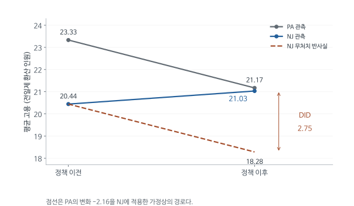

# MHE Chapter 5 - 고정효과, DID, 패널자료 심층 해설

2026-09-16, Week 03 / Session 3. Joshua D. Angrist, Jörn-Steffen Pischke, Mostly Harmless Econometrics (2009).

[원문 PDF](<MHE Ch5 Parallel Worlds - Fixed Effects and DID (2009).pdf>) | [개념 퀴즈](<MHE Ch5 Parallel Worlds - Fixed Effects and DID (2009)_QnA.md>) | [수식·모델 퀴즈](<MHE Ch5 Parallel Worlds - Fixed Effects and DID (2009)_수식모델퀴즈.md>) | [실무 Cheat Sheet](<MHE Ch5 Parallel Worlds - Fixed Effects and DID (2009)_실무CheatSheet.md>)

## 1. 5.1의 질문: 노조가 임금을 올리는가

임금이 높은 이유를 회귀로 설명할 때 학력과 경력은 자료에서 찾을 수 있다. 성실성, 협상 능력, 오래 쌓인 인맥은 측정하기 어렵다. 이 특성이 노조 가입과 임금을 함께 결정하면 학력과 경력을 통제한 회귀에도 선택편향(selection bias)이 남는다. 선택편향은 처치받은 집단이 처치를 받기 전부터 결과에 유리하거나 불리했던 차이가 추정치에 섞이는 문제다.

MHE 3장은 관측한 교란요인을 회귀로 통제하는 방법을, 4장은 중요한 교란요인이 관측되지 않을 때 도구변수(instrumental variable)를 쓰는 방법을 다뤘다. 도구변수는 처치에는 영향을 주지만 결과에는 처치를 거치지 않고는 영향을 주지 않는 변수인데, 원문도 인정하듯 좋은 도구는 찾기 어렵다. 5장은 같은 단위를 여러 시점이나 여러 출생 코호트에 걸쳐 관찰한 자료를 이용해, 관측되지 않지만 시간에 따라 변하지 않는 누락변수를 통제한다. 원문의 표현을 빌리면 이 전략은 수준(level)을 비교하기를 포기하는 대신, 처치집단(treatment group)과 비교집단(comparison group)이 처치가 없었다면 같은 추세를 보였을 것이라는 가정을 요구한다.

장 제목의 Parallel Worlds와 첫머리 인용문("평행우주에 관해 먼저 알아야 할 것은 그것들이 평행하지 않다는 점이다", Douglas Adams)은 이 가정이 저절로 성립하지 않는다는 경고로 읽힌다. 장은 세 가지 방법을 차례로 다룬다. 같은 사람의 시간 변화를 비교하는 개인 고정효과(FE, fixed effects), 개인 대신 주나 코호트 같은 집단의 변화를 비교하는 이중차분(DID, differences-in-differences, 원문 약칭 DD), 최근 소득을 기준으로 참가자와 비참가자를 맞추는 지연 종속변수(lagged dependent variable) 모형(LDV, lagged dependent variable)이다.

노조에 가입한 근로자의 임금이 높다고 하자. 노조의 교섭력이 임금을 높였을 수 있다. 원래 숙련도가 높고 좋은 직장에 다니는 사람이 노조원이 되었을 수도 있다. 한 시점의 여러 사람을 비교하는 단면 비교는 이 둘을 섞는다.

패널은 같은 근로자를 여러 시점에서 관찰한 자료다. 같은 사람의 노조 상태가 바뀔 때 임금이 어떻게 바뀌는지 보면, 시간이 지나도 일정한 능력 차이는 제거할 수 있다. 그러나 승진, 이직, 건강 악화처럼 시간에 따라 변하는 요인까지 자동으로 없어지지는 않는다.

### 1.1 기호를 사람과 연도에 붙인다

| 기호 | 의미 | 첨자가 말해 주는 것 |
|---|---|---|
| i | 근로자 | 서로 다른 사람 |
| t | 시점 | 같은 사람의 다른 연도 |
| y_it | 로그 임금 | 사람과 시점 모두에 따라 변함 |
| d_it | 노조 가입 여부 | 사람도 연도도 필요 |
| A_i | 관찰하지 못한 고정 능력 | t가 없다는 것이 중요한 가정 |
| X_it | 관측한 시간가변 특성 | 예: 나이, 거주지역 변화 |
| alpha_i | 고정 능력이 임금수준에 주는 효과 | alpha+A_i'gamma |
| lambda_t | 공통 시점 효과 | 그 해 모든 근로자의 공통 충격 |
| epsilon_it | 남은 개인별 시점 충격 | 모형으로 설명되지 않는 부분 |

자료 한 행은 근로자 한 명의 특정 연도다. 근로자 5명을 4년 관찰했다면 20행이 된다. $A_i$가 시간불변이라는 것과 그 영향이 일정하다는 것은 서로 다른 가정이다. 원문은 $A_i'\gamma$처럼 계수 $\gamma$에도 시점 첨자를 붙이지 않는다. 능력의 시장보상이 해마다 달라져 $A_i'\gamma_t$가 된다면 단순 평균차감으로 전부 제거되지 않는다.

### 1.2 가정과 관측식 연결

원문은 먼저 선택에 관한 가정을 둔다. 능력 $A_i$, 관측 특성 $X_{it}$, 연도가 같은 사람끼리는 노조 가입 여부가 미처치 잠재임금의 평균을 더 설명하지 않는다는 가정, 곧 $E[y_{0it}\mid A_i,X_{it},t,d_{it}]=E[y_{0it}\mid A_i,X_{it},t]$다. 원문의 말로는 $A_i$와 관측 특성을 조건으로 하면 노조 가입이 무작위 배정(random assignment)과 다름없다. 문제는 $A_i$를 관측하지 못해 이 조건부 비교를 직접 할 수 없다는 데 있다.

그래서 미처치 잠재임금 평균의 모양을 다음과 같이 선형으로 가정한다(식 5.1.1). 잠재임금 $y_{0it}$는 실제 가입 여부와 별개로 정의하며, 가입자에게는 관측되지 않은 비교 대상이 된다.

$$E[y_{0it}\mid A_i,X_{it},t]=\alpha+\lambda_t+A_i'\gamma+X_{it}'\beta.$$

고정효과 추정의 출발점은 이 식에서 $A_i$에 시점 첨자가 없다는 점이다. $A_i'\gamma$의 작은따옴표는 미분 기호가 아니다. 여러 특성을 세로로 모은 벡터를 가로로 바꾸는 전치이며, 실제로는 '성실성의 계수 곱하기 성실성'과 '협상 능력의 계수 곱하기 협상 능력' 등을 더한 값이다. 각 항을 따로 알 필요 없이 그 합계가 같은 사람에게 매년 일정하게 작용한다면 하나의 숫자로 표현할 수 있다. 반대로 숙련 기술의 시장가치가 해마다 달라진다면 사람의 특성 자체가 일정해도 임금에 대한 기여는 일정하지 않다. 고정효과가 해결하는 범위는 특성의 이름보다 모형에서 그 특성이 들어가는 방식에 달려 있다.

$y_0$는 "현재 관측에서 노조가 0인 사람"만을 뜻하지 않는다. 노조원도 노조에 가입하지 않았다면 받았을 잠재임금 $y_0$를 가진다.

원문은 여기에 노조 효과가 가산적이고 모든 사람에게 같다는 가정, $E[y_{1it}\mid A_i,X_{it},t]=E[y_{0it}\mid A_i,X_{it},t]+\rho$를 더한다. 두 가정을 합치고 $\alpha_i\equiv\alpha+A_i'\gamma$, $\epsilon_{it}\equiv y_{0it}-E[y_{0it}\mid A_i,X_{it},t]$로 정의하면 관측식은 다음과 같다(식 5.1.3).

$$y_{it}=\alpha_i+\lambda_t+\rho d_{it}+X_{it}'\beta+\epsilon_{it}.$$

$\alpha_i$는 모든 시간불변 차이를 가산적으로 담는 개인별 절편(intercept)이다. 원문은 이 가정 묶음이 3장에서 회귀를 정당화할 때보다 제한적이라고 밝힌다. 도구변수 없이 패널자료만으로 관측되지 않은 교란요인을 다루려면 선형이고 가산적인 함수형이 필요하기 때문이다. 각주에서는 사람마다 효과가 다른 $\rho_i$를 허용하는 경우도 있다고 언급하고 Wooldridge(2005)를 참고로 든다.

'능력을 통제한다'는 말을 구체적인 사람에게 옮기면 다음과 같다. 같은 경력과 학력을 가진 두 사람이라도 한 사람은 오래 쌓인 협상 능력 때문에 매년 임금이 높을 수 있다. 그 사람이 계속 노조 사업장에서 일한다면 관찰자료에서 능력과 노조 상태가 함께 높다. 개인 절편이 없으면 노조 계수 하나가 두 요소의 영향을 모두 떠안는다. 개인 절편을 허용하면 연구자는 그 사람이 늘 높았다는 사실을 $\alpha_i$로 따로 표현하고, 노조 상태가 변한 해에 평소와 다른 임금 변화가 있었는지를 묻게 된다.

## 2. Within 변환: 개인 평균을 먼저 계산하고 뺀다

앞 식의 문제는 $\alpha_i$를 자료에서 직접 볼 수 없다는 데 있다. 연구자가 원하는 계수는 노조 효과 $\rho$인데, 능력이 높은 사람이 노조에도 많이 가입하면 두 영향을 분리하기 어렵다. 원문은 $\alpha_i$를 사람마다 하나씩 붙는 더미의 계수로, $\lambda_t$를 연도 더미의 계수로 보고 함께 추정하면 된다고 설명한다. 이것이 고정효과 모형이다. 동일인을 여러 번 관찰하면 $\alpha_i$를 하나하나 추정하지 않고 식에서 없애는 방법도 생긴다. 그 사람의 모든 연도에 똑같이 들어간 항은 개인 평균에도 똑같이 들어가기 때문이다.

같은 사람을 T번 관찰했다고 하자. 개인 i의 평균은 모든 t에 대해 더한 뒤 T로 나눈 값이다.

$$\bar y_i=\frac1T\sum_{t=1}^{T}y_{it},\quad
\bar d_i=\frac1T\sum_t d_{it},\quad
\bar X_i=\frac1T\sum_t X_{it}.$$

원래 식의 양변을 평균하면,

$$\bar y_i=\alpha_i+\bar\lambda+\rho\bar d_i+\bar X_i'\beta+\bar\epsilon_i.$$

$\alpha_i$는 매번 같은 값이므로 T번 더해 T로 나누어도 $\alpha_i$다. $\rho$도 일정하므로 평균 밖으로 나올 수 있다. $\bar\lambda$는 연도효과의 평균이다. 이제 원래 관측식에서 개인 평균식을 뺀다(식 5.1.4).

$$
\begin{aligned}
y_{it}-\bar y_i
&=(\alpha_i-\alpha_i)+(\lambda_t-\bar\lambda)\\
&\quad+\rho(d_{it}-\bar d_i)+(X_{it}-\bar X_i)'\beta
+(\epsilon_{it}-\bar\epsilon_i)\\
&=(\lambda_t-\bar\lambda)+\rho(d_{it}-\bar d_i)
+(X_{it}-\bar X_i)'\beta+(\epsilon_{it}-\bar\epsilon_i).
\end{aligned}
$$

첫째 줄에서 $\alpha_i$가 소거되는 데에는 새로운 가정이 필요하지 않다. 순수한 대수다. 그러나 이 식을 OLS로 추정해 $\rho$를 얻으려면 평균차감한 가입변수와 평균차감한 오차가 관련되지 않아야 한다. 이것은 가정이다. 가입 직전의 이직처럼 시간에 따라 변하는 선택요인은 이 변환 뒤에도 문제로 남을 수 있다.

within은 같은 사람의 자기 평균 대비 높고 낮음을 비교한다는 뜻이다. 원문은 이 평균차감 추정량을 within 추정량, 공분산(covariance)분석(analysis of covariance)이라고도 부르고, 평균차감으로 고정효과를 처리하는 것을 고정효과를 흡수(absorb)한다고 표현한다. 조사기간 내내 노조원인 사람은 $d_{it}-\bar d_i=0$이다. 그 사람의 가입수준 자체는 노조 계수를 추정하는 데 쓰이는 개인 내 변동(within 변동)을 제공하지 않는다. 표본에서 빠지지는 않지만, 가입 상태가 변하지 않은 사람들 사이의 임금수준 차이가 $\rho$ 추정에 들어가지는 않는다.

개인 더미를 넣는 방법과 이 계산이 같은 결과를 주는 이유도 회귀의 기본 원리에서 나온다. 사람 더미만으로 임금을 예측하는 회귀를 하면 A에게는 A의 평균, B에게는 B의 평균을 예측값으로 준다. 실제 임금에서 그 예측을 빼면 바로 $y_{it}-\bar y_i$다. 노조 변수를 같은 개인 더미로 설명하고 남는 편차도 $d_{it}-\bar d_i$다. 원문 3장의 회귀 해부 공식(regression anatomy, 흔히 Frisch-Waugh-Lovell 정리라고 부르는 성질)은 다른 설명변수(explanatory variable)의 영향을 먼저 제거하고 남은 부분끼리 회귀해도 관심 계수가 같다고 말한다. 이 성질을 적용하면 개인 더미를 모두 포함한 회귀의 노조 계수와 within 계수가 같아진다. 연도 더미와 시간가변 통제변수(control variable)도 두 회귀에 똑같이 들어가야 이 동등성이 유지된다.

개인 절편이 많다는 사실만으로 노조 계수가 추정 불가능해지지는 않는다. 원문의 예로, 널리 쓰이는 PSID(Panel Survey of Income Dynamics)는 근로연령 남성 약 5,000명을 약 20년 관찰하므로 고정효과가 약 5,000개다. 원문은 이것이 실제로는 문제가 되지 않는다고 말한다. 평균차감으로 계산하면 5,000개의 더미를 직접 다룰 필요가 없고, 표준오차(standard error)도 개인 평균 N개를 추정하느라 잃은 자유도만 보정하면 된다(오차가 등분산이고 시간상 무상관일 때). 각주는 한 걸음 더 나아간다. 시점 수 T를 고정하고 사람 수 N만 늘리면 개별 $\alpha_i$는 일치추정되지 않는다. 사람이 늘 때마다 추정할 모수도 함께 늘기 때문이며, 이를 부수모수 문제(incidental parameters problem)라고 부른다. 그래도 연구자가 관심을 두는 $\rho$ 같은 공통 계수는 일치추정된다. 한 근로자를 두 번만 보았다면 그 사람의 절편은 부정확하지만, 그런 근로자가 많아지면 공통 노조 계수에 관한 정보는 쌓인다.

이 설명은 과거 임금이 설명변수에 없는 정적 선형모형에 해당한다. 13절에서 과거 임금을 설명변수에 넣으면 변환된 설명변수와 오차가 관련되는 별도 문제가 생긴다. 더미가 많다는 사실과 관심 계수의 편향은 서로 다른 원인에서 나오는 문제다.

원문 각주는 고정효과의 대안인 확률효과(random effects) 모형도 짧게 다룬다. 확률효과 모형은 $\alpha_i$가 설명변수와 상관이 없다고 가정한다. 그렇다면 $\alpha_i$를 무시해도 편향은 생기지 않고, 같은 사람의 잔차(residual)가 시점 간에 상관된다는 점만 남는다. 이 가정이 맞으면 GLS로 더 효율적인 추정이 가능하지만, 저자들은 GLS가 OLS보다 강한 가정을 요구하고 효율성 이득은 크지 않을 가능성이 높으며 소표본 성질은 더 나쁠 수 있으므로, OLS를 쓰고 표준오차를 보정하는 쪽을 선호한다고 밝힌다. 노조 사례의 걱정은 바로 능력 $\alpha_i$가 노조 가입과 상관된다는 것이므로 확률효과 가정은 이 질문에 맞지 않는다.

## 3. 두 사람 숫자로 손계산하기

기호로는 $\alpha_i-\alpha_i=0$이 간단하지만, 실제로 어떤 비교가 이루어지는지는 숫자로 보면 더 분명하다. 다음 예에는 원래 결과 수준이 높은 사람과 낮은 사람이 함께 있다. 처치 후 수준을 그대로 비교했을 때와 각 사람의 변화량을 비교했을 때의 답을 계산한다.

다음은 실제 임금자료가 아닌 가상 수치다. 로그 없이 y를 수치로 놓아 소거 과정만 확인한다. A의 고정수준은 10, B는 20이고 2기에 모두에게 공통 충격 +1이 생기며, 처치효과(treatment effect)는 +2다.

| 사람 | 1기 d | 2기 d | 1기 y | 2기 y | y의 변화 |
|---|---:|---:|---:|---:|---:|
| A | 0 | 1 | 10 | 13 | 3 |
| B | 0 | 0 | 20 | 21 | 1 |

처치 후 수준만 비교하면 A-B=13-21=-8이다. 원래 B가 10 높았기 때문이다. 반면 변화의 차이는 3-1=2다.

평균차감으로 계산해도 같은 답이 나온다. A의 평균 y는 11.5, 평균 d는 0.5다. 평균차감한 y는 -1.5와 +1.5, d는 -0.5와 +0.5다. B의 평균 y는 20.5이고 평균차감한 y는 -0.5와 +0.5, d는 두 기간 모두 0이다. 양쪽 모두 고정수준 10과 20이 사라졌다. 2기 더미도 평균을 빼면 두 사람 모두 -0.5와 +0.5가 된다. 평균차감한 y를 평균차감한 d와 2기 더미에 회귀하면(교육용 보충 계산), B의 두 관측에서 $-0.5=-0.5\lambda$이므로 연도효과 $\lambda=1$이 먼저 정해지고, A의 관측 $-1.5=-0.5\lambda-0.5\rho$에 대입하면 $\rho=2$가 나온다. 개인 고정효과는 B의 원래 높은 수준을, 시점 고정효과는 모두에게 생긴 증가분 1을 조정한다. A의 y 변화 3을 그대로 처치효과라고 하면 공통 시간 충격 1이 섞인다.

B는 노조 상태가 바뀌지 않으므로 노조 변수의 개인 내부 편차가 모두 0이다. 그렇다고 이 예에서 B를 지워도 같은 답을 얻는 것은 아니다. 방금 계산에서 연도효과 1은 B의 관측으로 정해졌다. A 혼자만 보면 증가분 3 중 노조의 몫과 경기의 몫을 나눌 수 없다. 노조 상태가 변한 사람이 처치 변이를 제공하고, 변하지 않은 사람은 공통 시간효과나 다른 통제변수의 계수를 추정하는 데 기여한다.

반례로 A가 노조에 가입한 바로 그해에 A에게만 승진이 일어났다고 하자. 승진이 임금을 2만큼 더 올렸다면 A의 사후 결과는 15가 된다. 같은 회귀를 돌리면 노조 계수는 4로 나오지만 노조의 실제 효과는 여전히 2다. 사람별 고정수준과 공통 경기를 정확하게 제거해도, 노조 가입과 동시에 일어난 개인별 변화가 남으면 두 효과는 섞인다. 패널자료를 가졌다는 사실만으로 유효한 인과 비교가 만들어지지는 않는다는 점이 이 반례에서 드러난다.

## 4. First difference는 무엇을 빼는가

개인 평균을 빼는 방법 말고도 고정효과를 없애는 시간 변환이 있다. 올해와 작년에 같은 고정 능력이 작용했으므로 올해 결과에서 작년 결과를 빼도 그 능력은 사라진다. 이 방법을 1차차분(first difference)이라고 한다. 원문은 이를 대안으로 제시하며(식 5.1.5), 어떤 기간끼리 빼느냐에 따라 사용하는 변이와 오차의 성질이 달라진다.

평균 대신 바로 이전 관측을 빼면 다음과 같다.

$$y_{it}-y_{i,t-1}=\lambda_t-\lambda_{t-1}
+\rho(d_{it}-d_{i,t-1})+(X_{it}-X_{i,t-1})'\beta
+\epsilon_{it}-\epsilon_{i,t-1}.$$

$\Delta$는 한 해에서 다음 해로의 변화를 나타내는 기호다. $\Delta y_{it}=y_{it}-y_{i,t-1}$이며, 첫 관측에는 직전값이 없으므로 차분하면 사람마다 관측이 하나 줄어든다.

T=2일 때 $\bar y_i=(y_{i1}+y_{i2})/2$이므로,

$$y_{i1}-\bar y_i=-\Delta y_i/2,\qquad
y_{i2}-\bar y_i=\Delta y_i/2.$$

d와 X도 똑같이 변환되므로, 두 시점에서는 within 자료를 두 줄로 적든 차분 자료를 한 줄로 적든 같은 변화량을 일정한 비율로 다시 표현한 것에 불과하다. 따라서 두 방법의 기울기가 같다. 세 시점부터는 사정이 달라진다. within은 1기와 3기 사이의 변화까지 개인 평균에 반영하고, 차분은 1기와 2기, 2기와 3기의 인접 변화에만 초점을 둔다. 두 변환의 가중 방식이 다르므로 일반적으로 추정값이 같지 않다. 원문은 둘 다 쓸 수 있다고 하면서, 오차가 등분산이고 시간상 무상관이며 기간이 셋 이상이면 평균차감(within)이 더 효율적이라고 판단한다. 차분은 손으로 계산하기에는 편하지만 표준오차를 따로 보정해야 한다.

보정이 필요한 이유는 다음과 같다. 원래 $\epsilon$이 시간상 독립이고 분산이 $\sigma^2$라도 인접한 두 차분오차는 독립이 아니다.

$$Cov(\epsilon_t-\epsilon_{t-1},\epsilon_{t-1}-\epsilon_{t-2})=-\sigma^2.$$

가운데 $\epsilon_{t-1}$이 앞 차분에는 음수로, 뒤 차분에는 양수로 들어가기 때문이다. 이 음의 상관은 경제가 번갈아 호황과 불황을 겪는다는 가정에서 나온 것이 아니다. 가상으로 2기의 설문오차가 우연히 크게 양수였다면 2기에서 1기를 뺀 변화는 커지고, 3기에서 2기를 뺀 변화는 작아진다. 같은 오차를 한 번은 더하고 한 번은 뺐기 때문이다. 원래 오차가 독립이어도 변환 뒤에는 독립성을 그대로 쓸 수 없다. 차분이 내생성(endogeneity)을 줄일 수 있다는 것과 표준오차를 보통 공식으로 계산해도 된다는 것은 별개의 문제이며, 계수의 식별(identification)조건과 표준오차에 필요한 오차 상관은 따로 검토해야 한다.

## 5. FE가 요구하는 외생성과 측정오차

고정효과를 제거한 다음에도 노조 가입의 변화가 어떻게 생겼는지 설명이 필요하다. 예를 들어 임금이 낮아져서 노조에 가입했다면, 가입 변화에는 이미 임금 충격이 반영되어 있다.

원문은 1.2절의 조건부 독립(conditional independence) 가정(능력과 관측 특성이 같으면 가입이 무작위와 다름없다)만 적는다. 패널 계량경제학에서는 평균차감 뒤 OLS가 일치추정량(consistent estimator)이 되는 충분조건으로 엄격한 외생성(strict exogeneity)을 흔히 쓰는데, 이는 원문에 없는 교육용 보충이다. 엄격한 외생성은 $E[\epsilon_{it}\mid\alpha_i,d_{i1},\dots,d_{iT},X_{i1},\dots,X_{iT}]=0$, 곧 어느 시점의 오차도 과거, 현재, 미래 모든 시점의 가입 여부와 통제변수에 대해 평균이 0이라는 조건이다. 현재뿐 아니라 미래 처치까지 조건에 들어가는 이유는 within 변환이 모든 시점의 d를 포함하는 평균 $\bar d_i$를 빼기 때문이다. 평균차감한 가입변수 $d_{it}-\bar d_i$ 안에 미래의 가입 여부가 섞여 들어간다.

예를 들어 올해 임금 충격 때문에 내년에 노조에 가입하면 $d_{i,t+1}$이 $\epsilon_{it}$와 관련될 수 있다. $\alpha_i$를 제거해도 이런 피드백은 없어지지 않는다. 엄격한 외생성은 충분조건의 한 예이며, 모든 패널 설계가 정확히 이 조건만 쓰는 것은 아니다.

### 원문 Table 5.1.1: 같은 자료에 단면 회귀와 고정효과 회귀를 적용한 결과

앞 절까지는 개인 평균을 빼면 시간불변 능력이 식에서 사라진다는 대수를 살펴보았다. 이 표 뒤에서는 그 대가로 측정오차(measurement error)의 비중이 커질 수 있다는 원문의 경고를 다룬다. Freeman(1984)은 선택이 관측되지 않지만 고정된 개인 특성에 따라 이루어진다는 가정 아래 노조 임금효과를 추정했다. 네 조사자료 각각에 단면 회귀와 고정효과 회귀를 적용했으므로, 한 행 안의 두 숫자를 비교하면 개인 고정효과를 허용했을 때 노조 계수가 얼마나 움직이는지 알 수 있다.

*원문 Table 5.1.1 전체 재구성. 원문 PDF 5쪽(인쇄 p.225). 마지막 열은 원문에 없으며 이 문서가 두 열을 빼서 덧붙인 값이다.*

| 조사자료 (Survey) | 단면 추정치 | 고정효과 추정치 | FE - 단면 (이 문서 계산) |
|---|---:|---:|---:|
| May CPS, 1974-75 | .19 | .09 | -.10 |
| National Longitudinal Survey of Young Men, 1970-78 | .28 | .19 | -.09 |
| Michigan PSID, 1970-79 | .23 | .14 | -.09 |
| QES, 1973-77 | .14 | .16 | +.02 |

*원문 주석 요약: Freeman(1984)에서 가져온 표로, 노조의 상대임금 효과(union relative wage effect)를 단면 자료와 패널(고정효과)로 각각 추정했다. 단면 추정에는 인구학적 변수와 인적자본 변수를 통제했다.*

행은 조사자료 하나이고, 두 열은 같은 자료에 적용한 서로 다른 추정 방법이다. 칸의 숫자는 노조 가입 더미의 계수다. 표 주석에는 종속변수가 적혀 있지 않지만, 원문 5.1절은 $y_{it}$를 (로그) 임금으로 정의하고 이 표를 그 모형의 추정 예로 제시한다. 이 설정을 따르면 May CPS 단면 추정치 .19는 인구학적 변수와 인적자본이 같은 근로자 사이에서 노조원의 로그임금이 0.19 높다는 뜻이다. 백분율로 바꾸면 $e^{0.19}-1\approx0.21$, 약 21%다. 같은 자료의 고정효과 추정치 .09는 약 9.4%에 해당한다. 로그 차이와 백분율은 값이 작을 때 비슷하지만 NLS 단면치 .28에서는 $e^{0.28}-1\approx0.32$로 벌어진다.

세 자료(May CPS, NLS 청년 남성, PSID)에서는 고정효과를 넣자 계수가 0.09-0.10 줄었다. May CPS는 절반 이하로 떨어졌고 NLS와 PSID는 3분의 1가량 줄었다. QES만 .14에서 .16으로 올랐다. 원문 본문은 이를 "단면 추정치가 대체로 더 높다(.14-.28 대 .09-.19)"고 요약하고, 단면 추정치에 양의 선택편향이 있었을 가능성을 제시하면서도 선택편향이 유일한 설명은 아니라고 덧붙인다.

이 표로 말할 수 있는 것은 네 자료 중 세 자료에서 동일인의 노조 상태 변화만 사용하면 노조 임금효과가 작아졌다는 사실, 그리고 그 방향이 "숙련도가 높은 사람이 노조에 더 많이 있었다"는 설명과 맞는다는 점까지다. 표에는 표준오차와 표본 크기가 없으므로 단면과 FE의 차이 0.09가 통계적으로 의미 있는지는 판단할 수 없다. 고정효과 모형에 어떤 시간가변 통제변수가 들어갔는지도 주석에 없다. 감소분 0.09를 선택편향의 크기로 그대로 해석할 수도 없다. 아래에서 설명하듯 차분한 노조 변수에는 응답 오류의 비중이 커지므로, 감소분의 일부는 측정오차에 따른 감쇠일 수 있다. 행끼리 비교할 때도 조심해야 한다. 조사기간이 다르고 NLS는 청년 남성만 조사했으므로, 자료 사이의 차이에는 방법 차이뿐 아니라 표본 차이도 섞여 있다. QES에서 FE가 더 커진 이유는 원문이 설명하지 않는다.

원문은 고정효과 추정치가 측정오차에 따른 감쇠편향(attenuation bias), 곧 계수가 0 쪽으로 줄어드는 편향에 "악명 높게" 취약하다고 경고한다. 근거는 두 가지 사실의 조합이다. 노조 가입 같은 경제 변수는 지속성이 강하다. 올해 노조원인 사람은 내년에도 노조원일 가능성이 높다. 반면 측정오차는 해마다 바뀐다. 올해는 잘못 응답하거나 잘못 코딩되었지만 내년에는 제대로 기록될 수 있다. 그러면 한 해 단위로는 소수의 응답만 틀렸더라도, 관측된 연도 간 가입 상태 변화는 대부분 잡음일 수 있다.

이 문제는 노조의 실제 효과가 작다는 주장과 다르다. 대부분의 사람이 조사기간 내내 같은 가입상태라면, 수준 자료에는 노조원과 비노조원의 차이가 많이 있어도 실제 가입상태가 변한 사건은 드물다. 그런데 응답자가 한 해만 잘못 답하면 자료에는 가입 또는 탈퇴가 기록된다. 연구자는 임금 변화가 거의 없는 가짜 가입사건을 실제 가입사건과 함께 사용하게 된다. 원문의 표현으로는 식 (5.1.4)나 (5.1.5)처럼 차분하거나 평균을 뺀 설명변수에는 수준 설명변수보다 측정오차가 더 많다. 측정오차의 구조에 따라 결과는 달라지지만, 이것이 FE 계수가 작아지는 한 설명이다. 따라서 FE 계수의 감소를 해석할 때는 선택편향을 제거한 효과와 측정오차 때문에 0에 가까워진 효과를 함께 검토한다.

### 차분 뒤 측정오차가 상대적으로 커지는 과정을 분산으로 확인하기

노조 상태가 거의 바뀌지 않는데 조사 응답만 가끔 잘못 기록된다면, 관측된 상태 변화 중 상당수가 응답 오류일 수 있다. 이 과정을 식으로 보기 위해 연속형 설명변수의 고전적 측정오차 모형 $x^*_{it}=x_{it}+v_{it}$를 사용한다. 이는 노조 더미의 오분류를 정확히 모형화한 식이 아니며, 원문의 경고를 설명하기 위한 교육용 보충이다. 참값과 측정오차는 서로 독립, 측정오차도 시점 간 독립이고 분산은 $\sigma_v^2$라고 둔다.

차분하면 $\Delta x^*=\Delta x+v_t-v_{t-1}$이다. 두 오차가 독립이므로

$$
Var(\Delta v)=Var(v_t)+Var(v_{t-1})=2\sigma_v^2.
$$

참값은 각 시점 분산이 $\sigma_x^2$, 인접 시점 상관이 $r$인 정상 과정이라고 두면

$$
Var(\Delta x)=2\sigma_x^2-2r\sigma_x^2
=2\sigma_x^2(1-r).
$$

참값이 오래 유지되어 $r$이 1에 가까우면 차분의 신호는 작아지지만 응답오차의 차분 분산은 그대로다. 가상으로 $\sigma_x^2=1$, $\sigma_v^2=0.1$, $r=0.9$이면 수준 자료에서 신호가 관측 분산에서 차지하는 비중은 $1/(1+0.1)\approx0.909$인데 차분에서는 $0.2/(0.2+0.2)=0.5$다. 다른 편향이 없는 단순 회귀의 고전적 조건에서는 이 비율이 계수가 0 쪽으로 줄어드는 정도를 결정한다. 이 가상 수치에서는 수준 회귀의 계수가 참값의 약 91%, 차분 회귀의 계수가 참값의 절반으로 나온다.

두 시점으로 이루어진 패널에서는 이 차분회귀와 개인 고정효과 회귀의 기울기가 같다(4절). 여러 시점의 고정효과 분석에서도 개인 내 변동 중 실제 신호와 측정오차가 차지하는 비중을 살펴야 한다. 고정효과 계수가 작아졌다는 사실만으로 단면 OLS의 선택편향이 모두 제거되었다고 단정하지 못하는 이유다. 개인 고정 특성을 제거한 이득과 남은 변이가 얼마나 정확하게 측정되었는지를 함께 보아야 한다.

### 쌍둥이 비교: 고정효과는 교란과 함께 유용한 변이도 제거한다

원문은 측정오차 문제의 변형으로, 차분이나 평균차감이 나쁜 변이와 좋은 변이를 함께 없앤다는 점을 지적한다. 목욕물(누락변수 편향)을 버리면서 아기(관심 변수의 유용한 정보)까지 상당 부분 버릴 수 있다는 비유다. 예로 드는 것이 쌍둥이 자료로 교육의 임금효과를 추정하는 연구다. 시간 차원은 없지만 구조는 노조 문제와 같다. 쌍둥이는 관측되지 않는 가족 배경과 유전적 배경을 공유하므로, 쌍둥이 쌍 표본에 가족 고정효과를 넣으면 공동 배경을 통제할 수 있다. 한 가족에 쌍둥이가 두 명이므로 이는 쌍 안의 임금 차이를 쌍 안의 학력 차이에 회귀하는 것과 같다.

Ashenfelter and Krueger(1994), Ashenfelter and Rouse(1998)는 이 방법으로 교육 수익률을 추정했고, 원문이 "놀랍게도"라고 적을 만큼 가족 내 추정치가 OLS 추정치보다 크게 나왔다. 노조 사례에서 FE가 대체로 작아진 것과 반대 방향이다. 원문은 여기서 다른 질문을 던진다. 거의 모든 면에서 비슷한 두 사람 사이에 학력 차이는 왜 생겼는가. Bound and Solon(1999)은 쌍둥이 사이에도 작은 차이가 있다고 지적한다. 먼저 태어난 쪽이 대체로 출생 체중과 IQ 점수가 높다(출생 시점 차이는 분 단위다). 쌍둥이 내부의 능력 차이는 크지 않지만 학력 차이도 크지 않다. 그래서 작은 능력 차이라도 학력 차이에 비해 상대적으로 크면 추정치에 상당한 편향을 만들 수 있다.

이 논리를 교육용 보충으로 풀면 다음과 같다. 단순화한 선형모형에서 쌍 안 차분 회귀의 편향은 능력이 임금에 주는 효과에, '쌍 안의 능력 차이와 학력 차이의 공분산'을 '쌍 안의 학력 차이의 분산'으로 나눈 값을 곱한 크기다. 가족 고정효과는 분자의 큰 부분(가족 배경)을 제거하지만 분모의 큰 부분(가족 간 학력 차이)도 함께 제거한다. 분모가 많이 줄면 남은 작은 분자가 다시 중요해진다. 둘이 비슷하다고 남은 차이가 무작위인 것은 아니다. 한 쌍 안에서도 건강, 학습 관심, 부모의 개별 투자가 다르면 그 차이는 교육기간과 임금을 함께 바꿀 수 있다.

원문은 측정오차와 관련 문제에 대한 대응으로 두 가지를 소개한다. 하나는 도구변수다. Ashenfelter and Krueger(1994)는 각 쌍둥이가 보고한 형제의 학력을 본인 보고 학력의 도구로 썼다. 이 장치는 주로 자기보고 학력의 측정오차를 다룬다. 두 보고의 오류가 서로 관련되어 있거나 쌍 안에 능력 차이가 남아 있다면 모든 문제가 한 번에 해결되지는 않는다. 다른 하나는 측정오차의 크기에 관한 외부 정보를 가져와 단순 추정치를 보정하는 방법이다. Card(1996)는 별도의 검증 조사(validation survey)로 노조 상태 보고의 오류 정도를 파악해 패널 추정치를 보정했다. 원문은 이런 복수 보고나 반복 측정 자료가 드물다고 덧붙이고, 적어도 고정효과 추정치를 해석할 때 지나치게 강한 주장을 피하라고 권한다.

## 6. 5.2의 질문: 뉴저지 최저임금 인상이 고용을 줄였는가

고정효과 전략에는 같은 개인(또는 기업 등 관찰 단위)을 반복 관찰한 패널이 필요하다. 그런데 관심 설명변수가 주나 코호트처럼 더 큰 집단 수준에서만 변하는 경우가 많다. 원문의 예로, 임신한 근로자의 건강보험 혜택에 관한 주 정책은 시간에 따라 바뀌지만 같은 주 안의 근로자에게는 모두 같다. 이런 정책을 평가할 때 걱정해야 할 누락변수는 주와 연도 수준에서 움직이는 변수다. 집단 수준의 누락변수를 집단 고정효과로 처리할 수 있다면, 여기서 이중차분(DD, 이 문서에서는 DID로 표기) 식별 전략이 나온다.

원문은 DID의 원형으로 의사 John Snow(1855)의 콜레라 연구를 소개한다. Snow는 당시 지배적이던 '나쁜 공기' 이론에 맞서 콜레라가 오염된 식수로 전파된다는 것을 보이려 했다. 1849년에는 Southwark and Vauxhall 회사와 Lambeth 회사가 모두 런던 중심부의 더러운 템스강에서 물을 끌어왔다. 1852년 Lambeth 회사만 취수장을 오수가 적은 상류로 옮겼다. Lambeth가 물을 공급하는 지역의 콜레라 사망률은 Southwark and Vauxhall 공급 지역의 사망률 변화에 비해 크게 떨어졌다. 두 지역의 사망률 수준을 비교하는 대신, 같은 기간의 변화를 비교했다는 점이 DID의 구조다.

노조 가입은 개인마다 달라지지만 최저임금은 같은 주의 사업장에 함께 적용된다. 따라서 식당 하나의 고정효과보다는, 정책을 시행한 주와 시행하지 않은 주가 같은 기간에 얼마나 변했는지를 비교하는 쪽이 자연스럽다. 경기 변화 때문에 모든 식당이 고용을 줄였을 수도 있으므로 정책 시행 전후 자료와 비교지역 자료가 함께 필요하다.

경쟁적 노동시장 모형에서는 최저임금 인상이 우하향하는 노동수요곡선을 따라 고용을 줄인다. 그렇다면 최저임금 정책이 도우려던 저임금 근로자가 오히려 일자리를 잃을 수 있다. Card and Krueger(1994)는 뉴저지의 큰 최저임금 인상을 이용해 이 예측을 점검했다. 1992년 4월 1일 뉴저지는 주 최저임금을 4.25달러에서 5.05달러로 올렸고, 델라웨어강 건너편의 펜실베이니아 동부는 같은 기간 4.25달러를 유지했다. 연구자들은 두 지역의 패스트푸드 식당(Burger King, Wendy's 등) 고용을 1992년 2월과 11월에 조사했다.

패스트푸드점을 고른 이유도 연구 질문과 연결된다. 최저임금 근처에서 임금을 받는 근로자가 많은 업종이라 인상이 실제 인건비를 바꿀 가능성이 크다. 이미 훨씬 높은 임금을 지급하는 업종에서 고용 변화가 없었다면, 정책이 노동수요를 바꾸지 않은 것인지 애초에 해당 사업장에 거의 작용하지 않은 것인지 구분하기 어렵다. 처치가 실제로 영향을 줄 대상을 관찰하는 것이 비교 설계의 출발점이다.

원문은 DID를 집계 수준에서 적용한 고정효과 추정의 한 형태로 소개한다. 기호부터 정리하면, i는 식당, s는 주(뉴저지 또는 펜실베이니아), t는 조사시점(인상 전 2월 또는 인상 후 11월)이다. $y_{1ist}$는 주 최저임금이 높을 때의 고용, $y_{0ist}$는 낮을 때의 고용인 잠재결과(potential outcome)이고, 실제로는 둘 중 하나만 관측된다. 예를 들어 1992년 11월 뉴저지에서는 $y_{1ist}$를 본다. 처치 여부 $d_{st}$에 i가 없는 이유는 같은 주와 시점의 식당이 같은 정책을 받기 때문이다. 결과 $y_{ist}$는 식당마다 달라 i가 필요하다.

DID는 처치가 없을 때의 잠재결과에 가산 구조를 가정하는 데서 출발한다(식 5.2.1).

$$E[y_{0ist}\mid s,t]=\gamma_s+\lambda_t.$$

최저임금 변화가 없다면 고용은 시간에 따라 변하지 않는 주 효과 $\gamma_s$와 두 주에 공통인 시점 효과 $\lambda_t$의 합으로 결정된다는 뜻이다. 뉴저지와 펜실베이니아의 고용 수준은 $\gamma_s$만큼 달라도 된다. 미처치 시간변화는 두 주 모두 $\lambda_{post}-\lambda_{pre}$다. 이것이 평행추세(parallel trends)의 단순 가산 표현이다. 원문은 주 효과 $\gamma_s$가 5.1절의 개인 효과 $\alpha_i$와 같은 역할을 한다고 설명한다.

정책이 주 단위로 바뀐다고 해서 개별 식당 고정효과를 쓸 수 없는 것은 아니다. 같은 식당을 전후에 관찰했다면 식당 절편으로 그 식당의 일정한 특성을 조정할 수 있다. 그래도 정책값은 뉴저지의 모든 식당에서 함께 바뀌므로 독립적인 정책 비교가 식당 수만큼 생기지는 않는다. 자료의 단위(식당)와 처치가 결정되는 단위(주)가 다르다는 점이 중요하다. 정책의 영향을 판단할 때는 뉴저지에만 생긴 다른 충격이 있었는지를 검토하게 된다.

## 7. 네 칸을 직접 빼서 DID 만들기

앞의 가정을 실제 계산으로 옮기면 다음과 같다. 효과가 모든 식당에 같은 상수 $\delta$라고 가정하면, 관측 고용은 $y_{ist}=\gamma_s+\lambda_t+\delta d_{st}+\epsilon_{ist}$로 쓸 수 있다(식 5.2.2). 이를 더미 회귀로 바꾸기 위해 뉴저지 여부를 나타내는 $NJ_s$와 인상 이후 여부를 나타내는 $Post_t$를 만든다(원문은 $Post_t$를 $d_t$로 쓴다). 둘 다 0 또는 1이다. 두 변수를 곱하면 뉴저지의 인상 이후 관측에서만 1이 되며, 이 곱이 처치 여부 $d_{st}$와 같다. 그 칸의 추가 변화를 $\delta$로 표현하면 원문 식 (5.2.3)이 된다.

$$y_{ist}=\alpha+\gamma NJ_s+\lambda Post_t+\delta NJ_sPost_t+\epsilon_{ist}.$$

| 집단/시점 | 평균 예측값 |
|---|---|
| PA 이전 | alpha |
| PA 이후 | alpha+lambda |
| NJ 이전 | alpha+gamma |
| NJ 이후 | alpha+gamma+lambda+delta |

PA의 전후 차이는 $\lambda$이고 NJ의 전후 차이는 $\lambda+\delta$다. 둘을 다시 빼면 $\delta$만 남는다.

$$\delta=(\bar y_{NJ,post}-\bar y_{NJ,pre})
-(\bar y_{PA,post}-\bar y_{PA,pre}).$$

원문은 회귀 계수와 식 (5.2.2)의 모수를 직접 연결해 둔다. $\alpha=\gamma_{PA}+\lambda_{Feb}$, $\gamma=\gamma_{NJ}-\gamma_{PA}$, $\lambda=\lambda_{Nov}-\lambda_{Feb}$이고, $\delta$는 위의 이중차분이다. 모집단 평균으로 정의한 이 이중차분이 관심 인과효과이며, 표본에서는 네 칸의 표본평균으로 대신 계산한다.

### 원문 Table 5.2.1: 네 칸 평균과 여백의 차이

위 식은 네 평균을 두 번 빼라는 지시다. Card와 Krueger(1994)의 표는 그 네 칸과 뺄셈 결과를 한 번에 보여 주고, 각 숫자에 표준오차도 붙여 놓았다. 손계산으로 넘어가기 전에 표의 구조를 먼저 파악해 두면 어느 칸에서 어느 칸을 빼는지 혼동하지 않는다.

*원문 Table 5.2.1 전체 재구성. 원문 PDF 10쪽(인쇄 p.230). 원자료는 Card and Krueger(1994) table 3이며, 괄호 안은 표준오차다.*

| 변수 | PA (i) | NJ (ii) | 차이, NJ - PA (iii) |
|---|---:|---:|---:|
| 1. 인상 전 FTE 고용, 이용 가능한 전체 관측 | 23.33 (1.35) | 20.44 (.51) | -2.89 (1.44) |
| 2. 인상 후 FTE 고용, 이용 가능한 전체 관측 | 21.17 (.94) | 21.03 (.52) | -.14 (1.07) |
| 3. 평균 FTE 고용의 변화 | -2.16 (1.25) | .59 (.54) | 2.76 (1.36) |

*원문 주석 요약: 뉴저지 최저임금 인상 전후 펜실베이니아와 뉴저지 식당의 평균 정규직환산(FTE, full-time-equivalent) 고용이다. 표본은 고용 자료가 있는 모든 식당이다. 폐업한 6개 식당의 고용은 0으로 두었고, 일시 휴업한 4개 식당은 결측으로 처리했다.*

1-2행과 (i), (ii)열이 만나는 네 칸이 기본 자료다. 단위는 식당 한 곳당 평균 정규직환산 고용 인원이다. (iii)열은 같은 시점에 두 주의 수준 차이를, 3행은 같은 주의 2월 대비 11월 변화를 보여 준다. 오른쪽 아래 2.76은 두 방향의 차이를 모두 거친 DID다. 이 값은 두 경로로 계산된다. 3행을 가로로 빼면 $0.59-(-2.16)=2.75$, (iii)열을 세로로 빼면 $-0.14-(-2.89)=2.75$다. 인쇄된 반올림 값으로는 두 경로 모두 2.75이고, 원문 최종 보고치는 2.76이다. 1행의 -2.89는 인상 전부터 뉴저지 식당이 펜실베이니아 식당보다 평균 2.89명 적었다는 뜻이며, 회귀식에서는 주 더미 계수 $\gamma$가 이 수준 차이를 흡수한다. 원문 본문의 요약도 같다. 2월에는 펜실베이니아 고용이 뉴저지보다 다소 높았지만 11월까지 줄었고, 뉴저지 고용은 약간 늘었다. 두 변화가 합쳐져 양의 DID가 나왔으며, 이는 최저임금 인상이 기업을 노동수요곡선 위쪽으로 밀어 올렸다면 예상했을 결과와 반대다.

표준오차를 함께 보면 결과의 정밀도를 판단할 수 있다. DID 2.76을 표준오차 1.36으로 나누면 약 2.03이다. 정규근사로 95% 구간을 만들면 $2.76\pm1.96\times1.36$, 대략 0.09에서 5.43이다. 이 자료는 고용 효과가 0에 가까운 경우부터 식당당 5명 이상 늘어난 경우까지와 양립한다. 표준오차 사이의 관계도 살펴볼 만하다. (iii)열과 DID의 표준오차는 두 주를 독립 표본으로 보고 합성한 값과 일치한다. 예를 들어 $\sqrt{1.25^2+0.54^2}\approx1.36$이다. 반면 3행 PA 변화의 표준오차 1.25는 1행과 2행을 독립으로 합성한 $\sqrt{1.35^2+0.94^2}\approx1.65$보다 작고, NJ도 0.73 대신 0.54다. 같은 식당을 전후로 두 번 조사해 전후 고용이 양의 상관을 가지기 때문으로 보이지만, 원문은 표준오차 계산 방법을 설명하지 않는다. 이 해석은 이 문서의 추론이다.

이 표로 말할 수 있는 것은 1992년 2월과 11월 사이에 이 표본의 뉴저지 식당 고용이 펜실베이니아 대비 줄지 않았고, 경쟁시장 노동수요 모형이 예측하는 음의 방향과 반대 부호가 나왔다는 사실이다. 말할 수 없는 것도 분명하다. 두 시점만 있으므로 평행추세를 표 안에서 점검할 수 없고, 원문도 이어지는 Figure 5.2.2에서 펜실베이니아가 좋은 비교집단인지 다시 묻는다. 구간이 넓어서 "최저임금 인상이 고용을 약 2.8명 늘렸다"는 점추정치를 정확한 효과 크기로 받아들이기 어렵다. 근로시간, 가격, 폐업 처리 방식(폐업은 0, 일시 휴업은 결측)에 따른 민감도는 표에 나타나지 않으며, 다른 업종이나 장기 효과로 일반화할 근거도 이 표에는 없다.

앞 문단의 가로 계산을 원래 네 칸의 수치(PA 23.33에서 21.17, NJ 20.44에서 21.03)로 한 줄에 적으면 다음과 같다.

$$(21.03-20.44)-(21.17-23.33)=0.59-(-2.16)=2.75.$$

원문 표의 최종 DID는 2.76이고 표준오차는 1.36이다. 손계산 2.75와 0.01 차이가 나는 것은 입력 평균의 반올림으로 설명할 수 있는 범위다. 네 평균이 각각 소수 둘째 자리에서 반올림되었다면 각 칸의 오차는 최대 0.005이고, 네 칸을 더하고 빼는 DID의 오차는 최대 0.02다. 반올림하지 않은 평균으로 계산한 DID는 2.73에서 2.77 사이 어딘가에 있으므로 2.76과 모순되지 않는다(원문은 반올림 전 값을 제시하지 않는다). 이 문서에서는 반올림된 평균으로 계산한 값 2.75와 원문 최종 보고치 2.76을 구별해 표시한다.

반사실(counterfactual)을 숫자로 만들면, 뉴저지가 처치 없이 펜실베이니아처럼 2.16 줄었다고 가정해 $20.44-2.16=18.28$이다. 실제 21.03과의 차이가 2.75다. 이 18.28을 정당화하는 것이 평행추세 가정이다.

네 칸의 평균을 정확히 재현하는 회귀라는 사실과 DID가 인과효과라는 사실은 서로 다른 단계에서 성립한다. 앞 회귀에는 절편, 주 더미, 사후 더미, 교호항(interaction term)의 네 계수가 있고 비교할 평균도 네 개다. 그래서 어떤 네 평균이 주어져도 그대로 표현할 수 있으며, 이런 모형을 포화모형(saturated model)이라고 한다. 평행추세가 틀려도 회귀 프로그램은 같은 DID 숫자를 계산한다. 프로그램이 가정을 확인해 준 것은 아니다. 원문이 꼽는 회귀 형식의 장점은 다른 데 있다. DID 추정치와 표준오차를 한 번에 얻을 수 있고, 비교 주나 사전 기간을 추가할 때 주 더미와 기간 더미만 늘리면 된다.

계수의 역할을 실제 비교로 풀면 절편은 정책 전 펜실베이니아의 평균이고, 주 더미 계수는 정책 전부터 있었던 두 주의 격차다. 사후 더미 계수는 펜실베이니아의 변화다. 마지막 교호항은 그 두 조정을 한 뒤에도 뉴저지 사후 평균에 남는 추가분이다. 이 추가분에 최저임금 외의 뉴저지 고유 변화가 없다면 정책효과로 해석한다. 이런 설명이 있어야 '교호항이 유의했다'는 결과가 어떤 경제적 주장인지 알 수 있다.

<!-- learning-figure:did-counterfactual -->

*그림 설명: 본문의 Table 5.2.1 반올림 평균을 사용했다. 손계산 DID는 2.75이며 원문 최종 보고치는 2.76이다.*

점선은 관측된 뉴저지의 경로가 아니다. 펜실베이니아의 감소폭 2.16을 뉴저지에도 적용한 반사실이다. 사후 두 주의 높이 차이를 읽는 대신, 뉴저지의 실제 결과와 점선 끝의 세로 간격을 읽어야 한다.

<!-- /learning-figure -->

## 8. 평행추세는 무엇에 대한 가정인가

원문은 이 가정을 "처치가 없었다면 두 주의 고용 추세가 같았을 것"이라고 요약하고, 처치는 이 공통 추세에서 벗어나는 크기로 나타난다고 설명한다(Figure 5.2.1은 비교 주의 추세, 처치 주의 실제 추세, 처치 주의 반사실 추세를 세 선으로 그린다). 기대값으로 정확히 쓰면 다음과 같다.

$$E[y_{0,post}-y_{0,pre}\mid T=1]
=E[y_{0,post}-y_{0,pre}\mid T=0].$$

이 식의 $T$는 2절에서 쓴 관측 횟수 T와 다른 기호로, 처치집단이면 1, 비교집단이면 0인 표시다. 좌변은 처치집단(뉴저지)이 처치를 받지 않았다면 겪었을 평균 변화, 우변은 비교집단(펜실베이니아)이 실제로 겪은 평균 변화다. 이 가정은 두 집단의 수준이 같기를 요구하지 않는다. 요구하는 것은 평균 변화가 같다는 것이며, 처치집단의 변화는 관측되지 않는 반사실이다. 처치집단의 사후 $y_0$를 볼 수 없으므로 이 조건은 직접 검정할 수 없다. 사전기간이 여러 개 있으면 사전 추세가 비슷했는지는 확인할 수 있고 그것이 설득력을 높이지만, 처치 이후의 반사실 추세를 증명하지는 않는다.

결과변수의 변환도 식별가정의 일부다. 원문 각주는 평행추세를 로그 등 변환한 자료에 적용할 수 있다고 하면서, 로그의 평행추세와 수준의 평행추세는 서로를 배제한다고 지적한다. 가상으로 100에서 110, 200에서 210으로 변하면 수준에서는 같은 +10이라 평행하지만 증가율은 10%와 5%다. 로그에서 평행하면 수준에서는 평행하지 않고, 그 반대도 마찬가지다. 각주는 변환을 미리 정하지 않는 준모수적 DID(Athey and Imbens, 2006)와 분위수 DID 연구도 언급한다.

사전 결과가 비슷한 모양으로 움직였다는 증거는 비교집단 선택을 뒷받침한다. 그러나 사전 계수가 통계적으로 유의하지 않다는 결과는 두 경로가 정확하게 같다는 증명이 아니다. 자료가 짧거나 변동이 크면 실제 추세 차이가 있어도 검정이 찾아내지 못한다. 반대 방향의 문제도 있다. 정책 발표를 미리 알고 기업이 조정했다면 공식 시행 전의 변화는 정책에 대한 예상반응일 수 있다. 이때는 처치 시점을 어떻게 정의할지부터 다시 검토해야 한다.

원문은 두 사례로 이 점검을 보여 준다. 첫째는 뉴저지 연구의 후속편이다. Card and Krueger(2000)는 뉴저지와 펜실베이니아 일부 카운티 식당의 행정 급여자료를 구해 1991년 10월부터 1997년 9월까지의 고용을 1992년 2월을 1로 둔 지수로 그렸다(Figure 5.2.2, 펜실베이니아는 7개 카운티와 14개 카운티 두 묶음). 1996년 10월에는 연방 최저임금이 4.75달러로 올라 펜실베이니아에는 적용되고 뉴저지에는 영향이 없었으므로, 이 자료는 새로운 최저임금 실험도 담고 있다. 원래 조사와 마찬가지로 1992년 2월에서 11월 사이 펜실베이니아는 고용이 약간 줄고 뉴저지는 거의 변하지 않았다. 그러나 다른 기간에는 해마다 고용 변동이 컸고, 그 변동이 두 주에서 크게 달랐다. 특히 1991년 말 비슷하던 두 주의 고용은 이후 3년간 펜실베이니아(특히 14개 카운티 묶음)가 뉴저지에 비해 떨어지는 방향으로 벌어졌고, 이 차이는 대부분 1996년 연방 인상 이전에 생겼다. 원문은 이를 근거로 펜실베이니아가 뉴저지의 반사실 고용을 잘 대신하지 못할 수 있다고 판단한다. 두 기간의 양의 DID를 제시하고 끝내지 않고 비교집단이 적절한지 다시 묻는 이유가 여기에 있다.

둘째는 원문이 "더 고무적인" 예로 드는 독일 학사일정 사례다(Pischke, 2007, Figure 5.2.3). 1960년대까지 바이에른을 제외한 독일의 모든 주는 봄에 학년을 시작했다. 1966-67학년도부터 이 주들이 가을 개학으로 옮기면서, 해당 코호트는 37주 대신 24주짜리 짧은 학년을 두 번 겪었다. 이미 가을 개학이던 바이에른의 학생과 앞뒤 코호트에 비해 학교에 다닌 시간이 압축된 것이다. 그림은 1962-73년 2학년 코호트의 유급률을 보여 준다(1963-65년은 자료 없음). 바이에른의 유급률은 1966년 이후 약 2.5%에서 비교적 평탄하다. 짧은 학년을 겪은 주(SSY 주)는 전환 전인 1962년과 1966년에 약 4-4.5%로 더 높았는데, 영향을 받은 두 코호트에서 약 1퍼센트포인트(percentage points) 뛰었고(두 번째 코호트가 조금 더 컸다) 이후 원래 수준으로 돌아왔다. 기존 수준 4-4.5%에 비하면 약 4분의 1 가까운 상대 증가다(이 문서의 계산). 여기서 t는 달력 연도라기보다 영향을 받은 학년 코호트를 구분한다.

두 집단의 유급률 수준은 다르지만 전환 전후로 같은 흐름을 보이고, 처치 코호트에서만 짧고 뚜렷하게 벗어났다가 돌아온다. 원문은 이를 공통 추세와 일시적 처치효과에 대한 강한 시각적 증거로 평가한다. 이 그림이 설득력 있는 이유는 처치가 어떤 코호트에 언제 시작되고 끝나는지 구체적이기 때문이다. 모든 해에 걸친 막연한 상승보다, 제도가 바뀐 코호트에서 유급률이 높아지고 다음 코호트에서 되돌아오는 모양이 학사일정 설명과 더 잘 맞는다. 그래도 같은 코호트만 영향을 받은 다른 교육정책이 있었다면 대안 설명이 된다. 그림의 설득력은 모양 자체와 제도의 시간표가 얼마나 일치하는지를 함께 볼 때 생긴다.

## 9. 회귀 DID를 확장할 때 바뀌는 질문

회귀 DID의 또 다른 장점은 더미로 표현하기 어려운 정책도 다룰 수 있다는 점이다. 원문의 예로, 미국 전체 주의 최저임금을 보면 어떤 주는 연방 최저임금보다 조금 높고, 어떤 주는 훨씬 높고, 어떤 주는 같다. 최저임금의 실제 중요성은 주의 평균 임금수준에 따라서도 달라진다. 1990년대 초 연방 최저임금 시간당 4.25달러는 평균 임금이 높은 코네티컷에서는 거의 의미가 없었겠지만 미시시피에서는 큰 변화였을 것이다. 처치가 켜지고 꺼지는 대신 주와 시기에 따라 강도가 다른 것이다.

Card(1992)는 이 지역별 노출 차이를 이용했다. 1990년 연방 최저임금이 3.35달러에서 3.80달러로 올랐을 때, 모든 주가 같은 법을 적용받았으므로 '처치받지 않은 주'가 없다. 대신 주마다 영향을 받을 청소년의 비율이 다르다. 변수 $fas_s$는 인상 전 해당 주 청소년 노동력 중 새 최저임금 3.80달러보다 적게 벌던 비율이다. 원문 식 (5.2.4)는 $y_{ist}=\gamma_s+\lambda_t+\delta(fas_s\cdot d_t)+\epsilon_{ist}$이며, $d_t$는 1990년 관측을 표시한다. 교호항 $fas_s\cdot d_t$는 뉴저지 식의 $NJ_s\cdot Post_t$와 같은 역할이지만, 0과 1 대신 주마다 다른 값을 가진다. 자료는 1989년과 1990년의 두 시점, 51개 주(컬럼비아 특별구 포함), 102개 주-연도 관측이다. 두 기간뿐이므로 원문은 이를 1차차분 식으로 추정한다.

$$\Delta\bar y_s=\lambda^*+\delta fas_s+\Delta\bar\epsilon_s.$$

$\Delta\bar y_s$는 주 s의 청소년 결과 평균의 1989-90년 변화이고, $\lambda^*$는 모든 주에 공통인 변화, $\Delta\bar\epsilon_s$는 차분한 오차다. 개인 수준 통제변수가 없으므로, 주 평균을 셀 크기로 가중해 쓰면 개인 자료로 추정한 것과 같다. 비교 대상은 법을 적용받지 않은 주가 아니라, 새 최저임금이 기존 임금분포를 크게 바꾸는 주와 조금 바꾸는 주다.

### 원문 Table 5.2.2: 노출 강도로 만든 회귀 DID

*원문 Table 5.2.2 재구성. 원문 PDF 16쪽(인쇄 p.236). 원자료는 Card(1992) table 3이며, 괄호 안은 표준오차다. 원문에서 줄표로 표시된 칸(해당 변수가 모형에 없음)은 '없음'으로 적었다.*

| 설명변수 | (1) 평균 로그임금 변화 | (2) 평균 로그임금 변화 | (3) 청소년 고용률 변화 | (4) 청소년 고용률 변화 |
|---|---:|---:|---:|---:|
| 영향받는 청소년 비율 ($fas$) | .15 (.03) | .14 (.04) | .02 (.03) | -.01 (.03) |
| 전체 고용률 변화 | 없음 | .46 (.60) | 없음 | 1.24 (.60) |
| $R^2$ | .30 | .31 | .01 | .09 |

*원문 주석 요약: 주별 청소년 결과의 변화를 연방 최저임금 인상에 영향받는 청소년 비율에 회귀했다. 자료는 1989년과 1990년 CPS이며, 회귀는 주별 CPS 표본 크기로 가중했다. 고용률은 고용-인구 비율이다.*

(1)열은 이 설계가 제대로 작동하는지 먼저 확인한다. 노출 비율이 높은 주에서 청소년 임금이 실제로 더 많이 올랐다면 $fas$가 최저임금의 실질적 영향력(bite)을 측정한다고 볼 수 있다. 계수 .15는 표준오차 .03의 5배이고, 원문은 이것을 Card 분석의 중요한 단계로 평가한다. 크기를 해석하면, 가상으로 $fas$가 0.1(10퍼센트포인트) 더 높은 주는 청소년 평균 로그임금이 0.015, 약 1.5% 더 올랐다고 예측된다. 비율 변수 0.1을 10으로 넣으면 100배 틀린다.

(3)열의 고용 계수 .02는 표준오차 .03보다 작다. 같은 가상 비교에서 $fas$ 0.1 차이는 고용률 변화 0.002, 곧 0.2퍼센트포인트 차이에 해당하고, 정규근사 95% 구간으로는 약 -0.4에서 +0.8퍼센트포인트다(이 문서의 계산). 원문은 고용이 $fas$와 대체로 무관해 보인다고 요약하고, 이 결과가 뉴저지-펜실베이니아 연구와 맞는다고 본다. 고용 열의 작고 부정확한 계수는 이 자료에서 고용 감소의 분명한 증거가 없다는 뜻이며, 모든 집단과 장기기간에서 효과가 정확히 0이라는 뜻으로 확대하지 않는다. 노출비율이 높은 주가 정책이 없었어도 다른 고용 경로를 보였을 가능성은 여전히 따로 살펴야 한다.

(2)열과 (4)열은 성인 고용률 변화를 통제로 추가했다. 주마다 다른 경기 흐름이라는 누락변수를 성인 고용으로 통제하려는 시도이고, 원문은 이것이 회귀 DID에 공변량(covariate)을 쉽게 추가할 수 있다는 장점을 보여 준다고 말한다. 결과는 거의 바뀌지 않았다. 원문은 여기에 단서를 붙인다. 성인 고용도 최저임금의 영향을 받는다면 처치 이후에 결정되는 변수를 통제한 셈이 되어 나쁜 통제(bad control, 3.2.3절)가 된다. 통제를 많이 넣는 것이 자동으로 개선은 아니다.

Card(1992)는 주 평균 자료를 썼다. 원문은 CPS 개인 자료를 여러 해 합쳐 인종 같은 개인 특성을 통제하는 식(5.2.5)도 가능하다고 말한다. 누락변수 편향(omitted variable bias)의 원천이 될 수 있는 것은 주 수준에서 시간에 따라 변하는 변수이고, 개인 수준 통제는 주로 정밀도를 높인다. 다만 결과는 개인 수준인데 정책 변수는 집단 수준이면, 같은 주 사람들이 공유하는 충격 때문에 표준오차 계산이 복잡해진다. 원문은 이를 8장의 과제로 넘기며, 같은 주에 읽는 Bertrand 등의 논문이 이 문제를 다룬다.

### 사전 계수와 사후 계수: Granger 방식의 점검

여러 해의 자료가 있으면 회귀 DID로 Granger(1969)의 정신을 따른 인과성 점검을 할 수 있다. 원인은 결과보다 먼저 일어나야 하고 그 반대는 아니어야 한다는 생각이다. 정책 $d_{st}$가 주마다 다른 시점에 바뀐다면, 주 효과와 연도 효과를 통제한 상태에서 과거의 정책은 결과를 예측하되 미래의 정책은 예측하지 않아야 한다. 원문 식 (5.2.6)은 이를 위해 처치 시점을 기준으로 m개의 사후 항(lag, $\delta_{-1},\dots,\delta_{-m}$)과 q개의 사전 항(lead, $\delta_{+1},\dots,\delta_{+q}$)을 모두 넣는다. 사전 항이 0에 가까우면 결과가 원인보다 먼저 움직이지 않았다는 뜻이고, 사후 항의 모양은 효과가 시간이 지나며 커지는지 사라지는지를 보여 준다. 원문은 4장 첫머리 인용문을 상기시키며 시간 순서만으로 인과 추론이 충분하지 않다고 덧붙인다.

Autor(2003)의 해고보호와 파견근로 사례가 그 적용이다. 미국 노동법은 원칙적으로 임의고용(employment at will)을 허용해, 고용주는 정당한 이유가 있든 없든 근로자를 해고할 수 있다. 일부 주 법원은 이 원칙에 예외(묵시적 계약 예외)를 인정했고, 그러면 부당해고 소송이 가능해진다. Autor의 질문은 직원 소송에 대한 우려 때문에 기업이 직접 고용을 늘리는 대신 파견근로자를 쓰게 되는가다. 파견근로자는 다른 회사에 고용된 사람이므로 계약을 끝내도 부당해고로 소송을 당하지 않는다. 종속변수는 1979-1995년 주별 파견근로 고용의 로그다. Figure 5.2.4는 예외 도입 2년 전부터 4년 이상 후까지의 계수를 로그포인트(log points) 단위로, 세로선은 표준오차 2배 범위로 그린다. 도입 전 2년에는 효과가 없고, 도입 후 몇 년 동안 파견근로가 가파르게 늘다가, 이후 평탄해져 영향받은 주의 파견근로 비율이 영구적으로 높은 수준에 머문다. 원문은 이 패턴이 인과적 해석과 맞는다고 본다.

이 해석도 법적 상황과 연결해 이해해야 한다. 판결 이전부터 파견근로가 늘고 있었다면 제도의 효과와 기존 수요 추세가 섞였을 것이다. 판결 뒤에 늘었다는 것은 인과 설명과 시점이 맞는다는 뜻이지만, 기업이 실제로 해고소송 위험을 피하려고 파견근로를 늘렸는지는 추가 제도적 증거와 메커니즘 자료가 뒷받침해야 한다. 선행계수가 유의하지 않다는 사실만으로 인과성이 증명되지는 않는다.

여러 집단이 서로 다른 시기에 처치되고 효과가 집단이나 시기마다 다르면, 단순한 양방향 고정효과(주 효과와 연도 효과) 회귀가 요약하는 값의 해석에 추가 문제가 생긴다. 이 장은 이 문제를 다루지 않으므로, 여기의 고전적 설명을 그런 설계에 그대로 적용하기 전에 Session 12의 staggered DID 자료를 함께 보아야 한다(원문 밖의 연결).

## 10. 인도 노동규제 사례: 추세를 더하면 무엇이 사라졌나

DID 식별을 점검하는 또 다른 방법은 주별 시간추세를 통제에 추가하는 것이다(식 5.2.7). 주별 절편 $\gamma_{0s}$에 더해, 주마다 다른 기울기 $\gamma_{1s}$에 시간변수 t를 곱한 항 $\gamma_{1s}t$를 넣는다. 처치 주와 비교 주가 제한된 형태, 곧 서로 다른 직선 추세로는 다르게 움직일 수 있도록 허용하는 것이다. 원문은 이 추세를 넣어도 관심 효과가 변하지 않으면 안심할 수 있고, 변하면 우려해야 한다고 말한다. 다만 주별 추세를 추정하려면 적어도 세 시점이 필요하고, 실제로 세 시점으로는 추세와 처치효과를 함께 확정하기에 대개 부족하다. 처치 이전 자료가 뚜렷한 추세를 보여 주고 그 추세를 처치 이후로 연장하는 것이 설득력 있을 때 주별 추세를 넣은 DID가 더 믿을 만하다.

Besley와 Burgess(2004)는 인도 주별 노동규제가 1인당 제조업 산출에 미친 영향을 분석하며 이 점검을 사용했다. 주마다 규제 체제를 바꾼 시점이 달라 DID 설계가 되고, 관측 단위는 Card(1992)처럼 주-연도 평균이다. 걱정은 규제가 강화된 주가 원래부터 쇠퇴하고 있었을 가능성이다. 그렇다면 규제 계수에 쇠퇴추세가 섞인다.

### 원문 Table 5.2.3: 통제변수와 주별 추세를 차례로 더한 결과

열을 오른쪽으로 옮길 때마다 모형에 변수가 추가되므로, 규제 계수가 어느 단계에서 크게 움직였는지 추적할 수 있다.

*원문 Table 5.2.3 전체 재구성. 원문 PDF 20쪽(인쇄 p.240). 원자료는 Besley and Burgess(2004) table IV다. 괄호 안은 주 단위로 군집한 강건 표준오차이고, 빈 칸은 해당 모형에 그 변수가 없다는 뜻이다. 숫자 표기(0.310의 선행 0, (.96)과 (.01)의 소수 자릿수)는 원문 그대로 옮겼다.*

| 설명변수 | (1) | (2) | (3) | (4) |
|---|---:|---:|---:|---:|
| 노동규제 (시차) | -.186 (.064) | -.185 (.051) | -.104 (.039) | .0002 (.020) |
| 1인당 개발지출 (로그) |  | .240 (.128) | .184 (.119) | .241 (.106) |
| 1인당 설치 전력용량 (로그) |  | .089 (.061) | .082 (.054) | .023 (.033) |
| 주 인구 (로그) |  | .720 (.96) | 0.310 (1.192) | -1.419 (2.326) |
| Congress 다수 |  |  | -.0009 (.01) | .020 (.010) |
| Hard left 다수 |  |  | -.050 (.017) | -.007 (.009) |
| Janata 다수 |  |  | .008 (.026) | -.020 (.033) |
| Regional 다수 |  |  | .006 (.009) | .026 (.023) |
| 주별 추세 | No | No | No | Yes |
| 조정 $R^2$ | .93 | .93 | .94 | .95 |

*원문 주석 요약: 종속변수는 로그 1인당 제조업 산출이고, 모든 모형에 주 효과와 연도 효과가 들어 있다. 주의 산업분쟁법(Industrial Disputes Act) 개정을 친노동 1, 중립 0, 친사용자 -1로 코딩한 뒤 기간에 걸쳐 누적해 노동규제 변수를 만들었다. 전력용량은 킬로와트 기준, 개발지출은 사회 및 경제 서비스에 대한 1인당 실질 주정부 지출이다. 정당 변수 네 개는 해당 정치세력이 주 의회 과반을 차지한 연수다. 16개 주요 주의 1958-92년 자료이며 관측치는 552개다.*

계수의 단위부터 정리한다. 규제 변수는 누적 점수이므로 1단위 증가는 친노동 방향 개정이 하나 순증가한 상태를 뜻한다. 종속변수는 로그이므로 (1)열의 -.186은 규제 점수가 1 높은 주-연도에서 1인당 제조업 산출이 로그로 0.186 낮다는 뜻이고, 백분율로는 $e^{-0.186}-1\approx-17\%$다. 계수를 표준오차로 나누면 약 -2.9다. 행정지출, 전력, 인구를 넣은 (2)열의 -.185는 (1)과 거의 같다. 정당 변수까지 넣은 (3)열에서는 -.104(비율 약 -2.7)로 (1)보다 44% 정도 작아졌다. 주별 추세를 추가한 (4)열에서는 .0002가 되어, 표준오차 .020에 비하면 사실상 0이다.

(4)열은 추정이 흐려져서 0이 된 경우와 다르다. 표준오차 .020은 (3)열의 .039보다 작고, 정규근사 95% 구간은 대략 -0.039에서 0.039다. (3)열의 점추정치 -.104는 이 구간 밖에 있다. 주별 추세 모형을 받아들이면 규제 효과는 비교적 좁은 범위에서 0 근처로 추정된 셈이다. 조정 $R^2$는 .93에서 .95로 거의 움직이지 않는다. 주 효과와 연도 효과가 이미 산출 변동의 대부분을 설명하므로, 적합도 차이로 어느 모형이 옳은지 고를 수는 없다.

원문 본문(PDF 21쪽, 인쇄 p.241)은 통제변수 추가가 추정치에 "거의 영향을 주지 않았다"고 서술하지만, 표에서 (1)에서 (3)으로 갈 때 계수는 -.186에서 -.104로 줄었다. 원문의 요지는 (4)열의 변화가 훨씬 크다는 대비로 이해하는 것이 자연스럽다. 관측치 552개는 16개 주에 35년을 곱한 560개보다 8개 적은데, 원문은 그 이유를 밝히지 않는다.

이 표로 말할 수 있는 것은 규제의 음의 계수가 주별 선형 추세를 허용하는 순간 사라진다는 점, 곧 결과가 추세 가정에 민감하다는 점이다. 원문은 이를 "인도의 노동규제는 어차피 산출이 줄던 주에서 강화되었다"는 해석으로 연결한다. 정당 변수 등 통제변수의 계수에는 인과 해석을 붙이지 않는다. 표준오차는 주 단위 군집으로 계산되었다. 독립적인 정책 변이의 단위는 16개 주이므로, 관측치 552개가 주는 인상보다 정보가 적다.

그렇다고 이 표만으로 규제가 산출에 아무 영향도 주지 않았다고 판결할 수는 없다. 주별 추세를 추가한다는 것은 각 주가 정책 없이도 일정한 속도로 성장하거나 쇠퇴했을 것이라는 별도의 반사실을 설정하는 일이다. 어떤 주의 생산이 해마다 일정하게 감소하고 그 중간에 규제가 강화되었다면, 추세 없는 모형은 감소 일부를 규제에 귀속할 수 있다. 반대로 규제 때문에 생산이 매년 조금씩 더 줄었다면, 사후 자료까지 사용해 맞춘 직선은 정책의 누적효과를 장기 쇠퇴로 흡수할 수도 있다. 어느 모형의 반사실이 상황에 맞는지는 충분한 정책 이전 자료에서 이미 차별적인 쇠퇴가 있었는지, 규제가 쇠퇴에 대한 대응으로 도입되었는지, 효과가 즉시 나타날지 점진적으로 나타날지에 관한 제도적 설명으로 판단해야 한다. 추세항을 넣었다는 사실 자체가 식별을 보장하지는 않으며, 이 사례는 통제변수의 개수보다 통제가 어떤 변화까지 제거하는지가 중요함을 보여 준다.

## 11. 집단 구성 변화와 삼중차분

원문은 이 절을 "비교집단 고르기(Picking Controls)"라는 제목으로 시작한다. 지금까지 DID의 두 축을 주와 시간으로 불렀지만, 이는 응용계량경제학의 전형적인 예일 뿐이다. s는 정책의 영향을 받는 인구집단과 받지 않는 인구집단일 수도 있다. Kugler, Jimeno, and Hernanz(2005)는 스페인의 연령별 고용보호 정책을 연령집단 비교로 분석했다. t 대신 출생 코호트를 쓸 수도 있다. Angrist and Evans(1999)는 주 낙태법 변화가 10대 임신에 미친 영향을 주와 출생연도의 변이로 분석했다. 집단의 이름이 무엇이든 DID는 언제나 처치집단과 비교집단의 암묵적인 대비를 만든다. 원문은 그 대비가 적절한지 신중히 따져야 한다고 말한다.

한 가지 함정은 처치 때문에 처치집단과 비교집단의 구성이 바뀌는 경우다. 원문의 예는 복지 급여의 관대함이 노동공급에 미치는 영향이다. 미국 주들은 가난한 미혼모에게 주는 복지 급여 수준이 크게 달랐다. Moffitt(1992)가 강조한 우려는, 어차피 노동시장 참여가 약했을 가난한 사람들이 급여가 관대한 주로 이주할 수 있다는 것이다. 그러면 사후 주민의 구성이 달라져, 같은 주 이름을 유지해도 같은 유형의 사람을 비교하지 않게 된다. 가상으로 기존 주민의 노동공급은 전혀 바뀌지 않았지만 일하지 않는 신규 주민이 많이 유입되면 주 평균 노동공급은 내려간다. 연구자가 알고 싶은 기존 주민의 행동 변화와 관측한 주민 평균의 변화가 달라진 것이다. 원문은 DID에서 이런 정책 유발 이주가 관대한 복지제도를 노동공급 측면에서 실제보다 나빠 보이게 만드는 경향이 있다고 설명한다.

원문의 해결책은 사람의 출발점을 이용하는 것이다. 처치 이전 거주 주나 출생 주는 처치에 따라 바뀌지 않으면서 현재 거주 주와 강하게 상관된다. 이 기준으로 비교하면 이주 문제가 사라진다. 대신 실제로 이주한 사람은 잘못된 주에 배치되는 새 문제가 생긴다. 원문은 이 문제를 4장의 IV 방법으로 쉽게 처리할 수 있다고 본다. 출생 주나 이전 거주 주로 현재 거주지에 대한 도구를 만드는 방식이며, 이때는 도구변수의 가정이 새로 필요하다.

2×2 DID의 비교집단을 개선하는 또 다른 방법은 더 높은 차수의 대비를 쓰는 것이다. 원문의 예는 Yelowitz(1995)의 메디케이드 확대 연구다. 저소득층 의료보험인 메디케이드의 자격은 한때 현금복지 프로그램 AFDC의 자격과 묶여 있었다. 1980년대 여러 시기에 일부 주가 AFDC 자격이 없는 가정의 자녀에게도 메디케이드를 확대했다. Yelowitz는 이 확대가 어머니의 경제활동 참가와 소득 등에 어떤 영향을 주었는지 물었다. 주와 시점 외에 자녀 연령이 정책이 달라지는 세 번째 축이 되며, 원문의 추정식은 다음과 같다.

$$y_{iast}=\gamma_{st}+\lambda_{at}+\theta_{as}+\delta d_{ast}+X_{iast}'\beta+\epsilon_{iast}$$

a는 가정의 막내 자녀 연령이다. $\gamma_{st}$는 모든 연령집단에 공통인 주별 시점 효과, $\lambda_{at}$는 시간에 따라 변하는 연령 효과, $\theta_{as}$는 주별 연령 효과이며, 원문은 이 세 묶음이 해당 교란을 비모수적으로 완전히 통제한다고 설명한다. 관심 변수 $d_{ast}$는 메디케이드가 제공되는 주와 시기에 해당 연령의 자녀가 있는 가정을 표시한다. 남는 처치 변이는 특정 주와 시점의 특정 자녀연령 집단에 적용된 자격 확대다.

각 통제가 무엇을 알려 주는지 풀면 이렇다. 한 주의 경기악화가 모든 자녀연령 집단에 비슷하게 작용한다면, 같은 주 안의 비대상 연령집단이 그 충격을 알려 준다($\gamma_{st}$). 다른 주의 같은 연령집단은 전국적인 연령별 변화를 알려 준다($\lambda_{at}$). 세 축을 사용하는 목적은 이 두 정보를 함께 활용하는 것이다. 원문은 이 삼중차분(triple differences) 모형이 주와 시간만 쓰는 전통적 DID보다 더 설득력 있는 결과를 줄 수 있다고 평가한다. 다만 삼중차분도 세 축을 교차한 반사실 변화에 관한 새로운 가정을 요구한다. 특정 연령의 자녀가 있는 가구만 영향을 받는 주별 보육정책이 같은 시점에 시행되었다면 세 번 차분해도 그 영향은 남는다. 차분 횟수가 늘어난다고 인과성이 자동으로 강해지지는 않는다.

## 12. 5.3의 질문: 최근 임금이 떨어져 훈련을 받은 사람은?

앞의 노조 사례에서는 지속적인 능력 차이를, 최저임금 사례에서는 지역별 수준 차이를 제거했다. 두 방법 모두 누락변수가 시간(또는 집단)에 따라 변하지 않는다는 전제에 기대고 있다. 원문은 3.3.3절에서 다룬 정부 지원 취업훈련 평가(Lalonde, 1986; Dehejia and Wahba, 1999)로 돌아가 이 전제를 따져 본다. 고정효과 접근의 식별가정은 식 (5.3.1), $E[y_{0it}\mid\alpha_i,X_{it},d_{it}]=E[y_{0it}\mid\alpha_i,X_{it}]$다. $\alpha_i$는 훈련 참가를 결정하는 관측되지 않은 개인 특성이며, 원문은 직업 숙련을 예로 든다. 동시에 원문은 이런 관측되지 않은 변수의 정체가 대개 다소 모호하게 남는다는 점을 고정효과 설정의 약점으로 꼽는다.

훈련 문제에서는 가장 중요한 누락변수가 시간불변이라는 생각이 그럴듯하지 않다. 정부 지원 훈련으로 노동시장 전망을 개선하려는 사람은 어떤 식으로든 최근에 좌절을 겪었을 가능성이 높다. 많은 훈련 프로그램은 최근 실직한 남성처럼 최근 좌절을 겪은 사람을 명시적으로 대상으로 삼는다. 실제로 Ashenfelter(1978)와 Ashenfelter and Card(1985)는 훈련 참가자의 소득 이력에 프로그램 직전의 하락(preprogram dip, 흔히 Ashenfelter dip이라 부른다)이 나타난다는 것을 발견했다. 과거 소득은 시간에 따라 변하는 교란요인이어서 $\alpha_i$ 같은 시간불변 누락변수에 담을 수 없다.

이 하락이 일시적이라면 평균회귀가 생긴다. 평균회귀는 모든 저소득자가 반드시 소득을 회복한다는 법칙이 아니다. 이번 해의 낮은 소득에 일시적 실직이 포함되어 있고 그 충격이 오래 지속되지 않는다면, 같은 집단의 다음 해 평균이 높아질 수 있다는 설명이다. 프로그램이 바로 그런 실직자를 모집하면 훈련 여부와 자연 회복 가능성이 관련된다. 동일인의 전후 차이를 계산해도 이 선택은 사라지지 않으며, 사전 소득이 급락한 뒤 자연 회복이 있으면 DID는 그 회복을 훈련효과로 계산할 수 있다.

참가자의 독특한 소득 이력은 고정효과를 버리고 과거 소득을 직접 통제하는 전략으로 이어진다. 식별가정은 식 (5.3.2), $E[y_{0it}\mid y_{i,t-h},X_{it},d_{it}]=E[y_{0it}\mid y_{i,t-h},X_{it}]$다. h기 전 소득과 X가 같은 사람끼리는 참가 여부와 미처치 결과의 평균이 무관하다는 뜻으로, 원문의 말로는 훈련 참가자를 특별하게 만드는 것이 h기 전 소득이라는 가정이다. 이를 회귀로 추정하는 것이 LDV 모형이다. 원문 식 (5.3.3)은 h기 전 소득과 연도효과 $\lambda_t$를 포함하고, 여러 기간의 과거 소득을 벡터로 넣어도 된다고 한다. 아래 식은 h=1로 두고 연도효과를 생략한 단순형이다.

$$y_{it}=\alpha+\theta y_{i,t-1}+\delta d_{it}+X_{it}'\beta+\epsilon_{it}.$$

훈련의 인과효과는 $\delta$다. FE는 관측되지 않은 불변 요인으로, LDV는 관측된 과거 결과로 선택을 설명한다. 두 모형 중 무엇을 쓸지는 $R^2$ 같은 적합도로 정할 문제가 못 된다. 참가자가 왜 참가했는가에 관한 가정이 다르기 때문이다. 원문 각주는 Abadie, Diamond, and Hainmueller(2007)가 이 LDV 모형을 더 유연한 준모수적 형태로 발전시켰고, Dehejia and Wahba(1999)의 매칭도 지연 종속변수를 쓴다고 소개한다.

LDV 모형에서 직전 소득을 맞춘다는 것은 같은 출발점의 사람을 비교하려는 시도다. 하지만 관측된 직전 소득이 같아도 한 사람은 늘 저소득이었고 다른 사람은 최근에만 급락했다면 향후 미처치 경로가 다를 수 있다. 과거 결과 한 번으로 선택을 충분히 설명한다는 가정이 설득력 있는지 여러 해의 소득 이력을 살피는 이유다. FE와 LDV는 자료처리 방식의 차이 이전에, 참가 과정에 관한 서로 다른 설명을 회귀로 표현한 것이다.

## 13. FE와 LDV를 둘 다 넣으면 왜 어려워지는가

FE와 LDV 중 하나를 고르기 어렵다면 둘 다 넣으면 되지 않을까. 원문은 이 해법을 식 (5.3.4)와 (5.3.5)로 적는다. $\alpha_i$와 과거 소득을 모두 조건으로 하면 참가 여부와 미처치 결과가 무관하다는 가정이고, 추정식에는 개인 고정효과와 과거 소득이 함께 들어간다. 원문은 이 모형에서 $\delta$를 일치추정하는 조건이 FE나 LDV 하나만 쓸 때보다 훨씬 까다롭다고 경고한다. 과거 소득이 직전 한 기간인 단순한 경우를 생각한다.

$$y_{it}=\alpha_i+\theta y_{i,t-1}+\delta d_{it}+\epsilon_{it}.$$

고정효과를 없애려고 이전 시점 식을 빼면(식 5.3.6의 단순형),

$$\Delta y_{it}=\theta\Delta y_{i,t-1}+\delta\Delta d_{it}+\Delta\epsilon_{it}.$$

오른쪽의 $\Delta y_{i,t-1}$은 $y_{i,t-1}-y_{i,t-2}$이고, $y_{i,t-1}$에는 $\epsilon_{i,t-1}$이 들어 있다. 차분오차는 $\epsilon_{it}-\epsilon_{i,t-1}$이다. 같은 $\epsilon_{i,t-1}$이 설명변수와 오차 양쪽에 들어가므로, 원래 오차가 시간상 독립이어도 설명변수와 차분오차가 관련된다. 그래서 이 식의 OLS 추정치는 원래 모수의 일치추정량이 아니다. 원문은 이 문제를 처음 지적한 연구로 Nickell(1981)을 든다.

이 편향은 개인 고정효과를 제거한 동적 구조에서 생기는 문제다. 과거 y를 통제한 회귀가 모두 편향된다는 뜻은 아니다. 지연계수 $\theta$의 편향 방향을 모든 처치계수의 편향 방향으로 일반화하면 안 된다.

차분의 문제를 작은 이야기로 보면 더 명확하다. 한 근로자가 지난해 우연히 높은 보너스를 받았다면 지난해 소득은 높아진다. 올해 변화량을 계산할 때는 그 높은 지난해 소득을 빼므로 올해 소득 변화가 낮아진다. 지난해 소득의 변화와 올해 식의 오차가 같은 과거 보너스를 공유하게 된 것이다. 이 상관은 개인의 능력을 제거하려고 차분한 계산 과정에서 생겼다. 개인 수가 많아지면 보너스가 우연히 양수인 사람과 음수인 사람이 모두 늘어나지만, 설명변수와 변환오차가 같은 보너스를 반대 부호로 공유하는 구조는 사람마다 반복된다. 그래서 짧은 기간의 동적 고정효과 모형에서는 사람 수를 늘리는 것만으로 문제가 없어지지 않는다.

원문이 제시하는 가장 쉬운 해결책은 $y_{i,t-2}$를 $\Delta y_{i,t-1}$의 도구로 쓰는 것이다(세부는 Holtz-Eakin, Newey, and Rosen, 1988; Arellano and Bond, 1991; Blundell and Bond, 1998). 도구가 되려면 $y_{i,t-2}$가 차분오차 $\Delta\epsilon_{it}$와 무관하면서 $\Delta y_{i,t-1}$을 설명해야 한다. 원문은 이 조건에 회의적이다. 잔차는 공변량으로 설명하고 남은 소득의 일부인데, 대부분 사람의 소득은 해마다 강하게 상관되어 있으므로 과거 소득도 $\Delta\epsilon_{it}$와 상관될 가능성이 높다는 이유다. 원래 오차 $\epsilon_{it}$가 시간상 상관되어 있으면 이 식에 대한 일치추정량이 아예 없을 수도 있다. 또 $y_{i,t-2}$를 도구로 쓰려면 t, t-1, t-2의 세 시점 자료가 필요하다. 원문의 경고는 이 조건에 관한 것이며, 자기상관(autocorrelation)이 조금이라도 있으면 어떤 추정법도 불가능하다는 뜻으로 확대하지 않는다. 추가 구조나 다른 모멘트 조건을 쓸 수 있는지는 별도로 판단한다.

### 같은 과거 충격이 반대 부호로 들어가는 것을 공분산으로 확인하기

앞 문단의 보너스 이야기를 식으로 좁혀 적으면 다음과 같다(교육용 보충). 처치와 다른 변수는 잠시 빼고 $y_t=\theta y_{t-1}+\epsilon_t$를 생각한다. 오차는 시간 간 독립이고 과거 소득과도 독립이며 분산은 $\sigma_\epsilon^2$라고 가정한다. $\Delta y_{t-1}=y_{t-1}-y_{t-2}$와 차분오차의 공분산은

$$
\begin{aligned}
Cov(\Delta y_{t-1},\Delta\epsilon_t)
&=Cov(y_{t-1}-y_{t-2},\epsilon_t-\epsilon_{t-1})\\
&=0-Cov(y_{t-1},\epsilon_{t-1})-0+0\\
&=-Var(\epsilon_{t-1})=-\sigma_\epsilon^2.
\end{aligned}
$$

둘째 줄은 공분산을 네 항으로 나눈 것이다. 순서대로 $Cov(y_{t-1},\epsilon_t)$, $Cov(y_{t-1},\epsilon_{t-1})$, $Cov(y_{t-2},\epsilon_t)$, $Cov(y_{t-2},\epsilon_{t-1})$이다. 첫째와 셋째 항이 0인 것은 현재 충격이 과거 소득과 독립이기 때문이고, 넷째 항이 0인 것은 $t-2$ 소득이 그 뒤에 생긴 $t-1$ 충격과 독립이기 때문이다. 남은 둘째 항에는 $y_{t-1}=\theta y_{t-2}+\epsilon_{t-1}$을 대입하면 $\epsilon_{t-1}$의 분산만 남는다. 지난해 충격은 지난해 소득 변화에는 더해지고 올해 오차 변화에서는 빠지므로 음의 공분산이 생긴다.

여기서 더 오래된 $y_{t-2}$를 도구로 생각하는 이유도 보인다. 위 독립 가정 아래에서는 $Cov(y_{t-2},\epsilon_t-\epsilon_{t-1})=0$이다. 하지만 $y_{t-2}$가 $\Delta y_{t-1}$을 충분히 설명하는 관련성은 별도로 필요하다. 충격이 해를 넘어 지속되면 방금 0이라고 둔 항도 다시 검토해야 한다. 이 짧은 전개가 보여 주는 것은 차분 OLS의 설명변수와 오차가 관련된다는 사실이다. 일반 동적 FE 추정량의 편향 크기나 다른 처치계수의 편향 방향을 이 한 식으로 정하지는 않는다.

둘 다 넣는 해법이 이렇게 까다롭다면 FE와 LDV의 구분이 실제로 중요한지 물을 수 있다. 원문의 답은 "불행히도 중요하다"다. 두 모형은 포함(nested) 관계가 아니다. 한 모형을 추정해 필요하면 다른 모형을 그 특수한 경우로 얻을 수 있는 구조가 아니라는 뜻이다. 원문은 응용 연구자에게 두 가지를 권한다. 하나는 그럴듯한 대안 식별가정들 아래에서 대체로 비슷한 결과가 나오는지 강건성을 점검하는 것이다. 다른 하나는 FE와 LDV 추정치가 가진 괄호(bracketing) 성질을 이용하는 것이다. 원문 본문은 결론만 제시하고 유도를 부록 5.4로 미룬다. 14절과 15절은 그 부록의 두 계산을 차례로 풀어 쓴다.

## 14. 5.4 부록: LDV가 맞는데 잘못 차분하면 생기는 편향

부록은 공변량, 절편, 연도효과를 무시하고 두 시점만 있으며 첫 시점에는 모두 미처치라고 단순화한다(아래 첫 식의 절편 $\alpha$는 이 문서가 남겨 둔 것으로, 기울기 계산에는 영향이 없다). 원문은 더 일반적인 설정에서도 결론은 같다고 말한다. 참된 효과 $\delta$는 양수라고 둔다. 이 절은 부록의 두 번째 계산에 해당한다. 실제 소득이 과거 소득의 일부를 이어받고, 훈련 참가가 낮은 사전 소득으로 결정되는 경우다. 일시적으로 크게 낮아진 소득이 다음 기간에 어느 정도 회복되는 현상이 12절의 평균회귀이며, 차분(DID)이 이 자연 회복을 얼마나 훈련 효과에 포함하는지가 계산의 목적이다. 아래에서 $y_0$는 사전 소득, $y_1$은 사후 소득, $D$는 훈련 참가 여부다(1.2절의 잠재결과 $y_0,y_1$과 다른 뜻이다).

참된 모형이 다음 LDV 모형이라고 가정한다(식 5.4.2). 오차 $\epsilon_1$은 $D$ 및 $y_0$와 무관하다.

$$y_1=\alpha+\theta y_0+\delta D+\epsilon_1.$$

연구자가 고정효과를 없애려고 잘못 1차차분을 한다고 하자. 사전 기간에는 모두 미처치이므로 처치의 차분은 $D-0=D$다. 따라서 차분 추정량은 $\Delta y$를 $D$에 단순회귀한 기울기 $Cov(\Delta y,D)/Var(D)$다(식 5.4.3). 참된 모형의 양변에서 $y_0$를 빼면,

$$\Delta y=\alpha+(\theta-1)y_0+\delta D+\epsilon_1.$$

이 식을 기울기 공식에 넣으면 $Cov(\Delta y,D)=(\theta-1)Cov(y_0,D)+\delta Var(D)+Cov(\epsilon_1,D)$이고, 마지막 항은 가정에 따라 0이다. 양변을 $Var(D)$로 나누면 다음을 얻는다. 차분회귀가 $y_0$를 빠뜨렸기 때문에 생기는 누락변수 편향 공식과 같은 모양이다.

$$plim\hat\delta_{FE}
=\delta+(\theta-1)\frac{Cov(y_0,D)}{Var(D)}.$$

부호를 차례로 따진다. 훈련 참가자의 사전 소득이 낮으므로 $Cov(y_0,D)<0$이다. 원문은 $\theta$가 1보다 작은 양수라고 보는데, 그렇지 않으면 소득이 폭발적으로 커지는 비정상(nonstationary) 시계열이 되기 때문이다. $0<\theta<1$이면 $\theta-1<0$이다. 두 음수를 곱하므로 편향은 양수다. 차분 추정치는 평균회귀를 훈련효과로 잘못 더해 효과를 과대계산한다.

$Cov(y_0,D)/Var(D)$는 갑자기 등장한 추상적인 공분산이 아니다. $D$가 0 또는 1이면 이 비율은 참가자와 비참가자의 사전 소득 평균 차이와 같다. 따라서 편향은 출발점 격차에 $\theta-1$, 곧 격차 중 다음 기간까지 유지되지 않는 비율의 음수를 곱한 값이다. 출발점이 낮은 집단이 자연스럽게 따라잡을수록 처치와 무관한 격차 축소가 커진다.

가상 예로 처치집단의 사전 평균이 통제집단(control group)보다 10 낮고 $\theta=0.5$라고 하자. 훈련이 없어도 사후 평균 차이는 $0.5\times(-10)=-5$로 줄어든다. 아무 훈련효과가 없어도 격차가 5 좁아지는 것이다. 실제 $\delta=2$라면 차분 추정치는 $2+(0.5-1)\times(-10)=7$을 보고한다.

$\theta=1$이면 사전 격차가 다음 시점에도 그대로 유지되므로 이 편향항은 0이다. 원문은 이 단순 모형에서는 그럴 가능성이 낮은 $\theta=1$일 때 차분이 괜찮아지지만 일반적으로는 그렇지 않다고 덧붙인다. 그렇다고 모든 차분 연구가 $\theta=1$을 가정해야 한다는 결론이 나오지는 않는다. 이 절은 LDV가 참인 두 시점 모형을 차분으로 잘못 분석할 때의 오류를 계산했을 뿐이다. 다른 자료 생성 과정에서는 고정효과와 평행추세가 적절한 가정일 수 있다. 부록의 계산은 어떤 선택 과정에서 어떤 방법이 틀리는지를 보여 주는 비교다.

## 15. FE가 맞는데 LDV만 통제하면 생기는 편향

이번에는 부록의 첫 번째 계산이다. 같은 훈련 문제에서 출발하되, 사람 사이의 지속적인 소득 차이 $\alpha_i$가 실제 선택을 설명한다고 가정한다. 사전 소득에는 지속적인 능력과 그해의 우연한 충격이 함께 들어 있다. 사전 소득 한 번을 통제하는 것만으로 능력을 완전히 맞출 수 없다는 점이 LDV 편향의 원인이 된다.

참된 모형이 $y_1=\alpha_i+\delta D+\epsilon_1$(식 5.4.1)이고, 사전 소득은 $y_0=\alpha_i+\epsilon_0$라고 하자. 오차는 시간상 독립이며 $\alpha_i$ 및 $D$와 무관하다. 훈련 참가 $D$는 $\alpha_i$와는 상관되지만 사전 충격 $\epsilon_0$와는 무관하다. 연구자는 고정효과를 무시하고 $y_1$을 $D$와 $y_0$에 회귀한다.

$\alpha_i=y_0-\epsilon_0$를 대입하면,

$$y_1=y_0+\delta D+\epsilon_1-\epsilon_0.$$

이 식은 $y_0$의 계수가 1인 LDV 모형처럼 보이지만 오차에 $-\epsilon_0$가 들어 있다. $y_0$ 안에 같은 $\epsilon_0$가 있으므로 설명변수 $y_0$와 오차가 상관된다. 이것이 편향의 출처다.

$D$의 계수를 계산하려면 회귀 해부 공식을 쓴다. $D$를 $y_0$에 회귀한 잔차를 $\widetilde D=D-\gamma y_0$라고 쓰자. 변수들은 평균을 뺀 것으로 두며 $\gamma=Cov(D,y_0)/Var(y_0)$다. 잔차는 정의상 $y_0$와 무관하다. 회귀 해부 공식에 따르면 $y_1$을 $D$와 $y_0$에 회귀한 $D$ 계수는 $Cov(y_1,\widetilde D)/Var(\widetilde D)$다. 위 식을 대입하고 항별로 보면 다음과 같다(중간 단계는 교육용 보충). $Cov(y_0,\widetilde D)=0$이고, $D=\gamma y_0+\widetilde D$이므로 $Cov(D,\widetilde D)=Var(\widetilde D)$다. $\epsilon_1$은 $D$와 $y_0$ 모두와 무관하므로 $Cov(\epsilon_1,\widetilde D)=0$이다. 남는 것은 $-\epsilon_0$의 항이다.

$$
\begin{aligned}
plim\hat\delta_{LDV}
&=\delta-\frac{Cov(\epsilon_0,\widetilde D)}{Var(\widetilde D)}\\
&=\delta-\frac{Cov(\epsilon_0,D-\gamma y_0)}{Var(\widetilde D)}\\
&=\delta+\gamma\frac{\sigma_\epsilon^2}{Var(\widetilde D)}.
\end{aligned}
$$

마지막 줄은 $Cov(\epsilon_0,D)=0$과 $Cov(\epsilon_0,y_0)=\sigma_\epsilon^2$를 사용한다. 뒤의 식이 성립하는 것은 $y_0=\alpha_i+\epsilon_0$에서 $\alpha_i$와 $\epsilon_0$가 무관하기 때문이다. 훈련 참가자의 사전 소득이 낮으면 $\gamma<0$이므로 편향은 음수다. LDV 추정치는 효과를 과소계산한다.

같은 사전 소득을 가진 두 사람이 어떻게 달랐는지 생각하면 부호가 이해된다. 훈련 참가자가 평균적으로 지속적인 소득능력이 낮다면, 비참가자와 같은 사전 소득에 도달한 참가자는 상대적으로 좋은 일시적 충격을 받았을 가능성이 크다. 다음 기간 그 충격이 사라지면 참가자의 결과가 상대적으로 낮아진다. 사전 소득을 통제한 회귀는 이 하락을 훈련효과에 포함해 효과를 낮게 평가한다. 원문의 오차가정과 음의 선택 아래에서 성립하는 설명이다.

### 괄호 성질을 가상 시뮬레이션으로 확인하기

두 계산을 합치면 원문의 괄호(bracketing) 성질이 나온다. LDV가 참인데 FE(차분)를 쓰면 양의 효과를 너무 크게, FE가 참인데 LDV를 쓰면 너무 작게 추정한다. 그래서 선택 편향(selection bias)의 성격에 관한 가정 아래에서 두 추정치가 인과효과를 위아래로 둘러싼다고 볼 수 있다. 이 성질을 숫자로 확인하기 위해 두 가지 가상 자료를 만들었다(교육용 보충, 각 200만 명 시뮬레이션). 두 경우 모두 참 효과는 $\delta=2$이고 사전 소득이 낮은 사람이 훈련에 참가한다.

- 자료 A(FE가 참): $\alpha_i$와 두 시점의 충격이 모두 표준정규분포이고, $\alpha_i<0$인 사람이 참가한다. $y_0=\alpha_i+\epsilon_0$, $y_1=\alpha_i+2D+\epsilon_1$이다.
- 자료 B(LDV가 참): 사전 소득 $y_0$가 평균 0, 분산 2인 정규분포이고, $y_0<0$인 사람이 참가한다. $y_1=0.5y_0+2D+\epsilon_1$이다.

| 가상 자료 | 차분(FE) 추정치 | LDV 추정치 | 참 효과 |
|---|---:|---:|---:|
| A: FE가 참 | 2.00 | 0.83 | 2 |
| B: LDV가 참 | 3.13 | 2.00 | 2 |

자료 A에서 LDV 추정치 0.83은 위 편향식에 $\gamma\approx-0.20$, $\sigma_\epsilon^2=1$, $Var(\widetilde D)\approx0.17$을 넣은 값과 일치한다. 자료 B에서 차분 추정치 3.13은 참가자와 비참가자의 사전 평균 차이 약 -2.26에 $\theta-1=-0.5$를 곱한 편향 약 +1.13을 더한 값이다. 두 행 모두 참 효과 2가 LDV 추정치와 차분 추정치 사이(경계 포함)에 놓인다.

이 괄호 성질은 조건이 붙은 결과다. 음의 선택, 안정적인 LDV 계수, 각 경우의 올바른 모형과 오차가정이 필요하다. 모든 연구에서 두 추정치 사이에 진실이 있다는 일반 정리는 없다. 선택 방향이 바뀌거나 두 모형이 모두 틀리면 순서도 보장되지 않는다. 두 추정치를 함께 제시하는 목적은 참가 과정의 가정에 결과가 얼마나 민감한지 알리는 데 있다. 낮은 값과 높은 값이 나왔다고 그 사이에 자동으로 일정 확률의 참효과가 들어가는 것도 아니다. 신뢰구간(confidence interval)은 추정의 표본 불확실성을 다루며, 여기의 괄호 논리는 모형 선택에 따른 편향의 방향을 다룬다. 두 불확실성을 분리해서 설명해야 독자가 계수 차이를 올바르게 해석할 수 있다. 원문은 이런 추론을 쓴 실제 예로 법원 명령에 따른 버스 통학(busing)이 흑인 학생의 고교 졸업률에 미친 효과를 추정한 Guryan(2004)을 든다.

## 16. 세 방법을 실제 연구에 적용할 때의 선택

노조에 가입한 사람이 늘 높은 임금을 받았다면 개인 고정효과로 지속적인 차이를 제거하는 접근을 검토한다. 특정 주의 제도 변경이 관심이라면 정책이 없었을 때의 변화량을 다른 주에서 구할 수 있는지 묻는다. 최근 소득 하락이 참가를 결정했다면 그 하락과 이후 회복을 설명하는 모형이 필요하다. 세 방법 모두 여러 시점의 자료를 쓰지만, 각각 서로 다른 선택 과정을 가정한다.

실제 자료에서 FE와 LDV 결과가 다르면 우선 참가자가 언제, 어떤 이유로 처치를 받았는지 다시 확인하게 된다. 두 값 사이를 참효과의 신뢰구간으로 삼기보다, 각각의 가정이 자료와 제도에 비추어 얼마나 설득력 있는지 비교하는 것이 이 장의 활용법이다. 같은 주에 읽는 Bertrand 등의 논문은 이런 비교로 계수를 얻은 뒤 표준오차를 어떻게 계산할지 다루며, Goldfarb 등의 논문은 이런 설계를 마케팅 질문으로 옮긴다.

논문을 읽을 때는 먼저 실제 관측 한 줄을 말로 설명하면 모형 선택이 덜 추상적이다. 노조 연구는 근로자의 특정 연도, 최저임금 연구는 식당의 조사시점, 훈련 연구는 참가자의 소득 이력이다. 다음으로 처치가 변한 이유를 적으면 비교의 약점이 드러난다. 이직하면서 노조에 들어갔는지, 법이 특정 주의 경기상황에 반응했는지, 최근 실직 때문에 훈련을 신청했는지에 따라 필요한 가정이 달라진다.

마지막으로 결과의 단위를 연구 질문으로 되돌린다. 로그임금의 노조 계수, 정규직환산 고용의 최저임금 계수, 훈련 후 소득의 계수는 서로 다른 결과를 측정한다. 계수가 양수라는 공통점만으로 같은 정책적 의미를 갖지는 않는다. 어떤 사람의 어떤 결과가 어떤 비교를 기준으로 달라졌는지까지 설명할 때 이 장의 수식과 실제 연구가 연결된다.

## 출처와 계산에 관한 메모

보관 발췌 PDF 28쪽 전체 텍스트를 확인했다. 인쇄 p.221-247의 5.1-5.4와 마지막 빈 페이지 안내가 포함된다. 부록의 편향 유도는 PDF 이미지로도 확인했다. 책이 인용한 개별 연구의 원자료를 다시 분석한 것은 아니다. 본문의 계산 예시는 별도 표시하고 원문 표의 숫자와 구분한다.

2026-09-28 보강: 원문 전 페이지를 다시 대조해 5장 도입의 문제 설정(3장, 4장과의 관계, 장 제목의 경고), 식 (5.1.1)-(5.1.3)의 가정 연결, 부수모수 문제와 확률효과 각주, 쌍둥이 연구의 결과 방향과 대응책(형제 보고 IV, Card 1996 검증 조사), John Snow 사례, Figure 5.2.2와 5.2.3의 구체 수치, Card(1992)의 Table 5.2.2 재구성과 해석, 식 (5.2.6)의 사전 및 사후 계수와 Autor 사례, 주별 추세의 최소 시점 조건, Picking Controls의 예와 삼중차분 추정식, Ashenfelter dip과 식 (5.3.1)-(5.3.2), Nickell 편향과 비포함 관계, 부록 두 계산의 중간 단계와 괄호 성질 가상 시뮬레이션을 보강했다. 5절, 8절, 9절, 11절, 12절은 같은 주제가 두 번 나뉘어 나오던 문단을 합쳐 순서를 정리했고, 평문 기호를 인라인 수식으로 바꾸었으며 번역투와 말 걸기 문장을 다듬었다. Table 5.2.1의 반올림 평균 손계산 2.75와 원문 보고치 2.76의 구별은 유지했다.
