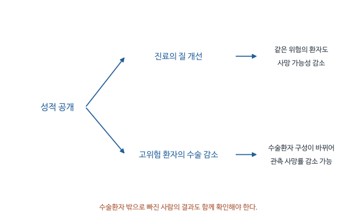

# 의료 성적표는 누구의 결과를 개선하는가 - 심층요약

심장수술을 앞둔 환자가 병원을 고르려면 의사의 수술 성과를 알아야 한다. 뉴욕과 펜실베이니아는 병원과 의사별 사망률을 공개해 그 선택을 돕고자 했다. 공개 이후 수술환자의 사망률이 낮아졌다면 정책은 성공한 것일까? Dranove와 동료들은 이 질문에 답하려면 수술받지 못하게 된 환자까지 조사해야 한다고 보았다.

병원이 높은 평가를 받는 방법은 치료를 잘하는 것만이 아니다. 사망위험이 높은 환자의 수술을 거절해도 관측된 사망률은 낮아진다. 이 연구는 정보 공개가 환자의 병원 선택과 의사의 환자 선택을 동시에 바꾸는 상황에서, 실제 치료 기회와 건강결과가 어떻게 달라졌는지 추적한다.

[원문 PDF](<Is more information better (2003).pdf>) | [QnA](<Is more information better (2003)_QnA.md>)

## 1. 정보를 공개하면 병원과 환자는 어떻게 반응하는가

이 정책이 평가하는 수술은 관상동맥우회술(CABG)이다. 심장에 혈액을 공급하는 혈관이 좁아졌을 때 혈액이 지나갈 다른 통로를 만드는 수술이다. 병원별 수술 후 사망률을 공개하면 환자는 병원을 비교하고, 병원은 더 좋은 평가를 받기 위해 진료를 개선할 유인을 갖는다.

그런데 사망률에는 의사의 실력과 환자의 원래 건강상태가 함께 반영된다. 그래서 성적표는 환자의 나이와 질환 등을 고려하는 위험조정(risk adjustment)을 한다. 저자들이 제기한 문제는 조정에 쓰는 기록보다 담당 의사가 환자의 상태를 더 자세히 안다는 점이다. 기록에는 같은 질환으로 표시되어도 의사는 어느 환자가 특히 위험한지 구별할 수 있다.

원문은 선택 유인이 생기는 이유를 두 가지 더 설명한다. 경증환자에게서는 좋은 병원과 나쁜 병원의 성과 차이가 작을 수 있어, 낮은 질의 병원이 경증환자에 집중하면 실력 차이가 드러나지 않는다. 또 중증환자의 결과가 더 불확실하다면, 평균적으로 공정한 위험조정도 몇 차례의 사망으로 평판이 크게 나빠질 위험까지 보상하지 못한다. 따라서 저자들은 수술 질의 개선과 환자 선별을 함께 평가한다.

논문의 질문은 다음과 같다.

> 성적표 도입은 환자를 더 좋은 병원에 연결하는가? 치료할 환자를 바꾸는가? 그 결과 전체 위험집단의 비용과 건강은 어떻게 변하는가?

이 연구에서 처치, 즉 효과를 평가하려는 변화는 성적표 공개 정책에 노출되는 것이다. 수술 여부는 정책이 바꿀 수 있는 중간 결과이다. 정책이 수술 기회를 바꾸는지 알려면 수술받지 못한 사람도 분석대상에 포함되어야 한다.

### 필요한 의학 용어

| 표기 | 뜻 | 이 연구에서 하는 역할 |
|---|---|---|
| CABG | 관상동맥우회술 | 공개 성적표가 직접 평가하는 수술 |
| AMI | 급성심근경색 | 수술 여부와 별도로 정의하는 응급질환 집단 |
| PTCA | 경피적 관상동맥성형술 | CABG의 대체 치료 가능성을 확인 |
| Cath | 심장도관술 | 진단 및 이후 치료의 경로를 확인 |

AMI는 응급질환이어서 환자의 입원 여부를 병원이 쉽게 선별하기 어렵다고 저자들은 본다. CABG는 많은 경우 선택적으로 시행하는 수술이므로 제공자가 수술 대상을 바꾸기 쉽다. 이 차이가 두 표본을 함께 사용하는 이유다.

환자가 직접 관찰하기 어려운 의료의 질을 정부가 대신 측정해 알려 준다는 것이 정책의 출발점이다. 일반 상품이라면 여러 번 써 보고 품질을 알아갈 수 있지만, 심장수술은 드물고 결과가 중대하다. 환자가 병원별 성과를 비교할 수 있게 만들려는 목적은 이 때문에 설득력이 있다. 다만 공개하는 숫자는 병원 행동의 결과이기도 하다. 병원이 평가항목을 알게 되면 그 항목을 개선하는 방향으로 환자 선택과 치료 선택을 바꾼다.

위험조정이 있다는 이유만으로 이 행동반응이 사라지는 것은 아니다. 예를 들어 같은 나이와 진단명을 가진 두 환자라도 의사는 한 환자의 회복 가능성이 훨씬 낮다는 사실을 알 수 있다. 성적표가 이 차이를 기록하지 못하면 그 환자의 수술을 피하는 것이 점수에 유리하다. 여기서 문제가 되는 것은 환자가 정보를 잘못 읽는 경우만이 아니다. 환자가 점수를 정확히 읽더라도, 점수를 만드는 과정에서 치료받는 사람이 달라지면 그 정보가 의료 질을 제대로 나타내지 못한다.

## 2. 평균 사망률이 좋아지는 두 경로를 분리한다

의료 질이 좋아져 같은 중증도의 환자가 덜 사망하는 경우와, 수술 대상이 건강한 환자 위주로 바뀌는 경우는 평균 사망률에 똑같이 나타날 수 있다. 아래 가상 예에서는 의료 질을 고정해 두고 구성만 바꾼다. 그러면 성적표 숫자가 얼마나 오해를 줄 수 있는지 계산할 수 있다.

정책 전에는 경증 50명과 중증 50명이 수술받으며 사망확률은 각각 2%, 20%라고 하자.

$$
\text{수술환자 사망률}_{전}
=\frac{50(0.02)+50(0.20)}{100}=0.11.
$$

정책 후 병원이 경증 80명, 중증 20명만 수술한다면 다음과 같다.

$$
\text{수술환자 사망률}_{후}
=\frac{80(0.02)+20(0.20)}{100}=0.056.
$$

사망률은 11%에서 5.6%로 낮아졌다. 그러나 각 중증도에서의 수술 성과는 전혀 좋아지지 않았다. 또한 수술 기회를 잃은 중증환자의 건강은 이 비율에 나타나지 않는다.

이를 수식으로 쓰면 다음과 같다.

$$
E[Y\mid S=1,R=r]
=\sum_{h\in\{경증,중증\}}
E[Y\mid S=1,H=h,R=r]P(H=h\mid S=1,R=r).
$$

- $Y$: 사망 여부이다.
- $S$: 수술 여부이다.
- $R$: 성적표 정책 여부이다.
- $H$: 수술 전 중증도이다.

정책 전후 차이는 조건부 사망률의 변화와 환자 구성 비중의 변화를 함께 담는다. $S$가 정책 이후 결정되기 때문에 $S=1$만 남기는 것은 처치 이후 선택에 조건을 거는 일이다. 이 논문은 그 문제를 피해 **수술을 받을 위험이 있는 AMI 환자 전체**의 결과를 추적한다.

이 예에서 분모인 수술환자 수를 일정하게 둔 것은 설명을 단순하게 하려는 선택이다. 실제로는 수술 수 자체도 늘거나 줄 수 있다. 어떤 경우든 확인할 대상은 두 가지이다. 같은 건강상태의 환자에게 제공한 치료가 좋아졌는지, 그리고 각 건강상태의 환자가 수술 명단에 들어갈 가능성이 달라졌는지이다. 첫 번째만을 의료기술이나 진료의 질 개선이라고 부를 수 있다.

앞의 평균식은 이 두 질문을 한 줄에 표시한다. 조건부 기대값은 해당 건강상태에서 수술받은 사람의 평균 사망률이고, 그 뒤의 확률은 전체 수술환자 가운데 그 건강상태인 사람의 비중이다. 평균이 낮아질 때 앞의 사망률이 낮아졌는지 뒤의 비중이 바뀌었는지 구별해야 한다. 회귀에 환자의 건강상태를 통제하는 방법도 있지만 기록에 없는 중증도 차이까지 조정할 수는 없다. 그래서 저자들은 수술받은 표본의 회귀를 정교하게 만드는 것과 별도로, 애초에 더 넓은 환자 집단을 추적한다.

### 평균 사망률의 변화에서 환자 구성과 치료 성과를 나누기

중증도 유형을 $k$라고 하자. 수술환자 중 유형 $k$의 비중을 $w_k$, 그 유형의 수술 후 사망확률을 $m_k$라고 쓰면 수술환자 평균 사망률은 $M=\sum_kw_km_k$다. 공개 전후를 각각 0, 1로 표시하고 $w_{k1}m_{k0}$를 더했다 빼면

$$
\begin{aligned}
M_1-M_0
&=\sum_k\{w_{k1}m_{k1}-w_{k0}m_{k0}\}\\
&=\sum_kw_{k1}(m_{k1}-m_{k0})
+\sum_k(w_{k1}-w_{k0})m_{k0}.
\end{aligned}
$$

첫 항은 사후 환자 구성을 고정했을 때 유형별 사망률이 달라진 부분이고, 둘째 항은 사전 사망률을 고정했을 때 환자 구성이 달라진 부분이다. 두 항의 합은 정확하지만 어느 쪽의 비중을 고정할지에 따라 분해 방식은 달라진다.

교육용으로 경증 사망률 1%, 중증 10%가 전후 같고 중증 비중만 50%에서 20%로 떨어지면 평균은 $0.5\times0.01+0.5\times0.10=5.5\%$에서 $0.8\times0.01+0.2\times0.10=2.8\%$로 낮아진다. 치료 성과를 전혀 바꾸지 않아도 2.7%포인트 개선된 숫자가 나온다.

실제 자료에서 유형별 사망률이 낮아져도 바로 의료 기술 개선이라고 해석하지는 못한다. 같은 기록상 중증도 안에서도 의사가 더 위험한 환자를 제외했을 수 있기 때문이다. 이 때문에 논문은 위험조정된 수술 사망률만 보고 끝내지 않고, 수술 여부와 별도로 정의한 AMI 환자 집단의 결과를 함께 조사한다. 위 분해는 원문의 환자 선별 논리를 설명한 예시다.

<!-- learning-figure:report-card-selection -->

*그림 설명: 정책 반응을 구별하기 위한 개념도다. 각 경로가 항상 발생한다는 뜻은 아니다.*

아래 경로에서는 수술을 받은 환자의 구성이 달라진다. 이때 수술환자 평균만 보면 성적이 좋아져도, 수술받지 못한 고위험 환자의 결과는 빠져 있다. 그래서 뒤의 분석에서 더 넓은 환자 집단과 의료 접근성을 함께 살핀다.

<!-- /learning-figure -->

## 3. 정책 때문에 수술받지 못한 환자도 자료에 포함한다

수술 실적만 분석하면 수술에서 제외된 중증환자의 건강 악화를 놓친다. 저자들은 급성심근경색(AMI)으로 입원한 고령 환자를 먼저 정한 뒤, 이후 수술 여부와 1년 동안의 건강결과를 확인했다. 이것이 분석대상 선정이 연구 질문의 일부가 되는 이유다.

자료는 1987-1994년 Medicare 청구자료와 AHA 병원 특성자료이다. Medicare는 미국의 고령자 등을 대상으로 하는 공적 건강보험이며, 청구자료에는 의료기관이 보험에 비용을 청구한 진료 기록이 들어 있다. 환자의 입원 전 1년 의료이용과 입원 후 1년의 치료, 지출, 사망 및 재입원을 연결한다. AMI 코호트, 즉 같은 기준으로 선정한 AMI 환자 집단에서는 직전 1년에 AMI 입원이 있었던 환자를 제외한다.

| 분석 | 한 행 | 종속변수 예 | 비교 목적 |
|---|---|---|---|
| 병원 분석 | 병원 $l$, 주 $s$, 연도 $t$ | 수술환자의 입원 전 평균 지출 | 수술환자 구성이 바뀌는지 |
| 병원 분석 | 병원, 주, 연도 | 입원 전 지출의 병원 내 변동계수 | 환자 정렬이 바뀌는지 |
| 환자 분석 | 환자 $k$, 거주 주 $s$, 입원 연도 $t$ | 1년 내 CABG 여부 | 수술 확률이 바뀌는지 |
| 환자 분석 | 환자, 거주 주, 입원 연도 | 지출, 재입원, 사망 | 정책의 순결과 |

환자 수준 분석의 정책 노출은 거주 주를 기준으로 한다. 서로 다른 결과식의 표본 수가 약간 다른 것은 지출 결과의 관측 가능성 등의 차이도 있기 때문이다. Table 4-5에서 일반 모형의 AMI 표본은 1,770,452명, 지출 모형은 1,768,585명이다.

입원 전 지출은 처치 이후 결과가 아니라 사전에 관측한 중증도 대리변수이다. 그래도 의학적 중증도를 완벽하게 측정하는 변수는 아니다. 병원 접근성이나 이전의 치료 관행도 지출에 반영될 수 있다.

자료의 한 행이 무엇인지는 같은 논문 안에서도 달라진다. 병원 수준에서는 한 병원이 한 해 동안 어떤 환자들을 받아들였는지가 관심이므로 환자 정보를 평균내어 병원별 관측을 만든다. 환자 수준에서는 입원한 한 사람이 나중에 수술받았는지, 다시 입원했는지, 사망했는지를 살핀다. 병원 평균이 좋아졌다는 결과를 곧바로 모든 환자의 건강 개선으로 바꾸어 말할 수 없는 이유가 여기에 있다.

입원 전 지출과 입원 후 지출도 역할이 다르다. 전자는 정책 이후 치료결과를 설명할 때 환자가 출발한 건강상태를 대략 나타내고, 후자는 정책에 따라 사용된 의료자원을 평가한다. 정책 이후 지출로 중증환자를 정하면 정책이 늘린 진료 때문에 원래 경증이던 사람이 중증집단에 들어가는 문제가 생긴다. 사전 정보를 쓰는 것은 이런 역방향 분류를 피하기 위해서다. 다만 사전 지출도 과거의 진료 접근성을 반영하므로 건강 그 자체와 동일한 지표는 아니다.

AMI 환자 전체를 포함해도 모든 종류의 선택 문제가 끝나는 것은 아니다. 정책이 입원 진단이나 다른 주로의 이동을 바꾸면 AMI 집단의 구성도 달라질 수 있다. 저자들이 AMI 발생률과 거주지 기준 분석을 확인하는 이유가 여기에 있다. 수술 표본보다 정책 이후 선택에 덜 노출되는 기준을 찾았다는 장점과, 그 기준이 완전히 불변이라고 증명한 것은 아니라는 한계를 함께 이해해야 한다.

## 4. 성적표가 없어도 달라졌을 수술률을 어떻게 추정하는가

정책 전후만 비교하면 전국적인 수술기술 발전이나 치료 관행의 변화도 정책효과에 포함된다. 성적표를 도입하지 않은 주에서 같은 기간 얼마나 변했는지를 이용해 그 공통 변화를 조정한다. 이것이 이중차분(DID, difference-in-differences)의 목적이다.

처리 주 T는 성적표를 도입한 주, 비교 주 C는 도입하지 않은 주이며, 0과 1은 정책 전후이다. 다음 수술확률은 방법을 설명하는 가상 수치이다.

| 집단 | 정책 전 | 정책 후 | 변화 |
|---|---:|---:|---:|
| 처리 주 | 10% | 14% | +4%p |
| 비교 주 | 8% | 11% | +3%p |

$$
\widehat\delta_{DID}=(0.14-0.10)-(0.11-0.08)=0.01.
$$

첫 차분은 처리 주 안에서 정책 전후 변화 4%p를 계산한다. 두 번째 차분은 정책이 없어도 생겼을 것으로 보는 변화 3%p를 뺀다. 남은 1%p를 정책효과로 읽으려면 **정책이 없었을 때 두 집단의 변화가 같았을 것**이라는 가정이 필요하다.

잠재결과로는 다음과 같다.

$$
E[Y_{T1}(0)-Y_{T0}(0)]
=E[Y_{C1}(0)-Y_{C0}(0)].
$$

오른쪽은 비교집단의 실제 전후 변화로 추정하지만 왼쪽의 정책 후 미처치 결과는 볼 수 없다. 따라서 평행추세는 관측하지 못한 반사실에 관한 가정이며, 자료에서 계산해 확인할 수 있는 식이 아니다. 처리 주에서만 같은 시기에 다른 심장진료 개혁이 일어나면 DID는 그 영향도 포함할 수 있다.

회귀를 갓 배운 독자에게는 정책 더미 하나를 넣는 것만으로 왜 인과효과를 알 수 있는지 의문이 생긴다. 실제로 정책 더미는 혼자서 그 일을 하지 못한다. 도입 전부터 뉴욕의 의료 수준이 높았다면 주 고정효과가 그 지속적인 차이를 조정하고, 전국적으로 심장치료가 발전했다면 연도 고정효과가 그해의 공통 변화를 조정한다. 정책계수는 이렇게 설명하고 남은 도입 주의 추가 변화를 비교한다.

이 비교가 실패하는 구체적인 상황도 생각할 수 있다. 성적표 도입과 동시에 뉴욕에서만 새로운 치료시설이 늘어나면, 환자의 치료와 결과 변화에는 두 정책이 함께 반영된다. 주 고정효과는 시간이 지나며 새로 생긴 변화를 제거하지 못하고, 연도 고정효과도 뉴욕에만 생긴 변화를 제거하지 못한다. 두 종류의 고정효과가 있다고 설명한 다음에는 해당 지역에 다른 변화가 있었는지 조사해야 한다.

## 5. 병원별 환자 구성의 변화는 어떤 회귀로 추정하는가

이제 정책으로 수술 대상이 바뀌었는지를 조사한다. 각 병원에서 수술받은 환자들이 입원 전 1년에 지출한 의료비의 평균을 구하고, 성적표 도입 뒤 그 평균이 비교 주보다 더 낮아졌는지 추정한다. 사전 지출이 낮은 환자가 상대적으로 건강하다는 해석을 이용하는 것이다. 원문 pp.562-563의 식 (1)은 이런 병원별 비교를 여러 연도에 걸쳐 수행한다.

$$
\ln h_{lst}=A_s+B_t+g'Z_{lst}+pL_{st}+q'N_{st}+e_{lst}.
$$

| 기호 | 의미 | 왜 이 첨자인가 |
|---|---|---|
| $h_{lst}$ | 병원 환자의 사전 중증도 평균 | 병원과 연도마다 구성이 다름 |
| $A_s$ | 주 고정효과 | 주마다 항상 높은 수준을 제거 |
| $B_t$ | 연도 고정효과 | 전국 공통 연도 변화를 제거 |
| $Z_{lst}$ | 규모, 소유 형태, 교육병원 등 | 병원 특성을 통제 |
| $L_{st}$ | 성적표가 해당 주와 연도에 시행되면 1 | 같은 주와 연도의 병원은 같은 정책에 노출 |
| $N_{st}$ | 주 내 병원 수와 그 제곱, 세제곱의 벡터 | 공급자 수의 변화를 통제 |
| $p$ | 관심 정책 계수 | 다른 항을 조정한 정책 전후 차이 |
| $e_{lst}$ | 모형으로 설명하지 못한 나머지 | 독립적인 새 자료라는 뜻이 아님 |

원문 식 (1)의 $A_s$는 주마다 고정된 차이를 나타낸다. 관측 단위는 병원이지만 각 병원의 고유한 차이를 모두 제거하는 병원 고정효과를 사용한 모형은 아니다. 관측치는 각 병원의 코호트 환자 수로 가중한다. 큰 병원과 작은 병원을 동등한 1개 단위로 보는 결과와 달라질 수 있다.

기본 시행일은 뉴욕 1991년, 펜실베이니아 1993년이다. 뉴욕의 의사별 정보 공개를 고려하여 두 주 모두 1993년으로 놓는 대안도 분석한다. 여러 연도와 서로 다른 시행시점의 회귀이므로 위 2×2 DID는 원리를 설명하는 축약 예제이다. 원문의 회귀계수 전체를 단일 2×2 ATT와 항상 같다고 간주하지 않는다.

식의 첨자에서 병원 l이 있는 변수와 없는 변수를 구별해 보자. 같은 주와 같은 연도에 속한 두 병원은 규모나 소유 형태가 달라도 성적표 정책값은 같다. 그래서 정책변수에는 병원 첨자가 없다. 두 병원에서 많은 환자를 관찰했다고 해서 서로 독립적인 정책 시행을 두 번 관찰한 것은 아니다. 병원 특성은 달리 비교할 수 있지만 정책은 공통으로 적용된다.

로그 중증도를 결과로 쓰는 회귀에서 관심 계수가 음수이면 공개 이후 해당 병원의 수술환자가 비교 주보다 상대적으로 건강해졌다는 해석이 가능하다. 그러나 그 자체로 의사가 특정 환자를 직접 거절했다고 관찰한 것은 아니다. 환자가 다른 병원으로 이동했거나 의뢰하는 의사가 선택을 바꾼 경우도 같은 구성 변화에 기여할 수 있다. 이후 정렬 분석과 전체 환자 결과를 함께 보는 이유는 구성 변화라는 하나의 결과만으로 이런 경로와 정책 평가를 모두 정할 수 없기 때문이다.

환자 수 가중은 분석의 관점을 바꾼다. 작은 병원 하나에서 나타난 구성 변화와 큰 병원 하나에서 나타난 같은 변화는 병원당 평균으로 보면 같은 비중이지만, 영향을 받은 환자 수로 보면 다르다. 저자들의 가중은 환자가 많은 병원의 정보가 더 크게 반영되도록 한다. 따라서 표의 계수를 설명할 때 평균 병원의 변화인지 환자가 경험한 변화를 더 반영한 평균인지 구분하는 것이 필요하다.

## 6. 표의 -3.92를 환자 구성 변화로 해석하기

Table 2의 결과를 이해하려면 회귀의 종속변수가 사전 의료비의 자연로그라는 점부터 확인해야 한다. 로그는 금액 차이를 비율 차이로 비교하는 데 쓰인다. 원래 사전 지출이 큰 병원과 작은 병원에서 같은 100달러 변화가 갖는 의미를 같게 취급하지 않기 위한 선택이다.

다른 조건이 같을 때 정책 노출 전후의 예측 로그 차이가 p이면 다음 관계가 성립한다.

$$
\ln h_1-\ln h_0=p,
\qquad \ln(h_1/h_0)=p,
\qquad h_1/h_0=e^p.
$$

따라서 정확한 비율 변화는 $100(e^p-1)\%$이고, 작은 $p$에서는 $100p\%$로 근사한다. Table 2는 계수에 100을 곱해서 표시한다. 예를 들어 -3.92는 로그 계수 -0.0392이며, 정확한 비율 변화는 약 -3.84%이다. 사망률의 선형확률모형에서 0.50은 0.50%p라는 것과 구분해야 한다.

Table 2의 사전 평균 지출 계수는 CABG 표본에서 -3.92와 -5.30이다. AMI 표본의 대응 계수는 3.37과 1.55이다. 수술받은 환자가 상대적으로 건강해졌다는 해석과 위험집단 전체가 건강해졌다는 해석이 다르다는 것을 보여준다.

### 원문 Table 2 읽기: 두 표본, 두 시행일, 네 개의 종속변수

5절의 식 (1)은 정책계수 $p$ 하나를 추정하는 식이다. 원문은 이 식을 종속변수 네 개, 표본 두 개, 시행일 가정 두 개로 조합해 16개의 회귀를 따로 추정하고 그 결과를 한 표에 모았다. 위 문단의 -3.92와 3.37이 어느 칸에서 나왔는지, 그리고 7절에서 다룰 변동계수 결과가 같은 표의 아래 두 행이라는 점을 확인하기 위해 원문 표를 옮긴다. 아래 표는 원문 Table 2(PDF 파일 기준 15쪽, 학술지 p. 569, 90도 회전된 표)의 계수와 표준오차 16쌍을 모두 옮긴 것이며, 주석만 요약했다. 원문 제목은 "Effects of Report Cards on the Within-Hospital Coefficient of Variation and Mean of Patients' Health Status before Treatment: Medicare Beneficiaries with AMI and Medicare Beneficiaries Receiving CABG, 1987-94"이다.

| 종속변수 (입원 전 1년 기준) | CABG 표본 (1): 뉴욕 1991, 펜실베이니아 1993 | CABG 표본 (2): 두 주 모두 1993 | AMI 표본 (3): 뉴욕 1991, 펜실베이니아 1993 | AMI 표본 (4): 두 주 모두 1993 |
|---|---:|---:|---:|---:|
| $\ln$(환자 평균 총입원지출) | -3.92\*\* (1.52) | -5.30\*\* (1.10) | 3.37\*\* (1.52) | 1.55 (2.26) |
| $\ln$(환자 평균 총재원일수) | -3.74\*\* (1.84) | -4.51\*\* (1.54) | 1.11 (2.76) | 1.56 (2.95) |
| $\ln$(총입원지출의 병원 내 CV) | 3.00\*\* (1.39) | 3.60\*\* (1.77) | -2.32\*\* (.64) | -2.43\*\* (.66) |
| $\ln$(총재원일수의 병원 내 CV) | .94 (2.22) | 2.74 (3.53) | -4.79\*\* (1.79) | -4.98\*\* (2.01) |

*주: 소수점 앞 0의 생략은 원문 표기를 따랐다. 각 칸은 별도 회귀에서 얻은 정책변수 $L_{st}$의 계수이고 괄호 안은 표준오차다. 표준오차는 이분산과 주 안의 시간에 걸친 오차 상관을 허용한다. 계수와 표준오차 모두 100을 곱했다. \*\*는 5% 수준에서 0과 유의하게 다르다는 원문 표시다. 관측 단위는 병원-연도이고 코호트 환자 수로 가중했으며, 주 내 병원 수 통제도 포함한다. 원문 주석이 밝힌 AMI 표본의 관측치는 평균 지출 38,066개, 평균 재원일수 38,084개, 지출 CV 37,672개, 재원일수 CV 37,681개다.*

표는 세로로 읽으면 한 표본과 한 시행일 가정에서 네 결과를 비교하고, 가로로 읽으면 같은 결과를 두 표본과 두 시행일에서 비교한다. 위 두 행은 병원 환자들의 평균 중증도, 아래 두 행은 병원 안에서 환자 중증도가 얼마나 흩어져 있는지를 나타낸다. 지출과 재원일수는 모두 기준이 되는 AMI 입원이나 CABG 이전 1년의 기록이다. 여기서 사전이란 해당 입원이나 수술보다 앞선다는 뜻이며, 성적표 정책이 시행되기 전이라는 뜻은 아니다. 정책 시행 뒤의 환자라면 이전 1년 기록에도 정책의 영향이 포함될 수 있다.

대표 칸인 열 (1) 첫 행의 -3.92는 로그 계수 -0.0392를 100배 한 값이다. 비교 주와 비교해 성적표 도입 후 뉴욕과 펜실베이니아 병원에서 CABG를 받은 환자들의 사전 평균 지출이 약 3.8% 낮아졌다는 뜻이다($100(e^{-0.0392}-1)\approx-3.84$). 괄호 안 1.52는 같은 단위의 표준오차이므로 t값은 약 2.58이고, 정규근사 95% 신뢰구간은 대략 -6.9에서 -0.9 사이다. 두 주 모두 1993년을 시행일로 둔 열 (2)에서는 -5.30(정확한 비율로 약 -5.2%)으로 더 커진다. 재원일수 기준으로도 -3.74와 -4.51이 5% 수준에서 유의하다. 본문 p. 568의 "3.74-5.30 percent" 감소는 이 네 값의 최소와 최대를 가리킨다.

AMI 표본의 열 (3)과 (4)에서는 같은 계수가 3.37과 1.55로 오히려 양수다. 저자들은 이를 "weakly positive"라고 표현하며, 열 (3)만 유의하다고 적는다. 수술을 받을 위험이 있는 AMI 환자 전체는 비교 주보다 건강해지지 않았는데 수술환자만 상대적으로 건강해졌다는 것이 이 대비의 뜻이다. 열 (1) 기준으로 두 표본의 계수 차이는 $-3.92-3.37=-7.29$, 열 (2) 기준은 $-5.30-1.55=-6.85$다. 본문 p. 570은 CABG와 AMI의 평균 중증도 계수 차이를 "3.5 to seven percentage points"라고 요약하는데, 표의 어느 조합으로 3.5가 나오는지는 본문에 설명이 없어 이 해설에서 재현하지 못했다.

아래 두 행은 7절의 변동계수 논의로 이어진다. AMI 표본에서는 네 계수가 모두 음수이고 유의하다(-2.32, -2.43, -4.79, -4.98). 병원 안 환자 구성이 더 균질해졌다는 뜻으로, 저자들은 이를 환자 정렬의 증거로 읽는다. CABG 표본의 지출 CV는 반대로 3.00과 3.60만큼 증가했다. 7절의 $\ln CV=\ln\sigma-\ln\mu$를 적용하면 평균이 3.92 로그포인트 줄 때 표준편차가 그대로여도 $\ln CV$는 3.92만큼 올라간다. 해설을 위해 열 (1)의 두 계수를 단순히 더하면 $\ln\sigma$의 변화는 $3.00+(-3.92)=-0.92$로 음수다. 두 계수는 표본 수가 다른 별도 회귀에서 나왔으므로 이 합은 방향을 보여 주는 산술일 뿐이고, 표준오차는 표에서 계산할 수 없다. 저자들은 CABG의 CV 계수에서 두 표본의 평균 중증도 계수 차이를 빼면 모든 설정에서 순효과가 음수가 된다고 설명한다(p. 570과 각주 7).

이 표에서 말할 수 있는 것은 성적표 도입 후 도입 주의 CABG 환자 구성이 비교 주보다 사전 의료이용이 적은 쪽으로 이동했고, AMI 환자 전체에서는 그런 이동이 보이지 않았다는 점이다. 이 방향은 시행일 가정 두 가지에서 모두 같다. 말할 수 없는 것도 분명하다. 병원 단위 평균의 변화이므로 특정 의사가 특정 환자를 거절했다는 사실을 직접 보여 주지 않으며, 사전 지출과 재원일수는 건강상태의 대리변수여서 과거의 의료 접근성도 함께 반영한다. 처리 주가 두 개뿐이므로 괄호 안 표준오차가 주 단위 정책 변이의 불확실성을 충분히 반영하는지도 표만으로는 판단할 수 없다. AMI 열 (3)의 양수 계수가 시행일을 바꾸면 유의하지 않게 되는 것처럼, 개별 칸의 크기는 시행일 가정에 따라 달라진다.

여기서 낮아진 것은 정책 이전에 이미 지출한 의료비를 기준으로 만든 환자 구성 지표이다. 정책이 과거 의료비를 거꾸로 줄였다는 뜻이 아니다. 정책 이후 병원이 받아들인 사람들의 과거 기록이 달라졌다는 뜻이다. 사전 변수가 정책의 종속변수로 등장해서 혼란스럽다면, 매년 병원에 들어오는 사람이 바뀐다는 점을 떠올리면 된다.

CABG 표본에서는 낮아지고 AMI 표본에서는 같은 방향의 개선이 보이지 않는다는 대비가 연구의 논증에 필요하다. 지역 주민 전체가 우연히 건강해져서 수술환자도 건강해진 경우와, 수술받는 사람만 상대적으로 건강해진 경우를 구별하는 데 도움이 되기 때문이다. 이 비교는 중증도 측정의 한계를 없애지는 않지만, 수술환자의 개선을 지역 전체 건강 개선이라고 설명하기 어렵게 만든다.

표의 결과를 말로 설명할 때는 변화한 변수의 시간을 함께 붙이는 것이 도움이 된다. 정책 이후에 수술받은 환자들의 정책 이전 의료이용을 비교했다는 순서이다. 이처럼 결과를 기록한 시점과 변수의 정보가 가리키는 시점을 구분하면, 왜 과거의 지출이 환자 선택의 증거가 되는지 이해할 수 있다. 같은 원리는 고객 평점 도입 뒤 구매한 고객들의 과거 구매이력을 비교하는 경우에도 적용된다. 다만 여기서 직접 추정한 대상은 의료기관의 환자 구성이다.

## 7. 중증환자가 치료 역량이 높은 병원으로 이동했는가

정보 공개가 환자 선별을 유발하더라도, 동시에 중증환자를 더 적합한 병원에 연결할 수 있다. 저자들은 이 가능성을 따로 조사한다. 여기서 환자 정렬은 건강상태에 따라 환자가 서로 다른 병원으로 배분되는 현상을 뜻한다.

중증환자가 특정 병원에 더 집중되고 경증환자가 다른 병원에 더 집중된다면, 각 병원 안에서 환자들의 건강상태 차이는 줄어들 수 있다. 이를 비교하는 지표가 변동계수(CV)이다. 병원 l의 중증도 표준편차를 σ_l, 평균을 μ_l라 두면 다음과 같다.

$$
CV_l=\frac{\sigma_l}{\mu_l},\qquad
\ln CV_l=\ln\sigma_l-\ln\mu_l.
$$

중증환자가 특정 병원에 모이고 경증환자가 다른 병원에 모이면, 각 병원 안의 혼합이 줄 수 있다. 그래서 병원 내 중증도의 이질성 감소가 환자 정렬의 단서가 된다. 하지만 $CV$는 분모인 평균만 작아져도 커질 수 있다.

가상으로 표준편차 40, 평균 100이면 $CV=0.4$다. 평균만 80으로 떨어지면 $CV=40/80=0.5$다. 분산이 늘지 않았는데도 변동계수는 커진다.

CABG 표본에서는 정책 때문에 평균 중증도가 감소하므로 CV 하나만으로 정렬을 판단하기 어렵다. Table 2의 AMI 표본에서는 지출 CV의 로그 계수가 -2.32와 -2.43으로 감소한다. Table 3은 교육병원에서 중증환자의 비중이 상대적으로 커지는지 추가로 확인한다. 교육병원 여부는 진짜 질의 대리변수이므로 이 결과만으로 최적 배분이 증명되는 것은 아니다.

환자 정렬이 개선되었다는 해석과 환자 접근성이 악화되었다는 해석은 동시에 참일 수 있다. 수술을 받을 수 있었던 중증환자 일부가 더 적절한 병원으로 옮겨 가는 동안, 다른 중증환자는 수술 기회를 잃을 수 있기 때문이다. 따라서 병원 사이 이동이 보인다는 사실만으로 정책 전체가 성공했다고 결론 내리면, 이동하지 못한 환자를 다시 놓치게 된다.

교육병원은 전문 인력과 시설을 갖출 가능성이 있어 비교 대상으로 쓰이지만, 교육병원으로 이동한 환자의 결과가 반드시 좋아졌다고 보장하는 표지는 아니다. 저자들의 표는 환자의 배분이 어떤 방향으로 달라졌는지 보여 준다. 그 배분이 환자에게 유익했는지는 다음 절의 실제 치료와 재입원, 사망 결과를 연결해서 판단해야 한다.

## 8. 전체 평균 뒤에 가려질 수 있는 중증환자의 변화를 찾는다

환자 구성이 변했다는 결과만으로 정책의 좋고 나쁨을 판단하기 어렵다. 중증환자가 더 나은 병원으로 이동해 건강을 회복했을 수도 있고, 필요한 수술을 받지 못해 건강이 악화되었을 수도 있기 때문이다. 저자들은 AMI 환자 전체의 수술, 재입원, 사망, 지출을 조사하고 사전 건강상태에 따라 정책효과가 다른지도 추정한다.

먼저 환자별 수술 여부를 결과로 놓는 기본식은 다음과 같다.

$$
C_{kst}=A_s+B_t+g'Z_{kst}+pL_{st}+e_{kst}.
$$

$C_{kst}=1$은 AMI 입원 후 1년 이내 CABG를 받았다는 뜻이다. 이진변수의 기대값은 확률이므로 $p$는 확률의 변화이다. 종속변수를 사망, 재입원, 로그 지출로 교체하여 각각의 결과를 추정한다.

사전 입원이 있었으면 $w_{kst}=1$이라 하고 상호작용을 넣는다.

$$
Y_{kst}=A_s+B_t+g'Z_{kst}+pL_{st}
+\theta w_{kst}+\tau L_{st}w_{kst}+e_{kst}.
$$

이는 식 (3)의 구조를 알아보기 쉽게 쓴 식이다. 정책이 0에서 1로 바뀌는 예측값 차이를 직접 계산하면

$$
\Delta_RY(w)
=[p+\theta w+\tau w]-[\theta w]=p+\tau w.
$$

따라서 경증 기준집단 효과는 $p$, 중증집단 효과는 $p+\tau$, 두 효과의 차이는 $\tau$다. 상호작용 계수만 중증환자의 전체 정책효과라고 부르면 틀린다.

상호작용이 필요한 이유는 중증환자가 원래 수술을 더 많이 받거나 사망위험이 높다는 사실과, 정책에 더 크게 반응한다는 사실을 구별하려는 데 있다. 중증도 변수 자체의 계수는 정책이 없는 때에도 존재할 수 있는 집단 차이를 조정한다. 정책과 중증도의 곱은 공개 이후 그 차이가 추가로 얼마나 변했는지를 나타낸다. 두 변수를 함께 넣어야 원래의 차이를 새 정책효과로 오해하지 않는다.

또한 이 분석에서 중증은 환자의 모든 의학적 위험을 완전히 분류한 이름이 아니다. 사전 입원 등 청구자료에서 확인할 수 있는 기준으로 나눈 집단이다. 따라서 결과를 설명할 때는 연구에서 사용한 분류 기준을 함께 말해야 한다. 임상적으로 가장 위급한 모든 환자에게 정확히 같은 효과가 있다는 주장까지 나아가지는 않는다.

종속변수가 사망 여부이면 한 환자의 값은 0 또는 1이지만 회귀가 설명하는 조건부 평균은 사망확률이다. 정책계수는 사망자 수 자체도 아니고 생존기간의 차이도 아니다. 로그 의료비를 결과로 바꾸면 같은 설명변수라도 계수의 단위가 비율 변화로 달라진다. 표마다 비슷한 숫자가 보여도 결과변수의 정의와 배율을 먼저 확인해야 하는 이유다.

### 중증환자 효과의 표준오차도 두 계수의 관계를 포함한다

중증환자의 정책효과가 $p+\tau$라면 불확실성 역시 그 합에 맞춰 계산해야 한다. $\widehat p$의 표준오차와 $\widehat\tau$의 표준오차를 더하거나, 상호작용 계수의 유의확률만 읽는 방식은 맞지 않는다. 같은 회귀에서 추정한 두 계수는 함께 움직일 수 있다.

$$
Var(\widehat p+\widehat\tau)
=Var(\widehat p)+Var(\widehat\tau)
+2Cov(\widehat p,\widehat\tau).
$$

가상으로 $\widehat p=1$%포인트, $\widehat\tau=2$%포인트이면 중증환자 효과는 3%포인트다. 두 계수의 표준오차가 각각 1%포인트이고 공분산이 -0.5(%포인트)$^2$라면 합의 분산은 $1+1+2(-0.5)=1$이어서 표준오차는 1%포인트다. 공분산을 0으로 놓으면 약 1.414%포인트가 되어 다른 판단을 내릴 수 있다. 이 숫자는 계산용 예이며 원문 표의 추정치를 대신하지 않는다.

해석할 질문도 둘이다. $\tau=0$ 검정은 중증환자와 기준집단의 효과가 같은지 묻고, $p+\tau=0$ 검정은 중증환자에게 정책효과가 없는지 묻는다. 한 집단만 유의하다는 결과가 두 집단의 차이를 입증하지는 않는다. 논문의 정책 판단에서는 중증환자의 결과 자체와 집단 간 차이를 구별해서 보고해야 한다.

## 9. 수술 접근성과 재입원 결과가 처음 질문에 주는 답

Table 4에서 전체 CABG 시행이 늘었다는 결과와 중증환자에게 도움이 되었다는 결론은 구분된다. 중증도 상호작용을 넣은 모형은 누구에게 증가가 발생했는지 보여 준다. Panel A에서 기준집단 정책계수는 0.81%포인트, 중증도 상호작용은 -0.65%포인트이다. 중증환자에게 적용되는 변화는 두 계수의 합이다.

$$
\widehat{효과}_{중증}=0.81-0.65=0.16\%p.
$$

Panel B에서는 $1.39-1.52=-0.13\%p$다. 중증환자 수술 증가가 사실상 없고, 증가가 주로 상대적 경증환자에게서 나타난다는 해석이다. 통계적 유의성은 합의 표준오차로 평가해야 한다.

$$
\operatorname{Var}(\hat p+\hat\tau)
=\operatorname{Var}(\hat p)+\operatorname{Var}(\hat\tau)
+2\operatorname{Cov}(\hat p,\hat\tau).
$$

각 계수의 괄호 숫자만으로 합의 유의성을 계산할 수 없다.

### 원문 Table 4 발췌: 정책 이후 누가 어떤 시술을 받았는가

위의 0.81, -0.65, 1.39, -1.52가 표에서 어떻게 배치되어 있는지, 그리고 CABG 이외의 치료에서는 어떤 변화가 있었는지 확인하기 위해 원문 Table 4를 옮긴다. 8절의 상호작용 식을 실제로 추정한 결과표다. 원문 Table 4(PDF 파일 기준 20-21쪽, 학술지 pp. 574-575, 90도 회전된 표)는 여섯 개 종속변수를 보고하는데, 아래는 그 가운데 네 개를 옮긴 **발췌**다. 1일 이내 PTCA와 1년 이내 심장도관술 행은 생략했다. 원문 제목은 "Effects of Report Cards on CABG, PTCA, and Catheterization Rates: Medicare Beneficiaries with AMI, 1987-94"이다.

| 종속변수 (1 = 시행) [평균: 사전입원 없음, 있음] | 모형 | A (1) 정책효과 | A (2) 사전 1년 입원 | A (3) 정책 × 사전입원 | B (4) 정책효과 | B (5) 사전 1년 입원 | B (6) 정책 × 사전입원 |
|---|---|---:|---:|---:|---:|---:|---:|
| 입원 후 1년 이내 CABG [14.76, 9.10] | 정책만 | .60\*\* (.21) | | | .91\*\* (.44) | | |
| | 상호작용 | .81\*\* (.15) | -3.80\*\* (.15) | -.65 (.44) | 1.39\*\* (.42) | -3.78\*\* (.16) | -1.52\*\* (.19) |
| 입원 후 1일 이내 CABG [5.40, 2.97] | 정책만 | -.78\*\* (.29) | | | -.59\*\* (.23) | | |
| | 상호작용 | -.97\*\* (.40) | -1.73\*\* (.13) | .72\* (.41) | -.66\*\* (.30) | -1.71\*\* (.14) | .29 (.30) |
| 입원 후 1년 이내 PTCA [13.94, 8.76] | 정책만 | -1.69 (1.22) | | | -1.22 (1.17) | | |
| | 상호작용 | -1.73 (1.55) | -3.50\*\* (.17) | .23 (1.15) | -.96 (1.46) | -3.46\*\* (.19) | -.76 (.99) |
| 입원 후 1일 이내 심장도관술 [26.81, 16.25] | 정책만 | -3.75\*\* (1.51) | | | -2.77\*\* (1.17) | | |
| | 상호작용 | -4.28\*\* (1.90) | -7.54\*\* (.38) | 2.02 (1.40) | -2.86\* (1.46) | -7.45\*\* (.41) | .56 (1.08) |

*주: Panel A는 뉴욕 1991년, 펜실베이니아 1993년 시행을, Panel B는 두 주 모두 1993년 시행을 가정한다. 괄호 안은 이분산과 주 안의 시간에 걸친 오차 상관을 허용한 표준오차다. 계수와 표준오차에 100을 곱했으므로 단위는 %포인트다. 대괄호는 사전 1년 입원이 없는 환자와 있는 환자의 평균(%)이다. \*는 10%, \*\*는 5% 수준에서 유의하다는 원문 표시다. 표본은 N = 1,770,452명이다. 빈칸은 해당 모형에 그 변수가 없다는 뜻이다.*

각 종속변수에는 두 줄이 있다. "정책만" 줄은 4절과 같이 정책변수 하나만 넣은 모형이고, 그 계수는 AMI 환자 전체의 평균적인 정책효과다. "상호작용" 줄은 8절의 식을 추정한 결과다. 열 (1)과 (4)는 사전입원이 없는 기준집단의 정책효과 $p$, 열 (2)와 (5)는 정책과 무관한 사전입원 환자의 차이 $\theta$, 열 (3)과 (6)은 두 집단의 정책효과 차이 $\tau$다. 결과가 0 또는 1인 선형확률모형이고 계수를 100배 했으므로 모든 숫자는 확률의 %포인트 변화로 읽는다.

첫 행의 .60은 성적표 도입 후 AMI 환자가 1년 이내 CABG를 받을 확률이 비교 주보다 0.60%포인트 높아졌다는 뜻이다. 기준율은 각주 9의 방식대로 대괄호 평균을 사전입원 비중 0.292로 가중해 $0.708\times14.76+0.292\times9.10\approx13.1\%$로 구한다. 따라서 0.60%포인트는 기준 대비 약 4.6% 증가에 해당한다. 상호작용 줄의 -3.80은 정책효과가 아니다. 사전입원 환자가 원래 CABG를 3.8%포인트 덜 받는다는 차이이며, 대괄호의 14.76과 9.10의 차이와 같은 방향이다. 중증환자의 정책효과는 위 본문처럼 열 (1)과 (3)의 합으로 구한다. Panel A의 상호작용 -.65는 표준오차 .44로 10% 수준에서도 유의하지 않지만, Panel B의 -1.52는 유의하다. 저자들은 두 합(0.16, -0.13)을 "approximately zero"라고 요약한다(각주 10).

1일 이내 CABG의 "정책만" 계수 -.78은 수술 수가 늘어난 동시에 입원 직후 수술은 줄었다는 뜻이다. 같은 가중 방식의 기준율은 약 4.7%이므로 상대적으로 17% 정도의 감소다. 저자들은 이를 치료 지연으로 해석한다. 1년 이내 PTCA에서 중증환자의 효과는 $-1.73+.23=-1.50$(Panel A), $-.96-.76=-1.72$(Panel B)이고, 각주 11은 이 합의 표준오차를 표에 없는 값인 0.45와 0.54로 보고한다. 8.76%의 기준율에 비하면 약 17-20%의 감소다. 원문 각주 11은 이 합을 "the sum of the col. 1 and col. 2 coefficients"라고 적지만, 표에서 .23과 -.76은 상호작용 열인 (3)과 (6)에 있다. 원문 표현을 그대로 두고, 여기서는 표의 배치에 따라 읽었다.

이 표에서 말할 수 있는 것은 성적표 도입 후 CABG 증가가 사전입원이 없는 상대적 경증환자에게 집중되었고, 중증환자는 CABG가 늘지 않은 채 PTCA가 줄었으며, 세 시술 모두 입원 1일 이내 시행이 줄었다는 점이다. 말할 수 없는 것은 늘어난 수술이 의학적으로 적절했는지, 그리고 줄어든 1일 이내 시술이 실제 건강 손실로 이어졌는지다. 이 질문은 다음 Table 5가 다룬다. 중증환자 효과의 표준오차는 PTCA처럼 각주에 제시된 경우에만 알 수 있고, CABG의 두 합에 대해서는 표만으로 유의성을 판단할 수 없다. 대괄호 평균은 표본기간 전체의 값이며 도입 주의 정책 이전 수준을 따로 보여 주지 않는다.

Table 5, panel B의 중증환자 사망효과는 $0.13+0.69=0.82\%p$다. Panel A는 $0.37-0.02=0.35\%p$이며 결과가 시행일 가정에 민감하다.

계수를 실제 건강결과로 환산할 때 확인할 차이가 하나 있다. 본문 p. 577은 중증환자 심부전 재입원 증가를 약 2.3%p로 설명한다. Table 5의 2.27, 2.30은 상호작용 계수다. 표의 주효과까지 합한 정책효과는 각각 $-0.20+2.27=2.07\%p$, $-0.18+2.30=2.12\%p$이다. 같은 이유로 재발 AMI의 중증집단 총효과는 $-0.15+0.55=0.40\%p$, $-0.11+0.52=0.41\%p$다. 본문의 근사적 요약을 상호작용 모형의 정확한 합과 혼동하지 않는다.

### 원문 Table 5 읽기: 지출, 재입원, 사망

Table 4가 치료의 양과 시점을 보여 준다면, Table 5는 그 변화가 비용과 건강결과에 어떻게 이어졌는지 보여 준다. 논문의 후생 판단은 이 표에 근거한다. 바로 위 문단의 2.27, 2.30, -0.20과 앞 문단의 0.13, 0.69가 표의 어느 열에 있는지 확인하기 위해 원문 Table 5(PDF 파일 기준 22쪽, 학술지 p. 576, 90도 회전된 표)의 네 개 종속변수를 모두 옮긴다. 원문 제목은 "Effects of Report Cards on Hospital Expenditures and Health Outcomes: Medicare Beneficiaries with AMI, 1987-94"이다.

| 종속변수 | 모형 | A (1) 정책효과 | A (2) 사전 1년 입원 | A (3) 정책 × 사전입원 | B (4) 정책효과 | B (5) 사전 1년 입원 | B (6) 정책 × 사전입원 |
|---|---|---:|---:|---:|---:|---:|---:|
| $\ln$(입원 후 1년 총입원지출) | 정책만 | 3.92\*\* (1.08) | | | 3.95\*\* (1.52) | | |
| | 상호작용 | 2.89\*\* (.73) | 7.33\*\* (.48) | 3.35\* (1.75) | 3.31\*\* (1.16) | 7.44\*\* (.53) | 1.93 (1.49) |
| 1년 이내 AMI 재입원 (1 = 예) | 정책만 | .02 (.08) | | | .06 (.07) | | |
| | 상호작용 | -.15 (.10) | 1.70\*\* (.06) | .55\*\* (.13) | -.11 (.09) | 1.72\*\* (.06) | .52\*\* (.14) |
| 1년 이내 심부전 재입원 (1 = 예) | 정책만 | .50\*\* (.10) | | | .54\*\* (.10) | | |
| | 상호작용 | -.20\*\* (.08) | 4.89\*\* (.10) | 2.27\*\* (.26) | -.18\*\* (.08) | 4.93\*\* (.11) | 2.30\*\* (.36) |
| 1년 이내 사망 (1 = 예) | 정책만 | .45 (.32) | | | .45\* (.26) | | |
| | 상호작용 | .37 (.41) | 11.90\*\* (.09) | -.02 (.44) | .13 (.27) | 11.88\*\* (.10) | .69\*\* (.13) |

*주: Panel A와 B의 시행일 가정, 표준오차, 100배 표기, 유의 표시(\* 10%, \*\* 5%)는 Table 4와 같다. 표본은 지출 모형 N = 1,768,585명, 나머지 모형 N = 1,770,452명이다. 원문 Table 5에는 Table 4와 달리 대괄호 평균이 없다. 빈칸은 해당 모형에 그 변수가 없다는 뜻이다.*

행과 열의 구조는 Table 4와 같지만 종속변수의 단위가 두 가지다. 첫 결과는 로그 지출이므로 계수는 대략 퍼센트 변화이고, 나머지 세 결과는 0 또는 1 변수이므로 %포인트 변화다. 같은 3.92라도 6절 Table 2의 3.92는 수술환자의 사전 지출이 낮아진 정도이고, 여기서 첫 칸의 3.92는 AMI 환자 전체의 입원 후 지출이 늘어난 정도다. 부호도 반대다.

지출부터 보면, 열 (1)의 3.92는 성적표 도입 후 AMI 환자 1인당 1년 입원지출이 비교 주보다 약 4.0% 늘었다는 뜻이다($100(e^{0.0392}-1)\approx4.00$). 상호작용 모형에서 중증환자의 지출 변화는 $2.89+3.35=6.24$ 로그포인트(약 6.4%)이지만, 상호작용 3.35는 10% 수준에서만 유의하고 Panel B의 1.93은 유의하지 않다. 저자들이 p. 573에서 중증환자의 지출도 늘었다고 쓸 때는 이 두 계수의 합을 가리킨다.

건강결과에서 가장 분명한 행은 심부전 재입원이다. "정책만" 모형에서는 평균 0.50%포인트 증가로, 본문 p. 573의 "approximately 0.5 percentage point"가 이 값이다. 상호작용 모형으로 나누면 경증 기준집단은 -0.20%포인트로 오히려 줄었고, 중증환자는 $-0.20+2.27=2.07$%포인트 늘었다. 본문 p. 577이 제시한 기준율 9.4%에 비하면 약 22% 증가다. 열 (2)의 4.89와 11.90 같은 큰 값은 정책과 무관하게 사전입원 환자가 원래 심부전 재입원과 사망 위험이 더 높다는 차이다. 이 값을 정책효과로 읽으면 안 된다.

사망은 시행일 가정에 따라 결론이 달라진다. Panel B에서는 중증환자 효과가 $0.13+0.69=0.82$%포인트이고 본문 p. 577은 이를 통계적으로 유의한 증가로 보고하지만(합의 구성은 각주 13), Panel A에서는 $0.37-0.02=0.35$%포인트이며 두 계수 모두 유의하지 않다. 평균 사망효과 0.45%포인트도 Panel B에서만 10% 수준으로 유의하다. 본문은 이를 "statistically marginal evidence"라고 부르며 평균 사망률 기준을 33%로 제시한다.

이 표에서 말할 수 있는 것은 성적표 도입 후 AMI 환자 전체의 지출이 늘었고, 사전입원이 있는 환자에게 심부전과 AMI 재입원이 유의하게 늘었으며, 두 시행일 가정 모두에서 그 방향이 같다는 점이다. 저자들의 단기 후생 감소 판단은 이 조합에 기댄다. 말할 수 없는 것은 재입원 증가가 Table 4의 어느 치료 변화에서 비롯했는지, 그리고 사망 증가가 시행일 가정과 무관하게 성립하는지다. 중증환자 효과의 표준오차는 각주에 따로 제시된 경우를 제외하면 표에서 계산할 수 없다. 또한 중증 여부는 사전 1년 입원이라는 청구자료 기준이므로 임상적 중증도 전체를 대표한다고 보기 어렵다.

수술률이 늘었다는 사실은 서비스 공급량의 증가를 알려 주지만 적정 진료가 늘었다는 뜻까지 포함하지 않는다. 이전에 충분한 치료를 받지 못한 환자가 필요한 수술을 받았다면 이익이지만, 점수 관리에 유리한 경증환자의 수술만 늘고 중증환자가 제외되었다면 자원을 더 쓰면서 건강상 이익은 작을 수 있다. 논문이 이용량과 건강결과를 별도의 표로 보고하는 이유가 이것이다.

재입원은 사망과 다른 정보를 준다. 생존해도 심부전이나 재발 심근경색으로 다시 입원한다면 건강상태와 삶의 부담이 악화된 것이다. 그래서 사망률만으로 평가를 끝내면 이러한 손실을 놓친다. 다만 어떤 치료를 덜 받은 것이 정확히 어느 재입원을 유발했는지 개인별 경로 전체를 추정한 것은 아니다. 논문은 공개 정책 이후 나타난 접근성과 건강결과의 조합을 근거로 환자 선별의 비용을 평가한다.

## 10. 지역별 다른 변화가 결과를 설명하는지 확인한다

뉴욕과 펜실베이니아에서 성적표와 무관한 심장진료 변화가 같은 시기에 일어났다면 정책계수에 그 영향이 섞인다. 저자들은 비교 지역과 시간추세를 바꾸어 이 가능성을 살폈다. 이런 분석을 강건성 검정이라고 부른다. 결론이 특정 비교집단이나 모형에만 의존하는지 확인하는 절차이다.

| 원문 확인 | 줄이려는 우려 | 남아 있는 한계 |
|---|---|---|
| Table 6: 인접 3개 주를 비교집단으로 사용 | 전국 비교집단과 지역 추세가 다름 | 인접 주도 파급효과에 노출될 수 있음 |
| 뉴욕과 펜실베이니아에 별도 선형추세 | 기존 지역 추세가 정책효과처럼 보임 | 선형추세가 반사실을 보장하지 않음 |
| AMI 발생률 변화 확인 | AMI 표본 자체의 선택 변화 | 통계적 비유의가 완전한 불변을 증명하지 않음 |
| 다른 형식의 성적표 통제 | 동시 정책 누락 | 측정하지 못한 변화가 남을 수 있음 |
| Table 7: CABG 환자만 분석 | 기존 연구와 차이의 출처 | 선택된 표본으로는 전체 복지 판단 곤란 |

Table 7의 수술환자 사망률 정책 계수는 기본모형에서 -1.17 또는 -1.02%p다. AMI 위험집단과 수술환자 표본이 다른 결론을 주는 것이 이 논문의 중심이 되는 실증 대조다.

표준오차는 주 안에서 시간에 걸친 오차 상관을 허용한다. 환자 수가 많아도 정책이 주 단위로 도입되므로 독립적인 정책 변이가 환자 수만큼 있는 것은 아니다. 처리 주가 두 개라는 설계의 한계도 남는다.

강건성 분석은 같은 회귀를 여러 번 돌려 유의한 숫자를 모으는 절차가 아니다. 비교 주를 인접 지역으로 제한하는 것은 지역 경기나 의료환경의 공통성이 더 높은 대조군을 택하는 선택이다. 주별 추세를 넣는 것은 도입 전부터 이어진 지역 변화가 결과를 설명하는지 확인하는 선택이다. 두 점검은 서로 다른 의문에 답한다.

수술환자만 남긴 Table 7은 저자들이 의도한 대조이다. 같은 정책을 수술환자만으로 평가하면 좋아 보이는 결과가 나온다는 사실을 보여 주어, 기존 평가가 왜 더 넓은 환자 집단의 손실을 놓칠 수 있는지 설명한다. 표본을 좁혔을 때 계수가 바뀐다는 사실을 단순한 불안정성으로만 말하면 저자들이 그 표를 제시한 목적을 놓친다.

## 11. 성적표가 좋아졌다는 평가와 환자가 좋아졌다는 평가

수술받은 환자만 보면 사망률이 개선되지만, 수술 필요가 있는 AMI 환자 전체에서는 중증환자의 재입원 증가와 좋지 않은 건강결과가 관찰된다. 두 결과의 차이는 연구의 부수적 문제가 아니다. 평가 대상에서 제외된 환자를 포함하면 정책의 판단이 달라진다는 것이 저자들이 보여 주려는 결과이다.

저자들은 해당 시기의 두 주, 고령 Medicare 환자, 도입 초기 반응을 기준으로 비용 증가와 중증환자 건강 악화를 함께 고려해 단기 후생이 감소했다고 판단했다. 여기서 후생은 환자의 건강상 이익과 사용한 의료자원을 함께 평가하는 개념이다.

질병집단 전체를 평가하는 성적표와 선택 가능한 수술환자만 평가하는 성적표는 유인이 다르다. 따라서 “정보 공개는 항상 해롭다”는 결론은 원문보다 강하다. 마케팅의 리뷰나 판매자 평점도 성공한 거래만 점수화하면, 판매자가 어려운 고객을 회피할 수 있다. 이 연결은 학습용 해석이며 논문의 직접 추정 대상은 의료 성적표다.

정책 설계에 대한 질문은 어떤 점수를 공개할지로 이어진다. 수술한 사람의 사망률만 평가하면 수술 대상에서 제외하는 선택이 점수 밖으로 빠져나간다. 반면 특정 질환으로 치료가 필요해진 환자 전체의 건강을 함께 평가하면 접근성을 희생하여 수술실적만 높이는 행동이 더 드러난다. 이 논문은 정보의 양만 늘리는 정책보다 정보가 누구를 포함하며 어떤 행동을 보상하는지 살펴야 함을 보여 준다.

장기에는 병원이 새로운 기술에 투자하거나 나쁜 성과를 낸 공급자가 시장에서 나갈 수도 있다. 제공된 자료가 관찰한 도입 초기의 반응으로 그런 장기효과까지 결정할 수는 없다. 따라서 저자들의 단기 후생 판단을 존중하되, 공개 방식이나 위험조정이 다른 모든 의료정보 정책에 같은 결론을 적용하지 않는 것이 원문의 범위를 지키는 해석이다.

## 12. 이 연구를 다시 설명할 때 연결할 내용

논문의 논증은 성적표의 사망률에서 출발하지만 최종 판단은 수술 대상 밖의 환자까지 포함한다. 정책이 사람들의 행동을 바꾼다면, 정책 이후 관측되는 표본 자체도 달라질 수 있기 때문이다. 발표에서는 정보 공개의 유인, AMI 표본의 필요, DID 비교, 중증환자 결과를 이 순서로 설명하면 각 분석의 목적이 이어진다.

Session 3의 고정효과와 DID가 여기서 표본 설계 문제와 결합한다. Session 4-6의 IV에서는 수술 같은 실제 처치를 직접 회귀할 때의 선택 문제를 다른 방식으로 다룬다. Session 7의 환자 재배분 논문과 연결할 때에는 정렬의 개선과 총건강 결과를 구분한다. Session 12의 시차 DID를 읽을 때에는 정책 시점이 서로 다른 이 연구의 회귀가 무엇을 평균하는지 다시 점검한다.

발표를 준비하며 확인할 질문은 다음과 같다. “Table 5의 2.30을 중증환자의 효과라고 바로 읽으면 왜 틀리는가?”와 “수술환자 사망률이 떨어졌는데도 정책이 해로울 수 있는가?”다.

예상퀴즈에서 연구를 설명할 때는 환자 선별이 단순히 가능하다는 이론과 실제 관찰된 결과를 나누어 말하는 것이 좋다. 이론은 왜 성적표가 나쁜 유인을 줄 수 있는지 설명하고, 실증은 수술환자 중증도의 감소와 전체 위험집단의 결과를 비교한다. 후자의 자료가 없으면 전자는 가능성에 그친다. 반대로 숫자만 보고 이론을 생략하면 저자들이 왜 두 표본과 여러 결과를 선택했는지 설명하지 못한다.

## 출처와 판본 메모

대상: David Dranove, Daniel Kessler, Mark McClellan, Mark Satterthwaite, *Is More Information Better? The Effects of “Report Cards” on Health Care Providers*, JPE 111(3), 2003, pp. 555-588. 수업: 2026-09-23, Session 4. DID의 비교집단과 표본 선택을 실제 연구에서 읽는 자료이다.

독해 범위: 로컬 PDF 35쪽 전체의 본문, 표, 부록을 확인했다. 회전된 Table 2-7은 이미지로 대조했다. 본문의 가상 예제와 대수 전개는 학습을 위한 추가 설명이다. 실제 결과 수치는 표의 계수와 본문의 반올림 서술을 구분한다.
