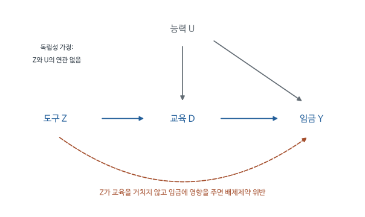

# 교육연수와 임금의 관계에서 교육효과를 추정하기 - MHE 4.1-4.2

대학을 오래 다닌 사람이 더 높은 임금을 받는다고 하자. 교육이 생산성을 높였을 수도 있지만, 원래 학업 능력이나 가정 형편이 좋은 사람이 교육도 더 받고 임금도 더 받았을 수 있다. 교육연수와 임금을 회귀한 계수만으로는 이 두 설명을 구분하기 어렵다.

이 장은 개인의 능력을 모두 측정하는 대신, 개인이 선택하지 않은 제도가 교육량을 바꾸는 상황을 찾는다. 출생시기와 의무교육 규정 때문에 교육을 조금 더 받게 된 집단이 임금도 더 받는다면, 그 임금 차이를 교육량 차이로 나누어 교육 1년의 효과를 추정한다. 도구변수법(IV)은 이 비교를 체계적으로 계산하는 방법이며, 2단계 최소제곱법(two-stage least squares, 2SLS)은 여러 통제변수(control variable)와 도구가 있을 때 이를 실행하는 회귀 절차이다.

문서의 순서는 다음과 같다. 1-2절은 교육연수 회귀의 기울기에 능력 차이가 반영되는 과정을, 3-6절은 도구 하나로 임금 차이를 교육 차이로 나누는 계산과 출생분기(quarter of birth, QOB) 사례를 다룬다. 7-8절은 통제변수와 여러 도구가 있을 때 같은 비율을 2SLS로 계산하는 방법과 그 과정에서 생기는 공선성(collinearity), 약한 도구(weak instrument) 문제를 설명한다. 9절과 11절은 4.2의 추론 부분(표준오차, 과잉식별 검정)이고, 10절은 징병 추첨(draft lottery)과 자녀 수 사례다.

[원문 PDF](<MHE Ch4.1-4.2 IV and Causality, 2SLS Inference (2009).pdf>) | [개념 퀴즈](<MHE Ch4.1-4.2 IV and Causality, 2SLS Inference (2009)_QnA.md>) | [수식·모델 퀴즈](<MHE Ch4.1-4.2 IV and Causality, 2SLS Inference (2009)_수식모델퀴즈.md>) | [실무 Cheat Sheet](<MHE Ch4.1-4.2 IV and Causality, 2SLS Inference (2009)_실무CheatSheet.md>)

## 1. 교육의 수익률을 추정하려는 이유와 관측자료의 어려움

교육정책을 평가하려면 교육을 늘렸을 때 같은 사람의 임금이 얼마나 달라지는지 알아야 한다. 이미 교육을 많이 받은 사람과 적게 받은 사람의 임금 차이는 이 질문의 출발 자료이지만, 두 사람의 출발 조건이 달라 곧바로 정책효과가 되지는 않는다.

도구변수법은 원래 이 문제를 위해 만들어진 방법은 아니다. 교재의 장 도입부에 따르면 1920년대 Phillip Wright와 Sewall Wright 부자는 농산물 시장에서 관측되는 가격과 수량이 공급곡선과 수요곡선의 교차점이라서, 산점도(scatter plot)에 회귀선을 그어도 그것이 어느 곡선의 기울기인지 알 수 없다는 문제를 다뤘다. Wright (1928)는 한 식에만 포함되는 변수로 그 곡선을 이동시켜 다른 곡선의 모양을 드러내는 방법을 제시했고, 이 이동 변수가 뒤에 도구변수라는 이름을 얻었다. 이와 별도로 IV는 설명변수에 무작위 측정오차(measurement error)가 포함되어 회귀계수가 0 방향으로 감쇠하는 문제를 교정하는 데도 사용되었다. 교재는 오늘날 IV의 가장 중요한 용도를 누락변수 편향(omitted variables bias, OVB)의 해결로 간주한다. 능력처럼 필요하지만 관측하지 못한 통제변수가 회귀에서 누락되어 생기는 편향이다. 무작위 실험(randomized experiment)이 많은 통제변수 없이도 처치효과(treatment effect)를 추정하게 해 주듯, IV는 누락된 통제변수 문제를 우회한다. 뒤에 등장하는 구조식(structural equation), 내생변수(endogenous variable), 외생변수(exogenous variable) 같은 용어는 이 연립방정식 전통에서 유래한 이름이다.

교재는 먼저 사람마다 교육 이외의 임금 수준은 달라도 교육 1년의 효과는 동일하다고 가정한다. 공통효과 가정(constant effects assumption)은 IV의 계산 원리를 설명하기 위한 단순화이다. 사람마다 효과가 달라질 때 이 비율이 누구의 평균을 추정하는지는 교재 4.4절(다음 주 Session 5 자료)에서 별도로 다룬다. 교재는 IV를 이렇게 두 번에 걸쳐 설명하며, 실제로 사용하는 계산 절차(대개 2SLS)는 두 경우에 같고 추정값의 해석만 확장된다고 밝힌다.

| 기호 | 뜻 |
|---|---|
| $i$ | 개인 한 명 |
| $s$ | 가상으로 정하는 교육연수 |
| $s_i$ | 개인에게 실제 관측된 교육연수 |
| $y_{si}=f_i(s)$ | 개인 i가 s년 교육을 받았을 때의 잠재 로그 임금 |
| $y_i=f_i(s_i)$ | 실제 관측 로그 임금 |
| $\rho$ | 교육 1년 증가의 공통 효과 |
| $\eta_i$ | 교육 이외에 잠재 임금을 다르게 만드는 요인 |
| $z_i$ | 교육을 바꾸는 도구변수 |
| $X_i$ | 관측된 통제변수 벡터, 상수항 포함 가능 |

$f_i(s)$의 첨자 i는 사람마다 잠재 임금 수준이 달라도 된다는 뜻이다. 괄호 안의 $s$에는 i가 붙지 않으므로 그 사람이 실제로 받은 교육에 구속되지 않고 여러 가상 교육 수준을 대입할 수 있다.

여기서 임금이 높은 사람을 예측하는 일과 교육정책을 평가하는 일을 구별하면 뒤의 계산을 이해하기 쉽다. 기업이 구직자의 예상 임금을 예측하려면 교육과 능력이 함께 반영된 회귀도 유용하다. 그러나 정부가 학교에 더 머물게 하는 정책을 검토한다면, 능력은 그대로인 사람의 교육만 늘렸을 때 임금이 얼마나 증가하는지가 필요하다. 같은 자료를 사용해도 답하려는 질문이 달라 요구하는 가정이 달라진다.

기호 s는 사람의 이름도 시점도 아니다. 연구자가 가상으로 설정하는 교육연수이고, 첨자 i는 그 교육을 받는 사람을 지정한다. 한 사람에게 10년, 11년, 12년을 차례로 대입하면 그 사람의 잠재 임금곡선이 그려진다. 실제 자료에는 그 사람이 선택한 교육연수에서의 점 하나만 존재한다. 공통 기울기 가정은 사람마다 그 곡선의 높이는 달라도 교육을 늘릴 때 증가하는 정도는 동일하다고 설정한다.

## 2. 임금 회귀계수에 능력 차이가 더해지는 과정을 확인한다

잠재결과(potential outcome)는 어떤 사람에게 특정 교육연수를 가정했을 때 받을 임금이다. 같은 사람의 교육을 10년과 11년으로 각각 설정한 임금을 비교하면 교육효과를 정의할 수 있지만, 실제 자료에는 그가 선택한 한 교육수준에서의 임금만 나타난다. 식 (4.1.1)은 이런 가상의 비교를 직선으로 표현한다.

$$
f_i(s)=\alpha+\rho s+\eta_i.
$$

실제 $s=s_i$를 대입하면

$$
y_i=\alpha+\rho s_i+\eta_i.
$$

절편(intercept)을 포함한 단순회귀(simple regression)의 모집단 기울기, 곧 보통최소제곱(OLS)으로 구하는 기울기는 다음과 같다.

$$
\beta_{OLS}=\frac{\operatorname{Cov}(s_i,y_i)}{\operatorname{Var}(s_i)}.
$$

결과식의 오른쪽을 대입하고 공분산(covariance)의 선형성을 이용하면

$$
\operatorname{Cov}(s_i,y_i)
=\operatorname{Cov}(s_i,\alpha)
+\rho\operatorname{Cov}(s_i,s_i)
+\operatorname{Cov}(s_i,\eta_i).
$$

상수는 평균에서 벗어나지 않으므로 첫 항은 0이다. 자기 자신과의 공분산은 분산이므로 두 번째 항은 $\rho\operatorname{Var}(s_i)$다. 따라서

$$
\beta_{OLS}=\rho+
\frac{\operatorname{Cov}(s_i,\eta_i)}{\operatorname{Var}(s_i)}.
$$

마지막 항이 교육과 원래 임금 능력의 연관성을 담는다. 이 항이 0이라는 근거가 없으면 회귀 기울기를 교육효과라고 해석할 수 없다. 가상으로 $\rho=0.08$이고 마지막 항이 0.03이면 OLS 기울기는 0.11이 되어, 교육 1년의 효과를 0.03만큼 과대평가한다. 통제변수를 많이 포함했다는 사실만으로 관측하지 못한 능력이 제거되지는 않는다.

오차항(error term)이라는 말 때문에 능력이나 가정 배경이 단순한 측정 실수라고 생각하기 쉽다. 이 식에서 $\eta_i$는 교육 외에 임금을 결정하는 개인 차이를 담는다. 측정하지 않았다고 그 영향이 사라지는 것은 아니다. 능력이 높은 사람이 교육도 더 받는다면 교육연수와 이 항이 함께 커지고, OLS는 두 요인의 효과를 교육 기울기에 함께 반영한다.

교재는 이 오차를 두 부분으로 나누어 문제를 한정한다. $\eta_i=A_i'\gamma+v_i$에서 $A_i$는 교재가 능력(ability)이라고 부르는 관측되지 않은 특성들의 벡터이고, $\gamma$는 $\eta_i$를 $A_i$에 회귀한 모집단 계수, $v_i$는 그 회귀의 잔차(residual)다. 회귀 잔차이므로 $v_i$는 정의상 $A_i$와 무상관이다. 교재는 여기에 교육과 $\eta_i$가 상관된 이유가 $A_i$뿐이라는 가정($E[s_iv_i]=0$)을 추가한다. 그러면 $A_i$를 관측할 수 있는 연구자는 긴 회귀(long regression) $y_i=\alpha+\rho s_i+A_i'\gamma+v_i$ (식 4.1.2)를 추정해 $\rho$를 얻을 수 있다. 필요한 통제변수를 관측할 수 있다고 가정하는 이 방식이 3장 회귀의 전제였다. 이 장이 해결하려는 문제는 $A_i$가 자료에 없을 때 이 긴 회귀의 계수 $\rho$를 어떻게 얻느냐이다.

공분산을 취하는 이유는 기초회귀의 기울기가 두 변수의 공변동(covariation)을 한 변수의 변동으로 나눈 값이기 때문이다. 위 전개는 회귀기울기가 어디에서 비롯되는지 분해하는 작업이다. 첫 항은 교육을 늘릴 때 생기는 임금 변화, 두 번째 항은 교육을 많이 받은 사람에게 원래부터 유리했던 조건을 나타낸다. 관측 자료만으로 두 번째 항이 사라지지 않기 때문에 다음 절에서는 교육 대신 능력과 무관한 변수를 기준으로 집단을 비교한다.

## 3. 교육 대신 무엇과 임금을 비교해야 능력 차이를 피할 수 있는가

필요한 변수 z는 교육량을 바꾸면서도 원래 임금 능력과 관련되지 않는 제도적 요인이다. 이런 변수를 도구변수라고 부른다. 예를 들어 중퇴 가능 연령에 도달할 때까지 이수한 학년이 출생시기에 따라 달라진다면, 출생시기를 이용해 교육 선택의 일부를 비교할 수 있다.

도구를 찾았다면 다음 질문은 그것으로 무엇을 계산하느냐이다. 결과식 $y_i=\alpha+\rho s_i+\eta_i$의 양변과 $z_i$의 공분산을 구한다. 공분산은 두 변수가 각자의 평균에서 같은 방향으로 벗어나는 정도를 나타내며, 상수 $\alpha$와의 공분산은 0이므로 다음 식이 남는다.

$$
\operatorname{Cov}(z_i,y_i)
=\rho\operatorname{Cov}(z_i,s_i)
+\operatorname{Cov}(z_i,\eta_i).
$$

여기까지는 대수다. 다음 줄에서 식별가정(identifying assumption)을 도입한다.

$$
\operatorname{Cov}(z_i,\eta_i)=0.
$$

그 결과

$$
\operatorname{Cov}(z_i,y_i)=\rho\operatorname{Cov}(z_i,s_i).
$$

$\operatorname{Cov}(z_i,s_i)\ne0$일 때만 나누어서

$$
\boxed{\rho=\frac{\operatorname{Cov}(z_i,y_i)}{\operatorname{Cov}(z_i,s_i)}}
\tag{4.1.3}
$$

를 얻는다. 결과 차이가 작으면 교육효과가 작다는 설명과 부합한다. 그러나 교육 차이 자체가 거의 없으면 효과의 크기를 파악하기 어렵다. 분모가 작으면 교육을 실제로 변화시킨 정보가 거의 없어서 비율이 불안정하다. 분모 조건은 자료로 확인할 수 있다. 교재는 이 분모를 추정하는 회귀, 곧 도구로 교육을 설명하는 1단계(first stage, 4절에서 정의)가 0과 겨우 구별될 정도라면 IV 추정치에서 얻을 정보가 거의 없다고 경고하고, 이 문제를 뒤에서 다시 다룬다고 예고한다(8절 끝의 모의실험 참고).

교재는 $\operatorname{Cov}(\eta_i,z_i)=0$을 배제제약(exclusion restriction)이라고 부른다. 2절의 분해 $\eta_i=A_i'\gamma+v_i$를 적용하면 이 조건은 $z_i$가 능력 $A_i$와도, 나머지 임금 요인 $v_i$와도 무상관이라는 뜻이다. $z_i$가 관심 있는 인과 모형인 임금식의 오른쪽에서 제외되어(excluded) 있다는 의미에서 이 이름이 붙었다. 식 (4.1.3)의 모집단 공분산을 표본 공분산으로 바꾼 값, 곧 표본 대응값(sample analog)이 IV 추정량(estimator)이다.

### 관련성과 외생성을 구별한다

- 관련성: z가 교육을 예측한다. 데이터에서 그 크기와 정밀도(precision)를 직접 확인할 수 있다.
- 독립성의 논리: z가 원래 능력이나 잠재 임금과 무관하게 배정된다.
- 배제제약의 논리: z가 교육 이외의 경로로 임금을 바꾸지 않는다.

이 절의 선형 모형(linear model)은 뒤 두 조건을 오차와의 무상관으로 압축한다. 무작위 z라도 임금에 직접 영향을 준다면 도구로서 배제제약이 위배된다. 교재도 당분간 두 조건을 합쳐 배제제약이라고 부르지만, 효과가 이질적인 모형에서는 두 부분으로 나누어야 한다고 밝힌다. 하나는 도구가 무작위 배정(random assignment)과 다름없다는 조건(공변량을 고정하면 잠재결과와 독립이라는 것으로, 3장의 조건부 독립 가정과 같은 형태)이고, 다른 하나는 도구가 1단계 경로, 곧 처치(여기서는 교육)를 바꾸는 경로 외에는 결과에 영향을 주지 않는다는 조건이다.

도구를 임금 회귀에 통제변수로 추가하는 것으로는 이 문제가 해결되지 않는다. $y_i$를 $s_i$와 $z_i$에 함께 회귀하면 교육 계수는 도구값이 같은 사람들 사이에서 교육을 많이 받은 사람과 적게 받은 사람을 비교한 값이 된다. 도구값이 같은 집단 안의 교육 차이는 여전히 개인의 선택에서 비롯되고, 그 선택은 능력과 상관된다. IV가 사용하려는 교육 차이는 도구값이 달라서 생긴 부분이다. 그래서 IV는 도구의 계수를 관심효과로 해석하지 않고, 도구와 교육의 관계(분모)와 도구와 임금의 관계(분자)를 연결한다.

관련성이 강하지만 배제제약이 성립하지 않는 변수의 예로 부모의 소득을 생각할 수 있다. 부모 소득은 자녀가 학교에 오래 다니게 만들지만, 인맥이나 취업 기회로도 자녀 임금에 영향을 줄 수 있다. 교육 예측력이 높다는 이유만으로 좋은 도구가 되지 않는다. 반대로 무작위 동전은 능력과 무관하더라도 교육 선택을 바꾸지 않으면 사용할 수 없다. 식에서 분자를 인과적으로 해석하는 조건과 분모로 나눌 수 있게 하는 조건을 따로 요구하는 이유다.

교재에 따르면 좋은 도구는 제도 지식과, 관심변수가 어떻게 결정되는지에 관한 이해가 결합할 때 얻어진다. 교육의 경제 모형에서는 교육 선택이 비용과 편익으로 정해지므로, 능력이나 소득 잠재력과 독립적으로 달라지는 학자금 대출 정책이나 보조금이 후보가 된다. 다른 원천은 제도적 제약이며, 의무교육법(compulsory schooling law)이 그 예다. 다음 5절의 Angrist and Krueger (1991) 연구가 이 두 번째 원천을 이용한다.

<!-- learning-figure:iv-paths -->

*그림 설명: 본문의 교육과 임금 예제를 단순화한 개념도다. 경로의 크기는 표시하지 않았다.*

능력이 교육과 임금 모두에 영향을 주면 교육과 임금의 상관관계에 능력 차이가 섞인다. 도구가 제공하는 교육 변화로 비교하려면 도구와 능력이 독립적이라는 근거가 필요하고, 도구가 교육을 거치지 않고 임금을 바꾸는 직접 경로도 없어야 한다.

<!-- /learning-figure -->

## 4. 임금 차이를 교육 1년 단위로 환산하는 두 회귀

도구가 임금에 미친 영향만 알면 제도의 효과를 알 수 있지만, 교육 1년의 효과를 알려면 그 제도가 교육을 얼마나 늘렸는지도 알아야 한다. 이 때문에 두 개의 회귀가 필요하다. 1단계는 도구와 교육의 관계를, 축약형(reduced form)은 같은 도구와 임금의 관계를 추정한다. 원래 관심 있는 인과식 $y_i=\alpha+\rho s_i+\eta_i$는 연립방정식(simultaneous equations) 용어로 구조식이라고 부른다. 구조식은 $s_i$와 $\eta_i$가 상관되어 있어 OLS로 직접 추정할 수 없다. 1단계와 축약형은 도구를 설명변수로 사용하는 보통의 회귀라서 OLS로 추정할 수 있고, 도구가 무작위 배정과 다름없다면 두 계수를 도구가 교육과 임금에 미친 인과효과(causal effect)로 해석할 수 있다.

통제변수가 없는 단순 회귀에서 두 기울기는 다음과 같다.

$$
\pi_{11}=\frac{\operatorname{Cov}(z,s)}{\operatorname{Var}(z)},
\qquad
\pi_{21}=\frac{\operatorname{Cov}(z,y)}{\operatorname{Var}(z)}.
$$

첫 번째 기울기는 z가 한 단위 달라질 때 교육이 얼마나 달라지는지, 두 번째는 로그 임금이 얼마나 달라지는지를 나타낸다. 두 기울기의 분모가 같은 $\operatorname{Var}(z)$이므로 나누면 약분되어

$$
\rho=\pi_{21}/\pi_{11}
$$

이다. 식 (4.1.3)의 두 번째 등호가 이 약분이며, 교재는 공분산보다 회귀계수로 생각하는 편이 쉬워서 이 형태를 강조한다. 이 비율의 표본값을 간접최소제곱(indirect least squares, ILS) 추정량이라고도 부른다. 구조식의 $\rho$를 직접 회귀하지 않고 축약형과 1단계라는 두 OLS 계수를 거쳐 간접적으로 얻기 때문이다. 도구가 만드는 임금 변화를 교육 1년 단위로 다시 표현한 값이며, 수치 예는 아래 소절에서 계산한다.

제도가 교육을 조금만 바꾸는 현실에서는 축약형의 임금 차이도 작을 수밖에 없다. 이 작은 차이를 근거로 교육의 가치가 없다고 판단하면 제도의 변화량과 교육 1년의 변화량을 혼동한다. 예컨대 대부분의 학생은 의무교육 규정이 없어도 학교에 남는다. 규정이 바꾸는 사람은 일부이므로 집단 평균 교육연수의 차이는 작다. 축약형과 1단계를 함께 검토하고 그 크기에 맞추어 해석해야 한다.

1단계에서 각 사람의 실제 교육연수를 정확히 예측하는 것이 목적도 아니다. 능력과 가정 사정 때문에 생긴 많은 교육 차이는 의도적으로 사용하지 않는다. IV에 필요한 것은 제도에서 유래하는 교육 차이를 충분히 구별하는 일이다. 전체 교육연수의 예측력이 낮더라도 유효한 제도 차이가 정밀하게 측정되면 연구에 도움이 되고, 예측력이 높더라도 그 대부분이 통제변수에서 비롯된 것이라면 구조식에서 제외된 도구(제외 도구, 7절 참고)가 강하다는 증거는 되지 않는다.

### 작은 교육 차이로 임금 차이를 나누는 이유와 그 위험

도구값 두 집단의 평균 로그임금 차이를 $\Delta_y$, 교육연수 차이를 $\Delta_s$로 표기한다. 공통 선형 교육효과와 도구 외생성(exogeneity)을 가정하면 $\Delta_y=\rho\Delta_s$이므로 $\rho=\Delta_y/\Delta_s$다. 가상으로 제도가 평균 교육을 0.2년 늘리고 로그임금을 0.016 높였다면

$$
\rho=\frac{0.016\ \text{로그임금 단위}}{0.2\ \text{년}}
=0.08\ \text{로그임금 단위/년}.
$$

0.016은 제도에 의해 유발된 평균 임금 차이이고, 0.08은 그 차이를 교육 1년당으로 환산한 기울기다. 로그선형(log-linear) 관계에서 임금 수준의 정확한 비율 변화는 $e^{0.08}-1\approx8.33\%$이며 8%는 작은 계수 근사다. 관측된 교육 변화가 0.2년인데 모든 사람이 실제로 0.2년씩 더 학교에 다녔다고 해석하지는 않는다. 평균 차이는 일부 사람만 진학하거나 중퇴를 늦춘 경우에도 생긴다.

이제 교육을 거치지 않는 도구의 직접 로그임금 효과가 $\delta$만큼 있다고 하자. 비교는 $\Delta_y=\rho\Delta_s+\delta$가 되어 IV 비율이 $\rho+\delta/\Delta_s$가 된다. $\delta=0.002$라는 작은 위반도 $\Delta_s=0.2$이면 0.01만큼 계수에 더해지고, $\Delta_s=0.02$이면 0.1만큼 더해진다. 작은 분모는 표본 잡음뿐 아니라 배제제약 위반도 증폭한다. 이 수치는 가상이며 실제 제도의 직접효과(direct effect)를 추정한 값은 없다. 1단계의 크기와 배제제약을 함께 설명해야 하는 이유를 보이려는 예다.

## 5. 출생분기와 의무교육 규정을 이용한 실제 비교

이 장의 첫 사례인 Angrist and Krueger (1991)는 1980년 미국 센서스에 기록된 1930년대 출생 남성을 대상으로, 태어난 분기(1-3월 출생이 1분기, 10-12월 출생이 4분기)에 따라 교육연수와 임금이 어떻게 다른지 비교한다. 도구는 출생분기, 처치는 교육연수, 결과는 로그 주급이다.

미국의 의무교육 규정은 일정 나이가 될 때까지 학교에 머물도록 요구한다. 입학 시점은 학년 단위로 정해지므로 같은 해에 태어났어도 일찍 태어난 학생은 중퇴가 가능한 나이에 더 낮은 학년에서 도달할 수 있다. 이 제도 때문에 출생분기별 평균 교육연수에 차이가 생긴다.

인쇄면 pp. 117-118의 설명을 구체적으로 옮기면 다음과 같다. 대부분의 주는 만 6세가 되는 해에 입학하도록 정한다. 12월 31일을 기준일로 사용하는 주에서 4분기 출생자는 6세 직전에 입학하고, 1분기 출생자는 6세 반 무렵에 입학한다. 의무교육법은 대개 16번째 생일까지만 재학을 요구하므로, 두 집단은 법적으로 중퇴할 수 있는 나이에 서로 다른 학년에 있다. 입학 연령 규정과 의무교육법이 결합해 생일에 따라 강제 재학 기간이 달라지는 자연실험(natural experiment)이 생긴다.

가상 계산으로 크기를 가늠하면 다음과 같다. 4분기 출생자가 5.8세에, 1분기 출생자가 6.5세에 입학하고 둘 다 16번째 생일에 중퇴한다면 재학 기간은 약 10.2년과 9.5년으로 0.7년 정도 차이 난다. 아래 Table 4.1.2의 평균 차이 0.151년은 이보다 훨씬 작다. 대부분의 학생은 16세에 중퇴하지 않으므로 출생분기가 이들의 교육을 바꾸지 않기 때문이다. 16세 중퇴자만 0.7년 차이가 나고 나머지는 차이가 없다고 단순화하면, 0.151년은 전체의 약 22%($0.151/0.7$)가 영향을 받는 상황과 산술적으로 부합한다. 입학 연령 5.8세와 이 비율은 설명용 가정에서 도출된 값이며 원문이 추정한 값은 아니다.

연구자는 학생의 능력을 직접 바꾸지 않고 교육을 조금 바꾸는 제도적 차이를 이용한다. 출생분기가 가족 배경이나 교육 이외의 임금 결정요인과 관련되지 않는다는 설명이 뒷받침될 때, 이 비교를 교육효과 추정에 사용할 수 있다.

Figure 4.1.1(PDF 7쪽, 인쇄면 p. 119)은 같은 센서스 표본을 출생연도와 출생분기별로 나누어 평균을 그린 두 패널로 구성된다. 패널 A의 세로축은 교육연수, 가로축은 출생연도다. 각 출생연도 안에서 출생분기별 평균 교육의 반복 패턴을 확인한다. B의 세로축은 로그 주급이며 교육 패턴과 임금 패턴이 대응하는지 검토한다. 연령과 출생 코호트(birth cohort) 효과를 통제해야 하는 이유도 이 그림에 나타난다.

그림을 더 자세히 살펴보면 패널 A는 1930년대 출생 남성의 평균 교육이 12.3년 부근에서 13.1년 부근으로 해마다 상승하는 추세 위에, 1분기 출생자의 점이 같은 해 다른 분기보다 낮게 나타나는 톱니 모양을 보여 준다. 이 패널은 1단계를 그린 그림이다. 출생연도와 출생분기 칸별 평균 교육은 교육을 출생연도 더미(dummy variable, 공변량)와 출생분기 더미(도구)에 회귀했을 때의 적합값(fitted value)과 같기 때문이다. 패널 B의 평균 로그 주급은 반대로 나이 든 코호트일수록 높다. 1980년 기준으로 나이가 많을수록 경력이 길기 때문이다. 이 추세를 제외하면 이른 분기 출생자는 거의 언제나 같은 해 늦은 분기 출생자보다 임금이 낮다. 교재는 두 패널의 톱니가 나란히 움직인다는 점을 근거로, 생일은 타고난 능력이나 동기, 가족 연줄과 관련이 없을 것이므로 임금 톱니의 유일한 이유가 교육 톱니라는 주장이 그럴듯하다고 판단한다. 이 그림의 1단계와 축약형은 출생분기 더미와 출생연도 더미를 곱한 교호항(interaction term)까지 도구 30개를 모두 포함한 설정(8절에서 다루는 Table 4.1.1의 (7)열)에서 추정한 것이다.

Table 4.1.2는 Angrist and Imbens (1995)가 1980년 센서스의 1930-39년 출생 남성 162,515명에서 1분기 출생자와 4분기 출생자의 평균을 비교한 표이며, 실제 수치는 다음과 같다. 마지막 행의 Wald 비율(Wald estimator)은 임금 차이를 교육 차이로 나눈 값이고, 이름의 유래와 계산 원리는 6절에서 설명한다.

| 값 | 1분기 출생과 4분기 출생의 차이 |
|---|---:|
| 로그 주급 | -0.0135 |
| 교육연수 | -0.151 |
| Wald 비율 | 0.089, 표준오차 0.021 |

$$
\frac{-0.0135}{-0.151}=0.089404\ldots
$$

두 차이가 음수라서 비율은 양수다. 표에 제시된 평균 5.892, 5.905는 반올림되어 있으므로 평균 두 개를 뺀 -0.013으로 계산하면 표의 추정치와 정확히 같지 않다. 표 차이 열의 더 정밀한 -0.0135를 사용한다.

출생분기가 도구라는 설명은 생일 자체가 교육효과를 만든다는 뜻이 아니다. 출생시기와 입학 규정, 중퇴 가능 연령이 결합할 때 같은 연령에서 학교에 머문 기간이 달라지는 것이다. 의무교육 제한의 영향을 받지 않고 원래 대학까지 진학할 사람에게는 이 장치가 거의 영향을 주지 않을 수 있다. 그래서 제도적 배경을 알아야 어떤 교육 변화에서 효과가 추정되는지 이해할 수 있다.

두 출생집단의 임금 비교가 설득력을 얻으려면 같은 출생연도 안의 분기 차이를 살펴야 한다. 여러 해의 출생자를 단순히 합치면 나이가 많아 경력이 긴 효과나 세대별 교육 확대가 혼재할 수 있다. 또 계절별 출산이 부모 특성과 관련되거나 출생시기가 교육 외의 건강과 발달 경로에 영향을 준다면 배제 논리를 다시 검토해야 한다. 교재도 출생 계절과 관련된 가족배경 효과를 가장 그럴듯한 대안 설명(alternative explanation)으로 꼽는다(교재 각주 4, Bound, Jaeger, and Baker 1995 인용). 같은 각주는 이 설명에 불리한 근거도 제시한다. 출생분기별 평균 교육의 차이가 의무교육법의 영향을 가장 많이 받는 교육 수준에서 가장 뚜렷하다는 점이다. 가족배경이 원인이라면 이 차이가 특정 교육 수준에 집중될 이유가 약하다. 표의 정밀한 임금 차이만으로 이 문제까지 해결되는 것은 아니다.

출생연도별 그림의 톱니 모양은 모든 사람이 같은 폭으로 교육을 달리 받는다는 뜻이 아니다. 집단 평균의 작은 차이는 일부 학생에게 집중된 행동 변화에서도 생길 수 있다. 이 장에서는 공통 기울기로 비율을 해석하지만, 실제 제도에 반응한 학생이 누구인지의 질문은 남아 있다. 교재 4.4절(Session 5)이 다루는 국소평균처치효과(LATE), 곧 도구 때문에 처치가 바뀐 사람들만의 평균효과라는 개념이 필요한 이유를 이미 이 그림에서 찾을 수 있다.

## 6. 출생집단의 평균만 있어도 IV를 계산할 수 있는 이유

10절에서 자세히 다루는 베트남전 징병 추첨에서는 1970년부터 1972년까지 해마다 19세 남성 코호트의 생일마다 추첨번호를 무작위로 배정하고, 번호가 기준보다 낮은 남성에게 징병 자격(draft eligibility)을 주었다. 이 자격 여부가 실제 군복무 여부를 바꾸는 0/1 도구이며, 결과는 이후 소득이다. 출생분기를 1분기와 4분기로 나누거나 징병 자격을 있음과 없음으로 나누면 도구는 두 값만 갖는다. 이 경우 앞의 공분산 비율은 두 집단 평균의 차이를 나눈 식으로 간단해진다. 공분산 공식과 표의 평균 차이가 같은 계산임을 확인하는 과정이다.

z가 0 또는 1이고 P(z=1)=p라고 하자. p는 도구값이 1인 사람의 비율이며, 교육이나 처치를 받은 사람의 비율과는 다른 값이다.

$$
E[yz]=pE[y\mid z=1],\quad E[z]=p,
$$

$$
E[y]=pE[y\mid z=1]+(1-p)E[y\mid z=0].
$$

공분산의 정의에 대입하면

$$
\begin{aligned}
\operatorname{Cov}(y,z)
&=E[yz]-E[y]E[z]\\
&=pE[y\mid1]-p\{pE[y\mid1]+(1-p)E[y\mid0]\}\\
&=p(1-p)\{E[y\mid1]-E[y\mid0]\}.
\end{aligned}
$$

s에도 같은 전개를 적용한다. 분자와 분모에서 $p(1-p)$가 약분되므로

$$
\rho_W=\frac{E[y\mid z=1]-E[y\mid z=0]}
{E[s\mid z=1]-E[s\mid z=0]}.
\tag{4.1.12}
$$

같은 결과에 이르는 더 간단한 경로도 있다. 구조식 $y_i=\alpha+\rho s_i+\eta_i$의 양변에 z값별 조건부 평균(conditional mean)을 취하고 배제제약 $E[\eta_i\mid z_i]=0$을 적용하면 $E[y_i\mid z_i]=\alpha+\rho E[s_i\mid z_i]$ (식 4.1.13)이다. 이 식을 $z_i=1$과 $z_i=0$에 대해 각각 적용한 뒤 두 식을 빼면 $\alpha$가 사라져 $E[y\mid1]-E[y\mid0]=\rho\{E[s\mid1]-E[s\mid0]\}$가 되고, 양변을 교육 차이로 나누면 식 (4.1.12)다. 이 비율을 Wald 추정량이라고 부르는 이유는 Wald (1940)가 측정오차가 있는 설명변수의 회귀에서 처음 제안했기 때문이다(각주 7). Wald는 측정오차와 무관한 방식으로 자료를 둘로 나눈 뒤 평균 차이의 비로 기울기를 구하자고 제안했고, Durbin (1954)은 이것이 그 분할을 표시하는 더미를 도구로 사용한 IV 추정량임을 보였다.

이 공식이 비교하는 집단은 도구값으로 나눈 집단이다. 교육을 많이 받은 사람과 적게 받은 사람으로 나눈 집단과는 다르다.

조건부 평균에서 세로줄 뒤의 z는 무엇을 기준으로 사람을 나누었는지 알려 준다. 교육을 많이 받은 집단이라는 말과 출생분기가 다른 집단이라는 말은 서로 바꾸어 사용할 수 없다. 전자는 개인이 선택한 교육의 차이를 기준으로 하고, 후자는 제도가 교육을 달리 만들었다고 주장하는 출발 조건을 기준으로 한다. 집단 평균의 차이를 계산한다는 겉모습은 같지만 인과 논리는 그 분류 기준에 달려 있다.

분자와 분모는 같은 사람들의 같은 집단 구분을 사용해야 한다. 임금 차이는 젊은 세대에서 구하고 교육 차이는 다른 고령 세대에서 구한다면, 두 차이가 동일한 제도 반응을 나타낸다는 추가 설명이 필요하다. 위 Wald 계산에서는 표본과 도구의 구분을 일치시켰기 때문에 하나의 비율로 연결할 수 있다. 단순해 보이는 표라도 누구를 평균했는지 먼저 확인하는 것이 계산보다 앞선다.

### Table 4.1.2로 식 (4.1.12)를 직접 계산한다

5절에서는 Table 4.1.2의 차이 열만 옮겨 비율을 계산했다. 여기서는 표 전체를 검토하면서 식 (4.1.12)의 네 개 조건부 평균이 표의 어느 칸에 있는지 대응시킨다. 도구 $z_i$는 1분기 출생이면 1, 4분기 출생이면 0인 더미로 정의한다. Table 4.1.2는 PDF 파일 18쪽(인쇄면 p. 129)에 있으며, 아래 표는 행과 열 구성을 유지하고 항목명만 번역한 전체 수록이다.

*Table 4.1.2, Wald estimates of the returns to schooling using quarter-of-birth instruments (PDF 18쪽, 전체 수록, 항목명 번역).*

| 항목 | (1) 1분기 출생 | (2) 4분기 출생 | (3) 차이 (1)-(2), 괄호는 표준오차 |
|---|---:|---:|---:|
| 로그 주급 $\ln(\text{weekly wage})$ | 5.892 | 5.905 | -.0135 (.0034) |
| 교육연수 | 12.688 | 12.839 | -.151 (.016) |
| 교육 수익률의 Wald 추정치 | | | .089 (.021) |
| 교육 수익률의 OLS 추정치 | | | .070 (.0005) |

표 주석: Angrist and Imbens (1995)에서 인용. 1980년 센서스 5% 파일의 1930-39년 출생 코호트 중 미국 출생이고 임금이 양수인 남성, 표본 크기(sample size) 162,515명.

열 (1)과 (2)는 도구값별 집단 평균이고 열 (3)은 두 평균의 차이다. 첫 행에서 $E[y\mid z=1]=5.892$, $E[y\mid z=0]=5.905$이므로 식 (4.1.12)의 분자는 약 -0.013이며, 차이 열은 집단 평균보다 소수 자릿수를 하나 더 표시해 -.0135를 보고한다. 둘째 행에서 $E[s\mid z=1]=12.688$년, $E[s\mid z=0]=12.839$년이므로 분모는 -.151년이다. 1분기 출생자의 평균 교육은 4분기 출생자보다 0.151년, 약 1.8개월 짧고 평균 로그 주급은 0.0135, 대략 1.3% 낮다. 둘을 나눈 $-.0135/-.151\approx.089$가 셋째 행의 Wald 추정치이며 단위는 교육 1년당 로그 주급이다.

괄호 안의 수치는 추정치 자체와 다른 값이며, 그 추정치의 표준오차(standard error)다. 로그 주급 차이 -.0135는 표준오차 .0034의 약 4배이고 교육 차이 -.151은 표준오차 .016의 약 9배다. 두 차이 모두 표본 우연으로 보기 어려울 만큼 크다. Wald 추정치 .089의 표준오차 .021로 대략적인 95% 구간을 구성하면 $.089\pm1.96\times.021$, 즉 약 .048에서 .130이다. 넷째 행의 OLS .070은 같은 표본에서 교육연수 전체 변이를 사용한 회귀계수이며 표준오차가 .0005로 훨씬 작다.

이 표에서 말할 수 있는 것은 두 가지다. 출생분기가 교육과 임금을 같은 방향으로 변화시켰고, 그 비율이 교육 1년당 약 0.09의 로그 임금 차이에 해당한다는 점이다. Wald 계산이 두 집단 평균 네 개만으로 가능하다는 점도 직접 확인된다. 교재는 이 Wald 추정치가 Table 4.1.1의 2SLS 추정치와 크게 다르지 않은 것이 자연스럽다고 설명한다. 둘 다 출생 계절에 따른 임금 차이라는 같은 정보에 근거하기 때문이다.

말할 수 없는 것도 분명하다. 첫째, IV .089가 OLS .070보다 크다는 점추정치(point estimate)만으로 두 추정치의 차이가 통계적으로 유의하다고 결론 내릴 수 없다. 이를 검정하려면 두 추정치의 차이에 대한 표준오차가 필요하고, 여기에는 두 추정치의 공분산도 포함된다. Wald 추정치의 95% 구간에 OLS .070이 포함된다는 사실은 불확실성의 크기를 가늠하는 참고일 뿐, 차이에 대한 정식 검정은 아니다. 둘째, 표준오차 .021은 차이 열의 두 표준오차만으로 다시 계산되지 않는다. 분자와 분모의 공분산을 무시하고, 비율 추정치의 분산을 분자와 분모의 분산으로 근사하는 델타법(delta method)을 적용하면 약 .024가 산출되는데, 표에 공분산이 없으므로 그 차이를 이 표에서 설명할 수 없다. 셋째, 1분기와 4분기 출생자 사이에 교육 외의 차이가 없다는 배제제약은 표가 검증하지 않는다. 출생 계절과 관련된 가족배경 효과가 그런 차이의 대표적 후보다(교재 각주 4). 넷째, 표본 크기 162,515명은 Table 4.1.1의 329,509명과 다르고 출처 논문도 다르다. 그래서 여기의 OLS .070과 Table 4.1.1의 OLS .071은 같은 회귀를 반올림만 달리한 값으로 간주할 수 없다. 표본이 1분기와 4분기 출생자만 남겨 줄어든 것인지는 표 주석에 기재되어 있지 않아 이 발췌본으로는 확인할 수 없다.

## 7. 출생연도와 같은 조건을 일치시킨 뒤 비교한다

출생분기가 같은 사람이라도 태어난 해가 다르면 교육제도와 노동시장 경험이 다르다. 연구자가 이런 관측 특성을 통제하면 같은 조건에서 도구가 만드는 교육 차이에 가까운 비교를 할 수 있다. 공변량 X는 이런 사전 특성(pretreatment characteristic)들을 모은 변수 목록이다. Angrist and Krueger (1991)에서는 출생연도 더미와 출생주(state of birth) 더미가 X이고, 도구는 출생분기 또는 출생분기 더미다.

식 (4.1.4a)-(4.1.4b)는 두 회귀에 같은 X를 포함한다.

$$
s_i=X_i'\pi_{10}+\pi_{11}z_i+\xi_{1i},
\qquad y_i=X_i'\pi_{20}+\pi_{21}z_i+\xi_{2i}.
$$

여기서 $X_i'\pi_{10}$은 각 공변량과 계수를 곱하여 모두 더한 값이다. $\pi_{11}$은 공변량을 고정한 상태에서 도구가 교육을 바꾼 정도(1단계 효과), $\pi_{21}$은 같은 공변량을 고정한 상태에서 도구가 임금을 바꾼 정도(축약형 효과)다. 통제한 비교에서 남은 도구 변이를 이용하려면 z를 X에 회귀한 잔차 $\tilde z_i$를 생각한다. OLS의 잔차 직교성 때문에 $\tilde z$와 X의 표본 공분산은 0이다.

$\tilde z_i$가 왜 필요한지는 3장의 회귀 해부 공식(regression anatomy)으로 설명된다. 여러 설명변수가 있는 회귀에서 한 변수의 계수는 그 변수를 나머지 설명변수에 회귀한 잔차로 단순회귀한 기울기와 같다. 이를 두 회귀에 적용하면 $\pi_{11}=\operatorname{Cov}(s_i,\tilde z_i)/\operatorname{Var}(\tilde z_i)$, $\pi_{21}=\operatorname{Cov}(y_i,\tilde z_i)/\operatorname{Var}(\tilde z_i)$이다. 두 계수의 분모가 같은 $\operatorname{Var}(\tilde z_i)$이므로 비율 $\pi_{21}/\pi_{11}$은 $\operatorname{Cov}(y_i,\tilde z_i)/\operatorname{Cov}(s_i,\tilde z_i)$가 된다(식 4.1.5). 공변량이 없을 때의 식 (4.1.3)에서 $z_i$ 자리에 $\tilde z_i$를 대입한 형태이며, 교재는 이 비율의 표본값을 공변량이 있는 모형의 ILS 추정량이라고 부른다. 이 비율이 실제로 $\rho$와 같은지는 공변량이 있는 구조식(식 4.1.6)으로 확인한다.

$$
y_i=X_i'\alpha+\rho s_i+\eta_i
$$

에 $\tilde z$와의 공분산을 취하면

$$
\operatorname{Cov}(y,\tilde z)
=\underbrace{\operatorname{Cov}(X'\alpha,\tilde z)}_{0:잔차화}
+\rho\operatorname{Cov}(s,\tilde z)
+\underbrace{\operatorname{Cov}(\eta,\tilde z)}_{0:가정}.
$$

두 공분산이 0이 되는 이유는 구분된다. 첫 번째는 회귀 계산의 성질이고 두 번째는 인과 식별가정이다. 통제변수를 추가하면 분모에 남는 도구 변이도 줄어들 수 있다. 여기서 $\eta_i$는 관측되지 않은 능력과 나머지 요인을 합친 복합 오차 $A_i'\gamma+v_i$다.

잔차화(residualization)는 사람이 실제로 출생연도를 바꾸거나 능력을 제거한다는 뜻이 아니다. 자료에서 출생연도 등 X로 선형예측되는 부분을 각 변수에서 제거하는 계산이다. 그렇게 남은 도구의 차이를 사용하면 출생연도의 평균적인 차이가 도구와 임금의 관계를 대신 설명하는 일을 줄일 수 있다. 같은 통제변수를 두 회귀에 포함하는 이유도 비교 조건을 일치시키기 위해서다. 한쪽 회귀에만 출생연도를 포함하면 두 계수의 분모가 서로 다른 잔차의 분산이 되어 약분이 성립하지 않는다.

식의 두 개 0은 성격이 다르다. 잔차와 사용한 설명변수의 표본 상관이 0인 것은 최소제곱 계산이 그렇게 값을 정했기 때문이다. 그러나 잔차화한 도구와 관측하지 못한 임금 결정요인의 상관이 0인지는 컴퓨터가 강제할 수 없다. 충분히 복잡한 회귀를 실행했다는 사실과 도구가 타당하다는 주장을 혼동하지 않으려면 이 차이를 기억해야 한다.

통제변수는 가능한 한 교육이나 도구의 결과가 되기 전에 정해진 조건이어야 한다. 교육 때문에 바뀐 직업이나 근무기업을 결과 회귀에 포함하면 교육이 임금을 높이는 경로 일부를 조정할 수 있다. 이 경우 관심은 교육의 총효과(total effect)에서 다른 대상으로 달라질 수 있다. 통제변수를 추가할 때는 예측력이 향상되는지뿐 아니라, 그 변수가 인과 과정에서 언제 결정되는지와 무엇을 일정하게 만드는지도 설명해야 한다.

### 연립방정식에서 유래한 변수 이름

IV 문헌은 공급과 수요를 추정하지 않을 때도 연립방정식 모형(SEM)의 변수 이름을 그대로 사용한다. 교재의 용어 정리(인쇄면 pp. 126-127)를 이 장의 예에 대응시키면 다음과 같다.

| 원문 용어 | 교육 수익률 예에서 가리키는 변수 | 어느 식에 들어가는가 |
|---|---|---|
| 종속변수 (dependent variable) | 로그 임금 $y_i$ | 구조식과 축약형의 왼쪽. 전통적 SEM에서는 이것도 내생변수다 |
| 내생 설명변수 (independent endogenous variable) | 교육연수 $s_i$ | 구조식의 오른쪽, 1단계의 왼쪽 |
| 도구변수 (instrument) | 출생분기 더미 $z_i$ | 1단계와 축약형의 오른쪽. 구조식에서는 빠진다 |
| 외생 공변량 (exogenous covariate) | 출생연도 더미, 출생주 더미 $X_i$ | 세 식 모두의 오른쪽 |

내생변수는 연립방정식 체계 안에서 함께 결정되는 변수이고, 외생변수는 체계 밖에서 정해지는 변수다. 외생변수에는 외생 공변량과 도구가 모두 포함되며, 도구는 외생변수 가운데 구조식에서 제외된 부분이다. 그래서 도구를 제외 도구(excluded instrument)라고도 부른다. 어떤 설명변수를 내생으로 취급한다는 말은 그 변수를 도구로 대체한다(instrument it)는 뜻이며, 2SLS에서는 2단계에서 그 변수를 1단계 적합값으로 대체하는 것을 가리킨다.

## 8. 두 회귀의 비율을 2SLS로 계산한다

출생분기 지시변수(indicator variable)가 여러 개이거나 통제변수가 많으면 모든 비교를 수작업으로 계산하기 번거롭다. 2SLS는 먼저 X와 도구로 교육연수를 예측한 뒤, 그 예측 교육연수와 X로 임금을 설명한다. 이 절차가 앞에서 구한 비율과 어떻게 연결되는지 확인하려고 1단계 식을 임금식에 대입한다.

$$
\begin{aligned}
y_i
&=X_i'\alpha+\rho(X_i'\pi_{10}+\pi_{11}z_i+\xi_{1i})+\eta_i\\
&=X_i'(\alpha+\rho\pi_{10})+\rho\pi_{11}z_i
 +(\rho\xi_{1i}+\eta_i).
\end{aligned}
$$

따라서 축약형의 z 계수는 $\pi_{21}=\rho\pi_{11}$이다. 식 (4.1.7)에 해당하며, 축약형의 나머지 계수와 오차도 $\pi_{20}=\alpha+\rho\pi_{10}$, $\xi_{2i}=\rho\xi_{1i}+\eta_i$로 구조식과 1단계의 모수(parameter)로 표현된다. 축약형은 구조식에 1단계를 대입해 교육을 소거한 식이라는 뜻이다. 이 대입에서 $\rho=\pi_{21}/\pi_{11}$이 다시 도출된다.

같은 식을 다르게 정리하면 $y_i=X_i'\alpha+\rho[X_i'\pi_{10}+\pi_{11}z_i]+\xi_{2i}$ (식 4.1.8)이다. 대괄호 안은 모집단(population) 1단계 적합값이다. $z_i$와 $X_i$가 축약형 오차 $\xi_{2i}$와 무상관이므로, y를 X와 이 적합값에 회귀하면 적합값의 계수가 $\rho$다. $\xi_{2i}$의 두 부분 가운데 $\xi_{1i}$는 1단계 회귀의 잔차라서 X, z와 무상관이고, $\eta_i$는 배제제약 때문에 z와 무상관이다.

추정된 1단계 적합값은 $\hat s_i=X_i'\hat\pi_{10}+\hat\pi_{11}z_i$다. 두 번째 단계에서 y를 X와 $\hat s$에 회귀하면 2SLS의 계수를 얻는다. 이 2단계 식은 $y_i=\alpha'X_i+\rho\hat s_i+[\eta_i+\rho(s_i-\hat s_i)]$ (식 4.1.9)로 표현할 수 있다. 대괄호가 2단계 회귀의 오차이며, 원래 구조식 오차 $\eta_i$에 실제 교육과 예측교육의 차이 $\rho(s_i-\hat s_i)$가 더해진 형태다. 이 추정량이 일치성(consistency)을 갖는 이유는 X와 $\hat s$가 대괄호의 두 부분 모두와 무상관이기 때문이다. $\eta_i$와는 도구의 외생성 때문에, $s_i-\hat s_i$와는 1단계 OLS 잔차가 1단계 설명변수의 어떤 선형결합(linear combination)과도 직교하기 때문에 무상관이다. 9절의 표준오차 문제는 이 대괄호의 두 번째 항에서 생긴다.

도구가 여러 개면 1단계에 모두 포함한다. 2SLS가 이용하는 교육 차이는 X와 도구가 예측한 교육연수의 차이이다. 이는 교육을 조작하는 완벽한 실험을 새로 구성한다는 뜻은 아니다. 도구의 타당성은 여전히 제도와 가정에 달려 있다.

첫 회귀의 적합값은 도구와 통제변수의 조합으로 정해지는 교육연수이다. 같은 도구값과 같은 X를 가진 사람에게는 같은 예측교육을 부여하지만 실제 교육은 서로 다를 수 있다. 두 번째 회귀는 그 예측교육의 차이에 대응하는 임금 차이를 사용한다. 개인별 교육 선택 중 능력과 상관된 부분을 직접 사용하지 않으려는 계산이다. 교재의 표현으로는 공변량을 고정한 상태에서 도구가 만든 준실험적(quasi-experimental) 변이만 남기는 것이다.

다만 예측교육이 항상 외생적인 것은 아니다. 첫 회귀에 포함한 도구가 임금 결정요인과 관련되면 그 관련성도 적합값에 반영된다. 2SLS라는 명령 자체가 타당성을 보장하지는 않는다. 따라서 보고서에서는 두 단계의 실행 여부보다 도구가 무엇이며, 왜 교육을 바꾸고, 왜 교육 외의 임금 경로가 없다고 판단하는지를 먼저 설명해야 한다. 뒤의 표준오차는 그 설명을 받아들였을 때 남는 표본 변동(sampling variation)을 평가한다.

### IV 비율, ILS, 2SLS, Wald 추정량이 같은 값이 되는 이유

교재는 이 연결을 "2SLS is a many-splendored thing"이라는 문장과 각주 5로 간략히 다룬다. 초심자가 가장 혼동하기 쉬운 곳이므로 이름부터 정리한다. 앞의 세 식은 모형이고, 뒤의 네 이름은 그 모형에서 $\rho$를 계산하는 방법이다.

| 이름 | 식 또는 계산 | 무엇을 나타내는가 |
|---|---|---|
| 구조식 (4.1.6) | $y_i=X_i'\alpha+\rho s_i+\eta_i$ | 관심 계수 $\rho$가 있는 인과식. $s_i$가 $\eta_i$와 상관되어 OLS로 직접 추정할 수 없다 |
| 1단계 (4.1.4a) | $s_i=X_i'\pi_{10}+\pi_{11}z_i+\xi_{1i}$ | 도구가 교육을 바꾼 정도 $\pi_{11}$ |
| 축약형 (4.1.4b) | $y_i=X_i'\pi_{20}+\pi_{21}z_i+\xi_{2i}$ | 도구가 임금을 바꾼 정도 $\pi_{21}=\rho\pi_{11}$ |
| ILS | $\hat\pi_{21}/\hat\pi_{11}$ | 축약형 계수를 1단계 계수로 나눈 값 |
| IV 공분산비 | $\widehat{\operatorname{Cov}}(y_i,\tilde z_i)/\widehat{\operatorname{Cov}}(s_i,\tilde z_i)$ | 식 (4.1.5)의 표본값 |
| 2SLS | y를 X와 $\hat s$에 회귀했을 때 $\hat s$의 계수 | 1단계 적합값을 이용한 IV |
| Wald | $(\bar y_{z=1}-\bar y_{z=0})/(\bar s_{z=1}-\bar s_{z=0})$ | 도구가 0/1 하나이고 X가 없을 때의 ILS |

ILS와 IV 공분산비가 같다는 것은 7절에서 보였다. 남은 것은 2SLS가 이 둘과 같다는 점이며, 두 단계로 확인할 수 있다(교육용 보충 전개).

첫 단계로 2SLS 계수를 공분산비 형태로 바꾼다. 회귀 해부 공식에 따르면 y를 X와 $\hat s$에 회귀했을 때 $\hat s$의 계수는 $\hat s$를 X에 회귀한 잔차 $\hat s_i^*$를 사용해 $\operatorname{Cov}(y_i,\hat s_i^*)/\operatorname{Var}(\hat s_i^*)$다. 한편 실제 교육은 $s_i=\hat s_i+(s_i-\hat s_i)$로 나뉘고, 1단계 잔차 $s_i-\hat s_i$는 X와 z의 어떤 선형결합과도 표본에서 직교한다. $\hat s_i^*$ 역시 X와 z의 선형결합이므로 $\operatorname{Cov}(s_i,\hat s_i^*)=\operatorname{Cov}(\hat s_i,\hat s_i^*)$이고, $\hat s_i$ 가운데 X로 설명되는 부분은 잔차 $\hat s_i^*$와 직교하므로 이 값은 $\operatorname{Var}(\hat s_i^*)$와 같다. 따라서 2SLS 계수는 $\operatorname{Cov}(y_i,\hat s_i^*)/\operatorname{Cov}(s_i,\hat s_i^*)$로 표현할 수 있다. 도구 자리에 $\hat s_i^*$가 대입된 IV 공식이다.

두 번째 단계로 도구가 하나일 때 $\hat s_i^*$를 계산한다. $\hat s_i=X_i'\hat\pi_{10}+\hat\pi_{11}z_i$를 X에 회귀하면 첫 부분은 X로 완전히 설명되어 사라지고, 둘째 부분에서는 z 가운데 X로 설명되는 부분이 제거되어 $\hat\pi_{11}\tilde z_i$가 남으므로 $\hat s_i^*=\hat\pi_{11}\tilde z_i$다. 이를 첫 단계의 공분산비에 대입하면 $\hat\pi_{11}$이 분자와 분모에서 약분되어 $\operatorname{Cov}(y_i,\tilde z_i)/\operatorname{Cov}(s_i,\tilde z_i)$가 되고, 이는 ILS와 같다. 이 전개가 2SLS와 ILS가 같은 이유이다(교재 각주 5). Wald 추정량은 X가 상수뿐이고 z가 0/1인 특수한 경우이므로 6절의 전개에 따라 같은 값이 된다.

정리하면 내생변수 하나, 도구 하나인 모형에서는 네 계산이 같은 값을 산출한다. 도구가 여러 개면 ILS는 도구마다 하나씩 만들어져 여러 값이 되고, 2SLS는 그 값들을 하나로 합친다(다음 소절).

가상 자료를 생성해 Python으로 이 등식을 확인했다(교육용 보충). 2만 명의 자료에 공변량은 상수와 세 코호트를 구분하는 더미 두 개, 도구는 코호트와 상관되지만 능력과 무관한 0/1 변수로 설정했다. 참값은 $\rho=0.08$이고, 능력이 교육과 임금을 모두 높이도록 설정했다.

| 계산 경로 (가상 자료) | 값 |
|---|---:|
| OLS (y를 X, s에 회귀) | 0.1256 |
| 1단계 계수 $\hat\pi_{11}$ | 0.5083 |
| 축약형 계수 $\hat\pi_{21}$ | 0.04835 |
| ILS $\hat\pi_{21}/\hat\pi_{11}$ | 0.09512 |
| 수동 2SLS (y를 X, $\hat s$에 회귀) | 0.09512 |
| $\widehat{\operatorname{Cov}}(y,\tilde z)/\widehat{\operatorname{Cov}}(s,\tilde z)$ | 0.09512 |
| $\widehat{\operatorname{Cov}}(y,\hat s^*)/\widehat{\operatorname{Cov}}(s,\hat s^*)$ | 0.09512 |

네 경로의 값은 소수 12자리 이상 일치했고, $\hat s_i^*$와 $\hat\pi_{11}\tilde z_i$의 최대 차이도 $10^{-13}$ 수준이었다. 참값 0.08과의 차이 약 0.015는 이 표본의 추정오차다. 같은 자료로 9절에서 계산한 2SLS 표준오차가 약 0.009이므로 참값에서 약 1.7 표준오차 떨어진 값이다. OLS 0.126은 능력 편향 때문에 참값보다 크다.

### 도구가 여러 개일 때 2SLS가 도구를 하나로 합치는 방식

여러 도구가 같은 인과효과를 담고 있다고 가정하면(4.4에서 완화되는 강한 가정), 도구마다 IV 추정치를 따로 계산하기보다 하나로 합쳐 더 정밀한 추정치를 구하는 편이 자연스럽다. Angrist and Krueger (1991)에서 도구는 1, 2, 3분기 출생 더미 $z_{1i}$, $z_{2i}$, $z_{3i}$이고 1단계는 식 (4.1.10a)가 된다.

$$
s_i=X_i'\pi_{10}+\pi_{11}z_{1i}+\pi_{12}z_{2i}+\pi_{13}z_{3i}+\xi_{1i}
$$

2단계는 식 (4.1.9)와 같고 적합값만 이 1단계에서 가져온다. 세 더미가 만드는 교육 차이를 1단계 계수로 가중해 더한 적합값 $\hat s_i$ 하나가 사실상의 단일 도구가 되며, IV 해석도 앞과 같다. 적합값을 외생 공변량에 회귀한 잔차 $\hat s_i^*$가 도구 역할을 한다. 이때 배제제약은 세 분기 더미가 모두 구조식 오차 $\eta_i$와 무상관이라는 주장이다. 1분기 더미 하나만 사용하면 1분기와 나머지 분기를 비교하는 정보만 이용하지만, 세 더미를 사용하면 2분기와 3분기 사이의 교육 차이까지 사용한다.

한 걸음 더 나아가 세 분기 더미를 출생연도 더미 9개와 곱한 교호항을 도구에 추가할 수도 있다(식 4.1.10b, 아래 Table 4.1.1의 (7)열). 분기 더미 3개와 교호항 $3\times9=27$개를 합쳐 제외 도구는 30개다. 출생분기에 따른 교육 차이의 폭이 코호트마다 다르다면, 모든 코호트에 같은 분기효과를 적용하는 1단계보다 교호항을 포함한 1단계가 교육 변이를 더 많이 설명한다. 저자들은 1단계 $R^2$가 상승하는 만큼 정밀도가 향상된다는 것을 교호항을 포함한 이유로 제시한다.

### Table 4.1.1: 통제변수와 도구 목록을 바꾼 여덟 개의 추정치

앞의 식은 도구와 통제변수를 어떻게 포함하든 2SLS가 1단계 적합값의 남은 변이를 이용한다는 점을 보여 주었다. 실제 연구는 도구 목록과 통제변수를 바꾸어 가며 추정치와 표준오차가 어떻게 달라지는지 함께 보고한다. Table 4.1.1(PDF 파일 13쪽, 인쇄면 p. 124, 쪽 번호는 인쇄되어 있지 않음)이 그 예다. 교재의 표는 여덟 개 모형을 열로 배치하고 통제변수와 도구 포함 여부를 체크 표시 행으로 나타낸다. 아래 표는 이 구성을 발췌하여 행과 열을 바꾸고 체크 표시를 글로 옮긴 재구성이다. 계수와 표준오차는 인쇄값 그대로다.

*Table 4.1.1, 2SLS estimates of the economic returns to schooling (PDF 13쪽, 발췌 재구성). 종속변수는 로그 임금, 계수는 교육연수의 계수, 괄호는 강건 표준오차.*

| 원문 열 | 추정법 | 교육연수 계수 | (표준오차) | 외생 통제변수 | 제외 도구 |
|---|---|---:|---:|---|---|
| (1) | OLS | .071 | (.0004) | 없음 | 해당 없음 |
| (2) | OLS | .067 | (.0004) | 출생연도 더미 9개, 출생주 더미 50개 | 해당 없음 |
| (3) | 2SLS | .102 | (.024) | 없음 | QOB=1 더미 |
| (4) | 2SLS | .13 | (.020) | 없음 | QOB=1, 2, 3 더미 |
| (5) | 2SLS | .104 | (.026) | 출생연도 9개, 출생주 50개 | QOB=1 더미 |
| (6) | 2SLS | .108 | (.020) | 출생연도 9개, 출생주 50개 | QOB=1, 2, 3 더미 |
| (7) | 2SLS | .087 | (.016) | 출생연도 9개, 출생주 50개 | QOB 더미와 출생연도 더미의 교호항 포함, 총 30개 |
| (8) | 2SLS | .057 | (.029) | 분기 단위 연령, 그 제곱, 출생연도 9개, 출생주 50개 | (7)과 같음, 총 30개 |

표 주석: Angrist and Krueger (1991)의 1980년 센서스 표본. 1930-39년 출생 미국 태생 남성 중 임금이 양수이고 핵심 변수가 대체값(allocated value)이 아닌 사람, 표본 크기 329,509명. QOB는 출생분기이다.

한 행이 하나의 회귀 모형이다. 계수 열은 교육 1년 증가에 대응하는 로그 임금 변화이고, 괄호 열은 그 계수의 강건 표준오차(robust standard error)다. 유의성(statistical significance) 별표가 표시되어 있지 않으므로 계수를 표준오차로 나누어 크기를 판단한다. 체크 표시를 옮긴 두 열을 비교하면 인접한 모형이 무엇 하나만 바꾸었는지 알 수 있다. (3)과 (4)는 도구 수를, (3)과 (5)는 통제변수를, (6)과 (7)은 교호항 도구를, (7)과 (8)은 연령 통제를 바꾼 비교다.

대표 수치를 비교한다. 통제변수가 같은 (2)와 (6)을 비교하면 OLS는 .067, 2SLS는 .108이다. 교육 1년당 로그 임금이 약 0.04 더 크게 추정되었다. 정밀도의 차이는 더 크다. OLS 표준오차 .0004에 비해 2SLS 표준오차 .016-.029는 40-70배 크다. OLS는 32만여 명의 교육연수 차이를 모두 이용하지만 2SLS는 출생분기로 예측되는 작은 교육 차이만 이용하기 때문이다. (7)은 출생분기 패턴이 코호트마다 다르다는 점을 이용해 도구를 30개로 늘린 모형으로, 표준오차가 (6)의 .020에서 .016으로 줄었다. (8)은 출생분기와 거의 중복되는 분기 단위 연령을 통제변수에 추가했다. 1단계 적합값에서 통제변수로 설명되지 않고 남는 변이가 줄어들어 표준오차가 .029로 커졌고, 계수 .057은 OLS에 가까워졌다. 대략적인 95% 구간은 $.057\pm1.96\times.029$, 약 .000에서 .114로 하한이 0에 근접한다. 교재는 (3)-(4)와 (5)-(6)의 추정치가 서로 비슷한 것이 자연스럽다고 설명한다. 출생분기가 출생연도나 출생주와 밀접하게 관련되지 않으므로 이 통제변수들을 포함해도 도구의 변이가 거의 줄지 않기 때문이다.

이 표는 도구와 통제변수 선택이 추정치의 크기보다 정밀도를 더 크게 바꾼다는 점, 그리고 (3)-(7)의 2SLS 추정치가 대체로 OLS보다 약간 크다는 점을 보여 준다. 저자들은 이를 근거로 교육과 임금의 관찰된 연관성이 능력 같은 누락변수 때문에 과장된 것은 아니라고 해석한다.

이 표로 말할 수 없는 것도 있다. 2SLS 추정치가 참값이라는 보장은 배제제약에 달려 있고 표에는 그 가정을 검증하는 통계가 없다. (4), (6), (7), (8)은 과잉식별(overidentified) 모형이지만 과잉식별 검정(overidentification test) 통계는 보고되지 않았다. (7)과 (8)의 차이 .030은 두 표준오차 크기와 비슷하므로 연령 통제가 추정치를 체계적으로 낮췄다고 단정하기 어렵다. 도구를 30개로 늘려 얻은 정밀도 향상은 편의 증가라는 비용을 동반할 수 있으며(교재 각주 6), 이 문제는 교재 4.6.4절에서 다룬다. 또 원문 본문에는 표와 일치하지 않는 서술이 두 곳 있다. 본문은 (3)과 (4)의 추정치가 ".10 to .11" 범위라고 기술하지만 표의 (4)는 .13으로 인쇄되어 있다. 본문은 (6)에서 (7)로 넘어가며 표준오차가 ".019 to .016"으로 감소했다고 기술하지만 표의 (6)은 (.020)이다. 이 요약은 두 값을 수정하지 않고 표의 인쇄값을 따른다.

### (8)열에서 표준오차가 커진 이유와 공선성

(7)열과 (8)열은 식별과 추정의 관계를 보여 주는 예다(인쇄면 pp. 125-126). 전통적인 연립방정식 이론에서 모수가 식별된다(identified)는 말은 축약형 계수로부터 그 모수를 계산해 낼 수 있다는 뜻이다. 2SLS에서는 이 조건이 1단계 적합값에 공변량으로 설명되지 않는 변이가 남아 있어야 한다는 요구로 나타난다. 적합값이 공변량의 선형결합이면 2단계 식 (4.1.9)의 설명변수 X와 $\hat s$ 사이에 완전공선성(perfect multicollinearity, 한 설명변수가 다른 설명변수들의 선형결합이 되는 상태)이 생기고, 2SLS 추정치 자체가 존재하지 않는다. 8절의 표현으로는 $\hat s_i^*$가 모두 0이 되어 공분산비의 분모가 0이 되는 상황이다.

(8)열이 추가한 통제변수는 1980년 센서스일(4월 1일) 기준 분기 단위 연령이다. 예를 들어 1930년 1분기 출생자는 50세, 같은 해 4분기 출생자는 49.25세로 기록된다. 이 연령은 출생연도와 출생분기로 거의 결정된다. 출생연도 더미가 이미 포함된 상태에서 연령과 연령제곱을 포함하면, 같은 해 안에서 분기에 따라 매끄럽게 변하는 부분(선형과 이차 추세)이 통제변수에 흡수된다. 도구에 남는 것은 출생분기 교육 패턴 가운데 이 매끄러운 곡선에서 벗어난 부분뿐이다. 저자들은 작은 연령 차이 자체가 임금에 영향을 주는 누락변수일 수 있다는 반론을 이 통제로 부분적으로 해소한다고 설명한다. 연령 효과가 충분히 매끄럽다면 이차 연령 항이 그것을 포착한다는 논리다.

극단적인 경우를 생각하면 공선성의 뜻이 분명해진다(가상 설정, 원문에 없는 예). 연령을 분기 단위 칸마다 더미로 모두 포함하면 40개 연령 칸은 출생연도와 출생분기의 40개 조합과 일대일로 대응한다. 30개 도구로 구한 1단계 적합값은 이 40개 칸의 평균이므로 공변량 더미의 선형결합이 되고, 2SLS는 계산되지 않는다. Python으로 생성한 가상 자료에서 공변량을 제거하고 남은 적합값의 분산 $\operatorname{Var}(\hat s^*)$를 계산하면 출생연도 더미만 통제할 때 $1.4\times10^{-2}$, 연령과 연령제곱을 추가하면 $5.8\times10^{-3}$, 연령 칸 더미를 모두 포함하면 $10^{-27}$ 수준으로 수치상 0이었다. 가상 교육 자료의 톱니 모양은 임의로 설정한 것이므로 비율 자체는 원문 자료에 적용할 수 없다.

2SLS 표준오차를 좌우하는 것이 이 남은 변이다. 다른 조건이 같다면 표준오차는 남은 변이의 제곱근에 반비례한다. (7)열과 (8)열 표준오차 .016과 .029의 비를 제곱하면 약 3.3이므로, 잔차분산(residual variance)이 비슷하다는 대략적인 가정 아래에서는 (8)열의 남은 변이가 (7)열의 3분의 1 정도라는 뜻으로 해석할 수 있다. 이 환산은 교육용 근사이며 원문이 보고한 값은 아니다. 저자들의 정리로는 (8)열의 추정치가 존재하기는 하지만 (7)열보다 뚜렷하게 부정확하며, 그래도 대응하는 OLS 추정치와 가깝다.

### 도구가 약하거나 많을 때 2SLS가 OLS 방향으로 편향되는 현상 (교육용 보충)

원문은 이 발췌 범위에서 약한 도구를 짧게만 언급한다. 1단계가 0과 겨우 구별될 정도라면 IV 추정치에서 얻을 정보가 적다는 경고(인쇄면 p. 117), (7)열처럼 도구를 늘려 얻은 정밀도에 편향 증가라는 비용이 따를 수 있다는 각주 6, 집단을 늘리는 것은 도구를 늘리는 것과 같아 효율은 향상되지만 편향도 커진다는 각주 15가 전부이며, 본격적인 논의는 이 PDF 밖의 4.6.4절과 8장에 있다. 여기서는 그 경고가 무엇을 뜻하는지 가상 모의실험(simulation)으로 제시한다.

원인은 표본의 1단계가 잡음까지 적합한다는 데 있다. 1단계 회귀는 교육의 변동 가운데 도구로 설명되는 부분을 선별하려 하지만, 표본에서는 도구와 우연히 상관된 교육의 잡음도 일부 적합값에 포함된다. 그 잡음에는 능력에서 비롯된 부분이 포함되어 있으므로 적합값이 능력과 다소 상관된다. 도구의 실제 설명력(explanatory power)이 강하면 이 우연한 부분은 무시할 만하다. 설명력이 약하거나 예측력 없는 도구가 많으면 적합값에서 우연한 부분의 비중이 커지고, 극단적으로는 적합값이 실제 교육과 비슷해져 2SLS가 OLS와 같은 비교를 하게 된다.

설정은 다음과 같다(Python 모의실험). 표본 1,000명, 참값 $\rho=0.08$, 능력이 교육과 임금을 모두 높여 OLS가 상향 편향되도록 설정했다. 관련 도구 하나의 1단계 계수를 0.5(강한 도구) 또는 0.05(약한 도구)로 설정하고, 무관 도구는 교육과 전혀 관련 없는 변수로 생성했다. 각 설정을 2,000번 반복했다. 1단계 F는 1단계 회귀에서 제외 도구의 계수가 모두 0이라는 가설을 검정하는 F 통계량이다.

| 설정 (가상 모의실험) | 1단계 F 중앙값 | 2SLS 중앙값 | 2SLS 5-95 백분위 | OLS 평균 |
|---|---:|---:|---:|---:|
| 강한 도구 1개 | 152.5 | 0.080 | [0.046, 0.112] | 0.122 |
| 약한 도구 1개 | 1.6 | 0.101 | [-0.684, 0.842] | 0.129 |
| 약한 도구 1개와 무관 도구 29개 | 1.0 | 0.127 | [0.053, 0.202] | 0.129 |
| 강한 도구 1개와 무관 도구 29개 | 6.1 | 0.088 | [0.059, 0.119] | 0.122 |

도구가 강하면 2SLS는 참값 0.08 근처에 집중된다. 도구가 약하면 추정치의 90%가 -0.68에서 0.84 사이에 분포해 교육효과의 부호조차 알 수 없고, 중앙값(median)도 OLS 방향으로 이동한다. 가장 위험한 경우는 셋째 행이다. 예측력 없는 도구를 많이 포함하면 추정치의 산포는 오히려 줄어 정밀해 보이지만, 그 중심이 OLS 평균과 거의 같은 0.127이다. 좁은 구간이 참값 근처에 있다는 보장이 없다. 넷째 행은 강한 도구가 있어도 무관 도구를 많이 추가하면 중심이 0.080에서 0.088로 OLS 방향으로 소폭 이동하고, 1단계 F가 152.5에서 6.1로 하락한다는 것을 보여 준다. 설명력이 없는 도구를 추가하면 도구 하나당 평균 설명력이 희석되기 때문이다.

<!-- learning-interactive:weak-iv -->
**직접 조작해 보기: 1단계가 약해지거나 무관한 도구가 늘면 2SLS 분포는 어디로 이동하는가.** 위 표와 같은 가상 설정에서 OLS 추정치와 2SLS 추정치 1,000개의 분포를 참값 0.08, OLS 확률극한(probability limit)과 함께 그리며, 기본값은 표의 첫 행(1단계 계수 0.5, 도구 1개, 표본 1,000명)이다. 1단계 계수를 0.05로 낮추면 2SLS 분포가 그림 밖까지 흩어지고, 여기에 무관한 도구를 29개 더하면 분포는 좁아지지만 중심이 OLS 확률극한 근처로 이동한다(표의 셋째 행). 능력의 임금 효과를 음수로 바꾸면 OLS가 참값 아래에 놓이고 약한 도구의 2SLS도 아래쪽으로 끌려가며, 표본 크기를 늘리면 같은 1단계 계수에서도 이동이 줄어든다. 더 알아보기: [The Effect](https://theeffectbook.net/)
<!-- /learning-interactive -->

이 결과를 Table 4.1.1에 적용할 때는 조심해야 한다. 이 모의실험은 (7)열이 실제로 편향되었다는 증거가 아니며, 해당 표에 1단계 통계량이 보고되어 있지 않으므로 이 발췌만으로는 판단할 수 없다. 모의실험이 보여 주는 것은 도구를 늘려 표준오차가 줄었다는 사실만으로 추정치가 더 신뢰할 만해졌다고 결론 내릴 수 없다는 점이다. 1단계의 크기와 정밀도를 축약형과 함께 먼저 확인해야 하는 이유가 여기에 있다.

## 9. 같은 계수를 얻어도 불확실성 계산은 달라진다

교육효과를 추정한 다음에는 그 추정치가 표본에 따라 얼마나 변할지 알아야 한다. 표준오차는 이 표본 변동의 크기를 추정한 값이다. 두 번의 일반 OLS를 수동으로 실행하면 계수는 2SLS와 일치하지만 두 번째 회귀가 보고하는 표준오차는 IV에 필요한 표준오차와 다를 수 있다. 저자들도 이름과 달리 실제로는 2SLS를 두 단계로 나누어 계산하지 않는다고 적는다. 전용 명령(예: SAS나 Stata의 IV 루틴)이 표준오차를 정확히 계산하고 다른 흔한 실수도 방지해 주기 때문이다.

차이는 오차를 계산할 때 실제 교육과 예측 교육 중 무엇을 사용하는지에서 생긴다. 수동으로 실행한 두 번째 회귀의 잔차는 다음과 같다.

$$
y_i-X_i'\hat\alpha-\hat\rho\hat s_i
=\hat\eta_i+\hat\rho(s_i-\hat s_i).
$$

하지만 IV 추론에 필요한 구조식 잔차는

$$
\hat\eta_i=y_i-X_i'\hat\alpha-\hat\rho s_i.
$$

두 잔차는 실제 교육 $s_i$와 예측 교육 $\hat s_i$의 차이에 $\hat\rho$를 곱한 만큼 다르다. 1단계 OLS 잔차가 적합값과 직교하므로 계수 계산에서는 그 항이 소거되지만 잔차제곱 계산에서는 남는다. 따라서 계수는 일치해도 일반 OLS 소프트웨어가 계산한 표준오차는 2SLS 표준오차가 아니다.

식 (4.2.1)의 요지는 다음과 같다. $V_i=(X_i',\hat s_i)'$라 놓으면

$$
\hat\theta-\theta
=\left(\sum_iV_iV_i'\right)^{-1}\sum_i V_i\eta_i.
$$

이 식은 2SLS 계수 벡터 $\hat\theta=(\sum_iV_iV_i')^{-1}\sum_iV_iy_i$에 2단계 식 $y_i=V_i'\theta+[\eta_i+\rho(s_i-\hat s_i)]$를 대입해 얻는다. 대입하면 $\sum_iV_i\rho(s_i-\hat s_i)$라는 항이 생기는데, 1단계 잔차 $s_i-\hat s_i$는 1단계 설명변수 X와 z의 선형결합인 $V_i$와 표본에서 직교하므로 이 항은 정확히 0이다. 그래서 계수의 오차는 구조식 오차 $\eta_i$만으로 결정된다. 남은 난점은 $V_i$ 안에 추정된 적합값 $\hat s_i$가 포함되어 있다는 것이다. 슬러츠키(Slutsky)형 논증에 따르면 $\hat s_i$를 모집단 적합값 $X_i'\pi_{10}+\pi_{11}z_i$로 바꾸어도 극한분포(limiting distribution)가 같다. 표본이 커지면 $\hat\pi$가 $\pi$로 수렴하므로 추정된 적합값을 참 적합값처럼 다뤄도 된다는 뜻이다. 그 결과 2SLS 계수는 점근적으로 정규분포(normal distribution)를 따르고, 분산은 OLS와 같은 형태의 공식으로 추정된다.

이분산(heteroskedasticity) 강건 분산 추정은

$$
\widehat{\operatorname{Var}}(\hat\theta)
=\left(\sum_iV_iV_i'\right)^{-1}
\left(\sum_iV_iV_i'\hat\eta_i^2\right)
\left(\sum_iV_iV_i'\right)^{-1}.
$$

가운데에는 구조식 잔차제곱이 사용된다. 독립 표본, 충분히 강한 식별, 필요한 모멘트의 존재 등의 점근 조건하에서 사용하는 식이다. 반복 관측이나 집단별 도구에서는 해당 의존구조를 반영한 분산 추정이 필요하다. 이분산 강건(heteroskedasticity-robust)이란 오차 분산이 사람마다 달라도 일치성을 유지한다는 뜻이며, 양옆의 같은 행렬 사이에 관측별 잔차제곱이 위치한 형태 때문에 샌드위치 공식(sandwich formula)이라고 부른다(White, 1982). 오차 분산이 공변량과 도구에 관계없이 일정하다면(조건부 동분산) 이 식은 $(\sum_iV_iV_i')^{-1}\sigma_\eta^2$로 단순화된다. OLS의 기본 표준오차와 같은 형태다. 두 경우 모두 $\sigma_\eta^2$나 $\hat\eta_i^2$를 계산하는 잔차는 구조식 잔차여야 한다.

회귀 잔차는 어떤 질문의 오차를 구하는지에 따라 달라진다. 임금에서 실제 교육효과를 차감한 값은 구조식에 남는 개인 차이를 추정한다. 임금에서 예측교육효과를 차감한 값에는 도구가 예측하지 못한 실제 교육의 영향까지 포함되어 있다. 두 값은 서로 다른 대상을 차감한 결과이므로 그 차이를 계산상의 사소한 오차로 간주할 수 없다.

분산식의 가운데는 관측마다 남은 임금 오차가 얼마나 큰지와 그 관측이 추정에 얼마나 기여하는지를 합산한다. 양옆의 행렬은 설명변수에서 얻은 정보량을 반영한다. 행렬기호를 모두 외우지 않더라도, 잔차제곱 자리에 무엇이 사용되는지는 확인할 수 있어야 한다. 또 같은 지역이나 제도로 묶인 사람들의 오차가 서로 상관되면 개별 관측이 독립이라는 가정에 기초한 계산도 수정해야 한다. 표본 수가 크다는 말만으로 이 의존성을 무시할 수는 없다.

표준오차가 작아지는 것은 유효한 비교를 반복했을 때 추정치의 변동이 줄어든다는 의미이다. 무효한 도구에서 생기는 체계적인 오차까지 포함한 총오차를 표시하지는 않는다. 따라서 매우 좁은 신뢰구간(confidence interval)을 확인하더라도 배제제약에 대한 의문이 해소되는 것은 아니다. 인과 가정의 설득력과 가정 아래의 통계적 정밀도를 별도로 보고해야 한다.

### 두 번째 OLS가 산출한 잔차를 그대로 사용하면 다른 오차를 측정한다

통제변수를 먼저 제거한 단일 교육변수 모형을 $y_i=\rho s_i+\eta_i$라고 쓰자. 1단계 적합값을 $\widehat s_i$, 잔차를 $\widehat v_i=s_i-\widehat s_i$라고 하면 수동 2단계 OLS의 잔차는

$$
\begin{aligned}
\widehat u_i^{(2)}
&=y_i-\widehat\rho\widehat s_i\\
&=(y_i-\widehat\rho s_i)+\widehat\rho(s_i-\widehat s_i)\\
&=\widehat\eta_i+\widehat\rho\widehat v_i.
\end{aligned}
$$

우리가 구조식의 오차로 필요한 것은 $\widehat\eta_i=y_i-\widehat\rho s_i$다. 일반 OLS 프로그램은 실제 교육 대신 예측 교육을 설명변수로 받았으므로 마지막 항까지 잔차에 포함한다. 계수는 2SLS와 같아도 잔차 제곱으로 계산한 분산은 달라질 수 있다.

공식에서도 차이를 확인할 수 있다. $Q=\sum_i\widehat s_i^2$이고 독립 관측을 가정하면, 통제변수를 제거한 단일 내생변수의 이분산 강건 IV 분산 기본식은 소표본 보정(small-sample correction)을 제외하면 $Q^{-2}\sum_i\widehat s_i^2\widehat\eta_i^2$다. 수동 2단계에 일반 강건 OLS 표준오차를 적용하면 여기에 $\widehat\eta_i^2$ 대신 $(\widehat u_i^{(2)})^2$를 사용하게 된다. 군집자료(clustered data)라면 관측별 제곱합도 군집별 교차항(cross term)을 포함하도록 달라져야 한다.

일반 2단계 OLS의 표준오차가 항상 어느 방향으로 편향된다고 단정할 수는 없다. 오차와 1단계 잔차의 관계가 영향을 준다. 수동 잔차의 분산은 대략 $\operatorname{Var}(\eta)+\rho^2\operatorname{Var}(v)+2\rho\operatorname{Cov}(\eta,v)$이므로(v는 1단계 잔차), 마지막 공분산 항이 음수이고 충분히 크면 수동 잔차가 오히려 작아진다. 실무에서 IV 전용 추정 명령을 사용하는 이유는 계수 계산뿐 아니라 원래 구조식의 잔차와 설계에 부합하는 분산 계산을 함께 수행하기 위해서다.

8절의 가상 자료로 두 가지 경우를 계산했다(교육용 보충). A는 능력이 교육과 임금 오차를 모두 높이는 경우, B는 능력이 교육은 높이지만 임금 오차와는 반대 방향으로 작용하는 경우다.

| 설정 (가상 자료) | 2SLS 계수 | 구조식 잔차 분산 | 수동 2단계 잔차 분산 | 올바른 강건 SE | 수동 2단계 강건 SE | 수동/올바른 |
|---|---:|---:|---:|---:|---:|---:|
| A: 능력이 임금 오차를 높임 | 0.0951 | 0.0972 | 0.1221 | 0.00896 | 0.01002 | 1.12 |
| B: 능력이 임금 오차를 낮춤 | 0.0912 | 0.1019 | 0.0968 | 0.00920 | 0.00896 | 0.97 |

A에서는 수동 표준오차가 약 12% 크고, B에서는 약 3% 작다. 계수는 두 경우 모두 행렬 공식 $[W'P_ZW]^{-1}W'P_Zy$로 계산한 2SLS와 일치했다. 교육 수익률(returns to schooling)처럼 $\rho$가 작은 예에서는 차이가 크지 않지만, 위 분산식의 $\rho^2\operatorname{Var}(v)$ 항은 $\rho$가 클수록 커진다. 저자들이 지적하듯 보정 방법은 간단하다. 2단계에서 얻은 계수에 실제 교육 $s_i$를 대입해 구조식 잔차를 따로 계산하고, 그 잔차로 분산식을 다시 계산하면 된다.

## 10. 교육 외의 질문에서도 같은 비율이 등장한다

Angrist (1990)가 분석한 베트남전 징병 추첨은 군복무가 이후 소득에 미친 효과를 추정할 때 같은 방법을 제공한다. 실제 복무자는 건강검진, 자원입대, 면제 등의 과정을 거치므로 비복무자와 처음부터 다를 수 있다. 추첨 자격이 소득을 얼마나 바꾸었는지 추정한 뒤, 자격이 실제 복무확률을 높인 정도로 나누면 복무 증가분에 해당하는 소득효과를 구한다.

제도의 내용은 다음과 같다. 1960년대와 1970년대 초 미국의 젊은 남성은 징집 대상이었고, 징병의 공정성 논란 때문에 1970년부터 추첨으로 징집 우선순위를 정했다. 1970-72년에 매년 19세 코호트의 생일마다 무작위 순번(random sequence number, RSN)을 배정했고, 번호가 상한보다 낮으면 징병 자격이 생겼다. 실제로는 자격자 중에도 건강 등의 이유로 면제된 사람이 많았고 비자격자 중에도 자원입대한 사람이 많았다. 그래서 복무 여부가 자격으로 완전히 정해지지는 않지만, 자격은 복무와 강하게 상관된 0/1 도구가 된다.

1950년생 백인 남성의 경우 징병 자격은 1981년 소득을 -435.8달러 바꾸고 복무확률을 0.159 높인다(아래 Table 4.1.3).

$$
-435.8/0.159\simeq-2740.9.
$$

이는 징병 자격의 소득 효과 -435.8을 복무확률 변화로 나눈 복무효과 추정치다. 징병 자격을 얻어도 모두 복무하지 않고 자격이 없어도 자원입대할 수 있어 둘이 다르다. 1969년은 1950년생의 추첨이 열렸지만 아직 아무도 징집되지 않은 해이므로, 1969년 소득효과가 거의 없는지는 처치 이전 결과를 이용한 점검이다.

### Table 4.1.3: 자격 효과, 복무율 효과, 복무 효과를 한 표에서 확인한다

위 계산의 재료와 처치 이전 점검이 한 표에 모여 있으므로 Table 4.1.3(PDF 파일 19쪽, 인쇄면 p. 130)을 그대로 옮긴다. 축약형(자격이 소득에 미친 효과), 1단계(자격이 복무확률에 미친 효과), 그 비율인 Wald 추정치가 열 순서대로 배치되어 있어 4절의 두 회귀를 실제 수치로 대응시키기에 적합하다.

*Table 4.1.3, Wald estimates of the effects of military service on the earnings of white men born in 1950 (PDF 19쪽, 전체 수록, 항목명 번역). 괄호는 표준오차, 금액은 명목 달러.*

| 소득 연도 | (1) 소득 평균 | (2) 자격의 소득 효과 | (3) 복무 비율 평균 | (4) 자격의 복무 효과 | (5) 복무 효과의 Wald 추정치 |
|---|---:|---:|---:|---:|---:|
| 1981 | 16,461 | -435.8 (210.5) | .267 | .159 (.040) | -2,741 (1,324) |
| 1971 | 3,338 | -325.9 (46.6) | | | -2,050 (293) |
| 1969 | 2,299 | -2.0 (34.5) | | | |

표 주석: Angrist (1990)의 Table 2, 3에서 발췌해 구성. 소득은 사회보장 행정기록(administrative record)의 과세 대상 소득, 복무 여부는 SIPP(Survey of Income and Program Participation) 자료, 표본은 약 13,500명.

열 (1)과 (2)는 소득, 열 (3)과 (4)는 복무 여부에 관한 값이다. 평균 열은 비교 기준을 제공하고, 효과 열은 징병 자격이 있는 사람과 없는 사람의 평균 차이다. 1981년 행에서 1950년생 백인 남성의 평균 소득은 16,461달러였고 자격자의 소득은 비자격자보다 435.8달러 낮았다. 이 표본의 26.7%가 복무했고, 자격은 복무확률을 0.159, 즉 15.9%포인트(percentage points) 높였다. 열 (5)는 $-435.8/.159\approx-2{,}741$달러로 복무 1명당 소득 변화다. 1971년 행은 (3)과 (4)가 비어 있지만 $-325.9/.159\approx-2{,}050$이므로 같은 1단계 .159를 사용한 것으로 계산된다. 이 추론은 표의 산술에서 도출된 것이며 원문이 명시하지는 않는다.

크기를 평균과 비교하면 1981년 복무효과는 평균 소득의 약 16.7%($2{,}741/16{,}461$)이고 1971년은 약 61%($2{,}050/3{,}338$)다. 금액이 명목 달러이므로 1971년과 1981년의 달러 금액을 직접 비교하지 않고 평균 대비 비율로 비교해야 한다. 표준오차와 비교하면 1981년 자격 효과는 약 2.1배, 1971년은 약 7배, 1969년은 약 0.06배다. 1단계 .159는 표준오차의 약 4배다. 1971년 효과가 비율로 더 큰 것은 그해 영향을 받은 사람들이 아직 군에 있었기 때문이다.

이 표에서 말할 수 있는 것은 무작위로 정해진 징병 자격이 복무 이후의 소득을 낮췄고, 추첨이 실시되었지만 이 코호트의 실제 징집은 아직 시작되지 않았던 1969년에는 그런 차이가 나타나지 않았다는 점이다. 1969년의 -2.0달러는 자격 집단 사이에 징집 전 소득 차이가 뚜렷하지 않았다는 점검 결과다. 이는 무작위 배정과 양립하지만 배제제약을 직접 검증하지는 않는다. 예를 들어 추첨 뒤 징집을 피하려고 교육을 더 받는 경로는 징집 전 소득 비교에 드러나지 않을 수 있다.

교재는 Wald 추정의 식별가정이 평가하기 쉽다는 점을 장점으로 꼽으며 두 종류의 점검을 제시한다(인쇄면 p. 131). Wald 추정치를 복무효과로 해석하는 근거는 $z_i$가 달라질 때 $E[y_i\mid z_i]$가 변하는 이유가 $E[d_i\mid z_i]$, 곧 복무확률의 변화뿐이라는 주장이다($d_i$는 베트남전 시기 복무 여부). 첫 번째 점검은 도구가 처치 이전에 정해진 특성, 예를 들어 인종이나 성별처럼 복무가 바꿀 수 없는 특성과 관련되는지 검토하는 것이다. 두 번째 점검은 도구가 처치를 바꾸지 못한 표본에서 도구와 결과의 관계를 검토하는 것이다. 자격이 소득에 영향을 준 이유가 복무뿐이라면, 자격과 복무가 관련 없는 표본에서는 자격과 소득의 관계도 0이어야 한다. 1969년 소득 비교가 이 발상을 추첨 이전 시점에 적용한 예다. 1953년생 코호트도 같은 점검의 예다. 이들은 1972년 2월 추첨에서 번호를 받았지만 징병이 1973년 7월 공식 종료되어 실제로 징집된 사람이 없었다. 1952년 기준 상한 95로 자격을 정의하면 자격에 따른 복무확률 차이가 작고, 소득과 자격 사이에도 유의한 관계가 없었다. 저자들은 이 결과가 자격의 소득 효과가 복무를 거쳐서만 생겼다는 주장을 지지한다고 해석한다.

말할 수 없는 것도 있다. 1981년 Wald 추정치의 표준오차 1,324는 커서 대략적인 95% 구간이 약 -5,336달러에서 -146달러에 이른다. 부호는 음수 방향이지만 크기는 넓은 범위에 걸친다. 1969년 점검은 추첨 이후에만 작동할 수 있는 다른 경로를 배제하지 못한다. 분자와 분모의 출처가 다르다는 점도 확인해야 한다. 소득은 사회보장 행정기록, 복무 여부는 SIPP에서 얻었으므로 6절에서 언급한 조건, 즉 두 차이가 같은 집단과 같은 자격 구분에서 도출되었다는 설명이 이 표에서는 자료 결합에 관한 가정으로 남는다. 또 공통효과 가정을 완화하면 이 비율은 징병 자격 때문에 복무 여부가 바뀐 사람들의 효과로 해석해야 하며, 이 문제는 4.4에서 다룬다.

원문 본문에는 표와 일치하지 않는 서술이 있다. 본문(인쇄면 p. 130)은 Wald 추정치가 "column 4"에 있다고 기술하지만 표에서는 열 (5)이고, 1981년 효과가 평균의 "about 15 percent"라고 서술하지만 표의 값으로 계산하면 약 16.7%다. 같은 쪽의 "casual effect"도 causal의 오기로 보인다. 이 요약은 원문 표기를 수정하지 않고 차이만 명시한다.

세 번째 사례인 Angrist and Evans (1998)는 1980년 센서스의 자녀가 둘 이상인 기혼 여성 자료로 셋째 아이가 어머니의 노동공급에 미치는 효과를 분석하며, 결과는 Table 4.1.4에 정리되어 있다. 두 번째 출산의 쌍둥이와 첫 두 아이의 같은 성별 여부를 각각 도구로 사용한다. 취업효과는 쌍둥이 도구 -0.083, 성별 도구 -0.135이다. 서로 다른 도구가 서로 다른 사람의 출산 선택을 바꿀 수 있으므로 이 차이는 다음 주 LATE 해석의 동기가 된다.

### Table 4.1.4: 두 도구로 추정한 셋째 아이의 노동공급 효과

자녀 수와 어머니의 노동공급 관계에서도 누락변수 편향은 분명하다. 노동시장 참여 의지가 약하거나 소득 잠재력이 낮은 어머니가 아이를 더 많이 가질 수 있으므로, 대가족 어머니가 덜 일하는 것은 아이가 없었어도 덜 일했을 사람들이기 때문일 수 있다. Angrist and Evans (1998)는 두 도구로 이 문제를 다룬다. 교재의 표(PDF 22쪽, 인쇄면 p. 133)를 옮기면 다음과 같다.

*Table 4.1.4, Wald estimates of the effects of family size on labor supply (PDF 22쪽, 전체 수록, 항목명 번역). 괄호는 표준오차.*

| 종속변수 | (1) 평균 | (2) OLS | (3) 쌍둥이 1단계 | (4) 쌍둥이 Wald | (5) 성별구성 1단계 | (6) 성별구성 Wald |
|---|---:|---:|---:|---:|---:|---:|
| 취업 여부 | .528 | -.167 (.002) | .625 (.011) | -.083 (.017) | .067 (.002) | -.135 (.029) |
| 연간 근로 주수 | 19.0 | -8.05 (.09) | | -3.83 (.76) | | -6.23 (1.29) |
| 주당 근로시간 | 16.7 | -6.02 (.08) | | -3.39 (.64) | | -5.54 (1.08) |

표 주석: 1980년 센서스에서 자녀가 둘 이상인 21-35세 기혼 여성. OLS는 어머니의 나이, 첫 출산 나이, 첫째와 둘째의 성별 더미, 인종 더미를 통제한다. 1단계는 모든 종속변수에 공통이다.

쌍둥이 도구는 자녀가 둘 이상인 어머니 가운데 둘째 출산이 쌍둥이였는지를 나타내는 더미다. 1단계 .625는 쌍둥이가 아닌 경우에도 37.5%가 셋째를 낳았고, 쌍둥이 출산은 그 비율을 1로 높인다는 뜻이다($1-.375=.625$). 쌍둥이 출산이 사실상 무작위이고 잠재결과나 가족 배경과 무관하다는 것이 이 도구의 근거다. 성별구성 도구는 첫 두 아이의 성별이 같은지를 나타낸다. 미국의 두 자녀 부모는 두 아이의 성별이 같을 때 셋째를 가질 가능성이 더 높다. 성별이 혼합된 가족의 셋째 출산 확률은 .38이고, 같은 성별이면 6.7%포인트 높다. 성별 구성이 사실상 무작위이고 출산을 늘리는 경로로만 노동공급에 영향을 준다는 것이 이 도구의 근거다.

결과를 검토하면 쌍둥이 도구로 구한 셋째 아이의 효과는 취업률 8.3%포인트 감소로 평균 취업률 .528의 약 16%이고, 연간 근로 주수는 3.83주(평균 19.0주의 약 20%), 주당 근로시간은 3.39시간 줄어든다. 세 값 모두 OLS의 절댓값보다 작다. 교재는 이를 OLS가 선택편향(selection bias) 때문에 과장되었다는 증거로 해석한다. 성별구성 도구의 추정치는 취업 -.135처럼 쌍둥이 추정치보다 절댓값이 크다. 성별구성 1단계 .067은 표준오차가 .002로 정밀하지만 크기가 작아서, Wald 추정치의 표준오차(.029)가 쌍둥이 도구(.017)보다 크다. 4절에서 설명한 작은 분모의 효과다.

징병 추첨 사례에서는 자격이 처치이고 복무가 결과라고 생각하면 뒤의 인과 질문이 달라진다. 연구자가 관심을 두는 최종 처치는 군복무이고, 추첨 자격은 군복무의 일부를 바꾸는 도구이다. 자격이 있는 집단에는 실제로 복무하지 않은 사람도 있으므로 집단 소득 차이는 군복무의 개인별 효과보다 희석되어 나타날 수 있다. 그래서 복무율 변화가 함께 필요하다.

자녀 성별과 쌍둥이의 사례는 타당한 도구를 찾은 뒤에도 해석 문제가 남음을 보여 준다. 성별 구성 때문에 셋째 아이를 갖는 가족과 예상하지 못한 쌍둥이 때문에 자녀가 늘어난 가족은 경제적 사정과 노동시장 반응이 다를 수 있다. 두 도구가 다른 취업효과를 보이면 한쪽이 반드시 잘못되었다고 결론 내리기 전에 어떤 가족의 어떤 출산 변화를 비교했는지 확인해야 한다. 교재도 두 도구가 모두 타당하더라도 비슷한 인과효과 추정치를 낼 필요는 없다고 서술하고 논의를 4.4로 미룬다. 이 의문이 공통효과 가정을 완화해야 할 이유다.

## 11. 도구가 여러 개일 때 비교를 결합하고 서로 부합하는지 확인한다

징병번호를 여러 구간으로 나누면 각 구간의 평균 복무율과 평균 소득을 얻는다. 복무율이 높은 번호집단에서 소득이 어떻게 달라지는지를 비교하는 것은 개인 자료의 IV를 집단 평균으로 표현한 것이다. 서로 다른 집단에 같은 복무효과를 가정하면 여러 비교가 하나의 기울기로 설명되는지도 확인할 수 있다.

이 연결을 구체적으로 설명하면 다음과 같다(인쇄면 pp. 133-137). 징병 자격 상한은 1950년생이 RSN 195, 1951년생이 125, 1952년생이 95였다. 그런데 상한은 미리 알려지지 않았으므로, 번호가 낮은 남성 중에는 복무 조건과 시기를 스스로 선택하려고 자원입대한 사람이 있었다. 번호가 낮을수록 이런 압력이 컸기 때문에 복무확률 $P[d_i=1\mid r_i]$는 상한 위아래에서도 번호에 따라 달라진다($r_i$는 추첨번호). 예를 들어 1950년생 중 번호 200-225인 남성은 226-250인 남성보다 복무할 가능성이 높았지만, 두 집단 모두 실제로 징집된 사람은 없었다. 그래서 자격 더미 하나로 한 번 비교하는 대신 번호 구간을 여러 개 구성해 인접 구간끼리 비교할 수 있고, 각 비교가 Wald 추정량 하나가 된다. 추첨번호가 잠재결과와 독립이고 각 구간 사이에 복무확률 차이가 있다면, 이 Wald 추정량들은 모두 같은 공통효과를 일치 추정한다.

모형으로 표현하면 $y_i=\alpha+\rho d_i+\eta_i$ (식 4.1.14)에서 추첨번호가 무작위이고 복무 외의 경로로 소득을 바꾸지 않으므로 $E[\eta_i\mid r_i]=0$이고, 따라서 $E[y_i\mid r_i]=\alpha+\rho P[d_i=1\mid r_i]$ (식 4.1.15)이다. 번호별 평균 소득과 번호별 복무확률을 잇는 직선의 기울기가 복무효과 $\rho$라는 뜻이다. 복무자와 비복무자의 평균 차이는 선택 때문에 $\rho$와 다르지만, 번호 집단의 평균끼리 비교하면 그 선택이 무작위 번호로 대체된다. Angrist (1990)는 추첨번호를 5개 단위 구간 69개와 346-365번의 70번째 구간으로 묶었다. 집단 j의 평균 소득 $\bar y_j$와 복무 비율 $\hat p_j$로 $\bar y_j=\alpha+\rho\hat p_j+\bar\eta_j$ (식 4.1.16)를 OLS로 추정해도 일치 추정량(consistent estimator)이 된다.

도구가 서로 배타적인 집단 더미, 즉 각 사람이 한 집단에만 속하도록 정의한 0/1 변수라면 1단계 적합값은 각 집단의 평균 처치율이다. 집단 j의 모든 n_j명에게 같은 적합값이 반복된다.

동분산 구조오차(structural error)라면 집단 평균오차의 분산은 $\sigma^2/n_j$다. 사람이 많은 집단의 평균이 더 정밀하기 때문에 집단 크기로 가중한다. 아래에서 자세히 설명할 Figure 4.1.2의 각 점은 개인이 아닌 추첨번호 집단별 잔차 평균이며 기울기는 -2,384, 표준오차는 778이다.

집단 평균 회귀가 2SLS와 같은 이유는 1단계가 포화되어 있기 때문이다. 집단 더미 전체와 상수로 복무 여부를 회귀하면 적합값은 각 집단의 표본 평균(sample mean) $\hat p_j$가 되고, 이 값이 집단 인원 $n_j$만큼 반복된다. 2단계에서 개인 소득을 이 적합값에 회귀한 기울기는 집단 평균을 $n_j$로 가중한 가중최소제곱(WLS) 기울기와 같다. 저자들은 한 가지 사실을 더 제시한다. 집단마다 다른 평균오차 분산을 가중치로 반영하는 이런 추정을 일반화최소제곱(GLS)이라고 부르는데, 이 GLS 기울기는 서로 선형독립인 $J-1$개 Wald 추정량을 결합하는 방법 중 점근적으로 가장 효율적인 선형결합이다. GLS와 Wald 추정량의 선형결합은 모두 집단 평균 소득의 선형결합이고, 집단 자료에서 가장 효율적인 선형 추정량이 GLS이기 때문이다(공통효과 가정이 전제다). 교재가 Wald 추정량을 모든 IV 추정량의 어머니라고 부르는 이유다. 더미 도구를 사용하는 2SLS는 도구를 하나씩 사용해 구한 Wald 추정량들의 가중 결합으로 이해할 수 있다.

Figure 4.1.2는 이 집단 자료 추정을 그림으로 보여 준다. 표본은 1950-53년생 백인 남성이고, 가로축은 코호트별 5개 번호 단위 구간 칸의 복무확률, 세로축은 같은 칸의 1981-84년 평균 소득이다. 점은 기간효과(period effect)와 코호트효과(cohort effect)를 제거한 회귀의 잔차를 4년에 걸쳐 평균한 값이라 0 근처에 분포한다. 점들을 지나는 최소제곱 직선의 기울기 -2,384가 복무의 소득 손실에 대한 IV 추정치다. 1981년 자격 더미 하나로 구한 Wald 추정치 -2,741과 크게 다르지 않으면서 표준오차는 778로 1,324보다 작다. 비교를 여러 개 결합해 정보를 더 많이 이용했기 때문이다. 이런 그림을 노동경제학자들은 시각적 도구변수(visual instrumental variables, VIV) 그림이라고 부른다.

도구가 q개이고 내생변수가 하나면 q개의 무상관 조건으로 계수 하나를 추정한다. 공변량을 포함한 모멘트를 정의하자. N은 사람 수, W는 교육과 결과식의 통제변수를 모은 목록, theta는 그 계수이다. Z는 제외 도구와 외생 통제변수를 모은 목록이다. 모멘트는 각 도구와 구조식 잔차의 곱을 평균한 값으로, 유효한 도구라면 모집단에서 이 평균이 0이라는 조건을 자료로 표현한다. 아래의 식은 그 표본 평균을 나타낸다.

$$
m_N(\theta)=N^{-1}\sum_i Z_i(y_i-W_i'\theta).
$$

도구 수와 내생변수 수가 같은 모형을 정확식별(just-identified), 도구가 더 많은 모형을 과잉식별이라고 부른다. 정확식별 모형에서는 조건 수와 미지수가 같아 모든 모멘트를 표본에서 정확히 0으로 만드는 값을 찾을 수 있다. 과잉식별 모형에서는 조건이 미지수보다 많아서, 도구 사이에 선형 종속이 없는 한 모든 조건을 동시에 충족할 수 없다(각주 11).

조건이 남으면 모든 모멘트를 표본에서 정확히 0으로 만들 수 없어서 가능한 한 작게 만드는 가중 최소화 문제가 된다. 2SLS는 이런 모멘트들을 가능한 한 0에 가깝게 만드는 값을 고르는 일반화적률법(GMM) 추정량으로 이해할 수 있으며, 식 (4.2.4)의 GMM 목적함수(objective function)는 $J_N=Nm_N'\Omega^{-1}m_N$이다. $\Omega^{-1}$은 변동이 큰 모멘트의 불일치와 정밀한 모멘트의 불일치를 다르게 평가한다. 동분산의 경우 그 최소화 해가 2SLS다. 적절한 귀무가설(null hypothesis)과 점근 조건에서 과잉식별 검정의 자유도(degrees of freedom)는 q-1이다.

인쇄면 pp. 141-143의 중간 단계를 전개하면 다음과 같다. $\Omega$는 $\sqrt N m_N$의 점근 공분산행렬(covariance matrix) $E[Z_iZ_i'\eta_i^2]$이며, OLS 강건 표준오차의 샌드위치 가운데와 같은 네제곱 모멘트 행렬이다. 모멘트마다 정밀도가 다르므로 최적 GMM은 $\Omega^{-1}$을 가중행렬(weighting matrix)로 사용한다(Hansen 1982). 조건부 동분산(conditional homoskedasticity)이면 $\Omega=E[Z_iZ_i']\sigma_\eta^2$이고, 표본 행렬 $Z'Z/N$을 대입하면 목적함수가 $(y-Wg)'P_Z(y-Wg)/\sigma_\eta^2$가 된다. 여기서 $P_Z=Z(Z'Z)^{-1}Z'$는 Z에 회귀한 적합값을 산출하는 투영행렬(projection matrix)이다. 이를 최소화한 해 $[W'P_ZW]^{-1}W'P_Zy$는 W를 Z에 회귀한 적합값 $P_ZW$로 y를 회귀한 OLS 계수이며, 2단계 식 (4.1.9)의 계수와 같다. 동분산이 아니면 $\Omega$를 2SLS 잔차로 추정해 가중한 효율적 2단계 IV(White, 1982)가 된다. 교재가 이 목적함수를 2SLS 최소화 목적식(2SLS minimand)이라고 부르는 이유다.

최소화된 목적함수의 값이 과잉식별 검정 통계량이다. 귀무가설 $E[Z_i\eta_i]=0$ 아래에서 이 값은 자유도 $q-1$의 카이제곱 분포(chi-square distribution)를 따른다. 도구가 서로 배타적인 집단 더미이면 이 통계량은 집단 평균에 대한 가중 잔차제곱합(sum of squared residuals) $\sum_jn_j(\bar y_j-\hat g'\bar W_j)^2/\sigma_\eta^2$ (식 4.2.6)이 된다. VIV 그림에서 직선이 집단 평균들을 그 정밀도에 비추어 충분히 잘 지나가는지를 측정하는 카이제곱 적합도(goodness of fit) 통계량이다. 이분산이면 가중치가 $n_j/\sigma_j^2$로 바뀐다(식 4.2.7). 자유도는 도구 수(집단 수)에서 추정 모수 수를 뺀 값이다. 예를 들어 도구가 세 값을 갖고 그중 하나가 상수에 배정되며 모형에 상수와 내생변수 하나만 있으면 자유도는 1이다(교재 각주 13). 같은 통계량을 더 간단히 계산하는 방법도 있다(Hausman 1983). 동분산 모형에서 이 통계량은 2SLS 잔차를 도구와 외생 공변량에 회귀했을 때의 $R^2$에 표본 크기를 곱한 값 $N\hat\eta'P_Z\hat\eta/\hat\eta'\hat\eta$와 같다.

같은 검정에 이르는 다른 방법도 있다. 도구를 하나씩 사용해 정확식별 추정치를 여러 개 구하고 서로 비교하는 방법이다. 모든 추정치가 일치 추정량이라면 그 차이는 표본 변동에 비해 작아야 하고, 표본이 커질수록 줄어야 한다. 모든 정확식별 추정치가 같다는 가설의 정식 검정을 Wald 검정(Wald test)이라고 하고, 2SLS 목적함수에 기초한 검정을 LM(라그랑주 승수) 검정이라고 부른다. 추첨번호를 RSN 1-95, 96-125, 126-195, 나머지의 네 집단으로 나누는 예에서 자유도를 계산하면 두 검정이 같은 것을 검정한다는 점이 확인된다. 네 집단에서는 선형독립인 Wald 추정량을 세 개 구성할 수 있고, 이 셋이 같다는 제약은 두 개이므로 Wald 검정의 자유도는 2다. 2SLS에서는 상수와 도구 세 개, 모두 네 개의 조건으로 상수와 복무효과 두 모수를 추정하므로 자유도는 $4-2=2$다. 가중행렬을 같은 방식으로 추정하면 두 통계량은 수치까지 같다. 2SLS가 Wald 추정량들의 효율적 선형결합이라는 앞의 설명과 부합하는 결과다.

가상 자료로 이 관계를 확인했다(교육용 보충). 12,000명을 네 추첨번호 집단으로 나누고, 참 복무효과를 -2.5(천 달러)로 설정했다. 개인 자료의 2SLS 계수와 집단 평균을 $n_j$로 가중한 회귀의 기울기는 모두 -2.4666으로 일치했다. 과잉식별 통계량은 가중 잔차제곱합 방식과 $NR^2$ 방식 모두 0.854였고, 자유도 2의 카이제곱 5% 임계값(critical value) 5.99보다 작아 기각되지 않는다. 인접 집단끼리 구성한 Wald 추정량 세 개는 -2.17, -3.76, -2.29로 분산되어 있었지만, 이 산포는 각 추정치의 정밀도에 비추어 표본 변동 범위 안이라는 것이 검정 결과의 의미다.

기각하지 않았다는 것은 도구가 증명되었다는 뜻이 아니다. 검정력(statistical power)이 약할 수 있고, 모든 도구가 같은 방향으로 편향될 수도 있다. 반대로 효과가 이질적이면 유효한 도구들이 서로 다른 효과를 추정하여 공통계수 제약이 기각될 수 있다. 저자들도 과잉식별 통계량이 분산으로 정규화된 적합도라서 추정치가 부정확할 때 작게 산출되는 경향이 있다고 경고한다. IV 추정치는 부정확한 경우가 많으므로, 한 추정치가 다른 추정치의 표본 변동 범위 안에 있다는 사실에서 큰 위안을 얻을 수 없다.

집단 평균 그림에서는 가로축이 실제로 복무한 한 사람의 상태가 아니라 추첨번호 집단의 복무율이다. 세로축도 그 집단의 평균 소득이다. 개별적으로 복무를 선택한 사람을 비교할 때 생기는 선택 문제(selection problem)를, 무작위 번호가 다른 집단의 평균 차이로 대체하는 것이다. 점 하나가 여러 사람을 대표하므로 집단 크기와 평균의 정밀도가 계산에 영향을 준다.

여러 도구가 있으면 공통효과 모형은 각 도구가 만드는 소득 변화가 복무 변화에 같은 비율로 대응한다고 요구한다. 과잉식별 검정은 이 여러 조건이 하나의 계수와 얼마나 잘 부합하는지를 검정한다. 모든 도구의 직접효과가 우연히 비슷한 비율이면 조건들이 서로 부합하더라도 도구들은 모두 타당하지 않을 수 있다. 반대로 도구마다 반응하는 사람의 효과가 다르면 유효한 도구 사이에서도 하나의 기울기로 설명하기 어렵다. 검정 결과를 제도적 설명과 효과 이질성(treatment effect heterogeneity)에 대한 판단에서 분리해 해석할 수 없는 이유다.

모멘트의 수가 추정할 계수보다 많으면 표본의 우연 때문에 모든 조건을 정확히 만족하는 하나의 값이 없을 수 있다. 가중 최소화는 어떤 조건의 불일치가 더 정밀하게 측정되었는지를 반영해 계수를 정한다. 따라서 검정통계의 크기는 불일치의 크기뿐 아니라 그 불일치의 불확실성에도 영향을 받는다.

## 12. 관측된 차이에서 교육효과까지 연결되는 논증

교육연수 회귀에서 시작한 문제는 능력 같은 누락변수가 교육과 임금을 함께 바꾼다는 것이었다. 도구변수는 교육에 영향을 주는 별도의 제도적 비교를 이용한다. 1단계로 제도가 교육을 바꾼 정도를, 축약형으로 제도가 임금을 바꾼 정도를 구하고 둘을 나누면 교육 1년당 효과를 얻는다. 제도가 교육 이외의 경로로 임금을 바꾸지 않는다는 가정이 이 해석을 뒷받침한다.

Session 5의 MHE 4.4는 같은 Wald 계산이 누구의 평균효과인지 설명한다. Session 6의 4.5-4.6은 다중 도구, 공변량, 처치 강도(treatment intensity), 약한 도구로 확장한다. Session 14의 IV 실습에서는 1단계와 축약형을 먼저 검토하고, 자동 2SLS 결과의 표준오차와 식별 논리를 함께 확인한다.

학습 중에 식이 길어져 연구 질문을 놓쳤다면 가장 단순한 두 집단 비교로 돌아갈 수 있다. 출생분기가 다른 집단 사이에 교육 차이가 있었고 임금 차이도 있었다. 이를 교육효과로 연결하려면 두 집단의 다른 임금 결정요인이 비교를 설명하지 않아야 한다. 공변량과 여러 도구, 행렬식은 이 비교를 더 복잡한 자료에서 계산하는 방식이다. 무엇을 비교하는지에 대한 설명을 대신하지는 않는다.

## 출처와 판본 메모

대상: Angrist and Pischke, *Mostly Harmless Econometrics* (2009), 4.1 IV and Causality, 4.2 Asymptotic 2SLS Inference. 수업: 2026-09-23, Session 4.

독해 범위: 로컬 발췌 PDF 35쪽 전체, 인쇄면 pp. 113-146. p. 122가 중복되고 마지막 p. 146의 논의가 다음 페이지로 이어지는 발췌본이다. 아래 계산은 원문 표를 직접 대조했으며, 가상 예제는 따로 표시한다. 식별가정의 타당성은 각 제도에 관한 주장이지 수학이 증명하는 사실이 아니다.

### 표의 수치와 본문 반올림

Table 4.1.1의 OLS 계수는 0.071, 0.067이다. 표 주변 본문은 이를 약 0.075라고 개괄하지만 정확한 보고는 표 값을 사용한다. 같은 표의 4열은 0.13으로 인쇄되어 있다. 다른 판본이나 본문의 범위 서술에 맞추어 임의로 0.113 등으로 수정하지 않는다.

이 요약은 제공된 판본의 수치를 기준으로 한다. 원자료 재추정이나 다른 판본 대조를 수행한 것은 아니다.

2026-09-28 보강: 장 도입부의 IV 기원(연립방정식, 측정오차, OVB)과 능력 분해 $\eta_i=A_i'\gamma+v_i$, 배제제약의 정의를 보충했다. 구조식, 1단계, 축약형, ILS, 2SLS, Wald의 관계를 정리한 표와 각주 5의 전개(2SLS가 ILS와 같은 이유)를 추가하고 가상 자료로 수치 일치를 확인했다. 다중 도구와 교호항 도구(식 4.1.10a-b), SEM 용어, (8)열의 공선성과 남은 변이, 약한 도구와 무관 도구가 많을 때의 2SLS 모의실험(교육용 보충), 식 (4.2.1)의 전개와 동분산 분산식, 수동 2단계 표준오차 비교 모의실험을 추가했다. 출생분기 제도의 구체적 내용과 각주 4의 반론, 징병 추첨 점검(처치 이전 특성, 1953년생 코호트), Table 4.1.4 전체, 집단 자료 2SLS와 과잉식별 검정(정확식별과 과잉식별, 식 4.2.5-4.2.7, Hausman의 $NR^2$, 네 집단 예의 자유도)을 원문에서 보충했다.
