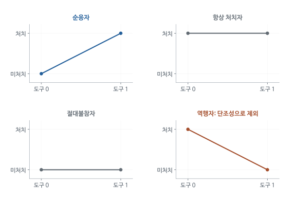

# 같은 Wald 비율은 누구의 효과인가 - MHE 4.4 심층요약

직업훈련 프로그램의 예산을 늘리려는 담당자는 훈련을 받으면 소득이 얼마나 오르는지 알고 싶다. 연구자가 훈련 기회를 무작위로 배정해도 모든 사람이 참여하지는 않는다. 제안을 받아 훈련에 온 사람, 제안을 받아도 오지 않은 사람, 제안 없이도 다른 경로로 훈련받는 사람이 함께 존재한다.

IV는 무작위 제안이 소득을 바꾼 정도를 실제 훈련 참여를 늘린 정도로 나눈다. 그런데 훈련효과가 사람마다 다르다면 이 숫자는 누구의 효과일까? MHE 4.4는 이 질문에 답한다. 도구에 반응해 행동을 바꾼 사람들의 평균효과를 국소평균처치효과(LATE)라고 부르며, 왜 그 사람들의 효과만 관측된 비교에 나타나는지를 단계별로 설명한다.

[원문 PDF](<MHE Ch4.4 IV with Heterogeneous Potential Outcomes (2009).pdf>) | [QnA](<MHE Ch4.4 IV with Heterogeneous Potential Outcomes (2009)_QnA.md>)

## 1. 평균효과를 구하기 전에 누구를 평균할지 정한다

모든 사람에게 군복무의 소득효과가 같다면 어떤 복무자를 비교하더라도 답은 하나이다. 실제로는 군에서 배운 기술이 도움이 되는 사람도 있고, 민간 경력이 끊겨 손해를 보는 사람도 있다. 교육이나 직업훈련에서도 출발 조건에 따라 이익이 달라진다.

이렇게 사람마다 처치효과가 다른 상황을 효과의 이질성이라고 한다. 교재가 공통효과 가정을 풀려는 이유는 결과를 다른 사람과 정책에 적용할 때 누구의 효과를 추정했는지 알아야 하기 때문이다. 징병으로 복무한 사람의 소득효과가 자원입대할 사람에게도 같다는 보장은 없다.

따라서 아래에서는 전체 모집단, 실제 복무자, 추첨 때문에 복무한 사람을 구별해 각각의 평균효과를 정의한다.

평균효과라는 말을 쓰려면 먼저 효과를 가진 사람들의 목록을 정해야 한다. 국민 전체의 평균이라면 군복무를 절대 선택하지 않을 사람도 포함한다. 실제 복무자의 평균이라면 자원입대자와 징병 때문에 들어온 사람이 섞인다. 추첨 때문에 복무가 달라진 사람만의 평균이라면 같은 자료에서도 더 좁은 집단을 대상으로 한다. 이 집단 구분은 통계기법을 선택한 뒤 붙이는 설명이 아니라 애초에 어떤 질문에 답할지를 정하는 일이다.

정책을 바꾸면 어느 집단의 평균이 필요한지도 달라진다. 기존 자원입대자의 복지를 평가하는 질문과 징병 범위를 확대할 때 새로 복무할 사람의 소득을 예상하는 질문은 다르다. IV가 후자의 사람들에게 더 직접적인 정보를 줄 수 있다는 것이 국소적 효과의 쓸모다. 모집단 전체의 답이 아니라는 이유만으로 무의미한 추정이라고 볼 수는 없다.

## 2. 제안을 바꿨을 때의 행동과 행동을 바꿨을 때의 결과

징병 연구에서는 서로 다른 두 가상 질문이 필요하다. 첫 질문은 이 사람이 자격을 받으면 복무할지, 자격을 받지 않아도 복무할지이다. 두 번째 질문은 이 사람이 복무하면 얼마를 벌고 복무하지 않으면 얼마를 벌지이다. 앞의 질문은 도구에 대한 행동반응, 뒤의 질문은 실제 처치의 효과를 정의한다.

잠재변수는 이처럼 실제로 관측되지 않은 경우까지 포함해 가정한 값이다. 아래 표에서 d는 행동, y는 결과, z는 징병 자격을 나타낸다.

| 기호 | 읽는 법 | 징병 사례 |
|---|---|---|
| $z_i$ | 관측된 도구값 | 징병 자격이면 1 |
| $d_i$ | 관측된 처치값 | 실제 복무하면 1 |
| $d_{1i}$ | 도구를 1로 놓았을 잠재 처치 | 자격이 있으면 복무할지 |
| $d_{0i}$ | 도구를 0으로 놓았을 잠재 처치 | 자격이 없어도 복무할지 |
| $y_i(d,z)$ | 처치와 도구를 정했을 잠재 결과 | 해당 조합의 소득 |
| $y_{1i},y_{0i}$ | 배제제약 후의 잠재 결과 | 복무와 미복무의 소득 |
| $\tau_i=y_{1i}-y_{0i}$ | 개인별 처치효과 | 복무로 인한 소득 변화 |

$d_{1i}$의 1은 시점이 아니며 도구값 1이다. $y_{1i}$의 1은 처치값 1이다. 숫자 첨자의 대상이 서로 다르므로 정의를 먼저 확인해야 한다.

관측 처치의 선택식은

$$
d_i=d_{0i}+(d_{1i}-d_{0i})z_i.
\tag{4.4.1}
$$

z=0을 넣으면 d=d0, z=1을 넣으면 d=d1이 된다. 한 사람에게는 둘 중 하나만 관측한다. 이는 원인에 대한 확률모형을 추정한 식이 아니라 잠재 처치 중 실제로 선택되는 값을 적은 항등식이다.

한 사람을 정해 두고 자격을 받는 세계와 받지 않는 세계를 각각 상상해 보자. 그 사람이 자격이 없어도 군에 들어갈 사람이라면 두 세계의 행동이 같고, 자격이 있어야 군에 들어갈 사람이라면 행동이 다르다. 실제 자료에서는 한 세계만 관찰하므로 이 두 행동을 동시에 볼 수 없다. 잠재 처치라는 표현은 바로 이 관찰되지 않은 행동까지 포함한다.

잠재결과는 한 단계 다른 질문이다. 실제로 군에 들어갔을 때 벌 소득과 들어가지 않았을 때 벌 소득을 비교한다. 도구를 바꾸는 질문과 처치를 바꾸는 질문이 따로 있기 때문에 기호도 둘로 나뉜다. 징병 자격이 교육을 늘리거나 이주를 유발해 복무 없이도 소득을 바꾼다면, 결과는 복무 여부뿐 아니라 자격에도 의존한다. 뒤의 배제제약은 바로 그 추가 의존을 없애는 가정이다.

## 3. 추첨이 행동을 바꾸는 사람과 바꾸지 않는 사람

도구를 0과 1로 각각 설정했을 때 복무 여부는 두 개의 0/1 값으로 정해진다. 가능한 조합은 네 가지이다. 이 구분이 필요한 이유는 징병 자격을 바꾸었을 때 실제 복무가 달라지는 사람이 누구인지 알아보기 위해서다.

| 유형 | $d_0$ | $d_1$ | 도구가 처치를 바꾸는 양 |
|---|---:|---:|---:|
| 순응자, complier | 0 | 1 | +1 |
| 항상 처치자, always-taker | 1 | 1 | 0 |
| 비처치자, never-taker | 0 | 0 | 0 |
| 역행자, defier | 1 | 0 | -1 |

징병 사례에서 순응자는 자격이 없으면 복무하지 않고 자격이 있으면 복무하는 사람이다. 자격 여부와 무관하게 자원입대할 사람은 항상 처치자다. 건강상 이유로 어느 경우에도 복무하지 못하면 비처치자일 수 있다.

순응자는 관측된 복무자라는 뜻이 아니다. 자격을 받은 뒤 복무한 사람은 순응자일 수도 있고 자격이 없어도 복무했을 항상 처치자일 수도 있다. 자격이 없어서 복무하지 않은 사람도 순응자와 절대불참자가 섞여 있다. 그러므로 관측자료에서 순응자 이름을 골라 따로 회귀할 수 있다는 설명은 성립하지 않는다.

이 분류는 사람의 성격을 영구적으로 붙이는 이름도 아니다. 같은 사람이 징병 자격에는 반응하지 않아도 더 큰 입대 보너스에는 반응할 수 있다. 어떤 도구를 얼마만큼 바꾸었는지를 정해야 순응자가 정의된다. 논문에서 도구를 바꾸면 추정대상이 달라진다는 말은 이런 개인별 행동반응을 기준으로 평균에 들어가는 사람이 달라진다는 뜻이다.

<!-- learning-figure:late-types -->

*그림 설명: 잠재 처치의 네 유형을 나타낸 개념도다. 실제 표본의 유형별 비율을 뜻하지 않는다.*

순응자의 선만 0에서 1로 올라간다. 단조성은 반대로 내려가는 역행자가 없다고 가정한다. 항상 처치자와 절대불참자는 도구가 바뀌어도 행동이 같으므로, 배제제약 아래 도구가 만드는 결과 차이에 처치 변화로 기여하지 않는다. 한 사람에게 두 도구값을 동시에 관측할 수 없다는 점은 그대로 남는다.

<!-- /learning-figure -->

## 4. 관측된 집단 차이에 인과적 의미를 주는 가정

관측자료에서 계산할 수 있는 것은 징병 자격별 소득 차이와 복무율 차이이다. 이를 특정 사람들의 복무효과로 해석하려면 두 집단이 원래 비교가능한지, 자격이 복무 이외의 경로로 소득을 바꾸는지, 자격에 반응하는 방향이 일관된지를 정해야 한다. 다음 가정들은 각각 이 다른 문제를 해결한다.

### 4.1 독립성

$$
\{y_i(d,z),d_{1i},d_{0i}\}\perp z_i.
$$

도구 집단들이 잠재 결과와 잠재 처치 유형 면에서 비교 가능하다는 뜻이다. 이 가정 덕분에 z별 평균 차이를 z를 바꾼 인과효과로 읽는다. 실제 처치 d가 무작위라는 뜻은 아니다.

### 4.2 배제제약

$$
y_i(d,1)=y_i(d,0)\quad(d=0,1).
$$

같은 복무 상태를 유지하면 징병 자격 자체가 소득을 바꾸지 않는다는 뜻이다. 징병을 피하기 위해 대학에 더 다니고 그것이 소득을 바꾸면 별도 경로가 있다. 반면 복무 후 받은 군인 교육혜택이 교육과 소득을 바꾸는 것은 복무의 하류 경로이므로 복무의 총효과에 포함될 수 있다.

### 4.3 단조성

$$
d_{1i}\ge d_{0i}\quad\text{모든 }i.
$$

징병 자격은 어떤 사람의 복무를 늘리면서 다른 사람의 복무를 줄이는 식으로 작용하지 않는다고 가정한다. 평균 복무율이 올라간다는 사실보다 강한 개인별 가정이다.

### 4.4 비영 1단계

$$
E[d\mid z=1]-E[d\mid z=0]\ne0.
$$

분모가 0이면 비율을 정의할 수 없다. 기본 잠재결과 해석에는 일관성과 개인 간 간섭 부재도 전제한다. 친구의 징병 자격이 본인의 입대나 소득을 바꾸면 더 복잡한 모형이 필요하다.

각 가정은 서로 다른 대안 설명을 막는다. 추첨이 독립적이라는 가정은 건강이나 능력이 좋은 사람에게 자격이 더 많이 돌아가는 경우를 배제한다. 배제제약은 추첨이 공정해도 자격 통지만으로 학교 진학이나 직장 선택이 달라져 소득이 변하는 경로를 배제한다. 무작위배정에 성공했다는 사실만으로 두 번째 문제가 해결되지는 않는다.

단조성은 자격이 어떤 사람에게는 복무를 늘리고 다른 사람에게는 줄이는 상황을 제한한다. 전체 평균 복무율이 증가했다고 모든 사람이 같은 방향으로 반응했다는 뜻은 아니다. 복무를 늘린 사람이 더 많으면 반대로 반응한 일부가 있어도 평균은 증가한다. 그래서 관측된 양의 1단계는 관련성의 증거이지만 단조성의 직접 증명은 아니다. 비영 1단계는 그런 가정들을 받아들인 뒤에도 실제로 행동이 바뀐 사람이 있어야 한다는 마지막 요구이다.

## 5. 왜 추첨의 소득효과에 개인별 복무효과가 곱해지는가

증명의 목표는 관측되는 징병 자격별 소득 차이를, 아직 관측하지 못한 개인별 복무효과와 연결하는 것이다. 배제제약을 적용하면 한 사람의 소득은 자격 자체보다 실제 복무 여부로 정해진다. 복무하지 않을 때의 소득 y₀에 복무효과 τ를 복무한 경우에만 더하면 관측 소득을 표현할 수 있다.

$$
y_i=y_{0i}+(y_{1i}-y_{0i})d_i=y_{0i}+\tau_i d_i.
$$

z=1 집단에는 관측 처치가 d1이므로

$$
E[y\mid z=1]=E[y_0+\tau d_1\mid z=1].
$$

독립성 때문에 조건 z=1을 제거할 수 있다.

$$
E[y\mid z=1]=E[y_0+\tau d_1].
$$

똑같이

$$
E[y\mid z=0]=E[y_0+\tau d_0].
$$

두 식을 빼면

$$
\begin{aligned}
RF&=E[y\mid z=1]-E[y\mid z=0]\\
&=E[y_0+\tau d_1]-E[y_0+\tau d_0]\\
&=E[\tau(d_1-d_0)].
\end{aligned}
$$

마지막 줄은 평균의 선형성이다. $E[\tau(d_1-d_0)]=E[\tau]E[d_1-d_0]$라고 곱을 분리하면 안 된다. 효과가 큰 사람이 도구에 더 많이 반응할 수 있기 때문이다.

위 식에서 개인별 효과와 행동 변화량을 곱하는 이유를 사람 단위로 생각할 수 있다. 자격을 받아도 행동이 그대로인 사람에게는 복무 여부를 통한 소득 변화가 없다. 이 사람의 복무효과가 아주 크더라도 자격을 바꾸어서는 그 효과를 관찰할 수 없다. 반면 자격 때문에 복무가 달라지는 사람은 두 배정 세계에서 서로 다른 처치결과를 실현한다.

축약형은 이런 개인별 자격효과를 전체 사람에 대해 평균한 것이다. 그래서 복무효과가 같은 값이라고 가정하지 않아도 행동 변화량이 곱해진 평균을 정의할 수 있다. 독립성은 실제로 서로 다른 사람들로 구성된 두 자격집단의 평균 차이를, 같은 모집단에 배정을 바꾸었을 때의 차이로 해석하는 데 쓰인다. 배제제약은 그 결과 차이를 복무를 통한 차이로 바꾸는 데 쓰인다.

## 6. 축약형에 기여하는 사람들의 수로 나누면 어떤 평균이 되는가

항상 복무할 사람은 추첨 자격을 바꾸어도 복무 상태가 같다. 어느 경우에도 복무하지 않을 사람도 마찬가지다. 배제제약이 성립하면 이들의 소득 역시 자격 변경으로 달라지지 않는다. 자격별 소득 차이를 만드는 사람은 실제로 복무 여부를 바꾼 사람들이다.

단조성은 자격을 받았기 때문에 오히려 복무를 하지 않게 되는 역행자를 제외한다. 그러면 d₁-d₀는 순응자에게 1, 나머지에게 0이다. 순응자라는 사건을 C로 표시하면 다음과 같다.

$$
RF=E[\tau 1(C)].
$$

전체기대값 법칙으로

$$
E[\tau1(C)]
=E[\tau\mid C]P(C)+E[0\mid C^c]P(C^c)
=E[\tau\mid C]P(C).
$$

1단계도 같은 순서로

$$
\begin{aligned}
FS&=E[d\mid z=1]-E[d\mid z=0]\\
&=E[d_1-d_0]\\
&=P(C).
\end{aligned}
$$

그러므로 $P(C)>0$이면

$$
\boxed{\frac{RF}{FS}=E[y_1-y_0\mid C]=LATE.}
$$

원문 Theorem 4.4.1의 결론이다. 항상 처치자와 비처치자는 결과 수준에는 기여하지만 z가 바뀌어도 처치가 바뀌지 않아 축약형 차이에서는 제거된다.

분자에 순응자 효과만 남았다고 해서 곧바로 순응자 평균이 된 것은 아니다. 전체 모집단을 분모로 평균냈기 때문에 행동을 바꾸지 않은 사람들도 0이라는 값으로 들어 있다. 1단계로 나누는 것은 이 희석을 되돌리는 과정이다. 단조성 아래에서는 1단계가 전체 가운데 순응자가 차지하는 비율이므로, 전체당 효과를 순응자당 효과로 환산한다.

이 설명에서 중요한 점은 모든 순응자의 효과가 같을 필요가 없다는 것이다. 어떤 순응자는 군복무로 임금이 오르고 다른 순응자는 내려도 그들의 평균을 구할 수 있다. 필요한 공통성은 효과의 크기보다 도구가 행동을 바꾸는 방향과 배정의 타당성에 있다. 공통효과 모형을 풀었는데도 같은 Wald 계산이 남는 이유가 여기에 있다.

## 7. LATE, ATE, ATT가 서로 다른 숫자가 되는 예

정부가 모든 사람에게 훈련을 제공할 효과를 묻는지, 지금 훈련받는 사람의 효과를 묻는지, 제안 때문에 새로 참여하는 사람의 효과를 묻는지에 따라 필요한 평균이 달라진다. 각각 전체 평균효과(ATE), 실제 처치자 평균효과(ATT), 해당 도구의 순응자 평균효과(LATE)에 해당한다.

아래는 이 차이를 계산하는 가상 모집단이다. 표의 효과 단위는 동일한 소득 단위라고 생각하면 된다.

| 유형 | 비율 | 처치효과 |
|---|---:|---:|
| 항상 처치자 | 0.20 | 30 |
| 순응자 | 0.40 | 10 |
| 비처치자 | 0.40 | -5 |

무작위 도구가 절반에게 1이라고 하자. 도구가 0일 때 처치율은 항상 처치자 0.20이다. 도구가 1일 때는 항상 처치자와 순응자를 더한 0.60이다.

$$
FS=0.60-0.20=0.40,
\qquad RF=0.40\times10=4.
$$

따라서 Wald는 4/0.4=10이다. 반면 전체 평균효과는

$$
ATE=.20(30)+.40(10)+.40(-5)=8.
$$

실제 처치자는 항상 처치자 0.20과 도구가 켜진 순응자 0.20, 합계 0.40이다.

$$
ATT=\frac{.20(30)+.20(10)}{.40}=20.
$$

같은 모집단에서 LATE=10, ATE=8, ATT=20이다. 어느 평균을 묻는지 정하지 않으면 서로 다른 정답을 비교하게 된다.

예제에서 ATE가 관심이라면 항상 처치자와 절대불참자의 관측되지 않은 반대 처치결과도 필요하다. 자원입대자를 실제로 입대하지 않게 했을 때의 소득이나 절대 입대하지 않는 사람을 입대시켰을 때의 소득은 추첨만으로 드러나지 않는다. IV가 그 값을 알려 주지 않는 것은 계산이 부족해서가 아니라 도구가 해당 사람의 행동을 바꾸지 않았기 때문이다.

ATT에는 실제 복무자 중 누가 들어 있는지도 중요하다. 배정 확률이 바뀌면 실제 복무자 가운데 순응자가 차지하는 비중이 바뀔 수 있다. 반면 도구에 대한 잠재 행동 유형을 고정한 LATE는 순응자 집단의 효과를 말한다. 따라서 실제 참가자의 평균이라는 표현과 도구로 유도된 참가자의 평균이라는 표현을 구분해야 연구 결과를 다른 정책 규모에 적용할 때 혼란이 없다.

## 8. 일부가 반대 방향으로 반응하면 비율이 왜 달라지는가

징병 자격 때문에 복무하는 사람의 소득 변화와, 같은 자격 때문에 복무를 피하는 사람의 소득 변화는 축약형에서 반대 부호로 들어간다. 평균 복무율이 증가했다는 사실만으로 후자가 존재하지 않는다고 말할 수는 없다. 두 유형의 효과가 다르면 비율은 순응자의 단순 평균에서 벗어난다.

순응자 비율을 p_C, 역행자 비율을 p_D, 각 집단의 평균효과를 τ_C, τ_D라 하자.

$$
RF=p_C\tau_C-p_D\tau_D,
\qquad FS=p_C-p_D.
$$

따라서

$$
Wald=\frac{p_C\tau_C-p_D\tau_D}{p_C-p_D}.
$$

가상으로 $p_C=.4,p_D=.2,\tau_C=1,\tau_D=3$이면

$$
RF=.4-.6=-.2,\quad FS=.2,\quad Wald=-1.
$$

두 반응집단 모두 처치효과가 양수인데 비율은 음수다. 단조성은 이런 음의 가중치 문제를 제거한다. 모든 사람의 효과가 같은 상수라면 분자의 각 집단 효과를 공통인수로 꺼낼 수 있어 역행자 항도 분모와 함께 약분된다. 하지만 그것이 이질효과 상황의 단조성을 불필요하게 만들지는 않는다.

역행자가 있을 때 1단계는 행동을 늘린 사람 비율에서 줄인 사람 비율을 뺀 값이다. 양쪽의 행동 변화가 서로 상쇄되므로 분모는 작은데 결과 변화는 크게 남을 수 있다. 그 비율은 순응자와 역행자의 효과를 일반적인 양의 비중으로 평균한 값이 아니다. 따라서 전체 사람의 효과 범위를 벗어나는 수치도 논리적으로 가능하다.

정책 현장에서 반대반응을 의심할 이유는 구체적으로 설명해야 한다. 자격 통보가 들어오기 전에는 자원입대를 생각했지만 통보에 반발해 회피하는 사람이라는 가상의 경우가 이에 해당한다. 그 존재를 실제로 확인한 것과 단조성의 의미를 설명하기 위한 예시는 다르다. 연구자는 제도상 그런 반응이 얼마나 그럴듯한지 논증하되, 평균 참가율이 상승했다는 사실만으로 가능성을 없애서는 안 된다.

## 9. JTPA 실험에서 제안과 실제 훈련을 구분해야 하는 이유

JTPA는 직업훈련의 소득효과를 알아보기 위해 훈련 제안을 무작위로 배정한 실험이다. 제안받았다고 모두 훈련에 참여한 것은 아니었다. 연구자가 실제 참여 여부로 사람들을 다시 나누면 참여 의욕이나 취업 가능성에 따른 차이가 돌아온다.

처음 배정된 집단을 유지한 비교는 제안의 효과를 추정한다. 이를 배정의도 효과(ITT, intention-to-treat)라고 한다. 제안을 도구로 삼은 IV는 그 제안 때문에 참여하게 된 사람들의 훈련효과를 추정한다. Table 4.4.1은 같은 자료에서도 질문에 따라 추정치가 달라지는 모습을 보여 준다.

Table 4.4.1에서 공변량 없는 남성 결과는 다음과 같다.

| 비교 | 30개월 소득효과 추정 |
|---|---:|
| 실제 훈련 여부의 OLS | 3,970달러 |
| 무작위 제안 여부의 ITT | 1,117달러 |
| 제안을 도구로 쓴 IV | 1,825달러 |

여성의 대응 수치는 2,133, 1,243, 1,942달러다. ITT는 제안 정책의 효과이며 참여하지 않는 반응까지 포함한다. ITT가 훈련효과보다 작다고 해서 제안 효과로서 편향되었다는 뜻은 아니다.

표의 남성 IV와 ITT를 역산한 1단계는 $1117/1825\simeq.612$다. 교재의 “약 0.6”을 모든 열에 기계적으로 넣으면 정확한 표의 비율과 달라진다.

JTPA는 직업훈련을 제공할 기회를 무작위로 배정했지만, 실제 훈련 참가를 강제로 정하지는 않았다. 제안을 받고도 사정상 참가하지 않은 사람이 있어 제안집단 전체의 소득 변화는 실제 훈련을 받은 사람에게만 생긴 효과보다 작게 보일 수 있다. 제안의 효과는 프로그램을 제안하는 정책 자체를 평가하는 답이고, 훈련의 효과는 제안으로 참가가 늘어난 사람을 기준으로 한 답이다.

실제 훈련자와 비훈련자를 직접 비교하면 무작위배정의 이점이 사라진다. 시간 여유가 있거나 취업 의욕이 강한 사람이 더 잘 참가할 수 있기 때문이다. 처음 배정된 집단을 유지하여 소득 차이를 계산하고 참가율 차이로 환산하는 절차는 그 선택을 그대로 따라가지 않으려는 것이다. 통제집단의 다른 훈련 이용이나 프로그램 접근 규칙은 처치 정의와 순응 유형을 판단할 때 함께 확인해야 한다.

표에 OLS, 제안효과, IV가 함께 있는 것은 어느 숫자가 더 큰지 순위를 매기기 위해서가 아니다. OLS는 실제 참가자를 비교하고, 제안효과는 무작위배정된 집단을 비교하며, IV는 배정에 반응한 사람의 처치효과로 환산한다. 각각 다른 사람 구분과 질문을 사용하므로 차이를 설명하려면 먼저 그 분류를 말해야 한다.

### 원문 Table 4.4.1 전체를 표준오차와 함께 읽기

위의 세 숫자는 남성, 공변량 없는 열만 뽑은 것이다. 원문 표에는 공변량을 넣은 추정치, 여성 결과, 괄호 속 강건 표준오차가 함께 실려 있다. OLS와 IV의 차이가 얼마나 확실한지, 사전 특성을 통제해도 결론이 유지되는지는 표준오차와 공변량 열을 같이 보아야 판단할 수 있다.

출처: 원문 Table 4.4.1 "Results from the JTPA experiment: OLS and IV estimates of training impacts", PDF 파일 14쪽(인쇄면 p. 163). 원문의 수치 12개와 표준오차 12개를 모두 옮겼고, 추정치와 표준오차를 한 칸에 합치고 주석의 표본 수를 행 이름에 넣는 식으로 배치만 바꿨다. 종속변수는 무작위배정 뒤 30개월 동안의 총소득이며 단위는 달러다. 괄호 안은 강건 표준오차다.

| 표본 | (1) OLS, 공변량 없음 | (2) OLS, 공변량 포함 | (3) ITT, 공변량 없음 | (4) ITT, 공변량 포함 | (5) IV, 공변량 없음 | (6) IV, 공변량 포함 |
|---|---:|---:|---:|---:|---:|---:|
| A. 남성 (5,102명) | 3,970 (555) | 3,754 (536) | 1,117 (569) | 970 (546) | 1,825 (928) | 1,593 (895) |
| B. 여성 (6,102명) | 2,133 (345) | 2,215 (334) | 1,243 (359) | 1,139 (341) | 1,942 (560) | 1,780 (532) |

원문 주석에 따르면 (2), (4), (6)열의 공변량은 고졸 또는 GED, 흑인, 히스패닉, 기혼, 지난해 13주 미만 근로, AFDC 수급(여성만), 그리고 권고된 JTPA 서비스 전략, 연령대, 2차 추적조사 여부의 지표다.

열은 두 개씩 세 쌍으로 읽는다. (1)과 (2)는 실제 훈련 여부 $d$로 사람을 나눈 비교이고, (3)과 (4)는 무작위 제안 여부 $z$로 나눈 비교이며, (5)와 (6)은 $z$를 도구로 삼아 $d$의 효과를 구한 IV다. 각 쌍의 왼쪽은 공변량을 넣지 않은 값, 오른쪽은 사전 특성과 서비스 전략, 조사 관련 지표를 함께 통제한 값이다. 행은 남성과 여성을 따로 분석한 결과다. 여섯 열 모두 종속변수와 단위가 같으므로 숫자를 나란히 놓을 수는 있지만, 칸마다 비교하는 집단이 다르다.

남성 (1)열의 3,970달러는 실제로 훈련받은 남성과 받지 않은 남성의 30개월 누적 소득 차이다. 연 소득이나 월 소득 차이로 읽으면 안 된다. 원문은 이 차이가 평균 소득의 약 20%에 해당한다고 설명한다. (3)열의 1,117달러는 제안을 받은 집단 전체와 통제집단 전체의 차이로, 제안을 받고도 훈련을 거절한 약 40%의 사람이 분자에 그대로 들어 있다. (5)열의 1,825달러는 이 1,117을 1단계로 나눈 값이다. 1단계는 표에 따로 실려 있지 않지만 역산하면 남성은 1,117/1,825 ≈ .612, 공변량을 넣으면 970/1,593 ≈ .609이고, 여성은 1,243/1,942와 1,139/1,780 모두 약 .640이다. 원문 본문의 "약 .6"은 이 값들을 어림한 수치다.

표준오차를 보면 정밀도가 크게 다르다. 남성 IV 1,825의 표준오차는 928이어서 추정치를 표준오차로 나눈 값이 약 1.97이고, 공변량을 넣은 1,593(895)은 약 1.78이다. 원문 표에는 유의성 별표가 없으므로 이 비율은 요약 작성 과정에서 계산한 값이다. 정규근사로 남성 IV의 95% 구간을 만들면 1,825 ± 1.96 × 928, 약 6달러에서 3,644달러까지로 매우 넓다. 여성 IV 1,942(560)는 비율이 약 3.5로 상대적으로 정밀하다. IV 표준오차가 ITT 표준오차보다 큰 이유도 표에서 확인된다. 남성의 928/569 ≈ 1.63은 1/.612와 거의 같다. ITT를 1단계로 나눌 때 표준오차도 대략 같은 배수로 커진다.

이 표로 말할 수 있는 것은 다음과 같다. 남성의 경우 실제 훈련 여부로 나눈 비교가 무작위배정을 유지한 IV보다 두 배 이상 크다. 원문은 제안을 거절한 결정이 잠재소득과 무관할 가능성이 낮다고 보고 (1), (2)열을 오도적인 비교로 평가한다. 공변량을 넣어도 각 추정치의 변화는 해당 표준오차보다 작아 결론의 방향이 바뀌지 않는다. ITT는 제안이라는 정책의 인과효과이며, 통제집단의 훈련 참여가 약 2%에 불과하므로 IV는 실제 훈련자의 평균효과(ATT)에 가깝다.

말할 수 없는 것도 분명하다. 남성의 (1)열과 (5)열 차이 2,145달러를 선택편향의 정밀한 크기로 읽을 수는 없다. OLS와 IV는 비교 대상이 다를 수 있고, 두 추정치의 차이에 대한 표준오차도 보고되지 않았기 때문이다. 이 차이를 검정하려면 두 추정치의 공분산까지 고려해야 한다. 여성 IV 1,942와 남성 IV 1,825의 차이를 성별에 따른 훈련효과 차이로 해석할 근거도 표에 없다. 차이가 각 표준오차보다 훨씬 작다. 표는 30개월 누적 소득만 다루므로 그 이후의 효과, 통제집단도 훈련을 쉽게 받을 수 있는 다른 프로그램, 개인별 효과의 분포에 대해서는 알려 주지 않는다.

## 10. 훈련을 받은 사람이 모두 순응자인 특별한 경우

정책 담당자가 현재 훈련받은 사람들의 효과를 알고 싶다면 LATE가 ATT와 언제 같아지는지 알아야 한다. 통제집단은 해당 훈련을 전혀 받을 수 없고 제안받은 사람만 참여할 수 있는 프로그램을 생각해 보자. 그러면 제안 없이도 훈련받는 항상 처치자가 존재하지 않는다.

수식으로 d₀=0이다. 실제 처치자는 모두 제안받은 순응자이고, 제안이 무작위이므로 그들의 평균효과는 전체 순응자의 평균효과와 같다.

$$
LATE=E[\tau\mid d=1]=ATT.
$$

이것이 Theorem 4.4.2, Bloom 결과다. JTPA에서는 통제집단의 약 2%도 훈련을 받아 정확한 단측 불순응은 아니다. 따라서 LATE와 ATT의 일치를 엄밀한 등식으로 쓰는 것은 이상화이며 교재도 거의 일치하는 상황으로 설명한다.

반대로 $d_1=1$이라서 처치 배정집단 안에 비처치자가 없으면, 전체 표본의 실제 미처치자는 모두 순응자다. 그때 LATE는 미처치자 평균효과 ATU와 같다. 교재의 미니애폴리스 가정폭력 대응 실험은 체포를 배정받으면 모두 체포되어 이 경우를 설명한다. 체포하지 말라는 배정에서도 경찰이 위험성을 보고 체포할 수 있어 항상 처치자는 존재한다.

미니애폴리스 실험의 결과변수는 이후 폭력의 재발이다. 경찰은 비체포 대응을 배정받아도 위험하거나 취한 가해자를 체포할 수 있었으므로 이 집단의 실제 체포자는 원래 위험성이 더 높을 수 있다. 체포자와 비체포자를 직접 비교하기보다 무작위 대응 배정을 이용해야 하는 이유다. 교재는 체포가 실제 비체포자 집단의 재발을 줄이는 방향의 IV 결과를 소개한다. 어떤 가해자에게 체포의 효과를 말할 수 있는지가 불순응 방향에 따라 달라진다.

하지만 연구자가 자료에서 통제집단 참가율이 우연히 0에 가깝게 나왔다고 관찰한 것과, 제도적으로 참여가 불가능한 것은 구별해야 한다. 다른 기관에서 비슷한 훈련을 받을 수 있거나 처치 정의가 넓어지면 항상 처치자가 다시 생길 수 있다. ATT와 같다는 해석은 어떤 훈련을 처치로 정의했으며 통제집단의 접근을 어떻게 제한했는지에 달려 있다.

## 11. 순응자가 누구인지 이름을 모르면서도 특징을 추정하는 방법

어떤 복무자가 추첨이 없었어도 입대했을지는 관측되지 않는다. 그런데 연구 결과를 다른 정책에 적용하려면 순응자가 전체 인구에서 얼마나 흔하고 어떤 특성을 갖는지 알고 싶다. 교재는 개인을 한 명씩 분류하지 않아도 집단 비율을 추정할 수 있음을 보여 준다.

단조성하에서 1단계 FS는 전체 인구 중 순응자 비율이다. 실제 복무자 중 순응자 비율은 분모가 달라서 베이즈 법칙으로 다시 계산한다.

$$
\begin{aligned}
P(C\mid d=1)
&=\frac{P(d=1\mid C)P(C)}{P(d=1)}\\
&=\frac{P(z=1)FS}{P(d=1)}.
\end{aligned}
\tag{4.4.7}
$$

두 번째 등호에서 순응자에게 d=z라는 사실과 z의 독립성을 사용했다. Table 4.4.2의 1950년생 백인 남성 수치를 넣으면

$$
\frac{(195/365)\times.159}{.267}\simeq.318.
$$

순응자는 전체 인구의 약 15.9%지만 복무자의 약 31.8%다. 두 비율의 분모가 다르다.

### 원문 Table 4.4.2: 도구마다 순응자는 얼마나 되는가

한 사례의 계산만으로는 순응자 비율이 큰지 작은지 판단하기 어렵다. 원문 Table 4.4.2는 네 연구의 여섯 도구에 같은 계산을 적용해 나란히 놓는다. 앞에서 본 FS = P(C), 식 (4.4.7), 그리고 10절에서 설명한 "어느 도구값에서도 처치받지 않는 비처치자(never-taker)가 없으면 LATE가 관측된 미처치자의 평균효과와 같아진다"는 논리를 실제 연구의 수치로 확인할 수 있다.

출처: 원문 Table 4.4.2 "Probabilities of compliance in instrumental variables studies", PDF 파일 20쪽(가로로 인쇄된 면이며 인쇄면 번호는 표시되지 않았다. 앞뒤 면은 p. 168과 p. 170이다). 원문은 아홉 열짜리 넓은 표라서 두 표로 나눴다. 첫 표는 원문 (1)~(4)열의 연구 설명이고, 둘째 표는 (5)~(9)열의 수치다. 여섯 행과 모든 수치를 옮겼다.

| 행 | 연구 (1) | 처치 d (2) | 도구 z (3) | 표본 (4) |
|---|---|---|---|---|
| ① | Angrist (1990) | 참전 여부 | 징병 자격 | 1950년생 백인 남성 |
| ② | Angrist (1990) | 참전 여부 | 징병 자격 | 1950년생 비백인 남성 |
| ③ | Angrist and Evans (1998) | 자녀 3명 이상 | 둘째 출산이 쌍둥이 | 1980년 기혼 여성, 21-35세, 자녀 2명 이상 |
| ④ | Angrist and Evans (1998) | 자녀 3명 이상 | 첫 두 자녀가 같은 성별 | ③과 같음 |
| ⑤ | Angrist and Krueger (1991) | 고교 졸업 | 3분기 또는 4분기 출생 | 1930-1939년생 남성 |
| ⑥ | Acemoglu and Angrist (2000) | 고교 졸업 | 주 법이 11년 이상 취학을 요구 | 40-49세 백인 남성 |

| 행 | (5) $P[d=1]$ | (6) 1단계 $P[d_1>d_0]$ | (7) $P[z=1]$ | (8) $P[d_1>d_0\mid d=1]$ | (9) $P[d_1>d_0\mid d=0]$ |
|---|---:|---:|---:|---:|---:|
| ① 백인, 징병 자격 | .267 | .159 | .534 | .318 | .101 |
| ② 비백인, 징병 자격 | .163 | .060 | .534 | .197 | .033 |
| ③ 쌍둥이 출산 | .381 | .603 | .008 | .013 | .966 |
| ④ 같은 성별 자녀 | .381 | .060 | .506 | .080 | .048 |
| ⑤ 출생 분기 | .770 | .016 | .509 | .011 | .034 |
| ⑥ 의무취학법 | .617 | .037 | .300 | .018 | .068 |

모든 칸은 0과 1 사이의 확률, 즉 비율이다. (5)열은 표본 중 처치를 받은 비율, (6)열은 표본 전체에서 순응자가 차지하는 비율, (7)열은 도구가 켜진 비율이다. 원문 주석은 (6)열을 순응자 집단의 절대적 크기, (8)열과 (9)열을 처치집단과 비처치집단에 대한 상대적 크기라고 설명한다. (8)열은 식 (4.4.7)대로 (7) × (6) / (5)이고, (9)열은 같은 논리를 비처치자에 적용한 (1 − (7)) × (6) / (1 − (5))다. 뒤의 식은 원문에 따로 적혀 있지 않지만 여섯 행 모두 표시값의 반올림 오차를 고려하면 이 관계와 부합한다.

①행의 (8)열 .318은 앞의 계산과 같다. 같은 행의 (9)열 .101은 참전하지 않은 1950년생 백인 남성 중 약 10%가 징병 자격이 있었다면 복무했을 사람이라는 뜻이다. 계산은 .466 × .159 / .733 ≈ .101이다. 원문은 나머지 비참전자 대부분이 연기, 부적격, 자격 미달 때문에 복무하지 않았다고 해석한다. ②행 비백인은 1단계가 .060으로 약하고 참전자 가운데 순응자 비율도 약 20%로 낮다. 두 행 모두 순응자가 참전자의 소수라는 점을 보여 주는데, 원문은 베트남전 시기에도 대부분의 군인이 자원입대자였다는 사실과 연결한다. 징병 추첨 IV의 LATE는 징병 자격 때문에 복무 여부가 바뀐 사람들의 효과이고, 자원입대자의 효과를 알려면 다른 식별 전략이 필요하다.

③행 쌍둥이 도구는 모양이 전혀 다르다. 둘째 출산이 쌍둥이인 여성은 .008, 즉 0.8%뿐이지만 1단계는 .603으로 크다. 자녀가 셋 이상인 어머니 중 쌍둥이 때문에 셋째를 갖게 된 사람은 (8)열의 1.3%에 불과하다. 반대로 자녀가 둘뿐인 어머니는 (9)열에 따르면 96.6%가 순응자다. 둘째에 쌍둥이를 낳으면 자녀가 셋 이상이 되므로, 이 도구값에서도 처치받지 않는 유형(never-taker)은 사실상 없다는 논리다. 자녀가 둘뿐인 관측된 미처치자가 없다는 뜻은 아니다. 원문은 이 값을 .97로 인용하며 사실상 1로 본다. 그래서 쌍둥이 도구의 LATE는 미처치자 평균효과 $E[y_1-y_0\mid d=0]$에 가깝다. 10절에서 미니애폴리스 실험으로 설명한 $d_1=1$ 경우가 실제 자료에 나타난 예다.

⑤행과 ⑥행의 교육 도구는 순응자 비율이 가장 작다. 고교 졸업자 가운데 늦은 분기에 태어나서, 또는 주의 의무취학법 때문에 졸업한 사람은 각각 1.1%와 1.8%다. 원문이 "2% 미만"이라고 쓴 부분이 이 값이다.

이 표로는 도구마다 LATE가 대표하는 사람들의 규모를 비교할 수 있고, 어떤 도구가 ATT나 미처치자 효과에 가까운 값을 주는지 판단할 수 있다. 원문은 순응자가 적다는 사실이 곧 약점이라고 보지 않는다. 의무취학 연령을 높이는 정책처럼 한계집단이 정책의 관심 대상이라면 작은 순응자 집단의 효과가 바로 필요한 답이다.

표에는 처치효과의 크기가 전혀 없다. 순응자가 많다고 LATE가 크거나 정확하다는 뜻은 아니다. 표준오차가 보고되지 않았으므로 .060이나 .016 같은 1단계의 정밀도도 이 표만으로는 알 수 없다. 행마다 처치와 표본이 다르기 때문에 쌍둥이의 .603과 징병 자격의 .159를 같은 척도의 "도구 품질"로 비교할 수도 없다. 모든 비율은 단조성을 전제로 계산되었다. 역행자가 있으면 (6)열은 순응자 비율이 아니라 순응자 비율에서 역행자 비율을 뺀 값이 된다. 누가 순응자인지 개인 단위로 가려낼 수 없다는 점도 그대로다.

처치 전에 정해진 특성 x가 이진변수이면

$$
\frac{P(x=1\mid C)}{P(x=1)}
=\frac{P(C\mid x=1)}{P(C)}
=\frac{FS_{x=1}}{FS}.
\tag{4.4.8}
$$

가상으로 대졸 비율이 .2, 대졸집단 1단계가 .3, 전체 1단계가 .1이면 순응자의 대졸 비율은 $.2\times(.3/.1)=.6$이다. 순응자 이름을 식별한 것이 아니라 평균적 구성을 식별한 것이다. 이 식에서는 x가 적절한 사전 특성이며 해당 집단 안에서도 독립성과 단조성 논리가 유지되어야 한다.

개인별 유형은 보이지 않아도 집단의 평균 특성을 추정할 수 있다는 점이 낯설 수 있다. 무작위 제안집단과 통제집단은 배정 전에는 같은 유형 구성을 가질 것으로 기대된다. 그 상태에서 실제 참가자 수와 참가자들의 사전 특성이 어떻게 달라지는지 보면, 제안으로 새로 참가한 사람들의 특성이 평균 차이에 드러난다. 누구의 이름인지는 모르지만 그 집단의 평균 나이나 사전 소득은 알 수 있는 이유다.

이때 사용하는 특성은 제안 이전에 정해진 것이어야 한다. 훈련 후 취업상태를 사전 특성과 같은 방식으로 비교하면 훈련이 바꾼 결과까지 유형의 특징으로 섞을 수 있다. 순응자 특성을 보고하는 목적은 효과가 큰지 다시 계산하는 데만 있지 않다. 다음 정책에서 참여시킬 대상이 현재 순응자와 얼마나 비슷한지 판단할 자료를 제공하는 데 있다.

### 원문 Table 4.4.3: 쌍둥이 순응자와 같은 성별 순응자는 어떻게 다른가

식 (4.4.8)의 가상 예제를 실제 자료에 적용한 표다. Table 4.4.2의 ③행과 ④행은 같은 표본, 같은 처치(자녀 3명 이상)에 도구만 다르다. 두 도구의 순응자가 서로 다른 사람들이라면 같은 질문에 대한 IV 추정치가 달라질 수 있다. 이 표는 연령, 인종, 학력으로 순응자 구성을 비교한다. 학력은 센서스에서 관측한 최종 학력이므로 모든 학력이 출산 전에 확정되었다고 이 표만으로 보장할 수는 없다.

출처: 원문 Table 4.4.3 "Complier characteristics ratios for twins and sex composition instruments", PDF 파일 23쪽(인쇄면 p. 172). 네 행과 다섯 열을 모두 옮겼다. 표 안의 $C$는 해당 열의 도구에 대한 순응자, 즉 $d_1>d_0$인 사람을 뜻한다. 두 도구의 $C$는 서로 다른 집단이다.

| 특성 $x$ | (1) 전체 $P[x=1]$ | (2) 쌍둥이 $P[x=1\mid C]$ | (3) 쌍둥이 비율 (2)/(1) | (4) 같은 성별 $P[x=1\mid C]$ | (5) 같은 성별 비율 (4)/(1) |
|---|---:|---:|---:|---:|---:|
| 첫 출산 때 30세 이상 | .0029 | .004 | 1.39 | .0023 | .995 |
| 흑인 또는 히스패닉 | .125 | .103 | .822 | .102 | .814 |
| 고교 졸업 | .822 | .861 | 1.048 | .815 | .998 |
| 대학 졸업 | .132 | .151 | 1.14 | .0904 | .704 |

자료는 1980년 센서스 5% 표본 가운데 자녀가 둘 이상인 21-35세 기혼 어머니이며, 모든 열의 표본 수는 254,654명이다.

(1)열은 표본 어머니 전체에서 그 특성을 가진 비율이다. (2)열과 (4)열은 각 도구의 순응자 중 그 특성을 가진 비율이고, (3)열과 (5)열은 이 둘을 (1)열로 나눈 상대 가능성이다. 원문 주석은 (3)열과 (5)열을 "순응자가 그 특성을 가질 상대적 가능성"이라고 설명한다. 비율이 1보다 크면 순응자에게 그 특성이 평균보다 흔하고, 1보다 작으면 드물다. 식 (4.4.8)에 따라 이 비율은 특성 집단의 1단계를 전체 1단계로 나눈 값과 같다.

대학 졸업 행에서 쌍둥이 순응자의 대졸 비율은 15.1%로 전체 13.2%보다 높고, 비율은 1.14다. 같은 성별 순응자의 대졸 비율은 9.04%이고 비율은 .704다. 같은 성별 도구에 반응해 셋째를 낳은 어머니는 대졸일 가능성이 평균보다 약 30% 낮다는 뜻이다. 첫 출산 때 30세 이상인 행에서 쌍둥이 비율은 1.39로 크지만, 기준 비율이 0.29%에 불과하므로 절대 차이는 순응자 0.4%와 전체 0.29%의 차이다. 원문은 이 결과를 이렇게 해석한다. 젊은 나이에 쌍둥이를 낳은 여성은 쌍둥이가 아니었어도 자녀를 더 가졌을 항상 처치자인 경우가 많으므로, 쌍둥이 때문에 행동이 바뀐 순응자는 나이가 많은 쪽으로 기운다.

원문은 쌍둥이 순응자가 더 많이 교육받았고 같은 성별 순응자는 덜 교육받았다는 점을 두 도구의 2SLS 추정치 차이와 연결한다. 출산이 노동공급에 미치는 영향은 어머니의 교육수준이 높을수록 작다는 Angrist and Evans (1998)의 결과가 있으므로, 대졸자가 많은 쌍둥이 순응자에게서 더 작은 추정치가 나온다는 설명이다. 이 2SLS 추정치는 원문 Table 4.1.4에 있으며 이 PDF 범위에는 포함되지 않는다.

이 표로는 두 도구의 LATE가 평균하는 사람들의 관측 특성이 다르다는 점을 확인할 수 있다. 두 도구의 추정치가 다를 때 효과의 이질성과 순응자 구성의 차이로 설명할 여지가 생긴다. 반면 표준오차가 없으므로 1.14나 .822가 1과 통계적으로 다른지는 이 표만으로 판단할 수 없다. 효과 크기도 실려 있지 않아 교육 수준 차이가 추정치 차이를 얼마나 설명하는지 계산할 수 없다. 순응자의 평균적 구성을 추정한 것일 뿐 개인을 식별한 것은 아니라는 점도 앞의 설명과 같다.

원문 수치에서 확인되는 불일치도 있다. (3)열은 네 행 모두 (2)/(1)과 반올림 범위 안에서 맞는다. 예를 들어 .151/.132 ≈ 1.14다. 그러나 (5)열은 세 행에서 (4)/(1)과 맞지 않는다. 30세 이상 행은 .0023/.0029 ≈ .79인데 표에는 .995, 고교 졸업 행은 .815/.822 ≈ .991인데 .998, 대학 졸업 행은 .0904/.132 ≈ .685인데 .704로 인쇄되어 있다. PDF 원문 이미지에서도 같은 숫자가 확인되므로 추출 오류는 아니다. 두 열을 서로 다른 방식으로 계산했을 가능성과 인쇄 오류 가능성을 모두 배제할 수 없어 여기서는 수치를 고치지 않았다. 같은 성별 순응자의 대졸 비율이 평균보다 낮다는 방향은 어느 열로 계산해도 같다. 30세 이상 행은 (4)열로 계산하면 평균보다 약 21% 낮고 (5)열로 보면 평균과 거의 같아서 결론이 엇갈리므로, 이 행의 같은 성별 결과는 해석에 쓰지 않는 편이 안전하다.

### 순응자의 평균을 실제 관측 칸에서 복원해 보기

순응자를 개인별로 고를 수 없는데 평균을 계산한다는 말이 여전히 추상적일 수 있다. 관측자료의 네 칸을 직접 써 보자. 여기서는 독립성, 배제제약, 단조성을 유지한다. $p_A,p_C,p_N$은 항상 처치자, 순응자, 비처치자의 모집단 비율이다. $\mu_{Cd}=E[y_d\mid C]$처럼 유형과 처치별 잠재평균을 표시한다.

$z=0,d=1$인 사람은 자격 없이도 복무했으므로 항상 처치자이고, $z=1,d=0$인 사람은 자격을 받고도 복무하지 않았으므로 비처치자다. 나머지 두 칸은 혼합집단이다. 예를 들어 자격집단 전체에서 복무자의 소득만 합산하고 비복무자에게 0을 넣으면

$$
E[yd\mid z=1]=p_A\mu_{A1}+p_C\mu_{C1},\qquad
E[yd\mid z=0]=p_A\mu_{A1}.
$$

두 식을 빼면 항상 처치자의 기여가 사라진다. 복무율 차이인 $p_C$로 나누면

$$
\mu_{C1}=\frac{E[yd\mid z=1]-E[yd\mid z=0]}{p_C}.
$$

미복무 결과에는 순서를 반대로 한다. $z=0$에서만 미복무 순응자가 추가로 들어 있기 때문이다.

$$
\mu_{C0}=\frac{E[y(1-d)\mid z=0]-E[y(1-d)\mid z=1]}{p_C}.
$$

학습용으로 $p_A=.2,p_C=.4,p_N=.4$이고 $\mu_{A1}=50,\mu_{C1}=40,\mu_{C0}=30,\mu_{N0}=20$이라고 하자. 소득 단위는 천 달러다. 복무 소득의 가중합은 자격집단에서 $.2(50)+.4(40)=26$, 비자격집단에서 $.2(50)=10$이다. 차이 16을 .4로 나누면 순응자의 복무 소득 40을 얻는다. 미복무 가중합은 각각 8과 20이므로 $(20-8)/.4=30$이다. 두 잠재평균의 차이는 10이다.

여기서 $E[yd\mid z]$와 $E[y\mid d=1,z]$를 혼동하면 계산이 틀린다. 전자는 배정집단 전체를 분모로 삼고 미복무자에게 0을 넣은 평균이다. 후자는 복무자만의 평균이라 유형의 가중치가 다시 정규화된다. 같은 사람의 두 소득을 관측한 것은 여전히 아니며, 순응자 개인별 효과의 분산이나 두 잠재소득의 상관까지 복원한 것도 아니다.

## 12. 추정이 타당하다는 것과 다른 정책에도 적용된다는 것

징병 자격 때문에 복무한 사람들의 소득효과를 정확히 추정했다면 그 연구는 해당 집단에 대한 내부 타당성을 갖는다. 그러나 자원입대자나 다른 시대의 군복무자에게 같은 값을 적용하려면 별도의 판단이 필요하다. 이 적용 가능성이 외부 타당성이다.

LATE는 효과를 알아낸 집단을 분명히 해서 이 두 판단을 분리하게 한다. 조기 중퇴를 막는 정책이 실제로 바꾸는 집단과 의무교육 도구의 순응자가 비슷하다면, 전체 인구 평균보다 해당 LATE가 정책 질문에 더 가깝다.

순응자가 작다는 사실 자체는 연구의 실패가 아니다. 정책이 실제로 바꿀 한계집단과 순응자가 같다면 그 평균이 정책 질문에 적합하다. 반대로 전체 인구에 처치를 확대하려면 항상 처치자와 비처치자의 효과 정보가 더 필요하다.

내적 타당성은 현재 도구와 현재 표본에서 인과 비교가 믿을 만한지의 문제이다. 외적 타당성은 그 결과를 다른 사람이나 다른 제도에 적용할 수 있는지의 문제이다. 잘 수행된 무작위 제안 실험도 현재 제안에 반응한 사람의 효과를 새 정책의 모든 대상자에게 그대로 적용하려면 추가 설명이 필요하다.

예를 들어 작은 참여 장려금에 반응한 사람은 이미 훈련을 고려하던 사람일 수 있지만, 큰 장려금으로 새로 참여한 사람은 제약이나 취업 가능성이 다를 수 있다. 기존 LATE가 정확하더라도 새 장려금 확대의 평균효과는 달라질 수 있다. 국소적이라는 표현은 추정치가 부정확하다는 뜻이 아니라, 행동을 바꾼 특정 제도와 그에 반응한 사람을 명시해야 한다는 뜻이다.

### 같은 도구도 적용 범위가 바뀌면 다른 사람이 반응한다

교재의 잠재지수 설명을 비용 비교로 읽어 보자. $V_i$를 복무를 꺼리는 정도, $a(z)$를 자격과 제도가 만드는 입대 유인이라고 놓고 $d_i(z)=1\{V_i\le a(z)\}$라고 쓴다. $a(1)>a(0)$이면 순응자는 정확히 $a(0)<V_i\le a(1)$인 사람들이다. 자격 변화가 누구의 선택 경계를 넘었는지 눈에 보이게 된다.

설명을 위해 $V$가 0과 1 사이에 균등하고, $a(0)=.2,a(1)=.6$이라 하자. 전체의 .4가 순응자다. 개인 효과가 $\tau(v)=20-20v$천 달러라면

$$
LATE=\frac{1}{.6-.2}\int_{.2}^{.6}(20-20v)\,dv=12.
$$

입대 유인을 .6에서 .8로 더 높이는 정책은 $.6<V\le.8$인 사람을 새로 움직인다. 같은 계산으로 이들의 평균효과는 6이다. 첫 정책의 12를 두 번째 정책에 그대로 적용하면 추가 복무자의 소득효과를 과대평가한다. 이 숫자와 함수는 원문 추정치가 아닌 교육용 설정이다.

단조성은 유인이 커질 때 처치가 줄어드는 사람이 없다는 조건이다. 효과가 유인 저항도 $V$와 무관하다는 조건은 아니다. 그래서 제도가 행동을 움직이는 방향을 잘 설명해도 정책 확대에 필요한 외삽 문제는 별도로 남는다.

## 13. 한 문장 안에 도구와 처치와 대상 집단을 함께 설명한다

이 절을 이해했다면 IV 추정치를 말할 때 어떤 제도가 누구의 어떤 행동을 바꾸었는지 함께 설명할 수 있다. 직업훈련 제안으로 참여를 바꾼 사람의 소득효과와 징병 자격으로 복무를 바꾼 사람의 소득효과는 같은 계산법을 사용하지만, 추정 대상은 각각의 제도와 반응 집단에 의해 정해진다.

Session 6의 AIR 논문은 같은 논리를 SUTVA와 가정 위반의 민감도까지 전개한다. MHE 4.5는 여러 도구와 공변량, 교육연수처럼 여러 값을 갖는 처치로 확장한다. 12월 IV 실습에서는 계수 보고 후 반드시 “어떤 도구에 의해 행동을 바꾼 누구의 효과인가”를 덧붙인다.

## 출처와 판본 메모

대상: Angrist and Pischke, *Mostly Harmless Econometrics* (2009), 4.4 IV with Heterogeneous Potential Outcomes. 수업: 2026-09-30, Session 5.

독해 범위: 로컬 PDF 23쪽 전체, 인쇄면 pp. 150-172. 첫 페이지 위쪽의 두 표본 IV 관련 문단은 앞 절의 끝부분이다. 이 문서는 4.4 전체를 중심으로 설명한다. 원문 정리와 표를 확인했으며 가상 숫자로 만든 예제는 원문 결과와 구분한다.
