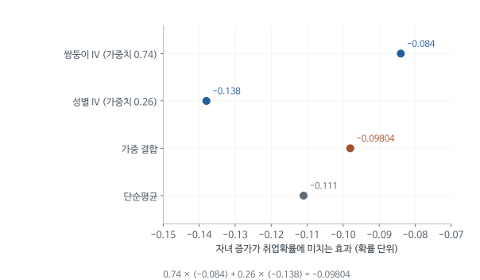

# LATE의 가중평균과 실제 IV의 함정 - MHE 4.5-4.6 심층요약

징병 자격이 복무 여부를 바꾸는 간단한 사례에서는 IV를 순응자(complier)의 평균효과로 설명할 수 있었다. 실제 연구에서는 출생분기 도구가 여러 개이고, 출생연도와 지역도 통제하며, 교육처럼 처치가 0과 1보다 많은 값을 갖는다. 그래도 회귀 프로그램은 계수 하나를 보고한다. MHE 4.5는 그 수치가 어떤 사람의 어떤 변화를 평균한 값인지 밝힌다.

교재의 답은 세 경우 모두 같은 모양이다. 도구가 여럿이면 2SLS는 도구를 하나씩 사용한 IV 추정치들의 가중평균이 되고, 공변량(covariate)을 포함하면 공변량 집단별 LATE의 가중평균이 되며, 처치가 여러 수준이거나 연속이면 인과반응함수를 따라 단위효과나 미분을 가중평균한 값이 된다. 어느 경우든 평균되는 대상은 도구에 반응한 순응자의 효과이고, 가중치는 도구가 처치를 어느 구간에서 얼마나 변화시켰는지에 따라 결정된다.

이어지는 4.6은 2SLS를 실제로 실행할 때 계수나 표준오차(standard error)가 잘못되는 경우, 동료효과를 오해하기 쉬운 이유, 이진 결과변수에서 2SLS와 비선형 모형의 비교, 약한 도구(weak instrument)가 만드는 편향(bias)을 다룬다. 4.5가 2SLS 계수의 해석을 다룬다면 4.6은 그 계수를 올바르게 계산했는지, 계산한 값을 믿을 만큼 자료에 정보가 있는지를 다룬다.

[원문 PDF](<MHE Ch4.5-4.6 Generalizing LATE, IV Details (2009).pdf>) | [개념 퀴즈](<MHE Ch4.5-4.6 Generalizing LATE, IV Details (2009)_QnA.md>) | [수식·모델 퀴즈](<MHE Ch4.5-4.6 Generalizing LATE, IV Details (2009)_수식모델퀴즈.md>) | [실무 Cheat Sheet](<MHE Ch4.5-4.6 Generalizing LATE, IV Details (2009)_실무CheatSheet.md>)

## 1. 실제 자료의 어떤 복잡함을 순서대로 해결하는가

셋째 아이가 어머니의 취업을 바꾸는지 연구한다고 하자. 쌍둥이 출산과 첫 두 아이의 성별 구성을 각각 도구로 사용할 수 있지만, 두 도구가 출산을 늘리는 가족은 서로 다를 수 있다. 두 도구를 함께 사용하면 어떤 가족의 효과에 비중이 더 실리는지 알아야 결과를 해석할 수 있다.

교육 연구에서는 출생연도에 따라 도구 배정확률이 다르고 교육량도 여러 해씩 변한다. 이런 차이가 있어도 2SLS 계수는 계산된다. 아래 표는 계산된 수치를 연구 질문에 맞게 해석하려면 어떤 질문에 차례로 답해야 하는지 정리한 것이다.

| 읽을 부분 | 해결할 질문 |
|---|---|
| 4.5.1 | 도구가 여러 개면 누구의 효과가 합쳐지는가 |
| 4.5.2 | 공변량 집단별 LATE의 가중치는 무엇인가 |
| 4.5.3 | 교육연수처럼 처치가 여러 수준이면 무엇의 평균인가 |
| 4.6.1 | 두 단계 계산에서 무엇을 잘못하기 쉬운가 |
| 4.6.2 | 동료 평균이 왜 가짜 효과를 만들 수 있는가 |
| 4.6.3 | 결과가 이진변수여도 IV를 쓸 수 있는가 |
| 4.6.4 | 약하고 많은 도구는 왜 편향을 만들 수 있는가 |

앞 절의 가장 단순한 LATE에는 도구도 처치도 0과 1 두 값뿐이었고 공변량도 없었다. 실제 교육자료에서는 출생분기가 여러 개이고, 같은 출생분기라도 출생연도와 지역에 따라 제도가 다르며, 교육은 여러 해에 걸쳐 늘어난다. 같은 2SLS 명령을 사용할 수 있다고 해서 그 계수가 자동으로 앞 절과 같은 사람의 효과가 되지는 않는다.

이 장의 일반화 결과를 해석할 때는 식의 형태보다 두 가지를 확인하면 된다. 변수를 하나 늘리거나 처치 정의를 바꿀 때 비교에 들어오는 사람이 누구로 바뀌는지, 그리고 그 사람들의 효과에 어떤 가중치가 붙는지다. 후반의 실행 문제도 같은 관점에서 검토할 수 있다. 1단계에서 무엇을 예측하고 어떤 정보를 버리는지 알아야 컴퓨터가 계산한 계수를 연구 질문의 언어로 옮길 수 있다.

## 2. 개인, 집단, 교육단계를 구별하는 기호

자료 한 행은 한 사람이다(10절의 생선시장에서만 한 행이 하루의 시장이다). 결과 $Y_i$는 개인 $i$의 임금이나 취업 여부이고, 이진 처치 $D_i$는 복무나 셋째 아이 출산 여부처럼 0과 1로 구분되는 행동이다. 도구 $Z_i$는 그 행동에 영향을 주는 외생변수, 공변량 $X_i$는 처치 이전에 정해진 나이와 출생연도 등의 특성이다. 교육연수처럼 여러 값을 갖는 처치는 $S_i$로 표시한다. 교재는 $y_i, d_i, z_i, s_i$처럼 소문자를 사용하지만 뜻은 같다.

4.5는 앞 절 4.4의 LATE 정리를 전제로 하므로 그 내용을 먼저 간략히 정리한다. $D_i(1)$과 $D_i(0)$은 도구값을 각각 1과 0으로 정했을 때 그 사람이 택할 처치이고, $Y_i(1)$과 $Y_i(0)$은 처치를 받았을 때와 받지 않았을 때의 결과이다. 두 잠재처치의 조합으로 사람을 나누면, 도구와 상관없이 늘 처치를 받는 항상 처치자(always-taker)($D_i(1)=D_i(0)=1$), 늘 받지 않는 절대불참자(never-taker)($D_i(1)=D_i(0)=0$), 도구가 켜질 때만 처치를 받는 순응자($D_i(1)=1$, $D_i(0)=0$)가 있다. 도구와 반대 방향으로 반응하는 거부자는 단조성(monotonicity) 가정 $D_i(1)\ge D_i(0)$으로 배제한다.

LATE 정리는 세 가정을 추가로 사용한다. 도구가 잠재결과(potential outcome), 잠재처치와 무관하게 무작위처럼 배정되고(독립성), 처치를 거치지 않고는 결과에 영향을 주지 않으며(배제제약), 처치율을 실제로 바꾼다(1단계). 이때 도구에 따른 결과 차이를 처치율 차이로 나눈 Wald 비율은 순응자의 평균효과 $E[Y_i(1)-Y_i(0)\mid D_i(1)>D_i(0)]$와 같다. 이 값이 LATE이다. 분자인 결과 차이를 축약형(reduced form), 분모인 처치율 차이를 1단계(first stage)라고 부른다. 항상 처치자와 절대불참자는 도구가 바뀌어도 처치가 그대로이므로 분자와 분모 어디에도 기여하지 않는다.

도구가 여러 개면 $Z_i$는 한 사람의 도구값을 나열한 벡터가 되고, $Z_i'\pi$는 도구별 값에 1단계 계수를 곱해 더한 값이다. 17절의 행렬 $Z$는 이런 벡터를 사람마다 한 행씩 쌓은 표본 전체의 자료이다. 곱셈 기호가 복잡해 보여도 계산은 각 사람의 도구값에 계수를 곱해 더하는 데서 출발한다.

$D$와 $S$를 구별하는 이유는 처치의 변화 단위가 다르기 때문이다. $D$가 0에서 1로 바뀌면 복무하지 않던 사람이 복무하는 변화 한 번이다. $S$가 교육연수이면 한 사람이 도구 때문에 여러 해를 더 다닐 수 있고, 그 사람은 7-8절에서 설명할 교육단계별 비교에 여러 번 기여한다. 따라서 도구 때문에 행동이 바뀐 사람 수와 도구가 늘린 교육연수의 합은 다른 양이다.

## 3. 쌍둥이와 자녀 성별 도구를 함께 사용하면 어떤 평균이 되는가

Angrist and Evans(1998)는 자녀가 둘 이상인 기혼 여성을 대상으로 셋째 아이가 어머니의 노동공급을 줄이는지 추정했다. 첫 두 아이가 같은 성별인 가족은 다른 성별의 자녀를 원해 셋째를 낳을 수 있다. 둘째 출산이 쌍둥이였다면 가족의 계획과 무관하게 자녀 수가 늘어난다. 두 도구는 서로 다른 가족의 행동을 바꾸므로, 출산의 취업효과가 가족마다 다르면 도구별 IV도 달라진다.

두 도구를 함께 사용하는 2SLS는 두 비교의 정보를 결합한다. 이 결합이 도구를 하나씩 사용한 IV의 가중평균임을 보이려면 먼저 문제를 정리해야 한다. 두 도구 더미는 서로 겹치지 않는다고 가정한다. 겹친다면 $Z_1(1-Z_2)$, $Z_2(1-Z_1)$, $Z_1Z_2$라는 세 개의 배타적 더미로 다시 나누면 된다. 아래 예에서도 같은 성별 도구는 쌍둥이가 아닌 같은 성별 가족으로 정의되어 있다. 또 각 도구의 1단계가 양수가 되도록 부호를 조정한다. 그러면 두 도구 각각이 LATE를 식별하지만, 순응자 집단은 도구마다 다르다.

이제 1단계 적합값부터 정의한다. 아래 $Z_1$과 $Z_2$는 두 도구이고 $\pi_1$과 $\pi_2$는 두 도구를 함께 포함한 1단계의 계수로, 둘 다 양수라고 가정한다. $\hat D^{pop}$은 두 도구로 예측한 처치값인데, 표본에서 추정한 계수 대신 모집단 계수를 사용한 선형예측이라는 뜻에서 pop을 붙였다. $\rho_{2SLS}$는 이 예측값으로 계산하는 처치효과 계수이다. 상수항은 공분산(covariance)에 영향을 주지 않으므로 생략한다.

$$
\hat D^{pop}=\pi_1Z_1+\pi_2Z_2
$$

라 하자. 2SLS는 1단계 적합값을 도구로 사용한 IV와 같으므로(4.1절의 IV 해석), 내생변수가 하나일 때 2SLS 계수는 다음 비율이다.

$$
\rho_{2SLS}=\frac{\operatorname{Cov}(Y,\hat D^{pop})}
{\operatorname{Cov}(D,\hat D^{pop})}.
$$

이 비율을 도구별 IV로 분해하려면 분자와 분모를 도구별로 나누면 된다. 공분산은 선형이므로 분자는 $\operatorname{Cov}(Y,\hat D^{pop})=\pi_1\operatorname{Cov}(Y,Z_1)+\pi_2\operatorname{Cov}(Y,Z_2)$, 분모는 $\operatorname{Cov}(D,\hat D^{pop})=\pi_1\operatorname{Cov}(D,Z_1)+\pi_2\operatorname{Cov}(D,Z_2)$이다. 분자의 $j$번째 항에 $\operatorname{Cov}(D,Z_j)$를 곱하고 다시 나누면 $\pi_j\operatorname{Cov}(D,Z_j)\times\operatorname{Cov}(Y,Z_j)/\operatorname{Cov}(D,Z_j)$가 된다. 뒤의 비율은 도구 $Z_j$ 하나만 사용한 IV이다. 이를 분모로 나누어 정리하면

$$
\rho_{2SLS}=w_1\rho_1+w_2\rho_2,
$$

$$
\rho_j=\frac{\operatorname{Cov}(Y,Z_j)}{\operatorname{Cov}(D,Z_j)},
\qquad
w_j=\frac{\pi_j\operatorname{Cov}(D,Z_j)}
{\sum_k\pi_k\operatorname{Cov}(D,Z_k)}.
$$

두 가중치의 분모는 같고 분자는 분모를 이루는 두 항이므로 $w_1+w_2=1$이다. 이 부분은 항등식이다. 가중평균이라고 부르려면 두 가중치가 0 이상이어야 하는데, 합이 1이라는 사실만으로는 이것이 보장되지 않는다. 두 항 $\pi_j\operatorname{Cov}(D,Z_j)$가 모두 양수여야 한다. 교재는 위에서 정리한 조건(배타적 더미, 양의 1단계, 양수인 $\pi_1,\pi_2$) 아래 가중치가 0과 1 사이라고 결론짓는데, 이때 도구 하나만 포함한 1단계의 방향인 $\operatorname{Cov}(D,Z_j)$도 양수라는 조건이 함께 쓰인다. 이런 정리 없이 임의로 상관된 여러 도구나 공변량을 제한적으로 포함한 모형으로 이 해석을 자동으로 확장할 수는 없다. 일반적인 가중치 공식은 Imbens and Angrist(1994), Angrist and Imbens(1995)에 있고, 그 공식이 "a little messy"하다는 이유로 여기서는 두 도구 예만 제시된다.

한 가지 덧붙이면, 서로 배타적인 두 더미와 상수항은 도구가 담은 정보를 모두 표현한다. 그래서 이 2SLS는 $Z_1$, $Z_2$ 값으로 나눈 세 집단의 평균을 이용하는 집단자료 추정과 같다. 이 결합은 동분산 상수효과 모형에서 효율적인 선형결합이기도 하다.

쌍둥이와 자녀 성별 예(각주 28)에서는 쌍둥이 IV -.084, 성별 IV -.138을 가중치 .74와 .26으로 결합한다.

$$
.74(-.084)+.26(-.138)=-.09804.
$$

교재가 보고한 2SLS 추정치 -.098과 일치하고, 두 IV의 단순평균 -.111과는 다르다. 쌍둥이 도구의 가중치가 큰 것은 쌍둥이의 1단계가 훨씬 강하기 때문이다. 둘째가 쌍둥이면 셋째 아이를 가질 확률이 약 .6 높아지지만, 첫 두 아이가 같은 성별이면 약 .07 높아진다(p. 175).

그런데 쌍둥이 출산은 드물다. 드문 도구가 어떻게 가중치를 .74나 받는지 가중치 식으로 확인한다. 두 도구의 상관이 작다면 $\operatorname{Cov}(D,Z_j)\approx\pi_j\operatorname{Var}(Z_j)$이므로 가중치는 대략 $\pi_j^2\operatorname{Var}(Z_j)$에 비례한다. 원문에는 쌍둥이 비율이 없으므로 가상으로 쌍둥이 가족을 1%, 같은 성별 가족을 50%라고 가정하자. 이진 도구의 분산은 $p(1-p)$이므로 .0099와 .25이다. 그러면 $.6^2\times.0099=.00356$, $.07^2\times.25=.00123$이고, 합이 1이 되도록 나누면 약 .74와 .26이다(교육용 가상 계산이며, 원문 가중치와 비슷하게 도출된 것은 가정한 비율 덕분이다). 쌍둥이는 해당 가족이 적어 도구의 분산이 작지만, 1단계가 약 8.6배 강해서 그 제곱이 약 73배 차이를 만든다. 1단계 계수가 크다고 늘 가중치가 큰 것은 아니고, 도구가 표본에서 얼마나 흔하게 켜지는지도 함께 작용한다. 5절의 공변량 가중치 $\pi(x)^2e(x)[1-e(x)]$도 같은 구조이다.

이 때문에 도구별 추정치가 서로 다를 때 결합 추정치가 어느 도구의 추정치에 가까운지 알려면 1단계를 함께 검토해야 한다. 두 도구가 서로 얼마나 관련되는지에 따라서도 2SLS가 사용하는 정보의 비중이 달라진다.

쌍둥이와 같은 성별 도구의 차이는 경제적 질문이기도 하다. 계획하지 않은 추가 자녀와 원하는 성별 구성을 얻으려는 추가 출산은 부모의 사전 계획이 다르다. 같은 자녀 수 증가라도 노동공급 반응이 다를 수 있으므로 도구별 추정치 차이(-.084와 -.138)를 표본오차나 도구의 실패만으로 설명할 수 없다. 결합한 -.098은 두 순응자 집단의 효과를 1단계 정보에 따라 섞은 값이다.

<!-- learning-figure:iv-weights -->

*그림 설명: 본문의 교재 예제에 제시된 추정치와 가중치 0.74, 0.26을 사용했다. 오차막대가 없는 위치 비교 그림이다.*

결합값은 가중치가 큰 쌍둥이 IV 쪽에 더 가깝다. 이 그림의 양의 가중치는 해당 예제의 조건에 따른 것이다. 여러 도구를 사용하는 모든 2SLS에서 같은 가중치나 양의 평균 해석이 보장되는 것은 아니다.

<!-- /learning-figure -->

## 4. 같은 출생연도 안에서 비교해야 하는 이유

LATE 정리에는 공변량이 없다. 도구를 자연실험(natural experiment)의 무작위 배정(random assignment)처럼 간주하면 공변량이 필요 없기 때문이다. 무작위로 배정된 도구는 공변량과도 독립일 가능성이 크다. 그러나 무작위 추첨으로 정한 도구도 공변량을 조건으로 해야 타당한 경우가 있다. 징병 추첨에서는 자격을 가르는 기준선이 나이 든 출생연도에서 더 높게 정해져, 나이 든 코호트일수록 징병 자격자가 되기 쉬웠다. 그 결과 자격자와 미자격자의 연령 구성이 다르다. 연령 자체가 임금에 영향을 주므로 전체를 합친 평균 차이에는 복무 외의 이유가 섞인다. 필요한 조건은 같은 출생연도처럼 $X$가 같은 사람들 안에서 도구가 무작위처럼 배정된다는 것이다.

$$
\{Y_1,Y_0,D_1,D_0\}\perp Z\mid X.
\tag{4.5.1}
$$

식 (4.5.1)은 같은 $X$ 안에서 도구가 잠재결과 $Y_1, Y_0$뿐 아니라 잠재처치 $D_1, D_0$과도 독립이라는 뜻이다(배제제약은 함께 유지된다고 가정한다). 이 조건 아래에서 $X=x$인 집단마다 LATE 정리를 그대로 적용할 수 있고, 그 집단에서 식별한 효과를

$$
\lambda(x)=E[Y_1-Y_0\mid D_1>D_0,X=x]
$$

라고 부른다. 이를 공변량별 LATE라고 한다. 이제 남은 질문은 집단별 $\lambda(x)$를 2SLS가 어떻게 결합하는가이다.

공변량을 포함하는 이유는 하나 더 있다. 결과변수의 변동 가운데 공변량이 설명하는 부분을 제거하면 2SLS 추정치가 더 정밀해질 수 있다. 첫째 이유(조건부 독립성)는 편향과 관련되고 둘째 이유는 표준오차와 관련된다. 16절의 Table 4.6.1에서 같은 성별 도구는 공변량과 거의 독립이어서, 공변량을 포함해도 추정치는 거의 그대로이고 주로 정밀도만 달라진다.

조건부 독립(conditional independence)성은 비교 조건을 명시하는 주장이다. 통제변수(control variable) 목록이 길다는 사실로 대신할 수 없고, 어떤 변수를 조건으로 했을 때 도구의 배정과 잠재결과가 무관해지는지 설명해야 한다. 공변량을 포함하는 방식도 가정의 일부이다. 기준 모형은 $E[Y_0\mid X]=X'\alpha^*$이고 효과가 모두에게 $\rho$로 같은 상수효과 모형이다. 다음 단계로 효과가 공변량에 따라 달라지는 $\rho(X)=\rho_0+\rho_1'X$를 허용할 수 있다. 이때는 1단계에 $Z$와 $X$의 상호작용을, 2단계에 $D$와 $X$의 상호작용을 포함하고, 내생변수가 $D$와 $DX$ 여러 개가 되므로 1단계 식도 여러 개가 된다(식 4.5.2a, 4.5.2b). 함수형태를 설정하지 않으려면 $X$ 값별로 표본을 나누어 2SLS를 따로 추정할 수도 있다. 포화된 통제는 가능한 각 집단의 평균을 따로 허용한다. 나이를 선형항 하나로 포함하는 것과 모든 출생집단별 비교를 허용하는 것은 서로 다른 가정이다.

## 5. 집단별 효과를 어떤 비율로 평균하는가

공변량 집단마다 별도의 LATE를 추정할 수 있어도 전체 2SLS가 그것들을 동일한 비중으로 평균하지는 않는다. 각 집단에서 도구가 실제 처치를 얼마나 바꾸는지가 다르기 때문이다. Angrist and Imbens(1995)의 Theorem 4.5.1("saturate and weight")은 그 가중치를 구체적으로 제시한다. 정리는 LATE 정리의 가정(독립성, 배제제약, 1단계, 단조성)이 $X$가 같은 집단마다 성립한다고 가정한다. 여기서는 $X$의 가능한 값이 유한하고 각 집단을 구분하는 지시변수를 모두 포함하는 포화모형을 생각한다.

포화란 집단별 절편(intercept)과 도구의 기울기를 자유롭게 추정하여, 모든 집단에 같은 1단계 기울기를 강제하지 않는다는 뜻이다. 식 (4.5.3)으로 표현하면 1단계는 $X$ 값마다 따로 절편을 두고 도구의 효과도 $X$ 값마다 별도로 허용하며, 2단계는 $X$ 값마다 따로 절편을 두고 처치계수 $\rho_c$ 하나를 추정한다. 각 집단의 도구 배정확률 $e(x)$와 1단계 $\pi(x)$를 다음과 같이 정의한다.

$$
e(x)=P(Z=1\mid X=x),
\qquad \pi(x)=E[D\mid Z=1,x]-E[D\mid Z=0,x].
$$

집단별 절편과 $Z$ 상호작용을 모두 포함한 1단계는 조건부 평균을 정확히 표현한다. 이진 도구에서는 $x$마다 $z=0$일 때와 $z=1$일 때 두 평균만 있으므로 절편과 기울기 두 개로 두 값을 모두 재현할 수 있기 때문이다.

$$
m(x,z)=E[D\mid x,z]=a(x)+\pi(x)z.
$$

$X=x$를 고정하면 $a(x)$와 $\pi(x)$는 상수이고 변하는 것은 $z$뿐이다. 상수는 분산에 기여하지 않고, 이진 도구의 집단 내 분산은 $\operatorname{Var}(Z\mid X=x)=e(x)[1-e(x)]$이므로

$$
\operatorname{Var}(m(X,Z)\mid X=x)
=\pi(x)^2e(x)[1-e(x)].
$$

이 값은 같은 집단 안에서 도구가 만들어 낸 예측 처치의 변동이다. Theorem 4.5.1은 공변량별 LATE에 붙는 가중치가 이 분산에 비례함을 보인다(식 4.5.4는 이를 $\omega(X)=V\{E[D\mid X,Z]\mid X\}/E[V\{E[D\mid X,Z]\mid X\}]$로 표기하고 $\rho_c=E[\omega(X)\lambda(X)]$라 한다). 기대값 $E[\cdot]$이 $X$의 분포에 대한 평균이므로, 집단의 비중 $P(X=x)$까지 포함해 합계로 표현하면

$$
W_x=\frac{P(X=x)\pi(x)^2e(x)[1-e(x)]}
{\sum_rP(X=r)\pi(r)^2e(r)[1-e(r)]},
$$

$$
\rho_c=\sum_xW_x\lambda(x).
$$

처치율을 크게 변화시키고 도구가 한 값에만 집중되지 않는 집단이 더 큰 비중을 받는다. 각주 29의 표현대로, 도구가 적합값에 더 많은 변동을 만드는 공변량 값에 더 큰 가중치가 붙는다. 모집단 비중이나 순응자 비중만으로 평균하지 않는다. 이 정리는 1단계의 포화 상호작용과 2단계의 포화 공변량 통제를 전제로 한다.

### 가상 두 집단 계산

다음은 교육용 가상 수치이다. 두 집단 비중은 각각 .5, 도구 배정확률은 각각 .5라고 하자. 1단계는 .2와 .4, 집단 LATE는 10과 20이다. 정규화 전 가중치는

$$
.5(.2)^2(.5)(.5)=.005,
\qquad .5(.4)^2(.5)(.5)=.020.
$$

따라서 가중치는 .2와 .8이고

$$
\rho_c=.2(10)+.8(20)=18.
$$

비교를 위해 순응자 수로 가중한 평균을 계산한다. 집단별 순응자 비율은 집단 비중과 1단계의 곱 $P(X=x)\pi(x)$이므로 .1과 .2이고, 전체 순응자의 평균효과는 $(.1\times10+.2\times20)/.3=16.67$이다. 포화 2SLS의 18과 다르다. 순응자 수 가중치는 $\pi(x)$에 비례하지만 2SLS 가중치는 $\pi(x)^2$에 비례하므로, 1단계가 강한 집단에 순응자 비중보다 더 큰 비중이 부여된다. 두 집단의 효과가 같다면 두 평균은 일치하고, 효과가 1단계 크기와 함께 달라질 때 차이가 난다. 같은 설정으로 가상 자료 40만 명을 만들어 포화 2SLS를 실제로 추정해도(배정확률을 .5와 .3으로 바꾼 경우) 추정치가 이 식의 값과 소수 첫째 자리까지 일치했다(이 요약의 교육용 모의실험).

집단별 순응자가 많으면 그 집단은 전체 LATE에서 더 많은 사람을 대표한다. 그러나 2SLS 가중치는 사람 수만으로 정해지지 않는다. 집단 안에서 도구값이 얼마나 고르게 나뉘고 처치를 얼마나 변화시키는지가 계수 계산에 함께 반영된다. 연구 질문이 "도구에 반응한 전체 순응자의 평균효과"라면, 2SLS 계수가 그 평균과 같은지 따로 확인해야 한다.

도구값이 한 값에 거의 집중된 집단은 그 집단 안의 비교가 어렵다. 모두 자격자라면 같은 조건의 비자격자 결과를 관찰하기 힘들다. 자격이 달라도 행동이 거의 같다면 결과 변화에서 처치효과를 알아내기 어렵다. 가중치에 도구의 분산 $e(x)[1-e(x)]$와 1단계 $\pi(x)$가 들어가는 것은 이런 비교정보의 차이를 회귀가 반영하기 때문이다.

포화 통제 아래의 가중평균 결과를 일반적인 선형 공변량 조정에 그대로 적용할 수는 없다. 집단별 비교를 충분히 허용했는지, 효과의 이질성에 어떤 제한을 두었는지에 따라 해석이 달라진다. 6절에서 보듯 제한된 모형에서는 다른 논증(Abadie의 근사 해석)을 사용한다.

### 1단계가 두 배 강한 집단에는 왜 네 배의 비중이 부여되는가

Theorem 4.5.1은 포화 1단계가 조건부 기대함수 $E[D\mid X,Z]$와 일치한다는 사실에서 도출된다는 설명만 있고 유도는 생략되어 있다. 아래는 그 유도를 회귀의 분자와 분모로 전개한 교육용 보충이다. 표기를 짧게 하려고 집단별 배정확률을 $e_x=e(x)$, 처치율 차이를 $\pi_x=\pi(x)$, 공변량별 LATE를 $\tau_x=\lambda(x)$, 집단 비중을 $p_x=P(X=x)$로 쓴다. 대상은 집단별 절편과 도구의 집단별 상호작용을 모두 포함해 1단계가 포화된 경우이다.

출발점은 2단계에 집단 더미를 모두 포함했다는 사실이다. Frisch-Waugh-Lovell 정리에 따라, 집단 더미를 통제한 회귀계수는 모든 변수에서 집단 평균을 차감한 뒤 계산한 계수와 같다. 그래서 2SLS 계수는 집단 평균을 차감한 예측 처치 $\widetilde{\widehat D}$를 도구로 사용한 비율 $E[\widetilde{\widehat D}Y]/E[\widetilde{\widehat D}D]$이다. 포화 1단계에서 예측 처치는 $a(x)+\pi_xZ$이고 집단 평균은 $a(x)+\pi_xe_x$이므로, 평균을 차감한 예측 처치는 $\widetilde{\widehat D}=\pi_x(Z-e_x)$이다.

분모부터 계산한다. 실제 처치를 $D=\widehat D+(D-\widehat D)$로 분해하면, 포화 1단계의 잔차(residual) $D-\widehat D$는 집단 더미와 집단별 도구 모두와 직교하므로 $\widetilde{\widehat D}$와도 직교한다. 따라서 분모는 $E[(\widetilde{\widehat D})^2]$이다. 도구의 집단 내 분산은 $e_x(1-e_x)$이므로 집단 안의 값은

$$
E[(\widetilde{\widehat D})^2\mid X=x]=\pi_x^2e_x(1-e_x).
$$

분자는 $E[\pi_x(Z-e_x)Y\mid X=x]=\pi_x\operatorname{Cov}(Z,Y\mid X=x)$이다. 이진 도구와 결과의 공분산은 도구의 분산에 두 도구값의 결과 평균 차이를 곱한 값, 곧 $e_x(1-e_x)\{E[Y\mid Z=1,x]-E[Y\mid Z=0,x]\}$이다. 괄호 안의 축약형은 집단 안의 LATE 정리에 따라 1단계 곱하기 LATE, 곧 $\pi_x\tau_x$이다. 이를 대입하면 회귀 분자는 다음과 같다. $\widetilde{\widehat D}$의 집단 평균이 0이므로 $Y$ 대신 집단 평균을 차감한 $\widetilde Y$를 사용해도 값이 같다.

$$
E[\widetilde{\widehat D}\widetilde Y\mid X=x]
=\pi_x\operatorname{Cov}(Z,Y\mid X=x)
=\pi_x^2e_x(1-e_x)\tau_x.
$$

전체 분자와 분모는 집단별 값을 집단 비중 $p_x$로 가중해 더한 것이다. 분자를 분모로 나누면 전체 비율은

$$
\beta_{2SLS}=\sum_x w_x\tau_x,\qquad
w_x=\frac{p_x\pi_x^2e_x(1-e_x)}{\sum_s p_s\pi_s^2e_s(1-e_s)}.
$$

이 식은 위의 $W_x$와 같은 가중치이다. 집단 크기와 배정확률이 같은데 1단계가 .2와 .4라면 비중은 $.04:.16=1:4$다. 순응자 수는 두 배 차이인데 가중치는 네 배 차이가 난다. $\pi_x$가 분자에서 한 번(예측 처치에 곱해짐), 축약형에서 또 한 번(축약형이 $\pi_x\tau_x$) 들어가기 때문이다. 1단계가 큰 집단에서 도구가 만든 예측 처치의 변동이 더 크고, 회귀는 그 변동을 더 많이 사용한다. 도구를 대부분에게 같은 값으로 주어 $e_x$가 0이나 1에 가까우면 $e_x(1-e_x)$가 0에 가까워져 비교 정보가 줄어드는 것도 식에서 확인된다.

이 유도는 집단별 관계를 정확히 표현하는 포화 1단계와 집단별 식별가정을 사용했다. 통제변수를 임의의 선형식으로 포함한 2SLS에는 이 유도가 그대로 성립하지 않으며, 도구와 상호작용을 포함하는 방식이 바뀌면 가중치 설명도 다시 확인해야 한다.

## 6. 순응자의 특성과 결과를 분석하고 싶은데 누가 순응자인지 모른다

5절의 정리는 공변량 값마다 1단계 계수를 별도로 허용하는 포화모형에서 성립했다. 교재는 실제로는 이런 모형을 사용하기 꺼릴 이유가 두 가지 있다고 말한다. 공변량 칸이 많으면 도구 수가 그만큼 늘어 17-18절의 약한 도구 편향 위험이 커지고, 칸마다 부정확한 1단계 추정치가 다수 누적된다. 그래서 연구자는 보통 도구의 1단계 효과가 모든 $X$에서 같다고 제한한 모형을 사용한다. 그 제한된 2SLS도 어떤 공변량 평균 LATE를 근사하리라고 기대할 만한데, 이 기대는 타당하지만 논증이 "놀라울 만큼 간접적"이라고 한다. 그 논증이 Abadie(2003)의 κ 가중이다.

Abadie는 관심 대상을 순응자의 조건부 기대함수 $E[Y\mid D,X,D_1>D_0]$로 정한다. 순응자는 $D=Z$이므로, $X$가 같은 순응자 안에서 처치 여부에 따른 평균 차이는 도구에 따른 차이와 같고, 조건부 독립성 때문에 그 차이는 $\lambda(X)$이다. 따라서 순응자만 모아 $Y$를 $D$와 $X$에 회귀하면 $D$의 계수에 인과적 해석이 부여된다. 조건부 기대함수가 선형이 아니어도 이 회귀는 그 함수에 대한 최소평균제곱오차(MMSE) 선형근사를 제공한다. 문제는 관측된 사람마다 순응자 여부를 표시할 수 없어 순응자만 선별할 수 없다는 것이다. 순응자 안에서 나이나 교육에 따라 결과가 어떻게 다른지, 순응자의 평균 연령은 얼마인지 알고 싶을 때도 같은 문제가 생긴다.

Abadie의 κ 가중은 관측되는 도구와 처치 조합을 이용해 항상 처치자와 절대불참자의 기여가 평균에서 상쇄되도록 만든다. 여기서 가중은 개인의 자료가 평균 계산에 기여하는 크기이고, $e(X_i)=P(Z_i=1\mid X_i)$는 5절의 도구 배정확률이다. κ는 다음과 같이 정의된다.

$$
\kappa_i=1-\frac{D_i(1-Z_i)}{1-e(X_i)}
-\frac{(1-D_i)Z_i}{e(X_i)}.
$$

분모에 $e(X)$와 $1-e(X)$가 있으므로 $0<e(X)<1$인 겹침이 필요하다. 단조성 아래에서 $Z=0$인데 $D=1$인 사람은 $D_0=1$이므로 항상 처치자이고, $Z=1$인데 $D=0$인 사람은 $D_1=0$이므로 절대불참자이다. 둘째 항과 셋째 항은 이렇게 유형이 드러난 관측을 가리킨다.

가상으로 $e=.5$일 때 네 관측 조합의 값은 다음과 같다.

| Z | D | κ |
|---:|---:|---:|
| 0 | 0 | 1 |
| 0 | 1 | -1 |
| 1 | 0 | -1 |
| 1 | 1 | 1 |

$\kappa=1$인 관측을 순응자로 분류한다는 뜻은 아니다. $Z=0, D=0$인 사람에는 순응자와 절대불참자가 섞여 있고, $Z=1, D=1$인 사람에는 순응자와 항상 처치자가 섞여 있다. 항상 처치자는 $Z=0$일 때 $-1$, $Z=1$일 때 $1$을 받으므로, $e=.5$로 배정되면 평균이 0이 된다. 절대불참자도 같은 원리로 상쇄되고 순응자는 도구값과 상관없이 늘 $\kappa=1$이다.

$e$가 .5가 아닐 때도 상쇄가 일어나는지 일반적으로 확인한다(교재가 "direct calculation"이라며 생략한 계산). $X$가 같은 사람들 안에서 도구는 유형과 독립이고 $E[Z\mid X]=e$이다. 항상 처치자는 늘 $D=1$이므로 $\kappa=1-(1-Z)/(1-e)$이고, 평균은 $1-(1-e)/(1-e)=0$이다. 절대불참자는 늘 $D=0$이므로 $\kappa=1-Z/e$이고, 평균은 $1-e/e=0$이다. 순응자는 $D=Z$이므로 $D(1-Z)=0$, $(1-D)Z=0$이 되어 $\kappa=1$이다. 예를 들어 $e=.3$이면 $Z=0, D=1$인 관측은 $1-1/.7\approx-.43$, $Z=1, D=0$인 관측은 $1-1/.3\approx-2.33$을 받는다. 값은 비대칭이지만 배정확률로 평균하면 항상 처치자와 절대불참자 모두 0이 된다.

여기에 결과를 곱해도 상쇄는 유지된다. 항상 처치자의 결과는 늘 $Y(1)$이고, 조건부 독립성 때문에 그 값은 $Z$와 무관하다. 그러면 항상 처치자 안에서 $\kappa g(Y,D,X)$의 평균은 $\kappa$의 평균(0)과 $g$의 평균의 곱이 되어 0이다. 절대불참자도 같다. 결국 전체 평균 $E[\kappa g]$에는 순응자의 몫만 남아 $P(C)E[g\mid C]$가 되고, $g=1$을 대입하면 $E[\kappa]=P(C)$이다. $C$는 순응자 집단을 뜻한다. 두 식을 나누면 다음 정리가 된다.

Theorem 4.5.2는 기대값이 유한한 임의의 함수 $g$에 대해

$$
E[g(Y,D,X)\mid C]=\frac{E[\kappa g(Y,D,X)]}{E[\kappa]}
$$

를 제시한다. 예를 들어 $g$를 나이로 설정하면 순응자의 평균 나이를 구할 수 있다. 교육용 가상 모의실험(simulation)(배정확률 .4, 순응자 30%, 순응자 평균 나이 30세, 항상 처치자 40세, 절대불참자 25세)에서 κ 가중 평균 나이는 30.05세, 실제 순응자 평균은 30.00세였고, $\kappa$의 표본평균 .300은 순응자 비율 .301과 일치했다.

이 정리를 회귀에 적용하면 순응자 조건부 기대함수의 선형근사를 순응자를 선별하지 않고도 구할 수 있다. 순응자만으로 한 회귀의 제곱오차 평균을 $g$로 설정하면 κ 가중 최소제곱(least squares) 문제(식 4.5.5)가 된다. 즉 $E\{\kappa(Y-aD-X'b)^2\}$을 최소화하는 $a, b$가 순응자 조건부 기대함수의 MMSE 선형근사이다. Abadie는 1단계에서 $P(Z=1\mid X)$를 모수적 또는 준모수적 모형으로 추정해 $\kappa$를 만들고, 2단계에서 이 식의 표본 대응을 최소화하는 추정법과 그 분포이론을 제시했다. 각주 30에 따르면 근사함수는 선형이 아니어도 된다. 결과가 0 이상이면 지수함수를, 0과 1이면 probit을 사용할 수 있다. 같은 κ 가중으로 순응자의 공변량 분포를 기술할 수도 있다.

2SLS와의 관계는 다음과 같다. 공변량이 상수뿐이면 Abadie 추정은 Wald 추정량이 된다. 더 놀라운 결과로, $\kappa$를 만들 때 $P(Z=1\mid X)$를 선형모형 $X'\pi$로 추정하면 κ 가중 최소제곱의 해가 정확히 2SLS이다. 그래서 $P(Z=1\mid X)$가 선형모형으로 잘 근사되는 한, 2SLS를 순응자 인과반응함수 $E[Y\mid D,X,D_1>D_0]$의 근사로 볼 수 있다. 일반적으로는 Abadie 추정치와 2SLS 계수가 다르지만, 교재는 대부분의 응용에서 비슷하리라고 본다. Angrist(2001)의 재분석이 그 예이다. 쌍둥이 도구로 셋째 아이가 여성 노동공급에 주는 효과를 추정하면 2SLS는 -.088, Abadie는 -.089이고, 근로시간 효과는 둘 다 -3.55로 같다. 이를 Abadie 방법의 약점으로 보지 않고, 2SLS가 관심 인과관계를 근사한다는 근거로 해석한다.

실무 계산에서는 음의 $\kappa$가 걸림돌이다. 보통의 회귀 소프트웨어는 가중치가 양수라고 가정하기 때문이다. 각주 31은 식 (4.5.5)에서 기대값을 반복해 $\kappa$ 대신 $E[\kappa\mid X,D,Y]$를 사용하면 가중치가 늘 양수가 된다고 설명한다. 이 조건부 평균은 $\kappa$ 식의 $Z$를 $E[Z\mid X,D,Y]$로 바꾼 값이다. 표준오차는 Abadie(2003)의 공식이나 부트스트랩으로 구한다. Table 4.6.1의 Abadie 표준오차도 부트스트랩이다.

$\kappa$ 가중은 개별 관측을 순응자로 판정하는 분류 방법이 아니다. 각 관측이 어떤 배정과 행동 조합에 속하는지를 이용해, 전체 평균에서 항상 처치자와 절대불참자의 기여를 평균적으로 상쇄하는 계산 방법이다. 어떤 관측의 가중치가 음수인 것은 다른 유형의 평균 기여를 차감하기 위한 계산 계수이기 때문이다. 이 가중치를 사용하려면 배정확률, 조건부 독립성, 단조성을 먼저 설정해야 한다.

## 7. 교육은 참여 여부만으로 표현할 수 없다

직업훈련 참여 여부라면 처치는 0과 1 두 경우이지만 교육은 10년, 11년, 12년처럼 여러 수준이다. 의무교육 제도 때문에 한 사람이 1년 더 다니고 다른 사람은 2년 더 다녔다면, 두 사람의 총 임금 변화도 같은 단위가 아니다.

교육 $s$년을 받았을 때 개인 $i$가 얻을 잠재 임금은 $Y_i(s)=f_i(s)$로 표기한다. 함수 $f_i$에는 개인 첨자가 붙지만 $s$에는 붙지 않는다. $f_i(s)$는 실제로 받은 교육 $S_i$에서의 값만이 아니라 "교육을 $s$년 받았다면"이라는 모든 가정에 답하는 함수라는 뜻이다. 한 사람에게도 어느 교육연도를 추가하는지에 따라 효과가 다를 수 있다. 가능한 교육연수가 0부터 $\bar s$까지라면

$$
Y_i(1)-Y_i(0),\quad Y_i(2)-Y_i(1),\ldots,
Y_i(\bar s)-Y_i(\bar s-1)
$$

라는 $\bar s$개의 증가분이 있다. 이를 단위 인과효과(unit causal effect)라고 부른다. 교육 10년에서 11년의 효과와 15년에서 16년의 효과가 같을 필요가 없다. 선형 인과모형은 이 효과들이 모든 $s$와 모든 사람에게 같다고 가정하는데, 교재도 이 가정이 비현실적이라고 인정한다. 그래도 2SLS는 단위 인과효과의 가중평균을 계산하고, 그 가중치를 자료로 추정할 수 있다. 가중치를 검토하면 도구가 어떤 교육 구간을 통과시켰는지 알 수 있고, 그래야 IV 계수의 의미를 알 수 있다.

설정은 이진 도구 하나이다. 예로 드는 도구는 의무출석법이 엄격한 주에서 태어났는지를 나타내는 더미(Acemoglu and Angrist, 2000)이다. $S_i(1)$과 $S_i(0)$는 도구가 1일 때와 0일 때 그 사람이 받을 교육연수이다. $S_i(1)\ge S_i(0)$라는 단조성을 가정하자. 도구가 누구의 교육도 줄이지 않는다는 뜻이다. 그러면 개인별 총 결과 차이는 도구가 통과시킨 단계의 증가분만 더한 망원합으로 표현할 수 있다.

$$
Y_i(S_i(1))-Y_i(S_i(0))
=\sum_{s=1}^{\bar s}[Y_i(s)-Y_i(s-1)]
1\{S_i(1)\ge s>S_i(0)\}.
$$

지시함수 $1\{S_i(1)\ge s>S_i(0)\}$는 도구 때문에 교육이 $s$년 미만에서 $s$년 이상으로 넘어간 경우에만 1이다. 예를 들어 $S_i(0)=10$, $S_i(1)=12$이면 $s=11$과 $s=12$ 두 항만 남는다. $[Y(11)-Y(10)]+[Y(12)-Y(11)]=Y(12)-Y(10)$으로 중간값이 소거된다.

교육 12년에서 13년으로 늘어나는 변화와 9년에서 10년으로 늘어나는 변화의 소득효과는 같지 않을 수 있다. 전자는 고등교육 진입을, 후자는 중등교육의 추가 이수를 나타낼 수 있기 때문이다. 교육을 받았는지 여부 하나로 표시하면 이 서로 다른 변화가 구분되지 않는다. 다중값 처치의 논의는 교육연수 회귀계수가 어떤 추가 연도의 효과를 평균하는지 보여 준다.

망원합은 새 자료를 만드는 장치가 아니다. 총 교육연수의 변화 안에 들어 있던 여러 경계 통과를 단계별로 분리해 표시한 것이다. 이렇게 표현하면 다음 절에서 Wald 비율의 분자와 분모를 같은 단계 단위로 셀 수 있다.

## 8. 교육 1년당 효과를 계산할 때 무엇을 분모로 세는가

교육을 늘린 사람 수로 나누면 교육을 바꾼 사람 한 명당 총효과가 도출된다. 교육 1년당 효과가 목표라면 추가된 교육연수를 세어야 한다. 2년 더 다닌 사람은 분모에 두 번 기여하고, 그의 결과 변화도 두 교육단계의 효과로 나뉜다. 이 해석을 평균인과반응(ACR, average causal response)이라고 부른다.

교육연수 증가는 각 경계를 넘었는지 표시하는 지시함수의 합

$$
S_i(1)-S_i(0)=\sum_{s=1}^{\bar s}1\{S_i(1)\ge s>S_i(0)\}
$$

로 표현할 수 있다. 두 해를 더 받은 사람은 두 단계에 기여한다. 이제 Wald 비율의 분자와 분모를 차례로 계산한다(교재는 정리만 제시하므로 아래 중간 단계는 교육용 보충이다). Theorem 4.5.3은 세 가정을 전제한다. 모든 잠재결과 $Y_i(0),\ldots,Y_i(\bar s)$와 잠재교육 $S_i(0), S_i(1)$이 도구와 독립이고(독립성과 배제제약을 이 한 가정으로 묶었다), 1단계가 0이 아니며, 단조성이 성립한다.

분자는 도구값에 따른 결과 평균 차이 $E[Y\mid Z=1]-E[Y\mid Z=0]$이다. $Z=1$인 사람의 결과는 $Y_i(S_i(1))$이고, 독립성 때문에 그 평균은 전체 인구의 $E[Y_i(S_i(1))]$와 같다. $Z=0$도 마찬가지이므로 분자는 $E[Y_i(S_i(1))-Y_i(S_i(0))]$이다. 여기에 7절의 망원합을 대입하고 기대값을 합 안으로 옮기면, 각 항은 "경계 $s$를 넘은 사람의 평균 증가분 $\times$ 경계 $s$를 넘은 사람의 비율"이 된다. 곧 분자는 $\sum_sE[Y_i(s)-Y_i(s-1)\mid S_i(1)\ge s>S_i(0)]P(S_i(1)\ge s>S_i(0))$이다. 분모 $E[S\mid Z=1]-E[S\mid Z=0]$도 같은 방식으로 $E[S_i(1)-S_i(0)]=\sum_sP(S_i(1)\ge s>S_i(0))$이다. 분자를 분모로 나누면 Theorem 4.5.3을 얻는다.

$$
Wald=\sum_s\omega_sE[Y_i(s)-Y_i(s-1)\mid S_i(1)\ge s>S_i(0)],
$$

$$
\omega_s=\frac{P(S_i(1)\ge s>S_i(0))}
{\sum_jP(S_i(1)\ge j>S_i(0))}.
$$

각 가중치는 단조성 때문에 0 이상이고, 분모가 분자들의 합이므로 합은 1이다. 가중평균되는 $E[Y_i(s)-Y_i(s-1)\mid S_i(1)\ge s>S_i(0)]$는 "경계 $s$의 순응자", 즉 도구 때문에 교육이 $s$년 미만에서 $s$년 이상으로 옮겨 간 사람들의 평균 증가분이다. 이를 단위 인과반응이라고 부른다. 예를 들어 Angrist and Krueger(1991)의 출생분기 도구는 어떤 사람은 11학년에서 12학년 이상으로, 다른 사람은 10학년에서 11학년 이상으로 이동시키고, Wald 추정량은 이 효과들을 하나의 ACR로 결합한다. 따라서 이 값은 도구가 실제로 이동시킨 교육 경계의 효과를 평균한 것이다. 전체 국민의 모든 교육연도 효과의 평균으로 해석할 수 없다.

### 가상 수치 예제

다음은 교육용 가상 수치이다. 도구가 켜지면 인구 20%는 10년에서 12년으로, 30%는 11년에서 12년으로 이동하고 나머지는 그대로라고 하자. 11년 경계를 통과하는 사람은 10년에서 출발한 20%뿐이므로 비율은 .2이다. 12년 경계는 두 집단이 모두 통과하므로 .2+.3=.5다. 평균 추가교육은 사람 단위로 세면 $.2\times2+.3\times1=.7$년이고, 경계 단위로 세어도 $.2+.5=.7$년으로 같다. 11년 경계와 12년 경계 순응자들의 평균 로그 임금 증가가 각각 .05와 .10이면

$$
RF=.2(.05)+.5(.10)=.06,
$$

$$
Wald=.06/.7=.085714\ldots.
$$

이는 약 .086 로그포인트(log points)의 교육 1년당 평균 반응이다. 가중치로 표현하면 $\omega_{11}=.2/.7\approx.29$, $\omega_{12}=.5/.7\approx.71$이고 $.29\times.05+.71\times.10\approx.086$이다. 교육이 바뀐 사람 비율 .5를 분모로 사용하면 $.06/.5=.12$로 "교육이 바뀐 사람 한 명당 총변화"가 되어 단위가 달라진다.

분모가 도구 때문에 추가된 평균 교육연수라는 점을 기억하면 가중치의 의미를 이해할 수 있다. 한 사람이 교육을 한 해 더 받고 다른 사람이 세 해 더 받으면, 두 사람을 각각 한 명으로 동일하게 세지 않는다. 총 추가 교육에 후자가 세 단계를 기여한다. 그 단계별 효과들이 교육량 증가에 비례해 합쳐져 1년당 평균이 된다.

평균인과반응은 모든 사람에게 교육 1년을 무작위로 더 부여했을 때의 평균과 다르다. 도구가 실제로 통과시킨 교육단계와 그 단계에서 행동이 바뀐 사람을 대상으로 한다. 의무교육 규정으로 중퇴를 늦춘 효과를 대학원 진학 1년의 효과에 적용하려면 추가 근거가 필요한 이유다. 단위는 둘 다 1년이어도 비교한 교육의 내용과 대상자는 다르다.

## 9. 도구가 중퇴와 대학 진학 중 무엇을 바꾸었는지 확인한다

8절의 가중치 $\omega_s$는 개인의 잠재교육 두 개를 알아야 계산할 수 있는 것처럼 보인다. 그러나 한 사람에게서는 $S_i(1)$과 $S_i(0)$ 중 하나만 관측된다. 이 가중치는 관측 자료로 추정할 수 있고, 그 결과는 정책 해석에도 활용된다. 교육효과를 정책에 적용하려면 도구가 어느 교육단계를 늘렸는지 알아야 한다. 예를 들어 평균 교육연수가 0.2년 늘었다는 사실만으로는 중학교 중퇴가 줄었는지 대학 졸업이 늘었는지 알 수 없다. 누적분포함수(CDF)는 특정 교육연수보다 낮은 교육을 받은 사람의 비율을 보여 준다.

단조성이 성립하면 도구별 누적분포의 차이로 특정 교육 경계를 새로 넘어간 비율을 구할 수 있다.

$$
P(S_1\ge s>S_0)=P(S_1\ge s)-P(S_0\ge s).
$$

첫 등호는 집합의 포함관계에서 도출된다. 단조성 때문에 $S_0$가 이미 $s$ 이상인 사람은 $S_1$도 $s$ 이상이다. 그래서 "$S_1\ge s$"인 사람들은 "$S_0\ge s$"인 사람들과 "$S_1\ge s>S_0$"인 사람들로 겹치지 않게 나뉘고, 확률을 빼면 후자만 남는다. 이를 누적분포로 바꾸면

$$
P(S_0<s)-P(S_1<s)
=P(S<s\mid Z=0)-P(S<s\mid Z=1).
$$

마지막 등호에서 도구의 독립성을 사용한다. $Z=0$인 사람들의 실제 교육은 $S_0$이고, 독립성 때문에 그 분포는 전체 인구의 $S_0$ 분포와 같다. 따라서 도구별 교육연수 CDF 차이를 비교하면 어느 경계에서 변화가 컸는지 알 수 있다.

분모도 같은 차이로 계산된다. 0 이상의 정수 변수의 평균은 $E[S]=\sum_{j\ge1}P(S\ge j)$, 곧 1에서 CDF를 뺀 값의 합이다. 그래서 1단계 $E[S\mid Z=1]-E[S\mid Z=0]$은 모든 경계에서 CDF 차이를 더한 $\sum_jP(S_1\ge j>S_0)$와 같다. 8절의 가상 예에서는 11년 경계의 .2와 12년 경계의 .5를 더한 .7이 1단계였다. ACR 가중함수는 도구를 켰을 때와 껐을 때의 처치 CDF를 비교해 일관되게 추정할 수 있고, 1단계로 정규화된다.

Figure 4.5.1(Acemoglu and Angrist, 2000)은 이 가중함수를 실제 자료로 그린 것이다. 1960, 1970, 1980년 센서스의 40-49세 백인 남성 표본에서, 14세 때 적용된 아동노동법(위 패널, 취업 전에 요구된 교육연수)과 의무출석법(아래 패널, 학교를 떠나기 전에 요구된 교육연수)의 엄격도를 도구로 사용한다. 가장 느슨한 법을 적용받은 남성이 기준집단이고(위 패널 6년 이하, 아래 패널 8년 이하), 각 엄격도 더미를 기준집단과 비교하면 Wald 추정량 하나가 된다. 세로축은 가로축 학년 이상을 마칠 확률의 차이, 곧 (1-CDF)의 차이이고 위 식의 $P(S_1\ge s>S_0)$에 해당한다.

위 패널에서 더 엄격한 아동노동법을 적용받은 남성은 8-12학년을 마칠 확률이 1-6%포인트 높았다. 차이의 크기는 요구 연수가 7년, 8년, 9년 이상인지에 따라 다르지만, 모든 경우 낮은 학년에서는 차이가 줄고 12학년을 넘으면 급격히 사라진다. 아래 패널의 의무출석법도 비슷한 형태인데 효과가 다소 작고 약간 더 높은 학년에서 나타난다. 의무출석법이 보통 아동노동법보다 높은 학년에서 구속력을 갖는 것과 부합하는 결과이다. 두 도구의 2SLS 추정치는 모두 약 .08-.10으로 비슷하다. 이 도구들은 6-12학년 범위의 교육 증가 효과를 포착하고 대학 이상 교육의 효과는 거의 알려 주지 않는다. 그래서 이 도구로 추정한 수익률을 대학원 추가 1년 효과로 그대로 외삽할 수 없다. Card(1995)가 사용한 거리 도구처럼 다른 도구는 교육분포의 다른 구간에 작용하므로 다른 종류의 수익률을 포착한다.

CDF 차이가 모든 학년에서 같은 부호라는 관측은 개인별 단조성과 부합한다는 증거일 뿐 단조성을 증명하지는 않는다. 한 사람의 두 잠재교육을 함께 관측할 수 없기 때문이다(이 요약의 보충 설명).

도구별 교육분포를 검토하면 평균 교육연수 차이만 비교할 때 놓치는 정보를 얻는다. 평균이 비슷하게 늘어도 한 도구는 중퇴를 줄이고 다른 도구는 대학 진학을 늘릴 수 있다. 효과가 교육단계별로 다르면 두 도구의 IV는 달라질 수 있고, 분포 그림은 그 차이가 어느 교육 경계에서 비롯되는지 보여 준다. 1단계 F통계는 도구가 교육과 얼마나 강하게 관련되는지를 요약할 뿐 어떤 단계의 교육이 변했는지는 알려 주지 않는다. 의무교육 연장 정책과 대학 장학금 정책이 같은 평균 교육 증가를 만들더라도 같은 수익률을 기대할 근거는 약하다.

4.5를 마치기 전에 이 결과들이 서로 결합된다는 정리가 나온다. 여러 도구와 다중값 처치를 함께 사용하면 2SLS는 도구별 ACR의 가중평균이 되고, 포화 가중 정리(Theorem 4.5.1)도 다중값 처치에 적용된다. 다만 Abadie의 κ를 다중값 처치로 확장한 결과는 집필 당시에는 아직 없었다.

## 10. 가격처럼 연속적으로 바뀌는 처치의 효과

교육은 1년 단위로 더할 수 있지만 가격은 연속적으로 변한다. 마지막 일반화는 처치가 연속변수이고 인과반응함수를 미분할 수 있는 경우이다. 예는 Angrist, Graddy, and Imbens(2000)의 뉴욕 풀턴 수산물 도매시장 연구이다. 자료는 어묵 등에 쓰이는 값싼 생선 whiting의 일별 도매 구매량과 가격이다. 수요와 공급이 함께 결정한 가격과 판매량을 단순 회귀하면 수요곡선의 기울기만 분리하기 어렵다. 도구는 롱아일랜드 앞바다의 바람과 파도가 높은 날을 나타내는 더미 $\text{stormy}_i$이다. 풍랑이 거세면 어획이 어려워 가격이 오르고 수요량이 줄어든다. 풍랑이 생선 수요를 직접 바꾸지 않고 공급에만 영향을 준다면(배제제약), 가격 변화에 대한 수요 반응을 추정할 수 있다.

여기서는 한 행이 한 시장일(날짜) $i$이다. 가상의 가격 $p$에서 그날의 수요량을 $q_i(p)$로 표기하면, 이는 교육의 $f_i(s)$와 같은 잠재결과 함수이다. 기울기 $q_i'(p)$가 관심 대상이고, 수량과 가격을 로그로 측정하면 이 기울기는 수요의 가격탄력성이다. $p_{1i}$와 $p_{0i}$는 그날 풍랑이 있을 때와 없을 때의 잠재가격이고, 교육의 단조성에 해당하는 조건은 풍랑이 어느 날의 가격도 내리지 않는다는 $p_{1i}\ge p_{0i}$이다(교재가 따로 적지는 않지만 아래 가중함수가 이를 전제한다). 미적분 기본정리를 적용하면 도구가 만든 가격 구간에서의 수요 변화를 다음처럼 표현할 수 있다.

$$
q_i(p_{1i})-q_i(p_{0i})=\int_{p_{0i}}^{p_{1i}}q_i'(t)dt.
$$

도구가 이동시킨 가격 구간에서 기울기를 적분한 것이 수요 변화다. 이 식은 교육의 망원합을 연속 버전으로 바꾼 것이다. 교육에서는 경계 $s$마다 증가분을 더했고, 여기서는 가격 $t$마다 기울기 $q_i'(t)$를 적분한다.

Wald 비율로 가는 단계도 8절과 같다(중간 단계는 교육용 보충). 독립성 때문에 분자는 $E[q_i\mid\text{stormy}_i=1]-E[q_i\mid\text{stormy}_i=0]=E[\int_{p_{0i}}^{p_{1i}}q_i'(t)dt]$이다(식 4.5.7). 적분 구간을 지시함수로 표현하면 $\int_{p_{0i}}^{p_{1i}}q_i'(t)dt=\int q_i'(t)1\{p_{1i}\ge t>p_{0i}\}dt$이고, 기대값과 적분의 순서를 바꾸면 분자는 $\int E[q_i'(t)\mid p_{1i}\ge t>p_{0i}]P[p_{1i}\ge t>p_{0i}]dt$가 된다. 분모인 가격 차이도 같은 방식으로 $E[p_{1i}-p_{0i}]=\int P[p_{1i}\ge t>p_{0i}]dt$이다. 따라서

$$
\frac{E[q_i\mid \text{stormy}_i=1]-E[q_i\mid \text{stormy}_i=0]}{E[p_i\mid \text{stormy}_i=1]-E[p_i\mid \text{stormy}_i=0]}
=\frac{\int E[q_i'(t)\mid p_{1i}\ge t>p_{0i}]\,P[p_{1i}\ge t>p_{0i}]\,dt}{\int P[p_{1i}\ge t>p_{0i}]\,dt}.
\tag{4.5.6}
$$

이 값은 가중평균 미분이다. 가격 $t$에서의 가중함수 $P[p_{1i}\ge t>p_{0i}]$는 풍랑이 가격을 $t$ 미만에서 $t$ 이상으로 상승시킨 날의 비율이고, 9절과 같은 논리로 $P[p_i<t\mid\text{stormy}_i=0]-P[p_i<t\mid\text{stormy}_i=1]$, 곧 풍랑 여부에 따른 가격 CDF의 차이로 추정된다. ACR 정리와 같은 평균인데, 평균되는 대상이 1단위 차이에서 미분으로 바뀌었다.

식 (4.5.7)의 두 특수한 경우를 보면 이 평균이 두 종류의 평균을 포함함을 알 수 있다. 첫째, 수요함수가 날마다 다른 직선 $q_i(p)=\alpha_{0i}+\alpha_{1i}p$라면 Wald 비율은 $E[\alpha_{1i}(p_{1i}-p_{0i})]/E[p_{1i}-p_{0i}]$이다(식 4.5.8). 날마다 다른 기울기 $\alpha_{1i}$를 그날 풍랑이 가격을 상승시킨 폭으로 가중한 평균이다. 둘째, 수요함수의 형태는 매일 같고 수준만 다르다면($q_i(p)=Q(p)+\eta_i$, 식 4.5.9) Wald 비율은 $\int Q'(t)\omega(t)dt$이고, 가중치 $\omega(t)$는 가격 CDF 차이를 적분이 1이 되도록 나눈 값이다. 하나의 수요곡선을 따라 가격대별 기울기를 평균한 것이다.

정리하면 IV 추정치에는 시장(날짜) 사이의 평균과 한 시장의 가격 구간을 따른 평균이 함께 들어 있다. 앞의 평균에서는 풍랑에 가격이 크게 반응하는 날이 더 큰 비중을 받는다. 뒤의 평균에서는 도구가 가격 CDF를 가장 크게 변화시킨 가격대의 기울기가 더 큰 비중을 받는다.

마케팅 자료에 적용하면, 작은 가격 변화에 반응하는 고객과 큰 가격 변화에도 반응하지 않는 고객이 있을 수 있고, 가격이 어느 수준에서 변했는지에 따라 판매효과도 다를 수 있다. 하나의 선형 IV 계수에는 이런 서로 다른 변화가 함께 들어간다. 따라서 IV가 계수 하나를 보고하더라도 실제 수요곡선이 어디서나 직선일 필요는 없다. 다만 그 계수를 모든 가격대와 모든 날에 같은 기울기로 적용하려면 추가 가정이 필요하다.

## 11. 두 단계 회귀에서 통제변수를 동일하게 사용하는 이유

4.6은 4.5와 성격이 다르다. 4.5가 2SLS 계수가 무엇을 평균하는지 다루었다면, 4.6은 그 계수를 계산하고 해석할 때 생기는 실무 문제를 다룬다. 첫 주제는 2SLS를 손으로 계산하는 수동 2SLS이다. 1단계를 직접 추정해 적합값을 만들고, 그 적합값을 2단계 설명변수로 사용해 OLS로 추정하는 방식이다. 이 방식은 2SLS의 작동 원리를 보여 주지만 실수의 여지가 있다. 가장 잘 알려진 실수는 표준오차이다. 수동 2단계의 OLS 잔차분산은 아래 식 괄호 안의 $\eta+\rho(D-\hat D)$의 분산인데, 올바른 2SLS 표준오차에는 $\eta$의 분산만 필요하다. 이보다 덜 눈에 띄는 위험도 두 가지 있다.

첫째는 "공변량 양가감정(covariate ambivalence)"이라는 문제이다. 공변량 중 일부($X_0$)는 확신이 있지만 다른 일부($X_1$)는 포함할지 확신이 없을 때, 연구자는 1단계에는 도구와 $X_0$만, 2단계에는 $X_0$와 $X_1$을 모두 포함하고 싶을 수 있다. Griliches and Mason(1972)이 실제로 이렇게 했다. 그들은 군 입대 능력검사 점수(AFQT)를 내생변수로 보고 입대 전 교육, 인종, 가족배경을 도구로 사용한 임금식을 추정하면서, 나이를 2단계에만 포함하고 1단계에서는 제외했다. Cardell and Hopkins(1977)가 논평에서 이 점을 지적했고, 교재는 이를 실수라고 평가한다. 이렇게 얻은 2단계 추정치는 2SLS와 다르며, 2SLS라면 일치추정이 가능했을 상황에서도 불일치 추정량이 된다.

이유는 잔차의 성질에 있다. 1단계에 $X_0$만, 2단계에 $X_0$와 $X_1$을 포함했다고 하자. OLS 잔차는 그 회귀에 포함된 설명변수(explanatory variable)와 항상 직교하므로, 1단계 잔차는 $X_0$와는 직교하지만 $X_1$과 직교할 이유는 없다. 직교한다는 것은 회귀가 사용하는 곱의 합이 0이라는 뜻이다.

$$
Y=X_0'\alpha_0+X_1'\alpha_1+\rho\hat D
+[\eta+\rho(D-\hat D)].
$$

괄호 안의 오차에는 1단계 잔차 $\rho(D-\hat D)$가 들어 있다. $X_1$이 이 잔차와 상관되면 2단계에서 설명변수와 오차의 직교성이 깨진다. Griliches and Mason의 예에서는 나이가 AFQT의 1단계 잔차와 상관되었을 가능성이 크다. 이 상관이 만든 불일치는 $X_1$의 계수에만 머물지 않고 2단계의 모든 계수로 파급된다. 결론은 "2단계에 포함할 만한 공변량이면 1단계에도 포함할 만하다"는 것이다. 수동으로 2SLS를 구성할 때는 같은 외생 공변량을 두 단계 모두에 포함한다.

직관적으로 말하면, 결과식에서 나이를 통제하면서 1단계에서는 제외하면 1단계가 예측한 AFQT에 나이와 관련된 부분이 섞이고, 그 부분은 결과식이 따로 설명하려던 부분이다. 표준 2SLS는 결과식의 외생 설명변수를 모두 도구집합에 포함해 같은 비교 조건에서 내생변수를 예측한다. 그래야 적합값과 잔차의 직교성이 계수 계산에서 일관되게 적용된다.

자동 IV 명령은 이 절차를 한꺼번에 수행하지만 손으로 두 회귀를 실행할 때는 쉽게 어긋난다. 교재가 다루지는 않지만 같은 원리로, 1단계와 2단계에 서로 다른 표본을 사용하면(예를 들어 1단계에는 임금이 관측되지 않은 사람까지 포함하고 2단계에서는 제외하면) 표준 2SLS와 같은 계산이라고 곧바로 단정할 수 없다. 두 단계에 사용한 변수와 표본을 일치시키는 것이 실행상의 첫 확인이다.

## 12. 처치가 0과 1이라고 첫 회귀를 곧바로 probit으로 바꾸면

둘째 위험은 "금지된 회귀(forbidden regression)"이다. 교재에 따르면 MIT의 Jerry Hausman이 1975년에 금지했고, 2SLS의 논리를 비선형 모형에 그대로 적용할 때 생긴다. 흔한 경우가 이진 내생변수이다. 관심 모형이 $Y=X'\alpha+\rho D+\eta$(식 4.6.1)이고 $D$가 복무 여부라고 하자. 보통의 2SLS 1단계는 $D$를 $X$와 도구 $Z$에 선형회귀한다(식 4.6.2). $D$가 0과 1이므로 이 1단계의 조건부 기대함수 $E[D\mid X,Z]$는 아마 비선형이고, OLS 1단계는 그 근사일 뿐이다. 그래서 조건부 기대함수에 더 근접하려고 1단계를 probit으로 바꾸고 싶어진다. Probit은 예측값을 0과 1 사이로 제한하지만, 2SLS가 필요로 하는 잔차 성질까지 제공하지는 않는다.

probit 1단계의 예측확률 $\hat p=\Phi(X'\hat\gamma+Z'\hat\pi)$를 $D$ 대신 결과식에 대입하면($\Phi$는 표준정규 누적분포함수) 구조식(structural equation)은

$$
Y=X'\alpha+\rho\hat p+[\eta+\rho(D-\hat p)]
$$

가 된다(식 4.6.3). 이 회귀가 일치추정량(consistent estimator)이 되려면 괄호 안 오차의 $\rho(D-\hat p)$가 $X$ 및 $\hat p$와 상관이 없어야 한다. 그런데 이 성질이 보장되는 것은 1단계를 OLS로 추정할 때뿐이다. OLS 잔차는 포함된 설명변수와 정의상 직교하고, 적합값은 설명변수의 선형결합이므로 적합값과도 직교한다. 이 성질은 조건부 기대함수가 실제로 선형인지와 무관하게 성립한다(각주 32는 이 통찰이 Kelejian(1971)으로 거슬러 올라간다고 적는다). probit 잔차는 1단계 조건부 기대함수가 정말 probit 형태일 때만 점근적으로 $X$ 및 $\hat p$와 무상관이다. 교재의 표현대로 "1단계 조건부 기대함수가 정말 probit이라고 누가 말할 수 있는가." 각주 32는 probit 1단계가 선형과 상당히 비슷할 수 있어 실제 피해는 크지 않을 수도 있지만, 그럴 필요가 없는데 위험을 감수할 이유는 없다고 덧붙인다.

처치가 이진변수라고 해서 1단계 적합값을 반드시 확률 범위로 제한해야 하는 것도 아니다. 2SLS의 1단계는 도구공간에 대한 선형예측을 얻는 단계이고, 처치의 확률모형을 정확히 세우는 것은 그 목적에 포함되지 않는다. 0과 1 밖의 적합값이 산출되어도 그 사실만으로 IV 계수 계산이 틀렸다고 판단하지 않는다.

교재가 권하는 대안은 비선형 적합값을 대입하지 않고 도구로 사용하는 것이다. $\hat p$를 $D$의 도구로 삼아 보통의 2SLS를 적용하고, 외생 공변량 $X$도 도구 목록에 포함한다. 1단계가 OLS라면 적합값을 대입하는 것과 적합값을 도구로 사용하는 것이 같은 결과를 산출하지만, 비선형 1단계에서는 일반적으로 다르다. 도구로 사용하는 방식은 probit이 잘못 설정되어도 위의 직교성 문제가 생기지 않는다. 게다가 비선형 모형이 선형 모형보다 1단계 조건부 기대함수를 잘 근사하면 더 효율적인 추정치를 제공한다(Newey, 1990).

이 대안에도 약점이 있다. 비선형 적합값을 도구로 사용하면 1단계의 비선형성 자체가 식별 정보로 활용된다. 도구 $Z$가 결과식에 직접 들어간 모형 $Y=X'\alpha+\gamma'Z+\rho D+\eta$(식 4.6.4)를 예로 들어 보자. 이 모형은 배제제약(exclusion restriction)을 위반하므로 보통의 2SLS로는 식별되지 않고 추정치도 존재하지 않는다. 그런데 $X$, $Z$, $\hat p$를 도구로 사용하는 2SLS는 계산된다. $\hat p$가 $X$와 $Z$의 비선형 함수이고 결과식에서는 제외되어 있기 때문이다. 교재는 이런 "뒷문 식별"을 피하는 편을 선호한다. 그 식별이 어떤 실험에 의존하는지 분명하지 않기 때문이다.

같은 주 자동차 논문은 예측확률을 도구로 사용하는 방식을 택한다. 그 연구를 검토할 때도 함수형태에서 오는 식별이 어느 정도인지와 배제제약이 타당한지를 따로 평가해야 한다.

## 13. 교육효과가 직선이 아닐 때 제곱항을 예측하는 방법

정리하면 비선형 모형에 1단계 적합값을 순진하게 대입하는 것은 일반적으로 바람직하지 않고, 2단계가 비선형인 경우도 여기에 포함된다. 예로 드는 것이 Card(1995)의 구조모형처럼 교육과 임금의 관계가 대략 2차식이지만 효과는 모두에게 같다고 가정하는 경우이다. 교육 1년의 효과가 교육수준에 따라 달라지도록 교육 $S$와 제곱 $S^2$을 함께 포함하면, 연구자는 내생변수 두 개의 효과를 분리하려는 것이다.

구조식이

$$
Y=X'\alpha+\rho_1S+\rho_2S^2+\eta
$$

(식 4.6.5)이면 $S$와 $S^2$는 서로 다른 내생변수다. 1단계 식도 $S$에 대해 하나, $S^2$에 대해 하나, 모두 두 개가 필요하고, 각각을 도구 전체와 $X$에 투영해야 한다. 흔히 원래 도구와 그 제곱을 두 도구로 사용한다. 이렇게 하면 표준 2SLS로 어렵지 않게 추정할 수 있다.

유혹은 1단계를 $S$ 하나에 대해서만 추정하고, 예측한 교육 $\hat S$와 그 제곱 $\hat S^2$을 2단계에 사용하는 것이다. 이때 2단계 오차는 $\eta+\rho_1(S-\hat S)+\rho_2(S^2-\hat S^2)$가 된다. 교재는 이것이 실수라고 한다. $\hat S$는 $S^2-\hat S^2$와 상관될 수 있고, $\hat S^2$은 $S-\hat S$와 $S^2-\hat S^2$ 모두와 상관될 수 있기 때문이다. 문제의 핵심은 $S^2$의 적합값과 $\hat S$의 제곱이 서로 다르다는 데 있다.

$$
\widehat{S^2}=P_Z(S^2)\ne(P_ZS)^2=\hat S^2.
$$

가상으로 한 도구집단의 $S$가 1과 3이면 평균은 2, 제곱의 평균은 5다. 평균의 제곱은 4여서 같지 않다. 평균을 낸 뒤 제곱하는 것과 제곱한 값을 평균내는 것이 다르다는 기초적인 사실이다. 교육이 내생적이면 그 제곱도 일반적으로 내생적이므로, 제곱항에도 자기 몫의 도구 정보가 필요하다. 이진 도구 $Z$는 $Z^2=Z$이므로 제곱해도 도구가 하나 더 생기지 않는다. 교재가 "도구가 더미 하나뿐이면 더 나은 아이디어가 필요하다"고 말하는 이유이다.

따라서 결과식의 각 내생항이 무엇인지부터 목록을 확정해야 한다. 더 복잡한 함수형태를 허용할수록 이를 구별할 도구정보도 충분해야 한다. 곡선을 유연하게 만들었다고 식별정보까지 늘어나지는 않는다.

### 예측 교육연수를 제곱하면 누락되는 항

두 적합값이 얼마나 다른지 조건부 기대값으로 확인한다(교육용 보충). 위 구조식의 $\rho_1,\rho_2$를 추정하려면 $S$와 $S^2$ 두 변수를 각각 도구로 설명해야 한다. 예측한 교육연수 하나를 제곱해 두 번째 적합값으로 사용하려는 동기는 이해할 수 있지만, 예측 평균의 제곱은 제곱의 예측 평균과 다르다.

도구가 주어졌을 때 교육의 평균을 $m(Z)=E[S\mid Z]$, 나머지를 $v=S-m(Z)$로 두면 $E[v\mid Z]=0$이다. $S=m(Z)+v$를 제곱해 조건부 기대값을 취하면, 교차항 $2m(Z)v$의 기대값은 0이고 $E[v^2\mid Z]$는 조건부 분산이므로

$$
E[S^2\mid Z]=E[m(Z)^2+2m(Z)v+v^2\mid Z]
=m(Z)^2+\operatorname{Var}(S\mid Z).
$$

보다 현실적인 가상 수치로, 어떤 도구집단에서 교육연수가 절반은 10년, 절반은 14년이면 평균은 12년이고 평균의 제곱은 144다. 실제 제곱의 평균은 $(100+196)/2=148$이다. 누락된 4는 그 집단의 교육연수 분산이다. 분산이 도구값에 따라 달라지면 누락되는 양도 도구값마다 달라지고, 이 차이가 2단계 오차 $\rho_2(S^2-\hat S^2)$에 남아 적합값과 상관될 수 있다.

표준 2SLS에서는 선택한 도구와 통제변수 각각에 $S$와 $S^2$를 따로 선형투영하므로 이 문제가 생기지 않는다. 다만 두 내생변수의 효과를 분리할 독립적인 도구 변동은 여전히 필요하다. 도구의 제곱을 추가했다고 그 제곱이 $S^2$을 충분히 예측한다는 보장은 없다.

## 14. 동료의 성과와 본인의 성과가 함께 높다는 것만으로 충분한가

4.6.2의 동료효과는 엄밀히 말해 IV 문제가 아니다. 교재는 그래도 2SLS의 언어와 대수가 동료효과를 식별하기 어려운 이유를 이해하는 데 도움이 된다고 보고 이 주제를 여기서 다룬다. 동료효과는 대략 집단의 특성이 개인의 결과에 미치는 인과효과를 뜻한다. 동료효과는 두 종류로 나뉜다. 첫째는 주의 평균 교육수준이 개인 임금에 미치는 효과처럼, 집단 평균이 다른 변수로 측정한 개인 결과에 미치는 효과이다. 둘째는 학교 평균 졸업률이 개인의 졸업에 미치는 효과처럼, 어떤 변수의 집단 평균이 같은 변수의 개인 값에 미치는 효과이다. 둘째가 더 식별하기 어렵다. 이 요약은 계산이 더 단순한 둘째 유형을 이 절에서 먼저 다루고, 15절에서 첫째 유형으로 돌아간다.

친구가 많이 졸업하는 학교에서 본인도 졸업할 가능성이 높다면 친구의 영향처럼 보일 수 있다. 이를 확인하려고 개인의 졸업 여부를 학교 평균 졸업률에 회귀하는 식 $S_{ij}=\mu+\pi_2\bar S_j+\nu_{ij}$(식 4.6.9)를 생각해 보자. 그럴듯해 보이지만 교재는 이 회귀가 "넌센스"라고 한다. 학교 평균 졸업률을 만들 때 본인의 졸업 여부가 포함되어, 설명변수 안에 이미 결과의 일부가 포함되기 때문이다. 이 회귀의 기울기는 자료와 상관없이 늘 1이다.

개인 $i$의 졸업 여부를 $S_{ij}$, 그가 다니는 학교 $j$의 평균 졸업률을 $\bar S_j$라고 하자. 학교 안에서 개인값과 평균의 차이 $S_{ij}-\bar S_j$를 모두 합하면 정의상 0이다. 그래서 이 차이는 학교마다 하나의 값인 $\bar S_j$와 공분산이 0이고, 다음 식의 둘째 등호가 성립한다.

$$
\operatorname{Cov}(S_{ij},\bar S_j)
=\operatorname{Cov}(\bar S_j+(S_{ij}-\bar S_j),\bar S_j)
=\operatorname{Var}(\bar S_j).
$$

OLS 기울기는 $\operatorname{Cov}(S_{ij},\bar S_j)/\operatorname{Var}(\bar S_j)$이므로, 학교 평균에 변이가 있으면 기울기는 정확히 1이다(교육용 모의자료 200개 학교로 계산해도 1.000이 산출된다). 이는 2SLS의 언어로 설명할 수 있다. $\bar S_j$는 $S_{ij}$를 학교 더미 전체에 회귀한 1단계의 적합값이다. 따라서 $S_{ij}$를 $\bar S_j$에 회귀하는 것은 $S_{ij}$를 자기 자신으로 설명하는 2SLS와 같고, 기울기가 1일 수밖에 없다. 친구가 졸업을 유발했다는 인과 증거와 무관한 계산 구조다.

다소 개선된 형태는 본인을 제외한 학교 평균 $\bar S_{(i)j}$를 사용하는 회귀(식 4.6.10)이다. 이제 계수가 자동으로 1이 되지는 않는다. 그러나 개인의 졸업과 본인을 제외한 평균은 둘 다 학교 수준의 무작위 충격에 함께 영향을 받고, 그 충격은 오차 $\nu_{ij}$에 들어 있다. 예를 들어 특히 유능한 교장은 그가 일하는 학교 모든 학생의 졸업률을 높인다. 동료 평균과 개인 결과 사이에 인과관계가 전혀 없어도 둘 사이에 상관이 생기고, 이것이 동료효과처럼 보인다. 교재는 이런 공통충격이 표준오차 문제(8장의 군집 문제)에 그치지 않고 가짜 동료효과를 만든다고 강조한다.

같은 반 학생의 평균 성적과 한 학생의 성적이 함께 높을 때도 마찬가지다. 학생들이 서로 가르쳐 주어서 그럴 수도 있지만, 반 편성에서 비슷한 학생이 모였거나 좋은 교사를 공유했기 때문일 수도 있다. 동료 평균에 본인 성적이 포함되는 문제는 계산상의 문제이고, 공통충격과 선발은 인과 식별의 문제이다. 본인을 제외한 평균은 앞의 문제만 해결한다.

교재가 제시하는 가장 나은 방법은 사전(ex ante) 동료 특성의 변이를 활용하는 것이다. 결과변수보다 먼저 정해져 공통충격의 영향을 받지 않는 동료 특성을 설명변수로 사용한다. 첫 예는 Ammermueller and Pischke(2006)이다. 그들은 유럽 초등학교에서 급우 가정의 도서 보유량 평균 $B_{(i)j}$와 학생 성취도의 관계를 분석했다. 식은 4.6.10과 비슷하지만, 가정의 책 수는 시험 점수보다 먼저 정해진 가정환경이라 학교 수준 충격의 영향을 받지 않는다. 둘째 예는 Angrist and Lang(2004)이다. 성취도가 낮은 학생들이 버스로 통학해 들어올 때, 그 수 $m_j$가 원래 거주하던 고성취 학생의 시험 점수에 미치는 영향을 분석했다(식 4.6.11). 여기서 공통충격이 우려 대상이 아닌 이유는 두 가지다. $m_j$는 추정 표본 밖의 학생들이 정하는 학교 구성이고, 결과변수가 아닌 학생의 출신지 정보로 정해진 사전 변수이다. 다만 $m_j$가 학교 수준 변수이므로 학교 수준 무작위 효과는 추론(표준오차)에서 여전히 중요한 문제로 남는다. 사전 변수를 사용한다고 학교 선택이나 집단배정의 내생성(endogeneity)이 자동으로 해소되지는 않으므로, 각 연구의 배정 논리도 함께 평가해야 한다.

## 15. 지역의 평균 교육수준이 임금을 높인다는 해석도 점검한다

첫째 유형의 동료효과는 인적자본의 외부효과이다. 교육 수준이 높은 노동력이 있는 주에 살면 본인의 교육과 상관없이 모두가 더 생산적이 될 수 있다는 이론이다. 이런 파급효과(spillover effect)를 교육의 사회적 수익률이라고 한다. Acemoglu and Angrist(2000)는 개인 임금이 거주하는 주의 평균 교육수준에 영향을 받는지 물었다. 이를 위해 개인 $i$, 주 $j$, 연도 $t$의 로그 주급을 개인 교육 $s_i$와 주-연도 평균 교육 $\bar S_{jt}$, 주 효과와 연도 효과로 설명하는 식(4.6.6)을 사용한다. 개인교육 계수 $\rho$는 개인의 교육수익률이고, 평균교육 계수 $\gamma$가 사회적 수익률이다.

이 식의 가장 큰 식별 문제는 평균 교육과 주-연도 오차 $u_{jt}$의 상관에서 오는 누락변수 편의이다. 예를 들어 경기가 좋을 때 주립대학 체계가 확장되면 주 평균 교육과 주 평균 임금이 함께 상승하는 추세가 생긴다. 고학력자가 임금이 높은 지역으로 옮겨 가는 경우도 비슷한 상관을 만들 수 있다(이 요약의 보충 예). Acemoglu and Angrist는 과거의 의무출석법에서 도구를 만들어 이 문제를 해결하려 했다. 이 도구는 평균 교육과는 상관되지만 당시의 주-연도 충격과는 상관이 없다고 가정한다.

여기서 다루는 것은 그와 별개의 문제이다. 설명변수 하나($\bar S_j$)가 다른 설명변수($s_i$)의 평균이라는 사실 자체가 OLS 해석을 복잡하게 만든다. 교육을 많이 받은 동료가 생산성을 높인다면 지역 평균교육과 개인 임금이 함께 높아질 수 있다. 그런데 개인교육을 부정확하게 측정해도 지역 평균교육 계수가 나타날 수 있다. 개인의 교육효과가 충분히 통제되지 않아 그 일부를 지역 평균이 대신 설명하기 때문이다.

이를 보이기 위해 시간 차원을 제외한 단면식 $Y_{ij}=\mu+\pi_0s_i+\pi_1\bar S_j+\nu_{ij}$(식 4.6.7)를 사용한다. $\pi_0$와 $\pi_1$은 오차가 두 설명변수와 무상관이 되도록 정의한 회귀계수이다. 비교 대상으로 두 개의 단순회귀 기울기를 정의한다. $\rho_0$는 임금을 개인교육 하나에 회귀한 OLS 기울기이다. $\rho_1$은 임금을 주 평균교육 $\bar S_j$ 하나에 회귀한 기울기인데, $\bar S_j$는 개인교육을 주 더미 전체에 회귀한 1단계 적합값이므로 $\rho_1$은 주 더미를 도구로 사용한 개인교육의 2SLS 추정치와 같다. 교재 부록(이 발췌에는 없음)은 이 사실을 이용해 $\pi_0=\rho_1+\phi(\rho_0-\rho_1)$와 다음 식을 유도한다. $\phi=1/(1-R^2)>1$이다.

$$
\pi_1=\frac{\rho_1-\rho_0}{1-R^2}
\tag{4.6.8}
$$

$R^2$는 개인교육을 주 더미에 회귀한 1단계의 설명력이다. 부록의 유도는 발췌에 없으므로, 이 요약에서는 측정오차(measurement error)가 있는 교육용 모의자료(300개 주, 주당 50명)로 두 식을 확인했다. 두 설명변수를 함께 포함한 회귀의 계수와 공식으로 계산한 $\pi_0$, $\pi_1$이 소수 여섯째 자리까지 일치했다.

식의 함의는 단순하다. 어떤 이유로든 개인교육의 OLS 기울기 $\rho_0$와 주 더미를 도구로 한 2SLS 기울기 $\rho_1$이 다르면, 평균교육 계수 $\pi_1$은 0이 아니게 된다. 사회적 수익률이 전혀 없어도 그렇다. 방향은 두 기울기의 차이가 왜 생겼는지에 달려 있다. 개인교육의 측정오차 때문에 OLS가 0 방향으로 감쇠되어 있고 주 더미 도구가 이를 바로잡는다면 $\rho_1>\rho_0$이고, 양의 사회적 수익률이 거짓으로 나타난다. 반대로 개인교육과 관측되지 않은 소득 잠재력의 양의 상관이 OLS를 위로 편향시키고 주 더미 도구가 그 편향을 제거한다면 $\rho_1<\rho_0$이고, 음의 사회적 수익률처럼 보인다. 각주 33은 개인교육과 함께 포함한 평균교육의 계수를 OLS와 2SLS의 동일성에 대한 Hausman(1978) 검정통계량으로 해석할 수 있다고 덧붙인다.

직관적으로 $\rho_1$은 주 사이의 교육 차이만 사용한 기울기이고 $\rho_0$는 주 사이와 주 안의 차이를 섞은 기울기이다. 두 기울기가 다르면 개인교육 계수 하나로 주 사이 임금 차이를 모두 설명할 수 없고, 남는 부분을 평균교육 계수가 흡수한다. 교재는 그래서 식 (4.6.6)을 OLS로 추정해 사회적 효과를 분리하기는 매우 어렵다고 결론짓는다. 개인교육과 집단 평균을 모두 내생변수로 보는 더 정교한 IV 전략은 효과가 있을 수 있다고 덧붙인다.

지역의 교육수준과 임금의 관계에는 내 교육의 생산성 효과와 주변 사람의 교육이 주는 외부효과가 섞일 수 있다. 개인 교육의 측정오차가 남으면 지역 평균 교육이 그 누락된 개인 교육을 대신 설명하고, 이때 지역 평균의 계수를 동료에게서 온 이익이라고 해석하면 자기 교육효과의 일부를 잘못 귀속시키게 된다. 집계변수를 도구나 설명변수로 사용할 때는 그 변수가 외부환경을 나타내는지 개인 특성의 대리변수인지 구별해야 한다.

## 16. 취업 여부의 효과를 확률 차이로 추정하기

4.6.3은 3.4.2절에서 다룬 제한종속변수(LDV) 논의를 IV로 확장한다. 결과가 취업 여부 같은 이진변수이거나 근로시간처럼 0 이상인 변수이면 조건부 기대함수는 보통 비선형이다. probit, logit, Tobit 같은 비선형 모형은 선형 잠재지수를 비선형으로 변환해 이런 형태를 포착한다(probit 적합값은 늘 0과 1 사이이다). 그래도 OLS를 선호하는 이유는 두 가지다. 하나는 개념적 강건성이다. OLS는 조건부 기대함수의 MMSE 선형근사를 항상 제공하므로 한계효과를 계산하는 단순하고 자동적인 방법이며 연구 사이에 비교하기도 쉽다. 비선형 잠재지수 모형은 GLS와 비슷하게 모형을 문자 그대로 믿으면 효율성을 얻지만, 확신하기 어려운 함수형태와 분포가정을 받아들여야 한다. 다른 하나는 잠재지수 모형의 계수와 연구의 주된 관심 대상인 평균인과효과가 다르다는 점이다.

교재는 같은 논리가 2SLS에도 그대로 적용된다고 본다. 셋째 아이가 어머니의 취업에 미치는 효과를 연구하면 결과 $Y$는 취업 1, 미취업 0이다. 이런 변수의 평균은 취업확률이므로 순응자의 평균효과 $E[Y(1)-Y(0)\mid C]$도 순응자의 취업확률이 몇 %포인트 달라지는지를 뜻한다. IV의 인과적 비교를 정의하는 데 결과의 정규분포가 필요하지 않다. 결과가 이진이든, 0 이상이든, 연속이든 2SLS는 LATE를 추정하고, 공변량이 있으면 공변량 칸 평균 LATE를, 다중값 처치이면 ACR을 추정한다. 2SLS는 일반적으로 순응자 인과반응함수의 MMSE 근사는 아니지만(Abadie, 2003) 실제로는 Abadie 추정치와 매우 가깝고, 공변량 모형이 포화되어 있으면 둘이 같다. 게다가 2SLS는 LATE를 직접 추정하므로 한계효과를 따로 계산하는 중간 단계가 없다.

대안은 LDV의 생성 과정을 자세히 모형화하는 방법이고, 대표적인 예가 bivariate probit이다. Angrist and Evans의 예에 적용하면, 여성은 셋째 아이의 순편익이 양수일 때 출산한다. 순편익은 공변량과 도구에 선형인 지수에서 오차 $v_i$를 뺀 값이다(식 4.6.12). 같은 성별 자녀를 둔 부모가 셋째를 더 원하는 것은 자녀 성별 구성의 "분산투자"처럼 셋째의 편익을 증가시키는 현상으로 이해할 수 있다. 취업도 같은 방식으로 공변량과 출산에 선형인 지수가 다른 오차 $\varepsilon_i$보다 클 때 일어난다(식 4.6.13). 이 모형에서 누락변수 편의의 원천은 $v_i$와 $\varepsilon_i$의 상관이다. 출산을 좌우하는 관측되지 않은 요인이 취업을 좌우하는 관측되지 않은 요인과 상관된다는 뜻이고, 잠재처치와 잠재결과가 상관된다는 뜻과 같다. 모형은 도구가 두 오차와 독립이고 두 오차가 결합정규분포를 따른다는 가정으로 식별되며, 최우추정으로 추정한다.

두 가지를 주의해야 한다. 첫째, 우도함수는 지수 계수와 오차 표준편차에 같은 양수를 곱해도 변하지 않으므로, 추정되는 것은 계수를 오차 표준편차로 나눈 비율(예를 들어 $\beta_1^*/\sigma_\varepsilon$)뿐이다. 둘째, 잠재지수 계수는 셋째 아이 효과의 부호 외에 크기를 알려 주지 않는다. 평균인과효과를 얻으려면 정규 누적분포함수에 값을 대입해 확률 차이를 계산하고 $X$에 대해 평균해야 한다(ATE는 식 4.6.15, 처치집단 평균효과 TOT는 결합정규분포를 사용하는 식 4.6.16). 각주 36은 오차 분포가 알려지지 않았을 때 평균인과효과가 분포함수의 기울기와 지수 계수의 곱이 된다는 것을 평균값 정리로 보이고, 그래서 지수 계수만으로는 효과 크기를 결코 알 수 없다고 설명한다.

bivariate probit의 장점이자 단점은 순응자 밖의 모집단 ATE나 TOT까지 추정한다는 것이다. 그러나 이 능력은 오차의 정규성 가정에서 비롯된다. 분포가정 없이 얻을 수 있는 최선은 LATE이다. bivariate probit으로 LATE를 계산할 수도 있지만, 정규성을 가정할 필요 없이 $X$ 칸마다 IV로 LATE를 추정해 공변량 분포로 평균하거나, 2SLS로 공변량별 LATE의 분산가중평균(Theorem 4.5.1)을 얻으면 된다. 교재 본문은 이 정리를 "section 4.5.3"에 있다고 적었지만 실제로는 4.5.2절의 정리이다. 표현을 빌리면 "돌에서 피를 짜낼 수는 없다". 자료에 담긴 정보가 국소적이므로, 공변량 모형이 충분히 유연하다면 bivariate probit이 주는 평균인과효과도 2SLS와 비슷할 가능성이 크다.

Table 4.6.1의 A행에서 2SLS -.138과 bivariate probit ATE -.139는 비슷하다. 하지만 E행의 공변량 사양에서는 2SLS -.120, bivariate probit ATE -.171로 차이가 커진다. 비슷한 수치가 산출되는 경우도 있지만, 모형을 바꾸어도 같은 인과대상을 추정한다는 보장은 없다.

### 표로 보는 비교: 2SLS, Abadie, bivariate probit (Table 4.6.1)

표 전체를 검토하면 어떤 추정량이 공변량 사양에 민감한지가 더 분명하다. 이 표는 보통의 2SLS, 6절의 κ 가중(Abadie), 방금 설명한 bivariate probit이 같은 자료에서 얼마나 다른 결과를 산출하는지 한곳에 모은 결과다. B-E행의 2SLS는 공변량을 선형으로 포함한 제한된 모형이므로, 5절의 포화 가중 정리보다 6절의 근사 해석이 적용되는 경우이다. 자료는 Angrist and Evans(1998)와 같은 1980년 센서스의 자녀 2명 이상 기혼여성 표본이다. 종속변수는 전년도 취업 여부(0/1), 내생변수는 셋째 아이 출산 여부(0/1), 도구는 첫 두 자녀의 성별이 같은지 여부다. 같은 성별 도구의 1단계 효과는 셋째 출산 확률 약 7%포인트다.

**원문 Table 4.6.1 (PDF 31쪽, 인쇄면 p. 203) 전체 수치. 패널 이름은 번역했고 주석은 아래에 요약했다.** 각 칸은 추정치이고 괄호 안은 표준오차다.

| 공변량 사양 (원문 패널) | (1) 2SLS | (2) Abadie 선형 | (3) Abadie probit | (4) BP MFX | (5) BP ATE | (6) BP TOT |
|---|---:|---:|---:|---:|---:|---:|
| A. 공변량 없음 | −.138 (.029) | −.138 (.030) | −.137 (.030) | −.138 (.029) | −.139 (.029) | −.139 (.029) |
| B. 일부 공변량 (연령 통제 없음) | −.132 (.029) | −.132 (.029) | −.131 (.028) | −.135 (.028) | −.135 (.028) | −.135 (.028) |
| C. B + 첫 출산 연령 | −.129 (.028) | −.129 (.028) | −.129 (.028) | −.133 (.026) | −.133 (.026) | −.133 (.026) |
| D. C + 연령 > 30 더미 | −.124 (.028) | −.125 (.029) | −.125 (.029) | −.131 (.025) | −.131 (.025) | −.131 (.025) |
| E. C + 연령(선형항) | −.120 (.028) | −.121 (.026) | −.121 (.026) | −.171 (.023) | −.171 (.023) | −.171 (.023) |

*원문 주석 요약: Angrist(2001)에서 가져온 표이며 모든 모형이 같은 성별 도구를 사용한다. Abadie 추정치의 표준오차는 크기 20,000의 부표본을 100회 반복 추출한 부트스트랩으로 구했다. BP는 bivariate probit, MFX는 한계효과, ATE는 무조건부 평균처치효과(average treatment effect), TOT는 처치집단(treatment group) 평균효과다. 표에는 표본 수와 유의성 표시(별표)가 없다.*

열은 추정 방법이고 행은 통제변수 목록이다. (1)은 보통의 2SLS, (2)와 (3)은 κ 가중으로 순응자 집단의 조건부 기대함수를 각각 선형과 probit 형태로 근사한 값, (4)는 bivariate probit에서 처치의 유한한 변화를 미분으로 근사한 한계효과(MFX)이고, (5)와 (6)은 정규분포 가정으로 계산한 모집단 및 처치집단의 평균효과다. 본문 설명에 따르면 B의 공변량은 인종 더미 3개와 첫째, 둘째가 아들인지 나타내는 더미 2개이고, 제외 도구는 이 두 아들 더미의 상호작용이다. C와 D는 여기에 첫 출산 연령 선형항과 어머니 연령 더미를 추가하고, E는 연령 30 초과 더미 대신 연령 선형항을 포함한다.

모든 값은 취업확률의 변화다. A행 (1)열의 −.138은 같은 성별 도구 때문에 셋째를 낳게 된 순응자 어머니의 전년도 취업확률이 약 13.8%포인트 낮다는 뜻이다. 표준오차 .029로 나누면 t값이 약 4.8(이 요약에서 계산한 값)이므로 0과 통계적으로 뚜렷이 구별된다. A행에서 (1)과 (2)가 −.138로 같은 것은 우연이 아니다. 공변량이 없으면 Abadie 선형 추정과 2SLS는 수학적으로 일치한다. 공변량이 없는 이진 처치의 순응자 평균은 두 처치 상태의 평균만 재현하면 되므로 Abadie의 선형형태와 probit 형태가 거의 같은 값을 산출한다. 다만 bivariate probit으로 ATE와 TOT까지 계산할 때에는 여전히 정규분포 등 추가 가정을 사용한다. 그 값들까지 2SLS와 비슷한 것은 이 자료의 결과이며 일반적인 일치 보장은 아니다.

B에서 D까지 공변량을 늘리면 2SLS는 −.138에서 −.124로, bivariate probit은 −.139에서 −.131로 소폭 변하지만 모든 차이가 표준오차 한 개(약 .03) 안에 있다. 같은 성별 도구가 공변량과 거의 독립이므로 통제변수는 편향보다 정밀도에 영향을 준다는 앞의 설명과 부합한다. 표준오차가 .029에서 .025로 줄어드는 bivariate probit 열이 그 모습을 보여 준다.

E행이 이 표의 요점이다. 연령 30 초과 더미를 연령 선형항으로 바꾸자 2SLS와 Abadie는 −.120, −.121로 D행과 거의 같지만 bivariate probit의 세 값은 모두 −.171로 크게 이동한다. 차이 .05는 E행 bivariate probit 표준오차 .023의 두 배가 넘는다(크기를 가늠하는 비교이며 두 추정치 차이에 대한 검정은 아니다). 교재는 선형 연령항이 자료가 적은 연령 칸으로 외삽을 강제한 결과로 해석한다. 원문 본문은 E에서 2SLS와 Abadie가 "unchanged"라고 서술하는데, 표에서는 2SLS가 D행 −.124에서 −.120으로 .004 변한다. 표준오차에 비해 무시할 만한 크기이므로 본문 표현은 근사로 해석하면 된다.

이 표로 말할 수 있는 것은 두 가지다. 공변량 사양이 유연하면 LATE를 목표로 하는 2SLS, Abadie와 전체 모집단 ATE를 표방하는 bivariate probit이 실제로 비슷한 수치를 산출한다. 그리고 bivariate probit의 ATE와 TOT는 자료 밖의 정보를 정규분포와 선형 지수에서 가져오기 때문에 통제변수의 함수형태를 바꾸면 크게 변할 수 있다. 반대로 E행의 −.171이 모집단 전체의 진짜 효과이고 −.120은 순응자만의 효과라는 식으로 두 수치의 차이를 효과 이질성으로 해석할 근거는 이 표에 없다. D와 E의 bivariate probit 차이는 대상 집단보다 모형 사양 때문에 생겼다. 도구가 셋째 출산을 늘리는 가족 밖, 예컨대 쌍둥이 출산 가족의 효과도 이 표로 알 수 없다. 표본 수가 표에 없으므로 세부 칸별 자료 밀도도 직접 확인할 수 없다.

교재는 E행의 bivariate probit 결과를 보고하는 것 자체에는 해가 없지만, 더 강건한 2SLS와 Abadie 추정량을 선호하지 않을 이유를 찾기 어렵다고 결론짓는다. 각주 37에 따르면 Angrist(2001)는 쌍둥이 도구로도 같은 점을 보였고, 근로시간 모형에서도 비슷한 패턴을 보고했다.

정리하면, 결과가 이진변수일 때 선형 IV와 비선형 모형 중 어느 모형이 "올바른지"는 결과변수의 형태만으로 정해지지 않는다. 결과 단위가 취업확률로 바뀌어도 내생성을 해결하는 제도적 논리는 연속 소득을 분석할 때와 같다. Probit 같은 비선형 결과모형은 조건부 확률곡선 전체를 특정 형태로 설정한다. 그 곡선이 연구 목적에 필요할 수도 있지만, 관심이 특정 도구에 반응한 사람들의 평균 확률 차이라면 선형 IV가 더 직접적인 답을 제공한다. 원하는 평균과 그것을 얻는 데 필요한 분포가정을 함께 비교해야 한다.

## 17. 도구가 처치를 거의 바꾸지 않을 때 생기는 계산 문제

OLS는 일치추정량일 뿐 아니라 불편추정량(unbiased estimator)이다. 표본 크기와 상관없이 OLS 계수의 표본분포는 모집단 계수를 중심으로 한다(각주 38은 엄밀히는 조건부 기대함수가 선형이거나 설명변수가 고정일 때라는 단서를 단다). 2SLS는 일치추정량이지만 편향이 있다. 큰 표본에서만 목표 모수에 가까워진다고 약속하고, 작은 표본에서는 목표 모수와 체계적으로 다를 수 있다. 오랫동안 연구자들은 이 편향을 크게 우려하지 않았지만, 1990년대 초의 일련의 연구(특히 Bound, Jaeger, and Baker, 1995)가 실증 연구에서 2SLS가 심하게 오도할 수 있음을 보이며 상황이 바뀌었다.

편향이 가장 큰 경우는 도구가 약할 때(내생변수와의 상관이 낮을 때)와 과대식별(overidentification) 제약이 많을 때(도구 수가 내생변수 수보다 훨씬 많을 때)이다. 도구가 많고 약하면 2SLS는 같은 모형의 OLS 확률극한(probability limit) 방향으로 편향된다. 모집단에 1단계가 전혀 없을 만큼 도구가 약한 최악의 경우, 2SLS의 표본분포는 OLS 확률극한을 중심으로 한다.

직관은 이렇다. 출생분기가 교육에 미치는 영향이 매우 작다면, 표본에서 추정한 1단계의 상당 부분은 우연한 차이일 수 있다. 1단계 계수는 내생변수를 도구에 회귀해서 얻으므로 내생변수의 무작위성 일부를 반영한다. 도구를 많이 추가하면 이런 우연한 차이를 더 잘 적합하게 된다. 내생변수는 2단계 오차와 상관되어 있으므로(그래서 IV를 사용하는 것이다), 1단계 잡음까지 적합하면 제거하려던 내생성이 2단계로 다시 유입된다.

이를 식으로 보이기 위해 공변량이 없는 상수효과 모형을 사용한다. 효과가 이질적이면 도구 수가 바뀔 때 목표 모수 자체가 바뀔 수 있어 편향을 논의하기 어렵기 때문이다. 식 (4.6.17)-(4.6.18)은 결과식과 1단계를 다음 선형모형으로 표현한다. $y$, $x$, $\eta$, $\xi$는 표본 $N$명의 값을 쌓은 벡터이다.

$$
y=\beta x+\eta,\qquad x=Z\pi+\xi.
$$

$Z$는 $N$행 $q$열의 도구 행렬이다($q$는 도구 수). 도구는 구성상 1단계 오차 $\xi$와 무상관이고, 가정상 구조오차 $\eta$와도 무상관이다. OLS가 편향되는 이유는 $\eta$와 $\xi$가 상관되기 때문이다. $P_Z=Z(Z'Z)^{-1}Z'$는 어떤 변수를 $Z$에 회귀해 적합값을 만드는 투영행렬이다. 1단계 적합값은

$$
\hat x=P_Zx=Z\pi+P_Z\xi.
$$

$P_ZZ=Z$이므로 $P_ZZ\pi=Z\pi$가 된다. $Z\pi$는 진짜 도구 신호, $P_Z\xi$는 표본에서 도구가 우연히 적합한 1단계 잡음이다. 1단계 계수를 알고 있다면 $\hat x^{pop}=Z\pi$를 적합값으로 사용할 수 있고 이 값은 2단계 오차와 무상관이다. 실제로는 $\hat\pi$를 추정해야 하므로 적합값에 $P_Z\xi$가 붙는다. $x$가 내생적이라는 것은 $\xi$와 $\eta$가 상관된다는 뜻이므로, 잡음을 많이 적합할수록 그 상관이 적합값에 다시 유입된다.

2SLS 추정치는 $\hat\beta=(x'P_Zx)^{-1}x'P_Zy$이다. $y=\beta x+\eta$를 대입하면 $\hat\beta-\beta=(x'P_Zx)^{-1}x'P_Z\eta$가 남는다. 여기서 $x'P_Z=(Z\pi+\xi)'P_Z=\pi'Z'+\xi'P_Z$를 이용하면($P_Z$가 대칭이고 $Z'P_Z=Z'$이므로) 2SLS 오차는

$$
\begin{aligned}
\hat\beta-\beta
&=(x'P_Zx)^{-1}x'P_Z\eta\\
&=(x'P_Zx)^{-1}[\pi'Z'\eta+\xi'P_Z\eta].
\end{aligned}
$$

이것이 식 (4.6.19)이다. 첫째 항의 분자 $\pi'Z'\eta$는 도구와 구조오차가 무상관이므로 기대값이 0이다. 둘째 항의 분자 $\xi'P_Z\eta$는 다르다. $\eta$와 $\xi$가 상관되어 있으면 기대값이 0이 아니다. 편향은 이 항에서 발생한다.

이 식의 기대값을 정확히 구하기는 어렵다. 역행렬 $(x'P_Zx)^{-1}$이 비선형 함수라 기대값 연산자가 그 안으로 들어가지 못하기 때문이다. 비율의 기대값은 기대값의 비율로 근사할 수 있고, 이 근사는 보통의 대표본 근사보다 훨씬 정확하다. 각주 40에 따르면 이 근사는 관측수와 도구 수가 함께 무한대로 가면서 도구 하나당 관측수를 고정하는 "집단 점근(group-asymptotic)" 수열에서 유도된다(Bekker, 1994). 그러면 분자의 기대값은 $E[\xi'P_Z\eta]$만 남는다. 분모의 기대값은 $x'P_Zx=(Z\pi+\xi)'P_Z(Z\pi+\xi)$를 전개해 $E[\pi'Z'Z\pi]+2E[\pi'Z'\xi]+E[\xi'P_Z\xi]$인데, 가운데 항은 도구와 $\xi$가 무상관이므로 0이다. 그래서 근사 편향은 식 (4.6.20) $E[\hat\beta-\beta]\approx[E(\pi'Z'Z\pi)+E(\xi'P_Z\xi)]^{-1}E(\xi'P_Z\eta)$가 된다. 교재가 지적하듯 $E(\xi'P_Z\eta)$는 $\eta$와 $\xi$가 무상관이 아닌 한 0이 아닌데, 바로 그 상관 때문에 IV를 사용하게 된 것이다.

약한 도구에서는 실제 제도가 만드는 처치 차이가 표본의 우연한 차이와 구분되기 어렵다. 이 상태에서 결과 차이를 작은 처치 차이로 나누면 표본을 조금 바꾸었을 때 비율이 크게 변한다. 정규분포 근사를 전제로 한 보통의 t검정도 부정확해질 수 있어, 큰 표준오차 하나만 근거로 문제가 모두 드러났다고 생각하면 안 된다.

전체 표본이 크다는 사실과 도구가 충분한 정보를 제공한다는 사실도 다르다. 많은 사람이 있어도 출생분기가 교육을 거의 바꾸지 않거나, 도구와 함께 포함한 통제변수가 관련 변이를 거의 모두 설명하면 남는 비교는 약하다. 그래서 표본 수보다 통제 후의 1단계와 제외 도구가 제공하는 정보를 확인한다.

## 18. 쓸모없는 도구를 늘리면 편향이 커질 수 있는 이유

앞 식에서 $\xi'P_Z\eta$는 도구가 표본의 우연한 1단계 잡음을 설명하면서 생긴 항이다. 도구가 많으면 이런 우연한 적합도 늘어난다. 교재는 부록에서 식 (4.6.20)을 더 다루기 쉬운 형태로 바꾸는데, 부록은 이 발췌에 없으므로 핵심 단계를 교육용으로 보충한다. 관측치들이 서로 독립이고 오차의 분산과 공분산이 관측치마다 같다고(동분산) 가정하자. $\xi'P_Z\eta=\sum_i\sum_k(P_Z)_{ik}\xi_i\eta_k$에서 $i\ne k$인 항은 서로 다른 사람의 오차를 곱한 것이라 기대값이 0이고, $i=k$인 항만 $\sigma_{\xi\eta}$를 남긴다. 따라서 기대값은 $\sigma_{\xi\eta}$에 $P_Z$의 대각합을 곱한 값이다. 투영행렬의 대각합은 $\operatorname{tr}(Z(Z'Z)^{-1}Z')=\operatorname{tr}((Z'Z)^{-1}Z'Z)=\operatorname{tr}(I_q)=q$, 곧 도구 수이다. $\xi'P_Z\xi$도 같은 방식으로 계산하면

$$
E[\xi'P_Z\eta]=q\sigma_{\xi\eta},
\qquad E[\xi'P_Z\xi]=q\sigma_\xi^2.
$$

이다. 이를 식 (4.6.20)에 대입하고 분자와 분모를 $q\sigma_\xi^2$로 나누면

$$
E[\hat\beta-\beta]
\approx\frac{q\sigma_{\xi\eta}}
{E[\pi'Z'Z\pi]+q\sigma_\xi^2}
=\frac{\sigma_{\xi\eta}}{\sigma_\xi^2}\frac{1}{F+1},
$$

$$
F=\frac{E[\pi'Z'Z\pi]}{q\sigma_\xi^2}.
\tag{4.6.21}
$$

$F$는 1단계 모형 제곱합을 도구 수와 오차분산으로 나눈 값으로, 1단계 회귀에서 모든 도구의 공동 유의성을 검정하는 F통계량의 모집단 판이다. 각주 41은 실제 F통계량이 $\hat\pi$와 $\hat\sigma_\xi^2$ 같은 추정치로 계산되며, 이 식의 $F$는 무한히 큰 표본에서 얻을 값이라 모집단 F라고 부르기도 한다고 설명한다. 1단계 F에 도구 수를 곱한 값은 집중모수(concentration parameter)라고 부른다.

식 (4.6.21)에서 세 가지 함의를 도출할 수 있다. 첫째, $F$가 작아지면 2SLS 편향은 $\sigma_{\eta\xi}/\sigma_\xi^2$에 가까워진다. OLS 편향은 $\operatorname{Cov}(x,\eta)/\operatorname{Var}(x)=\sigma_{\eta\xi}/\sigma_x^2$인데, 1단계가 없으면($\pi=0$) $x=\xi$이므로 $\sigma_x^2=\sigma_\xi^2$이 되어 두 편향이 같아진다. 1단계가 0이면 2SLS가 OLS와 같은 점을 중심으로 한다는 것이고, 더 일반적으로 1단계가 약하면 2SLS가 "OLS 방향으로 편향된다"는 것이다. 둘째, $F$가 커지면 편향은 사라진다. $\pi\ne0$이면 표본이 커질수록 $F$가 커지기 때문이다. 셋째, 도구가 약할 때 $F$는 도구 수에 반비례한다. 1단계 $R^2$를 전혀 높이지 못하는 쓸모없는 도구를 추가하면 모형 제곱합 $E(\pi'Z'Z\pi)$와 잔차분산 $\sigma_\xi^2$은 그대로인데 $q$만 늘어 $F$가 작아진다. 그래서 약한 도구를 많이 추가하면 편향이 커진다.

이 공식은 상수효과 모형의 근사식이다. 정확식이 아니며, 모든 모형의 평균편향 공식으로 일반화할 수 없다.

도구를 추가하면 첫 회귀의 표본 내 예측력은 보통 향상된다. 실제 신호가 없는 변수라도 우연한 처치 차이를 일부 적합할 수 있기 때문이다. 문제는 그 우연한 차이가 결과식의 오차와 관련된 내생적 처치 선택을 함께 따라갈 수 있다는 점이다. 도구가 많아질수록 예측은 개선되어 보이는데 인과추정은 악화될 수 있는 이유다.

이 편향 근사는 도구 수와 남은 정보량의 관계를 보여 주기 위한 것이다. 도구 수만 세면 어떤 자료에서든 정확한 편향을 알 수 있다는 뜻은 아니다. 새 도구가 독립적인 제도 변화를 제공하는지, 같은 미약한 신호를 여러 상호작용으로 늘린 것인지 구분해야 한다. 좋은 예측변수를 많이 모으는 일반적 예측 문제와 좋은 도구를 선정하는 인과 문제는 이 점에서 다르다.

같은 식에서 정확식별(exact identification)의 성질도 도출된다. 다른 조건이 같다면 편향은 도구 수의 증가함수이므로, 도구 수가 가장 적은 정확식별(도구 수와 내생변수 수가 같은 경우)에서 편향이 가장 작다. 교재는 정확식별 2SLS(예를 들어 Wald 추정량)가 근사적으로 불편하다고 한다. 다만 정확식별 2SLS는 적률이 존재하지 않을 만큼 꼬리가 두꺼워 이를 형식적으로 보이기 어렵고, 그래서 "중앙값 불편(median-unbiased)"이라고 표현한다. 약한 도구라도 표본분포의 중앙값이 참값 근처에 있다는 뜻이다. 그렇다고 약한 도구를 정확식별 모형에 제약 없이 사용해도 된다는 뜻은 아니다. 약한 도구 하나로 얻은 추정치는 쓸모없을 만큼 부정확한 경향이 있다.

과대식별 모형의 대안으로는 제한정보 최우추정(LIML)이 있다. LIML은 상수효과 과대식별 모형에서 근사적으로 중앙값 불편이고, 상수효과 아래 점근분포가 2SLS와 같으면서 유한표본 편향을 줄인다. 각주 42는 그 이유를 이렇게 설명한다. 식 (4.6.21)에서 2SLS의 근사 편향은 OLS 편향에 비례하므로, OLS와 2SLS를 적절히 선형결합하면 근사적으로 불편한 추정량을 만들 수 있고, LIML이 바로 그런 결합 추정량이다. 교재는 Flores-Lagunes(2007)의 모의실험에서 LIML이 편향, 평균절대오차, t검정 기각률(rejection rate) 면에서 다른 대안 못지않았고 많은 통계 패키지에서 계산할 수 있다는 점을 장점으로 제시한다. 각주 42는 LIML도 특정 형태의 이분산(heteroskedasticity)이 있으면 편향될 수 있고, 약한 도구에서는 LIML 표준오차를 보정해야 한다고(Bekker, 1994) 덧붙인다. 이분산 아래에서도 불편한 대안으로 JIVE를 언급한다.

## 19. 반복 실험에서 추정치가 좁게 집중되어도 참값은 아닐 수 있다

작은 몬테카를로 실험이 위 이론을 보여 준다. 진짜 효과를 $\beta=1$로 정해 놓고 표본을 반복 생성하므로, 현실 자료에서는 알 수 없는 정답과 추정치를 직접 비교할 수 있다. 모형은 $y_i=\beta x_i+\eta_i$, $x_i=\sum_{j=1}^q\pi_jz_{ij}+\xi_i$이다. 도구 $z_{ij}$는 서로 독립인 표준정규변수이고, 첫 도구만 $\pi_1=0.1$의 작은 신호를 가지며 나머지는 $\pi_j=0$인 쓸모없는 도구이다. 두 오차 $\eta_i$, $\xi_i$는 분산이 1이고 공분산이 0.8인 결합정규분포를 따른다. 표본은 $N=1{,}000$이다.

이 설정에서 OLS가 어디를 중심으로 하는지 미리 계산할 수 있다(교육용 보충). $\operatorname{Var}(x)=\pi_1^2+1=1.01$이므로 OLS 확률극한은 $1+0.8/1.01\approx1.79$이고, 교재가 보고한 OLS 중심 약 1.79와 일치한다.

| 그림 | 도구 수 $q$ | 1단계 F (원문) | 결과 |
|---|---:|---:|---|
| 4.6.1 | 1 (IV) | 11.1 | 중심이 약 1로 $\beta$와 같음 |
| 4.6.1 | 2 (2SLS, LIML) | 6.0 | 2SLS 중앙값 1.07로 OLS 쪽 편향이 약간 있음, LIML은 정확식별 IV와 구별되지 않음 |
| 4.6.2 | 20 (신호 1개 + 쓸모없는 19개) | 1.51 | 2SLS 중앙값 1.53으로 OLS에 가까움, 분포는 더 좁음, LIML은 1 근처 |
| 4.6.3 | 20 (모두 쓸모없음) | 1.0 | 모든 추정량이 OLS 근처, 2SLS는 좁고 LIML은 넓게 퍼짐 |

도구가 2개일 때 2SLS 중앙값은 약 1.07이지만 20개일 때는 약 1.53으로 이동한다. OLS는 약 1.79이다. 정보가 없는 도구를 늘린 결과, 2SLS가 내생성을 제거하지 못하고 OLS에 가까워진다. 식 (4.6.21)로 이 크기를 가늠할 수 있다(교육용 보충 계산). 이 설계의 모집단 F는 $N\pi_1^2/q=10/q$이므로 $q=20$이면 0.5이고, 근사 편향은 $0.8/(0.5+1)\approx0.53$이어서 중심이 약 1.53으로 예측된다. 교재의 1.53과 일치한다. 표의 F는 표본 F이다. 이 요약에서 같은 설계를 2,000회 반복해 재현했을 때 표본 F의 평균은 11.0, 6.05, 1.48, 1.01로 원문 값과 비슷했고, 모집단 F보다 약 1 컸다. 재현한 중앙값은 OLS 1.79, IV 0.99, 2SLS($q=2$) 1.08, 2SLS($q=20$) 1.53, LIML($q=20$) 1.01이었다.

Figure 4.6.1-4.6.3은 누적분포이다. 가로축은 추정치, 세로축은 그 값 이하로 추정된 반복표본의 비율이다. 세로축 .5에서 가로축 값을 확인하면 중앙값이다. 곡선의 기울기가 가파르면 분포가 좁다는 뜻이고, 진짜 계수에 가깝다는 뜻은 아니다.

Figure 4.6.3은 도구 20개가 모두 쓸모없어 모형이 실제로 식별되지 않는 경우이다. 모든 추정량의 분포가 OLS와 같은 값을 중심으로 한다. 여기서 2SLS 분포는 LIML보다 훨씬 좁지만, 교재는 이 경우에 LIML이 더 적절하다고 판정한다. 넓게 퍼진 LIML 분포가 자료에 관심 모수에 대한 정보가 없다는 사실을 올바르게 드러내기 때문이다. LIML은 약한 도구 설정에서 중앙값 편향을 줄이지만, 도구가 전혀 무관한 모형을 식별해 주지는 못한다. 정확식별 IV도 약한 도구 아래에서는 꼬리가 두껍고 비율이 불안정하다. 중앙값 불편성을 평균 불편성이나 통상적 t검정의 타당성과 같은 것으로 볼 수 없다.

반복 표본에서 추정치가 한곳에 모이면 정밀하다고 말할 수 있지만, 그곳이 참값과 가까운지는 별도의 문제이다. 약하고 많은 도구가 있는 실험에서 2SLS가 OLS 방향으로 편향되면, 오차가 작아 보이는 추정치들이 잘못된 중심 주변에 모일 수 있다. 시뮬레이션 그림에서는 분포의 폭뿐 아니라 참값에서 얼마나 떨어져 있는지 함께 검토해야 한다.

LIML 같은 다른 추정량과 비교하는 목적은 같은 도구정보를 사용하는 계산법이 유한표본에서 얼마나 다르게 행동하는지 살피는 데 있다. 어느 추정량을 사용해도 무효한 도구의 배제제약을 교정하지는 못한다. 추정량의 소표본 성질과 도구의 인과적 타당성은 서로 다른 평가 항목이다.

### 교재의 다섯 가지 실무 권고

교재는 1단계를 두고 "막연한 걱정"을 늘 품고 있으라고 한 뒤 다섯 가지를 권한다. 20절의 표 해석은 이 권고를 실제 자료에 적용한 것이다.

1. 1단계를 보고하고 그 값이 타당한지 검토한다. 크기와 부호가 예상과 부합하는지, 지나치게 크거나 부호가 반대인지 확인한다. 그렇다면 가정한 1단계 메커니즘이 실제로는 없고 운이 좋았을 뿐일 수 있다.
2. 제외도구의 F통계량을 보고한다. 클수록 좋다. Stock, Wright, and Yogo(2002)는 F가 대략 10을 넘으면 안전지대라고 제안했지만, 교재는 이것이 정리(theorem)일 수는 없다고 덧붙인다.
3. 가장 좋은 도구 하나를 선정해 그 도구만 사용한 정확식별 추정치를 보고한다. 정확식별 IV는 중앙값 불편이므로 약한 도구 비판을 받을 가능성이 작다.
4. 과대식별 2SLS 추정치를 LIML로 점검한다. LIML은 2SLS보다 덜 정밀하지만 덜 편향된다. 결과가 비슷하면 안심하고, 다르면 더 강한 도구를 찾거나 과대식별 정도를 줄인다.
5. 결과변수를 도구에 회귀한 축약형의 계수, t통계량, F통계량을 확인한다. 축약형은 관심 인과효과에 비례하고, OLS이므로 불편하다. Angrist and Krueger(2001)의 말처럼 축약형에서 관심 인과관계가 보이지 않으면 그 관계는 아마 없다(각주 43은 Chernozhukov and Hansen(2008)이 이를 정식화했다고 적는다).

## 20. 교육 IV의 큰 표본에서도 남은 정보량을 확인한다

Table 4.6.2는 실제 교육 IV에서 통제변수와 도구 사양을 바꾸었을 때 어떤 변화가 생기는지 보여 준다. 1열은 2SLS 0.105, LIML 0.106, 제외도구 F=32.27이다. 2열은 연령과 연령제곱을 통제하면서 2SLS 0.435, 표준오차 0.450, F=0.42가 된다.

먼저 용어를 정리한다. 제외도구(excluded instrument)는 결과식에 설명변수로 직접 포함되지 않고 1단계에만 포함되는 도구이다. 결과식의 출생연도 같은 통제변수도 1단계에서 교육을 잘 예측할 수 있지만, 그 설명력은 관심 교육계수를 식별하는 데 사용되지 않는다. 그래서 1단계 회귀 전체의 $R^2$가 높아도 통제변수만 교육을 잘 예측했다면 제외도구의 정보는 부족할 수 있다. 제외도구 F는 통제변수를 포함한 뒤 제외도구들이 교육을 추가로 설명하는지 검정하는 통계량이고, 표본 수보다 이 값이 식별 정보를 더 잘 보여 준다. 관측수가 329,509명이라도 남는 도구 정보가 약하면 추정이 불안정하다. 연령을 통제하면 출생분기 집단을 더 비교 가능하게 만들 수 있지만, 출생분기가 교육을 설명하던 변동도 함께 줄어들 수 있다.

### 표로 보는 약한 도구 점검 (Table 4.6.2)

19절의 시뮬레이션은 정답 1을 알고 있는 인공 자료였다. 실제 자료에서는 정답을 모르므로 19절의 권고(제외도구 F, 2SLS와 LIML의 비교, OLS와의 거리)를 Angrist and Krueger(1991)의 출생분기 자료에 적용해 본다. Bound, Jaeger, and Baker(1995)는 표본이 30만 명을 넘어도 출생분기 도구에 약한 도구 편향이 크다고 비판했다. 교재는 "작은 표본"이 상대적인 개념임을 보여 주는 사례라고 말한다. 앞 장에서 본 축약형에는 출생분기에 따른 교육 패턴이 드러나 있어 우려할 이유가 적어 보였지만, Bound 등은 가장 적절한 모형에는 그 축약형에 없던 추가 통제변수가 포함되어야 한다고 주장했다. 이 표는 Angrist and Krueger(1991)의 사양 일부와 Bound 등의 취지에 맞춘 사양을 함께 재현해 그 비판을 사양별로 점검한다.

**원문 Table 4.6.2 (PDF 42쪽, 인쇄면 p. 214) 전체 수치. 행 이름은 번역했고 주석은 아래에 요약했다.** 추정치 아래 괄호는 표준오차다.

| | (1) | (2) | (3) | (4) | (5) | (6) |
|---|---:|---:|---:|---:|---:|---:|
| 2SLS | .105 (.020) | .435 (.450) | .089 (.016) | .076 (.029) | .093 (.009) | .091 (.011) |
| LIML | .106 (.020) | .539 (.627) | .093 (.018) | .081 (.041) | .106 (.012) | .110 (.015) |
| 제외도구 F통계량 | 32.27 | .42 | 4.91 | 1.61 | 2.58 | 1.97 |
| 통제: 출생연도 | ✓ | ✓ | ✓ | ✓ | ✓ | ✓ |
| 통제: 출생 주(state) | | | | | ✓ | ✓ |
| 통제: 연령, 연령제곱 | | ✓ | | ✓ | | ✓ |
| 도구: 출생분기 더미 | ✓ | ✓ | | | | |
| 도구: 출생분기×출생연도 | | | ✓ | ✓ | ✓ | ✓ |
| 도구: 출생분기×출생 주 | | | | | ✓ | ✓ |
| 제외도구 수 | 3 | 2 | 30 | 28 | 180 | 178 |

*원문 주석 요약: 연령과 연령제곱은 분기 단위로 측정한 연령이다. (1)-(4)열에 대응하는 OLS 추정치는 .071, (5)-(6)열은 .067이다. 자료는 Angrist and Krueger(1991)의 1980년 센서스 표본이고 표본 수는 329,509명이다. 표에는 종속변수가 명시되어 있지 않으며, 제목대로 교육의 경제적 수익률, 곧 교육연수 계수를 보고한다.*

열마다 통제변수와 도구 조합이 다르다. 표 아래쪽 체크 표시를 먼저 확인하고 위쪽 계수를 해석하면 된다. 계수는 교육연수 1년에 대한 임금 수익률이며, 원 논문의 관례대로 로그임금이 종속변수라면 .105는 교육 1년당 로그임금 .105, 대략 10% 남짓의 임금 차이다. 종속변수의 정확한 정의는 이 PDF 표에서 확인되지 않는다. F통계량은 통제변수를 포함한 뒤 제외도구들이 교육을 추가로 설명하는지 검정하는 값이다. 비교 기준인 OLS 계수는 표 본문이 아니라 주석에 있다.

(1)열은 출생연도만 통제하고 출생분기 더미 3개를 도구로 사용한다. 2SLS .105와 LIML .106이 거의 같고 F는 32.27로 앞에서 본 경험칙 10을 크게 상회한다. 2SLS가 OLS .071보다 크다는 사실만으로 약한 도구 편의를 배제할 수는 없다. 여기서 교재가 크게 우려하지 않는 근거는 F가 높고 LIML과 2SLS가 거의 일치한다는 점이다.

(2)열은 같은 구조에 분기 단위 연령과 그 제곱을 통제한다. Angrist and Krueger(1991)가 시도한 사양으로, 출생분기 도구와 뒤섞일 수 있는 누락된 연령 효과를 포착하려는 통제이다. 연령(분기), 출생연도, 출생분기가 선형종속이라 도구가 2개로 줄고 F는 .42로 하락한다. 교재는 이를 "확실한 문제의 신호"라고 부른다. 2SLS .435는 (1)열의 네 배가 넘지만 표준오차가 .450이어서 t값은 1에 못 미치고(.435/.450 ≈ 0.97, 이 요약의 계산), 통상적인 정규근사로 계산한 구간은 −.45에서 1.32에 걸친다. 다만 이렇게 약한 도구에서는 이 구간이 실제로 95% 포함확률을 가진다는 보장이 없으므로, 믿을 만한 효과 범위라기보다 통상적 추정 자체가 불안정하다는 표시로 해석한다. LIML은 .539 (.627)로 더 부정확하다. 사실상 식별되지 않는 모형으로 보아야 한다. 계수가 크다는 사실을 교육수익률이 높다는 증거로 해석해서는 안 된다.

(3), (4)열은 출생분기와 출생연도의 상호작용 30개(연령 통제 시 28개)를 도구로 사용한다. F는 4.91과 1.61로 낮고 2SLS .089, .076은 (1)열보다 OLS .071 방향으로 이동했다. 18절의 편향 공식이 예측하는 방향이다. 그래도 LIML .093, .081이 2SLS와 크게 다르지 않다. (4)열의 LIML 표준오차 .041은 상당히 크지만 교재는 추정치가 정보가 없을 정도는 아니라고 본다. 그래서 연령 2차항을 추가한 경우까지 포함해 30개 도구 모형의 약한 도구 문제를 크게 우려하지 않는다.

(5), (6)열은 여기에 출생분기×출생 주 상호작용 150개를 더해 도구가 180개(178개)다. 주별로 다른 의무교육법의 차이를 활용하려는 의도이지만, 그 결과 약한 도구가 많은 고도의 과대식별 모형이 된다. 교재는 이 두 열을 가장 우려되는 사양으로 꼽는다. F는 2.58과 1.97이고, 2SLS .093, .091과 LIML .106, .110의 차이는 약 .013-.019다. 이 열의 비교 OLS는 .067이다. 본문에서는 두 F를 2.6과 2.0으로 반올림해 적었고, LIML이 2SLS와 상당히 비슷하며 LIML 표준오차도 2SLS보다 크게 높지 않다고 평가한다. 각주 44에 따르면 Cruz and Moreira(2005)도 F가 낮은데도 180개 도구 사양의 편향이 작다고 결론지었다.

이 표로 말할 수 있는 것은 다음과 같다. 30만 명이 넘는 표본에서도 연령과 연령제곱을 통제변수로 추가하면 제외도구 정보가 거의 사라질 수 있다. F가 낮은 사양에서는 2SLS와 LIML을 나란히 놓고, 2SLS가 OLS 방향으로 이동했는지 확인하는 것이 편향 점검의 실제 절차다. 또 (5), (6)열처럼 F가 10보다 한참 낮아도 LIML과 2SLS가 비슷하면 추정이 실패했다고 단정할 수 없다. 교재가 "F > 10" 같은 기계적 규칙으로 도구의 쓸모를 판단할 수 없다고 말하는 근거가 이 두 열이다.

말할 수 없는 것도 분명하다. 표는 출생분기 도구가 배제제약을 만족하는지 검정하지 않는다. LIML과 2SLS가 비슷하다는 것은 약한 도구 편향이 크지 않다는 단서일 뿐, 출생분기가 교육 외 경로로 임금에 영향을 주지 않는다는 증거는 아니다. 열마다 도구집합이 달라 순응자 집단과 가중치가 달라질 수 있으므로 (1)열 .105와 (5)열 .093의 차이를 전부 편향으로 귀속시킬 수도 없다. 위의 편향 공식은 동질효과 모형에서 유도되었다. 이 표는 1단계 계수 자체나 축약형도 보여 주지 않으므로, 어느 교육 구간이 변했는지(9절)는 별도 자료로 확인해야 한다.

F>10이라는 언급은 당시의 실무 경험칙이며 모든 설계의 보증서가 아니다. 이 요약은 이후의 임계값 지침을 따로 검증하지 않았으므로 이를 현재의 모든 IV에 적용하는 기준으로 제시하지 않는다.

발췌의 마지막 쪽(p. 215)은 내생변수가 여럿이면 보통의 1단계 F가 더는 적절하지 않다고 지적한다. 교재는 도구 두 개와 내생변수 두 개가 있고 첫 도구가 강해서 두 내생변수를 모두 예측하는 경우를 예로 들기 시작하는데, 발췌는 그 문장 중간에서 끝난다. 다음 설명은 그 취지를 보완한 교육용 예이다. 가상으로 두 1단계가 모두 같은 도구 $Z$ 하나에만 의존하면 두 적합값이 비례하고, 두 계수를 따로 추정할 수 없는 완전한 다중공선성(multicollinearity)이 생긴다. 각 1단계의 F나 t값이 커도 계수 두 개의 식별은 실패할 수 있다. 여러 내생변수가 있으면 각 식을 강하게 예측하는 것 외에 서로 다른 효과를 분리하는 독립 정보가 필요하다.

교육자료에서 출생분기와 출생연도, 출생 주 상호작용을 늘리면 도구 수는 급격히 증가한다. 세부 집단마다 교육 차이를 자유롭게 허용한다는 장점이 있지만, 집단마다 작은 우연적 변동까지 적합할 위험도 커진다. 대규모 원자료를 사용했다는 보고를 접하면 실제 사양의 도구 수와 통제변수도 함께 확인해야 한다.

이 장의 실증 예를 발표한다면 도구를 늘렸을 때 추정치가 어느 방향으로 변했는지, 1단계가 그 추가 복잡성을 뒷받침하는지, 다른 추정량에서도 비슷한지 연결해서 설명하는 편이 좋다. (2)열처럼 통제변수를 추가한 뒤 추정치와 표준오차가 크게 증가하면, 더 정교한 모형이 더 큰 교육효과를 발견했다고 해석하기 전에 같은 도구에서 남은 교육 변동이 급격히 줄었는지 확인한다. 반대로 IV 계수가 OLS와 비슷하다는 이유만으로 내생성이 없다고 결론 내리면, 약한 도구가 OLS 방향으로 편향될 수 있다는 앞의 경고를 놓친다.

## 21. 퀴즈와 이후 실습 연결

- 무엇을 배웠는가: 현실적인 IV는 대상 집단과 처치 강도를 가중한 효과이며 계산과 추론의 함정이 있다.
- 주요 방법: 도구별 가중치, 포화 공변량 가중, κ, ACR, 올바른 2SLS 투영, 약한 식별 점검이다.
- 언제 사용하는가: 여러 도구, 이질효과, 연속 처치, 이진 결과, 상호작용을 포함한 IV 연구를 읽고 실행할 때다.

같은 주 AIR는 배제제약의 작은 위반이 약한 1단계로 증폭됨을 보여준다. 자동차 논문은 비선형 예측확률을 도구로 사용하는 사례와 두 내생변수의 해석을 제공한다. Session 14의 IV 실습에서는 계수 하나를 확인하는 데 그치지 않고 1단계, 축약형, 표준오차, 효과를 추정하는 집단을 함께 확인한다.

## 출처와 판본 메모

대상: Angrist and Pischke, *Mostly Harmless Econometrics* (2009), 4.5 Generalizing LATE, 4.6 IV Details. 수업: 2026-10-07, Session 6.

독해 범위: 로컬 PDF 43쪽 전체, 인쇄면 pp. 173-215를 확인했다. p. 215 끝에서 여러 내생변수의 약한 식별 논의가 다음 페이지로 이어지지만 그 페이지와 장 부록은 이 발췌에 없다. 20절의 여러 내생변수 계수 분리 예제는 학습용 보완이다. 원문 정리의 전제를 유지하며 일반적인 다중 IV 모형에 양의 가중평균 해석을 무조건 확대하지 않는다.

원문 표기 메모: p. 174의 "where ψ1 is LATE using z1i"는 문맥상 $\rho_1$의 오기로 보인다. p. 180의 "αa", "βa"는 앞 식의 $\alpha_c$, $\beta_c$를 가리키는 것으로 해석했다. p. 202는 포화 가중 정리를 "section 4.5.3"에 있다고 적었지만 Theorem 4.5.1은 4.5.2절에 있다. 원문 값은 수정하지 않고 해당 위치에서 이 해석을 따랐다.

2026-09-28 보강: LATE 정리 요약과 기호 정리(2절), 두 도구 가중치의 공분산 분해 단계와 가중치 양수 조건 및 쌍둥이 가중치의 직관(3절), 공변량을 포함하는 두 이유와 상호작용 모형(4절), 포화 가중 정리의 FWL 기반 분자, 분모 유도와 순응자 수 가중과의 비교(5절), 제한된 1단계에서 Abadie로 넘어가는 이유와 κ의 유형별 상쇄 계산, κ 가중 최소제곱과 2SLS의 관계(6절), ACR 정리의 분자, 분모 유도와 Figure 4.5.1 해석(7-9절), 연속처치 식 (4.5.6)과 두 특수한 경우(10절), Griliches-Mason 사례, 금지된 회귀의 대안과 뒷문 식별(11-13절), 동료효과 두 유형과 사전 동료특성 사례, 식 (4.6.8)의 두 방향 해석(14-15절), bivariate probit 모형 구조와 척도 정규화(16절), 2SLS 편향 근사의 대각합 단계, OLS 편향과의 비교, 정확식별과 LIML, 몬테카를로 설정과 재현, 다섯 가지 실무 권고(17-19절), Table 4.6.2 사양 배경(20절)을 보강하고 문체와 기호 표기를 정리했다. 새 계산은 Python으로 재현했다.
