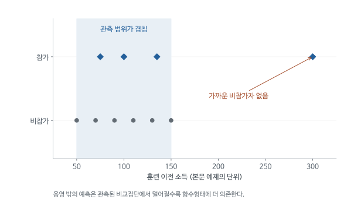

# 관측자료에서 처치효과를 구하는 방법: Imbens (2004) 심층요약

직업훈련을 받은 사람의 소득이 받지 않은 사람보다 높다면, 훈련이 소득을 높였다고 말할 수 있을까? 훈련에 지원한 사람은 원래 구직 의지가 강했을 수도 있다. 참가 전 소득과 경력도 다를 것이다. 정책 담당자가 알고 싶은 것은 참가자의 소득 수준이 아니라, 그 사람들이 훈련에 참가하지 않았을 때와 비교한 소득 증가다.

Imbens는 이런 관측자료에서 평균 처치효과를 추정하는 방법들을 정리한다. 회귀, 매칭, 성향점수, 역확률 가중치는 모두 관측되지 않은 비교 결과를 구성하려는 방법이다. 서로 다른 계산법이 왜 같은 효과를 겨냥할 수 있는지, 어떤 가정이 있어야 그 비교를 믿을 수 있는지가 이 글의 주제다.

[원문 PDF](<Nonparametric estimation of average treatment effects under exogeneity (2004).pdf>) | [독립형 QnA](<Nonparametric estimation of average treatment effects under exogeneity (2004)_QnA.md>)

## 1. 훈련 참가자와 비참가자를 비교하기 전에 확인할 문제

훈련 참가 여부를 연구자가 추첨으로 정했다면 배정 전 특성은 평균적으로 비슷해진다. 이 글이 다루는 관측자료에서는 지원자가 스스로 참가하고 담당자가 선발하기도 한다. 참가 전 소득과 경력 자료를 확보했다면, 이를 이용해 비슷한 사람끼리 비교할 방법을 찾을 수 있다.

계산에 앞서 두 질문을 구분한다. 하나는 ‘같은 사람이 참가하지 않았을 소득과의 차이’라는 효과의 정의다. 다른 하나는 다른 사람의 관측 소득으로 그 미관측 소득을 대신할 근거다. 잠재결과 표기는 첫 질문을 명확히 하고, 조건부 독립과 중첩 가정은 두 번째 질문에 답한다. 그 가정 아래 회귀, 매칭과 가중치가 실제 표본에서 비교 소득을 계산한다.

이 논문에서 ‘비모수’라는 말은 가정을 사용하지 않는다는 뜻이 아니다. 모든 사람의 소득이 나이와 경력의 하나의 직선식으로 결정된다고 미리 제한하지 않고, 자료가 뒷받침하는 범위에서 관계를 유연하게 추정한다는 의미다. 훈련의 효과가 초보자에게 크고 숙련자에게 작다면, 모든 사람에게 같은 훈련계수 하나를 적용하는 회귀는 그 차이를 충분히 설명하지 못할 수 있다. 그러나 유연한 계산법도 비교할 만한 비참가자가 없거나 중요한 선발요인을 관측하지 못하는 문제를 해결하지는 못한다.

이 글은 특정 훈련사업 하나의 성공 여부를 보고하는 실증논문이 아니다. 여러 연구에서 반복되는 비교 문제를 정리한 방법론 검토다. 훈련 사례는 각 방법의 차이를 이해하는 공통 상황으로 사용한다. 읽을 때에는 방법의 이름보다 ‘누구의 미관측 소득을 어떤 사람들의 소득으로 대신하는가’를 먼저 확인하면 회귀와 매칭 사이의 관계가 명확해진다.

## 2. 같은 사람에게 필요한 두 소득과 실제로 관측하는 한 소득

훈련의 인과효과를 정의하려면 같은 사람을 두 상황에서 생각해야 한다. 훈련을 받았을 때의 소득과 받지 않았을 때의 소득이다. 둘 중 실제로 선택한 상황의 결과만 자료에 기록된다. 아래 기호들은 이 관측상의 한계를 수식으로 표현하기 위해 도입한다.

| 기호 | 뜻 | 직업훈련 예시 |
|---|---|---|
| $i$ | 관측 단위 | 사람 한 명 |
| $W_i$ | 실제 처치 여부 | 훈련 참가 1, 미참가 0 |
| $X_i$ | 처치에 영향받지 않는 특성 벡터 | 참가 전 소득, 나이, 경력 |
| $Y_i(1)$ | 처치를 받았을 때의 잠재결과 | 훈련을 받았을 때의 소득 |
| $Y_i(0)$ | 처치를 받지 않았을 때의 잠재결과 | 같은 사람이 훈련을 안 받았을 때의 소득 |
| $Y_i$ | 실제 관측 결과 | 실제 선택한 상태에서의 소득 |
| $e(x)$ | $X=x$인 사람의 처치 확률 | 같은 배경의 사람 중 참가할 확률 |

벡터란 여러 특성을 한 묶음으로 썼다는 뜻이다. $X_i=x$라고 조건을 걸면 그 묶음의 값을 고정한다.

관측 결과는

$$
Y_i=W_iY_i(1)+(1-W_i)Y_i(0)
$$

이다. $W_i=1$이면 첫 항만 남는다. $W_i=0$이면 둘째 항만 남는다. 한 사람의 처치효과 $Y_i(1)-Y_i(0)$는 두 잠재결과를 함께 알아야 하지만 실제로는 하나만 관측된다. 매칭으로 찾은 타인의 결과도 바로 그 사람의 미관측 잠재결과를 관측한 것은 아니다.

여기서 두 잠재소득은 같은 시점의 두 가능성이다. 참가 전 소득을 $Y_i(0)$라고 부르는 것은 잘못이다. 참가 전에는 경기와 나이도 달랐기 때문이다. 예컨대 2025년에 훈련을 받은 사람의 $Y_i(0)$는 2025년에 훈련을 받지 않았을 경우의 소득이다. 2024년의 실제 소득은 그 반사실을 예측하는 데 유용한 $X_i$의 한 항목이 될 수 있다.

이 구별은 자료 한 행을 읽을 때도 필요하다. 한 행에는 참가 여부, 참가 전에 측정한 특성과 이후 실제 소득이 기록된다. 두 잠재소득을 모두 갖춘 행이 여러 개 있어서 그 차이를 평균하는 상황이 아니다. 다른 참가자의 훈련이 내 소득에 영향을 주거나, 같은 ‘훈련’ 안에 전혀 다른 프로그램들이 섞이면 두 상태만으로 결과를 표현하는 설정을 더 세밀하게 정해야 한다. 예를 들어 훈련생끼리 같은 일자리를 경쟁한다면 미참가자의 결과도 프로그램 규모에 영향을 받을 수 있다.

## 3. 관측된 소득 차이 중 훈련효과에 해당하는 부분

자료에서 먼저 계산할 수 있는 값은 참가자와 비참가자의 평균 소득 차이다. 그런데 이 차이가 무엇을 포함하는지 알아야 조정할 대상을 정할 수 있다. 같은 항을 더하고 빼는 아래 전개는 그 차이를 ‘참가자가 얻은 훈련효과’와 ‘훈련이 없어도 있었을 집단 차이’로 나누는 계산이다.

$$
\Delta_{obs}=E[Y\mid W=1]-E[Y\mid W=0].
$$

관측 결과를 잠재결과로 바꾸면

$$
\Delta_{obs}=E[Y(1)\mid W=1]-E[Y(0)\mid W=0].
$$

여기에 $E[Y(0)\mid W=1]$을 더했다가 빼면

$$
\Delta_{obs}=\underbrace{E[Y(1)-Y(0)\mid W=1]}_{ATT}
+\underbrace{E[Y(0)\mid W=1]-E[Y(0)\mid W=0]}_{선택편향}.
$$

이 줄까지는 대수적 분해다. 인과가정을 아직 쓰지 않았다. 마지막 괄호는 훈련이 없어도 두 집단의 소득이 달랐을 정도다. 이를 0이라고 놓으려면 별도의 근거가 필요하다.

예를 들어 관측 소득 차이가 100이고, 참가자들이 훈련을 받지 않아도 비참가자보다 평균 70을 더 벌었을 집단이라면 실제 참가자 효과는 30이다. 문제는 두 번째 숫자 70이 직접 관측되지 않는다는 데 있다. 다음 가정과 추정법은 바로 이 비교 소득을 구성하기 위해 필요하다.

선택편향의 부호는 연구 상황에 따라 달라진다. 적극적으로 구직하는 사람이 자원했다면 참가자가 원래 더 벌었을 가능성이 있다. 반대로 최근 실직자만 선발했다면 참가자의 미참가 소득이 원래 더 낮았을 수 있다. 후자의 경우 실제 효과가 양수여도 참가자의 관측 소득이 비참가자보다 낮게 나타날 수 있다. 관측 차이가 음수라는 사실만으로 훈련이 해롭다고 결론 내리지 못하는 이유다.

예를 들어 참가자는 실제로 180을 벌었고 비참가자는 200을 벌었다고 하자. 참가자가 훈련 없이 벌었을 평균이 150이었다면 효과는 30이다. 관측 차이인 -20에는 원래의 집단 차이 -50이 함께 들어 있다. 조정은 결과를 반드시 작게 만드는 절차가 아니다. 어떤 방향의 선발이 있었는지에 따라 조정 후 추정치는 커질 수도 작아질 수도 있다.

## 4. 같은 배경의 사람을 비교하면 인과효과를 얻는다는 가정

선택편향을 줄이기 위해 과거 소득과 경력이 같은 사람끼리 비교하려고 한다. 그래도 구직 의욕처럼 관측하지 못한 차이가 남을 수 있다. 관측한 배경이 이 선택과정을 충분히 설명한다는 가정과, 그 배경에서 실제 비교대상이 존재한다는 조건을 나누어 제시한다.

### 4.1 조건부 독립

$$
(Y(0),Y(1))\perp W\mid X.
$$

기호 $\perp$는 독립을, $\mid X$는 배경 특성 $X$를 조건으로 삼는다는 뜻이다. 같은 $X$ 안에서는 참가 여부를 추가로 알아도 두 잠재소득의 분포가 달라지지 않는다고 놓는다. 참가에 영향을 주는 미관측 의욕이 소득에도 영향을 준다면 이 가정이 실패할 수 있다.

이를 이용하면

$$
E[Y(w)\mid X=x]
=E[Y(w)\mid W=w,X=x]
=E[Y\mid W=w,X=x].
$$

첫 등호는 조건부 독립, 둘째 등호는 실제 받은 처치의 잠재결과가 관측 결과와 같다는 일치성이다. 서로 다른 이유로 성립하는 두 등호를 구별해야 한다.

### 4.2 공통지지와 중첩

$$
0<e(x)=P(W=1\mid X=x)<1.
$$

같은 $x$를 가진 사람들 가운데 두 처치 상태가 모두 가능해야 한다는 뜻이다. 특정 경력의 사람은 전부 참가했다면, 그 경력에서 미참가 평균을 데이터로 계산할 수 없다. 회귀식이 숫자를 출력하더라도 그것은 관측 범위를 벗어난 함수형태의 외삽에 의존한다.

ATT만 필요하다면 미참가 잠재결과의 조건부 독립과 처치집단이 있는 곳의 비교 가능성이 핵심이다. 이미 관측한 처치집단의 $Y(1)$를 다시 식별할 필요는 없기 때문이다. 원문 II.C는 이처럼 목표에 따라 가정을 약화할 수 있음을 구별한다.

조건부 독립을 현실의 비교로 읽으면, 참가 전 소득과 경력이 같은 사람들 중 담당자가 누구를 선발했는지 추가로 알아도 훈련 없는 미래 소득을 더 잘 예측하지 못해야 한다. 담당자가 자료에 기록되지 않은 면접 평가로 취업 가능성이 높은 사람을 골랐다면 그 조건은 의심스럽다. 통제변수가 많다는 설명보다 선발 과정에서 실제로 사용된 정보를 확보했는지가 중요하다.

중첩은 이와 별개의 요구다. 선발 과정의 모든 정보를 관측했더라도 규정상 저소득자는 반드시 선발되고 고소득자는 절대 선발되지 않으면 같은 특성에서의 비교가 없다. 조건부 독립이 설득력 있다는 설명과 비교표본이 풍부하다는 설명은 서로 대신할 수 없다. 분석 대상에서 중첩이 없는 사람을 제외한다면 계산은 안정될 수 있지만, 결과는 처음에 관심을 가졌던 전체 인구의 효과와 다른 질문에 답하게 된다.

조건으로 사용하는 특성은 처치 이전에 결정되어야 한다는 점도 중요하다. 훈련 이후 취업한 산업을 맞춘다면 훈련이 새로운 산업에 취업하게 한 경로를 일부 제거할 수 있다. 예를 들어 훈련 덕분에 고임금 산업으로 옮긴 참가자와 원래 그 산업에 취업할 능력이 있던 비참가자를 같은 집단으로 묶으면 새로운 선택 문제가 생긴다. ‘통제변수는 많을수록 좋다’는 원칙보다 변수의 측정 시점과 인과적 역할을 먼저 판단해야 한다.

## 5. 전체 사람의 효과와 실제 참가자의 효과는 왜 다른가

정책을 모든 사람에게 확대할지 판단하는 질문과 현재 참가자에게 도움이 되었는지 판단하는 질문은 대상 인구가 다르다. ATE는 전체 모집단, ATT는 실제 처치집단의 평균효과다. 배경별 효과가 다르면 각 배경을 얼마나 많이 포함하는지에 따라 두 평균이 달라진다.

배경 특성이 $x$인 사람의 처치 상태별 평균을 $\mu_w(x)=E[Y(w)\mid X=x]$라 쓴다. 두 평균의 차이 $\tau(x)=\mu_1(x)-\mu_0(x)$는 그 배경에서의 평균효과다. 이를 어느 집단의 배경 분포로 평균하는지가 다음 두 식의 차이다.

$$
ATE=E_X[\tau(X)],\qquad ATT=E[\tau(X)\mid W=1].
$$

두 식은 같은 조건부 효과를 평균하지만, ATE는 전체 인구의 특성 분포를 사용하고 ATT는 처치받은 사람들의 특성 분포를 사용한다.

**학습용 예제:** 저경력과 고경력의 효과가 각각 4와 1이라고 하자. 전체 인구가 반반이면 ATE는 $0.5\times4+0.5\times1=2.5$다. 참가자의 80%가 저경력이면 ATT는 $0.8\times4+0.2\times1=3.4$다. 효과가 이질적인 경우 동일한 데이터에서도 질문에 따라 다른 답을 얻는다.

원문은 모집단 평균 PATE/PATT, 실제 표본 구성원들의 SATE/SATT, 표본 공변량에 조건부인 평균도 구별한다. 특히 이 논문의 CATE 표기는 표본 공변량에 조건부인 평균이며, 오늘날 자주 쓰는 $\tau(x)$와 기계적으로 동일시하면 안 된다.

전체 효과와 참가자 효과의 차이는 정책 판단에도 직접 연결된다. 현재 참가자가 주로 경력이 적은 사람이라면 높은 ATT는 현재 운영 방식의 성과를 보여준다. 그 결과만으로 경력이 많은 사람에게까지 확대했을 때 같은 평균효과가 나온다고 예측하기는 어렵다. 프로그램 확대는 참여 구성과 제공 방식도 바꿀 수 있으므로, 기존 자료의 ATE조차 확대 정책의 모든 변화를 자동으로 포함하지는 않는다.

표본효과와 모집단효과의 차이는 ‘평균을 계산할 사람의 명단이 고정되어 있는가’로 이해할 수 있다. 이번 조사에 포함된 500명에게 생긴 평균효과와 전국의 대상자에게 생길 평균효과는 목표가 다르다. 후자를 말하려면 조사에 어떤 사람이 포함되었는지에 따른 변동도 고려한다. 같은 추정 숫자를 보고하더라도 누구에게 일반화하려는지를 밝히지 않으면 표준오차와 정책적 의미를 정확히 읽을 수 없다.

## 6. 회귀로 참가자의 미참가 소득을 예측하기

참가자의 실제 소득은 관측되지만 훈련을 받지 않았을 소득은 없다. 회귀 조정은 비참가자의 자료로 소득과 참가 전 특성의 관계를 추정한 뒤, 그 관계에 참가자의 특성을 대입한다. 이렇게 얻은 예측값이 비교 소득이다. 아래 식의 회귀함수는 이 미관측 비교 결과를 예측하는 역할을 한다.

$$
\widehat{ATT}_{reg}=\frac1{N_1}\sum_{i:W_i=1}\{Y_i-\widehat\mu_0(X_i)\}.
$$

$N_1$은 참가자 수다. 합의 첨자 $i:W_i=1$은 참가자에 대해서만 합한다는 뜻이다. 먼저 사람별 관측 결과에서 반사실 평균을 빼고, 그 차이를 참가자 수로 나눈다.

ATE를 원하면 두 함수를 모두 추정하고 모든 사람에게 적용한다.

$$
\widehat{ATE}_{reg}=\frac1N\sum_{i=1}^N
\{\widehat\mu_1(X_i)-\widehat\mu_0(X_i)\}.
$$

예측한 미참가 소득이 정확하려면 결과와 배경 특성의 관계를 회귀함수가 충분히 표현해야 한다. 조건부 독립이 타당해도 직선 하나가 그 관계를 잘못 근사하면 추정 오차가 남는다. 비교가능성을 가정하는 문제와 함수형태를 정하는 문제를 구분하는 이유다.

학습용으로 비참가자 자료에서 과거 소득 100인 사람의 이후 소득을 120으로 예측했다고 하자. 그 특성을 가진 참가자의 실제 소득이 150이면 회귀 조정에서 기여하는 차이는 30이다. 이때 예측 120은 그 참가자의 숨겨진 실제 소득을 알아낸 값이 아니라, 같은 배경의 사람들에게 기대되는 미참가 평균이다. 개인별 우연한 취업 성공과 실패는 여전히 남는다.

관측자료에 과거 소득 50부터 150인 비참가자만 있는데 참가자의 과거 소득이 300이라면, 회귀는 학습한 범위를 훨씬 넘어 예측하게 된다. 직선과 곡선이 관측 구간에서는 비슷하게 맞아도 300에서는 크게 달라질 수 있다. 함수형태를 유연하게 만드는 것과 중첩을 확보하는 것은 서로 다른 과제다. 회귀 결과표의 높은 설명력만으로 외삽 구간의 반사실 예측을 신뢰하기 어려운 이유다.

<!-- learning-figure:matching-overlap -->

*그림 설명: 본문의 과거 소득 범위를 이용한 설명용 배치다. 점은 실제 표본이 아니며 밀도나 표본 수를 나타내지 않는다.*

150을 넘는 비참가자 결과를 관측하지 못했다면 과거 소득 300인 참가자의 미참가 결과는 관측 범위 밖에서 예측해야 한다. 회귀선을 그릴 수 있다는 사실과 믿을 만한 비교대상이 있다는 사실은 다르다. 공통지지가 부족한 대상을 제외하면 추정효과가 대표하는 사람들의 범위도 바뀐다.

<!-- /learning-figure -->

## 7. 매칭으로 참가자와 비슷한 비참가자의 소득을 찾기

회귀함수의 모양을 정하는 대신, 과거 소득과 경력이 가까운 비참가자를 직접 찾을 수도 있다. 매칭은 그 사람의 실제 소득을 참가자의 비교 소득으로 사용하는 방법이다. 관측 특성이 완전히 같은 사람을 찾기 어렵다면 어느 정도의 차이를 허용할지, 남은 차이를 어떻게 보정할지가 새로운 문제가 된다.

참가자 $i$에게 비교대상으로 선정한 미참가자 $M$명의 집합을 $J_M(i)$라 쓴다. 아래 첫 식은 이 사람들의 소득을 평균하여 참가자 $i$의 미참가 결과를 예측하고, 둘째 식은 참가자별 차이를 다시 평균한다.

$$
\widehat Y_i(0)=\frac1M\sum_{j\in J_M(i)}Y_j,\qquad
\widehat{ATT}_{match}=\frac1{N_1}\sum_{i:W_i=1}(Y_i-\widehat Y_i(0)).
$$

첫 번째 합의 $j$는 비교 상대다. 두 번째 합의 $i$는 효과를 알고 싶은 참가자다. 두 첨자를 구별하면 무엇을 먼저 평균하는지 보인다.

**학습용 예제:** 참가자 A의 소득은 12, 비교 상대의 소득은 8과 10이다. A의 미참가 평균 추정은 9이고 차이는 3이다. 참가자 B의 소득은 15, 상대 평균은 11이면 차이는 4다. ATT 추정은 $(3+4)/2=3.5$다. A의 개인 효과가 정확히 3이라는 주장은 하지 않는다.

나이와 원 단위 소득을 그대로 거리 계산에 넣으면 소득이 숫자 크기 때문에 지배할 수 있다. 표준화 거리나 공분산을 반영하는 Mahalanobis 거리가 필요한 이유다. 다만 거리를 바꾸는 선택에도 연구적 판단이 들어간다.

비슷하지만 같지 않은 사람을 연결하면 $\mu_0(X_i)-\mu_0(X_j)$가 남는다. 회귀를 함께 사용한 편향보정은 비교 상대 결과를

$$
Y_j+\widehat\mu_0(X_i)-\widehat\mu_0(X_j)
$$

로 바꾸어 이 차이를 보정한다. 결과함수 추정이 추가로 필요하다는 비용도 생긴다.

한 비참가자가 여러 참가자와 매우 비슷하다면 같은 비교 상대를 반복해서 사용할 수도 있다. 복원 매칭은 가까운 상대를 활용한다는 장점이 있지만 특정 사람의 소득에 결과가 많이 의존하게 한다. 비복원 매칭은 중복을 막지만 먼저 연결된 참가자가 가장 가까운 상대를 사용해 버려 뒤의 참가자에게 먼 상대가 배정될 수 있다. 어느 방식도 이름만으로 항상 우월하지 않으며 거리와 재사용 정도를 함께 확인해야 한다.

편향보정식의 방향도 실제 상황으로 확인할 수 있다. 참가자보다 경력이 짧은 비참가자를 연결했고 경력이 길수록 미참가 소득이 높다고 하자. 비참가자의 관측 소득을 그대로 사용하면 참가자의 반사실 소득을 지나치게 낮게 잡는다. 보정은 경력 차이로 예상되는 소득 차이를 상대의 소득에 더한다. 결과함수로 설명되는 비교대상의 불일치를 조정하는 절차이며, 관측된 차이를 무조건 제거하지는 않는다.

## 8. 특성이 많아 비슷한 사람을 찾기 어려울 때의 성향점수

나이 하나만 맞추기는 쉽지만 나이, 학력, 경력, 과거 소득을 동시에 맞추면 적당한 비교대상이 줄어든다. 성향점수는 이 여러 특성으로 예측한 참가 확률을 한 숫자로 요약한다. 이 숫자가 같은 집단 안에서 관측 특성의 분포가 균형을 이루는 성질이 있어, 원래의 조건부 독립 가정이 타당할 때 비교 차원을 줄일 수 있다.

처치 여부 $W$는 0과 1을 가지므로 조건부 평균이 처치확률과 같다. 따라서 $e(X)=P(W=1\mid X)=E[W\mid X]$로 쓸 수 있다. 아래에서는 이 성질과 조건부기댓값을 한 번 더 평균하는 법칙을 사용한다.

같은 성향점수 안에서 $X$를 추가로 알아도 처치 확률은 변하지 않는다.

$$
P(W=1\mid X,e(X))=e(X),
$$

$$
P(W=1\mid e(X))=E[E[W\mid X]\mid e(X)]
=E[e(X)\mid e(X)]=e(X).
$$

두 확률이 같으므로 성향점수는 관측 특성의 균형을 만드는 점수다. 여기에 **이미 $X$에 대해 조건부 독립이 성립한다는 가정**을 더해야 잠재결과에 대해서도

$$
(Y(0),Y(1))\perp W\mid e(X)
$$

가 성립한다. 두 사람의 점수가 같다는 사실만으로 관측하지 않은 의욕까지 같아지는 것은 아니다. 추정 점수의 균형과 실제 공변량의 균형도 각각 확인해야 한다.

성향점수를 계산하는 목적은 참가자를 정확히 분류하는 데만 있지 않다. 비슷한 참가 확률을 가진 사람들 사이에서 비교할 수 있는 관측치를 확보하고, 그 안에서 배경 특성이 실제로 균형을 이루는지 살피는 데 있다.

성향점수가 0.4인 두 사람의 나이와 학력이 반드시 같지는 않다. 한 사람은 나이가 많지만 학력이 낮고, 다른 사람은 나이가 적지만 학력이 높아 두 특성의 조합이 같은 참가확률을 만들 수 있다. 균형 성질은 같은 점수에 속한 참가자들과 비참가자들 사이에서 특성의 분포가 같다는 집단 수준의 주장이다. 매칭한 모든 두 사람이 모든 항목에서 같다는 주장이 아니다.

실제 분석에서는 참된 참가확률을 알지 못하므로 자료로 추정한다. 추정 점수의 구간마다 평균 나이와 과거 소득의 분포를 비교하는 이유가 여기에 있다. 점수의 예측 정확도가 높아도 한 집단에만 존재하는 구간이 많으면 비교는 더 어려워진다. 반대로 참가 여부를 완벽히 맞히지 못하더라도 중요한 특성이 균형을 이루고 충분한 비교대상이 있다면 효과 추정에는 더 유용할 수 있다.

## 9. 관측될 확률이 낮은 사람에게 더 큰 가중치를 주는 이유

매칭은 비교할 사람을 선택했다. 역확률 가중치는 관측치의 기여도를 바꾼다. 어떤 배경의 사람이 처치를 받을 확률이 0.2라면 처치집단에서 그 배경은 상대적으로 적게 관측된다. 처치된 그 관측치에 1/0.2의 가중치를 주면, 원래 모집단의 배경 구성을 복원하는 방식으로 평균을 계산할 수 있다.

$$
E\left[\frac{WY}{e(X)}\right]
=E\left[\frac{WY(1)}{e(X)}\right].
$$

$W=1$일 때 $Y=Y(1)$, $W=0$일 때 두 항 모두 0이므로 같다.

$$
=E_X\left[\frac{E[WY(1)\mid X]}{e(X)}\right]
$$

은 반복기대법칙이다. 안쪽에서는 $X$가 고정되어 분모를 상수처럼 취급한다.

$$
E[WY(1)\mid X]=E[W\mid X]E[Y(1)\mid X]
=e(X)\mu_1(X)
$$

은 조건부 독립을 사용한 단계다. 따라서

$$
E\left[\frac{WY}{e(X)}\right]=E[\mu_1(X)]=E[Y(1)].
$$

동일한 방식으로 $E[(1-W)Y/(1-e(X))]=E[Y(0)]$를 얻는다. 두 식을 빼면 ATE다.

ATT에서는 처치집단의 특성 분포를 목표로 하므로 통제집단의 가중치는 $e(X)/(1-e(X))$가 된다. ATE의 $1/(1-e(X))$와 혼동하면 다른 모집단을 비교하게 된다.

원문 III.C는 표본에서 가중치 합이 정확히 1이 되도록 정규화하는 방법도 설명한다. 확률이 0이나 1에 가까울 때는 가중치가 커지고 일부 관측치가 전체 결과를 지배한다.

가중치를 주는 것 자체로 미관측 차이가 제거되지는 않는다. 위 등식이 잠재소득 평균으로 이어지는 단계에서 조건부 독립을 사용한다. 이 가정을 빼면 계산은 여전히 가능하지만 인과효과라는 해석을 뒷받침할 등호가 사라진다.

가상의 모집단에 저경력자와 고경력자가 각각 100명 있고 참가율이 각각 20%와 80%라고 하자. 참가자만 보면 저경력자 20명과 고경력자 80명이라 구성이 원래 모집단과 다르다. 참가한 저경력자에게 5, 고경력자에게 1.25의 가중치를 주면 각 집단의 가중 합이 100으로 같아진다. 역확률 가중치가 복원하는 것은 이런 배경 구성이다. 관측된 20명의 개인 소득이 관측되지 않은 80명의 소득과 각각 같다는 뜻은 아니다.

확률이 0.01이면 가중치는 100이다. 한 사람의 소득 기록 오류나 우연한 고소득이 결과에 큰 영향을 줄 수 있다. 가중치를 제한하거나 해당 구간을 제외하는 선택에는 안정성과 추정대상의 변경이라는 비용이 함께 있다. 결과를 보고할 때에는 평균효과 숫자뿐 아니라 어떤 특성의 사람이 실제로 큰 기여를 했는지 설명해야 한다.

### 가중치의 합과 대상 모집단을 함께 확인하기

성향점수 $e(X)=P(W=1\mid X)$는 관측된 사람이 처치집단에 들어올 확률이다. 특성이 같은 사람이 모집단에 100명 있고 $e=.2$이면 처치자는 평균 20명이다. 각 처치자에게 $1/.2=5$의 가중치를 주면 이 20명이 모집단 100명을 대표한다. 통제자는 평균 80명이므로 $1/(1-.2)=1.25$를 주어 같은 100명을 대표하게 한다.

이를 조건부 기대값으로 쓰면

$$
E\left[\frac{WY}{e(X)}\mid X\right]
=\frac{P(W=1\mid X)}{e(X)}E[Y\mid W=1,X]
=E[Y(1)\mid X].
$$

마지막 등식에는 관측결과의 일관성과 조건부 독립이 쓰였다. 분모가 확률이라는 이유만으로 등식의 인과해석이 저절로 생기지는 않는다. 이어서 $X$에 대해 평균하면 모집단의 처치 잠재평균을 얻는다.

ATT가 목표라면 대표해야 할 집단이 실제 처치자들이다. 처치자에게는 가중치 1을 두고 통제자에게 $e(X)/(1-e(X))$를 준다. 위 예에서는 통제자 80명이 각각 .25씩 기여해 처치자 20명을 대표한다. ATE의 역확률 가중치와 ATT의 오즈 가중치가 다른 이유는 같은 자료로 다른 사람들의 평균을 구하기 때문이다.

$e=.99$인 층에서는 통제자 한 명이 약 100명을 대표해야 한다. 그 한 명의 결과 측정오차나 특이값이 전체 답을 크게 바꾼다. 가중치를 자르거나 중첩이 약한 사람을 제외하면 변동은 줄일 수 있지만, 특히 표본을 제외할 때는 대상 모집단도 달라진다. 안정된 숫자가 나왔다는 이유만으로 원래 전체 ATE를 그대로 추정했다고 말할 수 없다.

## 10. 회귀 예측과 가중치 보정을 함께 사용하는 이유

회귀 조정은 비교 소득의 예측모형에 의존하고, 역확률 가중치는 참가확률 모형에 의존한다. 두 모형 중 하나의 오지정을 보완할 수 있다면 추정이 덜 취약해진다. 아래 보충식은 회귀로 예측한 결과에 실제 결과와 예측값의 차이를 가중하여 더하는 방법을 보여준다.

$$
\widehat\tau=\frac1N\sum_i\left[
\widehat\mu_1(X_i)-\widehat\mu_0(X_i)
+\frac{W_i\{Y_i-\widehat\mu_1(X_i)\}}{\widehat e(X_i)}
-\frac{(1-W_i)\{Y_i-\widehat\mu_0(X_i)\}}{1-\widehat e(X_i)}
\right].
$$

앞의 차이는 회귀 예측이고, 뒤의 두 항은 실제 결과와 예측의 잔차를 가중해서 보정한다. 결과모형이 맞으면 각 처치집단 잔차의 조건부 평균이 0이다. 성향점수가 맞으면 가중잔차가 잘못 예측한 평균을 보정한다. 적절한 추정 조건 아래 두 모형 중 하나가 맞으면 일관성이 가능하다는 의미다.

성향점수만 정확한 경우를 처치 평균 하나에서 확인할 수 있다. 실제 처치평균함수는 $\mu_1(X)$이지만 분석자가 사용한 회귀예측은 $m_1(X)$라고 하자. 두 함수가 달라도 된다. 다음 보정값의 조건부 평균을 계산한다.

$$
E\left[m_1(X)+\frac{W\{Y-m_1(X)\}}{e(X)}\,\middle|\,X\right]
=m_1(X)+\frac{e(X)\{\mu_1(X)-m_1(X)\}}{e(X)}
=\mu_1(X).
$$

첫 등호에서 처치자가 관측될 확률은 $e(X)$이고 그들의 평균 결과는 조건부 독립 아래 $\mu_1(X)$다. 회귀가 잘못 예측한 양 $\mu_1(X)-m_1(X)$이 잔차 보정으로 더해진다. 이제 반대로 회귀가 정확하면 $Y-\mu_1(X)$의 처치집단 조건부 평균이 0이어서, 적절한 양의 가중분모를 사용한 보정항의 평균이 0이다. 이 두 계산이 “두 모형 중 하나가 정확하면 된다”는 설명의 근거다. 유한표본에서 임의로 추정한 모형을 넣어도 항상 오차가 없다는 뜻은 아니며, 일관성에는 각 모형의 추정 조건도 필요하다.

그러나 미관측 의욕 때문에 조건부 독립 자체가 실패하면 이 논리는 출발하지 못한다. 아무 가중회귀나 두 번 돌린다고 모든 목표 효과에 대해 이중강건성이 생기는 것도 아니다.

잔차 보정을 이해할 때에는 ‘관측된 사람들에게서 회귀가 어느 방향으로 틀렸는가’를 생각하면 된다. 특정 배경에서 회귀가 처치 소득을 100으로 예측하지만 실제 처치자 평균은 120이라면 평균 잔차는 20이다. 정확한 참가확률로 그 잔차의 대표성을 보정하면 과소예측한 부분을 더할 수 있다. 회귀가 이미 평균을 정확히 예측하면 양수와 음수 잔차가 평균적으로 상쇄되어 불필요한 평균 수정이 생기지 않는다.

두 모형을 사용한다는 사실이 두 번의 독립된 인과 증거를 만든다는 뜻은 아니다. 두 모형 모두 같은 관측 특성에 기초한다. 면접에서만 드러나는 의욕을 어느 모형에도 넣지 못했다면 두 계산의 결합으로 그 정보를 만들어낼 수 없다. 이중강건성이 보호하는 것은 일정한 모형 오지정이며, 연구 설계의 가장 중요한 비교가정까지 자동으로 보호하는 성질은 아니다.

### 이중강건성에서 정확히 무엇이 두 번 보호되는가

처치 잠재평균 하나에 집중하면 증명이 짧아진다. 참 성향점수를 $e(X)$, 참 처치집단 평균함수를 $\mu_1(X)$라고 하자. 분석자가 사용하는 함수는 $q(X),g_1(X)$로 표시한다. $q$가 0에서 떨어져 있다고 두고 보정된 관측값을

$$
\psi_1=g_1(X)+\frac{W}{q(X)}\{Y-g_1(X)\}
$$

로 만든다. 우선 모든 사람에게 회귀예측을 부여하고, 실제 처치자의 예측오차를 역확률로 확대해 더하는 구조다. 주어진 $X$에서 평균을 내면

$$
\begin{aligned}
E[\psi_1\mid X]
&=g_1(X)+\frac{e(X)}{q(X)}\{\mu_1(X)-g_1(X)\}\\
&=\mu_1(X)+\frac{q(X)-e(X)}{q(X)}\{g_1(X)-\mu_1(X)\}.
\end{aligned}
$$

참값과의 차이에 두 모형의 오차가 곱으로 들어간다. $q=e$이면 회귀예측이 틀려도 마지막 항이 0이고, $g_1=\mu_1$이면 성향점수가 틀려도 0이다. 실제 표본에서 적합한 함수의 오차와 추론에는 추가 조건이 필요하지만, 이중강건성의 모집단 논리는 이 곱에 있다.

학습용으로 어떤 층에서 $\mu_1=10,e=.2$인데 $g_1=8,q=.4$를 썼다면 평균은 $8+(.2/.4)(10-8)=9$다. 두 모형이 동시에 틀리면 보정 후에도 1만큼 오차가 남는다. $q$만 .2로 고치면 10으로 복원된다. 통제 잠재평균도 $1-W$, $1-q$로 같은 보정을 한 뒤 두 평균을 빼 ATE를 만든다.

두 번 보호되는 것은 관측된 $X$를 이용한 두 추정모형 중 하나의 오류다. $X$로 조정해도 남는 미관측 교란까지 보호하는 성질은 아니다. 처음의 조건부 독립이 틀리면 위 $\mu_1$을 미관측 처치 잠재평균으로 읽는 연결부터 성립하지 않는다.

## 11. 효과 추정치의 정밀도와 비교집단의 적절성 확인

정책효과가 30으로 추정되었다고 해도 표본을 바꾸면 10이나 50이 나올 수 있다. 이런 표본 변동의 크기를 평가하는 것이 추론이다. 그에 앞서 비교가 특정 관측치의 거대한 가중치에 의존하지 않는지, 참가자와 비참가자의 특성이 조정 후에도 다른지를 살펴야 한다. 표준오차가 작다는 사실만으로 비교집단이 적절해지는 것은 아니기 때문이다.

정밀도 식에서 $\sigma_w^2(X)$는 배경 $X$가 같은 사람들 사이에서도 남는 잠재결과 $Y(w)$의 분산이다. 사람 수를 $N$이라 하면 아래 식은 적절한 조건에서 ATE를 얼마나 정밀하게 추정할 수 있는지 판단하는 기준이 된다. 같은 특성의 결과도 많이 흩어져 있거나 어느 처치 상태를 거의 관측하지 못하면 더 많은 표본이 필요하다.

$$
V_P=E\left[\frac{\sigma_1^2(X)}{e(X)}+
\frac{\sigma_0^2(X)}{1-e(X)}+(\tau(X)-ATE)^2\right].
$$

첫 두 항은 각 처치 상태 결과의 불확실성이다. 마지막 항은 사람들의 특성에 따라 평균효과가 얼마나 달라지는지 나타낸다. 이 $V_P$는 $\sqrt N(\widehat\tau-\tau)$의 분산이며 추정량 자체의 분산은 대략 $V_P/N$이다.

중첩이 약하면 작은 분모 때문에 분산이 커진다. 표본효과와 모집단효과는 목표의 불확실성이 달라 같은 점추정이라도 표준오차 해석이 달라질 수 있다. 원문 IV의 부트스트랩 논의는 2004년 당시의 논의이며, 모든 매칭 추정량에 일반 부트스트랩이 타당하다고 읽으면 안 된다.

원문 V의 진단은 다음 질문으로 읽는다.

1. 효과가 없어야 하는 처치 전 결과에도 효과가 보이는가?
2. 서로 다른 비처치 비교집단끼리도 조정 후 차이가 남는가?
3. 처치집단의 특성과 비슷한 통제집단이 실제로 존재하는가?
4. 최악의 매칭 쌍은 얼마나 다른가?
5. 중간 결과처럼 처치로 바뀐 변수를 통제했는가?

사전 결과 검정 통과는 미관측 교란이 없다는 증명이 아니다. 처치 전 정보가 많을수록 가정을 살펴볼 기회가 늘어난다.

분산식에서 중첩의 역할을 숫자로 보면, 다른 조건이 같을 때 처치확률 0.5의 분모와 0.05의 분모는 처치 결과의 불확실성을 각각 2배와 20배로 반영한다. 드물게 처치되는 배경에서 몇 명의 결과를 보고 전체를 추론해야 하므로 불확실성이 크다. 표본 전체가 크더라도 필요한 비교 구간의 표본이 적으면 정밀도가 낮을 수 있다.

사전 결과를 사용한 진단은 구체적으로 해석해야 한다. 훈련 전에 이미 벌었던 소득을 결과변수로 삼았는데 조정 후에도 참가 효과처럼 보이는 차이가 남는다면, 미래에 시작되는 훈련이 과거를 바꾸었다고 해석할 수 없다. 배경 조정이나 비교집단 구성에 문제가 있다는 단서다. 다만 과거 소득 차이가 없었다고 해서 훈련 직전에 새로 발생한 구직 의욕이나 건강 변화까지 균형을 이룬다는 보장은 없다.

## 12. 평균효과를 넘어갈 때 추가로 달라지는 질문

평균 소득이 증가해도 모든 사람의 소득이 증가한 것은 아니다. 현재 표본의 평균을 알고 싶은지, 표본을 추출한 모집단의 평균을 알고 싶은지에 따라 불확실성의 정의도 달라진다. Imbens의 후반부는 이런 추정대상의 차이와 방법별 정밀도 문제를 다룬다.

예를 들어 정책을 시행했을 때 소득분포의 90분위수와 시행하지 않았을 때의 90분위수를 각각 안다고 하자. 그 차이는 두 결과분포의 상위 위치를 비교한 값이다. 개인별 소득 증가를 큰 순서대로 정렬한 90분위수와 같으려면 같은 사람의 두 소득을 연결하는 추가 정보가 필요하다.

III.E는 베이지안 결과모형과 결측 잠재결과 대체를 연결한다. 사전분포는 고차원 예측을 안정시킬 수 있지만 처치 배정의 정당화는 따로 필요하다.

VI는 직업훈련 실험의 통제집단을 외부 조사 통제집단으로 바꾸어 실험 결과를 재현하는 연구와, 가정을 알고 있는 모의실험을 구별한다. 전자는 실제 비교 가능성을 검토하고, 후자는 가정이 맞을 때 추정법의 성능을 검토한다. 실패 이유가 가정인지 추정법인지 구분해야 한다.

실험 자료를 평가 기준으로 사용하는 연구의 목적은 관측자료 방법에 정답을 알려주는 데 있다. 무작위 실험 안에서 얻은 효과와, 실험 참가자에 외부 조사 비참가자를 연결해 얻은 효과가 비슷한지 확인한다. 외부 집단의 지역과 노동시장 환경이 다르면, 같은 나이와 소득을 맞췄어도 결과가 달라질 수 있다. 이 실패는 추정 알고리즘의 계산 오류와 구분해야 한다.

모의실험에서는 연구자가 참가확률과 잠재소득을 생성하므로 어느 가정이 맞는지 알고 있다. 함수형태를 복잡하게 하거나 중첩을 약하게 바꾸어 방법별 성능을 비교할 수 있다. 그러나 모의실험에서 잘 작동했다는 결과는 실제 훈련 선발의 미관측 정보가 충분히 통제되었다는 증거가 아니다. 두 평가 방식은 서로 다른 의문에 답하므로 함께 읽는 편이 유용하다.

## 13. 같은 자료에 여러 추정법을 적용했을 때 확인할 것

회귀, 매칭, 가중치가 비슷한 값을 주면 관측변수를 조정하는 방식에 결과가 덜 민감하다는 근거가 된다. 값이 크게 다르면 어느 집단을 비교했는지, 비교대상이 없는 구간을 예측했는지, 극단적인 가중치가 사용되었는지를 확인할 수 있다. 세 방법이 모두 같은 미관측 동기를 놓쳤다면 결과의 일치만으로 인과성을 보장할 수는 없다.

- 무엇을 배웠는가: 관측 특성을 맞춘 인과비교는 조건부 독립과 중첩에 의존한다.
- 핵심 방법은 무엇인가: 미관측 잠재결과의 조건부 평균을 식별하고 목표집단에 맞게 평균한다.
- 언제 쓰는가: 중요한 처치 전 선택요인을 관측하고 적절한 비교집단이 있을 때다.

분석 결과를 비교할 때에는 먼저 표본 수와 목표집단을 일치시켜야 한다. 매칭에서 비교대상이 없는 참가자를 제외했는데 회귀는 그 참가자까지 포함했다면 두 추정치의 차이는 계산법만의 차이가 아니다. 효과가 큰 저경력자가 매칭에서 많이 제외되었다면 매칭 추정치가 낮아지는 이유가 방법의 편향이 아니라 대상 인구의 변화일 수도 있다.

실제 보고서는 처치 정의, 결과를 측정한 시점, 처치 전 공변량, 제외된 대상자와 남은 비교 범위를 먼저 제시한 뒤 추정치를 설명하는 것이 좋다. 이 정보가 있어야 독자는 숫자가 어느 정책 질문에 답하는지 판단할 수 있다. Imbens의 여러 방법을 연결하는 기준도 이와 같다. 추정 대상과 비교가정을 먼저 정하고 그 질문을 자료에서 구현하는 계산법을 선택한다.

같은 자료에서 계산한 결과라도 단위가 다르면 크기를 바로 비교할 수 없다. 소득 수준의 평균효과와 로그소득의 평균효과는 다른 질문이다. 특히 이질적 효과가 있을 때 평균을 낸 뒤 로그를 취한 값과 로그 차이를 평균한 값도 다르다. 연구자는 결과변수의 정의를 정책 질문과 일치시켜야 하며, 방법을 바꿀 때 그 정의까지 함께 바뀌지 않았는지 확인해야 한다.

## 출처와 보충 설명

대상: Review of Economics and Statistics 86(1), 4-29쪽. 보관 PDF 26쪽의 본문, 각주, 참고문헌 텍스트를 검토했다. 수식은 학습에 필요한 핵심 식을 표준 표기로 다시 전개했다. 아래 예제와 상세 유도는 원문 논리에 근거한 학습용 보충이다.
