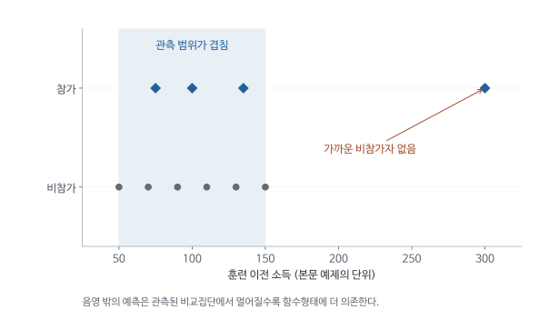

# 관측자료에서 처치효과를 구하는 방법: Imbens (2004) 심층요약

직업훈련을 받은 사람의 소득이 받지 않은 사람보다 높다면, 훈련이 소득을 높였다고 말할 수 있을까? 훈련에 지원한 사람은 원래 구직 의지가 강했을 수도 있다. 참가 전 소득과 경력도 다를 것이다. 정책 담당자가 알고 싶은 값은 참가자들이 훈련에 참가하지 않았을 경우와 비교한 소득 증가다. 참가자의 소득 수준만으로는 이 값을 알 수 없다.

Imbens는 이런 관측자료에서 평균 처치효과(average treatment effect)를 추정하는 방법들을 정리한다. 회귀, 매칭, 성향점수(propensity score), 역확률 가중(inverse probability weighting)치는 모두 관측되지 않은 비교 결과를 구성하려는 방법이다. 서로 다른 계산법이 왜 같은 효과를 겨냥할 수 있는지, 어떤 가정이 있어야 그 비교를 믿을 수 있는지가 이 글의 주제다.

이 글은 노동시장 정책 평가 문헌에서 나왔다. Ashenfelter(1978), Heckman과 Robb(1984), LaLonde(1986) 등의 연구 이후 구직 지원이나 직업교육 프로그램의 효과를 추정하는 계량경제학 방법에 관심이 커졌다. 그 가운데 한 갈래는 통계학의 잠재결과(potential outcome) 연구(Rubin, Rosenbaum과 Rubin)를 바탕으로 결과의 분포나 함수형태를 덜 가정하는 추정법을 발전시켰다. Imbens는 2003년 계량경제학회 초청강연을 바탕으로 이 문헌을 다섯 부류로 묶는다. 결과의 회귀함수를 추정하는 방법, 공변량(covariate) 매칭, 가중이나 블로킹처럼 성향점수를 이용하는 방법, 이들을 결합한 방법, 베이지안 방법이다. 도구변수(instrumental variable), 이중차분(difference-in-differences), 회귀불연속(regression discontinuity)처럼 관측 공변량 조정 외의 정보를 이용하는 방법과 처치가 여러 값을 가지거나 시간에 따라 바뀌는 경우는 다루지 않는다고 범위를 밝힌다.

[원문 PDF](<Nonparametric estimation of average treatment effects under exogeneity (2004).pdf>) | [개념 퀴즈](<Nonparametric estimation of average treatment effects under exogeneity (2004)_QnA.md>) | [수식·모델 퀴즈](<Nonparametric estimation of average treatment effects under exogeneity (2004)_수식모델퀴즈.md>) | [실무 Cheat Sheet](<Nonparametric estimation of average treatment effects under exogeneity (2004)_실무CheatSheet.md>)

## 1. 훈련 참가자와 비참가자를 비교하기 전에 확인할 문제

훈련 참가 여부를 연구자가 추첨으로 정했다면 배정 전 특성은 평균적으로 비슷해진다. 이 글이 다루는 관측자료에서는 지원자가 스스로 참가하고 담당자가 선발하기도 한다. 참가 전 소득과 경력 자료를 확보했다면, 이를 이용해 비슷한 사람끼리 비교할 방법을 찾을 수 있다.

계산에 앞서 두 질문을 구분한다. 하나는 ‘같은 사람이 참가하지 않았을 소득과의 차이’라는 효과의 정의다. 다른 하나는 다른 사람의 관측 소득으로 그 미관측 소득을 대신할 근거다. 잠재결과 표기는 첫 질문을 명확히 하고, 조건부 독립(conditional independence)과 중첩 가정은 두 번째 질문에 답한다. 그 가정 아래 회귀, 매칭과 가중치가 실제 표본에서 비교 소득을 계산한다.

두 번째 질문에 사용하는 가정을 원문은 unconfoundedness라고 부르고, exogeneity(외생성), selection on observables(관측변수에 의한 선택), conditional independence도 같은 뜻으로 사용한다고 밝힌다. 이 문서는 이 가정을 ‘조건부 독립’으로 통일해 부른다. 관측한 공변량이 같은 사람들 안에서는 처치 여부가 잠재결과와 무관하다는 가정이다. 이 가정이 성립하면 공변량이 같은 처치자와 통제자의 결과 차이를 처치의 효과로 해석할 수 있다.

제목의 ‘비모수’는 결과와 배경 특성의 관계를 나이와 경력의 직선식 같은 특정 함수형태로 미리 제한하지 않고, 자료가 뒷받침하는 범위에서 유연하게 추정한다는 뜻이다. 가정을 사용하지 않는다는 뜻으로 해석하면 안 된다. 조건부 독립과 중첩은 여전히 필요하다. 원문은 평균효과라는 수치 하나를 얻기 위해 회귀함수 같은 미지의 함수를 유연하게 추정한다는 점에서 준모수(semiparametric) 추정이라는 용어도 함께 사용한다. 훈련의 효과가 초보자에게 크고 숙련자에게 작다면, 모든 사람에게 같은 훈련계수 하나를 적용하는 회귀는 그 차이를 충분히 설명하지 못할 수 있다. 그러나 유연한 계산법도 비교할 만한 비참가자가 없거나 중요한 선발요인을 관측하지 못하는 문제를 해결하지는 못한다.

이 글은 특정 훈련사업 하나의 성공 여부를 새로 보고하지 않는다. 여러 연구에서 반복되는 비교 문제를 정리한 방법론 검토다. 훈련 사례는 각 방법의 차이를 이해하는 공통 상황으로 사용한다. 읽을 때에는 방법의 이름보다 ‘누구의 미관측 소득을 어떤 사람들의 소득으로 대신하는가’를 먼저 확인하면 회귀와 매칭 사이의 관계가 명확해진다.

## 2. 같은 사람에게 필요한 두 소득과 실제로 관측하는 한 소득

훈련의 인과효과를 정의하려면 같은 사람을 두 상황에서 생각해야 한다. 훈련을 받았을 때의 소득과 받지 않았을 때의 소득이다. 둘 중 실제로 선택한 상황의 결과만 자료에 기록된다. 아래 기호들은 이 관측상의 한계를 수식으로 표현하기 위해 도입한다.

| 기호 | 뜻 | 직업훈련 예시 |
|---|---|---|
| $i$ | 관측 단위 | 사람 한 명 |
| $W_i$ | 실제 처치 여부 | 훈련 참가 1, 미참가 0 |
| $X_i$ | 처치에 영향받지 않는 특성 벡터 | 참가 전 소득, 나이, 경력 |
| $Y_i(1)$ | 처치를 받았을 때의 잠재결과 | 훈련을 받았을 때의 소득 |
| $Y_i(0)$ | 처치를 받지 않았을 때의 잠재결과 | 같은 사람이 훈련을 안 받았을 때의 소득 |
| $Y_i$ | 실제 관측 결과 | 실제 선택한 상태에서의 소득 |
| $e(x)$ | $X=x$인 사람의 처치 확률 | 같은 배경의 사람 중 참가할 확률 |

벡터란 여러 특성을 한 묶음으로 표현했다는 뜻이다. $X_i=x$라고 조건을 걸면 그 묶음의 값을 고정한다. 원문은 과거 소득처럼 결과변수의 과거값도 $X_i$에 포함할 수 있다고 강조한다. 표본의 $N$명은 큰 모집단에서 무작위로 추출되었다고 가정한다.

원문은 표의 기호 외에 두 가지를 더 정의한다. 하나는 $\sigma_w^2(x)=\mathrm{Var}(Y(w)\mid X=x)$로, 배경이 같은 사람들 사이에서도 남는 잠재결과의 산포다. 11절의 정밀도 식에 사용된다. 다른 하나는 $X=x$일 때 $Y(0)$와 $Y(1)$의 상관계수 $\rho(x)$다. 한 사람의 두 잠재결과를 함께 관측하는 일은 없으므로, 자료는 이 상관에 관해 간접적이고 매우 제한된 정보만 제공한다. 이 한계는 11절의 표본 평균효과 분산과 12절의 분위수 효과 해석에서 다시 등장한다.

관측 결과는

$$
Y_i=W_iY_i(1)+(1-W_i)Y_i(0)
$$

이다. $W_i=1$이면 첫 항만 남는다. $W_i=0$이면 둘째 항만 남는다. 한 사람의 처치효과 $Y_i(1)-Y_i(0)$는 두 잠재결과를 함께 알아야 하지만 실제로는 하나만 관측된다. 매칭으로 찾은 타인의 결과도 바로 그 사람의 미관측 잠재결과를 관측한 것은 아니다.

여기서 두 잠재소득은 같은 시점의 두 가능성이다. 참가 전 소득을 $Y_i(0)$라고 부르는 것은 잘못이다. 참가 전에는 경기와 나이도 달랐기 때문이다. 예컨대 2025년에 훈련을 받은 사람의 $Y_i(0)$는 2025년에 훈련을 받지 않았을 경우의 소득이다. 2024년의 실제 소득은 그 반사실(counterfactual)을 예측하는 데 유용한 $X_i$의 한 항목이 될 수 있다.

이 구별은 자료 한 행을 해석할 때도 필요하다. 한 행에는 참가 여부, 참가 전에 측정한 특성과 이후 실제 소득이 기록된다. 두 잠재소득을 모두 갖춘 행이 여러 개 있어서 그 차이를 평균하는 상황이 아니다. 다른 참가자의 훈련이 내 소득에 영향을 주거나, 같은 ‘훈련’ 안에 전혀 다른 프로그램들이 섞이면 두 상태만으로 결과를 표현하는 설정을 더 세밀하게 정해야 한다. 예를 들어 훈련생끼리 같은 일자리를 경쟁한다면 미참가자의 결과도 프로그램 규모에 영향을 받을 수 있다.

## 3. 관측된 소득 차이 중 훈련효과에 해당하는 부분

자료에서 먼저 계산할 수 있는 값은 참가자와 비참가자의 평균 소득 차이다. 그런데 이 차이가 무엇을 포함하는지 알아야 조정할 대상을 정할 수 있다. 같은 항을 더하고 빼는 아래 전개는 그 차이를 ‘참가자가 얻은 훈련효과’와 ‘훈련이 없어도 있었을 집단 차이’로 나누는 계산이다.

$$
\Delta_{obs}=E[Y\mid W=1]-E[Y\mid W=0].
$$

관측 결과를 잠재결과로 바꾸면

$$
\Delta_{obs}=E[Y(1)\mid W=1]-E[Y(0)\mid W=0].
$$

여기에 $E[Y(0)\mid W=1]$을 더했다가 빼면

$$
\Delta_{obs}=\underbrace{E[Y(1)-Y(0)\mid W=1]}_{ATT}
+\underbrace{E[Y(0)\mid W=1]-E[Y(0)\mid W=0]}_{선택편향}.
$$

이 줄까지는 대수적 분해다. 인과가정은 아직 사용하지 않았다. 마지막 괄호는 훈련이 없어도 두 집단의 소득이 달랐을 정도다. 이를 0이라고 놓으려면 별도의 근거가 필요하다.

예를 들어 관측 소득 차이가 100이고, 참가자들이 훈련을 받지 않아도 비참가자보다 평균 70을 더 벌었을 집단이라면 실제 참가자 효과는 30이다. 문제는 두 번째 수치 70이 직접 관측되지 않는다는 데 있다. 다음 가정과 추정법은 바로 이 비교 소득을 구성하기 위해 필요하다. 9절에서는 이 분해를 가상의 두 집단 예제로 다시 계산해, 가중치가 선택편향(selection bias) 항을 어떻게 제거하는지 확인한다.

선택편향의 부호는 연구 상황에 따라 달라진다. 적극적으로 구직하는 사람이 자원했다면 참가자가 원래 더 벌었을 가능성이 있다. 반대로 최근 실직자만 선발했다면 참가자의 미참가 소득이 원래 더 낮았을 수 있다. 후자의 경우 실제 효과가 양수여도 참가자의 관측 소득이 비참가자보다 낮게 나타날 수 있다. 관측 차이가 음수라는 사실만으로 훈련이 해롭다고 결론 내리지 못하는 이유다.

예를 들어 참가자는 실제로 180을 벌었고 비참가자는 200을 벌었다고 하자. 참가자가 훈련 없이 벌었을 평균이 150이었다면 효과는 30이다. 관측 차이인 -20에는 원래의 집단 차이 -50이 함께 포함되어 있다. 조정은 결과를 반드시 작게 만드는 절차가 아니다. 어떤 방향의 선발이 있었는지에 따라 조정 후 추정치는 커질 수도 작아질 수도 있다.

## 4. 같은 배경의 사람을 비교하면 인과효과를 얻는다는 가정

선택편향을 줄이기 위해 과거 소득과 경력이 같은 사람끼리 비교하려고 한다. 그래도 구직 의욕처럼 관측하지 못한 차이가 남을 수 있다. 관측한 배경이 이 선택과정을 충분히 설명한다는 가정과, 그 배경에서 실제 비교대상이 존재한다는 조건을 나누어 제시한다.

### 4.1 조건부 독립

$$
(Y(0),Y(1))\perp W\mid X.
$$

기호 $\perp$는 독립을, $\mid X$는 배경 특성 $X$를 조건으로 삼는다는 뜻이다. 같은 $X$ 안에서는 참가 여부를 추가로 알아도 두 잠재소득의 분포가 달라지지 않는다고 가정한다. 참가에 영향을 주는 미관측 의욕이 소득에도 영향을 준다면 이 가정이 실패할 수 있다.

이를 이용하면

$$
E[Y(w)\mid X=x]
=E[Y(w)\mid W=w,X=x]
=E[Y\mid W=w,X=x].
$$

첫 등호는 조건부 독립, 둘째 등호는 실제 받은 처치의 잠재결과가 관측 결과와 같다는 일치성이다. 서로 다른 이유로 성립하는 두 등호를 구별해야 한다. 첫 등호를 풀어 쓰면 다음과 같다. 조건부 독립은 $X=x$인 사람들 안에서 $W$를 알아도 $Y(w)$의 분포가 바뀌지 않는다는 말이므로, 조건에 $W=w$를 덧붙여도 평균이 변하지 않는다. 둘째 등호는 $W=w$인 사람의 관측 결과 $Y$가 $Y(w)$와 같다는 2절의 관측식에서 도출된다. 두 등호를 이으면 관측할 수 없는 $E[Y(w)\mid X=x]$를 관측 가능한 조건부 평균으로 바꿔 쓸 수 있다. 여기에 $w=1$과 $w=0$을 차례로 대입하여 차감하면, 배경 $x$의 평균효과는

$$
E[Y(1)-Y(0)\mid X=x]=E[Y\mid W=1,X=x]-E[Y\mid W=0,X=x]
$$

로 같은 배경의 참가자 평균과 비참가자 평균의 차이가 된다. 원문 II.C는 식별(identification)을 두 단계로 설명한다. 배경별로 이 차이를 구한 뒤, 관심 있는 집단의 배경 분포로 평균한다. 전체 인구의 분포로 평균하면 ATE, 참가자의 분포로 평균하면 ATT다(5절).

회귀분석(regression analysis)에서 배운 외생성(exogeneity) 가정과의 관계도 원문이 보여 준다. 처치효과가 모든 사람에게 $\tau$로 동일하고, 미참가 소득이 $Y_i(0)=\alpha+X_i'\beta+\varepsilon_i$처럼 $X$의 선형식이며 $\varepsilon_i$가 $X_i$와 독립이라고 하자. 관측식에 대입하면 $Y_i=\alpha+\tau W_i+X_i'\beta+\varepsilon_i$라는 익숙한 회귀식이 된다. 이 경우 $X_i$가 주어지면 두 잠재소득은 $\varepsilon_i$에 따라서만 달라지므로, 조건부 독립은 $X_i$가 주어졌을 때 $W_i$와 $\varepsilon_i$가 독립이라는 조건과 같다. 흔히 ‘참가 더미가 외생적’이라고 말하는 조건이다. 효과가 일정하다는 가정과 선형성을 제외하면 조건부 독립에서 이런 선형회귀식이 도출되지 않는다. 조건부 독립은 회귀의 외생성 가정에서 함수형태 제한을 제거한 형태로 볼 수 있다.

원문은 조건부 독립보다 약한 가정도 소개한다. ATE만 필요하다면 분포 전체의 독립 대신 $E[Y(w)\mid W,X]=E[Y(w)\mid X]$라는 평균 독립(가정 2.3)으로도 충분하다. 위의 식별 전개에서 사용된 것은 평균뿐이기 때문이다. 그러나 Imbens는 약한 가정은 설득력 있는데 강한 가정은 설득력 없는 경우가 실제로는 드물다고 본다. 평균 독립은 결과를 어떤 척도로 측정하는지에 종속되어 있다. 소득 수준에서 평균 독립이 성립해도 로그소득에서는 성립하지 않을 수 있어서, 로그처럼 변환한 결과의 평균효과를 식별하려면 결국 강한 가정이 필요하다.

### 4.2 공통지지와 중첩

$$
0<e(x)=P(W=1\mid X=x)<1.
$$

같은 $x$를 가진 사람들 가운데 두 처치 상태가 모두 가능해야 한다는 뜻이다. 특정 경력의 사람은 전부 참가했다면, 그 경력에서 미참가 평균을 데이터로 계산할 수 없다. 회귀식이 수치를 출력하더라도 그것은 관측 범위를 벗어난 함수형태의 외삽에 의존한다. 4.1절의 식별 전개가 모든 $x$에서 $E[Y\mid W=1,X=x]$와 $E[Y\mid W=0,X=x]$를 둘 다 요구하기 때문에 이 조건이 필요하다.

ATT만 필요하다면 두 가정을 모두 완화할 수 있다(원문 II.C의 가정 2.4와 2.5). 조건부 독립은 미참가 잠재결과에만 요구하므로 $Y(0)\perp W\mid X$면 된다. 참가자의 $Y(1)$은 이미 관측되므로 $E[Y(1)\mid W=1]$은 참가자의 평균 소득으로 바로 계산할 수 있다. 중첩도 $e(x)<1$만 있으면 된다. 참가자가 있는 배경마다 비교할 비참가자가 있어야 한다는 뜻이다. 아무도 참가하지 않은 배경($e(x)=0$)은 ATT를 계산할 때 평균에 포함되지 않으므로 문제가 되지 않는다.

조건부 독립을 현실의 비교로 해석하면, 참가 전 소득과 경력이 같은 사람들 중 담당자가 누구를 선발했는지 추가로 알아도 훈련 없는 미래 소득을 더 잘 예측하지 못해야 한다. 담당자가 자료에 기록되지 않은 면접 평가로 취업 가능성이 높은 사람을 선발했다면 그 조건은 의심스럽다. 통제변수(control variable)가 많다는 설명보다 선발 과정에서 실제로 사용된 정보를 확보했는지가 중요하다.

중첩은 이와 별개의 요구다. 선발 과정의 모든 정보를 관측했더라도 규정상 저소득자는 반드시 선발되고 고소득자는 절대 선발되지 않으면 같은 특성에서의 비교가 없다. 조건부 독립이 설득력 있다는 설명과 비교표본이 풍부하다는 설명은 서로 대신할 수 없다. 분석 대상에서 중첩이 없는 사람을 제외한다면 계산은 안정될 수 있지만, 결과는 처음에 관심을 가졌던 전체 인구의 효과와 다른 질문에 답하게 된다.

조건으로 사용하는 특성은 처치의 영향을 받지 않아야 한다. ‘통제변수는 많을수록 좋다’는 원칙보다 변수의 측정 시점과 인과적 역할을 먼저 판단해야 한다. 훈련 이후 취업한 산업을 일치시킨다면 훈련이 새로운 산업에 취업하게 한 경로를 일부 제거할 수 있다. 예를 들어 훈련 덕분에 고임금 산업으로 옮긴 참가자와 원래 그 산업에 취업할 능력이 있던 비참가자를 같은 집단으로 묶으면 새로운 선택 문제가 생긴다. 원문 V.B의 예에서 관심 결과가 훈련 2년 후 소득이라면, 훈련 전 취업 여부는 조정해도 되지만 훈련 1년 후 취업 여부는 훈련이 바꾼 중간 결과이므로 공변량으로 사용하면 안 된다. 처치가 결정되기 전에 측정한 변수라면 처치의 영향을 받지 않았다고 볼 근거가 된다. 실제 자료에서는 공변량이 결과와 같은 시점에 기록되는 경우가 많아 변수마다 검토해야 한다. 원문은 조정해야 하는 변수라도 결과나 처치와의 상관이 약하면 유한표본에서는 정밀도를 떨어뜨릴 수 있다고도 지적한다. 그런 공변량을 선별하는 체계적 절차는 원문 작성 시점에 거의 없었다.

### 4.3 최적화하는 경제주체에게도 조건부 독립이 성립할 수 있는가

경제학에서는 조건부 독립에 대한 반론이 자주 제기된다. 사람과 기업은 자신에게 이득이 되는 대안을 선택하므로, 참가 여부가 잠재결과와 무관할 수 없다는 주장이다. Imbens는 이 견해가 지나치게 좁다고 보고 세 가지 논거를 든다.

첫째는 자료를 기술하는 관점이다. 프로그램 평가는 처치자와 통제자의 평균 결과를 비교하는 데서 시작하고, 다음 단계로 처치의 영향을 받지 않은 배경 특성의 차이를 조정하는 것이 자연스럽다. 이 분석이 최종 결론이 되지 못하더라도, 처치효과를 진지하게 평가하려는 연구에서 이 단계를 생략할 이유를 찾기 어렵다.

둘째, 거의 모든 평가는 처치받은 사람과 받지 않은 사람을 비교한다. 검토해야 할 문제는 비교를 할지 여부보다 누구를 참가자의 대리 비교대상으로 삼을지다. 경제이론은 어떤 변수가 효용함수나 제약조건에 들어가 결정에 영향을 주는지 알려 주므로, 조정할 변수를 선택하는 데 도움이 된다. 조건부 독립은 그렇게 선택해야 할 변수를 연구자가 모두 관측했다는 주장이며, 자료마다 검토해야 할 경험적 질문이다. 일부를 관측하지 못했다면 도구변수처럼 다른 강한 가정이 필요하고, 그런 가정도 없으면 대개 효과가 놓일 수 있는 범위(bounds)만 식별된다(Manski).

셋째, 최적화하는 경제주체라도 관측 특성이 같은 두 주체가 다른 선택을 하는 이유가 결과와 무관한 미관측 특성이라면 조건부 독립은 깨지지 않는다. 원문은 기업의 신기술 도입을 예로 든다. 기업 $i$의 산출은 $Y_i=g(W_i,\varepsilon_i)$이고, $\varepsilon_i$는 날씨처럼 기업이 통제하지 못하는 요인이다. 이윤은 산출에서 도입비용을 뺀 $\pi_i=Y_i-c_iW_i$다. 기업은 자신의 도입비용 $c_i$를 알고 기대이윤을 최대화하므로

$$
W_i=1\{E[g(1,\varepsilon)-g(0,\varepsilon)\mid c_i]\ge c_i\}=h(c_i)
$$

가 된다. 도입 여부는 비용 $c_i$만의 함수다. 비용이 기업마다 다르고 산출 충격 $\varepsilon_i$와 독립이라면 두 잠재산출 $(g(0,\varepsilon_i),g(1,\varepsilon_i))$는 $c_i$와 독립이고, 그러므로 $c_i$의 함수인 $W_i$와도 독립이다. 연구자가 비용을 관측하지 못해도 산출에 대한 효과는 조건부 독립 아래 식별된다.

같은 가정 아래에서도 이윤에 대한 효과는 이렇게 식별되지 않는다. 잠재이윤 $\pi_i(1)=g(1,\varepsilon_i)-c_i$에 도입 결정을 좌우한 비용 $c_i$가 들어 있기 때문이다. 가상 수치로 확인한다. $g(0,\varepsilon)=1+\varepsilon$, $g(1,\varepsilon)=2+1.5\varepsilon$이고 $\varepsilon$은 평균 0인 정규분포, 비용은 0과 2 사이에 균등하게 분포한다고 하자. 기대 산출 증가가 1이므로 비용이 1 이하인 기업만 도입한다. 모의계산에서 도입 기업과 비도입 기업의 미도입 산출 평균은 0.998과 0.999로 같았지만, 도입했을 때의 이윤 평균은 도입 기업 1.5, 비도입 기업 0.5로 달랐다. 결정자가 최적화하는 목표(이윤)와 평가자가 관심 있는 결과(산출)가 다를 때 조건부 독립이 성립하기 쉽다는 것이 이 예의 요점이다. 원문은 개인이 평가자와 같은 결과를 최적화하는 모형에서도 기대를 형성하는 방식에 제한을 두면 이 가정을 정당화할 수 있다는 Heckman, LaLonde와 Smith(2000)의 논의를 함께 소개한다.

## 5. 전체 사람의 효과와 실제 참가자의 효과는 왜 다른가

정책을 모든 사람에게 확대할지 판단하는 질문과 현재 참가자에게 도움이 되었는지 판단하는 질문은 대상 인구가 다르다. ATE는 전체 모집단, ATT는 실제 처치집단(treatment group)의 평균효과다. 배경별 효과가 다르면 각 배경을 얼마나 많이 포함하는지에 따라 두 평균이 달라진다. Heckman과 Robb(1984) 등은 좁게 겨냥한 프로그램에서는 ATT가 더 관심 대상이라고 주장한다. 노동시장에서 불리한 사람을 위한 프로그램이라면, 노동시장에 안정적으로 자리 잡은 사람에게 그 프로그램이 어떤 효과를 낼지는 정책적 관심이 적기 때문이다.

배경 특성이 $x$인 사람의 처치 상태별 평균을 $\mu_w(x)=E[Y(w)\mid X=x]$라 쓴다. 두 평균의 차이 $\tau(x)=\mu_1(x)-\mu_0(x)$는 그 배경에서의 평균효과다. 이를 어느 집단의 배경 분포로 평균하는지가 다음 두 식의 차이다.

$$
ATE=E_X[\tau(X)],\qquad ATT=E[\tau(X)\mid W=1].
$$

두 식은 같은 조건부 효과를 평균하지만, ATE는 전체 인구의 특성 분포를 사용하고 ATT는 처치받은 사람들의 특성 분포를 사용한다.

가상 예제로 확인한다. 저경력과 고경력의 효과가 각각 4와 1이라고 하자. 전체 인구가 반반이면 ATE는 $0.5\times4+0.5\times1=2.5$다. 참가자의 80%가 저경력이면 ATT는 $0.8\times4+0.2\times1=3.4$다. 효과가 이질적인 경우 동일한 데이터에서도 질문에 따라 다른 답을 얻는다. 9절에서는 같은 배경별 효과 4와 1을 유지하고, 참가자의 80%가 고경력인 경우를 역확률 가중치로 다시 계산한다.

원문은 모집단 평균 PATE/PATT, 실제 표본 구성원들의 SATE/SATT, 표본 공변량에 조건부인 평균도 구별한다. SATE는 표본에 포함된 $N$명의 개인 효과 평균 $\frac1N\sum_i\{Y_i(1)-Y_i(0)\}$이다. CATE는 표본 구성원 각자의 공변량 값에서 조건부 평균효과를 구해 평균한 $\frac1N\sum_i\tau(X_i)$다. 특히 이 논문의 CATE 표기는 표본 공변량에 조건부인 평균이며, 오늘날 자주 사용하는 $\tau(x)$와 기계적으로 동일시하면 안 된다.

전체 효과와 참가자 효과의 차이는 정책 판단에도 직접 연결된다. 현재 참가자가 주로 경력이 적은 사람이라면 높은 ATT는 현재 운영 방식의 성과를 보여준다. 그 결과만으로 경력이 많은 사람에게까지 확대했을 때 같은 평균효과가 나타난다고 예측하기는 어렵다. 프로그램 확대는 참여 구성과 제공 방식도 바꿀 수 있으므로, 기존 자료의 ATE조차 확대 정책의 모든 변화를 자동으로 포함하지는 않는다.

표본효과와 모집단효과의 차이는 ‘평균을 계산할 사람의 명단이 고정되어 있는가’로 이해할 수 있다. 이번 조사에 포함된 500명에게 생긴 평균효과와 전국의 대상자에게 생길 평균효과는 목표가 다르다. 후자를 논하려면 조사에 어떤 사람이 포함되었는지에 따른 변동도 고려한다. 원문은 이를 사고실험으로 설명한다. 표본의 모든 사람에 대해 두 잠재결과를 모두 관측했다고 하자. 그러면 SATE는 오차 없이 계산되지만 PATE는 여전히 오차 없이 알 수 없다. 표본에 들어오지 않은 모집단 구성원의 효과는 모르기 때문이다. 그래서 같은 추정량(estimator)이라도 SATE의 추정치로 볼 때가 PATE의 추정치로 볼 때보다 정밀하고, 두 분산의 차이는 개인 효과의 분산이다. CATE의 정밀도는 그 중간이다(11절). 추정식은 같아도 분산 추정과 신뢰구간(confidence interval)이 달라지므로 연구자는 추정대상(estimand)을 먼저 밝혀야 한다. 같은 추정치를 보고하더라도 누구에게 일반화하려는지를 밝히지 않으면 표준오차(standard error)와 정책적 의미를 정확히 해석할 수 없다.

## 6. 회귀로 참가자의 미참가 소득을 예측하기

참가자의 실제 소득은 관측되지만 훈련을 받지 않았을 소득은 없다. 회귀 조정은 비참가자의 자료로 소득과 참가 전 특성의 관계를 추정한 뒤, 그 관계에 참가자의 특성을 대입한다. 이렇게 얻은 예측값이 비교 소득이다. 아래 식의 회귀함수는 이 미관측 비교 결과를 예측하는 역할을 한다.

$$
\widehat{ATT}_{reg}=\frac1{N_1}\sum_{i:W_i=1}\{Y_i-\widehat\mu_0(X_i)\}.
$$

$N_1$은 참가자 수다. 합의 첨자 $i:W_i=1$은 참가자만 더한다는 뜻이다. 먼저 사람별 관측 결과에서 반사실 평균을 빼고, 그 차이를 참가자 수로 나눈다.

ATE를 원하면 두 함수를 모두 추정하고 모든 사람에게 적용한다.

$$
\widehat{ATE}_{reg}=\frac1N\sum_{i=1}^N
\{\widehat\mu_1(X_i)-\widehat\mu_0(X_i)\}.
$$

가장 익숙한 형태는 선형회귀다. $\mu_w(x)=\alpha+x'\beta+\tau w$로 설정하면 두 회귀함수의 차이가 모든 $x$에서 $\tau$이므로 ATE는 $\tau$다. 이 값은 소득을 참가 더미와 공변량에 회귀한 $Y_i=\alpha+X_i'\beta+\tau W_i+\varepsilon_i$의 참가 계수다. 두 집단의 기울기를 별도로 허용하는 $\mu_w(x)=\alpha_w+x'\beta_w$는 참가자 표본과 비참가자 표본에 회귀를 각각 적합한 뒤 예측값을 위 식에 대입하는 방법이다. 이때 배경별 효과는 $(\alpha_1-\alpha_0)+x'(\beta_1-\beta_0)$로 사람마다 달라질 수 있다.

예측한 미참가 소득이 정확하려면 결과와 배경 특성의 관계를 회귀함수가 충분히 표현해야 한다. 조건부 독립이 타당해도 직선 하나가 그 관계를 잘못 근사하면 추정 오차가 남는다. 비교가능성을 가정하는 문제와 함수형태를 정하는 문제를 구분하는 이유다.

학습용으로 비참가자 자료에서 과거 소득 100인 사람의 이후 소득을 120으로 예측했다고 하자. 그 특성을 가진 참가자의 실제 소득이 150이면 회귀 조정에서 기여하는 차이는 30이다. 이때 예측 120은 그 참가자의 숨겨진 실제 소득을 알아낸 값이 아니라, 같은 배경의 사람들에게 기대되는 미참가 평균이다. 개인별 우연한 취업 성공과 실패는 여전히 남는다.

관측자료에 과거 소득 50부터 150인 비참가자만 있는데 참가자의 과거 소득이 300이라면, 회귀는 학습한 범위를 훨씬 넘어 예측하게 된다. 직선과 곡선이 관측 구간에서는 비슷하게 적합되어도 300에서는 크게 달라질 수 있다. 함수형태를 유연하게 만드는 것과 중첩을 확보하는 것은 서로 다른 과제다. 회귀 결과표의 높은 설명력만으로 외삽 구간의 반사실 예측을 신뢰하기 어려운 이유다.

선형회귀에서는 이 외삽 문제가 식 하나로 드러난다(원문 III.A). 절편(intercept)이 있는 최소제곱(least squares) 회귀선은 비참가자 표본의 평균점 $(\bar X_C,\bar Y_C)$를 지난다. 그러므로 참가자들의 특성에서 예측한 미참가 소득의 평균은 참가자 평균 특성 $\bar X_T$에서의 예측값 $\bar Y_C+\hat\beta'(\bar X_T-\bar X_C)$와 같다. 두 집단의 평균 특성이 가까우면 둘째 항이 작아서 기울기를 어떻게 추정하든 예측이 크게 변하지 않는다. 멀리 떨어져 있으면 예측이 기울기 추정에 크게 의존한다. 가상 수치로 비참가자의 평균 과거 소득이 100, 평균 이후 소득이 120이고 참가자의 평균 과거 소득이 300이라고 하자. 기울기 추정이 0.2이면 예측은 $120+0.2\times200=160$, 0.5이면 $120+0.5\times200=220$이다. 관측 범위 안에서 두 모형이 비슷하게 적합되더라도 비교 소득이 60만큼 달라진다.

<!-- learning-figure:matching-overlap -->

*그림 설명: 본문의 과거 소득 범위를 이용한 설명용 배치다. 점은 실제 표본이 아니며 밀도나 표본 수를 나타내지 않는다.*

150을 넘는 비참가자 결과를 관측하지 못했다면 과거 소득 300인 참가자의 미참가 결과는 관측 범위 밖에서 예측해야 한다. 회귀선을 그릴 수 있다는 사실과 믿을 만한 비교대상이 있다는 사실은 다르다. 공통지지가 부족한 대상을 제외하면 추정효과가 대표하는 사람들의 범위도 바뀐다.

<!-- /learning-figure -->

원문은 함수형태를 미리 정하지 않는 비모수 회귀도 소개한다. 급수(series) 추정은 $x$의 다항식 항을 표본 크기에 따라 늘려 가며 회귀함수를 근사한다. 커널 추정은 $x$ 근처의 관측치일수록 큰 가중치를 주어 국소적으로 평균하거나 국소 선형회귀를 적합한다. Hahn(1998)의 급수 추정은 $E[WY\mid X=x]$와 $e(x)$를 각각 추정한 뒤 $\hat\mu_1(x)=\widehat E[WY\mid X=x]/\hat e(x)$로 처치 평균을 구한다. 조건부 독립 아래 $E[WY\mid X=x]=e(x)\mu_1(x)$이므로 성립하는 식이며, 9절의 역확률 가중치와 같은 원리다.

이런 방법에서는 급수 항의 개수나 커널 폭(bandwidth) 같은 매끄러움 조절 모수를 선택해야 한다. 교차검증 같은 표준 기준은 회귀함수 전체를 잘 적합하도록 설계되었으므로, 평균효과 하나를 추정할 때 최적이라는 보장이 없다. 원문은 LaLonde 자료를 예로 든다. 비실험 통제집단(control group)의 대부분이 참가자가 거의 없는 중간 이상 소득 구간에 집중되어 있어서, 표본 전체를 기준으로 선택한 조절 모수는 평균효과에 중요하지 않은 구간의 모양에 좌우될 수 있다.

## 7. 매칭으로 참가자와 비슷한 비참가자의 소득을 찾기

회귀함수의 모양을 정하는 대신, 과거 소득과 경력이 가까운 비참가자를 직접 찾을 수도 있다. 매칭은 그 사람의 실제 소득을 참가자의 비교 소득으로 사용하는 방법이다. 관측 특성이 완전히 같은 사람을 찾기 어렵다면 어느 정도의 차이를 허용할지, 남은 차이를 어떻게 보정할지가 새로운 문제가 된다.

원문은 매칭도 회귀처럼 빈 잠재결과를 채우는 방법으로 본다. 회귀는 추정한 회귀함수로 채우고, 매칭은 반대 처치집단에서 가장 가까운 이웃의 실제 결과로 채운다. 이웃의 수는 커널 회귀의 폭과 비슷한 역할을 한다. 연구자는 거리 척도를 정한 뒤 매칭 수만 선택하면 되므로, 해석하기 어려운 조절 모수를 선택해야 하는 비모수 회귀보다 적용하기 쉽다. 원문은 이 점이 매칭이 널리 사용되는 이유의 일부라고 본다. 매칭 상대를 한 명만 사용하면 편향이 가장 작고, 대신 정밀도를 일부 희생한다.

참가자 $i$에게 비교대상으로 선정한 미참가자 $M$명의 집합을 $J_M(i)$라 쓴다. 아래 첫 식은 이 사람들의 소득을 평균하여 참가자 $i$의 미참가 결과를 예측하고, 둘째 식은 참가자별 차이를 다시 평균한다.

$$
\widehat Y_i(0)=\frac1M\sum_{j\in J_M(i)}Y_j,\qquad
\widehat{ATT}_{match}=\frac1{N_1}\sum_{i:W_i=1}(Y_i-\widehat Y_i(0)).
$$

첫 번째 합의 $j$는 비교 상대다. 두 번째 합의 $i$는 효과를 알고 싶은 참가자다. 두 첨자를 구별하면 무엇을 먼저 평균하는지 드러난다.

가상 예제로 확인하면, 참가자 A의 소득은 12, 비교 상대의 소득은 8과 10이다. A의 미참가 평균 추정은 9이고 차이는 3이다. 참가자 B의 소득은 15, 상대 평균은 11이면 차이는 4다. ATT 추정은 $(3+4)/2=3.5$다. A의 개인 효과가 정확히 3이라는 주장은 하지 않는다.

전통적인 매칭 연구는 대개 ATT를 목표로 하고, 비교 후보인 비참가자가 참가자보다 훨씬 많은 상황에서 참가자마다 서로 다른 비참가자를 짝짓는다. 짝별 차이의 평균을 두 표본평균의 차이처럼 다루어 분산을 계산하고, 짝 사이에 남은 특성 차이로 생기는 편향은 대개 무시한다. Abadie와 Imbens(2002)는 참가자와 비참가자 모두를 반대 집단과 복원 매칭한다. 참가자에게는 관측한 $Y_i$를 $\hat Y_i(1)$로, 매칭 상대의 평균을 $\hat Y_i(0)$로 설정하고, 비참가자에게는 반대로 채운다. 모든 사람의 두 잠재결과를 채웠으므로 $\frac1N\sum_i\{\hat Y_i(1)-\hat Y_i(0)\}$로 ATE를 추정할 수 있다(원문 식 (5)).

나이와 원 단위 소득을 그대로 거리 계산에 포함하면 소득이 수치의 규모 때문에 거리를 지배할 수 있다. 표준화 거리나 공분산(covariance)을 반영하는 Mahalanobis 거리가 필요한 이유다. 다만 거리를 바꾸는 선택에도 연구적 판단이 들어간다.

원문 각주 6은 거리 척도에 따라 가장 가까운 후보가 뒤바뀌는 예를 든다. 분산이 1이고 상관이 0.9인 두 공변량에서 참가자는 $(0,0)$에 있고, 후보는 $(5,5)$와 $(4,0)$에 있다. 각 변수를 분산으로만 나누는 Abadie-Imbens 거리는 50과 16이어서 $(4,0)$이 가깝다. 공분산까지 반영하는 Mahalanobis 거리는 약 26과 84여서 $(5,5)$가 가깝다. 두 변수가 강하게 함께 움직이는 표본에서는 두 값이 같은 방향으로 벗어난 $(5,5)$를 흔한 차이로, 두 값이 따로 움직인 $(4,0)$을 드문 차이로 평가하기 때문이다. 어느 후보가 적절한 짝인지는 결과를 예측하는 데 어떤 차이가 중요한지에 달려 있다. Zhao(2004)는 성향점수나 회귀계수로 공변량 차이에 가중치를 주는 척도를 제안했지만, 모의실험(simulation)에서 뚜렷한 우열은 나타나지 않았다.

비슷하지만 같지 않은 사람을 연결하면 $\mu_0(X_i)-\mu_0(X_j)$가 남는다. 회귀를 함께 사용한 편향보정은 비교 상대 결과를

$$
Y_j+\widehat\mu_0(X_i)-\widehat\mu_0(X_j)
$$

로 바꾸어 이 차이를 보정한다. 결과함수 추정이 추가로 필요하다는 비용도 생긴다. 보정에 사용하는 $\widehat\mu_0$는 모든 비참가자로 추정할 수도 있고, 매칭에 실제로 사용된 비참가자만 사용 횟수로 가중해 추정할 수도 있다(Rubin 1973의 제안들). 후자는 참가자와 동떨어진 비참가자가 회귀선을 좌우하지 못하게 하는 대신 일부 관측치를 배제한다. Abadie와 Imbens는 보정을 비모수적으로 하면 매칭 추정량이 일관적이고 점근적으로 정규분포를 따르며, 편향이 분산보다 작아진다고 보였다.

한 비참가자가 여러 참가자와 매우 비슷하다면 같은 비교 상대를 반복해서 사용할 수도 있다. 복원 매칭은 가까운 상대를 활용한다는 장점이 있지만 특정 사람의 소득에 결과가 많이 의존하게 한다. 비복원 매칭은 중복을 막지만 먼저 연결된 참가자가 가장 가까운 상대를 선점하므로 뒤의 참가자에게 먼 상대가 배정될 수 있다. 원문도 이런 방식에서는 짝을 짓는 순서가 결과에 영향을 줄 수 있다고 지적한다. 어느 방식도 이름만으로 항상 우월하지 않으며 거리와 재사용 정도를 함께 확인해야 한다.

편향보정식의 방향도 실제 상황으로 확인할 수 있다. 참가자보다 경력이 짧은 비참가자를 연결했고 경력이 길수록 미참가 소득이 높다고 하자. 비참가자의 관측 소득을 그대로 사용하면 참가자의 반사실 소득을 과소평가한다. 보정은 경력 차이로 예상되는 소득 차이를 상대의 소득에 더한다. 결과함수로 설명되는 비교대상의 불일치를 조정하는 절차이며, 관측된 차이를 무조건 제거하지는 않는다.

### 공변량이 많을수록 매칭 편향이 늦게 줄어드는 이유

편향보정이 필요한 이유는 원문이 소개하는 Abadie와 Imbens의 결과에 있다. 단순 매칭 추정량의 편향은 $O(N^{-1/k})$ 속도로 줄어든다. $k$는 연속형 공변량의 개수다. 직관은 가장 가까운 이웃까지의 거리에 있다. 변수가 하나면 표본이 16배 증가할 때 최근접 거리가 약 1/16로 줄지만, 변수가 셋이면 약 $16^{1/3}\approx2.5$배만 줄어든다(균등분포 가상 모의계산에서 각각 15.2배와 2.5배). 반면 추정량의 표준오차는 $N^{-1/2}$ 속도로 줄어든다. $N=1000$이면 표준오차의 규모는 $1000^{-1/2}\approx0.032$인데, 편향의 규모는 $k=1$일 때 0.001, $k=2$일 때 0.032, $k=3$일 때 0.1이다. 그래서 $k=2$면 편향이 표준오차와 같은 크기로 남고, $k\ge3$이면 편향이 표준오차를 압도해 신뢰구간이 참값을 제대로 포함하지 못한다.

원문은 세 가지 단서를 붙인다. 이산형 공변량은 표본이 크면 정확히 일치하는 짝을 찾을 수 있으므로 $k$에 포함하지 않는다. 참가자만 매칭하고 비교 후보가 훨씬 많아서 $N_1/N_0^{4/k}\to0$이 성립하면 편향을 무시해도 된다. 편향의 차수가 높아도 회귀함수가 거의 선형이거나 공변량 밀도가 거의 평평하면 실제 편향은 작을 수 있다. 또 매칭 수 $M$을 고정하면 매칭 추정량은 효율적이지 않다. $M$을 표본과 함께 늘리면 사실상 회귀 추정량이 되어 효율에 도달하지만, 같은 자료에서 같은 $M$을 사용하면서 분산을 어떤 가정으로 계산하느냐에 따라 효율 여부가 달라지므로 원문은 이 효율 이득을 다소 인위적이라고 평가한다.

## 8. 특성이 많아 비슷한 사람을 찾기 어려울 때의 성향점수

나이 하나만 일치시키기는 쉽지만 나이, 학력, 경력, 과거 소득을 동시에 일치시키려 하면 적당한 비교대상이 줄어든다. 앞 절의 편향 속도가 이 어려움을 수치로 보여 준다. 성향점수는 이 여러 특성으로 예측한 참가 확률을 하나의 값으로 요약한다. 이 값이 같은 집단 안에서 관측 특성의 분포가 균형을 이루는 성질이 있어, 원래의 조건부 독립 가정이 타당할 때 비교 차원을 줄일 수 있다.

처치 여부 $W$는 0과 1을 가지므로 조건부 평균이 처치확률과 같다. 따라서 $e(X)=P(W=1\mid X)=E[W\mid X]$로 쓸 수 있다. 아래에서는 이 성질과 조건부기댓값을 한 번 더 평균하는 법칙을 사용한다.

같은 성향점수 안에서 $X$를 추가로 알아도 처치 확률은 변하지 않는다.

$$
P(W=1\mid X,e(X))=e(X),
$$

$$
P(W=1\mid e(X))=E[E[W\mid X]\mid e(X)]
=E[e(X)\mid e(X)]=e(X).
$$

첫 식은 $e(X)$가 $X$의 함수라서, $X$를 알면 $e(X)$도 이미 알고 있다는 데서 비롯된다. 둘째 식은 반복기대법칙이다. 성향점수가 같은 사람들 안에서 처치 여부의 평균을 구하려면, 먼저 각자의 $X$로 $E[W\mid X]=e(X)$를 구한 뒤 그 값을 다시 평균하면 된다. 이 사람들은 모두 같은 $e(X)$ 값을 가지므로 평균도 $e(X)$다.

두 확률이 같으므로 성향점수는 관측 특성의 균형을 만드는 점수다. 여기에 이미 $X$에 대해 조건부 독립이 성립한다는 가정을 더해야 잠재결과에 대해서도

$$
(Y(0),Y(1))\perp W\mid e(X)
$$

가 성립한다. 두 사람의 점수가 같다는 사실만으로 관측하지 않은 의욕까지 같아지는 것은 아니다. 추정 점수의 균형과 실제 공변량의 균형도 각각 확인해야 한다.

원문의 증명(보조정리 2.1)은 위 전개의 조건에 잠재결과를 하나 더 추가한다.

$$
\begin{aligned}
P(W=1\mid Y(0),Y(1),e(X))
&=E\big[E[W\mid Y(0),Y(1),X]\,\big|\,Y(0),Y(1),e(X)\big]\\
&=E\big[e(X)\,\big|\,Y(0),Y(1),e(X)\big]=e(X).
\end{aligned}
$$

첫 줄은 반복기대법칙이다. 안쪽 기대값의 조건에 $e(X)$를 따로 적지 않은 것은 $X$가 이미 그 정보를 담고 있기 때문이다. 둘째 줄의 첫 등호에서 조건부 독립을 사용한다. $X$가 주어지면 $W$는 잠재결과와 독립이므로 $E[W\mid Y(0),Y(1),X]=E[W\mid X]=e(X)$다. 결국 성향점수가 같은 사람들 사이에서 처치 확률은 잠재결과가 어떤 값이든 $e(X)$로 같다. 처치 확률이 잠재결과에 따라 달라지지 않는다는 것이 $e(X)$를 조건으로 한 독립의 뜻이다.

원문은 회귀의 누락변수 편향(omitted variable bias) 공식으로 이 결과의 직관을 제공한다. $Y_i=\beta_0+\tau W_i+X_i'\beta_2+\varepsilon_i$에서 $X$를 제외하고 $Y$를 $W$에만 회귀하면 $W$ 계수의 편향은 $\beta_2'\delta$다. $\delta$는 $X$의 각 변수를 $W$에 회귀한 계수로, 참가자와 비참가자의 평균 특성 차이다. 성향점수가 같은 사람들 안에서는 $X$와 $W$가 독립이므로 $\delta=0$이 되고, $X$를 모형에서 제외해도 편향이 생기지 않는다. 효율은 일부 잃을 수 있다.

성향점수를 계산하는 목적은 참가자를 정확히 분류하는 데만 있지 않다. 비슷한 참가 확률을 가진 사람들 사이에서 비교할 수 있는 관측치를 확보하고, 그 안에서 배경 특성이 실제로 균형을 이루는지 확인하는 데 있다.

성향점수가 0.4인 두 사람의 나이와 학력이 반드시 같지는 않다. 한 사람은 나이가 많지만 학력이 낮고, 다른 사람은 나이가 적지만 학력이 높아 두 특성의 조합이 같은 참가확률을 만들 수 있다. 균형 성질은 같은 점수에 속한 참가자들과 비참가자들 사이에서 특성의 분포가 같다는 집단 수준의 주장이다. 매칭한 모든 두 사람이 모든 항목에서 같다는 주장이 아니다.

실제 분석에서는 참된 참가확률을 알지 못하므로 자료로 추정한다. 추정 점수의 구간마다 평균 나이와 과거 소득의 분포를 비교하는 이유가 여기에 있다. 점수의 예측 정확도가 높아도 한 집단에만 존재하는 구간이 많으면 비교는 더 어려워진다. 반대로 참가 여부를 완벽히 예측하지 못하더라도 중요한 특성이 균형을 이루고 충분한 비교대상이 있다면 효과 추정에는 더 유용할 수 있다.

### 성향점수를 비교에 활용하는 네 가지 방법

원문 III.C는 성향점수를 활용하는 방법을 가중, 블로킹, 성향점수 회귀, 성향점수 매칭의 네 가지로 정리한다. 가중은 9절에서 따로 설명하고, 여기서는 나머지 세 가지를 다룬다.

블로킹(층화)은 추정한 성향점수로 표본을 몇 개 구간으로 나누고, 구간 안에서는 무작위 배정(random assignment)처럼 참가자 평균과 비참가자 평균의 차이를 계산한다. 구간별 차이를 구간 인원의 비중으로 평균하면 ATE, 구간 참가자 수의 비중으로 평균하면 ATT의 추정치가 된다. 성향점수와 결과의 관계를 계단함수로 근사한 거친 비모수 회귀로 볼 수 있다. Cochran(1968)은 정규분포를 따르는 공변량 하나에서 다섯 구간이면 그 공변량과 관련된 편향의 95% 이상이 제거된다고 보였다. 조건부 독립 아래에서는 모든 편향이 성향점수를 거쳐 들어오므로 다섯 구간이 흔한 출발점이 되었다. 실무에서는 구간마다 공변량 균형을 확인한다. 구간 안에서 성향점수 자체가 두 집단 사이에 불균형하면 구간이 너무 넓다는 신호이므로 더 세분한다. 성향점수는 균형인데 공변량이 불균형하면 성향점수 모형의 설정을 바꾼다. 원문은 이 절차가 비공식적으로 사용될 뿐 정식 알고리즘은 없다고 지적한다. 블로킹은 성향점수를 구간 경계값으로 바꾼 가중 추정량과 같으므로, 구간을 충분히 많이 사용하면 가중 추정량의 점근 성질을 공유한다.

성향점수 회귀는 $E[Y\mid W=w,e(X)=e]$를 추정해 $\mu_w$ 대신 사용하는 방법이다. Hahn(1998)은 이 방법이 모든 공변량으로 조정하는 회귀보다 효율이 낮다고 보였다. 성향점수 매칭은 한 차원의 점수로 짝을 찾으므로 7절의 편향 문제가 생기지 않고 $\sqrt N$ 속도의 정규근사가 성립한다. 참 성향점수로 매칭할 때의 분산은 알려져 있지만, 추정한 점수로 매칭할 때의 분산은 원문 작성 시점까지 알려진 결과가 없었다.

이 방법들의 장점은 성향점수를 알고 있는지에 따라 달라진다. 배정 규칙을 알고 있다면 한 차원 조정만으로 편향을 제거할 수 있고, 고차원 비모수 회귀가 필요 없어서 유한표본 성질도 좋을 가능성이 크다. 점수를 모른다면 결과의 회귀함수 대신 처치 여부를 공변량에 회귀하는 같은 차원의 추정을 해야 하므로 이점이 분명하지 않다. 원문은 어느 방법이 나은지가 성향점수와 회귀함수 중 어느 함수가 더 매끄러운지, 어느 함수에 추가 정보가 있는지에 달려 있다고 정리한다. 점근이론으로는 성향점수를 알아도 ATE 추정의 효율이 나아지지 않지만, 평균효과가 고차원 비모수 추정치를 평균해 얻어지므로 표준 점근분포가 유한표본을 잘 근사하지 못할 수 있다. 원문은 이 경우 한 차원의 성향점수를 이용하는 방법이 실제로는 유용할 수 있다고 본다.

## 9. 관측될 확률이 낮은 사람에게 더 큰 가중치를 주는 이유

매칭은 비교할 사람을 선택했다. 역확률 가중치는 관측치의 기여도를 바꾼다. 어떤 배경의 사람이 처치를 받을 확률이 0.2라면 처치집단에서 그 배경은 상대적으로 적게 관측된다. 처치된 그 관측치에 1/0.2의 가중치를 주면, 원래 모집단의 배경 구성을 복원하는 방식으로 평균을 계산할 수 있다.

$$
E\left[\frac{WY}{e(X)}\right]
=E\left[\frac{WY(1)}{e(X)}\right].
$$

$W=1$일 때 $Y=Y(1)$, $W=0$일 때 두 항 모두 0이므로 같다.

$$
=E_X\left[\frac{E[WY(1)\mid X]}{e(X)}\right]
$$

은 반복기대법칙이다. 안쪽에서는 $X$가 고정되어 분모를 상수처럼 취급한다.

$$
E[WY(1)\mid X]=E[W\mid X]E[Y(1)\mid X]
=e(X)\mu_1(X)
$$

은 조건부 독립을 사용한 단계다. 따라서

$$
E\left[\frac{WY}{e(X)}\right]=E[\mu_1(X)]=E[Y(1)].
$$

동일한 방식으로 $E[(1-W)Y/(1-e(X))]=E[Y(0)]$를 얻는다. 두 식을 빼면 ATE다.

ATT에서는 처치집단의 특성 분포를 목표로 하므로 통제집단의 가중치는 $e(X)/(1-e(X))$가 된다. ATE의 $1/(1-e(X))$와 혼동하면 다른 모집단을 비교하게 된다.

원문 III.C는 표본에서 가중치 합이 정확히 1이 되도록 정규화하는 방법도 설명한다. 확률이 0이나 1에 가까울 때는 가중치가 커지고 일부 관측치가 전체 결과를 지배한다.

가중치를 주는 것 자체로 미관측 차이가 제거되지는 않는다. 위 등식이 잠재소득 평균으로 이어지는 단계에서 조건부 독립을 사용한다. 이 가정을 제외하면 계산은 여전히 가능하지만 인과효과라는 해석을 뒷받침할 등호가 사라진다.

가상의 모집단에 저경력자와 고경력자가 각각 100명 있고 참가율이 각각 20%와 80%라고 하자. 참가자만 집계하면 저경력자 20명과 고경력자 80명이라 구성이 원래 모집단과 다르다. 참가한 저경력자에게 5, 고경력자에게 1.25의 가중치를 주면 각 집단의 가중 합이 100으로 같아진다. 역확률 가중치가 복원하는 것은 이런 배경 구성이다. 관측된 20명의 개인 소득이 관측되지 않은 80명의 소득과 각각 같다는 뜻은 아니다.

확률이 0.01이면 가중치는 100이다. 한 사람의 소득 기록 오류나 우연한 고소득이 결과에 큰 영향을 줄 수 있다. 가중치를 제한하거나 해당 구간을 제외하는 선택에는 안정성과 추정대상의 변경이라는 비용이 함께 있다. 결과를 보고할 때에는 평균효과 수치와 함께 어떤 특성의 사람이 실제로 큰 기여를 했는지 설명해야 한다. 원문이 제시하는 제외 기준은 11절에서 다룬다.

### 가상 예제: 가중치로 두 잠재평균을 복원하기

앞 문단의 모집단에 소득을 부여하여 계산한다. 아래 수치는 모두 가상이며, 배경별 효과 4와 1은 5절 예제와 동일하게 설정하였다. 계산을 단순화하기 위해 각 층의 소득은 층 평균과 같다고 가정한다.

| 배경 | 인원 | $e(x)$ | 참가자 | 비참가자 | $\mu_1(x)$ | $\mu_0(x)$ | $\tau(x)$ |
|---|---|---|---|---|---|---|---|
| 저경력 | 100 | 0.2 | 20 | 80 | 10 | 6 | 4 |
| 고경력 | 100 | 0.8 | 80 | 20 | 20 | 19 | 1 |

단순 비교부터 하면 참가자 평균은 $(20\times10+80\times20)/100=18$, 비참가자 평균은 $(80\times6+20\times19)/100=8.6$으로 차이가 9.4다. 참가자는 대부분 고경력자이고 비참가자는 대부분 저경력자라서, 두 평균은 서로 다른 인구 구성에서 계산한 값이다.

역확률 가중치로 모든 사람이 참가했을 때의 평균 소득을 구한다. 참가한 저경력자 20명에게 5, 참가한 고경력자 80명에게 1.25를 주면 가중 합은 $20\times5\times10+80\times1.25\times20=3000$이다. 이를 전체 인원 200으로 나누면 $E[Y(1)]$의 추정치 15가 도출된다. 각 배경의 참가자가 그 배경 100명 전체를 대표하게 되었으므로 $0.5\times10+0.5\times20=15$와 같다. 비참가자에게는 $1/(1-e)$인 저경력 1.25와 고경력 5를 주어 $E[Y(0)]=(80\times1.25\times6+20\times5\times19)/200=12.5$를 얻는다. ATE 추정치는 $15-12.5=2.5$로, 5절에서 배경별 효과를 반반 평균한 값과 같다.

ATT는 참가자의 배경 구성을 목표로 한다. 참가자 평균 18은 그대로 사용하고, 비참가자에게 오즈 $e/(1-e)$인 저경력 0.25와 고경력 4를 준다. 가중평균(weighted average)은 $(80\times0.25\times6+20\times4\times19)/(80\times0.25+20\times4)=1640/100=16.4$이고, 이는 참가자들이 참가하지 않았을 때의 평균 $E[Y(0)\mid W=1]=0.2\times6+0.8\times19$와 같다. ATT는 $18-16.4=1.6$이다. 이 예의 참가자는 80%가 고경력자이므로, 참가자의 80%가 저경력이었던 5절 예제의 ATT 3.4와 값이 다르다.

3절의 분해로 돌아가면 단순 차이 9.4는 ATT 1.6과 선택편향 $16.4-8.6=7.8$의 합이다. 참가자들은 훈련 없이도 비참가자보다 평균 7.8을 더 벌었을 집단이었다. 가중치는 이 7.8을 직접 관측하지 않고, 배경별 구성 차이를 재조정하여 제거한다. 이 계산에서 조건부 독립이 하는 일은 각 층의 참가자 평균 10과 20을 그 층 전체의 $\mu_1(x)$로, 비참가자 평균 6과 19를 그 층 전체의 $\mu_0(x)$로 간주할 근거를 제공하는 것이다.

### 가중치의 합과 대상 모집단을 함께 확인하기

성향점수 $e(X)=P(W=1\mid X)$는 관측된 사람이 처치집단에 들어올 확률이다. 특성이 같은 사람이 모집단에 100명 있고 $e=.2$이면 처치자는 평균 20명이다. 각 처치자에게 $1/.2=5$의 가중치를 주면 이 20명이 모집단 100명을 대표한다. 통제자는 평균 80명이므로 $1/(1-.2)=1.25$를 주어 같은 100명을 대표하게 한다.

이를 조건부 기대값으로 표현하면

$$
E\left[\frac{WY}{e(X)}\mid X\right]
=\frac{P(W=1\mid X)}{e(X)}E[Y\mid W=1,X]
=E[Y(1)\mid X].
$$

마지막 등식에는 관측결과의 일관성과 조건부 독립이 사용되었다. 분모가 확률이라는 이유만으로 등식의 인과해석이 저절로 생기지는 않는다. 이어서 $X$에 대해 평균하면 모집단의 처치 잠재평균을 얻는다.

ATT가 목표라면 대표해야 할 집단이 실제 처치자들이다. 처치자에게는 가중치 1을 부여하고 통제자에게 $e(X)/(1-e(X))$를 준다. 위 예에서는 통제자 80명이 각각 .25씩 기여해 처치자 20명을 대표한다. ATE의 역확률 가중치와 ATT의 오즈 가중치가 다른 이유는 같은 자료로 다른 사람들의 평균을 구하기 때문이다.

오즈 가중치가 참가자의 반사실 평균을 산출하는 이유도 단계별로 확인할 수 있다(교육용 보충). 조건부 독립 아래

$$
E\left[\frac{(1-W)e(X)}{1-e(X)}Y\,\middle|\,X\right]
=(1-e(X))\cdot\frac{e(X)}{1-e(X)}\,\mu_0(X)=e(X)\mu_0(X)
$$

이다. 비참가자로 관측될 확률 $1-e(X)$가 가중치의 분모와 상쇄된다. 이제 $X$에 대해 평균할 때 베이즈 정리 $P(X=x\mid W=1)=e(x)P(X=x)/P(W=1)$을 사용한다. 참가자의 배경 분포는 전체 분포에 $e(x)$를 곱한 형태이므로 $E[e(X)\mu_0(X)]=P(W=1)\,E[\mu_0(X)\mid W=1]$이다. 같은 계산으로 가중치의 기대값은 $E[(1-W)e(X)/(1-e(X))]=P(W=1)$이므로, 가중치 합으로 나눈 가중평균은 $E[\mu_0(X)\mid W=1]$에 가까워진다. 조건부 독립을 한 번 더 적용하면 이 값이 $E[Y(0)\mid W=1]$이다. 원문 II.E가 ATE의 가중은 공변량 밀도에, ATT의 가중은 밀도와 성향점수의 곱에 비례한다고 설명하는 것도 같은 내용이다.

$e=.99$인 층에서는 통제자 한 명이 약 100명을 대표해야 한다. 그 한 명의 결과 측정오차(measurement error)나 특이값이 전체 결과를 크게 바꾼다. 가중치를 절단하거나 중첩이 약한 사람을 제외하면 변동은 줄일 수 있지만, 특히 표본을 제외할 때는 대상 모집단도 달라진다. 안정된 수치가 산출되었다는 이유만으로 원래 전체 ATE를 그대로 추정했다고 말할 수 없다.

### 표본에서 가중치 합이 1이 되지 않을 때

위 계산은 각 층의 참가자 수가 기대값과 정확히 같다고 가정하였다. 실제 표본에서는 참가확률 0.2인 층에서 20명 대신 25명이 참가할 수 있다. 원문 식 (6)처럼 참 성향점수로 나눈 값을 더해 $N$으로 나누면, 참가자 가중치의 합 $\sum_iW_i/e(X_i)/N$은 기대값이 1이지만 표본마다 변동한다. 가상 예에서 저경력 참가자가 25명이면 이 합은 $(25\times5+80\times1.25)/200=1.125$이고, 식 (6) 방식의 $E[Y(1)]$ 추정치는 $(25\times5\times10+80\times1.25\times20)/200=16.25$로 참값 15에서 벗어난다. 가중치 합으로 나누어 정규화하면 $3250/225\approx14.44$다.

원문이 소개하는 Hirano, Imbens와 Ridder(2003)의 추정량(식 (7))은 정규화한 가중치를 사용하고 성향점수도 자료에서 비모수적으로 추정한다. 이 예에서 저경력층의 추정 성향점수는 $25/100=0.25$이므로 가중치가 4가 되고, $E[Y(1)]$ 추정치는 $(25\times4\times10+80\times1.25\times20)/200=15$로 정확히 복원된다. 추정한 점수가 표본에서 우연히 생긴 구성 차이까지 보정하기 때문이다. 원문은 참 성향점수를 사용한 가중 추정량은 완전히 효율적이지 않고, 비모수적으로 추정한 성향점수를 사용하면 효율 한계에 도달한다고 소개한다. 공변량이 이산형뿐이라면 칸별 참가 비율로 추정한 성향점수를 사용한 가중 추정량은 칸별 평균으로 만든 회귀 추정량과 수치적으로 같다(가상 자료 모의계산에서 소수점 여덟째 자리까지 일치). 성향점수만 추정하는 길과 회귀함수만 추정하는 길이 모두 효율적일 수 있지만, 유한표본에서는 어느 함수가 더 매끄러운지에 따라 성능이 크게 다를 수 있다. ATT를 목표로 할 때 원문은 참가자 평균에서 비참가자의 $\hat e/(1-\hat e)$ 가중평균을 차감하는 추정량을 제시한다.

## 10. 회귀 예측과 가중치 보정을 함께 사용하는 이유

회귀 조정은 비교 소득의 예측모형에 의존하고, 역확률 가중치는 참가확률 모형에 의존한다. 두 모형 중 하나의 오지정을 보완할 수 있다면 추정이 덜 취약해진다. 원문 III.D는 결합을 권장하는 이유로, 매칭과 성향점수 방법이 공변량과 결과의 상관을 직접 활용하지 않는다는 점을 든다. 회귀를 결합하면 남은 편향을 줄이고 정밀도를 높일 수 있다.

원문은 가중치와 회귀의 결합을 가중 최소제곱으로 설명한다. 소득을 상수와 참가 더미에만 회귀하되 관측치마다 $\lambda_i=W_i/e(X_i)+(1-W_i)/(1-e(X_i))$의 가중치를 주면, 참가 더미의 계수는 9절의 정규화한 역확률 가중 차이와 같다(가상 자료에서 두 값이 1.995044로 일치했다). 가중치가 없으면 참가자와 비참가자의 공변량 분포가 달라서 이 회귀의 계수가 ATE와 일치하지 않는다. 가중치를 주면 두 집단 모두 전체 인구의 공변량 분포를 대표하므로 공변량과 참가 더미의 상관이 사라진다. 같은 가상 자료에서 공변량 평균은 가중 전 참가자 $0.40$, 비참가자 $-0.41$이었고 가중 후에는 $-0.02$와 $0.04$였다. 여기에 공변량을 추가한 $Y_i=\alpha+X_i'\beta+\tau W_i+\varepsilon_i$를 같은 가중치로 추정하는 방법이 Robins와 Ritov(1997) 등이 제안한 결합이다. 모수 모형으로 사용할 때 회귀모형과 성향점수 모형 중 하나만 올바르면 일관적이어서 이중강건(doubly robust)이라고 부른다. 아래 보충식은 같은 성질을, 회귀로 예측한 결과에 실제 결과와 예측값의 차이를 가중하여 더하는 형태로 보여준다.

$$
\widehat\tau=\frac1N\sum_i\left[
\widehat\mu_1(X_i)-\widehat\mu_0(X_i)
+\frac{W_i\{Y_i-\widehat\mu_1(X_i)\}}{\widehat e(X_i)}
-\frac{(1-W_i)\{Y_i-\widehat\mu_0(X_i)\}}{1-\widehat e(X_i)}
\right].
$$

앞의 차이는 회귀 예측이고, 뒤의 두 항은 실제 결과와 예측의 잔차(residual)를 가중해서 보정한다. 결과모형이 올바르면 각 처치집단 잔차의 조건부 평균이 0이다. 성향점수가 올바르면 가중잔차가 잘못 예측한 평균을 보정한다. 적절한 추정 조건 아래 두 모형 중 하나가 올바르면 일관성이 가능하다는 의미다.

성향점수만 정확한 경우를 처치 평균 하나에서 확인할 수 있다. 실제 처치평균함수는 $\mu_1(X)$이지만 분석자가 사용한 회귀예측은 $m_1(X)$라고 하자. 두 함수가 달라도 된다. 다음 보정값의 조건부 평균을 계산한다.

$$
E\left[m_1(X)+\frac{W\{Y-m_1(X)\}}{e(X)}\,\middle|\,X\right]
=m_1(X)+\frac{e(X)\{\mu_1(X)-m_1(X)\}}{e(X)}
=\mu_1(X).
$$

첫 등호에서 처치자가 관측될 확률은 $e(X)$이고 그들의 평균 결과는 조건부 독립 아래 $\mu_1(X)$다. 회귀가 잘못 예측한 양 $\mu_1(X)-m_1(X)$이 잔차 보정으로 더해진다. 이제 반대로 회귀가 정확해 $m_1=\mu_1$이라면, 분석자가 사용한 성향점수 $q(X)$가 참값과 달라도 양수이기만 하면 $E[W\{Y-\mu_1(X)\}/q(X)\mid X]=e(X)\{\mu_1(X)-\mu_1(X)\}/q(X)=0$이다. 처치집단에서 $Y-\mu_1(X)$의 조건부 평균이 0이므로 보정항의 평균이 0이 된다. 이 두 계산이 “두 모형 중 하나가 정확하면 된다”는 설명의 근거다. 유한표본에서 임의로 추정한 모형을 사용해도 항상 오차가 없다는 뜻은 아니며, 일관성에는 각 모형의 추정 조건도 필요하다.

그러나 미관측 의욕 때문에 조건부 독립 자체가 실패하면 이 논리는 출발하지 못한다. 아무 가중회귀나 두 번 수행한다고 모든 목표 효과에 대해 이중강건성이 생기는 것도 아니다.

잔차 보정을 이해할 때에는 ‘관측된 사람들에게서 회귀가 어느 방향으로 벗어났는가’를 검토하면 된다. 특정 배경에서 회귀가 처치 소득을 100으로 예측하지만 실제 처치자 평균은 120이라면 평균 잔차는 20이다. 정확한 참가확률로 그 잔차의 대표성을 보정하면 과소예측한 부분을 더할 수 있다. 회귀가 이미 평균을 정확히 예측하면 양수와 음수 잔차가 평균적으로 상쇄되어 불필요한 평균 수정이 생기지 않는다.

두 모형을 사용했다고 해서 서로 독립된 인과 증거가 두 번 생기지는 않는다. 두 모형 모두 같은 관측 특성에 기초한다. 면접에서만 드러나는 의욕을 어느 모형에도 포함하지 못했다면 두 계산의 결합으로 그 정보를 만들어낼 수 없다. 이중강건성이 보호하는 것은 일정한 모형 오지정이며, 연구 설계의 가장 중요한 비교가정까지 자동으로 보호하지는 않는다.

원문은 같은 발상의 다른 결합도 소개한다. 블로킹 구간 안에서 공변량을 포함한 회귀를 추정하여 구간별 효과를 구하는 방법(Rosenbaum과 Rubin 1983b), 그리고 7절의 매칭 편향보정이다. 매칭은 회귀함수에 대한 추가 가정 없이 일관적이므로, 회귀를 결합한 매칭은 회귀함수가 잘못 설정되어도 일관성을 잃지 않으면서 남은 편향을 줄인다.

### 이중강건성에서 정확히 무엇이 두 번 보호되는가

처치 잠재평균 하나에 집중하면 증명이 짧아진다. 참 성향점수를 $e(X)$, 참 처치집단 평균함수를 $\mu_1(X)$라고 하자. 분석자가 사용하는 함수는 $q(X),g_1(X)$로 표시한다. $g_1$은 앞 소절의 $m_1$과 같은 역할을 하는 분석자의 회귀예측이고, $q$는 분석자가 사용한 성향점수다. $q$가 0에서 떨어져 있다고 가정하고 보정된 관측값을

$$
\psi_1=g_1(X)+\frac{W}{q(X)}\{Y-g_1(X)\}
$$

로 정의한다. 우선 모든 사람에게 회귀예측을 부여하고, 실제 처치자의 예측오차를 역확률로 확대해 더하는 구조다. 주어진 $X$에서 평균을 취하면

$$
\begin{aligned}
E[\psi_1\mid X]
&=g_1(X)+\frac{e(X)}{q(X)}\{\mu_1(X)-g_1(X)\}\\
&=\mu_1(X)+\frac{q(X)-e(X)}{q(X)}\{g_1(X)-\mu_1(X)\}.
\end{aligned}
$$

둘째 줄은 첫 줄에 $\mu_1(X)$를 더하고 빼서 정리한 것이다. 참값과의 차이에 두 모형의 오차가 곱으로 들어간다. $q=e$이면 회귀예측이 잘못 설정되어도 마지막 항이 0이고, $g_1=\mu_1$이면 성향점수가 잘못 설정되어도 0이다. 실제 표본에서 적합한 함수의 오차와 추론에는 추가 조건이 필요하지만, 이중강건성의 모집단 논리는 이 곱에 있다.

학습용으로 어떤 층에서 $\mu_1=10,e=.2$인데 $g_1=8,q=.4$를 사용했다면 평균은 $8+(.2/.4)(10-8)=9$다. 두 모형이 동시에 잘못 설정되면 보정 후에도 1만큼 오차가 남는다. $q$만 .2로 수정하면 10으로 복원된다. 통제 잠재평균도 $1-W$, $1-q$로 같은 보정을 한 뒤 두 평균을 차감하여 ATE를 구한다.

가상 자료로 모의계산하면 이 성질이 추정량 수준에서도 확인된다(교육용 보충). 공변량 $X$ 하나가 표준정규분포를 따르고, 참가확률은 $e(X)=1/(1+\exp(-X))$, 미참가 소득은 $X+X^2$에 표준정규 잡음을 더한 값, 효과는 $2+X^2$로 설정하였다. 참 ATE는 3이다. 올바른 결과모형은 각 집단에서 $X$와 $X^2$로 회귀하고, 잘못 설정된 결과모형은 $X$만 사용한다. 올바른 성향점수는 참값을 사용하고, 잘못 설정된 성향점수는 모든 사람에게 표본 참가율을 부여한다. 표본 40만 명에서 얻은 값은 다음과 같다.

| 추정 방법 | 결과모형 | 성향점수 | 추정치 |
|---|---|---|---|
| 단순 평균 차이 | 없음 | 없음 | 3.81 |
| 회귀 | 올바름 | 없음 | 3.00 |
| 회귀 | 틀림 | 없음 | 2.65 |
| 역확률 가중 | 없음 | 올바름 | 3.01 |
| 이중강건 | 틀림 | 올바름 | 3.01 |
| 이중강건 | 올바름 | 틀림 | 3.00 |
| 이중강건 | 틀림 | 틀림 | 2.65 |

한쪽 모형만 올바르면 참값 3 근처로 회복되지만, 둘 다 잘못 설정되면 잘못된 회귀와 같은 2.65에 머문다. 잘못된 성향점수가 모든 사람에게 같은 값이면, 절편이 있는 최소제곱 회귀의 잔차는 집단 안에서 합이 0이므로 보정항이 정확히 0이 되기 때문이다.

두 번 보호되는 것은 관측된 $X$를 이용한 두 추정모형 중 하나의 오류다. $X$로 조정해도 남는 미관측 교란까지 보호하는 성질은 없다. 처음의 조건부 독립이 성립하지 않으면 위 $\mu_1$을 미관측 처치 잠재평균으로 해석하는 연결부터 성립하지 않는다.

## 11. 효과 추정치의 정밀도와 비교집단의 적절성 확인

정책효과가 30으로 추정되었다고 해도 표본을 바꾸면 10이나 50으로 추정될 수 있다. 이런 표본 변동의 크기를 평가하는 것이 추론이다. 그에 앞서 비교가 특정 관측치의 거대한 가중치에 의존하지 않는지, 참가자와 비참가자의 특성이 조정 후에도 다른지를 검토해야 한다. 표준오차가 작다는 사실만으로 비교집단(comparison group)이 적절해지는 것은 아니기 때문이다.

정밀도 식에서 $\sigma_w^2(X)$는 배경 $X$가 같은 사람들 사이에서도 남는 잠재결과 $Y(w)$의 분산이다. 사람 수를 $N$이라 하면 아래 식은 적절한 조건에서 ATE를 얼마나 정밀하게 추정할 수 있는지 판단하는 기준이 된다. 같은 특성의 결과도 크게 분산되어 있거나 어느 처치 상태를 거의 관측하지 못하면 더 많은 표본이 필요하다.

$$
V_P=E\left[\frac{\sigma_1^2(X)}{e(X)}+
\frac{\sigma_0^2(X)}{1-e(X)}+(\tau(X)-ATE)^2\right].
$$

첫 두 항은 각 처치 상태 결과의 불확실성이다. 마지막 항은 사람들의 특성에 따라 평균효과가 얼마나 달라지는지 나타낸다. 이 $V_P$는 $\sqrt N(\widehat\tau-\tau)$의 분산이며 추정량 자체의 분산은 대략 $V_P/N$이다.

중첩이 약하면 작은 분모 때문에 분산이 커진다. 표본효과와 모집단효과는 목표의 불확실성이 달라 같은 점추정이라도 표준오차 해석이 달라질 수 있다(아래 소절).

원문 V의 진단은 다음 질문으로 정리한다.

1. 효과가 없어야 하는 처치 전 결과에도 효과가 나타나는가?
2. 서로 다른 비처치 비교집단끼리도 조정 후 차이가 남는가?
3. 처치집단의 특성과 비슷한 통제집단이 실제로 존재하는가?
4. 최악의 매칭 쌍은 얼마나 다른가?
5. 중간 결과처럼 처치로 바뀐 변수를 통제했는가?

사전 결과 검정 통과는 미관측 교란이 없다는 증명이 아니다. 처치 전 정보가 많을수록 가정을 검토할 기회가 늘어난다.

분산식에서 중첩의 역할을 수치로 확인하면, 다른 조건이 같을 때 처치확률 0.5의 분모와 0.05의 분모는 처치 결과의 불확실성을 각각 2배와 20배로 반영한다. 드물게 처치되는 배경에서 몇 명의 결과로 전체를 추론해야 하므로 불확실성이 크다. 표본 전체가 크더라도 필요한 비교 구간의 표본이 적으면 정밀도가 낮을 수 있다.

사전 결과를 사용한 진단은 구체적으로 해석해야 한다. 훈련 전에 이미 벌었던 소득을 결과변수로 삼았는데 조정 후에도 참가 효과처럼 보이는 차이가 남는다면, 미래에 시작되는 훈련이 과거를 바꾸었다고 해석할 수 없다. 배경 조정이나 비교집단 구성에 문제가 있다는 단서다. 다만 과거 소득 차이가 없었다고 해서 훈련 직전에 새로 발생한 구직 의욕이나 건강 변화까지 균형을 이룬다는 보장은 없다.

### 분산식의 각 항이 도출되는 이유

첫 항의 형태는 층별 계산으로 이해할 수 있다(교육용 보충). 배경이 $x$인 사람이 전체의 $f(x)$ 비율이라면 표본 $N$명 중 그 배경의 참가자는 약 $Nf(x)e(x)$명이다. 그들의 평균 소득은 분산이 $\sigma_1^2(x)/\{Nf(x)e(x)\}$인 추정치다. ATE를 구성할 때 이 층의 평균은 $f(x)$의 비중으로 들어가므로, 분산에 기여하는 양은 $f(x)^2\sigma_1^2(x)/\{Nf(x)e(x)\}=f(x)\sigma_1^2(x)/\{Ne(x)\}$다. 층들을 더하면 $E[\sigma_1^2(X)/e(X)]/N$으로 첫 항이 된다. 둘째 항은 비참가자에 대한 같은 계산이다. 가상의 두 층 모의계산(층 비중 각 0.5, 참가확률 0.5와 0.05, $\sigma_1=1$, $N=4000$)에서 이 공식의 값은 0.00275, 반복 표본으로 측정한 분산은 0.00277이었다. 셋째 항은 표본에 어떤 배경의 사람들이 추출되는지에 따라 생기는 변동이다. 배경별 효과가 모두 같으면 이 항은 0이다.

Hahn(1998)은 조건부 독립과 중첩, 그리고 매끄러움 조건만 가정할 때 정규 추정량이라면 이 $V_P$보다 작은 점근분산을 가질 수 없다는 효율 한계를 보였다. ATE의 효율 한계는 성향점수를 미리 알아도 바뀌지 않지만, ATT의 한계는 성향점수를 알면 낮아진다. ATT는 배경별 효과를 참가자의 배경 분포, 곧 전체 밀도에 성향점수를 곱한 가중치로 평균하므로, 성향점수를 알면 이 가중치 함수를 추정할 필요가 없어지기 때문이다.

### 표본 평균효과의 분산과 부트스트랩

5절에서 구별한 추정대상은 분산에서 차이가 난다. 같은 추정량을 SATE의 추정치로 간주하면 점근분산은 $V_P$에서 개인 효과의 분산 $E[\{Y(1)-Y(0)-ATE\}^2]$를 뺀 값이다. CATE의 추정치로 간주하면 $V_P$에서 $E[\{\tau(X)-ATE\}^2]$를 뺀 값, 곧 $E[\sigma_1^2(X)/e(X)+\sigma_0^2(X)/(1-e(X))]$다. SATE의 분산은 같은 배경 안에서 개인 효과가 분산된 정도만큼 이보다 더 작지만, 그 정도는 두 잠재결과의 상관 $\rho(x)$에 달려 있어 자료로 알 수 없다. 원문은 CATE의 분산을 SATE 분산의 상한으로 사용하면 보수적인(실제보다 넓은) 신뢰구간을 얻는다고 설명하고, Neyman(1923)의 실험 분석과 같은 논리라고 덧붙인다. 이 차이는 분산 자체와 같은 크기여서 소표본에서만 생기는 문제가 아니다. 효과가 일정하다고 알려진 경우에만 무시할 수 있다.

원문의 예는 이 차이가 결론을 바꿀 수 있음을 보여 준다. 공변량 $X$가 0 또는 1이고 $P(X=1)=p$, 참가확률은 모두 1/2이며, 배경별 효과는 $\tau(x)=2x-1$($X=1$이면 1, $X=0$이면 $-1$), 같은 배경 안의 결과 분산은 매우 작다고 하자. PATE는 $2p-1$이고, 모집단 기준 분산은 배경 구성의 변동 $E[\{\tau(X)-ATE\}^2]=4p(1-p)$만큼 크다. 가상으로 $p=0.6$, $N=50$을 대입하면 PATE는 0.2, 표준오차는 $\sqrt{0.96/50}\approx0.14$이고 95% 구간은 약 $[-0.07,0.47]$로 0을 포함한다. 반면 표본 구성원의 효과는 거의 오차 없이 추정되므로 SATE의 구간은 0을 제외한다. 표본에 포함된 사람들의 평균효과가 양수라는 것은 분명하지만, 새 표본에서 배경 구성이 달라질 가능성까지 고려하면 모집단 평균의 부호는 불확실하다. 원문은 표본이 관심 모집단을 대표하는지 분명하지 않은 흔한 상황에서 표본에 대한 결론이 그 자체로 유용할 수 있다고 본다.

부트스트랩은 표본을 재추출하여 추정치의 산포를 측정하므로 PATE를 기준으로 한 오차를 추정한다. SATE나 CATE를 기준으로 하면 이 값은 대개 너무 크다. 원문은 SATE의 분산을 부트스트랩으로 추정할 수 없다고 명시하는데, 부트스트랩 표본마다 추정대상(그 표본에 포함된 사람들의 평균효과) 자체가 바뀌기 때문이다. PATE를 기준으로 할 때는 회귀와 성향점수 방법에서 부트스트랩이 타당할 가능성이 높다고 보지만, 매칭은 같은 관측치가 여러 번 추출되어 매칭에 동점이 생기므로 더 복잡하다고 적는다. 부분표본추출(subsampling)은 이 경우에도 사용할 수 있다. 이 평가는 2004년 당시의 논의이며, 모든 매칭 추정량에 일반 부트스트랩이 타당하다고 해석하면 안 된다.

분산을 추정하는 다른 방법은 분산식의 다섯 요소 $\sigma_0^2,\sigma_1^2,\mu_0,\mu_1,e$를 모두 비모수적으로 추정해 대입하는 것이다. 평균효과를 회귀로만 추정했는데 분산 때문에 성향점수와 조건부 분산까지 추정해야 하는 부담이 있다. Abadie와 Imbens의 매칭 분산 추정은 이 추가 추정을 피한다. 모든 $x$에서 $\sigma_w^2(x)$를 일관되게 추정할 필요는 없고, 역확률로 가중한 평균만 알면 되기 때문이다. 배경이 같은 참가자 두 명 $i,j$가 있다면 $(Y_i-Y_j)^2/2$는 $\sigma_1^2(x)$의 불편추정치다. 두 사람의 결과가 같은 평균을 가지고 서로 독립이면 차이의 분산이 $2\sigma_1^2(x)$이기 때문이다(가상 모의계산에서 $\sigma^2=4$일 때 평균 4.008). 정확히 같은 배경이 없으면 같은 처치집단에서 가장 가까운 사람들을 사용한다. 한 점의 추정치는 변동이 크지만 표본 전체로 평균하면 그 변동이 줄어든다. 이렇게 구한 값으로 $\frac1N\sum_i\{\hat\sigma_1^2(X_i)/\hat e(X_i)+\hat\sigma_0^2(X_i)/(1-\hat e(X_i))\}$를 계산한다. 매칭 추정량의 SATE 분산은 성향점수 추정도 없이 $\frac1N\sum_i\{1+K_M(i)/M\}^2\hat\sigma_{W_i}^2(X_i)$로 추정한다. $K_M(i)$는 관측치 $i$가 다른 사람의 매칭 상대로 사용된 횟수다. 여러 번 재사용된 사람일수록 그 사람의 결과 잡음이 추정치에 여러 번 반영되므로 분산 기여가 커진다.

### 조건부 독립을 간접적으로 점검하는 두 방법

조건부 독립은 직접 검정할 수 없다. 참가자의 $Y(0)$와 비참가자의 $Y(1)$에 관한 정보가 자료에 전혀 없기 때문이다. 원문 V.A는 참값이 0이라고 알려진 인과효과를 추정하는 간접 점검 두 가지를 소개한다.

첫째는 여러 통제집단을 비교한다. 자격이 없어 참가할 수 없었던 사람들과 자격은 있었지만 참가하지 않은 사람들이 모두 있다면, 두 통제집단 가운데 한쪽을 ‘처치’로 놓고 조정 후 평균효과를 추정한다. 둘 다 훈련을 받지 않았으므로 참값은 0이다. 0과 다르게 추정되면 적어도 한 통제집단은 적절하지 않다. 0에 가깝다고 조건부 독립이 증명되지는 않는다. 두 집단이 같은 방향, 같은 크기의 편향을 가질 수 있기 때문이다. 그래서 이 점검의 검정력(statistical power)은 편향이 있다면 서로 다를 것으로 예상되는 통제집단을 확보했는지에 달려 있다. 원문은 비자격자와 자격 있는 비참가자의 비교(Heckman, Ichimura와 Todd 1997)나 처치 지역의 서로 다른 방향 경계에 있는 지역을 예로 든다. 형식적으로는 집단 표시 $T_i\in\{-1,0,1\}$(비자격자, 자격 있는 비참가자, 참가자)에 대해 조건부 독립을 확장한 뒤, 비참가자들 안에서 $Y_i\perp1\{T_i=0\}\mid X_i$를 검정한다. 이 검정이 원래 가정을 얼마나 뒷받침하는지는 확장한 가정이 얼마나 그럴듯한지에 달려 있다.

둘째는 처치가 영향을 줄 수 없는 변수, 특히 처치 전의 과거 소득을 결과로 놓고 효과를 추정한다. 공변량이 과거 소득 $Y_{i,-1},\dots,Y_{i,-T}$와 고정 특성 $Z_i$로 이루어졌다면, 가장 최근 과거 소득 $Y_{i,-1}$을 결과로 삼고 나머지 과거 소득과 $Z_i$로 조정해 참가 여부와 독립인지 검토한다. 이 검정 결과를 원래 가정의 근거로 삼으려면 두 조건이 필요하다. 하나는 과거 소득 하나를 제외하고도 조건부 독립이 성립한다는 것이고, 다른 하나는 소득이 생성되는 방식이 시점과 사람에 따라 같은 형태라는 정상성과 교환가능성이다. 과거 소득이 충분히 많다면 첫 조건은 그럴듯하므로, 이 검정의 의미는 주로 둘째 조건이 얼마나 믿을 만한지에 달려 있다. 결과와 밀접한 변수로 검정할수록 검정력이 높으므로 과거 소득이 여러 해 있으면 도움이 된다.

### 중첩 부족을 찾고 다루는 방법

중첩은 관측변수의 결합분포에 관한 조건이므로 원칙적으로 자료로 검토할 수 있다. 원문 V.C는 형식적 검정보다 부족한 영역을 식별하고 대응하는 일이 실무에서 더 중요하다고 본다.

첫 방법은 처치집단별로 공변량 분포를 그리는 것이다. 공변량이 한두 개면 직접 확인할 수 있지만, 여러 개일 때 변수별 분포만 비교하면 놓치는 경우가 있다. 가상 예로 이진 공변량 두 개가 있고, 참가자는 $(0,0)$과 $(1,1)$에 50명씩, 비참가자는 $(0,1)$과 $(1,0)$에 50명씩 있다고 하자. 두 변수의 평균은 두 집단 모두 0.5로 같지만, 네 칸 모두에서 성향점수가 0 또는 1이어서 같은 배경끼리의 비교가 하나도 없다.

그래서 원문은 두 집단의 추정 성향점수 분포를 비교하는 방법을 더 유용하다고 본다. 점수 하나로 고차원 공변량의 중첩 부족을 드러낼 수 있기 때문이다. 다만 성향점수 모형이 잘못 설정되면 부족한 영역을 탐지하지 못할 수 있으므로, 폭을 최적보다 좁게 설정하거나 급수에 고차항을 포함하여 덜 매끄럽게 추정하는 편이 낫다고 권고한다. 세 번째 방법은 매칭한 짝 가운데 가장 나쁜 짝을 검토하는 것이다. 공변량 $k$마다 짝 사이 차이의 최댓값 $\max_i|x_{i,k}-x_{\ell_1(i),k}|$를 구하고, 그 변수의 표본 표준편차에 비해 크면 우려할 이유가 있다. $\ell_1(i)$는 $i$의 첫 번째 매칭 상대다. 추가 비모수 추정이 필요 없다는 장점이 있다.

중첩이 부족하다고 판단되면 관심 효과를 충분히 정밀하게 추정할 수 없다고 결론 내리거나, 더 정밀하게 추정할 수 있는 다른 평균효과로 목표를 변경한다. 후자는 성향점수가 극단적인 관측치를 제외하는 방식으로 수행한다. 원문은 관측치 하나의 가중치를 기준으로 경계를 정하는 방법을 제시한다. 식 (6)에서 참가자 $i$의 가중치는 대략 $1/\{Ne(X_i)\}$, 비참가자의 가중치는 $1/[N\{1-e(X_i)\}]$이다. 어느 한 사람도 평균에 5%를 넘게 기여하지 않게 하려면 $1/\{Ne(X_i)\}\le0.05$에서 $e(X_i)\ge20/N$이어야 하고, 비참가자에 대해서도 대칭이다. 표본이 200명이면 성향점수가 0.1 미만이거나 0.9 초과인 관측치를 제외하고, 1000명이면 $[0.02,0.98]$ 밖의 관측치만 제외한다. 표본이 클수록 0.01 같은 점수도 감당할 수 있다는 뜻이다. 원문 V.C의 해당 문장은 참가자 가중치를 $1/[N\{1-e\}]$, 비참가자 가중치를 $1/(Ne)$로 적어 식 (6)과 반대로 보인다. 경계가 0.5를 중심으로 대칭이라 제시된 구간은 같다. 매칭에서는 성향점수 차이가 기준보다 큰 짝을 제외하거나(Rosenbaum과 Rubin 1984), 개별 공변량이 심하게 어긋난 짝을 제외할 수도 있다.

원문은 방법마다 중첩 부족에 반응하는 방식이 다르다는 점도 사고실험으로 보여 준다. ATT를 추정하는데, 중첩이 충분한 자료에 반대 집단에서 보기 드문 공변량 값을 가진 관측치를 몇 개 추가한다고 하자. 드문 값의 참가자가 추가되면 비교할 비참가자가 없으므로 추정의 불확실성이 커져야 한다. 드문 값의 비참가자가 추가되면 ATT와 무관하므로 결과가 거의 변하지 않아야 한다.

모수 회귀에서는 드문 값의 참가자가 추가되면 그 구간의 통제 회귀 예측이 부정확해져 분산이 커지지만, 추정치가 함수형태 선택에 민감해진다. 드문 값의 비참가자가 추가되면 바깥 관측치가 기울기 추정을 강하게 제약하여 통제 회귀함수가 더 정밀하게 추정된 것처럼 보이는 허위 정밀도가 생긴다. 매칭에서는 드문 비참가자는 짝으로 선택되지 않아 영향이 작지만, 드문 참가자는 부적절한 짝과 연결되어 편향이 생기면서도 표준오차는 거의 변하지 않는다. 성향점수 방법에서는 점수가 0에 가까운 비참가자는 가중치가 거의 0이라 문제가 없고, 점수가 1에 가까운 비참가자는 큰 가중치를 받아 분산이 커진다. 평균효과를 정밀하게 추정할 수 없다는 올바른 신호다. 원문은 성향점수와 매칭 방법, 그리고 커널 회귀가 모수 회귀나 급수 회귀보다 중첩 부족에 잘 대응한다고 결론짓고, 어떤 방법을 사용하든 두 집단의 추정 성향점수 히스토그램을 확인하라고 권한다.

<!-- learning-interactive:ps-overlap -->
**직접 조작해 보기: 겹침이 줄어들 때 역확률 가중치와 트리밍은 추정치와 추정 대상을 어떻게 바꾸는가.** 참가 전 소득이 참가를 좌우하는 강도를 높이면 처치자와 통제자의 성향점수 분포가 양 끝으로 갈라지면서 가장 큰 역확률 가중치가 커지고 유효 표본 크기가 줄어든다. 기본값(강도 2.0, 트리밍 없음)에서는 처치자 한 명이 가중평균의 약 10%를 차지하고 역확률 가중(IPW) 추정치 2.31이 참값 1.99에서 벗어난다. 트리밍 기준을 .05로 올리면 가중치는 안정되지만 16%가 제외되어 남은 사람의 참 평균효과가 2.22로 바뀌므로, 추정치를 어느 참값과 비교해야 하는지 확인한다. 자료는 1000명의 시드 고정 가상 모의자료이며, 회귀조정(regression adjustment)은 집단별 직선 회귀를, IPW는 로지스틱 회귀로 추정한 성향점수를 사용한다. 더 알아보기: [The Effect](https://theeffectbook.net/)
<!-- /learning-interactive -->

## 12. 평균효과를 넘어갈 때 추가로 달라지는 질문

평균 소득이 증가해도 모든 사람의 소득이 증가한 것은 아니다. 현재 표본의 평균을 알고 싶은지, 표본을 추출한 모집단의 평균을 알고 싶은지에 따라 불확실성의 정의도 달라진다. Imbens의 후반부는 이런 추정대상의 차이와 방법별 정밀도 문제를 다룬다.

예를 들어 정책을 시행했을 때 소득분포의 90분위수와 시행하지 않았을 때의 90분위수를 각각 안다고 하자. 그 차이는 두 결과분포의 상위 위치를 비교한 값이다. 개인별 소득 증가를 큰 순서대로 정렬한 90분위수와 같으려면 같은 사람의 두 소득을 연결하는 추가 정보가 필요하다.

분위수 효과를 추정할 수 있는 근거는 4절의 식별 논리에 있다(원문 II.D). 조건부 독립과 중첩 아래에서는 평균 $\mu_w(x)$뿐 아니라 잠재결과의 어떤 함수 $g$를 사용하더라도 $E[g(Y(w))]$가 식별된다. $g$로 지시함수 $1\{Y(w)\le y\}$를 사용하면 그 평균이 누적분포함수 $P(Y(w)\le y)$이므로 두 잠재결과의 주변분포가 식별되고, 분포에서 분위수를 도출할 수 있다. 식별되지 않는 것은 두 잠재결과의 결합분포다. 2절에서 본 상관 $\rho(x)$를 자료가 알려 주지 않으므로, 개인별 효과의 분포는 강한 추가 가정 없이는 범위로만 제시할 수 있다.

III.E는 베이지안 결과모형과 결측 잠재결과 대체를 연결한다. 원문 작성 시점에 조건부 독립 아래 평균효과를 베이지안으로 추정한 응용이나, 빈도주의 방법과 성능을 비교한 모의실험은 없었다. Imbens가 드는 장점은 두 가지다. 공변량이 관측치 수에 비해 많을 때 빈도주의 방법은 공변량을 제한 없이 포함하거나 완전히 제외하기 쉽지만, 베이지안 방법은 사전분포로 그 중간을 택할 수 있다. 예컨대 최근 과거 소득이 오래된 과거 소득보다 미래 소득을 더 잘 예측할 것이라는 판단을, 오래된 항의 계수에 0 근처로 좁은 사전분포를 부여하는 방식으로 반영한다. 또 무작위 결측(MAR) 가정 아래 결측자료를 다중대체하는 분야에서 베이지안 방법이 널리 사용되는데, 인과추론(causal inference)은 전체 잠재결과의 절반이 결측인 결측자료 문제로 볼 수 있다. 회귀 추정량에는 쉽게 적용되지만, 짝 매칭은 자연스러운 우도 해석이 없어 베이지안 방법과 어떻게 결합할지 분명하지 않다. 사전분포는 고차원 예측을 안정시킬 수 있지만 처치 배정의 정당화는 따로 필요하다.

VI는 직업훈련 실험의 통제집단을 외부 조사 통제집단으로 바꾸어 실험 결과를 재현하는 연구와, 가정을 알고 있는 모의실험을 구별한다. 전자는 실제 비교 가능성을 검토하고, 후자는 가정이 맞을 때 추정법의 성능을 검토한다. 실패 이유가 가정인지 추정법인지 구분해야 한다. 실험 자료를 평가 기준으로 사용하는 연구의 목적은 관측자료 방법에 정답을 제공하는 데 있다. 무작위 실험(randomized experiment) 안에서 얻은 효과와, 실험 참가자에 외부 조사 비참가자를 연결해 얻은 효과가 비슷한지 확인한다. LaLonde(1986)는 노동시장 이력과 기술이 특히 부족한 사람들을 대상으로 한 National Supported Work 실험에서 실험 통제집단을 제외하고, PSID와 CPS 조사자료로 여섯 개의 비실험 통제집단을 구성했다. 단순 차이, 최소제곱 조정, Heckman 선택 보정, 이중차분을 적용했지만 어떤 방법도 실험 결과를 일관되게 재현하지 못했다. 이후 Dehejia와 Wahba(1999)는 이 글이 다루는 조건부 독립 기반 방법을 2년치 과거 소득이 있는 부분표본에 적용해 실험 결과를 더 정확히 재현했다. Smith와 Todd(2003)는 과거 소득이 1년치뿐인 부분표본 등에서는 결과가 덜 강건하다고 보고했다. Heckman, Ichimura와 Todd(1997, 1998)는 JTPA 자료로, 상세한 소득 이력이 있고 통제집단이 처치집단과 지리적으로 가까울 때, 가능하면 같은 지역의 비자격자나 자격 있는 비참가자일 때 두 가정이 더 그럴듯하다는 조건을 제시했다. 멀리 떨어진 지역의 통제집단은 부적절한 비교대상이었다. 이런 실패는 추정 알고리즘의 계산 오류와 구분해야 한다. 외부 집단의 지역과 노동시장 환경이 다르면 같은 나이와 소득을 일치시켰어도 결과가 달라질 수 있으며, 이는 계산법을 바꾸어도 해결되지 않는 비교집단의 문제이기 때문이다.

원문은 이 문헌을 평가하기 어려운 이유 두 가지를 든다. 연구마다 소득 이력을 연, 분기, 월 단위로 다르게 측정해서 조건부 독립에 필요한 이력의 상세함을 일관되게 비교하기 어렵다. 연구마다 다른 추정법을 사용해서 결과 차이의 원인을 가정으로 볼지 추정법으로 볼지도 구분하기 어렵다. 원문은 처치집단 자료가 꼭 필요하지 않다는 점도 지적한다. 알고 싶은 것은 비실험 통제집단이 실험 통제집단의 평균 결과를 예측할 수 있는지이므로, 처치를 받지 않은 두 집단만 있어도 같은 질문을 검토할 수 있다. 이 관점에서는 여러 조사자료를 이용해 다른 지역이나 시기의 통제집단이 적절한지 체계적으로 검토할 수 있다.

모의실험에서는 연구자가 참가확률과 잠재소득을 생성하므로 어느 가정이 성립하는지 알고 있다. 함수형태를 복잡하게 하거나 중첩을 약하게 바꾸어 방법별 성능을 비교할 수 있다. Frölich(2000)는 공변량이 하나인 설계에서 매칭과 국소선형회귀를 비교해 Seifert-Gasser 수정을 가한 국소선형 추정량이 가장 우수하다고 보고했다. Zhao(2004)는 여러 거리 척도의 매칭과 모수 회귀를 비교했지만 뚜렷한 우열이 나타나지 않았다. Abadie와 Imbens(2002)는 LaLonde 자료를 본뜬 비선형 설계에서 매칭, 특히 편향보정 매칭이 선형 및 이차 회귀보다 우수했고, 매칭 수 1-4개 사이에서는 결과가 민감하지 않았으며, 신뢰구간의 실제 포함률이 명목 수준에 가까웠다고 보고했다. 원문은 이 결과들이 전체적으로 결론을 내리기에 부족하다고 평가하고, 실제 자료를 본뜬 설계와 연구자의 선택 없이 자료만으로 정해지는 추정 절차가 필요하다고 제안한다. 모의실험에서 잘 작동했다는 결과는 실제 훈련 선발의 미관측 정보가 충분히 통제되었다는 증거가 되지 못한다. 두 평가 방식은 서로 다른 의문에 답하므로 함께 해석하는 편이 유용하다.

## 13. 같은 자료에 여러 추정법을 적용했을 때 확인할 것

회귀, 매칭, 가중치가 비슷한 값을 산출하면 관측변수를 조정하는 방식에 결과가 덜 민감하다는 근거가 된다. 값이 크게 다르면 어느 집단을 비교했는지, 비교대상이 없는 구간을 예측했는지, 극단적인 가중치가 사용되었는지를 확인할 수 있다. 세 방법이 모두 같은 미관측 동기를 반영하지 못했다면 결과의 일치만으로 인과성을 보장할 수는 없다.

- 무엇을 배웠는가: 관측 특성을 일치시킨 인과비교는 조건부 독립과 중첩에 의존한다.
- 방법들의 공통 구조는 무엇인가: 미관측 잠재결과의 조건부 평균을 식별하고 목표집단에 맞게 평균한다.
- 언제 사용하는가: 중요한 처치 전 선택요인을 관측하고 적절한 비교집단이 있을 때다.

분석 결과를 비교할 때에는 먼저 표본 수와 목표집단을 일치시켜야 한다. 매칭에서 비교대상이 없는 참가자를 제외했는데 회귀는 그 참가자까지 포함했다면 두 추정치의 차이는 계산법만의 차이가 아니다. 효과가 큰 저경력자가 매칭에서 많이 제외되었다면, 매칭 추정치가 낮아진 이유는 방법의 편향보다 대상 인구의 변화일 수도 있다.

실제 보고서는 처치 정의, 결과를 측정한 시점, 처치 전 공변량, 제외된 대상자와 남은 비교 범위를 먼저 제시한 뒤 추정치를 설명하는 것이 좋다. 이 정보가 있어야 독자는 추정치가 어느 정책 질문에 답하는지 판단할 수 있다. Imbens의 여러 방법을 연결하는 기준도 이와 같다. 추정 대상과 비교가정을 먼저 정하고 그 질문을 자료에서 구현하는 계산법을 선택한다.

원문 VII절의 결론도 같은 방향이다. 효율 한계와 여러 분산 추정법이 정리되었지만, 실무에서 어느 추정법이 가장 우수한지는 합의가 없다고 Imbens는 적는다. 그가 가장 시급하다고 꼽는 과제는 연구자가 폭이나 급수 항 개수 같은 조절 모수를 직접 선택하지 않아도 되는, 완전히 구현된 추정 절차다. 매칭은 이 부담이 적으며, Imbens는 이것이 매칭이 널리 사용되는 이유의 큰 부분이라고 본다. 공변량이 많고 회귀함수와 성향점수의 매끄러움이 다양한 현실적 상황에서 방법들의 상대 성능도 남은 질문으로 제시한다.

같은 자료에서 계산한 결과라도 단위가 다르면 크기를 바로 비교할 수 없다. 소득 수준의 평균효과와 로그소득의 평균효과는 다른 질문이다. 특히 이질적 효과가 있을 때 평균을 취한 뒤 로그를 취한 값과 로그 차이를 평균한 값도 다르다. 4.1절에서 본 것처럼 로그소득의 평균효과를 식별하는 데는 소득 수준의 평균 독립보다 강한 가정이 필요하다. 방법을 바꿀 때에는 결과변수의 정의까지 함께 바뀌지 않았는지 확인하고, 그 정의가 정책 질문과 부합하는지 먼저 검토한다.

## 출처와 보충 설명

대상: Review of Economics and Statistics 86(1), 4-29쪽. 보관 PDF 26쪽의 본문, 각주, 참고문헌 텍스트를 검토했다. 수식은 학습에 필요한 핵심 식을 표준 표기로 다시 전개했다. 아래 예제와 상세 유도는 원문 논리에 근거한 학습용 보충이다.

2026-09-28 보강: 보관 PDF(학술지 게재본, 2026-09-02 다운로드) 26쪽 전체를 텍스트로 다시 읽고 5, 13, 14, 20쪽은 페이지 이미지로 수식을 대조했다. 조건부 독립의 여러 이름과 회귀 외생성과의 관계, 평균 독립과 ATT용 약한 가정, 최적화 주체에 대한 원문의 세 논거와 기업 예(4.3절), SATE와 CATE의 정의, 선형회귀 외삽식과 비모수 회귀의 조절 모수, 매칭 편향 속도와 Mahalanobis 각주 예, 성향점수 보조정리의 증명 단계와 누락변수 편향 직관, 블로킹과 성향점수 회귀 및 매칭, 역확률 가중과 오즈 가중의 가상 수치 예제와 유도, 가중치 정규화와 추정 성향점수, 가중 최소제곱 형태의 이중강건 결합과 모의계산 표, 분산식 각 항의 유도, SATE와 PATE 분산 예, 부트스트랩과 매칭 분산 추정, 조건부 독립의 간접 점검, 중첩 진단과 5% 가중치 기준, VI절 응용 연구와 VII절 결론을 추가했다. 가상 수치와 모의계산은 모두 Python으로 재현했다. 원문 V.C의 가중치 문장에서 처치자와 통제자의 표기가 식 (6)과 반대로 보이는 점을 본문에 적었다.
