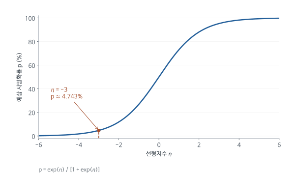

# 수술 성적표 공개 뒤 어떤 환자가 좋은 의사를 만났는가: Yoon (2020) 심층요약

의사별 수술 사망률을 공개하면 환자들이 더 좋은 의사를 선택할 것이라고 기대한다. 그런데 좋은 의사가 하루에 할 수 있는 수술 수가 정해져 있다면 누가 먼저 수술 일정을 잡는지도 중요해진다. 기다릴 수 있는 환자가 일정을 먼저 차지한 뒤 급히 수술해야 하는 환자가 도착하면, 정보 공개의 이익이 모든 환자에게 같은 방식으로 돌아가지 않을 수 있다.

이 논문은 뉴저지 관상동맥우회술(CABG) 성적표 공개 이후 환자 배분이 어떻게 달라졌는지 살펴본다. 의사별 전체 환자 수만 보지 않고, 수술을 기다릴 수 있는 환자와 빨리 수술해야 하는 환자를 나누어 센다. 분석은 세 단계로 진행된다. 먼저 긴급도별로 환자 구성이 바뀌었는지 표로 보이고, 다음으로 의사 선택모형으로 그 변화가 통계적으로 유의한지와 병원 안팎 어디에서 일어났는지 확인하며, 마지막으로 바뀐 배분이 사망자 수로 환산하면 어느 정도인지 계산한다.

[원문 PDF](<Quality information disclosure and patient reallocation in the (2020).pdf>) | [개념 퀴즈](<Quality information disclosure and patient reallocation in the (2020)_QnA.md>) | [수식·모델 퀴즈](<Quality information disclosure and patient reallocation in the (2020)_수식모델퀴즈.md>) | [실무 Cheat Sheet](<Quality information disclosure and patient reallocation in the (2020)_실무CheatSheet.md>)

## 1. 성적표가 공개되어도 좋은 의사의 수술 용량은 제한된다

관상동맥우회술은 좁아지거나 막힌 관상동맥을 우회하는 혈류 통로를 만드는 개흉 심장수술이다. 1990년대 미국 병원의 CABG 평균 사망률은 연 3-4% 수준으로, 흔한 수술 가운데 위험이 큰 편에 속했다(원문 2.1절). 환자에게 의사의 수술 성적을 알려주는 정책은 의료의 질을 높이고 더 나은 선택을 돕는다는 취지로 시행된다. 저자는 이 정책의 효과가 수술 일정과 수술 용량에 따라 달라지는지 묻는다. 같은 정보가 제공되어도 퇴원했다가 원하는 날짜에 다시 올 수 있는 환자와 이번 입원 중에 수술을 받아야 하는 환자는 선택할 수 있는 폭이 다르다.

뉴저지 보건부(NJDOH)는 1997년 11월 병원별, 외과의별 CABG 성적표를 처음 공개했다. 연구는 그 전후에 환자의 긴급도별로 의사 배정이 달라졌는지 분석한다.

자료에서 직접 관찰하는 것은 환자가 실제로 수술받은 의사다. 환자가 성적표를 직접 읽었는지, 의뢰한 의사가 정보를 활용했는지는 관찰하지 않는다. 따라서 공개 이후 의사 이용의 변화를 곧바로 환자 개인이 정보를 얻은 효과라고 부를 수 없다. 이 연구가 평가하는 것은 의뢰와 일정 배정을 포함한 실제 배분 과정 전체의 변화다.

정책 처치는 성적표 공개이며, 환자별로 무작위 배정된 처치가 아니다. 공개는 뉴저지 전체에서 같은 날 시행되었으므로 설계는 한 주 안의 전후 비교다. 공개를 받지 않은 비교집단(comparison group)이 있어야 이중차분(DID)을 쓸 수 있는데, 저자는 다른 주 자료를 구하지 못해 이 설계를 쓸 수 없었다고 밝힌다(5.3절, 인쇄 653쪽). 그래서 이 문서도 논문의 분석을 DID라고 부르지 않는다. 뒤에서 보는 선택모형은 "공개 전 품질 기울기와 공개 후 품질 기울기의 차이"를 추정하며, 같은 시기에 뉴저지에서 함께 일어난 다른 변화는 이 차이와 분리되지 않는다.

정보 공개의 기대효과는 환자가 좋은 의사를 찾고 의사가 성적을 개선하려 노력한다는 데 있다. 그런데 의사 한 명이 일정 기간에 할 수 있는 수술 수는 제한된다. 수술실, 마취팀, 중환자실도 함께 필요하다. 공개 후 좋은 의사를 원하는 사람이 늘어도 모든 환자가 그 의사에게 갈 수는 없다. 누가 먼저 일정을 잡고 누가 기다릴 수 있는지가 실제 배분을 결정한다.

이 때문에 평균 사망률과 환자 배분을 따로 살펴야 한다. 모든 의사의 실력이 좋아져 평균 사망률이 낮아지는 동시에, 가장 위험한 환자가 상대적으로 질이 낮은 의사에게 옮겨 갈 수 있다. 논문은 정보가 공개되었다는 사실에서 곧바로 모든 환자가 이익을 얻었다는 결론으로 넘어가지 않고, 제한된 수술 용량 아래 누가 더 좋은 의사를 이용하게 되었는지 묻는다.

저자가 이 문제를 걱정하는 이유는 경제학의 정렬 매칭(assortative matching) 개념과 연결된다. 환자의 중증도와 의사의 실력이 서로 보완적이면, 즉 중환자일수록 좋은 의사에게서 얻는 생존 이득이 크면, 가장 아픈 환자를 가장 좋은 의사에게 짝지을 때 전체 생존자가 가장 많아진다. 이를 양의 정렬 매칭이라고 한다. 성적표가 이 짝짓기를 흐트러뜨린다면 평균 품질이 올라가도 배분 면에서는 손실이 생긴다.

## 2. 환자가 병원과 외과의를 만나기까지의 진료 과정

수술 환자가 처음부터 모든 외과의를 자유롭게 비교하는 상황은 현실과 다르다. 원문 2.1절에 따르면 의뢰는 두 단계로 이루어진다. 흉통을 느낀 환자를 일차 진료의(referring physician)가 심장내과의에게 보내고, 심장내과의는 도관검사로 막힌 혈관 수를 확인한 뒤 풍선확장술로 끝낼지 CABG를 할지 정한다. CABG로 결정되면 검사 직후 두 번째 의뢰가 이루어져 심장외과의가 수술 일정을 잡는다. 대부분의 심장내과의는 CABG가 가능한 병원 한두 곳에만 소속되어 있으므로, 첫 단계에서 심장내과의가 정해지면 실제로 고를 수 있는 외과의는 그 병원 소속으로 좁혀진다. 최종 표본에서 약 79%는 도관검사를 받은 병원의 외과의에게 수술받았고, 약 16%는 CABG를 하지 않는 병원에서 검사받은 뒤 심장내과의가 소속된 CABG 병원으로 옮겨졌으며, 소속과 무관한 병원으로 간 환자는 약 5%였다(원문 3절). 이 과정을 알아야 이후 조건부 로짓에서 환자별 선택집합을 따로 정하는 이유를 이해할 수 있다.

두 번째 의뢰에서 심장내과의는 환자의 긴급도를 따진다. 기록상 긴급도는 세 등급이다.

- elective: 상대적으로 기다릴 수 있는 예정 수술 환자다. 퇴원했다가 원하는 외과의가 비는 날에 수술을 잡을 수 있다.
- urgent: 같은 입원 중 수술해야 하는 긴급 환자다. 약물이나 시술로 상태를 안정시킬 수 없어 퇴원하지 못한다.
- emergent: 더 즉각적인 수술이 필요하며, 그날 당직인 외과의가 수술하므로 환자나 의뢰의가 의사를 고를 여지가 거의 없다.

원문 5.5절의 자료에서 도관검사부터 수술까지 걸린 기간은 예정환자가 평균 약 13일, 긴급환자가 약 4일이었다. 저자가 인터뷰한 외과의는 일정이 가득 찼을 때 새 긴급환자는 다른 외과의를 찾아야 하며, 긴급환자 때문에 이미 잡힌 예정수술을 다른 날로 옮기는 일은 드물다고 말했다. 이 증언이 뒤에서 검증할 용량 가설의 출발점이다.

자료의 관측 단위는 환자 $i$이고, 선택 대안은 외과의 $j$, 병원은 $h$, 날짜는 $t$로 표기한다. 선택모형에 들어가는 자료는 환자 한 명마다 후보 외과의 수만큼 행을 갖는다. 실제로 수술한 외과의의 행에는 1, 선택되지 않은 후보의 행에는 0이 기록된다. 뒤의 표에 나오는 N은 환자 수이며, 이런 대안별 행의 수와는 다르다.

자료는 두 가지를 합친 것이다. 하나는 1994-1999년 뉴저지 환자 단위 퇴원자료로 진단 및 시술 코드, 병원 내 사망, 인구학 변수, 외과의 식별(identification)자가 들어 있다. 다른 하나는 같은 기간 뉴저지 개심술 등록자료(OHS Registry)로 환자 위험요인, 긴급도, 도로명 주소, 의뢰 심장내과의 식별자가 들어 있다. 원문 3절의 합병 표본은 1994-1999년 43,579명이다. 1994년 자료는 직전 1년 성적 같은 시간가변 변수와 위험모형 추정에 쓰고, 주 분석 기간은 1995-1999년이다. 1995-1999년 가운데 의뢰 심장내과의와 도관검사일을 식별할 수 있는 표본은 35,031명, 외과의 87명이다. 공개 전후 같은 의사 집합을 비교하려면 중간에 떠나거나 들어온 의사를 빼야 한다. 첫 성적표에 올랐으나 1994년 이후 떠난 12명과, 환자 수가 적거나 공개 뒤 진입해 첫 성적표에서 평가받지 않은 42명을 제외하면 최종 기본 표본은 환자 23,922명, 외과의 33명, 병원 14곳, 심장내과의 735명이다. 이 표본에서 예정환자는 45.1%, 긴급환자는 49.6%, 응급환자는 5.3%이고 병원 내 사망률은 4.0%다(Table 1). 매칭 후 분석 표본 크기는 모형에 따라 더 줄어든다.

이 긴급도 분류는 의사가 치료하기 어려운 정도와도 구별된다. 비교적 안정적인 예정환자에게 만성질환이 많을 수 있고, 긴급환자는 위험수준과 별도로 대기시간의 제약을 받는다. 그래서 저자는 긴급도와 환자의 임상 위험(중증도)을 함께 살핀다. 두 개념을 같은 중증도 변수로 취급하면 성적 관리를 위해 위험한 환자를 피하는 행동과 일정 용량 부족을 구별하기 어렵다.

병원을 먼저 정한 뒤 외과의가 정해지는 과정도 중요하다. 좋은 의사가 다른 병원에 있다는 정보가 있어도 환자의 상태나 의뢰 관계 때문에 옮기기 어려울 수 있다. 의사 성적과 환자 선택의 관계를 볼 때에는 병원 사이의 이동과 같은 병원 안의 의사 배분을 구분해야 한다. 이 논문의 선택모형이 병원 수준의 질과 외과의 수준의 질을 따로 넣는 이유다.

## 3. 위험한 환자를 많이 진료한 의사에게 불이익을 주지 않는 성적 지표

의사 A의 사망률이 B보다 높아도 A가 더 위중한 환자를 맡았다면 의료의 질이 낮다고 결론 내리기 어렵다. 위험조정 사망률(RAMR)은 환자의 수술 전 상태로 예상되는 사망률과 실제 사망률을 비교해 이 차이를 보정한다. 이후 선택모형은 환자가 이 지표가 낮은 의사를 더 많이 이용했는지 추정하므로 지표의 방향부터 확인해 둔다. 원문 식 (2)의 정의는

$$
RAMR_j=\frac{OMR_j}{EMR_j}\times\overline{OMR}_{state}
$$

이다. $OMR_j$는 의사 $j$의 관측 사망률, $EMR_j$는 그 의사가 맡은 환자들의 위험요인으로 예측한 사망률, 마지막 항은 주 전체 관측 사망률이다. 마지막 항은 모든 의사에게 같은 상수이므로 의사 간 순위는 관측 대 예상 비율 $OMR_j/EMR_j$만으로 정해진다. 상수를 곱하는 이유는 비율을 다시 사망률 단위(%)로 되돌려 읽기 쉽게 하려는 데 있다.

학습용 계산으로, 의사 A의 관측 사망률이 3%, 예상 사망률이 6%, 주 전체 사망률이 4%라고 하자.

$$
RAMR_A=(0.03/0.06)\times0.04=0.02=2\%.
$$

예상 위험에 비해 사망이 절반이므로 조정 후 성적은 주 평균 4%보다 좋은 2%가 된다. RAMR는 낮을수록 좋은 품질이다. 원문은 이 지표를 $q_j$로 쓰는데, 영어의 quality에서 따온 기호라서 값이 클수록 품질이 좋다고 오해하기 쉽다. $q_j$가 클수록 품질은 나쁘다.

같은 논리를 숫자로 보면 다음과 같다. 의사 A의 환자 100명 중 5명, 의사 B의 환자 100명 중 2명이 사망했다고 하자. 환자 특성으로 예상한 사망자가 A는 10명, B는 1명이었다면 A는 기대의 절반, B는 기대의 두 배가 사망한 것이므로 위험을 고려한 성적은 관측 사망률의 순서와 반대가 된다.

첫 성적표는 1994-1995년 수술을 대상으로 이 기간 100건 이상 수술한 외과의 48명과 병원 13곳의 RAMR를 실었다. 논문의 품질 변수 $q_j$는 이 첫 성적표의 RAMR로 고정되며, 분석 기간 내내 바뀌지 않는다. 그래서 선택모형은 이 고정된 품질에 대한 환자 배분의 기울기가 공개 전후에 어떻게 변했는지를 본다. 최종 표본 33명의 RAMR는 평균 3.325%, 최소 1.56%, 최대 5.75%다(Table 1).

환자가 이 지표가 낮은 의사를 선호하면 선택모형에서 RAMR 계수는 음수가 된다. 양의 계수를 좋은 의사 선호가 강해졌다고 읽으면 지표의 방향을 거꾸로 해석한 것이다. 위험조정은 관측한 위험요인이 충분하고 예측모형이 적절할 때 의미가 있다. 기록되지 않은 중증도가 특정 의사에게 몰려 있으면 의사 품질과 환자 위험을 완전히 분리하지 못한다.

저자는 성적표의 RAMR와 별도로 자신의 위험모형(4절)으로 예측한 사망확률을 합산해 $EMR_j$를 직접 계산한 품질 지표도 만든다. 성적표에 오르지 않은 의사의 품질은 공개되지 않았으므로, 모든 의사의 공개 전후 품질 개선을 비교하는 원문 6절에서는 이 자체 지표를 쓴다.

## 4. 환자의 특성을 예상 사망확률로 바꾸는 로짓모형

위험조정에 필요한 예상 사망률과 뒤에서 쓰는 환자 중증도(severity)는 환자의 나이와 건강상태 등으로 계산한다. 사망 여부는 0 또는 1이지만 확률은 0과 1 사이여야 한다. 로짓모형은 특성을 선형으로 더한 점수를 이 범위의 확률로 변환한다. 아래에서는 선형 점수, 확률, 여러 환자의 평균 예상 사망률이 어떻게 연결되는지를 차례로 본다.

저자의 위험모형은 흉부외과학회(STS)의 2008년 위험모형을 바탕으로 하며, 뉴저지 성적표가 쓴 모형보다 위험요인이 훨씬 자세하다. 여기에 외과의 고정효과(fixed effects)와 반기 고정효과를 넣는다. 같은 위험요인의 환자라도 더 좋은 외과의에게 수술받으면 사망확률이 낮으므로, 외과의 효과를 빼지 않으면 좋은 의사의 환자가 실제보다 건강하게 추정된다. 반기 고정효과는 모든 의사에게 공통인 시기별 변화를 흡수한다.

$$
\eta_{ijt}=Z_i'\beta+S_j+T_t,\qquad
\log\frac{p_{ijt}}{1-p_{ijt}}=\eta_{ijt}.
$$

$\eta_{ijt}$는 로짓의 선형지수, $p_{ijt}$는 외과의 $j$에게 반기 $t$에 수술받은 환자 $i$의 병원 내 사망확률이다. $Z_i'\beta$는 나이, 성별, 질환 등 위험요인 벡터 $Z_i$에 계수 벡터 $\beta$를 곱해 더한 값이며, 프라임은 두 벡터의 곱이 하나의 숫자가 되도록 행과 열을 맞추는 표기다. $S_j$는 외과의 고정효과다. 위 식의 $T_t$는 반기 고정효과이며 원문 식 (1)은 이를 $Y_t$로 쓴다. 원문 식 (3) 이후에 나오는 $T_t$는 공개 전후 기간 더미 벡터이므로 이 식의 $T_t$와 다른 대상이다. 이 문서의 8절은 기간 더미를 $Post1_t$, $Post2_t$, $Post3_t$로 따로 적어 혼동을 피한다.

로짓식은 선형지수를 확률로 바로 주지 않고 로그 오즈로 준다. 확률을 얻으려면 로그를 풀고 $p$에 관해 정리한다.

$$
\frac{p}{1-p}=e^\eta,
\quad p=e^\eta(1-p),
\quad p(1+e^\eta)=e^\eta,
\quad p=\frac{e^\eta}{1+e^\eta}.
$$

첫 단계는 양변에 지수함수를 씌운 것이고, 둘째는 양변에 $1-p$를 곱한 것, 셋째는 $p$가 들어간 항을 왼쪽으로 모은 것이다. 선형지수와 확률은 이처럼 다른 양이다. 원문은 환자 severity 예측을 $Z_i'\widehat\beta$로 축약 표기하면서 확률 척도로 설명하는 부분이 있다. Figure 2의 가로축 이름이 Patient Severity (Prob(death))이고 경계값이 0.046과 0.247인 것을 보면 실제 계산값은 위 변환을 거친 확률이다. 이 축약 표기를 그대로 확률로 계산하면 값이 크게 틀린다. 예를 들어 $\eta=-3$이면 확률은 약 4.743%이고, -3%가 아니다.

원문은 이 severity를 "intrinsic" 중증도라고 부른다. 외과의 고정효과 $S_j$를 빼고 환자 위험요인 부분만 쓴다는 뜻이며, 같은 환자라면 어느 의사를 만났는지와 무관하게 같은 값을 갖게 하려는 설계다. 다만 확률로 바꿀 때 상수항, 외과의 효과, 반기 효과를 어떤 값에 두었는지는 원문에 적혀 있지 않다.

로짓모형의 입력값은 환자의 관측 특성이지만 출력은 0과 1 사이의 사망확률이다. 선형회귀의 예측값을 그대로 확률로 쓰면 음수나 1보다 큰 값이 나올 수 있어 이런 연결함수를 사용한다. 예측확률을 환자들에 걸쳐 합하면 해당 환자 구성에서 예상되는 사망자 수를 얻는다. 3절의 $EMR_j$는 이 합을 환자 수로 나눈 값이다. 한 환자의 예측확률이 0.08이라는 것은 같은 특성의 환자 100명 가운데 평균적으로 약 8명의 사망을 예상한다는 뜻이다.

### 위험모형 계수를 확률 변화로 옮기기

원문 Table 2의 계수는 로그 오즈 단위다. 계수 $b$는 다른 조건이 같을 때 해당 위험요인이 있으면 사망 오즈가 $e^b$배가 된다는 뜻이다. 투석 중인 신부전은 2.08이므로 오즈가 약 8.0배, 심인성 쇼크는 1.40이므로 약 4.06배, 나이는 0.038이므로 한 살마다 약 1.04배다. 오즈비(odds ratio)가 같아도 확률 증가폭은 출발점에 따라 다르다. 교육용 계산으로, 심인성 쇼크가 없을 때의 사망확률이 2%인 환자에게 쇼크가 생기면 확률은 약 7.6%로 5.6%p 오르지만, 원래 확률이 20%인 환자라면 약 50.3%로 30%p 가까이 오른다. 계수 1.40을 "사망확률 1.40%p 증가"로 읽으면 두 경우 모두 틀린다.

모형의 예측력은 c-statistic 0.868로 보고된다. c-statistic은 사망한 환자와 생존한 환자를 한 명씩 무작위로 뽑았을 때 사망한 환자의 예측확률이 더 높을 확률이다. 0.5는 동전 던지기 수준이고 1은 완벽한 구분이다. 뉴저지 성적표 모형의 0.78보다 높다는 것이 저자가 자체 모형을 쓰는 근거다. 저자는 한계도 적는다. 외과의가 관측되지 않는 위험요인으로 환자를 골라 받는다면 중증도가 과소 또는 과대 추정되고, 그만큼 의사 품질도 잘못 측정된다(원문 3.1절).

반기 고정효과도 같은 방식으로 읽는다. 1994년 상반기를 기준으로 1998년 하반기의 계수는 -0.42이며, 같은 환자라도 사망 오즈가 약 0.66배라는 뜻이다. 이 계수들은 10절에서 공개 뒤 품질 개선의 근거로 다시 등장한다.

여기서 위험예측과 의사 선택은 서로 다른 결과변수를 설명하는 모형이다. 위험예측은 환자 특성을 반영한 건강위험을 만들고, 선택모형은 그 환자가 어떤 외과의를 이용했는지 설명한다. 두 모형에 모두 로짓이라는 이름이 붙지만 확률이 나뉘는 대안이 다르다. 위험모형에서는 생존과 사망이라는 두 결과 상태, 선택모형에서는 환자가 이용할 수 있는 여러 외과의가 대안이다.

<!-- learning-figure:logit-probability -->

*그림 설명: 본문의 로짓 변환식을 그렸다. 논문에서 추정한 환자별 위험 분포는 아니다.*

가로축은 확률이 아닌 선형지수다. 선형지수 -3을 세로축으로 옮기면 약 4.743%가 된다. 같은 크기로 지수가 변해도 곡선의 가운데와 양 끝에서 확률 변화폭이 다르므로, 로짓계수를 일정한 확률 증가분으로 읽으면 안 된다.

<!-- /learning-figure -->

## 5. 긴급도 분류가 달라진 연도의 환자를 비교하기 위한 매칭

정책 전후 긴급환자 비중이 달라졌다고 해서 실제 환자가 더 위중해졌다고 바로 판단할 수는 없다. 기록상 긴급도 분류 기준이 달라졌을 수 있기 때문이다. 이 논문에서 매칭은 연도 간에 임상 특성이 비슷한 환자끼리 비교하도록 표본을 다시 구성하는 데 쓰인다. 성적표를 본 사람과 보지 않은 사람을 무작위실험처럼 만드는 절차와는 목적이 다르다.

Table 3에서 기록된 urgent 비중은 1995년 37.59%에서 1999년 60.71%로 증가하고, elective 비중은 55.86%에서 35.21%로 줄었다. 저자가 연도별 자료 수집 양식을 확인한 결과, 1994-1995년 자료는 병원마다 STS 정의나 자체 기준을 썼고, 1998-1999년 자료부터는 뉴저지 보건부가 급성심근경색, 대동맥내풍선펌프(IABP), 정맥 니트로글리세린을 쓰는 불안정협심증 환자를 명시적으로 urgent로 분류하는 자체 정의를 도입했다. 이 정의 변경이 매칭을 도입하게 된 구체적인 자료상의 문제다.

이 상태로 전후 urgent 환자를 비교하면 이름이 같은 집단의 구성부터 달라진다. 저자가 든 예는 다음과 같다. 1995년 기준이었다면 elective로 분류되었을 환자가 1999년 자료에서 urgent로 기록되고, 이런 환자가 의사 품질에 둔감하다면, 1999년의 urgent 집단은 실제 선호 변화가 없어도 1995년보다 품질에 둔감한 것처럼 보인다. 이런 오염을 줄이려고 저자는 elective와 urgent를 나누고 기준연도에 속할 확률을 환자 위험요인으로 추정한다.

$$
e_r(X_i)=P(\text{기준연도 환자}=1\mid X_i,\text{urgency 유형}=r).
$$

$X_i$는 환자 $i$의 위험요인 벡터, $r$은 elective 또는 urgent다. 이 확률을 로지스틱 회귀로 추정한 결과가 원문 Table 4다. urgent의 기준연도는 1995년, elective는 1999년이다. 1995년은 urgent 환자 수가 가장 적은 해이고 1999년은 elective 환자 수가 가장 적은 해이므로, 각 유형이 가장 좁게 정의되어 오염이 가장 적은 집단으로 본 것이다. Table 4의 계수가 이 판단을 뒷받침한다. urgent 열에서는 울혈성 심부전(0.27), 심인성 쇼크(0.57), 급성심근경색(0.25)이 1995년 소속 확률을 높인다. 1995년 urgent 환자가 다른 해보다 더 급한 상태였다는 뜻이다. elective 열에서는 IABP(-0.79), 불안정협심증(-0.65), 급성심근경색(-0.84)이 1999년 소속 확률을 낮춘다. 1999년 elective 환자가 다른 해보다 덜 급한 상태였다는 뜻이다.

다음으로 각 유형 안에서 다른 연도의 환자를 기준연도 환자와 일대일 비복원 매칭한다. 기준연도 환자 한 명마다 성향점수(propensity score)가 가장 가까운 다른 연도 환자 한 명을 짝으로 고르고, 한 번 짝이 된 환자는 다시 쓰지 않는다는 뜻이다. 그 결과 매칭 표본에서는 연도마다 urgent 환자가 1995년과 같은 1,735명, elective 환자가 1999년과 같은 1,606명씩 남는다. 짝을 찾지 못한 나머지 환자는 분석에서 빠진다. emergent는 정의가 바뀌지 않았고 Table 3에서도 비중이 급변하지 않아 이 매칭을 적용하지 않고 전원을 쓴다(각주 14).

매칭 뒤 균형은 Rubin의 B와 R로 점검한다. 일반적으로 B는 두 집단 성향점수 선형지수의 평균 차이를 표준편차로 나누어 100을 곱한 값이고, R은 두 집단 성향점수 분산의 비율이다. 흔히 B는 25 미만, R은 0.5와 2 사이면 충분하다고 본다. 이 기준값은 Rubin(2001)의 일반적 기준이며 원문에는 수치가 적혀 있지 않다. urgent 매칭은 B 9.7, R 1.05, elective 매칭은 B 16.8, R 1.52로 모두 이 범위 안이다. 원문 Figure 4는 위험요인별 균형을 그림으로 보인다.

여기서 성향점수는 좋은 의사를 선택할 확률도, 성적표를 직접 읽을 확률도 아니다. 매칭은 전후 환자 구성을 비교 가능하게 만드는 전처리다. 매칭 뒤의 비교는 "1995년 기준 urgent와 비슷한 위험요인을 가진 urgent 환자"와 "1999년 기준 elective와 비슷한 위험요인을 가진 elective 환자"를 연도별로 추적한다. 관측한 위험요인으로 설명되지 않는 분류 변화까지 제거한다는 보장은 없다.

매칭이 해결하지 못하는 문제도 분명하다. 성적표는 주 전체에 공개되었으므로 매칭을 해도 공개를 받지 않은 비교집단이 생기지 않는다. 매칭 뒤의 결과는 환자 구성 변화라는 대안 설명을 줄여 주지만, 같은 시기에 일어난 수술기술 변화나 병원 운영 변화까지 제거하지는 못한다.

## 6. 전체 환자 수가 같아도 수술을 받는 환자의 구성은 달라진다

좋은 의사가 매년 100명을 수술한다고 하자. 이전에는 대기 가능한 환자 40명과 긴급환자 60명이었고 이후에는 각각 60명과 40명이었다면 정책 이후 배분은 크게 달라진 것이다. 전체 환자 수만 보면 이 변화를 찾지 못한다. 저자가 긴급도별 환자 수와 의사 품질을 함께 보는 이유다.

Table 5의 매칭 표본에서 높은 품질 의사의 elective 환자는 1,386명에서 1,606명으로 220명 증가한다. 반면 urgent 환자는 1,987명에서 1,736명으로 251명 감소한다. 낮은 품질 의사에게서는 반대 방향의 이동이 나타나, 두 집단이 수술 용량을 두고 경쟁했을 가능성을 검토하게 된다.

$$
220/3212\approx0.06849,\qquad251/3470\approx0.07233.
$$

분모는 해당 시기 매칭 표본의 elective 전체 3,212명과 urgent 전체 3,470명이다. 공개 뒤 elective의 약 6.8%가 높은 품질 집단 쪽으로, urgent의 약 7.2%가 낮은 품질 집단 쪽으로 옮겨 간 것에 해당한다. 원문 4.2절도 같은 비율을 보고한다. 의사 집단의 총수술량은 거의 그대로여도 누가 좋은 의사의 수술을 받았는지는 긴급도 기준으로 7% 안팎 바뀌었다.

이 표는 구성 변화를 모형 없이 보여준다. 매칭과 전후 비교에 남은 가정이 있으므로 숫자만으로 인과경로가 식별되는 것은 아니다.

220명과 251명이 원표의 어디에 있는지 보면, 전체 환자 수는 거의 그대로인데 긴급도별 구성만 바뀌었다는 설명을 직접 확인할 수 있다. 원문 Table 5는 PDF 12쪽(인쇄 647쪽)에 있고, 매칭 전 최종 표본과 성향점수 매칭 표본의 두 패널로 되어 있다. 원표가 넓어 아래에서는 매칭 전 패널, 매칭 표본의 환자 수, 매칭 표본의 사망률로 나누어 옮겼다. 세 표를 합치면 원표의 모든 행과 열이 들어가며 값은 바꾸지 않았다.

*원문 Table 5 위 패널(Nonmatched sample) 전체. PDF 12쪽. 단위: 환자 수(명)*

| 의사 집단 | 1995-1996 elective | 1995-1996 urgent | 1995-1996 합계 | 1998-1999 elective | 1998-1999 urgent | 1998-1999 합계 |
|---|---:|---:|---:|---:|---:|---:|
| High quality | 2,111 | 2,343 | 4,454 | 1,781 | 2,701 | 4,482 |
| Low quality | 2,809 | 1,779 | 4,588 | 1,778 | 2,835 | 4,613 |
| Total | 4,920 | 4,122 | 9,042 | 3,559 | 5,536 | 9,095 |

*원문 Table 5 아래 패널(Propensity score-matched sample) 중 환자 수와 Difference 열. PDF 12쪽. 단위: 환자 수(명)*

| 의사 집단 | 1995-1996 elective | 1995-1996 urgent | 1995-1996 합계 | 1998-1999 elective | 1998-1999 urgent | 1998-1999 합계 | $\Delta$Elective | $\Delta$Urgent |
|---|---:|---:|---:|---:|---:|---:|---:|---:|
| High quality | 1,386 | 1,987 | 3,373 | 1,606 | 1,736 | 3,342 | 220 | -251 |
| Low quality | 1,826 | 1,483 | 3,309 | 1,606 | 1,734 | 3,340 | -220 | 251 |
| Total | 3,212 | 3,470 | 6,682 | 3,212 | 3,470 | 6,682 | (공란) | (공란) |

*원문 Table 5 아래 패널 중 관측 사망률 열. PDF 12쪽. 단위: %*

| 의사 집단 | 1995-1996 elective | 1995-1996 urgent | 1998-1999 elective | 1998-1999 urgent |
|---|---:|---:|---:|---:|
| High quality | 2.81 | 3.17 | 1.81 | 2.48 |
| Low quality | 3.23 | 6.81 | 2.49 | 4.21 |
| Total | 3.05 | 4.73 | 2.15 | 3.34 |

행은 원문 주석의 정의를 따른다. High quality는 1994-1995년 성적표의 RAMR가 3.18%보다 낮은 외과의 17명, Low quality는 3.18%보다 높은 16명이다. 분류는 첫 성적표로 한 번 정해지고 바뀌지 않으므로 1998-1999년 열도 같은 의사 집단을 추적한 값이다. 환자 수 칸은 비율이 아니라 그 기간에 해당 집단 의사에게 수술받은 환자의 인원이다. 1997년은 공개를 앞두고 병원과 의사가 성적표 자료를 검증하던 과도기여서 두 시기 어디에도 들어가지 않는다.

매칭 전 패널에서 높은 품질 집단의 합계는 4,454명에서 4,482명으로 28명, 낮은 품질 집단은 4,588명에서 4,613명으로 25명 늘었을 뿐이다. 총량이 거의 변하지 않았다는 말은 이 숫자를 가리킨다. 그런데 같은 패널의 Total 행에서는 elective가 4,920명에서 3,559명으로 줄고 urgent가 4,122명에서 5,536명으로 늘었다. 5절에서 설명한 긴급도 정의 변경이 섞인 변화이므로, 저자는 각주 15에서 이 패널로 환자 구성 변화를 판단하지 않는다고 밝힌다.

매칭 표본에서는 Total 행이 두 시기 모두 elective 3,212명, urgent 3,470명으로 같다. 5절의 매칭 규칙 때문이다. urgent는 1995년 1,735명과 1996년 매칭 환자 1,735명을 더해 3,470명, 1998-1999년도 1,735명씩 3,470명이다. elective는 1999년 1,606명을 기준으로 하므로 각 시기가 $2\times1606=3212$명이다. 그래서 한 의사 집단의 증가는 다른 집단의 감소와 정확히 같은 크기가 된다. 높은 품질 집단의 elective는 $1606-1386=220$명 늘고 urgent는 $1736-1987=-251$명 줄었으며, 낮은 품질 집단 행은 부호만 반대인 -220과 251이다. 이 값은 집단별 순변화다. 실제로 어떤 환자가 어느 의사에게서 옮겨 갔는지 추적한 숫자는 아니다.

사망률 칸은 병원 내 관측 사망률(%)이며 위험조정을 거친 값이 아니다. 표준오차(standard error)나 검정 결과도 붙어 있지 않다. 공개 전 urgent 환자의 사망률은 높은 품질 집단에서 3.17%, 낮은 품질 집단에서 6.81%로 3.64%p 차이가 난다. 같은 시기 elective의 차이는 $3.23-2.81=0.42$%p에 그친다. 중증 환자에서 의사 집단 간 차이가 더 크다는 점은 원문 3.3절의 논의와 연결된다. 다만 이 표의 단순 사망률 차이를 의사의 인과효과로 확정할 수는 없다. 10절의 추가 사망 계산은 이 두 차이를 251명과 220명에 곱한 것이다.

Total 행의 사망률은 두 의사 집단을 환자 수로 가중평균(weighted average)한 값이다. 예를 들어 공개 전 elective는 $(1386\times2.81+1826\times3.23)/3212\approx3.05$다. 10절 각주 31의 3.92%와 2.77%도 이 Total 행을 elective와 urgent 인원으로 다시 가중평균하면 나온다.

$$
(3212\times3.05+3470\times4.73)/6682\approx3.92,\qquad(3212\times2.15+3470\times3.34)/6682\approx2.77.
$$

이 표로 말할 수 있는 것은 두 가지다. 긴급도별 전체 규모를 고정하면 높은 품질 집단의 환자 구성이 elective 쪽으로 기울었고, 두 시기 모두 urgent에서 의사 집단 간 사망률 차이가 더 컸다. 이 변화가 통계적으로 유의한지는 이 표로 판단할 수 없으며, 검정은 8절의 선택모형(Table 8, Table 9)이 맡는다. 사망률이 관측값이므로 같은 urgent 안에서도 낮은 품질 집단에 더 중증인 환자가 배정되었다면 차이의 일부는 환자 위험의 차이일 수 있다. 전후 비교라서 1997년 전후에 함께 일어난 다른 변화도 이 표에서는 분리되지 않는다.

좋은 의사의 전체 수술 수가 변하지 않았다는 결과를 "정보 공개에 아무 반응이 없었다"고 해석하면 구성 변화를 놓친다. 기존 CABG 성적표 연구 다수가 시장점유율 변화가 작거나 없다고 보고했는데, 저자는 의사들이 이미 용량 한계에 있거나 그 근처에서 일하고 있었다면 점유율이 변하지 않을 수 있다고 본다(원문 1절). 예약 가능한 예정환자 수가 늘고 긴급환자 수가 비슷한 크기로 줄면 총량은 그대로여도 서로 다른 환자가 의사를 이용하게 된다.

좋은 의사에게 새로 배정된 예정환자가 상대적으로 건강하고 밀려난 긴급환자가 더 위험하다면, 같은 한 자리의 이동이라도 건강상 가치가 같지 않다. 예정환자 한 명이 더 좋은 의사를 만나 얻는 이익과 긴급환자 한 명이 그 의사를 이용하지 못해 잃는 이익을 따로 계산해 더해야 한다. 이 논문이 수술 건수 변화와 환자 위험을 결합하여 추가 사망을 계산하는 이유가 여기에 있다.

## 7. 환자에게 선택 가능한 의사들 사이의 확률을 계산하기

Table 5는 변화의 방향을 보여주지만 병원 차이, 거리, 의사의 최근 수술 건수 같은 다른 요인을 통제하지 않았고 표준오차도 없다. 이 요인을 통제하고 통계적 유의성을 확인하려고 저자는 선택모형을 쓴다. 어떤 의사를 선택할 확률은 그 의사의 성적뿐 아니라 다른 선택지의 성적과 거리에도 달려 있다. 조건부 로짓은 환자마다 선택 가능한 의사들을 나열하고 각 의사의 상대적 매력을 비교하는 모형이다. 아래 식의 분모는 그 환자가 선택할 수 있는 모든 의사를 포함하므로, 한 의사의 점수가 올라가면 다른 의사의 확률도 함께 달라진다.

$$
u_{ij}=V_{ij}+\epsilon_{ij},\qquad
P_{ij}=\frac{\exp(V_{ij})}{\sum_{k\in C_i}\exp(V_{ik})}.
$$

$u_{ij}$는 환자 $i$가 의사 $j$에게 수술받을 때의 효용, $V_{ij}$는 관측 변수로 설명되는 체계적인 부분, $\epsilon_{ij}$는 연구자가 관측하지 못하는 부분이다. $C_i$는 환자 $i$의 선택 가능한 의사 집합이다. 후보 전체의 지수화한 점수를 더해 나누므로 확률의 합은 1이 된다. 이 확률식은 $\epsilon_{ij}$가 서로 독립이고 type-I extreme-value 분포를 따른다는 조건부 로짓의 분포 가정에서 나온다. 모든 선택모형에 성립하는 정의는 아니다. 이 논문의 자료에서 효용은 환자 본인의 선호만이 아니라 심장내과의의 의뢰와 외과의의 일정까지 반영한 배정 결과를 요약하는 점수로 읽는 편이 정확하다.

두 의사 A와 B만 있다고 하자. 점수가 $V_A=1,V_B=0$이면 A의 선택확률은 $e/(e+1)\approx0.7311$이다. A 점수가 0.1 증가하면 확률은 $e^{1.1}/(e^{1.1}+1)\approx0.7503$이다. 확률은 약 1.9%p 올랐으므로, 계수 0.1을 확률 10%p 증가라고 읽을 수 없다.

대신 두 대안의 상대 로그확률은

$$
\log(P_{ij}/P_{ik})=V_{ij}-V_{ik}
$$

로 단순해진다. 두 확률의 분모가 같은 선택집합의 합이므로 비율에서 사라지고, 로그가 지수함수를 되돌리기 때문이다. 이 성질 때문에 계수는 확률 증가폭보다 두 대안 사이의 상대 오즈로 옮기기가 쉽다. 두 의사의 점수 차이가 $b$이면 앞의 의사를 고를 확률은 뒤의 의사를 고를 확률의 $e^b$배다.

이 비율이 다른 대안과 무관하다는 성질에는 대가도 있다. 모형은 어떤 의사가 선택집합에서 빠지면 그 환자가 나머지 의사들에게 기존 확률에 비례해 옮겨 간다고 가정한다. 실제 일정 마감처럼 특정 환자 유형에게만 선택지가 사라지는 상황은 이 가정으로 직접 표현되지 않는다. 논문이 선택모형 결과를 용량 제약과 연결할 때 9절의 일정 자료를 별도로 쓰는 이유 가운데 하나다.

선택확률의 분모에는 그 환자에게 가능한 의사들의 지수가 더해진다. 어떤 의사의 성적이 같아도 가까운 경쟁 의사의 성적이나 병원 이용 가능성이 달라지면 선택확률이 달라질 수 있다. 의사별 특성을 하나씩 평가한 확률을 나중에 합치는 방식과 다르다. 한 환자는 여러 의사 중 한 명에게 수술을 받으므로 확률들이 하나의 선택집합 안에서 연결된다.

환자 자신의 위험도처럼 모든 후보 의사에게 같은 값으로 들어가는 변수는 위 비율 식에서 $V_{ij}-V_{ik}$를 계산할 때 상쇄된다. 그래서 환자 특성이 의사 선택에 미치는 영향은 품질이나 거리처럼 대안마다 다른 변수와 곱한 상호작용으로만 추정할 수 있다. 8절의 모형에서 긴급도와 중증도가 모두 RAMR와 곱해진 형태로만 들어가는 것도 이 때문이다. 실제 의뢰와 용량 제약을 전부 직접 관측하지는 못하므로 계수는 그 제약 아래 실현된 배분을 설명한다.

### 같은 질 개선도 선택확률 변화가 다른 이유

선택지수에서 의사 $j$의 사망률 지표 $q_j$에 계수 $\alpha$가 붙는다고 하자. 다른 대안은 고정하고 $q_j$만 조금 바꾸면 분자뿐 아니라 분모도 바뀐다. $S=\sum_k e^{V_{ik}}$라 두고 몫의 미분법을 적용하면

$$
\frac{\partial P_{ij}}{\partial q_j}
=\frac{\alpha e^{V_{ij}}S-e^{V_{ij}}\alpha e^{V_{ij}}}{S^2}
=\alpha P_{ij}(1-P_{ij}).
$$

분자의 첫 항은 분자 $e^{V_{ij}}$의 미분 $\alpha e^{V_{ij}}$에 분모를 곱한 것이고, 둘째 항은 분모 $S$의 미분에서 $j$ 항만 $q_j$에 의존하므로 $\alpha e^{V_{ij}}$가 된 것이다. 마지막 등호는 $e^{V_{ij}}/S=P_{ij}$를 대입한 결과다.

낮은 사망률을 선호하면 $\alpha<0$이다. 사망률이 내려갈 때 $\Delta q_j<0$이므로 두 음수의 곱이 양수가 되어 선택확률은 높아진다. 선택확률이 이미 0이나 1에 가까우면 $P(1-P)$가 작아 같은 지수 변화의 확률효과(random effects)도 작다.

교육용으로 $\alpha=-2$, 현재 선택확률이 .25이고, 사망률 지표를 확률 단위로 기록했다고 하자. 사망률이 .01, 곧 1%p 내려가면 확률 변화의 일차근사는 $(-2)(.25)(.75)(-.01)=.00375$, 곧 .375%p다. 사망률을 0.03 대신 3으로 입력했다면 계수의 단위가 100배 달라져야 같은 예측이 나온다. 이 논문의 RAMR는 % 단위(예: 3.325)로 들어가므로 계수 1단위는 RAMR 1%p에 대응한다.

다른 의사 $k$의 확률 변화는 $\partial P_{ik}/\partial q_j=-\alpha P_{ik}P_{ij}$다. $j$에게 환자가 더 가면 나머지 대안의 확률은 그만큼 줄어들어 전체 합 1이 유지된다. 이 미분은 주어진 선택집합과 모형 안의 예측이다. 실제 일정 마감으로 선택집합 자체가 바뀌는 용량 제약까지 자동으로 계산한 정책효과는 아니다.

## 8. 성적표 공개 전후에 사망률 지표에 대한 반응이 달라졌는가

성적표 공개 후 좋은 의사 쪽 배정이 강해졌는지 보려면, 공개 전의 품질 기울기와 공개 후에 추가된 기울기를 구분해야 한다. RAMR와 시기 더미의 곱을 넣는 이유가 여기에 있다. 긴급환자와 대기 가능한 환자의 계수를 따로 추정하면 같은 정보 공개가 두 집단의 의사 배정에 어떻게 연결되는지 볼 수 있다.

환자 $i$가 시점 $t$에 병원 $h$의 외과의 $j$를 선택할 때의 체계적인 점수를 $V_{ijht}$로 쓴다. 외과의 RAMR를 $q_j$라 하고, $Post1_t$, $Post2_t$, $Post3_t$는 공개 이후 각 기간이면 1인 지시변수다. 같은 환자 긴급도 집단 안에서 품질 관련 항만 표시하면 다음과 같다.

$$
V_{ijht}=a_0q_j+a_1q_jPost1_t+a_2q_jPost2_t+a_3q_jPost3_t+\cdots.
$$

공개 전 기간에는 모든 Post 더미가 0이므로 RAMR 기울기가 $a_0$이고, Post2 기간에는 $Post2_t=1$이므로 기울기가 $a_0+a_2$다. $a_2$ 혼자서는 Post2의 전체 기울기가 아니며, 공개 전 대비 변화분이다.

생략 부호 자리에 들어가는 통제변수(control variable)도 알아 둘 필요가 있다. $D_{ih}$는 환자 주소에서 병원까지의 거리(마일)이고, $X_{jt}$는 수술일 직전 1년간 해당 외과의의 관측 사망률(One-year OMR)과 수술 건수(One-year case)다. 성적표에 없는 최근 실적을 통제하려는 변수이며, 둘 다 긴급도와 곱해진다. 병원 고정효과를 기간 더미와 곱한 항(Hospital FE × Time FE)은 기간별로 병원의 전체 매력이 달라지는 것을 흡수한다. 병원 효과는 대안인 외과의가 속한 병원에 따라 값이 달라지므로 7절의 상쇄 규칙에 걸리지 않는다. 이 항이 들어가면 RAMR 계수는 같은 병원, 같은 기간 안에서 RAMR가 다른 외과의 사이의 배정 차이로 좁혀진다. 병원 고정효과와 환자 나이, 성별의 곱은 나이와 성별에 따라 선호하는 병원이 다른 것을 흡수한다.

기간 이름도 구분해 둔다. 공개 전 기준기간은 1995-1996년이다. Post1은 의료진이 공개를 예고받은 1997년 1월 1일부터 11월 20일까지이고(보건부 기자회견은 11월 19일, 주요 신문 보도는 11월 20일), Post2는 첫 공개 다음 날부터 두 번째 성적표가 나온 1999년 3월 7일까지, Post3는 그 뒤 1999년 말까지다. Post1 동안 병원과 의사들은 보건부와 함께 성적표 자료를 검증하고 있었으므로, Post1의 변화는 실제 공개를 본 환자의 반응만으로 설명할 수 없다. 저자는 온라인 부록 Table A3에서 예정환자의 배정 변화가 1997년 7월 무렵 시작되었다고 보고한다(각주 24). 이 부록은 보관 PDF에 없어 표 자체를 확인하지 못했다.

### 병원 사이 이동과 병원 안 배분을 나눈 앞 단계 분석

Table 9에 앞서 저자는 두 단계 분석을 한다. 첫째, 원문 식 (3)과 Table 6은 긴급도를 나누지 않고 RAMR 기울기의 변화만 본다. 여기서는 선택집합을 일차 진료의가 소속된 병원들의 외과의 전체(소속 병원이 없으면 뉴저지 외과의 전체)로 넓게 잡아 평균 15.3명, 병원 6.3곳이다. 열 (1)의 RAMR 기준계수는 -0.070으로 공개 전에도 RAMR가 낮은 외과의가 더 많이 선택되었고, Post1-Post3 상호작용은 0.013, -0.0084, 0.0028로 모두 유의하지 않다. 환자를 한데 묶으면 공개 전후 품질 기울기가 바뀌지 않았다는 뜻이며, Table 5에서 집단별 총량이 거의 변하지 않은 것과 같은 모습이다.

둘째, 원문 식 (4)는 외과의 RAMR를 병원 RAMR와의 차이 $q_j-q_h$(원문의 dRAMR)와 병원 RAMR $q_h$로 나눈다. 앞은 같은 병원 안에서 외과의가 병원 평균보다 얼마나 나은지, 뒤는 병원 사이의 품질 차이를 나타낸다. 두 항에 긴급도별 기간 더미를 곱하면 병원 안 배분과 병원 사이 이동의 변화를 따로 추정할 수 있다. 결과는 원문 Table 8(PDF 15쪽)에 있으며, 아래는 dRAMR 계수의 기간별 합계를 교육용으로 계산해 붙인 발췌다.

*원문 Table 8 열 (1) 발췌: dRAMR 계수와 기간별 기울기. 괄호는 robust 표준오차. 기울기 열은 교육용 계산*

| 긴급도 | 기준 | Post1 | Post2 | Post3 | 기울기(기준, Post1, Post2, Post3) |
|---|---:|---:|---:|---:|---|
| Elective | 0.051** (0.023) | -0.13*** (0.041) | -0.19*** (0.036) | -0.21*** (0.043) | 0.051, -0.079, -0.139, -0.159 |
| Urgent | -0.13*** (0.025) | 0.22*** (0.046) | 0.19*** (0.038) | 0.22*** (0.044) | -0.13, 0.09, 0.06, 0.09 |

병원 안에서는 공개 뒤 예정환자가 병원 평균보다 RAMR가 낮은 외과의에게 더 가고, 긴급환자는 반대로 멀어졌다. 병원 사이의 결과는 표본에 따라 다르다. 33명 전체 표본인 열 (1)에서는 병원 RAMR 상호작용에 일관된 패턴이 없다. 저품질과 중간 품질 병원만 남긴 열 (2)에서는 urgent의 병원 RAMR × Post3가 -0.72로 커져, 공개 뒤 긴급환자가 저품질 병원에서 중간 품질 병원으로 옮겨 갔다. Table 7에서도 중간 품질 병원 4곳의 환자 비중은 1995년 31.9%에서 1999년 41.4%로, 저품질 병원 5곳은 27.7%에서 22.6%로 바뀌었다. 같은 열 (2)에서 elective의 병원 RAMR × Post3는 0.62로 양수인데, 저자는 긴급환자가 몰려 중간 품질 병원의 용량이 차면서 예정환자가 저품질 병원으로 밀려난 결과로 해석한다.

병원 사이의 긴급환자 이동은 저품질 병원이 위험한 긴급환자를 돌려보낸 결과일 수도 있다. 저자는 이 설명을 약하게 본다. 1995-1997년과 비교해 1998-1999년에 저품질 병원군에서 중간 품질 병원군으로 옮겨 간 환자가 500명이 넘고, 이는 저품질 병원군의 1996년이나 1997년 환자 수의 20%를 넘는다. 병원이 수익을 포기하면서 이만큼을 돌려보내고도 긴급환자 가운데 더 위중한 환자를 골라내지 않았다고 보기는 어렵다는 것이 저자의 논리다. 저자는 온라인 부록 Table A2에서 이 이동이 중증도와 무관하게 일어났다고 보고한다(각주 22). 1998년 초 보건부가 병원당 연 350건, 외과의당 연 100건의 최소 수술 건수 규제를 제안했다는 점, 이동이 공개 직후인 1997년 4분기에 시작되었다는 점도 근거로 든다. 그래서 저자는 병원 사이 이동을 의뢰의가 성적표를 보고 긴급환자의 병원을 고른 수요 반응으로 해석한다.

두 결과를 합치면 병원 사이에서는 긴급환자가 더 나은 병원으로 옮겨 가면서도, 병원 안에서는 낮은 품질 의사에게 배정될 수 있다. 서로 모순되는 결과가 아니다. 저자의 해석으로는 병원 수준에서 성적표가 긴급환자에게 도움이 되었을 수 있고, 병원 안에서는 손해가 되었다. 식 (4)는 병원 RAMR 외의 병원 특성을 통제하지 못하므로, 저자는 병원 안 배분을 더 자세히 보려고 병원 고정효과를 넣은 식 (5)로 넘어간다. 식 (5)에서는 도관검사 뒤 외과의를 실제로 고르는 심장내과의의 소속 병원으로 선택집합을 좁혀 평균 외과의 5명, 병원 1.8곳이 된다.

### 병원 안 배분과 중증도 상호작용 (Table 9)

Table 9 열 (1)의 urgent는 기준계수 -0.13, Post2 상호작용 0.16이다. 두 값을 더한 Post2 기간의 전체 기울기는 약 0.03이다. 공개 전 RAMR가 낮은 외과의 쪽으로 긴급환자가 쏠리던 관계가 거의 사라진 방향이다. 이 합의 통계적 유의성을 판단하려면 두 계수의 공분산(covariance)이 필요하다. 각 계수의 별표만으로는 합의 유의성을 판단할 수 없다.

elective는 기준 0.024, Post2 -0.15이므로 합은 -0.126이다. 공개 뒤 예정환자가 RAMR가 낮은 외과의 쪽으로 옮겨 간 방향이다. 두 움직임을 함께 보아야 자리 대체를 이해할 수 있다.

위 두 문단은 Table 9의 계수 일부만 사용했다. 표 전체를 보면 기간별 흐름과 표준오차, 그리고 위험환자 회피 가설을 검정한 열 (2)의 결과를 함께 확인할 수 있다. 원문 Table 9는 PDF 17쪽(인쇄 652쪽)에 있다. 아래 두 표는 발췌이며, 통제변수 행(One-year OMR, One-year case, Distance와 각각의 긴급도 상호작용)은 생략했다.

*원문 Table 9 발췌: RAMR 계수. PDF 17쪽. 괄호 안은 robust 표준오차*

| 긴급도 | 항 | (1) 계수 | (1) 표준오차 | (2) 계수 | (2) 표준오차 |
|---|---|---:|---:|---:|---:|
| Elective | RAMR (baseline) | 0.024 | (0.021) | 0.028 | (0.024) |
|  | RAMR $\times$ Post1 | -0.11*** | (0.038) | -0.12*** | (0.044) |
|  | RAMR $\times$ Post2 | -0.15*** | (0.034) | -0.17*** | (0.038) |
|  | RAMR $\times$ Post3 | -0.20*** | (0.047) | -0.24*** | (0.055) |
| Urgent | RAMR (baseline) | -0.13*** | (0.025) | -0.15*** | (0.029) |
|  | RAMR $\times$ Post1 | 0.17*** | (0.043) | 0.22*** | (0.048) |
|  | RAMR $\times$ Post2 | 0.16*** | (0.036) | 0.18*** | (0.040) |
|  | RAMR $\times$ Post3 | 0.16*** | (0.044) | 0.16*** | (0.048) |
| Emergent | RAMR (baseline) | 0.0041 | (0.050) | 0.00087 | (0.058) |
|  | RAMR $\times$ Post1 | 0.051 | (0.096) | 0.057 | (0.11) |
|  | RAMR $\times$ Post2 | 0.14* | (0.086) | 0.050 | (0.11) |
|  | RAMR $\times$ Post3 | 0.018 | (0.096) | -0.024 | (0.12) |
| 공통 | Hospital FE $\times$ Time FE, Hospital FE $\times$ age, Hospital FE $\times$ gender | 모두 Yes |  | 모두 Yes |  |
|  | N | 17,981 |  | 17,981 |  |
|  | Log likelihood | -22,185.3 |  | -22,176.3 |  |

*원문 Table 9 발췌: 열 (2)의 Severity $\times$ RAMR 계수. PDF 17쪽. 열 (1)에는 이 항이 없다*

| 긴급도 | 항 | 계수 | 표준오차 |
|---|---|---:|---:|
| Elective | Severity $\times$ RAMR (baseline) | -0.15 | (0.42) |
|  | Severity $\times$ RAMR $\times$ Post1 | 0.32 | (0.80) |
|  | Severity $\times$ RAMR $\times$ Post2 | 0.93 | (0.60) |
|  | Severity $\times$ RAMR $\times$ Post3 | 1.32 | (0.97) |
| Urgent | Severity $\times$ RAMR (baseline) | 0.51* | (0.31) |
|  | Severity $\times$ RAMR $\times$ Post1 | -1.10** | (0.54) |
|  | Severity $\times$ RAMR $\times$ Post2 | -0.36 | (0.42) |
|  | Severity $\times$ RAMR $\times$ Post3 | -0.015 | (0.50) |
| Emergent | Severity $\times$ RAMR (baseline) | 0.031 | (0.31) |
|  | Severity $\times$ RAMR $\times$ Post1 | -0.059 | (0.59) |
|  | Severity $\times$ RAMR $\times$ Post2 | 0.79 | (0.53) |
|  | Severity $\times$ RAMR $\times$ Post3 | 0.29 | (0.46) |

별표는 원문과 같이 *p<0.1, **p<0.05, ***p<0.01이다.

두 표 모두 원문 식 (5)의 조건부 로짓 추정치다. 종속변수(dependent variable)는 환자가 해당 외과의를 선택했으면 1인 이진변수이고, 선택집합은 의뢰 심장내과의가 소속된 병원의 외과의로 제한되어 평균 약 5명이다(원문 5.2절). 표본은 매칭된 최종 표본이며 N은 17,981이다. 이 숫자는 5절의 매칭 규칙으로 재구성된다. 1995-1999년 다섯 해에 urgent가 해마다 1,735명, elective가 해마다 1,606명이고, 매칭하지 않은 emergent 1,276명을 더하면 $5\times1735+5\times1606+1276=17981$이다. 6절 Table 5의 6,682명은 한 시기(2년)의 elective와 urgent만 센 숫자이고 1997년과 emergent 환자도 빠져 있으므로 두 표의 표본 크기를 같은 기준으로 비교할 수 없다. RAMR는 Table 1에서 % 단위로 기록되어 있고(33명 평균 3.325, 최소 1.56, 최대 5.75), 계수 1단위는 RAMR 1%p 차이에 대응한다.

열 (1)을 기간별로 더하면 흐름이 드러난다. elective의 기울기는 공개 전 0.024에서 Post1 -0.086, Post2 -0.126, Post3 -0.176으로 음수 폭이 커진다. 공개 전에는 예정환자의 배정이 외과의 품질과 거의 무관했다는 뜻이다. 저자는 음수 폭이 기간마다 커진 것을 공개 정보가 점점 더 많이 쓰인 결과로 해석하면서도, 기간 사이의 차이 자체는 통계적으로 유의하지 않다고 적는다(원문 5.2절, 각주 25). urgent는 공개 전 -0.13에서 Post1 0.04, Post2와 Post3 각각 0.03으로 바뀐다. 공개 전에는 긴급환자가 RAMR가 낮은 의사에게 배정되었고, 공개 후에는 예정환자가 그 자리를 차지했다는 본문 해석이 이 부호 전환에 근거한다. 합계의 유의성은 앞서 말한 대로 공분산이 표에 없어 판단할 수 없다.

저자는 이 패턴에서 공개 전 상황도 추론한다. 심장내과의가 성적표 이전부터 누가 좋은 외과의인지 알고 있었고, 그 정보를 위중한 긴급환자에게만 썼으며, 예정환자는 친분 있는 외과의에게 보냈다는 것이다. 성적표는 이 정보를 예정환자 의뢰에도 쓰게 만들었고, 그 결과 좋은 외과의의 일정이 예정환자로 먼저 채워졌다는 해석이다.

### 로짓 계수를 오즈와 선택확률로 옮기기

크기를 오즈로 옮겨 보면 다음과 같다. 같은 선택집합 안에서 RAMR가 1%p 낮은 의사와 높은 의사를 비교할 때, 공개 전 urgent 환자가 앞의 의사를 선택할 상대 오즈는 $e^{0.13}\approx1.14$배다. Post3의 elective는 합계 -0.176을 써서 $e^{0.176}\approx1.19$배다. 7절에서 설명한 대로 이는 두 대안 사이의 상대 오즈이며 선택확률의 증가폭과는 다르다. emergent는 열 (1)의 Post2 0.14*를 제외하면 어느 계수도 10% 수준에서 유의하지 않다. 당직 순서로 외과의가 정해진다는 원문 2절의 설명과 부합한다.

오즈비를 확률로 바꾸려면 선택집합의 구성을 가정해야 한다. 교육용 계산으로, 선택집합이 원문의 평균과 같은 외과의 5명이고, 다른 조건이 모두 같은데 한 명만 RAMR가 나머지 4명보다 1%p 낮다고 하자. 모든 외과의의 점수가 같으면 각자의 선택확률은 20%다. 기울기가 $b$이면 그 한 명의 점수만 $-b$만큼 달라지므로 선택확률은 $e^{-b}/(e^{-b}+4)$가 된다.

| 기간과 긴급도 | 기울기 $b$ | 상대 오즈 $e^{-b}$ | RAMR가 1%p 낮은 외과의의 선택확률 | 20% 대비 변화 |
|---|---:|---:|---:|---:|
| 공개 전 elective | 0.024 | 0.976 | 19.62% | -0.38%p |
| Post3 elective | -0.176 | 1.192 | 22.96% | +2.96%p |
| 공개 전 urgent | -0.13 | 1.139 | 22.16% | +2.16%p |
| Post2 urgent | 0.03 | 0.970 | 19.52% | -0.48%p |

*표 설명: Table 9 열 (1)의 기울기 합계를 쓴 교육용 계산이다. 원문에 없는 수치이며, 가상 선택집합(동일 조건의 외과의 5명)을 가정했다.*

7절의 미분 공식으로 근사하면 Post3 elective는 $0.176\times0.2\times0.8\approx0.028$, 곧 약 2.8%p로 정확한 계산 2.96%p와 가깝다. RAMR 1%p는 관측 범위(1.56%에서 5.75%)의 약 4분의 1이므로, RAMR 2%와 5%인 외과의 사이의 격차는 이보다 훨씬 크다. 반대로 선택집합에 외과의가 더 많거나 한 외과의의 확률이 이미 높으면 같은 계수가 만드는 확률 변화는 작아진다.

같은 표의 거리 계수 -0.069를 함께 보면 크기를 가늠하기 쉽다. 병원까지 1마일 멀어질 때 상대 오즈가 약 0.93배이므로, Post3 elective의 RAMR 1%p 차이(0.176)는 거리 약 2.6마일 차이와 같은 크기의 점수 차이다. 이 환산은 원문에 없는 교육용 계산이며, 계수가 환자 선호만이 아니라 의뢰와 일정의 결과를 함께 담고 있다는 점을 전제로 읽는다.

### 위험환자 회피를 검정하는 열 (2)

열 (2)는 위험환자 회피를 검정하려고 RAMR와 기간 항에 환자 severity를 한 번 더 곱한 항을 추가했다. 이 열의 RAMR 행은 severity가 0일 때의 기울기이므로 열 (1)의 같은 행과 수치를 그대로 비교할 수 없다. 좋은 의사가 성적 관리를 위해 중증 긴급환자를 피했다면, 중증 긴급환자일수록 RAMR가 낮은 의사에게서 멀어져야 하므로 공개 후 urgent의 Severity $\times$ RAMR 상호작용은 양수로 나와야 한다. 실제 값은 Post1 -1.10(표준오차 0.54)로 반대 방향이고, Post2와 Post3는 유의하지 않다. 저자가 위험환자 회피의 증거가 없다고 결론짓는 근거가 이 네 줄이다.

상호작용의 크기는 severity의 척도와 환자의 값에 따라 달라진다. severity를 원문 설명대로 예측 사망확률(0에서 1 사이)로 읽으면 최종 표본의 79.8%가 0.046 미만이다(원문 3.3절). severity 0.05인 긴급환자에게 Post1 상호작용이 더하는 RAMR 기울기는 $0.05\times(-1.10)=-0.055$로, 같은 열의 urgent RAMR $\times$ Post1 계수 0.22보다 훨씬 작다. 유의하지 않은 계수가 회피가 없었다는 증명이 되지도 않는다. urgent Post2의 -0.36처럼 표준오차(0.42)가 계수보다 큰 항이 여럿이어서, 이 열은 공개 후 긴급환자에게서 뚜렷한 양의 상호작용이 관측되지 않았다는 정도로 읽는 편이 정확하다.

공개 이후 항의 계수는 질에 대한 반응 전체가 아니라 공개 전 기울기에서의 변화다. 예를 들어 공개 전 위험조정 사망률 계수가 음수이고 공개 후 상호작용이 양수이면, 나쁜 성적을 피하던 관계가 약해졌다는 뜻일 수 있다. 공개 후 전체 관계는 두 계수를 합해 구한다. 상호작용만 보고 공개 후 기울기가 음수인지 양수인지 판단할 수 없다.

이 결과를 환자 선호만의 변화로 설명하기도 어렵다. 긴급환자가 좋은 의사를 원하지 않게 되었을 수도 있지만, 그 의사의 예정수술 일정이 늘어 이용할 수 없게 되었을 수도 있다. 선택자료에는 원하는 대안과 실제 가능한 대안이 함께 반영된다. 논문은 일정과 용량에 관한 추가 분석으로 이런 공급 측 설명이 결과와 부합하는지 검토한다.

## 9. 위험환자 회피와 수술 예약 부족을 구별하는 근거

좋은 의사에게 가는 긴급환자가 줄었다는 결과에는 두 설명이 가능하다. 의사가 성적표를 관리하려고 위험환자를 피했을 수도 있고, 기존 예약으로 수술 여력이 줄었을 수도 있다. 저자는 위험수준과 긴급도, 병원 내 배분과 병원 간 이동을 함께 보며 어느 설명이 관측 패턴에 더 부합하는지 살펴본다.

위험환자 회피가 주된 원인이라면 의사는 성적표가 나빠질 위험을 줄이려고 중증환자를 피할 것이다. 성적표의 위험조정이 완벽하지 않고 사망 한 건이 RAMR를 크게 바꿀 수 있으므로 이런 동기는 실제로 있을 수 있다. 용량 부족이 주된 원인이라면 좋은 의사의 예정수술이 많이 잡힌 시기에 긴급환자의 접근이 더 어려워질 것이다. 두 설명은 모두 좋은 의사의 긴급환자 감소를 예측하므로 그 감소만으로는 구분되지 않는다. 한 설명만 추가로 예측하는 패턴을 찾아야 한다. 위험환자 회피는 긴급환자 가운데서도 더 위중한 환자일수록 더 많이 밀려나는 패턴을 예측하며, 8절 Table 9 열 (2)가 이것을 검정했다. 용량 설명은 외부 대안이 있어 수요가 몰리지 않은 곳에서는 재배분이 없어야 하고, 긴급환자를 받을 때 좋은 의사의 일정이 더 차 있어야 한다고 예측한다. 이 두 예측을 아래의 접경 비교와 일정 분석이 확인한다.

### 접경 병원과 비접경 병원의 비교 (Table 10)

뉴저지는 북쪽으로 맨해튼, 서쪽으로 필라델피아와 맞닿아 있고, 뉴욕주와 펜실베이니아주는 1992년부터 외과의별 성적표를 공개해 왔다. 저자는 맨해튼이나 필라델피아에서 20마일 이내인 병원 9곳을 접경 병원, 그 밖의 5곳을 비접경 병원으로 나눈다. 최종 표본에서 각각 13,092명과 10,830명이 수술받았다. 뉴욕과 접한 뉴저지 4개 카운티 환자의 8.3%가 뉴욕 병원에서 CABG를 받았고 그중 92%가 맨해튼이었던 반면, 반대 방향으로 이동한 뉴욕 환자는 1% 미만이었다(원문 5.3절, 주 입원자료 HCUP SID 사용). 접경 지역의 환자와 심장내과의에게는 성적표 이전부터 주 밖의 좋은 외과의라는 대안이 있었고, 환자를 잃지 않으려는 경쟁도 있었다는 뜻이다.

저자의 예측은 다음과 같다. 접경 병원의 심장내과의가 공개 전부터 이미 품질을 보고 의뢰했다면, 뉴저지 성적표가 추가로 만든 수요는 작고 좋은 외과의의 일정도 더 붐비지 않는다. 원문 식 (6)은 식 (5)의 품질 항을 접경과 비접경 병원 환자별로 따로 추정하며, 결과는 Table 10(PDF 20쪽)에 있다.

| 병원 | 긴급도 | RAMR 기준 | × Post1 | × Post2 | × Post3 |
|---|---|---:|---:|---:|---:|
| 접경 | Elective | -0.23*** (0.038) | 0.056 (0.067) | -0.094 (0.060) | 0.13* (0.071) |
| 접경 | Urgent | -0.19*** (0.040) | 0.0045 (0.071) | 0.051 (0.065) | -0.011 (0.076) |
| 비접경 | Elective | 0.10*** (0.024) | -0.18*** (0.043) | -0.16*** (0.039) | -0.38*** (0.062) |
| 비접경 | Urgent | -0.14*** (0.031) | 0.27*** (0.050) | 0.22*** (0.042) | 0.26*** (0.050) |

*표 설명: 원문 Table 10 발췌(emergent와 통제변수 행 생략). 괄호는 robust 표준오차, N 17,981.*

접경 병원에서는 예정환자와 긴급환자 모두 공개 전부터 RAMR가 낮은 외과의에게 더 배정되었고(-0.23, -0.19), 공개 후 상호작용은 elective Post3의 0.13*를 빼면 유의하지 않다. 비접경 병원에서는 공개 전 예정환자의 기울기가 오히려 양수(0.10)였다가 Post3에 $0.10-0.38=-0.28$로 바뀌고, 긴급환자는 -0.14에서 Post1-Post3 모두 0.08-0.13의 양수 기울기로 바뀐다. 병원 안 재배분은 외부 대안이 적은 비접경 병원에서만 나타났다.

이 비교의 성격은 분명히 해 둔다. 접경 병원과 비접경 병원은 모두 같은 날 성적표 공개를 받았다. 비교집단이 공개를 받지 않은 것이 아니므로 이 비교는 DID가 아니며, 같은 공개에 대한 반응이 시장 조건에 따라 달랐는지 보는 이질성 분석이다. 접경 여부도 무작위로 정해지지 않았다. 두 지역은 경쟁 환경, 병원당 외과의 수(2.6명과 2.8명), 병원 안 외과의 품질 편차(RAMR 표준편차 0.92%와 1.36%)가 원래 달랐다. 그래서 이 결과는 용량 설명과 부합하는 근거이며, 단독으로 완결된 실험은 아니다.

### 평가받지 않은 외과의까지 넣은 강건성 검정 (Table 11)

최종 표본은 첫 성적표에 오른 33명만 쓰므로, 중간에 떠나거나 들어온 의사를 빼서 결과가 만들어졌다는 반론이 가능하다. 저자는 87명 전체 표본을 같은 방식으로 매칭한 25,541명으로 원문 식 (7)을 추정한다. 평가받지 않은 외과의에게는 RAMR가 없으므로 이들에게는 "평가받지 않음" 더미와 기간의 곱만 넣는다. 결과(Table 11)에서 평가받은 외과의의 RAMR 기울기는 같은 방향으로 유지된다. 예정환자는 Post1-Post3 상호작용이 -0.082, -0.15, -0.18이고 긴급환자는 0.16, 0.094, 0.12다. 평가받지 않은 외과의 쪽에서는 예정환자의 계수가 기준 -0.54에서 Post2 -0.37, Post3 -0.34가 추가되어 더 멀어지고, 긴급환자는 기준 -0.49에 Post1-Post3 0.88, 0.86, 0.81이 더해져 공개 전보다 더 많이 배정되었다. 예정환자가 평가받은 외과의로 몰리면서 긴급환자가 평가받지 않은 외과의에게 옮겨 갔을 수 있다는 것이 저자의 해석이다.

### 예약 일정으로 본 용량 근거 (Table 12)

선택모형은 외과의의 일정 상태를 직접 통제하지 않는다. 자료에 그런 변수가 없기 때문이다. 용량 설명을 보강하려고 저자는 대기시간과 먼저 잡힌 수술 수를 계산한다. 예약일 자료가 없어 도관검사일을 예약일의 대리변수로 쓰며, 도관검사를 먼저 받은 환자가 먼저 일정을 잡았다고 가정한다. 심장내과의가 도관검사 결과로 CABG 여부를 정하고 곧바로 외과의에게 의뢰하므로 합리적인 가정이라는 것이 저자의 설명이다. Table 12는 비접경 병원만 대상으로 한다. 앞의 Table 10에서 재배분이 비접경 병원에서만 나타났기 때문이다.

Table 12에서 긴급환자를 예약할 시점에는 좋은 의사의 주변 수술 일정에 이미 잡힌 환자가 공개 전보다 많았지만, 예정환자를 예약할 때에는 같은 증가가 뚜렷하지 않았다. 먼저 일정을 잡을 수 있는 환자가 자리를 확보했다는 설명과 부합하는 대비다. 주변 일정은 해당 수술일 7일 전부터 6일 후까지의 구간이다. 이 측정은 용량 설명에 부합하는 근거를 제공하지만, 의료진이 환자를 거절한 사유를 직접 기록한 자료는 아니다. 결과를 하나의 동기만으로 단정하지 않는 이유가 여기에 있다.

이 설명의 근거인 원문 Table 12는 PDF 22쪽(인쇄 657쪽)에 있다. 비접경 병원만 대상으로 한 선형회귀이며, 아래에 표 전체를 옮겼다. 열마다 종속변수가 다르므로 그 점부터 확인한다.

*원문 Table 12 전체. PDF 22쪽. 대괄호는 종속변수의 표준편차, 소괄호는 robust 표준오차*

| 항 | (1) 대기시간, 전체 환자 | (2) 2주 슬롯 내 예약 환자 수, urgent 환자 | (3) 2주 슬롯 내 예약 환자 수, elective 환자 |
|---|---:|---:|---:|
| 종속변수 평균 [표준편차] | 9.33 [12.38] | 5.11 [3.73] | 2.66 [2.74] |
| Post1 | 1.70 (1.14) | 0.85** (0.36) | -0.50 (0.36) |
| Post2 | 0.22 (1.02) | 0.87** (0.36) | -0.58** (0.28) |
| Post3 | 4.96*** (1.19) | 1.81*** (0.45) | 0.52* (0.30) |
| RAMR (baseline) | 0.35* (0.20) | 0.19** (0.077) | 0.070 (0.053) |
| RAMR $\times$ Post1 | -0.31 (0.37) | -0.26** (0.13) | 0.10 (0.12) |
| RAMR $\times$ Post2 | -0.84*** (0.32) | -0.39*** (0.13) | 0.0065 (0.089) |
| RAMR $\times$ Post3 | -1.23*** (0.37) | -0.56*** (0.16) | -0.12 (0.10) |
| Hospital FE $\times$ Time FE | Yes | Yes | Yes |
| N | 7,932 | 3,732 | 3,638 |
| Adjusted $R^2$ | 0.031 | 0.180 | 0.058 |

별표는 *p<0.1, **p<0.05, ***p<0.01이다.

열 (1)의 종속변수는 도관검사일부터 수술일까지의 일수다(원문 식 (8)). 열 (2)와 (3)은 환자 $i$의 수술일 7일 전부터 6일 후까지의 구간에서 같은 외과의 일정에 환자 $i$보다 먼저 잡혀 있던 환자 수다(원문 식 (9)). 열 (2)는 외과의가 urgent 환자를 받을 때, 열 (3)은 elective 환자를 받을 때의 값이다. 따라서 열 (1)의 계수는 일 단위, 열 (2)와 (3)의 계수는 명 단위로 해석한다. 열 (1)의 N 7,932는 emergent까지 포함한 전체 환자다. 열 (2)와 (3)의 합 7,370명과의 차이 562명은 emergent 환자로 보이지만 원문이 이를 직접 밝히지는 않는다.

RAMR가 낮을수록 좋은 의사이므로, RAMR $\times$ Post 계수가 음수이면 공개 후 좋은 의사 쪽에서 종속변수가 상대적으로 커졌다는 뜻이다. 열 (1)의 Post3 기울기는 $0.35+(-1.23)=-0.88$일이다. RAMR가 1%p 낮은 의사의 환자가 Post3에 약 0.88일 더 기다렸고, 공개 전에는 반대로 약 0.35일 덜 기다렸다는 뜻이다. 열 (2)의 Post3 기울기는 $0.19+(-0.56)=-0.37$명이다. 관측 범위 안의 값을 예로 들어 RAMR 2%인 의사와 5%인 의사를 비교하면, urgent 환자를 받는 시점에 앞서 잡힌 환자가 약 $3\times0.37\approx1.1$명 더 많다. 종속변수 평균 5.11명과 비교하면 무시하기 어려운 차이다. 반면 열 (3)의 RAMR $\times$ Post 계수는 어느 것도 유의하지 않다. 예정환자를 받을 때는 좋은 의사의 일정이 상대적으로 더 차 있었다는 통계적 근거가 뚜렷하지 않다는 뜻이며, 먼저 예약한 예정환자가 긴급환자의 자리를 채웠다는 저자의 해석이 이 대비에 근거한다.

Post1, Post2, Post3의 단독 계수는 RAMR가 0인 의사에 해당하는 값이다. 관측된 RAMR의 최솟값이 1.56%이므로(Table 1) 열 (1)의 Post3 4.96을 공개 후 평균 대기가 5일 늘었다는 뜻으로 해석할 수 없다. Hospital FE $\times$ Time FE가 함께 들어가 있어 Post 단독 계수가 어떤 기준에 대한 값인지도 원문이 설명하지 않는다. 기울기 합계의 표준오차 역시 표에 없다.

이 표로 말할 수 있는 것은 비접경 병원에서 공개 후 좋은 의사의 대기가 길어졌고, 긴급환자를 받을 때 그 의사의 일정이 더 차 있었다는 상관관계다. 긴급환자가 실제로 거절된 사건은 자료에 없고 예약 시점도 도관검사일로 대신했다. 수정결정계수가 대기시간 0.031, 예약 환자 수 0.180으로 낮아 개별 환자의 대기를 잘 예측하는 모형도 아니다. 접경 병원의 같은 분석은 이 PDF에 없는 Online Appendix Table A4에 있어 여기서 확인하지 못했다.

## 10. 바뀐 환자 배분이 사망위험에 미친 크기 계산

환자 배분 변화가 건강상 얼마나 큰 차이인지 가늠하려면 이동한 환자 수에 의사집단 간 사망위험 차이를 적용해야 한다. 대기 가능한 환자가 더 좋은 의사로 이동한 이익과 긴급환자가 반대로 이동한 손실을 모두 계산한다. 아래 숫자는 관측한 각 환자의 생사를 다시 판정한 값이 아니다. 집단 평균위험으로 배분 변화의 크기를 환산한 결과다.

계산에서는 의사집단의 품질을 공개 전 수준으로 유지한 채 환자만 재배분되었다고 놓는다. 그래서 공개 후 의사들의 진료 자체가 개선된 효과와 환자 이동의 효과를 분리하여 해석한다. 원문 각주 30에 제시된 근사 계산이다.

$$
\text{urgent 추가 사망}=251\times(0.0681-0.0317)=9.1364.
$$

251명은 낮은 품질 집단 쪽으로 재배치된 urgent 환자 수이고, 괄호는 공개 전 두 의사집단의 urgent 사망률 차이다.

$$
\text{elective 감소 사망}=220\times(0.0323-0.0281)=0.924.
$$

220명은 높은 품질 집단 쪽으로 옮겨 간 elective 환자 수이고, 괄호는 공개 전 elective 사망률 차이다. 따라서 순추가 사망의 근사치는

$$
9.1364-0.924=8.2124\approx8.2.
$$

urgent 한 명이 잃는 위험(3.64%p)이 elective 한 명이 얻는 위험 감소(0.42%p)의 약 9배이므로, 옮겨 간 인원이 비슷해도 손실이 이익보다 훨씬 크다.

반면 원문 각주 31은 평균 품질 개선에 대응하는 생존 증가를

$$
(0.0392-0.0277)\times6682=76.843\approx76.8
$$

로 계산한다. 3.92%와 2.77%는 6절에서 확인한 대로 매칭 표본의 공개 전과 공개 후 평균 관측 사망률이고, 6,682명은 각주 31이 밝힌 대로 공개 후(1998-1999년) 매칭 표본의 환자 수다. 공개 후 환자들이 공개 전 사망률을 겪었다면 사망자가 약 76.8명 더 많았을 것이라는 계산이다.

이들은 원문이 제시한 단순 계산이며 구조모형으로 복지를 분해한 결과가 아니다. 두 계산의 반사실(counterfactual)과 기준 사망률이 다르므로 한 숫자에서 다른 숫자를 빼 정밀한 정책 순효과로 제시할 수 없다. 저자는 기술 발전이 품질 개선의 일부를 설명할 가능성도 인정한다.

8.2명 계산은 공개 전 사망률을 쓰므로 "품질이 개선되지 않았다면"이라는 반사실에 답한다. 품질이 개선된 뒤에도 재배분 손실이 남는지 보려면 공개 후 사망률을 같은 식에 넣어 볼 수 있다. 교육용 계산으로 Table 5의 1998-1999년 사망률을 쓰면 urgent 손실은 $251\times(0.0421-0.0248)\approx4.34$명, elective 이익은 $220\times(0.0249-0.0181)\approx1.50$명으로 순손실이 약 2.85명이다. 원문에 없는 계산이지만, 개선된 품질 수준에서도 재배분 문제가 남을 수 있다는 저자의 주장(원문 6절)을 숫자로 확인하는 의미가 있다. 이 역시 관측 사망률 차이를 인과효과로 보는 가정에 의존한다.

추가 사망 계산은 배분만 달라졌을 때의 손익을 비교하려는 계산이다. 의사의 질이 전후로 얼마나 좋아졌는지를 동시에 섞으면 배분 변화의 역할을 분리하기 어렵다. 그래서 한 시점의 위험 수준을 고정해 더 좋은 의사로 이동한 환자의 이익과 반대로 이동한 환자의 손실을 계산한다. 이는 실제 사망자 명단에서 "성적표 때문에 사망한 사람"을 찾아낸 결과와 다르다.

전체 사망 감소가 배분상 손실보다 크다면 두 결과는 모순되지 않는다. 수술 성적의 개선으로 많은 환자가 이익을 얻으면서도, 제한된 좋은 의사의 자리가 위험이 더 낮은 예정환자에게 배정되어 얻을 수 있었던 건강 개선의 일부가 사라질 수 있다. 정보 공개 정책을 평가할 때 전체 추세와 정책이 만든 배분 변화를 구분해야 하는 이유다.

### 공개 뒤 의사 품질이 개선되었다는 근거

76.8명 계산은 공개 뒤 수술 성적이 실제로 좋아졌다는 전제에 기대므로, 저자가 원문 6절에서 제시한 근거를 함께 본다. 첫째, Figure 8에서 높은 품질 17명, 낮은 품질 16명, 떠나지 않은 미평가 외과의 6명의 자체 RAMR가 모두 공개 전(1994-1996년)보다 공개 후(1997-1999년)에 낮아졌다. 둘째, 4절에서 본 위험모형의 반기 고정효과가 1997년 상반기부터 갑자기 음수로 떨어져 1998년 하반기 -0.42에 이른다. 저자는 계수가 공개 전부터 서서히 내려가는 모양이 아니므로 연속적인 기술 발전으로는 설명하기 어렵다고 본다. 셋째, 공개 후에 시장을 떠난 외과의가 더 많았고(공개 전 3명 대 공개 후 9명, 평가 집단과 미평가 집단 각각), 떠난 외과의는 공개 전 RAMR가 높았으며, 새로 들어온 외과의도 공개 후에 더 많았다(10명 대 17명).

동시에 저자는 개선이 공개 직후 한 번 일어난 뒤 더 이어지지 않았고, 공개 후에도 낮은 품질 16명의 RAMR가 높은 품질 17명보다 통계적으로 유의하게 높았다고 적는다. 밀려난 긴급환자가 여전히 손해를 볼 수 있다고 보는 근거다.

### 수술 한 자리가 바뀔 때 사망자 수를 어떻게 더하는가

환자 재배분의 건강효과를 계산할 때는 좋은 의사에게 간 사람의 이익과 밀려난 사람의 손실을 같은 단위로 더해야 한다. 예정환자를 $E$, 긴급환자를 $U$, 좋은 의사를 $H$, 상대적으로 낮은 질의 의사를 $L$이라고 쓴다. $p_{g,j}$는 집단 $g$ 환자가 의사 $j$에게 수술받을 때의 사망확률이다.

좋은 의사의 자리를 긴급환자 한 명에서 예정환자 한 명으로 바꾸면 예상 사망자 수의 변화는

$$
\Delta M=(p_{E,H}-p_{E,L})+(p_{U,L}-p_{U,H}).
$$

첫 괄호는 더 좋은 의사를 만난 예정환자의 위험 변화로 음수이고, 둘째는 덜 좋은 의사로 옮긴 긴급환자의 위험 증가로 양수다. 두 사람을 함께 계산해야 용량이 고정된 재배분을 평가하게 된다.

교육용으로 예정환자의 사망확률이 $L$에서 .02, $H$에서 .01이고, 긴급환자는 각각 .10과 .05라고 놓는다. 자리 하나를 바꾸면 $(.01-.02)+(.10-.05)=.04$명만큼 예상 사망이 증가한다. 이런 교환이 100쌍이면 예상 사망자 수는 4명 늘어난다. 사람의 일부가 사망한다는 뜻은 아니며 여러 가능한 결과를 평균한 기대값이다.

$\Delta M$이 양수가 되는 조건은 긴급환자가 좋은 의사에게서 얻는 위험 감소 $p_{U,L}-p_{U,H}$가 예정환자의 위험 감소 $p_{E,L}-p_{E,H}$보다 큰 것이다. 두 이득이 같다면 $\Delta M=0$이다. 원문 3.3절 Figure 2가 이 조건을 자료로 보인다. 1994-1996년 환자의 예측 사망확률(severity)에 따라 관측 사망률을 그리면, severity 0.046 미만(최종 표본의 79.8%)에서는 높은 품질과 낮은 품질 외과의의 사망률이 거의 같고, 0.046에서 0.247 사이(17.2%)에서는 낮은 품질 외과의의 사망률이 더 높으며, 0.247을 넘는 환자(3.1%)에서는 다시 차이가 보이지 않는다. 마지막 구간을 두고 저자는 좋은 의사도 결과를 바꾸기 어려울 만큼 위중하기 때문일 수 있다고 보며, 이 구간은 환자 수가 적어 신뢰구간(confidence interval)이 넓다는 점도 함께 적는다(각주 12). 긴급환자가 중간 구간에 더 많이 속한다면 둘째 괄호가 첫 괄호보다 크다.

이 계산에서 어느 의사도 수술 실력이 나빠지지 않았다. 질이 높은 의사가 누구에게 배정되었는지가 바뀌었다. 정보 공개가 의사들의 질 자체도 개선한다면 그 효과와 재배분 효과를 따로 계산해야 한다. 논문의 재배분 비용을 공개 정책의 총사망효과로 바로 해석하지 않는 이유다. 위 숫자는 원문 추정치가 아니며, 원문의 반사실 계산도 추정한 위험과 비교상황의 가정에 의존한다.

## 11. 수술 용량이 충분했다면 결과가 어떻게 달라졌을까

용량 제약 설명을 이해하려면 그 제약이 없는 병원을 생각해 보면 된다. 좋은 의사가 추가 환자를 모두 받을 수 있다면 대기 가능한 환자가 많이 예약해도 긴급환자를 다른 의사에게 보낼 이유가 줄어든다. 정보 공개가 누구에게 이익을 주는지는 정보의 질뿐 아니라 서비스를 추가로 공급할 수 있는지에도 달려 있다.

좋은 의사의 치료이득이 elective와 urgent에게 같다면 10절의 $\Delta M$은 0이 되어, 자리 교환이 총사망자 수를 바꾸지 않는다. 이 논문의 부정적 배분효과는 중증 환자가 좋은 의사에게서 더 큰 이득을 얻는 보완성, 곧 Figure 2의 중간 구간에서 보인 차이에 의존한다.

전국적으로 같은 시기에 수술기술이 급격히 좋아졌다면 전후 사망률 개선을 전부 성적표 효과라고 할 수 없다. 매칭은 이 시간 충격을 해결하지 않는다. 저자도 이를 한계로 적으며, 이웃 주와의 비교를 보조 근거로 든다. 뉴저지의 단독 CABG 사망률은 1994-1995년 3.75%에서 1998-1999년 2.89%로 낮아졌고, 뉴욕은 1993-1995년 2.57%에서 1997-1999년 2.20%로, 펜실베이니아는 1994-1995년 3.1%에서 2000년 2.4%로 낮아졌다(각주 32). 뉴저지의 하락폭이 더 컸지만, 두 주도 이미 성적표 제도를 운영하고 있어 공개를 받지 않은 통제집단(control group)이 될 수 없다고 저자는 적는다. 기간도 서로 맞지 않으므로 이 비교를 DID 추정치로 옮길 수는 없다.

수술 용량이 무제한인 가상 상황에서는 좋은 의사를 찾는 예정환자가 늘어도 긴급환자가 이용할 자리를 잃을 필요가 없다. 정보가 환자 선택을 개선한다는 일반적인 설명은 이런 공급 반응이 충분하다는 조건에서 더 잘 성립한다. 실제로는 의사를 새로 양성하거나 수술실과 인력을 늘리는 데 시간이 걸려 단기간의 반응이 제한된다.

경계 지역의 환자는 인접 주의 병원을 이용할 여지도 있다. 9절 Table 10에서 보았듯이 주 내부에 대안이 제한된 환자와 외부 대안이 있는 환자에서 배분 변화가 달랐다. 이 차이는 정보 공개의 효과가 정보의 내용만으로 정해지지 않고 의료체계의 이동 가능성과 공급 능력에 의존함을 보여준다. 다른 지역에 적용할 때에는 환자가 병원과 외과의를 실제로 고르는 경로와 외부 대안을 다시 확인해야 한다.

## 12. 정보 공개 정책을 평가할 때 환자 배분을 함께 봐야 하는 이유

이 연구에서 총수술 건수나 전체 사망률만 보면 놓칠 수 있는 결과는 긴급도별 배분이다. 정보를 이용해 미리 예약한 환자와 당장 수술이 필요한 환자는 같은 시장 안에서 한정된 수술 용량을 나누어 쓴다. 정책의 전체 효과와 그 이익이 어느 환자에게 돌아갔는지를 구분하는 것이 이 논문이 추가한 질문이다.

처음 질문에 대한 답을 정리하면 다음과 같다. 성적표 공개 뒤 병원 사이에서는 긴급환자가 저품질 병원을 떠나 더 나은 병원으로 옮겨 갔다. 병원 안에서는 예정환자가 RAMR가 낮은 외과의에게 더 배정되고 긴급환자는 그 외과의에게서 밀려났다. 이 재배분은 외부 대안이 적은 비접경 병원에서만 나타났고, 그곳에서 좋은 외과의의 대기시간과 긴급환자 예약 시점의 일정 밀도가 함께 늘었다. 위험환자 회피를 뒷받침하는 패턴은 관측되지 않았다. 품질이 공개 전 수준이었다면 재배분으로 약 8.2명의 추가 사망이 생겼겠지만, 같은 기간 수술 성적 개선이 약 76.8명의 생존에 대응해 저자는 첫 성적표가 환자 생존에 미친 순효과가 긍정적이었다고 결론짓는다.

방법 면에서 이 논문은 긴급도 정의 변경에 대응하는 성향점수 매칭을 전처리로 쓰고, 그 표본에 조건부 로짓을 적용해 공개 전후 품질 기울기를 비교하며, 병원 사이와 병원 안의 이동을 나누고, 접경 비교와 일정 자료로 기제를 점검한다. 평가정보가 공개되고 공급 용량이 제한된 서비스 시장에서 소비자 구성과 배분을 연구할 때 같은 틀을 적용할 수 있다.

저자는 결론에서 정책 대안도 제시한다. 외과의별 RAMR를 공개하지 않고 병원별 RAMR만 공개하면 병원 안 재배분이 줄어들면서도 품질 개선 유인은 유지될 수 있다는 제안, 병원이 좋은 외과의의 수술 자리 일부를 긴급환자용으로 남겨 두는 방안, 보험사가 좋은 외과의에게 긴급환자를 받을 유인을 주는 방안이다. 병원 RAMR는 좋은 외과의가 긴급환자를 더 많이 맡을수록 개선되므로 병원에도 이런 정책을 택할 동기가 있다는 것이 저자의 논리다. 이 대안들의 효과는 논문이 직접 검증하지 않은 제안이다. 저자가 밝힌 한계도 두 가지다. 축약형(reduced form) 모형이라 환자와 의뢰의의 수요 반응과 외과의의 공급 반응을 완전히 분리하지 못하고, 전국적인 기술 발전이 있었다면 품질 개선이 과대평가되었을 수 있다.

Week07 Imbens는 매칭의 가정을, Week08 Gordon은 균형 진단의 한계를 보충한다. Week10 고기술 의료광고 논문에서는 환자, 의사, 서비스 시장 반응을 다시 구분하게 된다.

이 연구의 결과를 정책 언어로 옮기면, 성적표 공개와 함께 누가 더 오래 기다릴 수 있고 누가 예약을 우선 확보하는지 관리할 필요가 있다는 질문이 생긴다. 긴급환자용 용량을 확보하거나 의뢰 과정을 조정하는 방안은 정보 공개 자체와 다른 정책 수단이다. 논문이 그 대안들의 효과를 실험한 것은 아니지만, 더 많은 정보를 제공하는 것만으로 해결되지 않는 배분 문제를 구체적으로 드러낸다.

자료에서 확인한 사실, 기제에 관한 근거, 인과 주장의 범위는 구별해서 기억하는 편이 좋다. 예정환자와 긴급환자의 이용 변화는 관측 결과이고, 일정 자료와 접경 비교는 용량 설명을 뒷받침한다. 같은 기간의 다른 변화까지 제거한 완전한 실험은 아니므로 모든 변화가 공개만의 효과라는 표현은 강하다. 그 한계를 인정해도, 정보 공개가 서로 다른 환자에게 미치는 영향을 평균 하나로 평가하기 어렵다는 발견은 유지된다.

## 출처와 보충 설명

대상: Marketing Science 39(3), 636-662쪽. 보관 PDF 28쪽에는 본문 27쪽과 저작권 안내가 있다. 전체 텍스트를 검토했다. 별도 Online Appendix는 이 PDF에 없으므로 그 안의 표를 직접 검증했다고 주장하지 않는다.

2026-09-28 보강: PDF 전 페이지를 다시 대조해 의뢰 2단계와 선택집합 크기, 표본 구성(87명에서 33명), 위험모형 계수의 오즈비와 확률 환산, 반기 효과 기호($T_t$와 원문 $Y_t$) 구분, 매칭 규칙과 Rubin B, R, 매칭 표본 크기(3,470, 3,212, 17,981)의 재구성, Table 6, 7, 8의 병원 사이와 병원 안 결과, 선택모형 계수의 확률 환산 표(교육용), Table 10 접경 비교와 Table 11 강건성 검정, 원문 6절의 품질 개선 근거, 공개 후 사망률을 쓴 재배분 손실(교육용), Figure 2의 보완성 구간, 이웃 주 사망률 비교를 해당 절에 추가했다. DID가 아닌 이유를 1, 9, 11절에 명시하고, 76.8명 계산의 6,682명을 공개 후 매칭 표본으로 바로잡았으며, 문체를 교정했다.
