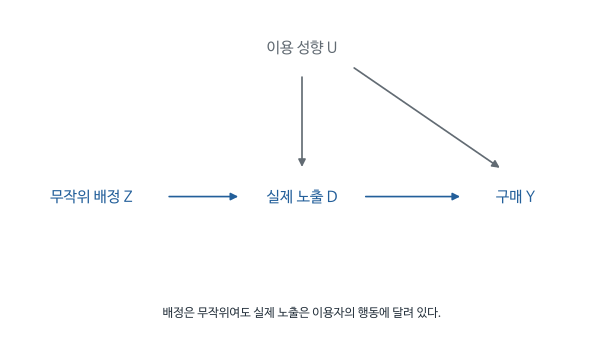

# 광고효과를 관측자료로 측정하면 실험과 같은 답을 얻는가: Gordon 등 (2019) 심층요약

광고를 본 사람은 보지 않은 사람보다 상품을 더 많이 구매하는 경우가 많다. 광고 덕분일까, 원래 살 가능성이 높은 사람에게 광고가 전달되었기 때문일까? 광고 플랫폼은 구매 가능성과 이용 행동을 예측해 광고를 전달하므로, 노출자와 비노출자의 차이에는 이 선택과정이 함께 들어간다.

Gordon 등은 Facebook에서 실시한 15개 광고실험을 이용해 이 문제를 직접 평가한다. 무작위실험으로 얻은 효과를 기준으로 삼고, 같은 자료를 관측자료처럼 분석했을 때 회귀와 매칭이 얼마나 비슷한 값을 내는지 비교한다. 사용자의 특성을 많이 안다는 사실이 광고의 인과효과를 알아내기에 충분한지가 연구의 질문이다.

[원문 PDF](<A comparison of approaches to advertising measurement (2019).pdf>) | [독립형 QnA](<A comparison of approaches to advertising measurement (2019)_QnA.md>)

## 1. 무작위실험을 기준으로 관측자료 분석의 정확성을 평가한다

관측자료 분석이 얼마나 정확한지 평가하려면 비교할 기준이 필요하다. 보통의 광고자료에서는 광고를 보지 않았을 동일 사용자의 구매를 모르기 때문에 추정법끼리 비교하는 데 그친다. 이 연구에는 실제 무작위 배정이 있어 실험 추정치를 기준으로 삼을 수 있다. 실험의 통제집단 정보를 일부러 사용하지 않고 관측자료 방식으로 분석한 뒤 두 결과를 비교한다.

대상은 2015년에 미국 Facebook 사용자에게 실시한 광고실험 15개다. 캠페인별 사용자를 분석하므로 여러 캠페인에 참여한 동일 사용자가 있을 수 있다.

자료는 약 5억 사용자-실험 관측치와 약 16억 광고 노출이다. 한 사람이 여러 캠페인에 등장할 수 있으므로 이를 5억 명의 고유 개인으로 읽으면 안 된다. 큰 표본과 풍부한 특성은 정밀한 예측을 돕지만 선택편향을 자동으로 없애지 않는다.

비교대상은 저자가 접근할 수 있었던 광고 데이터와 매칭, 층화, 회귀 조정 등의 성능이며, 가능한 모든 관측 인과추론이 아니다. 과거 구매이력 전체나 플랫폼 내부 모든 정보를 관측한 것은 아니다.

광고주가 구매 가능성이 높은 고객을 잘 찾아 광고한다면 노출자의 구매율은 높게 나타난다. 이때 광고 측정의 질문은 타기팅이 좋은 고객을 찾았는지와 구별된다. 광고를 집행하지 않았다면 발생하지 않았을 구매가 얼마나 생겼는지가 지출의 인과적 성과다. 좋은 예측모형이 그 두 질문에 모두 정확한 답을 주지는 않는다.

이 논문은 무작위 실험을 평가 기준으로 확보한 상태에서 관측자료 분석을 따로 수행한다. 실제 광고에서는 결과의 정답을 모르는 경우가 많지만 여기서는 같은 캠페인의 실험 추정치와 비교할 수 있다. 여러 방법이 서로 비슷하다는 내부적 일치보다 더 직접적으로 정확성을 평가하려는 설계다.

## 2. 광고를 볼 자격을 배정하는 것과 실제로 광고를 보는 것은 다르다

실험은 사용자를 광고를 받을 수 있는 test 집단과 해당 광고를 차단하는 control 집단으로 무작위 배정한다. test에 들어갔어도 접속하지 않거나 해당 광고가 경매에서 이기지 못하면 실제로 보지 않는다. 이 구조를 구분해야 무작위 배정의 효과와 실제 노출의 효과를 각각 계산할 수 있다.

| 기호 또는 집단 | 뜻 |
|---|---|
| $i$ | 한 캠페인 안의 사용자 |
| $Z_i=1$ | 광고 노출 자격을 부여한 무작위 test 배정 |
| $Z_i=0$ | 해당 캠페인 광고를 차단한 control 배정 |
| $W_i=1$ | 실제로 해당 광고를 본 상태 |
| $Y_i=1$ | 구매 등 해당 전환 결과가 발생한 상태 |
| $X_i$ | 처치에 영향받지 않는 사용자 특성 |

대조군은 해당 광고를 보지 않으므로 $W_i(0)=0$이다. test에서는 실제 방문, 경매, 최적화 때문에 어떤 사람은 보고 어떤 사람은 보지 않는다. 따라서 control-unexposed, test-unexposed, test-exposed의 세 집단이 있다.

무작위인 것은 $Z$다. $W$는 배정 이후 결정된다. test 안에서 실제 노출 여부를 다시 나누면 무작위성의 보호를 잃는다.

사용자 한 명에게 여러 차례 광고가 보일 수 있으므로 광고 노출 건수와 배정된 사용자 수는 다르다. 실제 노출 여부를 이진변수로 표현한 이 분석은 적어도 한 번 광고를 보게 된 효과를 해당 캠페인의 실제 노출환경에서 평가한다. 광고를 한 번 더 보여 주는 한계효과나 특정 노출 횟수의 최적값을 같은 계수로 추정했다고 해석하지 않는다.

자료에서 배정변수와 노출변수를 구분하지 않으면 무작위실험이라는 설명을 잘못 적용하게 된다. 실험집단 안의 노출자만 골라 통제집단과 비교하면 노출될 정도로 활동적인 사람을 선택한 것이다. 배정 당시 만들어진 평균적 비교 가능성이 그 선택 이후에도 그대로 유지된다고 볼 수 없다.

<!-- learning-figure:ad-assignment -->

*그림 설명: 본문의 실험 배정과 실제 노출 구별을 나타낸 개념도다.*

배정은 무작위여도 실제 노출에는 접속 여부와 이용 성향이 영향을 준다. 노출자만 골라 비노출자와 비교하면 이 선택이 다시 들어온다. 먼저 배정집단끼리 구매율을 비교하는 ITT가 필요한 이유다. 이를 노출효과로 환산하는 데는 뒤에서 설명하는 추가 가정이 필요하다.

<!-- /learning-figure -->

## 3. 해당 광고가 차단되었을 때 사용자에게 무엇이 보이는가

광고 한 건을 보이지 않게 하는 실험에서도 비교 상황을 구체적으로 정해야 한다. 화면을 비우면 광고주 메시지뿐 아니라 화면 구성도 달라진다. 이 실험에서는 관심 광고가 차단될 경우 경매의 다음 순위 광고를 보여준다. 그 결과는 해당 광고를 내보내는 선택과 플랫폼의 대체 광고를 내보내는 선택 사이의 차이로 해석한다.

이 설계는 다른 광고주의 전략이 짧은 실험기간에 해당 캠페인의 제거에 반응해 크게 바뀌지 않는다는 조건을 사용한다. 추정효과는 그 시점의 경쟁광고, 다른 매체 활동, 플랫폼 최적화가 있는 상태의 캠페인 효과다. 언제 어디서나 고정된 광고 소재의 보편적 효과는 아니다.

통제집단에 해당 광고가 보이지 않는다고 화면의 그 자리가 비어 있는 것은 아니다. 경매에서 다음 광고가 대신 보일 수 있으므로 비교는 해당 캠페인이 있는 광고환경과 그것이 제외된 광고환경 사이다. 광고를 전혀 보지 않는 세상과 비교한 효과라고 설명하면 반사실이 달라진다.

이 점은 광고 내용의 경쟁과 대체를 이해하는 데도 필요하다. 대체 광고가 어떤 상품인지에 따라 사용자의 주의와 구매가 달라질 수 있다. 이 실험의 효과는 플랫폼의 실제 광고 배정 방식에서 해당 캠페인을 제공하는 효과다. 다른 매체나 다른 광고 경매 방식으로 일반화할 때에는 이 비교 환경도 함께 고려해야 한다.

## 4. 무작위 배정된 두 집단의 구매율로 먼저 효과를 계산한다

처음 계산할 수 있는 가장 직접적인 실험효과는 test로 배정된 사용자 전체와 control 전체의 구매율 차이다. test 중 실제 광고를 못 본 사용자도 포함한다. 배정 당시 두 집단이 평균적으로 비교가능하기 때문에 이 차이는 광고를 받을 수 있게 하는 정책의 효과를 추정한다. 이를 ITT라고 부른다.

$$
ITT_Y=E[Y\mid Z=1]-E[Y\mid Z=0].
$$

표본 추정은

$$
\widehat{ITT}_Y=\frac{\sum_iZ_iY_i}{\sum_i Z_i}
-\frac{\sum_i(1-Z_i)Y_i}{\sum_i(1-Z_i)}.
$$

첫 분모는 test 사람 수, 둘째 분모는 control 사람 수다. 양쪽 표본 크기가 달라도 각각의 평균을 비교한다. 원문 잠재결과 표기를 관측 가능한 계산식과 구분해서 읽어야 한다.

배정의 무작위성, 일관된 처치 정의, 사용자 간 간섭 부재 아래 ITT는 캠페인 노출 자격 부여의 효과다. 실제 노출자만 대상으로 한 효과와는 다르다.

배정집단 평균을 사용하는 이유는 실제 노출 여부를 사후에 조건으로 삼지 않기 위해서다. 광고 자격을 받은 집단에는 보지 않은 사람도 남겨 둔다. 이들의 구매까지 평균에 포함해야 무작위 배정으로 형성한 두 집단의 비교를 유지할 수 있다. 관심 있는 경영 질문이 ‘캠페인을 이 대상 인구에게 제공하면 구매가 얼마나 늘어나는가’라면 이 배정효과 자체도 유용하다.

배정효과가 작을 때에는 두 가능성을 구분해야 한다. 광고를 본 사람에게도 효과가 작을 수 있고, 본 사람에게는 효과가 있지만 노출된 사람이 적어 전체 평균이 작을 수도 있다. 다음 단계에서 노출률을 사용하는 이유는 이 두 양을 분리하려는 데 있다. 작은 ITT만으로 광고를 본 개인에게 영향이 없다고 판단하지 않는다.

## 5. 실제 노출자 효과를 구하기 위해 배정효과를 노출률로 나눈다

광고를 받을 수 있게 해도 test 사용자의 일부만 실제 광고를 본다면, 전체 test의 평균효과에는 노출되지 않은 사람의 0 효과가 함께 평균된다. 실제 노출자에게 일어난 변화가 얼마인지 알아보려면 이 희석을 보정해야 한다. 아래 전개는 control에서 관심 광고를 볼 수 없고 배정 자체에는 별도 효과가 없다는 조건 아래 그 보정이 가능한 이유를 보여준다.

$W_i(1)$을 사용자 $i$가 test로 배정되었을 때 실제 광고를 볼지 나타내는 값으로 놓는다. $W_i(1)=1$인 사람은 test이면 보고 control이면 보지 않는 순응자다. $W_i(1)=0$이면 어느 배정에서도 보지 않는다. control에서는 해당 광고가 차단되어 $W_i(0)=0$이므로 다른 순응 유형이 배제된다.

순응자 비율을 $p=P(W(1)=1)$라 두면 반복기대법칙으로

$$
ITT_Y=p\,E[Y(1,W(1))-Y(0,W(0))\mid W(1)=1]
+(1-p)E[Y(1,0)-Y(0,0)\mid W(1)=0].
$$

배정 자체는 결과를 바꾸지 않고 노출만 결과를 바꾼다는 배제제약 때문에 마지막 기대값은 0이다. 따라서

$$
ITT_Y=p\,ATT,\qquad ATT=ITT_Y/p.
$$

무작위 배정 덕분에 $p$는 test의 실제 노출률로 추정할 수 있다. 한쪽 불순응 설계에서는 노출자가 순응자이므로 LATE를 ATT와 연결할 수 있다. 일반적인 양쪽 불순응 실험에서 아무 조건 없이 성립하는 동일성은 아니다.

통제집단은 해당 캠페인에 노출되지 못하므로 한 방향의 비순응 구조가 생긴다. 자격이 생기면 광고를 보는 사람과 자격이 생겨도 보지 않는 사람이 있다. 배정이 결과에 미치는 경로가 이 광고 노출뿐이라는 조건 아래, 배정집단의 평균 효과는 실제 노출이 달라진 사람의 효과와 그 사람들의 비중을 곱한 값으로 이해할 수 있다.

이 설명에는 실제 노출자가 무작위 표본이라는 가정이 필요하지 않다. 오히려 노출이 선택적이기 때문에 배정을 출발점으로 삼는다. 다만 통제집단에서 차단된 사실 자체가 다른 방식으로 구매를 바꾸거나 실험 운영이 노출 외 행동을 직접 바꾼다면 배제제약을 다시 검토해야 한다. 나눗셈만으로 인과 해석이 자동으로 성립하는 것은 아니다.

## 6. 구매확률 증가와 광고의 상대적 lift를 계산한다

광고효과를 보고할 때 확률의 차이와 상대 증가율이 섞이기 쉽다. 구매율이 1%에서 1.5%가 되면 확률 차이는 0.5%포인트이고 상대 증가는 50%다. 실험의 배정효과에서 노출효과를 구하고 다시 lift로 바꾸는 계산에서는 단계마다 분모가 달라지므로 다음 가상 예제를 순서대로 계산한다.

계산에 사용할 가상자료는 test와 control 각각 10만 명, 구매율 1.2%와 1.0%, test의 실제 노출률 40%다. 이 수치는 논문의 특정 캠페인 결과를 옮긴 값이 아니다.

$$
ITT_Y=0.012-0.010=0.002=0.2\text{\%p},
$$

$$
ATT=0.002/0.4=0.005=0.5\text{\%p}.
$$

실제 노출자의 구매율이 2%라면 이들이 광고를 보지 않았을 때의 평균은

$$
\mu_{0,T}=0.020-0.005=0.015.
$$

광고 lift는 그 반사실 구매율 대비 증가율이다.

$$
Lift=\frac{0.005}{0.015}=\frac13\approx33.33\%.
$$

0.5%p의 절대 증가와 33.33%의 상대 증가를 구별해야 한다. 분모에 전체 control 구매율 1%를 무조건 넣으면 노출자라는 다른 대상집단을 놓친다.

절대 효과를 예상 추가 구매자 수로 바꾸려면 그 효과의 대상자 수를 함께 사용한다. ATT는 실제 노출자 기준이므로 전체 자격집단의 규모에 바로 곱하면 안 된다. 전체 집단의 배정효과에는 이미 노출되지 않은 비율이 반영되어 있다. 광고 수익성을 판단할 때는 이렇게 계산한 추가 구매의 가치와 광고비를 비교해야 하며, 높은 lift 하나만으로 이익을 확정할 수 없다.

노출자의 광고 없는 구매율은 관측된 비노출자의 구매율과 같다고 둘 수 없다. 노출자가 원래 더 살 가능성이 높은 집단이라면 적절한 분모도 더 높다. 논문이 실험으로 노출자의 반사실 구매율을 복원한 뒤 lift를 계산하는 이유다. 분모를 잘못 정하면 효과의 크기가 크게 왜곡될 수 있다.

## 7. Study 4의 효과를 읽을 때 필요한 분모와 반올림

논문의 실험별 표는 캠페인마다 효과 크기가 크게 다름을 보여준다. Study 4에서도 노출자 전환율과 노출로 증가한 전환율을 구분한 뒤, 광고가 없었을 노출자의 전환율을 분모로 사용해야 lift를 해석할 수 있다. 표시된 소수점 자리만으로 계산하면 반올림 전 수치로 산출한 보고값과 조금 달라질 수 있다.

Table 4의 Study 4는 노출률 37%, 실제 노출자의 전환율 0.079%, RCT ATT 0.033%포인트, lift 72.8%를 보고한다. lift의 신뢰구간은 49%-103%다. 표시된 값으로 계산하면 $0.033/(0.079-0.033)\approx0.7174$이므로 반올림 전 값으로 계산한 보고 수치와 차이가 있다.

lift를 읽을 때는 실제 노출자의 구매율에서 ATT를 뺀 반사실적 구매율이 분모라는 점을 유지해야 한다. 캠페인마다 이 기초 구매율이 다르므로 같은 확률 차이도 서로 다른 lift를 만들 수 있다.

원문 Study 9의 RCT lift는 Table 4에서 약 2.4%이며 관측 추정이 크게 과대평가한다. 모든 연구에서 과대편향만 생기는 것은 아니다. Study 15의 조정 추정은 다수 방법에서 과소평가한다.

Study 4의 낮은 구매확률과 높은 상대 lift를 함께 보면 단위의 차이가 분명해진다. 효과가 크다는 표현이 절대적으로 많은 사용자가 구매하게 되었다는 뜻인지, 원래 매우 낮은 구매율에 비해 증가 폭이 컸다는 뜻인지 구분해야 한다. 캠페인별로 결과변수와 기준 구매율이 다르면 lift만으로 성과를 단순 비교하기도 어렵다.

표에 인쇄된 반올림 수치로 계산한 비율이 보고된 lift와 조금 다를 수 있다. 분모가 작은 비율에서는 반올림의 영향이 상대적으로 크다. 이 경우 표시된 수치와 더 정밀한 내부 추정치의 차이를 고려하되, 재현되지 않는 본문 숫자를 임의로 설명해 맞추지는 않는다. 이 문서에서는 원문에서 확인되는 값과 학습용 계산을 구분한다.

### 광고를 보지 않았을 노출자의 구매율은 어떻게 구하는가

실험 통제집단의 구매율을 광고 노출자의 무광고 구매율로 그대로 쓰고 싶어진다. 그러나 광고를 볼 사람은 애초 구매 가능성이 높은 집단일 수 있다. 실험이 무작위화한 것은 노출 자격 $Z$이며, 실제 노출 $D$는 그 이후 결정된다.

단방향 불완전 순응 $D(0)=0$과 배제제약을 가정하자. $p=P(D=1\mid Z=1)$, $m_{11}=E[Y\mid Z=1,D=1]$, $m_{10}=E[Y\mid Z=1,D=0]$, $m_0=E[Y\mid Z=0]$라고 쓴다. 자격이 있어도 노출되지 않는 사람은 비처치자이고, 이들의 무광고 구매율은 $m_{10}$으로 관측된다. 무작위배정 때문에 통제집단에도 같은 비율로 이 유형이 들어간다. 따라서

$$
m_0=p\mu_{C0}+(1-p)m_{10},\qquad
\mu_{C0}=\frac{m_0-(1-p)m_{10}}{p}.
$$

$\mu_{C0}$는 노출 순응자가 광고를 보지 않았을 때의 구매율이다. $m_{11}$에서 이를 빼면 그 집단의 효과가 된다. 분자를 정리하면

$$
m_{11}-\mu_{C0}
=\frac{pm_{11}+(1-p)m_{10}-m_0}{p}
=\frac{E[Y\mid Z=1]-E[Y\mid Z=0]}{p}.
$$

학습용으로 $p=.4,m_{11}=.03,m_{10}=.01,m_0=.016$이면 자격집단 구매율은 .018, ITT는 .002다. 순응자의 무광고 구매율은 $(.016-.6\times.01)/.4=.025$이고 효과는 .005, 곧 .5%p다. 상대 lift는 $.005/.025=20\%$다. 통제집단 전체의 .016을 분모로 사용하면 대상이 다른 상대효과가 나온다. 실제 논문 숫자를 옮길 때 어떤 집단의 기초 구매율을 사용했는지 확인해야 하는 이유다.

## 8. 원래 구매 가능성이 높은 사람이 광고를 더 보게 되는 과정

실제 노출은 세 가지 선택을 거친다. 사용자가 플랫폼에서 활동해야 광고를 볼 기회가 있고, 광고주는 타깃을 정하며, 플랫폼 경매는 어떤 광고를 보여줄지 결정한다. 이런 과정은 사용자의 구매 가능성과도 관련된다. 나이와 성별이 같다는 이유만으로 노출자와 비노출자가 같은 구매 의도를 가진다고 보기는 어렵다.

타기팅: 플랫폼은 예상 구매확률이 높은 사람에게 입찰을 더 높이거나 노출을 집중할 수 있다. 클릭 최적화와 구매 결과가 어긋나면 편향 방향도 바뀔 수 있다.

경쟁 경매: 다른 광고주가 어떤 사용자에게 강하게 입찰하는지도 초점 광고의 노출을 결정한다. 보완재 광고가 초점 광고를 밀어내면서 구매를 돕는 경우에는 단순한 양의 선택 이야기와 달라진다.

관측자료 방법은 이런 결정요인을 $X$로 충분히 통제한 뒤에도 남는 준무작위 변이를 활용해야 한다. 원문은 방문시점, 예산이 기간 중 특정 시점에 소진되지 않도록 노출 속도를 조절하는 pacing, 무관한 광고주의 입찰 등 잠재적 무작위 변이를 논의하지만, 존재 가능성만으로 충분한 식별을 보장하지는 않는다.

사용자가 광고주 웹사이트를 이미 방문했다면 구매 의향이 높고 재타기팅 광고를 볼 가능성도 높다. 소셜 플랫폼에 자주 접속하는 사용자 역시 노출 기회가 많으며 구매 행동도 다를 수 있다. 이 두 예에서 광고 노출과 구매가 함께 높은 이유의 일부는 광고 이전 상태에 있다.

관측자료 회귀는 그런 상태를 측정한 변수를 조건으로 비교하려 한다. 그러나 단순한 과거 방문 여부로 지금 막 생긴 구매 의도를 모두 표현하기는 어렵다. 타기팅 알고리즘이 연구자에게 없는 정보나 매우 세밀한 행동신호를 사용한다면 공개된 특성만 조정한 비교에는 차이가 남는다. 표본 규모가 커져도 같은 누락이 반복되면 그 편향은 줄지 않는다.

연구자가 처치 후 행동을 풍부한 통제변수로 추가할 때에도 주의가 필요하다. 광고를 본 뒤 늘어난 사이트 방문을 통제하면 광고가 방문을 늘려 구매를 유도한 경로를 제거할 수 있다. 노출을 설명하는 정보가 많다는 이유만으로 모두 적절한 사전 공변량이 되는 것은 아니다. 변수의 시간적 순서와 측정 과정을 알아야 관측자료 조정의 의미를 평가할 수 있다.

## 9. 실험자료에서 통제집단을 제외하고 관측자료 분석을 재현한다

광고효과를 관측자료로 추정하는 분석자는 일반적으로 무작위 control 집단을 갖고 있지 않다. 연구자들은 같은 조건을 만들기 위해 test 안의 실제 노출자와 비노출자만 사용한다. 두 집단의 관측 특성을 맞춰 광고효과를 추정하고, 앞에서 계산한 실험효과와 비교한다.

$$
ATT=E[Y(1)-Y(0)\mid W=1].
$$

이를 식별하려면 적어도 노출자의 미노출 결과를 비교집단에서 복원할 수 있어야 한다. 원문은 잠재결과의 조건부 독립과 중첩을 가정한다.

$$
(Y(0),Y(1))\perp W\mid X,\qquad0<P(W=1\mid X)<1.
$$

실험 분석의 무작위성은 $Z$에 관한 것이고, 여기의 조건부 독립은 $W$에 관한 것이다. 같은 자료를 쓰지만 가정이 완전히 같지 않다.

관측자료 방법에 무작위 통제집단을 그대로 주면 실무에서 갖지 못하는 좋은 비교집단을 제공하는 셈이다. 저자들은 실제 광고 측정 상황을 재현하기 위해 실험집단 안의 노출자와 비노출자를 사용한다. 두 집단은 광고 자격은 같지만 실제 노출에 이르는 선택과정이 다르다.

이 설계 덕분에 실험과 관측 추정치의 차이를 다른 캠페인이나 다른 시기의 효과 차이로 설명하기 어렵다. 같은 캠페인의 같은 측정 문제를 다른 비교 방식으로 풀었기 때문이다. 다만 실험 추정치에도 표본오차가 있어 한 숫자를 완전히 오차 없는 진실로 취급하지는 않는다. 두 추정치의 불확실성까지 고려하여 차이를 평가한다.

## 10. 매칭, 층화와 회귀가 비교 구매율을 만드는 방법

세 방법 모두 실제 노출자가 광고를 보지 않았을 경우의 구매율을 구성하려고 한다. 매칭은 비슷한 비노출자를 찾고, 층화는 비슷한 성향점수 구간에서 평균차이를 계산하며, 회귀는 관측 특성으로 미노출 구매율을 예측한다. 같은 질문에 서로 다른 계산을 적용하므로 어떤 사람을 평균에 많이 반영하는지까지 맞춰야 결과를 비교할 수 있다.

매칭에서는 노출자 $i$와 비슷한 비노출자의 결과 평균을 $\widehat Y_i(0)$라 두고 $Y_i-\widehat Y_i(0)$를 계산한다. 이 차이를 실제 노출자 전체에서 평균하면 관측 특성을 맞춘 ATT를 얻는다. 다음 층화식도 같은 노출자 집단을 목표로 하므로 구간별 노출자 비중을 사용한다.

층화는 비슷한 성향점수 구간 $b$ 안에서 평균차이 $\widehat\tau_b$를 구한다. 전체 ATT는

$$
\widehat{ATT}=\sum_b\frac{N_{1b}}{N_1}\widehat\tau_b.
$$

$N_{1b}$는 그 구간의 노출자 수다. ATT이므로 전체 사람 수 비중이 아닌 노출자 비중을 사용한다. 예를 들어 두 구간 효과가 1%p와 3%p이고 노출자가 80 대 20이면 $0.8(1)+0.2(3)=1.4$%p다. 학습용 계산이다.

회귀 조정은 미노출자에서 $\mu_0(X)=E[Y\mid W=0,X]$를 추정하고 노출자의 특성을 넣어 반사실을 예측한다.

$$
\widehat{ATT}_{RA}=\frac1{N_1}\sum_{i:W_i=1}
\{Y_i-\widehat\mu_0(X_i)\}.
$$

원문은 역확률 가중 회귀, 층화 안 회귀도 비교한다. 이러한 결합은 함수형태 민감성을 줄이는 목적이 있지만 숨은 교란이 남으면 인과성은 확보되지 않는다. 단순 선형회귀의 처치계수를 ATT라고 읽을 때도 효과 이질성과 모형 제약을 따져야 한다.

성향점수 층화는 노출확률이 비슷한 사용자들을 구간으로 나누고 구간 안에서 구매율을 비교한다. 그 구간별 차이를 노출자 구성에 맞춰 평균하면 노출자의 효과를 겨냥한다. 전체 사용자 비중으로 평균하면 다른 대상의 효과가 될 수 있어, 동일한 층화라도 가중방식이 연구 질문과 연결된다.

회귀 조정은 비노출자의 특성과 구매 관계를 추정하여 노출자 특성에 적용한다. 매칭은 가까운 비교 사용자를 직접 찾는다. 세 방식은 계산이 다르지만 관측 특성으로 노출 선택을 충분히 설명할 수 있다는 근거를 공유한다. 방법을 여러 개 사용한 사실 자체가 서로 독립적인 식별 근거를 확보한 것은 아니다.

## 11. 관측 특성을 맞춘 뒤에도 실험과 다른 결과가 나오는 이유

매칭 후 연령, 성별과 과거 활동량의 분포가 비슷해졌다면 그 변수에 대한 조정은 이루어졌다고 볼 수 있다. 그러나 오늘 특정 상품을 검색하려던 의도처럼 자료에 없는 특성은 여전히 다를 수 있다. 광고 노출과 구매를 동시에 좌우하는 이런 차이가 남으면 표본이 아무리 커도 편향이 사라지지 않는다.

Figure 5와 Figure 6은 매칭 후 성향점수 분포가 겹치고 관측 특성의 차이가 줄어든 결과를 보여준다. 이 진단이 개선되었는데도 실험값과 차이가 남는다는 점이 이 연구의 경험적 발견이다.

측정되지 않은 당일 구매의향 $U$가 광고노출과 구매를 함께 높인다고 하자. 나이, 친구 수, 최근 활동량을 모두 맞춰도 $U$가 남을 수 있다. 균형은 관측한 목록의 속성이며 전체 잠재결과의 교환 가능성과 동의어가 아니다.

표본이 커지면 표준오차는 작아질 수 있지만 편향은 남는다. 따라서 작은 p값과 작은 신뢰구간은 잘못된 인과 추정치를 매우 정밀하게 표시할 수도 있다.

완벽하게 처치여부를 예측하면 성향점수는 0 또는 1이 되어 중첩이 사라진다. 높은 예측 정확도가 항상 좋은 인과추론 환경을 뜻하지 않는 이유다.

특성 균형이 좋아졌다는 결과는 조정이 의도한 관측 차이를 줄였다는 뜻이다. 예를 들어 연령과 과거 사이트 방문 횟수의 분포가 비슷해졌다면 그 변수들의 직접적인 차이는 작아졌다. 그러나 오늘 구매하려는 계획처럼 측정되지 않은 상태가 노출과 연결되어 있으면 편향이 남는다. 균형표와 실험 결과 비교가 각각 다른 질문을 평가하는 이유다.

일부 캠페인은 과대추정되고 다른 캠페인은 과소추정된다. 이를 일정한 보정계수 하나로 고치기는 어렵다. 노출 선택과 미관측 구매 의도의 관계가 캠페인마다 다를 수 있기 때문이다. 관측자료가 항상 광고효과를 과장한다는 단순한 결론도 논문의 비교 결과를 충분히 반영하지 못한다.

## 12. 실험 추정치와 관측 추정치의 차이가 우연인지 평가한다

두 효과 추정치가 수치상 다르더라도 표본 변동으로 생긴 차이인지 확인해야 한다. 두 추정치는 같은 사용자 자료를 공유하므로 추정오차도 함께 움직일 수 있다. 각각의 표준오차를 독립이라고 놓고 더하면 그 의존성을 놓친다. 아래 분산식에 공분산이 들어가는 이유다.

$$
Var(\widehat\tau_R-\widehat\tau_O)
=Var(\widehat\tau_R)+Var(\widehat\tau_O)
-2Cov(\widehat\tau_R,\widehat\tau_O).
$$

이는 $Var(A-B)=E[((A-EA)-(B-EB))^2]$를 전개하면 나오는 식이다. 두 추정치를 독립이라고 가정하면 마지막 항을 무시하게 된다. 원문은 같은 재표집에서 두 추정을 함께 계산해 관계를 반영한다. 최근접 매칭에는 일반 부트스트랩 문제가 있어 각주 17에서 subsampling 예외를 구분한다.

재표집으로 두 추정치의 관계를 보존하려면 한 번 선택한 사용자 표본에서 실험 분석과 관측자료 분석을 함께 수행한다. 두 분석을 별개의 표본으로 반복하면 실제 자료가 공유하는 우연한 구매 변화가 사라져 차이의 불확실성을 다르게 계산하게 된다. 최근접 매칭에 사용하는 subsampling은 전체보다 작은 부분표본을 반복 사용하는 방식이며, 일반 부트스트랩과 구별된다.

통계적 차이와 의사결정상 차이도 구분한다. 표본이 매우 크면 작은 차이도 통계적으로 드러날 수 있다. 반대로 구매가 드물어 신뢰구간이 넓으면 경영상 중요한 차이를 확정하지 못할 수 있다. 효과의 방향, 크기와 불확실성을 함께 읽어야 어떤 측정법이 광고 예산 판단을 바꿀지를 평가할 수 있다.

### 표본을 크게 만들었는데도 잘못된 효과가 더 확실해지는 경우

관측 추정량을 $\widehat\tau_{obs}=\tau+b+\varepsilon_n$이라고 써 보자. $\tau$는 목표 인과효과, $b$는 관측 특성으로 제거되지 않은 선택편향, $\varepsilon_n$은 표본의 우연한 변동이다. 표본이 커져 $\varepsilon_n$의 표준편차가 작아져도 $b$가 사라질 이유는 없다. 무한히 많은 자료로 잘못된 비교를 아주 정확하게 계산하는 상황도 가능하다.

교육용으로 진짜 구매확률 효과가 .001이고 잔여 선택편향이 .004라면 관측분석은 .005 근처로 모인다. 표준오차가 .003일 때보다 .0003일 때 구간은 훨씬 좁지만, 좁아진 구간이 참효과에 가까워진 것은 아니다. 광고효과 자체가 작으면 절대적으로 작은 선택차이도 실제 효과의 몇 배가 된다.

실험과 관측 추정치의 차이를 $\widehat\delta=\widehat\tau_{obs}-\widehat\tau_{RCT}$로 놓으면

$$
\operatorname{Var}(\widehat\delta)
=\operatorname{Var}(\widehat\tau_{obs})+\operatorname{Var}(\widehat\tau_{RCT})
-2\operatorname{Cov}(\widehat\tau_{obs},\widehat\tau_{RCT}).
$$

두 분석이 같은 실험의 사용자 자료를 공유하면 마지막 공분산을 임의로 0으로 두기 어렵다. 한 추정치는 유의하고 다른 추정치는 유의하지 않다는 비교도 두 추정치의 차이가 유의하다는 검정과 다르다. 이 논문을 읽을 때는 풍부한 변수와 큰 표본의 장점, 비교집단의 인과적 타당성, 두 방법의 차이를 평가하는 추론을 나누어 보아야 한다.

## 13. 추가 관측정보가 결과를 얼마나 바꿀 수 있는지 살핀다

연구자들은 더 풍부한 사용자 특성을 넣으면 실험과의 차이가 줄어드는지 살펴본다. 아직 관측하지 못한 정보가 어느 정도 강해야 결과가 달라지는지 민감도도 계산한다. 이 분석은 관측하지 않은 변수의 존재를 증명하기보다, 현재 추정이 미관측 차이에 얼마나 의존하는지 평가하는 데 목적이 있다.

$$
R^2_{Y,rel}=\frac{R^2_Y(X,U)-R^2_Y(X)}{R^2_Y(X)}.
$$

예를 들어 기존 $R^2$가 0.02, 추가 후 0.06이면 비율은 $(0.06-0.02)/0.02=2$다. 새 정보의 추가 설명력이 기존 전체 설명력의 두 배라는 뜻이다. 전체 변동의 200%를 설명했다는 뜻이 아니다. 노출식에도 같은 척도를 계산한다.

인쇄 부록은 $P(U=1\mid W=j,Y=k)$ 네 값을 정해 모의 숨은 변수를 생성하고 반복 추정한다. 이는 가정에 의존하는 민감도 계산이며 자료에서 고유하게 식별된 숨은 원인의 증거는 아니다.

민감도 분석은 새 변수를 실제로 관측해 편향을 해결한 분석과 다르다. 노출과 구매에 특정 방식으로 관련되는 가상의 미관측 변수가 존재한다면 추정치가 얼마나 달라질지 계산한다. 지금 가진 정보보다 어느 정도 더 중요한 정보를 확보해야 실험과의 차이를 설명할 수 있는지 질문하는 방법이다.

추가 변수가 결과를 잘 예측한다는 것만으로 충분하지 않다. 그 변수가 노출 선택에도 어떻게 연결되는지가 편향에 중요하다. 구매와만 관련되고 노출과는 무관하다면 정밀도를 개선할 수 있지만 선택편향을 설명하는 역할은 다르다. 논문이 노출과 구매의 조합별로 가상 변수의 분포를 설정하는 이유다.

## 14. 풍부한 사용자 정보로도 광고의 선택편향이 남았다

15개 실험에서 관측자료 추정은 실험값을 일관되게 재현하지 못했다. 광고를 보게 되는 과정이 구매 가능성과 긴밀하게 연결된 이 환경에서, 많은 관측변수를 조정하는 것만으로는 비교가능성이 충분히 확보되지 않았다는 결과다. 다른 시장에서도 실패의 크기가 같다고 단정할 수는 없지만, 광고효과를 측정할 때 노출 결정과정을 분석해야 할 이유는 분명해진다.

구매 결과가 있는 14개 연구 중 7개에서는 여러 관측방법의 점추정이 실험값과 크게 다르다. 등록과 페이지뷰는 구매보다 실험결과에 가까운 경향이 있지만, 자료를 추가해도 모든 캠페인에서 우수한 하나의 방법은 확인되지 않는다.

원문이 포함하지 않은 플랫폼, 데이터, 연구설계까지 실패한다고 결론내릴 수는 없다. 특히 규칙 기반 RD나 외생적 도구와 같은 다른 식별 논리까지 반박한 연구는 아니다.

- 무엇을 배웠는가: 풍부한 관측자료와 균형만으로 광고노출의 선택성을 제거했다고 보장할 수 없다.
- 핵심 방법: 동일한 효과 대상 ATT에 맞추어 관측 추정을 무작위 실험과 비교한다.
- 언제 쓰는가: 광고효과 측정법의 신뢰성을 평가하고 실제로 필요한 데이터를 판단할 때다.

Week07 Imbens의 가정이 왜 실증적으로 중요한지 확인한 뒤, Week08 MHE와 Week09 RD 자료에서는 알려진 배정규칙이라는 추가 정보가 무엇을 주는지 읽으면 좋다.

연구의 강점은 대규모 사용자 정보와 여러 관측자료 방법을 실제 무작위 실험과 비교했다는 데 있다. 적은 표본이나 매우 단순한 회귀만 사용해서 실패한 사례로 축소할 수 없다. 구매 결과를 측정한 캠페인들에서 실험과 상당한 차이가 남았다는 사실은 풍부한 정보가 있어도 비교가정이 어려울 수 있음을 보여준다.

그렇다고 모든 시장에서 관측자료 분석이 불가능하다는 결론은 아니다. 이 논문의 대상은 특정 플랫폼과 캠페인들의 노출 선택과 결과 측정이다. 어떤 정보가 실제 타기팅에 사용되었는지, 구매보다 가까운 행동을 측정하는지, 실험이나 다른 설계를 확보할 수 있는지에 따라 상황이 달라진다. 적용할 때에는 자료의 양보다 비교집단이 만들어지는 과정을 먼저 설명해야 한다.

## 출처와 보충 설명

대상: Marketing Science 38(2), 193-225쪽. 보관 PDF 34쪽의 본문, 인쇄 부록, 각주, 참고문헌과 저작권 안내 텍스트를 검토했다. 별도 온라인 부록 전체는 보관본에 포함되지 않는다. 원문 일부 표시 수치 사이의 산술 불일치는 아래에 명시한다.

더 주의할 부분은 인쇄 213쪽의 노출/미노출 전환율 서술이다. 0.061%, 0.019%와 함께 lift 316%를 적는데, 그 표시값의 단순 비율은 316%를 재현하지 않는다. 본문과 표의 노출률 숫자도 다르다. 따라서 이 설명에서는 316%를 원문 보고 추정치로만 언급하고, 이 둘을 이용해 재현했다고 주장하지 않는다.
