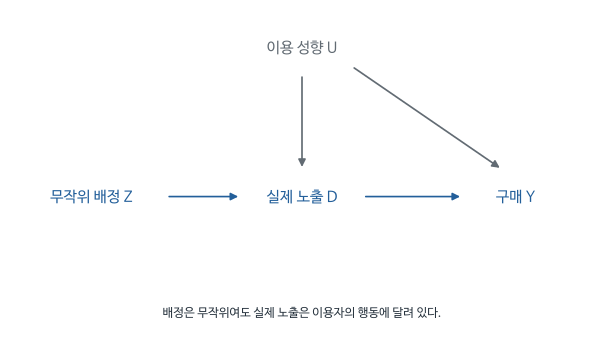

# 광고효과를 관측자료로 측정하면 실험과 같은 답을 얻는가: Gordon 등 (2019) 심층요약

광고를 본 사람은 보지 않은 사람보다 상품을 더 많이 구매하는 경우가 많다. 광고 덕분일까, 원래 살 가능성이 높은 사람에게 광고가 전달되었기 때문일까? 광고 플랫폼은 구매 가능성과 이용 행동을 예측해 광고를 전달하므로, 노출자와 비노출자의 차이에는 이 선택과정이 함께 들어간다.

Gordon 등은 Facebook에서 실시한 15개 광고실험을 이용해 이 문제를 직접 평가한다. 무작위실험으로 얻은 효과를 기준으로 삼고, 같은 자료를 관측자료처럼 분석했을 때 매칭, 층화, 회귀가 얼마나 비슷한 값을 내는지 비교한다. 연구의 질문은 사용자 특성을 많이 관측하면 광고의 인과효과를 알아낼 수 있는가이다.

[원문 PDF](<A comparison of approaches to advertising measurement (2019).pdf>) | [개념 퀴즈](<A comparison of approaches to advertising measurement (2019)_QnA.md>) | [수식·모델 퀴즈](<A comparison of approaches to advertising measurement (2019)_수식모델퀴즈.md>) | [실무 Cheat Sheet](<A comparison of approaches to advertising measurement (2019)_실무CheatSheet.md>)

## 1. 무작위실험을 기준으로 관측자료 분석의 정확성을 평가한다

관측자료 분석이 얼마나 정확한지 평가하려면 비교할 기준이 필요하다. 보통의 광고자료에서는 광고를 보지 않았을 동일 사용자의 구매를 모르기 때문에 추정법끼리 비교하는 데 그친다. 이 연구에는 실제 무작위 배정(random assignment)이 있어 실험 추정치를 기준으로 삼을 수 있다. 실험의 통제집단(control group) 정보를 일부러 사용하지 않고 관측자료 방식으로 분석한 뒤 두 결과를 비교한다.

먼저 연구의 배경을 살펴본다. 원문 서론에 따르면 2017년 미국의 디지털 광고비가 처음으로 TV 광고비를 넘었다. 광고주는 광고 노출, 클릭, 페이지 방문, 온라인 구매, 때로는 오프라인 구매까지 개인 단위로 연결한 자료를 받는다. 자료가 이렇게 세밀해도 광고의 인과효과는 측정하기 어렵다. 저자들은 두 이유를 든다. 하나는 고객 한 명에게 지출하는 광고비에 비해 개인의 구매 결과가 크게 변동해서, 광고가 설명하는 결과 변동이 작다는 점이다. 다른 하나는 구매할 사람이 광고에 더 많이 노출되는 정도의 작은 내생성(endogeneity)만 있어도 효과 추정치가 크게 편향된다는 점이다. 무작위실험(RCT)은 두 문제를 해결할 수 있지만 실제 광고 캠페인에서는 드물게 사용된다. 광고 타기팅 시스템 안에 실험을 구현하기가 기술적으로 어렵고, 실험 비용이 높으며 다른 방법이 있으니 불필요하다는 인식도 있기 때문이다. 그래서 많은 광고주와 측정업체는 관측자료 방법에 의존한다.

업계의 관측자료 측정 절차는 원문 4절에 소개되어 있다. 광고주는 comScore, Nielsen 같은 제3자 측정업체에 측정을 맡기는 경우가 많다. 플랫폼이 노출된 사용자의 이메일 주소를 해시(hash)한 값을 업체에 전달하면, 업체는 같은 해시 함수를 자기 소비자 데이터베이스에 적용해 누가 노출되었는지 식별한다. 그다음 인구통계 변수, 업체에 따라서는 과거 구매와 온라인 활동 변수까지 사용해 노출되지 않은 비슷한 소비자(원문 표현으로 "forensic" control)를 선정하고, 두 집단의 결과를 비교한다. 이 논문이 평가하는 관측방법은 이 실무 절차를 연구자가 더 나은 자료로 재현한 것이다.

대상은 2015년에 미국 Facebook 사용자에게 실시한 광고실험 15개다. 캠페인별 사용자를 분석하므로 여러 캠페인에 참여한 동일 사용자가 있을 수 있다.

자료는 약 5억 사용자-실험 관측치와 약 16억 광고 노출이다. 한 사람이 여러 캠페인에 등장할 수 있으므로 이를 5억 명의 고유 개인으로 해석하면 안 된다. 큰 표본과 풍부한 특성은 정밀한 예측을 돕지만 선택편향(selection bias)을 자동으로 제거하지 않는다.

평가 대상은 저자들이 접근할 수 있었던 광고 데이터로 구현한 매칭, 층화, 회귀 조정 등의 성능이다. 가능한 모든 관측 인과추론(causal inference) 방법을 평가한 연구는 아니다. 저자들은 광고주가 가진 캠페인 이전의 구매이력이나 Facebook이 광고 배정에 사용하는 모든 정보를 관측하지 못했다고 밝힌다.

선행연구와의 관계도 연구 질문을 이해하는 데 필요하다. LaLonde(1986)는 직업훈련 프로그램 자료에서 관측자료 계량방법들이 실험 결과를 재현하지 못한다고 보고했다. 이후 인과추론 방법이 발전했고, Imbens(2015)는 개선된 방법을 LaLonde 자료에 적용해 실험 결과를 재현했다. 직업훈련 사례에서는 훈련 참가자와 일반 인구에서 추출한 비교집단(comparison group)의 특성 차이를 조정하면 되었다. 디지털 광고에서는 개인 행동 자료를 사용하는 기계학습 알고리즘이 노출을 결정하므로 선택 문제가 더 심각할 수 있다. 저자들은 발전한 방법과 대규모 개인자료를 결합하면 광고에서도 실험을 재현할 수 있는지 묻는다. 광고 분야의 앞선 비교연구로 원문은 두 편을 든다. Lewis 등(2011)은 미국 트래픽의 95%를 초점 광고에 노출시킨 실험이어서 비노출 비교집단으로 해외 사용자를 매칭해야 했다. Blake 등(2015)은 210개 미디어 시장 단위의 무작위화에 기반한 집계 이중차분(difference-in-differences)을 실험 기준으로 삼았으므로 개인 단위 인과추론 방법을 평가하지 않았다.

원문이 밝힌 기여는 세 가지다. 첫째는 업계의 통념대로 풍부한 개인 단위 자료를 활용하는 관측방법이 광고 측정에 충분한지 판정하는 것이다. 둘째는 관측방법의 편향을 제거하려면 현재 보유한 변수보다 얼마나 강한 미관측 정보가 더 필요한지 특성화하는 것이다(13절). 셋째는 관측자료와 실험을 비교하는 LaLonde 계열 문헌에 대규모 광고 사례를 더하는 것이다.

광고주가 구매 가능성이 높은 고객을 잘 찾아 광고한다면 노출자의 구매율은 높게 나타난다. 그러나 광고 측정의 질문은 타기팅이 좋은 고객을 찾았는지와 구별된다. 광고를 집행하지 않았다면 발생하지 않았을 구매가 얼마나 생겼는지가 광고 지출의 인과적 성과다. 구매할 사람을 잘 예측하는 모형이 이 두 질문에 모두 정확한 답을 주지는 않는다.

이 논문은 무작위 실험(randomized experiment)을 평가 기준으로 확보한 상태에서 관측자료 분석을 따로 수행한다. 실제 광고에서는 결과의 정답을 모르는 경우가 많지만 여기서는 같은 캠페인의 실험 추정치와 비교할 수 있다. 여러 관측방법이 서로 유사한 값을 산출한다는 내부적 일치보다 더 직접적으로 정확성을 평가하려는 설계다.

## 2. 광고를 볼 자격을 배정하는 것과 실제로 광고를 보는 것은 다르다

실험은 사용자를 광고를 받을 수 있는 test 집단과 해당 광고를 차단하는 control 집단으로 무작위 배정한다. test에 배정되었어도 접속하지 않거나 해당 광고가 경매에서 이기지 못하면 실제로 보지 않는다. 이 구조를 구분해야 무작위 배정의 효과와 실제 노출의 효과를 각각 계산할 수 있다.

| 기호 또는 집단 | 뜻 |
|---|---|
| $i$ | 한 캠페인 안의 사용자 |
| $Z_i=1$ | 광고 노출 자격을 부여한 무작위 test 배정 |
| $Z_i=0$ | 해당 캠페인 광고를 차단한 control 배정 |
| $W_i=1$ | 실제로 해당 광고를 본 상태 |
| $Y_i=1$ | 구매 등 해당 전환 결과가 발생한 상태 |
| $X_i$ | 처치에 영향받지 않는 사용자 특성 |

실험의 시작은 광고주가 캠페인 대상(예: 18-54세 여성 전체)을 설정하는 것이다. 이 타깃 조건을 만족하는 사용자가 연구 대상이 되고, 광고주가 Facebook과 상의해 정한 비율에 따라 각 사용자를 test나 control에 무작위로 배정한다. 모든 분석은 캠페인 하나 안에서 이루어지므로 원문은 연구 번호 첨자를 따로 붙이지 않는다.

표의 기호는 원문 3절의 잠재결과(potential outcome) 표기로 확장된다. 원문은 노출을 배정의 함수로 간주하고 $W_i(Z_i)$로 표기한다. $W_i(1)$은 사용자 $i$가 test에 배정되었을 때 광고를 보게 될지, $W_i(0)$은 control에 배정되었을 때 볼지를 나타낸다. 구매 결과도 배정과 노출 두 가지에 따라 $Y_i(z,w)$로 표기한다. 예를 들어 $Y_i(1,0)$은 test에 배정되었지만 광고를 보지 못했을 때의 구매 여부다. 한 사람에게서 실제로 관측되는 값은 이 중 하나뿐이며, 원문 식 (1)은 관측 결과를 세 경우로 나눈다. control이면 $Y_i(0,0)$, test이면서 노출되지 않았으면 $Y_i(1,0)$, test이면서 노출되었으면 $Y_i(1,1)$이 관측된다. 뒤의 5절에 나오는 $Y(1,W(1))$처럼 괄호가 겹친 표기는 "test에 배정되고, 그때 실제로 결정될 노출 상태를 따른 결과"를 뜻한다.

결과 $Y$는 광고주 웹페이지에 설치한 Facebook 전환 픽셀(conversion pixel)로 측정한다. 결제 완료 페이지에 픽셀을 설치하면 구매(checkout), 가입 완료 페이지에 설치하면 등록(registration), 광고주가 관심을 두는 랜딩 페이지에 설치하면 페이지 조회(page view)가 결과변수가 된다. 픽셀은 광고 클릭 여부와 상관없이 test와 control 모두의 방문을 기록하므로 광고를 클릭하지 않고 나중에 구매한 사람도 전환으로 집계된다. Facebook은 로그인 계정 단위로 사용자를 추적하므로 모바일에서 광고를 보고 컴퓨터에서 구매한 경우도 같은 사람의 기록으로 연결된다. 원문은 한 캠페인에 속한 여러 광고 소재(creative)를 묶어 캠페인 전체의 효과를 평가한다.

대조군(control group)은 해당 광고를 보지 않으므로 $W_i(0)=0$이다. test에서는 실제 방문, 경매, 최적화 때문에 어떤 사람은 보고 어떤 사람은 보지 않는다. 따라서 control-unexposed, test-unexposed, test-exposed의 세 집단이 있다.

무작위인 것은 $Z$다. $W$는 배정 이후 결정된다. test 내부를 실제 노출 여부로 다시 구분하면 무작위 배정이 보장하던 비교가능성을 잃는다.

사용자 한 명에게 여러 차례 광고가 보일 수 있으므로 광고 노출 건수와 배정된 사용자 수는 다르다. 실제 노출 여부를 이진변수로 표현한 이 분석은 적어도 한 번 광고를 보게 된 효과를 해당 캠페인의 실제 노출환경에서 평가한다. 광고를 한 번 더 보여 주는 한계효과(marginal effect)나 특정 노출 횟수의 최적값을 같은 계수로 추정했다고 해석하지 않는다.

자료에서 배정변수(assignment variable)와 노출변수를 구분하지 않으면 무작위실험이라는 설명을 잘못 적용하게 된다. 실험집단 안의 노출자만 선별해 통제집단과 비교하면 노출될 정도로 활동적인 사람을 선택한 것이다. 배정 당시 만들어진 평균적 비교 가능성이 그 선택 이후에도 그대로 유지된다고 볼 수 없다.

아래 그림은 실제 노출을 $D$로 표시했다. 이 문서의 본문과 표에서 사용하는 $W$와 같은 변수다.

<!-- learning-figure:ad-assignment -->

*그림 설명: 본문의 실험 배정과 실제 노출 구별을 나타낸 개념도다.*

배정은 무작위여도 실제 노출에는 접속 여부와 이용 성향이 영향을 준다. 노출자만 골라 비노출자와 비교하면 이 선택이 다시 들어온다. 먼저 배정집단끼리 구매율을 비교하는 ITT가 필요한 이유다. 이를 노출효과로 환산하는 데는 뒤에서 설명하는 추가 가정이 필요하다.

<!-- /learning-figure -->

## 3. 해당 광고가 차단되었을 때 사용자에게 무엇이 보이는가

광고 한 건을 보이지 않게 하는 실험에서도 비교 상황을 구체적으로 정해야 한다. 화면을 비우면 광고주 메시지뿐 아니라 화면 구성도 달라진다. 광고주가 알고 싶은 것은 이 캠페인을 Facebook에서 집행하지 않았다면 생겼을 결과이므로, control에는 캠페인이 없었다면 보였을 광고를 보여 주어야 한다. 이 실험에서는 관심 광고(초점 광고)가 차단될 경우 경매의 다음 순위 광고를 보여준다.

원문 Figure 3은 가상의 광고주 Jasper's Market으로 이 절차를 설명한다. 어느 순간 test 사용자에게는 경매 1위인 Jasper's Market 광고가 보인다. 같은 조건의 control 사용자에게도 이 광고가 경매에서 이겼을 것이다. 플랫폼은 먼저 control 사용자가 초점 광고를 받았을 상황임을 판정하고(1단계), 이 광고를 제외하고 경매 2위였던 Waterford Lux Resorts 광고를 보여 준다(2단계). 다른 순간에는 2위 광고주가 달라지므로 control 사용자에게는 광고 하나가 고정되어 보이지 않는다. 이들은 캠페인이 없었다면 보았을 광고들의 분포 전체를 보게 된다. 따라서 추정한 효과는 해당 광고를 내보내는 선택과 플랫폼의 대체 광고를 내보내는 선택 사이의 차이로 해석한다.

이 설계는 초점 광고가 빠져도 경매의 나머지 결과가 그대로라는 조건을 사용한다. 다른 광고주의 전략이 짧은 실험기간에 해당 캠페인의 존재에 반응해 바뀌지 않는다는 뜻이다. 원문은 캠페인이 미리 공지되지 않고 비교적 짧은 기간에 진행되며, Facebook의 규모 때문에 광고주가 다른 캠페인의 범위나 타깃을 가늠하기 어렵다는 점을 근거로 든다. 추정효과는 그 시점의 경쟁광고, 검색이나 TV 같은 다른 매체 활동, 플랫폼 최적화가 있는 상태의 캠페인 효과다. 매체 사이의 광고효과가 비선형이라면 실험은 표본이 Facebook 밖에서 받은 광고 노출의 분포를 주어진 것으로 간주한 캠페인의 평균 순효과에 가까운 값을 측정한다. 시장 상황이 바뀌면 비슷한 미래 캠페인에 그대로 일반화되지 않을 수 있다.

통제집단에 해당 광고가 보이지 않는다고 화면의 그 자리가 비어 있는 것은 아니다. 비교는 해당 캠페인이 있는 광고환경과 그것이 제외된 광고환경 사이다. 광고를 전혀 보지 않는 세상과 비교한 효과라고 설명하면 반사실(counterfactual)이 달라진다. 대체 광고가 어떤 상품인지에 따라 사용자의 주의와 구매도 달라질 수 있다. 다른 매체나 다른 광고 경매 방식으로 일반화할 때에는 이 비교 환경도 함께 고려해야 한다.

광고 전달 시스템의 최적화가 실험을 훼손하지 않는 이유도 이 절차에 있다. 캠페인이 진행되면 시스템은 전환할 것 같은 사용자 유형을 학습해 그 유형에 대한 입찰가를 높인다(8절). 이 가중치 조정은 test와 control 사용자에게 똑같이 적용된다. control 사용자에게도 초점 광고가 경매에서 더 자주 이기지만, 원문 표현대로 "마지막 순간에" 2위 광고로 대체되어 노출되지 않을 뿐이다. 그래서 control 집단에도 "test에 있었다면 광고를 보았을 사람"이 test와 같은 비율로 들어 있고, control 전체는 test 전체의 반사실로 유효하다.

그렇다면 control 안에서 누가 그 "노출되었을 사람"인지 알 수 있는가? Figure 3의 1단계(first stage)는 경매 순간에 플랫폼이 그런 판정을 내린다는 뜻이다. 그러나 원문 각주 20은 저자들이 control 중 누가 test였다면 노출되었을지 알지 못한다고 명시한다. 분석은 개인을 찾아내는 대신 무작위 배정의 비율 논리를 사용한다. test와 control은 무작위로 나뉘었으므로 control에도 test의 노출률(Study 4에서 37%)과 같은 비율로 노출되었을 사람이 있다고 간주한다. 여기에 test 비노출자와 control 안의 "노출되지 않았을 사람"의 구매율이 같다는 식별 가정(identifying assumption)을 더하면, control 중 노출되었을 사람의 평균 구매율을 역산할 수 있다. 이 계산은 7절에서 Study 4 수치로 재현한다.

## 4. 무작위 배정된 두 집단의 구매율로 먼저 효과를 계산한다

처음 계산할 수 있는 가장 직접적인 실험효과는 test로 배정된 사용자 전체와 control 전체의 구매율 차이다. test 중 실제 광고를 못 본 사용자도 포함한다. 배정 당시 두 집단이 평균적으로 비교가능하기 때문에 이 차이는 광고를 받을 수 있게 하는 정책의 효과를 추정한다. 이를 ITT(intent-to-treat, 배정효과)라고 부른다.

$$
ITT_Y=E[Y\mid Z=1]-E[Y\mid Z=0].
$$

표본 추정은

$$
\widehat{ITT}_Y=\frac{\sum_iZ_iY_i}{\sum_i Z_i}
-\frac{\sum_i(1-Z_i)Y_i}{\sum_i(1-Z_i)}.
$$

첫 분모는 test 인원, 둘째 분모는 control 인원이다. 양쪽 표본 크기가 달라도 각각의 평균을 비교한다. 원문 식 (3)은 같은 추정치를 사람별 잠재결과 차이 $Y_i(1,W_i)-Y_i(0,W_i)$의 평균으로 표기한다. 한 사람에게서는 두 잠재결과 중 하나만 관측되므로 그 식을 사람별로 계산할 수는 없다. 실제 계산은 위 식처럼 test 평균에서 control 평균을 차감하는 방식이며, 무작위 배정 아래에서 두 표현의 기댓값이 같다.

원문 Figure 7의 Study 4에서 test 구매율은 0.045%, control은 0.033%이므로 ITT는 0.012%포인트다. control 구매율 대비 상대 증가인 ITT lift는 본문 기준 38%(Table 3은 37.7%)다. 표에 인쇄된 두 자리 값으로 나누면 $0.012/0.033\approx36\%$가 산출되어 반올림 전 값으로 계산한 보고치와 다소 다르다.

ITT를 광고 자격 부여의 인과효과로 해석하려면 두 가정이 필요하다. 첫째는 SUTVA로, 각 사용자가 받는 처치가 한 가지 형태뿐이고 한 사용자의 배정이 다른 사용자의 결과에 영향을 주지 않는다는 조건이다. 원문은 로그인 추적 덕분에 잘못된 처치가 전달되지 않고, 사용자는 실험의 존재와 자신의 배정을 모르며, test 사용자가 control 사용자에게 광고를 공유하면 그 노출이 관측되는데 실제로 드물었다고 설명한다. 관측되지 않은 공유가 있었다면 control의 전환율을 높여 실험 추정치를 보수적으로(작게) 만든다. 둘째는 배정 $Z$가 모든 잠재결과와 잠재노출에 독립이라는 무작위 배정 가정이다. 직접 검정할 수는 없지만 저자들은 공변량(covariate) 균형 검사를 수행했고 무작위화가 잘못되었다는 증거를 찾지 못했다(9절). 이 가정 아래 ITT는 캠페인 노출 자격 부여의 효과다. 실제 노출자만 대상으로 한 효과와는 다르다.

배정집단 평균을 사용하는 이유는 실제 노출 여부를 사후에 조건으로 삼지 않기 위해서다. 광고 자격을 받은 집단에는 보지 않은 사람도 남겨 둔다. 이들의 구매까지 평균에 포함해야 무작위 배정으로 형성한 두 집단의 비교를 유지할 수 있다. 관심 있는 경영 질문이 "캠페인을 이 대상 인구에게 제공하면 구매가 얼마나 늘어나는가"라면 이 배정효과 자체도 유용하다.

그런데 원문의 비교는 ITT를 기준으로 하지 않는다. 관측방법은 control 집단을 사용하지 않고 test 안의 노출자와 비노출자만 비교하므로 배정효과를 계산할 수 없다. 두 방법이 같은 대상의 효과를 추정해야 비교가 의미 있으므로, 원문은 모든 비교를 실제 노출자에 대한 평균효과(ATT)를 기준으로 수행한다. 원문은 경영자의 목적에 따라 ITT, ATT, 또는 둘 다에 관심이 있을 수 있다고 덧붙인다.

배정효과가 작을 때에는 두 가능성을 구분해야 한다. 광고를 본 사람에게도 효과가 작을 수 있고, 본 사람에게는 효과가 있지만 노출된 사람이 적어 전체 평균이 작을 수도 있다. 다음 단계에서 노출률을 사용하는 이유는 이 두 양을 분리하려는 데 있다. 작은 ITT만으로 광고를 본 개인에게 영향이 없다고 판단하지 않는다.

## 5. 실제 노출자 효과를 구하기 위해 배정효과를 노출률로 나눈다

광고를 받을 수 있게 해도 test 사용자의 일부만 실제 광고를 본다면, 전체 test의 평균효과에는 노출되지 않은 사람의 0 효과가 함께 평균된다. 실제 노출자에게 일어난 변화의 크기를 파악하려면 이 희석을 보정해야 한다. 아래 전개는 control에서 관심 광고를 볼 수 없고 배정 자체에는 별도 효과가 없다는 조건 아래 그 보정이 가능한 이유를 보여준다.

먼저 사용자를 유형별로 구분한다. $W_i(1)=1$인 사람은 test이면 보고 control이면 보지 않는 순응자(complier)다. 원문은 순응자 비율을 $\pi_{co}$로 표기하고 이 문서는 $p$로 표기한다. $W_i(1)=0$인 사람은 어느 배정에서도 보지 않는 비순응자다. 일반적인 도구변수(instrumental variable) 설정에는 두 유형이 더 있다. 배정과 상관없이 늘 처치를 받는 항상수용자(always-taker)와, 배정과 반대로 행동하는 반항자(defier)다. 이 실험에서는 control에서 광고가 차단되어 $W_i(0)=0$이므로 두 유형이 존재할 수 없다. 원문은 이를 한쪽 불순응(one-sided noncompliance)이라고 부른다.

전개는 세 단계로 진행된다. 첫 단계에서는 ITT를 순응자와 비순응자의 효과로 분해한다. 무작위 배정 때문에 사람의 유형 $W_i(1)$은 $Z$와 독립이므로 test와 control 모두에서 순응자 비율은 $p=P(W(1)=1)$이다. 전체 평균은 집단별 평균을 집단 비중으로 가중한 합이라는 반복기대법칙을 적용하면

$$
ITT_Y=p\,E[Y(1,W(1))-Y(0,W(0))\mid W(1)=1]
+(1-p)E[Y(1,0)-Y(0,0)\mid W(1)=0].
$$

기대값 안을 유형별로 전개하면 두 항의 뜻이 드러난다. 순응자는 $W(1)=1$, $W(0)=0$이므로 첫 기대값 안은 $Y(1,1)-Y(0,0)$, 곧 광고를 본 상태와 보지 않은 상태의 차이다. 비순응자는 어느 쪽에서도 광고를 보지 않으므로 둘째 기대값 안은 $Y(1,0)-Y(0,0)$이다. 노출 상태는 같고 배정만 다른 두 상태의 차이다.

둘째 단계에서 배제제약(exclusion restriction) $Y_i(0,w)=Y_i(1,w)$를 적용한다. 노출 상태가 같으면 배정이 결과를 바꾸지 않는다는 가정이다. 사용자는 자신의 배정을 모르므로 배정이 노출 이외의 경로로 구매를 바꿀 이유가 없다는 것이 원문의 근거다. 이 가정에서 $Y(1,0)=Y(0,0)$이므로 마지막 기대값은 0이다. 따라서

$$
ITT_Y=p\,ATT,\qquad ATT=ITT_Y/p.
$$

셋째 단계는 $p$의 추정이다. 무작위 배정 덕분에 $p$는 test의 실제 노출률로 추정할 수 있다. 원문 식 (5)는 같은 결과를 도구변수 형태로 표현한다. ATT는 결과에 대한 ITT를 노출에 대한 ITT로 나눈 값이고, 노출에 대한 ITT는 $E[W(1)]-E[W(0)]=p-0=p$다. 배정 $Z$가 외생적 도구변수, 실제 노출 $W$가 내생적 처치 역할을 한다. 원문은 이 나눗셈이 ITT를 "희석 해제(undilute)"한다고 표현한다.

Study 4에 적용하면 ITT 0.012%포인트를 노출률 0.37로 나누어 $0.012/0.37\approx0.032$%포인트가 되고, 원문은 반올림 전 값으로 0.033%포인트를 보고한다. 자격을 받은 test 전체로 보면 구매확률이 0.012%포인트 상승했지만, 효과가 실제로 광고를 본 37%에게만 생겼다고 보면 이들의 구매확률은 약 0.033%포인트 상승한 것이다.

이 값을 ATT라고 부르는 근거도 확인한다. ATT는 실제로 노출된 사람에 대한 평균효과다. test의 노출자는 $Z=1$이면서 $W(1)=1$인 사람, 곧 test에 들어간 순응자다. 무작위 배정 때문에 test에 들어간 순응자는 모집단 순응자 전체와 같은 분포를 가진다. 그래서 순응자 전체의 효과와 test 노출자의 효과가 같아진다. Imbens와 Angrist(1994)는 순응자의 평균효과를 LATE라고 불렀고, 항상수용자와 반항자가 없는 한쪽 불순응 설계에서는 LATE와 ATT가 일치한다. 양쪽 불순응 실험에서는 control에도 처치를 받는 사람이 있어 노출자 집단과 순응자 집단이 달라지므로 이 동일성이 조건 없이 성립하지 않는다.

이 설명에는 실제 노출자가 무작위 표본이라는 가정이 필요하지 않다. 오히려 노출이 선택적이기 때문에 배정을 출발점으로 삼는다. 다만 통제집단에서 차단된 사실 자체가 다른 방식으로 구매를 바꾸거나 실험 운영이 노출 외 행동을 직접 바꾼다면 배제제약을 다시 검토해야 한다. 나눗셈만으로 인과 해석이 자동으로 성립하는 것은 아니다.

원문은 ITT와 ATT 모두 "처치 전체"에 조건부라는 점도 강조한다. 온라인 광고에서 처치 전체에는 광고 소재와 시점뿐 아니라 플랫폼의 광고 최적화 시스템과 타깃 선정이 포함된다. ATT는 그 실험에서 실제로 노출된 사람들에 대한 효과이므로, 캠페인마다 타깃 조건이 다르면 ATT가 가리키는 사람들도 다르다. 캠페인 사이의 ATT를 비교할 때 이 차이를 기억해야 한다.

## 6. 구매확률 증가와 광고의 상대적 lift를 계산한다

원문은 캠페인 사이의 결과를 요약하려고 대부분의 결과를 lift로 보고한다(3.3절). lift는 처치된 집단, 곧 노출자에게서 광고 때문에 늘어난 전환율을 그 집단이 광고를 보지 않았을 때의 전환율로 나눈 백분율이다. 원문 식 (8)을 이 문서 기호로 옮기면 $\tau_\ell=\tau/(E[Y\mid Z=1,W=1]-\tau)$이다. 분자 $\tau$는 5절의 ATT이고, 분모의 첫 항은 test 노출자의 실제 전환율, 분모 전체는 노출자의 반사실 전환율이다. 관측방법 $m$의 lift도 원문 식 (12)에서 같은 형태로 정의된다.

이 정의를 한 번 더 정리하면 lift가 무엇에 좌우되는지 분명해진다(교육용 보충). 노출자의 실제 전환율을 $\bar Y_E$, 반사실 전환율을 $\mu_{0,E}=\bar Y_E-\tau$라 두면 $\tau_\ell=(\bar Y_E-\mu_{0,E})/\mu_{0,E}=\bar Y_E/\mu_{0,E}-1$이다. $\bar Y_E$는 자료에서 바로 관측되므로 lift의 크기는 노출자의 반사실 전환율을 얼마로 설정하느냐에 따라 결정된다. 반사실을 낮게 설정할수록 lift가 커진다. 이 관계는 11절에서 관측방법의 과대추정을 해석할 때 다시 사용한다.

원문이 lift를 사용하는 이유는 캠페인마다 노출자의 기초 전환율이 광고주와 결과변수에 따라 크게 다르기 때문이다. 기초 전환율로 나누면 캠페인 사이의 효과를 비교하기 쉬워진다. 단점도 원문이 직접 언급한다. 노출자의 기초 전환율이 작으면 방법 사이의 차이가 크게 보인다. 광고 투자수익률(ROI)로 비교하는 연구도 있지만 이 자료에는 판매 이윤 정보가 없어 ROI를 계산할 수 없다. 원문 각주 10은 ROI가 lift의 단조변환이지만, 경영 판단이 ROI 기준선에 따라 이루어질 수 있어 ROI도 함께 측정하면 유용하다고 기술한다. 4절의 ITT lift는 분자가 ITT, 분모가 control 전체의 전환율인 다른 지표이므로 ATT lift와 혼동하지 않는다.

광고효과를 보고할 때 확률의 차이와 상대 증가율이 혼동되기 쉽다. 구매율이 1%에서 1.5%가 되면 확률 차이는 0.5%포인트이고 상대 증가는 50%다. 실험의 배정효과에서 노출효과를 구하고 다시 lift로 바꾸는 계산에서는 단계마다 분모가 달라지므로 다음 가상 예제를 순서대로 계산한다.

계산에 사용할 가상자료는 test와 control 각각 10만 명, 구매율 1.2%와 1.0%, test의 실제 노출률 40%다. 이 수치는 논문의 특정 캠페인 결과를 옮긴 값이 아니다.

$$
ITT_Y=0.012-0.010=0.002=0.2\text{\%p},
$$

$$
ATT=0.002/0.4=0.005=0.5\text{\%p}.
$$

실제 노출자의 구매율이 2%라면 이들이 광고를 보지 않았을 때의 평균은

$$
\mu_{0,T}=0.020-0.005=0.015.
$$

광고 lift는 그 반사실 구매율 대비 증가율이다.

$$
Lift=\frac{0.005}{0.015}=\frac13\approx33.33\%.
$$

0.5%p의 절대 증가와 33.33%의 상대 증가를 구별해야 한다. 분모에 전체 control 구매율 1%를 그대로 사용하면 노출자라는 다른 대상집단을 간과한다.

같은 가상자료로 관측자료식 단순 비교가 얼마나 벗어나는지도 계산할 수 있다. test 전체 구매율 1.2%는 노출자 40%와 비노출자 60%의 가중평균(weighted average)이므로 test 비노출자의 구매율은 $(0.012-0.4\times0.02)/0.6\approx0.0067$, 약 0.67%다. 노출자 2%를 이 값과 그대로 비교하면 lift는 $(0.02-0.0067)/0.0067\approx200\%$로, 실험 lift 33.33%의 6배다. 노출자가 광고를 보지 않았을 때의 구매율 1.5%와 비노출자의 0.67% 사이의 격차가 광고 때문이 아니라 누가 노출되었는지에서 생긴 부분이다. 역산한 값들로 control 구매율을 다시 만들면 $0.4\times0.015+0.6\times0.0067\approx0.010$이 되어 처음 가정과 일치한다(가상 수치, Python으로 재현).

절대 효과를 예상 추가 구매자 수로 바꾸려면 그 효과의 대상자 수를 함께 사용한다. ATT는 실제 노출자 기준이므로 전체 자격집단의 규모에 바로 곱하면 안 된다. 전체 집단의 배정효과에는 이미 노출되지 않은 비율이 반영되어 있다. 광고 수익성을 판단할 때는 이렇게 계산한 추가 구매의 가치와 광고비를 비교해야 하며, 높은 lift 하나만으로 이익을 확정할 수 없다.

노출자의 광고 없는 구매율은 관측된 비노출자의 구매율과 같다고 가정할 수 없다. 노출자가 원래 더 살 가능성이 높은 집단이라면 적절한 분모도 더 높다. 논문이 실험으로 노출자의 반사실 구매율을 복원한 뒤 lift를 계산하는 이유다. 분모를 잘못 정하면 효과의 크기가 크게 왜곡될 수 있다.

## 7. Study 4의 효과를 해석할 때 필요한 분모와 반올림

원문은 결과를 설명하려고 Study 4를 전형적인 예로 선정해 상세히 제시한다. 옴니채널 소매업체가 2015년 상반기에 2주 동안 진행한 캠페인이다. 2,550만 명을 test 70%, control 30%로 무작위 배정했고 광고는 미국 Facebook의 모바일과 데스크톱 뉴스피드에 게재되었다. 픽셀은 결제 완료 페이지에 있었으므로 결과는 캠페인 기간이나 종료 후 몇 주 안에 온라인으로 구매했는지다. 원문 각주 19는 더 나중에 광고 때문에 구매한 사람이 있더라도 그 구매는 측정기간 밖이므로 실험 추정치가 보수적이 된다고 기술한다.

원문 Figure 7은 이 캠페인의 네 칸 구조를 한눈에 보여 준다. 아래 표는 그 그림의 수치를 옮기고 각 칸이 어떻게 얻어졌는지 표시한 것이다.

| Study 4 (원문 Figure 7) | test 집단 | control 집단 |
|---|---|---|
| 노출자 또는 노출되었을 사람 (37%) | 0.079% (관측) | 0.046% (역산) |
| 비노출자 또는 노출되지 않았을 사람 (63%) | 0.025% (관측) | 0.025% (가정) |
| 집단 전체 | 0.045% (관측) | 0.033% (관측) |

control 열에서 직접 관측되는 값은 맨 아래 0.033%뿐이다. 3절에서 설명했듯이 control 중 누가 노출되었을 사람인지 모르기 때문이다. 둘째 행의 0.025%는 test 비노출자의 값을 그대로 가져온 식별 가정이고, 첫 행의 0.046%는 전체 0.033%와 이 가정에서 역산한 값이다. 역산 방법은 아래 소절에서 식으로 설명한다. 노출자의 실제 전환율 0.079%와 반사실 0.046%의 차이가 ATT 0.033%포인트이고, lift는 $0.033/0.046$에서 약 73%다. 같은 그림의 test 비노출자 0.025%와 비교하면 노출자의 전환율은 3배가 넘는데, 이 격차 대부분은 광고 이전부터 있던 차이다.

논문의 실험별 표는 캠페인마다 효과 크기가 크게 다름을 보여준다. Study 4에서도 노출자 전환율과 노출로 증가한 전환율을 구분한 뒤, 광고가 없었을 노출자의 전환율을 분모로 사용해야 lift를 해석할 수 있다. 표시된 소수점 자리만으로 계산하면 반올림 전 수치로 산출한 보고값과 다소 달라질 수 있다.

Table 4의 Study 4는 노출률 37%, 실제 노출자의 전환율 0.079%, RCT ATT 0.033%포인트, lift 72.8%를 보고한다. lift의 신뢰구간(confidence interval)은 49%-103%다. 표시된 값으로 계산하면 $0.033/(0.079-0.033)\approx0.7174$이므로 반올림 전 값으로 계산한 보고 수치와 차이가 있다.

lift를 해석할 때는 실제 노출자의 구매율에서 ATT를 뺀 반사실적 구매율이 분모라는 점을 유지해야 한다. 캠페인마다 이 기초 구매율이 다르므로 같은 확률 차이도 서로 다른 lift를 만들 수 있다.

원문 Study 9의 RCT lift는 Table 4에서 약 2.4%이며 관측 추정이 크게 과대평가한다. 모든 연구에서 과대편향만 생기는 것은 아니다. Study 15에서는 연령과 성별 정확 매칭을 제외한 모든 관측방법이 lift를 과소추정한다(11절).

Study 4의 낮은 구매확률과 높은 상대 lift를 함께 보면 단위의 차이가 분명해진다. 효과가 크다는 표현이 절대적으로 많은 사용자가 구매하게 되었다는 뜻인지, 원래 매우 낮은 구매율에 비해 증가 폭이 컸다는 뜻인지 구분해야 한다. 캠페인별로 결과변수와 기준 구매율이 다르면 lift만으로 성과를 단순 비교하기도 어렵다.

표에 인쇄된 반올림 수치로 계산한 비율이 보고된 lift와 다소 다를 수 있다. 분모가 작은 비율에서는 반올림의 영향이 상대적으로 크다. 이 경우 표시된 수치와 더 정밀한 내부 추정치의 차이를 고려하되, 재현되지 않는 본문 수치를 임의의 설명으로 맞추지는 않는다. 이 문서에서는 원문에서 확인되는 값과 학습용 계산을 구분한다.

### 광고를 보지 않았을 노출자의 구매율은 어떻게 구하는가

실험 통제집단의 구매율을 광고 노출자의 무광고 구매율로 그대로 사용하기 쉽다. 그러나 광고를 볼 사람은 애초 구매 가능성이 높은 집단일 수 있다. 실험이 무작위화한 것은 노출 자격 $Z$이며, 실제 노출 $W$는 그 이후 결정된다. control 구매율 0.033%는 노출되었을 사람과 노출되지 않았을 사람이 섞인 평균이다.

한쪽 불순응 $W(0)=0$과 배제제약을 가정하자. $p=P(W=1\mid Z=1)$, $m_{11}=E[Y\mid Z=1,W=1]$, $m_{10}=E[Y\mid Z=1,W=0]$, $m_0=E[Y\mid Z=0]$로 표기한다. 자격이 있어도 노출되지 않는 사람은 비순응자이고, 이들의 무광고 구매율은 $m_{10}$으로 관측된다. 무작위배정 때문에 통제집단에도 같은 비율로 이 유형이 들어가고, 배제제약 때문에 그들의 구매율은 control에 있어도 $m_{10}$이다. 통제집단의 나머지 비율 $p$는 노출되었을 사람이며 그 구매율을 $\mu_{C0}$라고 두면

$$
m_0=p\mu_{C0}+(1-p)m_{10},\qquad
\mu_{C0}=\frac{m_0-(1-p)m_{10}}{p}.
$$

$\mu_{C0}$는 노출 순응자가 광고를 보지 않았을 때의 구매율이다. $m_{11}$에서 이를 빼면 그 집단의 효과가 된다. $\mu_{C0}$를 대입해 분자를 통분하고, $pm_{11}+(1-p)m_{10}$이 test 전체의 구매율 $E[Y\mid Z=1]$이라는 점을 이용하면

$$
m_{11}-\mu_{C0}
=\frac{pm_{11}+(1-p)m_{10}-m_0}{p}
=\frac{E[Y\mid Z=1]-E[Y\mid Z=0]}{p}.
$$

마지막 변은 5절의 $ITT_Y/p$이므로, 네 칸 표에서 역산한 효과와 도구변수 공식이 같은 값임을 확인할 수 있다(sympy로 항등식 확인).

학습용으로 $p=.4,m_{11}=.03,m_{10}=.01,m_0=.016$이면 자격집단 구매율은 .018, ITT는 .002다. 순응자의 무광고 구매율은 $(.016-.6\times.01)/.4=.025$이고 효과는 .005, 곧 .5%p다. 상대 lift는 $.005/.025=20\%$다. 통제집단 전체의 .016을 분모로 사용하면 대상이 다른 상대효과가 도출된다. 실제 논문 수치를 옮길 때 어떤 집단의 기초 구매율을 사용했는지 확인해야 하는 이유다.

Study 4 수치를 대입하면 원문 각주 20의 계산이 된다. $\mu_{C0}=(0.033-0.63\times0.025)/0.37\approx0.047$로, 인쇄된 반올림 값 때문에 원문의 0.046%와 끝자리가 다소 다르다. 각주 20은 이 값이 "test 비노출자가 control에 있었어도 같은 전환율(0.025%)을 가졌을 것"이라는 식별 가정에서 도출된다고 명시한다.

### 발췌 표: 구매 결과가 있는 14개 연구의 실험 ATT와 lift (원문 Table 4)

앞에서는 Study 4 한 행만 가지고 lift의 분모를 설명했다. 같은 계산을 캠페인마다 적용하면 결과가 얼마나 달라지는지는 원문 Table 4에서 확인할 수 있다. 이 표에 모인 RCT lift는 뒤에서 관측자료 방법을 평가할 때 기준값으로도 사용된다. 아래 표는 원문 Table 4(PDF 파일 기준 20쪽, 인쇄 212쪽)에서 결과변수가 checkout(구매 완료 페이지 도달)인 14개 행만 옮긴 발췌다. registration 5행과 page view 3행은 생략했다. 수치는 원문 그대로이며, 원문이 5% 수준에서 유의한 값을 굵게 표시한 부분은 옮기지 않고 아래 해설에서 신뢰구간으로 대신 설명한다.

| 연구 | 노출률 (%) | 전환확률 (%): test 노출자 | 전환확률 (%): test 비노출자 | RCT ATT (%) | RCT ATT lift (%) | lift 95% 신뢰구간 (%) |
|---|---|---|---|---|---|---|
| S1 | 76 | 0.151 | 0.069 | 0.035 | 30.0 | [16, 46] |
| S2 | 48 | 0.054 | 0.014 | 0.001 | 1.3 | [−5, 8] |
| S3 | 66 | 0.260 | 0.131 | 0.021 | 8.8 | [1.1, 17] |
| S4 | 37 | 0.079 | 0.025 | 0.033 | 72.8 | [49, 103] |
| S5 | 30 | 0.055 | 0.008 | 0.045 | 449.6 | [306, 761] |
| S7 | 51 | 0.284 | 0.217 | 0.007 | 2.7 | [−0.3, 6] |
| S8 | 26 | 0.069 | 0.039 | −0.002 | −2.9 | [−21, 23] |
| S9 | 6.6 | 2.105 | 0.052 | 0.049 | 2.4 | [−0.1, 5] |
| S10 | 65 | 0.127 | 0.092 | 0.003 | 2.0 | [−11, 20] |
| S11 | 42 | 0.488 | 0.124 | 0.039 | 8.6 | [5, 13] |
| S12 | 77 | 6.403 | 2.810 | 0.078 | 1.2 | [0.2, 2] |
| S13 | 30 | 0.187 | 0.309 | −0.033 | −15.1 | [−35, 20] |
| S14 | 35 | 0.068 | 0.019 | 0.026 | 62.0 | [43, 86] |
| S15 | 81 | 1.470 | 1.175 | 0.034 | 2.4 | [0.4, 5] |

*출처: Gordon 등 (2019) Table 4 발췌, PDF 20쪽. Study 6은 구매 결과 없이 page view만 측정해 이 발췌에 없다.*

각 행은 캠페인 하나다. 노출률은 test 집단 중 실제로 광고를 본 사람의 비율로, 5절의 $p$에 해당한다. 두 전환확률 열은 모두 test 집단 내부의 값이며 노출자와 비노출자를 나눈 것이다. 통제집단의 전환율은 이 표에 없고 원문 Table 3에 있다. RCT ATT는 확률의 차이이므로 단위를 %포인트로 해석한다. 다만 원문 211쪽(PDF 19쪽)은 기밀 유지를 위해 모든 전환율에 임의의 상수를 곱했다고 밝힌다. 따라서 0.079%나 0.033%포인트를 실제 구매율이나 실제 추가 구매자 수로 해석하면 안 된다. lift는 $ATT/(\text{노출자 전환율}-ATT)$로 계산하므로 분자와 분모에 같은 상수가 곱해져 이 척도 변경의 영향을 받지 않는다. 신뢰구간은 원문 주석대로 부트스트랩으로 산출했다.

Study 4 행으로 앞 소절의 계산을 다시 검증한다. Table 3의 ITT 0.012를 노출률 0.37로 나누면 $0.012/0.37\approx0.032$이고, 반올림 전 값으로 계산한 표의 ATT는 0.033이다. 노출자가 광고를 보지 않았을 때의 전환율은 $0.079-0.033=0.046$이며 원문 각주 20도 같은 값을 제시한다. test 비노출자의 0.025를 앞 소절의 $m_{10}$으로 두면 통제집단 전환율은 $0.37\times0.046+0.63\times0.025\approx0.033$이 되고, Table 3의 통제집단 값 0.033과 일치한다. 앞 소절의 분해식이 실제 수치에서도 성립한다는 확인이다.

Study 9는 이 표에서 가장 많은 정보를 제공하는 행이다. test 노출자의 전환율 2.105%는 비노출자 0.052%의 약 40배다. 그런데 실험으로 구한 ATT는 0.049%포인트이고 lift는 $0.049/(2.105-0.049)\approx2.4\%$에 그친다. 노출자와 비노출자의 큰 격차는 거의 전부 누가 광고를 보게 되었는가의 차이, 곧 선택에서 나온 것이다. 노출률이 6.6%로 매우 낮아 타기팅이 구매 가능성이 높은 소수를 선별할 여지가 컸다는 것이 원문의 추측이다.

Study 12와 Study 4를 비교하면 절대효과와 상대효과가 다르게 움직인다는 점이 드러난다. Study 12의 ATT는 0.078%포인트로 Study 4의 0.033보다 크지만, 기초 전환율이 높아 lift는 1.2%에 불과하다. 반대로 Study 5는 광고가 없었을 노출자의 전환율이 $0.055-0.045=0.010$으로 매우 낮아서 lift가 449.6%에 이르렀다. 분모가 작은 비율은 그 분모의 추정 오차에도 민감하다. 이 연구의 신뢰구간 [306, 761]도 넓고 비대칭이다.

Study 13에서는 비노출자의 전환율(0.309%)이 노출자(0.187%)보다 오히려 높고 ATT도 −0.033%포인트다. 단순 비교가 광고효과를 항상 과대추정한다고 단정할 수 없는 사례다. 다만 이 lift의 신뢰구간 [−35, 20]은 0을 포함하므로 광고가 구매를 감소시켰다고 결론 내릴 수도 없다.

신뢰구간이 0을 포함하는 연구는 S2, S7, S8, S9, S10, S13의 여섯 개다. 이는 구매 결과가 있는 14개 연구 중 6개가 5% 수준에서 유의한 lift를 보이지 못했다는 원문 본문의 서술과 일치한다. 원문은 이 중 두 개가 10% 수준에서는 유의하다고 기술하고, Study 9를 그중 하나로 명시한다.

이 발췌에서 제외한 registration과 page view 행은 lift가 대체로 훨씬 크다. 예를 들어 Table 4에서 Study 1의 registration lift는 781.4%, Study 2의 page view lift는 1,517.1%다. 원문은 두 가지 이유를 든다. 등록이나 페이지 조회는 금전 지출이 없으므로 광고로 유발하기 쉽다. 또 특정 가입 페이지나 랜딩 페이지는 캠페인과 긴밀하게 연계되어 있어 광고를 보지 않은 사람은 그 페이지에 접근하는 방법을 알기 어렵다. 구매는 control 사용자도 평소처럼 광고주 사이트에서 할 수 있다. 각주 22는 그래도 lift가 무한대가 되지 않는 이유로, 같은 가입 페이지나 랜딩 페이지를 여러 캠페인이 공유해 control 사용자가 다른 캠페인을 통해 도달할 수 있다는 점을 든다.

이 표로 확인할 수 있는 것은 캠페인별 실험효과의 크기와 불확실성, 그리고 노출자와 비노출자의 원자료 격차가 실험효과보다 훨씬 클 수 있다는 사실이다. 이 표만으로 관측자료 방법의 편향을 판단할 수는 없다. 그 비교는 11절의 Figure 8, Figure 10과 13절의 Table 6에서 이루어진다. 캠페인 사이에 lift가 다른 이유(업종, 예산, 소재 등)도 이 표로는 설명할 수 없고, 원문도 연구 수가 적어 편향과 관련된 캠페인 특성을 찾지 못했다고 밝힌다. 이윤 자료가 없으므로 광고 수익률도 계산할 수 없다. 표의 두 전환율로 단순 비교 lift를 계산하면 Study 4는 $(0.079-0.025)/0.025\approx216\%$가 되는데, 원문이 보고한 단순 비교 lift 316%와 일치하지 않는다. 원문은 이 차이를 설명하지 않으므로 이 문서도 임의로 맞추지 않는다. 이 불일치는 13절 Table 6 해설에서 다시 다룬다.

## 8. 원래 구매 가능성이 높은 사람이 광고를 더 보게 되는 과정

control 사용자는 광고를 전혀 보지 못하므로 control 쪽 순응은 완전하다. 문제는 test 쪽이다. 원문 2.3절은 test 안에서 노출이 배정 이후에 결정되며, 사용자, 플랫폼, 광고주에 관련된 요인 때문에 노출자와 비노출자 사이에 체계적 차이, 곧 선택편향이 생긴다고 설명한다. 나이와 성별이 같다는 이유만으로 노출자와 비노출자가 같은 구매 의도를 가진다고 보기는 어렵다. 원문이 드는 내생성의 원천은 셋이다.

사용자 행동에서 오는 내생성은 Lewis 등(2011)이 활동 편향(activity bias)이라고 명명한 현상이다. 광고를 보려면 캠페인 기간에 Facebook에 접속해야 한다. 원문의 예로, 휴가 중인 타깃 사용자는 Facebook을 덜 방문해 광고를 놓치는데 같은 기간에 온라인 구매 같은 다른 온라인 활동도 적게 할 수 있다. 결과가 온라인 구매나 등록처럼 순수한 디지털 결과라면, 노출자는 광고와 무관하게 캠페인 기간에 온라인에 있었다는 이유만으로 전환할 가능성이 높다. 그래서 비노출자의 전환율은 노출자가 광고를 보지 않았을 때의 전환율을 과소평가한다.

타기팅에서 오는 내생성은 광고 전달 시스템의 최적화에서 생긴다. 광고주가 정한 타깃 조건은 캠페인 시작 뒤 바뀌지 않지만, 전달 시스템은 노출 수, 클릭률, 구매 같은 목표를 최대화하도록 누구에게 보여 줄지 최적화한다. 캠페인이 진행될수록 시스템은 목표를 달성할 가능성이 높은 사용자 유형을 학습하고, 타깃 집단 안에서 그 유형의 입찰가를 높이고 다른 유형은 낮춘다. 광고주의 입찰가가 같아도 사용자에 따라 노출 확률이 달라지는 것이다. 전환할 것 같은 사람이 선택적으로 노출되므로 대개 광고효과를 과대추정하는 방향이다. 반대 방향도 가능하다. 캠페인이 클릭을 최적화하는데 광고주는 구매를 추적한다면, 광고를 잘 클릭하는 사용자(원문의 "clicky users")가 구매는 덜 할 수 있다. 3절에서 설명했듯이 이 최적화는 control에도 똑같이 적용되므로 실험을 무효로 만들지 않는다. 문제가 되는 것은 test 안의 노출자와 비노출자를 비교하는 관측방법이다.

경쟁에서 오는 내생성은 경매 구조에서 생긴다. 광고는 해당 노출 기회의 경매에서 낙찰되어야 노출된다. 광고주는 자신이 높게 평가하는 사용자, 대개 전환 확률이 높은 사용자에게 높게 입찰하므로 경매에서 낙찰된 노출은 전환 가능성이 높은 사용자에게 편중된다. 초점 광고주가 아무 선택을 하지 않아도 다른 광고주의 행동이 선택을 만든다. 원문의 예로, 캠페인 기간에 다른 광고주가 18-54세 여성 중 어머니에게 높게 입찰하면 어머니들은 초점 캠페인을 덜 보게 된다. 하향 편향의 예도 있다. 보완재를 판매하는 회사들이 같은 사용자를 겨냥해 노출 기회를 확보하고 그 결과 일부 전환을 얻으면, 초점 광고를 보지 못한 비노출자가 초점 회사의 제품도 구매할 가능성이 높은 집단이 될 수 있다.

사용자가 광고주 웹사이트를 이미 방문했다면 구매 의향이 높고, 이런 사람을 다시 겨냥하는 재타기팅(retargeting) 광고를 볼 가능성도 높다. 이는 선택이 생기는 일반적인 예다. 원문은 15개 연구를 선정할 때 광고주가 재타기팅 캠페인을 운영하지 않은 연구만 포함했으므로, 이 논문에서 관측된 선택편향은 이 뚜렷한 경로가 없는 상태에서 나타난 것이다. 소셜 플랫폼에 자주 접속하는 사용자 역시 노출 기회가 많으며 구매 행동도 다를 수 있다. 이런 예에서 광고 노출과 구매가 함께 높은 이유의 일부는 광고 이전 상태에 있다.

관측자료 방법이 의존하는 것은 이런 내생적 변이를 관측변수로 통제한 뒤에도 남는 준무작위 변이다. 원문 6.1절은 세 원천을 든다. 첫째는 예산 소진 속도 조절(pacing)이다. 광고주가 4주 동안 \$100,000를 지출하기로 했는데 1주 만에 \$50,000를 지출했다면, 이 속도로는 2주 만에 예산이 소진된다. 시스템은 이를 방지하려고 경매 입찰가를 낮추고, 이 조정은 광고 유형, 타깃, 시간대 등에 따라 지속적으로 변한다. 사용자의 구매 가능성과 무관한 이유로 노출이 달라지는 부분이 생기는 것이다. 둘째는 같은 타깃을 두고 경쟁하는 무관한 광고주의 예산과 입찰이다. 고급 자동차 회사와 요거트 제조사가 같은 소비자층을 원할 수 있지만, 한 회사의 입찰이 다른 회사의 구매 결과와 관련될 이유는 찾기 어렵다. 셋째는 방문 시점이다. 지역 날씨, 근무 일정, 지하철을 아슬아슬하게 놓친 일처럼 사용자에게 고유한 우연한 요인이 하루나 한 주 중 언제 접속하는지를 바꾼다. 원문 4.3절은 무관한 광고주의 입찰 대신 남은 캠페인 예산의 변동을 셋째 원천으로 들기도 한다. 이런 변이가 존재할 수 있다는 사실만으로 충분한 식별(identification)이 보장되지는 않는다. 원문도 관측변수로 내생적 변이를 통제하고 나면 효과를 추정할 변이가 거의 남지 않을 위험을 지적한다.

관측자료 회귀는 광고 이전 상태를 측정한 변수를 조건으로 비교하려 한다. 그러나 단순한 과거 방문 여부로 최근 형성된 구매 의도를 모두 표현하기는 어렵다. 타기팅 알고리즘이 연구자에게 없는 정보나 매우 세밀한 행동신호를 사용한다면 공개된 특성만 조정한 비교에는 차이가 남는다. 표본 규모가 커져도 같은 누락이 반복되면 그 편향은 줄지 않는다.

연구자가 처치 후 행동을 풍부한 통제변수(control variable)로 추가할 때에도 주의가 필요하다. 광고를 본 뒤 늘어난 사이트 방문을 통제하면 광고가 방문을 늘려 구매를 유도한 경로를 제거할 수 있다. 노출을 설명하는 정보가 많다는 이유만으로 모두 적절한 사전 공변량이 되는 것은 아니다. 변수의 시간적 순서와 측정 과정을 알아야 관측자료 조정의 의미를 평가할 수 있다. 이 논문의 사용자 활동 변수는 연구 시작 전 1주일의 광고 노출 수로 측정해 이 문제를 피한다(9절).

### 원문 Table 5: Study 4 노출자와 비노출자의 평균 특성

지금까지 노출 선택을 개념으로 설명했다. 원문 Table 5는 그 선택이 실제 캠페인에서 관측 특성의 차이로 어떻게 나타나는지 보여 준다. 대상은 Study 4의 test 집단이며, 매칭이나 가중을 하기 전의 단순 평균이다. 원문 Table 5(PDF 파일 기준 21쪽, 인쇄 213쪽)의 11개 행을 모두 옮겼다.

| 변수 | 비노출자 | 노출자 |
|---|---|---|
| Age | 26.4 | 29.3 |
| Female | 88% | 96% |
| Facebook age | 2,202 | 2,242 |
| No. of friends | 618 | 608 |
| Facebook web | 5.1 | 4.0 |
| Facebook mobile | 24.8 | 26.8 |
| Married | 8% | 19% |
| Single | 10% | 14% |
| Phone A | 5% | 2% |
| Phone B | 46% | 52% |
| Phone C | 48% | 45% |

*출처: Gordon 등 (2019) Table 5 "Mean by Exposure" 전체, PDF 21쪽. 변수 이름은 원문 표기를 그대로 두었다.*

각 칸은 해당 집단의 평균이다. 비율로 표시된 행(Female, Married, Single, Phone A-C)은 그 특성을 가진 사용자의 비율이고, 나머지는 평균값이다. Age는 나이(세), Facebook age는 원문 Table 2 정의상 가입 후 경과 일수다. Facebook web과 Facebook mobile은 Table 5 자체에 단위가 적혀 있지 않다. Table 2에는 최근 7일 또는 28일 중 데스크톱이나 모바일로 접속한 날 수를 집계하는 변수가 있고, 모바일 값 24.8과 26.8이 28을 넘지 않으므로 28일 기준 접속일수일 가능성이 크다. 다만 원문이 둘의 대응을 명시하지 않았으므로 확정할 수는 없다. Phone A-C는 휴대전화 운영체제를 익명 처리한 범주로 보인다.

대표 수치를 검토한다. 여성 비율은 비노출자 88%, 노출자 96%로 약 8%포인트 차이가 난다. 원문 본문이 예로 든 바로 그 행이다. 여성 비율이 두 집단 모두 높은 것은 캠페인의 타깃 설정 때문으로 보이며, 여기서 주목할 점은 같은 타깃 안에서도 노출 여부에 따라 구성이 다시 달라진다는 점이다. 노출자는 평균 2.9세 더 많고(26.4세 대 29.3세), 기혼 비율은 8%에서 19%로 두 배 이상 높다. 친구 수는 오히려 노출자가 10명 적다(618명 대 608명). 데스크톱 접속은 노출자가 적고(5.1 대 4.0) 모바일 접속은 노출자가 많다(24.8 대 26.8). 원문은 이를 두고 노출자와 비노출자 사이에 상당한 공변량 불균형이 있다고 정리한다.

이 표가 보여 주는 것은 무작위로 배정된 test 집단 안에서도 실제 노출자는 비노출자와 다른 사람들이라는 사실이다. 2절에서 test 안의 노출자만 선별해 비교하면 무작위 배정이 보장하던 비교가능성을 잃는다고 한 설명이 실제 자료에서 확인된다. 이 표에는 표준오차(standard error)나 집단별 표본 크기가 없어 각 차이의 정밀도는 판단할 수 없다. 원문은 차이의 크기를 평가할 때 t 통계량보다 표준화 차이가 적절하다고 보고 Figure 6에서 따로 제시한다(11절). 어떤 변수가 구매를 얼마나 바꾸는지도 이 표에 없으므로, 불균형이 광고효과를 어느 방향으로 얼마나 편향시키는지 계산할 수 없다. 매칭 전 값이라는 점도 기억해야 한다. 조정 후 균형은 Figure 5와 Figure 6에서 확인한다. 또한 이 표는 Study 4 한 캠페인의 결과이며 다른 캠페인의 불균형 방향이 같다는 근거는 아니다. 관측 가능한 차이가 이 정도라면 관측되지 않은 구매 의도의 차이도 있을 수 있다는 점이 11절 논의의 출발점이다.

## 9. 실험자료에서 통제집단을 제외하고 관측자료 분석을 재현한다

광고효과를 관측자료로 추정하는 분석자는 일반적으로 무작위 control 집단을 갖고 있지 않다. 원문 4절은 이 상황을 사고실험으로 설정한다. 광고주가 실험 대신 관행대로 타깃 표본을 정하고 모두에게 광고 자격을 주었으며, 그중 일부만 실제로 노출되었다. 효과를 추정하려면 노출자와 비노출자의 결과를 비교할 수밖에 없다. control을 별도로 두지 않은 test 표본만 있는 상황과 같다. 연구자들은 같은 조건을 만들기 위해 test 안의 실제 노출자와 비노출자만 사용한다. 두 집단의 관측 특성을 맞춰 광고효과를 추정하고, 앞에서 계산한 실험효과와 비교한다.

원문은 control을 제외한 뒤 표기를 간소화하려고 식 (9)에서 $Y_i(W_i)\equiv Y_i(Z_i=1,W_i)$로 다시 정의한다. 이제 모든 사람이 test에 속하므로 배정 표시를 생략하고 노출 여부만 남긴 것이다. 관측방법이 추정하려는 대상은 RCT와 같은 노출자의 평균효과다.

$$
ATT=E[Y(1)-Y(0)\mid W=1].
$$

만약 노출 $W$가 정말 무작위이고 $X$와도 독립이라면 노출자와 비노출자의 전환율을 그대로 비교하면 된다. 원문 식 (13)의 이 단순 비교(exposed-unexposed, E-U)는 $E[Y(1)]-E[Y(0)]$을 효과로, $(E[Y(1)]-E[Y(0)])/E[Y(0)]$을 lift로 삼는다. 원문은 이를 소박한(naive) 기준선으로 사용한다. 실제로는 $W$가 $X$와 독립일 가능성이 낮으므로 E-U 추정치에는 사용자 특성, 노출, 결과 사이의 관계에서 생긴 선택편향이 포함된다.

이를 식별하려면 적어도 노출자의 미노출 결과를 비교집단에서 복원할 수 있어야 한다. 원문은 잠재결과의 조건부 독립(conditional independence)과 중첩을 가정한다.

$$
(Y(0),Y(1))\perp W\mid X,\qquad0<P(W=1\mid X)<1.
$$

첫 조건은 비교란성(unconfoundedness)이다. $X$가 같은 사람들 사이에서는 누가 노출되었는지가 잠재결과와 무관하다는 뜻이며, 노출과 결과에 함께 관련된 미관측 특성이 없다는 말과 같다. 원문은 이 가정을 가장 논쟁적이며 실험 없이는 검정할 수 없는 가정으로 소개한다. 둘째 조건은 중첩(overlap)이다. 모든 $X$ 값에서 노출될 확률과 노출되지 않을 확률이 모두 양수여야 한다. 어떤 특성을 가진 사람이 반드시 노출된다면 그 특성의 비노출 비교 대상이 없기 때문이다. 두 조건을 합쳐 강한 무시가능성(strong ignorability)이라고 부른다.

$X$에 변수가 많으면 모든 변수가 같은 사람을 찾기 어렵다. 그래서 원문은 성향점수(propensity score) $e(x)=P(W=1\mid X=x)$, 곧 특성 $x$를 가진 사람이 노출될 확률을 사용한다. Rosenbaum과 Rubin(1983b)은 강한 무시가능성이 성립하면 성향점수 하나를 조건으로 삼아도 잠재결과와 노출이 독립이라는 결과를 증명했다. 성향점수가 같은 두 사람 사이에서는 누가 노출되었는지가 무작위와 다름없다는 뜻이다. 여러 변수의 차이를 확률 하나로 축약해 비교할 수 있게 하므로 뒤의 여러 방법이 이 결과에 의존한다.

실험 분석의 무작위성은 $Z$에 관한 것이고, 여기의 조건부 독립은 $W$에 관한 것이다. 같은 자료를 사용하지만 가정이 완전히 같지 않다.

관측자료 방법에 무작위 통제집단을 그대로 제공하면 실무에서 확보할 수 없는 양질의 비교집단을 부여하게 된다. 저자들은 실제 광고 측정 상황을 재현하기 위해 실험집단 안의 노출자와 비노출자를 사용한다. 두 집단은 광고 자격은 같지만 실제 노출에 이르는 선택과정이 다르다.

이 설계 덕분에 실험과 관측 추정치의 차이를 다른 캠페인이나 다른 시기의 효과 차이로 설명하기 어렵다. 같은 캠페인의 같은 측정 문제를 다른 비교 방식으로 분석했기 때문이다. 다만 실험 추정치에도 표본오차가 있어 한 추정치를 완전히 오차 없는 진실로 취급하지는 않는다. 두 추정치의 불확실성까지 고려하여 차이를 평가한다(12절).

### 분석에 사용한 15개 연구와 네 개의 변수군

관측방법의 성패는 어떤 변수를 사용할 수 있느냐에 달려 있으므로 자료 구성을 먼저 확인한다. 15개 연구는 저자 중 두 명(Gordon, Zettelmeyer)이 방법 비교에 적합하도록 다섯 기준으로 선정했다. Facebook이 실험 플랫폼을 대형 광고주에게 개방한 2015년 1월 이후에 실시되었을 것, 사용자가 최소 100만 명일 것, 사업상 의미 있는 전환 추적이 있을 것, 광고주의 재타기팅 캠페인이 아닐 것, 사용자 사이의 광고 공유가 많지 않을 것이다. 수집 기간은 2015년 1-9월이다. 표본은 Facebook 광고 전체를 대표하지 않으며 그럴 의도도 없다. 대신 소매, 금융 서비스, 전자상거래, 통신, 기술의 여러 업종을 포함한다. 모두 미국에서 실시된 RCT이며 18세 이상 사용자로 한정했다.

원문 Table 1에 따르면 연구 규모는 약 200만 명(Study 10, 1,955,375명)에서 약 1억 4,000만 명(Study 6, 141,254,650명)까지다. test와 control 비율은 50:50이 많지만 Study 2는 85:15, Study 7은 17:83처럼 다양하다. 결과변수는 Study 6을 제외한 14개 연구가 구매(checkout)이고, 5개 연구는 등록, 3개 연구는 페이지 조회도 함께 측정했다.

관측방법에는 변수군을 차례로 추가하며 네 가지 사양을 적용한다. 원문 Table 2와 5절의 설명을 정리하면 다음과 같다.

| 변수군 | 원문 이름 | 내용 |
|---|---|---|
| 1 | FB variables | 나이, 성별, 연애와 결혼 상태, Facebook 가입 후 일수, 친구 수, 보낸 친구 요청 수, 최근 7일과 28일 중 데스크톱과 모바일 접속일수, 휴대전화와 태블릿 운영체제, 거주 지역, 우편번호 |
| 2 | Census variables | 1에 더해, 추정 우편번호로 연결한 2010년 미국 인구조사(ACS)의 지역 변수 약 40개(인구, 인종 구성, 학력, 직업 구성, 소득, 주택가격, 실업률, 빈곤율 등) |
| 3 | User-activity variables | 2에 더해, 연구 시작 전 1주일 동안 모든 Facebook 캠페인에서 그 사용자에게 제공된 광고 노출 수를 기기(데스크톱, 모바일, 기타)별 10분위로 바꾼 더미 전체 |
| 4 | Match score | 3에 더해, 수천 개 행동 변수를 요약한 기계학습 기반 종합 지표. 광고주가 원하는 고객과 비슷한 사용자를 찾는 데 쓰는 지표로, 연구별로 노출자와 나머지 사용자의 유사도를 나타낸다 |

변수군 1과 2는 시점과 연구에 따라 변하지 않는 사용자 수준 특성이고, 변수군 3은 사용자와 시점에 따라, 변수군 4는 사용자, 시점, 연구에 따라 달라진다. 저자들은 변수군 3과 4가 특히 활동 편향을 통제하는 데 도움이 될 것으로 기대했다. 인구조사 변수는 관측모형 평가에만 사용되었고 Facebook의 광고 경매 시스템에는 사용되지 않는다. 활동 변수는 모든 캠페인의 노출 수이므로 사용자가 Facebook에 얼마나 오래 머무르는지뿐 아니라 뉴스피드를 얼마나 많이 넘겨 보는지도 반영한다. match score를 포함하면 저자들이 직접 접근하지 못한 수천 개 변수의 요약을 조건으로 삼을 수 있어, 성향점수 모형을 더 유연하게 만들면 결과가 달라질 수 있다는 우려에도 부분적으로 대응한다. 뒤에 나오는 STRAT1-STRAT4 같은 이름의 숫자가 이 변수군 번호다.

저자들은 이 변수 구성이 측정업체가 이용할 수 있는 자료에 가깝고, 품질은 많은 업체보다 우수하기를 기대한다고 기술한다. 한계도 밝힌다. 광고주가 업체에 제공할 수 있는 캠페인 이전의 구매이력은 이 자료에 없다. 그래서 이 연습은 기존 고객이 아닌 신규 고객 획득 캠페인을 평가하는 상황에 가장 가깝다고 해석할 수 있다.

실험 쪽의 무작위화가 적절히 이루어졌는지도 확인했다. 연구마다 변수마다 test와 control의 평균을 비교한 p값 1,251개 중 0.10 미만이 10%, 0.05 미만이 4%, 0.01 미만이 0.9%였다. 두 집단의 평균이 같다는 귀무가설(null hypothesis) 아래에서 p값은 0과 1 사이에 균등하게 분포하므로 각각 약 10%, 5%, 1%가 기대된다. 관측 비율은 이 기대에 가깝고, 원문 Figure 4의 분포도 균등해 보이며 Kolmogorov-Smirnov 검정도 균등분포를 기각하지 못했다(p=0.4). 특정 변수에서 불균형이 더 잘 나타나는 증거도 없었다.

## 10. 매칭, 층화와 회귀가 비교 구매율을 만드는 방법

매칭, 층화, 회귀의 세 계열 방법은 모두 실제 노출자가 광고를 보지 않았을 경우의 구매율을 구성하려고 한다. 매칭은 비슷한 비노출자를 찾고, 층화는 비슷한 성향점수 구간에서 평균차이를 계산하며, 회귀는 관측 특성으로 미노출 구매율을 예측한다. 같은 질문에 서로 다른 계산을 적용하므로 어떤 사람을 평균에 많이 반영하는지까지 맞춰야 결과를 비교할 수 있다.

원문 7.2절이 비교하는 방법은 여섯 가지다. 결과모형 없이 두 집단을 맞추는 방법으로 (1) 나이와 성별만 사용하는 정확 매칭(EM), (2) 성향점수 층화(STRAT), (3) 성향점수 매칭(PSM)이 있다. 결과모형을 사용하는 방법으로 (4) 회귀 조정(RA), (5) 역확률 가중(inverse probability weighting) 회귀 조정(IPWRA), (6) 층화 안에서 회귀하는 방법(STRATREG)이 있다. EM을 제외한 다섯 방법은 9절의 변수군 1-4로 각각 추정한다. 저자들이 이렇게 여러 방법을 사용한 목적은 둘이다. 학계와 업계가 흔히 사용하는 범위를 포괄하고, 더 정교한 기법이 실험 대비 편향을 얼마나 더 줄이는지 확인하려는 것이다.

정확 매칭은 노출자 한 명마다 선택한 이산 변수의 값이 완전히 같은 비노출자를 모두 찾고, 그들 결과의 평균을 그 노출자의 $\widehat Y_i(0)$로 사용한다(원문 식 17-18). 이 논문에서는 나이와 성별만 사용하며, 원문은 이를 업계에서 널리 사용하는 소박한 기준으로 소개한다. 결과모형의 형태를 가정하지 않는 장점이 있지만 변수가 적고 이산적일 때만 가능하다.

매칭에서는 노출자 $i$와 비슷한 비노출자의 결과 평균을 $\widehat Y_i(0)$라 두고 $Y_i-\widehat Y_i(0)$를 계산한다. 이 차이를 실제 노출자 전체에서 평균하면 관측 특성을 맞춘 ATT를 얻는다. 모든 변수로 정확히 맞추기는 불가능하므로 성향점수 매칭은 로지스틱 모형으로 추정한 성향점수를 로그오즈 $\ln\{e/(1-e)\}$로 변환한 뒤, 노출자마다 이 값이 가장 가까운 비노출자 $M$명을 찾는다. 로그오즈 변환은 0과 1 근처에 집중된 확률값을 넓게 분산시켜 추정을 개선할 수 있다. 매칭은 복원 방식으로 수행한다. 같은 비노출자를 여러 노출자의 짝으로 재사용할 수 있게 하면 편향이 줄고, 자료 정렬 순서에 결과가 좌우되지 않으며, 계산 부담도 적다. 노출자가 다수인 연구에서는 복원 매칭이 아니면 모든 노출자에게 짝을 찾아 줄 수 없다. 다음 층화식도 같은 노출자 집단을 목표로 하므로 구간별 노출자 비중을 사용한다.

층화는 비슷한 성향점수 구간 $b$ 안에서 평균차이 $\widehat\tau_b$를 구한다. 전체 ATT는

$$
\widehat{ATT}=\sum_b\frac{N_{1b}}{N_1}\widehat\tau_b.
$$

$N_{1b}$는 그 구간의 노출자 수다. ATT이므로 전체 사람 수 비중이 아닌 노출자 비중을 사용한다. 예를 들어 두 구간 효과가 1%p와 3%p이고 노출자가 80 대 20이면 $0.8(1)+0.2(3)=1.4$%p다. 학습용 계산이다.

구간을 몇 개로 어떻게 분할할지도 결정해야 한다. 흔히 Cochran(1968)을 따라 같은 크기의 다섯 구간을 사용하지만, 원문은 Imbens와 Rubin(2015)의 재귀 분할을 따른다. 성향점수의 중앙값에서 표본을 둘로 나누었을 때 두 쪽의 평균 성향점수가 유의하게 다르면 분할하고, t 통계량이 기준값 아래로 떨어지거나 새 구간이 최소 표본 크기보다 작아지면 중단한다. 성향점수가 넓게 분포한 범위일수록 더 좁은 구간이 만들어지므로 구간 안의 성향점수 차이를 작게 유지할 수 있다.

회귀 조정은 미노출자에서 $\mu_0(X)=E[Y\mid W=0,X]$를 추정하고 노출자의 특성을 대입해 반사실을 예측한다.

$$
\widehat{ATT}_{RA}=\frac1{N_1}\sum_{i:W_i=1}
\{Y_i-\widehat\mu_0(X_i)\}.
$$

가장 단순한 방법은 원문 식 (24)처럼 $Y_i=\alpha+\beta'X_i+\tau W_i+\varepsilon_i$를 추정해 $W_i$의 계수를 효과로 해석하는 것이다. 원문은 ATT가 목표이므로 노출자의 $Y(0)$ 예측에 필요한 $\mu_0$만 비노출자 자료로 추정해 위 식에 대입한다. 이 방법의 정확도는 비노출자의 특성 분포가 노출자의 특성 분포와 얼마나 겹치는지에 달려 있다. 노출자의 특성이 비노출자와 크게 다르면 $\widehat\mu_0$는 비노출자 자료가 거의 없는 영역까지 외삽해야 하고, 그 예측이 편향될 가능성이 높다. 단순 선형회귀의 처치계수를 ATT로 해석할 때도 효과 이질성과 모형 제약을 검토해야 한다.

IPWRA는 회귀 조정에 성향점수 가중을 결합한다. 원문이 인쇄한 목적함수는 제곱오차 $(Y_i-\mu_0(X_i;\beta_0))^2$를 $1-e(X_i)$로 나누어 가중한다. 성향점수가 0.8인 사람의 가중치는 $1/(1-0.8)=5$, 0.2인 사람은 $1/(1-0.2)=1.25$이므로, 노출될 확률이 높은 사람, 곧 노출자와 닮은 사람의 오차가 결과모형 적합에서 더 크게 반영된다(교육용 계산). 이 방법은 이중강건(doubly robust) 성질을 가진다. 성향점수 모형과 결과모형 중 하나만 올바르게 지정되어도 추정량(estimator)이 일치성을 가진다는 뜻이다. 원문은 두 모형과 ATT를 2단계 일반화적률법(GMM)으로 동시에 추정한다. 인쇄된 목적함수에는 합의 각 항에 $W_i$가 곱해져 있어 글자 그대로 해석하면 노출자의 오차만 합산하는 형태다. 앞에서 $\mu_0$를 비노출자의 결과모형으로 정의한 것과 어떻게 부합하는지는 원문이 설명하지 않으므로, 이 문서는 인쇄된 식을 수정하지 않고 가중의 방향만 설명한다.

STRATREG는 성향점수 층화와 회귀를 결합한다. 앞의 재귀 분할로 구간을 만든 뒤, 각 구간 $j$ 안에서 $Y_i=\alpha_j+\tau_jW_i+\beta_j'X_i+\varepsilon_i$를 추정하고 구간별 $\tau_j$를 노출자 비중으로 평균한다(원문 식 27-28). 구간 안에서는 노출자와 비노출자의 특성 분포가 비교적 비슷하므로 회귀가 외삽에 덜 의존하고, 구간 안에 남은 불균형은 회귀가 보정한다. 원문은 Imbens(2015)와 Eckles와 Bakshy(2017)가 권고한 유연한 방법으로 소개한다. IPWRA와 STRATREG처럼 가중이나 층화를 회귀와 결합하는 목적은 함수형태 가정에 대한 민감성을 줄이는 데 있다. 그러나 숨은 교란이 남으면 어느 결합으로도 인과성은 확보되지 않는다.

성향점수 추정 절차도 모든 방법에 공통이다. 성향점수는 로지스틱 회귀로 추정한다. 정수형 변수는 가능한 한 값마다 더미로 변환하고(예: 나이별 더미), 변수군 안과 변수군 사이의 교호항(interaction term)과 고차항을 만든다. 변수가 매우 많아지고 그중 상당수는 예측력이 낮으므로, Belloni 등(2012)이 개발한 LASSO 변형으로 벌점 크기를 자료에 맞게 결정하고 노출 예측에 사용할 변수를 선택한다. 결과모형이 있는 방법(RA, IPWRA, STRATREG)은 구매 예측에도 LASSO를 적용하고, 두 번 선택된 변수의 합집합을 사용한다. 선택된 변수로 로지스틱 회귀를 다시 추정한 뒤 Imbens(2015)를 따라 성향점수가 0.05 미만이거나 0.95 초과인 관측치를 잘라내고(trimming), 남은 자료로 성향점수를 다시 추정한다. 거의 확실히 노출되거나 거의 확실히 노출되지 않는 사람은 비교할 짝이 없으므로 중첩 조건을 지키려고 제외하는 것이다. 잘라낸 사용자는 관측방법의 ATT 계산에서 제외되므로 추정 대상이 실험의 노출자 전체와 다소 달라질 수 있다. 원문은 이 영향의 크기를 보고하지 않는다.

성향점수 층화는 노출확률이 비슷한 사용자들을 구간으로 나누고 구간 안에서 구매율을 비교한다. 그 구간별 차이를 노출자 구성에 맞춰 평균하면 노출자의 효과를 겨냥한다. 전체 사용자 비중으로 평균하면 다른 대상의 효과가 될 수 있어, 동일한 층화라도 가중방식이 연구 질문과 연결된다.

회귀 조정은 비노출자의 특성과 구매 관계를 추정하여 노출자 특성에 적용한다. 매칭은 가까운 비교 사용자를 직접 찾는다. 여러 방식은 계산이 다르지만 관측 특성으로 노출 선택을 충분히 설명할 수 있다는 근거를 공유한다. 방법을 여러 개 사용한 사실 자체가 서로 독립적인 식별 근거를 확보한 것은 아니다.

## 11. 관측 특성을 맞춘 뒤에도 실험과 다른 결과가 도출되는 이유

매칭 후 연령, 성별과 과거 활동량의 분포가 비슷해졌다면 그 변수에 대한 조정은 이루어졌다고 볼 수 있다. 그러나 오늘 특정 상품을 검색하려던 의도처럼 자료에 없는 특성은 여전히 다를 수 있다. 광고 노출과 구매를 동시에 좌우하는 이런 차이가 남으면 표본이 아무리 커도 편향이 사라지지 않는다.

Figure 5와 Figure 6은 매칭 후 성향점수 분포가 겹치고 관측 특성의 차이가 줄어든 결과를 보여준다. 이 진단이 개선되었는데도 실험값과 차이가 남는다는 점이 이 연구의 경험적 발견이다.

두 그림이 무엇을 확인하는지 상세히 검토한다. Figure 5는 Study 4에서 노출자와 비노출자의 추정 성향점수 분포를 변수군 1-4별로, 매칭 전과 후로 제시한다. 변수군을 추가할수록 매칭 전 두 분포는 더 멀어진다. 변수들이 누가 노출될지를 더 잘 예측한다는 뜻이다. 가로축이 0.05-0.95에 머무는 것은 trimming 때문이다. 매칭 후에는 두 선이 완전히 겹친다. 원문은 연구 규모가 커서 노출자에게 짝지어 줄 비노출자가 충분했으므로 이런 균형을 예상할 수 있는 결과로 본다. Figure 6은 개별 변수의 균형을 표준화 차이로 보여 준다. 표준화 차이는 두 집단의 평균 차이를 합동 표준편차로 나눈 값이다. 평균 차이가 같다는 귀무가설의 t 통계량은 표본이 크면 실질적으로 작은 차이에도 커지므로, 원문은 표준화 차이를 선호한다. Study 4에서 변수군 1로 성향점수를 추정하면 FB 변수의 매칭 전 차이는 최대 약 0.4 표준편차였고 매칭 후 0.1 미만으로 감소했다. Stuart와 Rubin(2007)은 0.25를 넘지 않을 것을 권한다. 그러나 변수군 1만으로 맞추면 다른 변수군의 차이는 거의 감소하지 않아 match score의 차이는 1 표준편차에 가까웠다. 변수군을 하나씩 추가할 때마다 추가한 변수의 차이가 줄었고, 변수군 4를 모두 사용하면 거의 모든 변수의 평균 차이가 사라졌다. 나머지 연구의 그림은 온라인 부록에 있다고 원문은 밝히며, 이 부록은 보관본에 없다.

측정되지 않은 당일 구매의향 $U$가 광고노출과 구매를 함께 높인다고 하자. 나이, 친구 수, 최근 활동량을 모두 맞춰도 $U$가 남을 수 있다. 균형은 관측한 목록의 속성이며 전체 잠재결과의 교환 가능성과 동의어가 아니다.

표본이 커지면 표준오차는 작아질 수 있지만 편향은 남는다. 따라서 작은 p값과 작은 신뢰구간은 잘못된 인과 추정치를 매우 정밀하게 표시할 수도 있다.

완벽하게 처치여부를 예측하면 성향점수는 0 또는 1이 되어 중첩이 사라진다. 높은 예측 정확도가 항상 좋은 인과추론 환경을 뜻하지 않는 이유다. 원문 4.3절은 이 논리를 광고 타기팅에 적용한다. 타기팅 시스템이 사용하는 자료와 구조를 정확히 관측한다면 노출이 결정론적으로 정해지므로 성향점수 분포가 0과 1 두 점에 집중된다. 그러면 노출자와 비노출자가 관측 특성에서 공통 지지(common support), 곧 겹치는 범위를 가질 수 없고, 어떤 매칭이나 공통 지지가 필요한 회귀도 실패한다. 그때 사용할 수 있는 대안은 회귀불연속(RD) 같은 설계다. 타기팅 규칙을 안다면 관측 특성이 거의 같은데 규칙의 기준점 때문에 노출 결정이 달라진 사용자를 비교할 수 있다. 원문은 이 방법이 실무에서 널리 활용되기 어렵다고 본다. 광고주가 타기팅 시스템의 자료와 구조를 모두 알아야 하므로 플랫폼의 긴밀한 협조가 필요하고, RD를 실행할 역량이 있는 플랫폼이라면 RCT도 실행할 수 있을 것이기 때문이다. 원문은 현재의 타기팅 시스템이 우연한 노출 변이를 모두 없애지는 않았으므로 관측방법이 반드시 실패하지는 않지만, 시스템이 정교해질수록 실패 가능성이 커진다고 정리한다.

특성 균형이 좋아졌다는 결과는 조정이 의도한 관측 차이를 줄였다는 뜻이다. 예를 들어 연령과 과거 사이트 방문 횟수의 분포가 비슷해졌다면 그 변수들의 직접적인 차이는 작아졌다. 그러나 오늘 구매하려는 계획처럼 측정되지 않은 상태가 노출과 연결되어 있으면 편향이 남는다. 균형표와 실험 결과 비교가 각각 다른 질문을 평가하는 이유다.

### 원문 Figure 8과 Figure 10: 방법별 lift는 실험값과 얼마나 다른가

균형 진단을 통과한 방법들이 실제로 어떤 lift를 산출하는지가 이 논문의 중심 결과다. 원문 Figure 8은 Study 4에서 모든 방법의 lift와 신뢰구간을 제시한다. 아래 표는 그림의 점추정치를 옮긴 것이며 변수군 번호가 열로 나뉘어 있다.

| 방법 | 변수군 1 | 변수군 2 | 변수군 3 | 변수군 4 |
|---|---|---|---|---|
| STRAT (층화) | 140 | 136 | 143 | 99 |
| PSM (성향점수 매칭) | 145 | 131 | 143 | 95 |
| RA (회귀 조정) | 63 | 61 | 64 | 37 |
| IPWRA | 126 | 122 | 134 | 100 |
| STRATREG | 98 | 87 | 96 | 74 |

*출처: Gordon 등 (2019) Figure 8, PDF 21쪽의 그림에서 판독한 lift(%). 같은 그림에서 E-U는 316, 나이와 성별 정확 매칭(EM)은 222, RCT는 73이다.*

그림 해석의 기준은 오른쪽 끝의 RCT lift 73%다. 노출자와 비노출자를 그대로 비교한 E-U 316%는 처치효과(treatment effect)와 선택효과가 합쳐진 값이므로 모든 방법이 이보다 RCT에 가깝다. 나이와 성별만 맞춘 정확 매칭은 222%로 여전히 3배 수준이다. RA를 제외한 방법들은 변수군 1-3에서 비슷한 정도로 lift를 과대추정하고(대략 87-145%), 변수군 4를 사용하면 RCT에 근접한다(STRATREG4는 74%). RA는 반대로 과소추정하며, RA4의 37%는 5% 수준에서 RCT와 다르다. 원문은 이 연구에서 결과모형을 사용하는지 여부는 중요해 보이지 않는다고 정리한다. 그림의 별표는 RCT lift와 같다는 가설을 기각한 수준(* 5%, ** 1%)이고, 동그라미(°)는 검정하지 못했다는 표시로, Study 4에서는 EM, PSM, IPWRA에 붙어 있다. 원문은 두 추정치의 공분산(covariance)을 계산할 수 없는 경우의 예로 PSM을 들며, 나머지 방법에 표시가 붙은 이유는 따로 설명하지 않는다.

Study 4만 검토하면 풍부한 변수와 적절한 방법으로 실험값을 회복할 수 있을 것처럼 보인다. 원문은 이것이 전형적인지 다른 연구로 확인한다(Figure 9). Study 1도 비슷해서 모든 방법이 E-U 217%보다 우수하고, STRATREG4나 RA4 같은 우수한 조합은 RCT 30%와 통계적으로 구별되지 않는다. Study 9는 다르다. RCT lift가 2.4%(10% 수준에서 유의)인데 가장 가까운 추정치가 RA4의 1,306%다. 변수군 4가 추정치를 크게 낮추지만 여전히 실험값과 거리가 멀다. Study 15에서는 방향이 반대다. 정확 매칭을 제외한 모든 방법이 음수 lift(대략 −6%에서 −14%)를 산출하여 RCT 2.4%를 과소추정한다.

Figure 10은 15개 연구의 모든 결과를 한 표로 종합한다. 아래 표는 그중 구매 결과 14개 행에서 E-U, EM, 그리고 변수군 4를 사용한 다섯 방법의 열만 옮긴 발췌다.

| 연구 | RCT | E-U | EM | STRAT4 | PSM4 | RA4 | IPWRA4 | STRATREG4 |
|---|---|---|---|---|---|---|---|---|
| 1 | 30 | 217 | 116 | 94 | 93 | 49 | 76 | 51 |
| 2 | 1.3 | 377 | 432 | 37 | 36 | 30 | 35 | 40 |
| 3 | 8.8 | 198 | 65 | 18 | 17 | 5 | 5 | 2 |
| 4 | 73 | 316 | 222 | 99 | 95 | 37 | 100 | 74 |
| 5 | 450 | 678 | 511 | 306 | 316 | 299 | 305 | 301 |
| 7 | 2.7 | 131 | 37 | -35 | -36 | -21 | -35 | -33 |
| 8 | -2.9 | 179 | 48 | 33 | 27 | 33 | 29 | 28 |
| 9 | 2.4 | 4,074 | 3,414 | 1,724 | 1,710 | 1,306 | 1,716 | 1,656 |
| 10 | 2.0 | 138 | 38 | -15 | -7 | -5 | -13 | -11 |
| 11 | 9 | 392 | 275 | 7 | 7 | -3 | 3 | 2 |
| 12 | 1 | 233 | 129 | 81 | 82 | 74 | 81 | 82 |
| 13 | -15 | 61 | -39 | -30 | -31 | -30 | -30 | -30 |
| 14 | 62 | 365 | 119 | 99 | 101 | 92 | 90 | 84 |
| 15 | 2 | 126 | 26 | -13 | -13 | -12 | -14 | -14 |

*출처: Gordon 등 (2019) Figure 10, PDF 24쪽에서 판독한 lift(%). RCT 열은 그림에 표시된 반올림 값이다. 변수군 1-3의 열과 등록, 페이지 조회 행은 생략했다.*

여기서 "관측방법이 과대추정한다"는 말이 정확히 무엇을 가리키는지 정리한다. 비교 대상은 노출자에 대한 ATT lift, 곧 6절의 식 (8)과 식 (12)로 정의한 상대 증가율이다. 6절의 교육용 정리 $\tau_\ell=\bar Y_E/\mu_{0,E}-1$에 따르면 노출자의 실제 전환율 $\bar Y_E$는 두 방법이 공유하므로, lift를 과대추정한다는 것은 노출자가 광고를 보지 않았을 때의 전환율을 지나치게 낮게 설정했다는 뜻이다. 각 lift에서 이 반사실을 역산하면 차이가 구체적으로 드러난다(교육용 계산, 관측방법은 trimming한 표본을 사용하므로 근사치). Study 4에서 $\bar Y_E=0.079\%$이고 RCT가 함축하는 반사실은 $0.079/1.728\approx0.046\%$다. STRAT4의 99%는 $0.079/1.99\approx0.040\%$, RA4의 37%는 $0.079/1.37\approx0.058\%$를 함축한다. 층화는 반사실을 다소 낮게, RA는 지나치게 높게 설정한 것이다. Study 9에서는 $\bar Y_E=2.105\%$이고 RCT가 함축하는 반사실이 약 2.06%인데, STRAT4의 1,724%는 약 0.12%를 함축한다. test 비노출자의 0.052%보다 약간 높은 수준에 불과하다. 층화가 노출자를 비노출자와 거의 같은 구매 성향을 가진 사람으로 취급했다는 뜻이며, 실험은 노출자가 광고 없이도 비노출자의 약 40배 비율로 구매했을 사람들임을 보여 준다.

<!-- learning-interactive:ad-exposure-lift -->
**직접 조작해 보기: 노출이 원래 구매할 사람에게 몰리면 노출자와 비노출자의 비교는 lift를 얼마나 부풀리는가.** 기본값은 Study 4의 노출률 37%, 실험 lift 73%, control 전환율 0.033%에 맞춘 가상 모집단이며, 타기팅 강도 0.37에서 test 노출자 0.079%, 비노출자 0.025%, 역산한 반사실 0.046%, ITT lift 37.6%가 원문 Figure 7과 Table 3에 가깝게 재현되고, 관측 공변량이 선택의 78%를 설명하도록 두면 매칭 lift가 STRAT4의 99%에 가까워진다. 단순 비교 lift는 식 (13)의 증가율로 계산하므로 기본값에서 약 213%이며, 13절에서 설명한 증가율 기준 216%에 대응한다. 광고 효과를 0으로 내려도 관측 lift가 양수로 남는지, 타기팅 강도를 음수로 바꾸면 관측 lift가 실험보다 작아지는지, 관측 공변량 비율을 100%까지 올려야 매칭 lift가 실험 lift와 같아지는지 확인한다. 기본 전환 성향의 개인차와 노출 규칙은 가상 가정이고, 표시한 값은 표본오차가 없는 모집단 값이므로 실험 쪽 ATT lift는 어떤 설정에서도 설정한 실제 효과와 같다.
<!-- /learning-interactive -->

원문이 Figure 10에서 도출하는 패턴은 다섯 가지다. 관측방법은 대체로 RCT lift를 과대추정하지만 일부 연구에서는 유의하게 과소추정한다. 구매 결과 14개 연구 중 7개에서 점추정치가 일관되게 3배 이상 벗어난다. 원문은 해당 연구 번호를 밝히지 않는다. 위 발췌 표에서 변수군 4를 사용한 다섯 방법이 모두 3배 이상 벗어나거나 부호가 반대인 연구를 집계하면 2, 7, 8, 9, 10, 12, 15의 7개로, 개수가 원문 서술과 일치한다(이 문서의 대조). 등록과 페이지 조회에서는 관측방법이 구매보다 RCT에 가깝다. test 비노출자든 control이든 광고 없이는 가입 페이지나 랜딩 페이지를 스스로 찾을 가능성이 낮으므로, test 노출자를 test 비노출자와 비교하는 관측방법이 test 노출자를 control과 비교하는 실험과 비슷한 결과를 산출하기 때문이다. E-U는 이 산업의 선택 구조 때문에 항상 크게 상향 편향되며, 나이와 성별 정확 매칭은 이를 줄이지만 편향이 여전히 크다. 끝으로 정보가 많을수록 대체로 도움이 되지만 인구조사 변수와 활동 변수보다 Facebook match score가 더 도움이 되고, 한 방법이 모든 연구에서 다른 방법보다 우월하지는 않다.

과대추정이 "대체로"라는 단서도 발췌 표에서 확인할 수 있다. 변수군 1-3에서는 과대추정이 두드러지지만, 변수군 4를 사용한 다섯 방법의 70칸 중 RCT보다 큰 칸은 36칸이다(이 문서의 집계). 가장 풍부한 변수를 사용하면 오차가 한 방향으로만 발생하지 않고, Study 7, 10, 15처럼 실험값이 작은 양수인 연구에서 음수 lift가 추정된다. 방향을 미리 알 수 없는 편향은 보정하기가 더 어렵다.

일부 캠페인은 과대추정되고 다른 캠페인은 과소추정된다. 이를 일정한 보정계수 하나로 교정하기는 어렵다. 노출 선택과 미관측 구매 의도의 관계가 캠페인마다 다를 수 있기 때문이다. 관측자료가 항상 광고효과를 과장한다는 단순한 결론도 논문의 비교 결과를 충분히 반영하지 못한다.

## 12. 실험 추정치와 관측 추정치의 차이가 우연인지 평가한다

두 효과 추정치가 수치상 다르더라도 표본 변동으로 생긴 차이인지 확인해야 한다. 두 추정치는 같은 사용자 자료를 공유하므로 추정오차도 함께 변동할 수 있다. 각각의 표준오차를 독립으로 가정하고 합산하면 그 의존성을 간과한다. 아래 분산식에 공분산이 들어가는 이유다.

$$
Var(\widehat\tau_R-\widehat\tau_O)
=Var(\widehat\tau_R)+Var(\widehat\tau_O)
-2Cov(\widehat\tau_R,\widehat\tau_O).
$$

이는 $Var(A-B)=E[((A-EA)-(B-EB))^2]$를 전개하면 도출되는 식이다. 두 추정치를 독립이라고 가정하면 마지막 항을 무시하게 된다. 원문 식 (29)는 이 분산으로 RCT lift와 관측 lift의 차이를 나눈 t 통계량을 사용하며, 원문의 비교 대상은 ATT가 아닌 lift다. 원문은 이 공분산의 부호를 미리 알기 어려워, 무시했을 때 검정이 어느 방향으로 편향될지도 알 수 없다고 기술한다.

추론에는 어려움이 하나 더 있다. lift는 비율이므로 표준오차를 구하려면 분자(ATT)와 분모(노출자 전환율에서 ATT를 뺀 값)의 표준오차와 둘의 공분산이 모두 필요하다. 노출자 전환율 자체의 표준오차는 베르누이 평균의 공식으로 간단히 계산되지만, 분자와 분모는 독립이 아니다. 원문은 두 문제를 부트스트랩으로 한꺼번에 처리한다. 절차는 세 단계다. 먼저 수정 LASSO로 노출(과 결과모형이 있으면 구매) 예측 변수를 선택한다. 다음으로 완전한 실험 자료에서 사용자 $N$명을 복원추출한 뒤, 그 표본에서 RCT의 ATT와 lift를 추정하고, control을 제외하고 trimming을 거쳐 관측방법의 ATT와 lift를 추정한다. 이를 $S=2000$회 반복해 표준오차, 신뢰구간, 두 lift의 공분산을 계산하고 편향 보정 표준오차를 보고한다.

재표집으로 두 추정치의 관계를 보존하려면 한 번 선택한 사용자 표본에서 실험 분석과 관측자료 분석을 함께 수행한다. 두 분석을 별개의 표본으로 반복하면 실제 자료가 공유하는 우연한 구매 변화가 사라져 차이의 불확실성을 다르게 계산하게 된다.

성향점수 매칭은 예외다. 원문 각주 17에 따르면 Abadie와 Imbens(2008)는 매칭 추정량에 일반 부트스트랩이 타당하지 않음을 보였고, 대신 부분표본 추출(subsampling)이나 M-out-of-N 부트스트랩 같은 수정 방법은 타당하다고 제시했다. 저자들은 부분표본 추출로 PSM의 lift를 추정했다. subsampling은 전체보다 작은 부분표본을 반복 사용하는 방식이며 일반 부트스트랩과 구별된다. 원문은 공분산을 계산할 수 없어 RCT와의 차이를 검정하지 못한 예로 PSM을 든다(Figure 8의 ° 표시). 부분표본 추출을 사용한 것과 관련된 것으로 보이지만, 원문이 그 연결을 명시하지는 않는다.

통계적 차이와 의사결정상 차이도 구분한다. 표본이 매우 크면 작은 차이도 통계적으로 드러날 수 있다. 반대로 구매가 드물어 신뢰구간이 넓으면 경영상 중요한 차이를 확정하지 못할 수 있다. 효과의 방향, 크기와 불확실성을 함께 고려해야 어떤 측정법이 광고 예산 판단을 바꿀지를 평가할 수 있다.

### 표본을 확대했는데도 잘못된 효과가 더 확실해지는 경우

관측 추정량을 $\widehat\tau_{obs}=\tau+b+\varepsilon_n$으로 표기한다(교육용 보충). $\tau$는 목표 인과효과, $b$는 관측 특성으로 제거되지 않은 선택편향, $\varepsilon_n$은 표본의 우연한 변동이다. 표본이 커져 $\varepsilon_n$의 표준편차가 작아져도 $b$가 사라질 이유는 없다. 무한히 많은 자료로 잘못된 비교를 아주 정확하게 계산하는 상황도 가능하다.

교육용으로 진짜 구매확률 효과가 .001이고 잔여 선택편향이 .004라면 관측분석은 .005 근처로 수렴한다. 표준오차가 .003일 때보다 .0003일 때 구간은 훨씬 좁지만, 좁아진 구간이 참효과에 가까워진 것은 아니다. 광고효과 자체가 작으면 절대적으로 작은 선택차이도 실제 효과의 몇 배가 된다. 원문 서론이 광고 측정의 어려움으로 든 두 이유, 곧 광고가 설명하는 결과 변동이 작다는 점과 작은 내생성도 큰 편향을 초래한다는 점이 이 계산에서 함께 나타난다.

앞 절의 식과 같은 내용을 기호만 바꾸어 다시 표기하면, 실험과 관측 추정치의 차이를 $\widehat\delta=\widehat\tau_{obs}-\widehat\tau_{RCT}$로 놓을 때

$$
\operatorname{Var}(\widehat\delta)
=\operatorname{Var}(\widehat\tau_{obs})+\operatorname{Var}(\widehat\tau_{RCT})
-2\operatorname{Cov}(\widehat\tau_{obs},\widehat\tau_{RCT}).
$$

두 분석이 같은 실험의 사용자 자료를 공유하면 마지막 공분산을 임의로 0으로 가정하기 어렵다. 한 추정치는 유의하고 다른 추정치는 유의하지 않다는 비교도 두 추정치의 차이가 유의하다는 검정과 다르다. 이 논문을 읽을 때는 풍부한 변수와 큰 표본의 장점, 비교집단의 인과적 타당성, 두 방법의 차이를 평가하는 추론을 구분해 평가해야 한다.

## 13. 추가 관측정보가 결과를 얼마나 바꿀 수 있는지 검토한다

11절까지의 결과에는 예상되는 반론이 있다. 저자들이 Facebook이 광고 배정에 사용하는 모든 자료를 관측하지 못했으므로, 더 나은 자료가 있었다면 관측방법도 성공했을 것이라는 반론이다. 원문 8절은 이를 사고실험으로 다룬다. "더 좋은 자료가 있다고 할 때, 관측 추정치와 RCT의 차이를 없애려면 그 자료가 얼마나 더 좋아야 하는가?" 연구자들은 가상의 미관측 변수를 모의 생성해 이 질문에 답하고, 그 변수가 결과를 얼마나 바꿀 수 있는지 민감도를 계산한다. 이 분석은 관측하지 않은 변수의 존재를 증명하기보다, 현재 추정이 미관측 차이에 얼마나 의존하는지 평가하는 데 목적이 있다.

출발점은 비교란성이 $X$만으로는 성립하지 않지만, 어떤 미관측 변수 $U$를 함께 조건으로 삼으면 다시 성립한다는 설정이다(원문 식 30). $U$를 무시했을 때의 편향 크기는 $U$가 구매 $Y$, 노출 $W$와 얼마나 강하게 연관되는지에 달려 있다. 저자들은 편향을 정확히 제거하는 $U$를 모의 생성한 뒤, 그 $U$의 설명력을 현재 관측변수의 설명력과 비교한다. 그런 자료를 실제로 얻을 가능성을 가늠하려는 것이다. 설명력은 상대 $R^2$로 측정한다. $R^2_Y(X,U)$는 비노출자만으로 구매를 $X$와 $U$에 회귀한 $R^2$이고, $R^2_Y(X)$는 $X$만 포함한 회귀의 $R^2$다.

$$
R^2_{Y,rel}=\frac{R^2_Y(X,U)-R^2_Y(X)}{R^2_Y(X)}.
$$

예를 들어 기존 $R^2$가 0.02, 추가 후 0.06이면 비율은 $(0.06-0.02)/0.02=2$다. 새 정보의 추가 설명력이 기존 전체 설명력의 두 배라는 뜻이다. 전체 변동의 200%를 설명했다는 뜻이 아니다. 노출식에도 같은 척도 $R^2_{W,rel}$를 계산한다. 원문의 해석 기준으로 $R^2_{Y,rel}=1$은 네 변수군 전체를 합친 설명력과 같다. $R^2_{Y,rel}=2$, $R^2_{W,rel}=3$인 $U$가 필요하다는 결과는 현재 변수 전체보다 구매 변동을 두 배, 노출 변동을 세 배 더 설명하는 정보가 있어야 편향이 사라진다는 뜻이다.

인쇄 부록은 모의 변수를 생성하는 방법을 설명한다. 출발점인 Rosenbaum과 Rubin(1983a)의 모형은 $U$를 확률 0.5의 이진변수로 설정하고, $U$가 노출의 로짓식에 계수 $\alpha$로, 구매의 선형식에 계수 $\delta$로 들어간다고 가정한다. 자료에는 $(\alpha,\delta)$에 관한 정보가 거의 없으므로 두 값을 고정한 채 나머지를 추정해 효과를 $\tau(\alpha,\delta)$로 표현하고, 그 값이 RCT 추정치와 같아지는 $(\alpha^*,\delta^*)$를 찾는다. 그런 조합은 여러 개일 수 있다. 저자들은 결과모형의 모수적 가정을 피하려고 Ichino 등(2008)의 방식을 사용한다. $P(U=1\mid W=j,Y=k)$ 네 값 $p_{00},p_{01},p_{10},p_{11}$을 직접 지정해 모의 숨은 변수를 생성하고 반복 추정한다. 이는 가정에 의존하는 민감도 계산이며 자료에서 고유하게 식별된 숨은 원인의 증거는 아니다.

네 확률의 뜻은 다음과 같다. $p_{01}>p_{00}$이면 비노출자 중 구매자가 비구매자보다 $U=1$을 가질 확률이 높다. 베이즈 정리를 적용하면 비노출자 안에서 $U=1$인 사람의 구매확률이 $U=0$인 사람보다 높다는 뜻이다. 교육용 수치로, 비노출자 구매율이 1%이고 $p_{00}=0.4$, $p_{01}=0.8$이면 $U=1$인 비노출자의 구매확률은 약 2.0%, $U=0$인 비노출자는 약 0.34%다. 이때 $U$를 모르면 비노출자의 구매율로 노출자의 무광고 구매율을 추정할 수 없다. Rosenbaum-Rubin 모형의 $\delta>0$과 같은 방향의 편향이다. 노출 쪽은 $p_j=P(U=1\mid W=j)=\sum_k p_{jk}P(Y=k\mid W=j)$로 요약한다. $p_1>p_0$이면 $U=1$인 사람이 노출될 가능성이 더 높으므로 $\alpha$처럼 노출 선택의 강도를 나타낸다.

계산 절차는 다음과 같다. 네 확률을 고정하고, 사용자마다 자신의 노출과 구매 조합에 맞는 확률로 $U$를 추출한다. $U$를 포함해 성향점수를 추정하고 층화로 ATT를 구하는 과정을 여러 번 반복해 평균한다. 층화를 사용하는 이유는 몬테카를로 반복에 계산이 빠르고, 결과모형을 더해도 추정이 크게 개선되지 않았기 때문이다. $p_{11}=0.5$로 고정하고 $p_{10}$과 $p_{01}$을 {0, .25, .5, .75, 1}에서 선택한 뒤, Brent 방법으로 층화 ATT가 RCT 추정치와 같아지는 $p_{00}$을 [0, 1]에서 찾는다. 해가 없으면 $p_{11}=0$이나 1로도 찾는다. 찾은 해마다 $U$의 상대 $R^2$를 계산해 한 점으로 표시한 것이 Figure 11의 검은 점이다.

원문 Figure 11은 Study 4, 1, 9의 결과다. 가로축은 노출에 대한 상대 $R^2$, 세로축은 구매에 대한 상대 $R^2$이고, 빨간 +는 각 변수군 하나만의 설명력이다. Study 4에서는 층화가 lift를 99%로 추정해 RCT 73%에 이미 가깝고, E-U 316%와 비교하면 선택효과의 대부분을 제거했다. 남은 편향이 작으므로 약한 $U$로도 충분하다. 네 변수군 전체의 설명력을 1로 둘 때 노출 쪽 약 0.07, 구매 쪽 약 0.05의 상대 설명력을 가진 인구조사 변수(C) 정도의 강도로 충분하다. 같은 척도로 활동 변수(UA) 하나는 노출 쪽 약 0.35, 구매 쪽 약 0.2다. 검은 점들이 곡선을 이루는 것은 $U$가 노출을 더 잘 설명하면 구매는 덜 설명해도 된다는 교환관계 때문이다. Study 1에서는 층화 lift 93.6%와 RCT 30%의 차이가 E-U 217%에 비해 상대적으로 커서 선택효과를 덜 제거했다. match score(M)와 비슷한 강도, 곧 노출과 구매 모두에서 상대 설명력이 약 0.4인 $U$가 필요하다. Study 9에서는 층화가 1,724%, RCT가 2.36%이므로 $U$가 현재 관측변수 전체의 5-10배 설명력을 가져야 한다.

부록 Figure A.1과 A.2의 나머지 연구까지 검토하면 필요한 추가 정보의 양이 뒤의 brr과 대체로 함께 증가한다. 원문은 추가 정보가 적게 필요한 연구로 11, 3, 2, 4, 14, 15, 10을, 한두 개 변수군 수준의 정보가 필요한 중간 연구로 8, 13, 7, 1을, 현재보다 막대한 추가 정보가 필요한 연구로 12, 9, 5를 든다. 변수군의 성격에 관한 관찰도 있다. 인구조사 변수는 대체로 설명력이 낮아 노출의 설명된 변동에서 10%를 넘지 않지만, 14개 중 6개 연구에서는 구매의 설명된 변동에서 10-60%를 차지한다. 활동 변수는 주로 구매보다 노출을 설명하는데, 이는 미관측 사용자 활동이 노출 선택을 낳았다는 Lewis 등(2011)의 결과와 일치한다. match score도 주로 노출을 설명한다. 원문은 이 지표가 많은 사용자 특성과 행동의 종합이라는 점에서 이 결과가 미리 분명하지 않았다고 기술한다. Facebook 기본 변수는 노출과 구매 모두에 설명력이 높다. 원문은 일부 연구에서 현재 관측변수 전체를 크게 넘어서는 설명력의 변수가 필요하므로, 추가 자료에 접근할 수 있는 업계 내부자에게도 관측방법의 편향 제거가 어려울 것이라고 결론짓는다.

민감도 분석은 새 변수를 실제로 관측해 편향을 해결한 분석과 다르다. 노출과 구매에 특정 방식으로 관련되는 가상의 미관측 변수가 존재한다면 추정치가 얼마나 달라질지 계산한다. 현재 보유한 정보보다 어느 정도 더 중요한 정보를 확보해야 실험과의 차이를 설명할 수 있는지 질문하는 방법이다.

추가 변수가 결과를 잘 예측한다는 것만으로 충분하지 않다. 그 변수가 노출 선택에도 어떻게 연결되는지가 편향에 중요하다. 구매와만 관련되고 노출과는 무관하다면 정밀도를 개선할 수 있지만 선택편향을 설명하는 역할은 다르다. 논문이 노출과 구매의 조합별로 가상 변수의 분포를 설정하는 이유다.

### 원문 Table 6: 층화 후에도 선택편향은 얼마나 남는가

민감도 분석을 캠페인별로 비교하려면, 관측 변수만으로 이미 편향을 얼마나 줄였는지부터 알아야 한다. 원문은 이를 brr(bias reduction ratio)로 요약한다. 이름과 달리 실제 식이 계산하는 것은 제거한 편향의 비율이 아니라, 조정 전 편향 중 조정 후에도 남은 비율이다.

$$
brr=\frac{|STRAT\ lift-RCT\ lift|}{|EU\ lift-RCT\ lift|}.
$$

분모는 노출자와 비노출자를 그대로 비교했을 때(EU)의 lift와 실험 lift의 거리다. 실험효과를 기준으로 차감했으므로 단순 비교의 격차 전체가 아닌, 그 비교에 포함된 선택편향의 크기를 나타낸다. 분자는 성향점수 층화(STRAT) 후에도 남은 거리다. brr이 작을수록 관측 변수로 격차의 많은 부분을 이미 줄였다는 뜻이다. 원문 Table 6(PDF 파일 기준 27쪽, 인쇄 219쪽)은 구매 결과 14개 연구를 brr 순으로 정렬했으며, 아래에 행과 열을 모두 옮겼다.

| 연구 | 결과변수 | EU lift (%) | STRAT lift (%) | RCT lift (%) | brr (%) |
|---|---|---|---|---|---|
| 11 | Checkout | 392 | 7.1 | 8.6 | 0.4 |
| 3 | Checkout | 198 | 18 | 8.8 | 5 |
| 2 | Checkout | 377 | 37 | 1.3 | 10 |
| 4 | Checkout | 316 | 99 | 73 | 11 |
| 14 | Checkout | 365 | 99 | 62 | 12 |
| 15 | Checkout | 126 | −13 | 2.4 | 12 |
| 10 | Checkout | 138 | −15 | 2 | 13 |
| 8 | Checkout | 179 | 33 | −2.9 | 20 |
| 13 | Checkout | 61 | −30 | −15 | 20 |
| 7 | Checkout | 131 | 35 | 2.7 | 25 |
| 1 | Checkout | 217 | 94 | 30 | 34 |
| 12 | Checkout | 233 | 81 | 1.2 | 34 |
| 9 | Checkout | 4,074 | 1,724 | 2.4 | 42 |
| 5 | Checkout | 678 | 306 | 450 | 63 |

*출처: Gordon 등 (2019) Table 6 "Summary of Bias Reduction Through Stratification" 전체, PDF 27쪽.*

세 lift 열과 brr 열의 단위는 %다. RCT lift 열은 앞의 Table 4 값을 반올림한 것이다. STRAT lift가 어떤 변수 조합을 사용했는지는 표에 적혀 있지 않지만, Study 4의 99가 Figure 8에서 네 변수군을 모두 사용한 STRAT4 값과 같으므로 전체 변수를 사용한 층화로 해석하는 것이 타당하다.

Study 4로 계산을 확인하면 $|99-73|/|316-73|=26/243\approx0.107$로 표의 11%가 도출된다. 단순 비교가 만든 243%포인트의 격차 중 약 89%를 층화가 제거했고 26%포인트가 남았다는 뜻이다. 앞서 제시한 Figure 11에서 이 정도 잔여편향은 인구조사 변수 수준의 약한 미관측 변수로도 설명될 수 있었다. Study 9는 $|1724-2.4|/|4074-2.4|\approx0.42$다. 층화로 격차의 절반 이상을 줄였지만 남은 lift가 1,724%로 실험값 2.4%의 700배를 넘는다. 원문은 이 연구에서 미관측 변수가 현재 관측 변수의 5-10배 설명력을 가져야 한다고 보고한다.

brr이 작다고 해서 추정이 실험값에 가깝다는 뜻은 아니다. Study 2의 brr은 10%로 작지만 남은 STRAT lift 37%는 실험 lift 1.3%의 약 28배다. 원문은 이를 두고 마지막 구간이 가장 어려울 수 있다고 기술한다. 추가 정보가 "적게" 필요하다는 판단도 이미 달성한 편향 감소에 비해 상대적으로 적다는 뜻이라고 원문은 단서를 붙인다. Study 15와 Study 10은 brr이 12-13%인데 STRAT lift의 부호가 음수(−13, −15)로 실험값(2.4, 2)과 반대다. brr은 절댓값으로 계산하므로 방향이 반대인 경우도 작은 값을 받을 수 있다. Study 5에서는 층화가 실험값 450%보다 작은 306%를 산출해 과소추정 방향으로 넘어갔고, brr은 63%로 가장 크다.

이 표로 확인할 수 있는 것은 관측 변수로 조정한 뒤에도 남는 선택편향의 비율이 캠페인마다 0.4%에서 63%까지 크게 다르다는 사실, 그리고 그 비율이 클수록 편향을 제거하는 데 더 강한 추가 정보가 필요하다는 원문의 관찰이다. 반면 이 표에는 신뢰구간이 없어 STRAT lift와 RCT lift의 차이가 통계적으로 유의한지는 알 수 없다. 그 검정은 Figure 8-10에 표시된다. 층화 한 가지 방법과 구매 결과에 대한 요약이므로 다른 방법이나 registration, page view 결과로 확장해 해석할 수도 없다.

원문 자체의 불일치도 몇 가지 있어 수정하지 않고 명시한다. 인쇄 217쪽(PDF 25쪽) 본문은 Study 9의 단순 비교 효과를 4,047%로 기재하지만, Table 6과 Figure 11은 4,074로 표기한다. 본문 쪽에서 숫자 자리가 바뀐 오타로 보이지만, 원문 안에서 어느 쪽이 맞는지 확정할 근거는 없다. Study 7의 STRAT lift는 Table 6에서 35지만 Figure A.1(PDF 29쪽)의 제목은 STRAT=−35.3이고, Figure 10(PDF 24쪽)의 변수군 4 층화 열도 −35%다. 표의 brr 25%는 $|35-2.7|/|131-2.7|\approx0.25$로 양수 35와 부합하고, −35.3을 대입하면 약 30%가 된다. 두 그림이 음수로 일치하므로 Table 6의 부호 누락일 가능성이 있지만, 원문만으로 확정할 수는 없다.

EU lift 열에도 설명되지 않는 점이 있다. 이 열은 Table 4의 노출자 전환율을 비노출자 전환율로 나눈 값에 100을 곱한 수와 14개 행 모두에서 반올림 범위 안으로 일치한다. 예를 들어 Study 4는 $0.079/0.025=3.16$, Study 13은 $0.187/0.309\approx0.61$, Study 10은 $0.127/0.092\approx1.38$이다. 식 (13)의 정의대로 증가율 $(E[Y(1)]-E[Y(0)])/E[Y(0)]$을 계산하면 각각 216%, −39%, 38%가 되어야 한다. 원문은 이 차이를 설명하지 않는다. 따라서 EU lift 열을 증가율로 해석할지 비율로 해석할지는 확정할 수 없으며, 이에 따라 brr의 분모도 달라질 수 있다. 비율로 표기되었다고 가정하면 증가율 기준 E-U lift는 표시값보다 100%포인트 작다. 그래도 Study 4의 216%는 RCT 73%의 약 3배이므로 E-U가 크게 과대추정한다는 결론은 대부분의 연구에서 유지된다. 예외는 Study 13으로, 증가율로는 약 −39%가 되어 RCT −15%보다 작아진다. 원문의 "E-U는 항상 위로 치우친다"는 서술은 표시된 열을 기준으로 한 것이다. 7절 Table 4 해설과 마지막 출처 절에서 언급한 316% 재현 문제도 같은 원인일 수 있지만, 이 문서에서는 관찰로만 남긴다.

## 14. 풍부한 사용자 정보로도 광고의 선택편향이 남았다

15개 실험에서 관측자료 추정은 실험값을 일관되게 재현하지 못했다. 광고를 보게 되는 과정이 구매 가능성과 긴밀하게 연결된 이 환경에서, 많은 관측변수를 조정하는 것만으로는 비교가능성이 충분히 확보되지 않았다는 결과다. 다른 시장에서도 실패의 크기가 같다고 단정할 수는 없지만, 광고효과를 측정할 때 노출 결정과정을 분석해야 할 이유는 분명해진다.

구매 결과가 있는 14개 연구 중 7개에서는 여러 관측방법의 점추정이 실험값과 3배 이상 다르다. 원문 결론의 표현으로는 연구의 절반에서 구매 증가율 추정이 모든 방법에서 3배 이상 벗어난다. 과대추정이 더 흔하지만 유의한 과소추정도 있으며, 기존 학술 사례와 달리 두 방향의 편향이 모두 나타난 점을 원문은 강조한다. 등록과 페이지뷰는 구매보다 실험결과에 가까운 경향이 있지만, 자료를 추가해도 모든 캠페인에서 우수한 하나의 방법은 확인되지 않는다. 연구 수가 적어 어떤 캠페인 특성이 큰 편향과 관련되는지도 규명하지 못했다.

이 결과가 Facebook 자료의 약점 때문이라고 보기도 어렵다. 원문은 이 자료가 다른 온라인 광고 연구보다 유리한 점으로 실험 규모, 풍부한 관측변수, 모든 기기에서 노출과 전환을 추적하는 능력을 든다. 또 Facebook은 닫힌 시스템이어서 광고주들이 같은 정보를 바탕으로 입찰할 가능성이 높으므로 선택 문제가 오히려 단순한 편이라고 본다. 실시간 입찰로 구매하는 디스플레이 광고에서는 광고주가 자체 사업 자료나 제3자 데이터 업체의 사적 정보로 입찰 전략을 세우는 경우가 많다.

원문이 포함하지 않은 플랫폼, 데이터, 연구설계까지 실패한다고 결론내릴 수는 없다. 원문도 관측방법의 성능은 사용하는 자료와 그 안의 변이 수준에 의해 제한되며, 이 실패는 저자들이 사용한 Facebook 자료에 한정된다고 기술한다. 그 자료는 Facebook의 광고 전달 시스템이 사용하는 모든 자료를 포함하지 않았고, Facebook이 그 자료를 모두 기록하고 보관하는 것도 아니다. 다른 광고 플랫폼에서는 결과가 다를 수 있다. Eckles와 Bakshy(2017)처럼 Facebook 자료로 광고가 아닌 동료효과를 측정한 연구에서는 고차원 인과추론 모형이 단순 관측방법의 편향 대부분을 제거했고, Facebook만큼 타기팅되지 않는 광고라면 관측방법이 유효할 수도 있다. 규칙 기반 RD나 외생적 도구와 같은 다른 식별 논리까지 반박한 연구도 아니다. 원문 각주 11은 공변량 균형 성향점수나 기계학습을 결합한 최신 방법의 성능을 후속 과제로 남긴다.

정리하면, 이 논문은 풍부한 관측자료와 양호한 공변량 균형만으로 광고노출의 선택성을 제거했다고 보장할 수 없다는 증거를 제시한다. 방법의 요체는 관측 추정과 무작위 실험을 같은 효과 대상, 곧 노출자의 ATT lift에 맞추어 비교한 데 있다. 이 틀은 광고효과 측정법의 신뢰성을 평가하고 실제로 어떤 데이터가 더 필요한지 판단할 때 활용할 수 있다. 원문 서론은 마케팅 분야가 광고뿐 아니라 가격, 판촉, 재고 최적화에도 대규모 기계학습을 도입하고 있어, 고차원 타기팅 알고리즘이 만드는 강한 선택효과가 다른 분야에도 나타날 것이라고 전망한다. 그러면 관측모형에 필요한 자료 요구도 계속 커지므로 타기팅 플랫폼 안에 실험을 직접 통합할 필요가 커진다는 것이 저자들의 주장이다.

연구의 강점은 대규모 사용자 정보와 여러 관측자료 방법을 실제 무작위 실험과 비교했다는 데 있다. 적은 표본이나 매우 단순한 회귀만 사용해서 실패한 사례로 축소할 수 없다. 구매 결과를 측정한 캠페인들에서 실험과 상당한 차이가 남았다는 사실은 풍부한 정보가 있어도 비교가정이 어려울 수 있음을 보여준다.

그렇다고 모든 시장에서 관측자료 분석이 불가능하다는 결론은 아니다. 이 논문의 대상은 특정 플랫폼과 캠페인들의 노출 선택과 결과 측정이다. 어떤 정보가 실제 타기팅에 사용되었는지, 구매보다 가까운 행동을 측정하는지, 실험이나 다른 설계를 확보할 수 있는지에 따라 상황이 달라진다. 적용할 때에는 자료의 양보다 비교집단이 만들어지는 과정을 먼저 설명해야 한다.

관련 자료와 함께 읽는 순서로는, Week 07의 Imbens(2004)에서 비교란성과 중첩 가정 아래의 추정법을 익힌 뒤 이 논문에서 그 가정이 실제 광고 자료에서 얼마나 유지되는지 확인하는 흐름이 자연스럽다. 이어서 같은 주의 MHE 6장과 Week 09의 회귀불연속 응용 자료에서는, 11절에서 대안으로 언급한 알려진 배정규칙이 어떤 비교를 추가로 가능하게 하는지 검토할 수 있다.

## 출처와 보충 설명

대상: Marketing Science 38(2), 193-225쪽. 보관 PDF 34쪽의 본문, 인쇄 부록, 각주, 참고문헌과 저작권 안내 텍스트를 검토했다. 별도 온라인 부록 전체는 보관본에 포함되지 않는다. 원문 일부 표시 수치 사이의 산술 불일치는 아래에 명시한다.

더 주의할 부분은 인쇄 213쪽의 노출/미노출 전환율 서술이다. 0.061%, 0.019%와 함께 lift 316%를 제시하는데, 그 표시값의 단순 비율은 316%를 재현하지 않는다. 본문이 제시한 두 전환율 자체도 Table 4의 test 노출자와 비노출자 전환율(0.079%, 0.025%)과 다르다. 따라서 이 설명에서는 316%를 원문 보고 추정치로만 언급하고, 이 둘을 이용해 재현했다고 주장하지 않는다.

그림에서 읽은 수치: 11절의 Figure 8과 Figure 10 발췌는 PDF 21쪽과 24쪽의 그림을 확대해 판독한 값이다. 원문이 표가 아닌 그림으로만 제시했으므로 옮겨 적는 과정의 오독 가능성을 완전히 배제할 수는 없다.

2026-09-28 보강: 잠재결과 표기와 ITT에서 ATT로 가는 3단계 유도, control의 "노출되었을 사람"을 개인이 아닌 비율로 식별하는 논리(Figure 3, Figure 7, 각주 20), lift의 정의와 반사실 전환율의 관계, 세 가지 내생성과 준무작위 변이의 원문 사례, 15개 연구 선정 기준과 네 변수군, 여섯 관측방법(EM, PSM, STRAT, RA, IPWRA, STRATREG)과 LASSO, trimming 절차, Figure 5-6 균형 진단, Figure 8과 Figure 10의 방법별 lift 발췌와 과대추정의 의미, 부트스트랩 추론 절차, 민감도 분석 부록과 Figure 11 해석을 본문에 보강했다. 재타기팅 예시를 원문의 연구 선정 기준에 맞게 수정했고, Study 7 부호 불일치와 EU lift 열의 비율 표기 가능성에 대한 관찰을 보강했다. 추가 계산은 Python으로 재현했다.
