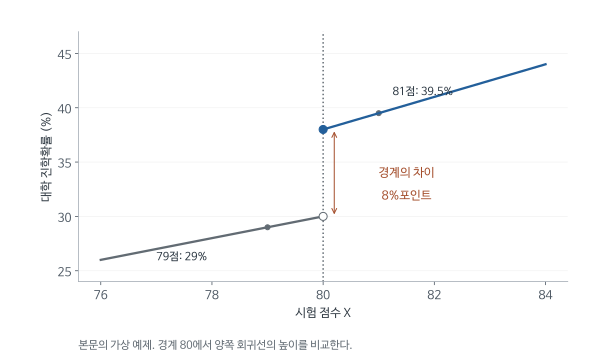

# 기준점 근처의 비교로 인과효과를 추정하는 회귀불연속설계: MHE 6장 심층요약

시험점수가 80점 이상인 학생에게 장학금을 준다고 하자. 장학금 수혜자의 성적이 좋더라도 지원금 덕분이라고 바로 말하기는 어렵다. 높은 점수를 받은 학생이 처음부터 더 잘할 가능성이 있기 때문이다. 그러나 79.9점과 80.1점 학생은 능력 차이는 작으면서 장학금 여부는 다르다. 기준점 주변에서 이 배정 차이를 이용하는 방법이 회귀불연속설계(RD)다.

이 장은 왜 기준점에서의 결과 차이를 처치효과로 해석할 수 있는지 설명하고, 배정규칙이 실제 처치를 완전히 결정하지 못할 때 어떻게 계산을 바꾸는지 다룬다. 장학금 예제로 기본 수식을 유도한 뒤, 학급당 최대 학생 수 규칙을 이용해 작은 학급의 효과를 추정하는 실제 응용으로 이어간다.

[원문 PDF](<MHE Ch6 Regression Discontinuity Designs (2009).pdf>) | [독립형 QnA](<MHE Ch6 Regression Discontinuity Designs (2009)_QnA.md>)

## 1. 능력과 장학금 효과를 구분할 수 있는 점수 구간

점수 50점인 학생과 95점인 학생을 비교하면 장학금 여부와 학업능력이 함께 다르다. RD는 점수 차이를 점점 작게 만들면서 기준점 양쪽의 평균 결과가 어디에 가까워지는지를 비교한다. 처치가 없었을 결과와 처치가 있었을 결과가 점수에 따라 매끄럽게 변한다면, 기준점에서 갑자기 생기는 차이를 장학금 효과로 해석할 근거가 생긴다.

처치 배정을 정하는 점수를 running variable 또는 배정변수 $X_i$, 기준점을 $c$, 처치를 $D_i$, 결과를 $Y_i$로 표시한다. $i$는 학생 등 개별 관측 단위다. $D_i=1\{X_i\ge c\}$의 중괄호는 안의 조건이 참일 때 1이라는 뜻이다.

RD에서 가까운 점수의 학생을 비교하는 이유는 높은 점수 자체의 효과를 없애려는 데 있다. 장학금이 없어도 81점 학생이 79점 학생보다 진학할 가능성이 조금 높을 수 있다. 비교 범위를 점점 기준점으로 좁히고 양쪽 추세를 추정하면 이 매끄러운 차이와 장학금 배정의 갑작스러운 차이를 구분할 수 있다. 점수와 결과가 아무 관계도 없어야 하는 것은 아니다.

‘기준점’도 연구자가 결과를 보고 임의로 정한 점과 구별해야 한다. 80점이라는 숫자가 실제 장학금 지급 규칙에 사용되었다는 제도적 설명이 먼저 필요하다. 결과 그래프에서 갑자기 변화하는 곳을 찾은 뒤 그 위치를 처치 경계라고 부르면, 어떤 개입의 효과인지 정해지지 않는다. RD의 출발점은 행정기관이나 기업이 이미 사용하는 배정규칙이다.

## 2. Sharp RD에서는 기준 통과가 실제 수혜를 결정한다

먼저 기준 이상이면 모두 장학금을 받고 기준 미만이면 아무도 받지 않는 경우를 생각한다. 이를 sharp RD라고 부른다. 배정점수로 수혜 여부가 완전히 정해지므로 같은 점수에서 수혜자와 비수혜자를 함께 관측할 수 없다. 대신 기준점 바로 아래와 바로 위의 결과를 접근시켜 비교한다.

$$
D_i=1\{X_i\ge c\},\qquad
Y_i=(1-D_i)Y_i(0)+D_iY_i(1).
$$

같은 $X$에서 처치와 통제를 동시에 보지 못한다. 따라서 Imbens의 매칭에서 사용한 중첩과는 다른 논리가 필요하다. 이 비교에는 장학금이 없었을 때와 있었을 때의 평균 결과가 각각 기준점에서 연속이라는 가정이 필요하다.

$$
m_0(x)=E[Y(0)\mid X=x],\qquad m_1(x)=E[Y(1)\mid X=x].
$$

연속이란 $x$가 $c$에 가까워지면 평균도 $m_d(c)$에 가까워진다는 뜻이다. 모든 점수에서 동일한 평균이나 직선 관계를 요구하지는 않는다.

조건부 독립에 기초한 매칭은 같은 배경 안에 처치자와 비처치자가 모두 있어야 비교할 수 있다. Sharp RD에서는 점수가 정확히 같으면 처치도 같아 이 방법을 그대로 적용할 수 없다. 연속성은 기준점에 가까운 서로 다른 점수의 결과를 같은 기준점의 잠재평균으로 연결해 주는 조건이다. 왜 새로운 설계가 필요한지 이 차이에서 알 수 있다.

연속성의 대상은 실제 관측 결과 전체가 아니다. 관측 결과에는 장학금이 시작되는 변화가 있으므로 점프가 생길 수 있다. 연속이어야 하는 것은 장학금이 없었을 평균과 있었을 평균 각각이다. 두 매끄러운 곡선 중 어느 곡선을 관측하는지가 기준점에서 바뀌어 결과에 불연속이 나타나는 구조다.

## 3. 기준점의 결과 차이가 처치효과가 되는 대수적 근거

기준점 왼쪽에서는 장학금을 받지 않은 결과를, 오른쪽에서는 받은 결과를 관측한다. 각각의 조건부 평균을 기준점까지 접근시키면 같은 점수에서의 두 잠재결과 평균을 비교할 수 있다. 이 전개에서 필요한 가정은 두 잠재결과 평균이 기준점에서 연속이라는 것이다. 자료에서 결과가 불연속이라는 사실만으로 원인을 정하는 것은 아니다.

$$
\lim_{x\uparrow c}E[Y\mid X=x]
=\lim_{x\uparrow c}E[Y(0)\mid X=x]
=m_0(c).
$$

첫 등호는 처치배정 규칙과 일치성, 둘째는 연속성이다.

오른쪽에서는 모두 처치이므로

$$
\lim_{x\downarrow c}E[Y\mid X=x]
=\lim_{x\downarrow c}E[Y(1)\mid X=x]
=m_1(c).
$$

따라서 오른쪽에서 왼쪽을 빼면

$$
\tau_{RD}=m_1(c)-m_0(c)=E[Y(1)-Y(0)\mid X=c].
$$

원문 식 (6.1.7)의 핵심이다. 효과는 경계에 있는 사람들의 평균효과다. 전체 학생 평균효과라고 일반화하려면 추가 가정이 필요하다.

왼쪽 극한에서 기준점 학생의 미수혜 평균을 얻는 단계가 이 설계의 인과적 역할을 한다. 실제로는 기준점 미만 학생의 자료이지만, 점수가 접근할 때 다른 결정요인의 평균이 갑자기 바뀌지 않는다면 기준점에서의 미수혜 결과를 예측할 수 있다. 오른쪽도 같은 방식으로 수혜 결과를 제공한다. 두 쪽이 같은 위치의 결과를 대표해야 그 차이를 효과로 읽을 수 있다.

만약 80점부터 다른 우수학생 교육도 함께 시작되면 두 곡선의 차이는 장학금과 추가 교육을 함께 반영한다. 장학금만 없앴을 때의 결과가 그 지점에서 연속인지 설득하기 어려워진다. 수식의 극한 표시는 작은 점수 차이를 표현하지만, 어떤 제도가 그 점수에서 함께 변하는지까지 자동으로 확인해 주지는 않는다.

## 4. 기준점 양쪽의 절편과 기울기를 회귀로 추정한다

실제 표본에는 기준점에 무한히 가까운 관측치가 충분히 존재하지 않는다. 따라서 근처의 점수와 결과 관계를 회귀로 추정하고 기준점까지 연장한 값을 비교한다. 양쪽 기울기를 따로 두면 장학금 수혜 여부가 점수와 결과 관계를 바꾸는 것도 허용한다. 아래 회귀식은 이 두 직선을 하나의 식으로 쓴 형태다.

기준점까지의 점수 차이를 $R_i=X_i-c$라고 놓는다. $R_i=0$이 장학금 경계다. 양쪽의 평균 결과를 서로 다른 절편과 기울기를 가진 두 직선으로 쓰고, 처치 더미를 사용해 하나의 회귀식으로 합친다.

$$
m_0(X_i)=\alpha+\beta_0R_i,
\qquad m_1(X_i)=\alpha+\tau+\beta_1R_i
$$

라고 근사한다. 관측 평균 식에 대입하면

$$
E[Y_i\mid X_i]=(1-D_i)(\alpha+\beta_0R_i)
+D_i(\alpha+\tau+\beta_1R_i).
$$

각 항을 펼치면 $-D_i\alpha+D_i\alpha$가 없어진다. $R_iD_i$ 항을 모으면

$$
Y_i=\alpha+\beta_0R_i+\tau D_i
+(\beta_1-\beta_0)D_iR_i+\varepsilon_i.
$$

원문 식 (6.1.6)의 일차 버전이다. $R_i=0$에서 기울기 항들이 모두 0이므로 두 절편 차이 $\tau$가 경계 효과다. 중심화하지 않으면 $D$ 계수만으로 경계점의 차이를 읽을 수 없는 경우가 생긴다.

$D_iR_i$는 기준점 오른쪽의 기울기를 추가로 바꾸는 항이다. $D=0$에서는 기울기가 $\beta_0$, $D=1$에서는 $\beta_0+(\beta_1-\beta_0)=\beta_1$이다.

회귀식의 네 부분은 서로 다른 역할을 한다. 절편은 경계 아래쪽의 예측 결과, 점수항은 기준 아래에서 점수와 결과의 관계, 처치항은 기준점의 차이, 교호항은 오른쪽에서 기울기가 달라지는 정도다. 기초 회귀에서 더미를 넣어 집단별 절편을 다르게 하는 방법에 집단별 기울기도 추가한 모형으로 이해할 수 있다.

양쪽 기울기를 같게 강제하면 오른쪽에서 점수의 영향이 더 가파른 상황을 잘못 설명할 수 있다. 이때 직선의 기울기 오차가 기준점의 절편 차이에도 반영된다. 다만 양쪽에 복잡한 곡선을 많이 추가하는 것이 언제나 해결책은 아니다. 가까운 관측치가 적으면 추정이 불안정해지므로 적절한 함수형태와 사용할 구간을 함께 판단한다.

## 5. 점수 80을 0으로 바꾸면 처치계수의 의미가 명확해진다

기준점이 80일 때 점수에서 80을 빼면 새로운 점수 0이 바로 장학금 배정점이다. 좌우 직선의 기울기 항은 이 점에서 0이 된다. 그 결과 처치 더미의 계수를 기준점에서의 두 예측값 차이로 읽을 수 있다. 점수 단위를 바꾸는 계산이 추정효과의 위치를 명확하게 만드는 이유다.

아래 가상 예제의 결과변수는 대학 진학확률이다. 왼쪽 식은 장학금이 없는 상태, 오른쪽 식은 장학금을 받는 상태를 나타내며 각각 기준점에서 0.30과 0.38의 값을 갖는다.

$$
0.30+0.01(X-80)
$$

오른쪽을

$$
0.38+0.015(X-80)
$$

로 근사한다고 하자. 경계 효과는 $0.38-0.30=0.08$, 즉 8%p다. 79점과 81점의 예측값은 각각 0.29와 0.395이므로 단순 차이는 10.5%p다. 그 차이는 처치 점프에 점수 추세가 더해진 것이다.

RD 회귀는 추세를 경계까지 연장한 절편을 비교한다. 임의로 가까운 두 학생의 결과를 빼는 것과 다르다.

점수 중심화는 학생들의 순서나 실제 장학금 배정을 바꾸지 않는다. 79점은 -1, 80점은 0, 81점은 1로 이름을 바꾸는 작업이다. 기준점을 0으로 표현하면 회귀식에 0을 대입했을 때 점수항과 교호항이 모두 사라져 관심 있는 차이가 바로 드러난다. 통계적으로 새로운 정보를 추가한 것이 아니라 계수의 해석을 연구 질문에 맞춘 것이다.

결과가 진학 여부라는 0과 1의 변수일 때 그 평균은 진학률이다. 따라서 평균의 차이 0.08은 8%포인트다. 기준 진학률 30%에 비하면 약 26.7%의 상대적 증가이지만 두 표현의 분모는 다르다. RD의 점프를 읽을 때에는 원래 결과변수의 단위가 점수인지 확률인지부터 확인해야 한다.

<!-- learning-figure:rd-cutoff -->

*그림 설명: 본문의 가상 장학금 예제를 그렸다. 실제 장학금 연구의 추정 결과는 아니다.*

실선 양쪽을 점수 80까지 따라가면 세로 간격이 8%포인트다. 79점과 81점의 두 점을 비교한 10.5%포인트에는 점수 차이에 따른 변화도 들어 있다. RD의 관심은 경계에서 추정한 두 평균의 차이다.

<!-- /learning-figure -->

## 6. 기준점에 얼마나 가까운 학생까지 분석할 것인가

기준점 주변만 사용하면 잠재결과의 매끄러운 변화를 간단한 직선으로 근사하기 쉽다. 그러나 너무 좁히면 관측치가 줄어 추정치가 불안정해진다. 반대로 넓은 구간을 쓰면 표본은 늘지만 점수와 결과 관계의 곡률을 잘못 근사할 위험이 커진다. 대역폭은 이 비교에 포함할 점수 범위다.

국소선형회귀는 가까운 관측치에 더 큰 가중치를 주어 두 쪽 함수를 경계에서 추정한다.

$$
\min_{a,b}\sum_{i:X_i<c}K((X_i-c)/h)\{Y_i-a-b(X_i-c)\}^2.
$$

$h$는 대역폭으로 얼마나 가까운 자료를 쓰는지를 결정한다. $K$는 가까운 정도에 따라 가중하는 함수다. 왼쪽 추정 절편과 오른쪽 추정 절편을 빼면 점프 추정량이다. 원문은 다항식과 좁은 discontinuity sample을 비교하는 방식도 설명한다.

대역폭이 2라면 장학금 예시에서 78점부터 82점까지의 학생을 사용한다고 생각할 수 있다. 20으로 늘리면 60점과 100점 학생까지 포함되어 표본은 많아지지만 결과와 점수의 관계가 그 전체 범위에서 직선이라는 근사가 더 강해진다. 오차가 줄어드는 이익과 곡률을 잘못 설명하는 비용이 동시에 존재한다.

가중함수는 같은 구간 안에서도 기준점에 가까운 학생을 더 중시할지 정한다. 연구자가 알고 싶은 것은 구간 전체의 평균 성적이 아니라 경계에서의 평균 차이이기 때문이다. 대역폭을 조금 바꾸었을 때 결과의 크기나 부호가 크게 달라진다면, 추정치가 경계의 실제 정보보다 일부 먼 관측치나 함수형태에 의존하는지 검토해야 한다.

### 기준점에서 비교한다면서 왜 양쪽 기울기를 추정하는가

좁은 구간의 단순 평균차이와 기준점 양쪽 극한의 차이는 유한표본에서 같지 않다. $x$를 기준점에서 뺀 점수라 하고, 기준 근처의 결과함수를 왼쪽에서 $a_-+b_-x$, 오른쪽에서 $a_++b_+x$라고 근사하자. 목표는 $\tau=a_+-a_-$다. 왼쪽 관측치의 평균 위치가 $\bar x_-<0$, 오른쪽이 $\bar x_+>0$라면 단순 평균차이는

$$
\overline Y_+-\overline Y_-
\approx\tau+b_+\bar x_+-b_-\bar x_-.
$$

학습용으로 실제 점프가 0이고 양쪽 기울기가 모두 2이며, 평균 점수가 기준점에서 각각 -.5와 .5만큼 떨어져 있다면 평균차이는 $2(.5)-2(-.5)=2$다. 처치효과가 없어도 오른쪽 사람이 조금 더 높은 점수대에 있어 결과가 높다. 양쪽 회귀선을 기준점 0까지 가져와 절편을 비교하면 이 점수 차이를 조정한다.

양쪽 기울기를 다르게 허용하는 이유도 여기 있다. 기준점 아래에서는 점수가 결과와 강하게 관련되고 위에서는 관계가 완만할 수 있다. 한 기울기를 강제하면 잘못 맞춘 추세가 절편 차이로 옮겨갈 수 있다. 반대로 점수를 지나치게 복잡한 함수로 맞추면 소수 관측치에 민감해진다. 대역폭과 함수형태를 함께 점검해야 하는 이유다.

연속 점수에서는 $X=0$인 관측이 한 명도 없어도 극한을 추정할 수 있다. 그러나 점수가 정수 몇 개에만 몰려 있으면 자료를 아무리 늘려도 양쪽에서 임의로 가까이 접근하지 못한다. 이때 가까운 점수 사이를 연결하는 추가 근사에 얼마나 의존하는지 밝혀야 한다.

## 7. 기준을 넘겨도 일부만 장학금을 받는 경우

장학금 기준을 통과해도 신청하지 않는 학생이 있거나 기준 아래에서도 예외 지급을 받는 학생이 있을 수 있다. 이 경우 기준 통과의 결과 차이는 장학금 수혜확률의 변화만큼 희석된다. fuzzy RD는 결과의 불연속을 실제 수혜확률의 불연속으로 나누어, 배정기준 때문에 수혜 여부가 바뀐 학생들의 효과를 구한다.

기준 통과를 $Z_i=1\{X_i\ge c\}$, 실제 장학금 수혜를 $D_i$로 표시한다. $Z_i$가 1이 되어도 $D_i$가 반드시 1이 되는 것은 아니다. 첫 단계 회귀는 이 기준 통과가 실제 수혜율을 얼마나 높이는지 나타낸다.

1단계는

$$
D_i=g(X_i)+\pi Z_i+v_i
$$

이다. $\pi$는 경계에서 실제 처치율이 얼마나 뛰는지를 뜻한다. 결과모형을

$$
Y_i=f(X_i)+\tau D_i+u_i
$$

라고 단순화하고 첫 식을 대입하면

$$
Y_i=f(X_i)+\tau g(X_i)+\tau\pi Z_i+\tau v_i+u_i.
$$

매끄러운 항을 묶으면 결과의 경계 점프는 $\tau\pi$다. 따라서

$$
\tau_{FRD}=\frac{\text{경계 결과 점프}}{\text{경계 처치율 점프}}
=\frac{\Delta_Y}{\Delta_D}.
$$

원문 식 (6.2.2)-(6.2.5)의 논리다. 이 유도는 일정효과 모형으로 직관을 보여준다. 이질적 효과에서는 아래의 추가 가정 아래 경계 순응자 LATE가 된다.

장학금 자격을 얻었지만 신청하지 않는 학생을 실제 수혜자 집단에서 제외하고 수혜자끼리만 비교하면 자발적 신청의 차이가 다시 들어간다. Fuzzy RD는 자격 통과라는 제도적 변화를 먼저 사용하여 실제 수혜가 얼마나 달라지는지 측정한다. 자격과 수혜를 다른 기호로 적는 이유는 관측자료의 선택을 다시 끌어들이지 않기 위해서다.

분모인 수혜율 점프가 작으면 결과 점프를 작은 수로 나누므로 추정이 매우 불안정해질 수 있다. 자격 기준이 존재한다는 사실만으로 좋은 도구가 되는 것은 아니다. 실제 지급과 연결되는 강도가 충분한지 확인해야 하며, 결과만 유의하게 달라진다고 수혜효과가 식별되었다고 볼 수는 없다.

## 8. Fuzzy RD의 비율이 어떤 학생의 효과를 나타내는가

기준 통과가 장학금 수혜확률을 높이고, 결과에는 장학금 수혜를 거쳐 영향을 준다고 가정한다. 여기에 기준을 넘겼기 때문에 오히려 수혜를 포기하는 역방향 반응자가 없다는 단조성 조건 등을 더하면 비율을 인과효과로 해석할 수 있다. 그 대상은 기준점 근처에 있으며 기준 통과로 실제 수혜가 달라진 학생이다.

**학습용 예제:** 경계 아래 장학금 수혜율 0.2, 위 0.7이고 진학률 점프가 0.04이면

$$
\Delta_D=0.7-0.2=0.5,\qquad \tau=0.04/0.5=0.08.
$$

기준 통과는 진학률을 4%p 높이고, 기준 통과 때문에 수혜가 바뀐 사람의 수혜 효과는 8%p다. 이 효과가 적용되는 대상은 기준점 근처 학생 중 기준 통과로 장학금 수혜 여부가 바뀐 학생이다.

동일 기준점에서 상담 서비스도 동시에 제공되면 분자의 변화가 장학금만의 효과가 아닐 수 있다. 이때 단순한 비율은 원하는 처치효과로 해석하기 어렵다.

순응자는 성실하거나 규칙을 잘 지킨다는 성격 분류가 아니다. 이 설계에서는 기준 통과 때문에 수혜 여부가 바뀌는 학생이라는 잠재적 반응 유형이다. 기준 아래에서도 늘 장학금을 받는 학생과 기준 위에서도 받지 않는 학생은 수혜율 점프를 만들지 않는다. 결과의 불연속을 실제 처치 변화로 환산하면 변화에 기여한 사람들의 효과를 얻는다는 의미다.

국소성은 두 층위에서 나타난다. 점수가 기준점 근처라는 제한이 있고, 그중에서도 기준으로 수혜가 달라진 사람이라는 제한이 있다. 경제적으로 어려워 자격만 생기면 반드시 신청하는 학생의 효과가 클 수 있다면, 이를 이미 다른 지원을 받는 학생에게 그대로 적용하기 어렵다. 전체 평균을 원한다면 효과 이질성과 대상 인구에 관한 추가 설명이 필요하다.

## 9. 학급당 최대 40명 규칙이 학급 크기를 바꾸는 방식

학급이 작은 학교의 성적이 좋은 이유는 소규모 수업 때문일 수도 있지만 가정환경이나 학교의 자원 때문일 수도 있다. Maimonides 규칙은 학생 수가 일정 기준을 넘을 때 학급을 하나 더 만들어 평균 학급 크기가 갑자기 작아지는 변동을 제공한다. 등록 학생 수가 거의 같은 학교를 비교하면서 학급 크기의 차이를 얻으려는 설계다.

교재의 응용은 이스라엘 학교의 학급당 상한 40명 규칙이다. 학교 $s$의 해당 학년 등록 인원을 $e_s$, 규칙으로 예측한 학급 크기를 $m_{sc}$라고 두면 필요한 학급 수로 등록 인원을 나누어 아래 식을 얻는다.

$$
m_{sc}=\frac{e_s}{\lfloor(e_s-1)/40\rfloor+1}.
$$

분모는 규칙상 필요한 학급 수다. 등록 40명이면 $\lfloor39/40\rfloor+1=1$이므로 학급 크기는 40이다. 등록 41명이면 $\lfloor40/40\rfloor+1=2$이므로 20.5다. 등록이 한 명 늘었는데 규칙상 학급 크기는 크게 줄어든다.

실제 학교가 항상 정확히 이 규칙대로 행동하지 않으므로 실제 학급 크기 $n_{sc}$는 예측치와 다르다. 규칙 예측치를 도구로 쓰고 등록 인원 추세를 통제한다. 등록 인원이 학교환경과도 관계되기 때문이다.

학생 $i$, 학교 $s$, 학급 $c$를 분리하면

$$
Y_{isc}=\alpha+f(e_s)+\delta d_s+\rho n_{sc}+\eta_{isc}.
$$

여기서 $d_s$는 불리한 배경 학생 비율이며, 앞 절의 처치 $D_i$와는 다른 원문 기호다. 문맥에 따라 같은 문자가 다른 변수를 뜻함에 주의해야 한다.

학급 수 규칙을 읽을 때 등록 인원과 학급 크기를 구분해야 한다. 등록 인원은 학교의 해당 학년 전체 학생 수이고 학급 크기는 그 학생들을 나누어 가르치는 한 반의 학생 수다. 등록이 늘면 보통 학급 크기도 늘지만 40명 기준을 넘는 순간 반을 하나 더 편성하여 반별 학생 수가 감소한다. 이 규칙 때문에 두 변수의 관계가 단조롭게 증가하지 않는다.

부모가 좋은 학교를 찾아 이동하면 등록 인원은 가정환경과 학교의 질을 반영할 수 있다. 따라서 큰 학교와 작은 학교를 단순 비교하지 않고 등록 인원에 따른 매끄러운 관계를 고려한다. 기준점 부근에서 규칙 때문에 생긴 학급 크기의 급격한 차이가 성적에도 나타나는지를 묻는 것이 설계의 목적이다.

## 10. 학급 크기 규칙이 실제 수업과 성적에 미친 변화를 연결한다

학급 편성 규칙이 실제 학급 크기를 얼마나 바꾸었는지부터 확인해야 성적 차이를 해석할 수 있다. 규칙이 실제 학교 운영에 거의 반영되지 않았다면 기준점의 성적 차이를 작은 학급의 효과로 환산하기 어렵다. 이 관계가 첫 단계이며, 이어서 규칙에 따른 성적 변화와 결합해 학급 크기 효과를 추정한다.

교재는 선거에서도 같은 RD 논리를 설명한다. Figure 6.1.2 A는 민주당의 현재 득표차가 0을 넘을 때 다음 선거 승리확률이 어떻게 달라지는지를 보여주며 현직효과를 약 40%포인트로 설명한다. B에서 처치 전의 과거 승리횟수를 확인하는 이유는 원래 강한 후보가 기준점 위에 선택적으로 집중되었는지 진단하기 위해서다.

Figure 6.2.1은 학급규칙 예측값과 실제 크기를 겹친다. 첫 질문은 학생 수 기준에서 실제 처치도 충분히 움직이는가다.

Table 6.2.1에서 단순 OLS 학급크기 계수는 0.322, 통제를 추가한 OLS는 0.019다. 전체 표본 2SLS는 -0.230과 -0.261이다. 원문은 약 -0.25를 기준으로 7명 감소가 점수를 약 1.75점 높이고 학급 평균점수 표준편차 9.6의 약 0.18배라고 설명한다.

$$
(-0.25)(-7)=1.75,\qquad1.75/9.6\approx0.1823.
$$

학생 개인 점수 표준편차로 바꿔 읽으면 안 된다. 구간을 좁힌 열에서는 추정이 비슷한 방향이지만 표준오차가 커진다. 표준오차는 학교 내 상관을 반영한다.

OLS에서 큰 학급의 성적이 높게 나타날 수 있는 한 가지 설명은 좋은 학교에 학생이 더 모인다는 것이다. 이 경우 큰 학급 자체의 효과와 학교의 좋은 환경이 함께 반영된다. 규칙에 따른 학급 크기 변동을 사용한 추정치가 음수라면 그 선발 관계와 다른 비교를 한 결과일 수 있다. 부호가 달라졌다는 사실만으로 모든 OLS가 틀렸다고 일반화하기보다 어떤 변동을 사용했는지 확인해야 한다.

한 학교 학생들의 점수에는 같은 교사, 운영과 지역환경의 영향이 있다. 학생 수가 많다고 각 점수가 완전히 독립적인 정보를 제공하지는 않는다. 학교 내 상관을 반영한 표준오차는 이런 공통 요인을 고려하려는 것이다. 처치효과를 식별하는 문제와 이미 얻은 계수의 정밀도를 평가하는 문제는 구분되지만 둘 다 타당한 결론에 필요하다.

### Table 6.2.1로 확인하는 OLS와 fuzzy RD 추정치

앞 문단들은 OLS 계수가 양수이고 규칙 변동을 쓴 2SLS 계수가 음수라는 결과를 말로만 요약했다. 이 차이가 통제변수를 하나씩 넣으면서 어떻게 사라지는지, 기준점 근처로 표본을 좁혀도 부호가 유지되는지, 그 대가로 정밀도가 얼마나 떨어지는지는 원문 표의 여덟 개 열을 나란히 보아야 알 수 있다. 원문 Table 6.2.1(PDF 파일 기준 16쪽, 인쇄 266쪽)은 Angrist and Lavy(1999)의 5학년 수학 점수 자료로 식 (6.2.6)을 추정한 결과다. 원문 표는 열이 여덟 개라 한 번에 읽기 어려우므로 두 개의 표로 나누었다. 첫 번째 표는 관심 계수인 학급 크기와 표본 정보를 열 번호별로 재배열한 발췌이고, 두 번째 표는 통제변수 계수를 원문 배열대로 옮긴 것이다. 수치는 원문 그대로이며 괄호 안은 표준오차다.

**발췌 1. 원문 Table 6.2.1의 학급 크기 계수와 표본 (행과 열을 바꾸어 재배열)**

| 원문 열 | 추정법 | 표본 | 함께 넣은 통제 | 학급 크기 계수 | (표준오차) | 학급 수 | 평균 점수 (SD) |
|---|---|---|---|---|---|---|---|
| (1) | OLS | 전체 | 없음 | .322 | (.039) | 2,018 | 67.3 (9.6) |
| (2) | OLS | 전체 | 불리 배경 비율 | .076 | (.036) | 2,018 | 67.3 (9.6) |
| (3) | OLS | 전체 | 불리 배경 비율, 등록 인원 | .019 | (.044) | 2,018 | 67.3 (9.6) |
| (4) | 2SLS | 전체 | 불리 배경 비율, 등록 인원 | -.230 | (.092) | 2,018 | 67.3 (9.6) |
| (5) | 2SLS | 전체 | 불리 배경 비율, 등록 인원, 등록 인원 제곱/100 | -.261 | (.113) | 2,018 | 67.3 (9.6) |
| (6) | 2SLS | 불연속 표본 $\pm5$ | 불리 배경 비율 | -.185 | (.151) | 471 | 67.0 (10.2) |
| (7) | 2SLS | 불연속 표본 $\pm5$ | 불리 배경 비율, 등록 인원 | -.443 | (.236) | 471 | 67.0 (10.2) |
| (8) | 2SLS (Wald) | 불연속 표본 $\pm3$ | 구간 더미 (Segment 1, 2) | -.270 | (.281) | 302 | 67.0 (10.6) |

*원문에서 학급 수 2,018과 평균 점수 67.3 (9.6)은 OLS 세 열에 한 번, 전체 표본 2SLS 두 열에 한 번 걸쳐 표기되어 있고, 471과 67.0 (10.2)는 6열과 7열에 걸쳐 한 번 표기되어 있다. 같은 표본이므로 각 열에 반복해 적었다.*

**발췌 2. 원문 Table 6.2.1의 통제변수 계수와 $R^2$ (원문 배열)**

| 설명변수 | (1) | (2) | (3) | (4) | (5) | (6) | (7) | (8) |
|---|---|---|---|---|---|---|---|---|
| Percent disadvantaged | | -.340 (.018) | -.332 (.018) | -.350 (.019) | -.350 (.019) | -.459 (.049) | -.435 (.049) | |
| Enrollment | | | .017 (.009) | .041 (.012) | .062 (.037) | | .079 (.036) | |
| Enrollment squared/100 | | | | | -.010 (.016) | | | |
| Segment 1 (enrollment 38-43) | | | | | | | | -12.6 (3.80) |
| Segment 2 (enrollment 78-83) | | | | | | | | -2.89 (2.41) |
| $R^2$ | .048 | .249 | .252 | | | | | |

*원문 주석: Angrist and Lavy(1999)에서 가져왔다. 식 (6.2.6)을 학급 평균 자료로 추정했으며, 괄호 안 표준오차는 학교 내 상관을 보정한 값이다. 설명변수 행의 빈칸은 해당 변수가 그 열에 포함되지 않았다는 뜻이다. $R^2$ 행의 빈칸은 해당 값을 원문이 보고하지 않았다는 뜻이다.*

**표를 읽는 방법.** 종속변수는 학생 개인 점수가 아닌 학급 평균 5학년 수학 점수이고, 관측 단위는 학급이다. 식 (6.2.6)에 대응시키면 실제 학급 크기 $n_{sc}$가 처치 $D_i$, Maimonides 규칙 예측치 $m_{sc}$가 도구 $T_i$, 등록 인원 $e_s$가 배정변수 $x_i$ 역할을 한다. 1열부터 3열은 실제 학급 크기를 그대로 넣은 OLS이고, 4열부터 7열은 학급 크기를 규칙 예측치로 도구화한 2SLS이고, 8열은 아래에서 설명하듯 기준점 오른쪽 여부 더미를 도구로 쓴다. 4열과 5열은 전체 2,018개 학급을 쓰고 등록 인원을 각각 선형과 이차식으로 통제한다. 6열과 7열은 등록 인원이 40, 80, 120의 기준점에서 $\pm5$명 안에 있는 학교로 표본을 좁혔고, 8열은 $\pm3$명으로 더 좁혔다. 원문 본문(PDF 17쪽)에 따르면 8열은 $m_{sc}$ 대신 "기준점 바로 오른쪽 학교인가"를 나타내는 더미를 도구로 쓴 Wald 추정치이고, Segment 1과 2는 어느 기준점 근처인지를 표시하는 더미 통제다. 원문 표에는 유의성 별표가 없으므로 유의성은 계수를 표준오차로 나누어 직접 판단해야 한다.

**계수의 단위.** 학급 크기 계수는 학급 인원이 한 명 늘 때 학급 평균 점수가 몇 점 바뀌는지를 뜻한다. 4열의 -.230은 규칙 때문에 학급이 한 명 커지면 학급 평균 수학 점수가 약 0.23점 낮아진다는 추정이다. 불리 배경 비율은 퍼센트 단위이므로 4열의 -.350은 불리 배경 학생 비율이 1%포인트 높은 학교의 학급 평균 점수가 0.35점 낮다는 뜻이다. 등록 인원 계수 .041은 학년 등록 학생이 한 명 많을 때 점수가 0.041점 높다는 조건부 관계다. 5열의 이차항은 제곱을 100으로 나눈 척도로 들어가 있어 -.010을 그대로 한 명당 효과로 읽으면 안 된다.

**OLS 세 열이 보여 주는 것.** 통제가 없는 1열의 .322는 표준오차 .039의 약 8.3배로, 큰 학급일수록 점수가 높다는 강한 양의 상관이다. 불리 배경 비율을 넣은 2열에서 계수는 .076으로 줄고 $R^2$는 .048에서 .249로 오른다. 같은 표본의 OLS이므로 누락변수 공식 $.322=.076+(-.340)\times\delta$를 적용해 역산하면 $\delta\approx-0.72$다. 학급이 한 명 큰 곳일수록 불리 배경 비율이 약 0.72%포인트 낮았다는 뜻이며, 1열의 양수 계수 대부분이 학교 구성의 차이에서 나왔다는 해석과 맞는다(이 역산은 원문에 없는 요약자의 계산이다). 등록 인원까지 넣은 3열의 .019는 표준오차 .044보다 작아 0과 구별되지 않는다. 원문은 이 단계에서도 작은 학급이 낫다는 증거는 없다고 적는다.

**2SLS 열이 보여 주는 것.** 같은 통제를 쓴 3열과 4열을 비교하면 추정법만 바뀌었는데 부호가 .019에서 -.230으로 뒤집힌다. 4열의 t값은 $-.230/.092\approx-2.5$, 5열은 $-.261/.113\approx-2.3$으로 통상적인 5% 기준에서 유의하다. 4열의 근사 95% 신뢰구간은 $-.230\pm1.96\times.092$, 즉 약 $[-0.41,\,-0.05]$다. 등록 인원 통제를 선형에서 이차식으로 바꿔도 -.230과 -.261로 비슷하므로 이 두 함수형태 사이에서는 추정치가 안정적이다. 모든 함수형태 선택에 무관하다는 뜻은 아니다. 7명 감축에 대입하면 4열은 $(-.230)(-7)=1.61$점, 5열은 $(-.261)(-7)\approx1.83$점이고, 학급 평균 점수 표준편차 9.6으로 나누면 각각 약 0.17과 0.19다. 원문의 "약 1.75점, 0.18σ"는 두 값의 중간인 -.25를 기준으로 한 요약이다.

**표본을 좁힌 열이 보여 주는 것.** $\pm5$ 표본의 학급 수 471은 전체 2,018의 약 23%이고, $\pm3$ 표본의 302는 약 15%다. 원문이 말한 "약 4분의 1"은 첫 번째 비율을 가리킨다. 표본이 줄면서 학급 크기 계수의 표준오차는 .092에서 .151, .236, .281로 커진다. 6열 -.185의 t값은 약 -1.2, 7열 -.443은 약 -1.9, 8열 -.270은 약 -1.0이므로 세 열 모두 단독으로는 5% 기준에서 0과 구별되지 않는다. 8열의 근사 95% 신뢰구간은 약 $[-0.82,\,0.28]$로 0을 포함한다. 그런데도 부호는 모두 음수이고 크기는 -.185에서 -.443 사이에서 전체 표본 추정치 근처를 오간다. 이것이 6절에서 설명한 discontinuity sample 점검이다. 기준점으로 다가가며 다항 통제를 줄여도 추정치가 크게 바뀌지 않는지 확인하고, 그 대가로 정밀도를 잃는 모습을 한 표에서 보여 준다. 6열과 7열의 차이는 등록 인원 통제 여부에서 생기므로, 좁은 표본에서도 배정변수 추세를 넣느냐가 점추정치를 꽤 움직인다는 점도 함께 읽힌다.

**이 표로 말할 수 있는 것과 없는 것.** 이 표는 규칙에 따른 학급 크기 변동을 쓰면 학급 인원 감소가 학급 평균 수학 점수를 높인다는 방향의 증거가 여러 표본과 통제 조합에서 일관되게 나온다는 점을 뒷받침한다. OLS의 양수 계수가 불리 배경 비율과 등록 인원 통제로 대부분 사라진다는 점에서, 단순 비교가 학교 구성에 의한 선택을 반영했다는 해석도 가능하다. 반면 이 표만으로 모든 학교, 모든 학급 규모 변화에 같은 효과가 있다고 말할 수는 없다. 2SLS 계수는 학급 크기가 규칙에 반응한 학교의 변동을 이용한다. 특히 좁은 불연속 표본은 등록 인원이 40의 배수 근처인 학교의 효과를 보여 준다. 전체 표본 추정에는 문턱에서 떨어진 관측과 등록 인원에 대한 함수형태 가정도 기여한다. 계수는 학급 평균 점수 기준이므로 학생 개인 점수의 표준편차로 환산한 효과크기와 같지 않다. 좁은 표본 열 하나하나는 정밀도가 낮아 "효과가 -.443이다"처럼 특정 값을 확정하는 근거가 되지 못한다. 불리 배경 비율과 등록 인원의 계수는 통제변수의 조건부 관계일 뿐 인과효과로 설계된 추정치가 아니다. 8열의 Segment 계수 -12.6과 -2.89는 어느 기준점 구간에 속하는지를 나타내는 더미의 계수인데, 원문은 기준 범주를 밝히지 않았으므로 이 값을 구간 간 효과 차이로 해석해서는 안 된다. 마지막으로 원문은 테네시 STAR 실험 결과와 "크게 다르지 않다"고 적지만, 이 표에는 STAR 추정치가 없으므로 두 연구의 비교는 표 밖의 정보에 의존한다.

### Fuzzy RD에서 같은 창을 써야 하는 이유

분자의 결과 점프를 $\Delta_Y$, 분모의 처치율 점프를 $\Delta_D$라 쓰면 $\tau=\Delta_Y/\Delta_D$다. 두 점프는 같은 기준에서 같은 대상에 관한 비교여야 한다. 결과에는 아주 가까운 사람만 쓰고 처치율에는 넓은 범위의 다른 사람들을 섞은 뒤 아무 설명 없이 나누면, 같은 경계의 순응자 효과라는 해석을 뒷받침하기 어렵다. 각 점프가 동일한 경계 극한을 일관되게 추정하는지 확인해야 한다.

교육용으로 결과 점프가 성적 .6점, 처치율 점프가 .2라면 효과는 3점이다. “경계를 넘은 학생의 성적이 3점 높다”가 아니라, 경계 통과 때문에 처치가 달라진 학생의 처치효과가 3점이라는 뜻이다. 경계를 넘은 전체 학생의 평균 결과 변화는 .6점이다.

$$
\widehat\tau-\tau\approx
\frac{(\widehat\Delta_Y-\Delta_Y)-\tau(\widehat\Delta_D-\Delta_D)}{\Delta_D}.
$$

같은 .1점의 결과 점프 오차라도 분모가 .2이면 효과 오차는 대략 .5점, 분모가 .05이면 2점이다. 분모가 작을 때 결과 그래프의 작은 흔들림이 큰 처치효과로 환산된다. 처치율이 실제로 충분히 뛰는지, 결과와 처치의 점프가 같은 규칙에서 비롯되는지부터 보여 주어야 Wald 비율을 이해할 수 있다.

## 11. 기준점에서 다른 변화도 일어나면 효과 해석이 어려워진다

80점 이상 학생에게 장학금과 개인상담을 동시에 제공하면 기준점의 결과 차이는 두 개입을 함께 반영한다. 학생이 점수를 정교하게 조작할 수 있고 조작 능력이 미래 성과와 관련된다면 기준점 양쪽의 학생 구성도 달라진다. RD가 설득력을 갖추려면 이런 제도와 선택과정을 살펴야 한다.

공변량과 밀도의 점프를 살피는 이유는 이런 설명을 검토하기 위해서다. 점프가 관측되지 않는다고 연속성 전체가 증명되지는 않는다. 특히 실행변수가 이산적이면 경계에 무한히 가까운 관측값을 실제로 얻는다는 극한 직관을 곧바로 적용하기 어렵다.

점수 조작의 문제는 학생이 공부를 더 했다는 사실 자체에서 나오지 않는다. 기준 통과 여부를 정교하게 통제할 수 있는 학생이 바로 위에 집중되고, 그 능력이나 배경이 미래 결과에도 영향을 주면 양쪽의 비교 가능성이 약해진다. 예컨대 특정 가정이 재채점 절차를 이용해 기준 바로 위로 이동한다면 가정의 자원도 함께 바뀔 수 있다.

사전 성적과 부모 특성의 연속성, 점수 분포의 비정상적인 집중을 보는 검사는 이런 선별을 점검한다. 자료에 기록되지 않은 특성은 여전히 남을 수 있으므로 여러 검사와 제도적 설명을 함께 사용한다. 특히 정수 점수처럼 가능한 값이 적으면 양쪽에서 실제로 얼마나 가까운 비교를 할 수 있는지도 보고해야 한다.

## 12. 배정규칙을 안다는 사실에서 인과추론까지 필요한 설명

RD를 적용할 때는 기준점, 실제 처치 변화, 다른 제도의 동시 변화, 점수 조작 가능성을 구체적으로 설명해야 한다. 그다음에 기준점 근처 비교로 얻은 효과가 누구에게 적용되는지 정한다. 이 장의 수식들은 이런 제도적 설명을 회귀계수와 연결하는 방법을 제공한다.

- 무엇을 배웠는가: 알려진 배정규칙의 불연속이 비교 가능한 국소 변이를 제공할 수 있다.
- 핵심 방법: 결과의 경계 점프를 추정하고 fuzzy에서는 실제 처치의 점프로 나눈다.
- 언제 쓰는가: 명확한 기준점, 충분한 관측치, 조작과 동시 처치에 대한 제도적 근거가 있을 때다.

RD 결과를 정책 결정에 사용하려면 ‘누가 경계에 있는가’를 다시 물어야 한다. 장학금 기준이 80점이면 그 근처 학생에 대한 효과는 자격 기준을 소폭 완화할 때의 판단에 특히 관련된다. 최하위 학생이나 매우 우수한 학생의 효과까지 같은지는 자료가 직접 알려주지 않는다. 국소효과라는 말은 적용할 질문을 구체적으로 정해야 한다는 뜻이다.

교재의 장학금, 선거와 학급 사례는 대상은 다르지만 같은 순서로 읽을 수 있다. 실제 배정규칙이 무엇인지 확인하고 그 규칙이 실제 처치를 바꾸는지 살핀 뒤, 같은 기준에서 다른 원인이 갑자기 달라지지 않는지 평가한다. 마지막으로 결과의 단위와 적용 대상을 정한다. 이 설명이 갖추어져야 회귀계수가 연구 질문에 대한 답이 된다.

## 출처와 보충 설명

대상: Mostly Harmless Econometrics 6장, 인쇄 251-267쪽. 보관 PDF 18쪽의 텍스트를 검토했다. 원문 수식 번호를 연결하고 학습용 수치 예제를 추가했다. 교재의 2009년 방법론 설명을 다루며 최신 실무 지침 전체를 대신하지 않는다.
