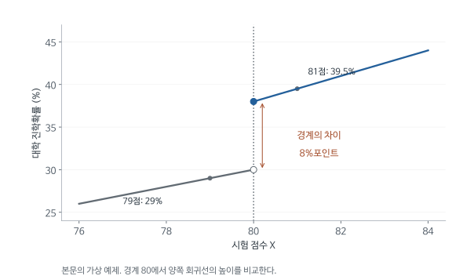

# 기준점 근처의 비교로 인과효과를 추정하는 회귀불연속설계: MHE 6장 심층요약

시험점수가 80점 이상인 학생에게 장학금을 준다고 하자. 장학금 수혜자의 성적이 좋더라도 지원금 덕분이라고 바로 말하기는 어렵다. 높은 점수를 받은 학생이 처음부터 더 잘할 가능성이 있기 때문이다. 그러나 79.9점과 80.1점 학생은 능력 차이는 작으면서 장학금 여부는 다르다. 기준점 주변에서 이 배정 차이를 이용하는 방법이 회귀불연속 설계(regression discontinuity design, RD)다.

이 장의 출발 사례도 같은 구조다. 미국 고등학생은 PSAT 점수를 기준으로 National Merit Scholarship을 받는다. PSAT는 대학 진학을 준비하는 고등학교 11학년생 대부분이 치르는 시험이다. RD를 처음 논의한 연구(Thistlethwaite and Campbell 1960, 원문 표기는 Thistlewaithe; Campbell 1969)는 이 장학금을 받은 학생이 그 때문에 대학원 진학 같은 진로 계획을 바꾸는지 물었다. PSAT 점수가 높은 학생은 장학금이 없어도 대학원에 더 많이 갈 것이므로, 수상 기준 근처에서 점수와 진학률의 관계를 회귀로 추정한 뒤 기준점에서 회귀선이 점프하는 크기를 효과의 증거로 삼는다. 회귀선의 이 점프가 RD라는 이름의 유래다. 이 요약의 80점 장학금 예시와 그 수치는 이 구조를 설명하려고 만든 가상 예시다. 실제 추정 결과는 선거(11절)와 학급 크기(9-10절) 사례에서 다룬다.

이 장은 왜 기준점에서의 결과 차이를 처치효과(treatment effect)로 해석할 수 있는지 설명하고, 배정규칙(assignment rule)이 실제 처치를 완전히 결정하지 못할 때 추정식을 어떻게 수정하는지 다룬다. 장 첫머리에서 RD는 두 종류로 나뉜다. 기준 통과가 처치를 완전히 결정하는 sharp RD는 관측된 변수 하나(배정변수, 장학금 예에서는 시험점수)만 통제하면 되는 관측변수에 의한 선택(selection on observables) 설계로 볼 수 있다. 기준 통과가 처치를 받을 확률만 바꾸는 fuzzy RD는 기준 통과 여부를 실제 처치의 도구로 사용하는 도구변수(IV) 설계가 된다(7절). 발상의 바탕은 규칙이 촘촘한 세상에서는 일부 규칙이 자의적이고, 그런 규칙이 좋은 실험을 제공한다는 생각이다. 80점이라는 숫자가 학생의 능력과 특별한 관계없이 정해졌다면 79.9점과 80.1점 학생의 운명을 가른 것은 사실상 우연이다. 장학금 예제로 기본 수식을 유도한 뒤, 학급당 최대 학생 수 규칙을 이용해 작은 학급의 효과를 추정하는 실제 응용으로 이어간다.

[원문 PDF](<MHE Ch6 Regression Discontinuity Designs (2009).pdf>) | [개념 퀴즈](<MHE Ch6 Regression Discontinuity Designs (2009)_QnA.md>) | [수식·모델 퀴즈](<MHE Ch6 Regression Discontinuity Designs (2009)_수식모델퀴즈.md>) | [실무 Cheat Sheet](<MHE Ch6 Regression Discontinuity Designs (2009)_실무CheatSheet.md>)

## 1. 능력과 장학금 효과를 구분할 수 있는 점수 구간

점수 50점인 학생과 95점인 학생을 비교하면 장학금 여부와 학업능력이 함께 다르다. RD는 점수 차이를 점점 작게 만들면서 기준점 양쪽의 평균 결과가 어디에 가까워지는지를 비교한다. 처치가 없었을 결과와 처치가 있었을 결과가 점수에 따라 매끄럽게 변한다면, 기준점에서 갑자기 생기는 차이를 장학금 효과로 해석할 근거가 생긴다.

처치 배정을 정하는 점수를 running variable 또는 배정변수 $X_i$, 기준점을 $c$, 처치를 $D_i$, 결과를 $Y_i$로 표시한다. $i$는 학생 등 개별 관측 단위(unit of observation)다. $D_i=1\{X_i\ge c\}$의 중괄호는 안의 조건이 참일 때 1이라는 뜻이다.

이 요약은 원문과 다소 다른 기호를 사용한다. 교재의 식 번호와 대조할 때는 다음 대응을 참고한다.

| 이 요약의 기호 | 원문 기호 | 뜻 |
|---|---|---|
| $X_i$ | $x_i$ | 배정변수 (running variable) |
| $c$ | $x_0$ | 기준점 (9절의 $m_{sc}$, $n_{sc}$에서는 $c$가 학급 번호다) |
| $D_i$ | $d_i$ | 실제 처치 (장학금 수혜, 현직 여부, 학급 크기 등) |
| $Z_i=1\{X_i\ge c\}$ | $t_i$ | fuzzy RD에서 기준 통과를 나타내는 더미, 도구변수 역할 |
| $R_i=X_i-c$ | $\tilde x_i$ | 기준점에서 잰 점수 (중심화한 점수) |
| $\tau$ | $\rho$ | 기준점에서의 처치효과 |
| $Y_i(0)$, $Y_i(1)$ | $y_{0i}$, $y_{1i}$ | 처치를 받지 않았을 때와 받았을 때의 잠재결과 |

RD에서 가까운 점수의 학생을 비교하는 이유는 높은 점수 자체의 효과를 배제하려는 데 있다. 장학금이 없어도 81점 학생이 79점 학생보다 진학할 가능성이 다소 높을 수 있다. 비교 범위를 점점 기준점으로 좁히고 양쪽 추세를 추정하면 이 매끄러운 차이와 장학금 배정의 갑작스러운 차이를 구분할 수 있다. 점수와 결과가 아무 관계도 없어야 하는 것은 아니다.

‘기준점’도 연구자가 결과를 확인한 뒤 임의로 정한 점과 구별해야 한다. 80점이라는 숫자가 실제 장학금 지급 규칙에 사용되었다는 제도적 설명이 먼저 필요하다. 결과 그래프에서 갑자기 변화하는 곳을 찾은 뒤 그 위치를 처치 경계라고 부르면, 어떤 개입의 효과인지 정해지지 않는다. RD의 출발점은 행정기관이나 기업이 이미 사용하는 배정규칙이다.

## 2. Sharp RD에서는 기준 통과가 실제 수혜를 결정한다

먼저 기준 이상이면 모두 장학금을 받고 기준 미만이면 아무도 받지 않는 경우를 생각한다. 이를 sharp RD라고 부른다. 배정변수인 점수로 수혜 여부가 완전히 정해지므로 같은 점수에서 수혜자와 비수혜자를 함께 관측할 수 없다. 대신 기준점 바로 아래와 바로 위의 결과를 접근시켜 비교한다.

$$
D_i=1\{X_i\ge c\},\qquad
Y_i=(1-D_i)Y_i(0)+D_iY_i(1).
$$

$Y_i(1)$과 $Y_i(0)$은 같은 학생 $i$가 장학금을 받았을 때와 받지 않았을 때의 결과, 즉 잠재결과(potential outcome)다. 한 학생에게서는 둘 중 하나만 관측된다. 둘째 식은 관측된 결과 $Y_i$가 실제로 받은 처치에 해당하는 잠재결과와 같다는 뜻이며, 이 연결을 일치성(consistency)이라 부른다.

같은 $X$에서 처치와 통제를 동시에 관측할 수 없다. 7주차 Imbens(2004)의 매칭은 공변량(covariate) 값이 같은 처치자와 비처치자를 짝지어 비교하므로, 각 공변량 값에 두 집단이 모두 존재한다는 중첩(common support)에 의존했다. 따라서 RD에는 이와 다른 논리가 필요하다. 이 비교에는 장학금이 없었을 때와 있었을 때의 평균 결과가 각각 기준점에서 연속이라는 가정이 필요하다.

$$
m_0(x)=E[Y(0)\mid X=x],\qquad m_1(x)=E[Y(1)\mid X=x].
$$

연속이란 $x$가 $c$에 가까워지면 평균도 $m_d(c)$에 가까워진다는 뜻이다. 모든 점수에서 동일한 평균이나 직선 관계를 요구하지는 않는다.

조건부 독립(conditional independence)에 기초한 매칭은 같은 배경 안에 처치자와 비처치자가 모두 있어야 비교할 수 있다. Sharp RD에서는 점수가 정확히 같으면 처치도 같아 이 방법을 그대로 적용할 수 없다. 연속성은 기준점에 가까운 서로 다른 점수의 결과를 같은 기준점의 잠재평균으로 연결해 주는 조건이다. 왜 새로운 설계가 필요한지 이 차이에서 알 수 있다.

이 특징에서 두 결론이 나온다. 우선 sharp RD는 관측변수에 의한 선택 설계다. 처치 여부가 $X_i$만으로 결정되므로 $X_i$를 통제하면 처치와 결과에 동시에 영향을 미치는 다른 교란변수(confounder)가 남지 않는다. 그런데 같은 $X_i$ 값에서 처치자와 통제자를 모두 관측하는 곳이 없으므로(RD 방법론을 개관한 Imbens and Lemieux 2008의 지적), 기준점 왼쪽의 추세를 오른쪽으로 약간 연장하는 외삽(extrapolation)을 받아들여야 한다. 그래서 같은 공변량 값 안에서 처치자와 통제자를 비교할 수 있는 교재 3장의 회귀와 달리, RD에서는 함수형태(functional form) 선택에 무심할 수 없다. 기준점 근처에서 $E[Y(0)\mid X]$의 모양을 잘못 가정하면 그 오차가 효과 추정치에 그대로 반영된다. 6절에서 다룰 곡선 오인 문제가 여기서 비롯된다.

연속성의 대상은 실제 관측 결과 전체가 아니다. 관측 결과에는 장학금이 시작되는 변화가 있으므로 점프가 생길 수 있다. 연속이어야 하는 것은 장학금이 없었을 평균과 있었을 평균 각각이다. 두 매끄러운 곡선 중 어느 곡선을 관측하는지가 기준점에서 바뀌어 결과에 불연속이 나타나는 구조다.

## 3. 기준점의 결과 차이가 처치효과가 되는 대수적 근거

기준점 왼쪽에서는 장학금을 받지 않은 결과를, 오른쪽에서는 받은 결과를 관측한다. 각각의 조건부 평균을 기준점까지 접근시키면 같은 점수에서의 두 잠재결과 평균을 비교할 수 있다. 이 전개에서 필요한 가정은 두 잠재결과 평균이 기준점에서 연속이라는 것이다. 자료에서 결과가 불연속이라는 사실만으로 원인을 정하는 것은 아니다.

$$
\lim_{x\uparrow c}E[Y\mid X=x]
=\lim_{x\uparrow c}E[Y(0)\mid X=x]
=m_0(c).
$$

첫 등호는 처치배정 규칙과 일치성에서 도출된다. 기준점 왼쪽 학생은 모두 $D=0$이므로 관측 결과가 곧 $Y(0)$이다. 둘째 등호는 연속성 가정(continuity assumption)에 근거한다. 극한을 취하면 기준점 바로 아래 학생들의 $Y(0)$ 평균이 기준점 학생의 $Y(0)$ 평균 $m_0(c)$에 가까워진다.

오른쪽에서는 모두 처치이므로

$$
\lim_{x\downarrow c}E[Y\mid X=x]
=\lim_{x\downarrow c}E[Y(1)\mid X=x]
=m_1(c).
$$

따라서 오른쪽에서 왼쪽을 빼면

$$
\tau_{RD}=m_1(c)-m_0(c)=E[Y(1)-Y(0)\mid X=c].
$$

식 (6.1.7)에 해당한다. 같은 결과는 기준점 양쪽 폭 $\Delta$의 구간 평균, 곧 $x_0-\Delta<x_i<x_0$ 구간과 $x_0\le x_i<x_0+\Delta$ 구간의 평균 차이가 $\Delta\to0$일 때 수렴하는 값으로도 표현된다. 효과는 경계에 있는 사람들의 평균효과다. 전체 학생 평균효과라고 일반화하려면 추가 가정이 필요하다.

저자들은 이 극한 비교의 장점 두 가지를 강조한다. 하나는 $E[Y(0)\mid X]$의 함수형태를 올바르게 지정하지 않아도 된다는 점이다. 구간이 충분히 좁으면 그 안에서 곡선의 모양은 거의 문제가 되지 않는다. 다른 하나는 모든 학생의 효과가 같다는 일정효과(constant effects) 가정 $Y_i(1)-Y_i(0)=\tau$가 필요 없다는 점이다. 학생마다 효과가 달라도 극한은 기준점 학생들의 평균효과 $E[Y(1)-Y(0)\mid X=c]$를 식별한다.

왼쪽 극한에서 기준점 학생의 미수혜 평균을 얻는 단계가 이 설계의 인과적 역할을 한다. 실제로는 기준점 미만 학생의 자료이지만, 점수가 접근할 때 다른 결정요인의 평균이 갑자기 바뀌지 않는다면 기준점에서의 미수혜 결과를 예측할 수 있다. 오른쪽도 같은 방식으로 수혜 결과를 제공한다. 양쪽이 같은 위치의 결과를 대표해야 그 차이를 효과로 해석할 수 있다.

만약 80점부터 다른 우수학생 교육도 함께 시작되면 두 곡선의 차이는 장학금과 추가 교육을 함께 반영한다. 장학금만 없앴을 때의 결과가 그 지점에서 연속인지 설득하기 어려워진다. 수식의 극한 표시는 작은 점수 차이를 표현하지만, 어떤 제도가 그 점수에서 함께 변하는지까지 자동으로 확인해 주지는 않는다.

## 4. 기준점 양쪽의 절편과 기울기를 회귀로 추정한다

실제 표본에는 기준점에 무한히 가까운 관측치가 충분히 존재하지 않는다. 따라서 근처의 점수와 결과 관계를 회귀로 추정하고 기준점까지 연장한 값을 비교한다.

논의는 가장 단순한 모형에서 출발한다. 처치가 없을 때의 평균 결과가 점수의 직선 $E[Y_i(0)\mid X_i]=\alpha+\beta X_i$이고 모든 학생의 효과가 같다면($Y_i(1)=Y_i(0)+\tau$), 관측 결과는 $Y_i=\alpha+\beta X_i+\tau D_i+\eta_i$로 표현할 수 있다(식 6.1.2, 교재는 $\tau$ 자리에 $\rho$를 사용한다). 여기서 $D_i$는 $X_i$와 상관될 뿐 아니라 $X_i$로 완전히 결정된다. 그런데도 회귀가 $\tau$와 $\beta$를 따로 추정할 수 있는 이유는 $D_i=1\{X_i\ge c\}$가 계단 모양이고 $X_i$는 매끄러운 직선이라는 데 있다. 어떤 직선도 80점에서 불연속적으로 한 단계 상승하는 계단함수(step function)를 재현하지 못하므로 두 변수 사이에 완전공선성(perfect multicollinearity)이 없다. 결과의 변화 가운데 기준점에서 계단처럼 생기는 부분은 $D_i$의 계수로, 점수를 따라 완만하게 증가하는 부분은 $X_i$의 계수로 분리해 반영하는 것이 RD 회귀다. 이 분리는 매끄러운 부분의 함수형태를 올바르게 설정했을 때만 신뢰할 수 있다. 추세가 직선이 아닌 $E[Y_i(0)\mid X_i]=f(X_i)$라면 $Y_i=f(X_i)+\tau D_i+\eta_i$(식 6.1.3)를 추정하고, $f$를 $p$차 다항식 $\beta_1X_i+\beta_2X_i^2+\dots+\beta_pX_i^p$로 근사한 것이 식 (6.1.4)다. $f$가 기준점 근처에서 연속이기만 하면 유연한 함수형태로도 이런 모형을 추정할 수 있다.

여기에 한 가지를 더 허용할 수 있다. 양쪽 기울기를 별도로 설정하면 장학금 수혜 여부가 점수와 결과 관계를 바꾸는 것도 허용한다. 아래 회귀식은 이 두 직선을 하나의 식으로 표현한 형태다.

기준점까지의 점수 차이를 $R_i=X_i-c$라고 놓는다. $R_i=0$이 장학금 경계다. 양쪽의 평균 결과를 서로 다른 절편(intercept)과 기울기를 가진 두 직선으로 나타내고, 처치 더미(treatment dummy)를 사용해 하나의 회귀식으로 합친다.

$$
m_0(X_i)=\alpha+\beta_0R_i,
\qquad m_1(X_i)=\alpha+\tau+\beta_1R_i
$$

라고 근사한다. 관측 평균 식에 대입하면

$$
E[Y_i\mid X_i]=(1-D_i)(\alpha+\beta_0R_i)
+D_i(\alpha+\tau+\beta_1R_i).
$$

각 항을 전개하면 $-D_i\alpha+D_i\alpha$가 상쇄된다. $R_iD_i$ 항을 모으면

$$
Y_i=\alpha+\beta_0R_i+\tau D_i
+(\beta_1-\beta_0)D_iR_i+\varepsilon_i.
$$

식 (6.1.6)의 일차 버전이다. $R_i=0$에서 기울기 항들이 모두 0이므로 두 절편 차이 $\tau$가 경계 효과다. 중심화(centering)하지 않으면 $D$ 계수가 경계점의 차이와 다른 값이 되는 경우가 생긴다(5절의 수치 예 참고).

$D_iR_i$는 기준점 오른쪽의 기울기를 추가로 바꾸는 항이다. $D=0$에서는 기울기가 $\beta_0$, $D=1$에서는 $\beta_0+(\beta_1-\beta_0)=\beta_1$이다.

회귀식의 네 부분은 서로 다른 역할을 한다. 절편은 경계 아래쪽의 예측 결과, 점수항은 기준 아래에서 점수와 결과의 관계, 처치항은 기준점의 차이, 교호항(interaction term)은 오른쪽에서 기울기가 달라지는 정도다. 기초 회귀에서 더미를 포함해 집단별 절편을 다르게 하는 방법에 집단별 기울기도 추가한 모형으로 이해할 수 있다.

양쪽 기울기를 같게 강제하면 오른쪽에서 점수의 영향이 더 가파른 상황을 잘못 설명할 수 있다. 이때 직선의 기울기 오차가 기준점의 절편 차이에도 반영된다. 다만 양쪽에 복잡한 곡선을 많이 추가하는 것이 언제나 해결책은 아니다. 가까운 관측치가 적으면 추정이 불안정해지므로 적절한 함수형태와 사용할 구간을 함께 판단한다.

### 다항식 차수는 무엇을 조정하는가

식 (6.1.6)은 위 일차식을 양쪽 모두 $p$차 다항식으로 확장한 형태다. 기준 아래 곡선을 $\alpha+\beta_{01}R+\beta_{02}R^2+\dots+\beta_{0p}R^p$, 위 곡선을 $\alpha+\tau+\beta_{11}R+\dots+\beta_{1p}R^p$로 설정하고 앞에서와 같이 $(1-D)$와 $D$로 가중해 합치면 차수마다 $R^k$ 항과 $DR^k$ 항이 하나씩 생긴다. $DR^k$ 항의 계수 $\beta^*_k=\beta_{1k}-\beta_{0k}$는 오른쪽 곡선의 형태가 왼쪽 곡선과 얼마나 다른지를 나타낸다. 기준점에서는 $R=0$이므로 모든 $R^k$ 항이 사라지고 효과는 $\tau$ 하나로 남는다. 기준점에서 오른쪽으로 $r$만큼 떨어진 점의 효과는 $\tau+\beta^*_1r+\beta^*_2r^2+\dots+\beta^*_pr^p$다. 다만 그 점에서는 처치받은 학생만 관측되므로 이 값은 왼쪽 곡선을 오른쪽으로 연장한 외삽에 의존한다. 교호항을 모두 0으로 제약하면($\beta^*_1=\dots=\beta^*_p=0$) 양쪽 곡선의 모양이 같다고 가정하는 식 (6.1.4)로 환원된다.

차수 $p$는 매끄러운 추세에 어느 정도의 곡률(curvature)을 허용할지 정하는 선택이다. 차수를 높이면 실제로 곡선인 추세를 계단으로 잘못 해석할 위험이 줄어든다. 대신 추정할 계수가 늘어 추정치의 분산(variance)이 커지고, 기준점에서 먼 관측치가 곡선 끝부분의 모양을 좌우할 수 있다. 차수를 낮추면 이 득실이 반대로 바뀐다. 저자들은 교호항이 있는 (6.1.6)이 조건부 평균함수(conditional mean function)에 제약을 두지 않는다는 장점이 있지만, 경험상 더 단순한 (6.1.4)의 $\tau$ 추정치도 대체로 유사하게 추정된다고 서술한다. 어느 모형이든 $\tau$는 주로 기준점 근처의 $E[Y\mid X]$ 변화에서 결정되기 때문이다. 차수 선택이 결과를 얼마나 바꿀 수 있는지는 6절의 가상 예제에서 수치로 확인한다.

## 5. 점수 80을 0으로 바꾸면 처치계수의 의미가 명확해진다

기준점이 80일 때 점수에서 80을 빼면 새로운 점수 0이 바로 장학금 배정점이다. 좌우 직선의 기울기 항은 이 점에서 0이 된다. 그 결과 처치 더미의 계수를 기준점에서의 두 예측값(predicted value) 차이로 해석할 수 있다. 점수 단위를 바꾸는 계산이 추정효과의 위치를 명확하게 만드는 이유다.

아래 가상 예제의 결과변수(outcome variable)는 대학 진학확률이다. 왼쪽 식은 장학금이 없는 상태, 오른쪽 식은 장학금을 받는 상태를 나타내며 각각 기준점에서 0.30과 0.38의 값을 갖는다.

$$
0.30+0.01(X-80)
$$

오른쪽을

$$
0.38+0.015(X-80)
$$

로 근사한다고 하자. 경계 효과는 $0.38-0.30=0.08$, 즉 8%p다. 79점과 81점의 예측값은 각각 0.29와 0.395이므로 단순 차이는 10.5%p다. 그 차이는 처치 점프에 점수 추세가 더해진 것이다.

RD 회귀는 추세를 경계까지 연장한 절편을 비교한다. 임의로 가까운 두 학생의 결과를 빼는 것과 다르다.

점수 중심화는 학생들의 순서나 실제 장학금 배정을 바꾸지 않는다. 79점은 -1, 80점은 0, 81점은 1로 재표기하는 작업이다. 기준점을 0으로 표현하면 회귀식에 0을 대입했을 때 점수항과 교호항이 모두 사라져 관심 있는 차이가 바로 드러난다. 통계적으로 새로운 정보는 추가되지 않는다. 계수가 연구 질문의 값을 직접 가리키도록 척도의 원점을 옮긴 것이다.

중심화하지 않으면 어떤 일이 생기는지 같은 가상 예제로 확인할 수 있다. 원점수 $X$를 그대로 사용하면 왼쪽 직선은 $0.30+0.01(X-80)=-0.50+0.01X$, 오른쪽 직선은 $0.38+0.015(X-80)=-0.82+0.015X$가 된다. 이 두 직선을 $D$와 $DX$ 교호항이 있는 회귀로 추정하면 $D$의 계수는 두 절편의 차이 $-0.82-(-0.50)=-0.32$다. 이 값은 $X=0$, 곧 0점 학생의 위치까지 두 직선을 연장해 측정한 간격이다. 0점 근처에는 장학금 수혜자가 없고 연구 질문과도 관계가 없으므로 해석할 수 없는 수치다. 기준점 80의 효과를 얻으려면 $-0.32+0.005\times80=0.08$을 따로 계산해야 한다. 교재가 중심화를 "기준점의 처치효과가 교호항 모형에서 $D$의 계수로 나오게 하는 정규화"라고 설명하는 이유다. 교호항이 없는 모형에서는 두 직선이 평행하므로 중심화 여부와 관계없이 $D$의 계수가 같다. 같은 예에서 81점의 효과를 4절의 공식으로 구하면 $0.08+0.005\times1=0.085$다. 81점 학생은 모두 장학금을 받으므로 이 값은 왼쪽 직선을 81점까지 연장했다는 가정에 의존한다. (이 계산들은 Python으로 회귀를 실행해 확인한 교육용 보충이다.)

결과가 진학 여부라는 0과 1의 변수일 때 그 평균은 진학률이다. 따라서 평균의 차이 0.08은 8%포인트(percentage points)다. 기준 진학률 30%에 비하면 약 26.7%의 상대적 증가이지만 두 표현의 분모는 다르다. RD의 점프를 해석할 때에는 원래 결과변수의 단위가 점수인지 확률인지부터 확인해야 한다.

<!-- learning-figure:rd-cutoff -->

*그림 설명: 본문의 가상 장학금 예제를 그렸다. 실제 장학금 연구의 추정 결과는 아니다.*

실선 양쪽을 점수 80까지 따라가면 세로 간격이 8%포인트다. 79점과 81점의 두 점을 비교한 10.5%포인트에는 점수 차이에 따른 변화도 들어 있다. RD의 관심은 경계에서 추정한 두 평균의 차이다.

<!-- /learning-figure -->

## 6. 기준점에 얼마나 가까운 학생까지 분석할 것인가

기준점 주변만 사용하면 잠재결과의 매끄러운 변화를 간단한 직선으로 근사하기 쉽다. 그러나 너무 좁히면 관측치가 줄어 추정치가 불안정해진다. 반대로 넓은 구간을 사용하면 표본은 늘지만 점수와 결과 관계의 곡률을 잘못 근사할 위험이 커진다. 대역폭(bandwidth)은 이 비교에 포함할 점수 범위다. 이 절은 먼저 넓은 범위에 단순한 함수를 적합하면 어떤 오류가 발생하는지 검토하고, 그 실수를 줄이려고 범위를 좁힐 때 무엇을 잃는지 살핀다.

### 곡선을 점프로 오인하는 문제 (Figure 6.1.1 C)

Figure 6.1.1은 가상 자료로 세 경우를 그린다. 세 패널 모두 $X\ge0.5$인 관측치가 처치를 받는다. 패널 A는 $E[Y(0)\mid X]$가 직선이고 관측 결과가 0.5에서 점프하는 경우, 패널 B는 추세가 곡선이지만 역시 0.5에서 점프하는 경우다. 두 패널에서 처치 없는 평균 결과는 매끄럽고 관측된 조건부 평균만 불연속이다. 패널 C가 문제 상황이다. 여기서는 처치 없는 결과 자체가 0.5 근처에서 급격하게 S자로 상승하지만 불연속은 아니다(점선). 이 자료에 양쪽 직선을 적합하면(실선) 0.5에서 두 직선 사이에 큰 간격이 생기고, 그 간격을 처치효과로 착각하게 된다. 저자들은 이를 반사실 조건부 평균함수(counterfactual conditional mean function)의 설명되지 않은 비선형성(nonlinearity)이 한 회귀선에서 다른 회귀선으로 넘어가는 점프처럼 보이는 경우라고 설명한다. 식 (6.1.4)나 (6.1.6)에 기초한 추정의 타당성이 다항식이 $E[Y(0)\mid X]$를 충분히 잘 묘사하는지에 달려 있다는 뜻이다.

추정치가 얼마나 크게 벗어날 수 있는지 교육용 가상 예제로 계산했다(Python 재현, 원문에 없는 보충). 처치 없는 결과를 $f(x)=0.2x+0.8/\{1+e^{-(x-0.5)/0.04}\}$로 설정하고 $x$를 0부터 1까지 고르게 2,001개 배치했다. 이 함수는 0.5에서 연속이므로 참 점프는 0이다. 다만 $x$가 0.49에서 0.51로 가는 사이에 $f$가 0.448에서 0.552로 상승할 만큼 가파르다. 처치효과는 전혀 포함하지 않았고 잡음도 없다. 기준점 0.5에서 양쪽 다항식을 적합한 결과는 다음과 같다.

| 추정 방식 | 사용 구간 | 추정된 점프 (참값 0) |
|---|---|---|
| 양쪽 1차식 (식 6.1.6, $p=1$) | 전체 $[0,1]$ | 0.496 |
| 양쪽 2차식 ($p=2$) | 전체 $[0,1]$ | 0.261 |
| 양쪽 3차식 ($p=3$) | 전체 $[0,1]$ | 0.089 |
| 양쪽 4차식 ($p=4$) | 전체 $[0,1]$ | 0.002 |
| 양쪽 1차식 | $0.5\pm0.2$ | 0.222 |
| 양쪽 1차식 | $0.5\pm0.1$ | 0.065 |
| 양쪽 1차식 | $0.5\pm0.05$ | 0.011 |

전체 범위에 직선을 적합하면 효과가 없는데도 약 0.5의 점프가 추정된다. 결과가 0에서 1 사이의 값을 갖는 자료에서 이 정도면 결론이 완전히 바뀌는 오류다. 표는 이 오류를 줄이는 두 방법을 보여 준다. 다항식 차수를 올려 곡선의 형태를 반영하게 하거나(위 네 행), 기준점 근처 창만 남겨 그 좁은 범위에서 곡선이 거의 직선이 되게 하는 방법이다(아래 세 행). 기준점 주변 $[x_0-\Delta,x_0+\Delta]$ 구간의 자료만 사용하는 방식도 이런 오류의 가능성을 줄이는 방법으로 제시된다. 반대로 차수를 높이거나 창을 좁혀도 점프 추정치가 줄지 않는다면, 곡률로는 설명하기 어려운 불연속이 있다는 근거가 된다. 추정치가 함수형태와 창의 선택에 따라 크게 변동하는지 확인하는 작업이 곧 이 오인을 걸러 내는 절차다.

이 예의 곡선은 기준점에서 가장 가파르도록 의도적으로 설정한 것이다. 실제 자료에서 이런 모양이 흔하다는 뜻은 아니다. 기준점이 제도로 정해졌다면 처치 없는 결과가 바로 그 자리에서 급격하게 휘는 이유를 별도로 설명해야 한다. 이 예가 보여 주는 것은 자료만으로 연속적인 급경사와 진짜 불연속을 구별하려면 기준점 가까이에 관측치가 충분해야 한다는 점이다.

### 기준점 근처 창과 국소회귀

국소선형회귀(local linear regression)는 가까운 관측치에 더 큰 가중치를 주어 양쪽 함수를 경계에서 추정한다.

$$
\min_{a,b}\sum_{i:X_i<c}K((X_i-c)/h)\{Y_i-a-b(X_i-c)\}^2.
$$

$h$는 대역폭으로 얼마나 가까운 자료를 사용하는지를 결정한다. $K$는 가까운 정도에 따라 가중하는 함수다. 왼쪽 추정 절편과 오른쪽 추정 절편의 차이가 점프 추정량이다. 위 식은 기준점 왼쪽의 경우만 제시했고, 오른쪽은 $X_i\ge c$인 관측치로 같은 계산을 한다. 이 식 자체는 원문에 없는 교육용 보충이다. 교재는 국소회귀(local regression)를 "기준점에 가까운 점에 더 큰 가중치를 주는, 식 (6.1.6) 같은 방정식의 가중최소제곱(WLS) 추정"이라고 말로 설명하고, Hahn, Todd, and van der Klaauw(2001)의 국소선형회귀와 Porter(2003)의 부분선형(partially linear) 및 국소다항(local polynomial) 추정량을 해법으로 소개한다. 다항식과 좁은 불연속 표본(discontinuity sample)을 비교하는 방식도 함께 설명한다(아래 "교재가 권하는 두 가지 점검").

해법이 필요한 문제는 두 가지다. 기준점 근처의 좁은 구간만 사용하면 관측치가 부족하다. 또 경계 근처에서는 단순 표본평균(sample mean)이 조건부 평균의 편의 추정치가 된다. 이 경계 편의(boundary bias)는 아래 "왜 양쪽 기울기를 추정하는가"에서 수치로 설명한다.

대역폭이 2라면 장학금 예시에서 78점부터 82점까지의 학생을 사용한다고 생각할 수 있다. 20으로 늘리면 60점과 100점 학생까지 포함되어 표본은 많아지지만 결과와 점수의 관계가 그 전체 범위에서 직선이라는 근사가 더 강해진다. 오차가 줄어드는 이익과 곡률을 잘못 설명하는 비용이 동시에 존재한다.

가중함수는 같은 구간 안에서도 기준점에 가까운 학생을 더 중시할지 정한다. 연구자가 알고 싶은 값이 경계에서의 평균 차이이기 때문이다. 대역폭을 소폭 변경했을 때 결과의 크기나 부호가 크게 달라진다면, 추정치가 경계의 실제 정보보다 일부 먼 관측치나 함수형태에 의존하는지 검토해야 한다.

앞의 곡선 오인 예제에 잡음을 더하면 이 득실을 수치로 확인할 수 있다. 같은 $f(x)$에 표준편차(standard deviation) 0.1의 잡음을 더해 $[0,1]$에서 균등하게 추출한 관측치 1,000개로 이루어진 표본을 생성하고, 이를 2,000번 반복해 창마다 양쪽 1차식 추정치의 분포를 구했다(교육용 가상 시뮬레이션, 참 점프 0).

| 창 (기준점 0.5 기준 ±) | 평균 사용 관측치 | 추정치의 평균 | 추정치의 표준편차 |
|---|---|---|---|
| 0.5 (전체) | 1,000 | 0.495 | 0.018 |
| 0.2 | 400 | 0.222 | 0.022 |
| 0.1 | 200 | 0.066 | 0.029 |
| 0.05 | 100 | 0.010 | 0.041 |

창을 좁히면 추정치의 평균이 참값 0에 접근한다. 곡률 때문에 생긴 편의가 줄어드는 것이다. 동시에 사용하는 관측치가 줄어 표본마다 추정치가 더 크게 변동한다. ±0.05 창의 표준편차 0.041은 전체 표본 0.018의 두 배를 넘는다. 이 예에서는 곡률이 매우 커서 좁은 창이 유리하지만, 기준점 근처 추세가 거의 직선인 자료라면 넓은 창에서 얻는 정밀도(precision)가 더 중요할 수 있다. 실제 자료에서도 같은 대가가 나타난다. 10절에서 다룰 이스라엘 학급 크기 연구에서 기준점 근처로 좁힌 불연속 표본 열의 표준오차(standard error)가 전체 표본 열보다 커진다(Table 6.2.1).

<!-- learning-interactive:rd-bandwidth -->
**직접 조작해 보기: 대역폭과 다항식 차수를 바꾸면 점프 추정치의 편의와 분산은 어떻게 달라지는가.** 위 두 표와 같은 가상 자료(처치 없는 결과 $f(x)$, 잡음 표준편차 0.1, 관측치 1,000개, 시드 고정)에 기준점 0.5 좌우로 다항식을 적합하고, 두 적합선의 세로 간격을 점프 추정치로 표시한다. 처음 값은 참 점프 0, S자 굴곡 0.8, 전체 구간, 1차식으로, 효과가 없는데도 약 0.5의 점프가 추정되는 패널 C의 상황이다. 차수를 4로 올리거나 대역폭을 0.05까지 좁히면 추정치가 0 근처로 내려오고, 굴곡을 0으로 설정하면 넓은 창과 1차식으로도 편의가 사라진다. 오른쪽(좁은 화면에서는 아래) 그림은 잡음을 새로 추출해 반복할 때 추정치의 기댓값(expected value)과 95% 범위를 대역폭별로 그린 것으로, 창을 좁힐수록 편의는 줄고 범위는 넓어지는 교환관계(trade-off)를 한눈에 보여 준다. 더 알아보기: [The Effect](https://theeffectbook.net/)
<!-- /learning-interactive -->

### 기준점에서 비교한다면서 왜 양쪽 기울기를 추정하는가

좁은 구간의 단순 평균차이(difference in means)와 기준점 양쪽 극한의 차이는 유한표본(finite sample)에서 같지 않다. 경계 근처의 표본평균이 조건부 평균의 편의 추정치가 된다는 문제가 이것이다. $x$를 기준점을 차감한 점수라 하고, 기준 근처의 결과함수를 왼쪽에서 $a_-+b_-x$, 오른쪽에서 $a_++b_+x$라고 근사하자. 목표는 $\tau=a_+-a_-$다. 왼쪽 관측치의 평균 위치가 $\bar x_-<0$, 오른쪽이 $\bar x_+>0$라면 단순 평균차이는

$$
\overline Y_+-\overline Y_-
\approx\tau+b_+\bar x_+-b_-\bar x_-.
$$

학습용으로 실제 점프가 0이고 양쪽 기울기가 모두 2이며, 평균 점수가 기준점에서 각각 -.5와 .5만큼 떨어져 있다면 평균차이는 $2(.5)-2(-.5)=2$다. 처치효과가 없어도 오른쪽 사람이 다소 더 높은 점수대에 있어 결과가 높다. 양쪽 회귀선을 기준점 0까지 연장해 절편을 비교하면 이 점수 차이를 조정한다.

양쪽 기울기를 다르게 허용하는 이유도 여기 있다. 기준점 아래에서는 점수가 결과와 강하게 관련되고 위에서는 관계가 완만할 수 있다. 한 기울기를 강제하면 잘못 적합한 추세가 절편 차이로 전이될 수 있다. 반대로 점수를 지나치게 복잡한 함수로 적합하면 소수 관측치에 민감해진다. 대역폭과 함수형태를 함께 점검해야 하는 이유다.

연속 점수에서는 $X=0$인 관측이 한 명도 없어도 극한을 추정할 수 있다. 그러나 점수가 정수 몇 개에만 집중되어 있으면 자료를 아무리 늘려도 양쪽에서 임의로 가까이 접근하지 못한다. 이때 가까운 점수 사이를 연결하는 추가 근사에 얼마나 의존하는지 밝혀야 한다.

### 교재가 권하는 두 가지 점검

저자들은 2009년 당시 정교한 비모수(nonparametric) RD 방법이 실증연구에서 아직 널리 사용되지 않았고, 대부분의 응용 연구가 다항식을 사용하는 모수적(parametric) 방식이라고 서술한다. 대신 기준점 근처 관측치에 집중한다는 발상, 곧 Angrist and Lavy(1999, 9절에서 다룰 이스라엘 학급 크기 연구)가 불연속 표본이라고 부른 것에서 강건성 점검(robustness check)을 도출한다. 불연속 표본을 선정하는 창을 좁히면 추정 정밀도는 떨어진다. 그러나 좁은 범위에서는 $f(X)$를 표현하는 데 필요한 다항식 항의 수도 줄어야 한다. 기준점으로 다가가며 통제항을 줄여 나가도 $D$의 추정 효과가 안정적으로 유지되면, 전체 표본의 결과가 특정 다항식 선택에 의존하지 않는다는 근거가 된다. 앞의 가상 예제에서 전체 표본 1차식이 0.496, 좁은 창의 1차식이 0.011로 추정된 것은 이 점검이 실패하는 모습이다. 10절의 학급 크기 표는 fuzzy RD에 같은 점검을 적용해 통과하는 모습이다.

두 번째 점검은 처치 이전 변수(pretreatment variable)를 검토한다. 장학금보다 먼저 정해진 특성(예를 들어 전년도 성적이나 부모 학력)은 장학금의 영향을 받을 수 없으므로 기준점에서 그 조건부 평균이 점프하지 않아야 한다. 이런 변수가 기준점에서 점프한다면 기준점 양쪽의 학생 구성이 다르다는 신호다. 11절의 선거 사례가 이 점검의 실제 예다.

위 점검은 창의 폭을 연구자가 정한다고 전제한다. 완전히 비모수적인 접근에서는 창의 폭(대역폭)을 자료에 근거한 규칙으로 정해야 한다(교재 각주 2). 또 대역폭은 표본 크기(sample size)가 커질수록 줄어들되, 조건부 평균을 일관되게 추정할 수 있을 만큼 천천히 줄어야 한다. 표본이 커지면 더 좁은 창 안에도 관측치가 충분히 모이므로 편의와 분산을 함께 줄일 수 있다는 뜻이다. 저자들은 이런 점근적 논의보다 현재 표본에서 사용하는 모형이 얼마나 적절한지가 중요하다고 본다. 그래서 (6.1.4)와 (6.1.6)에 기초한 추정을 사실상 모수적 추정으로 다루며, 자료가 더 있었다면 모형을 어떻게 수정하겠다는 약속은 결과 해석과 무관하다고 서술한다.

## 7. 기준을 넘겨도 일부만 장학금을 받는 경우

장학금 기준을 통과해도 신청하지 않는 학생이 있거나 기준 아래에서도 예외 지급을 받는 학생이 있을 수 있다. 이 경우 기준 통과의 결과 차이는 장학금 수혜확률의 변화만큼 희석된다. fuzzy RD는 결과의 불연속을 실제 수혜확률의 불연속으로 나누어, 배정기준 때문에 수혜 여부가 바뀐 학생들의 효과를 추정한다.

기준 통과를 $Z_i=1\{X_i\ge c\}$, 실제 장학금 수혜를 $D_i$로 표시한다. $Z_i$가 1이 되어도 $D_i$가 반드시 1이 되는 것은 아니다. 이 상황을 수식으로 표현하면 수혜확률 $P(D_i=1\mid X_i)$가 기준점 왼쪽에서 $g_0(X_i)$, 오른쪽에서 $g_1(X_i)$이고 $g_1(c)>g_0(c)$인 경우다. 두 함수는 기준점에서 서로 다르기만 하면 어떤 형태여도 무방하며, 차이가 클수록 좋다. 이때 $E[D_i\mid X_i]=g_0(X_i)+[g_1(X_i)-g_0(X_i)]Z_i$이므로 $Z_i$는 수혜확률이 불연속인 지점을 표시하는 더미가 된다. 첫 단계(1단계, first stage) 회귀는 이 기준 통과가 실제 수혜율을 얼마나 높이는지 나타낸다.

1단계는

$$
D_i=g(X_i)+\pi Z_i+v_i
$$

이다. $\pi$는 경계에서 실제 처치율의 점프 크기를 뜻한다. 결과모형(outcome model)을

$$
Y_i=f(X_i)+\tau D_i+u_i
$$

라고 단순화하고 첫 식을 대입하면

$$
Y_i=f(X_i)+\tau g(X_i)+\tau\pi Z_i+\tau v_i+u_i.
$$

매끄러운 항을 묶으면 결과의 경계 점프는 $\tau\pi$다. 따라서

$$
\tau_{FRD}=\frac{\text{경계 결과 점프}}{\text{경계 처치율 점프}}
=\frac{\Delta_Y}{\Delta_D}.
$$

식 (6.2.2)-(6.2.5)의 논리다. 이 유도는 일정효과 모형으로 직관을 보여준다. 이질적 효과(heterogeneous treatment effect)에서는 아래의 추가 가정 아래 경계 순응자(complier) LATE가 된다. 순응자는 기준 통과 때문에 실제 처치 여부가 바뀌는 사람이고, LATE는 이런 순응자의 평균효과를 뜻하는 국소평균처치효과다(8절).

대입한 식에서 $f(X_i)+\tau g(X_i)$는 두 매끄러운 함수의 합이라 역시 매끄럽고, $\tau v_i+u_i$는 오차항(error term)이다. 기준점에서 계단처럼 변하는 항은 $\tau\pi Z_i$ 하나뿐이다. 교재의 기호로는 1단계가 식 (6.2.2) $D_i=\gamma_0+\gamma_1X_i+\dots+\gamma_pX_i^p+\pi Z_i+\xi_{1i}$이고, 이를 결과식 (6.1.4)에 대입한 축약형(reduced form)이 식 (6.2.3)이다. 축약형은 결과를 도구와 통제변수(control variable)에 직접 회귀한 식을 말한다. 2단계는 1단계에서 도구로 예측한 처치를 결과식의 설명변수(explanatory variable)로 사용해 효과를 추정하는 회귀이며, 두 단계를 거치는 이 추정법을 2단계 최소제곱(two-stage least squares, 2SLS)이라 한다. 축약형에서 $Z_i$의 계수는 $\rho\pi$(이 요약의 $\tau\pi$)이고, 상수와 다항식 계수는 $\mu=\alpha+\rho\gamma_0$, $\kappa_j=\beta_j+\rho\gamma_j$처럼 두 식의 계수가 섞인 값이다. 위 유도의 $f(X_i)+\tau g(X_i)$가 이 섞인 다항식에 해당한다. 섞인 다항식 계수는 해석할 필요가 없고, 축약형의 $Z_i$ 계수를 1단계의 $Z_i$ 계수로 나누면 $\tau\pi/\pi=\tau$가 남는다. 저자들은 fuzzy RD에서도 식별이 sharp RD와 마찬가지로 결과와 불연속 함수 $Z_i=1(X_i\ge c)$의 관계를 1단계와 2단계에 포함한 다항식 통제(polynomial controls)의 효과와 구별할 수 있는지에 달려 있다고 강조한다.

### Fuzzy RD가 도구변수 추정인 이유

6.2절의 제목은 "Fuzzy RD Is IV"다. 4주차 MHE 4장에서 다룬 도구변수 추정은 처치 $D$가 결과와 연관된 선택으로 결정될 때, $D$에 영향을 주지만 다른 경로로는 $Y$에 영향을 주지 않는 변수(도구)로 효과를 추정한다. 도구가 처치를 얼마나 바꾸는지가 1단계, 도구가 결과를 얼마나 바꾸는지가 축약형이고, 효과는 축약형을 1단계로 나눈 값이다. Fuzzy RD에서는 기준 통과 더미 $Z_i$가 도구이고 배정변수의 매끄러운 함수가 통제변수다. 도구변수의 조건을 RD의 언어로 표현하면 다음과 같다.

- 1단계: 기준점에서 수혜율에 실제로 점프가 있어야 한다($\pi\ne0$). 교재가 $g_1(c)\ne g_0(c)$로 표기한 조건이다.
- 배제제약(exclusion restriction): 기준 통과가 결과에 영향을 주는 경로는 실제 수혜 하나여야 한다. 80점에서 상담 서비스가 함께 시작되면 이 조건이 위배된다.
- 통제: 점수 자체가 결과와 수혜에 주는 영향은 양쪽 모두 매끄러운 $X$의 함수로 통제한다. 이 함수가 기준점에서 연속이라는 것이 RD의 연속성 가정이다.

이 관점에서 sharp RD는 fuzzy RD의 특수한 경우다. Sharp RD에서는 기준 아래 수혜율이 0, 위가 1이므로 1단계 점프가 $\pi=1$이다. 분모가 1이므로 비율은 결과 점프 자체가 되고, 3절의 $\tau_{RD}$가 그대로 도출된다. 두 설계는 같은 경계 비교를 사용한다. Fuzzy RD는 처치 변화가 1보다 작은 만큼 결과 점프를 확대해 수혜 한 단위의 효과로 환산할 뿐이다. 저자들이 sharp RD를 관측변수에 의한 선택으로, fuzzy RD를 IV로 분류한 것은 처치가 기준 통과만으로 결정되는지 여부에 따른 구분이다.

교육용 가상 시뮬레이션으로 이 관계를 확인했다(Python 재현). 배정변수 $X$를 $[-1,1]$에서 20만 명 추출하고, 20%는 항상 수혜, 50%는 기준($X\ge0$)을 넘을 때만 수혜, 30%는 수혜하지 않도록 했다. 처치 없는 결과는 $0.3+0.2X$에 개인 차이와 잡음을 더했고 수혜효과는 모든 학생에게 0.08로 설정했다. 기준점 $\pm0.1$ 창 안에서 $X$의 1차항을 통제하면 1단계 $\hat\pi=0.498$, 축약형의 $Z$ 계수는 0.0385이고 비율은 $0.0385/0.498\approx0.0772$다. $Z$를 도구로 사용한 2SLS의 $D$ 계수도 0.0772로 정확히 같다(참값 0.08과의 작은 차이는 표본 잡음에서 기인한다). 도구 하나로 내생변수(endogenous variable, 여기서는 결과의 오차와 상관될 수 있는 실제 수혜 $D$) 하나를 추정하는 적도식별(just-identified) 모형에서 2SLS 추정치는 축약형 계수를 1단계 계수로 나눈 값과 대수적으로 일치하기 때문이다. 같은 창에서 $X$를 통제하지 않고 양쪽 단순 평균만 비교하면 결과 차이 0.060, 수혜율 차이 0.500으로 비율이 0.120이 된다. 참값 0.08보다 큰 이유는 6절에서 살펴본 경계 편의다. 창 안에서도 오른쪽 학생의 점수가 평균 약 0.1 높아 추세 $0.2X$가 결과 차이에 약 0.02를 더하고, 이것을 분모 0.5로 나누면 약 0.04가 효과로 더해진다. Fuzzy RD의 분자에도 sharp RD와 같은 추세 조정이 필요하다는 뜻이다.

### 교호항을 도구로 사용하는 확장

식 (6.2.1)은 수혜확률 $g_0$, $g_1$도 $p$차 다항식으로 근사하며, 이때 $Z_i$뿐 아니라 교호항 $X_iZ_i, X_i^2Z_i,\dots,X_i^pZ_i$도 도구로 사용할 수 있다. 기준점 오른쪽에서 수혜율 곡선의 기울기가 달라지는 것까지 도구로 활용하는 방식이다. 가장 단순한 추정량은 교호항 없이 $Z_i$ 하나만 도구로 사용하는 적도식별 IV이며, 저자들은 이 방식이 투명하고 유한표본 성질이 좋다고 평가한다. 투명하다는 것은 추정치를 결과 점프와 수혜율 점프의 비율로 곧바로 해석할 수 있다는 뜻이다.

효과 자체가 점수에 따라 달라지도록 허용하려면 2단계를 식 (6.1.6)처럼 $D_i\tilde x_i$, $D_i\tilde x_i^2$ 같은 교호항이 포함된 형태로 설정한다. 그러면 이 교호항들도 내생변수가 되고 $Z_i\tilde x_i$, $Z_i\tilde x_i^2$ 등을 도구로 사용한다. 2단계에 맞추어 1단계 다항식도 기준점에서 중심화하며(식 6.2.4), 교호항마다 비슷한 1단계를 별도로 설정한다. 기준점 양쪽의 기울기 변화를 허용하는 더 간단한 방법도 있다. 기준점 근처 좁은 창에서 $Z_i$만 도구로 사용하고 $\tilde x_iZ_i$ 같은 교호항은 외생 통제변수로 포함하는 2SLS로, 교호항마다 1단계를 따로 설정할 필요가 없다(Imbens and Lemieux 2008, 교재 각주 6). 1단계의 가법 다항식이 $E[D_i\mid X_i]$의 근사에 불과하다는 점은 크게 중요하지 않으며 2단계 추정치는 여전히 일치추정량(consistent estimator)이다(각주 5).

Fuzzy RD의 초기 응용 사례는 van der Klaauw(2002)다. 대학의 장학금(재정지원) 제안이 대학 등록에 미치는 효과를 추정하면서, 실제 처치 $D_i$는 제안된 지원금 규모, 도구 $Z_i$는 지원자의 능력지수가 미리 정한 지원 기준을 넘었는지를 나타내는 더미로 설정했다. 추정에는 능력지수의 다항식을 통제했다.

장학금 자격을 얻었지만 신청하지 않는 학생을 실제 수혜자 집단에서 제외하고 수혜자끼리만 비교하면 자발적 신청의 차이가 다시 개입한다. Fuzzy RD는 자격 통과라는 제도적 변화를 먼저 사용하여 실제 수혜가 얼마나 달라지는지 측정한다. 자격과 수혜를 다른 기호로 적는 이유는 관측자료의 선택을 다시 끌어들이지 않기 위해서다.

분모인 수혜율 점프가 작으면 결과 점프를 작은 수로 나누므로 추정이 매우 불안정해질 수 있다. 자격 기준이 존재한다는 사실만으로 좋은 도구가 되는 것은 아니다. 실제 지급과 연결되는 강도가 충분한지 확인해야 하며, 결과만 유의하게 달라진다고 수혜효과가 식별되었다고 볼 수는 없다.

## 8. Fuzzy RD의 비율이 어떤 학생의 효과를 나타내는가

기준 통과가 장학금 수혜확률을 높이고, 결과에는 장학금 수혜를 거쳐 영향을 준다고 가정한다. 여기에 기준을 넘겼기 때문에 오히려 수혜를 포기하는 역방향 반응자(defier)가 없다는 단조성(monotonicity) 조건 등을 더하면 비율을 인과효과(causal effect)로 해석할 수 있다. 그 대상은 기준점 근처에 있으며 기준 통과로 실제 수혜가 달라진 학생이다.

**학습용 예제:** 경계 아래 장학금 수혜율 0.2, 위 0.7이고 진학률 점프가 0.04이면

$$
\Delta_D=0.7-0.2=0.5,\qquad \tau=0.04/0.5=0.08.
$$

기준 통과는 진학률을 4%p 높이고, 기준 통과 때문에 수혜가 바뀐 사람의 수혜 효과는 8%p다. 이 효과가 적용되는 대상은 기준점 근처 학생 중 기준 통과로 장학금 수혜 여부가 바뀐 학생이다.

왜 비율이 이 학생들의 효과가 되는지는 학생을 유형별로 분해하면 확인할 수 있다(교육용 가상 분해). 기준점 근처 학생 중 20%는 기준 아래에서도 장학금을 받는 항상 수혜자(always-taker), 30%는 기준을 넘어도 받지 않는 비수혜자, 나머지 50%는 기준을 넘을 때만 받는 순응자라고 하자. 기준점 바로 양쪽에서 세 유형의 비율이 같다고 가정한다. 기준 아래의 수혜율은 항상 수혜자뿐이므로 0.2, 위는 여기에 순응자가 더해져 0.7이다. 수혜율 점프 0.5가 곧 순응자의 비율이다. 기준을 넘어도 항상 수혜자와 비수혜자의 수혜 상태는 바뀌지 않으므로, 배제제약 아래에서는 이들의 결과도 바뀌지 않는다. 따라서 진학률 점프 0.04는 전부 순응자에게서 발생한다. $0.5\times(\text{순응자 효과})=0.04$이므로 순응자 효과는 $0.04/0.5=0.08$이다. 항상 수혜자의 장학금 효과가 예컨대 0.30으로 훨씬 크더라도 기준 양쪽에 동일하게 포함되어 있어 점프에서 상쇄된다. 처치 없는 진학률을 모든 유형에서 0.30으로 설정하면 기준 아래 평균 진학률이 $0.30+0.2\times0.30=0.36$, 위가 $0.36+0.5\times0.08=0.40$이 되어 차이는 여전히 0.04다. 이 계산에는 기준을 넘었기 때문에 오히려 장학금을 포기하는 학생이 없다는 단조성 가정이 필요하다. 그런 학생이 있으면 점프 안에 순응자와 반대 방향의 변화가 섞여 비율이 어느 집단의 효과인지 특정할 수 없게 된다.

동일 기준점에서 상담 서비스도 동시에 제공되면 분자의 변화가 장학금만의 효과가 아닐 수 있다. 이때 단순한 비율은 원하는 처치효과로 해석하기 어렵다.

순응자는 성실하거나 규칙을 잘 지킨다는 성격 분류가 아니다. 이 설계에서는 기준 통과 때문에 수혜 여부가 바뀌는 학생이라는 잠재적 반응 유형이다. 기준 아래에서도 늘 장학금을 받는 학생과 기준 위에서도 받지 않는 학생은 수혜율 점프를 만들지 않는다. 결과의 불연속을 실제 처치 변화로 환산하면 변화에 기여한 사람들의 효과를 얻는다는 의미다.

국소성은 두 층위에서 나타난다. 점수가 기준점 근처라는 제한이 있고, 그중에서도 기준으로 수혜가 달라진 사람이라는 제한이 있다. 경제적으로 어려워 자격만 생기면 반드시 신청하는 학생의 효과가 클 수 있다면, 이를 이미 다른 지원을 받는 학생에게 그대로 적용하기 어렵다. 전체 평균을 원한다면 효과 이질성과 대상 인구에 관한 추가 설명이 필요하다. 첫 번째 층위, 곧 순응자 효과라는 해석은 Hahn, Todd, and van der Klaauw(2001)가 처음 제시했으며, 다른 더미 도구와 마찬가지로 이 값은 국소평균처리효과(LATE)다. 두 번째 층위, 곧 $X$가 기준점 근처인 사람에 한정된다는 점은 sharp RD의 비모수 추정치에도 동일하게 적용된다.

추정 방법에 관한 경고도 sharp RD와 같다. 식 (6.2.5)의 표본 대응물, 곧 좁은 창의 평균 차이 두 개의 비율은 유한표본에서 성질이 좋지 않을 가능성이 크다. 이 편의를 줄이는 해법으로 분자와 분모를 각각 국소선형회귀로 추정하는 비모수 IV 절차가 제시되었는데(Hahn, Todd, and van der Klaauw 2001), 이는 결국 자료에 근거한 대역폭으로 선정한 불연속 표본에서 선형 또는 다항식 통제를 포함한 2SLS를 추정하는 것과 같다. 저자들이 권하는 비공식 절차는 다음 순서다. 먼저 전체 표본에서 식 (6.1.4) 같은 모수적 2SLS를 추정한다. 다음으로 표본을 기준점 근처로 제한하고 다항식 통제를 대부분 또는 모두 제외한다. 이상적으로는 통제가 적은 불연속 표본의 2SLS 추정치가 더 정밀한 전체 표본 추정치와 대체로 일치해야 한다. 10절의 학급 크기 추정 결과가 이 절차를 그대로 따른다(Table 6.2.1).

### Fuzzy RD에서 같은 창을 사용해야 하는 이유

분자의 결과 점프를 $\Delta_Y$, 분모의 처치율 점프를 $\Delta_D$로 표기하면 $\tau=\Delta_Y/\Delta_D$다. 이 비율의 표본 대응물을 Wald 추정량(Wald estimator)이라 부른다. 교재 4.1.2절에서 더미 도구 하나로 구한 비율과 같은 형태이며, 여기서는 기준점 근처에서 $Z$를 $D$의 도구로 사용한다. 두 점프는 같은 기준에서 같은 대상에 관한 비교여야 한다. 결과에는 아주 가까운 사람만 사용하고 처치율에는 넓은 범위의 다른 사람들을 포함한 뒤 아무 설명 없이 나누면, 같은 경계의 순응자 효과라는 해석을 뒷받침하기 어렵다. 각 점프가 동일한 경계 극한을 일관되게 추정하는지 확인해야 한다.

교육용으로 결과 점프가 성적 .6점, 처치율 점프가 .2라면 효과는 3점이다. 이 3점은 경계 통과 때문에 처치가 달라진 학생의 처치효과다. 경계를 넘은 전체 학생의 평균 결과 변화는 여전히 .6점이므로, "경계를 넘은 학생의 성적이 3점 높다"고 서술하면 오류다.

추정 오차가 분모에서 어떻게 커지는지는 아래 근사식으로 확인할 수 있다. $\widehat\tau=\widehat\Delta_Y/\widehat\Delta_D$를 참값 $(\Delta_Y,\Delta_D)$ 근처에서 1차 테일러 전개하고 $\Delta_Y=\tau\Delta_D$를 대입한 교육용 보충이다.

$$
\widehat\tau-\tau\approx
\frac{(\widehat\Delta_Y-\Delta_Y)-\tau(\widehat\Delta_D-\Delta_D)}{\Delta_D}.
$$

같은 .1점의 결과 점프 오차라도 분모가 .2이면 효과 오차는 대략 .5점, 분모가 .05이면 2점이다. 분모가 작을 때 결과 그래프의 작은 변동이 큰 처치효과로 환산된다. 처치율의 점프가 실제로 충분한지, 결과와 처치의 점프가 같은 규칙에서 비롯되는지부터 보여 주어야 Wald 비율을 이해할 수 있다.

## 9. 학급당 최대 40명 규칙이 학급 크기를 바꾸는 방식

학급이 작은 학교의 성적이 좋은 이유는 소규모 수업 때문일 수도 있지만 가정환경이나 학교의 자원 때문일 수도 있다. Maimonides 규칙은 학생 수가 일정 기준을 넘을 때 학급을 하나 더 편성해 평균 학급 크기가 갑자기 작아지는 변동을 제공한다. 등록 학생 수가 거의 같은 학교를 비교하면서 학급 크기의 차이를 얻으려는 설계다. 2장에서 다룬 테네시 STAR 실험이 무작위 배정(random assignment)으로 답하려던 질문과 같은 질문이다. STAR는 1985-86년 미국 테네시주 유치원생을 13-17명의 작은 학급과 22-25명의 보통 학급 등에 무작위로 배정해 학급 크기의 효과를 측정한 실험이다(2주차 MHE 2장).

실제 응용은 Angrist and Lavy(1999)가 분석한 이스라엘 학교의 학급당 상한 40명 규칙이다. 학년 등록이 40명 이하이면 최대 40명의 한 반이 되지만, 41명이면 두 반, 81명이면 세 반으로 나뉜다. 최대 학급 크기 40명을 중세 탈무드 학자 마이모니데스가 처음 제안했다고 해서 이를 Maimonides 규칙이라 부른다. 학교 $s$의 해당 학년 등록 인원을 $e_s$, 규칙으로 예측한 학급 $c$의 크기를 $m_{sc}$로 표기하자. 여기서 $c$는 학급 번호이며 앞 절의 기준점과는 다른 기호다. 학년이 같은 크기의 학급들로 나뉜다고 가정하면 필요한 학급 수로 등록 인원을 나누어 아래 식을 얻는다. 교재는 정수 부분을 int$(\cdot)$로 표기하는데, 음이 아닌 수에서는 아래의 내림 기호 $\lfloor\cdot\rfloor$와 같다.

$$
m_{sc}=\frac{e_s}{\lfloor(e_s-1)/40\rfloor+1}.
$$

분모는 규칙상 필요한 학급 수다. 등록 40명이면 $\lfloor39/40\rfloor+1=1$이므로 학급 크기는 40이다. 등록 41명이면 $\lfloor40/40\rfloor+1=2$이므로 20.5다. 등록이 한 명 늘었는데 규칙상 학급 크기는 크게 줄어든다.

같은 계산을 이어 가면 등록 80명에서 40, 81명에서 27, 120명에서 40, 121명에서 30.25다. 예측 학급 크기는 40의 배수마다 급격히 하락하는 톱니 모양이다(Figure 6.2.1의 점선). 톱니 사이에서는 등록이 한 명 늘 때 예측 학급 크기가 1-40명 구간에서 1명, 41-80명 구간에서 1/2명, 81-120명 구간에서 1/3명씩 늘어 점점 완만해진다. 그래서 $m_{sc}$ 한 변수에는 기준점의 불연속과 기준점 이후의 기울기 변화가 함께 들어 있다. 저자들은 $m_{sc}$가 기준점 더미와 식 (6.2.4)의 $\tilde x_iZ_i$ 같은 기울기 교호항을 한 변수에 담고 있으며, 이런 압축이 이스라엘 학급 편성 제도를 구체적으로 이해했기에 가능하다고 설명한다. 동시에 $m_{sc}$는 전체적으로 등록 인원이 늘수록 커지므로 등록 인원을 통제변수로 포함하는 것이 중요하다.

이 응용은 앞의 fuzzy RD 설명을 두 방향으로 확장한다. 하나는 처치인 학급 크기가 0과 1이 아닌 여러 값을 가진다는 점이다(4장의 평균 인과반응과 같은 상황). 평균 인과반응(average causal response)은 처치가 여러 값을 가질 때 도구가 처치를 옮긴 각 구간에서 처치 한 단위 증가의 효과를 가중평균한 값으로, 6주차 MHE 4.5에서 교육연수를 예로 다루었다. 그래서 1단계는 수혜 확률 대신 평균 학급 크기의 점프를 이용한다. 다른 하나는 40, 80, 120명의 여러 기준점을 함께 사용한다는 점이다.

실제 학교가 항상 정확히 이 규칙대로 행동하지 않으므로 실제 학급 크기 $n_{sc}$는 예측치와 다르다. 규칙 예측치를 도구로 사용하고 등록 인원 추세를 통제한다. 등록 인원이 학교환경과도 관계되기 때문이다. 앞 절의 기호에 대응시키면 규칙 예측치 $m_{sc}$가 도구 $Z_i$(교재 기호 $t_i$), 등록 인원 $e_s$가 배정변수 $X_i$, 실제 학급 크기 $n_{sc}$가 처치 $D_i$ 역할을 한다.

학생 $i$, 학교 $s$, 학급 $c$를 분리하면

$$
Y_{isc}=\alpha+f(e_s)+\delta d_s+\rho n_{sc}+\eta_{isc}.
$$

여기서 $d_s$는 불리한 배경 학생 비율이며, 앞 절의 처치 $D_i$와는 다른 변수다. 문맥에 따라 같은 문자가 다른 변수를 뜻함에 주의해야 한다. 위 식은 식 (6.2.6)을 축약한 것이다. 교재는 $f(e_s)$ 자리에 등록 인원의 다항식 $\beta_1e_s+\beta_2e_s^2+\dots+\beta_pe_s^p$를, $\alpha$와 $\delta$ 자리에 $\alpha_0$과 $\alpha_1$을 사용한다. $Y_{isc}$는 학교 $s$ 학급 $c$에 속한 학생 $i$의 시험점수이고 $\rho$가 관심 계수다.

$d_s$는 RD에 반드시 필요한 통제는 아니다. 이 RD 모형에서 누락변수 편의의 원천은 등록 인원 $e_s$ 하나뿐이기 때문이다. 그런데도 $d_s$를 포함한 것은 비교 대상인 OLS 모형과 설정을 일치시키기 위해서다. 여기서 OLS 모형은 도구 없이 실제 학급 크기 $n_{sc}$를 그대로 설명변수로 사용한 보통최소제곱(ordinary least squares) 회귀를 말한다. 또 원 연구는 이 식을 학생 단위가 아닌 학급 평균 자료로 추정했다(각주 7). 설명변수가 모두 학급이나 학교 수준에서 정의되므로, 학생 단위 추정과의 차이는 학급별 학생 수에 따른 암묵적 가중치뿐이다.

학급 수 규칙을 해석할 때 등록 인원과 학급 크기를 구분해야 한다. 등록 인원은 학교의 해당 학년 전체 학생 수이고 학급 크기는 그 학생들을 나누어 가르치는 한 반의 학생 수다. 등록이 늘면 보통 학급 크기도 늘지만 40명 기준을 넘는 순간 반을 하나 더 편성하여 반별 학생 수가 감소한다. 이 규칙 때문에 두 변수의 관계가 단조롭게 증가하지 않는다.

부모가 좋은 학교를 찾아 이동하면 등록 인원은 가정환경과 학교의 질을 반영할 수 있다. 따라서 큰 학교와 작은 학교를 단순 비교(naive comparison)하지 않고 등록 인원에 따른 매끄러운 관계를 고려한다. 기준점 부근에서 규칙 때문에 생긴 학급 크기의 급격한 차이가 성적에도 나타나는지를 묻는 것이 설계의 목적이다.

## 10. 학급 크기 규칙이 실제 수업과 성적에 미친 변화를 연결한다

학급 편성 규칙이 실제 학급 크기를 얼마나 바꾸었는지부터 확인해야 성적 차이를 해석할 수 있다. 규칙이 실제 학교 운영에 거의 반영되지 않았다면 기준점의 성적 차이를 작은 학급의 효과로 환산하기 어렵다. 이 관계가 첫 단계이며, 이어서 규칙에 따른 성적 변화와 결합해 학급 크기 효과를 추정한다.

Figure 6.2.1은 4학년과 5학년의 등록 인원별 평균 실제 학급 크기(실선)와 규칙 예측값(점선)을 겹친다. 첫 질문은 학생 수 기준에서 실제 처치도 충분히 변하는가다. 규칙이 실제 학급 크기를 완벽하게 예측하지는 못한다. 주된 이유는 일부 학교가 등록 40명보다 적을 때 이미 학년을 나눈다는 점이다. 이것이 이 설계를 fuzzy로 만든다. 그래도 등록 40, 80, 120명에서 실제 학급 크기가 뚜렷하게 감소하는 것이 그림에서 확인된다. 1단계가 존재한다는 증거다.

1단계와 결과를 결합하는 계산은 7절의 비율과 같다. 교육용 가상 수치로 예시하면, 등록 40명 바로 위 학교의 실제 학급 크기가 바로 아래 학교보다 평균 10명 작고 학급 평균 점수는 2.5점 높다고 하자. 그러면 $\rho=2.5/(-10)=-0.25$로, 학급이 한 명 커질 때 점수가 0.25점 낮아진다는 추정이 된다. 규칙상의 감소폭은 19.5명(40명에서 20.5명)이지만 실제 감소폭이 이보다 작을수록 같은 점수 차이가 더 큰 학급 크기 효과로 환산된다. 이 수치는 설명용일 뿐 원문이 보고한 1단계 추정치가 아니다. 이 장에는 1단계 계수가 따로 보고되어 있지 않다.

5학년 수학 점수로 추정한 결과에서 실제 학급 크기를 그대로 사용한 단순 OLS의 학급크기 계수는 0.322, 통제를 추가한 OLS는 0.019다(Table 6.2.1). 전체 표본 2SLS는 -0.230과 -0.261이다. 저자들은 약 -0.25를 기준으로 7명 감소가 점수를 약 1.75점 높이고 학급 평균점수 표준편차 9.6의 약 0.18배라고 설명한다. 7명이라는 감축 폭은 테네시 STAR 실험의 학급 축소 규모를 따른 것이다.

$$
(-0.25)(-7)=1.75,\qquad1.75/9.6\approx0.1823.
$$

이 0.18은 학급 평균 점수의 표준편차를 기준으로 한 값이므로 학생 개인 점수의 표준편차 기준으로 바꿔 해석하면 안 된다. 구간을 좁힌 열에서는 추정이 비슷한 방향이지만 표준오차가 커진다. 표준오차는 학교 내 상관을 반영한다.

OLS에서 큰 학급의 성적이 높게 나타날 수 있는 한 가지 설명은 좋은 학교에 학생이 더 집중된다는 것이다. 이 경우 큰 학급 자체의 효과와 학교의 좋은 환경이 함께 반영된다. 규칙에 따른 학급 크기 변동을 사용한 추정치가 음수라면 그 선발 관계와 다른 비교를 한 결과일 수 있다. 부호가 달라졌다는 사실만으로 모든 OLS가 틀렸다고 일반화하기보다 어떤 변동을 사용했는지 확인해야 한다.

한 학교 학생들의 점수에는 같은 교사, 운영과 지역환경의 영향이 있다. 학생 수가 많다고 각 점수가 완전히 독립적인 정보를 제공하지는 않는다. 학교 내 상관을 반영한 표준오차는 이런 공통 요인을 고려하려는 것이다. 처치효과를 식별하는 문제와 이미 얻은 계수의 정밀도를 평가하는 문제는 구분되지만 둘 다 타당한 결론에 필요하다.

### Table 6.2.1로 확인하는 OLS와 fuzzy RD 추정치

앞 문단들은 OLS 계수가 양수이고 규칙 변동을 사용한 2SLS 계수가 음수라는 결과를 말로만 요약했다. 이 차이가 통제변수를 하나씩 추가하면서 어떻게 사라지는지, 기준점 근처로 표본을 좁혀도 부호가 유지되는지, 그 대가로 정밀도가 얼마나 떨어지는지는 Table 6.2.1의 여덟 개 열을 나란히 비교해야 알 수 있다. 이 표(PDF 파일 기준 16쪽, 인쇄 266쪽)는 Angrist and Lavy(1999)의 5학년 수학 점수 자료로 식 (6.2.6)을 추정한 결과다. 열이 여덟 개라 한 번에 파악하기 어려우므로 두 개의 표로 나누었다. 첫 번째 표는 관심 계수인 학급 크기와 표본 정보를 열 번호별로 재배열한 발췌이고, 두 번째 표는 통제변수 계수를 원문 배열대로 옮긴 것이다. 수치는 바꾸지 않았으며 괄호 안은 표준오차다.

**발췌 1. Table 6.2.1의 학급 크기 계수와 표본 (행과 열을 바꾸어 재배열)**

| 원문 열 | 추정법 | 표본 | 함께 넣은 통제 | 학급 크기 계수 | (표준오차) | 학급 수 | 평균 점수 (SD) |
|---|---|---|---|---|---|---|---|
| (1) | OLS | 전체 | 없음 | .322 | (.039) | 2,018 | 67.3 (9.6) |
| (2) | OLS | 전체 | 불리 배경 비율 | .076 | (.036) | 2,018 | 67.3 (9.6) |
| (3) | OLS | 전체 | 불리 배경 비율, 등록 인원 | .019 | (.044) | 2,018 | 67.3 (9.6) |
| (4) | 2SLS | 전체 | 불리 배경 비율, 등록 인원 | -.230 | (.092) | 2,018 | 67.3 (9.6) |
| (5) | 2SLS | 전체 | 불리 배경 비율, 등록 인원, 등록 인원 제곱/100 | -.261 | (.113) | 2,018 | 67.3 (9.6) |
| (6) | 2SLS | 불연속 표본 $\pm5$ | 불리 배경 비율 | -.185 | (.151) | 471 | 67.0 (10.2) |
| (7) | 2SLS | 불연속 표본 $\pm5$ | 불리 배경 비율, 등록 인원 | -.443 | (.236) | 471 | 67.0 (10.2) |
| (8) | 2SLS (Wald) | 불연속 표본 $\pm3$ | 구간 더미 (Segment 1, 2) | -.270 | (.281) | 302 | 67.0 (10.6) |

*원문에서 학급 수 2,018과 평균 점수 67.3 (9.6)은 OLS 세 열에 한 번, 전체 표본 2SLS 두 열에 한 번 걸쳐 표기되어 있고, 471과 67.0 (10.2)는 6열과 7열에 걸쳐 한 번 표기되어 있다. 같은 표본이므로 각 열에 반복해 적었다.*

**발췌 2. Table 6.2.1의 통제변수 계수와 $R^2$ (원문 배열)**

| 설명변수 | (1) | (2) | (3) | (4) | (5) | (6) | (7) | (8) |
|---|---|---|---|---|---|---|---|---|
| Percent disadvantaged | | -.340 (.018) | -.332 (.018) | -.350 (.019) | -.350 (.019) | -.459 (.049) | -.435 (.049) | |
| Enrollment | | | .017 (.009) | .041 (.012) | .062 (.037) | | .079 (.036) | |
| Enrollment squared/100 | | | | | -.010 (.016) | | | |
| Segment 1 (enrollment 38-43) | | | | | | | | -12.6 (3.80) |
| Segment 2 (enrollment 78-83) | | | | | | | | -2.89 (2.41) |
| $R^2$ | .048 | .249 | .252 | | | | | |

*원문 주석: Angrist and Lavy(1999)에서 가져왔다. 식 (6.2.6)을 학급 평균 자료로 추정했으며, 괄호 안 표준오차는 학교 내 상관을 보정한 값이다. 설명변수 행의 빈칸은 해당 변수가 그 열에 포함되지 않았다는 뜻이다. $R^2$ 행의 빈칸은 해당 값이 표에 보고되지 않았다는 뜻이다.*

**표를 해석하는 방법.** 종속변수(dependent variable)는 학생 개인 점수가 아닌 학급 평균 5학년 수학 점수이고, 관측 단위는 학급이다. 식 (6.2.6)에 대응시키면 실제 학급 크기 $n_{sc}$가 처치 $D_i$, Maimonides 규칙 예측치 $m_{sc}$가 도구 $Z_i$(교재 기호 $t_i$), 등록 인원 $e_s$가 배정변수 $X_i$(교재 기호 $x_i$) 역할을 한다. 1열부터 3열은 실제 학급 크기를 그대로 포함한 OLS이고, 4열부터 7열은 학급 크기를 규칙 예측치로 도구화한 2SLS이고, 8열은 아래에서 설명하듯 기준점 오른쪽 여부 더미를 도구로 사용한다. 4열과 5열은 전체 2,018개 학급을 사용하고 등록 인원을 각각 선형과 이차식(quadratic)으로 통제한다. 6열과 7열은 등록 인원이 40, 80, 120의 기준점에서 $\pm5$명 안에 있는 학교로 표본을 좁혔고, 8열은 $\pm3$명으로 더 좁혔다. 원문 본문(PDF 17쪽)에 따르면 8열은 $m_{sc}$ 대신 "기준점 바로 오른쪽 학교인가"를 나타내는 더미를 도구로 사용한 Wald 추정치이고, Segment 1과 2는 어느 기준점 근처인지를 표시하는 더미 통제다. 표에 Segment 1의 등록 범위가 38-43명, Segment 2가 78-83명으로 적혀 있으므로, $\pm3$ 표본은 각 기준점 아래 세 값(예: 38-40명)과 위 세 값(예: 41-43명)의 학교를 사용한 것으로 보인다(요약자의 해석). 이렇게 좁은 창에서는 등록 인원 다항식을 전혀 포함하지 않았다. 6절에서 설명한 "창을 좁히며 통제를 줄이는" 점검의 마지막 단계다. 표에는 유의성(statistical significance) 별표가 없으므로 유의성은 계수를 표준오차로 나누어 직접 판단해야 한다.

**계수의 단위.** 학급 크기 계수는 학급 인원이 한 명 늘 때 학급 평균 점수가 몇 점 바뀌는지를 뜻한다. 4열의 -.230은 규칙 때문에 학급이 한 명 커지면 학급 평균 수학 점수가 약 0.23점 낮아진다는 추정이다. 불리 배경 비율은 퍼센트 단위이므로 4열의 -.350은 불리 배경 학생 비율이 1%포인트 높은 학교의 학급 평균 점수가 0.35점 낮다는 뜻이다. 등록 인원 계수 .041은 학년 등록 학생이 한 명 많을 때 점수가 0.041점 높다는 조건부 관계다. 5열의 이차항은 제곱을 100으로 나눈 척도로 포함되어 있어 -.010을 그대로 한 명당 효과로 해석하면 안 된다.

**OLS 세 열이 보여 주는 것.** 통제가 없는 1열의 .322는 표준오차 .039의 약 8.3배로, 큰 학급일수록 점수가 높다는 강한 양의 상관이다. 불리 배경 비율을 추가한 2열에서 계수는 .076으로 줄고 $R^2$는 .048에서 .249로 상승한다. 같은 표본의 OLS이므로 누락변수 공식(omitted variable bias formula) $.322=.076+(-.340)\times\delta$를 적용해 역산하면 $\delta\approx-0.72$다. 학급이 한 명 큰 곳일수록 불리 배경 비율이 약 0.72%포인트 낮았다는 뜻이며, 1열의 양수 계수 대부분이 학교 구성의 차이에서 비롯되었다는 해석과 부합한다(이 역산은 원문에 없는 요약자의 계산이다). 등록 인원까지 추가한 3열의 .019는 표준오차 .044보다 작아 0과 구별되지 않는다. 저자들은 이 단계에서도 작은 학급이 낫다는 증거는 없다고 적는다.

**2SLS 열이 보여 주는 것.** 같은 통제를 사용한 3열과 4열을 비교하면 추정법만 바뀌었는데 부호가 .019에서 -.230으로 뒤집힌다. 4열의 t값(t-statistic)은 $-.230/.092\approx-2.5$, 5열은 $-.261/.113\approx-2.3$으로 통상적인 5% 기준에서 유의하다. 4열의 근사 95% 신뢰구간(confidence interval)은 $-.230\pm1.96\times.092$, 즉 약 $[-0.41,\,-0.05]$다. 등록 인원 통제를 선형에서 이차식으로 바꿔도 -.230과 -.261로 비슷하므로 이 두 함수형태 사이에서는 추정치가 안정적이다. 모든 함수형태 선택에 무관하다는 뜻은 아니다. 본문에 따르면 등록 인원 통제를 전혀 포함하지 않은 2SLS 추정치(표에는 없음)는 훨씬 작고 유의하지 않다. $m_{sc}$가 등록 인원과 함께 커지는 추세를 통제하지 않으면 큰 학교의 유리한 여건이 규칙 변동에 혼입되기 때문으로 해석할 수 있다. 7명 감축에 대입하면 4열은 $(-.230)(-7)=1.61$점, 5열은 $(-.261)(-7)\approx1.83$점이고, 학급 평균 점수 표준편차 9.6으로 나누면 각각 약 0.17과 0.19다. 교재의 "약 1.75점, 0.18σ"는 두 값의 중간인 -.25를 기준으로 한 요약이다.

**표본을 좁힌 열이 보여 주는 것.** $\pm5$ 표본의 학급 수 471은 전체 2,018의 약 23%이고, $\pm3$ 표본의 302는 약 15%다. 본문의 "약 4분의 1"은 첫 번째 비율을 가리킨다. 표본이 줄면서 학급 크기 계수의 표준오차는 .092에서 .151, .236, .281로 커진다. 6열 -.185의 t값은 약 -1.2, 7열 -.443은 약 -1.9, 8열 -.270은 약 -1.0이므로 세 열 모두 단독으로는 5% 기준에서 0과 구별되지 않는다. 8열의 근사 95% 신뢰구간은 약 $[-0.82,\,0.28]$로 0을 포함한다. 그런데도 부호는 모두 음수이고 크기는 -.185에서 -.443 사이에서 전체 표본 추정치 근처에 분포한다. 이것이 6절에서 설명한 불연속 표본 점검이다. 기준점으로 다가가며 다항 통제를 줄여도 추정치가 크게 바뀌지 않는지 확인하고, 그 대가로 정밀도가 저하되는 양상을 한 표에서 보여 준다. 6열과 7열의 차이는 등록 인원 통제 여부에서 생기므로, 좁은 표본에서도 배정변수 추세의 포함 여부가 점추정치(point estimate)를 상당히 변화시킨다는 점도 함께 확인된다.

**이 표로 말할 수 있는 것과 없는 것.** 이 표는 규칙에 따른 학급 크기 변동을 사용하면 학급 인원 감소가 학급 평균 수학 점수를 높인다는 방향의 증거가 여러 표본과 통제 조합에서 일관되게 관측된다는 점을 뒷받침한다. OLS의 양수 계수가 불리 배경 비율과 등록 인원 통제로 대부분 사라진다는 점에서, 단순 비교가 학교 구성에 의한 선택을 반영했다는 해석도 가능하다. 반면 이 표만으로 모든 학교, 모든 학급 규모 변화에 같은 효과가 있다고 말할 수는 없다. 2SLS 계수는 학급 크기가 규칙에 반응한 학교의 변동을 이용한다. 특히 좁은 불연속 표본은 등록 인원이 40의 배수 근처인 학교의 효과를 보여 준다. 전체 표본 추정에는 문턱(threshold)에서 떨어진 관측과 등록 인원에 대한 함수형태 가정도 기여한다. 계수는 학급 평균 점수 기준이므로 학생 개인 점수의 표준편차로 환산한 효과크기(effect size)와 같지 않다. 좁은 표본 열 하나하나는 정밀도가 낮아 "효과가 -.443이다"처럼 특정 값을 확정하는 근거가 되지 못한다. 불리 배경 비율과 등록 인원의 계수는 통제변수의 조건부 관계일 뿐 인과효과로 설계된 추정치가 아니다. 8열의 Segment 계수 -12.6과 -2.89는 어느 기준점 구간에 속하는지를 나타내는 더미의 계수인데, 교재가 기준 범주를 밝히지 않았으므로 이 값을 구간 간 효과 차이로 해석해서는 안 된다. 마지막으로 저자들은 테네시 STAR 실험 결과와 "크게 다르지 않다"고 적지만, 이 표에는 STAR 추정치가 없으므로 두 연구의 비교는 표 밖의 정보에 의존한다.

## 11. 기준점에서 다른 변화도 일어나면 효과 해석이 어려워진다

80점 이상 학생에게 장학금과 개인상담을 동시에 제공하면 기준점의 결과 차이는 두 개입을 함께 반영한다. 학생이 점수를 정교하게 조작할 수 있고 조작 능력이 미래 성과와 관련된다면 기준점 양쪽의 학생 구성도 달라진다. RD가 설득력을 갖추려면 이런 제도와 선택과정을 살펴야 한다.

공변량과 밀도의 점프를 살피는 이유는 이런 설명을 검토하기 위해서다. 점프가 관측되지 않는다고 연속성 전체가 증명되지는 않는다. 특히 배정변수가 이산적이면 경계에 무한히 가까운 관측값을 실제로 얻는다는 극한 직관을 곧바로 적용하기 어렵다.

점수 조작의 문제는 학생이 공부를 더 했다는 사실 자체에서 비롯되지 않는다. 기준 통과 여부를 정교하게 통제할 수 있는 학생이 바로 위에 집중되고, 그 능력이나 배경이 미래 결과에도 영향을 주면 양쪽의 비교 가능성이 약해진다. 예컨대 특정 가정이 재채점 절차를 이용해 기준 바로 위로 이동한다면 가정의 자원도 함께 바뀔 수 있다.

사전 성적과 부모 특성의 연속성, 점수 분포의 비정상적인 집중을 검토하는 검사는 이런 선별을 점검한다. 자료에 기록되지 않은 특성은 여전히 남을 수 있으므로 여러 검사와 제도적 설명을 함께 사용한다. 특히 정수 점수처럼 가능한 값이 적으면 양쪽에서 실제로 얼마나 가까운 비교를 할 수 있는지도 보고해야 한다.

분포의 집중을 검토하는 검사도 따로 있다. 기준점 근처에서 $X$의 밀도에 몰림(bunching)이 있는지 검토하는 것이다. 처치에 이해관계가 있는 사람이 기준점 근처에서 $X$를 조작할 수 있다면 기준 바로 위에 사람이 집중되고, 그러면 양쪽 관측치가 비교 가능하지 않을 수 있다. 이 몰림을 공식적으로 검정하는 방법도 제안되어 있다(McCrary 2008).

### 선거 사례: 근소한 승리와 현직효과 (Lee 2008)

sharp RD의 실제 예는 Lee(2008)다. 미국 하원 선거에서 현직 의원이 재선되는 경우가 많다는 사실은 의원이 직위의 특권과 자원을 이용해 자신이나 소속 정당에 유리한 여건을 만드는지를 묻게 한다. 그러나 단순 비교로는 답할 수 없다. 현직은 정의상 이미 이길 수 있음을 보여 준 후보와 정당이므로, 원래 유권자를 잘 만족시키거나 투표 동원에 능해서 재선될 수도 있다. Lee는 지난 선거 $t$에서 민주당 득표율과 공화당 득표율의 차이(두 당이 1, 2위일 때)를 배정변수 $X_i$로 사용한다. $X_i\ge0$이면 민주당이 그 의석을 차지하므로 처치 $D_i=1\{X_i\ge0\}$는 $X_i$로 완전히 결정되고, $X_i$ 외에는 처치와 얽힌 교란변수가 없다. 저자들은 이것을 RD 설정의 두드러진 특징으로 꼽는다. 0.1%포인트 차이로 이긴 후보와 진 후보는 선거 전 경쟁력이 거의 같았다고 볼 수 있으므로, 기준점 0에서 다음 선거 $t+1$의 승리확률이 점프하는 크기를 현직효과로 해석한다.

Figure 6.1.2 A는 선거 $t$의 민주당 득표율 차이가 0을 넘을 때 다음 선거 $t+1$의 승리확률이 어떻게 달라지는지 보여 준다. 점프의 크기로 보아 현직 지위는 정당의 재선 확률을 약 40%포인트 높이는 것으로 보인다. B에서 처치 전의 과거 승리횟수를 확인하는 이유는 원래 강한 후보가 기준점 위에 선택적으로 집중되었는지 진단하기 위해서다.

그림 A의 점은 득표율 차이 0.005 폭의 겹치지 않는 구간마다 구한 평균 승리율이고, 선은 기준 더미, 득표율 차이의 4차 다항식, 그 다항식과 기준 더미의 교호항을 포함한 로짓 모형(logit model)의 적합값(fitted value)이다(각주 3). 4절의 식 (6.1.6)을 확률 모형에 적용한 형태다. 민주당 승리확률은 지난 선거 득표율 차이와 함께 상승하지만, 가장 두드러진 특징은 0에서의 큰 점프다. 그림 B는 6절에서 말한 처치 이전 변수 점검이다. 선거 $t$ 이전의 누적 승리 횟수는 선거 $t$의 결과로 바뀔 수 없으므로 기준점 0에서 점프하지 않아야 한다. 저자들은 이 점검이 잘 통과되어 이 사례의 RD 설계에 대한 신뢰가 높아졌다고 평가하며, 이를 무작위 실험(randomized experiment)처럼 처치 여부별로 공변량이 균형을 이루어야 한다는 발상의 한 형태로 설명한다. (보관 PDF의 그림을 보면 B의 적합선에도 0에서 작은 간격이 있지만 A의 점프보다 훨씬 작다. 이 간격의 통계적 검정 결과는 원문에 없다.)

밀도 검사(density test)에 관해 저자들은 한때 Lee의 연구 같은 선거 자료에서는 득표율 조작 가능성이 낮다고 보았을 것이라고 적는다. 그러나 2000년 대선 뒤 플로리다 재검표 사례에 비추어 박빙인 미국 선거에서도 득표율 조작 가능성을 우려해야 할 것 같다고 덧붙인다. 조작 가능성은 자료의 종류만으로 배제되지 않고 해당 제도를 검토해 판단해야 한다는 뜻이다.

## 12. 배정규칙을 안다는 사실에서 인과추론까지 필요한 설명

RD를 적용할 때는 기준점, 실제 처치 변화, 다른 제도의 동시 변화, 점수 조작 가능성을 구체적으로 설명해야 한다. 그다음에 기준점 근처 비교로 얻은 효과가 누구에게 적용되는지 정한다. 이 장의 수식들은 이런 제도적 설명을 회귀계수와 연결하는 방법을 제공한다.

- 무엇을 배웠는가: 알려진 배정규칙의 불연속이 비교 가능한 국소 변이를 제공할 수 있다.
- 핵심 방법: 결과의 경계 점프를 추정하고 fuzzy에서는 실제 처치의 점프로 나눈다.
- 언제 사용하는가: 명확한 기준점, 충분한 관측치, 조작과 동시 처치에 대한 제도적 근거가 있을 때다.

추정 단계에서 연구자가 내리는 선택은 주로 다항식 차수와 창의 폭이다. 넓은 창과 낮은 차수는 정밀하지만 곡률을 점프로 오인할 수 있고(6절의 가상 예에서 참값이 0인데 추정치 0.496), 좁은 창과 적은 통제는 편의가 작은 대신 부정확하다. 저자들이 권하는 대로 전체 표본의 다항식 추정치와 좁은 불연속 표본의 단순한 추정치가 대체로 일치하는지 보여 주면 이 선택에 결과가 좌우되지 않았다는 근거가 된다. Sharp RD와 fuzzy RD는 이 경계 비교를 공유하며, fuzzy RD는 결과 점프를 처치 점프로 나누는 단계가 하나 더 있는 IV 추정이다.

RD 결과를 정책 결정에 사용하려면 ‘누가 경계에 있는가’를 다시 물어야 한다. 장학금 기준이 80점이면 그 근처 학생에 대한 효과는 자격 기준을 소폭 완화할 때의 판단에 특히 관련된다. 최하위 학생이나 매우 우수한 학생의 효과까지 같은지는 자료가 직접 알려주지 않는다. 국소효과(local treatment effect)라는 말은 적용할 질문을 구체적으로 정해야 한다는 뜻이다.

장학금, 선거, 학급 사례는 대상은 다르지만 같은 순서로 분석할 수 있다. 실제 배정규칙이 무엇인지 확인하고 그 규칙이 실제 처치를 바꾸는지 살핀 뒤, 같은 기준에서 다른 원인이 갑자기 달라지지 않는지 평가한다. 마지막으로 결과의 단위와 적용 대상을 정한다. 이 설명이 갖추어져야 회귀계수가 연구 질문에 대한 답이 된다.

## 출처와 보충 설명

대상: Mostly Harmless Econometrics 6장, 인쇄 251-267쪽. 보관 PDF는 18쪽이며 1-17쪽이 6장 본문이고 18쪽은 다음 장(7장 분위회귀) 앞의 그림 페이지다. 본문 텍스트 전체와 Figure 6.1.1, 6.1.2, 6.2.1, Table 6.2.1은 페이지 이미지로도 확인했다. 원문 수식 번호를 연결하고 학습용 수치 예제를 추가했다. 교재의 2009년 방법론 설명을 다루며 최신 실무 지침 전체를 대신하지 않는다.

2026-09-28 보강: 원문과 요약의 기호 대응표를 추가하고, sharp RD를 관측변수에 의한 선택으로 보는 원문의 관점과 외삽 의존, 식 (6.1.2)-(6.1.4)의 출발 모형, $p$차 다항식과 교호항의 의미, 중심화하지 않을 때의 계수 해석, Figure 6.1.1 C의 곡선 오인 문제(가상 수치 예와 창별 시뮬레이션), 불연속 표본 점검과 대역폭 각주, fuzzy RD의 1단계와 축약형 계수 관계, sharp RD가 1단계 점프 1인 특수한 경우라는 점, 적도식별 2SLS와 Wald 비율의 일치(가상 시뮬레이션), 순응자 유형 분해, Maimonides 규칙의 톱니 구조와 $d_s$ 통제 이유, Lee(2008) 선거 사례와 밀도 검사를 보충했다. 선거 사례 문단은 10절에서 11절로, 'Fuzzy RD에서 같은 창을 사용해야 하는 이유'는 10절에서 8절 끝으로 옮겼다. 가상 수치는 모두 Python으로 재현했다.
