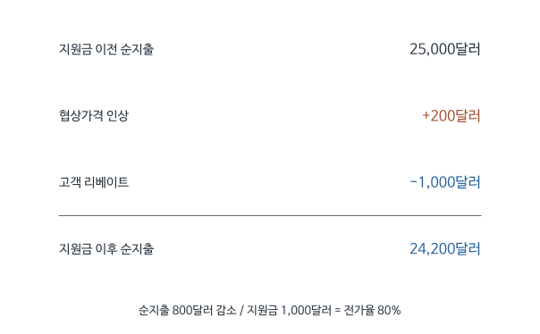

# 자동차 구매지원금은 소비자에게 얼마나 돌아가는가: Busse 등 (2006) 심층요약

자동차 회사가 구매자에게 1,000달러를 돌려주면 소비자는 실제로 1,000달러를 절약할까. 판매점이 지원금을 예상하고 협상가격을 높이면 절약액은 줄어든다. 반대로 제조사가 판매점에 지급한 지원금도 판매점 간 경쟁이나 가격협상을 거치며 일부가 소비자에게 돌아갈 수 있다.

Busse 등은 소비자에게 알려지는 customer cash와 판매점에 지급되는 dealer cash의 가격효과를 비교한다. 같은 규모의 제조사 지원이라도 소비자가 그 존재를 아는지에 따라 협상 결과가 달라지는지 묻는 연구다. 지원금의 실제 수혜자를 알아내기 위해 거래가격을 정의하고, 프로모션이 시작되는 시점 전후의 가격 변화를 분석한다.

[원문 PDF](<1000 Cash Back (2006).pdf>) | [독립형 QnA](<1000 Cash Back (2006)_QnA.md>)

## 1. 지원금 지급방식이 가격협상에 미치는 영향

customer cash는 구매자가 제조사에서 환급받는 지원금이고 dealer cash는 제조사가 판매점에 지급하는 지원금이다. 전자는 광고나 안내로 소비자가 알기 쉽고, 후자는 소비자가 존재와 액수를 잘 모를 수 있다. 판매점과 구매자가 가격을 협상하는 시장에서 이 정보 차이가 지원금의 배분을 바꾸는지가 연구의 출발점이다.

질문은 **지원금 1달러가 고객의 실제 부담액을 몇 달러 줄이는가**다. 이 비율을 소비자 전가율(pass-through)이라고 한다. 세금과 보조금의 법적 납부자와 실제 부담자가 다를 수 있다는 귀착 문제의 마케팅 사례다.

자동차 가격은 정찰가격 그대로 결정되지 않고 구매자와 판매점의 협상으로 달라진다. 제조업체가 1,000달러를 지원하더라도 소비자가 최종적으로 1,000달러를 절약한다고 보장되지 않는 이유다. 판매점이 환급을 예상해 협상가격을 덜 낮춰 주면 소비자는 지원금 일부만 얻는다. 반대로 판매점에 지급한 지원금도 가격 인하 경쟁으로 소비자에게 전달될 수 있다.

논문은 같은 제조업체의 비용 지출이 지급방식에 따라 다르게 배분되는지 묻는다. 현금의 법적 수령자가 누구인지와 최종적인 경제적 수혜자가 누구인지를 구분하는 문제다. 거래가격 자료가 필요한 것도 실제 협상 후 소비자 지출을 확인해야 하기 때문이다.

## 2. 개별 거래에서 어떤 지원금을 받았는지 확인한다

분석은 차종의 표시가격만으로 할 수 없다. 같은 차종이라도 거래 시점, 지원금, 옵션과 협상 결과에 따라 고객 부담액이 다르다. 자료의 한 행은 개별 신차 거래이며, 그 거래에 적용되는 제조사의 고객 지원금과 판매점 지원금을 연결한다. 관심 결과는 지원금 지급 후 소비자가 실제로 지불한 순가격이다.

자료는 1998년 9월부터 2000년 12월까지 캘리포니아의 자동차 거래와 프로모션 일정이다. 리스와 제조사 금융지원 거래를 제외한 분석표본은 133,424건이다. 여기서 cash 거래에는 고객이 은행대출을 받아 판매점에 대금을 지불한 경우도 포함된다.

$i$는 구매고객 또는 거래, $j$는 세부 차량 유형, $t$는 거래일이다. $CC_{jt}$와 $DC_{jt}$는 그 차량과 날짜에 적용되는 고객 및 판매점 지원액이다. 처치는 이진 여부만이 아니라 달러 금액이다.

고객 특성 중 일부는 개인 정보가 아닌 거주 블록그룹의 인구통계다. 지역 평균소득을 개인의 정확한 소득으로 해석하면 안 된다.

한 관측치는 특정 구매자가 특정 차량을 구입한 거래다. 같은 차종이라도 옵션, 구매 시점과 판매점에 따라 가격이 다르므로 거래 구성을 비교 가능하게 만들어야 한다. 프로모션 기간에 저가 사양의 판매 비중이 늘었다면 평균 가격 하락이 지원금 전가만을 뜻하지 않는다. 차량 특성과 거래 조건을 고려하는 이유다.

이 표본의 현금거래는 현금을 직접 지참한 구매자만을 뜻하지 않는다. 은행대출을 사용한 구매도 포함하지만 제조업체의 특별 금융조건이나 리스는 제외한다. 금융 지원과 현금 환급의 가치를 동시에 평가하려면 추가 계산이 필요하므로, 현금 지원금의 가격 효과에 분석을 집중한 표본이다.

### 원문 Table 1 발췌: 지원금이 실제로 얼마였고 몇 건에 붙었나

앞에서 처치는 달러 금액이라고 했다. 뒤에 나오는 계수는 "지원금 1달러당 가격 변화"이므로, 실제 지원금이 보통 얼마였는지 알아야 1,000달러 환산이 현실적인 규모인지 판단할 수 있다. 원문 Table 1(요약통계, PDF 파일 5쪽, 학술지 1257쪽)은 30개 변수를 보고한다. 아래는 가격, 세 종류의 지원금, 그리고 뒤의 회귀표에 다시 나오는 통제변수 몇 개만 옮긴 **발췌**다. 수치는 원문 그대로다.

| 변수 | N | 평균 | 중앙값 | 표준편차 | 최솟값 | 최댓값 |
|---|---:|---:|---:|---:|---:|---:|
| Price | 133,424 | 25,490 | 23,487 | 10,382 | 5,988 | 109,755 |
| Customer cash (CC) | 34,296 | 1,242 | 1,000 | 669 | 10 | 7,805 |
| GM Card | 1,204 | 1,934 | 1,785 | 1,215 | 2 | 7,043 |
| Dealer cash (DC) | 24,620 | 932 | 700 | 819 | 200 | 5,000 |
| # Competing dealers | 133,424 | 3.7 | 3 | 2.8 | 0 | 24 |
| Female | 133,424 | 0.28 | 0 | 0.45 | 0 | 1 |
| Income | 133,424 | 6.5 | 6.2 | 2.8 | 1.1 | 15 |
| MedianHouseVal. | 133,424 | 2.6 | 2.4 | 1.2 | 0.075 | 5 |
| EndOfMonth | 133,424 | 0.22 | 0 | 0.41 | 0 | 1 |

*발췌: 원문 Table 1, PDF 5쪽. 원문 주석(†): customer cash, GM Card, dealer cash, 판매관리자 인센티브, 영업사원 인센티브는 N이 0이 아닌 관측치 수이고, 나머지 통계량도 0이 아닌 값만으로 계산했다.*

각 행은 변수 하나이고, 열은 관측치 수와 분포를 나타낸다. 가격과 지원금 행의 단위는 달러다. 가장 먼저 확인할 것은 주석이다. CC와 DC 행은 전체 133,424건의 평균이 아니고 지원금이 붙은 거래만의 평균이다. CC가 있는 거래는 34,296건으로 전체의 25.7%이고(34,296 ÷ 133,424), DC가 있는 거래는 24,620건으로 18.5%다. 본문이 말하는 26%와 18%는 이 비율을 반올림한 값이다. 고객 지원금이 있을 때 평균은 1,242달러, 중앙값은 1,000달러이고, 판매점 지원금은 평균 932달러, 중앙값 700달러다. 논문 제목의 "1,000달러"가 전형적인 고객 지원금 규모라는 뜻이다.

0을 포함해 전체 거래로 평균을 내면 고객 지원금은 1,242 × 34,296 ÷ 133,424 ≈ 319달러가 된다. 이 값은 표에 없고 요약 작성 과정에서 계산한 것이다. 두 평균을 혼동하면 "평균 거래에서 소비자가 1,000달러 넘게 절약했다"는 잘못된 인상을 받게 된다. 지원금이 있는 거래의 평균 고객 지원금 1,242달러를 전체 거래의 평균 가격 25,490달러와 비교하면 약 4.9% 규모다. 분자와 분모의 표본이 다르므로 지원금 거래에서의 평균 할인율이라는 뜻은 아니다.

Female과 EndOfMonth처럼 0과 1만 갖는 변수는 평균이 곧 비율이다. 구매자의 28%가 여성이고, 거래의 22%가 월말 5일 안에 이루어졌다. Income과 MedianHouseVal.은 개인 값이 아니라 거주 블록그룹 수준의 인구통계다. MedianHouseVal.은 Table 2 주석에 따라 10만 달러 단위이므로 평균 2.6은 약 26만 달러다. Income은 Table 2 주석이 1,000달러 단위라고 적지만, 그대로 적용하면 블록그룹 소득 평균이 6,500달러가 되어 캘리포니아 가구소득으로는 지나치게 낮다. Table 1 자체에는 단위 표기가 없어 원문만으로는 단위를 확정할 수 없다. 원문 Table 1의 가구원 수 변수명은 "MediaHHSize"로 인쇄되어 있는데, Table 2의 "MedianHHSize"와 같은 변수로 보이며 원문 표기를 고치지 않았다.

이 표로 말할 수 있는 것은 지원금의 전형적 규모, 지원금 거래의 비중, 그리고 가격 분포가 넓다는 사실(표준편차 10,382달러)이다. 말할 수 없는 것도 분명하다. 한 거래에 CC와 DC가 동시에 붙은 비중, 지원금이 어느 세그먼트에 몰렸는지, Price 행이 고객 지원금과 보상판매 조정을 거친 순가격인지 계약서 가격인지는 표에 나오지 않는다. 평균 가격 비교만으로 지원금의 효과를 읽을 수도 없다. 그 일은 뒤의 회귀표가 한다.

## 3. 현금 환급과 보상판매를 반영한 실제 구매가격

고객이 받은 혜택은 신차 계약서의 가격에만 나타나지 않는다. 현금 환급이 있을 수 있고, 중고차를 넘길 때 시세보다 높은 금액을 인정받아 실질적으로 신차를 할인받을 수도 있다. 이런 거래조건을 같은 기준으로 비교하려면 고객의 순부담을 나타내는 가격변수를 만들어야 한다.

$$
P_{ijt}=\text{관측 협상가격}-CC_{jt}-\text{TradeInOverAllowance}_{ijt}.
$$

마지막 항은 중고차 보상판매 지급액에서 추정 도매가치를 뺀 값이다. 판매점이 중고차 가치를 후하게 쳐주면 고객의 실제 부담이 줄어든 것이므로 뺀다. 저평가했다면 음수인 항을 빼므로 부담이 커진다.

**학습용 예제:** 원래 부담액 25,000달러, 고객 리베이트 1,000달러를 도입하면서 협상가격이 25,200달러로 올랐다면 실제 부담액은 24,200달러다. 고객 이득은 800달러이고 전가율은 80%다.

판매점 리베이트 1,000달러 때문에 협상가격이 25,000달러에서 24,600달러가 되면 고객 전가율은 40%다. 고객이 지원금 존재를 몰라도 판매점의 판매유인이 바뀌므로 일부 가격인하가 가능하다.

소비자가 새 차 가격으로 25,000달러를 지불한 뒤 1,000달러를 환급받으면 순지출은 24,000달러다. 여기에 중고차를 넘기면서 시장가치보다 500달러를 더 인정받았다면 실질적인 할인은 그만큼 더 있다. 판매점은 새 차 가격과 보상판매 가격을 조합해 같은 경제적 조건을 다른 방식으로 표시할 수 있다.

새 차 계약서의 한 가격만 비교하면 할인 수단이 이동한 것을 놓칠 수 있다. 논문의 순가격은 고객 환급과 보상판매의 초과 보상을 반영한다. 세금이나 모든 부대비용의 후생을 포괄하는 지표와는 구분되며, 논문이 정의한 거래가격의 범위 안에서 전가율을 해석해야 한다.

<!-- learning-figure:rebate-pass-through -->

*그림 설명: 본문의 학습용 거래 예제다. 논문의 평균 전가율 추정치를 그린 것은 아니다.*

고객에게 1,000달러가 지급되어도 협상가격이 200달러 오르면 순지출 감소는 800달러다. 비교할 것은 환급액만이 아니라 환급 전후의 최종 부담액이다. 이 예에서 소비자 전가율은 800을 1,000으로 나눈 80%다.

<!-- /learning-figure -->

## 4. 가격 하락을 지원금의 소비자 전가율로 환산한다

지원금이 1,000달러 늘었을 때 순가격이 800달러 하락했다면 소비자에게 돌아간 몫은 80%다. 이 비율을 전가율이라고 부른다. 가격을 종속변수로 회귀하면 지원금이 소비자에게 이득을 줄수록 계수는 음수가 되므로, 양의 전가율로 보고할 때는 부호를 바꾼다.

$$
P_{ijt}=\beta_cCC_{jt}+\beta_dDC_{jt}
+X_i'\gamma+X_{jt}'\delta+\alpha_j+\lambda_{J,T}+\varepsilon_{ijt}.
$$

$\alpha_j$는 차량 유형 고정효과다. $J$는 SUV나 소형차 같은 세그먼트, $T$는 달력상의 한 주(week)다. 지리적 주(state)를 뜻하지 않는다. $\lambda_{J,T}$는 같은 차량 세그먼트의 같은 주간에 공통인 가격변화를 통제한다. 소문자 (j,t)와 대문자 (J,T)의 집계수준을 구별해야 한다.

지원금이 1달러 늘면 고객 부담가격은 $\beta$달러 변한다. 가격인하를 양의 전가율로 표시하려면

$$
\text{전가율}=-\beta,\qquad \text{백분율 전가율}=100(-\beta).
$$

계수가 -0.88이면 1달러당 0.88달러, 1,000달러당 880달러 인하다. 계수 0은 전혀 전가되지 않는 경우, -1은 전액 전가다. 계수가 가격의 로그에 붙은 것이 아니므로 탄력성이나 퍼센트 변화로 읽지 않는다.

전가율이 80%라는 것은 지원금 1달러 증가와 관련해 소비자의 조정된 순가격이 약 0.8달러 낮아졌다는 뜻이다. 나머지 0.2달러가 누구에게 귀속되는지는 거래구조와 비용까지 고려해야 하지만, 적어도 소비자의 순가격 절감으로 나타나지 않았다는 점은 분명하다. 지원금 총액과 가격 변화의 단위를 맞추어 읽어야 한다.

회귀계수는 가격을 결과로 사용하므로 소비자 이익이 클수록 더 음수가 된다. 논문이 보고하는 양의 전가율은 그 가격계수의 부호를 바꾸어 표현한 것이다. 음의 계수를 ‘지원금이 소비자에게 해롭다’고 읽으면 가격 하락과 후생 방향을 혼동하게 된다.

### 고객에게 지급한 돈 중 일부를 딜러가 가져간다는 말의 회계

지원금이 소비자 계좌에 직접 들어가는데 어떻게 일부가 딜러에게 돌아갈까. 소비자가 받는 돈과 협상에서 정해지는 차량가격을 함께 적으면 보인다. 지원금 전 협상가격을 $B_0$, 고객 리베이트를 $R$, 리베이트 후 협상가격을 $B_1$이라 쓴다. 소비자의 최종 순지출은 $P_0=B_0$, $P_1=B_1-R$이다. 따라서

$$
\Delta P=(B_1-B_0)-R,\qquad
\text{소비자 전가율}=-\frac{\Delta P}{R}=1-\frac{B_1-B_0}{R}.
$$

학습용으로 원래 25,000달러이던 거래에 1,000달러 리베이트가 생긴 뒤 협상가격이 25,200달러가 되면 순지출은 24,200달러다. 소비자는 800달러를 절약해 전가율이 80%이고, 딜러는 협상가격 상승 200달러를 얻는다. 소비자가 지원금을 전액 수령했다는 회계 사실과 최종 혜택이 80%라는 경제적 귀착은 양립한다.

딜러 지원금에서는 협상가격을 $B$, 제조사에 지급하는 차량 원가를 $C$, 딜러 지원금을 $S$라 놓으면 딜러의 단순 거래마진은 $B-C+S$다. 원가와 다른 비용을 고정한 교육용 예에서 1,000달러 지원 후 가격이 350달러 내려가면 소비자는 350달러를 얻고 딜러 마진은 650달러 늘어난다. 실제 이익에는 판매량, 보유비용, 다른 계약조건도 들어가므로 이 한 대의 회계만으로 제조사나 딜러의 총이익을 계산하지는 못한다.

원문이 조정가격을 만드는 이유가 여기 있다. 신차가격을 낮춘 대신 중고차 보상액을 낮추면 실질 혜택은 다시 줄어든다. 전가율은 지원금의 명목 수령자를 세는 지표가 아니라, 비교가능한 전체 거래조건에서 소비자 부담이 얼마나 줄었는지를 측정한다.

## 5. 판매가 부진해서 시작한 프로모션을 어떻게 평가할 것인가

자동차 회사는 프로모션을 무작위로 시작하지 않는다. 재고가 쌓이거나 수요가 약해진 차종에 지원금을 늘릴 수 있다. 이때 프로모션 차종의 가격이 낮은 이유에는 지원금과 판매부진이 함께 들어 있다. 지원금이 없었어도 일어났을 가격 변화를 구분할 비교가 필요하다.

$$
\text{관측 가격차이}=\text{프로모션 효과}+\text{프로모션 없이도 있었을 가격차이}.
$$

두 번째 항이 음수이면 지원금 전가율을 과대평가할 수 있다. 차량 고정효과는 원래 비싼 차와 싼 차의 차이를 제거하지만 같은 차의 시간별 수요충격은 자동으로 없애지 않는다.

제조업체는 판매가 잘되지 않는 차종에 지원금을 제공할 수 있다. 수요가 약해져 가격이 이미 하락하던 차종에서 프로모션을 시작했다면 그 후 가격 하락에는 수요 감소도 포함된다. 반대로 성수기나 신차 출시와 함께 지원금을 설계했다면 다른 동시 변화가 생길 수 있다. 지원금이 없는 거래와 있는 거래의 평균만으로 그 영향을 분리하기 어렵다.

분석은 이런 문제를 줄이기 위해 두 비교를 사용한다. 같은 시기의 다른 차종과 가격 변화를 비교하는 DID와, 프로모션 시작 또는 종료의 가까운 시점을 비교하는 접근이다. 서로 다른 비교가 비슷한 패턴을 주면 특정 시간 추세 하나에만 의존하는 결과라는 우려가 줄지만, 둘 모두 구매 시점 선택 같은 문제를 함께 가질 수 있다.

## 6. 다른 차종의 가격 변화를 사용해 공통 변화를 제거한다

프로모션 차종의 전후 가격 차이에는 시기별 시장 변화가 들어 있다. 같은 시기에 지원금이 바뀌지 않은 비교 차종의 가격 변화로 그 공통 변화를 추정하는 방법이 DID다. 지원금이 없었을 때 두 차종의 가격 변화가 같았을 것이라는 가정이 있어야 두 변화의 차이를 지원금 효과로 읽을 수 있다.

실제 분석은 같은 주와 세그먼트의 비프로모션 차량을 비교에 사용한다. 아래 가상 예에서는 프로모션 차량이 25,000달러에서 24,000달러로, 비교 차량은 22,000달러에서 21,800달러로 변했다고 놓는다.

$$
\Delta P_T=24000-25000=-1000,
$$

$$
\Delta P_C=21800-22000=-200,
$$

$$
DID=-1000-(-200)=-800.
$$

리베이트가 1,000달러 증가했다면 전가율은 80%다. 공통 수요충격으로 예상되는 200달러 하락을 제외했기 때문이다.

필요한 가정은 프로모션이 없었다면 해당 차량의 가격추세가 비교 차량과 적절하게 함께 움직였으리라는 것이다. 같은 세그먼트에 속한다는 이름만으로 성립하지 않는다.

비교 차종은 가격 수준이 다른 차량이어도 된다. 필요한 것은 지원금이 없었을 때의 변화가 적절한 기준이 된다는 근거다. 가격 수준이 비슷한 차량을 고르는 일과 같은 수요 충격을 받는 차량을 고르는 일이 언제나 일치하지는 않는다.

DID가 제거하는 것은 두 차종에 같은 방식으로 작용한 변화다. 지원 차종에만 재고가 급격히 쌓였다면 그 차종의 추가 가격 하락은 남는다. 고정효과를 넣었다는 이름보다, 어떤 수요 변화가 비교 차종과 공유되고 어떤 것은 고유한지 설명해야 이 설계의 가정을 평가할 수 있다.

## 7. 프로모션 시작일 바로 전후의 거래를 비교한다

DID의 비교 차종을 어떻게 정할지 고민하는 대신, 같은 차종의 프로모션 시작일 직전과 직후를 좁게 비교할 수도 있다. 짧은 기간에는 수요와 차종 특성이 연속적으로 변하지만 지원금은 시작일에 불연속적으로 달라진다는 논리다. 이 시간 RD가 설득력을 가지려면 구매자가 시작일을 예상해 거래 시점을 바꾸는지도 살펴야 한다.

일반적으로 이벤트 $e$의 날짜를 $c_e$, 상대일을 $r=t-c_e$라 쓰면 경계에서

$$
\Delta P_e=\lim_{r\downarrow0}E[P\mid r]-\lim_{r\uparrow0}E[P\mid r]
$$

를 볼 수 있다. 지원액 점프가 $\Delta C_e$이면 일정한 선형 전가 관계 아래 $-\Delta P_e/\Delta C_e$가 소비자 전가율이다. 원문 금액 회귀의 직관을 설명하는 재표현이다.

저자는 이 근접 표본에서 가격을 지원액과 통제변수에 회귀한다. DID의 주간-차량 세그먼트 고정효과 대신 달력상 주간 고정효과를 넣는다. 고객 지원금 변경 주변 표본과 판매점 지원금 변경 주변 표본은 서로 다르다.

**Table 2를 읽을 때:** 열 2A의 고객 지원금 계수 -0.81이 고객 지원금 RD 추정이고, 열 2B의 판매점 지원금 계수 -0.31이 판매점 지원금 RD 추정이다. 2A의 판매점 계수는 고객 지원금 이벤트 표본에서의 통제계수이므로 같은 방식으로 RD 식별되었다고 읽지 않는다.

시작일 바로 전후를 비교하면 몇 달 간격의 거래보다 차량 수요와 공급 환경이 비슷할 가능성이 있다. 이 접근에서는 날짜가 기준점 역할을 하지만 시험점수 RD와 똑같은 선택 문제를 갖지는 않는다. 소비자가 예정된 프로모션을 알고 구매를 미루면 날짜 양쪽의 구매자 구성이 달라질 수 있다.

종료일 분석에서도 마지막 혜택을 받으려는 구매자가 종료 직전에 집중할 수 있다. 짧은 구간이 모든 교란을 자동으로 없애는 것은 아니다. 논문은 이런 시점 선택과 고객 구성의 변화를 추가로 살펴보면서 가격 변화가 지원금에 대한 시장 반응인지 평가한다.

### 거래일의 경계가 고객까지 무작위로 배정하지는 않는다

프로모션 시작 직전과 직후를 비교할 때 달력은 되돌릴 수 없지만 구매자는 거래일을 미룰 수 있다. 이 두 사실은 다르다. 시작 이후 가격이 낮아졌다는 결과에는 같은 고객의 협상조건 변화와 거래한 고객 구성 변화가 함께 들어갈 수 있다.

교육용으로 협상을 잘하는 유형 $H$와 어려워하는 유형 $L$을 두고, 프로모션 상태를 $d$라 하자. 실제 거래자 중 $H$의 비중을 $s_d$, 유형별 평균가격을 $\mu_{Hd},\mu_{Ld}$라 쓰면 관측 평균은 $\overline P_d=s_d\mu_{Hd}+(1-s_d)\mu_{Ld}$다. 차이를 전개하면

$$
\begin{aligned}
\overline P_1-\overline P_0
={}&s_0(\mu_{H1}-\mu_{H0})+(1-s_0)(\mu_{L1}-\mu_{L0})\\
&+(s_1-s_0)(\mu_{H1}-\mu_{L1}).
\end{aligned}
$$

첫 줄은 이전 고객구성을 고정한 가격변화이고, 둘째 줄은 거래자 구성의 변화다. 학습용으로 두 유형의 사후 가격 차이가 -1,000달러이고 $H$의 비중이 .3에서 .5로 늘면, 구성 변화만으로 평균가격이 200달러 더 내려간다. 이를 모두 프로모션 효과로 해석하면 과대평가하게 된다.

원문이 프로모션 초기에 특정 구매자가 몰리는지, 관측 고객 특성이 달라지는지 검토하는 이유는 이 추가 항의 가능성 때문이다. 관측 특성이 안정적이라는 결과는 도움이 되지만 관측하지 못한 협상력도 일정하다는 완전한 증명은 아니다. 가까운 날짜의 비교가 제거하는 완만한 시장 추세와, 제거하지 못할 수 있는 거래시점 선택을 구별해야 한다.

## 8. 고객 지원금과 판매점 지원금의 전가율 차이

논문의 두 분석방법은 소비자가 알고 있는 고객 지원금에서 더 높은 전가율을 추정한다. DID에서는 고객 지원금 88%, 판매점 지원금 39%이며, 시간 RD의 대응 추정치는 약 81%와 31%다. 정확한 숫자는 표본과 사양에 따라 다르지만 두 지원방식의 상대적 차이는 같은 방향이다.

| 설계와 올바른 열 | 고객 지원금 전가 | 판매점 지원금 전가 |
|---|---:|---:|
| Table 2 DID 열 1 | 88% | 39% |
| Table 2 각자 이벤트 RD, 2A와 2B | 81% | 31% |

1,000달러를 기준으로 DID의 고객 부담 감소는 880달러와 390달러로 490달러 차이다. RD는 810달러와 310달러로 500달러 차이다. 계수를 적용한 예시이며 모든 고객에게 정확히 이 금액이 돌아갔다는 뜻은 아니다.

원문은 다양한 검토를 종합해 고객 지원금 70-90%, 판매점 지원금 30-40%라고 요약한다. 명목 수령인에 따라 전가율이 달라지는 패턴이다.

고객 현금환급의 전가율이 판매점 지원보다 높다는 결과는 소비자가 지원금 정보를 아는 것이 협상에 중요할 수 있음을 보여준다. 공개된 환급은 구매자가 가격 협상의 기준으로 사용할 수 있다. 비공개 판매점 지원은 판매점의 비용을 낮추더라도 구매자가 그 여유를 모를 수 있다.

DID와 가까운 날짜 비교에서 얻는 구체적인 전가율은 같지 않다. 사용한 관측치와 비교 범위가 다르기 때문이다. 서로 다른 열의 수치를 하나의 동일한 추정 모형에서 나온 쌍처럼 인용하지 않아야 한다. 공통적으로 유지되는 지급방식 간 차이와 방법별 정확한 크기를 구분해 읽는 것이 적절하다.

### 원문 Table 2 발췌: 88%, 39%, 81%, 31%가 나온 자리

위의 요약표는 네 개의 전가율만 옮겼다. 그 숫자가 어떤 회귀의 어느 칸에서 나왔고 얼마나 정밀한지, 옆 칸의 숫자는 왜 인용하면 안 되는지는 원문 Table 2(Price Effects, Basic Results, PDF 파일 8쪽, 학술지 1260쪽)를 봐야 알 수 있다. 원문은 지원금 세 줄과 통제변수 21줄, 모형 정보를 보고한다. 아래는 지원금 세 줄, 해석 연습에 쓸 통제변수 네 줄, 모형 정보만 옮긴 **발췌**다. 인구통계 비율 변수(%Asian, %Black 등)와 소득, 모델 연식, 지역, 상수항은 생략했다. 굵은 글씨는 요약 작성 시 표시한 것으로, 그 열의 설계가 실제로 식별하는 계수다.

| 변수 | (1) DID | (2A) RD: 고객 지원금 변경 ±1주 | (2B) RD: 판매점 지원금 변경 ±1주 |
|---|---:|---:|---:|
| Customer cash | **-0.88** (0.03)** | **-0.81** (0.07)** | -0.78 (0.12)** |
| Dealer cash | **-0.39** (0.07)** | -0.38 (0.14)** | **-0.31** (0.07)** |
| GM Card | -1.06 (0.03)** | -1.13 (0.10)** | -1.13 (0.09)** |
| Competition | -7.66 (5.60) | -15.03 (9.59) | -18.63 (9.63)+ |
| Female | 144.17 (12.01)** | 139.74 (45.20)** | 203.25 (57.59)** |
| EndOfMonth | -55.57 (16.61)** | -90.90 (71.22) | -93.05 (58.23) |
| EndOfYear | 14.61 (69.49) | 133.47 (321.75) | -1,265.44 (192.47)** |
| Car fixed effects | Yes | Yes | Yes |
| Other fixed effects | Week × Segment | Week | Week |
| Observations | 133,424 | 6,296 | 7,046 |
| Adj. R-squared | 0.97 | 0.95 | 0.95 |

*발췌: 원문 Table 2, PDF 8쪽. 괄호 안은 robust 표준오차. + 10%, * 5%, ** 1% 수준에서 유의(원문 주석). 열 머리의 "±1주" 설명은 본문 III.B를 바탕으로 요약에서 붙였다.*

종속변수는 모든 열에서 같다. 고객 지원금과 보상판매 초과보상을 반영한 순가격 $P_{ijt}$이고 단위는 달러다. 따라서 칸의 숫자는 "해당 변수가 1단위 늘 때 순가격이 몇 달러 변하는가"로 읽는다. 지원금 행의 1단위는 1달러이므로 계수 -0.88은 고객 지원금 1달러당 순가격 0.88달러 하락이고, 부호를 바꾸면 전가율 88%다. 괄호 속 0.03은 계수의 표준오차이지 두 번째 추정값이 아니다. 별표는 계수가 0과 다른지에 대한 검정이다. 전가율이 100%와 다른지, 두 지원금의 전가율이 서로 다른지는 별표가 알려주지 않는다.

열 (1)은 전체 133,424건에 차량 고정효과와 주간×세그먼트 고정효과를 넣은 DID다. 여기서는 두 지원금 계수를 모두 해석한다. 정규근사로 대략의 95% 구간을 계산하면(계수 ± 1.96 × 표준오차, 요약 작성 시 계산) 고객 지원금은 -0.94에서 -0.82, 판매점 지원금은 -0.53에서 -0.25로 두 구간이 겹치지 않는다. 두 계수 차이 0.49의 정확한 표준오차와 p값은 계수 간 공분산이 없어 재현할 수 없다. 다만 차이의 표준오차는 두 표준오차의 합인 0.10보다 클 수 없으므로, 정규근사에서 검정통계량의 절댓값은 적어도 4.9다. 원문 본문(PDF 7쪽)이 보고한 1% 수준의 유의성은 이 보수적인 계산과도 부합한다.

열 (2A)와 (2B)는 서로 다른 표본이다. (2A)는 고객 지원금이 바뀐 날 전후 1주의 거래 6,296건, (2B)는 판매점 지원금이 바뀐 날 전후 1주의 거래 7,046건이다. 그래서 (2A)에서는 고객 지원금 -0.81만, (2B)에서는 판매점 지원금 -0.31만 RD 추정치다. (2A)의 판매점 지원금 -0.38과 (2B)의 고객 지원금 -0.78은 통제용 계수라서 전가율로 인용하면 안 된다. 표본이 작아진 만큼 표준오차도 커져, 고객 지원금 계수의 표준오차는 DID의 0.03에서 RD의 0.07로 두 배 이상이 된다. 같은 방식으로 구간을 계산하면 (2A)의 고객 지원금은 약 -0.95에서 -0.67, (2B)의 판매점 지원금은 약 -0.45에서 -0.17이다.

GM Card 행은 V.A절의 정보 논리를 점검하는 비교 사례다. GM 신용카드로 적립한 리베이트는 소비자가 판매점보다 더 잘 아는 지원금이다. 열 (1)의 -1.06은 적립금 1달러당 순가격 1.06달러 하락이고, 원문(PDF 13쪽)은 이를 "106%, 100%와 통계적으로 구별되지 않음"이라고 해석한다. 반올림된 표 값으로 (1.06 - 1) ÷ 0.03을 계산하면 약 2.0이 나와 5% 경계에 가깝다. 반올림 전 값에 따라 결론이 달라질 수 있는 거리이므로, 이 판단은 표가 아닌 저자의 보고에 의존한다. Table 1에서 GM Card가 0이 아닌 거래는 1,204건뿐이라는 점도 함께 기억해야 한다.

통제변수 계수는 달러 차이로 읽는다. 열 (1)의 Female 144.17은 다른 조건이 같을 때 여성 구매자가 약 144달러 더 지불했다는 뜻이고, 세 열 모두 1% 수준에서 유의하다. EndOfMonth -55.57은 월말 5일 안의 거래가 약 56달러 싸다는 뜻이다. 퍼센트 변화가 아니다. (2B)의 EndOfYear -1,265.44는 크고 유의하지만, 판매점 지원금 변경 전후 1주라는 좁은 표본에서 연말 거래가 소수일 가능성이 있다. 저자도 이 값을 해석하지 않으므로 연말 할인 규모로 인용하지 않는 편이 안전하다.

조정 $R^2$ 0.97과 0.95는 매우 높지만, 대부분은 942개 차량 고정효과가 차종 간 가격 차이를 흡수한 결과다. 지원금이 가격 변동의 97%를 설명한다는 뜻으로 읽으면 안 된다. 이 표로 말할 수 있는 것은 두 설계 모두에서 고객 지원금 계수의 절댓값이 판매점 지원금의 두 배 이상이라는 점과 각 추정의 정밀도다. 말할 수 없는 것은 그 차이가 정보 때문인지 다른 이유 때문인지다. 그 질문은 IV절과 V절의 추가 분석이 다룬다.

## 9. 프로모션 전 가격 추세로 비교가정의 설득력을 점검한다

지원금 지급 전에 이미 프로모션 차종의 가격만 더 빠르게 하락했다면 지급 이후의 추가 하락도 다른 요인 때문일 수 있다. 사전추세 점검은 이런 우려를 확인하기 위한 것이다. 이 연구에서는 일부 차종과 시점에서 유의한 사전 차이가 나타나므로, 모든 비교가 완벽했다는 전제로 결과를 설명해서는 안 된다.

사전 일별 추세의 111개 계수 중 19개가 5% 수준에서 유의하며, 모든 차이가 0이라는 공동 가설도 기각된다. 저자는 그 차이가 경제적으로 얼마나 큰지 추가로 계산해 주결론을 설명할 수 있는 크기인지 평가한다.

그러므로 "사전추세 검정을 통과하여 평행추세가 입증되었다"고 정리하면 원문과 다르다. 증거는 완벽한 설계 인증이 아니라 남은 편향 크기에 대한 논쟁이다.

시간 RD도 구매자가 날짜를 선택할 수 있다. 할인에 민감하고 협상을 잘하는 고객이 시작일까지 기다렸다면 전후 고객 구성이 달라진다. MHE의 점수 조작 문제와 닮았지만 실행변수가 거래시점이라는 점에서 더 직접적인 선택이 가능하다.

사전 추세 검정의 귀무가설을 기각했다면 ‘평행추세 검정을 통과했다’고 표현할 수 없다. 사전 가격 변화에 차이가 있었다는 통계적 근거다. 다만 그 차이가 가격효과 추정에 어느 정도 영향을 줄 크기인지는 별도로 살펴볼 수 있다. 통계적 유의성과 경제적 크기는 같은 질문이 아니다.

저자의 해석을 평가할 때는 불리한 검정 결과를 숨기지 않고, 주장하는 편향의 크기가 주된 결과를 뒤집을 정도인지 확인해야 한다. 가까운 날짜 분석과 다른 사양에서 결과가 유지되는 근거도 함께 읽는다. 강건성 분석은 하나의 검정을 지우는 수단이 아니라 다른 가정과 비교에서 얼마나 일관된 결과가 나오는지 보여주는 자료다.

## 10. 프로모션 초기에 협상을 잘하는 구매자가 집중되는가

높은 전가율은 소비자가 지원금 정보를 알기 때문일 수도 있고, 할인에 민감하고 협상을 잘하는 사람이 프로모션 초기에 많이 구매하기 때문일 수도 있다. 구매자 구성의 영향을 살피기 위해 저자들은 프로모션 시작 직후와 이후 기간의 전가율을 비교한다. 이 분석은 정보 차이에 대한 해석을 다른 행동 설명과 대조하는 역할을 한다.

Table 3에서 새로 시작하거나 늘어난 customer cash의 첫 2주 전가율은 96%, 3-4주와 5-8주의 전가율은 약 80%다. 초기 효과가 더 높다는 사실이 기다리던 구매자의 선택을 검토하게 만드는 근거다.

이후 기간의 전가율을 기준으로 해도 판매점 지원금보다 높은 패턴은 남는다. 저자는 소비자 구성이 전혀 바뀌지 않았다고 주장하지 않는다. 일부 편향을 인정하면서 주된 차이가 유지되는지 살펴본다.

dealer cash는 덜 알려져 있으므로 소비자가 이를 보고 거래일을 맞출 가능성이 더 낮다. 시작 전후 며칠을 제외하는 추가 점검도 하지만 모든 선택을 제거하는 보증은 아니다.

프로모션 초기에 전가율이 높다면 지원금 발표를 기다린 적극적인 구매자가 먼저 거래했을 수 있다. 가격을 많이 조사하고 협상을 잘하는 사람은 같은 지원금 아래에서도 낮은 가격을 얻는다. 시간이 지나 다른 구매자들이 유입되면 평균 전가율이 낮아질 수 있다.

이 경우 관측한 가격 반응에는 판매점의 협상 변화와 구매자 구성 변화가 함께 들어 있다. 초기 몇 거래만 보고 모든 소비자의 장기적인 혜택을 평가하면 다른 대상의 효과를 일반화할 위험이 있다. 논문이 프로그램 경과기간에 따른 전가율을 살펴보는 것은 이런 선택을 구체적으로 평가하기 위해서다.

### 원문 Table 3 재배열: 경과기간별 전가율

위에서 인용한 96%와 80%는 원문 Table 3(Price Effects, Identification Issues, PDF 파일 12쪽, 학술지 1264쪽)에서 나온다. 이 표를 보면 초기 고전가율이 고객 지원금 증가에서만 나타나는지, 판매점 지원금에서는 어떤 모양인지를 한눈에 비교할 수 있다. 원문은 지원금 계수 20개를 세로 한 줄로 나열한다. 아래 표는 같은 20개 계수를 지원금 종류와 변경 방향(열), 변경 후 경과기간(행)으로 **재배열한 발췌**다. 계수, 표준오차, 유의표시는 원문 그대로이고, 통제변수 행은 생략했다.

| 변경 후 경과기간 | 고객 지원금 증가 | 고객 지원금 감소 | 판매점 지원금 증가 | 판매점 지원금 감소 |
|---|---:|---:|---:|---:|
| 1-2주 | -0.96 (0.03)** | -0.84 (0.08)** | -0.28 (0.06)** | -0.33 (0.19)+ |
| 3-4주 | -0.80 (0.04)** | -0.88 (0.08)** | -0.35 (0.06)** | -0.49 (0.20)* |
| 5-8주 | -0.80 (0.03)** | -0.92 (0.06)** | -0.38 (0.08)** | -0.22 (0.23) |
| 9-26주 | -0.77 (0.04)** | -0.91 (0.07)** | -0.48 (0.08)** | -1.05 (0.13)** |
| 26주 이후 (원문 "weeks 26+") | -0.75 (0.06)** | -1.27 (0.11)** | -0.42 (0.14)** | -0.42 (0.28) |

*재배열 발췌: 원문 Table 3, PDF 12쪽. 괄호 안은 robust 표준오차. + 10%, * 5%, ** 1% 수준에서 유의. 생략한 부분: GM Card -1.07 (0.033)**, Competition, Weekend, EndOfMonth, EndOfYear, ModelMonth, SouthernCal, 상수항, 보고되지 않은 인구통계 통제. 모형 정보: 차량 고정효과, 주간×세그먼트 고정효과, 관측치 133,424, $R^2$ 0.97.*

이 표는 Table 2 열 (1)의 DID 회귀를 확장한 것이다. 표본은 같은 133,424건이고 종속변수도 같은 순가격(달러)이다. 달라진 점은 지원금 변수를 네 개(고객/판매점 × 증가/감소)로 나누고, 다시 지원금이 바뀐 뒤 며칠이 지난 거래인지에 따라 다섯 구간으로 쪼갰다는 것이다. 한 칸은 "그 상태에 있는 지원금 1달러당 순가격 변화"다. 부호를 바꾸면 전가율이 된다. 이 확장 모형은 Table 2와 달리 조정 전 $R^2$를 보고한다.

첫 열을 위에서 아래로 읽으면 핵심이 보인다. 새로 생기거나 늘어난 고객 지원금은 처음 2주 동안 1달러당 0.96달러가 전가되고, 3-4주부터는 0.80, 0.80, 0.77, 0.75로 내려와 머문다. 1,000달러 지원금이라면 처음 2주의 구매자는 960달러, 그 뒤의 구매자는 750-800달러를 얻는 셈이다. 첫 2주와 이후 기간의 차이가 1% 수준에서 유의하다는 판단은 원문 본문(PDF 11쪽)의 보고다. 표에는 계수 간 공분산이 없어 직접 검정할 수 없다.

같은 초기 상승이 판매점 지원금 증가 열에는 없다. 처음 2주가 0.28로 가장 낮고, 9-26주에 0.48까지 오른다. 소비자가 판매점 지원금의 시작을 알기 어렵다면 협상에 능한 구매자가 그 날짜를 기다려 몰릴 이유도 적다. 저자가 이 대조를 "기다리던 구매자" 가설을 지지하는 근거로 쓰는 이유다. 저자는 고객 지원금에서 초기 2주를 뺀 0.80을 쓰더라도 판매점 지원금(Table 2 열 (1)의 0.39)의 약 두 배라는 결론이 유지된다고 정리한다.

감소 열은 조심해서 읽어야 한다. 고객 지원금 감소의 26주 이후 계수는 -1.27(표준오차 0.11)이고, 판매점 지원금 감소의 9-26주 계수는 -1.05(0.13)다. 이 계수는 지원금이 줄어든 뒤 적용되는 현재 지원금 수준과 순가격의 관계로, 부호를 바꾼 전가율 추정치가 100%를 넘는다는 뜻이다. 지원금이 1달러 줄어서 가격도 1달러 넘게 내려갔다는 뜻은 아니다. 같은 기울기를 유지한 채 지원금 금액이 줄면 모형이 예측하는 가격 변화는 오히려 양수다. 저자는 이 두 값을 따로 해석하지 않고 감소 쪽에는 "뚜렷한 패턴이 없다"고만 적는다. 지원금을 줄인 차종은 수요 상황이 특수할 수 있으므로, 이 값을 소비자가 지원금보다 더 많이 얻었다는 증거로 인용하면 안 된다. 판매점 지원금 감소 열은 표준오차가 0.19-0.28로 커서 기간별 비교 자체가 불안정하다.

원문 표기에서 알아둘 점이 있다. 행 이름 "weeks 9 to 26"과 "weeks 26+"는 26주가 두 구간에 모두 들어가는 것처럼 적혀 있다. 본문(PDF 11쪽)은 구간을 0-14일, 15-30일, 1-2개월, 3-6개월, 6개월 이상으로 설명해 표의 주 단위 이름과 정확히 맞지 않는다. 요약에서는 원문 행 이름을 고치지 않았다.

이 표로 말할 수 있는 것은 고객 지원금 증가 직후 2주에 전가율이 높고 그 뒤에는 약 80%로 안정된다는 점, 그리고 판매점 지원금에서는 그런 초기 급등이 없다는 점이다. 말할 수 없는 것은 초기 구매자가 실제로 협상력이 높은 사람이었는지다. 표는 구매자 유형을 관측하지 않는다. 또 이 표는 DID 모형의 결과이므로, RD 추정치(Table 2의 81%)가 정확히 얼마나 부풀었는지를 직접 계산해 주지 않는다. 저자의 결론도 "RD가 고객 지원금 전가율을 다소 과대평가한다"는 방향 판단에 머문다.

## 11. 전가율 차이에서 정보 비대칭에 관해 알 수 있는 것

소비자에게 알려진 지원금이 더 많이 돌아간다는 결과는 정보가 가격협상에서 중요하다는 설명과 부합한다. 그러나 두 지원방식은 정보뿐 아니라 환급금이 제시되는 방식과 소비자의 인식도 다를 수 있다. 결과가 지지하는 해석과, 두 방식의 차이 중 어느 한 요인만을 분리해 측정했다는 주장을 구별해야 한다.

원문 V.C는 이러한 정보와 제시 방식의 구별을 해석의 한계로 명시한다.

지원금 유형도 제조사가 시장상황에 맞추어 선택한다. 저자는 관측 시장조건의 공통지지와 통제를 추가하지만, 그 결과를 동일 시장에서 리베이트 이름만 무작위로 바꾼 실험과 같다고 표현해서는 안 된다.

정보 비대칭은 구매자와 판매점이 지원금에 관해 서로 다른 정보를 가진 상황이다. 고객에게 공개된 환급이 협상을 바꾼다는 결과는 이 설명과 부합한다. 그러나 지원금을 ‘고객의 돈’으로 강조하는 방식이 심리적인 기준가격이나 협상 태도를 바꾸었을 가능성도 있다. 공개 여부와 제시 방식이 함께 달라지면 둘의 역할을 완전히 분리하기 어렵다.

지급방식에 따른 가격 차이는 실증 결과이고, 그 차이를 모두 정보 부족 하나로 설명하는 것은 더 강한 기제 주장이다. 소비자에게 판매점 지원 정보를 별도로 알려주는 실험 등이 있다면 정보의 역할을 더 직접적으로 구분할 수 있지만, 이 논문을 그 실험을 수행한 연구로 읽어서는 안 된다.

## 12. 지원금 정책을 평가할 때 실제 거래조건을 봐야 하는 이유

제조사가 누구에게 돈을 지급하는지와 최종적으로 누가 혜택을 얻는지는 가격협상 과정에서 달라진다. 이 논문은 정보가 다른 두 지원방식을 이용해 그 배분 차이를 측정한다. 수업에서 계산할 것은 지원금 액수 자체보다 고객 순가격의 변화이며, 그 변화에서 시장의 다른 가격 변동을 어떻게 제외했는지가 추정의 근거다.

- 무엇을 배웠는가: 제조사 지원의 명목 수령인과 실제 이득 분배는 다르며 정보와 협상에 영향을 받는다.
- 핵심 방법: 비교 차량 추세를 쓰는 DID와 동일 차량의 프로모션 경계 근접 비교를 교차 점검한다.
- 언제 쓰는가: 지원금이나 판촉의 실제 가격 전가를 측정하되 정책 선택과 거래시점 선택을 고려할 때다.

Week09 Hartmann은 시간 자체의 결과와 구매자만의 조건부 결과가 왜 다른 식별 문제인지 더 깊게 설명한다. Week10 Baker를 읽으면 복잡한 시점별 처치를 하나의 고정효과 계수로 묶는 일도 추가 검토가 필요함을 이해할 수 있다.

제조업체 입장에서는 지원금 지출이 소비자 가격을 낮추는지 판매점 이익으로 남는지에 따라 프로모션 목적의 달성 정도가 달라진다. 소비자에게 할인 혜택을 전달하려는 목적과 판매점이 판매 노력을 늘리도록 유도하려는 목적도 다르다. 낮은 소비자 전가율이 모든 경영 목표에서 실패를 뜻하는 것은 아니다.

이 논문이 직접 측정하는 것은 거래가격의 반응이다. 판매량, 판매점 노력과 제조업체 총이익까지 모두 같은 정도로 식별한 것은 아니다. ‘누가 지원금을 받았나’에서 ‘최종 순가격이 얼마나 달라졌나’로 질문을 바꾼 연구라고 기억하면 결과와 한계를 함께 정리할 수 있다.

## 출처와 보충 설명

대상: American Economic Review 96(4), 1253-1270쪽. 보관 PDF 19쪽의 추출 텍스트 전체를 검토했다. 주요 계수는 Table 2-3과 대조했다. 본문의 간단한 협상 및 DID 계산은 학습용 예시다.
