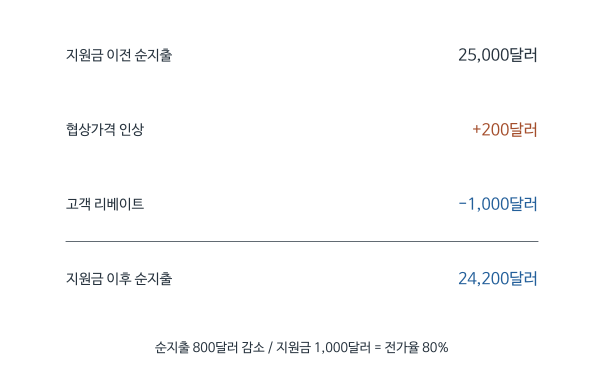

# 자동차 구매지원금은 소비자에게 얼마나 돌아가는가: Busse 등 (2006) 심층요약

자동차 회사가 구매자에게 1,000달러를 돌려주면 소비자는 실제로 1,000달러를 절약할까. 판매점이 지원금을 예상하고 협상가격을 높이면 절약액은 줄어든다. 반대로 제조사가 판매점에 지급한 지원금도 판매점 간 경쟁이나 가격협상을 거치며 일부가 소비자에게 돌아갈 수 있다.

Busse 등은 소비자에게 알려지는 customer cash와 판매점에 지급되는 dealer cash의 가격효과를 비교한다. 같은 규모의 제조사 지원이라도 소비자가 그 존재를 아는지에 따라 협상 결과가 달라지는지 묻는 연구다. 저자들은 고객의 실제 부담을 나타내는 거래가격을 새로 정의하고, 같은 세그먼트의 다른 차종을 비교 기준으로 쓰는 이중차분(DID)과 프로모션이 바뀌는 날 전후 1주만 비교하는 회귀불연속(RD) 두 방법으로 전가율을 추정한다. 1998-2000년 캘리포니아 신차 거래 133,424건에서 얻은 결론은 고객 지원금의 70-90%, 판매점 지원금의 30-40%가 소비자에게 돌아간다는 것이다.

문서는 연구 질문(1절), 자료와 가격 변수(2-3절), 전가율의 정의와 회귀식(4절), 두 식별(identification) 방법(5-7절), 결과표(8절), 저자들이 가정을 점검한 방법(9-10절), 결과의 해석과 경쟁 설명(11절) 순서로 진행한다.

[원문 PDF](<1000 Cash Back (2006).pdf>) | [개념 퀴즈](<1000 Cash Back (2006)_QnA.md>) | [수식·모델 퀴즈](<1000 Cash Back (2006)_수식모델퀴즈.md>) | [실무 Cheat Sheet](<1000 Cash Back (2006)_실무CheatSheet.md>)

## 1. 지원금 지급방식이 가격협상에 미치는 영향

자동차 제조사는 한 모델연도 동안 공시 소매가격과 판매점 인보이스 가격을 거의 바꾸지 않는다. 그런데 소매 수요는 경기, 계절, 모델의 출시 후 경과시기에 따라 계속 변한다. 재고를 쌓아 두는 비용과 생산 일정을 바꾸는 비용이 모두 크기 때문에, 제조사는 가격표를 고치는 대신 인센티브 프로모션으로 실제 소매가격을 수요에 맞춘다(PDF 1쪽). 프로모션에는 고객 현금환급, 판매점 현금지원, 제조사 계열 금융사를 이용하는 고객의 저금리 대출, 리스 인센티브가 있다. 이 논문은 앞의 두 현금 지원만 다루며 업계 용어대로 customer cash와 dealer cash라고 부른다. 둘 다 보통 300-3,000달러 규모다.

두 지원금은 지급 경로가 다르다. customer cash는 구매자와 판매점이 가격 협상을 마친 뒤 판매점이 제조사 명의의 수표를 구매자에게 건네고, 구매자가 그 수표를 다시 판매점에 배서해 넘겨 협상가격에서 즉시 차감하는 방식이다. dealer cash는 프로모션 기간에 판매점이 차를 한 대 팔 때마다 제조사가 판매점에 직접 지급한다. customer cash는 황금시간대 TV 광고로 알려질 만큼 공개되지만, dealer cash는 제조사가 광고하지 않아 소비자가 알려면 전문 간행물이나 웹사이트를 찾아봐야 한다. 판매점과 구매자가 가격을 협상하는 시장에서 이 정보 차이가 지원금의 배분을 바꾸는지가 연구의 출발점이다.

질문은 **지원금 1달러가 고객의 실제 부담액을 몇 달러 줄이는가**다. 원문은 이 비율을 "프로모션 금액 가운데 고객의 실제 지출(out-of-pocket expense)이 줄어든 비율"로 정의하고 전가율(pass-through)이라고 부른다. 자동차 가격은 정찰가격 그대로 결정되지 않고 협상으로 정해지므로, 제조사가 1,000달러를 지원해도 소비자가 1,000달러를 절약한다는 보장이 없다. 원문의 예에서 1,000달러 customer cash 기간에 구매자가 지원금이 없을 때보다 200달러 높은 가격에 합의하면 소비자 지출은 800달러만 줄고, 나머지 200달러는 판매점이 가져간다. 반대로 1,000달러 dealer cash 때문에 판매점이 500달러 낮은 가격에 합의하면 판매점 이름으로 지급된 돈 가운데 500달러가 소비자에게 간다.

### 비교 기준이 되는 보조금 귀착의 불변성

저자들은 이 문제를 세금이나 보조금의 귀착(incidence), 즉 법적 수령자와 실제 수혜자가 다를 수 있다는 문제와 같은 구조로 본다. 기초 경제학의 결과에 따르면 단위당 보조금의 귀착은 구매자와 판매자 가운데 누구에게 지급되는지와 무관하다. 원문은 이 결과를 "익숙한 결과"라고만 적으므로 이유를 교육용으로 보충한다. 보조금 $s$가 있으면 거래가 성립하는 조건은 "판매자가 받는 총액 = 구매자가 내는 순액 + $s$"라는 한 식으로 표현된다. 수표가 누구 이름으로 나가는지는 이 식에 들어가지 않는다. 수요와 공급 조건이 같다면 어느 쪽에 지급하든 구매자의 순지출과 판매자의 총수령액은 같은 값으로 정해진다.

자동차 사례에 옮기면 판매자는 판매점이고, 보조금을 대는 제3자는 제조사다(판매점 프랜차이즈 법에 따라 제조사와 판매점은 별개 법인이어야 한다). customer cash는 구매자에게 준 보조금, dealer cash는 판매자에게 준 보조금이다. 불변성이 성립한다면 두 지원금의 전가율은 같아야 한다. 논문이 검정하는 것이 바로 이 예측이며, 결과는 불변성과 어긋난다.

저자들이 제시하는 주된 가설은 정보 비대칭이다. 게임이론의 협상 모형에 따르면 상대방에 대한 정보가 불완전한 쪽은 협상 잉여에서 더 작은 몫을 얻는다. customer cash에서는 구매자와 판매점이 지원금의 존재를 똑같이 알고, dealer cash에서는 대개 판매점만 안다. 저자들은 이 차이를 정보 비대칭이 협상 결과에 미치는 영향에 관한 자연실험(natural experiment)으로 본다. 원문 각주 1에 따르면 제품시장에서 이를 실증한 연구는 이 논문 이전에 거의 없었다.

슈퍼마켓 판촉의 전가율을 다룬 기존 연구로는 이 질문에 답하기 어렵다. 슈퍼마켓 가격은 협상 없이 게시되고, 쿠폰(customer cash에 해당)은 쓰는 사람만 할인받는 가격차별 기능이 있기 때문이다. customer cash는 계약 마무리 단계에서 자동으로 적용되므로 그런 기능이 없다(PDF 3쪽). 협상가격, 공개 여부가 다른 두 지원금, 개별 거래가격이 함께 있는 자동차 소매시장이 이 질문에 맞는 이유다.

## 2. 개별 거래에서 어떤 지원금을 받았는지 확인한다

분석은 차종의 표시가격만으로 할 수 없다. 같은 차종이라도 거래 시점, 지원금, 옵션과 협상 결과에 따라 고객 부담액이 다르다. 자료의 한 행은 특정 구매자가 특정 차량을 산 개별 신차 거래이며, 그 거래에 적용되는 제조사의 고객 지원금과 판매점 지원금을 연결한다. 관심 결과는 지원금 지급 후 소비자가 실제로 지불한 순가격이다.

자료는 두 종류를 결합했다. 첫째는 대형 시장조사업체가 캘리포니아 판매점의 15-20%를 표본으로 삼아 1998년 9월 1일부터 2000년 12월 31일까지 그 판매점들의 모든 거래를 수집한 거래 자료다. 거래마다 구입한 차량의 정확한 사양, 지불가격, 판매점이 제조사에서 차를 들여온 원가, 보상판매(trade-in) 차량 정보, 고객의 인구통계가 있다. 둘째는 표본 기간의 모든 프로모션 목록으로, 지원 금액, 시작일과 종료일, 적용 제한(대개 지역이나 특정 트림)이 기록되어 있다. 프로모션 날짜가 하루 단위로 있다는 점이 7절의 RD 설계를 가능하게 한다.

분석표본은 리스와 제조사 계열 금융을 이용한 거래를 뺀 cash 거래 133,424건이다. 원문이 밝힌 이유는 이런 거래에서는 customer cash와 dealer cash가 가격에 관련된 프로모션이라는 것이다(PDF 3쪽). 리스와 제조사 금융 거래에는 별도의 금리, 리스 인센티브가 붙으므로 현금 지원금의 효과만 따로 보기 어렵다고 이해할 수 있다. 여기서 cash 거래는 판매점 입장에서 대금을 한 번에 받은 거래다. 고객이 은행대출을 받아 판매점에 대금을 치른 경우도 포함된다(원문 각주 2).

$i$는 구매고객 또는 거래, $j$는 세부 차량 유형, $t$는 거래일이다. $CC_{jt}$와 $DC_{jt}$는 차량 $j$를 날짜 $t$에 살 때 적용되는 고객 및 판매점 지원액이다. 제조사는 보통 브랜드, 모델, 모델연도 단위(예: 1999년형 Pontiac Grand Am)로 프로모션을 정하므로 지원액도 그 단위에서 정해지고, 지역별로 다른 프로모션은 해당 지역 거래에만 기록된다. 처치는 지원금이 있는지 없는지만 보는 이진 변수가 아니고 달러 금액이다.

고객 특성 가운데 소득, 교육, 직업, 인종, 주택 소유 변수는 개인 정보가 아니다(Female은 Table 1에서 0과 1만 갖는 개인 변수로 보인다). 자료 제공업체가 거래 기록의 주소를 인구조사 블록그룹(평균 약 1,100명)에 연결해 붙인 지역 인구통계다. 지역 평균소득을 개인의 정확한 소득으로 해석하면 안 된다.

### 판매 차량 구성이 바뀌는 문제와 세밀한 차량 정의

같은 모델이라도 트림과 엔진에 따라 가격이 다르다. 프로모션 기간에 저가 사양의 판매 비중이 늘면 개별 차량의 가격이 하나도 변하지 않아도 평균 거래가격은 내려간다. 가상의 예로 2만 달러 트림과 3만 달러 트림이 절반씩 팔리다가 프로모션 기간에 7 대 3으로 팔리면 평균가격은 25,000달러에서 23,000달러로 2,000달러 내려간다. 이 하락을 지원금 전가로 읽으면 틀린다.

저자들은 "car"를 제조사, 모델, 모델연도, 차체, 변속기, 배기량, 문 개수, 실린더 수, 트림을 모두 조합한 단위로 매우 세밀하게 정의하고 이 단위의 고정효과(fixed effects)를 넣는다. 표본에서 200대 미만 팔린 car는 고정효과를 추정할 정보가 적어 제외했고, 남은 car는 942개다. 고정효과가 있으면 각 거래가격은 같은 car의 평균과 비교되므로, 위 예처럼 트림 구성만 바뀐 경우에는 가격 변화가 0으로 계산된다. 이 정의가 판매 차량 구성의 변화를 통제하는 첫 장치다. 구매자 구성이 바뀌는 문제는 7절과 10-11절에서 따로 다룬다.

### 원문 Table 1 발췌: 지원금이 실제로 얼마였고 몇 건에 붙었나

앞에서 처치는 달러 금액이라고 했다. 뒤에 나오는 계수는 "지원금 1달러당 가격 변화"이므로, 실제 지원금이 보통 얼마였는지 알아야 1,000달러 환산이 현실적인 규모인지 판단할 수 있다. 원문 Table 1(요약통계, PDF 파일 5쪽, 학술지 1257쪽)은 30개 변수를 보고한다. 아래는 가격, 세 종류의 지원금, 그리고 뒤의 회귀표에 다시 나오는 통제변수(control variable) 몇 개만 옮긴 **발췌**다. 수치는 원문 그대로다.

| 변수 | N | 평균 | 중앙값 | 표준편차 | 최솟값 | 최댓값 |
|---|---:|---:|---:|---:|---:|---:|
| Price | 133,424 | 25,490 | 23,487 | 10,382 | 5,988 | 109,755 |
| Customer cash (CC) | 34,296 | 1,242 | 1,000 | 669 | 10 | 7,805 |
| GM Card | 1,204 | 1,934 | 1,785 | 1,215 | 2 | 7,043 |
| Dealer cash (DC) | 24,620 | 932 | 700 | 819 | 200 | 5,000 |
| # Competing dealers | 133,424 | 3.7 | 3 | 2.8 | 0 | 24 |
| Female | 133,424 | 0.28 | 0 | 0.45 | 0 | 1 |
| Income | 133,424 | 6.5 | 6.2 | 2.8 | 1.1 | 15 |
| MedianHouseVal. | 133,424 | 2.6 | 2.4 | 1.2 | 0.075 | 5 |
| EndOfMonth | 133,424 | 0.22 | 0 | 0.41 | 0 | 1 |

*발췌: 원문 Table 1, PDF 5쪽. 원문 주석(†): customer cash, GM Card, dealer cash, 판매관리자 인센티브, 영업사원 인센티브는 N이 0이 아닌 관측치 수이고, 나머지 통계량도 0이 아닌 값만으로 계산했다.*

각 행은 변수 하나이고, 열은 관측치 수와 분포를 나타낸다. 가격과 지원금 행의 단위는 달러다. 가장 먼저 확인할 것은 주석이다. CC와 DC 행은 전체 133,424건의 평균이 아니고 지원금이 붙은 거래만의 평균이다. CC가 있는 거래는 34,296건으로 전체의 25.7%이고(34,296 ÷ 133,424), DC가 있는 거래는 24,620건으로 18.5%다. 본문이 말하는 26%와 18%는 이 비율을 반올림한 값이다. 고객 지원금이 있을 때 평균은 1,242달러, 중앙값은 1,000달러이고, 판매점 지원금은 평균 932달러, 중앙값 700달러다. 논문 제목의 "1,000달러"가 전형적인 고객 지원금 규모라는 뜻이다.

0을 포함해 전체 거래로 평균을 내면 고객 지원금은 1,242 × 34,296 ÷ 133,424 ≈ 319달러가 된다. 이 값은 표에 없고 요약 작성 과정에서 계산한 것이다. 두 평균을 혼동하면 "평균 거래에서 소비자가 1,000달러 넘게 절약했다"는 잘못된 인상을 받게 된다. 지원금이 있는 거래의 평균 고객 지원금 1,242달러를 전체 거래의 평균 가격 25,490달러와 비교하면 약 4.9% 규모다. 분자와 분모의 표본이 다르므로 지원금 거래에서의 평균 할인율이라는 뜻은 아니다.

Female과 EndOfMonth처럼 0과 1만 갖는 변수는 평균이 곧 비율이다. 구매자의 28%가 여성이고, 거래의 22%가 월말 5일 안에 이루어졌다. Income과 MedianHouseVal.은 개인 값이 아니라 거주 블록그룹 수준의 인구통계다. MedianHouseVal.은 Table 2 주석에 따라 10만 달러 단위이므로 평균 2.6은 약 26만 달러다. Income은 Table 2 주석이 1,000달러 단위라고 적지만, 그대로 적용하면 블록그룹 소득 평균이 6,500달러가 되어 캘리포니아 가구소득으로는 지나치게 낮다. Table 1 자체에는 단위 표기가 없어 원문만으로는 단위를 확정할 수 없다. 원문 Table 1의 가구원 수 변수명은 "MediaHHSize"로 인쇄되어 있는데, Table 2의 "MedianHHSize"와 같은 변수로 보이며 원문 표기를 고치지 않았다.

이 표로 말할 수 있는 것은 지원금의 전형적 규모, 지원금 거래의 비중, 가격 분포가 넓다는 사실(표준편차 10,382달러)이다. 한 거래에 CC와 DC가 동시에 붙은 비중, 지원금이 어느 세그먼트에 몰렸는지, Price 행이 고객 지원금과 보상판매 조정을 거친 순가격인지 계약서 가격인지는 표에 나오지 않는다. 지원금이 붙은 거래와 붙지 않은 거래의 평균가격을 비교해도 지원금의 효과를 알 수 없다. 차종 구성과 시기가 다르기 때문이며, 이를 통제한 추정은 4절 이후의 회귀표에서 나온다.

## 3. 현금 환급과 보상판매를 반영한 실제 구매가격

고객이 받은 혜택은 신차 계약서의 가격에만 나타나지 않는다. 현금 환급이 있을 수 있고, 중고차를 넘길 때 시세보다 높은 금액을 인정받아 실질적으로 신차를 할인받을 수도 있다. 이런 거래조건을 같은 기준으로 비교하려면 고객의 순부담을 나타내는 가격변수를 만들어야 한다.

자료에 기록된 가격은 판매세 전 가격이다. 공장 장착 옵션과, 계약 시점에 약정했고 재판매 가치를 높이는 판매점 장착 액세서리(업그레이드 타이어, 오디오 등)는 포함한다. 하부 방청 코팅이나 왁스처럼 재판매 가치를 높이지 않는 애프터마켓 옵션은 포함하지 않는다(원문 각주 3). 이 구분은 11절에서 판매점이 가격 인하 대신 이런 옵션을 얹어 주는지 점검할 때 다시 쓰인다. 저자들이 원하는 것은 차를 사느라 고객이 지출한 총 부(wealth)이므로, 관측 가격을 두 가지 방식으로 고친다.

$$
P_{ijt}=\text{관측 협상가격}-CC_{jt}-\text{TradeInOverAllowance}_{ijt}.
$$

$CC_{jt}$를 빼는 이유는 제조사가 고객 대신 그 금액을 판매점에 치르기 때문이다. 마지막 항은 판매점이 보상판매 차량에 지급한 금액에서 판매점 장부상 추정 도매가치를 뺀 값이다. 판매점이 중고차 가치를 후하게 쳐주면 고객의 실제 부담이 줄어든 것이므로 뺀다. 저평가했다면 음수인 항을 빼므로 부담이 커진다. 원문은 판매점이 신차 거래의 이익과 보상판매 거래의 이익을 서로 맞바꾼다고 설명한다. 보상판매에서 손해를 본 고객은 신차 대금의 일부를 중고차라는 현물로 낸 셈이므로 그 금액을 가격에 더해야 한다.

dealer cash는 이 식에서 빼지 않는다. 제조사가 판매점에 지급하는 돈이므로 고객의 지출에 기계적으로 영향을 주지 않는다. 이 비대칭은 4절에서 두 지원금의 회귀계수를 해석할 때 중요하다.

학습용 가상 예제로, 원래 부담액이 25,000달러인 거래에 고객 리베이트 1,000달러가 생기면서 협상가격이 25,200달러로 올랐다면 실제 부담액은 24,200달러다. 고객 이득은 800달러이고 전가율은 80%다.

판매점 리베이트 1,000달러 때문에 협상가격이 25,000달러에서 24,600달러가 되면 고객 전가율은 40%다. 고객이 지원금 존재를 몰라도 판매점의 판매유인이 바뀌므로 일부 가격인하가 가능하다. 판매점은 차를 실제로 팔아야만 dealer cash를 받으므로, 지원금이 없을 때라면 거절했을 낮은 가격도 받아들일 이유가 생긴다(원문 각주 14).

소비자가 새 차 가격으로 25,000달러를 지불한 뒤 1,000달러를 환급받으면 순지출은 24,000달러다. 여기에 중고차를 넘기면서 시장가치보다 500달러를 더 인정받았다면 실질적인 할인은 그만큼 더 있다. 판매점은 새 차 가격과 보상판매 가격을 조합해 같은 경제적 조건을 다른 방식으로 표시할 수 있다.

새 차 계약서의 한 가격만 비교하면 할인 수단이 이동한 것을 놓칠 수 있다. 논문의 순가격은 고객 환급과 보상판매의 초과 보상을 반영하지만 판매세, 애프터마켓 옵션, 서비스 계약 같은 부대 조건은 담지 않는다. 전가율은 이 거래가격의 범위 안에서 해석한다.

<!-- learning-figure:rebate-pass-through -->

*그림 설명: 본문의 학습용 거래 예제다. 논문의 평균 전가율 추정치를 그린 것은 아니다.*

고객에게 1,000달러가 지급되어도 협상가격이 200달러 오르면 순지출 감소는 800달러다. 비교할 것은 환급액만이 아니라 환급 전후의 최종 부담액이다. 이 예에서 소비자 전가율은 800을 1,000으로 나눈 80%다.

<!-- /learning-figure -->

## 4. 가격 하락을 지원금의 소비자 전가율로 환산한다

지원금이 1,000달러 늘었을 때 순가격이 800달러 하락했다면 소비자에게 돌아간 몫은 80%다. 이 비율이 1절에서 정의한 전가율이다. 개별 거래 하나로는 지원금이 없었을 때의 가격을 볼 수 없으므로, 저자들은 순가격을 지원 금액과 통제변수에 회귀해 "다른 조건이 같을 때 지원금 1달러당 순가격 변화"를 추정한다. 가격을 종속변수(dependent variable)로 회귀하면 지원금이 소비자에게 이득을 줄수록 계수는 음수가 되므로, 양의 전가율로 보고할 때는 부호를 바꾼다.

$$
P_{ijt}=\beta_cCC_{jt}+\beta_dDC_{jt}
+X_i'\gamma+X_{jt}'\delta+\alpha_j+\lambda_{J,T}+\varepsilon_{ijt}.
$$

이 식은 원문 식 (1)을 요약용 기호로 옮긴 것이다. 원문은 지원금 계수를 $\lambda_c,\lambda_d$, 차량 고정효과를 $\mu_j$, 주간-세그먼트 고정효과를 $\tau_{JT}$로 쓰고, 판매점 경쟁도 $\beta_3 DealerComp_{ij}$를 따로 적는다. 요약의 $\beta_c,\beta_d$가 원문의 $\lambda_c,\lambda_d$이고, 요약의 $\lambda_{J,T}$는 원문의 $\tau_{JT}$다. 같은 글자 $\lambda$가 두 문서에서 다른 대상을 가리키므로 원문과 대조할 때 주의한다. 경쟁도는 요약 식에서 통제변수 묶음에 들어 있다고 보면 된다.

$\alpha_j$는 2절에서 정의한 942개 car의 고정효과다. $J$는 SUV나 소형차 같은 세그먼트, $T$는 달력상의 한 주(week)다. 지리적 주(state)를 뜻하지 않는다. 표본 기간은 121주다. $\lambda_{J,T}$는 같은 차량 세그먼트의 같은 주간에 공통인 가격변화를 통제한다. 소문자 $(j,t)$는 개별 차량과 거래일, 대문자 $(J,T)$는 그것을 묶은 세그먼트와 주간이다.

$X_i$는 구매자의 성별과 블록그룹 인구통계(인종, 소득과 소득 제곱, 교육, 직업, 주택 소유, 가구원 수, 주택가격)다. $X_{jt}$는 날짜만으로 정해지는 주말, 월말 5일(EndOfMonth), 연말(EndOfYear) 더미와, 차량과 날짜에 따라 정해지는 모델 출시 후 경과월(1-4개월, 5-13개월, 14개월 이후) 더미다. 경과월은 설계가 얼마나 새로운지와, 차를 팔지 못했을 때 판매점이 치르는 기회비용의 대리변수다. 경쟁도(Competition)는 반경 10마일 안에 있는 같은 브랜드 판매점 수이며, 한 소유주가 여러 판매점을 가진 경우는 한 곳으로 센다. 여기에 북부와 남부 캘리포니아 구분(SouthernCal)을 더한다.

두 고정효과를 넣으면 지원금 계수를 추정하는 데 쓰이는 변동이 좁아진다. $\alpha_j$가 있으므로 각 거래가격은 같은 car의 평균가격과 비교된다. 비싼 차와 싼 차의 차이는 여기서 빠진다. $\lambda_{J,T}$가 있으므로 그 차이에서 다시 같은 주에 같은 세그먼트 차량들이 공통으로 보인 가격 움직임이 빠진다. 남는 것은 "이번 주에 이 car가 자기 평균보다 얼마나 싸게 팔렸는가"와 "같은 주에 같은 세그먼트의 다른 car들은 얼마나 싸게 팔렸는가"의 차이다. 그 차이가 지원 금액과 얼마나 함께 움직이는지로 $\beta_c,\beta_d$가 정해진다. 6절에서 이 구조를 DID로 설명한다.

지원금이 1달러 늘면 고객 부담가격은 $\beta$달러 변한다. 가격인하를 양의 전가율로 표시하려면

$$
\text{전가율}=-\beta,\qquad \text{백분율 전가율}=100(-\beta).
$$

계수가 -0.88이면 1달러당 0.88달러, 1,000달러당 880달러 인하다. 계수 0은 전혀 전가되지 않는 경우, -1은 전액 전가다. 계수가 가격의 로그에 붙은 것이 아니므로 탄력성(elasticity)이나 퍼센트 변화로 읽지 않는다.

전가율이 80%라는 것은 지원금 1달러 증가와 관련해 소비자의 조정된 순가격이 약 0.8달러 낮아졌다는 뜻이다. 나머지 0.2달러가 누구에게 귀속되는지는 거래구조와 비용까지 고려해야 하지만, 적어도 소비자의 순가격 절감으로 나타나지 않았다는 점은 분명하다. 음의 계수를 "지원금이 소비자에게 해롭다"고 읽으면 가격 하락과 후생의 방향을 혼동한 것이다.

### 고객에게 지급한 돈 중 일부를 딜러가 가져간다는 말의 회계

지원금이 소비자 계좌에 직접 들어가는데 어떻게 일부가 딜러에게 돌아갈까. 소비자가 받는 돈과 협상에서 정해지는 차량가격을 함께 적으면 보인다. 지원금 전 협상가격을 $B_0$, 고객 리베이트를 $R$, 리베이트 후 협상가격을 $B_1$이라 쓴다. 소비자의 최종 순지출은 $P_0=B_0$, $P_1=B_1-R$이다. 따라서

$$
\Delta P=(B_1-B_0)-R,\qquad
\text{소비자 전가율}=-\frac{\Delta P}{R}=1-\frac{B_1-B_0}{R}.
$$

학습용으로 원래 25,000달러이던 거래에 1,000달러 리베이트가 생긴 뒤 협상가격이 25,200달러가 되면 순지출은 24,200달러다. 소비자는 800달러를 절약해 전가율이 80%이고, 딜러는 협상가격 상승 200달러를 얻는다. 소비자가 지원금을 전액 수령했다는 회계 사실과 최종 혜택이 80%라는 경제적 귀착은 양립한다.

딜러 지원금에서는 협상가격을 $B$, 제조사에 지급하는 차량 원가를 $C$, 딜러 지원금을 $S$라 놓으면 딜러의 단순 거래마진은 $B-C+S$다. 원가와 다른 비용을 고정한 교육용 예에서 1,000달러 지원 후 가격이 350달러 내려가면 소비자는 350달러를 얻고 딜러 마진은 650달러 늘어난다. 실제 이익에는 판매량, 보유비용, 다른 계약조건도 들어가므로 이 한 대의 회계만으로 제조사나 딜러의 총이익을 계산하지는 못한다.

### 두 전가율을 회귀계수와 연결하기 (교육용 보충)

위 두 경우를 회귀식의 계수와 연결하면 두 지원금의 전가율 정의가 어떻게 다른지 분명해진다. 협상가격 $B$가 지원금에 따라 달라지는 함수라고 두자. 3절의 순가격은 customer cash를 빼고 dealer cash는 빼지 않으므로

$$
P=B(CC)-CC \;\Rightarrow\; \frac{\partial P}{\partial CC}=\frac{\partial B}{\partial CC}-1,
\qquad
P=B(DC) \;\Rightarrow\; \frac{\partial P}{\partial DC}=\frac{\partial B}{\partial DC}.
$$

customer cash의 계수 $\beta_c$는 "판매점이 협상가격을 얼마나 올렸는가"에서 1을 뺀 값이다. 판매점이 협상가격을 전혀 올리지 않으면 $\beta_c=-1$(전액 전가)이고, 지원금만큼 올리면 $\beta_c=0$이다. dealer cash의 계수 $\beta_d$는 판매점이 협상가격을 얼마나 내렸는지 그대로 나타낸다. 내리지 않으면 $\beta_d=0$, 지원금 전액만큼 내리면 $\beta_d=-1$이다. 두 전가율 모두 $-\beta$로 같은 척도에 놓이므로 비교할 수 있다.

1절의 불변성 예측은 이 척도에서 $\beta_c=\beta_d$다. Table 2 열 (1)의 추정치를 대입하면 차이가 구체적으로 보인다. $\beta_c=-0.88$이면 $\partial B/\partial CC=0.12$로, customer cash 1,000달러가 있을 때 판매점은 지원금이 없었을 때보다 약 120달러 높은 협상가격을 받는다. 불변성이 성립했다면 같은 판매점이 dealer cash 1,000달러에 대해서는 협상가격을 약 880달러 내렸어야 한다. 추정치 $\beta_d=-0.39$는 실제로 약 390달러만 내리고 610달러를 판매점이 가진다는 뜻이다. 판매점의 몫은 customer cash에서 약 12%, dealer cash에서 약 61%다.

3절에서 순가격에 보상판매 조정을 넣은 이유도 같은 논리다. 신차가격을 낮춘 대신 중고차 보상액을 낮추면 실질 혜택은 다시 줄어든다. 전가율은 지원금의 명목 수령자를 세지 않는다. 비교가능한 전체 거래조건에서 소비자 부담이 얼마나 줄었는지를 측정한다.

## 5. 판매가 부진해서 시작한 프로모션을 어떻게 평가할 것인가

4절의 회귀계수를 전가율로 읽으려면 "이 차에 지원금이 없었다면 가격이 얼마였을까"라는 반사실(counterfactual)을 제대로 잡아야 한다. 원문 II절은 이것을 이 연구의 주된 실증 문제로 꼽는다. 자동차 회사는 프로모션을 무작위로 시작하지 않는다. 원문에 따르면 제조사는 수요 부진으로 가격이 이미 낮거나 떨어지고 있을 때 프로모션을 시작할 가능성이 크다. 이때 프로모션 차종의 가격이 낮은 이유에는 지원금과 판매부진이 함께 들어 있다. 프로모션이 없던 기간의 가격은 "프로모션을 한 기간에 프로모션을 하지 않았다면 받았을 가격"과 다르다.

$$
\text{관측 가격차이}=\text{프로모션 효과}+\text{프로모션 없이도 있었을 가격차이}.
$$

수요 부진이 원인이면 두 번째 항은 음수다. 낮은 가격의 일부를 프로모션 탓으로 돌리게 되므로 전가율을 과대평가한다. 원문도 이 방향의 편향(bias)을 우려한다. 차량 고정효과는 원래 비싼 차와 싼 차의 차이를 제거하지만 같은 차의 시간별 수요충격은 자동으로 없애지 않는다. 성수기나 신차 출시와 함께 지원금을 설계한 경우처럼 다른 변화가 같은 시기에 겹칠 수도 있다. 지원금이 없는 거래와 있는 거래의 평균만으로는 그 영향을 분리하기 어렵다.

저자들은 두 번째 항을 없애기 위해 반사실 가격을 두 방식으로 만든다. DID는 같은 시기에 프로모션이 없는 비슷한 다른 차의 가격으로 반사실을 추정한다(6절). RD는 같은 차가 프로모션을 하지 않던 바로 직전 시기의 자기 가격으로 반사실을 추정한다(7절). 두 방법은 서로 다른 가정에 기대므로 결과가 비슷하면 어느 한 가정에만 의존한 결과라는 우려가 줄어든다. 다만 구매자가 거래 시점을 고르는 문제처럼 두 방법에 함께 영향을 줄 수 있는 문제는 남으며, 이는 10절에서 다룬다.

## 6. 다른 차종의 가격 변화를 사용해 공통 변화를 제거한다

프로모션 차종의 전후 가격 차이에는 시기별 시장 변화가 들어 있다. 같은 시기에 지원금이 바뀌지 않은 비교 차종의 가격 변화로 그 공통 변화를 추정하는 방법이 DID다. 지원금이 없었을 때 두 차종의 가격 변화가 같았을 것이라는 가정이 있어야 두 변화의 차이를 지원금 효과로 읽을 수 있다.

실제 분석은 같은 주간(week), 같은 세그먼트의 비프로모션 차량을 비교에 사용하며, 4절의 주간-세그먼트 고정효과 $\lambda_{J,T}$가 이 역할을 한다. 아래 가상 예에서는 프로모션 차량이 25,000달러에서 24,000달러로, 비교 차량은 22,000달러에서 21,800달러로 변했다고 놓는다.

$$
\Delta P_T=24000-25000=-1000,
$$

$$
\Delta P_C=21800-22000=-200,
$$

$$
DID=-1000-(-200)=-800.
$$

리베이트가 1,000달러 증가했다면 전가율은 80%다. 공통 수요충격으로 예상되는 200달러 하락을 제외했기 때문이다. 비교 차량을 쓰지 않고 프로모션 차량의 전후 차이 -1,000달러만 보면 전가율이 100%로 나온다.

필요한 가정은 프로모션이 없었다면 해당 차량의 가격추세가 비교 차량과 함께 움직였으리라는 것이다. 원문의 표현으로는 "같은 주에 프로모션이 없는 같은 세그먼트의 다른 차들이 프로모션 차량의 반사실 가격으로 타당하다"는 가정이다. 같은 세그먼트에 속한다는 이름만으로 이 가정이 성립하지는 않으며, 저자들은 9절의 사전추세 검정으로 이를 점검한다.

비교 차종은 가격 수준이 다른 차량이어도 된다. 차량 고정효과가 수준 차이를 제거하기 때문이다. 필요한 것은 지원금이 없었을 때의 변화가 적절한 기준이 된다는 근거다. 가격 수준이 비슷한 차량을 고르는 일과 같은 수요 충격을 받는 차량을 고르는 일이 언제나 일치하지는 않는다.

DID가 제거하는 것은 두 차종에 같은 방식으로 작용한 변화다. 지원 차종에만 재고가 급격히 쌓였다면 그 차종의 추가 가격 하락은 남는다. 어떤 수요 변화가 비교 차종과 공유되고 어떤 것은 그 차종에만 있는지를 따져야 이 설계의 가정을 평가할 수 있다.

### 비교 집단의 범위와 공통지지를 바꾼 점검

저자들은 비교 기준을 바꿔도 결과가 비슷한지 확인했다. 주간-세그먼트 고정효과 대신 월-하위세그먼트 고정효과를 쓰면 시간 단위는 거칠어지고 차종 분류는 세밀해진다. 주간-하위세그먼트 고정효과를 쓰면 둘 다 세밀해진다. 원문(PDF 7쪽)은 어느 경우에도 전가율이 매우 비슷했다고 보고한다. 수치는 표로 제시하지 않았다.

또 하나의 우려는 공통지지(common support)다. 공통지지란 비교하려는 집단들이 관측 특성의 같은 범위에 걸쳐 있다는 뜻이다. 예를 들어 customer cash 거래가 특정 구매자 특성이나 차종에만 몰려 있고 그 범위에 지원금 없는 거래가 거의 없다면, 회귀는 그 구간의 반사실을 관측이 아닌 선형식의 외삽으로 채운다. 저자들은 이전 판본(Busse 등 2004, NBER 워킹페이퍼)에서 성향점수(propensity score)로 표본을 공통지지 구간으로 좁혀 다시 추정했고, 전가율은 customer cash 84%, dealer cash 31%로 원래 결과와 비슷했다(원문 각주 8). 이 점검은 고객이 customer cash, dealer cash, 둘 다, 둘 다 없음 가운데 하나로 거래한다는 다중 처치를 반영했지만 지원 금액의 크기 차이는 반영하지 않았다. 원문 PDF에는 요약 결과만 있고 절차의 세부는 워킹페이퍼에 있다.

## 7. 프로모션 시작일 바로 전후의 거래를 비교한다

DID는 다른 차종이 좋은 비교 기준이라는 가정에 기댄다. RD는 그 가정 없이 같은 차의 프로모션 변경일 직전과 직후를 좁게 비교한다. RD는 원래 처치가 무작위로 배정되지 않는 프로그램을 평가할 때 쓰인다. 필요나 결과와 관련된 특성에 따라 처치가 배정되면 처치 여부로 결과를 회귀한 값은 편향된다. 그래도 처치가 어떤 경계에서 갑자기 바뀌고 경계 양쪽 대상의 다른 특성은 비슷하다면, 경계 바로 양쪽의 평균 결과 차이로 처치효과를 일관되게 추정할 수 있다(원문 PDF 5쪽). 이 논문에서 경계는 달력의 날짜다. 지원금은 하루 사이에 갑자기 바뀌지만 수요 조건은 날짜를 따라 연속적으로 변한다고 본다. 날짜가 경계를 정하므로 이 요약은 이를 시간 RD라고 부른다.

### 좁은 창이 통제하는 천천히 변하는 수요 조건

5절의 문제는 제조사가 판매 부진을 보고 프로모션을 시작한다는 것이었다. 저자들은 프로모션 대상이 무작위가 아니라는 점을 인정한다. 대신 판매 속도와 고객의 가격탄력성을 정하는 수요 조건은 몇 주 사이에는 거의 변하지 않는다고 본다(PDF 6쪽). 업계 정보도 이 주장을 뒷받침한다. 프로모션 시작 결정에 쓰인 최신 수요, 재고 정보와 실제 시작일 사이에는 보통 몇 주의 간격이 있다(원문 각주 5). 제조사가 보는 변수는 판매점 수준의 차량 수익성, 재고, 총판매량, 세그먼트 내 점유율이고, 정보와 결정 사이의 시차는 대개 1-3개월, 드물게 2주다(원문 각주 16). 시작일이 바로 그날의 수요 충격에 반응해 정해진 것이 아니라면, 시작일 전 1주와 후 1주의 수요 조건은 거의 같고 달라진 것은 지원 금액뿐이다.

그래서 저자들은 프로모션이 시작되거나, 끝나거나, 금액이 바뀐 날을 기준으로 앞뒤 1주 안의 거래만 분석한다. 원문은 창 안에서 수요 조건이 어느 방향으로 추세를 보이더라도 프로모션 변화 외에 불연속적 변화가 없다면 RD가 적어도 국소 평균처치효과(local average treatment effect)를 일관되게 추정한다고 쓴다. 여기서 "국소"는 변경일 근처에서 측정한 효과라는 뜻이다(원문 각주 7). 프로모션이 오래 지속된 뒤의 효과나 변경일 근처에 사지 않는 구매자의 효과까지 대표한다는 보장은 없다.

창 안의 추세가 추정치에 주는 영향은 교육용 가상 계산으로 가늠할 수 있다. 어떤 차의 가격이 수요 부진 때문에 하루 10달러씩 떨어지고 있고, 거래가 매일 고르게 일어난다고 하자. 변경일 전 7일(-7일부터 -1일)의 평균 날짜는 -4일, 후 7일(0일부터 6일)의 평균 날짜는 3일이므로 두 집단은 평균 7일 떨어져 있다. 추세만으로 생기는 전후 가격차는 약 -70달러이고, 1,000달러 지원금 기준으로 전가율을 7%p 과대평가하게 만든다. 창을 앞뒤 2일로 줄이면 평균 간격이 2일이 되어 과대평가 폭은 약 20달러(2%p)로 줄어든다. 몇 달 떨어진 거래를 비교하면, 예를 들어 60일 간격이면 -600달러가 되어 지원금 효과와 구별할 수 없다. 원문 RD 회귀의 주간 고정효과는 모든 차에 공통인 주별 가격 수준을 흡수하지만 한 차에만 있는 날짜 추세 항은 없다. 이 계산은 그런 차량 고유의 추세가 창의 폭에 비례하는 만큼 남는다는 요약의 해석에 기댄다. 원문 각주 9는 창을 앞뒤 2일로 줄여도 전가율이 거의 변하지 않았다고 보고한다. 창 안의 완만한 추세가 1주 창 결과를 크게 바꾸지 않았다는 해석과 부합한다.

처치가 0과 1이 아닌 달러 금액이라는 점도 RD에 문제가 되지 않는다. 원문 각주 4에 따르면 RD 식별에 필요한 것은 처치가 경계에서 불연속적으로 바뀌고 같은 지점에서 다른 공변량(covariate)은 불연속적으로 바뀌지 않는다는 조건뿐이다. 저자들은 학군 경계 양쪽 주택을 비교하며 이진 여부가 아닌 실제 시험점수 수준에 주택가격을 회귀한 Black (1999)을 같은 사례로 든다. 원문 각주 6은 이 RD를 부분표본에서 수행한 강건성 점검에 가깝다고도 설명한다.

### 경계에서 가격이 얼마나 뛰는가 (교육용 보충)

일반적으로 이벤트 $e$의 날짜를 $c_e$, 상대일을 $r=t-c_e$라 쓰면 경계에서

$$
\Delta P_e=\lim_{r\downarrow0}E[P\mid r]-\lim_{r\uparrow0}E[P\mid r]
$$

를 볼 수 있다. $\lim_{r\downarrow0}$은 변경일 직후 쪽에서, $\lim_{r\uparrow0}$은 직전 쪽에서 경계에 다가갈 때의 평균가격이다. 지원액 점프가 $\Delta C_e$이면 일정한 선형 전가 관계 아래 $-\Delta P_e/\Delta C_e$가 소비자 전가율이다. 이 식은 원문에 없고, 원문의 금액 회귀가 무엇을 잡으려 하는지 보여 주려고 요약에서 덧붙인 재표현이다.

### 실제 추정식과 표본

저자는 이 근접 표본에서 DID와 같은 식 (1)로 가격을 지원액과 통제변수에 회귀한다. 달라지는 것은 두 가지다. 첫째, 주간-세그먼트 고정효과 대신 121주 각각의 달력 주간 고정효과를 넣는다. 이 설계는 같은 세그먼트의 다른 차를 반사실로 쓰지 않으므로 주간-세그먼트 고정효과로 효과를 식별하지 않는다. 둘째, 고객 지원금과 판매점 지원금을 따로 추정한다. 고객 지원금의 효과를 식별하려면 고객 지원금이 바뀐 날 전후의 자료만 써야 하고, 판매점 지원금이 바뀐 날 전후의 자료를 섞으면 안 되기 때문이다. 그래서 고객 지원금 변경 주변 표본(6,296건)과 판매점 지원금 변경 주변 표본(7,046건)이 서로 다르다.

Table 2 열 2A의 고객 지원금 계수 -0.81이 고객 지원금 RD 추정이고, 열 2B의 판매점 지원금 계수 -0.31이 판매점 지원금 RD 추정이다. 2A 표본의 거래에도 판매점 지원금이 붙어 있을 수 있으므로 판매점 지원금 변수를 넣지만, 이 계수는 판매점 지원금의 가격효과를 통제하려고 넣은 것이다. 판매점 지원금 변경 직전과 직후의 관측으로 식별된 값이 아니므로 RD 전가율로 읽지 않는다. 2B의 고객 지원금 계수도 같은 이유로 통제계수다.

### 좁은 창이 통제하지 못하는 같은 날의 다른 변화

RD의 식별 가정(identifying assumption)은 원문의 말로 "프로모션 변경 직전과 직후에 사는 고객의 기본 지불용의(willingness to pay)가 같다"는 것이다(PDF 7쪽). 천천히 변하는 수요는 좁은 창이 걸러 내지만, 변경일에 맞춰 불연속적으로 바뀌는 다른 요인은 걸러 내지 못한다. 원문이 다루는 후보는 두 가지다.

하나는 구매자 구성이다. 협상을 잘하고 할인에 민감한 "deal-prone" 구매자가 프로모션 시작을 기다렸다가 시장에 들어오면, 날짜 양쪽의 구매자가 달라진다. MHE에서 다룬 시험점수 RD의 점수 조작 문제와 비슷하지만, 여기서는 구매자가 거래일을 직접 고를 수 있으므로 선택이 더 쉽게 일어날 수 있다. 종료일 근처에서도 마지막 혜택을 받으려는 구매자가 종료 직전에 몰릴 수 있다. 이 문제는 아래 소절의 분해식과 10절의 Table 3에서 다룬다.

다른 하나는 판매점의 전략적 가격 조정이다. 판매점이 곧 시작될 프로모션을 미리 알고 그 전부터 가격을 바꾸면 변경일 직전 가격이 반사실로 적절하지 않다. 원문 각주 12에 따르면 판매점은 보통 시작일 2-3일 전에야 프로모션을 알게 된다. 저자들은 변경일 직전과 직후 3일을 뺀 표본으로 RD를 다시 추정했고, 전가율은 customer cash 82%, dealer cash 36%로 기본 결과 81%, 31%와 크게 다르지 않았다. 이 점검은 판매점의 사전 대응을 겨냥한 것이며, 구매자가 거래일을 고르는 문제까지 해결하지는 않는다.

공통지지 점검도 RD에서 반복했다. 공통지지 구간으로 표본을 조정해도 customer cash 전가율은 81%로 그대로였고, dealer cash는 31%에서 32%로 바뀌었다(원문 각주 10).

### 거래일의 경계가 고객까지 무작위로 배정하지는 않는다

프로모션 시작일은 제조사가 정하고 구매자가 바꿀 수 없지만, 구매자는 자기 거래일을 그 시작일 뒤로 미룰 수 있다. 경계 자체가 조작되지 않아도 경계 양쪽에 누가 서는지는 구매자가 고를 수 있다는 뜻이다. 그래서 시작 이후 가격이 낮아졌다는 결과에는 같은 고객의 협상조건 변화와 거래한 고객 구성 변화가 함께 들어갈 수 있다. 이 둘을 나누는 교육용 분해식을 보자.

협상을 잘하는 유형 $H$와 어려워하는 유형 $L$을 두고, 프로모션 상태를 $d$라 하자. 실제 거래자 중 $H$의 비중을 $s_d$, 유형별 평균가격을 $\mu_{Hd},\mu_{Ld}$라 쓰면 관측 평균은 $\overline P_d=s_d\mu_{Hd}+(1-s_d)\mu_{Ld}$다. 차이를 전개하면

$$
\begin{aligned}
\overline P_1-\overline P_0
={}&s_0(\mu_{H1}-\mu_{H0})+(1-s_0)(\mu_{L1}-\mu_{L0})\\
&+(s_1-s_0)(\mu_{H1}-\mu_{L1}).
\end{aligned}
$$

이 식은 $\overline P_1$에서 $s_0\mu_{H1}+(1-s_0)\mu_{L1}$, 즉 "프로모션 후 가격을 프로모션 전 고객구성으로 평균낸 값"을 빼고 다시 더해 정리하면 나온다. 첫 줄은 이전 고객구성을 고정한 가격변화로, RD가 잡고 싶은 효과다. 둘째 줄은 거래자 구성의 변화에서 생기는 차이다. 학습용으로 두 유형의 사후 가격 차이가 -1,000달러이고 $H$의 비중이 .3에서 .5로 늘면, 구성 변화만으로 평균가격이 200달러 더 내려간다. 이를 모두 프로모션 효과로 해석하면 과대평가하게 된다.

회귀에 넣은 인구통계 변수는 성별이나 지역 소득처럼 관측되는 구성 차이를 일부 통제한다. 저자들도 인정하듯 이런 자료가 협상력이나 할인 민감도("deal-proneness")를 충분히 담지는 못한다(PDF 10쪽). 원문이 프로모션 초기에 협상력 높은 구매자가 몰리는지 따로 검토하는 이유가 이 둘째 줄 때문이다. 가까운 날짜의 비교가 제거하는 것은 완만한 시장 추세이고, 거래시점 선택은 제거하지 못할 수 있다.

## 8. 고객 지원금과 판매점 지원금의 전가율 차이

논문의 두 분석방법은 소비자가 알고 있는 고객 지원금에서 더 높은 전가율을 추정한다. DID에서는 고객 지원금 88%, 판매점 지원금 39%이며, 시간 RD의 대응 추정치는 약 81%와 31%다. 원문은 RD 추정치가 두 지원금 모두 DID보다 약간 작다고 적는다. 정확한 숫자는 표본과 사양에 따라 다르지만 고객 지원금의 전가율이 더 높다는 방향은 두 방법에서 같다.

| 설계와 올바른 열 | 고객 지원금 전가 | 판매점 지원금 전가 |
|---|---:|---:|
| Table 2 DID 열 1 | 88% | 39% |
| Table 2 각자 이벤트 RD, 2A와 2B | 81% | 31% |

1,000달러를 기준으로 DID의 고객 부담 감소는 880달러와 390달러로 490달러 차이다. RD는 810달러와 310달러로 500달러 차이다. 계수를 적용한 예시이며 모든 고객에게 정확히 이 금액이 돌아갔다는 뜻은 아니다.

원문은 여러 설계와 점검을 종합해 고객 지원금 70-90%, 판매점 지원금 30-40%라고 요약한다. 제조사가 같은 금액을 내도 명목 수령인에 따라 소비자 몫이 달라진다는 뜻이다. 원문 초록과 결론은 이 차이를 전형적인 프로모션 한 건에서 약 500달러라고 표현한다. 소비자가 지원금의 존재를 모르면 평균 규모의 프로모션에서 약 500달러를 덜 얻는다는 것이 저자들의 정리다.

고객 현금환급의 전가율이 판매점 지원보다 높다는 결과는 소비자가 지원금 정보를 아는 것이 협상에 중요할 수 있음을 보여준다. 공개된 환급은 구매자가 가격 협상의 기준으로 사용할 수 있다. 비공개 판매점 지원은 판매점의 비용을 낮추더라도 구매자가 그 여유를 모를 수 있다. 이 해석이 다른 설명보다 나은지는 11절에서 다룬다.

DID와 가까운 날짜 비교에서 얻는 구체적인 전가율은 같지 않다. 사용한 관측치와 비교 범위가 다르기 때문이다. 88%와 39%는 한 회귀(열 1)에서 나온 쌍이지만, 81%와 31%는 서로 다른 표본의 두 회귀(열 2A, 2B)에서 하나씩 가져온 값이다. 두 방법에서 공통으로 유지되는 결과는 지급방식 간 차이의 방향과 대략적 크기이고, 정확한 수치는 방법마다 따로 읽는다.

### 원문 Table 2 발췌: 88%, 39%, 81%, 31%가 나온 자리

위의 요약표는 네 개의 전가율만 옮겼다. 그 숫자가 어떤 회귀의 어느 칸에서 나왔고 얼마나 정밀한지, 옆 칸의 숫자는 왜 인용하면 안 되는지는 원문 Table 2(Price Effects, Basic Results, PDF 파일 8쪽, 학술지 1260쪽)를 봐야 알 수 있다. 원문은 지원금 세 줄과 통제변수 21줄, 모형 정보를 보고한다. 아래는 지원금 세 줄, 해석 연습에 쓸 통제변수 네 줄, 모형 정보만 옮긴 **발췌**다. 인구통계 비율 변수(%Asian, %Black 등)와 소득, 모델 연식, 지역, 상수항은 생략했다. 굵은 글씨는 요약 작성 시 표시한 것으로, 그 열의 설계가 실제로 식별하는 계수다.

| 변수 | (1) DID | (2A) RD: 고객 지원금 변경 ±1주 | (2B) RD: 판매점 지원금 변경 ±1주 |
|---|---:|---:|---:|
| Customer cash | **-0.88** (0.03)** | **-0.81** (0.07)** | -0.78 (0.12)** |
| Dealer cash | **-0.39** (0.07)** | -0.38 (0.14)** | **-0.31** (0.07)** |
| GM Card | -1.06 (0.03)** | -1.13 (0.10)** | -1.13 (0.09)** |
| Competition | -7.66 (5.60) | -15.03 (9.59) | -18.63 (9.63)+ |
| Female | 144.17 (12.01)** | 139.74 (45.20)** | 203.25 (57.59)** |
| EndOfMonth | -55.57 (16.61)** | -90.90 (71.22) | -93.05 (58.23) |
| EndOfYear | 14.61 (69.49) | 133.47 (321.75) | -1,265.44 (192.47)** |
| Car fixed effects | Yes | Yes | Yes |
| Other fixed effects | Week × Segment | Week | Week |
| Observations | 133,424 | 6,296 | 7,046 |
| Adj. R-squared | 0.97 | 0.95 | 0.95 |

*발췌: 원문 Table 2, PDF 8쪽. 괄호 안은 robust 표준오차(standard error). + 10%, * 5%, ** 1% 수준에서 유의(원문 주석). 열 머리의 "±1주" 설명은 본문 III.B를 바탕으로 요약에서 붙였다.*

종속변수는 모든 열에서 같다. 고객 지원금과 보상판매 초과보상을 반영한 순가격 $P_{ijt}$이고 단위는 달러다. 따라서 칸의 숫자는 "해당 변수가 1단위 늘 때 순가격이 몇 달러 변하는가"로 읽는다. 지원금 행의 1단위는 1달러이므로 계수 -0.88은 고객 지원금 1달러당 순가격 0.88달러 하락이고, 부호를 바꾸면 전가율 88%다. 괄호 속 0.03은 계수의 표준오차이지 두 번째 추정값이 아니다. 별표는 계수가 0과 다른지에 대한 검정이다. 전가율이 100%와 다른지, 두 지원금의 전가율이 서로 다른지는 별표가 알려주지 않는다.

열 (1)은 전체 133,424건에 차량 고정효과와 주간×세그먼트 고정효과를 넣은 DID다. 여기서는 두 지원금 계수를 모두 해석한다. 정규근사로 대략의 95% 구간을 계산하면(계수 ± 1.96 × 표준오차, 요약 작성 시 계산) 고객 지원금은 -0.94에서 -0.82, 판매점 지원금은 -0.53에서 -0.25로 두 구간이 겹치지 않는다. 두 계수 차이 0.49의 정확한 표준오차와 p값은 계수 간 공분산(covariance)이 없어 재현할 수 없다. 다만 차이의 표준오차는 두 표준오차의 합인 0.10보다 클 수 없으므로, 정규근사에서 검정통계량의 절댓값은 적어도 4.9다. 원문 본문(PDF 7쪽)이 보고한 1% 수준의 유의성은 이 보수적인 계산과도 부합한다.

열 (2A)와 (2B)는 서로 다른 표본이다. (2A)는 고객 지원금이 바뀐 날 전후 1주의 거래 6,296건, (2B)는 판매점 지원금이 바뀐 날 전후 1주의 거래 7,046건이다. 그래서 (2A)에서는 고객 지원금 -0.81만, (2B)에서는 판매점 지원금 -0.31만 RD 추정치다. (2A)의 판매점 지원금 -0.38과 (2B)의 고객 지원금 -0.78은 통제용 계수라서 전가율로 인용하면 안 된다. 표본이 작아진 만큼 표준오차도 커져, 고객 지원금 계수의 표준오차는 DID의 0.03에서 RD의 0.07로 두 배 이상이 된다. 같은 방식으로 구간을 계산하면 (2A)의 고객 지원금은 약 -0.95에서 -0.67, (2B)의 판매점 지원금은 약 -0.45에서 -0.17이다.

GM Card 행은 V.A절의 정보 논리를 점검하는 비교 사례다(11절에서 자세히 다룬다). GM 신용카드로 적립한 리베이트는 소비자가 판매점보다 더 잘 아는 지원금이다. 열 (1)의 -1.06은 적립금 1달러당 순가격 1.06달러 하락이고, 원문(PDF 13쪽)은 이를 "106%, 100%와 통계적으로 구별되지 않음"이라고 해석한다. 반올림된 표 값으로 (1.06 - 1) ÷ 0.03을 계산하면 약 2.0이 나와 5% 경계에 가깝다. 반올림 전 값에 따라 결론이 달라질 수 있는 거리이므로, 이 판단은 표가 아닌 저자의 보고에 의존한다. Table 1에서 GM Card가 0이 아닌 거래는 1,204건뿐이다.

통제변수 계수는 달러 차이로 읽는다. 열 (1)의 Female 144.17은 다른 조건이 같을 때 여성 구매자가 약 144달러 더 지불했다는 뜻이고, 세 열 모두 1% 수준에서 유의하다. EndOfMonth -55.57은 월말 5일 안의 거래가 약 56달러 싸다는 뜻이다. 퍼센트 변화가 아니다. (2B)의 EndOfYear -1,265.44는 크고 유의하지만, 판매점 지원금 변경 전후 1주라는 좁은 표본에서 연말 거래가 소수일 가능성이 있다. 저자도 이 값을 해석하지 않으므로 연말 할인 규모로 인용하지 않는 편이 안전하다.

조정 $R^2$ 0.97과 0.95는 매우 높지만, 대부분은 942개 차량 고정효과가 차종 간 가격 차이를 흡수한 결과다. 지원금이 가격 변동의 97%를 설명한다는 뜻으로 읽으면 안 된다. 이 표로 말할 수 있는 것은 두 설계 모두에서 고객 지원금 계수의 절댓값이 판매점 지원금의 두 배 이상이라는 점과 각 추정의 정밀도다. 말할 수 없는 것은 그 차이가 정보 때문인지 다른 이유 때문인지다. 그 질문은 IV절과 V절의 추가 분석이 다룬다.

## 9. 프로모션 전 가격 추세로 비교가정의 설득력을 점검한다

8절까지는 두 방법의 가정을 받아들이고 결과를 읽었다. 원문 IV절은 그 가정을 하나씩 점검한다. DID의 가정은 "같은 세그먼트의 비프로모션 차량이 프로모션 차량의 반사실"이라는 것이었다. 프로모션 기간의 반사실 가격은 볼 수 없지만, 프로모션 직전에 곧 프로모션에 들어갈 차와 그렇지 않은 차의 가격 추세가 비슷했는지는 볼 수 있다. 지원금 지급 전에 이미 프로모션 차종의 가격만 더 빠르게 하락하고 있었다면 지급 이후의 추가 하락도 다른 요인 때문일 수 있다.

### 사전추세 회귀의 구조

저자들은 먼저 지원금이 전혀 없는 거래만 남긴다. 각 거래마다 그 car가 거래일 이후 처음으로 프로모션에 들어가는 날 $T_{jt}$를 계산하고, 거래가 그날로부터 30일 이내이면 1인 지표 $I(T_{jt}\le t+30)$를 만든다. $\theta_{t,M}$은 거래일 $t$가 달 $M$의 $n$번째 날이면 $n$, 그 달이 아니면 0인 일별 추세 변수이고, $I_J$는 car가 세그먼트 $J$에 속하면 1인 지표다. 추정식은 원문 식 (2)다.

$$
P_{ijt}=\alpha_M+\beta_{M,J}I_J\,\theta_{t,M}+\gamma_{M,J}I_J\,I(T_{jt}\le t+30)\,\theta_{t,M}+\delta_1X_i+\delta_2X_{jt}+\mu_j+\eta_{ijt}
$$

$\beta_{M,J}$는 달 $M$ 동안 세그먼트 $J$의 가격이 하루에 몇 달러씩 움직였는지 나타낸다. $\gamma_{M,J}$는 그 가운데 30일 안에 프로모션에 들어갈 차들의 일별 추세가 다른 차들보다 하루에 몇 달러 더 가파른지 나타낸다. 평행추세(parallel trends)라면 모든 $\gamma_{M,J}$가 0이어야 한다. 원문 각주 11에 따르면 한 달-세그먼트 조합에 곧 프로모션에 들어갈 차의 거래와 그렇지 않은 차의 거래가 각각 10건 이상 있는 경우만 분석했다.

결과표는 원문에 실리지 않았다. 추정한 111개 $\gamma_{M,J}$ 가운데 19개가 5% 수준에서, 추가로 5개가 10% 수준에서 0과 다르고, 모든 $\gamma_{M,J}$가 0이라는 공동 가설도 기각된다. 개별로는 대부분 0과 구별되지 않지만, 평행추세가 완벽히 성립한다고 말할 수는 없는 결과다.

### 추세 차이가 결과를 설명할 만큼 큰가

그래서 저자들은 통계적 유의성과 따로 크기를 따진다. 유의한 음의 $\gamma_{M,J}$ 가운데 가장 큰 값은 하루 -11.86달러, 그다음은 -3.47달러다. 비교할 대상은 Table 2가 추정한 프로모션 효과의 크기다. 원문은 customer cash 프로모션 차량이 그렇지 않은 차량보다 약 1,056달러 싸게 팔린다고 계산한다. 평균 customer cash 1,242달러에 전가율 85%를 곱한 값이다. 원문은 85%의 출처를 밝히지 않는다. DID 88%와 RD 81%의 평균(84.5%)에 가까우므로 두 추정치의 중간값을 쓴 것으로 보인다(요약의 추정).

원문은 이 효과를 추세 차이만으로 설명하려면 프로모션이 178일 지속되어야 한다고 쓴다. 1,056을 11.86으로 나누면 89일인데 원문 값은 그 두 배다. 두 배가 되는 이유는 교육용으로 다음처럼 재구성할 수 있다. 프로모션이 시작된 뒤에도 가격이 하루 $d$달러씩 더 떨어진다면, 시작 후 $\tau$일째의 추가 하락은 $d\tau$다. 길이 $L$일인 프로모션 기간 전체의 평균 추가 하락은

$$
\frac{1}{L}\int_0^L d\cdot\tau\,\mathrm{d}\tau=\frac{dL}{2}
$$

이다. 프로모션 기간 평균가격의 차이 1,056달러를 추세만으로 만들려면 $dL/2=1{,}056$, 즉 $L=2\times1{,}056/d$가 되어야 한다. $d=11.86$이면 약 178일(약 6개월), $d=3.47$이면 약 609일(약 20개월)이다. 원문은 609일이 대부분의 차종이 판매되는 기간보다 길다고 지적한다.

같은 계산을 dealer cash에 적용하면 여유가 훨씬 작다. 평균 dealer cash 932달러에 전가율 35%(원문이 밝히지 않았지만 DID 39%와 RD 31%의 평균과 같다)를 곱한 약 326달러가 설명할 효과이고, 필요한 기간은 하루 11.86달러 차이에서 약 55일, 3.47달러 차이에서 약 188일이다. 원문도 55일은 dealer cash 프로모션 기간으로 드물지 않다고 인정한다. 다만 -11.86달러는 한 달-세그먼트 조합 하나에서만 나온 값이고 대부분의 추세 차이는 유의하지 않다는 점을 근거로, 추세 차이가 Table 2의 결과를 설명한다는 주장은 거의 지지받지 못한다고 결론짓는다.

| 지원금 | 설명할 효과 | 하루 -11.86달러 차이일 때 필요 기간 | 하루 -3.47달러 차이일 때 필요 기간 |
|---|---:|---:|---:|
| customer cash | 0.85 × 1,242 ≈ 1,056달러 | 약 178일 | 약 609일 |
| dealer cash | 0.35 × 932 ≈ 326달러 | 약 55일 | 약 188일 |

*요약 작성 시 원문 PDF 10쪽의 수치로 재계산한 표. 필요 기간은 2 × 효과 ÷ $d$로 계산했다.*

### 이 점검을 어떻게 요약할 것인가

사전 추세 검정의 공동 귀무가설(null hypothesis)이 기각되었으므로 "사전추세 검정을 통과하여 평행추세가 입증되었다"고 정리하면 원문과 다르다. 사전 가격 변화에 차이가 있었다는 통계적 근거가 있다. 저자들의 논증은 그 차이가 가격효과 추정을 뒤집을 만큼 크지 않다는 데 있다. 통계적 유의성과 경제적 크기는 서로 다른 질문이다. 결론에서도 저자들은 비프로모션 차량이 완벽한 통제집단(control group)은 아니지만 잠재적 편향이 결론을 바꿀 정도는 아니라고 적는다(PDF 17쪽). 위 표에서 보듯 이 논증은 dealer cash 쪽에서 더 약하다(요약의 판단). 저자들은 불리한 검정 결과를 숨기지 않고 그 크기로 반론하며, 이 반론의 설득력은 RD와 여러 사양에서 결과가 유지된다는 다른 근거에 함께 기댄다.

## 10. 프로모션 초기에 협상을 잘하는 구매자가 집중되는가

7절에서 RD의 핵심 가정은 변경일 직전과 직후 구매자의 지불용의가 같다는 것이었다. 이 가정이 깨지는 대표적 경우는 협상에 능한 deal-prone 구매자가 프로모션이 시작될 때까지 구매를 미루는 것이다. 그러면 프로모션 전에 산 사람들은 프로모션이 있든 없든 평균적으로 더 높은 가격을 냈을 사람들이고, 프로모션 직후에 산 사람들은 어차피 더 낮은 가격을 받아 냈을 사람들이다. 그러면 RD 계수는 관측되지 않은 구매자 특성에서 생긴 가격 차이를 프로모션 효과로 잘못 돌리게 된다(PDF 10쪽).

구매자 유형은 자료에 없으므로 저자들은 간접 검정을 설계한다. 기다리던 구매자가 프로모션 초기에 한꺼번에 들어오고 이들이 협상을 잘한다면, 새로 시작하거나 늘어난 프로모션의 초기 전가율이 시간이 지난 뒤나 금액이 줄어든 경우보다 높아야 한다. 이 예측은 customer cash에만 해당한다. 소비자는 dealer cash가 언제 시작되는지 대개 모르므로 그 시작일에 맞춰 구매를 미룰 수 없다. dealer cash는 일종의 대조군(control group) 역할을 한다.

이 검정에는 RD 표본을 쓸 수 없다. RD는 변경일 앞뒤 1주만 보므로 프로모션 3주째나 3개월째의 전가율을 추정할 관측치가 없다. 그래서 저자들은 Table 2 열 (1)의 DID 회귀를 확장한다. 두 지원금 변수를 직전 수준보다 늘어난 경우와 줄어든 경우로 나누고(구매를 미루던 사람은 지원금이 늘 때만 들어올 것이므로), 각각을 변경 후 0-14일, 15-30일, 1-2개월, 3-6개월, 6개월 이후 더미와 곱했다.

결과(Table 3)는 예측과 부합한다. 새로 시작하거나 늘어난 customer cash의 첫 2주 전가율은 96%이고 그 이후는 75-80%다. 원문은 첫 2주와 이후 기간의 차이가 1% 수준에서 유의하다고 보고한다. 줄어든 customer cash에서는 시간에 따른 유의한 변화가 없다. dealer cash에서는 기다리던 구매자의 흔적이 보이지 않는다. 늘어난 dealer cash의 전가율은 처음 8주 동안 통계적으로 변하지 않다가 그 뒤 오르고, 줄어든 dealer cash에는 뚜렷한 패턴이 없다.

저자들은 이 결과를 일부 deal-prone 소비자가 프로모션을 알게 될 때까지 구매를 미룬다는 가설과 부합한다고 해석하고, RD가 customer cash 전가율을 "다소" 과대평가한다고 인정한다. 하지만 첫 2주 이후의 전가율 0.80을 DID의 0.88 대신 쓰더라도 customer cash가 dealer cash의 약 두 배 비율로 전가된다는 질적 결론은 바뀌지 않는다. 저자는 소비자 구성이 전혀 바뀌지 않았다고 주장하지 않는다. 일부 편향을 인정하면서 주된 차이가 유지되는지 확인한다.

이 분석은 일반화 범위에도 정보를 준다. 프로모션 초기 몇 주의 거래만 보고 모든 소비자의 혜택을 평가하면, 협상력이 높은 구매자의 효과를 다른 구매자에게까지 일반화하게 된다. 변경일 근처만 쓰는 RD 추정치가 "국소" 효과라는 7절의 설명이 이 결과와 이어진다.

### 원문 Table 3 재배열: 경과기간별 전가율

위에서 인용한 96%와 80%는 원문 Table 3(Price Effects, Identification Issues, PDF 파일 12쪽, 학술지 1264쪽)에서 나온다. 이 표를 보면 초기 고전가율이 고객 지원금 증가에서만 나타나는지, 판매점 지원금에서는 어떤 모양인지를 한눈에 비교할 수 있다. 원문은 지원금 계수 20개를 세로 한 줄로 나열한다. 아래 표는 같은 20개 계수를 지원금 종류와 변경 방향(열), 변경 후 경과기간(행)으로 **재배열한 발췌**다. 계수, 표준오차, 유의표시는 원문 그대로이고, 통제변수 행은 생략했다.

| 변경 후 경과기간 | 고객 지원금 증가 | 고객 지원금 감소 | 판매점 지원금 증가 | 판매점 지원금 감소 |
|---|---:|---:|---:|---:|
| 1-2주 | -0.96 (0.03)** | -0.84 (0.08)** | -0.28 (0.06)** | -0.33 (0.19)+ |
| 3-4주 | -0.80 (0.04)** | -0.88 (0.08)** | -0.35 (0.06)** | -0.49 (0.20)* |
| 5-8주 | -0.80 (0.03)** | -0.92 (0.06)** | -0.38 (0.08)** | -0.22 (0.23) |
| 9-26주 | -0.77 (0.04)** | -0.91 (0.07)** | -0.48 (0.08)** | -1.05 (0.13)** |
| 26주 이후 (원문 "weeks 26+") | -0.75 (0.06)** | -1.27 (0.11)** | -0.42 (0.14)** | -0.42 (0.28) |

*재배열 발췌: 원문 Table 3, PDF 12쪽. 괄호 안은 robust 표준오차. + 10%, * 5%, ** 1% 수준에서 유의. 생략한 부분: GM Card -1.07 (0.033)**, Competition, Weekend, EndOfMonth, EndOfYear, ModelMonth, SouthernCal, 상수항, 보고되지 않은 인구통계 통제. 모형 정보: 차량 고정효과, 주간×세그먼트 고정효과, 관측치 133,424, $R^2$ 0.97.*

이 표는 Table 2 열 (1)의 DID 회귀를 확장한 것이다. 표본은 같은 133,424건이고 종속변수도 같은 순가격(달러)이다. 달라진 점은 지원금 변수를 네 개(고객/판매점 × 증가/감소)로 나누고, 다시 지원금이 바뀐 뒤 며칠이 지난 거래인지에 따라 다섯 구간으로 쪼갰다는 것이다. 한 칸은 "그 상태에 있는 지원금 1달러당 순가격 변화"다. 부호를 바꾸면 전가율이 된다. 이 확장 모형은 Table 2와 달리 조정 전 $R^2$를 보고한다.

첫 열을 위에서 아래로 읽으면 주된 결과가 보인다. 새로 생기거나 늘어난 고객 지원금은 처음 2주 동안 1달러당 0.96달러가 전가되고, 3-4주부터는 0.80, 0.80, 0.77, 0.75로 내려와 머문다. 1,000달러 지원금이라면 처음 2주의 구매자는 960달러, 그 뒤의 구매자는 750-800달러를 얻는 셈이다. 앞에서 인용한 1% 유의성은 원문 본문(PDF 11쪽)의 보고이며, 표에는 계수 간 공분산이 없어 독자가 직접 검정할 수는 없다.

같은 초기 상승이 판매점 지원금 증가 열에는 없다. 처음 2주가 0.28로 가장 낮고, 9-26주에 0.48까지 오른다. 소비자가 판매점 지원금의 시작을 알기 어렵다면 협상에 능한 구매자가 그 날짜를 기다려 몰릴 이유도 적다. 저자가 이 대조를 "기다리던 구매자" 가설을 지지하는 근거로 쓰는 이유다. 초기 2주를 뺀 0.80도 판매점 지원금(Table 2 열 (1)의 0.39)의 약 2.05배다.

감소 열은 조심해서 읽어야 한다. 고객 지원금 감소의 26주 이후 계수는 -1.27(표준오차 0.11)이고, 판매점 지원금 감소의 9-26주 계수는 -1.05(0.13)다. 이 계수는 지원금이 줄어든 뒤 적용되는 현재 지원금 수준과 순가격의 관계로, 부호를 바꾼 전가율 추정치가 100%를 넘는다는 뜻이다. 지원금이 1달러 줄어서 가격도 1달러 넘게 내려갔다는 뜻은 아니다. 같은 기울기를 유지한 채 지원금 금액이 줄면 모형이 예측하는 가격 변화는 오히려 양수다. 저자는 이 두 값을 따로 해석하지 않고 감소 쪽에는 "뚜렷한 패턴이 없다"고만 적는다. 지원금을 줄인 차종은 수요 상황이 특수할 수 있으므로, 이 값을 소비자가 지원금보다 더 많이 얻었다는 증거로 인용하면 안 된다. 판매점 지원금 감소 열은 표준오차가 0.19-0.28로 커서 기간별 비교 자체가 불안정하다.

원문 표기에서 알아둘 점이 있다. 행 이름 "weeks 9 to 26"과 "weeks 26+"는 26주가 두 구간에 모두 들어가는 것처럼 적혀 있다. 본문(PDF 11쪽)은 구간을 0-14일, 15-30일, 1-2개월, 3-6개월, 6개월 이상으로 설명해 표의 주 단위 이름과 정확히 맞지 않는다. 요약에서는 원문 행 이름을 고치지 않았다.

이 표로 말할 수 있는 것은 고객 지원금 증가 직후 2주에 전가율이 높고 그 뒤에는 약 80%로 안정된다는 점, 그리고 판매점 지원금에서는 그런 초기 급등이 없다는 점이다. 말할 수 없는 것은 초기 구매자가 실제로 협상력이 높은 사람이었는지다. 표는 구매자 유형을 관측하지 않는다. 또 이 표는 DID 모형의 결과이므로, RD 추정치(Table 2의 81%)가 정확히 얼마나 과대평가되었는지를 직접 계산해 주지 않는다. 저자의 결론도 "RD가 고객 지원금 전가율을 다소 과대평가한다"는 방향 판단에 머문다.

## 11. 전가율 차이에서 정보 비대칭에 관해 알 수 있는 것

9-10절은 두 전가율이 제대로 추정되었는지를 점검했다. 남은 질문은 두 전가율이 왜 다른가다. 1절의 불변성 논리대로라면 같은 1,000달러는 누구 이름으로 나가든 같은 방식으로 나뉘어야 한다. 원문 V절은 정보 비대칭을 주된 가설로 제시하고, 시장 조건, 전망이론, 구매자 유형이라는 경쟁 설명 세 가지를 차례로 검토한다.

### 정보 비대칭 가설과 협상 이론

정보 비대칭은 구매자와 판매점이 지원금에 관해 서로 다른 정보를 가진 상황이다. customer cash는 양쪽이 모두 알고, dealer cash는 대개 판매점만 안다. 원문이 인용하는 협상 이론에서는 정보가 없는 쪽을 구매자로 놓는다. 구매자만 가격을 제시하고 판매자는 수락이나 거절만 하는 "구매자 제안 게임"에서는, 구매자가 점점 높은 가격을 차례로 제시하며 판매자가 받아들일 최저가격(유보가격)을 탐색한다. 구매자가 무한히 참을성 있지 않은 한 이 탐색은 불완전하므로, 판매자의 유보가격을 알 때보다 구매자의 몫이 작다. 양쪽이 번갈아 제안하는 게임에서도 같은 예측이 나온다(PDF 12-13쪽). dealer cash가 있으면 판매점의 유보가격은 내려가지만 구매자는 얼마나 내려갔는지 모르므로, 그 여유의 일부만 가격 인하로 끌어낸다. 70-90% 대 30-40%라는 결과는 이 예측과 부합한다.

dealer cash의 전가율이 0이 아닌 이유도 원문이 설명한다(각주 14). 판매점은 차가 실제로 팔려야 dealer cash를 받으므로, 구매자가 지원금을 몰라도 거래를 성사시키려고 평소보다 가격을 더 내릴 유인이 있다. 30-40%라는 값은 구매자가 정보 없이도 얻는 몫으로 읽을 수 있다.

### 소비자가 판매점보다 더 잘 아는 GM Card 적립금

정보 가설을 한 번 더 확인할 수 있는 제도가 있다. GM Card는 사용하면 GM 신차 구입에 쓸 리베이트가 적립되는 신용카드다. 이 적립금은 제조사가 공급하는 잉여라는 점에서 두 현금 지원과 같지만, 이번에는 소비자가 판매점보다 더 잘 안다. 정보 가설대로라면 소비자는 customer cash보다도 큰 몫을 가져가야 한다. Table 2 열 (1)의 계수 -1.06은 106% 전가를 뜻하고, 원문은 100%와 통계적으로 구별되지 않는다고 보고한다. 원문 각주 15는 반대 해석도 적는다. GM Card 보유자가 원래 알뜰하게 협상하는 유형이라면 정보와 무관하게 낮은 가격을 얻을 수 있다. 반대로 GM 차를 특히 좋아해서 카드를 가진 사람이라면 협상을 덜 할 것이므로 반대 방향의 예측이 나온다. GM Card 결과는 정보 가설과 부합하는 추가 근거이지만 이 해석들을 모두 배제하지는 않는다.

### 제조사가 시장 조건에 맞춰 지원 유형을 고른다는 설명

지원금 유형도 제조사가 시장상황에 맞추어 선택한다. Table 2가 추정한 것은 "제조사가 customer cash를 고른 시기의 customer cash 전가율"과 "dealer cash를 고른 시기의 dealer cash 전가율"이다. 각 유형이 특정 시장 조건에 잘 맞고 제조사가 전가율을 높이려고 조건에 따라 유형을 골랐다면, 같은 시장에서 dealer cash를 같은 금액의 customer cash로 바꿔도 전가율이 오르지 않을 수 있다.

저자들은 제조사가 프로모션 결정에 쓰는 시장 조건 변수로, 프로모션 중인 차가 customer cash로 지원될지 dealer cash로 지원될지의 확률을 모형화했다. 이 예측확률을 성향점수로 써서 두 유형 사이에 비교할 만한 시장 조건이 없는 관측치를 뺐다. 남은 표본은 프로모션 중인 차만 포함하고, 두 유형이 관측된 시장 조건에서 공통지지를 갖는다. 이 표본에서 시장 조건을 통제한 결과 전가율의 점추정치는 customer cash 102%, dealer cash 48%였다. 두 값의 차이는 1% 수준에서 유의하고, customer cash가 여전히 두 배 이상이다. 신뢰구간(confidence interval)이 넓어 원래 추정치 88%, 39%도 그 안에 들어간다(PDF 14쪽, 세부 절차는 워킹페이퍼).

저자들의 논리는 이렇다. 시장 조건 변수가 거칠더라도, 전가율 차이의 상당 부분이 시장 조건 때문이었다면 공통지지를 맞추고 시장 조건을 통제했을 때 차이가 줄었어야 한다. 차이가 줄지 않았으므로 시장 조건이 원인일 가능성은 낮다. 다만 관측하지 못한 시장 조건까지 통제한 것은 아니므로, 이 결과를 같은 시장에서 리베이트 이름만 무작위로 바꾼 실험과 같다고 볼 수는 없다.

### 전망이론과 손실회피에 따른 설명

전망이론에서 결과의 효용은 기준점에 비해 이득인지 손실인지에 따라 달라지고, 같은 크기라도 손실이 이득보다 크게 느껴진다(손실회피). 구매자가 customer cash는 "원래 내 돈", dealer cash는 "원래 판매점 돈"이라고 여긴다면, customer cash를 판매점에 내주는 것은 손실이고 dealer cash를 얻어 내는 것은 이득이다. 그러면 구매자는 customer cash를 지키려고 더 강하게 협상하므로, 정보와 무관하게 같은 전가율 차이가 생길 수 있다.

저자들은 자료로 이 설명과 정보 비대칭을 구별하는 것이 논리적으로 불가능하다고 인정한다(PDF 14쪽). "양쪽이 똑같이 안다"는 조건과 "고객 몫으로 표시된 지원금"이라는 조건이 완전히 겹치고, "고객이 정보 열위에 있다"는 조건과 "판매점 몫으로 표시된 지원금"이라는 조건도 완전히 겹치기 때문이다. 두 설명을 구별하려면 두 모형의 예측이 달라지는 상황, 예를 들어 판매점 앞으로 지급되지만 고객만 아는 프로모션이 필요하다. 실험실에서는 만들 수 있지만 실제 시장의 프로모션 구성에는 없다. 원문 각주 17은 두 설명이 서로 배타적이지 않다는 점도 덧붙인다. 정보가 대칭이더라도 차이가 더 작은 크기로 남을 수 있다. 결론에서도 저자들은 전망이론을 배제하지 못했다고 명시한다.

### customer cash가 가격에 민감한 구매자를 끌어들인다는 설명

마지막 경쟁 설명은 구매자 구성이다. customer cash가 특히 가격탄력성이 높은 구매자를 시장으로 끌어들인다면, 탄력성 차이 때문에 customer cash 거래의 가격이 더 낮을 수 있다. 저자들은 탄력성을 직접 추정할 수 없으므로 네 가지 간접 검정을 한다.

첫째, 관측 인구통계를 비교한다. customer cash나 dealer cash 가운데 하나로 산 약 39,000건에서, 세밀한 car 정의 안에서 두 집단의 평균 인구통계를 비교했다. 소득, 대졸 비율, 블루칼라, 관리직, 전문직, 기술직 비율, 주택가격, 흑인 비율, 성별은 차이가 없었다. 히스패닉 비율(customer cash 쪽이 1.5%p 낮음), 아시아계 비율(0.5%p 낮음), 고졸 미만 비율(0.9%p 낮음), 가구원 수(0.03명 적음), 자가 소유 비율(1.3%p 높음)은 유의하게 달랐다. 그러나 보통 가격에 더 민감하다고 보는 히스패닉, 저학력, 대가족 구매자가 customer cash 쪽에 오히려 적으므로, 차이의 방향이 customer cash 구매자가 더 탄력적이라는 가설을 지지하지 않는다. 차이의 크기도 작다.

둘째, 관측 행동을 비교한다. car 정의에서 실린더 수와 배기량을 빼 더 넓게 묶은 뒤, 같은 차 안에서 customer cash 구매자가 더 싼 엔진(적은 실린더, 작은 배기량)을 고르는지 본다. 한 가지 지원금으로만 산 거래 가운데 17.4%가 실린더 선택지가 있는 차였고, 큰 실린더를 고른 비율은 두 집단에서 유의하게 다르지 않았다. 배기량으로 해도 결과가 같았다.

셋째, 시점 간 가격차별 모형(Sobel 1991)의 예측을 본다. 이 모형에서 판매자는 한동안 비탄력적 구매자에게 높은 가격에 팔다가, 쌓인 탄력적 구매자를 세일로 한꺼번에 흡수한다. customer cash가 이런 세일이라면 프로모션 초기에 기다리던 탄력적 구매자가 몰리고, 시간이 지나면 그 비중이 평소 수준으로 돌아가며 전가율도 떨어져야 한다. 10절의 Table 3에서 첫 2주의 전가율은 높았지만 그 뒤 몇 달 동안 더 떨어지지 않았다. 첫 2주를 탄력적 구매자의 효과로 보고 빼더라도 나머지 기간의 80%는 dealer cash의 약 두 배다.

넷째, 가격 외 유인과의 대체를 본다. dealer cash가 있으면 판매점이 가격 할인 대신 광고, 판매 노력, 할인된 서비스 계약, 애프터마켓 옵션 같은 비가격 유인을 섞어 줄 수 있다. 그렇다면 비가격 유인을 받아들이는 가격 비탄력적 구매자가 dealer cash로 사고, 현금 할인을 원하는 가격 민감 구매자는 customer cash로 살 것이다. 3절에서 본 것처럼 애프터마켓 옵션과 서비스 계약은 가격 변수에 들어가지 않으므로 이 경로가 있으면 dealer cash 구매자가 실제로 얻은 혜택이 측정된 전가율보다 클 수 있다. 자료에서 애프터마켓 옵션이 포함된 거래 비율은 dealer cash 53.38%, customer cash 53.39%로 차이가 없었다(옵션 개수와 판매점 이익은 관측하지 못했다, 각주 18). 연장 서비스 계약은 구매자의 17%가 사고, 산 경우 판매점 이익은 평균 581달러(중앙값 500달러, 표준편차 357달러)다. 이 이익은 dealer cash 거래에서 더 낮지 않았다. 판매점이 dealer cash 구매자에게 서비스 계약을 싸게 얹어 주었다는 흔적이 없다는 뜻이다.

저자들은 이 증거가 불완전하다고 인정한다. 구매자 유형 차이가 결과의 일부를 설명할 가능성을 확정적으로 기각하지는 못하지만, 효과의 크기로 볼 때 전체 결과를 설명할 수는 없다고 판단한다.

### 해석의 범위

지급방식에 따른 가격 차이는 실증 결과이고, 그 차이를 모두 정보 부족 하나로 설명하는 것은 더 강한 기제 주장이다. 저자들은 시장 조건 차이는 원인이 아니라고 결론짓고, 구매자 유형 차이에는 근거가 거의 없다고 판단하며, 전망이론은 배제하지 못했다고 적는다(PDF 17쪽). 저자들 스스로도 정보 비대칭을 "주된 가설(leading hypothesis)"이라고 부른다. 판매점 앞으로 지급되는 지원 정보를 소비자에게 따로 알려 주는 실험이 있다면 정보의 역할을 더 직접적으로 구분할 수 있다. 이 논문은 그런 실험을 수행하지 않았으므로 그 해석까지 확정한 연구로 읽으면 과장이다.

## 12. 지원금 정책을 평가할 때 실제 거래조건을 봐야 하는 이유

처음 질문은 지원금 1달러가 고객 부담을 몇 달러 줄이는가였다. 논문의 답은 고객에게 공개된 customer cash는 70-90센트, 광고 없이 판매점에 지급된 dealer cash는 30-40센트이며, 평균 규모의 프로모션에서 그 차이가 약 500달러라는 것이다. 제조사가 누구에게 돈을 지급하는지와 최종적으로 누가 혜택을 얻는지는 가격협상 과정에서 달라진다. 이 추정을 믿을 근거는 고객 순가격을 새로 정의하고, 판매 부진에 따라 프로모션이 정해지는 문제를 다른 차종 비교(DID)와 변경일 전후 1주 비교(RD)라는 두 방식으로 걸러 냈으며, 두 방식의 약점(사전추세, 기다리던 구매자)을 각각 크기로 점검했다는 데 있다.

- 무엇을 배웠는가: 제조사 지원의 명목 수령인과 실제 이득 분배는 다르며 정보와 협상에 영향을 받는다.
- 주된 방법: 비교 차량 추세를 쓰는 DID와 동일 차량의 프로모션 경계 근접 비교를 교차 점검한다.
- 언제 쓰는가: 지원금이나 판촉의 실제 가격 전가를 측정하되 정책 선택과 거래시점 선택을 고려할 때다.

같은 주의 Hartmann 등 (2011)은 기업의 고객 선정 점수나 경계를 이용한 RD를 다룬다. 이 논문의 거래일 경계에서 구매자가 날짜를 고를 수 있었던 것처럼, 그 논문에서는 고객이 기준을 알고 행동을 조정하는 문제를 모형으로 분석한다. Week10 Baker를 읽으면 복잡한 시점별 처치를 하나의 고정효과 계수로 묶는 일도 추가 검토가 필요함을 이해할 수 있다.

제조업체 입장에서는 지원금 지출이 소비자 가격을 낮추는지 판매점 이익으로 남는지에 따라 프로모션 목적의 달성 정도가 달라진다. 소비자에게 할인 혜택을 전달하려는 목적과 판매점이 판매 노력을 늘리도록 유도하려는 목적도 다르다. 낮은 소비자 전가율이 모든 경영 목표에서 실패를 뜻하는 것은 아니다.

이 논문이 직접 측정하는 것은 거래가격의 반응이다. 판매량, 판매점 노력과 제조업체 총이익까지 같은 정도로 식별하지는 않았다. 저자들이 결론에서 밝히듯 이 연구는 제품시장에서 정보 비대칭의 크기를 현장 자료로 측정한 초기 사례이며, 그 크기는 "누가 지원금을 받았나"보다 "최종 순가격이 얼마나 달라졌나"를 물어야 보인다.

## 출처와 보충 설명

대상: Meghan Busse, Jorge Silva-Risso, Florian Zettelmeyer, "\$1,000 Cash Back: The Pass-Through of Auto Manufacturer Promotions," American Economic Review 96(4), 1253-1270쪽. 보관 PDF 19쪽의 추출 텍스트 전체를 검토했다. 1-18쪽이 학술지 게재본이고 19쪽은 저작권 안내문이다. 주요 계수는 Table 2-3과 대조했다. 본문의 간단한 협상 및 DID 계산은 학습용 예시다. 원문이 세부 절차를 넘긴 Busse 등 (2004) NBER 워킹페이퍼는 제공되지 않아 확인하지 않았고, 성향점수 점검과 시장 조건 통제 결과는 원문 PDF에 요약된 수치만 옮겼다.

2026-09-28 보강: 1절에 프로모션의 존재 이유, 두 지원금의 지급 절차, 보조금 귀착 불변성과 정보 비대칭 가설을 보충했다. 2-3절에 자료 구성, 세밀한 car 정의와 판매 차량 구성 통제, 가격 변수의 포함 범위를 더했다. 4절에 원문 식 (1)과의 기호 대응, 통제변수, 두 전가율을 회귀계수와 연결하는 교육용 유도를 넣었다. 6절에 비교 집단 변경과 공통지지 점검을, 7절에 좁은 창이 통제하는 것과 통제하지 못하는 것(각주 4-7, 9, 10, 12, 16)과 창 폭에 따른 추세 편향의 가상 계산을 추가했다. 9절에 사전추세 회귀식 (2)와 178일, 609일, 55일, 188일 계산의 재구성을, 10절에 Table 3 설계의 논리를, 11절에 협상 이론, GM Card, 시장 조건, 전망이론, 구매자 유형 네 검정을 보충했다. 추가 계산은 Python으로 재현했고, 문체를 교정했다.
