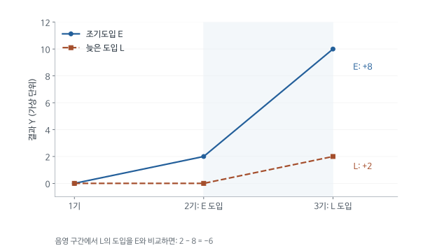

# 도입 시점이 다른 정책의 DID가 잘못된 비교를 만드는 이유: Baker 등 (2022) 심층요약

어떤 주는 1990년에 은행 규제를 완화하고 다른 주는 1995년에 완화했다고 하자. 규제완화가 소득 불평등을 바꾸었는지 알아보려면, 도입한 주의 변화를 아직 도입하지 않은 주와 비교할 수 있다. 그런데 여러 도입 연도를 하나의 고정효과 회귀에 넣으면, 이미 규제를 완화한 주가 나중 도입한 주의 비교집단으로 사용되기도 한다.

먼저 도입한 주의 정책효과가 계속 커지는 중이면 그 주의 변화에는 정책효과가 포함된다. 그 변화를 비교집단의 자연 변화처럼 빼면 나중 도입한 주의 효과를 잘못 계산한다. Baker 등은 이 문제가 정적 DID와 사건연구에 어떻게 발생하는지 설명하고, 시뮬레이션과 기존 연구 재분석으로 그 크기를 평가한다.

[원문 PDF](<How much should we trust staggered difference-in-differences estimates (2022).pdf>) | [독립형 QnA](<How much should we trust staggered difference-in-differences estimates (2022)_QnA.md>)

## 1. 도입 후 효과가 계속 변하면 비교집단의 변화도 처치효과를 포함한다

정책효과가 도입 직후와 5년 뒤에 같을 필요는 없다. 은행의 경쟁 확대가 대출과 소득에 영향을 주기까지 시간이 걸리는 경우를 생각하면, 도입 후 기간에 따라 효과가 커지는 것이 자연스럽다. 이런 상황을 ‘효과의 동학’이라고 부른다.

이 문제는 도입 시점이 수요충격과 관련될 때만 생기는 것이 아니다. 도입 시점을 무작위로 정하고 정책이 없었을 추세를 완벽히 같게 만들어도, 먼저 도입한 집단의 누적효과를 비교집단의 변화로 사용하면 잘못된 추정치가 나올 수 있다. 저자들은 모의자료에서 이 조건을 직접 구성해 비교방식 자체의 문제를 확인한다. 이후 설명에서는 가장 작은 DID에서 시작해 여러 도입시점이 들어간 회귀가 어떤 비교를 추가하는지 살펴본다.

전통적인 두 집단 두 시점 DID에서는 비교집단이 두 시점 모두 처치를 받지 않는다. 비교집단의 변화는 처치가 없었을 공통 추세를 대신한다. 여러 지역이 서로 다른 해에 정책을 도입하면, 어떤 지역은 한 비교에서 처치집단이고 다른 비교에서는 이미 처치를 받은 비교집단이 될 수 있다. 회귀 명령 하나로 이 비교들이 함께 사용된다는 점이 문제의 출발이다.

예를 들어 먼저 개혁한 지역의 성과가 도입 후 계속 개선된다면, 나중에 개혁한 지역과 비교할 때 먼저 개혁한 지역의 추가 개선을 공통 추세처럼 빼게 된다. 이 변화에는 개혁 자체의 동태효과가 포함되어 있다. 처치가 없었을 추세가 완벽히 평행해도 이 비교는 잘못된 기준을 사용할 수 있다. 논문은 평행추세만 확인한 뒤 TWFE 계수를 평균효과라고 해석하는 관행을 검토한다.

## 2. 달력 연도와 도입 후 경과기간을 구분한다

1998년은 모든 주에 같은 달력 연도이지만, 1990년에 도입한 주에는 도입 8년 뒤이고 1995년에 도입한 주에는 3년 뒤다. 효과가 누적된다면 이 두 관측치는 같은 처치단계가 아니다. 집단별 도입 시점과 상대시간을 표시하는 기호는 이런 차이를 명시하기 위해 필요하다.

| 기호 | 의미 | 주별 규제완화 예시 |
|---|---|---|
| $i$ | 단위 | 주 또는 기업 |
| $t$ | 달력 시점 | 1998년 |
| $G_i$ | 최초 처치 시점 | 해당 주의 규제완화 연도 |
| $D_{it}=1\{t\ge G_i\}$ | 도입 후 여부 | 완화 후 1 |
| $\ell=t-G_i$ | 사건 상대시간 | 도입 2년 뒤이면 2 |
| $Y_{it}(0)$ | 미처치 잠재결과 | 완화가 없었을 때의 불평등 |
| $Y_{it}(1)$ | 처치 상태의 잠재결과 | 여기서는 도입 시점의 이력도 고려해야 함 |
| $ATT(g,t)$ | $g$년에 도입한 집단의 $t$년 평균효과 | 1990년 도입주의 1998년 효과 |

원문의 $E_i$에 해당하는 도입 시점을 여기서는 기댓값 기호 $E[\cdot]$와 구분하기 위해 $G_i$로 쓴다. 처치는 한 번 도입하면 유지되는 상황이다. 도입과 폐지가 반복되는 경우에 이 설명을 그대로 적용하지 않는다.

엄밀히는 처치의 이력이 중요하므로 $Y_{it}(g)$처럼 도입 연도별 잠재결과를 쓸 수 있다. 아래 $Y_{it}(1)$은 지정된 도입 이력 아래 처치 결과를 줄여 쓴 표기다.

달력시간은 모든 지역이 공유하는 2010년, 2011년 같은 연도다. 사건시간은 각 지역이 도입한 해를 0으로 하여 그 전후를 세는 시간이다. 2012년에 먼저 도입한 지역은 도입 2년째이고 나중에 도입한 지역은 아직 미처치일 수 있다. 연도 고정효과가 같아도 두 지역의 사건시간은 다르다.

코호트는 같은 해에 도입한 단위들의 집단이다. 같은 코호트 안에서도 개별 효과가 다를 수 있지만, 집단별 도입시점을 사용하면 어느 비교가 아직 미처치인 단위를 사용하는지 명확하게 기록할 수 있다. 첨자를 읽을 때 개인이나 기업의 번호와 도입집단의 번호를 구분해야 표의 한 효과가 어떤 사람과 기간을 평균한 것인지 알 수 있다.

## 3. 두 집단 두 시점의 DID가 먼저 성립하는 이유

순차 도입에서 무엇이 달라지는지 알기 위해 가장 작은 DID를 먼저 생각한다. 처치집단의 전후 변화에는 정책효과와 정책이 없어도 일어났을 변화가 함께 들어 있다. 계속 미처치인 비교집단의 변화가 두 번째 부분을 대표한다면 이를 빼서 정책효과를 얻는다. 다음 전개는 평행추세 가정이 정확히 어느 항을 없애는지 보여준다.

처치집단은 T, 비교집단은 C로 쓰고 도입 전후 시점을 각각 0과 1로 표시한다. 각 집단 및 시점의 표본 평균을 넣으면 다음 DID를 계산할 수 있다.

$$
\widehat\tau_{DID}=(\bar Y_{T1}-\bar Y_{T0})-(\bar Y_{C1}-\bar Y_{C0}).
$$

왜 이 차이가 효과가 되는가? 모집단 평균에서 첫 차이를 잠재결과로 바꾼다. 도입 전에는 예고효과가 없다고 가정한다.

$$
E[Y_1\mid T]-E[Y_0\mid T]
=E[Y_1(1)-Y_0(0)\mid T].
$$

우변에 $Y_1(0)$을 더하고 빼면

$$
=E[Y_1(1)-Y_1(0)\mid T]
+E[Y_1(0)-Y_0(0)\mid T].
$$

첫 항은 원하는 ATT다. 둘째 항은 처치집단도 정책이 없었으면 경험했을 자연 변화다. 비교집단이 두 시점 모두 미처치이면 비교집단의 변화는

$$
E[Y_1(0)-Y_0(0)\mid C]
$$

이다. 평행추세 가정은 두 집단의 이 **미처치 변화의 평균**이 같다는 주장이다. 따라서

$$
DID=ATT+\underbrace{\Delta Y_T(0)-\Delta Y_C(0)}_{0}=ATT.
$$

수준 자체가 같을 필요는 없다. 가상 수치로 T가 50에서 60, C가 30에서 34로 변했다면 DID는 $10-4=6$이다. T의 반사실적 도입 후 수준을 $50+4=54$로 구성했기 때문이다.

반대로 T지역에만 경기호황이 와서 정책과 무관한 변화가 9이고 C는 4였다면 추정치에는 $9-4=5$의 편향이 남는다. 고정효과라는 이름이 이 편향을 없애주지 않는다.

평행추세는 실제 관측 결과가 처치 이후에도 평행해야 한다는 뜻이 아니다. 처치가 없었을 두 집단의 변화가 같았을 것이라는 반사실 조건이다. 처치집단의 관측 결과가 사후에 달라지는 것은 오히려 관심 있는 효과일 수 있다. 이 조건이 맞으면 비교집단의 변화를 사용해 처치집단의 보이지 않는 무처치 경로를 구성한다.

단순 DID에서 효과를 읽기 쉬운 이유는 빼는 변화가 무처치 상태의 변화이기 때문이다. 비교집단이 이미 정책으로 2만큼 개선된 뒤 다음 기간에는 8만큼 더 개선된다면, 그 8을 자연적인 시간 변화로 취급할 수 없다. 여러 시점의 DID를 이해하려면 먼저 각 작은 비교에서 어느 집단의 어떤 변화가 기준으로 사용되는지 찾아야 한다.

## 4. 단위 및 시간 고정효과를 제거한 처치변수로 회귀한다

여러 집단과 시점을 함께 분석할 때는 각 주의 고정적인 수준 차이와 전국 공통의 연도별 변화를 회귀에서 제거한다. 이를 두 방향 고정효과라고 부른다. 이 과정을 거친 처치변수가 어떤 관측치에 큰 비중을 주는지 확인하면, 회귀가 의도와 다른 비교를 사용하는 이유를 이해할 수 있다.

$$
Y_{it}=\alpha_i+\lambda_t+\delta D_{it}+u_{it}
$$

이다. $\alpha_i$는 각 단위의 시간불변 수준, $\lambda_t$는 모든 단위에 공통된 시점별 변화를 흡수한다. 단위마다 다른 경기 변화나 정책효과의 동학을 자동으로 분리하지는 않는다.

균형패널에서 어떤 변수 $V$의 이중 평균제거값을

$$
\widetilde V_{it}=V_{it}-\bar V_i-\bar V_t+\bar V
$$

라고 정의한다. 단위 평균과 시간 평균을 빼되 두 번 뺀 전체 평균은 한 번 더한다. Frisch-Waugh-Lovell 정리에 따라 처치계수는

$$
\widehat\delta=\frac{\sum_{it}\widetilde D_{it}\widetilde Y_{it}}
{\sum_{it}\widetilde D_{it}^2}
=\frac{\sum_{it}\widetilde D_{it}Y_{it}}
{\sum_{it}\widetilde D_{it}^2}.
$$

마지막 등호는 $\widetilde D$가 단위 및 시간 고정효과와 직교하기 때문이다. 이 식은 모든 처치 관측에 같은 양의 가중치를 부여하는 평균이 아니다. 이미 처치된 관측 중 $\widetilde D$가 음수인 칸도 생길 수 있다.

단위 고정효과는 원래 성과가 높은 지역과 낮은 지역 사이의 지속적인 수준 차이를 제거한다. 연도 고정효과는 모든 지역에 공통인 경기 충격을 제거한다. 하지만 먼저 처치된 지역에서만 정책효과가 해마다 커지는 변화는 두 종류의 고정효과 어느 하나와도 같지 않다. 이를 제거한 뒤 남은 처치변수의 변동이 어떤 비교를 형성하는지 살펴야 한다.

처치변수의 잔차가 음수라는 것은 그 관측치가 실제로 미처치라는 뜻이 아니다. 원래 처치값에서 단위와 시간의 평균적 패턴을 제거한 값이 음수라는 뜻이다. 이미 처치된 관측치도 음의 잔차를 가질 수 있고, 그 관측치의 큰 성과가 회귀계수에 음의 방향으로 기여할 수 있다. 잔차 회귀의 계산과 실제 처치 상태를 혼동하지 않아야 한다.

## 5. 효과가 모두 양수인 자료에서 음의 계수를 직접 계산한다

문제를 추상적으로만 설명하면 실제로 부호가 바뀔 정도인지 판단하기 어렵다. 다음 예제는 정책이 없었을 결과를 모든 집단과 시점에서 0으로 두어 다른 교란을 없앤다. 오직 도입 시점과 효과의 누적만 다르게 설정하고, 회귀가 그 자료에서 어떤 값을 계산하는지 확인한다.

예제의 E와 L은 크기가 같은 두 집단이다. E는 2기에 도입하고 L은 3기에 도입한다. 처치 이전 결과는 0이며 모든 미처치 잠재결과도 0으로 설정했다.

| 집단 | 1기 $Y,D$ | 2기 $Y,D$ | 3기 $Y,D$ |
|---|---|---|---|
| E | 0, 0 | 2, 1 | 10, 1 |
| L | 0, 0 | 0, 0 | 2, 1 |

모든 실제 처치효과는 양수다. E의 효과가 2에서 10으로 커졌고 L의 첫 효과는 2다. 미처치 추세는 완벽하게 평행하다.

첫 비교는 1기와 2기를 사용하여 E의 도입을 아직 미처치인 L과 비교한다.

$$
DID_{early}=(2-0)-(0-0)=2.
$$

둘째 비교는 2기와 3기를 사용하여 L의 도입을 이미 처치된 E와 비교한다.

$$
DID_{late}=(2-0)-(10-2)=2-8=-6.
$$

L에게 나쁜 효과가 생긴 것이 아니다. E의 효과 증가 8을 빼버린 것이다. 이 작은 균형패널에서는 두 비교가 같은 가중치를 받아

$$
\widehat\delta=\tfrac12(2)+\tfrac12(-6)=-2
$$

가 된다. 직접 OLS도 확인할 수 있다. 처치변수의 평균제거값은

$$
\widetilde D_E=(-1/6,1/3,-1/6),\quad
\widetilde D_L=(1/6,-1/3,1/6).
$$

분모는 $4(1/36)+2(1/9)=1/3$이다. 분자는 관측 결과를 곱하여

$$
(1/3)2+(-1/6)10+(1/6)2=-2/3
$$

이므로 $(-2/3)/(1/3)=-2$다. 실제 처치된 세 칸의 단순평균 효과 $14/3$과 전혀 다르다. 이 예에서 그 평균 전체를 깨끗한 비교만으로 식별할 수 있다는 뜻은 아니다. 3기에는 미처치 집단 자체가 없다.

가상 예제에서 먼저 처치된 집단의 효과가 2에서 10으로 커지는 변화가 중요하다. 나중 집단의 도입 시점에 먼저 집단을 비교 대상으로 사용하면, 나중 집단의 개선 2에서 먼저 집단의 추가 개선 8을 빼게 된다. 그래서 -6이라는 DID가 생긴다. 실제 처치효과가 음수인 사람이 있어서 나온 값이 아니다.

이를 올바른 초기 비교와 평균하면 최종 TWFE 계수도 음수가 된다. 이 예제는 무처치 결과가 모든 집단과 기간에서 0이므로 평행추세 위반을 원인으로 들 수 없다. 효과가 시간에 따라 달라지고 이미 처치된 집단이 비교에 사용되는 것만으로 문제가 생긴다. 원인을 분리해 보여주기 위해 복잡한 현실 대신 작은 표를 사용한 것이다.

모든 집단이 이미 처치된 마지막 기간에는 더 이상 관측된 무처치 집단이 없다. 그 기간의 모든 효과를 아무 추가 가정 없이 알아낼 수 있다고 말해서도 안 된다. 나쁜 비교를 제외하는 일과 원래 자료에 없는 반사실을 복원하는 일은 별개다. 올바른 대안 추정법도 식별할 수 있는 기간과 대상의 범위를 밝혀야 한다.

<!-- learning-figure:staggered-comparison -->

*그림 설명: 본문의 두 집단 세 시점 가상 예제다. 실제 정책효과의 추정치는 아니다.*

2기부터 3기까지 L의 결과는 2만큼 늘지만, 비교에 사용된 E는 누적 처치효과 때문에 8만큼 늘어난다. 이 비교의 DID는 2에서 8을 뺀 -6이다. L의 실제 처치효과가 음수여서 생긴 결과가 아니다. 3기에는 미처치 집단이 없다는 점도 함께 보아야 한다.

<!-- /learning-figure -->

## 6. DID 비교의 가중치와 실제 처치효과의 가중치는 다르다

여러 DID를 양의 가중치로 합쳤다고 해도 각 DID가 올바른 효과를 추정하는지는 별도 문제다. 앞 예제의 -6은 나쁜 정책효과가 아니라 이미 처치된 집단의 효과 증가를 뺀 값이다. 같은 회귀를 실제 집단별 효과의 합으로 다시 전개하면 어떤 효과가 음의 부호로 들어가는지 드러난다.

다른 방식으로 개별 집단 및 시점의 진짜 처치효과에 대한 선형결합을 전개하면 음의 가중치가 나타날 수 있다. **비교 DID에 붙는 가중치**와 **실제 처치효과 칸에 붙는 가중치**는 같은 대상이 아니다. “가중치가 모두 양수이니 안전하다”는 결론은 첫 번째 분해를 두 번째 해석과 혼동한 것이다.

논문의 분해는 대략 분산가중 평균효과, 미처치 추세 차이, 처치효과 변화에서 생기는 오염을 분리한다. 평행추세가 성립하면 미처치 추세 차이는 사라진다. 그래도 이미 처치된 비교집단의 효과가 변하면 마지막 오염은 남는다.

하나의 회귀계수를 여러 작은 DID의 가중평균으로 쓰는 분해는 실제로 어떤 비교가 사용되는지 보여준다. 작은 DID에 붙은 가중치가 모두 양수여도 각 DID 자체가 원하는 효과를 나타내지 않을 수 있다. 이미 처치된 집단의 효과 변화를 뺀 DID가 음수라면 양의 가중평균도 음수가 될 수 있다.

개별 집단 및 시점의 진짜 효과를 기준으로 다시 식을 정리하면 음의 가중치가 드러날 수 있다. 두 종류의 가중치가 가리키는 대상이 다르므로 ‘가중치는 양수인데 왜 음의 가중치라고 하는가’라는 혼란이 생긴다. 한쪽은 작은 비교의 가중치이고 다른 쪽은 그 비교를 구성하는 실제 효과의 기여다. 분해의 단위를 명시하면 모순이 사라진다.

### 6.1 같은 숫자를 두 가지 가중치로 끝까지 정리하면

앞의 세 실제 효과에 각각 이름을 붙여 보자. 먼저 도입한 집단의 첫 효과는 $\tau_{E2}$, 그다음 효과는 $\tau_{E3}$, 늦게 도입한 집단의 첫 효과는 $\tau_{L3}$다. 미처치 결과를 모두 0으로 둔 앞의 교육용 예제에서는 두 DID를 다음처럼 쓸 수 있다.

$$
DID_{early}=\tau_{E2},\qquad
DID_{late}=\tau_{L3}-(\tau_{E3}-\tau_{E2}).
$$

두 비교를 절반씩 합친 뒤 괄호를 풀면 가중치가 달라 보이는 이유가 드러난다.

$$
\begin{aligned}
\widehat\delta
&=\tfrac12\tau_{E2}+\tfrac12[\tau_{L3}-\tau_{E3}+\tau_{E2}]\\
&=1\cdot\tau_{E2}-\tfrac12\tau_{E3}+\tfrac12\tau_{L3}.
\end{aligned}
$$

첫 줄에서 두 DID의 가중치는 각각 $1/2$다. 둘째 줄에서 실제 효과 세 개의 가중치는 $1,-1/2,1/2$이고 합은 여전히 1이다. 합이 1이라는 조건만으로 평균이 세 효과의 최솟값과 최댓값 사이에 놓이지는 않는다. 그 성질에는 가중치가 모두 음수가 아니어야 한다는 조건도 필요하다. 여기서는 $2-10/2+2/2=-2$가 되어 실제 효과 2와 10의 범위를 벗어난다.

왜 첫 효과의 가중치가 1인가? 초기 비교에서 한 번 더하고, 늦은 비교에서 먼저 도입한 집단의 전후 변화 $\tau_{E3}-\tau_{E2}$를 빼면서 다시 더하기 때문이다. 효과가 어느 칸에서 더해지고 빼지는지 추적하면 ‘음의 가중치’가 소프트웨어 오류가 아니라는 사실을 알 수 있다. 비교식의 대수에서 나오는 값이다.

## 7. 집단별 효과 차이와 도입 후 효과 변화는 다른 문제를 만든다

어느 주에서는 효과가 항상 2이고 다른 주에서는 항상 5라면 평균을 어떤 가중치로 구할지가 중요하다. 같은 주의 효과가 첫해 2에서 다음 해 10으로 늘어난다면 이미 처치된 주를 비교집단으로 쓰는 차분 자체도 오염될 수 있다. 집단 이질성과 시간 동학을 구분하면 회귀의 문제를 더 정확히 진단할 수 있다.

동학은 같은 집단의 효과가 도입 후 시간에 따라 달라지는 것이다. 훈련이나 광고의 효과가 누적되면 도입 직후와 3년 뒤 효과가 다르다. 이미 처치된 집단을 비교집단으로 쓰는 문제가 특히 이 경우 심각해진다.

효과가 모든 집단, 모든 도입 후 시점에서 같은 상수이고 식별가정도 맞는다면 도입 시점이 다르다는 사실만으로 TWFE가 반드시 실패하는 것은 아니다. 논문은 회귀 자체를 무효라고 하지 않는다. 동질효과를 암묵적으로 전제한 해석이 취약하다고 지적한다.

집단마다 효과의 크기가 다르지만 각 집단 안에서는 도입 후 일정한 상황을 생각할 수 있다. 이 경우 TWFE가 어떤 집단을 많이 반영하는지에 따라 관심 있는 인구 평균과 달라질 수 있다. 여기에 각 집단의 효과가 경과기간에 따라 변하면 이미 처치된 비교집단의 변화 자체가 오염되는 문제가 더해진다. 이 두 차이를 구분해야 왜 어떤 시뮬레이션에서 문제가 더 심한지 이해할 수 있다.

자료의 관측기간을 늘리면 새로운 사후 관측치와 새로운 비교가 추가된다. 실제 정책의 집단별 효과가 달라지지 않아도 회귀가 부여하는 가중치가 변해 최종 계수가 달라질 수 있다. 긴 패널이 언제나 같은 평균효과를 더 정밀하게 추정한다고 볼 수 없다. 어떤 기간을 포함했는지가 추정대상의 일부가 된다.

## 8. 정답을 아는 모의자료에서 추정법의 편향을 확인한다

실제 정책자료에서는 참효과를 모르기 때문에 추정치가 잘못되었는지 직접 판단하기 어렵다. 저자들은 실제 기업 자료의 기본 변동에 효과를 인위적으로 부여한다. 이렇게 만든 자료는 정답을 알 수 있어 반복 추정의 평균이 참효과와 얼마나 다른지 평가할 수 있다.

미국 비금융기업의 Compustat 자산수익률(ROA) 자료에 처치 시점과 효과를 부여하고 각 설정에서 500회 추정한다. ROA는 자산 대비 수익을 나타내는 기업 성과지표다.

| 설정의 변화 | 확인하려는 것 |
|---|---|
| 공통 도입, 일정한 효과 | 기본 DID의 기준점 |
| 순차 도입, 동질적 일정 효과 | 시점 차이만으로 항상 실패하는가 |
| 순차 도입, 집단별 일정 효과 | 추정 평균의 가중치가 목표와 같은가 |
| 순차 도입, 시간에 따라 증가하는 효과 | 이미 처치된 집단의 변화가 오염시키는가 |
| 순차 도입, 집단별로 다른 증가 경로 | 부호까지 뒤집힐 수 있는가 |

Fig. 2의 분포를 볼 때 참효과를 표시한 기준선과 추정치 분포의 중심을 비교한다. 분포가 좁아도 중심이 틀리면 정확한 추정이 아니다. 논문의 별도 영효과 시뮬레이션에서는 명목 5% 검정이 약 79% 기각하는 사례도 제시한다. 이는 모든 DID 연구의 오류율이 79%라는 말이 아니다. 설정된 효과 이질성과 회귀 비교구조가 결합하면 얼마나 심각할 수 있는지 보여주는 예다.

모의실험에서는 도입시점과 효과를 연구자가 정하므로 추정법이 찾아야 할 답을 알고 있다. 현실의 기업 자료를 바탕으로 변동 규모를 유지하면서 처치과정을 구성하면 실제 자료와 비슷한 불확실성 아래 추정법의 문제를 살펴볼 수 있다. 도입시점의 내생성이 없어도 잘못된 비교가 얼마나 문제를 만드는지 분리하는 데 유용하다.

반복된 표본에서 5% 유의수준의 검정이 실제로 얼마나 자주 잘못 기각하는지 확인하는 것도 목적이다. 논문에서 특정 설정의 높은 기각률은 그 설정 아래의 성능이다. 모든 DID 연구가 같은 확률로 틀린다는 숫자로 일반화할 수 없다. 효과 동학과 이질성, 표본구조를 바꾼 여러 설정이 각각 무엇을 보여주는지 읽어야 한다.

## 9. 사건연구의 도입 전 계수에도 다른 시점 효과가 섞일 수 있다

사건연구는 정책 도입 전후의 변화를 상대시간별로 그려 효과가 언제 나타나는지 확인하려는 분석이다. 일반적인 TWFE 사건연구에서는 서로 다른 도입집단을 하나의 상대시간 계수로 합치는 과정에서 다른 시점의 효과가 섞일 수 있다. 도입 전 계수도 이 영향을 받으므로 사전추세 그래프를 해석할 때 추정법을 함께 확인해야 한다.

$$
Y_{it}=\alpha_i+\lambda_t+
\sum_{\ell\ne-1}\beta_\ell 1\{t-G_i=\ell\}+u_{it}
$$

를 추정한다. $\ell=-1$을 기준으로 제외하여 상대적인 차이를 표시한다. 그러나 일반적인 TWFE 사건연구의 $\beta_\ell$이 항상 그 시점의 평균효과는 아니다. 서로 다른 집단의 다른 상대시간 효과가 섞일 수 있다.

그래서 실제 예고효과가 없어도 사전계수가 0에서 벗어날 수 있고, 반대로 중요한 추세 차이를 가릴 수도 있다. 사전계수가 유의하지 않다는 사실은 평행추세의 증명이 아니다. 검정력이 약할 수도 있고, 회귀의 오염이 상쇄할 수도 있다.

먼 시점을 하나의 구간으로 묶는 binning은 해당 구간 효과를 같은 계수로 제한한다. 효과가 계속 증가하면 그 제한이 틀린다. binning을 없애는 것은 점검할 사양 선택이지만, 그것만으로 집단별 이질효과 문제가 모두 해결되지는 않는다.

사건연구의 도입 전 계수는 아직 정책이 없었을 때 처치집단과 비교집단이 달랐는지 살펴보려는 목적으로 사용된다. 그러나 전통적 TWFE 사건연구에서는 다른 코호트의 사후 효과가 해당 계수 계산에 섞일 수 있다. 실제로는 사전추세가 없는데 그림에 사전 효과처럼 나타날 가능성이 생긴다.

반대로 사전 계수가 유의하지 않다는 사실만으로 사후 계수가 깨끗해지는 것도 아니다. 표본이 작아 사전 차이를 발견하기 어렵거나 오염이 다른 방식으로 나타날 수 있다. 사전 그림을 읽기 전에 그 계수가 어떤 코호트를 비교하여 만들어졌는지 확인해야 한다. 진단으로 사용하는 숫자 자체가 비교 설계에 의존한다는 점이 이 논문의 중요한 확장이다.

## 10. 각 도입집단을 아직 미처치인 집단과 먼저 비교한다

나중에 도입한 집단의 효과를 구하면서 먼저 도입한 집단의 효과 증가를 빼지 않으려면 비교대상을 바꿔야 한다. 특정 집단이 도입한 뒤의 변화를 그 시점까지 미처치인 집단과 비교하면 이 문제를 피할 수 있다. 이 비교로 집단별, 시점별 효과를 먼저 구한 다음 원하는 평균으로 합친다.

$g$년에 도입한 집단을 $G=g$로 표시하고 그 집단의 $t\ge g$ 시점 효과를 평가한다. 기준은 도입 직전인 $g-1$이다. 비교집단 C는 적어도 $t$까지 미처치여야 한다. 다음 식은 두 집단의 같은 기간 변화를 비교한다.

$$
ATT(g,t)=E[Y_t-Y_{g-1}\mid G=g]
-E[Y_t-Y_{g-1}\mid C]
$$

로 식별할 수 있다. 등호에는 예고효과 없음과 두 집단의 해당 기간 미처치 평행추세가 필요하다. 공변량 조건부 평행추세라면 단순 무조건 평균차이를 그대로 쓰지 않고 회귀나 가중치 등으로 조건을 맞춰야 한다.

Callaway-Sant'Anna 방식은 이런 집단 및 시점별 효과를 먼저 구하고 연구목적에 맞게 합친다. Sun-Abraham 방식은 집단별 상대시간 상호작용으로 이질적인 효과를 분리한 뒤 합친다. 이 논문이 소개하는 SA와 CS의 비교집단 및 공변량 처리 차이는 당시 설명의 범위로 읽어야 한다.

아직 미처치인 집단은 미래에 도입하더라도 현재 비교에 쓸 수 있다. 단, 도입 예고를 듣고 이미 행동을 바꾸었다면 그 시점은 깨끗한 미처치가 아니다.

아직 미처치인 집단을 사용하는 비교에서는 해당 시점까지 정책효과가 발생하지 않은 관측치를 기준으로 삼는다. 먼저 도입한 집단의 도입 전후 변화에서 이 기준집단의 같은 기간 변화를 제외하면 이미 처치된 집단의 효과 변화를 빼는 문제를 피할 수 있다. 도입 전 행동이 바뀌는 예상효과가 없다거나 이를 고려한 기간을 사용한다는 조건이 필요하다.

이 방법도 평행추세를 자동으로 만들어 주지는 않는다. 먼저 도입한 지역과 나중 지역의 무처치 변화가 달랐다면 여전히 문제가 있다. 대안 추정량의 개선점은 비교에 처치효과를 잘못 포함하지 않는 데 있다. 제도적 배정 설명과 적절한 비교집단이라는 연구 설계의 책임은 그대로 남는다.

## 11. 집단별 효과를 어느 인구와 기간에 걸쳐 평균할 것인가

개별 집단 및 시점의 효과를 얻고 나면 정책의 대표효과를 보고하기 위해 평균을 계산한다. 이때 사람 수, 집단 수, 도입 후 관측기간 중 무엇을 기준으로 가중하는지에 따라 답이 달라진다. 평균을 정하는 일은 어떤 정책 질문에 답할지 정하는 작업이기도 하다.

가상으로 $ATT(A,t)=2$, $ATT(B,t)=8$이고 두 집단에 각각 80명과 20명이 있다고 하자. 사람 수를 기준으로 평균하면 각 집단에 0.8과 0.2의 가중치를 준다.

$$
0.8(2)+0.2(8)=3.2
$$

이다. 집단을 동일하게 가중하면 $(2+8)/2=5$다. 둘 다 계산은 맞지만 질문이 다르다.

1년 효과와 5년 효과를 함께 평균하면 얼마나 긴 기간을 포함하는지가 추정대상을 바꾼다. 초기도입 집단만 5년 후까지 관측된다면 상대시간별 평균을 구성하는 집단 자체도 달라진다. 계수의 변화를 효과의 성장으로만 읽기 전에 구성 변화를 확인해야 한다.

집단별 효과를 얻은 다음에도 평균을 어떻게 낼지 정해야 한다. 작은 집단과 큰 집단에 같은 비중을 주면 전형적인 집단의 평균에 가깝고, 사람 수에 비례하면 전형적인 처치자의 평균에 가깝다. 어떤 정책 판단을 하느냐에 따라 필요한 평균이 다르다. 하나의 숫자를 보고하려면 이 선택을 숨기지 않아야 한다.

긴 사건시간에서는 일찍 도입한 집단만 관측되는 경우도 있다. 도입 1년째의 평균과 5년째의 평균을 비교할 때 대상 코호트가 달라지면 그림의 변화에 효과 동학과 집단 구성의 변화가 함께 반영된다. 가능한 경우 같은 코호트를 유지하거나 각 시점에 포함되는 집단을 밝혀야 시간이 지나 효과가 커졌다는 해석이 명확해진다.

### 11.1 사건시간 곡선이 올라가도 같은 집단의 효과가 커진 것은 아닐 수 있다

오염된 비교를 제거한 뒤에도 평균을 해석하는 문제가 남는다. 2020년 도입집단 E의 효과는 도입 뒤 언제나 10, 2022년 도입집단 L의 효과는 언제나 2라고 가정해 보자. 관측은 2023년에 끝나고, 두 집단은 크기가 같다. 계속 미처치인 비교집단이 따로 있어 각 효과는 올바르게 식별된다고 가정한다. 이것은 집계 문제만 보기 위한 가상 자료다.

도입 직후인 $\ell=0$에는 E와 L을 모두 관찰하므로 평균은 $(10+2)/2=6$이다. 도입 3년 뒤인 $\ell=3$에는 E만 남아 평균이 10이다. 그림은 6에서 10으로 올라간다. 그러나 어느 집단에서도 효과가 시간에 따라 커지지 않았다. 오래 관찰할 수 있는 집단의 구성이 달라졌을 뿐이다.

이 현상을 식으로 쓰면

$$
\theta_\ell=\sum_{g\in\mathcal G_\ell}w_{g,\ell}ATT(g,g+\ell),
\qquad \sum_{g\in\mathcal G_\ell}w_{g,\ell}=1.
$$

$\mathcal G_\ell$은 상대시간 $\ell$까지 자료와 유효한 비교집단이 있는 도입집단의 집합이다. $\ell$이 달라지면 효과뿐 아니라 집합과 가중치도 바뀐다. 곡선의 변화에는 이 둘이 함께 들어간다.

같은 집단의 시간 경과를 보고 싶다면 필요한 모든 상대시간을 관찰할 수 있는 집단으로 표본을 맞춰 다시 집계할 수 있다. 대신 늦게 도입한 집단을 제외하므로 정책 전체를 대표하는 범위는 좁아진다. 어떤 그림이 더 좋은지는 연구 질문에 달려 있다. 각 점의 표본구성과 가중치를 함께 보여 주어야 독자가 ‘누적효과’와 ‘평균에 들어간 집단의 변화’를 구별할 수 있다.

## 12. 도입 사건마다 비교자료를 만들어 함께 추정한다

Stacked regression은 각 도입집단에 유효한 비교집단을 붙인 자료를 만든 뒤 이 자료들을 합친다. 한 사건의 비교집단이 그 사건창 안에서 이미 처치되는 일이 없도록 정하는 것이 목적이다. 여러 사건에서 같은 단위가 재사용될 수 있으므로 사건별 자료를 구분하는 고정효과가 필요하다.

같은 미처치 기업이 여러 사건자료에 재사용될 수 있다. 그래서 단순히 원자료의 처치 더미만 바꾸는 작업이 아니다. 원문의 설명에서는 깨끗한 DID들을 OLS의 분산가중 방식으로 합치므로, 연구자가 원하는 사람 수 가중 평균과 다른 목표를 가질 수 있다. 오염된 비교 제거와 원하는 평균의 일치는 별개의 문제다.

어떤 대안도 실제 평행추세 위반을 자동으로 고치지는 않는다. 비교집단을 선택한 제도적 이유가 필요하다.

스택 방식은 도입 사건마다 별도의 작은 비교자료를 만든 뒤 이를 함께 분석한다. 각 자료에는 해당 도입집단과 사건창 안에서 적절한 미처치 비교집단을 포함한다. 이렇게 하면 어떤 비교를 허용할지 연구자가 명시적으로 정할 수 있다. 같은 비교집단이 여러 사건자료에 반복 등장할 수 있다는 점도 함께 생긴다.

반복 사용한 관측치가 독립적인 새 관측치가 되는 것은 아니다. 표준오차와 가중방식을 설계해야 하며, 각 스택의 단위 및 시간 효과도 구분해야 한다. 자료를 쌓았다는 이름만으로 원하는 전체 평균이 자동으로 추정되는 것은 아니다. 어떤 집단과 사건이 얼마나 반영되는지까지 설명해야 다른 대안 방법과 결과를 비교할 수 있다.

## 13. 은행규제와 이사회개혁의 기존 결론이 얼마나 달라졌는가

저자들은 방법론의 차이가 실제 결론에 미치는 영향을 보기 위해 기존 연구를 재분석한다. 은행규제완화의 불평등 효과와 이사회개혁의 기업가치 효과가 대상이다. 기존 계수와 대안 계수를 비교할 때는 유의성뿐 아니라 사용 가능한 비교기간과 평균효과의 대상도 함께 살펴야 한다.

Table 2의 은행규제완화 분석에서 기존 TWFE의 로그 Gini 계수는 통제변수 없이 -0.022, 포함하면 -0.018이다. 대안인 CS는 0.001, stacked는 0.000으로 유의하지 않다. 이미 처치된 주를 비교집단으로 사용하는 DID에 부여된 가중치는 전체의 0.86이다.

로그 결과의 -0.022는 수준 Gini가 0.022포인트 줄었다는 뜻이 아니다. 작은 계수 근사로 약 2.2% 감소이며 정확한 변환은 $100(e^{-0.022}-1)\approx-2.18\%$다. 대안 추정치는 표본창과 집계 방식도 고려하여 비교해야 한다.

앞 절까지는 이미 처치된 집단을 비교집단으로 쓰면 효과 증가분이 빠져 부호까지 바뀔 수 있다는 점을 가상 예제와 모의자료로 보였다. 실제 논문에서도 그 차이가 결론을 바꿀 만큼 큰지 보려면, 같은 자료에 기존 TWFE와 대안 추정법을 나란히 적용한 결과가 필요하다. 원문 Table 2가 그 비교다. 아래는 원문 Table 2의 두 패널을 한 표로 합쳐 옮긴 것이다(PDF 파일 기준 17쪽, 저널 386쪽). 수치는 모두 원문 그대로이고, 표본창 열은 표 주석과 본문 설명을 옮겨 적은 것이다.

*원문 Table 2 전체 수치 재배열: 은행 규제완화가 소득 불평등에 미친 영향 (종속변수: 주별 Gini 지수의 자연로그)*

| 패널, 열 | 추정법 | 시변 통제변수 | 규제완화 계수 (표준오차) | 관측치 | Adj. $R^2$ | 표본창과 비교집단 |
|---|---|---|---|---|---|---|
| A (1) | TWFE 복제 | 없음 | $-0.022^{***}$ (0.008) | 1519 | 0.51 | 1977-2007년 전체 패널 |
| A (2) | TWFE 복제 | 포함 | $-0.018^{***}$ (0.006) | 1519 | 0.54 | 1977-2007년 전체 패널 |
| B (1) | Callaway-Sant'Anna | 원문 미기재 | $0.001$ (0.007) | 미보고 | 미보고 | 도입 5년 전부터 10년 후, 아직 미처치인 주 |
| B (2) | Stacked regression | 원문 미기재 | $0.000$ (0.005) | 미보고 | 미보고 | 도입 5년 전부터 10년 후, 아직 미처치인 주 |

*주: 괄호 안은 주 단위 군집 표준오차다. $^{*}$, $^{**}$, $^{***}$는 양측검정 기준 10%, 5%, 1% 유의수준이다. Panel A 회귀에는 주 고정효과와 연도 고정효과가 들어간다.*

표는 행 단위로 읽는다. 위 두 행은 Beck 등(2010)의 원래 회귀를 저자들이 복제한 결과이고, 아래 두 행은 같은 자료에 대안 추정법을 적용한 결과다. 계수는 주가 은행 규제를 완화한 뒤 1이 되는 더미의 계수이며 단위는 로그 Gini다. -0.022를 표준오차 0.008로 나누면 t값이 약 2.75이므로 1% 수준에서 유의하다. 반면 CS의 0.001은 표준오차 0.007의 7분의 1 정도에 불과해 t값이 약 0.14다. 95% 신뢰구간을 대략 계산하면 CS는 $0.001\pm1.96\times0.007$, 즉 약 $[-0.013,\,0.015]$이고 stacked는 약 $[-0.010,\,0.010]$이다. TWFE의 점추정치 -0.022는 두 구간 밖에 놓인다. 관측치 1519는 31개 연도에 48개 주와 워싱턴 D.C.를 곱한 값($31\times49$)으로, 주-연도 패널이다.

TWFE 계수가 어디서 나왔는지는 원문 Fig. 8 (iii)의 분해표(PDF 18쪽)로 확인할 수 있다. 나중 도입 주를 먼저 도입 주와 비교한 DID들의 가중평균은 -0.027이고 가중치 합은 0.857이다. 먼저 도입 주를 나중 도입 주와 비교한 깨끗한 DID들의 가중평균은 0.005이고 가중치 합은 0.143이다. $0.857\times(-0.027)+0.143\times0.005\approx-0.022$이므로 Panel A (1)의 계수가 거의 그대로 재현된다. 음의 계수 대부분이 이미 규제를 완화한 주를 비교집단으로 쓴 비교에서 나왔다는 뜻이다. 본문 앞 단락의 가중치 0.86은 이 0.857을 반올림한 값이다.

이 표로 말할 수 있는 것은 다음과 같다. 같은 주-연도 자료에서 이미 처치된 주를 비교집단에서 빼자 1% 수준에서 유의하던 음의 추정치가 0 근처의 비유의한 값으로 바뀌었다. 통제변수 유무에 따라 TWFE 결과가 거의 달라지지 않으므로(-0.022와 -0.018), 차이를 만든 쪽은 통제변수보다 비교구조에 가깝다.

그렇다고 규제완화의 효과가 정확히 0이라고 확정할 수는 없다. CS 신뢰구간은 대략 ±1.4% 범위의 효과를 배제하지 못한다. Panel A와 Panel B는 표본창도 다르다. Panel B는 도입 5년 전부터 10년 후까지만 쓰고, 모든 주가 처치된 1999년 이후 관측치와 자료 시작 전에 이미 규제를 완화한 13개 주의 사전 비교를 쓸 수 없다. 따라서 두 패널의 차이 전부를 비교집단 교체의 효과로 돌릴 수는 없다. Panel B의 관측치 수와 설명력은 보고되지 않았고, CS는 회귀 기반 변형만 사용했다. 표 주석은 비교집단을 아직 미처치인 관측치라고 쓰고 본문은 나중에 처치된 주라고 쓰는데, 같은 비교집단을 다르게 표현한 것으로 읽힌다.

Table 3의 이사회 개혁 사례에서는 CS 추정치가 주요 개혁 0.062, 최초 개혁 0.116이며 표준오차가 각각 0.135, 0.094다. stacked의 최초 개혁 효과 0.166은 유의하지만 사전추세 우려가 남는다. 그러므로 “대안은 전부 0을 보여준다”거나 “원래 연구가 완전히 반증되었다”고 단정하지 않는다. 원래 자료에서 강건성이 약해졌다는 결론이다. 원저자들의 후속 대응은 본 논문의 주된 재분석 범위 밖이다.

두 번째 사례는 기업 단위의 불균형 패널이다. 저자들은 이 자료에 앞 사례에서 사용한 Goodman-Bacon 분해를 적용하지 않았다. 원문은 분해 대신 추정법별 결과를 나란히 놓는 방식으로 강건성을 점검하는데, 원문 Table 3이 그 결과다. 아래는 원문 Table 3의 Panel A와 Panel B를 처치 정의별 두 행으로 재배열한 발췌다(PDF 파일 기준 21쪽, 저널 390쪽). 계수와 표준오차, 유의 표시는 원문 그대로 옮겼다.

*원문 Table 3 재배열 발췌: 이사회 개혁이 기업가치에 미친 영향 (종속변수: 기업-연도 Tobin's Q)*

| 처치 정의 | TWFE, 통제 포함 (A열 1, 2) | TWFE, 통제 없음 (A열 3, 4) | Callaway-Sant'Anna (B열 1, 2) | Stacked (B열 3, 4) |
|---|---|---|---|---|
| 주요 개혁 | $0.096^{***}$ (0.03) | $0.110^{**}$ (0.05) | $0.062$ (0.135) | $0.063$ (0.051) |
| 최초 개혁 | $0.149^{***}$ (0.05) | $0.136^{**}$ (0.07) | $0.116$ (0.094) | $0.166^{***}$ (0.055) |

*주: 괄호 안은 국가 단위 군집 표준오차다. $^{*}$, $^{**}$, $^{***}$는 양측검정 기준 10%, 5%, 1% 유의수준이다. Panel A의 네 열은 모두 기업 고정효과와 연도 고정효과를 포함하고 관측치는 196,016개다. Adj. $R^2$는 A열 1부터 4까지 0.580, 0.581, 0.536, 0.536이다. Panel B는 도입 5년 전부터 5년 후까지의 관측치와 아직 미처치인 비교 관측치를 쓰며, 관측치 수는 보고되지 않았다.*

행은 무엇을 개혁 시점으로 보느냐를 나타낸다. 원저자들이 정의한 주요 개혁 시점을 쓰는 경우와, 국가의 첫 이사회 개혁 시점을 쓰는 경우다. 열은 왼쪽에서 오른쪽으로 원래 회귀, 통제변수를 뺀 원래 회귀, 두 대안 추정법 순이다. 저자들은 대안 추정에서 통제변수를 넣지 않았으므로, 공정한 비교 대상은 가운데 열의 통제 없는 TWFE다.

Tobin's Q는 로그가 아닌 수준 변수다. 주요 개혁의 통제 없는 TWFE 0.110은 개혁 이후 기업의 Q가 0.110만큼 높아졌다는 추정이며, 백분율로 바로 읽으면 안 된다. 같은 행의 CS 추정치 0.062는 크기가 절반 가까이로 줄었고 표준오차는 0.05에서 0.135로 커졌다. t값은 약 0.46이다. 최초 개혁 행에서 stacked의 0.166은 표준오차 0.055로 t값이 약 3.0이어서 1% 수준에서 유의하다. 첫 개혁 시점을 쓴 TWFE 효과가 주요 개혁보다 약 20%에서 50% 크다는 원문 설명도 표에서 확인된다($0.149/0.096\approx1.55$, $0.136/0.110\approx1.24$).

이 표로 말할 수 있는 것은 원래 연구의 양의 유의한 결과가 추정법 선택에 민감하다는 점이다. 두 처치 정의 모두에서 CS는 10% 수준에서도 유의하지 않고, 주요 개혁은 stacked에서도 유의하지 않다. 유일하게 유의한 최초 개혁의 stacked 추정치는 원문 Fig. 13 (ii) Panel B(PDF 24쪽)에서 도입 3년 전 계수가 유의한 음수이고 도입 시점까지 단조롭게 올라가는 사전추세를 보인다. stacked 집계값은 사후와 사전 동태계수의 차이에 가까우므로, 0.166에 사전추세가 섞였을 가능성이 남는다.

말할 수 없는 것은 이사회 개혁의 효과가 0이라는 주장이다. CS의 주요 개혁 추정치로 95% 신뢰구간을 대략 계산하면 $0.062\pm1.96\times0.135$, 즉 약 $[-0.20,\,0.33]$이다. 이 구간은 0도 포함하지만 원래 TWFE 추정치 0.110도 포함한다. CS 결과는 효과가 없다는 증거로 읽기보다 정밀도가 크게 떨어진 추정으로 읽어야 한다. Panel B는 도입 전후 5년 창만 쓰고 모든 국가가 처치된 이후(최초 개혁 기준 2006년, 주요 개혁 기준 2007년 이후) 관측치를 쓰지 않으므로, Panel A와 표본 자체도 같지 않다. 원문 Panel A의 표준오차는 소수 둘째 자리까지만 표시되어 있어 표의 별표를 t값으로 정확히 재검증할 수 없다. 예컨대 최초 개혁의 통제 없는 TWFE는 $0.136/0.07\approx1.94$로 보이지만 5% 유의 표시가 붙어 있는데, 반올림된 표준오차로는 판단할 수 없으므로 원문 표시를 그대로 둔다.

원문 표기에서 확인할 점이 하나 있다. 본문(PDF 23쪽)은 Panel B를 설명하면서 CS를 "column 1", stacked를 "column 2"라고 쓰지만, 실제 Table 3 Panel B에서 CS는 열 1과 2, stacked는 열 3과 4다. 표의 열 배치를 기준으로 읽으면 된다.

미국 주별 은행규제 완화가 소득불평등에 미친 영향을 다시 분석했을 때 전통적 TWFE의 음의 결과가 대안 방법에서 크게 약해졌다는 점은 기존 결론의 비교 근거를 재검토하게 한다. 이미 처치된 집단을 사용하는 비교의 비중이 높았다면 그 결과가 정책의 평균효과보다 효과 동학을 반영했을 가능성을 살펴야 한다. 대안 결과가 0에 가깝다는 것만으로 모든 정책효과가 정확히 0이라고 확정하지는 않는다.

국가별 이사회 개혁이 기업가치에 미친 영향을 분석한 사례에서는 방법과 개혁 정의에 따라 결과가 달라진다. 일부 스택 추정은 양의 효과를 보이지만 사전추세 문제도 함께 나타난다. 이 논문의 재분석을 ‘옛 연구의 효과는 모두 사라졌다’고 요약하면 정확하지 않다. 원래의 단일 회귀계수가 어떤 비교에서 나왔는지 확인하고, 설계와 추정대상을 명확하게 한 결과와 대조하는 것이 재분석의 요지다.

### 13.1 미처치 집단이 사라진 기간은 왜 회귀식만으로 복구할 수 없는가

앞의 작은 표에서 마지막 시점의 E는 10, L은 2였다. 이 숫자가 모두 정책효과라고 아는 것은 교육용 자료를 만들 때 미처치 결과를 0으로 지정했기 때문이다. 실제 연구자에게는 관측된 10과 2만 보인다.

가령 마지막 시점에 두 집단 모두 정책이 없었어도 1만큼 성장했을 가능성을 생각해 보자. 그러면 효과가 각각 9와 1이어도 관측 결과는 똑같이 10과 2다. 미처치 변화가 두 집단에서 같다는 평행추세는 이 설명도 허용한다. 공통 변화가 0인지 1인지 알려 주는 미처치 관측이 마지막 시점에 없기 때문이다.

$$
10=0+10=1+9,\qquad 2=0+2=1+1.
$$

두 자료생성과정은 관측값은 같지만 원하는 효과는 다르다. 이것이 식별되지 않는다는 말의 뜻이다. 더 많은 소수점이나 작은 표준오차로 해결할 문제가 아니다. 계속 미처치인 집단을 추가하거나, 미처치 추세의 외삽 또는 효과가 일정하다는 추가 가정을 써야 한다. 대안 DID가 그 시점을 추정하지 않는다면 소프트웨어가 정보를 버린다고만 볼 수 없다. 현재 자료와 가정으로 답할 수 없는 질문을 구분한 것일 수 있다.

## 14. 정책 도입 시점, 비교집단과 효과기간을 함께 보고한다

분석을 시작할 때 각 집단이 언제 처치되는지 확인하면 언제까지 미처치 비교가 가능한지 알 수 있다. 이어서 도입 전 예고효과가 있는지와 도입 후 효과가 계속 변할 이유가 있는지 설명한다. 이런 정보가 있어야 회귀계수의 의미와 집단별 효과의 집계 방식을 독자가 평가할 수 있다.

표준오차는 정책배정 수준과 시계열 상관을 고려해야 한다. 그러나 군집 표준오차는 잘못 구성된 비교의 중심을 바로잡지 않는다. 식별, 추정대상, 불확실성은 각각 검토해야 한다.

사전추세 검정의 비유의를 합격증으로 쓰지 말고, 제도적 근거, 효과 동학의 개연성, 대안 비교집단, 사건창 선택에 대한 민감도를 함께 설명해야 한다.

실제 연구를 읽을 때에는 도입연도별 단위 수와 마지막까지 미처치인 단위의 존재부터 확인할 수 있다. 그다음 효과가 도입 즉시 일정한지, 학습이나 투자 누적으로 계속 변할 가능성이 있는지 생각한다. 논문의 정책 상황에서 동태효과가 자연스럽다면 이미 처치된 집단을 기준으로 사용하는 문제가 특히 중요해진다.

클러스터 표준오차를 사용했다는 설명도 이 문제의 해결책과 구분해야 한다. 클러스터링은 관측치 간 오차 상관을 반영해 추정치의 불확실성을 평가한다. 잘못된 비교 때문에 계수의 중심이 목표 효과에서 벗어난 문제를 그 중심의 표준오차만 바꾸어 해결하지는 못한다. 비교집단, 평균할 대상과 추론을 각각 적절하게 설계해야 한다.

## 출처와 보충 설명

대상: Journal of Financial Economics 144, 370-395쪽. 보관 PDF 26쪽 전체 텍스트와 표를 검토했다. 위의 작은 패널과 손계산은 원문 실험이 아닌 학습용 예제다. CS, SA 및 소프트웨어 관련 설명은 이 논문이 설명한 당시 방법의 범위다.
