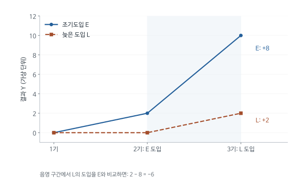

# 도입 시점이 다른 정책의 DID가 잘못된 비교를 유발하는 이유: Baker 등 (2022) 심층요약

어떤 주는 1990년에 은행 규제를 완화하고 다른 주는 1995년에 완화했다고 하자. 규제완화가 소득 불평등을 변화시켰는지 검토하려면 도입한 주의 변화를 아직 도입하지 않은 주의 변화와 비교하면 된다. 도입한 주의 전후 변화에서 비교 대상 주의 전후 변화를 차감하는 이 방법을 이중차분(DID)이라고 한다. 그런데 여러 도입 연도를 하나의 고정효과 회귀에 포함하면, 이미 규제를 완화한 주가 나중에 도입한 주의 비교집단(comparison group)으로 사용되기도 한다.

먼저 도입한 주의 정책효과가 계속 증가하는 중이라면 그 주의 결과 변화에는 정책효과가 혼입되어 있다. 그 변화를 비교집단의 자연스러운 변화로 간주해 차감하면 나중에 도입한 주의 효과를 잘못 계산한다. Baker, Larcker, Wang은 이 문제가 정적 DID(도입 후 효과를 계수 하나로 요약하는 회귀)와 사건연구(도입 전후 연도별 계수를 그리는 회귀)에서 각각 어떻게 발생하는지 설명하고, 시뮬레이션과 기존 연구 재분석으로 그 크기를 평가한다.

논문이 겨냥하는 독자는 금융, 회계, 법학 분야에서 주별 또는 국가별로 시차를 두고 도입된 법과 규제를 이용해 인과효과(causal effect)를 추정하는 연구자, 그리고 그런 논문을 심사하고 게재하는 학술지다. 2000-2019년 금융 5개, 회계 5개 상위 학술지를 직접 조사한 Table 1에 따르면, 주된 분석에 DID를 사용한 논문 744편 가운데 407편(54.7%)이 도입 시점이 다른 설계였고 그중 394편이 2010년 이후에 발표되었다. 연구자들은 도입 사건이 여러 번 있으면 특정 시기의 우연한 추세가 결과를 좌우할 가능성이 감소해 단일 시점 DID보다 신뢰할 만하다고 여겨 왔다. 핵심 질문은 이 설계의 표준 도구인 두 방향 고정효과(TWFE) 회귀의 계수를 처치집단 평균효과(average treatment effect on the treated, ATT)로 해석해도 되는지, 해석할 수 없다면 어떤 대안을 사용해야 하고 기존 결론은 얼마나 달라지는지다. TWFE 회귀는 단위 고정효과(unit fixed effects)와 연도 고정효과(year fixed effects)를 함께 포함하고 도입 후 더미 하나의 계수를 추정한다. ATT는 처치를 받은 단위들에서 처치 상태(treatment status) 결과와 무처치 상태 결과의 차이를 평균한 값이다.

[원문 PDF](<How much should we trust staggered difference-in-differences estimates (2022).pdf>) | [개념 퀴즈](<How much should we trust staggered difference-in-differences estimates (2022)_QnA.md>) | [수식·모델 퀴즈](<How much should we trust staggered difference-in-differences estimates (2022)_수식모델퀴즈.md>) | [실무 Cheat Sheet](<How much should we trust staggered difference-in-differences estimates (2022)_실무CheatSheet.md>)

## 1. 도입 후 효과가 계속 변하면 비교집단의 변화도 처치효과를 포함한다

정책효과가 도입 직후와 5년 뒤에 같을 필요는 없다. 은행 간 경쟁이 심화되어 대출과 소득에 영향이 나타나기까지 시간이 걸린다면 도입 후 경과기간에 따라 효과가 증가하는 편이 자연스럽다. 이 논문은 이런 효과를 동태적 처치효과(dynamic treatment effects)라고 부르고, 이 문서는 줄여서 효과의 동학이라고 칭한다. 저자들은 많은 경제 상황에서 효과가 도입 후 변한다고 보는 편이 가장 합리적인 기본 가정이라고 본다(원문 3쪽).

전통적인 두 집단 두 시점 DID에서는 비교집단이 두 시점 모두 처치를 받지 않으므로, 비교집단의 변화가 처치가 없었을 공통 추세(common trends)를 대신한다. 여러 지역이 서로 다른 해에 정책을 도입하면 사정이 달라진다. 어떤 지역은 한 비교에서 처치집단(treatment group)이고 다른 비교에서는 이미 처치를 받은 비교집단이 된다. 회귀 명령 하나가 이 비교들을 한꺼번에 사용한다는 점이 문제의 출발이다.

먼저 개혁한 지역의 성과가 도입 후 계속 개선된다면, 나중에 개혁한 지역과 비교할 때 먼저 개혁한 지역의 추가 개선을 공통 추세처럼 차감하게 된다. 이 추가 개선은 개혁 자체의 동태효과다. 그래서 이 문제는 도입 시점이 다른 충격과 우연히 겹칠 때만 발생하지 않는다. 도입 시점을 무작위로 정해 정책이 없었을 추세가 완벽히 동일해도, 먼저 도입한 집단의 누적효과를 비교 기준으로 사용하면 추정치가 편향될 수 있다. 모의자료(simulated data)에서 이 조건을 직접 구현하면 비교 방식 자체의 문제가 드러난다. 이를 바탕으로 평행추세(parallel trends)만 확인한 뒤 TWFE 계수를 평균효과로 해석하는 관행을 검토한다. 이하에서는 가장 작은 DID에서 출발해 여러 도입 시점이 포함된 회귀가 어떤 비교를 추가하는지 차례로 검토한다.

## 2. 달력 연도와 도입 후 경과기간을 구분한다

1998년은 모든 주에 같은 달력 연도이지만, 1990년에 도입한 주에는 도입 8년 뒤이고 1995년에 도입한 주에는 3년 뒤다. 효과가 누적된다면 이 두 관측치는 같은 처치단계가 아니다. 집단별 도입 시점과 상대시간(relative time)을 표시하는 기호가 필요한 이유다.

| 기호 | 의미 | 주별 규제완화 예시 |
|---|---|---|
| $i$ | 단위 | 주 또는 기업 |
| $t$ | 달력 시점 | 1998년 |
| $G_i$ | 최초 처치 시점 | 해당 주의 규제완화 연도 |
| $D_{it}=1\{t\ge G_i\}$ | 도입 후 여부 | 완화 후 1 |
| $\ell=t-G_i$ | 사건 상대시간 | 도입 2년 뒤이면 2 |
| $Y_{it}(0)$ | 미처치 잠재결과 | 완화가 없었을 때의 불평등 |
| $Y_{it}(1)$ | 처치 상태의 잠재결과 | 여기서는 도입 시점의 이력도 고려해야 함 |
| $ATT(g,t)$ | $g$년에 도입한 집단의 $t$년 평균효과 | 1990년 도입주의 1998년 효과 |

원문의 $E_i$에 해당하는 도입 시점을 여기서는 기댓값(expected value) 기호 $E[\cdot]$와 구분하기 위해 $G_i$로 표기한다. 처치는 한 번 도입하면 유지되는 상황이다. 도입과 폐지가 반복되는 경우에는 이 설명을 그대로 적용하지 않는다. 6절에서 다룰 Goodman-Bacon 분해(TWFE 계수를 작은 DID 비교들의 가중평균으로 나누는 방법)도 되돌릴 수 없는 처치를 전제한다. 처치가 시작되었다 해제되는 경우에는 이를 허용하는 다른 분해가 필요하다(de Chaisemartin and D'Haultfœuille 2020, 각주 3).

엄밀히는 처치의 이력이 중요하므로 $Y_{it}(g)$처럼 도입 연도별 잠재결과(potential outcome)를 사용할 수 있다. 아래 $Y_{it}(1)$은 지정된 도입 이력 아래 처치 결과를 축약한 표기다. 표의 마지막 행 $ATT(g,t)$는 식 (3)의 집단-시점 평균처치효과(group-time average treatment effect) $E[Y_{i,t}(1)-Y_{i,t}(0)\mid G_i=g]$이다. 9절과 10절에서 다룰 Sun and Abraham (2021)이 사용하는 코호트(같은 해에 도입한 단위들의 집단)별 효과 $CATT_{g,\ell}$(식 13)는 같은 칸을 달력 시점(calendar time) 대신 상대시간 $\ell$로 표시한 것이고, 비교 기준은 한 번도 처치받지 않았을 때의 잠재결과 $Y^\infty$다. 두 표기 모두 효과가 도입집단마다, 시점마다 달라도 되도록 정의되어 있다.

달력시간은 모든 지역이 공유하는 2010년, 2011년 같은 연도다. 사건시간(event time)은 각 지역이 도입한 해를 0으로 하여 그 전후를 측정하는 시간이다. 2012년에 먼저 도입한 지역은 도입 2년째이고 나중에 도입한 지역은 아직 미처치(not-yet-treated)일 수 있다. 연도 고정효과가 같아도 두 지역의 사건시간은 다르다.

코호트는 같은 해에 도입한 단위들의 집단이다. 같은 코호트 안에서도 개별 효과가 다를 수 있지만, 코호트 단위로 도입시점을 기록하면 어느 비교가 아직 미처치인 단위를 사용하는지 명확하게 추적할 수 있다. 표에 제시된 효과 하나가 어떤 단위와 기간을 평균한 것인지 파악하려면 단위 번호 $i$와 코호트 번호 $g$를 구분해 해석해야 한다.

## 3. 두 집단 두 시점의 DID가 먼저 성립하는 이유

순차 도입에서 무엇이 달라지는지 알기 위해 가장 작은 DID를 먼저 검토한다. 처치집단의 전후 변화에는 정책효과와 정책이 없어도 일어났을 변화가 함께 포함되어 있다. 계속 미처치인 비교집단의 변화가 두 번째 부분을 대표한다면 이를 차감해 정책효과를 얻는다. 다음 전개는 평행추세 가정이 정확히 어느 항을 제거하는지 보여준다.

처치집단은 T, 비교집단은 C로 표기하고 도입 전후 시점을 각각 0과 1로 표시한다. 각 집단 및 시점의 표본 평균(sample mean)을 대입하면 다음 DID를 계산할 수 있다.

$$
\widehat\tau_{DID}=(\bar Y_{T1}-\bar Y_{T0})-(\bar Y_{C1}-\bar Y_{C0}).
$$

이 차이가 효과가 되는 이유를 확인하려면 모집단 평균(population mean)에서 첫 차이를 잠재결과로 표현한다. 도입 전에는 예고효과(anticipation effect, 도입을 예상한 단위의 결과가 도입 전에 미리 변하는 현상)가 없다고 가정하므로 처치집단의 0기 관측값은 $Y_0(0)$이다.

$$
E[Y_1\mid T]-E[Y_0\mid T]
=E[Y_1(1)-Y_0(0)\mid T].
$$

우변에 $Y_1(0)$을 더하고 빼면

$$
=E[Y_1(1)-Y_1(0)\mid T]
+E[Y_1(0)-Y_0(0)\mid T].
$$

첫 항은 원하는 ATT다. 둘째 항은 처치집단도 정책이 없었으면 경험했을 자연 변화이며, 처치집단에서는 $Y_1(0)$을 관측할 수 없으므로 자료에서 직접 계산할 수 없다. 비교집단이 두 시점 모두 미처치이면 비교집단의 변화는

$$
E[Y_1(0)-Y_0(0)\mid C]
$$

이다. 평행추세 가정은 두 집단의 이 미처치 변화의 평균이 같다는 주장이다. 따라서

$$
DID=ATT+\underbrace{\Delta Y_T(0)-\Delta Y_C(0)}_{0}=ATT.
$$

이 논증에는 가정 두 가지가 더 필요하다(각주 1). 모든 기댓값이 존재하고 유한해야 하며, SUTVA가 성립해야 한다. SUTVA는 한 단위의 잠재결과가 자기 처치에만 의존하고 다른 단위의 처치에 영향받지 않는다는 가정이다. 이 가정이 위배되면 관측값이 두 잠재결과 중 어느 것과도 일치하지 않을 수 있다.

수준 자체가 동일할 필요는 없다. 가상 수치로 T가 50에서 60, C가 30에서 34로 변했다면 DID는 $10-4=6$이다. T의 반사실적(counterfactual) 도입 후 수준을 $50+4=54$로 구성했기 때문이다.

반대로 T지역에만 경기호황이 발생해 정책과 무관한 변화가 9이고 C는 4였다면 추정치에는 $9-4=5$의 편향(bias)이 남는다. 고정효과를 포함했다는 사실이 이 편향을 제거하지 않는다.

평행추세는 관측 결과가 처치 이후에도 평행해야 한다는 조건과 다르다. 처치가 없었다면 두 집단의 변화가 동일했을 것이라는 반사실 조건이다. 처치집단의 관측 결과가 사후에 달라지는 것은 오히려 관심 있는 효과일 수 있다. 이 조건이 성립하면 비교집단의 변화를 사용해 처치집단의 관측되지 않는 무처치 경로를 구성한다.

실무에서는 네 평균을 직접 차감하는 대신 회귀로 같은 값을 얻는다(식 1). $D_i$는 처치집단 표시, $POST_t$는 사후 시점 표시다.

$$
y_{it}=\alpha+\beta_1D_i+\beta_2POST_t+\beta_3(D_i\times POST_t)+\epsilon_{it}
$$

집단 둘, 시점 둘이면 네 칸의 평균을 모수(parameter) 네 개가 정확히 적합하므로 상호작용(interaction) 계수 $\beta_3$은 위의 DID와 일치한다. 회귀는 표준오차를 함께 제공하고 집단, 시점, 공변량(covariate)을 쉽게 추가할 수 있다. 저자들은 이 유연성 때문에 같은 회귀가 도입 시점이 여러 개인 자료에도 별다른 점검 없이 확장되었다고 본다.

단순 DID에서 효과를 해석하기 쉬운 이유는 차감하는 변화가 무처치 상태의 변화이기 때문이다. 비교집단이 이미 정책으로 2만큼 개선된 뒤 다음 기간에 8만큼 더 개선된다면, 그 8을 자연적인 시간 변화로 취급할 수 없다. 여러 시점의 DID를 이해하려면 각 작은 비교에서 어느 집단의 어떤 변화가 기준으로 사용되는지부터 확인해야 한다.

## 4. 단위 및 시간 고정효과를 제거한 처치변수로 회귀한다

여러 집단과 시점을 함께 분석할 때는 각 주의 고정적인 수준 차이와 전국 공통의 연도별 변화를 회귀에서 제거한다. 이를 두 방향 고정효과라고 부르며 식 (2)가 이 형태다. 이 과정을 거친 처치변수(treatment variable)가 어떤 관측치에 큰 비중을 부여하는지 확인하면, 회귀가 의도와 다른 비교를 사용하는 이유를 이해할 수 있다. 추정하는 회귀식은

$$
Y_{it}=\alpha_i+\lambda_t+\delta D_{it}+u_{it}
$$

이다. $\alpha_i$는 각 단위의 시간불변(time-invariant) 수준, $\lambda_t$는 모든 단위에 공통된 시점별 변화를 흡수한다. 단위마다 다른 경기 변화나 정책효과의 동학을 자동으로 분리하지는 않는다.

모든 단위가 모든 시점에 관측되는 균형패널에서 어떤 변수 $V$의 이중 평균제거값을

$$
\widetilde V_{it}=V_{it}-\bar V_i-\bar V_t+\bar V
$$

라고 정의한다. 단위 평균과 시간 평균을 빼되 두 번 뺀 전체 평균은 한 번 더한다. Frisch-Waugh-Lovell 정리(다른 설명변수를 먼저 제거한 잔차끼리 회귀해도 같은 계수를 얻는다는 정리)에 따라 처치계수는

$$
\widehat\delta=\frac{\sum_{it}\widetilde D_{it}\widetilde Y_{it}}
{\sum_{it}\widetilde D_{it}^2}
=\frac{\sum_{it}\widetilde D_{it}Y_{it}}
{\sum_{it}\widetilde D_{it}^2}.
$$

마지막 등호는 $\widetilde D$가 단위 및 시간 고정효과와 직교하기 때문이다. 이 식은 모든 처치 관측에 같은 양의 가중치를 부여하는 평균이 아니다. 이미 처치된 관측 중 $\widetilde D$가 음수인 칸도 생길 수 있다.

음수가 생기는 이유는 $\bar D_i+\bar D_t-\bar D$를 예측값(predicted value)으로 해석하면 드러난다. 이 값은 그 단위가 평소 처치된 기간의 비율과 그 시점에 처치된 단위의 비율로 구성한 처치 여부의 예측값이고, $\widetilde D_{it}$는 실제값에서 이 예측값을 뺀 잔차(residual)다. 오래전에 처치된 단위를 거의 모든 단위가 처치된 늦은 시점에 관측하면 예측값이 1을 넘을 수 있다. 실제 $D$는 최대 1이므로 잔차는 음수가 되고, 회귀는 이 칸을 예상보다 덜 처치된 관측치, 곧 비교집단 측 관측치로 사용한다.

교육용 보충으로 한 단계 더 전개한다. 결과가 $Y_{it}=\alpha_i+\lambda_t+\tau_{it}D_{it}$라고 하자. $\tau_{it}$는 칸마다 달라도 되는 실제 처치효과이고, 미처치 결과는 단위 수준과 공통 연도효과(year effect)로만 이루어진다(평행추세). $\widetilde D$가 $\alpha_i$, $\lambda_t$와 직교하므로 위 식의 분자에서 두 항이 사라지고

$$
\widehat\delta=\sum_{it}w_{it}\,\tau_{it}D_{it},\qquad
w_{it}=\frac{\widetilde D_{it}}{\sum_{js}\widetilde D_{js}^2}
$$

만 남는다. 처치된 칸의 가중치를 모두 더하면 1이다. 그러나 $\widetilde D_{it}<0$인 처치 칸의 효과는 음의 가중치(negative weight)로 반영된다. 5절과 6절의 수치 예에서 이 가중치를 직접 계산한다.

단위 고정효과는 원래 성과가 높은 지역과 낮은 지역 사이의 지속적인 수준 차이를 제거한다. 연도 고정효과는 모든 지역에 공통인 경기 충격을 제거한다. 먼저 처치된 지역에서만 정책효과가 해마다 증가하는 변화는 두 종류의 고정효과 어느 것과도 일치하지 않아 그대로 남는다. 처치변수의 잔차가 음수라는 사실을 그 관측치가 실제로 미처치라는 뜻으로 해석하면 안 된다. 원래 처치값에서 단위와 시간의 평균적 패턴을 제거한 값이 음수라는 뜻이며, 그 관측치의 큰 성과가 회귀계수를 낮추는 방향으로 기여한다.

## 5. 효과가 모두 양수인 자료에서 음의 계수를 직접 계산한다

문제를 추상적으로만 설명하면 실제로 부호가 반전될 정도인지 판단하기 어렵다. 다음 예제는 정책이 없었을 결과를 모든 집단과 시점에서 0으로 설정해 다른 교란(confounding)을 제거한다. 오직 도입 시점과 효과의 누적만 다르게 설정하고, 회귀가 그 자료에서 어떤 값을 계산하는지 확인한다. 가상 수치이며 원문의 예제가 아니다.

예제의 E와 L은 크기가 같은 두 집단이다. E는 2기에 도입하고 L은 3기에 도입한다. 처치 이전 결과는 0이며 모든 미처치 잠재결과(untreated potential outcome)도 0으로 설정했다. 계속 미처치인 집단은 없다.

| 집단 | 1기 $Y,D$ | 2기 $Y,D$ | 3기 $Y,D$ |
|---|---|---|---|
| E | 0, 0 | 2, 1 | 10, 1 |
| L | 0, 0 | 0, 0 | 2, 1 |

모든 실제 처치효과는 양수다. E의 효과가 2에서 10으로 증가했고 L의 첫 효과는 2다. 미처치 추세는 완벽하게 평행하다.

첫 비교는 1기와 2기를 사용하여 E의 도입을 아직 미처치인 L과 비교한다.

$$
DID_{early}=(2-0)-(0-0)=2.
$$

둘째 비교는 2기와 3기를 사용하여 L의 도입을 이미 처치된 E와 비교한다.

$$
DID_{late}=(2-0)-(10-2)=2-8=-6.
$$

-6은 L에게 부정적 효과가 발생해 산출된 값이 아니다. L의 개선 2에서 E의 효과 증가 8을 차감한 결과다. 이 작은 균형패널에서는 두 비교의 사용 기간이 모두 2기이고 두 집단 크기와 처치 비율도 대칭이어서 두 비교가 동일한 가중치를 부여받는다.

$$
\widehat\delta=\tfrac12(2)+\tfrac12(-6)=-2
$$

가 된다. 직접 최소제곱(OLS) 회귀로도 확인할 수 있다. 처치변수의 평균제거값은

$$
\widetilde D_E=(-1/6,1/3,-1/6),\quad
\widetilde D_L=(1/6,-1/3,1/6).
$$

E의 평균 처치비율은 2/3, 시점별 처치비율은 $(0,1/2,1)$, 전체 평균은 1/2이다. E의 3기는 실제로 처치된 칸인데 예측값이 $2/3+1-1/2=7/6$으로 1을 넘으므로 $\widetilde D_{E3}=-1/6$이 된다. 4절에서 설명한 음의 잔차가 여기서 나타난다.

분모는 $4(1/36)+2(1/9)=1/3$이다. 분자는 관측 결과를 곱하여

$$
(1/3)2+(-1/6)10+(1/6)2=-2/3
$$

이므로 $(-2/3)/(1/3)=-2$다. 가장 큰 효과 10이 포함된 E의 3기 칸은 가중치 $(-1/6)/(1/3)=-1/2$를 받는다. 6.1절에서 같은 값을 2x2 비교의 대수로 다시 도출한다. 추정치 -2는 실제 처치된 세 칸의 단순평균(simple average) 효과 $14/3$과 부호부터 다르다. 그렇다고 이 예에서 그 평균 전체를 깨끗한 비교만으로 식별할 수 있는 것은 아니다. 3기에는 미처치 집단 자체가 없다.

이를 올바른 초기 비교와 평균하면 최종 TWFE 계수도 음수가 된다. 이 예제는 무처치 결과가 모든 집단과 기간에서 0이므로 평행추세 위반을 원인으로 들 수 없다. 효과가 시간에 따라 달라지고 이미 처치된 집단이 비교에 사용되는 것만으로 문제가 발생한다. 원인을 분리해 제시하기 위해 복잡한 현실 대신 작은 표를 사용했다.

모든 집단이 이미 처치된 마지막 기간에는 관측된 무처치 집단이 더 이상 없다. 그 기간의 모든 효과를 추가 가정 없이 식별할 수 있다고 주장할 수도 없다. 부적절한 비교를 제외하는 일과 원래 자료에 없는 반사실을 복원하는 일은 별개다. 올바른 대안 추정법도 식별할 수 있는 기간과 대상의 범위를 명시해야 한다(13.1절).

<!-- learning-figure:staggered-comparison -->

*그림 설명: 본문의 두 집단 세 시점 가상 예제다. 실제 정책효과의 추정치는 아니다.*

2기부터 3기까지 L의 결과는 2만큼 늘지만, 비교에 사용된 E는 누적 처치효과 때문에 8만큼 늘어난다. 이 비교의 DID는 2에서 8을 뺀 -6이다. L의 실제 처치효과가 음수여서 생긴 결과가 아니다. 3기에는 미처치 집단이 없다는 점도 함께 보아야 한다.

<!-- /learning-figure -->

## 6. DID 비교의 가중치와 실제 처치효과의 가중치는 다르다

5절의 예제는 계수가 두 비교의 평균이라는 점을 제시했다. 이 관계는 작은 예제에 국한되지 않고 도입 시점이 여럿인 모든 균형패널에서 성립한다(Goodman-Bacon 2021). 정적 TWFE 계수는 "자료 안에서 구성할 수 있는 모든 두 집단 두 시점 DID의 가중평균(weighted average)"이다(논문 3.1절). 이 절은 그 분해가 무엇을 의미하는지 정리하고, 미처치 집단이 있는 예제로 네 개의 비교를 하나씩 계산한다.

설명에는 세 집단을 사용한다. 표본기간 $t_0$부터 $T$까지 한 번도 처치되지 않는 집단 U, $t_k^*$에 먼저 처치되는 집단 k, $t_l^*$에 나중에 처치되는 집단 l이 있으면 2x2 비교는 네 개다.

| 2x2 비교 | 처치집단 | 비교집단 | 사용 기간 | 원문의 구분 |
|---|---|---|---|---|
| k 대 U | k | 미처치 U | $t_0$부터 $T$까지 | 처치집단 대 미처치집단 |
| l 대 U | l | 미처치 U | $t_0$부터 $T$까지 | 처치집단 대 미처치집단 |
| k 대 l | k | 아직 미처치인 l | $t_0$부터 $t_l^*$ 직전까지 | 시점 차이만 쓰는 비교 |
| l 대 k | l | 이미 처치된 k | $t_k^*$부터 $T$까지 | 시점 차이만 쓰는 비교, 문제 소지 |

뒤의 두 비교는 미처치 집단 없이 처치 시점의 차이만 이용하므로 timing-only 2x2라고 부른다. 그중 마지막 비교에서는 이미 처치된 k가 비교집단 역할을 하며, 이를 문제 소지가 있는 2x2(potentially problematic 2x2)라고 부른다. 이 문서에서는 짧게 금지된 비교(forbidden comparison)라고도 칭한다.

분해의 핵심 결과는 세 가지다. 첫째, TWFE 계수는 구성 2x2 DID들의 분산가중 평균(variance-weighted average)이고 각 2x2의 가중치는 양수다. 둘째, 구성 비교의 상당수에서 처치된 단위가 비교집단 역할을 한다. 도입시점 집단이 $G$개이고 미처치 집단이 하나이면 전체 $G^2$개 비교 가운데 $G^2-G$개가 시점 차이만 사용하는 비교이고, 그 절반인 전체의 $(1-1/G)/2$가 문제 소지가 있는 비교다. $G=2$이면 네 비교 가운데 하나, $G=10$이면 45%다. 셋째, 다른 조건이 동일할 때 부분표본(subsample)이 클수록, 처치집단과 비교집단의 크기가 유사할수록, 처치변수의 분산이 클수록 그 2x2의 가중치가 커진다.

이 결과에서 세 가지 함의가 도출된다. OLS가 분산 기준으로 가중하고 문제 소지가 있는 비교에도 양의 가중치를 부여하므로 TWFE 계수는 표본평균 ATT와 다를 수 있고, 모든 코호트의 ATT가 양수여도 음수가 될 수 있다. 가중치가 표본에 의존하므로, 비교기간의 가운데에서 처치되는 집단의 비교는 처치변수의 분산이 커서 더 큰 가중치를 받는다. 따라서 각 2x2 DID가 그대로여도 패널 길이만 변경하면 최종 계수가 달라질 수 있다. 마지막으로 한 번도 처치되지 않는 단위의 비중이 클수록 문제 소지가 있는 비교의 영향이 감소한다.

Goodman-Bacon은 이 계수가 표본이 커질 때 무엇으로 수렴하는지도 세 항으로 분해했다(식 4).

$$
\operatorname*{plim}_{N\to\infty}\widehat\delta^{DD}=VWATT+VWCT-\Delta ATT
$$

$VWATT$(분산가중 평균처치효과)는 각 2x2에서 처치집단 역할을 한 코호트의 사후 기간 $ATT(g,t)$를 양의 가중치로 평균한 값이다. 편향이 없다면 TWFE 계수는 이 값을 추정한다. $VWCT$(분산가중 공통추세)는 각 2x2에서 두 집단의 처치가 없었을 추세 차이를 가중평균한 값이며, 모든 구성 비교에서 평행추세가 성립하면 0이다. $\Delta ATT$는 이미 처치된 집단이 나중 집단의 비교집단으로 사용되는 기간 동안 그 집단의 $ATT(g,t)$가 얼마나 변했는지를 가중합한 값이다. 먼저 도입한 집단의 효과가 한 기간에 다 나타나지 않고 계속 누적되면 이 항이 0이 아니다.

식 (4)는 두 경우를 구분한다. 효과가 코호트마다 다르지만 도입 후 일정하면 $\Delta ATT=0$이고 계수는 $VWATT$로 수렴한다. 이 값은 OLS가 효율성을 위해 선택한 가중치로 코호트 효과를 평균한 것이어서 표본 비중으로 평균한 ATT와 다를 수 있다. 저자들은 이론적으로 옳은 가중방식이 따로 있지 않으므로 이 차이를 오류로 단정하지 않고 연구 질문에 따른 문제로 간주한다. 반면 효과가 도입 후 경과기간에 따라 변하면 $\Delta ATT\ne0$이 되고, 이 편향은 부호와 크기가 정해져 있지 않아 추정치가 과대하거나 과소하거나 부호가 역전될 수 있다.

여기서 "가중치는 모두 양수인데 왜 음의 가중치를 언급하는가"라는 혼란이 발생한다. 두 종류의 가중치가 가리키는 대상이 다르다. 분해의 가중치는 작은 DID 비교에 붙는다. 음의 가중치는 그 비교들을 실제 집단-시점 효과로 다시 전개했을 때 개별 효과 칸에 붙는다. 5절의 -6처럼 이미 처치된 집단의 효과 변화를 차감한 DID가 음수라면, 양의 가중치로 평균해도 결과가 음수가 될 수 있다. 아래 두 소절은 같은 수치를 두 방식으로 끝까지 정리한다.

### 6.1 같은 수치를 두 가지 가중치로 끝까지 정리하면

앞의 세 실제 효과에 각각 이름을 붙이자. 먼저 도입한 집단의 첫 효과는 $\tau_{E2}$, 그다음 효과는 $\tau_{E3}$, 늦게 도입한 집단의 첫 효과는 $\tau_{L3}$다. 미처치 결과를 모두 0으로 설정한 앞의 교육용 예제에서는 두 DID를 다음처럼 표현할 수 있다.

$$
DID_{early}=\tau_{E2},\qquad
DID_{late}=\tau_{L3}-(\tau_{E3}-\tau_{E2}).
$$

두 비교를 절반씩 합산한 뒤 괄호를 전개하면 가중치가 달라 보이는 이유가 드러난다.

$$
\begin{aligned}
\widehat\delta
&=\tfrac12\tau_{E2}+\tfrac12[\tau_{L3}-\tau_{E3}+\tau_{E2}]\\
&=1\cdot\tau_{E2}-\tfrac12\tau_{E3}+\tfrac12\tau_{L3}.
\end{aligned}
$$

첫 줄에서 두 DID의 가중치는 각각 $1/2$다. 둘째 줄에서 실제 효과 세 개의 가중치는 $1,-1/2,1/2$이고 합은 여전히 1이다. 이 값은 5절에서 $\widetilde D$로 계산한 칸별 가중치와 정확히 일치한다. 합이 1이라는 조건만으로 평균이 세 효과의 최솟값과 최댓값 사이에 놓이지는 않는다. 그 성질에는 가중치가 모두 음수가 아니어야 한다는 조건도 필요하다. 여기서는 $2-10/2+2/2=-2$가 되어 실제 효과 2와 10의 범위를 벗어난다.

첫 효과의 가중치가 1인 이유는 초기 비교에서 한 번 더하고, 늦은 비교에서 먼저 도입한 집단의 전후 변화 $\tau_{E3}-\tau_{E2}$를 차감하면서 다시 더하기 때문이다. 효과가 어느 칸에서 더해지고 차감되는지 추적하면 음의 가중치가 비교식의 대수에서 비롯된다는 사실을 확인할 수 있다. 소프트웨어의 계산 오류와는 무관하다.

식 (4)의 세 항으로도 같은 값을 얻는다. 두 비교에서 처치집단 역할을 한 코호트의 실제 효과는 초기 비교에서 $\tau_{E2}=2$, 늦은 비교에서 $\tau_{L3}=2$이므로 $VWATT=\tfrac12(2)+\tfrac12(2)=2$다. 미처치 결과가 모두 0이므로 $VWCT=0$이다. 늦은 비교의 기간 동안 비교집단 E의 효과가 2에서 10으로 8만큼 변했고 그 비교의 가중치가 1/2이므로 $\Delta ATT=4$다. $2+0-4=-2$로 회귀계수와 일치한다.

### 6.2 미처치 집단이 있는 세 집단 예제로 네 개의 2x2를 추적한다

6.1절의 예제에는 한 번도 처치되지 않는 집단이 없어 앞에서 정리한 네 비교 중 두 개만 나타났다. 이번에는 앞의 세 집단 구조를 그대로 옮긴 가상 자료를 구성한다. 5기 균형패널이고, U는 끝까지 미처치, k는 2기에 도입, l은 4기에 도입하며 세 집단의 크기는 같다. 미처치 결과는 모든 칸에서 0으로 설정했다. 단위별 수준과 공통 연도효과를 임의로 더해도 아래의 모든 DID와 TWFE 값이 변하지 않음을 코드로 확인했다. 두 코호트 모두 도입 후 경과 0, 1, 2, 3년에 효과가 1, 3, 5, 7로 증가한다. 코호트 간 동학이 동일하다는 점에서 8절에서 소개할 원문 Simulation 5(모든 코호트의 효과가 같은 속도로 증가하는 설정)와 같은 유형이다. 이 소절의 수치는 모두 교육용 계산이며 원문에 없다.

| 집단 | 도입 | 1기 | 2기 | 3기 | 4기 | 5기 |
|---|---|---|---|---|---|---|
| U | 없음 | 0 | 0 | 0 | 0 | 0 |
| k | 2기 | 0 | 1 | 3 | 5 | 7 |
| l | 4기 | 0 | 0 | 0 | 1 | 3 |

연구자가 알고자 하는 값부터 제시한다. 처치된 여섯 칸의 효과를 단순평균하면 $(1+3+5+7+1+3)/6=10/3\approx3.33$이다. 코호트별 평균(k는 4, l은 2)을 먼저 구한 뒤 두 코호트를 동일한 비중으로 평균하면 3이다. 이 자료에 식 (2)의 TWFE 회귀를 적용하면 $\widehat\delta=1.5$가 산출된다. 두 목표값의 절반 이하다.

네 개의 2x2를 손으로 계산한다. 각 비교의 사용 기간 안에서 처치 전 평균과 처치 후 평균의 차이를 구하고, 처치집단의 차이에서 비교집단의 차이를 차감한다.

| 2x2 비교 | 사용 기간 | 처치집단의 전후 변화 | 비교집단의 전후 변화 | DID | 가중치 |
|---|---|---|---|---|---|
| k 대 U | 1-5기 | 사후 2-5기 평균 4, 사전 0, 변화 4 | 0 | 4 | 1/4 |
| l 대 U | 1-5기 | 사후 4-5기 평균 2, 사전 0, 변화 2 | 0 | 2 | 3/8 |
| k 대 l | 1-3기 | 사후 2-3기 평균 2, 사전 0, 변화 2 | l은 3기까지 미처치, 변화 0 | 2 | 1/8 |
| l 대 k | 2-5기 | 사후 4-5기 평균 2, 사전 2-3기 평균 0, 변화 2 | k의 4-5기 평균 6, 2-3기 평균 2, 변화 4 | -2 | 1/4 |

가중치를 곱해 더하면 $\tfrac14(4)+\tfrac38(2)+\tfrac18(2)+\tfrac14(-2)=1+0.75+0.25-0.5=1.5$로 TWFE 계수와 정확히 일치한다. 네 DID 가운데 세 개는 실제 효과를 올바르게 반영한다. k 대 U의 4는 k의 사후 평균효과, l 대 U와 k 대 l의 2는 각 처치집단의 해당 기간 평균효과다. 금지된 비교인 l 대 k만 -2가 된다. l의 개선 2에서 같은 기간 k의 효과 증가 4를 차감했기 때문이다.

가중치는 교육용 보충으로 Goodman-Bacon (2021)의 공식을 사용해 계산했다. 원문은 공식을 수록하지 않고 Goodman-Bacon의 식 (10e)-(10g)를 참조하라고만 한다. 공식의 구성요소는 앞서 정리한 세 요인과 대응한다. 예를 들어 k 대 U의 가중치는 $(n_k+n_U)^2\,n_{kU}(1-n_{kU})\,\bar D_k(1-\bar D_k)$에 비례한다. $n$은 전체 표본에서 각 집단의 비중, $n_{kU}=n_k/(n_k+n_U)$는 이 부분표본 안에서 k의 비중, $\bar D_k$는 k가 처치 상태로 관측되는 기간의 비율이다. 첫 인수가 부분표본의 크기, 둘째가 두 집단 크기의 균형, 셋째가 처치변수의 분산을 나타낸다. 네 가중치의 가중합이 OLS 계수와 일치한다는 점은 코드로 확인했다.

이 예에서 가중치의 차이는 두 가지로 설명된다. 먼저 l 대 U(3/8)가 k 대 U(1/4)보다 무겁다. k는 5기 중 4기 동안 처치되어 $\bar D_k(1-\bar D_k)=(4/5)(1/5)=0.16$이고, l은 5기 중 2기 동안 처치되어 $(2/5)(3/5)=0.24$다. 처치 시점이 비교기간의 가운데에 가까운 l의 처치변수 분산이 더 크다. 다음으로 금지된 비교 l 대 k(1/4)가 깨끗한 시점 비교 k 대 l(1/8)의 두 배다. l 대 k는 2-5기 네 기간을 사용하고 그 안에서 l이 정확히 절반 기간 처치되는 반면, k 대 l은 1-3기 세 기간만 사용하고 k가 그중 3분의 2 기간 처치된다. 8절에서 다룰 원문 Fig. 3에서 TWFE가 일부 문제 소지 비교에 더 큰 비중을 부여하는 현상도 이런 구조에서 비롯된다.

식 (4)의 세 항으로 분해하면 편향의 출처가 한 줄로 정리된다. $VWATT$는 각 비교에서 처치집단의 실제 평균효과를 위 표의 가중치로 평균한 값으로, $\tfrac14(4)+\tfrac38(2)+\tfrac18(2)+\tfrac14(2)=2.5$다. 마지막 항만 -2 대신 l의 실제 효과 2를 대입한 것이다. 미처치 결과가 모두 0이므로 $VWCT=0$이다. $\Delta ATT$는 금지된 비교의 가중치 1/4에 그 기간 k의 효과 증가 4를 곱한 1이다. 따라서 $2.5+0-1=1.5$다. 평행추세가 완벽해도 1만큼의 하향 편향(downward bias)이 발생하고, 나머지 차이(2.5와 목표값 3 또는 3.33의 차이)는 분산가중 방식에서 비롯된다.

처치 칸별 가중치로도 전개할 수 있다. 4절의 $w_{it}=\widetilde D_{it}/\sum\widetilde D^2$을 계산하면 k의 2, 3기 칸이 각각 1/4, 4, 5기 칸이 각각 -1/16, l의 4, 5기 칸이 각각 5/16이다. 합은 1이고, $\tfrac14(1)+\tfrac14(3)-\tfrac1{16}(5)-\tfrac1{16}(7)+\tfrac5{16}(1)+\tfrac5{16}(3)=1.5$다. 가장 큰 효과 5와 7이 포함된 칸이 음의 가중치를 부여받는다. k의 4기는 실제로 처치된 칸이지만 예측값이 $4/5+2/3-2/5=16/15$로 1을 넘어 $\widetilde D_{k4}=-1/15$가 되기 때문이다.

마지막으로 미처치 집단의 비중을 변경한다. k와 l은 한 단위씩 유지하고 U의 단위 수만 늘렸다.

| U의 단위 수 (k, l은 각 1) | TWFE 계수 | 금지된 비교 l 대 k의 가중치 |
|---|---|---|
| 0 | -0.67 | 0.67 |
| 1 | 1.50 | 0.25 |
| 2 | 2.00 | 0.15 |
| 4 | 2.35 | 0.09 |
| 10 | 2.60 | 0.04 |

U가 없으면 남는 비교는 k 대 l(가중치 1/3, DID 2)과 l 대 k(가중치 2/3, DID -2)뿐이어서 계수가 $-2/3$이 된다. 모든 효과가 양수인데 부호가 역전된다. U가 늘수록 금지된 비교의 가중치가 감소하고 계수는 목표값 방향으로 상승한다. 미처치 단위의 비중이 클수록 문제가 완화된다는 앞의 세 번째 함의, 그리고 불균형 패널(unbalanced panel)이라 분해를 수행할 수 없을 때 미처치 관측의 비율을 보고하라는 권고(논문 6절의 권고 2)가 이 계산에 대응한다. 다만 U가 k, l의 열 배여도 계수는 2.60으로 3.33에 도달하지 않는다. 남은 차이는 k 대 U와 l 대 U의 분산가중 방식과 감소한 $\Delta ATT$에서 비롯된다. 8절에서 소개할 원문 Simulation 3-6에는 미처치 집단이 아예 없으므로 이 표의 첫 행에 가까운 상황이다.

<!-- learning-interactive:staggered-twfe -->
**직접 조작해 보기: 효과가 모두 양수인데 TWFE 계수는 왜 0 근처나 음수가 되는가.** 처음 값은 6.2절의 가상 예제(5기, U와 k, l 각 1단위, 효과 1, 3, 5, 7)이며 TWFE 1.5, 네 2x2의 가중치 1/4, 3/8, 1/8, 1/4를 그대로 재현한다. U 포함을 끄면 계수가 -0.67로 바뀐다. 관측 기간을 10기로 늘리고 l의 도입을 8기로 늦추면 이미 처치된 k를 비교집단으로 사용하는 l 대 k 비교의 가중치와 음의 추정치가 함께 커져, U가 있어도 계수(1.33)가 참 평균효과(6)의 4분의 1에 못 미치고 U를 빼면 -3이 된다. 효과의 연간 증가를 0으로 두면 모든 2x2가 참효과와 같아지고, 미처치 집단이나 아직 미처치인 집단과만 비교하는 Callaway-Sant'Anna(CS, 10절) 방식 추정치는 설정과 관계없이 식별되는 칸의 참효과를 그대로 복원한다는 점도 비교해 볼 수 있다. 모든 수치는 미처치 결과를 0으로 둔 교육용 가상 자료다.
<!-- /learning-interactive -->

## 7. 집단별 효과 차이와 도입 후 효과 변화는 다른 문제를 야기한다

어느 주에서는 효과가 항상 2이고 다른 주에서는 항상 5라면 평균을 어떤 가중치로 구할지가 중요하다. 같은 주의 효과가 첫해 2에서 다음 해 10으로 증가한다면 이미 처치된 주를 비교집단으로 사용하는 차분 자체가 오염된다. 식 (4)로 표현하면 앞의 경우는 $VWATT$의 가중방식 문제이고 뒤의 경우는 $\Delta ATT$ 편향이다. 두 이질성을 구분해야 회귀의 문제를 정확히 진단할 수 있다.

동학은 같은 집단의 효과가 도입 후 시간에 따라 달라지는 것이다. 훈련이나 광고의 효과가 누적되면 도입 직후와 3년 뒤 효과가 다르다. 이미 처치된 집단을 비교집단으로 사용하는 문제는 이 경우에 특히 심각해진다.

효과가 모든 집단, 모든 도입 후 시점에서 동일한 상수이고 식별 가정(identifying assumption)도 성립한다면 도입 시점이 다르다는 사실만으로 TWFE가 실패하지는 않는다. 회귀 자체가 무효라는 뜻은 아니다. 취약한 것은 동질효과(homogeneous treatment effect)를 암묵적으로 전제한 해석이다. 논문 6절의 권고 1도 같은 취지다. 처치 시점이 하나이거나 효과가 동질적이라고 가정할 수 있으면 TWFE가 적절하지만, 동질성을 가정한다면 이론적 근거를 제시해야 한다.

집단마다 효과의 크기는 다르지만 각 집단 안에서는 도입 후 효과가 일정하다면, TWFE는 어떤 집단을 많이 반영하는지에 따라 관심 있는 인구 평균과 달라진다(8절에서 소개할 원문 Simulation 4). 여기에 각 집단의 효과가 경과기간에 따라 변하면 이미 처치된 비교집단의 변화 자체가 오염되는 문제가 더해진다(Simulation 5, 6). 이 구분이 있어야 어떤 시뮬레이션에서 문제가 더 심한지 이해할 수 있다.

자료의 관측기간을 연장하면 새로운 사후 관측치와 새로운 비교가 추가된다. 6.2절 예제에서 보았듯 각 집단이 처치 상태로 관측되는 기간의 비율 $\bar D$가 변하면 가중치도 변한다. 따라서 실제 정책의 집단별 효과가 그대로여도 최종 계수가 달라질 수 있다. 긴 패널이 언제나 같은 평균효과를 더 정밀하게 추정한다고 볼 수 없으며, 어떤 기간을 포함했는지가 추정대상(estimand)의 일부가 된다.

## 8. 정답을 아는 모의자료에서 추정법의 편향을 확인한다

실제 정책자료에서는 참효과를 모르기 때문에 추정치가 잘못되었는지 직접 판단하기 어렵다. 그래서 실제 기업 자료의 기본 변동에 효과를 인위적으로 부여한다. 이렇게 구성한 자료는 정답을 알 수 있어 반복 추정의 평균이 참효과와 얼마나 다른지 평가할 수 있다.

기업 재무자료를 담은 Compustat에서 미국 비금융기업의 자산수익률(ROA) 자료를 구성하고, 여기에 처치 시점과 효과를 부여해 각 설정에서 500회 추정한다. ROA는 자산 대비 수익을 나타내는 기업 성과지표다.

| 설정의 변화 | 확인하려는 것 |
|---|---|
| 공통 도입, 일정한 효과 | 기본 DID의 기준점 |
| 순차 도입, 동질적 일정 효과 | 시점 차이만으로 항상 실패하는가 |
| 순차 도입, 집단별 일정 효과 | 추정 평균의 가중치가 목표와 같은가 |
| 순차 도입, 시간에 따라 증가하는 효과 | 이미 처치된 집단의 변화가 오염시키는가 |
| 순차 도입, 집단별로 다른 증가 경로 | 부호까지 뒤집힐 수 있는가 |

자료 구성은 다음과 같다. 1980-2015년의 미국 설립 비금융기업 가운데 관측이 5개 이상인 기업의 불균형 패널(176,670개 관측치)에서 ROA를 기업 고정효과(firm fixed effects), 연도 고정효과, 잔차로 분해한다. 모의자료 하나를 생성할 때마다 세 성분을 각각 경험분포(empirical distribution)에서 추출하고, 기업마다 설립 주를 50개 주 중 하나로 같은 확률로 배정한 뒤, 주를 처치집단들에 무작위로 할당한다. 효과의 단위는 ROA의 표본 표준편차(standard deviation) $\sigma_{ROA}=30.9\%$다. 도입 시점이 무작위이므로 평행추세는 설계상 성립한다. 주별 가짜 법(placebo law)을 무작위로 부여해 DID 표준오차를 점검한 3주차 자료 Bertrand, Duflo, Mullainathan (2004)이 사용한 방식과 같은 발상이다.

위 표를 시뮬레이션 번호(식 5-10)와 결과(Fig. 1, 2)에 대응시키면 다음과 같다. Simulation 1과 2는 무작위로 선택한 절반의 주가 1998년에 한꺼번에 도입하고, Simulation 3-6은 주를 1989년, 1998년, 2007년 도입 코호트(treatment cohort)에 배정하며 한 번도 처치되지 않는 집단이 없다.

| 원문 시뮬레이션 | 도입 | 효과 (단위 $\sigma_{ROA}$) | 정적 TWFE의 결과 |
|---|---|---|---|
| 1 | 1998년 일괄 | 0.5로 일정 | 표본평균 ATT에 대해 편향 없음 |
| 2 | 1998년 일괄 | 매년 0.05씩 증가 | 기업평균 ATT에 대해 편향 없음 |
| 3 | 1989, 1998, 2007년 | 모든 코호트 0.5로 일정 | 편향 없음 |
| 4 | 1989, 1998, 2007년 | 코호트별로 0.5, 0.3, 0.1로 일정 | 표본평균 ATT와 다름 (가중방식 차이) |
| 5 | 1989, 1998, 2007년 | 모든 코호트 매년 0.03씩 증가 | 편향, 평균적으로 부호는 맞지만 0에 가까움 |
| 6 | 1989, 1998, 2007년 | 코호트별로 매년 0.05, 0.03, 0.01씩 증가 | 음수이고 유의, 모든 코호트의 ATT는 양수 |

Simulation 1-3은 처치 시점이 하나이면 효과가 동태적이어도, 처치 시점이 달라도 효과가 동질적이면 TWFE가 편향되지 않음을 보여 준다. 문제는 도입 시점의 차이와 효과의 이질성(treatment effect heterogeneity)이 함께 존재할 때(Simulation 4-6) 발생한다. Simulation 4는 OLS의 분산가중이 기업 평균과 다른 방식으로 코호트 효과를 집계한 결과이므로 저자들은 틀렸다고 단정하지 않는다. Simulation 5와 6은 이미 처치된 단위(already-treated unit)가 비교집단으로 사용되는 데서 비롯되는 $\Delta ATT>0$ 때문에 분명히 틀린 추정이다.

불균형 패널에서는 표본평균 ATT도 한 가지로 정해지지 않는다. 그래서 처치기업마다 사후 기간 효과의 평균을 구한 뒤 기업 간에 평균하는 기업평균 ATT와, 모든 사후 처치 관측치를 같은 비중으로 평균하는 관측치평균 ATT를 함께 표시한다. 관측치평균은 사후 관측이 많은 기업에 더 큰 비중을 부여한다. 둘 중 어느 쪽이 더 옳다고 할 수 없고, 균형패널이거나 효과가 일정하면 둘은 일치한다. Fig. 1, 2의 점선 두 개가 이 두 기준이다. 분포가 좁아도 중심이 기준선에서 벗어나 있으면 정확한 추정이 아니다.

TWFE 계수가 어떤 비교에서 비롯되었는지는 Goodman-Bacon 분해로 진단할 수 있고, 이 진단을 시뮬레이션에 적용한 결과가 Fig. 3이다. 이 진단은 균형패널에서만 계산되므로, 이 그림을 위해서는 Compustat 표본을 인위적으로 균형패널로 구성한 뒤 성분을 추출했다. 미처치 집단이 없고 코호트가 셋이므로 구성 비교는 여섯 개이며, 그림은 각 비교의 DID와 가중치를 점으로 찍고 해당 비교 처치집단의 실제 기업평균 ATT를 빈 기호로 옆에 표시한다. Simulation 4에서는 각 2x2가 자기 처치집단의 ATT를 편향 없이 추정하지만 OLS 가중치가 기업평균과 달라 전체 값이 달라진다. Simulation 5와 6에서는 나중 코호트를 먼저 코호트와 비교한 세 개의 DID가 모두 0보다 작고, 먼저 코호트를 나중 코호트와 비교한 DID는 모두 양수이며 편향되지 않았다. 아래 패널은 Simulation 6에서 2007년 코호트를 처치집단, 1989년 코호트를 비교집단으로 설정한 1989-2015년 비교를 그린다. 1989년 코호트의 ROA가 누적효과로 크게 상승하는 동안 2007년 코호트의 변화는 작아서, 그 차이를 차감한 DID가 음수가 된다. 두 코호트의 미처치 기대결과는 동일하므로 평행추세는 성립한다. 이 그림은 또한 TWFE가 깨끗한 비교 일부의 가중치를 낮추고 문제 소지 비교 일부의 가중치를 높인다는 점을 보여 준다. Stata와 R의 bacondecomp 패키지가 이 진단을 수행한다(각주 5).

이 편향은 제1종 오류(Type I error)와 제2종 오류(Type II error)라는 두 종류의 잘못된 결론으로 이어진다. Simulation 5에서는 모든 코호트의 참효과가 양수이고 크지만 TWFE 추정치가 0에 가깝다. 유의한 결과가 게재되기 쉬운 환경에서는 실제로 효과가 있는 좋은 연구 주제가 폐기될 수 있다(제2종 오류).

반대로 평균효과가 0인데 유의한 효과가 추정될 수도 있다(제1종 오류). $VWATT$가 0이어도 $\Delta ATT$가 0이 아닐 수 있기 때문이다. Simulation 6을 변형한 Simulation 6′(식 11)에서는 도입 후 기울기를 평균 0, 표준편차 $0.03\sigma_{ROA}$인 정규분포(normal distribution)에서 단위마다 추출한다. 기대 ATT는 0이다. 주 단위 군집 표준오차(clustered standard error)로 계산한 t값(t-statistic)이 5% 수준에서 유의한 경우가 500회 중 79%였다(Fig. 4i). 각 모의표본 안의 평균 ATT를 정확히 0으로 조정해도 약 80%로 유사했다. Fig. 4ii는 기울기의 표준편차를 $\sigma_{ROA}$의 0%에서 10%까지 변화시킨 결과다. 이질성이 없으면 비유의 비율이 설계대로 95%이지만, 표준편차가 $\sigma_{ROA}$의 1%에 불과해도 절반을 넘는 모의표본에서 유의한 t값이 산출되고, 이질성이 더 커지면 기각률(rejection rate)이 약 80%에서 안정된다.

이 79%를 모든 DID 연구의 오류율로 일반화할 수는 없다. 설정된 효과 이질성과 회귀의 비교구조가 결합하면 문제가 얼마나 심각해질 수 있는지를 보여 주는 특정 설정의 성능이다. 효과 동학과 이질성, 표본구조를 변경한 여러 설정이 각각 무엇을 보여주는지 구분해서 해석해야 한다. 모의실험(simulation)의 장점은 도입시점과 효과를 연구자가 정하므로 추정법이 도달해야 할 답을 안다는 데 있다. 현실 기업 자료의 변동 규모를 유지한 채 도입시점의 내생성(endogeneity)이 없는 조건을 구성했기 때문에, 잘못된 비교만으로 발생하는 문제를 분리해 검토할 수 있다.

## 9. 사건연구의 도입 전 계수에도 다른 시점 효과가 혼입될 수 있다

정적 계수 하나 대신 상대시간별 계수를 추정하면 이 문제가 사라질 것이라고 기대하기 쉽다. 사건연구는 정책 도입 전후의 변화를 상대시간별로 그려 효과가 언제 나타나는지 확인하고, 도입 전 계수로 사전추세(pre-trend)를 점검하려는 분석이다. 그러나 도입 시점이 다르고 효과가 이질적이면 사건연구의 계수도 편향된다. 이 결과를 이론적으로 보인 연구가 Sun and Abraham (2021, 이하 SA)이다. 사건연구 회귀의 일반적인 형태는

$$
Y_{it}=\alpha_i+\lambda_t+
\sum_{\ell\ne-1}\beta_\ell 1\{t-G_i=\ell\}+u_{it}
$$

이고, 식 (12)는 도입 전 계수(leads)와 도입 후 계수(lags)를 두 합으로 나누어 표기한다. $\ell=-1$을 기준으로 제외해 공선성(collinearity)을 피하고 각 계수를 도입 1년 전 대비 차이로 표시한다. 한 번도 처치되지 않는 단위가 없으면 기준으로 제외할 상대시간이 두 개 필요하다(Borusyak 등 2021). 그러나 이 회귀의 $\beta_\ell$은 일반적으로 그 상대시간의 평균효과가 아니다.

SA의 Proposition 3은 평행추세와 예고효과 없음(no anticipation)이 성립해도 상대시간 구간 $b$의 계수가 세 부분의 선형결합(linear combination)임을 보인다. 첫째는 구간 $b$에 속한 사후 CATT들의 가중평균으로, 연구자가 원하는 부분이다. 둘째는 회귀에 포함된 다른 구간의 사후 CATT들이고, 셋째는 회귀에서 제외된 상대시간(기준기간 등)의 CATT들이다. 세 부분의 가중치 합은 각각 1, 0, -1이다(각주 7). 둘째 부분의 가중치는 합이 0이어도 개별 값이 0이 아니므로 다른 시점의 효과가 혼입된다. SA의 결과는 Goodman-Bacon의 정적 분해를 사건연구로 확장한 것이며, 효과가 이질적이면 사건연구의 모든 계수가 오염될 수 있다는 뜻이다.

SA는 몇 가지 흔한 사양 선택의 결과도 정리한다. 효과가 동질적이어도 기준기간으로 제외한 상대시간에 도입 후 기간이 포함되면 셋째 부분 때문에 오염이 남는다. 예고효과가 없는 도입 전 기간만 제외해야 이 오염을 방지할 수 있다. 먼 상대시간을 제외하는 trimming과 한 구간으로 묶는 binning도 오염을 해결하지 못한다. trimming은 제외한 기간에서 비롯되는 오염만 기계적으로 제거하고(각주 8), binning은 동질성과 기준기간 조건이 모두 충족되어도 다른 구간의 CATT를 혼입시킨다. 구간 안의 효과가 동일할 때만 묶는 것이 오염을 피하는 충분조건(sufficient condition)이다.

그래서 실제 예고효과가 없어도 사전계수(lead coefficient)가 0에서 벗어날 수 있고, 반대로 실제 추세 차이를 가릴 수도 있다. 사전계수가 유의하지 않다는 사실만으로 평행추세가 증명되지 않는다. 검정력(statistical power)이 약할 수도 있고 회귀의 오염이 서로 상쇄할 수도 있다. 사전 그림을 해석하기 전에 그 계수가 어떤 코호트를 어떤 기준과 비교해 산출한 것인지 확인해야 한다. 진단에 사용하는 수치 자체가 비교 설계에 의존한다는 점이 이 논문의 중요한 확장이다.

### 9.1 작은 예제에서 사전계수가 오염되는 모습

교육용 계산으로 6.2절의 세 집단 자료(미처치 U 포함)에 도입 1년 전을 기준으로 설정한 TWFE 사건연구를 적용했다. 원문에 없는 예제다.

두 코호트의 동학이 동일할 때(k와 l 모두 경과 0, 1년에 1, 3) 가능한 모든 상대시간 더미를 포함하면 사후계수(lag coefficient)가 1, 3, 5, 7로, 사전계수는 0으로 정확히 추정된다. 효과가 코호트 간에 동질적이고 기준이 도입 전 기간이므로 SA의 조건에서 오염이 없다.

l의 효과만 경과 0, 1년에 1, 1로 변경해 코호트 간 동학을 다르게 하면 결과가 달라진다. 자료에는 어떤 사전추세도 없는데 $\ell=-3$과 $\ell=-2$의 계수가 약 0.62와 0.69로 0이 아니다. 사후계수도 $\ell=0,1,2,3$에서 약 1.15, 2.09, 4.60, 7.07로 각 상대시간의 실제 평균효과 1, 2, 5, 7에서 벗어난다.

코호트 간 동학이 동일한 첫 자료로 돌아가, 흔히 하듯 도입 1년 후 이후를 한 구간($\ell\ge1$), 도입 2년 전 이전을 한 구간으로 묶으면 사전 구간 계수가 약 0.66, $\ell=0$ 계수가 0.5(실제 1), 사후 구간 계수가 약 3.26이다. 사후 구간에 속한 처치 칸 네 개(k의 경과 1, 2, 3년과 l의 경과 1년)의 효과 3, 5, 7, 3을 단순평균하면 4.5다. 구간 안의 효과가 동일하지 않은데 한 계수로 묶었기 때문에 다른 구간까지 오염되었다.

Fig. 5는 이 현상을 Compustat 시뮬레이션으로 보여 준다. 왼쪽 그림은 Simulation 6의 변형으로 코호트별 도입 후 기울기가 $0.10\sigma_{ROA}$, $0.05\sigma_{ROA}$, $0.01\sigma_{ROA}$이고 사전추세가 없다. 원문은 세 번째 코호트도 $\delta_{1998}$로 표기했는데 순서상 2007년 코호트를 가리키는 오기로 보인다. 도입 전후 5년의 상대시간 더미를 포함하고 $\ell=-1$을 제외하며 그 밖의 기간은 양 끝 구간으로 묶는, 문헌의 표준적인 사양이다. 사후계수는 실제 ATT보다 아래로 치우쳤고 도입 4년과 5년 뒤 계수는 실제 효과가 양수인데도 음수이며 유의했다. 사전계수는 사전추세가 없는데도 양수이며 유의했다. 이 그림을 본 연구자는 평행추세가 위배되었다고 판단해, 실제로 존재하는 큰 효과를 허위 결과로 간주하고 폐기할 수 있다.

오른쪽 그림은 반대 방향의 오류다. Simulation 7(식 15)에서는 모든 코호트의 처치효과 기대값이 0이지만 코호트마다 도입 전 기울기가 다르다. 평행추세가 위배된 자료다. 같은 사양을 추정하면 사전계수는 모두 0과 구별되지 않아 평행추세와 부합해 보이고, 사후계수는 도입 3-5년 뒤 음의 효과를 시사한다. 원문 표현대로 "설득력 있어 보이는" 사건연구 그림이 편향만으로 생성된다.

## 10. 각 도입집단을 아직 미처치인 집단과 먼저 비교한다

6절과 9절의 문제는 모두 회귀가 이미 처치된 단위를 비교집단으로 사용하고 그 결과를 OLS 가중치로 집계하는 데서 발생했다. 논문 4절의 세 대안은 모두 효과를 추정하는 과정에서 비교집단 역할을 할 수 있는 단위를 변경해, 처치된 단위가 이전에 처치된 단위와 비교되지 않게 한다. 차이는 어떤 관측치를 깨끗한 비교집단(clean control)으로 허용하는지, 공변량을 어떻게 다루는지, 결과를 어떻게 집계하는지에 있다.

나중에 도입한 집단의 효과를 구하면서 먼저 도입한 집단의 효과 증가를 차감하지 않으려면 특정 집단이 도입한 뒤의 변화를 그 시점까지 미처치인 집단과 비교하면 된다. 이 비교로 집단별, 시점별 효과를 먼저 구한 다음 원하는 평균으로 집계한다.

$g$년에 도입한 집단을 $G=g$로 표시하고 그 집단의 $t\ge g$ 시점 효과를 평가한다. 기준은 도입 직전인 $g-1$이다. 비교집단 C는 적어도 $t$까지 미처치여야 한다. 다음 식은 두 집단의 같은 기간 변화를 비교한다.

$$
ATT(g,t)=E[Y_t-Y_{g-1}\mid G=g]
-E[Y_t-Y_{g-1}\mid C]
$$

로 식별할 수 있다. 등호에는 예고효과 없음과 두 집단의 해당 기간 미처치 평행추세가 필요하다. 공변량 조건부 평행추세(conditional parallel trends)라면 단순 무조건 평균차이를 그대로 사용하지 않고 회귀나 가중치 등으로 조건을 통제해야 한다.

Callaway and Sant'Anna (2021, 이하 CS)의 가장 단순한 형태는 이 식을 회귀 하나로 구현한다(식 16). 도입 시점 $g$의 처치 단위와 깨끗한 비교 단위에서 $t$기와 $g-1$기의 관측치만 선택해

$$
y_{it}=\alpha_1^{g,t}+\alpha_2^{g,t}1\{G_i=g\}+\alpha_3^{g,t}1\{t'=t\}+\beta^{g,t}\left(1\{G_i=g\}\times1\{t'=t\}\right)
$$

를 추정한다. 여기서 $t'$은 관측치의 시점이다. 두 집단 두 시점 회귀이므로 $\beta^{g,t}$는 위의 $ATT(g,t)$ 식과 동일한 2x2 DID이고, 예고효과 없음과 무조건부 평행추세(unconditional parallel trends) 아래에서 $ATT(g,t)$의 타당한 추정량이다. 도입 전 칸을 추정할 때는 $g-1$ 대신 바로 앞 기간을 기준으로 사용한다. 예를 들어 $g-4$기의 효과는 $g-5$기와 비교한다(각주 9). 비교집단으로는 아직 미처치, 마지막 처치(표본에서 가장 늦게 도입하는 코호트), 한 번도 처치되지 않은 단위(never-treated) 중에서 선택할 수 있다. 공변량 조건부 평행추세가 적절하면 결과회귀(outcome regression), 역확률가중(IPW), 이중강건(doubly robust) 추정량을 사용할 수 있다. 추론은 상대시간 계수 여러 개를 함께 검정하는 문제를 고려한 동시 신뢰구간(confidence interval)을 승수 부트스트랩(multiplier bootstrap)으로 구한다. R의 did 패키지와 Stata의 csdid가 이를 구현한다.

SA는 코호트 더미와 상대시간 더미의 모든 상호작용을 포함한 회귀 하나로 코호트별 상대시간 효과를 한꺼번에 추정한다(식 17).

$$
y_{it}=\alpha_i+\lambda_t+\sum_{g\notin C}\sum_{\ell\ne-1}\mu_{g,\ell}\left(1\{G_i=g\}\cdot1\{t-G_i=\ell\}\right)+\epsilon_{it}
$$

$C$는 비교집단으로 사용하는 코호트다. 9절의 사건연구가 모든 코호트에 공통인 $\beta_\ell$ 하나를 설정했다면 SA는 코호트마다 별도로 $\mu_{g,\ell}$을 설정한다. 코호트 간 효과 차이를 계수가 흡수하므로 한 코호트의 효과가 다른 코호트의 계수에 혼입되지 않고, $\mu_{g,\ell}$은 무조건부 평행추세와 예고효과 없음 아래에서 $CATT_{g,\ell}$의 일치추정량(consistent estimator)이다. 이 회귀에서는 항상 처치 상태인 단위를 제외하고, 비교집단은 한 번도 처치되지 않은 단위나 마지막에 처치되는 코호트만 될 수 있다. 마지막 처치 코호트를 비교집단으로 사용하면 그 코호트는 처치집단으로 사용하지 않는다. 표준오차는 부트스트랩 없이 점근식으로 직접 계산하고 점별 추론(pointwise inference)을 수행한다. Stata의 eventstudyinteract와 R의 fixest가 이를 구현한다.

두 방법의 차이는 두 가지다. CS는 아직 미처치인 단위까지 비교집단으로 사용할 수 있지만 SA는 미처치 또는 마지막 처치 코호트만 허용한다. CS는 처치 전에 고정된 공변량을 허용하지만 SA는 허용하지 않는다. 공변량이 없고 한 번도 처치되지 않은 단위를 비교집단으로 사용하면 두 방법의 추정값은 수치적으로 동일하다. 저자들은 SA가 회귀 하나로 끝나고 부트스트랩이 필요 없어 더 간단하고 빠른 반면 CS가 더 유연하다고 평가하며, 논문 5절의 재분석에는 CS를 사용한다. 되돌릴 수 있는 처치까지 다루는 de Chaisemartin and D'Haultfœuille (2020)의 방법은 동시적 효과에 초점을 두고 공변량을 허용하지 않아 비중 있게 다루지 않는다(각주 12).

아직 미처치인 집단은 미래에 도입하더라도 현재 비교에 사용할 수 있다. 단, 도입 예고를 듣고 이미 행동을 변경했다면 그 시점은 깨끗한 미처치가 아니다. 그래서 논문 6절의 권고 5(14절)는 아직 미처치이거나 마지막에 처치되는 단위를 비교집단으로 사용할 때 그 단위들에 예고효과가 없다는 가정을 점검하라고 한다.

이 방법도 평행추세를 자동으로 보장하지는 않는다. 먼저 도입한 지역과 나중 지역의 무처치 변화가 달랐다면 여전히 문제가 있다. 대안 추정량이 교정하는 것은 비교에 처치효과를 잘못 포함하는 문제다. 제도적 배정 설명과 적절한 비교집단이라는 연구 설계의 책임은 그대로 남는다.

### 10.1 세 대안이 각각 무엇을 변경하는가

논문 4절의 설명을 한 표로 정리한다. 마지막 열은 12절에서 설명하는 stacked regression이다. stacked regression은 도입 사건마다 사건창(event window, 도입 전후로 분석에 포함하는 일정 기간)의 자료를 따로 구성해 쌓은 뒤 회귀하는 방법이다.

| 항목 | 정적 TWFE | Callaway-Sant'Anna | Sun-Abraham | Stacked regression |
|---|---|---|---|---|
| 먼저 추정하는 것 | 계수 하나 | 코호트-시점별 $ATT(g,t)$ | 코호트-상대시간별 $CATT_{g,\ell}$ | 사건별 깨끗한 자료의 DID |
| 비교집단 | 이미 처치된 단위까지 모든 단위 | 아직 미처치, 마지막 처치, 미처치 중 선택 | 미처치 또는 마지막 처치 코호트 | 사건창 안의 깨끗한 단위 |
| 합치는 방법 | OLS 분산가중이 자동으로 정함 | 연구자가 선택, 원문 권고는 코호트 평균 뒤 표본비중 가중 | 상대시간별로 코호트 표본비중 가중 | OLS 분산가중 |
| 공변량 | 시변 공변량은 추가 가정 필요 | 처치 전 고정 공변량 허용 | 허용하지 않음 | 넣을 수 있으나 공변량 없는 결과도 보고 권고 |
| 추론 | 군집 표준오차 | 동시 신뢰구간, 승수 부트스트랩 | 점별 추론, 점근 표준오차 | 원문에서 따로 다루지 않음 |

6.2절 예제에 CS를 적용하면 차이가 구체적으로 드러난다. 교육용 계산이며, 이번에는 단위별 수준과 공통 연도효과를 임의로 더한 자료를 사용했다. 한 번도 처치되지 않은 U를 비교집단으로 사용하든 아직 미처치인 단위를 사용하든 여섯 칸의 $ATT(g,t)$가 1, 3, 5, 7(k의 2-5기)과 1, 3(l의 4-5기)으로 정확히 추정된다. 아직 미처치 단위를 사용하는 경우 l은 3기까지만 k의 비교집단에 포함되고, 4기부터는 U만 남는다. 반대로 l의 4기 효과를 3기 기준으로 이미 처치된 k와 비교하면 $(1-0)-(5-3)=-1$로 실제 효과 1과 부호가 다르다. CS는 이 비교를 구성하지 않는다. SA 회귀도 같은 자료에서 $\mu_{k,0},\dots,\mu_{k,3}=1,3,5,7$, $\mu_{l,0},\mu_{l,1}=1,3$, l의 도입 전 계수 0을 산출한다. 잡음이 없는 자료이므로 둘이 일치하는 것은 당연하고, 공변량 없이 미처치 비교집단을 사용하면 두 방법이 수치적으로 동일하다는 앞의 설명과도 부합한다.

칸별 효과를 얻은 뒤의 합산이 마지막 단계다. 여섯 칸을 같은 비중으로 평균하면 10/3, 코호트별 평균을 먼저 구해 두 코호트를 동일한 비중으로 평균하면 3, 상대시간별로 집계하면 1, 3, 5, 7이다. 상대시간 2와 3의 값은 k만으로 계산된다는 점을 11.1절에서 다시 다룬다.

## 11. 집단별 효과를 어느 인구와 기간에 걸쳐 평균할 것인가

집단 및 시점별 효과를 얻고 나면 정책의 대표효과를 보고하기 위해 평균을 계산한다. 이때 사람 수, 집단 수, 도입 후 관측기간 중 무엇을 기준으로 가중하는지에 따라 답이 달라진다. 평균을 정하는 일은 어떤 정책 질문에 답할지 정하는 작업이기도 하다.

가상으로 $ATT(A,t)=2$, $ATT(B,t)=8$이고 두 집단에 각각 80명과 20명이 있다고 하자. 사람 수를 기준으로 평균하면 각 집단에 0.8과 0.2의 가중치를 부여한다.

$$
0.8(2)+0.2(8)=3.2
$$

이다. 집단을 동일하게 가중하면 $(2+8)/2=5$다. 둘 다 계산은 정확하지만 답하는 질문이 다르다. 작은 집단과 큰 집단에 같은 비중을 부여하면 전형적인 집단의 평균에 가깝고, 사람 수에 비례하면 전형적인 처치자의 평균에 가깝다. 하나의 수치를 보고하려면 이 선택을 명시해야 한다.

방법마다 이 선택의 기본값이 정해져 있다. SA의 상호작용가중(IW) 추정량은 상대시간별 평균을 구할 때 그 상대시간에 관측되는 코호트들의 표본비중으로 $CATT$를 가중한다. CS는 여러 합산 방식을 제공하는데, 전체 효과 하나를 원하면 먼저 코호트마다 모든 사후 기간의 평균 ATT를 구하고 코호트의 표본비중으로 평균하라고 권한다. 이렇게 얻은 값은 한 번이라도 처치를 받은 단위들이 경험한 처치 참여의 평균효과로, 두 집단 두 시점 정적 DID와 유사한 의미를 가진다. 두 가중방식은 서로 교환해 적용할 수도 있다.

1년 효과와 5년 효과를 함께 평균하면 얼마나 긴 기간을 포함하는지가 추정대상을 변화시킨다. 논문 6절의 권고 6(14절)도 CS의 합산값이 몇 개의 사후 상대시간을 합산하는지에 따라 달라지므로 그 길이를 연구 질문과 제도적 지식(institutional knowledge)으로 정당화하라고 한다. 12절에서 다룰 Fig. 6에서 대안 추정량의 기준값인 표본 ATT를 Fig. 2와 다르게 정의한 것도 같은 이유다. 유효한 비교집단이 있는 코호트만, 도입 후 5년까지만 포함했다.

### 11.1 사건시간 곡선이 상승해도 같은 집단의 효과가 증가한 것은 아닐 수 있다

오염된 비교를 제거한 뒤에도 평균을 해석하는 문제가 남는다. 2020년 도입집단 E의 효과는 도입 뒤 언제나 10, 2022년 도입집단 L의 효과는 언제나 2라고 가정하자. 관측은 2023년에 종료되고, 두 집단은 크기가 같다. 계속 미처치인 비교집단이 따로 있어 각 효과는 올바르게 식별된다고 가정한다. 집계 문제만 검토하기 위한 가상 자료다.

도입 직후인 $\ell=0$에는 E와 L을 모두 관찰하므로 평균은 $(10+2)/2=6$이다. 도입 3년 뒤인 $\ell=3$에는 E만 남아 평균이 10이다. 그림은 6에서 10으로 상승한다. 그러나 어느 집단에서도 효과가 시간에 따라 증가하지 않았다. 오래 관찰할 수 있는 집단의 구성이 달라졌을 뿐이다.

이 현상을 식으로 표현하면

$$
\theta_\ell=\sum_{g\in\mathcal G_\ell}w_{g,\ell}ATT(g,g+\ell),
\qquad \sum_{g\in\mathcal G_\ell}w_{g,\ell}=1.
$$

$\mathcal G_\ell$은 상대시간 $\ell$까지 자료와 유효한 비교집단이 있는 도입집단의 집합이다. $\ell$이 달라지면 효과뿐 아니라 집합과 가중치도 변한다. 곡선의 변화에는 이 둘이 함께 반영된다. 10.1절 예제에서도 상대시간 0과 1의 값은 k와 l의 평균이고 2와 3의 값은 k만의 값이다. 그 예제에서는 두 코호트의 동학이 동일해 구성 변화(compositional change)가 곡선을 왜곡하지 않았지만, 코호트 간 효과가 다르면 이 절의 예처럼 곡선의 형태가 변한다.

같은 집단의 시간 경과를 파악하려면 필요한 모든 상대시간을 관찰할 수 있는 집단으로 표본을 한정해 다시 집계할 수 있다. 대신 늦게 도입한 집단을 제외하므로 정책 전체를 대표하는 범위는 좁아진다. 어떤 그림이 더 적절한지는 연구 질문에 달려 있다. 각 점의 표본구성과 가중치를 함께 제시해야 독자가 누적효과와 평균에 포함된 집단의 변화를 구별할 수 있다.

## 12. 도입 사건마다 비교자료를 구성해 함께 추정한다

세 번째 대안은 계량경제 이론가가 아닌 응용연구자들이 고안한 stacked regression이다(Gormley and Matsa 2011, Cengiz 등 2019, Deshpande and Li 2019). 설명의 기준은 Cengiz 등(2019)의 구현이다. 도입 사건마다 그 사건의 처치 코호트와, 사건창 안에서 깨끗한 비교 단위(아직 미처치, 마지막 처치, 한 번도 처치되지 않은 단위)만 포함한 작은 자료를 구성한다. 사건별 자료에는 식별번호를 부여한다. 이 자료들을 위아래로 쌓은 뒤 TWFE 회귀를 추정하되, 단위 고정효과와 시간 고정효과를 자료 식별번호와 결합해 $\alpha_{ig}$, $\lambda_{tg}$처럼 사건 자료마다 별도로 설정한다. 정적 사양(식 2)과 사건연구 사양(식 12) 모두에 적용할 수 있고, 표준 TWFE와의 차이는 주요 변수를 사건별 자료 안에서 정의한다는 점뿐이다.

같은 미처치 기업이 여러 사건자료에 재사용될 수 있다. 그래서 원자료의 처치 더미(treatment dummy)만 변경하는 작업과 다르고, 재사용된 관측치가 독립적인 새 관측치가 되는 것도 아니다. 표준오차와 가중방식을 설계해야 하며 각 스택의 단위 및 시간 효과를 구분해야 한다. 대신 어떤 비교를 허용할지 연구자가 명시적으로 정할 수 있다.

저자들의 요약에 따르면 이 추정량은 깨끗한 2x2 자료 각각의 DID를 구한 뒤 OLS의 분산가중으로 코호트 간 효과를 효율적으로 집계한다. OLS로 합산 효과를 산출하려는 연구자에게 가장 구현하기 쉬운 해법이고 추정 분포도 좁다. 그러나 CS나 SA보다 합산 방식의 유연성이 떨어지고, 가중치가 표본비중과 달라 표본평균 ATT의 일치추정량이 아닐 수 있다. 오염된 비교를 제거하는 일과 원하는 평균에 도달하는 일은 별개의 문제다.

가중방식이 어떤 차이를 유발하는지 교육용 가상 예로 확인한다. 6.2절과 같은 5기 구조에서 U 1단위, k 1단위, l 3단위를 설정하고, 효과는 k가 항상 2, l이 항상 6인 코호트별 일정 효과로 변경한다(Simulation 4와 같은 유형). 사건창은 도입 1기 전부터 1기 후까지다. k의 사건자료는 1-3기이고 처치 단위는 k 1개, 비교 단위는 U와 3기까지 미처치인 l을 합친 4개다. l의 사건자료는 3-5기이고 처치 단위는 l 3개, 비교 단위는 U 1개다. k는 이미 처치되어 포함되지 않는다. 두 자료의 DID는 각각 2와 6으로 정확하다. 금지된 비교는 없다.

그런데 쌓은 자료의 회귀계수는 $122/31\approx3.94$다. 처치 단위 수로 평균한 ATT는 $(1\times2+3\times6)/4=5$이고, 코호트 표본비중으로 집계하는 CS나 SA의 값도 5다. 스택 회귀(stacked regression)는 처치 단위의 4분의 1에 불과한 k에 $16/31\approx0.52$의 가중치를 부여한 것이다. 교육용 보충으로 이유를 설명하면, 각 사건자료의 가중치는 그 자료 안에서 처치변수의 분산, 곧 (관측치 수)$\times p(1-p)\times q(1-q)$에 비례한다. $p$는 처치 단위의 비율, $q$는 사후 기간의 비율이다. k 자료는 $15\times(1/5)(4/5)\times(2/3)(1/3)$, l 자료는 $12\times(3/4)(1/4)\times(2/3)(1/3)$이어서 비율이 16:15다. l 자료는 처치 단위 3개에 비교 단위가 1개뿐이라 처치변수의 분산이 작고, 그래서 가중치가 낮다. 이 계산은 쌓은 자료의 OLS 계수와 일치함을 코드로 확인했다. Fig. 6에서 stacked 추정치가 표본평균 ATT와 다른 이유도 문제 소지 비교가 아니라 깨끗한 2x2들을 다르게 가중하는 데 있다.

Fig. 6은 Simulation 1-6 전체에서 세 대안의 정적 추정치 분포를 비교한다. CS와 SA는 모든 설정에서 표본 ATT를 편향 없이 추정한다. stacked regression은 코호트 간 또는 시간에 따른 효과 이질성이 있으면 표본평균 ATT와 달라질 수 있지만 분포는 더 좁다. 세 대안 모두 TWFE에서 나타난 부호 역전(Simulation 6)을 보이지 않는다. Fig. 7은 TWFE 편향이 가장 심했던 Simulation 6에서 사건연구 추정치를 비교한다. 세 대안 모두 실제 효과 경로를 복원하며, stacked는 표본비중 대신 OLS 분산가중을 사용하기 때문에 상대시간마다 약간 큰 값을 산출한다. 저자들은 분야의 표준이 아직 정해지지 않았지만 도입 시점이 다른 설계를 사용하는 연구자는 적어도 하나의 대안을 적용해야 한다고 결론짓는다.

어떤 대안도 실제 평행추세 위반을 자동으로 교정하지는 않는다. 비교집단을 선택한 제도적 이유가 필요하다.

## 13. 은행규제와 이사회개혁의 기존 결론이 얼마나 달라졌는가

방법론의 차이가 실제 결론에 미치는 영향을 검토하기 위해 상위 금융 학술지에 게재된 두 연구를 재분석한다. 두 연구는 TWFE의 결함을 다룬 계량경제 문헌이 등장하기 전에 당시의 표준 도구로 신뢰할 만한 인과 식별(identification)을 주장했다. 은행규제완화의 불평등 효과와 이사회개혁의 기업가치 효과가 대상이며, 대안 추정량으로는 CS와 stacked regression을 사용한다. 기존 계수와 대안 계수를 비교할 때는 유의성(statistical significance)뿐 아니라 사용 가능한 비교기간과 평균효과의 대상도 함께 검토해야 한다.

Beck, Levine, Levkov (2010, 이하 BLL)는 미국 주들이 서로 다른 해에 주간 은행 지점 설립 제한을 철폐한 사건을 이용해, 규제완화가 소득 불평등을 감소시켰다고 보고했다. 재분석은 BLL의 여러 불평등 지표 중 주별 Gini 지수(Gini coefficient)의 로그를 결과로 택하고, 주 고정효과(state fixed effects)와 연도 고정효과를 포함한 정적 TWFE를 복제한다. 자료는 1977-2007년 미국 Current Population Survey(CPS) 3월 보충조사로 구축한 25-54세 개인 소득의 Gini이며 공개된 자료와 코드로 복제했다.

재분석에서 기존 TWFE의 로그 Gini 계수는 통제변수(control variable) 없이 -0.022, 포함하면 -0.018이다(Table 2). 대안인 CS는 0.001, stacked는 0.000으로 유의하지 않다. 이미 처치된 주를 비교집단으로 사용하는 DID에 부여된 가중치는 전체의 0.86이다.

로그 결과의 -0.022를 수준 Gini가 0.022포인트 감소했다는 뜻으로 해석하면 안 된다. 작은 계수 근사로 약 2.2% 감소이며 정확한 변환은 $100(e^{-0.022}-1)\approx-2.18\%$다. 대안 추정치는 표본창과 집계 방식도 고려하여 비교해야 한다.

앞 절까지는 이미 처치된 집단을 비교집단으로 사용하면 효과 증가분이 차감되어 부호까지 반전될 수 있다는 점을 가상 예제와 모의자료로 제시했다. 실제 연구에서도 그 차이가 결론을 바꿀 만큼 큰지 확인하려면, 같은 자료에 기존 TWFE와 대안 추정법을 나란히 적용한 결과가 필요하다. Table 2가 그 비교다. 아래는 Table 2의 두 패널을 한 표로 합쳐 옮긴 것이다(PDF 파일 기준 17쪽, 저널 386쪽). 수치는 모두 원문 그대로이고, 표본창 열은 표 주석과 본문 설명을 옮겨 적은 것이다.

*Table 2 전체 수치 재배열: 은행 규제완화가 소득 불평등에 미친 영향 (종속변수: 주별 Gini 지수의 자연로그)*

| 패널, 열 | 추정법 | 시변 통제변수 | 규제완화 계수 (표준오차) | 관측치 | Adj. $R^2$ | 표본창과 비교집단 |
|---|---|---|---|---|---|---|
| A (1) | TWFE 복제 | 없음 | $-0.022^{***}$ (0.008) | 1519 | 0.51 | 1977-2007년 전체 패널 |
| A (2) | TWFE 복제 | 포함 | $-0.018^{***}$ (0.006) | 1519 | 0.54 | 1977-2007년 전체 패널 |
| B (1) | Callaway-Sant'Anna | 원문 미기재 | $0.001$ (0.007) | 미보고 | 미보고 | 도입 5년 전부터 10년 후, 아직 미처치인 주 |
| B (2) | Stacked regression | 원문 미기재 | $0.000$ (0.005) | 미보고 | 미보고 | 도입 5년 전부터 10년 후, 아직 미처치인 주 |

*주: 괄호 안은 주 단위 군집 표준오차다. $^{*}$, $^{**}$, $^{***}$는 양측검정 기준 10%, 5%, 1% 유의수준(significance level)이다. Panel A 회귀에는 주 고정효과와 연도 고정효과가 포함된다.*

표는 행 단위로 해석한다. 위 두 행은 BLL의 원래 회귀를 복제한 결과이고, 아래 두 행은 같은 자료에 대안 추정법을 적용한 결과다. 계수는 주가 은행 규제를 완화한 뒤 1이 되는 더미의 계수이며 단위는 로그 Gini다. -0.022를 표준오차 0.008로 나누면 t값이 약 2.75이므로 1% 수준에서 유의하다. 반면 CS의 0.001은 표준오차 0.007의 7분의 1 정도에 불과해 t값이 약 0.14다. 95% 신뢰구간을 대략 계산하면 CS는 $0.001\pm1.96\times0.007$, 즉 약 $[-0.013,\,0.015]$이고 stacked는 약 $[-0.010,\,0.010]$이다. TWFE의 점추정치(point estimate) -0.022는 두 구간 밖에 놓인다. 관측치 1519는 31개 연도에 48개 주와 워싱턴 D.C.를 곱한 값($31\times49$)으로, 주-연도 패널이다.

TWFE 계수가 어디서 비롯되었는지는 Fig. 8 (iii)의 분해표(PDF 18쪽)로 확인할 수 있다. 나중 도입 주를 먼저 도입 주와 비교한 DID들의 가중평균은 -0.027이고 가중치 합은 0.857이다. 먼저 도입 주를 나중 도입 주와 비교한 깨끗한 DID들의 가중평균은 0.005이고 가중치 합은 0.143이다. $0.857\times(-0.027)+0.143\times0.005\approx-0.022$이므로 Panel A (1)의 계수가 거의 그대로 재현된다. 음의 계수 대부분이 이미 규제를 완화한 주를 비교집단으로 사용한 비교에서 비롯되었다는 뜻이다. 본문 앞 단락의 가중치 0.86은 이 0.857을 반올림한 값이다. 저자들은 이 음의 효과가 상대적으로 적은 수의 문제 소지 2x2에서 비롯된다고 해석한다. 이 자료에는 한 번도 규제를 완화하지 않은 주가 없어 분해에 처치집단 대 미처치집단 비교가 없다. 6.2절에서 U의 단위 수를 0으로 설정한 경우와 같은 구조다.

이 표로 주장할 수 있는 것은 다음과 같다. 같은 주-연도 자료에서 이미 처치된 주를 비교집단에서 제외하자 1% 수준에서 유의하던 음의 추정치가 0 근처의 비유의한 값으로 변했다. 통제변수 유무에 따라 TWFE 결과가 거의 달라지지 않으므로(-0.022와 -0.018), 차이를 유발한 요인은 통제변수보다 비교구조에 가깝다.

그렇다고 규제완화의 효과가 정확히 0이라고 확정할 수는 없다. CS 신뢰구간은 대략 ±1.4% 범위의 효과를 배제하지 못한다. Panel A와 Panel B는 표본창도 다르다. Panel B는 도입 5년 전부터 10년 후까지만 사용하고, 모든 주가 처치된 1999년 이후 관측치와 자료 시작 전에 이미 규제를 완화한 13개 주의 사전 비교를 사용할 수 없다. 따라서 두 패널의 차이 전부를 비교집단 교체의 효과로 귀속할 수는 없다. Panel B의 관측치 수와 설명력(explanatory power)은 보고되지 않았고, CS는 회귀 기반 변형만 사용했다. 표 주석은 비교집단을 아직 미처치인 관측치라고 기술하고 본문은 나중에 처치된 주라고 기술하는데, 같은 비교집단을 다르게 표현한 것으로 해석된다.

사건연구도 같은 방향의 결과를 보인다. BLL의 원래 사건연구(Fig. 9 Panel A)는 도입 10년 전부터 15년 후까지 25개 상대시간 더미를 포함하고, 10년 전보다 이른 기간과 15년 후보다 늦은 기간을 양 끝 구간으로 묶으며, 도입 해($g+0$)를 기준으로 제외한다. 여기에 도입 전 계수들의 평균을 모든 계수에서 차감하는 정규화(normalization)를 적용한다. 저자들은 이 정규화의 이론적 근거가 불분명하고, 실제로는 도입 전 계수를 0 주위에 강제로 집중시키는 효과가 있다고 지적한다. 이 그림에서는 사전추세가 없어 보이고, 도입 직후 유의한 음의 효과가 나타나 시간이 지나며 Gini 약 4% 감소로 안정된다.

나머지 패널은 사양을 하나씩 변경한다. Panel B는 정규화를 제거하고 회귀계수를 그대로 그린다. 그림 전체가 위쪽으로 이동하며 대부분의 사후계수 신뢰구간이 0을 포함한다. Panel C는 여기에 더해 양 끝 구간 묶음(binning)을 해제하고 가능한 모든 상대시간 더미를 포함한다. 미처치 주가 없으므로 가장 이른 상대시간과 도입 해, 두 개를 기준으로 제외한다(각주 14). Panel D는 자료 시작 전에 이미 완화한 주와, 모든 주가 완화한 1999년 이후 관측치를 제외한다. C와 D에서는 오히려 불평등이 상승하는 추세가 나타난다. 저자들은 이 변화가 효과가 이질적이면 구간 묶기 자체가 TWFE 사건연구를 편향시킨다는 SA의 결과와 일치한다고 해석하면서도, Fig. 9의 어느 그림도 정확하지 않을 수 있다고 덧붙인다. 모든 패널이 TWFE 사건연구이기 때문이다.

그래서 Fig. 10은 대안 추정량으로 도입 5년 전부터 10년 후까지의 사건연구를 재추정한다. CS는 마지막에 완화한 주를 비교집단으로 사용하는 경우(Panel A)와 아직 미처치인 주를 사용하는 경우(Panel B) 모두 규제완화 뒤 불평등 감소를 보여 주지 않으며, 굳이 해석하면 몇 년 뒤 불평등이 증가했다는 약한 증거가 있다. stacked는 10년 안에 완화하지 않는 주를 비교집단으로 사용하는 경우와 아직 미처치인 모든 주-연도를 사용하는 경우 모두 CS와 유사하다. 이미 처치된 단위를 비교집단으로 사용하는 선택이 언제나 틀린 것은 아니다. 처치 후 몇 년이 지나 효과가 더 누적되지 않는다고 안전하게 가정할 수 있으면 그런 단위도 비교집단이 될 수 있다(각주 15). 다만 그 판단은 연구 상황의 제도적 지식에 근거해야 한다.

Fauver, Hung, Li, Taboada (2017, 이하 FHLT)는 1990-2012년 전 세계 41건의 주요 이사회 개혁을 이용했다. 개혁은 이사회, 감사위원회, 외부감사인의 독립성을 요구하거나 권고하고 이사회 의장과 CEO의 분리를 요구하는 내용이다. FHLT는 국가마다 개혁 시점이 다르다는 점을 이용해 개혁이 기업가치(Tobin's Q)를 높였다고 보고했다. 회귀는 기업-연도 Q에 기업 및 연도 고정효과, 본사 국가의 개혁 이후 더미, 시변 기업 및 국가 통제변수를 포함한다. 개혁 시점은 FHLT가 정의한 주요 개혁과 첫 개혁 두 가지다. 기업 단위 자료이므로 상장기업이 많은 국가가 DID에서 더 큰 비중을 부여받는다. 원래 점추정치는 정확히 복제되었고, 표준오차는 소프트웨어의 군집 표준오차 계산 방식 차이로 다소 달랐다.

이사회 개혁 사례에서는 대안 추정치 네 개 가운데 세 개가 유의하지 않다. CS 추정치는 주요 개혁 0.062, 최초 개혁 0.116이며 표준오차가 각각 0.135, 0.094다(Table 3). stacked의 최초 개혁 효과 0.166은 유의하지만 사전추세 우려가 남는다. 그러므로 “대안은 전부 0을 보여준다”거나 “원래 연구가 완전히 반증되었다”고 단정하지 않는다. 원래 자료에서 강건성(robustness)이 약해졌다는 결론이다. FHLT의 후속 대응은 이 재분석의 주된 범위 밖이다.

두 번째 사례는 기업 단위의 불균형 패널이다. Goodman-Bacon 분해는 균형패널에서만 적용할 수 있으므로 이 자료에는 분해를 적용하지 않았다. 대신 추정법별 결과를 나란히 제시하는 방식으로 강건성을 점검하며, Table 3이 그 결과다. 아래는 Table 3의 Panel A와 Panel B를 처치 정의별 두 행으로 재배열한 발췌다(PDF 파일 기준 21쪽, 저널 390쪽). 계수와 표준오차, 유의 표시는 원문 그대로 수록했다.

*Table 3 재배열 발췌: 이사회 개혁이 기업가치에 미친 영향 (종속변수: 기업-연도 Tobin's Q)*

| 처치 정의 | TWFE, 통제 포함 (A열 1, 2) | TWFE, 통제 없음 (A열 3, 4) | Callaway-Sant'Anna (B열 1, 2) | Stacked (B열 3, 4) |
|---|---|---|---|---|
| 주요 개혁 | $0.096^{***}$ (0.03) | $0.110^{**}$ (0.05) | $0.062$ (0.135) | $0.063$ (0.051) |
| 최초 개혁 | $0.149^{***}$ (0.05) | $0.136^{**}$ (0.07) | $0.116$ (0.094) | $0.166^{***}$ (0.055) |

*주: 괄호 안은 국가 단위 군집 표준오차다. $^{*}$, $^{**}$, $^{***}$는 양측검정 기준 10%, 5%, 1% 유의수준이다. Panel A의 네 열은 모두 기업 고정효과와 연도 고정효과를 포함하고 관측치는 196,016개다. Adj. $R^2$는 A열 1부터 4까지 0.580, 0.581, 0.536, 0.536이다. Panel B는 도입 5년 전부터 5년 후까지의 관측치와 아직 미처치인 비교 관측치를 사용하며, 관측치 수는 보고되지 않았다.*

행은 무엇을 개혁 시점으로 간주하느냐를 나타낸다. FHLT가 정의한 주요 개혁 시점을 사용하는 경우와, 국가의 첫 이사회 개혁 시점을 사용하는 경우다. 열은 왼쪽에서 오른쪽으로 원래 회귀, 통제변수를 제외한 원래 회귀, 두 대안 추정법 순이다. 대안 추정에는 통제변수를 포함하지 않았으므로, 공정한 비교 대상은 가운데 열의 통제 없는 TWFE다. 통제변수가 없는 결과를 기준으로 삼는 이유는 다음과 같다(각주 2). 시변 공변량(time-varying covariate)을 포함한 TWFE는 처치 시점이 하나여도 평행추세와 예고효과 없음 외에 공변량에 따른 효과 동질성, 공변량 자체의 평행추세 같은 추가 가정이 있어야 ATT의 일치추정량이 된다(Sant'Anna and Zhao 2020).

Tobin's Q는 로그가 아닌 수준 변수다. 주요 개혁의 통제 없는 TWFE 0.110은 개혁 이후 기업의 Q가 0.110만큼 높아졌다는 추정이며, 백분율로 바로 해석하면 안 된다. 같은 행의 CS 추정치 0.062는 크기가 절반 가까이로 감소했고 표준오차는 0.05에서 0.135로 증가했다. t값은 약 0.46이다. 최초 개혁 행에서 stacked의 0.166은 표준오차 0.055로 t값이 약 3.0이어서 1% 수준에서 유의하다. 첫 개혁 시점을 사용한 TWFE 효과가 주요 개혁보다 약 20%에서 50% 크다는 설명도 표에서 확인된다($0.149/0.096\approx1.55$, $0.136/0.110\approx1.24$).

이 표로 주장할 수 있는 것은 원래 연구의 양의 유의한 결과가 추정법 선택에 민감하다는 점이다. 두 처치 정의 모두에서 CS는 10% 수준에서도 유의하지 않고, 주요 개혁은 stacked에서도 유의하지 않다. 유일하게 유의한 최초 개혁의 stacked 추정치는 Fig. 13 (ii) Panel B(PDF 24쪽)에서 도입 3년 전 계수가 유의한 음수이고 도입 시점까지 단조 증가하는 사전추세를 보인다. stacked 합산값은 사실상 사후 동태계수와 사전 동태계수의 차이인 반면 CS 합산값은 사후 동태계수만 합산한다. 그래서 사전계수가 낮으면 stacked 합산값이 과대평가될 수 있고, 0.166에는 사전추세가 혼입되었을 가능성이 남는다. 그 예로 저자들은 기업가치가 상대적으로 낮았던 시기 뒤에 국가들이 첫 개혁을 도입했을 가능성을 든다. stacked는 CS보다 표준오차가 작다는 점도 유의성 차이에 기여한다.

주장할 수 없는 것은 이사회 개혁의 효과가 0이라는 주장이다. CS의 주요 개혁 추정치로 95% 신뢰구간을 대략 계산하면 $0.062\pm1.96\times0.135$, 즉 약 $[-0.20,\,0.33]$이다. 이 구간은 0도 포함하지만 원래 TWFE 추정치 0.110도 포함한다. CS 결과는 효과가 없다는 증거로 해석하기보다 정밀도(precision)가 크게 저하된 추정으로 해석해야 한다. Panel B는 도입 전후 5년 창만 사용하고 모든 국가가 처치된 이후(최초 개혁 기준 2006년, 주요 개혁 기준 2007년 이후) 관측치를 사용하지 않으므로, Panel A와 표본 자체도 동일하지 않다. 원문 Panel A의 표준오차는 소수 둘째 자리까지만 표시되어 있어 표의 별표를 t값으로 정확히 재검증할 수 없다. 예컨대 최초 개혁의 통제 없는 TWFE는 $0.136/0.07\approx1.94$로 보이지만 5% 유의 표시가 붙어 있는데, 반올림된 표준오차로는 판단할 수 없으므로 원문 표시를 그대로 유지한다.

원문 표기에서 확인할 점이 하나 있다. 본문(PDF 23쪽)은 Panel B를 설명하면서 CS를 "column 1", stacked를 "column 2"라고 기술하지만, 실제 Table 3 Panel B에서 CS는 열 1과 2, stacked는 열 3과 4다. 표의 열 배치를 기준으로 해석하면 된다.

FHLT의 사건연구 재분석(Fig. 12)도 구간 묶음이 결론을 좌우했음을 보여 준다. FHLT는 개혁 첫 유효 연도를 Year 1로 부르는 관례를 따르고, 개혁 전후 5년 밖의 관측치를 제외하며, 개혁 2년 전보다 이른 기간 전부를 기준으로 제외하고, Year 2부터 Year 6까지를 한 구간으로 묶었다. 이 사양을 복제한 Model 1은 주요 개혁의 양의 가치효과를 보인다. 제외했던 도입 전 더미 두 개를 추가한 Model 2도 유사하다. 사후 구간 묶음을 해제한 Model 3에서는 개혁 뒤의 양의 효과가 사라지고 모든 점추정치가 0에 가까워진다. 전체 표본에서 가능한 모든 상대시간 더미를 포함하고 마지막 처치 이후 관측치를 제외한 Model 4도 Model 3과 유사하다. 첫 개혁 기준으로도 같은 순서의 변화에서 같은 결론이 도출된다. 저자들은 효과가 개혁 후 점차 나타난다면 개혁 1년 뒤부터 묶기 시작한 FHLT의 선택이 TWFE 사건연구의 편향을 확대했을 수 있다고 본다. CS와 stacked 사건연구(Fig. 13)도 두 개혁 정의 모두에서 통계적으로 유의한 양의 효과를 강하게 지지하지 않고, 주요 개혁 5년 뒤에는 오히려 유의한 음의 효과를 보인다.

두 재분석을 종합하면, 은행규제완화 사례에서는 전통적 TWFE의 음의 결과가 대안 방법에서 사라졌고, TWFE 계수를 구성하는 가중치의 86%가 이미 처치된 주를 비교집단으로 사용한 비교에 부여되어 있었다. 그 결과가 정책의 평균효과보다 먼저 완화한 주들의 효과 동학을 반영했을 가능성을 검토해야 한다. 대안 결과가 0에 가깝다는 것만으로 정책효과가 정확히 0이라고 확정하지는 않는다. 이사회 개혁 사례에서는 방법과 개혁 정의에 따라 결과가 달라지고, 유일하게 유의한 스택 추정에는 사전추세 문제가 함께 나타난다. 이 재분석을 옛 연구의 효과가 모두 사라졌다고 요약하면 정확하지 않다. 원래의 단일 회귀계수가 어떤 비교에서 비롯되었는지 확인하고, 설계와 추정대상을 명확하게 한 결과와 대조하는 것이 재분석의 요지다. FHLT의 원저자들은 후속 작업(Fauver 등 2021)에서 개혁을 한 번도 도입하지 않은 코트디부아르, 베네수엘라, 베트남을 추가한 새 표본에 stacked regression을 적용해 원래 결론이 유효하다고 주장했다. Baker 등은 이 새 분석을 검토하지 않았고, 원래 자료와 표준적인 깨끗한 비교집단으로 원래 결과의 강건성을 평가하는 데 목적을 두었다고 밝힌다(각주 17).

### 13.1 미처치 집단이 사라진 기간은 왜 회귀식만으로 복구할 수 없는가

5절의 작은 표에서 마지막 시점의 E는 10, L은 2였다. 이 수치가 모두 정책효과라고 아는 것은 교육용 자료를 구성할 때 미처치 결과를 0으로 지정했기 때문이다. 실제 연구자에게는 관측된 10과 2만 주어진다.

가령 마지막 시점에 두 집단 모두 정책이 없었어도 1만큼 성장했을 가능성을 고려하자. 그러면 효과가 각각 9와 1이어도 관측 결과는 똑같이 10과 2다. 미처치 변화가 두 집단에서 동일하다는 평행추세는 이 설명도 허용한다. 공통 변화가 0인지 1인지 식별해 주는 미처치 관측이 마지막 시점에 없기 때문이다.

$$
10=0+10=1+9,\qquad 2=0+2=1+1.
$$

두 자료생성과정(data generating process)은 관측값은 동일하지만 원하는 효과는 다르다. 이것이 식별되지 않는다는 말의 의미다. 더 많은 소수점이나 작은 표준오차로 해결할 문제가 아니다. 계속 미처치인 집단을 추가하거나, 미처치 추세의 외삽(extrapolation) 또는 효과가 일정하다는 추가 가정을 도입해야 한다. 저자들도 BLL 자료의 1999년 이후와 FHLT 자료의 마지막 개혁 이후 관측치는 효과 동학의 길이에 구조를 더 부과하지 않는 한 DID에 활용할 수 없다고 판단해 사건연구에서 제외했으며, 논문 4절의 대안들도 이 관측치를 사용하지 않는다고 밝힌다(각주 15, 16). 대안 DID가 그 시점을 추정하지 않는 것은 현재 자료와 가정으로 답할 수 없는 질문을 구분한 결과로 볼 수 있다.

## 14. 정책 도입 시점, 비교집단과 효과기간을 함께 보고한다

논문 6절은 도입 시점이 다른 설계를 사용하는 연구자에게 여섯 가지를 권고한다. 앞 절들의 내용과 연결해 정리한다.

첫째, TWFE DID는 처치 시점이 하나이거나 효과가 동질적이라고 가정할 수 있을 때 적절하다. 동질성을 가정한다면 이론적 근거를 제시해야 한다(7절).

둘째, TWFE를 계속 보고한다면 편향 가능성을 평가해야 한다. 코호트별 처치 시점을 그림으로 그리면 시점 변동이 큰지 드러나고, 가능하면 Goodman-Bacon 방식으로 정적 계수를 분해한다(6.2절, 13절 Fig. 8). 불균형 패널이라 분해를 수행할 수 없고 한 번도 처치되지 않은 단위가 적절한 비교집단이라면 표본에서 그 관측치의 비율을 보고한다. 비율이 클수록 편향이 덜 문제가 된다. 예상되는 효과 이질성도 명시해야 한다. 장기효과(long-run effect)가 클 것으로 예상될수록 TWFE 편향 가능성이 크다.

셋째, TWFE 사건연구에서는 구간 안의 효과가 동일하다고 볼 근거가 없는 한 상대시간을 묶지 않는다. 가능한 모든 상대시간 더미를 포함하고, 보고는 일부만 해도 된다. 기준기간은 연구자가 직접 지정하고 정당화하되 예고효과가 없을 도입 전 기간이어야 한다. 공선성이 있는 사양을 지정하면 소프트웨어가 상대시간 더미를 자동으로 제외하는데, 제외된 더미가 도입 후 기간이면 편향이 발생한다(9절).

넷째, 처치 시점 차이가 있고 편향 우려가 정당하면 대안 추정량을 적어도 하나 적용한다. TWFE에 가까운 틀을 유지하려면 stacked regression을 기준 분석으로 사용하고 시변 공변량 없는 변형도 보고한다. 더 유연한 추정량으로는 CS의 회귀, IPW, 이중강건 변형을 권한다. 도입 사건마다 깨끗한 비교집단으로 TWFE를 별도로 추정하는 방법도 있다. 이 방법은 효과를 하나로 집계하지 않지만 사건별 효과의 분포를 보고하는 데 유용하다(10절, 12절).

다섯째, 대안 추정량을 사용할 때는 깨끗한 비교집단을 아직 미처치, 마지막 처치, 한 번도 처치되지 않은 단위 중 무엇으로 정했는지 정당화하고 평행추세가 성립할 이유를 설명한다. 아직 미처치이거나 마지막 처치 단위를 사용하면 그 단위에 예고효과가 없다는 가정도 점검한다.

여섯째, 어느 추정량을 사용하든 정적 DID와 함께 처치집단과 비교집단의 결과 차이가 언제 나타나는지 보여 주는 사건연구를 보고한다. 각 코호트의 사건창을 얼마나 길게 설정하는지도 추정치를 변화시키므로 연구 질문과 제도적 지식으로 정당화해야 한다(11절).

권고를 실제 논문 독해에 적용하면 다음 순서가 된다. 도입연도별 단위 수와 마지막까지 미처치인 단위가 있는지부터 확인한다. 그다음 효과가 도입 즉시 일정한지, 학습이나 투자 누적으로 계속 변할 가능성이 있는지 검토한다. 동태효과가 자연스러운 정책이라면 이미 처치된 집단을 기준으로 사용하는 문제가 특히 중요해진다. 사전추세 검정의 비유의만으로 설계를 받아들이지 말고 제도적 근거, 효과 동학의 개연성, 대안 비교집단, 사건창 선택에 대한 민감도를 함께 검토한다.

표준오차는 정책배정 수준과 시계열 상관(serial correlation)을 고려해야 하지만, 군집 표준오차는 잘못 구성된 비교의 중심을 바로잡지 않는다. 클러스터링은 관측치 간 오차 상관을 반영해 추정치의 불확실성을 평가할 뿐이다. 잘못된 비교 때문에 계수의 중심이 목표 효과에서 벗어난 문제는 그 중심의 표준오차를 변경해 해결되지 않는다. 식별, 추정대상, 불확실성을 각각 별도로 검토해야 한다.

## 출처와 보충 설명

대상: Journal of Financial Economics 144, 370-395쪽. 보관 PDF 26쪽 전체 텍스트와 표를 검토했다. 위의 작은 패널과 손계산은 원문 실험이 아닌 학습용 예제다. CS, SA 및 소프트웨어 관련 설명은 이 논문이 설명한 당시 방법의 범위다.

판본: 2021년 12월 투고, 2022년 1월 19일 수정 및 채택, 2022년 2월 22일 온라인 공개된 CC BY 오픈액세스 저널 판이다. 원문이 참조만 하는 Goodman-Bacon (2021), Sun and Abraham (2021), Callaway and Sant'Anna (2021), Fauver 등 (2021)의 원 논문은 따로 확인하지 않았다. 6.2절의 Goodman-Bacon 가중치 공식과 12절의 스택 가중치 식은 원문에 실리지 않은 교육용 보충이며, 해당 예제에서 OLS 계수와 일치함을 코드로 확인했다.

2026-09-28 보강: Goodman-Bacon 분해의 네 가지 2x2 비교, 원문 식 (4)의 세 항과 $(1-1/G)/2$ 계산을 본문에 추가하고, 미처치 집단이 있는 세 집단 가상 예제(6.2절)로 2x2 DID, 가중치, 칸별 음의 가중치, 미처치 비중에 따른 계수 변화를 계산했다. 처치변수 잔차가 음수가 되는 이유와 칸별 가중치 식(4, 5절), 시뮬레이션 설정과 결과표, Fig. 3, 4의 진단과 오류율(8절), SA의 오염 결과와 작은 사건연구 예제, Fig. 5(9절), CS, SA의 추정식과 차이, 대안 비교표(10절), 스택 회귀의 구현과 가중치 예제, Fig. 6, 7(12절), BLL과 FHLT의 사건연구 재분석(13절), 원문의 여섯 권고(14절)를 보강했다. 반복된 설명을 합치고 번역투와 불필요한 대조 구문을 줄였다. 계산은 Python으로 재현했다.
