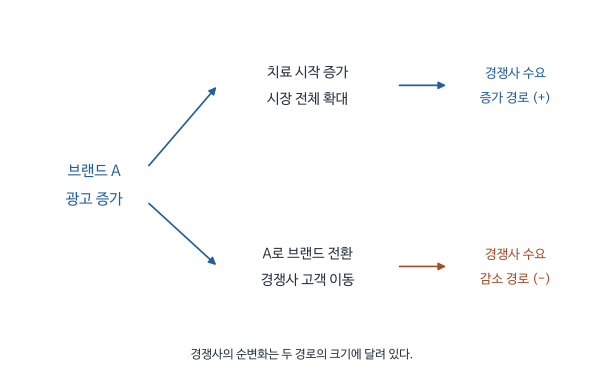

# 항우울제 광고가 경쟁사의 처방과 광고 선택에 미치는 영향: Shapiro (2018) 심층요약

항우울제 광고를 본 사람이 병원을 찾아가도 광고에 나온 약을 처방받는 것은 아니다. 의사는 다른 약을 권할 수 있고 환자가 치료 중 약을 바꾸기도 한다. 광고가 우울증 치료를 시작하게 만드는 효과가 크다면 광고비를 내지 않은 경쟁사도 처방 증가의 이익을 얻는다.

Shapiro는 이 경쟁사 파급효과(spillover effect)를 미국의 TV 광고시장 경계에서 추정한다. 이어서 광고가 치료시장 진입, 약물 하위분류 선택, 개별 브랜드 선택에 미치는 영향을 나누어 분석한다. 이렇게 추정한 수요효과를 이용하면 광고주가 얻는 이익과 산업 전체가 얻는 이익의 차이, 경쟁사 광고에 무임승차하려는 유인을 설명할 수 있다.

[원문 PDF](<Positive spillovers and free riding in advertising of prescription (2018).pdf>) | [개념 퀴즈](<Positive spillovers and free riding in advertising of prescription (2018)_QnA.md>) | [수식·모델 퀴즈](<Positive spillovers and free riding in advertising of prescription (2018)_수식모델퀴즈.md>) | [실무 Cheat Sheet](<Positive spillovers and free riding in advertising of prescription (2018)_실무CheatSheet.md>)

## 1. 광고가 환자를 치료시장으로 유입시킨 뒤 어떤 약이 선택되는가

광고가 경쟁사에도 이익을 주는지 평가하려면 광고주의 처방만으로는 부족하다. 자기 브랜드가 늘어난 처방 전부를 차지했는지, 다른 브랜드와 복제약의 처방도 함께 늘었는지를 알아야 한다. 두 경우는 같은 광고주 매출 증가가 나타나더라도 산업 전체의 효과가 다르다.

기업의 광고비 선택도 달라진다. 비용은 광고주가 지불하지만 이익 일부가 경쟁사로 돌아가면 광고주는 전체 편익을 기준으로 광고하지 않는다. 경쟁사가 이미 환자를 시장으로 유입시키고 있다면 자기 광고의 추가 이익도 줄 수 있다. 수요 분석에서 자기 제품과 경쟁 제품의 반응을 추정한 뒤 기업의 선택모형으로 이행하는 이유다.

환자가 항우울제 광고를 보고 자신의 증상을 인식했다고 하자. 광고가 병원 방문을 유도하더라도 처방 단계에서는 의사가 부작용, 기존 약물과 환자 상태를 고려하여 다른 제품을 선택할 수 있다. 광고한 기업이 치료의 필요성을 알리는 비용을 부담하지만 매출은 다른 기업에도 생기는 경로다. 처방약에서는 광고를 본 소비자가 최종 제품을 혼자 고르는 일반 소매시장과 다른 선택과정이 존재한다.

이 경로를 강화하는 제도적 특징은 두 가지다. 첫째, FDA가 광고 내용을 규제하기 때문에 광고 시간의 대부분이 질환, 약의 작용 기전, 부작용 설명에 쓰인다. 같은 질환을 치료하는 약들은 이런 특징을 공유하므로 시청자가 설명은 기억하고 제품 이름은 잊을 수 있다. 둘째, 처방을 받으려면 의사를 거쳐야 하고 의사는 어떤 약을 처방할지 스스로 판단한다. 이를 대리인 문제(agency problem)라고 부른다. 환자가 원하는 약과 의사가 선택하는 약이 다를 수 있다는 뜻이다.

연구 시점의 시장 상황도 알아 둘 필요가 있다. 미국에서 처방약 TV 광고는 1997년 FDA가 위험 정보를 요약해 전달해도 된다는 지침 초안을 낸 뒤에야 현실적으로 가능해졌고, 항우울제 광고는 1999년 GlaxoSmithKline의 Paxil이 처음 시작했다. 브랜드 처방약의 TV 광고가 합법인 나라는 미국과 뉴질랜드뿐이다. 표본 기간에 TV 광고를 한 항우울제는 세 회사의 네 브랜드, 제품 단위로는 일곱 개다. Eli Lilly는 Prozac과 Prozac Weekly, Pfizer는 Zoloft, GlaxoSmithKline은 Paxil, Paxil CR, Wellbutrin SR, Wellbutrin XL을 광고했다. Effexor XR, Celexa, Lexapro 같은 다른 브랜드는 광고하지 않았다. 산업 매출은 1996년 약 50억 달러에서 2004년 약 130억 달러로 늘었다.

기존의 광고 수요모형은 대개 이런 파급효과를 처음부터 배제했다. 대표적인 두 방식은 광고가 그 제품이 소비자의 선택 후보에 들어갈 확률만 높인다고 보거나(Goeree 2008), 광고가 그 제품의 효용에 직접 들어가는 goodwill을 쌓는다고 보는 것(Dubé, Hitsch, and Manchanda 2005)이다. 두 방식 모두 A사 광고는 A사 제품의 매력만 높이므로 경쟁사 수요에는 음(-)의 영향만 줄 수 있다. 이렇게 가정하면 모형은 단순해지지만 기업이 경쟁사 광고에 무임승차하려는 유인을 분석할 수 없다.

이 문제는 세 부류의 의사결정자에게 중요하다. FDA가 광고 내용을 더 정보 위주로, 덜 브랜드 중심으로 만들면 파급효과가 커지고 개별 기업의 광고 유인은 약해질 수 있다. 기업은 경쟁사와 광고를 공동으로 할 때 얻을 수 있는 이익이 있는지 알고 싶다. 오렌지주스, 우유, 소고기에서는 업계 공동광고가 이미 있었다. 계량 분석가에게는 파급효과를 모형에서 제외하면 추정한 수요와 공급 모수 자체가 왜곡될 수 있다는 문제가 된다.

경쟁사 매출이 늘었다는 사실만으로 이런 효과를 확인할 수는 없다. 우울증 치료 수요가 늘 것으로 예상되는 지역에서 여러 기업이 동시에 광고를 늘렸다면 광고와 경쟁사 처방이 함께 증가할 수 있다. 연구는 네 단계로 진행한다. 먼저 TV 시장 경계를 이용해 광고가 경쟁사 처방에 주는 영향의 부호를 확인한다(3-5절). 다음으로 치료시장 진입, 약물 하위분류 선택, 제품 선택의 세 단계를 가진 수요모형을 세워 그 영향이 어느 단계에서 생기는지 추정한다(6-11절). 이어 경쟁사 광고가 많을 때 기업이 실제로 광고를 줄이는지 검토한다(13절). 마지막으로 추정한 수요를 이용해 기업들이 공동으로 광고를 정한다면 광고량이 얼마나 달라지는지 시뮬레이션한다(12절, 14절).

## 2. 처방 자료를 경계 양쪽 지역의 월별 수요로 집계한다

광고효과를 비교하려면 어느 지역에서 어떤 약의 처방이 언제 변했는지 알아야 한다. 연구는 IMS Health의 Xponent 처방자료를 사용한다. 항우울제를 처방하는 의사 중 무작위로 추출한 5% 표본의 월별 처방을 추적하며, 표본은 매년 일부 교체된다. 의사의 주 진료소 주소로 카운티를 정하고 처방을 카운티 단위로 집계한다. 자료는 2004년까지 있지만 분석은 2003년에서 끝낸다. 2004년에 청소년 자살 위험에 관한 FDA 경고문(black box warning)이 도입되고 여러 주요 성분의 특허가 만료되어, 광고와 무관한 큰 시장 변화가 혼입되기 때문이다. 분석기간은 1997-2003년의 월별 자료이고 개별 환자의 시청 기록 대신 지역 광고비와 지역 처방량을 연결한다. 한 관측치가 무엇을 대표하는지 아래 첨자로 구분한다.

| 기호 | 의미 |
|---|---|
| $j,k$ | 약품 또는 브랜드 |
| $b$ | 두 TV 시장 사이의 특정 경계 |
| $m$ | 그 경계의 한쪽 DMA에 속한 경계 카운티 묶음 |
| $t,q$ | 월, 분기 |
| $Q_{jbmt}$ | 그 경계 한쪽에서 해당 월에 관측한 제품 처방량 |
| $a_{jmt}$ | 제품의 현재 광고, 시청권역 인구 100명당 지출 |
| $A_{jmt}$ | 과거 광고가 남긴 효과까지 누적한 광고 stock |
| $s_j$ | 전체 잠재시장 중 제품 선택 비중 |

DMA(designated market area)는 시장조사회사 AC Nielsen이 정한 TV 시장이다. 보통 대도시 하나를 중심으로 여러 카운티를 묶으며, 한 카운티를 어느 DMA에 배정할지는 그 카운티 주민이 가장 보고 싶어 하는 지역 방송국, 흔히 전파가 가장 잘 잡히는 방송국을 기준으로 정했다. 케이블과 위성 사업자는 원칙적으로 자기 DMA 밖의 지역 방송 신호를 송출할 수 없다. 그래서 같은 DMA의 모든 카운티는 같은 지역 광고를 보고, 경계 건너편 카운티는 다른 DMA의 지역 광고를 본다. 미국에는 210개 DMA가 있고 광고 자료는 그중 큰 101개를 포함한다. 경계 분석은 이 가운데 97개 DMA와 153개 경계 실험으로 구성된다. 각 경계는 양쪽 카운티 묶음을 서로 비교한다. 같은 카운티가 여러 경계 비교에 포함될 수 있으므로 153개가 서로 완전히 독립인 무작위실험이라는 뜻은 아니다.

광고 자료는 Kantar Media의 제품별 월별 전국 광고와 DMA별 지역 광고 지출이다. 업계 관계자와의 대화에 따르면 제약회사는 광고를 거의 전부 매년 여름의 선매(up-front) 시장에서 산다. 선매로 산 광고는 반품할 수 없고 방영 시점도 거의 조정할 수 없다. 한 해 광고 배치가 대부분 미리 정해진다는 뜻이다. 그달의 수요 충격에 맞춰 광고를 곧바로 늘리기 어렵다는 해석도 가능하지만, 저자는 이 점을 식별(identification)의 근거로 직접 내세우지는 않는다. 지출의 대부분은 전국 광고지만 지역 광고도 상당하고 DMA마다 차이가 크다. 그림 3은 Paxil의 지역 광고가 뉴욕, 보스턴, 오스틴 순으로 높다는 예를 보여 준다.

광고는 전국 지출을 전국 인구로 나눈 값과 지역 지출을 DMA 인구로 나눈 값을 합산하여 100명당 금액으로 환산한다. 가상으로 전국 광고가 100명당 2달러이고 지역 광고가 1달러이면 해당 지역 노출의 대용변수는 3달러다. 1달러는 개별 환자에게 현금 1달러를 준다는 뜻이 아니다. 광고 횟수 대신 지출액을 사용한 데에도 이유가 있다. 저녁 뉴스 시간의 광고 한 번과 새벽 1시 재방송 중의 광고 한 번은 시청자 수가 크게 다른데, 지출액은 이 차이를 가격으로 반영한다. 광고 횟수로 바꾸어도 결과는 질적으로 같았다고 한다. 인구로 나누면 전국 광고와 지역 광고의 크기도 비교할 수 있다. 1999-2003년 광고 한 편의 100명당 지출은 전국 광고가 0.0002-0.04달러이고 지역 광고의 93%도 이 범위에 들어간다.

Table 1에 따르면 광고가 허용된 1999년 9월-2003년 12월, 광고하는 일곱 제품의 DMA-월 평균 제품 광고는 100명당 0.782달러이고 중앙값은 0이다. 대부분의 달과 시장에서 한 제품은 광고를 하지 않았다는 뜻이다. 하위분류 전체 광고의 평균은 2.012달러, 항우울제 전체 광고의 평균은 4.035달러(75분위 5.534달러)다. 광고하지 않는 브랜드는 점유율이 낮거나(Effexor XR, Remeron, Serzone) 모회사가 작아 광고 조직이 없을 가능성이 있다(Celexa, Lexapro). 이 현상은 광고의 고정비 때문일 수도, 무임승차(free riding) 때문일 수도 있으며, 판단은 공급 분석으로 미룬다.

처방과 광고 외에 세 자료가 추가로 사용된다. ImpactRx의 의료인 대상 영업활동(detailing) 자료는 2001-2003년 일반의 2,134명과 2002-2003년 정신과 의사 167명의 월별 영업사원 방문 횟수를 담고 있다. 이 자료는 4절에서 영업활동이 TV 광고와 함께 움직이는지 검사하는 데 사용된다. 가격은 Medicaid 급여 자료에서 처방 단위당 평균 지급액으로 계산하고, 한계 생산비용의 상한으로는 복제약의 평균 약국 구입가(NADAC)를 사용한다. 가격과 비용은 14절의 공급 시뮬레이션에 투입된다.

자료의 처방 위치는 환자의 집 주소와 같지 않을 수 있다. 환자가 다른 지역의 의사를 방문하면 그 처방은 의사 소재지의 수요에 포함된다. 광고는 TV 시장별로 배정되므로 실제 시청자가 거주하는 지역과 처방이 기록된 지역의 차이가 노출 측정에 영향을 줄 수 있다. 한 관측치는 한 지역에서 한 달 동안 집계한 값이다. 환자 한 명의 광고 시청과 처방을 연결한 기록은 자료에 없다.

경계 양쪽의 작은 지역을 집계한 자료는 시장 전체를 비교할 때보다 가까운 수요환경을 사용하려는 목적이다. 월별로 반복 관측해도 같은 지역의 지속적인 수요 요인은 매달 되풀이되므로, 관측치 수가 많다고 해서 서로 독립적인 비교가 그만큼 많은 것은 아니다. 결과표들은 제품-DMA 단위로 군집화한 표준오차(clustered SE)를 보고한다. 군집 표준오차(clustered standard error)는 같은 제품-DMA 안의 관측치끼리 오차가 서로 상관될 수 있다고 허용한 채 계수의 불확실성을 계산하는 방법이다. 광고가 DMA 단위로 정해지므로 이 단위로 군집화하는 것이 자연스럽다.

인구 100명당 지출로 나누면 큰 시장의 총지출이 인구가 많다는 이유만으로 커 보이는 문제가 조정된다. 같은 1만 달러를 지출해도 작은 시장과 큰 시장의 주민에게 제공되는 광고 강도는 다를 수 있다. 그러나 이 값도 각 개인이 실제로 몇 번 광고를 보았는지를 직접 측정한 것은 아니다.

## 3. 기업이 광고를 많이 배정한 지역의 높은 수요를 어떻게 구분하는가

광고주가 우울증 수요 증가를 예상한 지역에 광고를 더 내보내면 광고비와 처방량은 광고효과가 없어도 함께 증가할 수 있다. 광고가 기업이 선택하는 변수라는 점, 곧 내생성(endogeneity)이 이 연구의 첫 번째 장애물이다. 광고만 움직이고 수요와는 무관한 도구변수(instrumental variable)도 마땅치 않다. 연구자는 수요 충격이 비슷하지만 광고가 다르게 배정되는 지역을 찾는다. 지역 TV 시장인 DMA의 경계 바로 양쪽은 가까운 생활환경을 공유하면서 다른 지역 광고를 받는다는 점에서 비교대상이 된다.

대표적인 예는 오하이오의 Cleveland DMA와 Columbus DMA다. Cleveland DMA의 모든 카운티는 같은 양의 Cleveland 지역 광고를 보고, Columbus DMA의 모든 카운티는 Columbus 지역 광고를 본다. 두 DMA가 맞닿은 곳에서 Cleveland 쪽 카운티 5개와 Columbus 쪽 카운티 5개가 서로 이웃한다. 이 10개 카운티가 매달 두 처리집단(Cleveland 쪽, Columbus 쪽)을 가진 하나의 실험이 된다. 각 쪽의 카운티 5개를 합친 것이 한 관측단위이고, 한 실험은 매달 두 관측치를 만든다. 처리의 크기는 그달 각 DMA의 광고량이다. 이런 경계가 153개 있다.

저자는 주 경계를 이용한 선행연구(Card and Krueger 1994의 최저임금 연구 등)와 달리 DMA 경계는 TV 전파를 기준으로 그은 것이어서 세금, 법, 주민 특성과 거의 관련이 없다는 점을 장점으로 든다. 주 경계에서는 여러 법과 시장조건이 한꺼번에 바뀌지만 DMA 경계에서 바뀌는 것은 주로 지역 TV 광고다.

비교에 필요한 가정은 광고 차이가 없었을 때 경계 양쪽의 처방 변화가 평행하다는 것이다. 한쪽 주민이 원래 처방을 더 많이 받는 고정적인 차이는 허용한다. 이 차이와 경계 양쪽의 공통 시간 변화를 각각 회귀에서 제거한다. 이 방식을 수정된 이중차분(difference-in-differences) 추정이라고 부른다.

기본 회귀를 명확한 첨자로 다시 쓰면

$$
\log Q_{jbmt}=\lambda\log Q_{jbm,t-1}
+g(a^{own}_{jmt},a^{rival}_{jmt})
+\alpha_{jbq}+\mu_{jbm}+\epsilon_{jbmt}.
$$

$\alpha_{jbq}$는 제품별 경계별 분기 공통 변화를 제거한다. $\mu_{jbm}$은 그 경계의 한쪽이 원래 더 많이 처방하는 고정 수준을 제거한다. 원문은 이 효과를 $\alpha_{jbm}$으로, 결과표 앞의 식 (2)에서는 $\alpha_{jbd}$($d$는 경계의 어느 쪽인지)로 적는다. 여기서는 두 고정효과(fixed effects)를 구분하기 쉽도록 $\mu$를 사용했다. 남는 것은 같은 경계의 양쪽에서 시간에 따라 다르게 움직인 광고와 처방의 관계다. 논문의 표현을 빌리면 제품 $j$의 광고 중 그쪽 카운티 묶음의 기간 평균을 넘고, 같은 분기 경계 양쪽 평균도 넘는 부분만 광고계수를 식별한다. 분기 고정효과를 사용하므로 분기 안의 월별 공통 충격까지 모두 별도 더미로 제거되는 것은 아니다.

가상으로 양쪽 처방이 광고 전 100과 80, 광고 차이 확대 후 120과 88이라면 단순 수준 DID는 $20-8=12$다. 실제 추정은 로그 결과, 연속 광고량, 지연 결과와 여러 고정효과를 사용하므로 12를 그 추정량(estimator)과 동일시하지 않는다. 이 작은 예제는 공통 변화 제거의 직관이다.

이 설계에는 약점도 하나 있다. Columbus가 항상 높은 광고를, Cleveland가 항상 낮은 광고를 일정하게 유지했다면 그 차이는 $\mu_{jbm}$에 모두 흡수되어 광고효과를 추정할 수 없다. 실제로 효과가 있었더라도 그렇다. 광고계수는 경계 양쪽의 광고 차이가 시간에 따라 변할 때만 식별된다. 저자는 고정효과를 제거한 뒤 남는 로그 광고의 표준편차가 0.25라는 점(그림 7)을 들어 추정에 사용할 변동이 충분하다고 설명한다.

TV 광고는 넓은 DMA 시장을 대상으로 구매된다. 한 시장의 중심 도시 수요가 높아 광고가 많이 배정되더라도 그 광고는 시장 가장자리의 작은 지역에도 전달된다. 경계 건너편의 가까운 주민들은 생활환경이 비슷할 수 있지만 다른 DMA의 광고량을 받는다. 연구는 기업이 시장 전체를 보고 결정한 광고가 경계의 지역에는 다르게 전달되는 상황을 이용한다.

가까운 두 지역을 한 번 비교하는 것만으로 충분하지는 않다. 경계 양쪽은 원래 소득이나 의료 접근성이 다를 수 있어 지역의 지속적인 차이를 고려한다. 같은 제품과 경계에서 공유하는 수요 변화도 시간효과로 조정한다. 그 뒤 남는 광고량 차이와 처방 변화의 관계를 추정하는 구조다. 따라서 $\mu_{jbm}$은 어느 쪽 카운티 묶음의 변하지 않는 차이를, $\alpha_{jbq}$는 한 경계 양쪽이 같은 분기에 함께 겪는 변화를 제거한다는 점을 첨자로 확인해 두면 다음 절의 논의를 따라가기 쉽다.

### 3.1 경계 비교가 제거하는 내생성의 세 원천

광고가 기업의 선택이라는 사실에서 생길 수 있는 편향(bias)을 원천별로 나누고, 경계 비교가 각각을 어떻게 다루는지 살펴본다.

첫째는 시장 사이의 지속적인 차이다. 예를 들어 플로리다의 겨울이 위스콘신보다 온화해 우울증 수요 수준이 다르고, 기업도 이를 알고 광고를 다르게 배정할 수 있다. 이런 차이는 시간에 따라 변하지 않으므로 시장 고정효과 $\mu_{jbm}$이 흡수한다. 남는 걱정은 한 시장 안에서 특정 시기에만 생기는 수요 충격이 그 시기의 광고 결정에 영향을 주는 경우다.

둘째는 DMA 전체에 걸친 일시적 수요 충격이다. 대표적인 예는 세 가지다. 유난히 추운 달이 우울감을 높이고 광고도 늘리는 경우, 대도시의 대형 고용주가 대량 해고를 해 우울증과 광고가 함께 늘어나는 경우, DMA 중심 도시에서 이 약들을 다루는 의학 세미나가 열리는 경우다. 기업은 광고를 DMA 단위로 정하므로 광고에 영향을 주는 것은 DMA 평균 충격이다. 그런데 날씨는 공간적으로 연속이어서 경계 바로 양쪽의 기온은 비슷하다. 고용과 세미나는 DMA 중심의 도시에 집중되어 있고, 경계 지역 주민은 통근이나 이동 비용 때문에 영향을 적게 받는다. 게다가 경계 양쪽에서 중심 도시까지의 거리는 경계를 넘는 순간 갑자기 달라지지 않는다. 충격이 중심에서 멀어질수록 연속적으로 약해지고 경계에서 불연속적으로 급변하지 않는다면, 경계 양쪽은 같은 크기의 충격을 받고 그 부분은 $\alpha_{jbq}$가 제거한다.

아래는 이 논리를 보여 주는 가상의 수치다(교육용 보충이며 원문 수치가 아니다). 광고 100명당 1달러의 참효과가 로그 처방 0.02라고 하자. Cleveland DMA에 대량 해고가 생겨 중심 도시의 로그 처방이 0.05 늘고, 기업은 이를 보고 Cleveland 광고만 1달러 늘린다. Columbus에는 충격도 광고 변화도 없다. DMA 전체를 비교하면 Cleveland의 증가는 $0.02+0.05=0.07$이므로 광고효과를 참값의 3.5배로 추정한다. 경계에서는 해고의 영향이 약해져 양쪽 모두 0.01만 늘었다고 하면, Cleveland 쪽 $0.02+0.01$에서 Columbus 쪽 $0.01$을 빼 정확히 0.02를 얻는다. 경계 양쪽 충격이 0.012와 0.008로 조금 다르면 추정치는 0.024가 되어 차이 0.004만큼만 편향이 남는다. 경계 설계가 제거하는 것은 충격 중 양쪽이 공유하는 부분이고, 경계에서 불연속적으로 달라지는 부분은 남는다.

셋째는 경험칙(rule of thumb)에 따른 역인과다. 기업이 지난달 DMA 전체 수요를 보고 이번 달 광고를 결정하고 수요가 달마다 이어진다면, 광고가 수요를 늘린 것처럼 보이지만 실제로는 수요가 광고를 부른 것일 수 있다. 경계 표본이 이 문제를 줄이는 이유는 두 가지다. 경계 카운티는 DMA 인구와 처방의 작은 일부여서, 광고를 결정한 DMA 전체의 지난달 수요와 경계 지역의 이번 달 수요 사이의 공분산(covariance)은 DMA 전체끼리의 공분산보다 훨씬 작다. 또 경계 바로 양쪽의 수요는 비슷하므로, 지난달 수요라는 누락변수의 공통 부분은 제품-경계-시간 고정효과에 흡수된다.

DMA 전체 자료를 사용하고 지난달 DMA 수요를 통제변수(control variable)로 포함하면 되지 않느냐는 반론도 가능하다. 여기서는 이 방법을 쓰기 어렵다. 모형에 이미 지난달 처방($\log Q_{jbm,t-1}$)이 들어가 있고 그 계수 $\lambda$는 수요의 지속성으로 해석된다. 이 변수가 기업의 광고 배정 규칙까지 대신 통제하면 $\lambda$가 과대추정되고 지속성이라는 해석이 왜곡된다. 11절의 Table 7은 이 우려가 실제로 나타나는지 보여 준다.

이산선택 수요 추정에서 흔히 사용하는 BLP(Berry, Levinsohn, and Pakes 1995)식 도구변수를 쓰지 않은 데에도 이유가 있다. 이 방법은 경쟁 제품의 특성 변화를 외생적 공급 충격으로 이용한다. 그러나 처방약은 모든 시장에 동시에 출시되므로 이 도구변수에는 지역 간 변동이 없다. 경쟁 제품이 부작용이 적은 쪽으로 개발되는 것 자체가 수요에 반응한 결과일 수도 있어 외생성(exogeneity)을 가정하기 어렵다.

## 4. 경계 비교에서 여전히 필요한 수요 변화의 가정

3.1절의 논리는 충격이 경계에서 불연속적으로 달라지지 않는다는 조건에 의존한다. 경계 한쪽에만 병원이 새로 생기거나 의료정책이 달라지면 가까운 지역이라도 처방 변화가 달라질 수 있다. 그 변화가 광고 배정과 함께 움직이면 광고계수에 다른 원인이 포함된다. 필요한 가정은 경계가 TV 전파 기준으로 정해졌다는 사실만으로 충족되지 않는다. 통제한 공통 요인과 고정 요인을 제거한 뒤에도 경계 양쪽의 설명되지 않은 수요 변화가 광고 차이와 관련되지 않아야 한다. 예를 들어 한쪽에만 새 정신건강 진료소가 생기고 그쪽 DMA 광고도 동시에 늘었다면 처방 증가를 광고에 전부 귀속시키기 어렵다.

이런 대안 설명을 하나씩 점검한다. 각 검사가 어떤 반론을 겨냥하는지 정리하면 다음과 같다.

| 우려 | 원문의 점검 | 결과 |
|---|---|---|
| 의료인 대상 영업활동(detailing)이 TV 광고가 많은 곳과 때에 함께 늘었다 | ImpactRx 의사 패널의 방문 횟수를 DMA 및 경계 단위로 합쳐 자기, 경쟁사 광고에 회귀. 2001-2003년 자료로 영업활동을 모형에 직접 추가. 1999년 광고 허용 시점의 전국 영업활동 추세 단절 확인 | 계수가 작고 유의하지 않음. 영업활동을 넣어도 광고계수가 변하지 않음. 추세 단절 없음 |
| 주 경계와 겹치는 DMA 경계에서 주 세금이나 정책이 다르다 | 주 경계와 겹치는 DMA 경계를 빼고 전체 모형 재추정 | 모수가 통계적으로 다르지 않음 |
| 광고에 잘 반응하는 의사가 한쪽에 몰려 있다 | 광고가 많은 쪽과 적은 쪽의 의사 수, 평균소득, 인구 t검정 | 차이를 기각하지 못함 |
| 평행추세 가정 자체가 틀렸다 | 일반의약품 수면보조제의 DMA별 TV 광고를 가짜 처치(placebo)로 넣어 추정 | 경제적으로 의미 있는 효과 없음 |
| 전국 잡지, 신문 광고의 지역별 보급률이 다르다 | 자료가 없어 검사 불가 | 경계에서 평행하게 움직인다고 가정 |

영업활동과 TV 광고가 함께 움직이지 않는다는 결과에는 조직상의 이유도 있다. TV 광고는 회사의 소비자 부서가, 영업활동은 영업 부서가 결정한다. 영업사원은 대개 독립 계약자이고, 외부 분석회사가 처방량 10분위(decile)별로 정한 방문 횟수 권고를 따른다. 이 권고는 1년보다 짧은 주기로는 거의 바뀌지 않으므로 광고가 많은 달에 맞춰 방문을 늘리기 어렵다. 가격도 누락되어 있지만 약은 운송비가 낮고 우편으로도 구할 수 있어 지역 간 차이가 작으므로 제품-경계-시간 고정효과에 흡수된다고 본다.

다음은 측정오차(measurement error)다. 오차가 생기는 경우는 세 가지다. 한 DMA에서 광고를 보고 경계 건너편 의사를 찾아가는 경우, DMA 중심 쪽의 표본 밖 카운티 의사를 찾아가는 경우, 안테나로 건너편 DMA 방송을 보는 경우다. 저자는 세 경우 모두 광고효과를 작게 추정하게 만든다고 보고 추정치를 하한으로 해석한다. 이를 뒷받침하는 사실로 Dartmouth Institute의 1차 진료 통근권역 가운데 DMA 경계를 넘는 것이 약 1%뿐이라는 점, 지상파 안테나에 의존하는 가구가 7% 미만이라는 점을 든다. 다만 이 하한 해석은 위 세 경우에 대한 판단이다. 이동이나 오차가 광고 배정과 상관된다면 방향이 달라질 수 있으므로, 모든 형태의 측정오차가 언제나 0 방향으로 편향시킨다는 일반정리로 받아들이지 않는다.

지연 종속변수(lagged dependent variable)와 고정효과를 함께 사용하는 데서 오는 기계적 편향도 점검한다. 고정효과를 제거하려고 시장별 평균을 차감하면 지난달 처방과 오차가 기계적으로 상관되어 $\lambda$ 추정치가 하향 편향된다. 이를 Nickell 편향이라 부른다. 그 크기는 기간 수 $T$가 커질수록 줄어든다. 각주 7은 근사식 $-(1+\lambda)/(T-1)$을 제시하고 $T=84$(1997-2003년 월별)에서 $0<\lambda<1$이면 이 값의 절댓값이 $2/83\approx0.024$를 넘지 않는다고 설명한다. 참값 $\lambda=0.7$을 대입한 정확한 식의 값은 각주에 $-0.025$로 적혀 있다. 각주에 인쇄된 식에 그대로 대입해 다시 계산하면 약 $-0.021$이 산출되어 원문 값과 조금 다르지만, 어느 쪽이든 추정된 지속성 계수에 비해 작다.

마지막으로 외적 타당성이다. 추정효과는 경계 주민에게서 얻는다. 회귀불연속(regression discontinuity) 설계와 마찬가지로 DMA 중심부에서는 효과가 다를 수 있고, 14절의 공급 시뮬레이션은 경계에서 얻은 효과가 DMA 전체에 적용된다고 가정한다. 도시 중심에 가까운 경계와 먼 경계를 나누어 추정해도 효과가 비슷했고(온라인 부록), 경계 카운티와 내부 카운티의 인구, 소득, 의사 수가 통계적으로 다르지 않았다는 점이 부분적 근거다. 이 검사들은 특정 대안 설명을 하나씩 줄여 가는 증거이며, 남은 모든 경계에서 충격이 같다는 것을 직접 관측한 결과는 아니다. 위 표의 부록 결과는 보관 PDF에 들어 있지 않아 본문 서술로만 확인했다.

## 5. 경쟁사 광고의 효과가 자기 광고량에 따라 달라지는지 추정한다

경쟁사 광고가 환자를 많이 유입시킨 상태라면 자기 광고 한 건이 추가로 유입시킬 환자는 줄어들 수 있다. 이 반응을 분석하려면 자기 광고와 경쟁사 광고의 선형항만으로는 부족하다. 제곱항은 광고량 증가에 따른 한계효과(marginal effect) 변화를, 곱항은 경쟁사 광고에 따라 자기 광고의 한계효과가 어떻게 달라지는지를 표현한다.

$$
g=\gamma_1a_o+\gamma_2a_r+\gamma_3a_o^2
+\gamma_4a_r^2+\gamma_5a_oa_r
$$

이다. $a_o$는 자기 광고, $a_r$은 경쟁사 광고다. 원문 식 (1)과 (2)는 경쟁사 광고를 $a^{cross}$로, 결과표는 DTC$_{rival}$로 적는다. 제곱항과 곱항을 포함하는 이유는 추가 광고의 효과가 현재 광고량과 경쟁사 광고량에 따라 달라질 수 있기 때문이다. 식 (1)과 (2)는 결과변수의 첨자를 $Q_{jmt}$로 축약해 표기하지만 추정 단위는 앞의 식과 같은 제품-경계-DMA-월이다.

자기 광고를 아주 조금 늘렸을 때 로그 처방의 변화는

$$
\frac{\partial\log Q}{\partial a_o}
=\gamma_1+2\gamma_3a_o+\gamma_5a_r.
$$

제곱항의 미분은 $2a_o$이고, $a_oa_r$를 $a_o$로 미분할 때 $a_r$은 고정하므로 $a_r$이 남는다. 경쟁사 광고의 효과는

$$
\frac{\partial\log Q}{\partial a_r}
=\gamma_2+2\gamma_4a_r+\gamma_5a_o.
$$

따라서 $\gamma_2>0$만으로 모든 광고량에서 경쟁사 효과가 양수라고 말할 수 없다. 실제 평가점이 필요하다.

두 미분식을 계산하려면 계수 다섯 개가 필요하다. Table 2는 이 계수들을 한 번의 회귀로 보고하는 축약형(reduced form) 결과표다. 구조모형을 세우기 전에 경쟁사 광고와 내 처방이 경계 비교에서 같은 방향으로 움직이는지를 먼저 확인하는 역할을 한다. 아래는 Table 2 전체를 옮긴 것이다(PDF 26쪽, 학술지 406쪽). 원문은 계수 아래 괄호에 표준오차를 적었으나 여기서는 열을 나누었고, 변수명 옆에 이 요약의 계수 기호를 덧붙였다.

**원문 Table 2 (PDF 26쪽): 자기 광고와 경쟁사 광고가 처방량에 미치는 효과**

| 변수 (요약의 기호) | 계수 | 표준오차 | 유의 표시 |
|---|---|---|---|
| 지연 처방 $\log Q_{t-1}$ ($\lambda$) | .334 | (.00746) | \*\*\* |
| 자기 광고 DTC ($\gamma_1$) | .0240 | (.00621) | \*\*\* |
| 자기 광고 제곱 DTC$^2$ ($\gamma_3$) | -.00216 | (.00113) | \* |
| 경쟁사 광고 DTC$_{rival}$ ($\gamma_2$) | .0164 | (.00266) | \*\*\* |
| 경쟁사 광고 제곱 DTC$^2_{rival}$ ($\gamma_4$) | -.000938 | (.000252) | \*\*\* |
| 곱항 DTC $\times$ DTC$_{rival}$ ($\gamma_5$) | -.00134 | (.000631) | \*\* |
| 제품-경계-시간 고정효과 | 포함 | | |
| 제품-경계-DMA 고정효과 | 포함 | | |
| 관측치 | 316,428 | | |
| $R^2$ | .955 | | |

*주: 종속변수는 $\log Q$. 괄호는 제품-DMA 단위 군집 표준오차. \* p<.1, \*\* p<.05, \*\*\* p<.01.*

표는 하나의 회귀를 세로로 펼친 것이다. 종속변수는 경계 한쪽 카운티 묶음에서 한 달 동안 관측한 제품 처방량의 로그다. 광고 변수는 식 (1)과 (2)에서 로그를 취하지 않은 수준값, 곧 인구 100명당 달러 지출로 들어간다. 그래서 DTC 계수 .0240은 자기 광고와 경쟁사 광고가 모두 0인 지점의 한계효과다. 그 지점에서 자기 광고를 100명당 $\Delta a$달러만큼 조금 늘리면 그달 로그 처방은 약 $.0240\Delta a$ 증가한다. 같은 평가점의 경쟁사 광고 한계효과는 .0164로 자기 효과의 약 68%($.0164/.0240$)다. 실제로 광고를 0달러에서 1달러까지 늘리는 변화에는 제곱항도 들어간다. 경쟁사 광고가 0일 때 자기 광고 1달러의 로그 처방 변화는 $.0240-.00216=.02184$로 약 2.21% 증가이고, 자기 광고가 0일 때 경쟁사 광고 1달러는 $.0164-.000938=.015462$로 약 1.56% 증가다. 이 계산은 두 광고가 모두 0인 출발점의 예시이며, 광고가 이미 집행 중인 시장에는 그 시장의 광고량을 미분식에 대입해야 한다.

괄호 안 수치는 표준오차이고, 계수를 표준오차로 나누면 대략적인 t값이 된다. 경쟁사 광고의 일차항은 $.0164/.00266\approx6.2$로 가장 확실한 결과에 속한다. 자기 광고 제곱항은 $.00216/.00113\approx1.9$로 10% 수준에서만 유의하고, 곱항은 $.00134/.000631\approx2.1$로 5% 수준에서 유의하다. 별표 기준은 표마다 다르다. Table 2와 Table 8은 별 하나를 p<.1에 붙이지만 뒤의 Table 5와 Table 7은 p<.05에 붙이므로, 같은 별 하나를 같은 유의수준(significance level)으로 해석하면 오류가 생긴다.

제곱항 두 개를 비교하면 자기 광고 쪽(-.00216)이 경쟁사 쪽(-.000938)보다 두 배 넘게 음수다. 저자는 이를 경쟁사 광고의 수확체감이 자기 광고보다 느리게 나타난다고 해석한다. 지연 처방 계수 .334는 지난달 로그 처방이 1 높으면 이번 달 로그 처방이 .334 높다는 뜻이며, 이 지속성은 특별히 크지 않다는 평가다. 관측치 316,428개는 제품-경계-DMA-월 단위다. $R^2$ .955는 고정효과와 지연항까지 포함한 모형 전체의 설명력이다. 이 값만으로 광고가 설명한 몫을 분리할 수 없고, 광고효과의 크기나 인과성의 근거로 사용할 수도 없다.

이 표에서 말할 수 있는 것은 경계 비교 아래에서 경쟁사 광고가 내 처방과 양(+)의 관계를 보이고, 곱항이 음수여서 경쟁사 광고가 많을수록 내 광고의 한계효과가 줄어든다는 점이다. 양의 경쟁사 효과가 치료시장 확대에서 오는지 같은 분류 안의 고객 이동에서 오는지는 이 표로 알 수 없으며, 그 분해는 10절의 Table 5가 맡는다. 이차식이라는 점도 해석을 제한한다. 자기 광고가 0일 때 경쟁사 광고의 한계효과 $.0164-2(.000938)a_r$는 $a_r\approx8.7$달러에서 0이 되고, 경쟁사 광고가 0일 때 자기 광고의 한계효과는 $a_o=.0240/.00432\approx5.6$달러에서 0이 된다. Table 1에서 항우울제 전체 광고의 75분위는 100명당 5.534달러이고, 그림 9 설명은 보스턴에서 Zoloft가 마주한 경쟁사 광고의 최대치를 약 10달러로 적는다. 두 전환점은 관측 분포의 상단에 놓이므로 이 구간의 부호는 이차식 함수형태에 크게 의존한다. 계수는 로그 처방의 준탄력성이어서 탄력성(elasticity)으로 곧바로 해석할 수 없고, 지연항이 있으므로 .0240은 광고를 영구히 1달러 올렸을 때의 장기효과와도 다르다.

Table 2는 $\gamma_1=.0240$, $\gamma_2=.0164$, $\gamma_3=-.00216$, $\gamma_4=-.000938$, $\gamma_5=-.00134$를 보고한다. 이 계수에 가상 평가점 $a_o=1,a_r=2$를 대입하면

$$
\partial\log Q/\partial a_o=.0240-.00432-.00268=.01700,
$$

$$
\partial\log Q/\partial a_r=.0164-.003752-.00134=.011308.
$$

이는 한계 반응이며 광고비를 1% 늘릴 때의 탄력성이 아니다. 탄력성을 구하려면 해당 광고량을 곱해야 한다. 교차미분 $\partial^2\log Q/\partial a_o\partial a_r$은 $\gamma_5=-.00134$이므로 경쟁사 광고가 늘수록 자기 광고의 로그 처방 한계효과가 감소한다. 저자는 이를 무임승차 유인의 원천으로 본다. 경쟁사 광고가 내 광고의 한계수입을 낮추면 나는 광고를 줄일 이유가 생기기 때문이다. 같은 한계효과를 자기 광고로 한 번 더 미분하면 $2\gamma_3=-.00432$로, 곱항 $-.00134$보다 절댓값이 세 배 이상 크다. 경쟁사 광고도 내 광고의 한계수입을 낮추지만 내 광고가 추가될 때만큼은 아니라는 뜻이다. 곱항이 왜 음수인지는 8.1절과 9.1절에서 수요모형으로 설명한다. 시장 진입 단계의 광고 변수가 모든 제품 광고의 합에 대한 오목함수라는 점이 그 설명의 출발점이다.

회귀에 자기 광고와 경쟁사 광고를 함께 포함하는 이유는 두 광고가 같은 시기에 움직일 수 있기 때문이다. 경쟁사가 광고를 늘릴 때 자기 광고도 늘었다면 경쟁사 변수 하나만으로는 그 영향을 구분하기 어렵다. 결과가 로그 처방이고 광고가 수준 변수이므로 계수의 단위는 광고 100명당 1달러에 대한 로그 처방 변화, 곧 비율 변화에 가깝다. 광고 1% 증가에 대한 탄력성과는 단위가 다르다.

지난달 처방을 통제하는 이유는 수요의 지속성 때문이다. 지난달에 치료받던 환자가 이번 달에도 처방을 받을 가능성이 높다면 현재 처방은 과거 수준과 관련된다. 이 변수를 포함한 모형의 광고계수는 같은 과거 수요 아래에서 당월 광고가 추가로 설명하는 부분이다. 여러 달에 걸쳐 누적된 광고효과는 당월 계수보다 크다. Table 2의 $\lambda=.334$는 로그 처방 자체의 지속성을 나타내는 축약형 계수다. 8절의 구조모형에서 단계별로 추정하는 광고 stock의 잔존계수 $\lambda_s$와 같은 기호를 사용하고 제품 단계 값(.324)도 비슷하지만, 추정하는 대상이 다르다.

## 6. 시장 진입과 브랜드 선택을 나누어 경쟁사 효과를 설명한다

경쟁사 광고가 내 처방을 늘린다는 추정결과만으로 어느 행동이 달라졌는지는 알기 어렵다. 그래서 먼저 항우울제를 사용할지, 다음으로 어떤 약물 하위분류를 사용할지, 마지막으로 그 안의 어떤 제품을 사용할지를 나누어 모형화한다. 각 단계 확률의 곱이 전체 인구 중 특정 제품을 선택할 확률이 된다.

항우울제 시장을 $l$, 약물 하위분류를 $n$, 제품을 $j$로 표시한다. 제품 $j$가 하위분류 $n$에 속할 때 선택확률의 곱셈법칙을 적용하면 다음 식이 된다.

$$
s_j=s_l\,s_{n\mid l}\,s_{j\mid n}
$$

이다. $s_l$은 항우울제 시장에 들어오는 비중, $s_{n\mid l}$은 들어온 사람 중 하위분류 $n$을 선택하는 비중, $s_{j\mid n}$은 그 분류 안에서 제품 $j$를 선택하는 비중이다.

가상으로 $s_l=.10$, $s_{n\mid l}=.60$, $s_{j\mid n}=.25$이면 전체 인구 중 제품 비중은 $.10\times.60\times.25=.015$, 즉 1.5%다. 마지막 25%를 전체 인구의 25%로 해석하면 분모를 혼동한 것이다.

광고는 세 단계에 모두 들어갈 수 있다. 질환에 대한 관심이 시장 진입을 늘리고, 약물 작용 방식 정보가 하위분류 선택에 영향을 주며, 브랜드 기억이 같은 분류 안의 점유율을 바꿀 수 있다. 각 단계의 광고효과와 지속성은 따로 추정한다.

이는 한 개의 일관된 소비자 효용을 극대화하여 모든 층을 연결한 표준 nested logit과 완전히 같은 모형이라고 보아서는 안 된다. 표준 nested logit이라면 아래 단계 선택지들의 매력도가 모인 값(포괄가치)이 위 단계 효용에 들어가도록 층 사이의 모수가 서로 묶인다. 이 모형은 이런 합산 제약을 두지 않는다. 광고효과가 단계마다 얼마나 다른지를 찾는 것이 연구의 주된 질문이어서, 세 단계의 광고계수와 잔존계수를 각각 자유롭게 추정한다. 각 단계의 선택지수도 "효용"이라고 부르지만 문자 그대로의 효용으로 해석할 필요는 없다는 단서가 붙는다. 그 안에는 환자와 의사의 효용, 정보, 설득이 섞여 있을 것이고, 모형의 목적은 기업의 광고 결정을 분석하는 데 있으므로 소비자 후생은 계산하지 않는다.

각 단계의 오차가 서로 독립이라는 가정에 대해 각주 11은 이렇게 설명한다. 제품 단계의 오차는 이미 항우울제를 사용하기로 결정하고 SSRI가 적합하다고 판단한 사람이 Prozac과 Zoloft 가운데 무엇을 더 좋아하는지에 관한 개인 취향이다. 이 상대적 취향이 애초에 항우울제를 사용할지 여부에 대한 취향과 관련될 이유를 떠올리기 어렵다는 것이다. 관측되지 않는 이질성은 시장별, 시간별 고정효과로, 관측되는 이질성은 인구특성과 광고의 상호작용으로 반영한다.

세 단계는 Zoloft 한 제품이 한 시장에서 광고를 늘리는 경우로 설명할 수 있다. 그 광고는 항우울제 전체 광고를 늘려 누군가 항우울제를 쓸 확률을 높이고, SSRI 광고를 늘려 작용 기전과 부작용 정보로 SSRI 쪽 선택을 늘리며, Zoloft 광고를 늘려 같은 SSRI 안에서 다른 제품의 점유율을 잠식할 수 있다. 이 마지막 효과가 고객 탈취(business stealing)다. 소비자의 학습 같은 미래지향적 행동은 명시적으로 모형화하지 않지만, 시장 단계와 제품 단계의 잔존계수를 별도로 설정하면 환자가 한 브랜드를 사용해 보고 맞지 않아 다른 브랜드로 옮기면서도 치료는 계속하는 상황을 표현할 수 있다. 제품-시간 고정효과는 시장 조건의 변화도 흡수한다. 예를 들어 Prozac 특허 만료 1년 전, 오래 복용할 환자는 곧 저렴한 복제약으로 전환할 수 있는 Prozac을 선호할 수 있는데, 이런 효과는 제품-시간 고정효과에 들어간다.

제품 판매를 이해하려면 누가 항우울제 치료를 받는지, 그중 어떤 종류의 약을 사용하는지, 마지막으로 어느 제품을 처방받는지를 구분해야 한다. 광고는 치료를 전혀 고려하지 않던 환자를 시장으로 유입시키고, 동시에 자기 제품을 선호하게 할 수도 있다. 전체 시장이 커지는 효과와 기존 환자가 제품을 바꾸는 효과가 함께 나타난다.

단계별 점유율을 곱하면 특정 제품의 전체 인구 대비 점유율이 된다. 예를 들어 치료받는 인구가 늘어도 해당 제품의 치료자 내 비중이 조금 줄면 제품 판매의 방향은 두 변화의 상대적 크기에 달려 있다. 자기 제품 계수와 경쟁사 계수만 검토하는 데 그치지 않고 선택단계를 구분하는 이유다. 이 단계 구조는 처방 수요를 설명하는 모형이며 모든 개인의 건강효용을 복원한 모형으로 해석하지는 않는다.

### 6.1 점유율을 빼앗겼는데 처방은 늘어나는 경우를 인원수로 추적하기

분모가 달라지는 문제를 실제 인원수로 환산해 검토한다. 아래는 추정 결과가 아닌 교육용 시장이다. 잠재 환자가 10,000명이고 치료시장 진입률이 10%, 특정 약물 분류의 조건부 비중이 60%, 그 안에서 내 제품 비중이 25%라면 내 제품 선택자는 150명이다.

경쟁사 광고 뒤 치료시장 진입률이 12%로 늘고 분류 비중은 60%에 머물지만, 내 제품의 분류 내 비중은 23%로 낮아졌다고 하자.

$$
Q_{old}=10{,}000(0.10)(0.60)(0.25)=150,
$$

$$
Q_{new}=10{,}000(0.12)(0.60)(0.23)=165.6.
$$

165.6은 집계 기대수량으로 해석한다. 경쟁사에게 비중 2%포인트를 빼앗겼는데도 내 수요는 10.4% 증가한다. 비율로 분해하면 어느 변화가 더 컸는지 분명해진다.

$$
\frac{Q_{new}}{Q_{old}}
=\frac{0.12}{0.10}\frac{0.60}{0.60}\frac{0.23}{0.25}
=1.20\times1\times0.92=1.104.
$$

시장 진입은 20% 증가했고 내 조건부 비중은 8% 감소했다. 두 수를 바로 빼면 12%이지만 정확한 변화는 10.4%다. 유한한 비율 변화는 곱해지기 때문이다. 로그로 바꾸면 $\log(1.20)+\log(0.92)=\log(1.104)$처럼 정확히 더할 수 있다. 뒤의 로그 미분식은 이 곱셈을 아주 작은 변화에 적용한 것이다. 이 계산은 잠재 인구를 고정했고, 실제 자료의 처방 건수와 고유 환자 수가 같다는 가정은 하지 않는다.

## 7. 점유율 자료에서 광고에 대한 선택 반응을 추정한다

각 단계에서 개별 소비자의 모든 선호를 관측할 수는 없지만 제품별 점유율은 계산할 수 있다. logit 모형의 확률식을 사용하면 제품 점유율과 기준 선택지 점유율의 비율을 평균 선택지수로 변환할 수 있다. 이 변환 덕분에 광고와 고정효과가 들어간 식을 선형회귀 형태로 추정한다.

한 선택단계에서 제품 $j$의 평균지수를 $\delta_j$라 하고 기준 선택지의 지수는 0으로 정규화한다. 개인별 오차가 독립인 제1형 극단값 분포를 따른다고 가정하면 logit의 선택확률식을 얻는다. 기준지수 0의 지수함수 값이 1이므로 분모에 1이 들어간다.

$$
s_j=\frac{e^{\delta_j}}{1+\sum_k e^{\delta_k}},\qquad
s_0=\frac{1}{1+\sum_k e^{\delta_k}}.
$$

비율을 구하면 공통 분모가 없어진다.

$$
\frac{s_j}{s_0}=e^{\delta_j}.
$$

양변에 로그를 취하면

$$
\log s_j-\log s_0=\delta_j.
$$

광고 stock이 $\delta_j=\gamma A_j+$ 고정효과 $+$ 수요충격으로 들어가면 좌변을 관측 점유율로 계산하여 선형식으로 추정할 수 있다. 이 변환은 Berry (1994)의 방법이며, 덕분에 각 단계를 보통최소제곱(OLS)으로 추정한다. 그러나 선형으로 바뀌었다는 사실이 광고의 내생성을 없애지는 않는다. 그래서 경계 비교가 여전히 필요하다. 세 단계 모두 3절과 같은 경계-분기 고정효과와 경계-DMA 고정효과를 포함한다. 예를 들어 제품 단계에서 광고계수를 식별하는 것은 제품 $j$의 광고 중 그 시장의 전체 기간 평균을 넘고, 같은 분기 경계 양쪽 평균도 넘는 부분이다. 제품 사이의 광고 차이, 곧 Zoloft가 Prozac보다 광고를 많이 한다는 사실은 광고계수 식별에 사용하지 않는다. 이렇게 하면 제품 사이의 품질이나 인지도 차이가 광고량 차이와 섞이지 않는다.

기준 선택지는 단계마다 다르다. 시장 진입에서는 그 달 항우울제 처방을 받지 않는 인구, 하위분류에서는 오래된 TCA 약물, 제품 단계에서는 TV 광고를 하지 않는 약품 묶음이다. 제품 단계의 기준점은 “아무 약도 안 먹음”이 아니다.

점유율 비율의 로그를 취하면 로짓 선택확률의 공통 분모가 사라져 대안 간 매력도의 차이를 비교할 수 있다. 여기서 기준 대안은 해석의 일부다. 치료 선택 단계에서는 치료하지 않는 상태가, 하위 범주에서는 기준 약물 범주가, 제품 단계에서는 기준 제품 집합이 비교 대상이다. 모든 식의 로그비율이 같은 행동을 나타내는 것은 아니다.

기준 대안 대비 점유율이 증가했다는 것은 그 비교에서 상대적으로 더 선택되었다는 뜻이다. 해당 제품의 전체 시장점유율 변화로 옮기려면 앞 단계의 참여율과 범주 선택도 반영해야 한다. 연구자가 보고한 단계별 광고계수를 제품의 최종 판매 탄력성과 구분하는 이유가 여기에 있다. 회귀식의 간결함 뒤에 어떤 분모가 생략되었는지 확인하면 해석이 쉬워진다.

## 8. 한 번 본 광고가 이후 처방에도 영향을 주는 과정을 포함한다

7절의 점유율 식은 한 달의 광고와 그달의 선택만 연결했다. 광고가 나온 달에만 효과가 사라진다고 가정하면 환자의 기억과 치료 지속을 설명하기 어렵다. 이번 달 광고를 보고 증상을 인식한 환자가 다음 달에 진료를 예약할 수 있고, 시작한 치료가 여러 달 이어질 수도 있다. 광고 stock은 과거 광고의 잔존효과를 현재 광고와 합한 변수다. 마케팅 문헌에서는 광고가 쌓아 두는 이런 재고를 goodwill이라고도 부르며, 이 문서에서는 원문 표현을 따라 광고 stock으로 표기한다. 현재 광고와 과거 광고를 같은 비중으로 더하지 않고 오래된 광고일수록 기여를 줄인다. stock을 매번 모든 과거 광고로 계산하는 대신 재귀식으로 표현하면, 현재의 점유율 로그비를 전월 값과 현재 광고에 회귀하는 형태가 도출된다.

$$
A_t=\sum_{r=0}^{t}\lambda^{t-r}\log(1+a_r)
$$

이다. $\lambda$는 다음 달에도 남는 비율이다. 원문 식 (14)는 같은 식을 $A_{smt}=\sum_{\tau=0}^{t}\lambda_s^{t-\tau}\log(1+a_{sm\tau})$로 쓴다. $s$는 선택 단계, $m$은 시장, 합의 첨자는 $\tau$다. 여기서는 한 단계, 한 시장만 보므로 첨자를 생략하고 합의 첨자를 $r$로 적었다. 합은 자료가 시작하는 1997년부터 더하는데, 1999년 이전에는 항우울제 TV 광고가 없어 모든 $a_r$이 0이므로 시작 시점의 stock을 따로 정할 필요가 없다. 이 식에서 현재 항을 분리하면

$$
A_t=\log(1+a_t)+\lambda A_{t-1}.
$$

현재 광고를 로그로 변환하는 이유는 광고 증가의 한계효과를 체감시키고 $a_t=0$도 허용하기 위해서다. $\log a_t$는 0에서 정의되지 않지만 $\log(1+0)=0$이다. 저자는 이 오목성이 있어야 기업의 광고 최적화 문제에 잘 정의된 최적점이 생긴다고 설명하고, 다른 함수형태를 사용해도 결과가 크게 달라지지 않았다고 적는다.

### 8.1 광고 stock이 만들어지는 순서와 잔존계수가 적용되는 자리

stock의 정의에는 여러 연산이 겹쳐 있으므로 순서를 나누어 보면 각 모수가 어디에 작용하는지 분명해진다. 한 단계 $s$, 한 시장에서 다음 순서로 계산된다.

1. 그달의 광고 지출을 인구 100명당 달러 $a_{st}$로 측정한다(2절).
2. 그달 지출에 먼저 오목 변환을 적용해 $\log(1+a_{st})$를 만든다. 수확체감은 이 단계, 곧 매달의 지출에 적용된다.
3. 변환한 값을 잔존계수 $\lambda_s$로 할인하며 누적해 stock $A_{st}$를 만든다. 잔존계수는 이 누적 단계에만 들어간다.
4. stock에 광고계수 $\gamma_s$를 곱해 그 단계의 선택지수에 선형으로 더한다(식 (15)의 $G_s(A)=\gamma_sA$).
5. 선택지수를 logit 확률로 바꾸고 세 단계 확률을 곱해 제품 점유율을 얻는다(6-7절).

세 단계는 누적에 사용하는 광고 변수도 다르다. 시장 진입 단계의 $a_{lt}$는 모든 항우울제 제품 광고의 합이고, 하위분류 단계의 $a_{nt}$는 그 하위분류에 속한 제품들의 광고 합이며, 제품 단계의 $a_{jt}$는 그 제품 자신의 광고다. Table 4에서 경계 표본의 $\log(1+a)$ 평균은 제품 단계 .190, 하위분류 단계 .447, 시장 단계 .817로 이 순서대로 커진다. 합산 범위가 넓을수록 금액이 커지고 광고가 0인 달도 줄어들기 때문이다. 단계마다 잔존계수 $\lambda_l,\lambda_n,\lambda_p$와 광고계수 $\gamma_1,\gamma_2,\gamma_3$를 따로 추정한다. 제품 단계의 잔존계수에는 $j$ 대신 $p$(product) 첨자를 붙인다.

이 순서에서 두 가지를 확인할 수 있다. 첫째, Zoloft 광고 1달러는 세 단계의 광고 변수를 모두 1달러씩 늘리므로 세 개의 stock에 동시에 들어간다. 같은 1달러가 만든 stock은 시장 단계에서는 매달 68%, 제품 단계에서는 매달 32.4%만 남으며 줄어든다(10절). 둘째, 시장 단계의 오목 변환은 모든 제품 광고의 합에 적용된다. 이번 달 시장 stock이 내 광고에 반응하는 크기는 $\partial\log(1+a_{lt})/\partial a_{kt}=1/(1+a_{lt})$이고, $a_{lt}$에는 경쟁사 광고가 포함된다. 경쟁사가 광고를 많이 한 달에는 내 광고 1달러가 시장 stock에 더하는 양이 작아진다. 5절 Table 2의 곱항이 음수로 추정된 현상을 구조모형은 이렇게 설명하며, 9절과 12절에서 무임승차 유인으로 이어진다.

Table 2의 축약형 회귀에는 이런 stock이 없다. 광고는 당월 수준값과 그 제곱으로 들어가고, 지속성은 지난달 로그 처방의 계수로만 표현된다. 구조모형의 잔존계수는 아래 유도에서 보듯 지난달 로그비의 계수로 추정되므로 형태는 비슷하지만, 단계별 광고 stock의 감소율이라는 해석은 구조모형의 가정에서 비롯된다.

점유율 로그비를 $y_t=\log s_t-\log s_{0t}$로 놓고

$$
y_t=\gamma A_t+\alpha_t+\mu+\xi_t
$$

라고 쓴다. 한 시점 전 식에 $\lambda$를 곱하면

$$
\lambda y_{t-1}=\gamma\lambda A_{t-1}
+\lambda\alpha_{t-1}+\lambda\mu+\lambda\xi_{t-1}.
$$

현재 식에서 이를 빼면 stock의 과거 부분이 사라진다.

$$
y_t-\lambda y_{t-1}=\gamma\log(1+a_t)
+(\alpha_t-\lambda\alpha_{t-1})+(1-\lambda)\mu
+(\xi_t-\lambda\xi_{t-1}).
$$

새 시간효과를 $\theta_t$, 새 시장효과를 $\eta$, 새 오차를 $\nu_t$라 부르면

$$
y_t=\lambda y_{t-1}+\gamma\log(1+a_t)+\theta_t+\eta+\nu_t.
$$

마지막 식에서 과거 광고 전체가 지난달 로그비 $y_{t-1}$ 하나로 요약되었다. stock을 직접 계산하지 않아도 지난달 로그비의 계수로 잔존계수 $\lambda$를, 당월 $\log(1+a_t)$의 계수로 광고계수 $\gamma$를 추정할 수 있다. 이 방식을 흔히 Koyck 변환이라 부른다. 새 시간효과 $\theta_t=\alpha_t-\lambda\alpha_{t-1}$는 여전히 시간마다 다른 상수이므로 추정에서는 경계-분기 고정효과가, 새 시장효과 $\eta=(1-\lambda)\mu$는 경계-DMA 고정효과가 흡수한다. 결과는 5절 Table 2와 같은 모양, 곧 지연 종속변수와 고정효과를 가진 회귀다. 따라서 3절의 경계 전략을 그대로 적용할 수 있다.

식 (20)-(25)와 이 유도를 대조할 때는 인쇄 표기 두 곳을 구별해야 한다. 원문 식 (23)은 새 오차를 $\nu_{lmt}=\xi_{lmt}-\lambda_l\xi_{lmt}$로 적어 두 항의 시점이 같다. 식 (17)에 $\lambda_l$을 곱해 한 시점 전 식을 빼면 둘째 항은 $\xi_{lm,t-1}$이어야 하고, 위 유도의 $\xi_t-\lambda\xi_{t-1}$이 그 일관된 형태다. 원문 식 (25)는 제품 단계의 지연 로그비를 $\log(s_{jm,t-1|n})-\log(s_{jm,t-1|n})$으로 적어 같은 항을 두 번 뺀다. 문자 그대로 읽으면 0이 되므로 둘째 항은 기준 선택지 $s_{0m,t-1|n}$이어야 한다. 식 (19)와 식 (24)의 대응 항이 그 근거다. 식 (22)의 $\theta_{lm}=\alpha_{lm}-\lambda_l\alpha_{lm}$은 시장효과가 시간에 따라 변하지 않으므로 오류가 아니며 위의 $(1-\lambda)\mu$와 같다. 이 문서의 식은 식 (14)와 (17)-(19)에서 직접 유도한 일관된 표기를 따른다.

대수적 변환이 OLS의 모든 가정을 보장하는 것은 아니다. 두 가지를 구분해 두어야 한다. 하나는 4절에서 본 Nickell 편향이다. 지연 종속변수와 고정효과를 함께 추정하면 유한 시간길이의 편향이 생기는데, 저자는 월별 84기간에서 이 크기가 작다고 논의한다. 다른 하나는 새 오차 $\nu_t=\xi_t-\lambda\xi_{t-1}$의 구조에서 비롯된다(교육용 보충이며 원문은 이 점을 따로 논의하지 않는다). 설명변수(explanatory variable) $y_{t-1}$에는 $\xi_{t-1}$이 들어 있고 오차 $\nu_t$에도 $-\lambda\xi_{t-1}$이 들어 있다. 수요충격 $\xi_t$가 달마다 서로 독립이라면 두 변수의 공분산은 $-\lambda\mathrm{Var}(\xi_{t-1})$로 0이 아니어서 $\lambda$의 OLS 추정치가 하향 편향된다. 반대로 수요충격 자체가 $\xi_t=\lambda\xi_{t-1}+e_t$처럼 광고 stock과 같은 속도로 사라진다면 $\nu_t=e_t$가 새 충격만 남아 이 문제가 없다. 인쇄된 식 (23)처럼 두 항의 시점을 같게 표기하면 이 조건이 드러나지 않는다. 어느 쪽이든 이 판단은 광고 내생성에 대한 경계 가정과 별개의 문제다.

축적식의 잔존계수는 한 기간이 지나며 남는 비율이다. 0.68이면 이전 영향의 68%가 다음 달에 남고, 두 달 후에는 0.68을 두 번 곱한 비율이 남는다. 이는 그달 광고를 본 사람의 68%가 기억한다는 직접적인 심리 측정이 아니다. 처방자료에서 관측되는 수요 반응의 지속성을 모형으로 요약한 값이다. 지난달 로그비의 계수에는 광고 기억 외에 한번 시작한 치료가 이어지는 상태 의존(state dependence), 그리고 11절에서 보듯 기업이 지난달 수요를 보고 광고를 배정하는 규칙도 혼입될 수 있다.

## 9. 시장확대가 브랜드 간 고객 이동보다 크면 경쟁사도 이득을 얻는다

같은 약물 분류의 경쟁약 광고가 늘면 세 변화가 동시에 생긴다. 치료시장에 들어오는 사람이 늘고, 그 하위분류를 고르는 사람이 늘 수 있으며, 그 안에서는 광고 브랜드가 다른 브랜드의 점유율을 잠식한다. 이 세 효과를 더해야 내 제품 수요의 순변화를 알 수 있다. 아래 미분은 그 합을 단계별 확률에서 도출한다.

설명할 대상은 같은 하위분류에 속한 서로 다른 제품 $j$와 $k$다. $k$가 광고할 때 $j$의 수요가 어떻게 변하는지 계산한다. 확률의 곱을 로그의 합으로 바꾸면 각 단계의 기여를 따로 미분하기 쉽다.

$$
\log s_j=\log s_l+\log s_{n\mid l}+\log s_{j\mid n}.
$$

$k$의 광고로 미분하면

$$
\frac{1}{s_j}\frac{\partial s_j}{\partial a_k}
=\frac{\partial\log s_l}{\partial a_k}
+\frac{\partial\log s_{n\mid l}}{\partial a_k}
+\frac{\partial\log s_{j\mid n}}{\partial a_k}.
$$

한 단계의 logit 확률을 $s_j=e^{\delta_j}/H$, $H=1+\sum_r e^{\delta_r}$라고 쓰겠다. 지수 $\delta_k$가 커질 때 분모의 미분은 $\partial H/\partial\delta_k=e^{\delta_k}$다. 내 제품 $j$와 다른 제품 $k$를 생각하면 분자는 그대로이므로

$$
\frac{\partial s_j}{\partial\delta_k}
=-\frac{e^{\delta_j}e^{\delta_k}}{H^2}=-s_js_k,
\qquad
\frac{\partial\log s_j}{\partial\delta_k}=-s_k.
$$

자기 지수로 미분하면 분자도 변한다.

$$
\frac{\partial s_j}{\partial\delta_j}
=\frac{e^{\delta_j}H-e^{2\delta_j}}{H^2}
=s_j(1-s_j),
\qquad
\frac{\partial\log s_j}{\partial\delta_j}=1-s_j.
$$

광고 한 단위가 해당 지수를 $G'$만큼 바꾸면 연쇄법칙에 따라 이 값에 $G'$를 곱한다. 이제 각 선택단계가 자기 지수의 증가인지 경쟁 지수의 증가인지를 구분해 합산하면 된다.

Logit의 자기 지수에 대한 로그확률 미분은 $1-s$, 경쟁 지수에 대한 미분은 $-s_k$다. $k$의 광고는 시장 단계에서 항우울제 전체의 지수 $\delta_l$을, 하위분류 단계에서 $j$와 $k$가 함께 속한 하위분류의 지수를 높인다. 두 단계에서는 $j$ 입장에서도 자기 쪽 지수가 상승하는 것과 같아서 $1-s$가 붙는다. 제품 단계에서만 $k$의 지수가 상승하고 $j$의 지수는 그대로이므로 $-s_{k\mid n}$이 붙는다. 각 단계 광고지수의 한계변화를 $G'_1,G'_2,G'_3$로 표기하면

$$
\frac{1}{s_j}\frac{\partial s_j}{\partial a_k}
=G'_1(1-s_l)+G'_2(1-s_{n\mid l})-G'_3s_{k\mid n}.
$$

첫 항은 시장 전체 확대, 둘째 항은 같은 하위분류 확대, 셋째 항은 그 안에서 경쟁사에 점유율을 빼앗기는 효과다. 첫 두 항의 합이 셋째 항의 절댓값보다 커야 순효과로 양의 파급효과가 생긴다. 모형은 양의 파급효과를 강제하지 않으며, 부호는 추정 결과로 정해진다.

가상으로 $G'_1=.02$, $G'_2=.005$, $G'_3=.03$, $s_l=.1$, $s_{n\mid l}=.6$, $s_{k\mid n}=.25$이면

$$
.02(.9)+.005(.4)-.03(.25)=.0125>0.
$$

같은 상황에서 $G'_3=.10$이면 $.018+.002-.025=-.005$로 음수가 된다. 경쟁사 광고효과의 부호는 시장확대와 점유율 탈취의 상대 크기로 정해진다. 탄력성은 이 값에 $a_k$를 곱한 것이다.

경쟁사 광고가 자기 제품에 미치는 영향은 직관적으로 세 경로의 합이다. 치료시장에 새 환자가 유입되면 같은 시장의 제품들은 이득을 얻을 수 있다. 특정 약물 범주의 비중이 늘면 그 범주 안의 제품들도 추가 이득을 얻는다. 반면 그 범주 안에서 광고한 경쟁사 제품으로 선택이 이동하면 자기 제품의 비중은 줄어든다.

양의 파급효과는 앞의 시장확대 효과들이 마지막 고객 이전 손실보다 크다는 뜻이다. 경쟁이 없어졌거나 자기 제품의 비중이 증가해야만 파급효과가 양수가 되는 것은 아니다. 자기 제품이 더 큰 시장에서 더 작은 비중을 차지하더라도 판매량이 늘 수 있다. 시장의 총량과 시장 안의 비율을 구분해 분석해야 파급효과의 기제를 이해할 수 있다.

기제 계산에서 사용하는 미분은 다른 조건을 고정하고 광고를 조금 바꾸었을 때의 반응이다. 아주 큰 광고 확대나 새로운 경쟁사의 진입까지 같은 기울기로 예측하는 데에는 추가 가정이 필요하다. 이후 공동광고 시뮬레이션이 관측된 작은 변화보다 더 멀리 외삽하는 부분이 있음을 구분해야 한다.

### 9.1 $G'$의 구체적 형태와 두 가지 함의

원문은 이 결과를 식 (12)의 미분과 식 (13)의 탄력성으로 제시하고, 광고지수 함수를 $\Gamma_s$로 표기한다. 이 문서의 $G_s$와 같은 대상이다. 식 (12)는 세 경우를 구분한다. 위에서 유도한 것은 $j\ne k$이고 같은 하위분류인 경우다. $j=k$인 자기 효과는 제품 단계 항이 $+G'_3(1-s_{j\mid n})$로 바뀐다. $k$가 다른 하위분류에 있으면 $j$는 시장확대 항 $G'_1(1-s_l)$만 얻고, $k$의 하위분류가 커지는 만큼 $-G'_2s_{n'\mid l}$을 잃는다. 제품 단계 항은 없다.

8.1절의 순서를 따르면 $G'$의 형태를 구체적으로 도출할 수 있다(교육용 보충). 당월 광고 $a_{kt}$가 조금 늘 때 단계 $s$의 선택지수 변화는

$$
G'_s=\gamma_s\frac{\partial A_{st}}{\partial a_{kt}}=\frac{\gamma_s}{1+a_{st}}
$$

이다. $a_{st}$는 그 단계에서 합산한 그달 광고, 곧 시장 단계에서는 모든 제품의 광고 합이다. 이 식은 당월 반응만 다룬다. 다음 달 이후에는 stock에 남은 부분이 $\lambda_s$씩 줄며 계속 작용한다.

첫째 함의는 무임승차 유인이다. 시장 단계의 $G'_1=\gamma_1/(1+a_{lt})$에는 경쟁사 광고가 분모에 들어간다. Table 5의 $\gamma_1=.0496$을 적용하고 내 광고가 0이라고 하면, 경쟁사 광고가 100명당 0달러일 때 $G'_1=.0496$, 3달러일 때 $.0496/4=.0124$, 10달러일 때 $.0496/11\approx.0045$다. 경쟁사가 3달러를 광고하는 시장에서는 내 광고 1달러가 시장 진입 지수를 높이는 효과가 4분의 1로 감소한다. 그림 9는 2002년 1월 보스턴의 Zoloft를 예로 경쟁사 광고가 0, 3, 10달러일 때의 한계수입 곡선을 그리고, 경쟁사 광고가 많을수록 곡선이 크게 하락하여 10달러에서는 광고할 가치가 거의 없다고 설명한다. 3달러는 Zoloft가 보스턴에서 광고하는 기간에 마주한 평균적인 경쟁사 광고, 10달러는 최대치에 가깝다. 그림의 한계수입은 세 단계와 이윤마진을 모두 반영한 값이므로 위의 $G'_1$ 비율과 같지 않다. 경쟁사 광고가 시장확대 효과의 한계치를 낮춘다는 점이 무임승차의 원천이다.

둘째 함의는 자기 효과와 교차효과의 비교다. 같은 하위분류 안에서 자기 효과에서 교차효과를 차감하면

$$
G'_3(1-s_{k\mid n})-(-G'_3s_{k\mid n})=G'_3
$$

이 남는다. 앞의 두 항은 두 효과에 똑같이 들어가기 때문이다. 탄력성으로는 $\eta_{kk}-\eta_{jk}=a_kG'_3\ge0$이다. 저자가 이 모형에서 유일하게 제약되는 것은 "자기 광고가 경쟁사를 자기보다 더 많이 돕지는 못한다"는 점이라고 할 때 가리키는 것이 이 관계다. 모든 광고효과가 시장 단계에서만 생기는 극단적인 경우($G'_2=G'_3=0$)에는 모든 제품을 똑같이 돕는다. 반대로 시장 단계와 하위분류 단계 효과가 0이면 순수한 고객 탈취가 된다. 11절에서 Table 6의 Zoloft 행에 이 관계를 적용한다.

<!-- learning-figure:advertising-spillover -->

*그림 설명: 본문에서 구분한 수요 경로를 정리한 개념도다. 화살표는 효과의 크기를 뜻하지 않는다.*

광고를 보고 치료를 시작하는 사람이 늘면 경쟁사 처방도 늘 여지가 있다. 기존 환자가 광고한 브랜드로 옮겨가면 경쟁사 처방은 줄어든다. 두 경로를 합친 변화가 양수일 때 경쟁사도 이득을 얻는다. 산업 전체의 처방 증가와 개별 브랜드 점유율 변화를 구별해야 한다.

<!-- /learning-figure -->

## 10. 시장확대 효과와 브랜드 선택 효과의 지속기간을 비교한다

광고가 만든 전체 치료수요와 특정 브랜드에 대한 선호가 같은 속도로 사라질 이유는 없다. 환자는 치료를 계속하면서 약만 바꿀 수도 있다. 추정된 잔존계수를 시간으로 환산하면 광고주가 얻는 이익과 경쟁사가 얻는 이익이 시간이 지나며 어떻게 달라지는지 이해할 수 있다.

Table 5는 6절과 7절에서 설정한 세 선택단계를 각각 따로 추정한 기본 결과다. Table 2가 경쟁사 효과의 존재를 보였다면, 이 표는 광고효과가 어느 단계에서 생기고 각 단계의 효과가 얼마나 오래 남는지를 함께 보여 준다. 원문 표에는 인구특성 상호작용이 9개 있으나 아래 발췌에는 광고 주효과(main effect), 유의 표시가 붙은 상호작용 두 개, 잔존계수, 관측치와 $R^2$만 옮겼다.

**원문 Table 5 발췌 (PDF 36쪽, 학술지 416쪽): 기본 모형 결과**

| 변수 | 시장 진입 단계 | 하위분류 단계 | 제품 단계 |
|---|---|---|---|
| 광고 stock 계수 $\gamma$ | .0496\*\*\* (.00793) | .00694 (.00834) | .0254\*\* (.00912) |
| $\times$ 45세 이상 비율 | .0149\* (.00712) | .0195 (.0111) | -.00651 (.0103) |
| $\times$ 남성 비율 | -.00334 (.00789) | .00930 (.00737) | -.0197\*\*\* (.00689) |
| 잔존계수 $\lambda$ | .680\*\*\* (.0306) | .279\*\*\* (.0120) | .324\*\*\* (.0139) |
| 관측치 | 22,592 | 92,238 | 139,305 |
| $R^2$ | .952 | .936 | .961 |

*주: 괄호는 단계-DMA 군집 표준오차. \* p<.05, \*\* p<.01, \*\*\* p<.001. 인구특성은 로그 변환 후 평균 0, 표준편차 1로 정규화했다. 단계-경계-DMA 고정효과와 단계-경계-분기 고정효과를 포함한다. 생략한 상호작용 7개(흑인, 히스패닉, 아시아계, 도시, 무보험 비율과 고용, 소득)에는 어느 단계에서도 유의 표시가 없다.*

세 열은 종속변수가 서로 다른 세 개의 회귀다. 시장 진입 열의 종속변수는 항우울제 처방 비중의 로그에서 그달 처방을 받지 않은 인구 비중의 로그를 뺀 값이다. 하위분류 열은 오래된 TCA 분류 대비, 제품 열은 TV 광고를 하지 않는 같은 분류 제품 묶음 대비 로그비다. 광고는 $\log(1+a)$로 들어가고, $\lambda$는 지난달 로그비에 붙은 계수다. 관측치 수가 다른 이유도 단위 차이에서 비롯된다. 시장 진입 단계는 경계 한쪽 시장과 월마다 값이 하나지만, 하위분류와 제품 단계에는 한 시장-월에 여러 분류와 제품이 있다.

시장 단계 계수 .0496은 표준화한 인구특성이 모두 평균인 지역에서 $\log(1+a)$가 1 늘 때 그달 진입 로그비가 .0496 상승한다는 뜻이다. $\log(1+a)$가 1 늘려면 광고가 100명당 0달러에서 약 1.72달러($e-1$)로 늘어야 한다. 치료 비중이 작으면 로그비 변화는 치료 비중의 비율 변화와 거의 같다. 공급 시뮬레이션의 애틀랜타 초기 치료 비중 4.9%를 대입하면 $.0496\times(1-.049)\approx.047$, 곧 치료 비중이 약 4.7% 늘어난다. 이 값은 해설을 위한 근사 계산이며 원문이 보고한 수치는 아니다.

대략적인 t값은 시장 단계 $.0496/.00793\approx6.3$, 제품 단계 $.0254/.00912\approx2.8$, 하위분류 단계 $.00694/.00834\approx0.8$이다. 하위분류 계수가 0과 통계적으로 구분되지 않는다고 해서 효과가 0임이 증명된 것은 아니다. 광고가 두 하위분류에만 있고 대부분 SSRI에 집중되어 있어 이 단계를 식별할 변동이 적기 때문이다.

상호작용은 원래 비율을 그대로 사용하지 않고 로그 변환한 뒤 표준화한 특성에 붙는다. 다른 특성은 평균으로 고정한 상태에서, 45세 이상 비율의 로그값이 표본 평균보다 1표준편차 높은 지역의 시장 단계 계수는 약 $.0496+.0149=.0645$다. 같은 방식으로 남성 비율의 로그값이 1표준편차 높으면 제품 단계 계수는 $.0254-.0197\approx.0057$로 작아진다. 같은 결과를 뒤집어 말하면 여성 비율이 높은 지역에서 점유율 탈취 효과가 더 강하다.

잔존계수 행은 아래 계산의 출발점이다. 시장 단계 .680의 표준오차는 이 표에서 .0306인데, 같은 경계 추정치를 다시 보고하는 Table 7 3열에는 .0305로 적혀 있다. 원문 표기 차이로 보이며 여기서는 두 값을 수정하지 않고 각 표 그대로 옮겼다.

이 표에서 말할 수 있는 것은 광고의 영향이 주로 시장 진입 단계와 제품 단계에서 나타나고 시장 진입 단계의 효과가 더 오래 남는다는 점이다. 세 계수의 크기를 곧바로 처방량 비교로 옮길 수는 없다. 열마다 기준 선택지와 분모가 다르므로 .0496과 .0254를 놓고 시장 효과가 처방량으로 두 배라고 해석하면 단위를 혼동하게 된다. 처방량 단위의 비교는 선택확률을 거쳐 계산한 11절의 Table 6이 제공한다. $R^2$가 .936에서 .961 사이로 높은 것은 지연 로그비와 고정효과를 포함한 모형 전체에 대한 결과이므로, 광고효과가 크다는 근거로 사용하지 않는다.

이제 잔존계수 .680(시장), .279(하위분류), .324(제품)를 시간 단위로 환산한다. 한 번 생긴 stock 충격은 $h$개월 뒤 $\lambda^h$만큼 남는다. 시장 단계는 $.68^6\approx.099$, 약 6개월 뒤 10%가 남는다. 제품 단계는 $.324^2\approx.105$, 2개월 뒤 약 10.5%가 남고 3개월 뒤 약 3.4%다. 원문의 “약 2개월 내 90% 소멸”은 반올림된 설명이다.

영구적으로 광고를 늘리면 stock의 합은 기하급수 합으로

$$
1+\lambda+\lambda^2+\cdots=\frac1{1-\lambda},\quad |\lambda|<1
$$

이다. 시장 단계 배율은 3.125, 제품 단계는 약 1.479다. 다만 이것은 선형 잠재지수에 대한 누적 배율이며, 비선형 확률과 여러 단계가 결합한 장기 제품 수요 탄력성 전체와 동일하지 않다.

이 차이를 설명하는 근거는 두 가지다. 하나는 항우울제가 맞는 약을 찾기까지 여러 약을 시도하는 경우가 많다는 점이다. 부작용을 견디기 어려운 환자는 치료를 중단하기보다 다른 약으로 바꿀 수 있다. 다른 하나는 기억의 한계다. 처방약 광고는 질환, 작용 기전, 부작용 설명에 시간을 많이 할애하고 이런 특징은 같은 분류의 약끼리 비슷하므로, 우울증 광고를 본 기억은 남아도 어느 브랜드였는지는 잊을 수 있다. 두 설명 모두 사람들이 광고 브랜드는 잊거나 약을 바꾸더라도 치료시장에는 남는 경로와 일관된다. 개별 환자가 실제로 기억을 잊었는지를 직접 관측하여 증명한 결과는 아니다. 저자는 시장 단계의 지속성이 제품 단계보다 높다는 점을 공동광고 대비 과소투자의 또 다른 원천으로 본다. 광고주의 몫인 브랜드 효과는 빨리 사라지고 모든 제품이 나누는 시장확대 효과는 오래 남으므로, 시간이 지날수록 광고 한 번의 이익 중 경쟁사로 가는 비중이 커지기 때문이다.

처방약의 선택과정에서도 같은 해석이 도출된다. 광고로 치료를 시작한 환자는 여러 달 치료를 이어 갈 수 있지만 매번 같은 광고 브랜드를 받는 것은 아니다. 의사의 권고나 약에 대한 반응에 따라 제품이 달라지므로 전체 치료 수요와 특정 브랜드의 우위는 다른 속도로 사라질 수 있다. 이런 설명은 추정된 지속성 패턴과 부합하는 경제적 해석이며, 자료에서 각 환자의 기억과 의사 상담을 추적해 경로를 확정한 것은 아니다. 잔존계수의 차이를 심리적 기억 기간의 차이로 그대로 옮기지 않는 편이 정확하다. 장기효과를 평가할 때에는 각 단계의 계수를 해당 잔존계수와 결합한 뒤 최종 처방에 연결해야 한다.

### 10.1 한 달만 광고를 늘리는 정책과 매달 늘리는 정책의 차이

시장 진입 단계의 잔존계수가 0.68이라는 결과를 예산에 적용하려면 광고를 언제 얼마나 바꿀지 먼저 정해야 한다. 한 달의 광고 증가가 $\log(1+a)$를 $d$만큼 바꾸었다고 하자. $d$는 달러 자체가 아니라 변환된 광고의 차이다. 예를 들어 광고가 1에서 2로 변하면 $d=\log 3-\log 2=\log(3/2)$다.

그달만 늘리고 이후 원래 계획으로 돌아가면 추가 stock은 $d,0.68d,0.68^2d,\ldots$다. 3개월째인 두 달 뒤에는 $0.4624d$만 남는다. 반대로 그달부터 매달 같은 변환 광고량을 더하면 두 달 뒤 추가 stock은 다음과 같다.

$$
\Delta A_2=d+0.68d+0.68^2d=2.1424d.
$$

첫 항은 이번 달 추가 광고, 둘째 항은 지난달 광고의 잔존분, 셋째 항은 두 달 전 광고의 잔존분이다. 계속 반복하면 stock 차이는 $d/(1-0.68)=3.125d$에 접근한다. 한 번의 충격이 점점 작아지는 것과 반복 충격이 쌓이는 것은 같은 잔존식의 다른 적용이다.

각 경우에 단계별 선택지수 변화는 $\gamma\Delta A$로 계산한다. 다른 단계에는 각 단계의 잔존계수와 광고계수를 따로 적용한다. 이를 곧바로 처방량 증가율이라고 부르면 한 단계를 건너뛴다. 지수를 로짓 확률로 바꾸고 시장 진입, 분류 선택, 제품 선택을 다시 곱해야 최종 제품 수요가 된다. 광고주가 당월 처방만으로 투자효과를 평가할 때 놓치는 것과, 장기 승수를 무작정 당월 처방에 곱할 때 과장하는 것이 각각 무엇인지 이 순서로 확인할 수 있다.

<!-- learning-interactive:ad-stock-spillover -->
**직접 조작해 보기: 같은 광고 예산을 언제 쓰느냐와 두 단계의 잔존계수가 광고 이익의 배분을 어떻게 바꾸는가.** 매달의 지출에 오목 변환을 먼저 적용하고 $A_t=\log(1+a_t)+\lambda A_{t-1}$로 누적하는 8.1절의 순서를 두 회사 시장에 옮겼다. 시장 stock은 두 회사 광고의 합을, 브랜드 stock은 각 회사의 광고만 누적한다. 잔존계수 기본값은 Table 5의 .680(시장)과 .324(제품), 시장 stock의 효과는 같은 표의 .0496, 곡률 1은 모형의 $\log(1+a)$, 파급 비중 기본값 .48은 Table 6 Zoloft 행의 교차 대 자기 탄력성 비(.013/.027)다. 대칭인 두 회사, 연간 예산 12달러, 경쟁사의 매달 1달러, 기준 월처방 100건은 가상 설정이다. 한 달 집중을 12개월 분산으로 바꾸어 누적 처방의 차이를 보고, 시장 단계 잔존계수와 파급 비중을 올려 경쟁사 몫이 첫 달보다 광고가 끝난 뒤 커지는지 확인하면 된다.
<!-- /learning-interactive -->

## 11. 회귀계수에서 제품별 광고 탄력성으로 계산을 이어간다

각 단계의 광고계수는 해당 단계 선택지수에 대한 반응이다. 기업이 알고 싶은 자기 제품 처방량의 비율 변화는 세 단계 확률과 현재 광고량을 결합해야 얻는다. Table 6은 이 계산을 제품별 탄력성으로 제시하고, Table 7은 식별전략을 바꾸면 그 바탕이 되는 계수와 지속성이 얼마나 달라지는지 보여준다.

Table 6의 대각선은 자기 광고의 자기 제품 수요 탄력성이다. Zoloft의 .027은 작은 1% 광고 증가에 처방 수요가 약 .027% 증가한다는 의미다. 비대각선의 양수는 경쟁사 광고의 시장확대 효과가 점유율 탈취를 상회한다는 결과다.

Table 6은 식 (13)에 Table 5의 계수, 관측 점유율, 광고량을 대입해 계산한 결과표다. 9절에서 도출한 세 경로의 합을 실제 제품 쌍마다 계산한 값이므로, 경쟁사 효과의 부호가 추정 결과로 양수가 되었는지를 제품 단위로 확인할 수 있다. 아래는 Table 6 전체를 옮긴 것이다(PDF 36쪽, 학술지 416쪽).

**원문 Table 6 (PDF 36쪽): 단기 광고탄력성**

| 광고한 제품 (행) | Paxil | Paxil CR | Prozac | Prozac Weekly | Wellbutrin SR | Wellbutrin XL | Zoloft | 외부 선택지 |
|---|---|---|---|---|---|---|---|---|
| Paxil | .037 | .019 | .021 | .019 | .020 | ... | .021 | -.023 |
| Paxil CR | .016 | .029 | .016 | .016 | .012 | .010 | .016 | -.015 |
| Prozac | .0092 | ... | .020 | .0080 | .0097 | ... | .0092 | -.011 |
| Prozac Weekly | .0088 | ... | .0088 | .018 | .0068 | ... | .0088 | -.0080 |
| Wellbutrin SR | .014 | ... | .014 | .012 | .021 | ... | .014 | -.014 |
| Wellbutrin XL | .017 | .017 | .017 | .017 | .019 | .035 | .017 | -.018 |
| Zoloft | .013 | .013 | .013 | .013 | .013 | .010 | .027 | -.015 |

*주: 원문 표에는 별도 주석이 없다. 각 칸은 행 제품의 당월 광고가 1% 늘 때 열 제품 수요가 몇 % 변하는지를 나타낸다. 마지막 열 Outside Option은 표에 정의가 없으며, 이 문서는 시장 진입 단계의 외부 선택지(그달 항우울제 처방을 받지 않는 인구)로 해석했다. 이 해석의 한계는 아래 본문에서 다룬다. "..."도 표에 있는 그대로이며 의미 설명은 없다. 행을 광고한 제품, 열을 수요가 반응하는 제품으로 해석하는 방향은 식 (13)의 구조와 본문 서술에서 추론했다. 표준오차와 유의성은 보고되지 않았다.*

행과 열의 방향은 식 (13)으로 확인할 수 있다. 같은 하위분류 안 경쟁 제품의 교차탄력성은 $a_k[G'_1(1-s_l)+G'_2(1-s_{n\mid l})-G'_3s_{k\mid n}]$이다. 이 식에는 수요 쪽 제품 $j$의 점유율이 없고 광고한 제품 $k$의 값만 들어 있다. 한 행 안의 비대각 값이 거의 같은 이유다. Zoloft 행은 SSRI 네 제품 모두 .013이지만 Zoloft 열은 .021에서 .0088까지 행마다 다르다. 따라서 행이 광고주, 열이 수요 반응 제품이다. 다른 하위분류의 제품에는 식 (13)의 셋째 경우 공식이 적용되므로, 예컨대 SSRI 제품 행의 Wellbutrin SR 열처럼 같은 행에서도 값이 조금 다를 수 있다.

Zoloft 행을 중심으로 대표 수치를 해석한다. Zoloft가 그달 광고를 10% 늘리면 Zoloft 처방은 약 0.27%, Paxil과 Prozac 같은 다른 SSRI 처방은 각각 약 0.13% 증가한다. 마지막 열은 -.015다. 경쟁 제품의 반응은 자기 반응의 약 절반($.013/.027\approx.48$)이다. Paxil 행에서도 이 비율은 $.019/.037\approx.51$에서 $.021/.037\approx.57$ 사이다. Table 2 축약형의 경쟁사 대 자기 계수 비율 .68과 크기는 같지 않지만, 경쟁사 효과가 자기 효과보다 작으면서도 상당하다는 방향은 일치한다.

9.1절의 관계 $\eta_{kk}-\eta_{jk}=a_kG'_3$을 Zoloft 행에 적용하면 $.027-.013=.014$다(교육용 보충 계산). Zoloft 자기탄력성 가운데 이 .014가 같은 SSRI 경쟁 제품에는 없는 몫, 곧 제품 단계에서만 생기는 부분의 크기다. 나머지 .013은 Zoloft와 다른 SSRI가 똑같이 받는 반응이다. Zoloft가 광고로 얻는 당월 수요 증가율의 절반 가까이를 경쟁 SSRI도 같은 비율로 얻는다는 뜻이다. 단, 탄력성을 어느 시점과 시장에서 계산했는지 나와 있지 않으므로 이 분해는 표의 값이 같은 평가점에서 계산되었다는 가정 아래서만 정확하다.

대각선의 자기탄력성은 Paxil .037, Wellbutrin XL .035, Paxil CR .029, Zoloft .027, Wellbutrin SR .021, Prozac .020, Prozac Weekly .018 순이다. 광고를 10% 늘려도 당월 자기 처방은 약 0.18%에서 0.37% 늘어나는 수준이다. 저자가 모든 교차탄력성이 양수라고 할 때 가리키는 것은 제품 사이의 값이며, 마지막 열의 음수와 모순되지 않는다.

마지막 열의 음수는 광고가 외부 선택지의 수요를 줄인다는 뜻이다. 이를 시장 진입 단계의 외부 선택지, 곧 비치료 인구로 해석하면 Zoloft 광고 10%가 비치료 인구를 약 0.15% 줄인다는 문장이 된다. 그런데 식 (10)의 logit 구조를 그대로 따르면 이 해석에는 부합하지 않는 점이 있다(교육용 점검). 비치료 비중 $s_0=1-s_l$의 광고탄력성은 $-a_kG'_1s_l$이고, 제품 교차탄력성에 들어가는 시장확대 항은 $a_kG'_1(1-s_l)$이다. 둘의 비는 $s_l/(1-s_l)$이어서 공급 시뮬레이션의 애틀랜타 치료 비중 4.9%를 대입하면 약 .052다. 비치료 인구 탄력성의 절댓값은 시장확대 항의 약 5%에 그쳐야 한다. -.015가 그 5%라면 시장확대 항은 약 .29가 되어야 하는데, 이는 Zoloft 자기탄력성 .027보다 훨씬 크다. 따라서 이 열은 식 (13)과 같은 방식으로 계산한 비치료 인구의 탄력성이 아니거나 다른 분모를 사용한 값일 가능성이 있다. 원문은 이 열의 정의나 계산 방법을 설명하지 않으므로 여기서는 값을 수정하지 않고 해석을 유보한다.

이 표에서 말할 수 있는 것은 추정된 모형과 표본 기간의 점유율 아래에서 어느 제품이 광고하든 다른 광고 제품의 단기 수요도 늘었다는 점이다. 같은 행의 값이 같다는 사실은 logit 구조가 부여한 성질이므로, Zoloft 광고가 Paxil과 Prozac을 똑같이 돕는다는 문장을 별도의 실증 발견으로 해석할 수는 없다. 탄력성은 % 대 % 비율이어서 1%가 뜻하는 광고비가 제품마다 다르고, 열 제품의 처방 규모도 다르다. 같은 .013이라도 늘어난 처방 건수는 Paxil과 Prozac Weekly에서 다르다. 저자는 탄력성을 어느 시점과 시장에서 평가하거나 평균했는지 적지 않았고, "..." 칸이나 Prozac Weekly, Wellbutrin XL 열에서 일부 값이 달라지는 이유도 설명하지 않는다. 늦게 출시된 제품이 있는 기간만 계산에 포함되었을 가능성이 있으나 확인할 수 없다.

이 표는 당월 광고의 단기 반응이므로 시장 단계 잔존계수 .68이 만드는 이후 달의 누적 파급효과는 들어 있지 않다. 그림 8이 이 누적 효과를 따로 보여 주며, 2002년 1월 Zoloft 광고를 100명당 1달러 늘렸을 때의 당월 총처방 증가 약 7만 건 중 Zoloft에 돌아가는 몫은 약 2만 건이다. 본문 수치로는 총처방 증가의 약 29%만 광고주에게 가고 나머지 약 71%가 다른 제품으로 간다. 그림에서 판독한 첫 달 값은 총처방 약 6만 건, Zoloft 약 2.3만 건이고 비율 곡선도 약 2.6에서 시작해, 본문의 7만과 2만(비율 3.5)과 차이가 있다. 어느 쪽이든 총처방 대 Zoloft 처방의 비율은 그 뒤 계속 상승하여 연말에는 5 가까이 된다. 시장 단계 효과가 제품 단계 효과보다 오래 남으므로 시간이 지날수록 광고 1달러의 이익 중 경쟁 제품으로 가는 몫이 커진다는 뜻이다. 저자는 이를 근거로 Zoloft가 다른 기업에 주는 이익을 내부화할 유인이 없고, 따라서 시장 전체의 광고를 결정하는 공동체보다 광고를 적게 한다고 설명한다.

탄력성은 광고를 1% 늘렸을 때 처방이 몇 % 달라지는지를 나타낸다. 이를 얻으려면 회귀의 단위 변화율에 현재 광고량을 반영해야 하며, 단계별 선택확률의 변화도 결합해야 한다. 같은 회귀계수라도 광고가 거의 없는 제품과 광고량이 많은 제품에서는 같은 1% 변화가 서로 다른 금액 변화다. 제품별 탄력성을 비교할 때에는 자기 광고와 경쟁사 광고를 구분하고 단기와 장기의 기준도 일치시켜야 한다. 높은 지속성 때문에 장기 반응이 커질 수 있지만 이를 한 단계의 계수에만 곱하면 다른 단계의 동학을 놓친다.

### 11.1 경계 전략을 적용하지 않으면 결과가 어떻게 달라지는가: Table 7

3절에서 경계 비교가 제거한다고 설명한 내생성이 실제 추정치를 얼마나 변화시키는지는 Table 7(PDF 37쪽, 학술지 417쪽)에서 확인할 수 있다. 세 열은 같은 세 단계 모형을 다른 방식으로 추정한 결과다. 1열은 DMA 단위 자료에 고정효과를 포함하지 않았고, 2열은 DMA 단위 자료에 시장 고정효과와 시간 고정효과를 포함했으며, 3열은 경계 전략과 고정효과를 함께 적용한 Table 5의 기본 결과다. 수치를 옮기면 다음과 같다(괄호 안 표준오차는 생략).

| 단계 | 1열 광고계수 | 1열 $\lambda$ | 2열 광고계수 | 2열 $\lambda$ | 3열 광고계수 | 3열 $\lambda$ |
|---|---|---|---|---|---|---|
| 시장 진입 | .0118 | .968 | .0453 | .715 | .0496 | .680 |
| 하위분류 | .0326 | .973 | .00243 | .699 | .00694 | .279 |
| 제품 | .0652 | .961 | .0203 | .594 | .0254 | .324 |

1열에서 2열로 가며 고정효과를 포함하면 시장 단계 광고계수는 .0118에서 .0453으로 커지고 제품 단계 계수는 .0652에서 .0203으로 작아진다. 저자의 설명은 두 가지다. 기업은 원래 자기 제품을 선호하는 시장에 광고를 더 배정하므로, 시장 간 지속적 차이를 통제하지 않으면 그 선호가 광고의 고객 탈취 효과처럼 보인다. 또 브랜드 제품은 복제약 선호가 낮거나 복제약 보급이 적은 시장에 광고를 더 하려 하는데, 복제약이 많은 시장은 저렴한 약가 덕분에 총처방이 많을 수 있다. 이 경우 광고가 많은 곳의 총처방이 오히려 적어 보여 시장확대 효과가 작게 추정된다. 시장 고정효과는 지속적인 시장 차이를, 시간 고정효과는 특허 만료, 새 임상 결과, 신제품 출시 같은 전국적 변화를 제거한다.

2열에서 3열로 가며 경계 전략을 추가하면 광고계수는 크게 변하지 않지만 하위분류와 제품 단계의 잔존계수가 .699와 .594에서 .279와 .324로 크게 하락한다. 저자는 이를 3.1절의 경험칙 가설과 일관된 결과로 해석한다. 기업이 지난달 수요에 비례해 광고를 결정하면, DMA 단위 회귀에서 지난달 로그비가 소비자의 상태 의존뿐 아니라 기업의 광고 배정 규칙까지 흡수해 잔존계수가 과대추정된다. 경계 표본에서는 광고를 결정한 DMA 전체 수요와 경계 지역 수요의 연결이 약해 이 부분이 제거된다.

잔존계수 차이가 장기 판단에 주는 영향을 검토하기 위해 광고계수를 $1-\lambda$로 나눈 값, 곧 광고를 영구히 늘렸을 때 선택지수가 결국 얼마나 상승하는지를 계산할 수 있다(교육용 보충 계산이며 원문이 보고한 값이 아니다. 선택지수 척도의 값이어서 처방량 변화와 같지 않다).

| 단계 | 1열 $\gamma/(1-\lambda)$ | 2열 $\gamma/(1-\lambda)$ | 3열 $\gamma/(1-\lambda)$ |
|---|---|---|---|
| 시장 진입 | .369 | .159 | .155 |
| 제품 | 1.672 | .050 | .038 |
| 시장 대 제품 비율 | .22 | 3.18 | 4.13 |

1열로 판단하면 장기적으로 광고는 주로 고객 탈취 수단이고 그 효과도 매우 크다. 3열을 기준으로 하면 장기 시장확대 효과가 제품 단계 효과의 약 4배다. 2열은 그 중간이다. 논문의 결론과 같은 방향이다. 고정효과를 사용하지 않으면 광고를 주로 고객 탈취로 간주하고 단기와 장기 효과를 크게 과장하게 되며, 경계 전략을 적용하지 않으면 장기 효과를 과장하고 고객 탈취 대비 시장확대의 상대적 중요성을 과소평가한다. 12절에서 보듯 시장확대 효과가 클수록 무임승차와 과소투자 문제가 커지므로, 추정 전략의 차이가 공급 측 결론까지 바꿀 수 있다.

같은 이유로 높은 $R^2$나 높은 지속성이 모형의 우월성을 자동으로 뜻하지 않는다. 1열처럼 기업의 광고 배정 규칙과 소비자 반응을 한 계수에 혼합한 회귀도 자료를 잘 예측할 수 있다.

## 12. 기업이 고려하는 광고의 이익과 산업 전체의 이익을 비교한다

수요모형에서 경쟁사 처방의 증가를 확인했으므로 다음 질문은 기업의 광고비 선택이다. 기업은 자기 소유 제품의 이윤을 기준으로 광고하지만 그 광고가 다른 기업에도 이익을 준다. 두 한계편익을 비교하면 개별 최적 광고와 공동 선택 광고가 왜 달라질 수 있는지 알 수 있다. 먼저 정적인 한 시점의 식으로 이 논리를 설명한다.

기업 $j$가 제품 한 단위를 팔아 얻는 마진을 $p_j-c_j$, 광고 한 단위 비용을 $C$라고 놓는다. 가격과 생산비용을 고정한 정적 설명에서 이윤은 판매마진에 수량을 곱한 뒤 광고비를 뺀 값이다.

$$
\pi_j(a_j,a_{-j})=(p_j-c_j)Q_j(a_j,a_{-j})-Ca_j
$$

라고 쓴다. $C$는 광고 한 단위 비용이다. 내부해에서 자기 광고 최적화 조건은

$$
(p_j-c_j)\frac{\partial Q_j}{\partial a_j}=C.
$$

산업 전체가 이윤을 합산해 광고를 선택하면 조건은

$$
\sum_k(p_k-c_k)\frac{\partial Q_k}{\partial a_j}=C.
$$

개별 기업은 첫 식에서 타사 이윤 증가를 고려하지 않는다. 양의 마진을 가진 타사에 양의 수요효과가 생기면 두 번째 식의 한계편익이 더 크다. 한계편익이 광고량에 따라 체감한다면 공동 선택은 첫 식의 개별 선택보다 광고를 더 많이 하는 지점에서 결정된다. 기업은 광고비를 자신이 부담하고 경쟁사가 얻는 이익은 받지 못하므로, 같은 광고가 산업 전체에는 더 큰 이익을 주는 상황에서도 개별 기업의 광고량은 산업 공동이익을 극대화하는 수준보다 낮아진다.

첫 식의 크기를 14절의 수치로 가늠할 수 있다(교육용 보충 계산). 처방 한 건당 평균 가격과 생산비용은 Paxil 65달러와 3.68달러, Prozac 72달러와 3.53달러다. 처방 한 건의 마진은 각각 약 61.32달러와 68.47달러로 가격의 94-95%에 이른다. 광고비 1달러의 실제 비용이 대행 수수료를 포함해 1.15달러이므로, 정적 조건에서 광고 1달러는 Paxil 처방을 약 $1.15/61.32\approx0.019$건, Prozac 처방을 약 $1.15/68.47\approx0.017$건 이상 늘려야 한다. 마진이 크기 때문에 광고가 만들어야 하는 처방 수는 작다. 여기서는 할인과 여러 달의 누적효과를 무시했다.

두 번째 식의 합에는 양수 항만 있는 것이 아니다. $j$의 광고가 같은 하위분류 경쟁 제품의 점유율을 빼앗는 부분은 $\partial Q_k/\partial a_j$를 음의 방향으로 낮춘다. 개별 기업에게 고객 탈취는 사적인 이익이지만 산업 전체로 보면 한 제품에서 다른 제품으로 옮겨 가는 이전에 가깝다. 따라서 14절에서 보듯 고객 탈취 유인이 클수록 경쟁균형의 광고는 공동 선택보다 많아지는 방향으로, 시장확대 효과가 클수록 적어지는 방향으로 움직인다. 어느 효과가 우세한지는 추정치가 결정한다. 이 시장에서는 11절의 탄력성이 보여 주듯 시장확대 효과가 우세하므로 공동 선택의 광고가 더 많다.

이는 원문의 동적 공급모형을 이해하기 위한 정적 단순화다. 동적 모형의 기업은 현재 광고가 미래 stock과 이윤에도 영향을 준다는 점을 고려해 할인된 미래가치까지 포함해 결정한다. 기업이 여러 브랜드를 보유하면 자기 소유 브랜드 간 이익은 이미 내부화한다. 예를 들어 14절의 시뮬레이션에서 GlaxoSmithKline은 Paxil 광고를 결정할 때 Wellbutrin과 Wellbutrin SR의 이윤까지 함께 계산한다. 기업과 제품의 단위를 구분해야 모형에서 어떤 이익이 외부효과로 남는지 알 수 있다.

저자는 양의 파급효과가 광고 유인을 낮추는 이유를 두 가지로 구분한다. 하나는 내부화 실패다. 남에게 주는 이익을 계산에 반영하지 않는 것으로, 위 두 식의 차이가 이것이다. 다른 하나는 전략적 무임승차다. 경쟁사가 광고를 늘리면 9.1절에서 본 대로 내 광고의 시장확대 한계효과가 낮아지고, 그래서 나는 광고를 줄인다. 기업이 경쟁사 광고에 전략적으로 반응하지 않더라도 내부화 실패만으로 공동광고 대비 과소투자가 생기고, 전략적으로 반응한다면 무임승차 때문에 더 과소투자한다는 설명이다. 양의 교차 수요효과만으로 모든 모형에서 전략적 대체성이 증명되지는 않는다는 점은 13.1절에서 다시 다룬다.

가상으로 자기 회사에는 광고 1달러가 0.8달러의 추가 이익을, 경쟁사에는 0.5달러의 추가 이익을 만든다고 하자. 개별 기업은 자기 이익이 비용보다 작아 추가 광고를 하지 않지만 두 기업의 이익을 합하면 1.3달러라 공동 결정에서는 광고가 유리할 수 있다. 이 예는 원문의 추정치가 아닌 유인 설명용 계산이다. 실제 모형에서는 지속성, 브랜드 보유관계와 앞으로의 광고 선택을 함께 고려하므로 한 기간의 계산보다 복잡해진다.

여기서 비교하는 이익은 기업의 이윤이다. 환자의 건강개선과 보험자의 지출을 포함한 사회 전체의 이익과 같지 않다. 처방이 불필요한 환자에게 늘어난다면 산업이윤과 사회적 가치는 다른 방향으로 움직일 수도 있다. 무임승차가 존재한다는 결과에서 바로 정부가 광고를 늘려야 한다는 결론으로 넘어가지 않는 이유이며, 15절에서 다시 다룬다.

### 12.1 두 기업 교육용 모형: 시장확대, 고객 탈취, 무임승차를 한 식에 통합하기

앞의 두 유인과 고객 탈취의 반대 방향 유인이 광고량을 얼마나 변화시키는지 검토하기 위해, 공급모형의 구조를 단순화한 대칭 두 기업 모형을 계산한다. 원문에 없는 교육용 보충이며 수치는 모두 가상이다. 각 기업의 한 기간 이윤을

$$
\pi_i=m\Big[\frac{E}{2}\log(1+a_i+a_j)+B\big(\log(1+a_i)-\log(1+a_j)\big)\Big]-ca_i
$$

로 설정한다. 첫 항은 시장확대다. 두 기업 광고의 합에 오목하게 반응하고 늘어난 시장을 절반씩 배분한다. 둘째 항은 고객 탈취다. 내 광고는 내 몫을 늘리고 경쟁사 광고는 같은 크기로 내 몫을 줄인다. $m$은 마진, $c$는 광고 단위비용, $E$와 $B$는 두 효과의 크기다. 자기 광고로 미분해 0으로 놓으면 최적조건은

$$
m\Big[\frac{E}{2(1+a_i+a_j)}+\frac{B}{1+a_i}\Big]=c
$$

이다. 첫 분수의 분모에 경쟁사 광고 $a_j$가 들어 있어 경쟁사가 광고를 늘리면 내 광고의 한계수입이 하락한다. 9.1절의 $1/(1+a_{lt})$와 같은 구조다.

고객 탈취가 없는 경우($B=0$)부터 검토한다. 최적조건을 풀면 내 최적 광고는 $a_i=mE/(2c)-1-a_j$로, 경쟁사가 1달러 더 광고하면 나는 정확히 1달러 줄인다. 두 기업이 대칭이고 $mE/c=10$이면 각 기업이 2, 합계 4를 광고한다. 두 기업을 합친 공동체는 고객 탈취 항이 서로 상쇄되므로 $mE\log(1+A)-cA$를 최대화하고, $1+A=mE/c$에서 합계 $A=9$를 광고한다. 경쟁균형의 두 배 이상이다. 시장확대 이익의 절반만 자기 몫으로 계산하는 내부화 실패와, 상대 광고가 내 한계수입을 낮추는 무임승차가 함께 만든 차이다.

고객 탈취를 추가하면 결과가 달라진다. 같은 $mE/c=10$에서 $mB/c$를 1로 설정하면 경쟁균형 합계는 약 5.74, 2.75로 설정하면 정확히 9로 공동 선택과 같아지고, 4로 설정하면 약 11.4로 공동 선택보다 많아진다. 공동체의 선택은 $B$와 무관하게 9다. 고객 탈취는 개별 기업에게 광고할 이유를 더하지만 산업 전체로는 상쇄되기 때문이다. 경쟁사 광고에 대한 최적 반응의 기울기도 $B=0$일 때 -1에서 $mB/c=2.75$일 때 약 -0.35로 완만해진다. 고객 탈취가 클수록 경쟁사를 따라 광고를 줄일 이유가 약해진다.

이 모형은 원문의 결과를 재현한 것이 아니다. 실제 공급모형은 동적이고, 세 단계 수요와 추정된 잔존계수, 기업별 제품 구성, 실제 가격과 비용을 사용한다. 이 계산이 보여 주는 것은 14절의 논리다. 경쟁균형 광고가 공동 선택보다 적은지 많은지는 시장확대와 고객 탈취의 상대 크기에 달려 있고, 항우울제 시장처럼 시장확대가 우세하면 과소투자가 발생한다.

## 13. 경쟁사 광고가 많을 때 자기 광고를 줄이는가

수요모형이 무임승차 유인을 예측하더라도 기업이 실제로 그렇게 행동하는지는 별도 질문이다. 어떤 시장에 평소보다 경쟁사 광고가 많이 들어온 시기에 자기 광고량과 광고 여부가 낮아지는지 검토한다. 회귀식은 식 (27)의 $f(a_{jmt})=g(\sum_{-j}a_{-jmt})+\alpha_{jm}+\alpha_{jt}+\varepsilon_{jmt}$이다. 좌변 $f$는 자기 광고의 함수, 우변 $g$는 경쟁 제품 광고 합의 함수다. 제품-DMA 고정효과가 시장별로 늘 광고를 많이 하는 경향을, 제품-분기 고정효과가 전국적인 광고 일정을 제거한다. 표본은 TV 광고를 한 번이라도 한 제품이고 관측치는 39,414개다. 이 회귀는 경계 표본 대신 DMA 단위 자료를 사용한다는 점에도 유의한다. Table 8(PDF 41쪽, 학술지 421쪽)은 $f$와 $g$를 네 가지로 바꾸어 추정한다.

| 열 | 좌변(자기 광고) | 우변(경쟁사 광고) | 계수(표준오차) | 원문의 해석 |
|---|---|---|---|---|
| 1 | 100명당 광고액 | 100명당 광고액 | -.0296 (.00240)\*\*\* | 경쟁사 1달러 증가에 자기 광고 약 0.03달러 감소 |
| 2 | 로그 광고액 | 로그 광고액 | -.0290 (.00691)\*\*\* | 경쟁사 10% 증가에 자기 광고 약 0.3% 감소 |
| 3 | 광고 여부(0/1) | 경쟁사 광고 여부(0/1) | -.0685 (.0162)\*\*\* | 경쟁사가 광고하면 자기 광고 확률 약 6.85%포인트 감소 |
| 4 | 광고 여부(0/1) | 100명당 광고액 | -.00334 (.00160)\* | 경쟁사 1달러 증가에 광고 확률 약 0.3%포인트 감소 |

*주: Table 8에서 옮겼고 유의 표시는 \* p<.1, \*\* p<.05, \*\*\* p<.01이다. 표준오차는 제품-DMA 군집.*

1열과 2열은 광고를 얼마나 하는지(집중적 한계), 3열과 4열은 광고를 하는지 자체(외연적 한계)를 분석한다. 네 열 모두 부호가 음수다. 크기를 가늠하면, 경쟁사 광고가 1달러 늘 때 줄어드는 자기 광고 약 0.03달러는 2절에서 제시한 제품 광고 평균 0.782달러의 약 3.8%다(교육용 환산이며 Table 8 표본의 평균과 정확히 같지 않을 수 있다). 경쟁사 광고 1달러에 대한 반응으로는 작지만 표준오차에 비해 12배가 넘어 통계적으로 뚜렷하다. 원문도 이 효과를 "작지만 유의하다"고 표현한다. 4열은 $t\approx.00334/.00160\approx2.1$인데 표에는 별 하나(p<.1)만 붙어 있다. 군집 수에 따른 자유도 보정 등 이유는 적혀 있지 않으므로 원문 표시를 그대로 옮겼다.

그러나 이 회귀는 무임승차와 일관되는 증거이지 유일한 행동기제의 증명은 아니다. 각주 13은 다른 설명을 직접 제시한다. 시청자의 주의가 제한되어 있다고 기업이 믿는다면, 경쟁사가 이번 달 광고를 확정했을 때 경쟁사 광고가 내 수요를 감소시키는 경우에도 광고를 다음 달로 미루는 편이 유리할 수 있다. 이 역시 자기 광고와 경쟁사 광고를 음의 관계로 만든다. 비용이나 공통 수요 예측처럼 두 기업의 광고를 함께 움직이는 요인이 고정효과로 모두 제거되었다는 보장도 없다. 결론의 한계 절도 이 자료가 전략적 대체관계를 만드는 다른 설명을 배제하지 못한다고 적는다.

무임승차 해석은 수요의 양의 파급효과와 기업 광고 선택의 대체 관계, 두 결과를 함께 놓고 평가한다. 두 결과는 서로 다른 행동을 다룬다. 앞의 수요 분석은 경쟁사 광고가 내 처방에 미치는 영향을, 뒤의 광고 선택 분석은 그 환경에서 내가 얼마나 광고하는지를 분석한다. 결과변수가 달라졌다는 사실을 놓치면 광고계수들을 같은 효과처럼 비교하게 된다.

### 13.1 경쟁사 매출을 증가시킨다는 것과 경쟁사 광고를 줄이게 한다는 것은 다른 미분이다

양의 파급효과와 전략적 대체관계를 같은 개념으로 혼동하기 쉽다. 두 개념이 묻는 변화는 다르다. 다음은 기업 선택 논리를 설명하기 위한 단일 제품, 단일 기간의 교육용 모형이다. 제품 $i$의 판매량을 $Q_i(a_i,a_j)$, 한 개당 순마진을 $m_i$, 광고비를 $C_i(a_i)$라 두면

$$
\pi_i=m_iQ_i(a_i,a_j)-C_i(a_i).
$$

경쟁사 광고가 내 판매를 늘린다는 조건은 $\partial Q_i/\partial a_j>0$이다. 내가 추가 광고를 할 유인이 줄어드는지는 $\partial^2\pi_i/\partial a_i\partial a_j$를 검토해야 한다. 경쟁사 광고의 증가가 ‘내 이익 수준’을 바꾸는지, ‘내 광고 한 단위의 추가이익’을 바꾸는지의 차이다.

내부 최적점에서 $\partial\pi_i/\partial a_i=0$이고 이윤이 자기 광고에 대해 오목하여 $\pi_{ii}<0$이라면, 경쟁사 광고가 조금 변해도 최적조건이 유지되도록 미분할 수 있다.

$$
\pi_{ii}\frac{da_i^*}{da_j}+\pi_{ij}=0,
\qquad
\frac{da_i^*}{da_j}=-\frac{\pi_{ij}}{\pi_{ii}}.
$$

$\pi_{ij}<0$이면 최적 자기 광고의 반응도 음수다. 예를 들어 경쟁사 광고가 치료 필요성을 이미 충분히 알려 내 광고가 새로 설득할 사람이 줄어드는 경우다. 양의 판매 파급효과만으로 이 교차미분의 부호까지 정해지지는 않는다. 더구나 앞의 축약형 회귀는 로그 처방을 설명하므로 그 곱항 계수 하나를 이윤의 교차미분과 동일시하면 안 된다. 수요 추정 뒤 기업의 이윤과 광고 선택을 별도로 계산하는 이유가 여기에 있다.

같은 이유로 Table 8의 계수를 최적 반응의 기울기 $da_i^*/da_j$ 추정치로 해석하지 않는다. 12.1절의 교육용 모형에서 이 기울기는 -1과 0 사이였지만, Table 8은 고정효과를 통제한 조건부 상관이고 기업이 동적으로 최적화한다는 가정도 없다. -.0296이 -1보다 훨씬 작다는 사실에서 기업이 무임승차를 거의 하지 않는다고 결론 내리기도, 이론적 반응 기울기가 작다고 결론 내리기도 어렵다. 14절에서 보듯 저자는 표본 기간의 기업들이 동적 최적 전략과 다르게 행동했다고 본다.

## 14. 광고를 공동으로 결정하는 가상 시장을 계산한다

13절의 회귀는 기업 행동이 무임승차와 일관된다는 것을 보였지만 그 유인이 얼마나 큰지는 보여 주지 않는다. 저자는 이를 가늠하려고 매우 단순화한 공급모형을 사용하며, 이 모형의 목적이 자료를 예측하는 데 있지 않고 다른 조건을 고정했을 때 파급효과가 만드는 유인의 이론적 크기를 보이는 데 있다고 분명히 한다.

모형은 기업들이 추정된 수요를 알고 광고를 최적으로 선택한다고 가정한다. 현재 광고는 미래 광고 stock과 이윤에도 영향을 주므로 동적인 최적화가 필요하다. 개별 기업의 경쟁균형과 공동체의 광고 선택을 같은 조건에서 비교하면 파급효과를 내부화하는 유인의 크기를 계산할 수 있다.

시뮬레이션은 가격과 의료인 대상 영업활동을 유지하고 광고만 조절한다. 월별 할인인자는 .95, 광고비 1달러당 대행 수수료 15%를 포함한 비용은 1.15달러다. 월 .95를 1년으로 환산하면 $.95^{12}\approx.54$다(교육용 환산). 제품 진입과 퇴출이 잦은 시장이므로 분석 기간은 시장이 안정적이었던 1999년 12월-2000년 12월로 잡는다. 이 기간에는 제품 진입이나 퇴출이 없고 추정된 제품-시간 고정효과도 거의 일정하다. 다음 큰 변화는 2001년 7월 Prozac 특허 만료와 복제약 진입이다. 광고효과가 7개월 사이에 거의 사라지므로, 이 안정 조건이 계속된다고 가정한 무한기간 동적계획 문제가 2001년의 변화를 포함한 문제의 합리적 근사라는 설명이다. 이 기간에 TV 광고를 한 제품은 Paxil과 Prozac 둘뿐이다. GlaxoSmithKline은 Paxil 광고를 결정할 때 Paxil, Wellbutrin, Wellbutrin SR의 이윤 합을, Eli Lilly는 Prozac의 이윤을 최대화한다. 가격과 생산비용은 앞의 12절에서 인용한 값이다.

Markov 전략은 기업이 과거의 모든 광고이력을 매번 따로 사용하지 않고 현재 남은 광고 stock에 기초해 다음 광고량을 결정하는 전략이다. Markov 완전균형(MPE)에서는 각 기업의 전략이 상대 기업의 전략에 대한 최적 반응이어야 한다. 이 모형을 푸는 목적은 실제 기업이 반드시 그렇게 행동했다고 선언하는 데 있지 않고, 그런 경쟁이 이루어질 때와 공동체가 결정할 때의 유인 차이를 계산하는 데 있다. 저자는 표본 기간의 기업이 이 모형처럼 행동하지 않았을 가능성을 인정하면서도, 이 연구가 장기효과와 파급효과의 증거를 제공하고 마케팅 분석이 정교해지고 있으므로 앞으로는 적절한 모형이 될 수 있다고 주장한다.

현재 상태를 광고 stock들의 묶음 $S$라 하면 학습용 Bellman 표기는

$$
V_j(S)=\max_{a_j\ge0}\{\pi_j(S,a_j,a_{-j}(S))
+\beta V_j(S')\}
$$

이다. $S'$는 현재 광고와 잔존 stock으로 결정된다. 오늘 비용만 아니라 미래 수익도 고려하고, 상대 기업도 상태에 따라 광고를 선택한다는 뜻이다. 이 식은 원문 부록 F의 정식화를 요약한 학습용 표기이며, 부록은 보관 PDF에 들어 있지 않다. 본문은 이윤 최대화 문제가 오목해 균형을 비교적 쉽게 찾을 수 있다고만 적는다. 8절의 $\log(1+a)$ 오목성이 여기서 활용된다.

설명을 위한 사례는 애틀랜타 DMA다. 이 기간 전에는 Paxil만 광고했다는 사실을 초기조건으로 설정한다. 기준 경쟁균형에서 Paxil은 100명당 약 2달러로 시작해 3개월째까지 약 3달러로 늘린 뒤 유지하고, Prozac은 첫 달 8달러를 약간 밑도는 수준에서 7개월째까지 9달러 가까이로 늘린 뒤 유지한다. Prozac의 광고가 더 많은 것은 이 기간 Prozac의 항우울제 점유율이 가장 커서 광고 유인도 가장 크기 때문이다. 이 광고 경로 아래 항우울제 치료 비중은 인구의 4.9%에서 약 6.7%로 상승한다. 월 이윤은 Eli Lilly가 320만 달러에서 약 410만 달러로, GlaxoSmithKline(세 제품 합)이 약 270만 달러에서 360만 달러로 증가한다. 기간 말에 두 회사는 합쳐서 100명당 약 11달러를 광고하고 월 770만 달러의 이윤을 얻는다.

이 기준균형은 실제 광고와 다르다(그림 12). Prozac은 실제로 모형의 예측보다 훨씬 적게 광고했고, Paxil은 때로 다소 많고 때로 다소 적었다. 저자는 그 이유로 조직 비용, 근시안, 예산 제약, 그리고 TV 광고가 새로웠던 시기에 게임을 학습하는 과정을 든다. 2002년 여러 제약회사가 참여한 판촉 투자수익 분석 연구(ARPP)가 있었다는 사실도, 당시 기업들이 광고를 최적으로 결정하는 방법을 완전히 알지 못했다는 방증으로 제시한다.

반사실(counterfactual)은 두 가지다. 하나는 실제로 광고한 Eli Lilly와 GlaxoSmithKline이 두 회사 제품(Paxil, Prozac, Wellbutrin, Wellbutrin SR)의 이윤 합을 최대화하도록 광고를 공동으로 결정하는 경우이고, 다른 하나는 항우울제 전체 제품의 이윤 합을 최대화하는 산업 공동체가 광고를 결정하는 경우다. 공동광고는 환자 단체가 주관하는 브랜드 없는 질환 광고로 가정하고, 그 효과는 브랜드 광고에서 추정한 시장 단계 효과와 같다고 가정한다. 자료에 이런 광고가 없으므로 이 효과는 가정이다. 한 제품만 브랜드 광고를 하고 고객 탈취로 생긴 이익을 사전 계약으로 배분하는 방식으로 가정해도 분석은 같다. 공동광고 1달러의 비용도 1.15달러다.

결과는 다음과 같다. 두 회사가 협력하면 기준 경쟁균형의 Prozac과 Paxil 광고 합보다 약 50% 더 광고하고, 포함된 제품의 이윤은 약 10%, 항우울제 시장 크기는 약 6% 커진다. 산업 전체 공동체는 경쟁균형의 약 4배를 광고하고, 기간 말 시장 크기는 약 18%, 산업 이윤은 약 14% 커진다. 12.1절의 교육용 모형에서 본 것처럼 공동체가 광고를 늘리는 것은 고객 탈취 유인이 시장확대 유인에 비해 작기 때문이다. 관측된 광고를 실제로 네 배 늘린 실험 결과가 아니다. 기준 경쟁균형 자체도 실제 기업 광고 경로를 잘 재현하지 못한다.

비브랜드 공동광고가 브랜드 광고의 시장확대 성분만큼 효과적이라는 가정, 표본 밖 높은 광고량에서도 함수형태가 유지된다는 가정, 가격과 다른 영업활동이 고정된다는 가정이 수치를 뒷받침한다. 가격과 영업활동을 고정한 이유로 저자는 자료에서 두 변수가 TV 광고에 반응하지 않았다는 점과 광고 유인만 분리하려는 목적을 든다. 동시에 대규모 공동광고는 표본 밖 상황이어서 기업이 영업활동 전략을 바꿀 수 있고 이 모형으로는 알 수 없다고 인정한다. 제곱근이나 이차식 같은 다른 광고 함수형태로도 질적, 양적으로 비슷한 결과를 얻었다고 보고한다(각주 14).

저자는 이 결과를 파급효과로 인한 동적 과소투자의 상한으로 해석할 것을 제안한다. 기준 경쟁균형은 기업이 무임승차를 최적으로 활용한다고 가정한다. 실제 기업이 조직 마찰 때문에 무임승차를 그만큼 하지 못한다면, 파급효과 때문에 광고를 줄이는 정도도 모형보다 작고 협력으로 늘어날 광고도 그만큼 작다. 여기서 상한은 파급효과가 만드는 유인의 크기에 관한 진술이다. 실제 관측된 광고에서 공동체 광고까지의 거리는 다른 문제다. Prozac처럼 실제 광고가 모형의 경쟁균형보다 적었던 경우 그 거리는 오히려 더 클 수 있다.

정리하면 공동광고 반사실은 기업들이 서로에게 주는 이익을 고려하여 광고를 결정한다면 시장이 어떻게 달라질지 모형으로 계산한 것이다. 실제 시장에서 기업들을 무작위로 협조하게 한 실험이 아니며, 수요 추정치와 비용, 동태적 광고 선택에 관한 가정으로 다른 의사결정 규칙의 균형을 구한다. 비교 기준인 경쟁균형도 추정한 수요 아래 기업들이 최적화한다고 가정하고 도출한 값이며 실제 광고량과 다르다. 따라서 50%, 4배, 18%, 14%는 모형 안의 두 균형을 비교한 수치이고 실제 관측 시장 대비 증가율이 아니다. 애틀랜타 한 DMA의 1년을 계산한 결과를 모든 지역과 제도에 그대로 적용하는 데에도 추가 근거가 필요하다. 광고가 4배로 늘어나는 구간은 자료에서 관측한 범위를 벗어나므로 그 구간에서도 수요 함수가 유지된다는 가정이 결과에 크게 기여한다.

## 15. 처방과 산업이윤 증가가 건강상 이익을 뜻하는지 판단하려면

광고로 치료받는 사람이 늘면 미치료 상태였던 환자가 도움을 받을 수 있다. 동시에 보험 지출과 불필요한 치료가 증가할 가능성도 있다. 처방량과 기업이윤 자료만으로 이 비용과 편익을 모두 계산할 수 없으므로 사회후생의 판단에는 건강결과와 실제 비용 정보가 추가로 필요하다.

환자 건강결과와 사회적 비용편익은 식별 대상이 아니다. 논의 절은 신중해야 할 이유를 세 가지 든다. 첫째, 많은 처방이 보험으로 지불되어 환자는 거의 비용을 내지 않지만 보험 체계는 상당한 금액을 지불하므로, 새 처방의 사회적 비용이 편익보다 클 수 있다. 반면 많은 의사가 우울증을 치료가 부족한 질환으로 보므로 편익이 매우 클 수도 있다. 둘째, 모형이 가격이나 영업활동과의 보완관계를 간과했다면 공동체가 광고를 늘린 뒤 늘어난 이윤이 경쟁으로 사라질 수 있다. 셋째, 기업 내부의 마찰로 최적 무임승차가 일어나지 않는다면 결과는 상한이다. 그러므로 “광고 공동체가 산업이윤을 높인다”에서 “사회적으로 광고가 부족하니 더 해야 한다”로 곧바로 비약해서는 안 된다. 분명히 확인되는 것은 경쟁사 수요와 광고 지속성까지 포함해야 기업의 광고 유인을 제대로 분석할 수 있다는 점이다.

결론 절은 이 결과를 처방약 TV 광고 논쟁과도 연결한다. 비판과 달리 이런 광고는 소비자를 치료시장으로 유입시켜 저렴한 복제약을 포함한 분류 전체의 제품을 돕는다는 것이다. 브랜드 효과는 짧고 시장확대 효과는 오래 지속되므로, 치료가 부족하다고 여겨지는 질환에서는 유익할 수 있다고 적는다. 규제 당국에는 광고 내용 규제가 기업의 광고 유인을 줄이거나 없앨 수 있다는 점을, 기업에는 파급효과를 광고 정책에 반영하고 규제가 허용하는 범위의 협력을 검토하라는 점을 제시한다. 저자의 이 평가도 "할 수 있다" 수준의 판단이며 위의 후생 유보와 함께 해석해야 한다.

처방 증가가 사회적으로 유익한지 판단하려면 새로 치료받은 환자가 어떤 상태였는지 알아야 한다. 치료가 필요했지만 정보가 부족해 병원에 가지 않았던 환자라면 광고가 도움을 줄 수 있다. 반대로 편익이 작은 환자에게 불필요한 처방이 늘었다면 비용과 부작용이 중요해진다. 총처방과 기업이윤 자료만으로 이 두 경우를 구분하기 어렵다.

보험은 지불 주체와 의사결정을 더 복잡하게 한다. 환자가 전체 약값을 직접 부담하지 않을 수 있고 광고한 기업이 의료비 증가를 모두 부담하지도 않는다. 그래서 기업 간 양의 파급효과를 내부화하는 광고량과 사회적으로 바람직한 광고량은 서로 다른 질문이다. 모형이 정량적으로 보여 주는 산업 이윤의 반사실과 건강 후생에 관한 판단을 분리해야 한다.

이 연구를 다시 설명할 때에는 경계 비교로 광고의 수요 효과를 추정하고, 선택단계 모형으로 양의 경쟁사 효과를 설명한 뒤, 기업이 그 이익을 고려하는 방식에 따라 광고량이 달라지는지 계산했다는 순서가 유용하다. 각 단계에서 관측한 사실과 추가한 모형 가정이 무엇인지 밝히면 파급효과와 무임승차를 같은 개념처럼 사용하는 혼동도 줄어든다.

## 출처와 보충 설명

대상: Journal of Political Economy 126(1), 381-437쪽과 저작권 안내를 포함한 보관 PDF 58쪽. 전 페이지 텍스트를 검토했고 텍스트가 적은 지도 및 반사실적 그림, 414쪽 수식을 이미지로 확인했다. 별도 온라인 부록은 보관 PDF에 포함되어 있지 않아 본문에서 보고한 검증만 요약한다. 가상 예제는 원문 추정치와 구분한다.

원문 414쪽 식 (23)과 (25)는 오차 시차 및 기준 점유율 첨자에 일관되지 않은 인쇄 표기가 있다. 위 식은 원문 식 (14), (17)-(19)에서 직접 유도한 일관된 표기다. 특히 지연 로그비의 두 항을 같은 제품 점유율로 표기하면 0이 되므로 둘째 항은 기준 선택지여야 한다. 이 두 곳과 달리 다음은 표기만 바뀐 것으로 내용상 오류는 없다. 광고지수 함수는 원문 $\Gamma_s$, 이 문서 $G_s$다. 경계 한쪽 고정효과는 원문 식 (1) 다음 식에서 $\alpha_{jbm}$, 식 (2)에서 $\alpha_{jbd}$, 이 문서 3절 식에서 $\mu_{jbm}$이다. 제품 단계 잔존계수 첨자는 원문 식 (19), (25)에서 $p$, 단계 목록 $s\in\{l,n,j\}$에서 $j$다. 식 (26)은 고정효과를 $\theta_{lbq},\theta_{lbm}$으로 표기하고 바로 다음 문단은 다른 단계의 고정효과를 $\alpha_{nbq},\alpha_{jbq}$로 표기한다. 식 (11) 앞 문장은 "식 (4)의 점유율"을 가리키지만 내용상 식 (7)-(10)이다. 원문 각주 7의 Nickell 편향 정확식에 $\lambda=0.7$, $T=84$를 대입하면 약 $-0.021$이 산출되어 원문이 제시한 $-0.025$와 조금 다르다. Table 6 외부 선택지 열과 그림 8의 첫 달 값에 관한 의문은 11절에 적었다.

2026-09-28 보강: PDF 전 58쪽(본문 1-54쪽, 참고문헌 54-57쪽, 저작권 안내 58쪽)을 PyMuPDF 텍스트로 다시 읽고 413-414쪽 수식, 402쪽 각주 7, 410-411쪽 식 (11)-(13), 419-420쪽 그림 8과 9를 이미지로 확인했다. 보관 PDF에는 부록 A-F가 없어 부록 결과는 본문 서술로만 요약했다. 이번 보강에서 1절에 제도 배경, 선행연구의 한계와 연구 순서를, 2절에 자료 구성과 Table 1을, 3.1절에 경계 비교가 제거하는 내생성의 세 원천과 가상 수치 예를, 4절에 원문 강건성 검사 표와 Nickell 편향 수치를, 8.1절에 광고 stock의 계산 순서와 단계별 광고 변수를, 8절에 Koyck 변환의 인쇄 표기 대조와 오차 구조 점검을, 9.1절에 $G'_s=\gamma_s/(1+a_s)$와 자기 대 교차효과 관계를, 11절에 Table 6 외부 선택지 열 점검, 그림 8 대조, Table 7 전체와 장기 비교를, 12-12.1절에 마진 기준 계산, 고객 탈취의 반대 방향 유인, 두 기업 교육용 모형을, 13절에 Table 8 네 열을, 14-15절에 시뮬레이션 설정, 애틀랜타 결과, 상한 해석, 원문 결론을 추가했다. 새 계산은 Python으로 재현했고 교육용 보충과 가상 수치는 해당 위치에 표시했다. 중복 문단을 합치고 번역투와 모호한 지시어를 수정했다.
