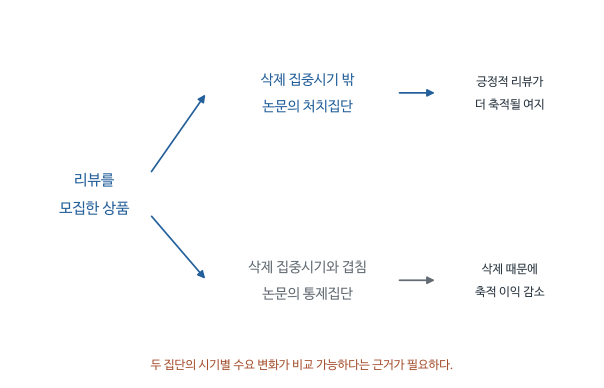

# The Market for Fake Reviews - 심층요약과 수식 해설

2026-11-25, Week 11 / Session 13. Sherry He, Brett Hollenbeck, Davide Proserpio (2022).

[원문 PDF](<The market for fake reviews (2022).pdf>) | [QnA](<The market for fake reviews (2022)_QnA.md>)


## 1. 판매자는 왜 돈을 내고 리뷰를 사는가

온라인에서 처음 보는 상품을 살 때 소비자는 품질을 직접 확인하기 어렵다. 다른 구매자의 후기는 이 정보 부족을 줄여 준다. 그래서 판매자가 좋은 평가를 인위적으로 늘리면 소비자의 선택뿐 아니라 플랫폼의 신뢰에도 영향을 준다. He, Hollenbeck, Proserpio는 가짜 리뷰가 실제로 거래되는 시장을 관찰해 판매자에게 얼마나 이익이 되는지, 구매자가 결국 어떤 상품을 받는지 조사했다.

거래는 다음과 같이 진행된다. Amazon 판매자가 Facebook 비공개 그룹에 상품을 올린다. 소비자는 Amazon에서 정상적으로 구매한 뒤 긍정적인 리뷰를 쓰고, 판매자는 PayPal 등으로 구매비용을 환급한다. 실제 주문이 있었으므로 리뷰에 Verified Purchase가 붙을 수 있다. 구매 인증이 알려주는 것은 거래가 있었다는 사실이다. 평가에 보상이 있었는지는 그 표지만으로 알 수 없다.

여기에는 서로 다른 경제적 설명이 가능하다. 아직 알려지지 않은 좋은 상품은 리뷰가 없어서 소비자의 선택을 받지 못할 수 있다. 이를 cold-start, 즉 처음 평판을 쌓기 어려운 문제라고 한다. 이런 판매자가 초기에 리뷰를 사서 품질을 알린다면 이후 고객도 만족할 수 있다. 반대로 품질이 낮은 판매자가 별점을 높여 일시적으로 판매를 늘린 뒤 고객의 불만을 남길 수도 있다. 어느 설명이 자료와 맞는지에 따라 리뷰 조작의 소비자 피해를 판단하는 근거도 달라진다.

저자들은 모집 게시물을 직접 수집해 어떤 상품이 언제 리뷰를 구했는지 확인하고, 이후 Amazon 평점과 판매순위가 어떻게 바뀌었는지 추적했다. 한 상품의 모든 리뷰를 가짜로 분류한 자료는 아니다. 리뷰를 사려는 행동이 확인된 상품의 결과를 관찰하는 자료다. 아래에서는 리뷰 한 개의 비용을 먼저 계산한 뒤, 그 비용을 회수할 만큼 판매에 효과가 있었는지 살펴본다.

이 거래에서 판매자가 사는 것은 리뷰어 한 사람의 진짜 소비수요가 아니다. 구매와 긍정적인 후기를 묶은 보상행동이다. 환급이 플랫폼 밖에서 이루어지면 Amazon 화면에는 정상적인 구매와 높은 별점이 남지만, 다음 소비자는 환급조건을 보지 못한다. 따라서 구매 인증 표지가 있어도 그 리뷰를 보상 없는 독립적인 평가라고 해석할 수 없다. 거래의 결제 경로를 이해해야 왜 기존 리뷰 탐지로 놓칠 수 있는지 알 수 있다.

연구의 두 질문은 서로 연결되지만 같은 질문은 아니다. 가짜 리뷰가 판매자에게 수익을 주는지 알아야 조작이 지속되는 유인을 설명할 수 있다. 그 상품을 나중에 산 사람이 만족하는지 알아야 소비자 피해에 관한 해석이 가능하다. 판매가 늘었다는 사실만으로 나쁜 상품이 팔렸다고 결론 내릴 수는 없다. 반대로 불만이 늘었다는 사실만으로 판매자가 얼마를 벌었는지 알 수도 없다. 논문은 비용, 판매순위, 후기의 흐름을 따로 측정해 이 두 질문을 연결한다.

좋은 신규상품도 평판이 쌓이기 전에는 판매하기 어렵다는 설명은 연구자가 검토하는 경제적 가설이다. 이를 확인하려면 단지 상품이 젊다는 사실보다 이후 보상 없는 소비자의 평가가 어떤지를 봐야 한다. 초기에 별점이 오른 모습은 좋은 상품의 정보 전달과 낮은 품질의 은폐 양쪽에서 나타날 수 있기 때문이다.

## 2. 데이터 한 줄은 무엇을 뜻하는가

리뷰를 구매한 날과 판매가 달라진 날을 연결하려면 상품별 시간 순서가 필요하다. 한 주에 관찰한 상품을 다음 주에도 다시 관찰한 자료를 패널자료라고 한다. 이 자료에서는 같은 상품의 변화를 따라갈 수 있고, 같은 주에 여러 상품이 함께 겪은 변화도 비교할 수 있다.

핵심 DID에서는 상품 i의 달력상 연도-주 t가 한 관측이다. 특정 상품의 가격, 누적 리뷰 수, 판매순위를 주별로 반복 관찰한다. 같은 상품이 여러 줄 등장한다.

| 기호/변수 | 뜻 | 읽을 때 주의할 점 |
|---|---|---|
| i | Amazon 상품 | 판매자 전체와 다르다 |
| t | 달력상 연도-주 | 상품마다 시작일이 다른 사건시간과 다르다 |
| G_i | 처음 관찰한 Facebook 모집 시점 | 실제 최초 조작 시작일의 대리변수 |
| After_it | G_i 이후 여부 | 상품별 시작일이 달라 i와 t가 모두 필요 |
| Treated_i | 삭제 집중기간 밖에서 모집을 시작한 상품 | 가짜 리뷰 모집 경험 자체를 뜻하지 않음 |
| y_it | 로그 판매순위 등 | 순위가 작을수록 판매가 좋다 |
| alpha_i | 상품 고정효과 | 시간이 지나도 일정한 상품 특성 |
| tau_t | 연도-주 고정효과 | 그 주 모든 상품에 공통인 충격 |

수집된 모집 상품은 약 1,500개다. 인과분석의 처음 집단은 처치 1,412개, 통제 78개다. 다른 분석의 표본 수까지 이 숫자로 통일하면 안 된다. 검색 결과를 이용한 비교상품, 리뷰삭제 분석 표본, 매칭 후 표본은 별개다.

원문 Table 2(p.473)의 모집 상품은 누적 리뷰 중앙값 45개, 평균 183.08개이며 평균 별점은 4.40이다. 신규 무평판 상품만 리뷰를 산다는 설명으로는 이 표본을 설명하기 어렵다. 평균과 중앙값 차이는 매우 많은 리뷰를 가진 일부 상품이 존재한다는 뜻이다.

상품별 첫 모집일을 0주로 맞춘 사건시간과 실제 달력의 2020년 특정 주는 역할이 다르다. 사건시간은 모집을 시작한 뒤 일반적으로 어떤 변화가 있는지 보여준다. 달력시간은 같은 주에 모든 상품이 겪은 경기나 플랫폼 변화를 조정하는 데 사용한다. 1월에 모집한 상품의 사건 후 2주와 3월에 모집한 상품의 사건 후 2주는 사건시간은 같지만 달력상 시장환경은 다르다.

수집범위도 해석에 영향을 준다. 비공개 그룹에서 발견한 모집 게시물은 관찰 가능한 조작 경로의 일부다. 다른 그룹이나 다른 방식으로 모집한 리뷰는 놓쳤을 수 있다. 따라서 모집을 발견하지 못한 상품을 모두 정직한 상품으로 분류하면 오분류가 생긴다. 저자들이 모집 경험이 확인된 상품들 사이에서 삭제 노출의 차이를 이용한 이유 중 하나가 비교집단의 행동을 더 구체적으로 이해하려는 데 있다.

누적 리뷰는 지금까지 쌓인 정보이고 주별 리뷰는 최근 새로 유입된 정보다. 오래된 상품에는 과거 리뷰가 많이 남아 있어 새 리뷰 몇 개의 평균평점 영향이 작을 수 있다. 두 변수를 같은 ‘리뷰 증가’로 요약하면 조작이 평판의 어느 부분을 바꾸었는지 놓친다.

## 3. 수식 1-6: 리뷰 하나를 사는 비용을 처음부터 계산하기

가짜 리뷰가 널리 거래된다는 사실을 이해하려면 판매자가 기대하는 수입과 실제 부담하는 비용을 비교해야 한다. 리뷰어에게 25달러를 환급했다고 해서 판매자가 25달러 전부를 잃는 것은 아니다. 리뷰어의 최초 결제대금 중 일부가 판매자에게 돌아오기 때문이다. 반면 상품의 생산비와 플랫폼 수수료는 회수되지 않는다. 아래 계산은 이 현금흐름을 정리해 리뷰 하나가 몇 건의 추가 판매를 만들어야 하는지 구한다.

### 3.1 돈의 이동을 각각 적는다

P는 표시가격, MC는 상품 한 개의 생산비용이다. tau는 판매세율, F_PP는 PayPal 수수료율, c는 Amazon 판매수수료율이다. Commission은 리뷰 작성자에게 추가로 주는 현금이다. 원문 p.474의 식 (1)-(2)를 풀면 다음과 같다.

판매자가 리뷰어에게 주는 돈:

$$R=P(1+\tau+F_{PP})+Commission.$$

판매자가 Amazon에서 돌려받는 판매대금:

$$S=P(1-c).$$

둘을 빼면 가격 P 자체는 상쇄된다.

$$
\begin{aligned}
R-S
&=P+P\tau+PF_{PP}+Commission-P+Pc\\
&=P(\tau+F_{PP}+c)+Commission.
\end{aligned}
$$

환급액과 판매대금의 차이에는 아직 상품을 만드는 데 쓴 비용이 포함되어 있지 않다. 리뷰어에게 전달한 상품 한 개의 생산비 MC를 더하면 판매자의 총부담 C가 된다.

$$C=MC+P(\tau+F_{PP}+c)+Commission.$$

### 3.2 마진율로 표현하는 이유

같은 25달러 상품이라도 생산비가 15달러인 판매자와 20달러인 판매자는 추가 판매 한 건에서 얻는 이익이 다르다. 판매가격 중 생산비를 제외하고 남는 비중을 마진율이라고 정의하면 이 차이를 손익분기 계산에 넣기 쉽다.

$$\lambda=\frac{P-MC}{P}.$$

양변에 P를 곱하면 P lambda=P-MC이고, 정리하면 MC=P(1-lambda)이다. 이를 비용식의 MC에 넣는다.

$$C=P(1-\lambda+\tau+F_{PP}+c)+Commission.$$

일반 소비자에게 추가로 한 개 팔았을 때 남는 금액은 P-MC-Pc이다. 여기서는 그 소비자의 구매대금을 환급하지 않는다.

$$m=P-P(1-\lambda)-Pc=P(\lambda-c).$$

리뷰 한 개 덕분에 추가 발생한 일반 판매량을 Q_o라고 하면 추가이익은 Q_o m이다. 리뷰 구매가 손익분기하려면 추가이익과 리뷰 구매비가 같아야 한다.

$$Q_o^{BE}P(\lambda-c)=P(1-\lambda+\tau+F_{PP}+c)+Commission.$$

lambda>c일 때 양변을 P(lambda-c)로 나눌 수 있다.

$$Q_o^{BE}=\frac{1-\lambda+\tau+F_{PP}+c+Commission/P}{\lambda-c}.$$

원문 식 (5)는 추가현금이 0인 경우다. 그때 가격 P가 없어지지만, 가격이 경제적으로 무관하다는 뜻은 아니다. 같은 마진율과 수수료율을 유지할 때에만 직접적인 P가 약분된다.

### 3.3 원문 예시 재계산

원문은 tau=0.06568, F_PP=0.029, c=0.08을 사용한다. 표시가격 25달러일 때 생산비가 15달러면 lambda=0.4다.

$$Q_o^{BE}=\frac{1-0.4+0.06568+0.029+0.08}{0.4-0.08}=2.420875.$$

생산비가 20달러면 lambda=0.2이고,

$$Q_o^{BE}=\frac{1-0.2+0.06568+0.029+0.08}{0.2-0.08}=8.122333\ldots.$$

원문 p.475의 약 2.4개와 8.1개를 재현한다. Q_o는 리뷰어의 최초 주문 이후 그 리뷰 때문에 추가로 발생한 일반 소비자의 구매량이다. 최초 주문의 수입과 비용은 이미 앞의 C 계산에 포함되어 있다.

이 식은 처벌 가능성, 장기 신뢰 손실, 판매량이 얼마나 늘어나는지를 모두 포함한 완전한 이윤모형이 아니다. “몇 개만 더 팔면 비용을 회수할 수 있는가”를 계산하는 회계적 기준이다. 낮은 생산비가 낮은 품질을 반드시 의미한다는 정리도 아니다.

환급된 주문의 가격 전액을 비용으로 센 뒤 생산비를 또 더하면 어떤 현금흐름을 계산하는지 혼동하기 쉽다. 리뷰어는 먼저 정상 가격을 지불하므로 플랫폼 수수료를 제외한 판매대금이 판매자에게 들어온다. 판매자는 그 후 환급금을 지불하고 상품도 제공한다. 최종 부담은 나간 돈과 들어온 돈의 차이에 실제로 소모한 상품 원가를 합한 것이다. 식에서 가격이 약분되는 까닭은 이 두 방향의 대금 이동 때문이다.

원가가 15달러인 예에서는 추가 일반 판매 한 건의 순기여가 $25(0.4-0.08)=8$달러다. 리뷰 구매의 비용은 $25(1-0.4+0.06568+0.029+0.08)=19.367$달러다. 손익분기 2.420875는 이 비용을 건당 8달러로 나눈 값이다. 기대 추가 판매량을 연속적인 수로 표현한 계산이라 소수로 보고하며, 반드시 정수 주문 세 건이 일어난다는 예측은 아니다.

수수료보다 마진율이 낮으면 분모가 0 또는 음수가 된다. 그 경우 일반 판매 한 건이 비용을 회수하는 수입원이 되지 않으므로 위 식을 정상적인 손익분기 판매량으로 해석할 수 없다. 또한 환급 외 추가보상이 있으면 비용이 올라가고, 조작 후 판매가 늘더라도 그 증가가 광고나 할인 덕분이면 모두 리뷰의 수익으로 세어서는 안 된다. 비용식과 뒤의 인과분석이 함께 필요한 이유다.

### 3.4 마진이 조금 낮아졌는데 손익분기 판매량은 왜 크게 뛰는가

원문의 두 예에서 손익분기량은 약 2.4개와 8.1개로 크게 달랐다. 분모의 의미를 놓치면 생산비 5달러 차이가 왜 이런 결과를 만드는지 이해하기 어렵다. $m=P(\lambda-c)$는 추가 일반 판매 한 건에서 남는 돈이다. 순마진이 작을수록 같은 리뷰 비용을 회수하려면 많은 구매가 필요하다.

추가현금이 없을 때 $K=1+\tau+F_{PP}+c$라 두면 앞 식은 다음처럼 짧아진다.

$$
Q_o^{BE}=\frac{K-\lambda}{\lambda-c}.
$$

마진율 $\lambda$가 바뀔 때 분자는 감소하고 분모는 증가한다. 몫의 미분을 쓰면 이 두 효과를 함께 볼 수 있다.

$$
\frac{dQ_o^{BE}}{d\lambda}
=\frac{-(\lambda-c)-(K-\lambda)}{(\lambda-c)^2}
=-\frac{1+\tau+F_{PP}}{(\lambda-c)^2}<0.
$$

마진이 좋아지면 리뷰어에게 제공하는 상품 원가도 낮아지고, 추가 판매 한 건의 수익도 높아진다. 특히 $\lambda$가 수수료율 $c$에 가까우면 분모의 제곱이 작아져 손익분기량이 마진에 매우 민감해진다. $\lambda=c$이면 일반 판매를 늘려도 남는 돈이 0이므로 양의 리뷰 비용을 회수할 유한한 판매량이 없다. $\lambda<c$에서는 위 식의 음수를 ‘음수만큼 팔면 된다’고 읽으면 안 된다. 애초에 양의 추가 판매로 손익분기할 조건이 깨졌다.

순마진과 예상 추가수요는 별개다. 손익분기량이 작아도 리뷰가 실제 구매를 거의 늘리지 않으면 비용을 회수하지 못한다. 논문이 비용 계산을 끝낸 뒤 리뷰 축적이 판매성과를 바꾸는지 별도로 추정하는 이유다. 이 미분은 원문의 비용식에서 도출한 학습용 설명이며 추가 실증결과는 아니다.

## 4. 모집 직후의 판매 증가에서 무엇을 분리해야 하나

비용 계산으로는 판매가 실제로 늘었는지 알 수 없다. 이제 모집 시작일을 기준으로 상품의 결과를 모아 보자. 여러 상품의 시작 날짜는 달라도 각 상품이 모집을 시작한 주를 0주로 맞추면 공통적인 변화가 드러난다. 이를 사건시간에 맞춘 그래프라고 한다. 판매자가 모집과 함께 다른 판촉도 바꿨는지까지 살펴야 리뷰의 역할을 판단할 수 있다.

Figures 4-7은 첫 모집 게시물 전후, Figures 8-9는 마지막 게시물 전후를 정렬한다. 전자의 0주는 모집 시작, 후자의 0주는 모집 종료다. 같은 가로축 0이라도 각 그림이 추적하는 사건이 다르다.

첫 모집 이후 주별 평점과 리뷰 수가 상승하고 판매순위가 개선된다. 동시에 가격도 내려가고 sponsored listing도 늘어난다. 이때 판매 증가는 리뷰, 할인, 광고가 섞인 결과다. 더구나 판매자는 수요가 떨어지고 있을 때 모집을 시작할 수 있다.

이유를 기호로 써보자. G_i 전후 판매 변화는 다음과 같이 나눌 수 있다.

$$Y_{i,post}(1)-Y_{i,pre}(0)
=[Y_{i,post}(1)-Y_{i,post}(0)]
+[Y_{i,post}(0)-Y_{i,pre}(0)].$$

첫 대괄호가 원하는 처치효과다. 두 번째는 리뷰를 사지 않았더라도 생겼을 변화다. 이를 관찰하지 못하므로 단순 전후 차이로 두 항을 분리할 수 없다.

상품 고정효과는 원래 인기가 높은 상품이라는 일정한 차이를 제거한다. 그러나 그 상품만의 갑작스러운 수요 감소, 광고 확대처럼 시간에 따라 달라지는 요인은 그대로 남는다.

모집 시작 전 판매가 나빠지는 패턴이 있다면 판매자가 임의의 날에 조작을 시작했다고 보기 어렵다. 부진에 대응한 선택일 수 있고, 일시적인 부진 뒤 자연 회복이 생길 수도 있다. 후자의 경우 모집 후 순위 개선 중 일부는 조작이 없었어도 나타났을 변화다. 같은 상품의 과거와 비교했다는 이유만으로 이 가능성이 사라지지 않는다.

할인과 광고도 판매자가 함께 선택하는 수단이다. 리뷰 수가 늘고 가격이 내려가고 광고가 늘어났다면 소비자는 세 변화를 모두 경험한다. 전후 그림은 판매자가 어떤 판촉 묶음을 실행했는지 잘 보여주지만 각 수단의 별도 효과까지 분해하지는 못한다. 이 구분을 해 두어야 그래프에서 보이는 큰 변화를 뒤의 DID 계수와 같은 추정치로 읽지 않게 된다.

모집 종료 시점의 그림에는 또 다른 선택 문제가 있다. 충분한 판매를 얻었거나 더 이상 효과가 없어서 모집을 끝냈을 수 있다. 따라서 종료 뒤의 변화는 소비자 경험에 관한 유용한 기술증거이지만, 종료 자체가 무작위로 이루어진 처치라고 가정하지 않는다.

## 5. 삭제 사건은 어떤 비교집단을 만들어 주는가

할인이나 광고를 함께 시작한 문제가 있으므로, 아무 판촉도 하지 않은 상품을 비교 대상으로 고르는 것만으로는 충분하지 않다. 저자들이 찾은 비교는 가짜 리뷰를 사려고 했다는 점에서는 비슷하지만 실제 리뷰가 남아 있는 정도에서는 달랐던 상품들이다. Amazon의 대규모 리뷰 삭제가 이 차이를 만들었다.

2020년 3월 중순 Amazon에서 리뷰가 집중적으로 삭제되었다. 저자는 3월 15일을 중심으로 [-2,1]주에 모집을 처음 관찰한 상품을 통제로 삼는다. 그 밖의 시점에 모집한 상품이 처치다.

양쪽 모두 리뷰를 사려고 했다. 차이는 통제 상품은 하필 삭제 집중시기에 걸려 긍정적 리뷰가 축적되는 이익을 덜 얻었다는 점이다. 따라서 일반적인 “조작 상품 대 정직한 상품” 비교보다 마케팅 의도와 선택의 차이가 작을 가능성이 있다.

그러나 정책시점이 스스로 무작위 실험을 만들어 준다고 단정하면 안 된다. 판매자가 이를 예상하지 못했는지, Amazon이 특정 부진 상품을 노렸는지, 같은 시기에 상품별 수요 충격이 달랐는지가 중요하다. 특히 달력 고정효과가 모든 상품별 팬데믹 충격을 없애는 것은 아니다.

삭제창의 통제상품은 아무 행동도 하지 않은 상품이 아니다. 리뷰를 구하려 했고, 그와 함께 가격이나 광고를 바꾸었을 수 있다. 다만 리뷰가 플랫폼에 남아 누적되는 정도에서 불리한 시기를 만났다. 비교가 목표로 삼는 것은 조작 의도를 가진 상품들 중 긍정적인 리뷰가 더 유지된 경우의 추가 변화다. ‘Treated=1이면 가짜, 0이면 진짜’라는 코딩으로 기억하면 논문의 실제 식별 논리를 거꾸로 이해하게 된다.

이 설계가 리뷰의 역할을 분리하려면 삭제 시기를 만난 상품이 리뷰 축적 외의 측면에서 특별한 사후변화를 겪지 않았다는 설명이 필요하다. 원래 품질이나 나이의 차이는 사전 특성과 고정효과로 일부 조정할 수 있다. 그러나 특정 상품군만 갑자기 수요가 늘어난 상황은 달력 더미 하나로 모두 제거되지 않는다. 2020년의 시장환경에서 이 우려가 어떤 자료로 줄어드는지 보는 것이 설계 평가의 일부다.

삭제가 플랫폼의 무작위 배정 실험은 아니므로 저자의 비교는 가정에 의존한다. 가정이 필요한 이유를 설명하는 것이 결과를 무효화한다는 뜻은 아니다. 어떤 자료가 그 가정을 지지하고 어떤 가능성이 남는지를 분명히 하면 인과 해석의 강도를 적절히 판단할 수 있다.

<!-- learning-figure:review-deletion -->



*그림 설명: 본문의 삭제 사건 설계를 단순화했다. 삭제 여부가 무작위로 배정되었다는 뜻은 아니다.*

통제상품도 리뷰를 모집했다. 삭제 집중시기를 만난 상품은 긍정적 리뷰가 남아 쌓이는 이익을 덜 얻었다는 점에서 비교에 쓰인다. 모집 여부만으로 조작 상품과 정직한 상품을 나누는 비교와 구별하고, 시기별 수요 충격이 달랐을 가능성을 별도로 검토해야 한다.

<!-- /learning-figure -->

## 6. DID 식을 네 칸으로 직접 풀기

통제상품도 모집 후 판매가 달라질 수 있다. 판매자가 광고를 늘렸거나 시장 전체 수요가 변했기 때문이다. 처치상품의 변화에서 통제상품의 변화를 한 번 더 빼면, 두 집단에 공통인 부분을 제외한 상대적인 변화를 계산하게 된다. 이중차분(DID)은 바로 이 두 번의 뺄셈을 회귀계수로 표현한다.

원문 식 (7), p.482를 단순화한 학습용 표기는 다음과 같다.

$$Y_{it}=a+bT_i+dA_{it}+\delta T_iA_{it}+u_{it}.$$

T_i는 처치집단, A_it는 해당 상품의 모집 후다. 먼저 오차 평균이 0인 네 칸을 적는다.

| 집단 | 이전 A=0 | 이후 A=1 | 전후 차이 |
|---|---|---|---|
| 통제 T=0 | a | a+d | d |
| 처치 T=1 | a+b | a+b+d+delta | d+delta |

처치집단 전후 차이에서 통제집단 전후 차이를 뺀다.

$$(d+\delta)-d=\delta.$$

이는 대수적으로 회귀계수의 의미를 보여준다. 인과해석에는 추가로 다음 가정이 필요하다.

$$E[Y_{post}(0)-Y_{pre}(0)\mid T=1]
=E[Y_{post}(0)-Y_{pre}(0)\mid T=0].$$

두 집단이 처치를 받지 않았을 때 평균적으로 같은 변화를 겪어야 한다. 이는 관측된 사전 평점이 같다는 말보다 강하며, 처치 후 관측 불가능한 반사실에 관한 가정이다.

실제 원문은 상품 alpha_i와 달력 tau_t, 통제변수 X_it를 더한다. Treated_i는 상품 내에서 변하지 않으므로 상품 고정효과와 함께 별도 계수로 식별할 수 없다. 원문의 beta_1 Treated_i는 상품 고정효과에 포함되어 중복항으로 생략될 수 있다. 집단별 전후 변화의 차이는 Treated_i와 After_it의 곱에 붙은 계수에서 추정한다.

상품별 모집시점이 다르므로 네 칸 표는 원리 설명이다. 실제 회귀의 모든 관측을 하나의 공통 전후 평균 네 개로 그대로 대체할 수는 없다.

여기서 After는 공통된 삭제일 이후라는 더미와 다르다. 각 상품이 모집을 처음 관찰된 시점 이후인지 나타낸다. 두 집단은 삭제집중시기와의 관계로 정의되고, 각 상품의 전후는 자기 모집일을 기준으로 정의된다. 집단을 정하는 달력사건과 결과를 정렬하는 사건시점이 동시에 존재하므로 두 시간축을 혼동하지 않는 것이 중요하다.

네 칸의 단순표에서 통제집단의 사후변화는 광고, 할인, 수요환경 등 리뷰 모집에 따라 함께 나타나는 부분을 대신한다. 처치집단이 그보다 얼마나 더 변했는지가 교호항이다. 상품 고정효과를 더하면 원래 상품수준 차이를, 주 고정효과를 더하면 같은 달력의 공통변화를 조정한다. 그렇지만 같은 시간에 처치집단에만 생기는 다른 변화는 교호항에 섞일 수 있다. 고정효과가 들어갔다는 사실보다 무엇이 같은 변화라고 가정되는지 설명해야 한다.

## 7. 매칭이 도와주는 것과 도와주지 못하는 것

삭제시기에 모집한 상품 수는 적고, 그 상품들의 나이나 기존 리뷰 수가 다른 시기의 상품들과 다를 수 있다. 오래된 상품과 신규상품의 자연스러운 판매 경로가 다르면 DID에도 문제가 생긴다. 매칭은 모집 전 특성이 비슷한 상품들이 비교에 더 많이 반영되도록 표본과 가중치를 조정하는 절차다.

통제 상품은 나이가 더 많고 사전 주별 평점이 더 낮으며 누적 리뷰가 더 많았다. 저자는 모집 전 [-8,-2)주 평균 특성으로 성향점수를 만들고 Gaussian kernel matching과 common support를 적용한다. 전자는 성향점수가 가까운 비교상품에 큰 가중치를 주는 매칭이고, 후자는 처치상품과 통제상품의 점수 범위가 겹치는 곳에서만 비교한다는 조건이다. 대역폭은 0.005다. 이후 처치 987개, 통제 48개가 남는다(p.482-483).

성향점수 p(X)=Pr(T=1|X)는 “이 상품이 가짜 리뷰를 살 확률”이 아니다. 여기서는 분석상 처치집단, 즉 삭제창 밖에서 모집한 집단에 속할 확률이다.

커널 매칭은 유사한 성향점수의 통제상품에 더 큰 가중치를 주어 비교 대상을 구성한다. 매칭 후 평균 균형이 좋아지는 것은 관측된 X에 관한 증거다. 관찰하지 못한 상품별 수요 추세까지 같다는 보증은 없다.

매칭과 DID를 결합하는 직관은 비교 가능한 사전 특성을 맞춘 뒤 변화량을 비교하는 것이다. 어느 하나가 다른 하나의 식별가정을 자동으로 충족시키지 않는다.

성향점수의 입력은 모집 이후 판매나 평점이면 안 된다. 조작 때문에 바뀐 결과를 맞추면 바로 분석하려는 효과의 일부를 제거하거나 새로운 선택을 만들 수 있다. 이 논문이 모집 전 구간의 상품특성을 사용하는 이유는 처치가 시작되기 전 비교가능성을 높이기 위해서다. 다만 처음 관찰한 모집일이 실제 시작보다 늦었다면 사전 구간에 조작의 영향이 일부 포함될 가능성도 검토해야 한다.

커널 매칭은 한 상품에 반드시 하나의 쌍을 붙이는 방식과 다르다. 점수가 비슷한 여러 비교상품이 서로 다른 가중치로 기여한다. 대역폭이 작으면 아주 가까운 상품의 영향이 크고 멀리 있는 상품의 영향은 빠르게 줄어든다. 따라서 매칭 후 상품 수만으로 최종 비교의 가중 구조를 전부 알 수는 없다.

공통지지 밖의 상품을 제외했다면 결과의 적용범위도 겹치는 상품들로 좁아진다. 삭제창의 어떤 상품은 비슷한 처치상품이 없고, 다른 시기의 어떤 상품은 비슷한 통제상품이 없었을 수 있다. 남은 표본의 DID를 모든 Amazon 판매자에게 동일한 효과로 확대할 근거는 별도로 필요하다.

## 8. Table 7을 열별로 읽기

이 설계가 의도대로 작동했다면 먼저 리뷰 축적에서 두 집단 차이가 나타나야 한다. 광고나 가격에서 큰 차이가 함께 나타나면 판매순위 변화를 리뷰에 귀속하기 어려워진다. Table 7은 이 순서대로 중간 결과와 최종 판매 결과를 제시한다.

Table 7(p.484)은 같은 설명변수에 대해 결과변수를 바꾼 표다. (1)은 리뷰가 실제로 다르게 축적되었는지, (2)-(4)는 다른 마케팅 활동이 차별적으로 변했는지, (5)는 판매순위 차이를 보는 열이다.

| 결과변수 | After | After × Treated | 의미 |
|---|---:|---:|---|
| log 누적 리뷰 | 0.047 | 0.099 | 처치집단의 리뷰 축적이 상대적으로 큼 |
| 광고 여부 | 0.014 | 0.027 | 다른 광고 변화를 점검 |
| 쿠폰 여부 | 0.011 | -0.031 | 다른 판촉 변화를 점검 |
| log 가격 | -0.003 | 0.006 | 다른 가격 변화를 점검 |
| log 판매순위 | 0.198 | -0.375 | 처치집단의 상대적 순위 개선 |

판매순위 열의 표준오차는 각각 0.097과 0.116이고 관측 수는 11,553이다. 표는 상품 수준으로 군집화한 표준오차를 사용한다. 같은 상품의 여러 주에 걸친 충격이 서로 닮을 수 있기 때문이다.

로그 계수를 정확한 비율로 바꾸려면 exp를 사용한다.

$$100(e^{-0.375}-1)=-31.27\%.$$

따라서 상대적 판매순위 약 31% 개선이다. 판매량 31% 증가로 바꾸어 말할 수 없다. 순위와 판매량 사이의 변환은 별도 모형이 필요하다.

통제집단의 전후 변화는 exp(0.198)-1=21.90%다. 처치집단 자체의 전후 변화는 두 계수의 합이다.

$$100(e^{0.198-0.375}-1)=-16.22\%.$$

이 약 16%는 상대효과 약 31%와 다른 질문에 답한다. 원문 p.484 본문의 합산 표기 beta_1+beta_2는 식 (7)과 맞지 않는다. 식과 Table 7에 맞는 합은 beta_2+beta_3다.

유의하지 않은 광고/가격 차이는 차이가 전혀 없다는 증명이 아니다. 검출 가능한 크기, 신뢰구간과 검정력을 함께 봐야 한다.

첫 리뷰 수 열은 삭제사건이 의도한 비교를 실제로 만들었는지 확인하는 역할을 한다. 긍정적 리뷰가 유지되는 정도가 두 집단에서 같았다면 판매순위 차이를 리뷰 축적 차이로 설명하기 어렵다. 가격과 광고 열은 그와 다른 판촉 경로가 집단 사이에서 함께 달라졌는지 조사한다. 이 표의 열들을 나란히 놓은 이유는 식별 이야기가 이어지는지 확인하기 위해서다.

판매순위는 순서자료다. 같은 카테고리에서 더 작은 숫자로 바뀌면 더 잘 팔리는 방향이지만 1,000위에서 700위로 변한 상품과 100위에서 70위로 변한 상품의 판매수량 증가가 같다고 볼 수 없다. 정확한 판매량과 이윤을 계산하려면 순위와 수량의 관계, 마진, 다른 판매 채널까지 알아야 한다. 앞의 손익분기식이 있어도 순위계수를 바로 대입해 확정적인 이윤을 얻을 수 없는 이유다.

처치집단 자체의 개선과 통제대비 개선이 다른 것은 이상한 결과가 아니다. 통제집단의 순위가 악화되었다면 처치집단의 상대적 이점은 자기 전후 개선보다 커진다. DID는 항상 비교집단이 알려주는 반사실을 기준으로 효과를 계산한다.

### 8.1 로그 순위의 DID를 원래 순위의 비율로 되돌리는 순서

로그 결과의 교호항 -.375는 비교집단 변화까지 뺀 차이다. 로그 차이는 원래 값의 비율을 뜻하므로, DID 전체는 두 비율의 비율로 읽어야 한다. $R_{T1},R_{T0},R_{C1},R_{C0}$를 각 칸의 모형상 대표 판매순위라 쓰면

$$
\delta=(\log R_{T1}-\log R_{T0})-(\log R_{C1}-\log R_{C0})
=\log\left(\frac{R_{T1}/R_{T0}}{R_{C1}/R_{C0}}\right).
$$

양변에 지수를 취하면 $e^{-0.375}\approx0.6873$이다. 처치집단의 전후 순위 비율이 비교집단의 전후 순위 비율의 약 68.7%라는 뜻이다. 판매순위가 낮을수록 잘 팔리므로 상대적인 개선으로 읽는다.

다른 조건이 일정한 교육용 예에서 비교집단이 1,000위에서 약 1,219위로 악화되었다고 하자. 이는 After 계수 .198의 배율 $e^{0.198}$을 적용한 값이다. 처치집단도 전기에 1,000위였다면 사후 적합값은 $1{,}000e^{0.198-0.375}\approx838$위다. 처치집단 자체의 전후 변화는 약 16.2% 개선이고, 비교집단의 악화까지 고려한 상대 변화는 약 31.3% 개선이다. 둘을 같은 변화율이라고 부르면 안 된다.

여기서 각 칸을 로그의 평균으로 계산했다면 지수변환한 값은 기하평균 또는 모형의 로그척도 예측에 해당한다. 산술평균 순위의 비율이 자동으로 같아지는 것은 아니다. 실제 패널 회귀에서는 고정효과 등도 조정되므로 위 숫자는 회귀의 구조를 설명한 가상 계산이다.

또한 1,000위에서 838위로 움직인 상품이 몇 개 더 팔렸는지는 순위만으로 알 수 없다. 순위와 판매량의 관계가 $\log Q=k-b\log R$라고 추가 가정하면 판매량 변화에는 $b$가 필요하다. $b$를 모르면서 -.375의 부호만 바꾸어 판매량 37.5% 증가라고 쓰면 새로운 가정을 숨기는 셈이다.

## 9. 사전 추세와 강건성 검정을 어디까지 믿는가

Figure 13은 -3주를 기준으로 처치와 통제의 로그 판매순위 격차 변화를 그린다. -2주와 -1주에 이미 변화가 나타난다. 연구자가 발견한 첫 게시물이 실제 모집의 최초 시점보다 늦을 수 있기 때문이다. 사전 추세가 완벽하다고 요약하면 이 문제를 숨기게 된다.

부록 C는 삭제가 상품 단위보다 리뷰어 단위에 집중되었다는 증거를 제시한다. 이는 특정 상품을 정밀하게 겨냥했다는 우려를 줄인다. 그러나 관찰한 리뷰어의 모든 다른 리뷰를 수집하지 못했다는 한계도 적혀 있다.

부록 D는 삭제창, 연속 처치척도, 가짜 삭제일, 매칭 방법을 바꾼다. 각각 임의의 창 선택, 처치 코딩, 계절적 패턴, 매칭 방식이 결과를 만들어냈을 가능성을 점검한다. 여러 검정의 방향이 일치해도 모든 미관측 충격에 대한 증명은 아니다.

모집 전 계수가 움직인다는 결과는 두 가지 해석을 열어 둔다. 처음 관찰한 게시물 이전부터 실제 조작이 시작되었을 수 있고, 모집 이전에 이미 판매 경로가 달라졌을 수도 있다. 전자는 처치시점의 측정오차이고 후자는 평행추세의 문제다. 관측된 그림만으로 두 설명을 완전히 분리할 수 없으므로 본문에서 하나를 확정적인 사실로 쓰지 않는 것이 정확하다.

리뷰어 중심 삭제라는 증거도 같은 방식으로 평가한다. 특정 상품의 매출이 나빠서 플랫폼이 삭제했다는 선택 설명이 약해질 수 있다. 그러나 삭제된 리뷰어를 많이 이용한 판매자가 다른 판매자와 비슷하다는 것까지 자동으로 입증하지는 않는다. 어떤 우려가 줄었는지와 어떤 우려가 남았는지를 나누어 설명해야 부록의 분석이 본문 주장에 기여하는 정도를 판단할 수 있다.

가짜 삭제일을 바꾸는 위약 분석은 원래 어느 시점에서도 비슷한 패턴이 나오는지를 묻는다. 실제 사건 주변에서만 변화가 뚜렷하면 달력의 자의적인 선택이라는 반론은 약해진다. 그렇다고 그 실제 시점에 함께 일어난 다른 사건까지 모두 배제되는 것은 아니다.

## 10. 모집이 끝난 뒤 실제 구매자는 어떤 평가를 남겼나

판매자가 이익을 얻었는지를 살핀 뒤에는 구매자의 경험을 확인할 차례다. 앞서 제시한 좋은 신규상품의 평판 형성 설명이 맞는다면, 보상을 받은 리뷰가 중단된 뒤 실제 고객도 만족스러운 평가를 이어갈 것으로 기대한다. 반대로 조작된 평점에 비해 품질이 낮다면 이후의 일반 구매자가 불만을 남길 가능성이 커진다.

모집 종료 후 별 하나 리뷰 비중이 대략 70% 증가하고, 특히 젊은 상품에서 악화된다. 70%는 70%포인트가 아니다. 예컨대 10%가 17%가 되면 상대 증가율 70%, 증가폭 7%포인트다. 이 숫자 예시는 설명용이다.

후기 텍스트는 품질, 작동불량, 돈 낭비 등의 표현을 더 많이 담는다. 이는 구매자의 기대와 경험이 어긋났다는 해석을 뒷받침한다. 이 분석은 불만을 드러내는 평가가 늘었다는 증거를 제공한다. 리뷰에는 지불의사나 효용을 화폐로 측정한 값이 없으므로 피해 총액을 계산한 결과는 제공하지 않는다.

부록 B의 cold-start는 상장 4개월 이하이면서 리뷰 8개 이하라는 결합 조건이다. 본문 Figure 15의 리뷰 50개 미만, Figure 16의 60일 미만과 같은 집단이 아니다. 각 그림과 표의 정의를 함께 읽어야 한다.

이후 낮은 별점이 늘었다는 사실은 평점 조작이 실제 경험을 앞질렀다는 설명과 맞는다. 소비자가 화면의 높은 평점을 보고 구매했다가 작동불량이나 품질 문제를 보고한다면, 단순히 신제품을 몰라서 구매하지 않았던 정보 부족만으로는 그 흐름을 설명하기 어렵다. 후기 텍스트가 어떤 불만인지 알려 주므로 평균 별점 하락만 보는 것보다 해석이 구체적이다.

다만 후기 작성자는 모든 구매자를 대표하지 않을 수 있다. 특히 불만족한 고객이 더 적극적으로 리뷰를 쓴다면 후기 비중 변화와 전체 구매자의 불만족 확률은 다를 수 있다. 이 연구는 관찰된 후기에서 소비자 경험 악화의 증거를 제시하며, 모든 구매자의 효용이나 환불 손실을 직접 측정한 것은 아니다.

cold-start 정의가 분석마다 다른 이유를 숨기면 결과를 잘못 연결하게 된다. 출시 후 얼마 지나지 않았다는 조건과 리뷰가 거의 없다는 조건은 관련되지만 같지 않다. 신제품이라도 이미 리뷰가 많을 수 있고 오래된 상품도 리뷰가 적을 수 있다. 두 조건을 함께 만족하는 집단에 대한 결과인지 한 조건으로 나눈 그림인지 확인해야 가설과 증거가 맞는다.

### 10.1 새 리뷰의 효과는 기존 리뷰가 몇 개 있느냐에 따라 달라진다

누적 평균평점은 새 리뷰의 별점만으로 결정되지 않는다. 기존 리뷰가 $n$개이고 평균이 $\bar r$, 새로 들어오는 리뷰 $k$개의 평균이 $r_{new}$라면 총 별점 합을 먼저 적어 새 평균을 구할 수 있다.

$$
\bar r_{after}=\frac{n\bar r+kr_{new}}{n+k},\qquad
\bar r_{after}-\bar r=\frac{k}{n+k}(r_{new}-\bar r).
$$

오른쪽은 두 부분이다. 새 평가가 기존 평균보다 얼마나 높은지, 새 리뷰가 전체 리뷰에서 얼마나 큰 비중을 차지하는지다. 교육용 예로 평균 4.0인 상품에 5점 리뷰 10개가 추가되면, 기존 리뷰 10개인 상품은 4.5가 되지만 기존 리뷰 90개인 상품은 4.1이 된다. 같은 리뷰 구매량도 화면의 평균평점 변화는 다르다.

이 계산에서 모든 새 리뷰를 보상 리뷰라고 가정한 것은 작동 원리를 보기 위한 것이다. 실제 관측자료의 모든 새 리뷰가 가짜라는 뜻은 아니다. 조작 뒤 늘어난 정상 구매자의 리뷰도 누적 평균에 함께 들어간다. 이후 평균평점이 내려갔다면 낮은 새 평가가 들어온 효과, 기존 높은 평가가 삭제된 효과, 두 변화의 상대적 규모를 나누어 생각해야 한다.

별 하나 리뷰의 ‘비중 증가’도 분모를 확인해야 한다. 비중이 10%에서 17%로 바뀌면 상대적으로 70% 증가이고 차이는 7%포인트다. 이때 리뷰가 전체 몇 개 늘었는지 모르면 별 하나 리뷰 건수의 증가율을 확정할 수 없다. 원문이 제시하는 소비자 불만의 증거를 읽을 때 건수, 비중, 누적평균을 구분해야 조작의 효과와 그 이후의 평가를 연결할 수 있다.

## 11. 실습에서 실제로 구현할 순서

아래는 원문 재현코드가 아닌 교육용 설계다. 데이터가 없으므로 실행하거나 원문 결과를 재현하지 않았다.

1. 상품 식별자와 달력 주를 확인한다. 첫 모집일과 실제 처치일의 측정차이를 기록한다.
2. 삭제창으로 Treated를 만들고 상품별 첫 모집일로 After를 만든다.
3. 사전 특성만 이용하여 성향점수와 공통지지 영역을 만든다.
4. 매칭 전후 균형을 확인하고 원문 가중치의 적용법을 명시한다.
5. 상품 고정효과와 달력 주 고정효과를 포함한 DID를 추정한다.
6. 상품 내 상관을 반영하고 사건시간별 계수, 삭제창 민감도, 위약검정을 비교한다.

가중치와 매칭 표본을 생략한 단순 예시는 다음과 같다. 이것은 Table 7의 재현 명령이 아니다.

```stata
xtset product_id calendar_week
xtreg ln_sales_rank i.after##i.treated i.calendar_week, fe vce(cluster product_id)
```

이 명령은 회귀 구조만 보여준다. 커널 가중치, 원문 관측기간, 통제변수, 누락값 및 로그 변환 규칙을 확정해야 실제 재현이 된다. 이 정보들이 확정되어야 회귀계수와 Table 7을 직접 비교할 수 있다.

자료를 직접 다룬다면 먼저 상품 하나를 골라 실제 달력주, 모집 기준 상대주, 집단 더미를 나란히 확인하는 것이 유용하다. 이를 잘못 코딩하면 같은 회귀명령을 실행해도 다른 사건을 비교하게 된다. 삭제창의 정의를 바꿀 때에는 통제상품이 어떻게 바뀌는지, 매칭 공통지지가 어떻게 달라지는지도 함께 기록한다.

판매순위의 방향을 그래프 축에 설명해 두면 독자가 결과를 거꾸로 읽는 일을 줄일 수 있다. 위로 올라간 선이 나쁜 순위를 뜻할 수 있으므로, 단순히 ‘성과가 상승했다’고 쓰기보다 순위 숫자가 줄었다고 적는 편이 분명하다. 실습의 목적은 원문 표와 같은 별표를 얻는 데만 있지 않고 처치 정의, 비교집단, 결과 측정의 연결을 확인하는 데 있다.

## 12. 리뷰 조작 연구가 남긴 경제적 질문

원문의 비용 예시는 마진이 높은 판매자에게 리뷰 구매비를 회수하는 문턱이 낮을 수 있음을 보여준다. 삭제사건을 이용한 분석에서는 리뷰가 더 축적된 상품의 판매순위가 상대적으로 개선되었다. 모집이 끝난 뒤의 불만 리뷰는 이 판매 증가가 구매자의 만족과 함께 나타난다고 보기 어렵게 만든다. 세 결과는 각각 판매자의 유인, 판매 성과, 구매 경험을 설명한다.

플랫폼의 정책을 평가할 때에도 이 셋을 함께 생각하게 된다. 리뷰를 삭제해 단기 판매가 감소하더라도 소비자의 잘못된 구매를 줄이고 장기 신뢰를 지키는 이득이 있을 수 있다. 이 논문은 그 장기 이득을 화폐 단위로 추정하지 않았으므로 단기 판매순위 계수만으로 삭제정책의 전체 비용과 편익을 계산할 수는 없다. 다음 주 리뷰어 연구에서는 조작 여부 대신 누가 쓴 평가가 판매에 영향을 주는지 살펴본다.

판매자에게 단기적으로 수익성 있는 행동과 소비자에게 유익한 정보 제공은 일치하지 않을 수 있다. 리뷰 구매비용이 몇 건의 추가 판매로 회수된다면 품질이 낮은 판매자도 조작을 반복할 유인이 생긴다. 이후 불만족한 후기가 쌓여 효과가 줄어들더라도 초기 판매에서 비용을 회수했다면 시장이 유지될 수 있다. 논문은 이 유인을 관찰된 거래방식, 비용 계산, 판매순위 변화와 연결한다.

플랫폼의 삭제는 이런 유인의 한 부분을 바꾼다. 긍정적인 후기가 빨리 삭제되면 판매자는 리뷰를 구매하고도 평판 축적의 이점을 덜 얻는다. 그러나 어느 삭제정책이 전체 소비자후생을 얼마나 개선하는지는 별도의 정책평가 질문이다. 여기의 자연발생적 삭제사건에서 얻은 국소적인 비교를 모든 감시강도나 처벌정책의 효과로 바로 확대하지 않는다.

## 출처와 계산에 관한 메모

보관 PDF 27쪽의 텍스트 전체(본문, 부록 A-D, 참고문헌, 마지막 저작권 안내)를 확인했고, 주요 수식과 Table 7은 PDF 이미지로 대조했다. 아래 쪽수는 원문 인쇄 쪽수다. 보관본에는 468-493이 인쇄되어 있으나 강의계획서 서지는 896-921로 되어 있다. 판본 간 쪽수 불일치를 그대로 기록하며 이 문서의 위치 안내는 보관본을 따른다. 별도 온라인 부록과 원자료는 검토하지 않았다.
