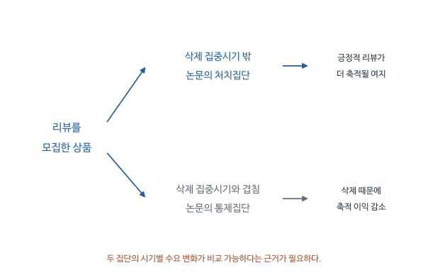

# The Market for Fake Reviews - 심층요약과 수식 해설

2026-11-25, Week 11 / Session 13. Sherry He, Brett Hollenbeck, Davide Proserpio (2022).

[원문 PDF](<The market for fake reviews (2022).pdf>) | [개념 퀴즈](<The market for fake reviews (2022)_QnA.md>) | [수식·모델 퀴즈](<The market for fake reviews (2022)_수식모델퀴즈.md>) | [실무 Cheat Sheet](<The market for fake reviews (2022)_실무CheatSheet.md>)


## 1. 판매자는 왜 돈을 내고 리뷰를 사는가

온라인에서 처음 보는 상품을 살 때 소비자는 품질을 직접 확인하기 어렵다. 다른 구매자의 후기는 이 정보 부족을 줄여 준다. 판매자가 좋은 평가를 인위적으로 늘리면 소비자의 선택이 달라지고, 후기 제도 전체에 대한 신뢰도 흔들린다. He, Hollenbeck, Proserpio는 가짜 리뷰가 실제로 거래되는 시장을 관찰해, 리뷰 구매가 판매자에게 얼마나 이익이 되는지와 그 상품을 산 소비자가 결국 어떤 경험을 했는지 조사했다.

거래는 다음 순서로 진행된다(pp. 470-471). Amazon 판매자가 Facebook 비공개 그룹에 상품 사진과 함께 "need reviews", "refund after pp" 같은 모집글을 게시한다. 관심 있는 이용자와는 Facebook 개인 메시지로 조건을 협의한다. 판매자는 상품 링크를 직접 제공하지 않고 검색 키워드를 알려 준다. 리뷰어가 그 키워드로 Amazon을 검색해 사진과 상품명으로 상품을 찾게 하려는 것으로, Amazon의 탐지 알고리즘을 회피하기 위한 절차다. 리뷰어는 정상 가격에 구매하고 별 다섯 개 리뷰를 올린다. 그러면 판매자가 PayPal로 상품 대금을 환급한다. 대부분의 판매자는 PayPal 수수료와 판매세도 보전해 준다고 광고하며, 약 15%의 상품은 환급 외에 수수료(commission)를 추가로 지급한다. 추가 수수료는 평균 6.24달러, 관찰된 최대값은 15달러다. 그래서 가짜 리뷰 비용의 대부분은 상품 대금 자체다. 판매자는 미국에 있고 Amazon.com 계정과 과거 리뷰 이력이 있는 리뷰어만 모집하며, 사진과 동영상을 포함한 길고 상세한 리뷰를 작성하도록 권한다.

실제 주문이 있었으므로 이 리뷰에는 Verified Purchase(구매 인증) 표지가 붙는다. 구매 인증 표지가 알려 주는 것은 거래가 있었다는 사실뿐이고, 평가에 보상이 걸려 있었는지는 이 표지로 알 수 없다. 환급은 플랫폼 밖에서 이루어지므로 Amazon 화면에는 정상적인 구매와 높은 별점만 남는다. 다음 소비자는 그 리뷰어가 별 다섯 개를 조건으로 상품 대금을 환급받았다는 사실을 볼 수 없다. 판매자가 산 것은 한 사람의 소비 수요라기보다 구매와 긍정적 후기를 묶은 보상 행동이다. 각주 6은 이런 리뷰가 구매 인증 표지가 붙어 있으므로, 인증 여부로 조작을 식별하는 선행연구(Mayzlin et al. 2014)의 식별(identification) 방법이 이 시장에서는 유효하지 않다고 지적한다.

저자들은 이 거래를 incentivized review(보상 제공 리뷰)와도 구별한다(p. 471). 보상 제공 리뷰도 무료 또는 할인 상품을 대가로 받지만, 보상이 긍정적 평가를 조건으로 하지 않는다. 리뷰 안에 무료로 받았다는 사실을 밝히는 경우가 많고, 원칙적으로 상품을 사용해 본 사람의 정보를 담는다. 가짜 리뷰는 별 다섯 개를 작성해야 환급을 받고, 상품을 열어 보지도 않은 채 작성하는 경우가 많으며, 보상 사실을 공개하지 않는다. Amazon도 보상 제공 리뷰는 Vine 프로그램 등으로 허용한 적이 있지만 가짜 리뷰는 판매자와 리뷰어 모두의 약관 위반으로 본다(각주 7).

이런 시장이 가장 큰 전자상거래 플랫폼에서 공개적으로 운영된다는 사실 자체가 수수께끼다. 이에 대해서는 서로 다른 두 경제적 설명이 있다. 하나는 가짜 리뷰가 평균적으로는 소비자를 속이지 않을 수도 있다는 설명이다. 아직 알려지지 않은 좋은 상품은 리뷰가 없어서 소비자의 선택을 받지 못할 수 있다. 이를 cold-start 문제, 곧 처음 평판을 쌓기 어려운 문제라고 한다. Dellarocas(2006)의 이론모형은 평점에 대한 수요 반응이 볼록하다는 조건에서 가짜 리뷰를 주로 좋은 판매자가 구매하고, 그 결과 시장의 정보가 오히려 늘어나는 균형이 있음을 보였다. 경험재 광고의 신호 모형(Nelson 1970, Milgrom and Roberts 1986)도 비슷한 논리를 따른다. 품질이 좋은 기업은 첫 구매 뒤 재구매와 좋은 입소문을 기대할 수 있어 광고의 수익이 더 크고, 그래서 좋은 기업이 광고를 더 많이 하는 균형이 생긴다. 가짜 리뷰가 판매를 만들고 그 판매가 다시 보상 없는 좋은 평점을 만든다면 가짜 리뷰는 광고와 비슷한 역할을 한다. 다른 하나는 품질이 낮은 판매자가 별점을 높여 일시적으로 판매를 늘린 뒤 고객의 불만을 남긴다는 설명이다. 어느 설명이 자료와 부합하는지에 따라 리뷰 조작이 소비자에게 피해를 주는지에 대한 판단이 달라진다.

연구의 두 질문은 서로 연결되지만 같은 질문은 아니다. 가짜 리뷰가 판매자에게 수익을 주는지 알아야 조작이 계속되는 유인을 설명할 수 있다. 그 상품을 나중에 산 사람이 만족하는지 알아야 소비자 피해를 판단할 수 있다. 판매가 늘었다는 사실만으로 나쁜 상품이 팔렸다고 결론 내릴 수 없고, 불만이 늘었다는 사실만으로 판매자가 얼마를 벌었는지 알 수도 없다. 초기에 별점이 상승한 양상은 좋은 상품의 정보 전달과 낮은 품질의 은폐 양쪽에서 나타날 수 있다. 두 설명을 구별하려면 보상 리뷰가 중단된 뒤 보상 없는 소비자가 어떤 평가를 남기는지를 분석해야 한다.

모집 게시물을 직접 수집해 어떤 상품이 언제 리뷰를 구했는지 확인하고, 이후 Amazon의 평점, 리뷰, 판매순위, 가격, 광고가 어떻게 바뀌었는지 추적했다. 이 자료는 리뷰 하나하나를 가짜와 진짜로 분류한 자료와 다르다. 리뷰를 사려는 행동이 확인된 상품의 결과를 관찰하는 자료다. 아래에서는 누가 리뷰를 사는지(2절), 리뷰 한 개의 비용이 얼마인지(3절), 모집 전후에 무엇이 함께 바뀌는지(4절), 삭제 사건으로 판매 효과를 어떻게 분리하는지(5-9절), 모집이 끝난 뒤 구매자가 어떤 평가를 남겼는지(10절)를 차례로 살펴본다.

### 1.1 자료와 분석이 각각 답하는 질문

분석에는 서로 다른 자료와 비교가 여러 개 쓰인다. 각 구성 요소가 어떤 질문에 답하고 어떤 질문에는 답하지 못하는지 먼저 정리해 두면, 뒤에서 수치를 해석할 때 어느 결과를 어느 주장의 근거로 사용해야 하는지 혼동하지 않는다.

| 구성 요소 | 답하는 질문 | 혼자서는 답하지 못하는 것 |
|---|---|---|
| Facebook 모집 게시물 자료 (약 1,500개 상품) | 어떤 상품이 언제부터 언제까지 리뷰를 구했는가 | 실제로 달린 가짜 리뷰의 수, 관찰되지 않은 다른 경로의 조작 |
| 검색결과 경쟁상품과의 비교 (Table 2) | 리뷰를 사는 상품은 같은 검색 페이지의 다른 상품과 무엇이 다른가 | 리뷰 구매가 판매에 준 효과 |
| 첫 게시물 기준 전후 그림과 회귀 (Figures 4-7, Table B.1) | 모집을 시작하면 평점, 리뷰, 순위, 가격, 광고가 어떻게 함께 움직이는가 | 리뷰만의 인과효과 (할인, 광고, 수요 충격이 섞임) |
| 마지막 게시물 기준 전후 그림과 회귀 (Figures 8-9, Table B.2) | 모집을 멈춘 뒤에도 판매와 좋은 평점이 스스로 유지되는가 | 종료 시점이 무작위라는 보장 |
| Amazon 삭제의 기술분석 (Table 4, Figure 11) | 플랫폼은 가짜 리뷰를 얼마나, 언제 지우는가 | 삭제가 판매에 미친 효과 |
| 삭제 집중기간을 이용한 DID (Table 7, Figure 13) | 긍정적 리뷰가 실제로 쌓이면 판매순위가 얼마나 좋아지는가 | 판매량이나 이윤의 정확한 크기, 모든 판매자로의 일반화 |
| 모집 종료 후 별 하나 리뷰와 텍스트 분석 (Figures 14-16, Tables 8-9) | 가짜 리뷰를 산 상품의 구매자가 속았다고 느꼈는가 | 소비자 후생 손실의 화폐 크기 |

저자들은 논문 4절의 전후 분석이 기술적 결과이며 인과효과로 해석하면 안 된다고 적는다(p. 475). 판매에 대한 인과효과는 5절의 삭제 사건 DID에서만 주장한다. 이 구분을 기억하면 전후 그림의 큰 변화와 DID 계수 -.375를 같은 종류의 효과로 혼동해 해석하는 일을 피할 수 있다.

## 2. 데이터 한 줄은 무엇을 뜻하는가

리뷰를 구매한 날과 판매가 달라진 날을 연결하려면 상품별 시간 순서가 필요하다. 한 주에 관찰한 상품을 다음 주에도 다시 관찰한 자료를 패널자료라고 한다. 이 자료에서는 같은 상품의 변화를 따라갈 수 있고, 같은 주에 여러 상품이 함께 겪은 변화도 비교할 수 있다.

5절 이후의 DID에서는 상품 i의 달력상 연도-주 t가 한 관측이다. 특정 상품의 가격, 누적 리뷰 수, 판매순위를 주별로 반복 관찰한다. 같은 상품이 여러 줄 등장한다.

| 기호/변수 | 뜻 | 읽을 때 주의할 점 |
|---|---|---|
| i | Amazon 상품 | 판매자 전체와 다르다 |
| t | 달력상 연도-주 | 상품마다 시작일이 다른 사건시간과 다르다 |
| G_i | 처음 관찰한 Facebook 모집 시점 | 실제 최초 조작 시작일의 대리변수 |
| After_it | G_i 이후 여부 | 상품별 시작일이 달라 i와 t가 모두 필요 |
| Treated_i | 삭제 집중기간 밖에서 모집을 시작한 상품 | 가짜 리뷰 모집 경험 자체를 뜻하지 않음 |
| y_it | 로그 판매순위 등 | 순위가 작을수록 판매가 좋다 |
| alpha_i | 상품 고정효과 | 시간이 지나도 일정한 상품 특성 |
| tau_t | 연도-주 고정효과 | 그 주 모든 상품에 공통인 충격 |

수집된 모집 상품은 약 1,500개다. 인과분석을 시작할 때의 집단은 처치 1,412개, 통제 78개다. 검색결과를 이용한 비교상품, 리뷰 삭제 분석의 표본, 매칭 후 표본은 이와 별개의 집합이므로 분석마다 표본 수가 다르다.

Table 1(p. 473)에 따르면 상품은 여러 카테고리에 분포해 있다. 가장 많은 카테고리는 Beauty & Personal Care(193개), Health & Household(159개), Home & Kitchen(148개)이고, 가장 많은 세부 카테고리인 가습기도 전체의 약 1%에 그친다. 거의 모든 상품은 제3자 판매자가 판매한다. 모집 기간은 하루로 끝나는 상품부터 한 달이 넘는 상품까지 다양하며 평균 23일, 중앙값 6일이다(p. 472). 평균이 중앙값의 네 배 가까이 되는 것은 소수의 상품이 장기간 모집을 지속했기 때문이다.

Table 2(p.473)의 모집 상품은 누적 리뷰 중앙값 45개, 평균 183.08개이며 평균 별점은 4.40이다. 신규 무평판 상품만 리뷰를 산다는 설명으로는 이 표본을 설명하기 어렵다. 평균과 중앙값 차이는 매우 많은 리뷰를 가진 일부 상품이 존재한다는 뜻이다.

상품별 첫 모집일을 0주로 맞춘 사건시간과 실제 달력의 2020년 특정 주는 역할이 다르다. 사건시간은 모집을 시작한 뒤 일반적으로 어떤 변화가 있는지 보여준다. 달력시간은 같은 주에 모든 상품이 겪은 경기나 플랫폼 변화를 조정하는 데 사용한다. 1월에 모집한 상품의 사건 후 2주와 3월에 모집한 상품의 사건 후 2주는 사건시간은 같지만 달력상 시장환경은 다르다.

수집 방법도 해석에 영향을 준다(논문 2.1절). 2019년 10월부터 2020년 6월까지 매주 연구보조원을 Facebook 그룹에 파견해 모집글을 선정했다. 그룹 안의 게시물은 좋아요나 댓글이 드물어 대체로 시간순으로 표시된다. 연구보조원에게는 상품 종류, 반응 수, 글의 문구를 고려하지 말고 스크롤하며 준무작위로 선택하라고 지시했다. 특정 유형의 상품만 표본에 들어오는 일을 줄이려는 절차다. 게시물을 선정하면 판매자가 제공한 키워드로 Amazon을 검색해 상품 ID를 찾고, 검색 키워드, 세부 카테고리, 게시일, 같은 판매자가 같은 상품으로 올린 가장 이른 게시일, 그룹 이름을 기록했다. 이후에도 판매자의 Facebook 이름과 상품 키워드로 그룹을 계속 검색해 같은 상품의 새 게시물을 찾았다. 가장 이른 게시일 $G_i$를 모집 시작의 대리변수로, 마지막으로 관찰된 게시일을 모집 종료의 대리변수로 사용한다.

그룹 규모는 따로 측정했다. 2020년 3월 28일부터 10월 11일까지 매일 검색 순위 상위 30개 그룹을 조사한 결과, 하루 평균 약 23개의 가짜 리뷰 관련 그룹이 확인되었고 그룹당 평균 회원은 약 16,000명, 그룹당 하루 모집글은 568개였다. Facebook이 그룹을 주기적으로 삭제해도 곧 새 그룹이 생겼다. 각주 5는 같은 판매자와 리뷰어가 여러 그룹에 중복 가입해 있어 회원 수와 게시물 수가 실제 활동량보다 과대 집계되었을 수 있다고 밝힌다.

비공개 그룹에서 발견한 모집 게시물은 관찰 가능한 조작 경로의 일부다. 다른 그룹이나 다른 방식으로 모집한 리뷰는 누락되었을 수 있고, 첫 게시물 이전에 이미 모집이 시작되었을 수도 있다. 따라서 모집을 발견하지 못한 상품을 모두 정직한 상품으로 분류하면 오분류가 생긴다. 인과분석에서 모집 경험이 확인된 상품들끼리 삭제 노출의 차이를 비교하면, 비교집단(comparison group)도 리뷰를 사려 했다는 사실을 알고 있다는 장점이 있다.

누적 리뷰는 지금까지 쌓인 정보이고 주별 리뷰는 최근 새로 유입된 정보다. 오래된 상품에는 과거 리뷰가 많이 남아 있어 새 리뷰 몇 개의 평균평점 영향이 작을 수 있다. 두 변수를 같은 ‘리뷰 증가’로 요약하면 조작이 평판의 어느 부분을 바꾸었는지 간과한다.

### 2.1 Table 2: 리뷰를 사려던 상품은 경쟁상품과 어떻게 달랐나

앞에서 인용한 누적 리뷰 중앙값 45개와 평균 183.08개는 Table 2의 한 행이다. 1절에서 제기한 cold-start 설명을 검토하려면 모집 상품이 같은 시장의 다른 상품보다 얼마나 젊은지, 리뷰가 얼마나 적은지, 평점과 가격은 어떠했는지를 함께 검토해야 한다. 아래 표는 원문 Table 2(PDF 파일 6쪽, 인쇄 쪽수 473)의 7개 변수와 모든 열을 옮기고 형식만 Markdown으로 바꾼 것이다. 표에는 별도 주석이 없다.

| 변수 | 집단 | Count | Mean | SD | 25% | 50% | 75% |
|---|---|---:|---:|---:|---:|---:|---:|
| Displayed rating | 모집 상품 | 1,315 | 4.40 | 0.51 | 4.10 | 4.50 | 4.80 |
| | 비교상품 | 203,480 | 4.23 | 0.59 | 4.00 | 4.30 | 4.60 |
| Number of reviews | 모집 상품 | 1,425 | 183.08 | 493.47 | 10.00 | 45.00 | 167.00 |
| | 비교상품 | 203,485 | 451.38 | 2,619.02 | 13.00 | 59.00 | 250.00 |
| Price (달러) | 모집 상품 | 1,425 | 33.36 | 44.96 | 15.99 | 23.99 | 34.99 |
| | 비교상품 | 236,542 | 44.69 | 154.80 | 12.99 | 20.99 | 39.95 |
| Sponsored | 모집 상품 | 1,425 | 0.13 | 0.33 | 0.00 | 0.00 | 0.00 |
| | 비교상품 | 236,542 | 0.11 | 0.32 | 0.00 | 0.00 | 0.00 |
| Keyword position | 모집 상품 | 1,425 | 21.41 | 16.11 | 8.00 | 16.00 | 33.00 |
| | 비교상품 | 236,542 | 28.18 | 17.32 | 13.00 | 23.00 | 43.00 |
| Age (days) | 모집 상품 | 1,305 | 229.82 | 251.12 | 77.00 | 156.00 | 291.00 |
| | 비교상품 | 153,625 | 757.84 | 797.14 | 257.00 | 466.00 | 994.00 |
| Sales rank | 모집 상품 | 1,300 | 73,292.27 | 151,236.36 | 7,893.25 | 26,200.50 | 74,801.50 |
| | 비교상품 | 5,647 | 89,926.06 | 323,028.92 | 5,495.00 | 21,610.00 | 72,563.50 |

*원문 집단 이름은 "Fake review products"와 "All products"다. 여기서는 각각 모집 상품, 비교상품으로 옮겼다.*

변수마다 두 행이 짝을 이룬다. 위 행은 Facebook 그룹에서 리뷰 모집이 관찰된 상품이고, 본문(PDF 5-6쪽)에 따르면 평점과 리뷰 수는 첫 Facebook 게시물 시점의 값이다. 아래 행의 "All products"는 이름과 달리 Amazon 전체 상품을 뜻하지 않는다. 모집 상품과 같은 키워드로 검색했을 때 같은 검색결과 페이지에 나타난 경쟁상품이다. Count는 그 변수의 값이 확보된 상품 수라서 행마다 다르다. 특히 판매순위의 비교상품은 5,647개뿐이어서 20만 개가 넘는 다른 행과 표본이 크게 다르다. SD는 상품 사이의 흩어짐을 나타내는 표준편차이며 평균의 표준오차(standard error)와 다르다. 25%, 50%, 75% 열은 분위수이고 50%가 중앙값이다.

나이 행부터 검토하면 모집 상품의 중앙값은 156일, 비교상품은 466일이다. 30일을 한 달로 환산하면 약 5.2개월과 15.5개월로, 본문에 적힌 "약 5개월 대 15개월"과 일치한다. 그러나 모집 상품의 평균 나이도 229.82일(약 7.7개월)이고 25% 분위수가 77일이다. 약 1,500개 상품 가운데 상장 첫 달에 리뷰를 모집한 상품은 94개뿐이다. 막 출시된 상품만 리뷰를 사는 시장으로 보기는 어렵다.

평점은 모집 상품 쪽이 더 높다. 평균 4.40 대 4.23, 중앙값 4.50 대 4.30이다. 나쁜 평판을 덮기 위해 리뷰를 산다는 단순한 설명도 이 수치와 잘 부합하지 않는다. 리뷰 수는 중앙값 45 대 59로 모집 상품이 적지만 격차가 크지 않다. 평균 183.08과 표준편차 493.47은 리뷰가 1,000개를 넘는 소수 상품이 평균을 끌어올린다는 뜻이다. 비교상품의 평균 451.38과 표준편차 2,619.02에서는 이 꼬리가 더 길다.

가격과 판매순위에서는 평균과 중앙값의 비교 방향이 반대로 나타난다. 가격 평균은 모집 상품 33.36달러, 비교상품 44.69달러이지만 중앙값은 23.99달러 대 20.99달러로 모집 상품이 더 비싸다. 저자들은 비교상품 쪽에 고가 상품이 훨씬 많아 평균이 상승했다고 설명한다. 판매순위는 값이 작을수록 판매량이 많다. 평균은 모집 상품이 73,292로 더 우수해 보이지만 중앙값은 26,200.5 대 21,610으로 모집 상품의 판매량이 약간 적다. 본문의 표현으로는 모집 상품의 판매가 "약간 낮지만 차이는 작다". 치우친 분포에서는 중앙값을 먼저 확인하는 편이 안전하다.

Sponsored는 광고 여부를 나타내는 0/1 변수의 평균이므로 0.13은 모집 상품의 약 13%가 sponsored listing을 구매했다는 뜻이다. 비교상품은 11%다. 75% 분위수까지 모두 0.00인 것은 광고 상품의 비중이 25%보다 작기 때문이다. Keyword position은 모집 상품이 평균 21.41, 비교상품이 28.18이다. 표에는 정의 주석이 없지만 검색결과 안의 노출 순서로 해석되며, 그렇다면 모집 상품이 페이지의 약간 상위에 있었다는 뜻이 된다.

이 표로 말할 수 있는 것은 리뷰를 사려던 상품이 경쟁상품보다 젊고 리뷰가 조금 적지만 평점은 높고, 리뷰가 거의 없는 상품은 소수라는 점이다(본문 기준 리뷰 0개 상품은 약 8%). 이 표만으로 말할 수 없는 것도 있다. 첫째, 두 집단 차이가 통계적으로 유의한지는 표에 검정통계량이 없어 판단할 수 없다. 둘째, 모집 상품의 높은 평점은 관찰되지 않은 과거의 리뷰 구매 결과일 수 있다고 저자들 스스로 지적한다. 셋째, 비교상품은 리뷰 구매가 "관찰되지 않은" 상품일 뿐 정직한 상품이라는 보증은 없다. 넷째, 이 기술통계는 누가 리뷰를 사는지 보여 줄 뿐, 리뷰 구매가 판매에 미친 효과와는 별개의 질문이다.

판매자 정보는 별도로 수집했다(p. 474, Table 3). 알려진 브랜드는 거의 없었다. Amazon에 표시된 판매자 이름을 미국 특허상표청 기록과 대조해 약 70%의 상품에서 일치하는 기록을 찾았고, 그중 84%가 중국 본토, 주로 광둥성의 선전과 광저우에 있었다. 판매자 한 곳이 판매하는 상품 수의 중앙값은 7.75개다. 이 결과는 리뷰가 유명 브랜드보다 작은 독립 판매자에게 더 중요하다는 선행연구(Hollenbeck 2018)와 맞닿는다. 다만 저자들은 유명 브랜드가 더 은밀한 경로로 리뷰를 살 가능성도 배제하지 않는다.

### 2.2 Amazon 자료와 세 종류의 비교상품

Facebook 자료가 알려 주는 것은 모집이 있었다는 사실과 그 시점이다. 모집의 결과는 Amazon 쪽 자료로 측정한다(논문 2.2절). 수집한 자료는 세 가지다. 첫째, 모집 상품의 키워드로 검색한 결과 페이지를 매일 수집해 같은 페이지에 노출된 상품들의 가격, 쿠폰, 표시 평점, 리뷰 수, 광고 여부, 페이지 안 위치를 기록했다. 둘째, 모집 상품의 리뷰를 매일 수집하고, 한 달에 두 번은 그 상품의 전체 리뷰를 다시 수집했다. 매일 수집한 리뷰가 나중의 전체 목록에서 누락되어 있으면 Amazon이 그 리뷰를 삭제했다는 뜻이므로, 이 반복 수집으로 삭제를 측정할 수 있다. 셋째, Keepa.com의 API로 판매순위를 일주일에 두 번 수집했다. Amazon의 Best Seller Rank는 일정 기간의 실제 판매량을 같은 카테고리 안의 순위로 변환한 값이며 계산식은 공개되지 않는다.

비교상품 또는 경쟁상품이라는 말은 이 연구에서 적어도 세 집단을 가리킨다. 이름이 비슷해 혼동하기 쉬우므로 역할을 구분해 둔다.

| 비교집단 | 구성 | 쓰이는 곳과 답하는 질문 |
|---|---|---|
| 검색결과 경쟁상품 | 모집 상품과 같은 키워드의 같은 검색결과 페이지에 뜬 상품 전체 | Table 2에서 리뷰를 사는 상품이 주변 상품과 어떻게 다른지 보여 준다. 텍스트 분석(Table 9)의 비교 리뷰도 이 정의를 쓴다(각주 20) |
| 경쟁상품 2,714개 패널 | 모집 상품마다 첫 게시물 전후 7일 동안 같은 검색 페이지에 가장 자주 함께 뜬 상품 2개 | 리뷰를 매일, 월 2회 수집했다. 부록 B 회귀에 한 번도 처치되지 않는 상품으로 들어간다 |
| 삭제 집중기간 모집 상품 | 3월 15일 전후 [-2, 1]주에 첫 모집이 관찰된 78개 상품 | 5절 DID의 통제집단. 리뷰를 사려 했지만 리뷰가 쌓이지 못했을 때 판매가 어땠는지 보여 준다 |

앞의 두 집단은 리뷰 구매가 관찰되지 않은 상품이다. 조작을 하지 않았다는 보증은 없고, 같은 검색 페이지에서 경쟁한다는 점에서 수요 환경이 비슷한 상품이다. 세 번째 집단은 반대로 리뷰 구매가 관찰된 상품이다. 인과효과를 추정할 때 앞의 두 집단 대신 세 번째 집단을 통제집단으로 사용한 이유가 여기에 있다. 조작을 시도하지 않았거나 적발되지 않은 상품과 비교하면 조작을 결정하게 만든 판매자의 사정 자체가 차이에 혼입된다. 같은 결정을 한 판매자끼리 비교하면 그 부분이 줄어든다.

논문 4.4절의 삭제율 비교는 비교 대상을 조작이 관찰되지 않은 상품이라고만 적는다. 전체 리뷰를 월 2회 수집한 비모집 상품이 2,714개 패널이므로 이 집단으로 보이지만 명시되어 있지는 않다. 이 패널의 리뷰 수집 기간은 2020년 8월 14일부터 2021년 1월 22일까지로 적혀 있는데, 이는 모집 상품을 찾은 기간(2019년 10월-2020년 6월)보다 늦다. 이 차이에 대한 설명은 따로 없다.

## 3. 수식 1-6: 리뷰 하나를 사는 비용을 처음부터 계산하기

가짜 리뷰가 널리 거래된다는 사실을 이해하려면 판매자가 기대하는 수입과 실제 부담하는 비용을 비교해야 한다. 리뷰어에게 25달러를 환급했다고 해서 판매자가 25달러 전부를 잃는 것은 아니다. 리뷰어의 최초 결제대금 중 일부가 판매자에게 돌아오기 때문이다. 반면 상품의 생산비와 플랫폼 수수료는 회수되지 않는다. 아래 계산은 이 현금흐름을 정리해 리뷰 하나가 몇 건의 추가 판매를 만들어야 하는지 구한다.

### 3.1 돈의 이동을 각각 적는다

$P$는 표시가격, $MC$는 상품 한 개의 생산비용이다. $\tau$는 판매세율, $F_{PP}$는 PayPal 수수료율, $c$는 Amazon 판매수수료율이다. Commission은 환급과 별도로 리뷰 작성자에게 주는 현금이며, 본문 설명으로는 대개 0이고 가끔 5-10달러 수준이다. 여기의 $\tau$는 세율이며 6절 회귀식의 연도-주 고정효과(fixed effects) $\tau_t$와 다른 기호다. p. 474의 식 (1)-(3)을 한 단계씩 전개하면 다음과 같다.

판매자가 리뷰어에게 주는 돈:

$$R=P(1+\tau+F_{PP})+Commission.$$

판매자가 Amazon에서 돌려받는 판매대금:

$$S=P(1-c).$$

둘을 빼면 가격 $P$ 자체는 상쇄된다.

$$
\begin{aligned}
R-S
&=P+P\tau+PF_{PP}+Commission-P+Pc\\
&=P(\tau+F_{PP}+c)+Commission.
\end{aligned}
$$

환급액과 판매대금의 차이에는 아직 상품을 생산하는 데 소요된 비용이 포함되어 있지 않다. 리뷰어에게 전달한 상품 한 개의 생산비 $MC$를 더하면 판매자의 총부담 $C$가 된다.

$$C=MC+P(\tau+F_{PP}+c)+Commission.$$

### 3.2 마진율로 표현하는 이유

같은 25달러 상품이라도 생산비가 15달러인 판매자와 20달러인 판매자는 추가 판매 한 건에서 얻는 이익이 다르다. 판매가격 중 생산비를 제외하고 남는 비중을 마진율이라고 정의하면 이 차이를 손익분기 계산에 반영하기 쉽다.

$$\lambda=\frac{P-MC}{P}.$$

양변에 $P$를 곱하면 $P\lambda=P-MC$이고, 정리하면 $MC=P(1-\lambda)$이다. 이를 비용식의 $MC$에 대입한다.

$$C=P(1-\lambda+\tau+F_{PP}+c)+Commission.$$

일반 소비자에게 추가로 한 개 팔았을 때 남는 금액은 $P-MC-Pc$이다. 이 소비자에게는 구매대금을 환급하지 않으므로 판매대금에서 생산비와 Amazon 수수료만 차감된다.

$$m=P-P(1-\lambda)-Pc=P(\lambda-c).$$

리뷰 한 개 덕분에 추가로 발생한 일반 판매량을 $Q_o$라고 하면 추가이익은 $Q_o m$이다. 아래첨자 $o$는 organic, 곧 보상 없이 일어난 구매를 뜻한다. 리뷰 구매가 손익분기하려면 추가이익과 리뷰 구매비가 같아야 한다.

$$Q_o^{BE}P(\lambda-c)=P(1-\lambda+\tau+F_{PP}+c)+Commission.$$

$\lambda>c$일 때 양변을 $P(\lambda-c)$로 나눌 수 있다.

$$Q_o^{BE}=\frac{1-\lambda+\tau+F_{PP}+c+Commission/P}{\lambda-c}.$$

식 (5)는 추가현금이 0인 경우다. 그때 가격 $P$가 식에서 사라지지만 가격이 경제적으로 무관하다는 뜻은 아니다. 마진율과 수수료율이 모두 가격에 대한 비율로 정의되어 있으므로, 이 비율들을 고정했을 때에만 $P$가 약분된다. 대부분의 상품이 속한 8% 수수료 범주에 대해서는 식 (6) $Q_o^{BE}=(1.175-\lambda)/(\lambda-.08)$을 쓴다. 분자의 1.175는 $1+\tau+F_{PP}+c=1+0.06568+0.029+0.08=1.17468$을 반올림한 값이다.

### 3.3 논문 예시 재계산

계산에는 $\tau=0.06568$(주 판매세와 지방 판매세의 평균, 각주 8), $F_{PP}=0.029$, $c=0.08$을 사용한다. 예로 든 두 상품 A와 B는 표시가격이 모두 25달러다. A는 품질이 낮아 생산비가 15달러, B는 20달러라고 가정한다. A의 마진율은 $\lambda=(25-15)/25=0.4$다.

$$Q_o^{BE}=\frac{1-0.4+0.06568+0.029+0.08}{0.4-0.08}=2.420875.$$

B는 생산비가 20달러이므로 $\lambda=0.2$이고,

$$Q_o^{BE}=\frac{1-0.2+0.06568+0.029+0.08}{0.2-0.08}=8.122333\ldots.$$

p. 475에 보고된 약 2.4개와 8.1개가 재현된다. $Q_o$는 리뷰어의 최초 주문 이후 그 리뷰 때문에 추가로 발생한 일반 소비자의 구매량이다. 최초 주문의 수입과 비용은 이미 앞의 $C$ 계산에 들어 있다.

이 식은 처벌 가능성, 장기 신뢰 손실, 판매량이 얼마나 늘어나는지를 모두 포함한 완전한 이윤모형이 아니다. “몇 개만 더 팔면 비용을 회수할 수 있는가”를 계산하는 회계적 기준이다. 낮은 생산비가 낮은 품질을 반드시 의미한다는 정리도 아니다.

환급된 주문의 가격 전액을 비용으로 산정한 뒤 생산비를 또 더하면 어떤 현금흐름을 계산하는지 혼동하기 쉽다. 리뷰어는 먼저 정상 가격을 지불하므로 플랫폼 수수료를 제외한 판매대금이 판매자에게 들어온다. 판매자는 그 후 환급금을 지불하고 상품도 제공한다. 최종 부담은 나간 돈과 들어온 돈의 차이에 실제로 소모한 상품 원가를 합한 것이다. 식에서 가격이 약분되는 까닭은 이 두 방향의 대금 이동 때문이다.

원가가 15달러인 예에서는 추가 일반 판매 한 건의 순기여가 $25(0.4-0.08)=8$달러다. 리뷰 구매의 비용은 $25(1-0.4+0.06568+0.029+0.08)=19.367$달러다. 손익분기 2.420875는 이 비용을 건당 8달러로 나눈 값이다. 기대 추가 판매량을 연속적인 수로 표현한 계산이라 소수로 보고하며, 반드시 정수 주문 세 건이 일어난다는 예측은 아니다.

수수료보다 마진율이 낮으면 분모가 0 또는 음수가 된다. 그 경우 일반 판매 한 건이 비용을 회수하는 수입원이 되지 않으므로 위 식을 정상적인 손익분기 판매량으로 해석할 수 없다. 또한 환급 외 추가보상이 있으면 비용이 증가하고, 조작 후 판매가 늘더라도 그 증가가 광고나 할인 덕분이면 모두 리뷰의 수익으로 귀속해서는 안 된다. 비용식과 뒤의 인과분석이 함께 필요한 이유다.

### 3.4 마진이 조금 낮아졌는데 손익분기 판매량은 왜 급격히 증가하는가

앞의 두 예에서 손익분기량은 약 2.4개와 8.1개로 크게 달랐다. 분모의 의미를 간과하면 생산비 5달러 차이가 왜 이런 결과를 만드는지 이해하기 어렵다. $m=P(\lambda-c)$는 추가 일반 판매 한 건에서 남는 금액이다. 순마진이 작을수록 같은 리뷰 비용을 회수하려면 많은 구매가 필요하다.

추가현금이 없을 때 $K=1+\tau+F_{PP}+c$라 두면 앞 식은 다음처럼 짧아진다.

$$
Q_o^{BE}=\frac{K-\lambda}{\lambda-c}.
$$

마진율 $\lambda$가 바뀔 때 분자는 감소하고 분모는 증가한다. 몫의 미분을 적용하면 이 두 효과를 함께 파악할 수 있다.

$$
\frac{dQ_o^{BE}}{d\lambda}
=\frac{-(\lambda-c)-(K-\lambda)}{(\lambda-c)^2}
=-\frac{1+\tau+F_{PP}}{(\lambda-c)^2}<0.
$$

마진율이 높아지면 리뷰어에게 제공하는 상품 원가도 낮아지고, 추가 판매 한 건의 수익도 높아진다. 특히 $\lambda$가 수수료율 $c$에 가까우면 분모의 제곱이 작아져 손익분기량이 마진에 매우 민감해진다. $\lambda=c$이면 일반 판매를 늘려도 남는 금액이 0이므로 양의 리뷰 비용을 회수할 유한한 판매량이 없다. $\lambda<c$에서는 위 식의 음수를 ‘음수만큼 팔면 된다’고 해석하면 안 된다. 애초에 양의 추가 판매로 손익분기할 조건이 성립하지 않는다.

순마진과 예상 추가수요는 별개다. 손익분기량이 작아도 리뷰가 실제 구매를 거의 늘리지 않으면 비용을 회수하지 못한다. 비용 계산을 끝낸 뒤 리뷰 축적이 판매성과를 바꾸는지 별도로 추정하는 이유다. 이 미분은 원문의 비용식에서 도출한 학습용 설명이며 추가 실증결과는 아니다.

### 3.5 비용 계산에서 도출한 함의

Figure 3은 식 (6)을 $\lambda$가 0.2에서 0.5인 범위에서 그린다. 마진율이 낮은 쪽에서는 손익분기 판매량이 10개에 가까워지고, 마진율이 높은 쪽에서는 1개 미만으로 감소한다. 저자들은 이 계산에서 세 가지 함의를 도출한다(p. 475).

첫째, 판매자에게 가짜 리뷰의 경제성이 상당히 높다. 저가 중국 수입품은 마진이 매우 커서 추가 일반 판매 한 건 정도면 리뷰 한 개의 비용을 회수한다. 교육용으로 식 (6)에서 $Q_o^{BE}=1$로 놓고 풀면 $1.17468-\lambda=\lambda-0.08$, 곧 $\lambda\approx0.627$이다. 표시가격 25달러짜리 상품이라면 생산비가 약 9.3달러 이하일 때 이 조건을 만족한다.

둘째, 같은 가격이라면 생산비가 낮은 상품, 앞의 예에서는 품질이 낮은 상품일수록 리뷰 구매의 수익성이 높다. 3.4절에서 본 두 경로, 곧 리뷰어에게 넘기는 상품의 원가가 낮고 추가 판매 한 건의 이익이 크다는 점이 같은 방향으로 작용한다. 이 함의는 10절의 텍스트 분석에서 다시 사용된다. 비용식이 타당하다면 가짜 리뷰를 구매한 상품의 불만 리뷰는 품질과 가격 대비 가치에 집중될 것이라는 예측이 여기서 나온다.

셋째, 경쟁상품에 가짜 부정 리뷰를 작성하는 조작은 이 시장에서 드물 것이다. 경쟁상품에 리뷰를 작성하려면 그 상품의 가격 전액을 지불해야 하므로 비용이 크다. 경쟁자의 판매가 감소해도 그 수요는 여러 다른 상품으로 분산되므로 자기 판매로 돌아오는 이익은 작다. 호텔과 식당 리뷰의 조작을 다룬 선행연구(Mayzlin et al. 2014, Luca and Zervas 2016)가 경쟁자에 대한 부정 리뷰를 다룬 것과 이 연구의 대상이 다른 이유다.

교육용 보충으로 두 가지 변형을 계산하면 식의 구조가 더 분명해진다. A 상품($P=25$달러, $\lambda=0.4$)에 평균 추가 수수료 6.24달러를 지급하면 분자에 $6.24/25=0.2496$이 더해져 손익분기량이 2.42에서 약 3.20으로 0.78개 증가한다. 같은 상품이 15% 수수료 범주에 있으면 $(1-0.4+0.06568+0.029+0.15)/(0.4-0.15)\approx3.38$개가 된다. 수수료율 $c$는 비용을 늘리는 동시에 일반 판매 한 건의 이익도 감소시키므로 분자와 분모 양쪽에 영향을 준다. 두 수치 모두 원문에 없는 계산이다.

## 4. 모집 직후의 판매 증가에서 무엇을 분리해야 하나

비용 계산만으로는 판매가 실제로 늘었는지 알 수 없다. 논문 4절은 모집 시작일을 기준으로 상품들의 결과를 집계한다. 상품마다 시작 날짜가 달라도 각 상품이 모집을 시작한 주를 0주로 맞추면 공통적인 변화가 드러난다. 이를 사건시간에 맞춘 그림이라고 하며, 사건 전후 여러 시점의 변화를 나란히 보여 주는 이런 분석을 이벤트 스터디(event study)라고 부른다. 첫 게시물 날짜를 0일로 설정하고 7일 단위 구간을 만든다. 구간 0은 [0, 7)일, 구간 -1은 [-7, 0)일이다(각주 10). 판매자가 모집과 함께 다른 판촉도 바꿨는지까지 살펴야 리뷰의 역할을 판단할 수 있다.

Figures 4-7은 첫 모집 게시물 전후, Figures 8-9는 마지막 게시물 전후를 정렬한다. 전자의 0주는 모집 시작, 후자의 0주는 모집 종료다. 같은 가로축 0이라도 각 그림이 추적하는 사건이 다르다.

첫 모집 이후 주별 평점과 리뷰 수가 상승하고 판매순위가 개선된다. 동시에 가격이 하락하고 sponsored listing도 증가한다. 이 판매 증가는 리뷰, 할인, 광고가 혼재된 결과다. 게다가 Figure 5에서 판매순위는 -8주부터 -3주까지 악화되고 있었다. 판매가 하락하는 시기에 모집을 시작하는 경향이 있다는 뜻이다(p. 476).

저자들이 이 결과를 인과효과로 해석하지 않는 이유를 잠재결과(potential outcome) 기호로 적으면 다음과 같다. $Y_{i,post}(1)$은 상품 $i$가 리뷰를 산 뒤의 판매, $Y_{i,post}(0)$은 같은 시기에 리뷰를 사지 않았다면 나왔을 판매, $Y_{i,pre}(0)$은 모집 전 판매다. $G_i$ 전후의 관측된 판매 변화는 다음과 같이 나눌 수 있다.

$$Y_{i,post}(1)-Y_{i,pre}(0)
=[Y_{i,post}(1)-Y_{i,post}(0)]
+[Y_{i,post}(0)-Y_{i,pre}(0)].$$

첫 대괄호가 원하는 처치효과(treatment effect)다. 두 번째는 리뷰를 사지 않았더라도 생겼을 변화다. 이를 관찰하지 못하므로 단순 전후 차이로 두 항을 분리할 수 없다.

상품 고정효과는 원래 인기가 높은 상품이라는 일정한 차이를 제거한다. 그러나 그 상품만의 갑작스러운 수요 감소, 광고 확대처럼 시간에 따라 달라지는 요인은 그대로 남는다.

모집 전 판매가 악화되던 패턴은 판매자가 임의의 날에 조작을 시작하지 않았다는 신호다. 부진에 대응한 선택일 수 있고, 일시적인 부진 뒤에 자연 회복이 뒤따를 수도 있다. 후자라면 모집 후 순위 개선 중 일부는 조작이 없었어도 나타났을 변화다. 반대로 부진이 계속되었을 상품이라면 단순 전후 비교는 효과를 과소평가한다. 같은 상품의 과거와 비교했다는 이유만으로 두 가능성이 사라지지 않는다. 뒤의 DID에서 통제집단(control group)의 판매순위가 모집 후 약 22% 악화된 결과(8절)는 부진이 계속되었을 것이라는 해석과 부합한다.

할인과 광고도 판매자가 함께 선택하는 수단이다. 리뷰 수가 늘고 가격이 하락하고 광고가 증가했다면 소비자는 세 변화를 모두 경험한다. 전후 그림은 판매자가 어떤 판촉 묶음을 실행했는지 잘 보여주지만 각 수단의 별도 효과까지 분해하지는 못한다. 이 구분을 해 두어야 그래프에서 보이는 큰 변화를 뒤의 DID 계수와 같은 추정치로 해석하지 않게 된다.

모집 종료 시점의 그림에는 또 다른 선택 문제가 있다. 충분한 판매를 얻었거나 더 이상 효과가 없어서 모집을 끝냈을 수 있다. 따라서 종료 뒤의 변화는 소비자 경험에 관한 유용한 기술증거이지만, 종료 자체가 무작위로 이루어진 처치라고 가정하지 않는다.

### 4.1 첫 게시물 전후에 무엇이 얼마나 변했나

Figures 4-7은 첫 게시물 전 8주부터 후 4주까지의 주별 평균을 그린다. 본문에 적힌 크기는 다음과 같다(pp. 476-477).

- 주별 평균 평점은 4.3에서 최고 4.5로 약 5% 상승한다. 상승은 두 주 뒤부터 사라지기 시작하지만 4주 뒤에도 모집 전보다 약간 높다.
- 주별 리뷰 수는 0주 근처에서 거의 두 배가 되고, 이 증가는 한 달 넘게 유지된다. 저자들은 이 증가에 가짜 리뷰 자체와, 판매가 늘면서 뒤따른 보상 없는 리뷰가 함께 들어 있을 것으로 본다.
- 판매순위는 모집이 시작되며 크게 개선되고 몇 주간 유지된다. 부록 A의 방법으로 추정한 판매수량은 주당 약 16개에서 약 20개로 증가한다.
- 키워드 검색 위치도 크게 개선되고 몇 주 동안 거의 그대로 유지된다.
- 구매 인증 리뷰의 비중과 사진이 있는 리뷰의 비중이 상승한다.
- 가격은 하락해 몇 주간 낮게 유지되고 sponsored listing 사용이 증가한다. 쿠폰 사용은 약간 감소하지만 잡음이 크다.

평점과 리뷰 수는 -2주 무렵부터 소폭 변하기 시작한다. 저자들은 이를 첫 게시물 날짜가 실제 모집 시작보다 늦게 기록된 측정오차(measurement error)로 해석한다. 그래도 가장 큰 변화는 0주 이후에 나타나므로 모집 시작 시점을 대체로 적절히 포착했다고 본다.

판매수량 곡선이 어떻게 만들어졌는지도 알아 둘 필요가 있다(부록 A). Amazon은 판매수량을 공개하지 않는다. 연구보조원이 장바구니에 수량을 늘려 담다가 재고 부족 알림이 표시되는 시점으로 재고를 확인하고(최대 999개), 이틀마다 재고를 기록해 그 감소분으로 하루 판매량을 계산했다. 재고가 0이거나 999에 도달한 관측, 재고가 늘어난 관측, 구매 수량 제한이 적용된 관측은 제외했다. 이렇게 판매수량을 얻은 모집 상품은 683개다. 첫 게시물 이전의 판매수량은 관찰할 수 없으므로, 판매수량과 판매순위의 관계를 상품 고정효과를 포함한 로그-로그 회귀로 추정하고(조정 $R^2=0.89$) 그 결과로 관측되지 않은 기간의 수량을 예측했다. 따라서 16개에서 20개라는 수치의 모집 전 부분은 직접 관측값과 다른 예측값이다.

부록 B는 같은 변화를 회귀로 확인한다. 첫 게시물 전 8주부터 후 4주까지의 자료로 다음 식을 추정한다.

$$
y_{it}=\beta_1 After^{\le2}_{it}+\beta_2 After^{>2}_{it}+\alpha_i+\tau_t+\epsilon_{it}.
$$

$After^{\le2}_{it}$는 모집 시작 후 0-2주, $After^{>2}_{it}$는 그 이후 기간이면 1인 더미이고, 기준은 모집 전 기간이다. 이 회귀에는 2.2절의 경쟁상품 2,714개가 모든 기간 두 더미가 0인 상품으로 들어간다. 이 상품들은 같은 주의 공통 변화, 곧 연도-주 고정효과 $\tau_t$를 추정하는 데 기여한다. 그래도 모집 상품과 경쟁상품이 같은 수요 추세를 따른다는 보장은 없으므로 이 회귀 역시 기술적 결과다.

Table B.1의 첫 패널에서 0-2주 계수는 평균 평점 0.107, 로그 리뷰 수 0.445, 로그 판매순위 -0.260, 로그 키워드 순위 -0.412, 광고 0.044, 구매 인증 비중 0.022, 로그 가격 -0.013이며 모두 유의하다. 로그 계수를 비율로 변환하면 리뷰 수는 약 56% 증가하고, 판매순위 값은 약 23%, 키워드 순위 값은 약 34% 감소한다. 2주 이후 계수를 검토하면 평점은 0.034로 유의하지 않아 평점 상승은 사라진다. 로그 리뷰 수 0.320, 로그 판매순위 -0.246, 로그 키워드 순위 -0.434는 여전히 크다. 그림에서 본 대로 평점의 변화는 짧고 리뷰 수와 검색 위치의 변화는 오래 지속된다.

### 4.2 모집을 중단한 뒤에도 판매가 유지되는가

cold-start 설명이 맞다면, 가짜 리뷰로 초기 판매를 만든 좋은 상품은 모집을 중단한 뒤에도 보상 없는 좋은 평점과 판매를 유지해야 한다. 이를 self-sustaining, 곧 스스로 유지되는 판매라고 부른다. 이를 확인하려고 마지막 게시물 날짜를 0주로 맞춰 전 4주부터 후 8주까지를 그린다(Figures 8-9). 음수 구간은 대부분 모집 기간에 해당한다.

결과는 cold-start 설명과 부합하지 않는다. 모집이 끝나고 1-2주 뒤부터 주별 평균 평점과 주별 리뷰 수가 크게 감소하고, 누적 평균 평점도 하락한다. 이 상품들의 평점은 결국 모집을 시작할 무렵(본문 표시로는 대략 -4주 구간)보다 유의하게 낮아진다. 판매순위와 추정 판매수량도 마지막 게시물 주에 정점에 도달한 뒤 하락한다. Table B.2에서 마지막 게시물 후 2주가 지난 기간(표의 >2 weeks 행)의 계수는 평균 평점 -0.16, 로그 리뷰 수 -0.24, 로그 판매순위 +0.082이며 모두 유의하다. 기준 기간이 마지막 게시물 전 4주, 곧 모집 막바지이므로 판매순위 값이 그 시기보다 약 9% 커졌다는 뜻이다. 부록 본문은 두 더미를 마지막 게시물 후 1-3주와 그 이후로 설명하지만 Table B.2의 행 이름은 ≤2 weeks와 >2 weeks로 되어 있어, 이 문서는 표의 행 이름을 따랐다.

키워드 검색 위치만은 다른 양상을 보인다. 모집이 끝난 뒤 개선 추세는 멈추지만 두 달이 지나도 원래 수준으로 거의 복귀하지 않는다(Table B.2의 로그 키워드 순위 계수 -0.17, -0.14). 저자들은 여기서 두 가지를 도출한다. 하나는 검색 위치의 관성이 커서, 판매가 줄어든 원인이 노출 감소보다 낮아진 평점과 늘어난 별 하나 리뷰에 있을 것이라는 해석이다. 다른 하나는 Amazon이 가짜 리뷰를 삭제하면서도 검색 순위 알고리즘으로는 이 판매자들에게 불이익을 주지 않는다는 관찰이다. 12절에서 이 관찰이 정책 제안으로 이어진다.

### 4.3 cold-start 상품은 다른 양상을 보였나

평균적인 모집 상품이 신상품이 아니더라도, 리뷰가 거의 없는 신상품만 별도로 분석하면 가짜 리뷰가 초기 평판을 형성하는 데 사용되었을 수 있다. 부록 B는 상장 4개월 이하이면서 리뷰 8개 이하인 상품을 cold-start로 정의하고(모집 상품의 약 10%), 앞의 더미에 cold-start 더미를 곱한 상호작용항(interaction term)을 추가한다. cold-start 상품의 변화는 주효과(main effect)와 상호작용을 더해 계산한다.

Table B.1 둘째 패널의 로그 판매순위 열에서 0-2주 주효과는 -0.24, 상호작용은 -0.28이다. 일반 상품의 판매순위 값은 $100(e^{-0.24}-1)\approx-21\%$ 변하고, cold-start 상품은 $100(e^{-0.24-0.28}-1)\approx-41\%$ 변한다. 2주 이후에도 주효과 -0.22와 상호작용 -0.35로 cold-start 상품의 판매 개선이 더 크다. 모집 초기에 판매를 증가시키는 효과는 신상품에서 더 컸다.

평균 평점 열은 반대다. 0-2주 주효과 0.12에 상호작용 -0.20을 더하면 cold-start 상품의 평점은 약 0.08점 하락하고, 2주 이후에는 $0.059-0.36\approx-0.30$점 하락한다. 각주 23이 이유를 설명한다. cold-start 상품의 83%가 첫 게시물 2주 전 시점에 평균 5.0점이었다. 리뷰가 몇 개 없는 만점 상품은 리뷰가 추가될수록 평균이 하락할 수밖에 없다. 10.1절의 가중평균(weighted average) 계산이 이 현상을 보여 준다.

모집이 끝난 뒤(Table B.2)에는 cold-start 상품의 평점이 일반 상품보다 더 하락하고(2주 이후 상호작용 -0.18), 주별 리뷰 수의 증가는 더 오래 지속된다(상호작용 0.19). 원문은 cold-start 상품의 판매 증가가 더 크고 오래 지속된다고 적지만, Table B.2의 판매순위 상호작용 두 계수(-0.15, -0.11)에는 유의성 표시가 없다. 이런 결과를 모은 결론은 리뷰 조작이 cold-start 상품에 특히 좋은 결과와 연결된다는 것인데, 판매 측면의 요약이다. 소비자가 만족했는지는 10절의 별 하나 리뷰 결과로 따로 판단한다.

### 4.4 Amazon은 가짜 리뷰를 얼마나, 언제 삭제하는가

5절의 인과분석은 Amazon의 리뷰 삭제를 이용한다. 그 전에 평소의 삭제가 어떤 모습인지 알아야 3월의 대량 삭제가 왜 특별한지 이해할 수 있다(논문 4.4절). 매일 수집한 리뷰와 수집 기간 말에 남아 있는 리뷰를 대조하면 어떤 리뷰가 게시되었다가 삭제되었는지 알 수 있다. Amazon이 게시 전에 차단한 리뷰는 이 방법으로 관찰할 수 없다.

모집 상품에서는 게시된 리뷰의 평균 약 43%가 결국 삭제되었다. 조작이 관찰되지 않은 상품에서는 23%다. 서론에서는 같은 결과를 대략 절반이라고 표현한다. 삭제된 리뷰의 특징은 Table 4에 있다.

| 리뷰 특성 (평균) | 삭제된 리뷰 | 남은 리뷰 |
|---|---:|---:|
| 구매 인증 | 0.98 | 0.96 |
| 별점 | 4.65 | 4.24 |
| 사진 수 | 0.35 | 0.19 |
| Early Reviewer 여부 | 0.00 | 0.01 |
| 제목 길이 | 9.81 | 21.08 |
| 본문 길이 | 236.73 | 198.75 |

*원문 Table 4(PDF 13쪽, 인쇄 쪽수 480)에서 평균만 옮겼고 괄호 안의 표준편차는 생략했다.*

삭제된 리뷰는 대부분 별 다섯 개이고(Figure 10), 사진이 많고 본문이 길다. 가짜 리뷰어가 사진과 긴 글을 포함하도록 요구받는다는 1절의 거래 방식과 부합한다. 보통은 길고 사진이 있는 구매 인증 리뷰를 덜 의심하므로, 저자들은 이런 리뷰가 많이 삭제되었다는 사실을 Amazon의 탐지가 상당히 정교하다는 증거로 해석한다. 구매 인증 여부와 Early Reviewer 여부에서는 차이가 없다고 보고한다.

문제는 시점이다. Figure 11은 모집 기간의 길이별로 상품을 나누어, 첫 게시물을 기준으로 리뷰가 삭제된 상품 수를 날짜별로 그린다. 삭제는 대부분 첫 게시물 후 두 달 안에 일어나지만 모집 기간은 대부분 한 달보다 짧아서, 삭제가 모집이 끝난 뒤에야 따라오는 경우가 많다. 리뷰가 게시된 날부터 삭제된 날까지의 간격은 평균 100일 이상, 중앙값 53일이다. 판매자는 그 사이에 4.1절에서 본 평점, 리뷰, 판매의 단기 이익을 누린다. 결론부에서는 이 지연 때문에 삭제 정책이 리뷰 구매의 단기 이익과 소비자 피해를 막지 못한다고 정리한다(p. 488).

## 5. 삭제 사건은 어떤 비교집단을 만들어 주는가

논문 5절은 4절의 전후 변화를 인과효과로 해석하기 어려운 이유로 두 가지를 든다(p. 481). 하나는 판매자가 관찰되지 않은 수요 충격에 맞춰 모집 시점을 선택할 수 있다는 점이다. 상품 고정효과는 시간이 지나도 변하지 않는 차이만 제거하므로 이런 충격은 남는다. 다른 하나는 많은 판매자가 모집과 동시에 가격과 광고를 바꾼다는 점이다. 두 문제 모두 판촉을 하지 않은 상품을 비교 대상으로 선정해서는 해결되지 않는다. 대안으로 찾은 비교는 가짜 리뷰를 사려고 했다는 점에서는 비슷하지만 실제 리뷰가 유지되어 축적된 정도에서는 달랐던 상품들이다. Amazon의 대규모 리뷰 삭제가 이 차이를 만들었다.

2020년 3월 중순 Amazon에서 리뷰가 집중적으로 삭제되었다. Figure 12는 모집 상품의 날짜별 삭제 리뷰 수를 그린 것으로, 3월 중순에 평소보다 훨씬 많은 리뷰가 지연 없이 삭제된 정점이 나타난다. 5월에도 삭제가 증가한 시기가 있지만 규모가 작고 짧았다(각주 14). 삭제 기간의 중간점인 3월 15일을 기준으로 [-2, 1]주 안에 첫 모집 게시물이 관찰된 78개 상품을 통제집단으로 삼는다. 그 밖의 시점에 모집을 시작한 1,412개 상품이 처치다. 판매자들이 이 대량 삭제를 미리 알지 못했다는 가정이 필요하다. 그 가정 아래에서 통제상품의 판매자는 하필 삭제 직전이나 삭제 중에 리뷰를 구매한 불운한 판매자다.

양쪽 모두 리뷰를 사려고 했다. 차이는 통제 상품은 하필 삭제 집중시기와 겹쳐 긍정적 리뷰가 축적되는 이익을 덜 얻었다는 점이다. 따라서 일반적인 “조작 상품 대 정직한 상품” 비교보다 마케팅 의도와 선택의 차이가 작을 가능성이 있다.

그렇다고 삭제 시점이 무작위 실험(randomized experiment)과 같은 배정을 만들어 준다고 볼 근거는 없다. 판매자가 삭제를 예상하지 못했는지, Amazon이 특정 부진 상품을 겨냥했는지, 같은 시기에 상품별 수요 충격이 달랐는지가 중요하다. 특히 달력 고정효과가 모든 상품별 팬데믹 충격을 제거하는 것은 아니다. 논문은 팬데믹을 따로 논의하지 않지만, 연도-주 고정효과는 모든 상품에 공통인 충격만 제거한다.

삭제창의 통제상품은 아무 행동도 하지 않은 상품이 아니다. 리뷰를 구하려 했고, 그와 함께 가격이나 광고를 바꾸었을 수 있다. 다만 리뷰가 플랫폼에 남아 누적되는 정도에서 불리한 시기를 만났다. 비교가 목표로 삼는 것은 조작 의도를 가진 상품들 중 긍정적인 리뷰가 더 유지된 경우의 추가 변화다. ‘Treated=1이면 가짜, 0이면 진짜’라는 코딩으로 기억하면 실제 식별 논리를 거꾸로 이해하게 된다.

이 설계가 리뷰의 역할을 분리하려면 삭제 시기를 만난 상품이 리뷰 축적 외의 측면에서 특별한 사후변화를 겪지 않았다는 설명이 필요하다. 원래 품질이나 나이의 차이는 사전 특성과 고정효과로 일부 조정할 수 있다. 그러나 특정 상품군만 갑자기 수요가 늘어난 상황은 달력 더미 하나로 모두 제거되지 않는다. 2020년의 시장환경에서 이 우려가 어떤 자료로 완화되는지 검토하는 것이 설계 평가의 일부다.

삭제가 플랫폼의 무작위 배정(random assignment) 실험은 아니므로 이 비교는 가정에 의존한다. 가정이 필요한 이유를 설명하는 것이 결과를 무효화한다는 뜻은 아니다. 어떤 자료가 그 가정을 지지하고 어떤 가능성이 남는지를 분명히 하면 인과 해석의 강도를 적절히 판단할 수 있다.

<!-- learning-figure:review-deletion -->



*그림 설명: 본문의 삭제 사건 설계를 단순화했다. 삭제 여부가 무작위로 배정되었다는 뜻은 아니다.*

통제상품도 리뷰를 모집했다. 삭제 집중시기를 만난 상품은 긍정적 리뷰가 남아 쌓이는 이익을 덜 얻었다는 점에서 비교에 쓰인다. 모집 여부만으로 조작 상품과 정직한 상품을 나누는 비교와 구별하고, 시기별 수요 충격이 달랐을 가능성을 별도로 검토해야 한다.

<!-- /learning-figure -->

### 5.1 DID의 네 가정과 각각의 점검

저자들은 이 DID가 인과효과를 식별하려면 네 가정이 성립해야 한다고 적고(p. 482), 각 가정을 따로 점검한다. 이 문서의 어느 절이 각 가정을 다루는지 함께 표시한다.

| 가정 | 뜻 | 원문의 점검 | 이 문서 |
|---|---|---|---|
| 1. Amazon이 삭제 대상 상품을 전략적으로 고르지 않았다 | 처치와 통제가 관측, 비관측 특성에서 비슷하다 | 매칭 전후 균형표(Tables 5-6), 부록 C의 삭제 분포 | 7절, 5.2절 |
| 2. 삭제가 통제상품의 리뷰 축적을 실제로 막았다 | 통제집단은 처치를 받지 못했다 | Table 7 열 (1)의 로그 누적 리뷰 | 8절 |
| 3. 두 집단의 다른 마케팅 활동이 다르지 않다 | 판매 차이를 광고나 할인이 만들지 않았다 | Table 7 열 (2)-(4)의 광고, 쿠폰, 가격 | 8절 |
| 4. 평행추세 | 처치 전 판매 추세가 비슷했다 | 식 (8)의 주별 계수(Figure 13) | 9절 |

가정 2의 점검은 흔히 manipulation check라고 부른다. 통제집단이 처치를 받지 못했다는 사실이 확인되지 않으면 두 집단의 판매 차이를 리뷰 차이로 설명할 근거가 없다. 가정 3은 앞에서 제기한 두 번째 우려, 곧 가격과 광고가 함께 바뀌는 문제를 겨냥한다. 가정 1과 4는 첫 번째 우려, 곧 판매자나 플랫폼의 선택이 수요 충격과 얽혀 있을 가능성과 연결된다.

### 5.2 Amazon은 상품을 선별해 삭제했나: 부록 C

가정 1에 대한 가장 직접적인 위협은 Amazon이 판매가 나쁘거나 의심스러운 특정 상품을 선별해 리뷰를 삭제했을 가능성이다. 그랬다면 통제상품은 삭제 때문이 아니라 Amazon이 선별한 특성 때문에 처치상품과 다를 수 있다. 부록 C는 삭제가 상품 단위로 이루어졌는지 리뷰어 단위로 이루어졌는지를 구분한다.

부록이 제시하는 예는 이렇다. 삭제 기간에 전체 리뷰의 10%가 삭제되었다면, 상품의 10%가 선택되어 리뷰 전부를 잃었을 수도 있고 모든 상품이 리뷰의 10%씩을 잃었을 수도 있다. 앞의 경우라면 상품이 표적이고 뒤의 경우라면 상품은 표적이 아니다. 같은 논리를 리뷰어에게도 적용한다.

실제 수치는 다음과 같다. 두 주의 삭제 기간 동안 모집 상품의 리뷰 약 23만 개 중 3.2%가 삭제되었다. 누적 리뷰에 비하면 작은 비중이지만 기간당 삭제량으로는 평소의 몇 배다. 이 삭제는 상품의 40.6%에 영향을 미쳤지만(리뷰가 하나 이상 삭제된 상품) 리뷰어로는 3.2%에만 영향을 미쳤다. 리뷰가 하나 이상 삭제된 상품 중 93%는 자기 리뷰의 20% 미만을 잃었고, 거의 절반은 5% 미만을 잃었다. 반대로 리뷰가 삭제된 리뷰어의 87.5%는 관찰된 리뷰 전부를 잃었다. 저자들은 이 패턴을 Amazon이 특정 상품보다 특정 리뷰어를 표적으로 삼았다는 증거로 해석한다.

부록은 이 증거의 한계도 밝힌다. 모집 상품에 달린 리뷰만 수집했으므로 리뷰어가 다른 상품에 작성한 리뷰는 관찰하지 못했고, 이 리뷰어의 83%는 관찰된 리뷰가 하나뿐이었다. 리뷰가 하나인 사람이 그 하나를 잃으면 자동으로 전부 삭제가 된다. 관찰된 리뷰가 둘 이상인 리뷰어로 한정해도 77%가 전부를 잃었고, 다섯 개 이상으로 한정하면 78%였다.

원문이 직접 설명하지는 않지만, 이 결과는 대부분의 상품이 기존 리뷰를 조금만 잃었다는 사실과 삭제가 통제집단을 만들었다는 주장이 어떻게 함께 성립하는지도 보여 준다. 리뷰어를 표적으로 한 삭제는 상품의 오래된 리뷰 재고를 크게 줄이지 않는다. 그러나 삭제 기간에 새로 모집된 가짜 리뷰어의 리뷰, 곧 새로 유입되는 흐름은 지연 없이 삭제된다. 통제상품이 잃은 것은 이미 쌓인 평판보다 모집으로 새로 얻었어야 할 리뷰다. 이 해석은 Table 7 열 (1)의 결과와 부합한다(8절).

## 6. DID 식을 네 칸으로 직접 전개하기

통제상품도 모집 후 판매가 달라질 수 있다. 판매자가 광고를 확대했거나 시장 전체 수요가 변했기 때문이다. 처치상품의 변화에서 통제상품의 변화를 한 번 더 차감하면, 두 집단에 공통인 부분을 제외한 상대적인 변화를 계산하게 된다. 이중차분(DID)은 이 두 번의 뺄셈을 회귀계수로 표현한다.

식 (7), p.482를 단순화한 학습용 표기는 다음과 같다.

$$Y_{it}=a+bT_i+dA_{it}+\delta T_iA_{it}+u_{it}.$$

$T_i$는 처치집단(treatment group)이면 1인 더미, $A_{it}$는 상품 $i$의 주 $t$가 그 상품의 첫 모집 이후이면 1인 더미다. 오차의 조건부 평균이 0이라고 가정하고 네 칸의 기댓값을 적는다.

| 집단 | 이전 A=0 | 이후 A=1 | 전후 차이 |
|---|---|---|---|
| 통제 T=0 | a | a+d | d |
| 처치 T=1 | a+b | a+b+d+delta | d+delta |

처치집단 전후 차이에서 통제집단 전후 차이를 뺀다.

$$(d+\delta)-d=\delta.$$

이는 대수적으로 회귀계수의 의미를 보여준다. 인과해석에는 추가로 다음 가정이 필요하다.

$$E[Y_{post}(0)-Y_{pre}(0)\mid T=1]
=E[Y_{post}(0)-Y_{pre}(0)\mid T=0].$$

두 집단이 처치를 받지 않았을 때 평균적으로 같은 변화를 겪어야 한다. 이는 관측된 사전 평점이 같다는 말보다 강하며, 처치 후 관측 불가능한 반사실(counterfactual)에 관한 가정이다.

실제 논문 식 (7)은 상품 고정효과 $\alpha_i$, 연도-주 고정효과 $\tau_t$, 통제변수(control variable) $X_{it}$를 더한다. $\alpha_i$는 상품마다 다른 상수로, 원래 판매가 많은 상품인지와 같은 변하지 않는 차이를 흡수한다. $\tau_t$는 같은 주의 모든 상품에 공통인 변화, 예컨대 명절 수요를 흡수한다. $Treated_i$는 상품 안에서 변하지 않으므로 상품 고정효과와 따로 구분해 추정할 수 없고, 그 식의 $\beta_1 Treated_i$는 $\alpha_i$에 흡수된다. 저자들은 $\beta_2$를 통제상품에서 모집 이후 나타난 변화로, $\beta_3$를 처치상품이 그보다 추가로 겪은 변화, 곧 DID 추정치로 해석한다. 추정은 최소제곱(least squares)법으로 하고 표준오차는 상품 단위로 군집화한다. 군집화 표준오차는 같은 상품의 여러 주 오차가 서로 상관될 수 있음을 허용해 계산한 표준오차다. 이 상관을 무시하고 관측치가 모두 독립이라고 보면 불확실성을 대개 과소평가한다.

상품별 모집시점이 다르므로 네 칸 표는 원리 설명이다. 실제 회귀의 모든 관측을 하나의 공통 전후 평균 네 개로 그대로 대체할 수는 없다.

여기서 After는 공통된 삭제일 이후라는 더미와 다르다. 각 상품의 모집이 처음 관찰된 시점 이후인지 나타낸다. 두 집단은 삭제집중시기와의 관계로 정의되고, 각 상품의 전후는 자기 모집일을 기준으로 정의된다. 집단을 정하는 달력사건과 결과를 정렬하는 사건시점이 동시에 존재하므로 두 시간축을 혼동하지 않는 것이 중요하다.

네 칸의 단순표에서 통제집단의 사후변화는 광고, 할인, 수요환경 등 리뷰 모집에 따라 함께 나타나는 부분을 대신한다. 처치집단이 그보다 얼마나 더 변했는지가 교호항(interaction term)이다. 상품 고정효과를 더하면 원래 상품수준 차이를, 주 고정효과를 더하면 같은 달력의 공통변화를 조정한다. 그렇지만 같은 시간에 처치집단에만 생기는 다른 변화는 교호항에 혼입될 수 있다. 고정효과가 들어갔다는 사실보다 무엇이 같은 변화라고 가정되는지 설명해야 한다.

## 7. 매칭이 도와주는 것과 도와주지 못하는 것

삭제시기에 모집한 상품 수는 적고, 그 상품들의 나이나 기존 리뷰 수가 다른 시기의 상품들과 다를 수 있다. 오래된 상품과 신규상품의 자연스러운 판매 경로가 다르면 DID에도 문제가 생긴다. 매칭은 모집 전 특성이 비슷한 상품들이 비교에 더 많이 반영되도록 표본과 가중치를 조정하는 절차다.

통제상품은 처치상품보다 나이가 많고 사전 주별 평점이 낮으며 누적 리뷰가 많았다(7.1절의 Table 5). 이 세 변수를 모집 전 [-8, -2)주 동안 평균해 성향점수(propensity score)를 추정하고, Gaussian kernel matching과 common support 조건을 적용한다. 커널 매칭은 성향점수가 가까운 통제상품에 큰 가중치를 주는 매칭이다. 공통지지(common support) 조건은 논문 정의상 성향점수가 통제상품 점수의 최댓값보다 크거나 최솟값보다 작은 처치 관측을 제외하는 규칙이다. 대역폭(bandwidth)은 0.005이며, 각주 16은 매칭에 사용한 변수들의 차이가 더 이상 유의하지 않게 되는 값을 선택했다고 밝힌다. 매칭 후 처치 987개, 통제 48개가 남는다(pp. 482-483). 이 공통지지 규칙은 처치 관측을 제외하는 규칙이어서, 통제상품이 78개에서 48개로 감소한 경위는 따로 설명되어 있지 않다.

성향점수 $p(X)=\Pr(T=1\mid X)$는 관측된 특성 $X$가 주어졌을 때 처치집단에 속할 확률이다. 여기서 처치집단은 삭제 집중기간 밖에서 모집한 집단이다. 표본의 모든 상품이 이미 리뷰를 사려 한 상품이므로, 이 점수를 "이 상품이 가짜 리뷰를 살 확률"로 해석하면 의미가 달라진다.

커널 매칭은 유사한 성향점수의 통제상품에 더 큰 가중치를 주어 비교 대상을 구성한다. 매칭 후 평균 균형이 개선되는 것은 관측된 $X$에 관한 증거다. 관찰하지 못한 상품별 수요 추세까지 같다는 보증은 없다.

매칭과 DID를 결합하는 직관은 비교 가능한 사전 특성을 맞춘 뒤 변화량을 비교하는 것이다. 어느 하나가 다른 하나의 식별가정을 자동으로 충족시키지 않는다.

성향점수의 입력으로 모집 이후의 판매나 평점을 사용하면 안 된다. 조작 때문에 바뀐 결과를 맞추면 분석하려는 효과의 일부를 제거하거나 새로운 선택 문제를 초래할 수 있다. 모집 전 구간의 상품특성을 사용하는 이유는 처치가 시작되기 전의 비교가능성을 높이기 위해서다. 처음 관찰한 모집일이 실제 시작보다 늦었을 가능성도 반영했다. 4절에서 본 것처럼 일부 상품은 첫 게시물 2주 전부터 결과가 변하므로, 평균 구간을 -2주 직전까지로 한정해 -2주와 -1주를 제외했다(각주 15). 이보다 더 일찍 시작된 조작이 있었다면 그 영향은 여전히 사전 구간에 혼입될 수 있다.

커널 매칭은 한 상품에 반드시 하나의 쌍을 대응시키는 방식과 다르다. 점수가 비슷한 여러 비교상품이 서로 다른 가중치로 기여한다. 대역폭이 작으면 아주 가까운 상품의 영향이 크고 멀리 있는 상품의 영향은 빠르게 감소한다. 따라서 매칭 후 상품 수만으로 최종 비교의 가중 구조를 전부 알 수는 없다.

공통지지 밖의 상품을 제외했다면 결과의 적용범위도 겹치는 상품들로 좁아진다. 삭제창의 어떤 상품은 비슷한 처치상품이 없고, 다른 시기의 어떤 상품은 비슷한 통제상품이 없었을 수 있다. 남은 표본의 DID를 모든 Amazon 판매자에게 동일한 효과로 확대할 근거는 별도로 필요하다.

### 7.1 Table 5와 Table 6: 매칭 전후의 균형표

앞에서 통제상품이 더 오래되었고 사전 주별 평점이 낮으며 누적 리뷰가 많았다고 했다. 이 판단의 근거가 Table 5이고, 매칭 후 그 차이가 얼마나 줄었는지를 보여 주는 것이 Table 6이다. 두 표는 같은 PDF 쪽(PDF 파일 16쪽, 인쇄 쪽수 483)에 같은 행 구성으로 실려 있어 아래에 나란히 합쳐 옮겼다. 행과 수치는 원문 그대로이며 열 배치만 재구성했다.

| 변수 | 매칭 전 Control | 매칭 전 Treated | 매칭 전 t | 매칭 후 Control | 매칭 후 Treated | 매칭 후 t |
|---|---:|---:|---:|---:|---:|---:|
| Age | 9.84 | 7.15 | 2.36\* | 7.78 | 7.63 | 0.10 |
| Weekly average ratings | 4.10 | 4.32 | -2.07\* | 4.07 | 4.15 | -0.48 |
| Cumulative average ratings | 4.32 | 4.43 | -1.36 | 4.34 | 4.33 | 0.07 |
| Weekly reviews | 5.21 | 5.78 | -0.33 | 5.11 | 7.24 | -0.72 |
| Cumulative reviews | 234.80 | 109.90 | 3.11\*\* | 109.48 | 124.69 | -0.39 |
| Price | 27.10 | 33.60 | -1.38 | 25.74 | 32.63 | -1.20 |
| Coupon | 0.23 | 0.26 | -0.37 | 0.24 | 0.27 | -0.30 |
| Verified | 0.92 | 0.93 | -0.60 | 0.94 | 0.95 | -0.31 |
| Number of photos | 0.25 | 0.26 | -0.15 | 0.22 | 0.24 | -0.19 |
| Category | 41.60 | 40.20 | 0.42 | 43.30 | 39.32 | 0.75 |

*원문 주석. Table 5: 처치와 통제의 평균이 같은지에 대한 t 검정이며, 평균은 [-8, -2)주 구간 수준에서 계산했다. \*p < 0.05, \*\*p < 0.01, \*\*\*p < 0.001. Table 6: PSM 가중치를 사용한 가중 t 검정이며 평균 계산 구간은 같다. Table 6에는 유의성 표시가 없다.*

각 행은 모집 시작 8주 전부터 2주 전 직전까지의 구간에서 계산한 상품 특성의 평균이다. Control은 삭제 집중기간에 모집을 시작한 상품, Treated는 그 밖의 시기에 모집한 상품이다. 표본은 본문 기준으로 매칭 전 처치 1,412개와 통제 78개, 매칭 후 처치 987개와 통제 48개이며 표 안에는 N이 적혀 있지 않다. t 열의 부호는 Control 평균에서 Treated 평균을 차감한 방향과 일치한다. 나이 행에서 9.84가 7.15보다 크고 t가 +2.36인 것이 그 예다.

매칭 전에는 세 변수에서 유의한 차이가 난다. 통제상품의 나이는 9.84로 처치상품의 7.15보다 많고(t = 2.36, p < 0.05), 사전 주별 평균평점은 4.10으로 4.32보다 낮으며(t = -2.07, p < 0.05), 누적 리뷰는 234.80개로 109.90개의 두 배가 넘는다(t = 3.11, p < 0.01). 성향점수 모형에 포함한 세 변수가 이 세 행이다. 매칭 후에는 나이가 7.78 대 7.63(t = 0.10), 주별 평점이 4.07 대 4.15(t = -0.48), 누적 리뷰가 109.48 대 124.69(t = -0.39)로 바뀐다. 통제상품의 누적 리뷰 평균이 234.80에서 109.48로 크게 감소한 것은 가중치가 처치상품과 성향점수가 가까운 통제상품에 무게를 싣고, 통제상품 수도 78개에서 48개로 감소했기 때문이다.

모든 격차가 줄어든 것은 아니다. 주별 리뷰는 매칭 전 5.21 대 5.78에서 매칭 후 5.11 대 7.24로 오히려 확대되었고, 가격도 25.74달러 대 32.63달러로 약 7달러 차이가 남는다. 두 행의 t는 -0.72와 -1.20으로 유의하지 않다. 매칭 후 통제상품이 48개라는 점과 가중치에 따른 유효 표본 크기도 검정력(statistical power)을 판단할 때 고려해야 한다. 표본이 작으면 같은 크기의 격차도 t 값이 작게 산출되므로, 유의하지 않다는 결과를 두 집단이 같다는 증거로 곧바로 해석하면 안 된다. 논문은 표준화 평균차이처럼 표본 크기에 덜 민감한 균형 지표를 이 표에 보고하지 않는다.

단위도 주의해서 해석해야 한다. Age의 단위는 표에 적혀 있지 않다. Table 2의 나이가 일 단위였던 것과 달리 9.84, 7.15 같은 값은 월 단위로 해석하는 편이 자연스럽지만 표에서 확인되지는 않는다. Coupon과 Verified는 0에서 1 사이의 비율이다. Category 행은 범주형 변수를 수치로 평균한 값으로 보이며 코딩 설명이 없어 41.60이라는 크기 자체에는 해석할 의미가 없다.

이 표로 말할 수 있는 것은 매칭이 관측된 사전 특성, 특히 나이와 사전 평점과 누적 리뷰의 평균 차이를 통계적으로 구별되지 않는 수준으로 줄였다는 점이다. 말할 수 없는 것은 두 집단의 판매 추세가 같았다는 점이다. 표의 값은 [-8, -2)주 구간의 수준 평균이고 추세를 비교하지 않는다. 이 구간은 9절에서 볼 -2주와 -1주의 사전 변화도 포함하지 않는다. 관찰하지 못한 상품별 수요 충격이 균형을 이루었다는 보증도 이 표에는 없다.

## 8. Table 7을 열별로 해석하기

이 설계가 의도대로 작동했다면 먼저 리뷰 축적에서 두 집단 차이가 나타나야 한다. 광고나 가격에서 큰 차이가 함께 나타나면 판매순위 변화를 리뷰에 귀속하기 어려워진다. Table 7은 이 순서대로 중간 결과와 최종 판매 결과를 제시한다.

Table 7(p.484)은 같은 설명변수(explanatory variable)에 대해 결과변수를 바꾼 표다. (1)은 리뷰가 실제로 다르게 축적되었는지, (2)-(4)는 다른 마케팅 활동이 차별적으로 변했는지, (5)는 판매순위 차이를 검토하는 열이다.

| 결과변수 | After | After × Treated | 의미 |
|---|---:|---:|---|
| log 누적 리뷰 | 0.047 | 0.099 | 처치집단의 리뷰 축적이 상대적으로 큼 |
| 광고 여부 | 0.014 | 0.027 | 다른 광고 변화를 점검 |
| 쿠폰 여부 | 0.011 | -0.031 | 다른 판촉 변화를 점검 |
| log 가격 | -0.003 | 0.006 | 다른 가격 변화를 점검 |
| log 판매순위 | 0.198 | -0.375 | 처치집단의 상대적 순위 개선 |

판매순위 열의 표준오차는 각각 0.097과 0.116이고 관측 수는 11,553이다. 다른 열의 교호항 표준오차는 열 (1)부터 0.048, 0.032, 0.046, 0.013이고, 관측 수는 12,620, 7,477, 7,477, 7,417로 열마다 다르다. 변수마다 수집 경로가 달라 확보된 상품-주가 다르기 때문으로 보인다. 모든 열의 표준오차는 상품 수준으로 군집화했다. 같은 상품의 여러 주에 걸친 충격이 서로 상관될 수 있기 때문이다.

로그 계수를 정확한 비율로 변환하려면 exp를 사용한다.

$$100(e^{-0.375}-1)=-31.27\%.$$

처치상품의 판매순위 값이 통제상품 대비 약 31% 작아졌다는 뜻이고, 판매순위는 작을수록 판매량이 많음을 뜻하므로 상대적 개선이다. 이를 판매량 31% 증가로 환산할 수는 없다. 순위와 판매량 사이의 변환에는 별도 모형이 필요하다.

통제집단의 전후 변화는 $100(e^{0.198}-1)=21.90\%$다. 저자들도 통제상품의 판매순위가 약 22% 상승했다고 기술하고, 4절에서 본 모집 전 판매 하락이 리뷰의 도움 없이 이어진 결과로 해석한다(p. 484). 처치집단 자체의 전후 변화는 두 계수의 합이다.

$$100(e^{0.198-0.375}-1)=-16.22\%.$$

이 약 16%는 상대효과 약 31%와 다른 질문에 답한다. 원문 p. 484 본문은 처치상품의 전체 효과를 $(\beta_1+\beta_2)$라고 적지만, 식 (7)에서 $\beta_1$은 $Treated_i$의 계수이므로 이 합산 표기는 식과 일치하지 않는다. 식과 Table 7에 맞는 합은 $\beta_2+\beta_3$이고, 본문이 보고한 약 16%도 이 합에서 도출되는 값이다.

광고, 쿠폰, 가격 열의 교호항이 유의하지 않다는 결과는 차이가 전혀 없다는 증명이 아니다. 차이가 있었다면 얼마나 컸을 수 있는지는 신뢰구간(confidence interval)으로 판단한다. 교육용으로 계수에 $\pm1.96\times$표준오차를 적용하면, 로그 가격의 95% 신뢰구간은 약 [-0.019, 0.031]이다. 처치집단의 상대 가격 변화가 대략 -2%에서 +3% 사이라는 뜻이므로, 가격 경로가 판매순위 31% 차이를 설명하기는 어렵다. 광고 여부의 구간은 [-0.036, 0.090]으로, 광고를 사용하는 상품 비중의 차이가 9%포인트 정도일 가능성까지는 배제하지 못한다. 모집 상품의 광고 사용률이 13% 안팎(Table 2)이었던 점을 고려하면 좁은 구간이 아니다. 쿠폰의 구간 [-0.121, 0.059]도 넓다. 저자들은 세 열 모두 유의한 변화가 없으므로 마케팅 활동이 비슷하다는 가정이 충족된다고 기술한다. 가격 열은 이 결론을 잘 뒷받침하지만, 광고와 쿠폰 열은 검정력이 충분하다고 보기 어렵다.

열 (1)의 로그 누적 리뷰는 삭제 사건이 의도한 비교를 실제로 만들었는지 확인한다(5.1절의 가정 2). 통제상품의 After 계수 0.047(표준오차 0.036)은 작고 유의하지 않아, 통제상품은 모집 후에도 누적 리뷰가 뚜렷하게 증가하지 않았다. 교호항 0.099는 $100(e^{0.099}-1)\approx10.4\%$로, 처치상품의 누적 리뷰가 통제상품보다 약 10% 더 증가했다는 뜻이다(p. 483). 긍정적 리뷰가 유지되는 정도가 두 집단에서 같았다면 판매순위 차이를 리뷰 축적 차이로 설명하기 어렵다. 가격과 광고 열은 다른 판촉 경로가 집단 사이에서 함께 달라졌는지 조사한다(가정 3). 이 표가 여러 열을 나란히 놓은 이유는 두 가정과 최종 결과를 한 표에서 함께 확인하기 위해서다.

판매순위는 순서자료다. 같은 카테고리에서 더 작은 값으로 바뀌면 판매가 더 많은 방향이지만 1,000위에서 700위로 변한 상품과 100위에서 70위로 변한 상품의 판매수량 증가가 같다고 볼 수 없다. 정확한 판매량과 이윤을 계산하려면 순위와 수량의 관계, 마진, 다른 판매 채널까지 알아야 한다. 앞의 손익분기식이 있어도 순위계수를 바로 대입해 확정적인 이윤을 얻을 수 없는 이유다.

처치집단 자체의 개선과 통제대비 개선이 다른 것은 이상한 결과가 아니다. 통제집단의 순위가 악화되었다면 처치집단의 상대적 이점은 자기 전후 개선보다 커진다. DID는 항상 비교집단이 알려주는 반사실을 기준으로 효과를 계산한다.

### 8.1 로그 순위의 DID를 원래 순위의 비율로 환산하는 순서

로그 결과의 교호항 -.375는 비교집단 변화까지 차감한 차이다. 로그 차이는 원래 값의 비율을 뜻하므로, DID 전체는 두 비율의 비율로 해석해야 한다. $R_{T1},R_{T0},R_{C1},R_{C0}$를 각 칸의 모형상 대표 판매순위라 쓰면

$$
\delta=(\log R_{T1}-\log R_{T0})-(\log R_{C1}-\log R_{C0})
=\log\left(\frac{R_{T1}/R_{T0}}{R_{C1}/R_{C0}}\right).
$$

양변에 지수를 취하면 $e^{-0.375}\approx0.6873$이다. 처치집단의 전후 순위 비율이 비교집단의 전후 순위 비율의 약 68.7%라는 뜻이다. 판매순위가 낮을수록 판매량이 많음을 뜻하므로 상대적인 개선으로 해석한다.

다른 조건이 일정한 교육용 예에서 비교집단이 1,000위에서 약 1,219위로 악화되었다고 하자. 이는 After 계수 .198의 배율 $e^{0.198}$을 적용한 값이다. 처치집단도 전기에 1,000위였다면 사후 적합값은 $1{,}000e^{0.198-0.375}\approx838$위다. 처치집단 자체의 전후 변화는 약 16.2% 개선이고, 비교집단의 악화까지 고려한 상대 변화는 약 31.3% 개선이다. 둘을 같은 변화율이라고 부르면 안 된다.

여기서 각 칸을 로그의 평균으로 계산했다면 지수변환한 값은 기하평균 또는 모형의 로그척도 예측에 해당한다. 산술평균 순위의 비율이 자동으로 같아지는 것은 아니다. 실제 패널 회귀에서는 고정효과 등도 조정되므로 위 수치는 회귀의 구조를 설명한 가상 계산이다.

1,000위에서 838위로 이동한 상품의 판매가 몇 개 증가했는지는 순위만으로 알 수 없다. 순위와 판매량의 관계가 $\log Q=k-b\log R$라고 추가 가정하면 판매량 변화에는 $b$가 필요하다. 부록 A는 이런 형태의 로그-로그 회귀를 상품 고정효과와 함께 추정했다고 밝히지만, $b$의 값은 이 PDF에 없고 He and Hollenbeck(2021)로 넘긴다. $b$를 모르면서 -.375의 부호만 바꾸어 판매량 37.5% 증가라고 서술하면 새로운 가정을 숨기는 셈이다.

## 9. 사전 추세와 강건성 검정을 어디까지 신뢰할 수 있는가

평행추세(parallel trends) 가정(5.1절의 가정 4)은 식 (8)로 점검한다. 식 (7)의 교호항 하나를 모집 전후의 주별 교호항 여러 개로 나눈 식이다.

$$
y_{it}=\beta_1 Treated_i+\beta_2 After_{it}+\lambda_k Treated_i\times Week^k_{it}+\alpha_i+\tau_t+X_{it}'\gamma+\epsilon_{it}.
$$

$Week^k_{it}$는 상품 $i$의 첫 게시물 기준 $k$번째 7일 구간이면 1인 더미이고, $\lambda_k$는 그 주에 처치와 통제의 로그 판매순위 격차가 기준 주보다 얼마나 달라졌는지를 나타낸다. 원문은 합 기호 없이 적었지만 $k$마다 이런 항이 하나씩 들어간다. 여기의 $\lambda_k$는 3절의 마진율 $\lambda$와 무관한 기호다. 기준 주는 -3주다. 일부 상품은 -2주부터 결과가 변하므로, -1주를 기준으로 설정하면 이미 변한 주를 기준으로 삼게 되기 때문이다(각주 18). Figure 13은 $\lambda_k$와 95% 신뢰구간을 그린다.

이 그림에서 저자들이 읽어 낸 결과는 두 가지다. -2주 이전의 계수에는 감소 추세가 보이지만 0과 구별되지 않아, 그 구간에서는 평행추세 가정이 성립한다고 본다. 반면 -2주와 -1주에는 기준 주 대비 유의한 판매 증가가 나타난다. 이 증가 역시 4절과 같은 측정오차, 곧 발견한 첫 게시물이 실제 모집 시작보다 늦을 수 있다는 문제로 설명한다. 이 해석대로라면 After 더미가 효과가 이미 시작된 주 일부를 사전 기간으로 분류하므로 효과가 과소추정되었을 수 있다고 본다. 사전 추세가 완벽하다고 요약하면 이 문제를 숨기게 된다.

모집 전 계수가 변한다는 결과는 두 가지 해석을 허용한다. 처음 관찰한 게시물 이전부터 실제 조작이 시작되었을 수 있고, 모집 이전에 이미 판매 경로가 달라졌을 수도 있다. 전자는 처치시점의 측정오차이고 후자는 평행추세의 문제다. 관측된 그림만으로 두 설명을 완전히 분리할 수 없으므로 본문에서 하나를 확정적인 사실로 서술하지 않는 것이 정확하다.

부록 C는 삭제가 상품 단위보다 리뷰어 단위에 집중되었다는 증거를 제시한다(5.2절). 이는 Amazon이 특정 상품을 겨냥했다는 우려를 줄인다. 그러나 관찰한 리뷰어의 다른 리뷰를 모두 수집하지 못했다는 한계도 부록에 적혀 있다.

부록 D는 삭제창, 처치 변수의 형태, 삭제일, 매칭 방법을 변경한다. 각각 임의의 창 선택, 처치 코딩, 계절적 패턴, 매칭 방식이 결과를 산출했을 가능성을 점검한다. 여러 검정의 방향이 일치해도 모든 미관측 충격을 배제했다는 증명은 되지 않는다.

리뷰어 중심 삭제라는 증거도 같은 방식으로 평가한다. 특정 상품의 매출이 부진해서 플랫폼이 삭제했다는 선택 설명이 약해질 수 있다. 그러나 삭제된 리뷰어를 많이 이용한 판매자가 다른 판매자와 비슷하다는 것까지 자동으로 입증하지는 않는다. 어떤 우려가 줄었는지와 어떤 우려가 남았는지를 구분해 설명해야 부록의 분석이 본문 주장에 기여하는 정도를 판단할 수 있다.

가짜 삭제일을 바꾸는 위약 분석은 원래 어느 시점에서도 비슷한 패턴이 나타나는지를 묻는다. 실제 사건 주변에서만 변화가 뚜렷하면 달력의 자의적인 선택이라는 반론은 약해진다. 그렇다고 그 실제 시점에 함께 일어난 다른 사건까지 모두 배제되는 것은 아니다.

### 9.1 부록 D의 수치

네 가지 점검의 로그 판매순위 결과를 Tables D.1-D.4에서 옮기면 다음과 같다. 비율 환산은 이 문서에서 $100(e^{b}-1)$로 계산한 값이다.

| 점검 | After × Treated (표준오차) | 비율 환산 |
|---|---:|---:|
| 기본 결과, Table 7 열 (5), 창 [-2, 1]주 | -0.375 (0.116) | -31.3% |
| 삭제창 [-2, 2]주 | -0.325 (0.086) | -27.7% |
| 삭제창 [-1, 2]주 | -0.338 (0.092) | -28.7% |
| 삭제창 [-1, 1]주 | -0.377 (0.131) | -31.4% |
| 최근접 이웃 매칭(n = 20) | -0.368 (0.120) | -30.8% |
| 국소 선형회귀 매칭 | -0.370 (0.117) | -30.9% |
| 위약 삭제일 4주 전 | 0.027 (0.086) | 비유의 |
| 위약 삭제일 4주 후 | 0.001 (0.065) | 비유의 |

창과 매칭 방법을 바꿔도 교호항은 -0.33에서 -0.38 사이에 머문다. 통제집단을 정하는 창을 조금 넓히거나 좁혀도 결론이 같다는 뜻이다. Table D.1의 [-1, 1]주 열은 After 계수(0.198)와 관측 수(11,553)가 기본 결과와 같고 표준오차와 교호항이 조금 다르다. 이 점에 대한 설명은 없다.

위약 검정(placebo test)은 삭제 중간점을 4주 앞이나 뒤로 이동해 가짜 통제집단을 만든다. 그 시기에 모집한 상품은 실제 대량 삭제를 겪지 않았으므로 다른 상품처럼 리뷰를 얻었을 것으로 예상된다. 실제로 가짜 통제집단의 After 계수는 -0.166과 -0.142로 판매순위가 약 15%, 13% 개선되었고, 교호항은 0.027과 0.001로 0에 가깝다. 진짜 삭제 시기가 아니면 두 집단 차이가 나타나지 않고, 가짜 통제집단은 처치집단과 유사한 양상을 보인다. 각주 25에 따르면 이 검정에는 매칭을 적용하지 않았고, 매칭을 적용해도 질적으로 비슷했다.

연속 처치 검정은 창의 경계를 정하지 않는다. 각 상품의 첫 게시물 날짜와 3월 15일 사이 일수 차이의 절댓값에 로그를 취한 $\log PurgeDistance_i$를 이진 처치 대신 식 (7)에 대입한다. 삭제 중간점에서 멀리 떨어진 상품일수록 삭제의 영향을 덜 받았을 것이므로, 거리가 클수록 리뷰는 더 축적되고 판매순위는 더 개선되어야 한다. Table D.2의 로그 판매순위 열은 After 0.362, 교호항 -0.135이고, 로그 누적 리뷰 열은 After 0.040, 교호항 0.041이다. 광고, 쿠폰, 가격 열의 교호항은 유의하지 않다. 거리가 $d$일인 상품의 전후 변화는 주효과와 교호항을 더해 계산한다.

$$
\widehat{\Delta\log(\text{rank})}(d)=0.362-0.135\log d,\qquad
\widehat{\Delta\log(\text{reviews})}(d)=0.040+0.041\log d.
$$

각주 24는 중앙값 $\log d=3.89$, 곧 약 49일에서 누적 리뷰가 약 22% 증가하고 판매순위가 약 15% 감소한다고 보고한다. 위 식에 대입하면 $0.040+0.041\times3.89=0.199$에서 $100(e^{0.199}-1)\approx22\%$, $0.362-0.135\times3.89=-0.163$에서 $100(e^{-0.163}-1)\approx-15\%$로 같은 값이 도출된다. 교육용으로 판매순위 식이 0이 되는 거리를 구하면 $\log d=0.362/0.135$, 곧 약 15일이다. 삭제 중간점에서 2주 안쪽에 모집한 상품은 판매순위가 오히려 악화되고 그보다 먼 상품은 개선된다는 뜻이며, 기본 설계의 통제창 [-2, 1]주와 대략 부합한다.

## 10. 모집이 끝난 뒤 실제 구매자는 어떤 평가를 남겼나

판매자가 이익을 얻었는지를 살핀 뒤에는 구매자의 경험을 확인할 차례다. 앞서 제시한 좋은 신규상품의 평판 형성 설명이 맞는다면, 보상을 받은 리뷰가 중단된 뒤 실제 고객도 만족스러운 평가를 이어갈 것으로 기대한다. 반대로 조작된 평점에 비해 품질이 낮다면 이후의 일반 구매자가 불만을 남길 가능성이 커진다.

저자들은 평점으로 후생을 추론하는 데 한계가 있음을 먼저 인정한다(pp. 484-485). 소비자는 여러 이유로 평점을 남기고, 평점이 효용을 그대로 나타내지도 않는다. 그래도 낮은 평점과 많은 별 하나 리뷰는 실제 품질이 구매 당시의 기대보다 낮았다는 뜻이라고 주장한다. 낮은 평점은 품질을 직접 표현했거나, 조작된 평균을 실제 수준으로 되돌리려는 행동이다. 뒤의 경우도 피해로 본다. 과대평가된 평점 때문에 소비자가 더 비싼 값을 치렀거나, 가장 가까운 대안보다 품질이 낮은 상품을 샀다는 뜻이기 때문이다. 플랫폼에도 손실이다. 각주 19는 제3자 판매자에게서 나쁜 경험을 한 구매자가 그 플랫폼에서 다시 살 가능성이 낮아진다는 선행연구(Nosko and Tadelis 2015)를 인용한다.

Figure 14에 따르면 마지막 게시물 이후 별 하나 리뷰의 비중이 대략 70% 증가하고, 특히 젊은 상품에서 악화된다. 전체 평점 수도 증가했으므로 별 하나 리뷰의 절대 건수는 그보다 더 많이 증가했다고 기술되어 있지만 건수 자체는 보고되지 않았다. 70%는 70%포인트와 다르다. 예컨대 10%가 17%가 되면 상대 증가율 70%, 증가폭 7%포인트다. 이 수치 예시는 설명용이다.

후기 텍스트는 품질, 작동불량, 돈 낭비 같은 표현을 더 많이 담는다(10.2절). 이는 구매자의 기대와 경험이 어긋났다는 해석을 뒷받침한다. 이 분석은 불만을 드러내는 평가가 늘었다는 증거를 제공한다. 리뷰에는 지불의사나 효용을 화폐로 측정한 값이 없으므로 이 연구는 피해 총액을 계산하지 않는다.

Figure 15는 모집 전 누적 리뷰가 50개 미만인 상품과 그 이상인 상품을 나누어 그리며, 리뷰가 적은 상품에서 별 하나 비중이 더 가파르게 상승한다. Figure 16은 상장 60일 미만인 매우 젊은 상품을 따로 그리며, 이 상품들은 모집을 중단하고 두 달 뒤 평점 가운데 별 하나의 비중이 20%를 넘는다. 저자들은 이 결과가 cold-start 상품이 가짜 리뷰를 효율적으로 활용한다는 생각을 반박하고, 오히려 이 상품들의 품질이 특히 낮다는 것을 보여 준다고 해석한다. 부록 B의 cold-start는 상장 4개월 이하이면서 리뷰 8개 이하라는 결합 조건이다. Figure 15의 리뷰 50개 미만, Figure 16의 60일 미만과 같은 집단이 아니므로 각 그림과 표의 정의를 함께 확인해야 한다.

이후 낮은 별점이 늘었다는 사실은 평점 조작이 실제 경험을 상회했다는 설명과 부합한다. 소비자가 화면의 높은 평점을 보고 구매했다가 작동불량이나 품질 문제를 보고한다면, 단순히 신제품을 몰라서 구매하지 않았던 정보 부족만으로는 그 흐름을 설명하기 어렵다. 후기 텍스트가 어떤 불만인지 알려 주므로 평균 별점 하락만 보는 것보다 해석이 구체적이다.

다만 후기 작성자는 모든 구매자를 대표하지 않을 수 있다. 특히 불만족한 고객이 더 적극적으로 리뷰를 쓴다면 후기 비중 변화와 전체 구매자의 불만족 확률은 다를 수 있다. 이 연구는 관찰된 후기에서 소비자 경험 악화의 증거를 제시하며, 모든 구매자의 효용이나 환불 손실을 직접 측정한 것은 아니다.

cold-start 정의가 분석마다 다른 이유를 숨기면 결과를 잘못 연결하게 된다. 출시 후 얼마 지나지 않았다는 조건과 리뷰가 거의 없다는 조건은 관련되지만 같지 않다. 신제품이라도 이미 리뷰가 많을 수 있고 오래된 상품도 리뷰가 적을 수 있다. 두 조건을 함께 만족하는 집단에 대한 결과인지 한 조건으로 나눈 그림인지 확인해야 가설과 증거가 정확히 대응한다.

### 10.1 새 리뷰의 효과는 기존 리뷰가 몇 개 있느냐에 따라 달라진다

누적 평균평점은 새 리뷰의 별점만으로 결정되지 않는다. 기존 리뷰가 $n$개이고 평균이 $\bar r$, 새로 들어오는 리뷰 $k$개의 평균이 $r_{new}$라면 총 별점 합을 먼저 적어 새 평균을 구할 수 있다.

$$
\bar r_{after}=\frac{n\bar r+kr_{new}}{n+k},\qquad
\bar r_{after}-\bar r=\frac{k}{n+k}(r_{new}-\bar r).
$$

오른쪽은 두 부분이다. 새 평가가 기존 평균보다 얼마나 높은지, 새 리뷰가 전체 리뷰에서 얼마나 큰 비중을 차지하는지다. 교육용 예로 평균 4.0인 상품에 5점 리뷰 10개가 추가되면, 기존 리뷰 10개인 상품은 4.5가 되지만 기존 리뷰 90개인 상품은 4.1이 된다. 같은 리뷰 구매량도 화면의 평균평점 변화는 다르다.

이 계산에서 모든 새 리뷰를 보상 리뷰라고 가정한 것은 작동 원리를 설명하기 위한 것이다. 실제 관측자료의 모든 새 리뷰가 가짜라는 뜻은 아니다. 조작 뒤 늘어난 정상 구매자의 리뷰도 누적 평균에 함께 들어간다. 이후 평균평점이 하락했다면 낮은 새 평가가 들어온 효과, 기존 높은 평가가 삭제된 효과, 두 변화의 상대적 규모를 구분해 검토해야 한다.

별 하나 리뷰의 ‘비중 증가’도 분모를 확인해야 한다. 비중이 10%에서 17%로 바뀌면 상대적으로 70% 증가이고 차이는 7%포인트다. 이때 리뷰가 전체 몇 개 늘었는지 모르면 별 하나 리뷰 건수의 증가율을 확정할 수 없다. 소비자 불만의 증거를 해석할 때 건수, 비중, 누적평균을 구분해야 조작의 효과와 그 이후의 평가를 연결할 수 있다.

### 10.2 텍스트 분석은 어떤 반론을 겨냥했나

별 하나 리뷰가 늘었다는 결과에는 반론이 가능하다. 어떤 상품이든 판매가 갑자기 늘면 기대와 부합하지 않는 고객도 늘어 별 하나 리뷰가 증가할 수 있다. 그렇다면 불만의 증가는 가짜 리뷰와 무관한 판매 급증의 부산물이다. 논문 6.2절의 텍스트 분석은 이 반론을 겨냥한다. 가짜 리뷰 이후의 별 하나 리뷰가 다른 별 하나 리뷰와 글의 내용에서 구별되지 않는다면 반론이 힘을 얻고, 구별된다면 무엇이 다른지 확인할 수 있다.

비교는 두 가지다. 첫째는 같은 상품의 별 하나 리뷰를 첫 게시물 이전과 마지막 게시물 이후로 나눈다. 상품이 같으므로 상품 종류의 차이가 비교에 혼입되지 않는다. 둘째는 마지막 게시물 이후 모집 상품의 별 하나 리뷰와 경쟁상품(같은 검색결과 페이지의 상품)의 별 하나 리뷰를 비교한다. 각 유형에서 별 하나 리뷰를 5,000개씩 추출하고, 80%로 분류기를 학습시켜 나머지 20%에서 성능을 측정한다. 분류기는 tf-idf로 가중한 단어 빈도를 입력으로 사용하는 naive Bayes 모형이다. tf-idf는 한 리뷰에 자주 나오지만 전체 리뷰에서는 드문 단어에 큰 가중치를 주는 방식이다.

설정에 따라 정확도는 61-75%, ROC 곡선 아래 면적(AUC)은 66-83%다. 두 유형을 같은 수로 추출했으므로 무작위로 분류하면 정확도는 50%, AUC도 0.5 근처가 된다. 61%는 완벽한 구별과 거리가 멀지만 우연보다는 분명히 높다. 별점이 모두 1점인 리뷰끼리, 첫째 비교에서는 같은 상품끼리 비교했는데도 텍스트에서 차이가 나타난다는 뜻이다.

가장 예측력이 큰 단어도 3.5절의 예측과 부합한다. Table 8(정확도 61%, AUC 66%)에서 모집 이후 리뷰를 가리키는 단어는 work, money, return, wast money, broke, stop work, disappoint, qualiti 등이다. qualiti, wast처럼 단어 끝이 잘린 것은 어간만 남기는 전처리를 거쳤기 때문으로 보인다. 모집 이전 리뷰를 가리키는 단어는 earplug, milk frother, duvet처럼 개별 상품의 특징이다. Table 9(정확도 63%, AUC 69%)에서도 모집 상품의 리뷰는 품질과 돈에 관한 단어로, 경쟁상품의 리뷰는 reseal, fade, second attach 같은 개별 특징으로 예측된다. 가짜 리뷰 이후의 불만은 작동하지 않는다, 금방 고장 났다, 돈 낭비다 같은 품질과 가격 대비 가치 문제에 집중되어 있다. 생산비가 낮은 상품일수록 리뷰 구매의 수익성이 높다는 3절의 계산과 방향이 같다.

이 분석이 보여 주는 것은 글의 차이다. 판매 급증 자체가 불만을 만들었을 가능성을 완전히 배제하지는 못한다. 비교에 사용한 경쟁상품이 같은 크기의 판매 급증을 겪었는지는 확인되지 않는다. 저자들은 이 결과를 소비자가 실제보다 품질이 높다고 믿고 샀다가 속았다고 느꼈다는 추가 증거로 해석한다.

## 11. 실습에서 실제로 구현할 순서

아래는 원문 재현코드가 아닌 교육용 설계다. 데이터가 없으므로 실행하거나 결과를 재현하지 않았다.

1. 상품 식별자와 달력 주를 확인한다. 첫 모집일과 실제 처치일의 측정차이를 기록한다.
2. 삭제창으로 Treated를 만들고 상품별 첫 모집일로 After를 만든다.
3. 사전 특성만 이용하여 성향점수와 공통지지 영역을 만든다.
4. 매칭 전후 균형을 확인하고 논문의 가중치 적용법을 명시한다.
5. 상품 고정효과와 달력 주 고정효과를 포함한 DID를 추정한다.
6. 상품 내 상관을 반영하고 사건시간별 계수, 삭제창 민감도, 위약검정을 비교한다.

가중치와 매칭 표본을 생략한 단순 예시는 다음과 같다. 이것은 Table 7의 재현 명령이 아니다.

```stata
xtset product_id calendar_week
xtreg ln_sales_rank i.after##i.treated i.calendar_week, fe vce(cluster product_id)
```

이 명령은 회귀 구조만 보여준다. 커널 가중치, 논문의 관측기간, 통제변수, 누락값 및 로그 변환 규칙을 확정해야 실제 재현이 된다. 이 정보들이 확정되어야 회귀계수와 Table 7을 직접 비교할 수 있다.

자료를 직접 다룬다면 먼저 상품 하나를 선택해 실제 달력주, 모집 기준 상대주, 집단 더미를 나란히 확인하는 것이 유용하다. 이를 잘못 코딩하면 같은 회귀명령을 실행해도 다른 사건을 비교하게 된다. 삭제창의 정의를 바꿀 때에는 통제상품이 어떻게 바뀌는지, 매칭 공통지지가 어떻게 달라지는지도 함께 기록한다.

판매순위의 방향을 그래프 축에 설명해 두면 독자가 결과를 반대로 해석하는 일을 줄일 수 있다. 위로 올라간 선이 나쁜 순위를 뜻할 수 있으므로, 단순히 ‘성과가 상승했다’고 쓰기보다 순위 값이 감소했다고 기술하는 편이 분명하다. 실습의 목적은 논문 표와 같은 별표를 얻는 데만 있지 않고 처치 정의, 비교집단, 결과 측정의 연결을 확인하는 데 있다.

## 12. 리뷰 조작 연구가 남긴 경제적 질문

앞에서 본 비용 예시는 마진이 높은 판매자에게 리뷰 구매비를 회수하는 문턱이 낮을 수 있음을 보여준다. 삭제사건을 이용한 분석에서는 리뷰가 더 축적된 상품의 판매순위가 상대적으로 개선되었다. 모집이 끝난 뒤의 불만 리뷰는 이 판매 증가가 구매자의 만족과 함께 나타난다고 보기 어렵게 만든다. 세 결과는 각각 판매자의 유인, 판매 성과, 구매 경험을 설명한다.

플랫폼의 정책을 평가할 때에도 이 셋을 함께 생각하게 된다. 리뷰를 삭제해 단기 판매가 감소하더라도 소비자의 잘못된 구매를 줄이고 장기 신뢰를 지키는 이득이 있을 수 있다. 그 장기 이득은 화폐 단위로 추정되지 않았으므로 단기 판매순위 계수만으로 삭제정책의 전체 비용과 편익을 계산할 수는 없다. 다음 주 리뷰어 연구에서는 조작 여부 대신 누가 쓴 평가가 판매에 영향을 주는지 검토한다.

판매자에게 단기적으로 수익성 있는 행동과 소비자에게 유익한 정보 제공은 일치하지 않을 수 있다. 리뷰 구매비용이 몇 건의 추가 판매로 회수된다면 품질이 낮은 판매자도 조작을 반복할 유인이 생긴다. 이후 불만족한 후기가 쌓여 효과가 줄어들더라도 초기 판매에서 비용을 회수했다면 시장이 유지될 수 있다. 이 유인을 뒷받침하는 근거가 관찰된 거래방식, 비용 계산, 판매순위 변화다.

플랫폼의 삭제는 이런 유인의 한 부분을 바꾼다. 긍정적인 후기가 빨리 삭제되면 판매자는 리뷰를 구매하고도 평판 축적의 이점을 덜 얻는다. 그러나 어느 삭제정책이 전체 소비자후생을 얼마나 개선하는지는 별도의 정책평가 질문이다. 여기의 자연발생적 삭제사건에서 얻은 국소적인 비교를 모든 감시강도나 처벌정책의 효과로 바로 확대하지 않는다.

결론부는 이 지점에서 구체적인 정책 수단을 제안한다(p. 488). 관찰 기간에 Amazon은 리뷰를 삭제했지만 상품을 판매 목록에서 제외하거나 판매자를 퇴출하는 조치는 관찰되지 않았고, 검색 순위에서 불이익을 주지도 않았다. 4.2절에서 본 대로 검색 위치는 모집이 끝난 뒤 몇 달 동안 높게 유지된다. 제안의 요지는 가짜 리뷰를 삭제하는 시점에 그 상품의 검색 노출을 낮추면 리뷰 구매가 이익을 내는 행위에서 큰 손실을 초래하는 행위로 바뀔 수 있다는 것이다. Amazon이 2019년 한 해에만 사기와 악용 방지에 5억 달러 넘게 지출하고 8,000명 이상을 고용했다고 밝힌 사실도 함께 소개한다. 다만 Amazon이 단순히 규제가 부족한 것인지, 단기 매출과 장기 평판 손실을 저울질한 결과인지는 알 수 없다고 적고, 두 힘의 크기를 측정하는 일을 후속 연구 과제로 남긴다.

## 출처와 계산에 관한 메모

보관 PDF 27쪽의 텍스트 전체(본문, 부록 A-D, 참고문헌, 마지막 저작권 안내)를 확인했고, 주요 수식과 Table 7은 PDF 이미지로 대조했다. 아래 쪽수는 원문 인쇄 쪽수다. 보관본에는 468-493이 인쇄되어 있으나 강의계획서 서지는 896-921로 되어 있다. 판본 간 쪽수 불일치를 그대로 기록하며 이 문서의 위치 안내는 보관본을 따른다. 별도 온라인 부록과 원자료는 검토하지 않았다.

2026-09-28 보강: PyMuPDF로 27쪽 텍스트를 다시 추출해 대조하고 부록 표(B.1, B.2, D.1-D.4)는 페이지 이미지로 확인했다. 자료와 분석별로 답하는 질문(1.1절), 수집 절차와 판매자 특성, 세 종류의 비교상품(2절), 비용식의 함의(3.5절), 첫 게시물과 마지막 게시물 전후 결과, cold-start 상호작용, Amazon 삭제의 기술분석(4.1-4.4절), DID의 네 가정과 부록 C(5.1-5.2절), Table 7의 나머지 열 해석(8절), 식 (8)과 부록 D 수치(9절), 후생 논리와 텍스트 분석(10절), 검색 순위 정책 제안(12절)을 추가했다. 새 계산(식 (6)의 $Q_o^{BE}=1$ 조건, 추가 수수료와 15% 수수료 변형, Table 7 신뢰구간, 부록 B와 D의 비율 환산)은 Python으로 재현했고 본문에 교육용 계산임을 표시했다. 정책 이후 처치집단의 총변화를 주효과와 교호항의 합으로 계산한 기존 방식은 유지했다.
