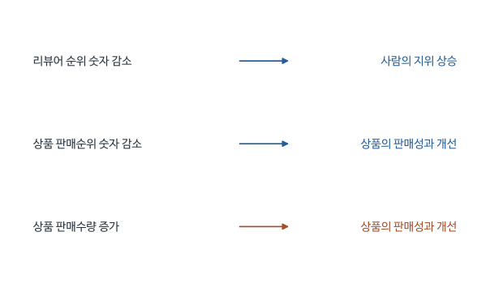

# Preaching to the Choir - 심층요약과 수식 해설

2026-12-02, Week 12 / Session 14. Elham Yazdani, Shyam Gopinath, Steve Carson (2018).

[원문 PDF](<Preaching to the choir (2018).pdf>) | [QnA](<Preaching to the choir (2018)_QnA.md>)


## 1. 상위 리뷰어에게 먼저 상품을 소개하는 전략은 타당한가

신제품을 알리려는 기업은 영향력 있는 리뷰어를 찾는다. 그러나 누가 실제 구매를 늘리는지는 직접 관찰하기 어렵다. 기업이 대신 보는 지표는 리뷰 작성량, 다른 이용자가 누른 도움 평가, 플랫폼이 부여한 리뷰어 순위다. Amazon의 상위 리뷰어 순위 역시 커뮤니티 활동과 평가를 반영한다. 이 지표로 영향력 있는 사람을 잘 골랐는지 확인하는 것이 Yazdani, Gopinath, Carson의 연구 목적이다.

상위 리뷰어가 더 설득력 있으리라는 예상에는 근거가 있다. 많은 상품을 평가한 경험과 플랫폼의 인정이 소비자에게 신뢰를 줄 수 있다. 그런데 일반 소비자는 상세한 전문가식 설명보다 자신과 취향이 비슷한 사람의 경험에 더 반응할 수도 있다. 상위 리뷰어가 동료 애호가에게 인정받는 글을 쓰더라도 대다수 구매자가 같은 글을 유용하게 느낀다고 보장되지는 않는다. 제목의 ‘Preaching to the Choir’는 이미 비슷한 생각을 가진 청중에게 설교한다는 표현으로, 이 영향 범위의 문제를 담는다.

저자들은 음악앨범을 선택했다. 음악은 듣기 전에는 취향에 맞을지 알기 어려운 경험재이고, 출시 직후 판매가 집중되므로 초기 리뷰의 역할을 관찰하기에 적합하다. 연구는 리뷰의 평균 별점이 판매에 미치는 영향이 작성자의 순위에 따라 달라지는지 묻는다. 그 뒤 제품이 막 출시되었거나 리뷰 의견이 서로 엇갈릴 때 상위 리뷰어의 역할이 커지는지도 조사한다.

논문은 대체로 일반 리뷰어의 평가가 판매와 더 강하게 연결되고, 상위 리뷰어의 영향은 초기 제품이나 평가가 엇갈리는 제품에서 커진다고 보고한다. 이 결과를 이해하려면 평점의 기울기를 하나로 고정한 회귀에서 벗어나, 누가 평가했는지에 따라 기울기가 달라지는 모형이 필요하다. 판매와 리뷰가 서로 영향을 주는 문제는 도구변수로 다룬다.

상위 리뷰어라는 표지는 소비자에게 두 가지 다른 의미를 줄 수 있다. 많은 평가를 쓰고 유용성을 인정받았다는 신호라면 더 믿을 만한 조언으로 받아들일 수 있다. 반면 전문가의 취향이 자기와 다르거나 기업의 판촉과 가까워 보인다면 일반 구매자의 경험을 더 참고할 수도 있다. 따라서 순위가 높다는 정보만으로 판매 영향력의 방향을 정할 수 없다. 실제 구매 자료에서 어떤 작성자의 평가에 소비자가 반응하는지 확인해야 한다.

제목의 ‘이미 동의하는 청중에게 설교한다’는 표현도 이 문제의식과 연결된다. 상위 리뷰어의 글이 풍부하고 전문적이어도 그 글을 읽는 사람이 이미 상품을 잘 알고 있다면 구매의 추가 변화는 작을 수 있다. 그렇다고 논문이 모든 독자의 기존 태도를 직접 관찰해 이 경로를 확정한 것은 아니다. 제목의 해석과 실증적으로 측정한 평점의 판매 반응을 구분하는 것이 필요하다.

기업에게 중요한 것은 누구에게 상품을 보내면 높은 별점을 받을지만이 아니다. 그 별점이 실제 잠재고객의 행동을 얼마나 바꾸는지까지 알아야 리뷰어 활용 예산을 판단할 수 있다. 논문은 이 의사결정과 관련된 관찰자료를 제공하지만, 기업의 접촉 정책을 무작위 배정해 수익률을 직접 계산한 실험은 아니다.

## 2. 앨범의 리뷰와 지역별 판매를 연결한 자료

일반 소비자에게 미친 영향을 보려면 플랫폼 안의 도움 투표만으로는 부족하다. 저자들은 Amazon 리뷰를 Nielsen의 실제 음악 판매와 연결했다. 이때 리뷰는 앨범에 붙지만 판매는 지역별로 집계된다. 같은 평점이 서로 다른 지역의 판매와 연결되는 자료 구조를 알아야 이후의 첨자와 통제변수가 이해된다.

주분석은 2014년 1월 21일부터 4월 15일까지 출시된 음악앨범 182개를 대상으로 한다. 출시 후 60일간 Amazon 리뷰와 가격을 수집하고 Nielsen의 지역별 판매자료와 연결한다. 판매는 Amazon에서만 일어난 판매가 아닌 DMA의 여러 온오프라인 채널 판매다. DMA는 TV 시청시장을 기준으로 나눈 미국의 지역 구분으로, 여기서는 앨범이 판매되는 지역 시장을 나타낸다.

| 첨자 | 뜻 | 예시 |
|---|---|---|
| i | 음악앨범 | 같은 앨범은 여러 지역에 팔림 |
| j | DMA 시장 | 미국 내 지역 시장 |
| t | 분석 시점 | 당시 판매와 이전까지의 리뷰를 연결 |
| it | 앨범과 시점에 따른 변수 | Amazon 누적 평점 |
| ijt | 앨범, 시장, 시점에 따른 변수 | 지역별 앨범 판매 |

리뷰 변수에는 j가 없다. 같은 앨범의 Amazon 평점은 여러 DMA 판매 관측에 공통으로 붙는다. 관측 수가 52,510개라는 것이 독립적인 평점 충격이 52,510개라는 뜻은 아니다. 실습에서 오차상관과 정보의 실제 변동 단위를 생각해야 하는 이유다.

수집은 일별이지만 이 PDF만으로 판매자료 병합 빈도, 결측 처리, 모든 전처리의 실행 세부를 확정할 수는 없다. 따라서 위 t를 무조건 완전한 일별 균형패널이라고 가정하지 않는다.

리뷰 정보는 앨범과 날짜에 따라 바뀌고 판매는 지역시장에 따라 다르게 관찰될 수 있다. 따라서 $i$가 같은 앨범이라도 $j$가 다른 두 관측은 같은 날의 리뷰 정보를 공유하면서 서로 다른 지역 소비자의 구매를 기록한다. 지역의 소득이나 인구구성이 다른 경우 같은 리뷰에 대한 반응이 다른지 물을 수 있는 구조다.

여기서 지역별 행이 많다는 이유만으로 리뷰의 독립적인 변화가 그 수만큼 생기는 것은 아니다. 같은 앨범의 동일한 리뷰 변화가 여러 시장에 공통으로 들어간다. 연구자가 어떤 수준에서 변이를 얻고 어떤 수준에서 결과를 반복 관찰하는지 구분하면, 앨범 고정효과와 지역특성 상호작용이 왜 등장하는지 이해할 수 있다. 추론을 재현할 때도 이 공유구조를 고려한 원문의 구현을 확인해야 한다.

판매기간보다 이전에 쌓인 리뷰를 사용하는 것은 소비자가 구매할 때 볼 수 있던 정보를 맞추려는 목적이 있다. 오늘 판매를 설명하면서 내일 올라온 리뷰를 포함하면 소비자가 아직 보지 못한 정보를 원인으로 취급하게 된다. 시점을 정렬하는 일은 기본적인 인과 순서를 맞추지만, 이후 절에서 보듯 지속적인 수요충격까지 제거하지는 않는다.

## 3. 비슷해 보이는 세 가지 rank를 구별하기

이 연구에서는 사람의 명성과 상품의 성과를 모두 순위로 표현하는 경우가 있다. 두 순위는 대상이 다르지만 숫자가 작을수록 좋다는 공통점이 있어 회귀 부호를 혼동하기 쉽다. 아래 세 변수를 한 번 정리해 두면 평점과 순위의 상호작용을 해석할 때 도움이 된다.

첫째, reviewer rank는 사람의 Amazon 순위다. 숫자가 작을수록 높은 지위다. 상위 1,000명과 그 밖을 나눈다. “bottom”은 가장 낮은 몇 명이 아니라 상위 1,000명 밖의 넓은 집단이다.

둘째, RANK_it는 그 상품 리뷰를 쓴 사람들의 평균 리뷰어 순위다. 숫자가 커지면 보통 순위가 낮은 리뷰어들이 작성한 리뷰의 비중이 커졌다는 방향으로 해석한다. 개인 한 명의 순위와 평균값은 다르다.

셋째, SALESRANK_it는 상품의 판매순위다. 이것도 작을수록 좋지만 사람의 명성과 무관한 결과변수다. 주분석 SALES는 판매수량이므로 클수록 좋다. 판매순위로 바꾼 강건성 분석에서는 계수 부호 해석을 뒤집어야 한다.

리뷰어 순위는 시간에 따라 바뀐다. 저자는 같은 과거 리뷰라도 그날 읽는 사람이 보게 되는 리뷰어 순위에 맞춰 정보를 갱신한다. 순위가 영구적인 개인 특성이라고 읽으면 데이터 생성과정을 놓친다.

숫자가 작은 순위가 더 높은 지위를 뜻한다는 점은 결과 해석 전체에 영향을 준다. 평균 리뷰어 순위의 숫자가 커질 때 평점의 효과가 커진다면 일반 리뷰어 쪽으로 구성이 바뀔수록 영향이 커진다는 방향이다. ‘순위가 올라갔다’라는 표현은 숫자가 커졌다는 뜻인지 지위가 좋아졌다는 뜻인지 모호하므로, 결과를 설명할 때는 어느 쪽인지 직접 말하는 편이 좋다.

상품 판매순위는 또 다른 변수다. 높은 평점이 판매수량을 늘리면 판매수량을 종속변수로 한 계수는 양수일 것으로 예상한다. 같은 변화가 판매순위의 숫자를 낮추면 순위를 종속변수로 한 계수는 음수가 될 수 있다. 두 표의 부호가 반대라고 해서 연구 결과가 모순되는 것은 아니다. 측정한 결과가 무엇이며 어느 방향이 더 좋은 성과인지 먼저 확인해야 한다.

리뷰어의 순위가 시간에 따라 바뀌면 같은 리뷰도 나중에 다른 지위의 작성자가 쓴 글처럼 보일 수 있다. 연구자가 리뷰 작성 당시 순위를 영원히 고정하면 소비자가 당시 화면에서 본 출처 정보와 어긋날 수 있다. 순위 갱신은 데이터 정리 절차이기에 앞서 소비자가 실제로 본 정보를 측정하는 문제다.

<!-- learning-figure:review-rank -->



*그림 설명: 본문의 변수 정의를 설명하는 도식이며 변수 사이의 실증적 관계를 그린 것은 아니다.*

리뷰어 순위는 사람의 지위를, 판매순위는 상품의 성과를 나타낸다. 두 변수 모두 숫자가 작아지는 것이 좋은 방향이지만 대상은 다르다. 판매수량은 숫자가 커지는 쪽이 좋은 성과다. 결과표의 부호를 비교하기 전에 세로축에 어느 변수가 놓였는지 확인한다.

<!-- /learning-figure -->

## 4. 평점, 수량, 분산을 기호로 써보기

소비자가 리뷰에서 얻는 정보에는 여러 종류가 있다. 평균 4점이라는 정보, 리뷰가 3개인지 300개인지, 모두 4점을 주었는지 1점과 5점으로 나뉘었는지는 서로 다른 판단 근거다. 평균만 회귀에 넣으면 평점이 높아진 효과와 리뷰가 많이 쌓이거나 의견이 일치한 효과를 섞을 수 있다. 저자들이 리뷰 수와 분산을 함께 사용하는 이유다.

t 직전까지 앨범 i에 쌓인 리뷰가 n개이고 별점이 r_1,...,r_n이라고 하자. 아래는 변수의 의미를 풀기 위한 표기다.

$$VOLCUM_{i,t-1}=n,$$

$$VALCUM_{i,t-1}=\bar r=\frac{1}{n}\sum_{k=1}^{n}r_k.$$

분산은 리뷰가 평균 주위에 얼마나 흩어졌는지다. 설명용 표본분산은 다음과 같다.

$$s_r^2=\frac{\sum_{k=1}^{n}(r_k-\bar r)^2}{n-1}.$$

Table 1의 VARCUM은 1+평점 분산으로 정의된다. 원자료의 정확한 분모 선택까지 위 설명용 정의로 확정하는 것은 아니다. 1을 더하면 모든 별점이 같아 분산이 0이어도 로그를 취할 수 있다.

예를 들어 [4,4,4]와 [3,4,5]의 평균은 모두 4다. 설명용 표본분산은 각각 0과 1이다. VARCUM을 1+분산으로 쓰면 각각 1과 2가 된다. 평균 평점이 같아도 두 번째 상품은 평가가 더 엇갈린다.

상위와 일반 리뷰어 평균은 각 집단 안에서 별점을 합하고 해당 집단 리뷰 수로 나눈다. 한 집단의 리뷰가 없는 날 평균을 어떻게 처리했는지는 추정자료와 코드 확인이 필요한 구현사항이다. 0점이라고 채우면 1-5점 척도 밖의 인위적인 값을 만드는 셈이다.

평균이 같은 두 상품이라도 평가가 엇갈리는 상품은 소비자에게 불확실성을 줄 수 있다. 어떤 사람에게는 훌륭하지만 다른 사람에게는 맞지 않는 취향상품일 수도 있고, 품질이 고르지 않을 수도 있다. 평균평점 하나만 넣으면 이런 정보 차이가 평점효과의 추정에 섞일 수 있다. 리뷰 수는 정보의 양을, 분산은 평가의 일치 정도를 나타내려는 별도의 변수다.

이 변수들이 서로 연관되어 있다는 것도 중요하다. 판매가 늘면 리뷰 수가 늘고, 새로운 소비자가 유입되면 평균평점과 분산도 바뀔 수 있다. 리뷰 수를 통제했다고 모든 리뷰 선택을 해결한 것은 아니다. 회귀에 함께 들어가는 변수의 역할과 그 변수들이 내생적일 수 있는 이유를 각각 설명해야 한다.

분산에 1을 더하는 조정은 로그를 정의하려는 수학적 목적이 있다. 평균평점은 원래 양수 척도이지만, 모든 평가가 같으면 분산은 0이 된다. 다만 이 조정 이후 로그분산 계수는 원래 분산 자체의 탄력성과 정확히 같은 뜻이 아니다. 어떤 변환을 했는지 알면 기호만 보고 효과 단위를 오해하는 일을 줄일 수 있다.

## 5. 첫 회귀식은 어떤 질문을 계산하는가

평균 별점이 1% 높아졌을 때 판매가 얼마나 변하는지만 추정하면 작성자 순위에 관한 연구 질문에 답할 수 없다. 순위가 높은 리뷰어들의 1% 변화와 일반 리뷰어들의 1% 변화가 다른 기울기를 갖도록 만들자. 이 목적에 사용하는 항이 평점과 리뷰어 순위를 곱한 상호작용항이다. 로그는 두 변수의 변화를 비율 단위로 비교하기 위해 사용한다.

원문 식 (1), p.842의 핵심만 쓰자. v=log(VALCUM), r=log(RANK), y=log(SALES)다.

$$y_{ijt}=\alpha_i+\beta_v v_{i,t-1}+\beta_r r_{i,t-1}
+\gamma v_{i,t-1}r_{i,t-1}+\text{다른 통제항}+\epsilon_{ijt}.$$

다른 통제항에는 리뷰 수, 분산, 가격, 상품 나이, helpfulness와 지역 인구특성이 있다. alpha_i는 앨범 고정효과다. 앨범마다 변하지 않는 매력, 장르 등의 수준 차이를 잡는다.

### 5.1 왜 상호작용을 곱하는가

r을 고정해 식을 묶으면 다음과 같다.

$$y=\alpha_i+\beta_r r+(\beta_v+\gamma r)v+\cdots.$$

따라서 평점 로그 v의 기울기는 beta_v+gamma r이다. 미분 기호로 쓰면,

$$\frac{\partial\log SALES}{\partial\log VALCUM}=\beta_v+\gamma\log RANK.$$

gamma>0이면 평균 리뷰어 순위 숫자가 클수록 평점의 판매 탄력성이 커진다. 순위 숫자가 크다는 것은 명성이 낮다는 방향이다. 이 때문에 양의 상호작용은 “상위 리뷰어가 더 강하다”와 반대 방향의 증거다.

### 5.2 실제 리뷰어 순위를 대입해 평점 효과 계산하기

Table 3의 IV 보정 열은 beta_v=-2.8027, gamma=0.3630이다. beta_v는 log RANK=0, 즉 RANK=1일 때의 평점 기울기다. 실제 표본의 평균 리뷰어 순위는 매우 큰 수다.

가상으로 RANK=1,000,000을 넣으면,

$$-2.8027+0.3630\log(1{,}000{,}000)=2.21233.$$

따라서 음의 주효과만 보고 높은 평점이 판매를 줄인다고 말할 수 없다. 이것은 논문 모형의 한 점에서 계산한 설명용 조건부 탄력성이지 표본 전체 평균효과가 아니다.

상호작용을 넣은 모형에서는 평점의 효과를 대표하는 숫자가 하나로 끝나지 않는다. $\beta_v$는 리뷰어 순위 로그가 0인 기준점에서의 기울기이며, 다른 순위에서는 $\gamma r$만큼 달라진다. 이 기준점이 실제 자료에서 흔하지 않다면 주효과의 부호만으로 평균적인 소비자 반응을 말하기 어렵다. 실제 의미 있는 순위에 값을 대입하는 것이 필요한 이유다.

예를 들어 어떤 출처에서는 평점이 높아져도 신뢰가 거의 바뀌지 않지만, 일반 소비자의 경험에서는 같은 평점 변화가 구매를 크게 바꿀 수 있다. 상호작용은 이런 차이를 표현할 공간을 만든다. 그러나 출처 구성이 변화한 이유도 판매와 관련될 수 있으므로, 상호작용을 만들었다는 사실만으로 이질적 효과가 인과적으로 식별되지는 않는다.

논문 표의 계수를 이용한 계산은 관측된 모형 안에서 조건부 반응을 읽는 연습이다. 특정 상품의 리뷰어 구성을 의도적으로 바꾸었을 때 같은 반응이 나올지 예측하려면 새 리뷰의 내용, 별점, 참여 선택이 함께 어떻게 달라질지도 알아야 한다. 통계적 조건부 비교와 기업이 실행하는 정책은 이 지점에서 차이가 난다.

### 5.3 순위의 기준점을 옮기면 음의 주효과가 왜 덜 낯설어지는가

평점 주효과가 -2.8027인 까닭을 좀 더 직접적으로 확인해 보자. $r=\log RANK$이고 $v=\log VALCUM$일 때 평점 관련 항은 $\beta_vv+\gamma vr$이다. 평균 리뷰어 순위가 1인 기준은 실제 비교에 별 도움이 되지 않을 수 있다. 교육용 기준점으로 $R_0=1{,}000{,}000$을 정하고 $r_c=\log(RANK/R_0)$로 바꾸자. 이것이 표본 평균이라는 가정은 하지 않는다.

$$
r=r_c+\log R_0.
$$

원래 식에 대입하면

$$
\begin{aligned}
\beta_vv+\beta_rr+\gamma vr
&=(\beta_r\log R_0)+(\beta_v+\gamma\log R_0)v\\
&\quad+\beta_rr_c+\gamma vr_c.
\end{aligned}
$$

상수는 절편에 들어가고, 새 평점 주효과는 $-2.8027+0.3630\log(1{,}000{,}000)\approx2.2123$이 된다. 식의 예측값은 하나도 바뀌지 않았다. 같은 모형의 기준점만 실제 해석하기 편한 위치로 옮겼다. 음의 주효과와 양의 조건부 효과 사이에는 모순이 없다.

이렇게 기준을 옮겨도 인과 문제가 해결되지는 않는다. 평점과 순위가 판매의 미관측 요인과 관련된다면 그대로 남는다. 또한 기준 순위가 두 배가 될 때 평점 탄력성이 얼마나 달라지는지는 $0.3630\log 2\approx0.2516$이다. 순위 숫자에 대한 로그를 썼으므로 순위를 한 칸 바꾸는 것과 두 배로 바꾸는 것을 구분해야 한다.

### 원문 Table 3 읽기: 상호작용 계수와 IV 보정 전후 비교

위에서 사용한 $\beta_v=-2.8027$과 $\gamma=0.3630$은 원문 Table 3에서 나온 값이다. 이 표는 식 (1)을 두 방식으로 추정한 결과를 나란히 보여 준다. 왼쪽 열은 도구변수 없이 고정효과 회귀로 추정한 값이고, 오른쪽 열은 7-9절에서 설명할 도구변수로 리뷰 변수를 보정한 값이다. 연구 질문에 답하는 핵심 행은 `RANK * VALCUM`이며, 나머지 행은 그 계수를 해석할 때 필요한 통제변수다. 두 열을 함께 보면 내생성 보정이 결과를 얼마나 바꾸는지도 확인할 수 있다.

**발췌: 원문 Table 3 "Does Reviewer Ranking Moderate the Effect of Review Valence on Sales?" (PDF 파일 기준 7쪽, 인쇄 p.844).** 지역 인구특성 3개 행(AFRICAN-AMERICAN, CAUCASIAN, YOUNG)은 생략했다. 괄호 안은 표준오차이며, 별표는 원문 표기 그대로 옮겼다.

| 변수 (주효과는 로그, 상호작용은 로그 변수의 곱) | 보정 없음 | 내생성 보정 (IV) |
|---|---|---|
| `VALCUM` ($\beta_v$) | −2.2578*** (0.9034) | −2.8027** (1.3020) |
| `RANK` | −0.0832 (0.108) | −0.6791*** (0.2043) |
| `RANK * VALCUM` ($\gamma$) | 0.1264** (0.0685) | 0.3630*** (0.0921) |
| `VOLCUM` | 0.0242 (0.0341) | −0.0147 (0.0703) |
| `VARCUM` | 0.0606** (0.0290) | 3.3345*** (0.7213) |
| `PRICE` | −0.2590*** (0.0754) | −0.2434*** (0.0996) |
| `AGE` | −0.9153*** (0.0487) | −1.0118*** (0.0431) |
| `HELPFUL` | 0.1803*** (0.0237) | 0.2120*** (0.0341) |
| 관측 수 | 52,510 | 52,510 |
| Within $R^2$ | 0.5649 | 0.6137 |
| 앨범 고정효과 | Yes | Yes |

원문 주석: 종속변수는 DMA 단위 판매의 로그, $^{**}p<0.05$, $^{***}p<0.01$, 고정효과 추정치는 보고하지 않음.

표는 세로로 읽는다. 각 칸은 해당 변수의 로그가 1만큼 변할 때 로그 판매가 얼마나 변하는지를 나타내며, 괄호 속 숫자는 계수가 아니라 그 계수의 표준오차다. 모든 행이 같은 회귀의 계수이므로 한 칸만 떼어 해석하지 않는다. 특히 `VALCUM`과 `RANK`는 상호작용항과 함께 들어 있어서, 두 행의 값은 상대 변수의 로그가 0일 때의 기울기라는 조건부 의미만 가진다.

IV 열의 핵심 수치를 계산해 보자. 평점 탄력성은 $-2.8027+0.3630\log RANK$다. 원문 Table 1(PDF 5쪽)에 보고된 평균 리뷰어 순위의 최솟값 2,611.929를 넣으면 $-2.8027+0.3630\times7.868\approx0.05$로 거의 0이다. 평균값 4,778,003을 넣으면 $-2.8027+0.3630\times15.380\approx2.78$이고, 최댓값 1.48e+07을 넣으면 약 3.19다. 평균 리뷰어 순위 숫자가 작은 앨범일수록 평점의 판매 탄력성이 0에 가깝고, 평균 순위 숫자가 큰 앨범일수록 탄력성이 커진다는 것이 이 표의 핵심 메시지다. 평균값을 대입한 계산은 로그의 평균이 아니라 평균의 로그를 쓴 근사이고, 원문이 자연로그를 썼다는 가정도 들어 있다.

같은 방식으로 `RANK`의 기울기도 평점 수준에 따라 달라진다. Table 1의 평균 평점 4.5345를 대입하면 $-0.6791+0.3630\log4.5345\approx-0.13$이다. 평점이 평균 수준일 때 평균 리뷰어 순위 숫자가 커지는 쪽, 이동과 판매가 약간 음의 관계라는 뜻이며 이 역시 설명용 계산이다.

두 열의 차이도 중요하다. 상호작용 계수는 0.1264에서 0.3630으로 약 2.9배가 되었고, `VARCUM`은 0.0606에서 3.3345로 크게 바뀌었다. 저자들은 이 차이를 내생성 보정이 필요하다는 근거로 제시한다(원문 p.843). 다만 두 열의 차이만으로 어느 쪽이 참값에 가까운지 증명되지는 않는다. IV 열은 8절에서 논의한 도구의 배제제약이 성립할 때에만 더 믿을 만하다. 또 `VARCUM` 계수가 50배 이상 커졌다는 사실만으로 변화의 원인을 특정할 수는 없다. 경제적 크기를 판단하려면 9.4절에서 설명한 도구의 강도와 모형 가정도 함께 확인해야 한다.

이 표에서 말할 수 있는 것은 평균 리뷰어 순위 숫자가 클수록, 평점과 판매의 연관이 강해진다는 방향이다. 평균 순위만으로 상위 1,000명 리뷰어의 비중을 알 수는 없다. 상위 리뷰어 한 명을 일반 리뷰어로 바꾸었을 때의 판매 변화나 두 집단 계수의 직접 비교는 이 표만으로 말할 수 없다. 그 비교는 11절의 Table 5가 다룬다.

원문의 유의성 표기 가운데 표준오차와 맞지 않아 보이는 칸이 있다. 보정 없음 열의 `VALCUM`은 $t\approx2.50$인데 ***로, `RANK * VALCUM`은 $t\approx1.85$인데 **로 표시되어 있고, IV 열의 `PRICE`도 $t\approx2.44$인데 ***다. 정규근사 기준으로는 각각 한 단계씩 약한 유의수준에 해당한다. 원문 표기를 고치지 않고 그대로 옮겼으며, 이런 칸은 별표보다 계수와 표준오차의 비율을 직접 확인하는 편이 안전하다. IV 열의 핵심 두 칸($\beta_v$: $t\approx2.15$, $\gamma$: $t\approx3.94$)은 표기와 일치한다.

## 6. 평점의 비율 변화와 판매의 비율 변화

단순한 log Y=b log V 관계에서 V가 4에서 4.4로 증가하면 10% 변화다.

$$\Delta\log Y=b\log(4.4/4)=b\log(1.1).$$

원래 단위의 판매량 비율은 양변에 exp를 취한다.

$$\frac{Y_{new}}{Y_{old}}=\exp[b\log(1.1)]=1.1^b.$$

가상으로 b=1.243을 사용하면 1.1^1.243-1=12.58%다. 작은 변화에서는 b×10%=12.43%가 근사다. 별점 1점 증가나 판매량 1.243개 증가가 아니다.

이 계산은 Table 5의 계수를 이용한 탄력성 교육 예시다. Table 5에는 인구특성 상호작용도 있으므로 1.243을 모든 시장의 동일한 총효과로 해석하면 안 된다. 실제 예측에는 해당 시장의 상호작용까지 합쳐야 한다.

별점은 1점부터 5점까지 제한된 척도이므로 로그탄력성을 모든 크기의 변화에 기계적으로 적용할 수 없다. 4점에서 4.4점으로 바꾸는 예는 척도 안에 있지만 이미 5점인 상품에서 10% 더 높이는 변화는 불가능하다. 모형이 쓰인 자료 범위 안에서 의미 있는 변화를 선택해야 한다.

비율 변화와 점수 변화도 구별된다. 3점에서 4점은 1점 증가이지만 비율로는 약 33.3%이고, 4점에서 5점 역시 1점 증가지만 비율로는 25%다. 로그평점의 계수가 일정한 모형이라면 같은 1점이라도 시작값에 따라 예측 판매 변화가 다르다. 이런 계산이 어려울 때는 먼저 변경 전후의 평점을 적고 그 비율을 구하면 단위가 분명해진다.

실제 모형에서는 리뷰어 순위나 지역특성이 달라지면 사용할 탄력성도 달라진다. 모든 시장에 주효과 하나를 대입하기보다 먼저 해당 시장의 전체 기울기를 계산한 뒤 평점의 변화량을 적용한다. 상호작용이 있는 회귀를 읽는 절차는 그 순서로 이어진다.

## 7. 왜 OLS와 고정효과만으로 부족한가

위의 상호작용을 OLS, 즉 관측값과 회귀 예측값의 제곱오차를 최소화하는 방법으로 추정하면 자료의 상관관계를 얻는다. 이 기울기를 리뷰의 인과효과로 해석하려면 평점 변화와 함께 판매를 바꾼 다른 요인이 없는지도 따져야 한다. 음악시장에서 이러한 요인을 모두 관측하기는 어렵다.

앨범의 고정된 인기는 alpha_i에 담을 수 있다. 하지만 라디오 방송, TV 노출, 오프라인 입소문은 시점별로 달라진다. 이들이 판매와 리뷰 활동을 함께 바꾸면 설명변수와 오차가 관련된다.

통제항을 제거한 단순식 y=beta v+u에서 OLS 기울기는 다음과 같다.

$$\hat\beta_{OLS}=\frac{\sum v y}{\sum v^2}
=\beta+\frac{\sum v u}{\sum v^2}.$$

첫 등식은 평균과 통제항을 제거한 변수 기준이다. 두 번째는 y 자리에 beta v+u를 넣고 분자를 분리한 대수다. v와 u가 함께 움직이면 마지막 항이 사라지지 않는다.

리뷰를 t-1로 지연시켜도 이 문제는 남는다. 어제 방송된 노래가 오늘도 인기를 얻으면 어제 리뷰와 오늘 오차가 관련될 수 있다. 시간 순서를 정하는 것과 외생성을 확보하는 것은 다르다.

앨범의 인기는 고정적인 부분과 시간에 따라 달라지는 부분을 함께 가진다. 장르나 이미 알려진 가수라는 특성은 앨범 절편이 일부 조정한다. 반면 방송 출연이나 인기곡의 확산은 판매와 리뷰 활동을 같은 시기에 높일 수 있다. 이 변화는 같은 앨범 안에서도 일어나므로 고정효과를 넣고 남는 변동에 포함된다.

역인과도 가능하다. 리뷰가 구매를 늘리는 한편 구매가 늘어서 리뷰가 많이 작성될 수 있다. 하루 전 리뷰를 사용하는 것은 오늘 판매가 어제 리뷰를 직접 발생시키는 순서를 피하지만, 며칠간 지속된 인기는 어제 리뷰와 오늘 판매를 동시에 설명한다. 지연변수를 사용한 이유와 그 방법으로 해결되지 않는 문제를 함께 이해해야 한다.

따라서 IV는 모든 리뷰 변화를 사용하던 비교에서 도구와 연결된 리뷰 변화로 초점을 좁히려는 시도다. 어떤 변동을 버리고 어떤 변동을 이용하는지 알면 최종계수가 OLS와 달라졌을 때도 단순히 ‘보정되어 정확해졌다’고 결론 내리지 않고 도구의 가정을 평가할 수 있다.

## 8. 도구변수는 어디서 오는가

저자들이 필요한 것은 앨범의 인기와는 별개로 리뷰 활동이나 평가를 변화시키는 요인이다. 그런 요인을 도구변수라고 부른다. 예를 들어 원래 별점을 후하게 주는 리뷰어가 참여하면 음악의 실제 품질이 같아도 평균 평점이 달라질 수 있다. 다음 표는 이 논리가 어떤 변수로 구현되었고, 어느 지점에서 추가 가정이 필요한지 정리한다.

| 내생변수 | 원문 도구변수 아이디어 | 관련성 논리 | 배제제약 위험 |
|---|---|---|---|
| 리뷰 수 | 기간 중 강수량이 중앙값보다 높은 날 수 | 실내에 머물며 리뷰를 쓸 시간 증가 | 날씨가 구매와 채널선택도 직접 바꿀 수 있음 |
| 평균 평점 | 같은 리뷰어가 음악 외 상품에 준 누적 평균 별점 | 후하거나 엄격하게 매기는 성향 | 취향과 선택한 앨범 수요가 함께 관련될 수 있음 |
| 평점 분산 | 음악 외 상품에 준 누적 별점의 분산 | 리뷰어 평가성향의 흩어짐 | 리뷰어 구성의 선택과 미관측 수요가 연결될 수 있음 |
| 상위/일반 평점 | 해당 집단 리뷰어의 다른 카테고리 평점 | 집단별 평가성향 | 집단별 선택이 독립적이어야 함 |

원문 p.842-844는 이 조건들을 식별가정으로 설명한다. “음악 외 상품”이라는 이유만으로 배제제약이 논리적으로 증명되는 것은 아니다. 어떤 조건변수 하에서 날씨와 평가성향의 변이가 수요오차와 독립적인지 설득해야 한다.

음악 외 상품의 평점은 리뷰어가 전반적으로 얼마나 후하게 점수를 주는지에 관한 정보를 제공한다. 같은 음악 품질에서도 후한 평가자가 참여하면 음악 평균평점이 높아질 수 있다는 것이 관련성 논리다. 하지만 후한 리뷰어가 어떤 앨범에 참여했는지 자체가 우연인지까지 별도로 설명해야 한다. 특정 취향집단의 수요가 늘어 그 집단의 리뷰어가 참여했다면 평가성향과 미관측 수요가 연결될 수 있다.

날씨 도구에서도 ‘사람은 비가 오면 실내에서 리뷰를 쓴다’는 이야기는 첫 단계의 일부다. 날씨가 음악 구매의 시점이나 온라인 채널 사용을 바꾸면 결과로 직접 연결되는 경로가 생길 수 있다. 날씨 측정의 지역과 판매시장의 연결, 포함한 시간통제, 수요변화의 가능성을 검토해야 배제제약을 평가할 수 있다.

도구가 심리적 또는 자연적인 변수라는 이유만으로 외생적인 것은 아니다. 이 연구의 조건 아래 그 변수의 변화가 왜 수요오차와 관련되지 않는지를 따지는 질문이다. 반론을 제시하는 목적은 결과가 어떤 근거에 의존하는지 구체적으로 이해하는 데 있다. 모든 도구를 무효라고 단정하려는 것이 아니다.

## 9. IV 비율식에서 2SLS까지 한 단계씩

도구변수의 역할은 평점에 들어 있는 변동 중 도구가 설명하는 부분으로 비교 범위를 좁히는 것이다. 도구 때문에 평점이 얼마나 변했는지와 같은 도구 때문에 판매가 얼마나 변했는지를 계산하면, 전자의 한 단위 변화에 대응하는 후자의 변화를 얻는다. 먼저 내생변수가 하나일 때의 비율을 유도한 뒤 여러 변수에 적용하는 2단계 최소제곱법으로 확장한다.

### 9.1 도구 하나, 내생변수 하나의 출발점

통제변수와 고정효과를 제거한 변수로 다음 구조를 생각한다.

$$y=\beta v+u.$$

양변에 도구 z와의 공분산을 취한다. 공분산의 선형성을 이용하면,

$$Cov(z,y)=\beta Cov(z,v)+Cov(z,u).$$

배제제약 및 외생성이 Cov(z,u)=0을 허용한다. 관련성이 Cov(z,v)≠0을 허용한다. 그때만 나눌 수 있다.

$$\beta_{IV}=\frac{Cov(z,y)}{Cov(z,v)}.$$

이 식은 도구가 만들어낸 평점 변동 대비 판매 변동의 비율이다. 원문은 여러 내생변수와 도구를 사용하므로 실제 추정은 이 단순 비율 하나로 끝나지 않는다.

### 9.2 도구가 설명하는 리뷰 변수의 변화를 추정하기

첫 단계의 종속변수는 내생적인 리뷰 변수다. 예를 들면,

$$v_{it}=\pi_0+\pi_1z^{weather}_{it}+\pi_2z^{rating}_{it}
+\pi_3z^{variance}_{it}+X_{it}'\pi_x+\alpha_i+\eta_{it}.$$

모든 포함된 외생변수와 도구를 함께 사용해 v의 예측값을 만든다. 리뷰 수, 평점, 분산 각각에 첫 단계가 필요하다. 한 도구가 자기 변수에만 들어간다는 뜻은 아니다.

둘째 단계는 y를 이 예측된 내생변수 성분과 외생 통제변수로 설명한다. 표준오차는 첫 단계 추정의 영향을 반영하는 정식 IV 절차로 계산한다. 수동으로 예측값을 저장한 뒤 보통 OLS 표준오차를 쓰면 추론이 틀릴 수 있다.

### 9.3 숫자로 원리를 확인하기

다음은 논문의 추정치가 아닌 가상 예다. 다른 조건을 맞춘 뒤 도구가 높은 집단은 낮은 집단보다 log 평점이 0.02 높고 log 판매가 0.03 높다고 하자.

$$\hat\beta_{IV}=0.03/0.02=1.5.$$

도구가 평점을 통해서만 판매에 영향을 준다면 이 비율을 평점 탄력성으로 읽을 수 있다. 날씨가 직접 구매를 0.01만큼 추가로 늘렸다면 분자 0.03에는 그 경로가 섞인다. 비율을 계산할 수 있다는 사실이 올바른 식별을 보장하지 않는다.

두 단계라는 이름 때문에 먼저 평점을 예측한 뒤 그 예측값을 실제 관측평점처럼 사용하면 된다고 생각하기 쉽다. 계수 계산의 직관은 그렇게 볼 수 있지만, 불확실성 계산은 실제 구조식의 오차와 도구의 정보를 사용해야 한다. 첫 단계 예측을 완전히 확정된 데이터처럼 다루는 보통 회귀 표준오차는 정식 IV의 추론과 같지 않다.

여러 내생변수가 있으면 도구들이 각 변수를 구별할 충분한 변이를 제공해야 한다. 비가 리뷰 수와 평점 모두를 똑같은 비율로만 움직이고 다른 도구도 같은 방향만 제공한다면 두 효과를 따로 알아내기 어려울 수 있다. 관련성이 있다는 말이 내생변수 각각의 별도 영향을 충분히 식별한다는 뜻은 아니다. 이것이 다변수 IV에서 도구 행렬과 순위조건이 필요한 이유다.

비율의 분모가 아주 작으면 작은 자료 변화에도 추정치가 크게 달라진다. 도구가 리뷰를 거의 바꾸지 않았는데 판매 변화만 나누면 큰 계수가 생길 수 있다. 첫 단계와 축약형을 함께 읽는 습관은 큰 효과를 곧바로 강한 경제적 영향력으로 해석하는 일을 막는다.

### 9.4 관련성이 약하면 작은 배제제약 위반도 왜 크게 증폭되는가

도구가 평점을 잘 예측하는지와 도구가 판매에 직접 영향을 주지 않는지는 별개의 질문이다. 그 차이를 단일 도구 교육용 모형으로 확인하자. 통제변수와 고정효과를 제거한 판매 로그를 $y$, 평점 로그를 $x$, 도구를 $z$라 두고, 도구의 직접경로까지 허용하면

$$
y=\beta x+\rho z+u.
$$

$\operatorname{Cov}(z,u)=0$이라 해도 $\rho\ne0$이면 배제제약은 성립하지 않는다. 양변과 $z$의 공분산을 계산한 뒤 첫 단계 공분산으로 나누면

$$
\frac{\operatorname{Cov}(z,y)}{\operatorname{Cov}(z,x)}
=\beta+\rho\frac{\operatorname{Var}(z)}{\operatorname{Cov}(z,x)}.
$$

첫 단계가 $x=\pi z+v$이고 $\operatorname{Cov}(z,v)=0$이면 $\operatorname{Cov}(z,x)=\pi\operatorname{Var}(z)$이므로 오른쪽의 추가항은 $\rho/\pi$다. 같은 작은 직접효과라도 도구가 내생변수를 움직이는 힘 $\pi$가 작을수록 추정값의 왜곡은 커진다.

가상으로 진짜 평점효과가 1, 직접경로가 .02일 때 첫 단계 .20이면 IV 비율은 1.10, 첫 단계 .02이면 2가 된다. 이것은 원문의 도구가 이만큼 편향되었다는 계산이 아니다. 관련성과 배제제약을 왜 함께 검토하는지 설명한 예다. 비가 리뷰 작성을 늘린다는 이야기가 성립해도, 비가 쇼핑이나 음악 청취 자체를 바꾼다면 직접경로를 별도로 검토해야 한다.

실제 논문은 여러 내생변수와 도구를 사용하므로 위 단일 비율을 전체 2SLS 추정량으로 대체하지 않는다. 첫 단계가 유의하다는 사실만으로 배제제약이 증명되지는 않고, 외생성이 설득력 있다는 이야기만으로 충분한 예측력이 생기지도 않는다. 두 조건이 각각 회귀의 어느 부분을 담당하는지 보여 주는 계산이다.

## 10. 상호작용도 내생적일 수 있다

v가 내생적이면 v×r도 대체로 내생적이다. r이 외생적이어도 곱의 내생성은 자동으로 없어지지 않는다. 일반적인 IV 설계에서는 z와 함께 z×r 같은 추가 도구를 고려하며, 곱에 대한 적절한 조건부 외생성과 식별 순위조건이 필요하다.

이것은 방법론적 해설이다. 보관 PDF의 첫 단계 표는 기본 리뷰 변수들을 보여주지만 모든 상호작용의 도구화, 도구 행렬과 진단 통계까지 완전히 공개하지 않는다. 따라서 이 문서가 저자의 정확한 상호작용 구현을 확인한 것처럼 적지 않는다.

Table 2, 4의 첫 단계 유의성은 관련성에 대한 증거다. 개별 도구 계수의 별표나 높은 R-squared만으로 여러 내생변수의 약한 식별 문제를 끝낼 수 없다. 포함된 고정효과가 R-squared를 높일 수도 있다.

평점과 순위의 곱은 평점이 바뀌면 함께 바뀐다. 따라서 평점이 미관측 수요와 관련된다면 그 곱도 관련될 수 있다. 원래 변수만 도구화하고 곱은 외생변수처럼 남기면, 인과적으로 해석하려는 순위별 기울기에 내생성이 남을 수 있다. 곱항이 많아질수록 어떤 열을 내생적으로 취급했는지 명시할 필요가 커진다.

재현코드가 없을 때에는 논문이 공개한 결과와 교육용으로 생각할 수 있는 구현을 구분해야 한다. 이 요약의 일반적인 곱도구 설명은 올바른 IV 설계에 필요한 질문을 보여준다. 저자가 정확히 어떤 모든 도구를 사용했다는 사실의 대체물이 아니다. 구현 정보가 부족한 부분은 남겨 두는 편이, 그럴듯한 명령을 만들어 원문 재현이라고 부르는 것보다 정확하다.

## 11. 상위와 일반 리뷰어를 직접 분리한 모형

평균 리뷰어 순위는 한 상품에 참여한 사람들의 구성을 한 숫자로 요약한다. 상위 리뷰어의 평가와 일반 리뷰어의 평가가 따로 달라지는 상황을 더 직접적으로 분석하려면 집단별 평균 평점을 각각 넣는 편이 자연스럽다. 원문은 이 모형에서 지역 소비자의 인구특성에 따라 두 집단 평점의 영향이 달라지도록 허용한다.

식 (2), Table 5는 상위 평점 v_T와 일반 평점 v_B를 따로 넣는다.

$$\log SALES=\cdots+\gamma_T v_T+\gamma_B v_B
+v_T\lambda'W_j+v_B\delta'W_j+u.$$

따라서 시장 j에서의 기울기는 gamma_T+lambda'W_j와 gamma_B+delta'W_j다. 둘의 차이를 보려면 해당 시장값에서 두 식을 비교한다.

Table 5의 주효과는 상위 0.0861(표준오차 0.2621), 일반 1.243(0.2131)이다. 상위 계수의 표준오차가 커서 0과 구별하기 어렵다는 결과다. 두 집단의 영향력 차이를 직접 검정하려면 계수 차이의 표준오차가 필요하며, 여기에 두 추정치의 공분산도 들어간다.

Table 6은 종속변수를 판매순위로 바꾸고 카메라에도 적용한다. 일반 리뷰어 계수는 음악 -1.6141, 카메라 -0.5738이다. 음수는 판매순위 숫자가 작아져 판매가 좋아지는 방향이다. 일반화 범위를 넓히는 증거지만 모든 상품시장으로의 보증은 아니다.

상위 집단의 계수가 유의하지 않다는 것은 자료와 모형에서 0과 명확히 구분할 정도로 정밀하게 추정되지 않았다는 뜻이다. 상위 리뷰어가 언제나 판매에 영향이 전혀 없다는 결론은 아니다. 특히 지역별 상호작용이 있으면 주효과 하나가 모든 시장의 기울기도 아니다. 반응이 어느 조건에서 달라지는지 다음 분석을 이어서 봐야 한다.

두 계수의 차이를 판단할 때도 각각의 별표만 비교해서는 안 된다. 한 계수는 5%에서 유의하고 다른 계수는 그렇지 않더라도 두 추정치의 차이는 불확실할 수 있다. 같은 회귀에서 두 계수가 함께 추정되므로 공분산도 차이의 불확실성에 영향을 준다. 연구의 메시지는 집단별 추정 크기와 이질성, 관련 검정의 범위를 함께 근거로 설명해야 한다.

카메라 자료에서도 비슷한 방향을 확인하는 것은 음악 취향만의 특수한 결과일 가능성을 줄인다. 그래도 소비자가 사용성, 안전성, 전문지식을 다르게 평가하는 모든 카테고리로 자동 일반화되지는 않는다. 두 시장의 결과가 같다는 증거와 시장 전체에 관한 보편 법칙은 범위가 다르다.

### 원문 Table 5 읽기: 두 리뷰어 집단의 평점을 따로 넣은 결과

Table 3은 평균 리뷰어 순위라는 연속 요약값으로 방향을 보여 주었다. 그러나 "상위 1,000명의 평점과 그 밖의 평점 가운데 어느 쪽이 판매와 더 강하게 연결되는가"라는 질문에는 두 집단의 평점을 각각 넣은 식 (2)가 더 직접적이다. 위에서 인용한 0.0861과 1.243이 이 표의 값이다. 이 모형도 IV로 추정했으며, 첫 단계 결과는 원문 Table 4에 따로 있다.

**발췌: 원문 Table 5 "Impact of Top- and Bottom-Ranked Reviewers on Sales" (PDF 파일 기준 9쪽, 인쇄 p.846).** 평점 관련 행과 주요 통제변수만 옮기고 인구특성 주효과 3개 행은 생략했다. 괄호 안은 표준오차다.

| 변수 (Model 2, 종속변수 log(SALES)) | 계수 (표준오차) |
|---|---|
| `VALCUM_TOPRANK` ($\gamma_T$) | 0.0861 (0.2621) |
| `VALCUM_BOTMRANK` ($\gamma_B$) | 1.243*** (0.2131) |
| `VALCUM_TOPRANK * AFRICAN-AMERICAN` | −0.0199 (0.0223) |
| `VALCUM_TOPRANK * CAUCASIAN` | 0.1127 (0.1322) |
| `VALCUM_TOPRANK * YOUNG` | 0.2119** (0.0915) |
| `VALCUM_BOTMRANK * AFRICAN-AMERICAN` | 0.1396** (0.0578) |
| `VALCUM_BOTMRANK * CAUCASIAN` | 0.6346*** (0.2030) |
| `VALCUM_BOTMRANK * YOUNG` | 0.8076*** (0.3149) |
| `RANK` | 0.1151*** (0.0253) |
| `VOLCUM` | 0.0812*** (0.0311) |
| `VARCUM` | 0.0577** (0.0281) |
| `PRICE` | −0.7715*** (0.1043) |
| `AGE` | −1.0485*** (0.0291) |
| `HELPFUL` | 0.1815*** (0.0331) |
| 관측 수 / Within $R^2$ | 52,510 / 0.6187 |

원문 주석: 종속변수는 DMA 단위 판매, 앨범 고정효과 포함, $^{**}p<0.05$, $^{***}p<0.01$.

위 두 행은 인구특성 상호작용이 0인 기준에서의 평점 탄력성이다. 일반 리뷰어 평균 평점이 1% 높아지면 해당 DMA의 앨범 판매가 약 1.24% 늘어나는 방향이고, 상위 리뷰어 평균 평점의 같은 변화는 약 0.09%에 그친다. 두 값은 판매수량의 비율 변화이며 별점 1점당 판매 개수가 아니다. 통계적 정밀도도 크게 다르다. $t$값이 상위 집단은 $0.0861/0.2621\approx0.33$, 일반 집단은 $1.243/0.2131\approx5.83$이다.

두 계수의 차이 1.157이 유의한지는 원문이 보고하지 않는다. 설명을 위해 두 추정치의 공분산이 0이라고 가정하면 차이의 표준오차는 $\sqrt{0.2621^2+0.2131^2}\approx0.338$이고 $z\approx3.4$가 된다. 실제 공분산을 알 수 없으므로 이 숫자는 차이 검정의 계산 구조를 보여 주는 예시일 뿐이다. 다만 차이의 표준오차는 두 표준오차의 합인 0.4752보다 클 수 없다. 가장 보수적으로 계산해도 정규근사 통계량은 약 2.43이므로, 보고된 표준오차를 신뢰한다면 이 기준 조건에서 두 계수의 차이는 5% 수준에서 구별된다. 정확한 p값은 공분산 없이는 계산할 수 없다.

아래 여섯 행은 지역 특성에 따라 기울기가 달라지는 정도다. 일반 리뷰어 평점은 세 인구특성 모두와 양의 상호작용을 보이고, 상위 리뷰어 평점은 젊은 인구 비중(YOUNG)과의 상호작용만 5%에서 유의하다. 이 표의 상호작용 변수가 식 (2)처럼 로그 연속값인지, Table 7처럼 중앙값 더미인지는 원문 서술만으로 분명하지 않다. 중앙값 분할 설명(p.846-847)은 식 (4) 뒤에 나오기 때문이다. 따라서 특정 시장의 전체 기울기를 이 표의 값을 더해 계산하는 것은 변수 정의를 확인한 뒤에만 가능하다.

이 표로 말할 수 있는 것은 상호작용 변수가 0인 기준 조건에서 일반 리뷰어의 평점이 판매와 더 강하고 정밀하게 연결된다는 점이다. 상위 리뷰어 평점의 영향이 0이라는 결론이나, 상위 리뷰어의 평점을 기업이 바꾸었을 때의 판매 효과는 이 표로 말할 수 없다. 참고로 `VALCUM_BOTMRANK * YOUNG`은 $t\approx2.56$으로 1% 기준값 2.576에 근소하게 못 미치는데도 ***로 표기되어 있으며, 원문 표기를 그대로 두었다.

## 12. 신제품과 의견이 엇갈리는 상품에서는 반응이 다른가

제품을 처음 접한 소비자는 참고할 경험이 적다. 기존 리뷰들이 서로 상반된 평가를 내릴 때도 누구의 말을 믿어야 할지 판단하기 어렵다. 이런 상황에서는 상위 리뷰어라는 지위가 유용할 수 있다. 저자들은 제품의 나이와 평점 분산에 따라 평점 효과가 달라지는지 조사해 이 설명을 살펴본다.

원문 식 (4)는 로그 연속변수들의 상호작용처럼 적혀 있다. 그러나 p.846-847의 추정 설명은 인구특성, 내용변수, 분산, 나이를 중앙값 기준 더미로 나눈 뒤 평점과 상호작용한다고 명시한다. 따라서 Table 7의 AGE 상호작용은 나이가 많은 집단과 적은 집단 사이의 평점 기울기 차이에 해당한다.

설명용으로 H_age=1(나이가 중앙값 초과)라 정의하자. 일반 리뷰어 부분은 다음과 같다.

$$y=\cdots+b_Bv_B+d_BH_{age}v_B.$$

H_age=0일 때 탄력성은 b_B, H_age=1일 때는 b_B+d_B다. Table 7의 일반 리뷰어 나이 상호작용은 0.4132이므로 더 오래된 집단에서 탄력성이 그만큼 더 큰 방향이다. 상위 리뷰어는 -0.2345여서 더 오래된 집단에서 작아지는 방향이다.

분산이 큰 집단의 추가 탄력성은 상위 0.5908, 일반 -1.0378이다. 의견이 엇갈릴 때 상위 리뷰어의 평점이 상대적으로 더 중요한 방향이다. 기본 계수에 다른 활성화된 상호작용도 모두 더해야 전체 기울기를 얻는다.

출시 초기에는 소비자가 참고할 다른 경험이 적으므로 상세한 상위 리뷰의 정보가 더 유용할 수 있다. 오래된 상품에는 일반 고객의 사용경험이 충분히 쌓여 소비자가 자기와 비슷한 구매자의 평가를 더 참고할 수 있다. 의견이 크게 엇갈릴 때에는 어떤 평가가 믿을 만한지 판단하는 데 전문성 신호가 도움을 줄 가능성이 있다. 이런 논리는 평균적인 일반 리뷰어 우위와 일부 조건에서 상위 리뷰어의 상대적 중요성이 함께 나타날 수 있음을 설명한다.

중앙값 더미를 사용하는 구현에서는 ‘상품이 하루 더 오래될 때 평점효과가 얼마 변한다’고 해석하면 안 된다. 나이가 중앙값보다 높은 집단과 낮은 집단의 기울기 차이를 추정한 것이다. 평균평점의 로그는 연속형이어도 그 기울기를 바꾸는 나이 지표는 두 집단이다. 원문에 제시된 수식 모양과 실제 추정 설명을 함께 확인해야 하는 이유다.

이질성은 메커니즘과 맞는 증거지만 유일한 설명은 아닐 수 있다. 신제품과 오래된 제품은 소비자 구성이나 광고활동도 다를 수 있다. 따라서 이 결과는 언제 상위 리뷰어 정보가 더 중요할 수 있는지를 좁혀 주지만, 전문성에 대한 신뢰만이 그 차이를 만들었다고 확정하지는 않는다.

### 원문 Table 7 읽기: 제품 나이와 평점 분산에 따른 기울기 변화

위 0.4132, −0.2345, 0.5908, −1.0378은 모두 원문 Table 7에서 나온 값이다. 이 표는 식 (4)의 추정 결과로, 계수 행이 36개에 이르고 인쇄본에서도 두 단으로 나뉘어 있다. 여기서는 두 집단의 평점 주효과와 이 절의 질문인 나이 및 분산 상호작용만 발췌한다. 13절에서 다루는 내용변수의 주효과도 참고용으로 함께 옮겼다.

**발췌: 원문 Table 7 "Impact of Review Content, Lack of Review Consensus, and Product Age on Sales" 및 "Table 7. (Continued)" (PDF 파일 기준 11쪽, 인쇄 p.848).** 인구특성, 내용변수와 평점의 상호작용, 통제변수 행은 생략했다. 괄호 안은 표준오차다.

| 변수 (Model 4, 종속변수 log(SALES)) | 계수 (표준오차) | 읽는 법 |
|---|---|---|
| `VALCUM_TOPRANK` | 0.0891 (0.0903) | 모든 더미가 0인 기준집단의 상위 평점 탄력성 |
| `VALCUM_BOTMRANK` | 2.9567*** (0.5105) | 같은 기준집단의 일반 평점 탄력성 |
| `AGE * VALCUM_TOPRANK` | −0.2345*** (0.0462) | 나이 중앙값 초과 시 상위 탄력성 변화 |
| `AGE * VALCUM_BOTMRANK` | 0.4132*** (0.0811) | 나이 중앙값 초과 시 일반 탄력성 변화 |
| `VARCUM * VALCUM_TOPRANK` | 0.5908* (0.2700) | 분산 중앙값 초과 시 상위 탄력성 변화 |
| `VARCUM * VALCUM_BOTMRANK` | −1.0378*** (0.4802) | 분산 중앙값 초과 시 일반 탄력성 변화 |
| `WORD COUNT` | −0.8645*** (0.3650) | 내용변수 주효과 (13절 참고) |
| `SOCIAL` | 1.6905*** (0.6801) | 〃 |
| `AFFECT` | 3.9765*** (0.6716) | 〃 |
| `INFORMAL` | 1.2956*** (0.4052) | 〃 |
| `PUNCTUATION` | −0.6104*** (0.1843) | 〃 |
| 관측 수 / Within $R^2$ | 52,510 / 0.5871 | |

원문 주석: 종속변수는 DMA 단위 판매, 앨범 고정효과 포함, $^{*}p<0.1$, $^{**}p<0.05$, $^{***}p<0.01$. 세 번째 열의 "읽는 법"은 원문에 없고 이 요약이 덧붙인 설명이다.

원문 p.847은 상호작용 변수를 중앙값 기준 더미로 만든 뒤 평점과 곱했으므로, 상호작용 계수는 해당 더미가 1일 때 평점 탄력성이 얼마나 이동하는지를 뜻한다고 설명한다. 따라서 나이와 분산 두 더미만 바꾸고 나머지 더미는 모두 0으로 둔 네 집단의 탄력성을 단순 합으로 계산할 수 있다.

| 집단 (다른 더미는 모두 0) | 상위 평점 탄력성 | 일반 평점 탄력성 |
|---|---|---|
| 신제품, 합의 높음 | 0.0891 | 2.9567 |
| 오래된 제품, 합의 높음 | $0.0891-0.2345=-0.1454$ | $2.9567+0.4132=3.3699$ |
| 신제품, 분산 높음 | $0.0891+0.5908=0.6799$ | $2.9567-1.0378=1.9189$ |
| 오래된 제품, 분산 높음 | $0.0891-0.2345+0.5908=0.4454$ | $2.9567+0.4132-1.0378=2.3321$ |

*표 설명: 원문 Table 7의 계수로 이 요약이 계산한 값이며 원문에 있는 표가 아니다. 각 합의 표준오차는 공분산이 보고되지 않아 계산할 수 없다.*

이 계산에서 두 가지를 읽을 수 있다. 첫째, 상위 리뷰어의 탄력성은 평점이 엇갈리는 신제품 집단에서 가장 크다(0.6799). 이는 신제품이나 합의가 부족한 상품에서 상위 리뷰어의 역할이 커진다는 원문 결론과 방향이 같다. 둘째, 그 집단에서도 일반 리뷰어의 탄력성(1.9189)이 여전히 더 크다. "상위 리뷰어가 더 중요해진다"는 원문 표현은 상위 리뷰어의 기울기가 다른 조건보다 커진다는 상대적 변화로 읽어야 하며, 일반 리뷰어를 앞지른다는 뜻으로 읽을 근거는 이 표에 없다.

여러 가지를 주의해야 한다. 기준집단은 인구특성과 내용 더미까지 모두 0인 조합이라 실제 표본에서 흔한 조합인지 알 수 없다. Table 5의 일반 리뷰어 주효과 1.243과 Table 7의 2.9567은 모형과 기준집단이 달라 직접 비교하지 않는다. 오래된 제품에서 상위 리뷰어 탄력성이 음수(−0.1454)로 계산되지만, 합의 표준오차를 모르므로 음의 효과라고 단정하지 않는다.

유의성 표기에도 확인할 점이 있다. `VARCUM * VALCUM_BOTMRANK`는 $t\approx2.16$인데 ***로, `VARCUM * VALCUM_TOPRANK`는 $t\approx2.19$인데 *로 표시되어 있다. 비슷한 $t$값에 서로 다른 별표가 붙은 셈이다. 발췌하지 않은 행 가운데 `PRICE`(−0.5236, 표준오차 0.1131, $t\approx4.6$)는 **로 표기되어 반대 방향의 불일치가 있다. 원문 표기는 그대로 두었고, 계수와 표준오차로 정규근사를 하면 분산 상호작용 두 칸 모두 대략 5% 수준에 해당한다. 원문 검정 방법을 확인하지 못했으므로 별표를 새로 고치지는 않는다. 나이 상호작용 두 칸($t\approx5.1$, $5.1$)은 표기와 일치하므로 이 절의 결론 가운데 제품 나이에 관한 부분이 더 견고하다.

### 12.1 일반 리뷰어 수가 많으면 집단별 평점도 더 안정적인가

상위 리뷰어와 일반 리뷰어의 평점을 분리할 때 집단별 리뷰 수는 평균이 얼마나 흔들리는지와도 관련된다. 설명용으로 각 리뷰가 같은 잠재 평균 $\mu$에 독립적인 오차 $e_k$를 더한 값이고 오차분산이 $\sigma^2$라고 가정하자.

$$
r_k=\mu+e_k,\qquad \bar r=\mu+\frac1n\sum_{k=1}^ne_k.
$$

독립성 때문에 서로 다른 오차의 공분산은 0이므로

$$
\operatorname{Var}(\bar r-\mu)
=\frac1{n^2}\sum_{k=1}^n\operatorname{Var}(e_k)
=\frac{\sigma^2}{n}.
$$

리뷰 4개와 100개로 만든 평균은 같은 4점이어도 이런 가정 아래 표준편차가 5배 다르다. 이 계산은 소비자가 어느 집단을 더 신뢰해야 한다는 규범적 결론이 아니다. 집단별 평균의 자료상 안정성이 다를 수 있다는 설명이다. 리뷰가 서로 영향을 주거나 같은 취향의 사람이 몰려 독립성이 깨지면 $1/n$만큼 빠르게 불확실성이 줄지 않는다.

신제품은 집단별 리뷰 수가 적고 구성도 빨리 바뀔 수 있다. 원문이 제품 나이와 평점 분산에 따른 반응 차이를 살피는 결과를 읽을 때, 평균점수라는 한 숫자 뒤에 정보량과 작성자 선택이 함께 존재한다는 점을 기억해야 한다. 상위 리뷰어 계수가 유의하지 않다는 사실만으로 소비자가 상위 리뷰어를 전혀 읽지 않는다고 단정할 수 없는 이유도 있다. 실제 반응의 크기와 추정의 불확실성이 함께 보고된다.

위 분산 계산은 원문의 오차모형을 재현한 것이 아니다. 또한 일반 리뷰어의 계수가 큰 결과를 측정오차 하나로 설명했다는 주장도 아니다. 집단별 계수 비교에서 리뷰 수, 평균의 변동, 표준오차와 경제적 해석을 왜 따로 확인하는지 이해하기 위한 보충이다.

## 13. 내용과 정체성은 어디까지 분리했는가

상위 리뷰어와 일반 리뷰어의 효과가 다른 이유는 작성자의 이름과 순위 때문일 수도 있고, 실제 글의 내용 때문일 수도 있다. 긴 분석문과 짧은 사용기는 소비자가 받아들이는 방식이 다르다. 내용의 차이를 자료에 넣어 본 뒤에도 집단 차이가 유지되는지 확인하면 두 설명을 조금 더 구체적으로 평가할 수 있다.

저자는 글의 단어를 사전의 의미 범주와 대조해 특성을 수치화하는 텍스트 분석 프로그램인 LIWC를 사용해 단어 수, 감정적 표현, 사회적 표현, 비격식성, 구두점을 측정한다. Table 8에서 상위 리뷰어 글의 평균 단어 수는 333.77, 일반은 93.91이다. 평균 별점은 각각 4.47과 4.52로 비슷하다.

내용변수와 그 상호작용을 추가해도 집단별 차이가 남는다는 것은 내용뿐 아니라 출처도 중요하다는 해석을 지지한다. 그러나 배지를 무작위로 붙였다 떼는 실험이 아니다. 관측하지 못한 내용의 질, 리뷰어 선택, 소비자와의 유사성 등이 남을 수 있다.

따라서 “배지를 제거하면 매출이 몇 % 오른다”라는 정책효과를 이 회귀에서 직접 읽지 않는다. 어떤 리뷰어를 골라 어떤 내용을 쓰게 할지에 대한 완전한 인과적 처방도 아직 아니다.

텍스트 길이가 세 배 이상 다르다는 결과는 작성자 집단이 내용에서도 다르다는 점을 보여준다. 출처만 다르고 글은 완전히 동일한 실험이었다면 이런 차이를 걱정하지 않아도 되지만, 여기서는 실제 작성자가 선택한 글을 관찰한다. 내용특성을 통제하는 목적은 상위 순위의 효과라고 부른 차이가 단순히 긴 글이나 특정 문체의 효과인지 점검하는 데 있다.

LIWC 범주가 글의 모든 의미를 측정하지는 않는다. 같은 단어 수와 감정어 비중이어도 구체적인 비교 설명, 음악에 대한 지식, 소비자 취향과의 관련성이 다를 수 있다. 관측한 텍스트 특성 뒤에도 집단차이가 남았다는 결과는 출처 설명을 지지하지만 모든 내용 차이를 완전히 제거했다는 증명은 아니다.

같은 글에 다른 리뷰어 배지를 붙여 무작위로 보여주는 실험은 이와 다른 처치를 분석한다. 그 실험이라면 출처 표시만 바꾼 효과를 더 직접적으로 물을 수 있다. 현재 논문은 실제 리뷰어 구성과 평가가 바뀌는 자료에서 판매 반응을 추정하므로, 결과를 배지정책의 확정적 효과로 옮기지 않는 것이 적절하다.

## 14. 실습 설계: 무엇을 먼저 확인해야 하는가

Session 14의 IV 실습에서는 다음을 먼저 명확히 한다.

1. 판매가 어떤 기간과 시장에서 측정되며 리뷰 변수가 어느 시점 정보인지 확인한다.
2. 상위 집단과 일반 집단 평점의 결측, 0값, 시간변동 순위를 처리한다.
3. 원문처럼 VARCUM에 1을 더하는지, 다른 0값 로그 변수는 어떻게 처리했는지 구분한다.
4. 앨범 고정효과, 도구, 외생변수 및 모든 내생 상호작용 목록을 만든다.
5. 첫 단계 관련성, 배제제약의 대안 경로, 추론의 군집 수준을 검토한다.
6. 조건부 탄력성과 집단 간 차이를 직접 계산한다.

교육용 모형은 아래와 같이 쓸 수 있다. 원문 실행코드도, 검증된 재현 명령도 아니다. ln_ 접두 변수와 z_ 변수는 이미 적절히 구성되어 있다고 가정한다.

```stata
ivregress 2sls ln_sales ln_price ln_age i.album_id ///
    (ln_valence = z_other_category_rating), vce(cluster album_id)
estat firststage
```

이 코드는 내생변수 하나를 설명하는 축소 예시다. 실제 논문은 리뷰 수와 분산, 두 리뷰어 집단, 상호작용, 시장변수가 더 있다. 따라서 이 축소 모형의 결과와 Table 5는 직접 일치하지 않는다. 원문의 전체 도구화 구현과 표준오차 방식은 원자료/코드로 추가 확인해야 한다.

실습 결과표에는 계수뿐 아니라 어떤 시장과 순위값에서 계산한 효과인지 함께 적으면 해석이 명확해진다. 평점 주효과가 음수여도 현실적인 순위값에서 전체 기울기가 양수일 수 있고, 판매순위를 결과로 쓰면 좋은 성과가 음의 계수로 나타날 수 있다. 이 두 혼동을 먼저 해결해야 IV 옵션이나 표준오차 명령을 확인하는 일이 경제적 의미와 연결된다.

원자료가 없으면 코드가 실행될 것처럼 변수처리 규칙을 임의로 확정하지 않는다. 집단 리뷰가 없는 날, 로그를 취할 수 없는 값, 리뷰어 순위의 갱신 시점은 결과를 바꿀 수 있는 구현 선택이다. 요약은 원문이 밝힌 정의와 추가 확인할 부분을 구분하고, 실습코드는 그 범위에 맞는 축소 예시로 사용한다.

## 15. 기업이 리뷰어 순위를 활용할 때 무엇을 더 알아야 하나

이 논문은 리뷰어 순위를 기업의 추천 대상 명단으로 바로 바꾸기 전에 판매 반응을 확인할 이유를 제시한다. 상위 리뷰어의 평점이 평균적으로 덜 관련되어 있더라도, 출시 초기나 소비자 평가가 엇갈리는 상황에서는 정보 제공 역할이 커질 수 있다. 제품의 상태와 소비자의 정보 부족을 함께 고려해야 하는 이유다.

실제로 기업이 리뷰어에게 상품을 보내는 정책의 효과를 예측하려면 어떤 리뷰어가 참여하고 어떤 글을 쓸지까지 알아야 한다. 여기의 회귀는 관측된 평점 변화에 대한 판매 반응을 추정한다. 리뷰어에게 연락하는 정책이나 배지를 바꾸는 정책을 직접 실험한 결과는 없으므로 그 정책의 수익성에는 추가 근거가 필요하다. 다음 호텔 논문은 소비자에게 보이는 평점이 달라졌을 때 기업이 광고예산을 어떻게 조정하는지 다룬다.

기업이 이 연구를 근거로 상위 리뷰어와의 관계를 모두 중단하는 것은 추정한 질문보다 큰 정책변화다. 상위 리뷰어가 참여하면 글의 길이, 게시 시점, 소비자 접근경로도 달라질 수 있다. 현재의 평점변화에 대한 판매 반응과 새로 접촉할 리뷰어의 정책효과를 연결하려면 이 변화를 추가로 조사해야 한다.

보다 직접적인 활용은 제품이 어느 정보환경에 놓였는지 진단하는 것이다. 출시 초기인지, 리뷰가 충분히 쌓였는지, 소비자의 의견이 엇갈리는지에 따라 상위와 일반 리뷰어 평가의 역할을 다르게 예상하고 후속 실험을 설계할 수 있다. 이 해석은 논문이 보여 준 조건부 패턴을 살리면서 관찰자료만으로 확정하지 못한 정책효과를 구분한다.

## 출처와 계산에 관한 메모

보관 PDF 15쪽의 전체 텍스트를 확인했다. 인쇄 p.838-851의 본문, 표, 참고문헌과 마지막 저작권 안내가 포함된다. 중요한 상호작용 설명은 p.847 이미지로 대조했다. 원자료와 저자 추정코드는 없으므로 회귀를 재현하지 않았다. 본문 수식의 중간 유도와 가상 숫자는 이해를 돕기 위한 추가 설명이다.
