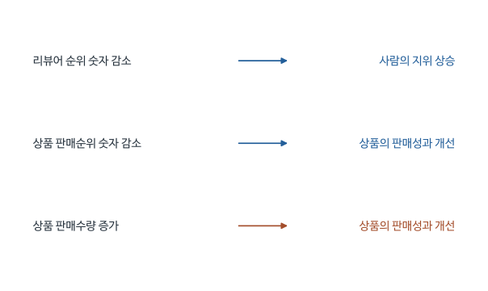

# Preaching to the Choir - 심층요약과 수식 해설

2026-12-02, Week 12 / Session 14. Elham Yazdani, Shyam Gopinath, Steve Carson (2018).

[원문 PDF](<Preaching to the choir (2018).pdf>) | [개념 퀴즈](<Preaching to the choir (2018)_QnA.md>) | [수식·모델 퀴즈](<Preaching to the choir (2018)_수식모델퀴즈.md>) | [실무 Cheat Sheet](<Preaching to the choir (2018)_실무CheatSheet.md>)


## 1. 상위 리뷰어에게 먼저 상품을 소개하는 전략은 타당한가

신제품을 알리려는 기업은 영향력 있는 리뷰어를 찾는다. 그러나 누가 실제 구매를 늘리는지는 직접 관찰하기 어렵다. 그래서 마케터는 작성한 콘텐츠의 양과 다른 이용자의 반응(도움 평가, 팔로워, 구독자 수)을 영향력의 대리지표로 삼는다. Amazon은 이 판단을 돕는 리뷰어 순위를 공개한다. 순위 산정 알고리즘은 공개되지 않았지만 올린 리뷰의 양과 최근성 등을 반영한다고 알려져 있고, 상위 1,000위 안의 리뷰어에게는 배지가 붙는다(원문 p.838). 이 순위로 영향력 있는 사람을 제대로 고를 수 있는지 확인하는 것이 Yazdani, Gopinath, Carson의 연구 목적이다.

상위 리뷰어가 더 설득력 있으리라는 예상에는 근거가 있다. 많은 상품을 평가한 경험과 플랫폼의 인정은 지켜야 할 평판이 있는 사람이라는 신호가 되고, 출처의 신뢰성이 설득을 돕는다는 연구도 많다(p.841). 저자들은 반대 방향의 이유도 직접 든다. 소비자는 일부 상위 리뷰어가 Amazon Vine 같은 프로그램이나 제조사에게서 무료 상품을 받고 리뷰를 쓴다는 사실을 알고 있다. 여러 카테고리에 걸쳐 방대한 양의 리뷰를 쓰는 사람이 특정 카테고리를 깊이 안다고 보기도 어렵다. 잘 쓴 긴 글은 작성자가 보통 소비자와 다른 집단이라는 표지가 될 수도 있다. 이처럼 이론이 양쪽 방향을 모두 예측하므로, 순위가 높다는 정보만으로 판매 영향력의 방향을 정할 수 없고 실제 구매 자료로 확인해야 하는 문제가 된다.

제목의 'Preaching to the Choir'는 이미 같은 생각을 하는 청중에게 설교한다는 영어 관용구로, 마지막 우려를 담는다. 상위 리뷰어의 글이 동료 애호가에게 인정받더라도 대다수 구매자의 결정은 바꾸지 못할 수 있다는 뜻이다. 다만 논문이 독자의 기존 태도를 직접 관찰해 이 경로를 확인한 것은 아니므로, 제목이 주는 해석과 실제로 측정한 평점의 판매 반응은 구분해 읽는다.

저자들은 음악앨범을 선택했다. 음악은 들어 보기 전에는 취향에 맞을지 알기 어려운 경험재이고, 출시 직후 판매가 집중되므로 초기 리뷰의 역할을 관찰하기에 적합하다. 연구는 리뷰의 평균 별점이 판매에 미치는 영향이 작성자의 순위에 따라 달라지는지 묻는다. 그 뒤 제품이 막 출시되었거나 리뷰 의견이 서로 엇갈릴 때 상위 리뷰어의 역할이 커지는지도 조사한다. 저자들이 이 두 상황을 미리 지목한 이유는 p.840에 있다. 출시 직후에는 제품에 관한 불확실성이 커서 신뢰 신호의 가치가 높고, 읽을 리뷰가 몇 개 없어 작성자의 순위를 확인하기도 쉽다. 의견이 엇갈릴 때에는 상충하는 평가를 가려낼 기준이 필요하므로 소비자가 순위라는 신호에 기댈 것이다. 반대로 의견이 일치할 때에는 보통 소비자와 닮은(homophily) 일반 리뷰어의 평가가 더 영향력 있으리라고 예상한다.

논문은 대체로 일반 리뷰어의 평가가 판매와 더 강하게 연결되고, 상위 리뷰어의 영향은 초기 제품이나 평가가 엇갈리는 제품에서 커진다고 보고한다. 이 결과를 이해하려면 평점의 기울기를 하나로 고정한 회귀에서 벗어나, 누가 평가했는지에 따라 기울기가 달라지는 모형이 필요하다(5절, 11절). 판매와 리뷰가 서로 영향을 주는 문제는 도구변수(instrumental variable)로 다룬다(7-10절).

기업이 알아야 할 것은 누구에게 상품을 보내면 높은 별점을 받는지에 그치지 않는다. 그 별점이 실제 잠재고객의 행동을 얼마나 바꾸는지까지 알아야 리뷰어 활용 예산을 판단할 수 있다. 논문은 이 의사결정과 관련된 관찰자료를 제공하지만, 기업의 접촉 정책을 무작위로 배정해 수익률을 직접 계산한 실험은 아니다.

## 2. 앨범의 리뷰와 지역별 판매를 연결한 자료

일반 소비자에게 미친 영향을 보려면 플랫폼 안의 도움 투표만으로는 부족하다. 도움 투표는 리뷰를 읽은 이용자의 반응일 뿐, 그 리뷰가 구매로 이어졌는지는 알려 주지 않는다. 저자들은 Amazon 리뷰를 Nielsen의 실제 음악 판매와 연결했다. 이때 리뷰는 앨범에 붙지만 판매는 지역별로 집계된다. 같은 평점이 서로 다른 지역의 판매와 연결되는 이 구조를 알아야 이후의 첨자와 통제변수(control variable)를 이해할 수 있다.

주분석은 2014년 1월 21일부터 4월 15일까지 출시된 음악앨범 182개 전부를 대상으로 한다. 출시일은 Metacritic에서 확인했다. 앨범마다 출시 후 60일간 Amazon의 가격, 리뷰 수, 각 리뷰의 별점, 작성자의 순위, 도움 투표 수, 리뷰 전문을 수집하고 Nielsen의 지역별 판매자료와 연결한다. 판매량은 Amazon을 포함해 DMA 안의 모든 온라인, 오프라인 채널 판매를 합한 값이다. DMA(Designated Market Area)는 TV 시청권을 기준으로 나눈 미국의 지역 구분으로, 여기서는 앨범이 판매되는 지역 시장을 나타낸다.

| 첨자 | 뜻 | 예시 |
|---|---|---|
| i | 음악앨범 | 같은 앨범은 여러 지역에 팔림 |
| j | DMA 시장 | 미국 내 지역 시장 |
| t | 분석 시점 | 당시 판매와 이전까지의 리뷰를 연결 |
| it | 앨범과 시점에 따른 변수 | Amazon 누적 평점 |
| ijt | 앨범, 시장, 시점에 따른 변수 | 지역별 앨범 판매 |

리뷰 변수에는 $j$가 없다. 같은 앨범의 Amazon 평점은 여러 DMA 판매 관측에 공통으로 붙는다. 관측 수 52,510개가 서로 독립적인 평점 변화 52,510개를 뜻하지는 않는다. 어떤 앨범의 평균평점이 어느 날 바뀌면 그 변화는 그 앨범이 관측된 모든 DMA의 행에 똑같이 복사된다. 판매 행이 많아도 리뷰 정보의 독립적인 변동은 앨범과 날짜 수준에서만 생긴다. 실습에서 오차의 상관과 표준오차(standard error)의 군집 수준을 정할 때 이 구조가 출발점이 된다.

같은 구조 덕분에 가능한 비교도 있다. $i$가 같은 앨범이라도 $j$가 다른 두 관측은 같은 날의 리뷰 정보를 공유하면서 서로 다른 지역 소비자의 구매를 기록한다. 그래서 지역의 인구구성이 다를 때 같은 리뷰에 대한 반응이 다른지 물을 수 있다. 저자들이 흑인 비율, 백인 비율, 34세 미만 인구 비율을 통제하고 11절 모형에서 이 비율과 평점의 상호작용까지 넣는 이유다. 앨범 고정효과(fixed effects)는 앨범 사이의 수준 차이를, 지역 인구특성은 같은 평점을 받아들이는 소비자 구성의 차이를 담당한다.

리뷰는 일별로 수집했지만, 이 PDF만으로 판매자료의 병합 빈도, 결측 처리, 전처리의 세부를 확정할 수는 없다. 원문 Table 1(p.842)의 숫자 몇 개가 단서를 준다. 182개 앨범을 60일씩 추적하면 앨범-일은 $182\times60=10{,}920$개다. 52,510행은 앨범당 약 288.5행이고, 판매를 일 단위로 병합했다면 앨범-일당 평균 4.8개 시장만 관측된 셈이다. 모든 앨범이 매일 모든 시장에서 관측된 균형패널은 아니라는 뜻이다. DMA 판매의 최솟값이 1이라는 점도 눈여겨볼 만하다. 로그판매를 종속변수(dependent variable)로 쓰면 판매가 0인 행은 정의되지 않으므로, 판매가 양수인 시장-날짜만 표본에 남았을 가능성이 크다. 그렇다면 추정치는 "그날 그 시장에서 한 장 이상 팔린 경우"를 조건으로 한 반응이다. 앨범 나이(AGE)의 최솟값이 5일, 누적 리뷰 수(VOLCUM)의 최솟값이 2라는 점도 리뷰가 어느 정도 쌓인 뒤부터 표본이 시작되었음을 시사한다. 원문은 이 선택 과정을 설명하지 않으므로 여기서는 가능성으로만 적는다.

판매기간보다 이전에 쌓인 리뷰만 쓰는 것은 소비자가 구매할 때 볼 수 있던 정보에 맞추기 위해서다. 저자들은 선행연구를 따라 $t$기 직전까지 게시된 리뷰가 $t$기 판매에 영향을 준다고 가정한다(p.841). 오늘 판매를 설명하면서 내일 올라온 리뷰를 포함하면 소비자가 아직 보지 못한 정보를 원인으로 취급하게 된다. 시점 정렬은 이런 기본적인 순서를 맞추지만, 7절에서 보듯 며칠씩 이어지는 수요충격까지 제거하지는 못한다.

## 3. 비슷해 보이는 세 가지 rank를 구별하기

이 연구는 사람의 명성과 상품의 성과를 모두 순위로 표현한다. 두 순위는 대상이 다르지만 숫자가 작을수록 좋다는 공통점이 있어 회귀 부호를 혼동하기 쉽다. 저자들은 리뷰어 순위도, 판매순위도 뒤집지 않고 원래 숫자 그대로 쓴다고 밝혔다(p.841, p.844). 아래 세 변수를 먼저 정리해 두면 평점과 순위의 상호작용을 해석하기 쉽다.

첫째, reviewer rank는 개별 리뷰어의 Amazon 순위다. 숫자가 작을수록 높은 지위다. 저자들은 상위 1,000명과 그 밖을 나눈다. "bottom"은 가장 낮은 몇 명이 아니라 1,000위 밖의 모든 리뷰어를 묶은 넓은 집단이다.

둘째, $RANK_{it}$는 앨범 $i$에 리뷰를 쓴 사람들의 리뷰어 순위를 평균한 값이다. 숫자가 커지면 대체로 순위가 낮은 리뷰어 쪽으로 작성자 구성이 기울었다는 뜻이다. 개인 한 명의 순위와 이 평균값은 다르다. Table 1에서 평균은 약 478만, 최솟값은 2,611.929, 최댓값은 약 1,480만이다.

셋째, $SALESRANK_{it}$는 상품의 Amazon 판매순위다. 이것도 작을수록 좋지만 사람의 명성과 무관한 결과변수다. 주분석의 SALES는 판매수량이므로 클수록 좋다. 판매순위로 바꾼 강건성 분석(11절의 Table 6)에서는 계수 부호 해석을 뒤집어야 한다.

리뷰어 순위는 시간에 따라 바뀐다. 저자들은 각 리뷰어의 Amazon 순위를 매일 추적해, 같은 리뷰라도 그날 읽는 사람이 보게 되는 순위로 정보를 갱신했다(p.841). 리뷰 작성 당시의 순위를 영구히 고정하면 소비자가 그날 화면에서 본 출처 정보와 어긋나기 때문이다. $RANK_{it}$도 새 리뷰가 올라오거나 기존 작성자의 순위가 바뀌면 함께 갱신된다. 순위 갱신은 데이터 정리 절차이기 전에 소비자가 실제로 본 정보를 측정하는 문제다.

숫자가 작은 순위가 더 높은 지위를 뜻한다는 점은 결과 해석 전체에 영향을 준다. 평균 리뷰어 순위의 숫자가 커질 때 평점의 효과가 커진다면, 일반 리뷰어 쪽으로 구성이 바뀔수록 평점의 영향이 커진다는 방향이다. '순위가 올라갔다'는 표현은 숫자가 커졌다는 뜻인지 지위가 좋아졌다는 뜻인지 모호하다. 이 문서는 "순위 숫자가 커졌다", "지위가 높아졌다"처럼 어느 쪽인지 밝혀 적는다.

상품 판매순위도 같은 주의가 필요하다. 높은 평점이 판매수량을 늘린다면 판매수량을 종속변수로 한 계수는 양수일 것이다. 같은 변화가 판매순위의 숫자를 낮추면 순위를 종속변수로 한 계수는 음수가 된다. 두 표의 부호가 반대여도 결과가 모순되는 것은 아니며, 무엇을 측정했고 어느 방향이 좋은 성과인지 먼저 확인하면 된다.

<!-- learning-figure:review-rank -->



*그림 설명: 본문의 변수 정의를 설명하는 도식이며 변수 사이의 실증적 관계를 그린 것은 아니다.*

리뷰어 순위는 사람의 지위를, 판매순위는 상품의 성과를 나타낸다. 두 변수 모두 숫자가 작아지는 것이 좋은 방향이지만 대상은 다르다. 판매수량은 숫자가 커지는 쪽이 좋은 성과다. 결과표의 부호를 비교하기 전에 세로축에 어느 변수가 놓였는지 확인한다.

<!-- /learning-figure -->

### 3.1 소비자는 화면에서 어떤 순위 정보를 보는가

순위가 판매에 영향을 준다는 주장은 소비자가 그 순위를 본다는 전제 위에 서 있다. 원문 p.840은 표시 방식을 이렇게 설명한다. 모든 리뷰어의 순위는 프로필 페이지에 표시되고, 상위 1,000명은 배지로 구별된다. 배지가 없는 리뷰어의 순위는 프로필을 클릭해 들어가야만 볼 수 있다. 리뷰 목록을 훑는 소비자가 손쉽게 알아보는 정보는 결국 "배지가 있는가"라는 두 범주에 가깝다.

이 표시 방식을 알면 두 모형이 비교하는 대상이 서로 다르다는 점이 드러난다. 식 (1)의 $RANK_{it}$는 배지 여부와 관계없이 모든 작성자의 순위 숫자를 평균한다. 그 평균이 수백만 단위라는 것은 이 값이 주로 배지 없는 리뷰어들의 순위 숫자로 정해진다는 뜻이다. 다음 가상 예로 확인해 보자. 교육용 계산이며 원문 자료가 아니다.

| 가상 앨범의 작성자 순위 | 평균 RANK | 기준 대비 $\log RANK$ 변화 |
|---|---|---|
| 500(배지), 2,000,000, 8,000,000 | 3,333,500 | 기준 |
| 배지 리뷰어를 1,500위 무배지 리뷰어로 교체 | 3,333,833 | 약 +0.0001 |
| 8,000,000위 리뷰어를 800,000위 리뷰어로 교체 | 933,500 | 약 -1.27 |

첫 번째 교체는 소비자가 보는 배지를 없애지만 평균 RANK는 거의 움직이지 않는다. 두 번째 교체는 화면의 배지에 아무 변화가 없는데도 $\log RANK$를 1.27만큼 낮춘다. 5절의 Table 3 계수 $\gamma=0.3630$을 적용하면 모형은 이 두 번째 변화만으로 평점 탄력성(elasticity)이 약 0.46 줄어든다고 계산한다. 식 (1)의 상호작용은 "배지를 본 소비자의 반응"보다는 작성자 구성 전반을 요약한 값과 평점 기울기의 관계를 측정하는 셈이다. 원문도 이 상호작용을 상품 리뷰를 쓴 리뷰어들의 순위 구성(ranking profile)이 평점의 영향을 어떻게 바꾸는지 보는 항으로 설명한다(p.841).

식 (2)가 상위 1,000명과 나머지를 나눈 것은 배지라는 표시 기준과 일치한다. 그래서 "배지를 단 사람의 평점과 배지 없는 사람의 평점 가운데 어느 쪽에 판매가 더 반응하는가"라는 질문에는 11절의 Table 5가 더 가깝다. 그래도 이 비교에서 달라지는 것은 배지만이 아니다. 두 집단은 글의 길이와 문체, 리뷰하는 상품의 폭, 무료 상품 수령 여부까지 다르고, 이 차이가 모두 집단별 계수에 함께 들어간다. 13절은 이 가운데 글의 내용을 측정해 떼어 내려는 시도다. 또 순위가 매일 갱신되므로 어떤 리뷰어가 1,000위 경계를 넘나들면 새 리뷰 없이도 두 집단의 평균이 바뀔 수 있다. 원문은 이런 경우가 얼마나 있었는지 보고하지 않는다.

## 4. 평점, 수량, 분산을 기호로 써보기

소비자가 리뷰에서 얻는 정보에는 여러 종류가 있다. 평균 4점이라는 정보, 리뷰가 3개인지 300개인지, 모두 4점을 주었는지 1점과 5점으로 나뉘었는지는 서로 다른 판단 근거다. 평균만 회귀에 넣으면 평점이 높아진 효과와 리뷰가 많이 쌓이거나 의견이 일치한 효과가 섞일 수 있다. 저자들이 리뷰 수와 분산을 함께 쓰는 이유다. 온라인 구전 연구에서 이 셋은 volume, valence, variance라는 이름으로 가장 흔히 쓰이는 측정치다(p.839).

$t$ 직전까지 앨범 $i$에 쌓인 리뷰가 $n$개이고 별점이 $r_1,\dots,r_n$이라고 하자. 아래는 변수의 의미를 풀기 위한 표기다.

$$VOLCUM_{i,t-1}=n,$$

$$VALCUM_{i,t-1}=\bar r=\frac{1}{n}\sum_{k=1}^{n}r_k.$$

분산은 리뷰가 평균 주위에 얼마나 흩어졌는지다. 설명용 표본분산은 다음과 같다.

$$s_r^2=\frac{\sum_{k=1}^{n}(r_k-\bar r)^2}{n-1}.$$

Table 1의 VARCUM은 1+평점 분산으로 정의된다. 1을 더하면 모든 별점이 같아 분산이 0이어도 로그를 취할 수 있다. 원문은 분산의 분모를 밝히지 않지만 Table 1의 최댓값 6.3333이 단서가 된다. 여기서 1을 빼면 분산은 5.3333이다. 1-5점 척도에서 $n$으로 나누는 모분산은 절반이 1점, 절반이 5점일 때 최대 4이므로 5.3333이 나올 수 없다. $n-1$로 나누는 표본분산이라면 리뷰 3개가 [1, 1, 5]일 때 정확히 5.3333이 된다. 따라서 위의 $n-1$ 정의와 맞는다고 볼 수 있다. 다만 최댓값 하나에서 끌어낸 추론이며 저자 코드로 확인한 것은 아니다.

예를 들어 [4,4,4]와 [3,4,5]의 평균은 모두 4다. 설명용 표본분산은 각각 0과 1이다. VARCUM을 1+분산으로 쓰면 각각 1과 2가 된다. 평균 평점이 같아도 두 번째 상품은 평가가 더 엇갈린다.

상위와 일반 리뷰어의 평균(VALCUM_TOPRANK, VALCUM_BOTMRANK)은 각 집단 안에서 별점을 합하고 해당 집단 리뷰 수로 나눈 값이다. Table 1에서 상위 집단 평균의 표본 평균은 4.3396, 일반 집단은 4.5172이고 두 변수 모두 최솟값 1, 최댓값 5다. 한 집단의 리뷰가 아직 없는 날의 평균을 어떻게 처리했는지는 원문에 없다. 0점으로 채우면 1-5점 척도 밖의 인위적인 값이 생기고 로그도 정의되지 않으므로, 결측 처리 방식은 추정 결과를 바꿀 수 있는 구현사항이다.

평균이 같은 두 상품이라도 평가가 엇갈리는 상품은 소비자에게 불확실성을 준다. 어떤 사람에게는 훌륭하지만 다른 사람에게는 맞지 않는 취향상품일 수도 있고, 품질이 고르지 않을 수도 있다. 평균평점 하나만 넣으면 이런 정보 차이가 평점효과의 추정에 섞인다. 리뷰 수는 정보의 양을, 분산은 평가의 일치 정도를 나타내는 별도의 변수다. 원문은 분산을 합의(consensus)의 역수로 해석한다(p.840).

세 변수는 서로 얽혀 있다. 판매가 늘면 리뷰 수가 늘고, 새로운 소비자가 유입되면 평균평점과 분산도 바뀐다. 리뷰 수를 통제했다고 리뷰가 쌓이는 과정의 선택 문제가 해결되지는 않는다. 그래서 7-8절에서 저자들은 세 변수를 모두 내생변수로 취급하고 각각에 도구를 둔다.

분산에 1을 더하는 조정은 로그를 정의하려는 수학적 목적에서 나왔다. 이 조정 때문에 로그 VARCUM의 계수는 원래 분산의 탄력성과 정확히 같은 뜻이 아니다. 분산이 0에서 1로 늘면 VARCUM은 1에서 2로 두 배가 되지만, 분산이 4에서 5로 늘면 VARCUM은 5에서 6으로 20% 늘 뿐이다. 같은 분산 1의 증가라도 출발점에 따라 로그 변화가 다르다.

## 5. 첫 회귀식은 어떤 질문을 계산하는가

평균 별점이 1% 높아졌을 때 판매가 얼마나 변하는지만 추정하면 작성자 순위에 관한 연구 질문에 답할 수 없다. 순위가 높은 리뷰어들이 만든 1% 변화와 일반 리뷰어들이 만든 1% 변화가 서로 다른 기울기를 갖도록 모형을 짜야 한다. 이 목적에 쓰는 항이 평점과 리뷰어 순위를 곱한 상호작용항(interaction term)이다. 원문은 모든 모형을 로그-로그 형태로 추정한다(p.841). 로그를 쓰면 계수를 "설명변수(explanatory variable) 1% 변화에 대한 판매의 % 변화", 곧 탄력성으로 읽을 수 있다.

원문 식 (1), p.842의 핵심만 쓰자. $v=\log VALCUM$, $r=\log RANK$, $y=\log SALES$다.

$$y_{ijt}=\alpha_i+\beta_v v_{i,t-1}+\beta_r r_{i,t-1}
+\gamma v_{i,t-1}r_{i,t-1}+\text{다른 통제항}+\epsilon_{ijt}.$$

다른 통제항에는 리뷰 수와 분산의 로그, 가격, 상품 나이(출시 후 경과일), 도움 투표의 평균(HELPFUL)과 지역 인구특성 세 개가 들어간다. $\alpha_i$는 앨범 고정효과로, 앨범마다 변하지 않는 매력이나 장르, 가수 인지도의 수준 차이를 흡수한다. 리뷰 변수에 붙은 $t-1$은 2절의 시점 정렬을 식으로 나타낸 것이다.

### 5.1 왜 상호작용을 곱하는가

$r$을 고정하고 $v$가 들어간 항끼리 묶으면 다음과 같다.

$$y=\alpha_i+\beta_r r+(\beta_v+\gamma r)v+\cdots.$$

따라서 평점 로그 $v$의 기울기는 $\beta_v+\gamma r$이다. 미분 기호로 쓰면,

$$\frac{\partial\log SALES}{\partial\log VALCUM}=\beta_v+\gamma\log RANK.$$

$\gamma>0$이면 평균 리뷰어 순위 숫자가 클수록 평점의 판매 탄력성이 커진다. 순위 숫자가 크다는 것은 작성자들의 평균 지위가 낮다는 방향이다. 그래서 양의 상호작용은 "상위 리뷰어의 평점이 더 강하게 작용한다"와 반대 방향의 증거가 된다. 저자들은 추정 전에 이 예측을 적어 두었다. 평점이 판매와 양의 관계라면, 상위 리뷰어의 영향이 더 작을 때 상호작용이 양수로 나온다는 것이다(p.841-842).

### 5.2 실제 리뷰어 순위를 대입해 평점 효과 계산하기

Table 3의 IV 보정 열에서 $\beta_v=-2.8027$, $\gamma=0.3630$이다. $\beta_v$는 $\log RANK=0$, 곧 평균 리뷰어 순위가 1인 가상의 앨범에서의 평점 기울기다. 실제 표본의 평균 리뷰어 순위는 수백만 단위이므로 이 기준점은 자료 범위 밖에 있다.

가상으로 $RANK=1{,}000{,}000$을 넣으면,

$$-2.8027+0.3630\log(1{,}000{,}000)=2.21233.$$

음의 주효과(main effect)만 보고 높은 평점이 판매를 줄인다고 말할 수 없는 이유다. 2.21은 논문 모형의 한 점에서 계산한 설명용 조건부 탄력성이며, 표본 전체의 평균효과와는 다르다.

상호작용을 넣은 모형에서는 평점의 효과를 대표하는 숫자가 하나로 끝나지 않는다. $\beta_v$는 리뷰어 순위 로그가 0인 기준점에서의 기울기이고, 다른 순위에서는 $\gamma r$만큼 달라진다. 이 기준점이 실제 자료에 거의 없으면 주효과의 부호만으로 평균적인 소비자 반응을 말하기 어렵다. 의미 있는 순위 값을 대입해 계산하는 이유다.

상호작용은 출처에 따라 같은 평점 변화가 구매를 다르게 바꿀 여지를 모형에 준다. 어떤 출처의 평점이 높아져도 소비자의 신뢰는 거의 바뀌지 않는 반면, 일반 소비자의 경험을 담은 평점의 같은 변화는 구매를 크게 바꿀 수 있다. 그러나 작성자 구성이 바뀐 이유 자체가 판매와 관련될 수 있으므로, 상호작용을 넣었다는 사실만으로 이질적 효과가 인과적으로 식별되지는 않는다.

논문 표의 계수로 계산한 값은 추정된 모형 안의 조건부 반응이다. 특정 상품의 리뷰어 구성을 의도적으로 바꾸었을 때 같은 반응이 나올지 예측하려면 새 리뷰의 내용, 별점, 참여 선택이 함께 어떻게 달라질지도 알아야 한다. 통계적 조건부 비교와 기업이 실행하는 정책은 이 지점에서 차이가 난다.

### 5.3 순위의 기준점을 옮기면 음의 주효과가 왜 덜 낯설어지는가

평점 주효과가 -2.8027로 나온 까닭을 식으로 확인해 보자. $r=\log RANK$, $v=\log VALCUM$일 때 평점과 순위가 들어간 항은 $\beta_vv+\beta_rr+\gamma vr$이다. 평균 리뷰어 순위가 1인 기준은 실제 비교에 쓸모가 적다. 교육용 기준점으로 $R_0=1{,}000{,}000$을 정하고 $r_c=\log(RANK/R_0)$로 바꾸자. 이 값이 표본 평균이라고 가정하지는 않는다.

$$
r=r_c+\log R_0.
$$

원래 식의 $r$ 자리에 이 식을 넣고, $v$가 곱해지지 않은 항과 곱해진 항을 따로 모으면

$$
\begin{aligned}
\beta_vv+\beta_rr+\gamma vr
&=(\beta_r\log R_0)+(\beta_v+\gamma\log R_0)v\\
&\quad+\beta_rr_c+\gamma vr_c.
\end{aligned}
$$

상수 $\beta_r\log R_0$는 절편(intercept)(여기서는 앨범 고정효과)에 흡수되고, 새 평점 주효과는 $-2.8027+0.3630\log(1{,}000{,}000)\approx2.2123$이 된다. 식의 예측값은 하나도 바뀌지 않았다. 같은 모형의 기준점만 해석하기 편한 위치로 옮긴 것이다. 음의 주효과와 양의 조건부 효과 사이에는 모순이 없다.

기준을 옮겨도 인과 문제는 해결되지 않는다. 평점과 순위가 판매의 미관측 요인과 관련된다면 그 문제는 그대로 남는다. 기준 순위가 두 배가 될 때 평점 탄력성이 달라지는 크기는 $0.3630\log 2\approx0.2516$이다. 순위 숫자에 로그를 취했으므로 순위를 한 칸 바꾸는 것과 두 배로 바꾸는 것을 구분해야 한다.

### 원문 Table 3 읽기: 상호작용 계수와 IV 보정 전후 비교

위에서 사용한 $\beta_v=-2.8027$과 $\gamma=0.3630$은 원문 Table 3에서 나온 값이다. 이 표는 식 (1)을 두 방식으로 추정한 결과를 나란히 보여 준다. 왼쪽 열은 도구변수 없이 고정효과 회귀로 추정한 값이고, 오른쪽 열은 7-9절에서 설명할 도구변수로 리뷰 변수를 보정한 값이다. 연구 질문에 답하는 행은 `RANK * VALCUM`이며, 나머지 행은 그 계수를 해석할 때 필요한 통제변수다. 두 열을 함께 보면 내생성(endogeneity) 보정이 결과를 얼마나 바꾸는지도 확인할 수 있다.

**발췌: 원문 Table 3 "Does Reviewer Ranking Moderate the Effect of Review Valence on Sales?" (PDF 파일 기준 7쪽, 인쇄 p.844).** 지역 인구특성 3개 행(AFRICAN-AMERICAN, CAUCASIAN, YOUNG)은 생략했다. 괄호 안은 표준오차이며, 별표는 원문 표기 그대로 옮겼다.

| 변수 (주효과는 로그, 상호작용은 로그 변수의 곱) | 보정 없음 | 내생성 보정 (IV) |
|---|---|---|
| `VALCUM` ($\beta_v$) | −2.2578*** (0.9034) | −2.8027** (1.3020) |
| `RANK` | −0.0832 (0.108) | −0.6791*** (0.2043) |
| `RANK * VALCUM` ($\gamma$) | 0.1264** (0.0685) | 0.3630*** (0.0921) |
| `VOLCUM` | 0.0242 (0.0341) | −0.0147 (0.0703) |
| `VARCUM` | 0.0606** (0.0290) | 3.3345*** (0.7213) |
| `PRICE` | −0.2590*** (0.0754) | −0.2434*** (0.0996) |
| `AGE` | −0.9153*** (0.0487) | −1.0118*** (0.0431) |
| `HELPFUL` | 0.1803*** (0.0237) | 0.2120*** (0.0341) |
| 관측 수 | 52,510 | 52,510 |
| Within $R^2$ | 0.5649 | 0.6137 |
| 앨범 고정효과 | Yes | Yes |

원문 주석: 종속변수는 DMA 단위 판매의 로그, $^{**}p<0.05$, $^{***}p<0.01$, 고정효과 추정치는 보고하지 않음.

표는 세로로 읽는다. 각 칸은 해당 변수의 로그가 1만큼 변할 때 로그 판매가 얼마나 변하는지를 나타내며, 괄호 속 숫자는 계수가 아니라 그 계수의 표준오차다. 모든 행이 같은 회귀의 계수이므로 한 칸만 떼어 해석하지 않는다. 특히 `VALCUM`과 `RANK`는 상호작용항과 함께 들어 있어서, 두 행의 값은 상대 변수의 로그가 0일 때의 기울기라는 조건부 의미만 가진다.

IV 열의 수치로 평점 탄력성을 계산해 보자. 평점 탄력성은 $-2.8027+0.3630\log RANK$다. 원문 Table 1(PDF 5쪽)에 보고된 평균 리뷰어 순위의 최솟값 2,611.929를 넣으면 $-2.8027+0.3630\times7.868\approx0.05$로 거의 0이다. 평균값 4,778,003을 넣으면 $-2.8027+0.3630\times15.380\approx2.78$이고, 최댓값 1.48e+07을 넣으면 약 3.19다. 평균 리뷰어 순위 숫자가 작은 앨범일수록 평점의 판매 탄력성이 0에 가깝고, 순위 숫자가 큰 앨범일수록 탄력성이 커진다. 이 표가 보여 주는 방향이 이것이다. 평균값을 대입한 계산은 로그의 평균 대신 평균의 로그를 쓴 근사이고, 원문이 자연로그를 썼다는 가정도 들어 있다.

같은 방식으로 `RANK`의 기울기도 평점 수준에 따라 달라진다. Table 1의 평균 평점 4.5345를 대입하면 $-0.6791+0.3630\log4.5345\approx-0.13$이다. 평점이 표본 평균 수준일 때 평균 리뷰어 순위 숫자가 커지면(작성자 구성이 일반 리뷰어 쪽으로 기울면) 판매가 약간 줄어드는 관계라는 뜻이며, 이 역시 설명용 계산이다.

두 열의 차이도 살펴볼 만하다. 상호작용 계수는 0.1264에서 0.3630으로 약 2.9배가 되었고, `VARCUM`은 0.0606에서 3.3345로 크게 바뀌었다. 저자들은 이 차이를 내생성 보정이 필요하다는 근거로 제시한다(원문 p.843). 그러나 두 열이 다르다는 사실만으로 어느 쪽이 참값에 가까운지 증명되지는 않는다. IV 열은 8절에서 논의한 도구의 배제제약(exclusion restriction)이 성립할 때에만 더 믿을 만하다. `VARCUM` 계수가 50배 이상 커진 이유도 이 표만으로는 특정할 수 없다. 경제적 크기를 판단하려면 9.4절에서 설명한 도구의 강도와 모형 가정도 함께 확인해야 한다.

이 표에서 말할 수 있는 것은 평균 리뷰어 순위 숫자가 클수록 평점과 판매의 연관이 강해진다는 방향이다. 평균 순위만으로 상위 1,000명 리뷰어의 비중을 알 수는 없고, 3.1절에서 보았듯 평균 순위는 배지 여부보다 배지 없는 리뷰어들의 순위 숫자에 크게 좌우된다. 상위 리뷰어 한 명을 일반 리뷰어로 바꾸었을 때의 판매 변화나 두 집단 계수의 직접 비교는 이 표만으로 말할 수 없다. 그 비교는 11절의 Table 5가 다룬다.

원문의 유의성 표기 가운데 표준오차와 맞지 않아 보이는 칸이 있다. 보정 없음 열의 `VALCUM`은 $t\approx2.50$인데 ***로, `RANK * VALCUM`은 $t\approx1.85$인데 **로 표시되어 있고, IV 열의 `PRICE`도 $t\approx2.44$인데 ***다. 정규근사 기준으로는 각각 한 단계씩 약한 유의수준(significance level)에 해당한다. 원문 표기를 고치지 않고 그대로 옮겼으며, 이런 칸은 별표보다 계수와 표준오차의 비율을 직접 확인하는 편이 안전하다. IV 열의 두 관심 계수($\beta_v$: $t\approx2.15$, $\gamma$: $t\approx3.94$)는 표기와 일치한다.

## 6. 평점의 비율 변화와 판매의 비율 변화

설명을 위해 $\log Y=b\log V$만 있는 관계를 생각하자. $V$가 4에서 4.4로 증가하면 10% 변화다.

$$\Delta\log Y=b\log(4.4/4)=b\log(1.1).$$

원래 단위의 판매량 비율은 양변에 exp를 취한다.

$$\frac{Y_{new}}{Y_{old}}=\exp[b\log(1.1)]=1.1^b.$$

Table 5의 일반 리뷰어 계수 $b=1.243$을 빌려 쓰면 $1.1^{1.243}-1\approx12.58\%$다. 작은 변화에서는 $b\times10\%=12.43\%$가 근사값이다. 이 계산의 단위는 판매의 퍼센트 변화다. 별점 1점 증가나 판매량 1.243개 증가로 읽으면 단위가 틀린다.

이 계산은 탄력성을 읽는 연습이다. Table 5에는 인구특성 상호작용도 있으므로 1.243을 모든 시장에 공통인 총효과로 읽을 수 없다. 11절에서 보듯 특정 시장의 기울기는 상호작용까지 합쳐야 하고, 그 합은 상호작용 변수의 정의에 따라 크게 달라진다.

별점은 1점부터 5점까지 제한된 척도이므로 로그탄력성을 모든 크기의 변화에 기계적으로 적용할 수 없다. 4점에서 4.4점으로 바꾸는 예는 척도 안에 있지만 이미 5점인 상품을 10% 더 높이는 변화는 불가능하다. 모형이 추정된 자료 범위 안에서 의미 있는 변화를 골라야 한다. Table 1에서 평균평점(VALCUM)은 평균 4.5345, 표준편차 0.3531이므로 대부분의 앨범이 4점대에 몰려 있다.

비율 변화와 점수 변화도 구별된다. 3점에서 4점은 1점 증가이지만 비율로는 약 33.3%이고, 4점에서 5점 역시 1점 증가지만 비율로는 25%다. 로그평점의 계수가 일정한 모형이라면 같은 1점이라도 시작값에 따라 예측 판매 변화가 다르다. 이런 계산이 헷갈릴 때는 변경 전후의 평점을 먼저 적고 그 비율을 구하면 단위가 분명해진다.

실제 모형에서는 리뷰어 순위나 지역특성이 달라지면 사용할 탄력성도 달라진다. 모든 시장에 주효과 하나를 대입하기보다, 해당 시장의 전체 기울기를 먼저 계산한 뒤 평점의 변화량을 적용한다. 상호작용이 있는 회귀는 이 순서로 읽는다.

## 7. 왜 OLS와 고정효과만으로 부족한가

위의 상호작용을 OLS(관측값과 회귀 예측값 차이의 제곱합을 최소화하는 방법)로 추정하면 자료 속 상관관계를 얻는다. 이 기울기를 리뷰의 인과효과로 해석하려면 평점 변화와 함께 판매를 바꾼 다른 요인이 없는지 따져야 한다. 음악시장에서 이런 요인을 모두 관측하기는 어렵다.

앨범의 고정된 인기는 $\alpha_i$가 흡수한다. 장르나 이미 알려진 가수라는 특성이 여기에 해당한다. 하지만 저자들이 예로 드는 오프라인 입소문, TV 광고, 라디오 방송(p.842)은 시점마다 달라진다. 방송 출연이나 인기곡의 확산이 같은 기간의 판매와 리뷰 활동을 함께 높이면, 이 변화는 같은 앨범 안에서 일어나므로 고정효과를 넣고 남는 변동에 그대로 포함된다. 그 결과 설명변수와 오차가 관련된다.

식에 적힌 고정효과의 범위도 확인해 두자. 식 (1), (2), (4)에는 앨범 고정효과와 AGE가 있지만 날짜 고정효과와 DMA 고정효과는 적혀 있지 않다. 식 (3)만 요일 더미를 넣는다. 모든 앨범에 같은 날 공통으로 작용하는 충격, 예컨대 특정 주말의 음악 소비 증가는 AGE와 겹치는 부분을 빼면 오차에 남는다. 앨범마다 출시일이 달라 날짜와 AGE가 일치하지 않기 때문이다. 이런 충격이 리뷰 활동과 함께 움직이면 편의가 된다. 지역 시장의 규모 차이도 세 인구특성 외에는 통제되지 않는다. 리뷰 변수는 지역에 따라 변하지 않으므로 시장 규모 차이는 주로 정밀도를 떨어뜨리지만, 2절에서 본 것처럼 어떤 시장이 표본에 들어오는지가 시간에 따라 바뀐다면 그 구성 변화가 리뷰 변화와 겹칠 수 있다. 이 문단은 원문에 적힌 식을 기준으로 한 해설이며, 원문이 적지 않은 추가 통제가 있었는지는 확인할 수 없다.

통제항을 제거한 단순식 $y=\beta v+u$에서 OLS 기울기는 다음과 같다.

$$\hat\beta_{OLS}=\frac{\sum v y}{\sum v^2}
=\beta+\frac{\sum v u}{\sum v^2}.$$

첫 등식은 평균과 통제항을 제거한 변수 기준이다. 두 번째 등식은 분자의 $y$ 자리에 $\beta v+u$를 넣어 $\sum vy=\beta\sum v^2+\sum vu$로 풀고, 이를 $\sum v^2$로 나눈 결과다. $v$와 $u$가 함께 움직이면 마지막 항이 0이 되지 않는다. 방송 노출이 늘어난 주에 평점도 높아지고 판매도 늘었다면, 그 판매 증가분의 일부가 평점 계수에 잘못 귀속된다.

리뷰를 $t-1$로 지연시켜도 이 문제는 남는다. 어제 방송된 노래가 오늘도 인기를 끌면 어제 리뷰와 오늘 오차가 함께 움직인다. 저자들도 지연 구조가 어느 정도 보호를 주지만 대개 불완전하다고 적었다(p.842). 시간 순서를 정하는 일과 외생성(exogeneity)을 확보하는 일은 다르다.

역인과도 있다. 리뷰가 구매를 늘리는 한편, 구매가 늘어서 리뷰가 많이 작성될 수도 있다. 하루 전 리뷰를 쓰면 오늘 판매가 어제 리뷰를 만드는 순서는 피하지만, 며칠간 지속된 인기는 어제 리뷰와 오늘 판매를 동시에 설명한다.

IV는 모든 리뷰 변화를 쓰던 비교에서 도구와 연결된 리뷰 변화로 초점을 좁히려는 시도다. 어떤 변동을 버리고 어떤 변동을 쓰는지 알면, 최종 계수가 OLS와 달라졌을 때 '보정되어 정확해졌다'고 곧바로 결론 내리지 않고 도구의 가정을 평가할 수 있다.

## 8. 도구변수는 어디서 오는가

저자들에게 필요한 것은 앨범 수요와는 별개로 리뷰 활동이나 평가를 움직이는 요인이다. 이런 요인을 도구변수라고 부른다. 도구는 두 조건을 만족해야 한다. 관련성은 도구가 내생변수(여기서는 리뷰 변수)를 실제로 움직인다는 조건이고, 배제제약은 도구가 리뷰를 거치지 않고는 판매에 영향을 주지 않는다는 조건이다. 저자들은 이를 "리뷰 측정치와는 상관되지만 식 (1)의 관측되지 않는 오차와는 상관되지 않는 변수"로 표현한다(p.842). 예를 들어 원래 별점을 후하게 주는 리뷰어가 참여하면 음악의 실제 품질이 같아도 평균 평점이 달라진다. 다음 표는 이 논리가 어떤 변수로 구현되었고, 어느 지점에서 추가 가정이 필요한지 정리한다.

| 내생변수 | 원문 도구변수 아이디어 | 관련성 논리 | 배제제약 위험 |
|---|---|---|---|
| 리뷰 수 | 기간 중 강수량이 중앙값보다 높은 날 수 | 실내에 머물며 리뷰를 쓸 시간 증가 | 날씨가 구매와 채널선택도 직접 바꿀 수 있음 |
| 평균 평점 | 같은 리뷰어가 음악 외 상품에 준 누적 평균 별점 | 후하거나 엄격하게 매기는 성향 | 취향과 선택한 앨범 수요가 함께 관련될 수 있음 |
| 평점 분산 | 음악 외 상품에 준 누적 별점의 분산 | 리뷰어 평가성향의 흩어짐 | 리뷰어 구성의 선택과 미관측 수요가 연결될 수 있음 |
| 상위/일반 평점 | 해당 집단 리뷰어의 다른 카테고리 평점 | 집단별 평가성향 | 집단별 선택이 독립적이어야 함 |

원문 p.842-844는 이 조건들을 식별(identification)가정으로 설명한다. 강수 도구에 대해서는 "앨범 특성과 시장 특성 등을 조건으로 할 때, 리뷰 수와 궂은 날 수의 공변동은 리뷰를 쓸 시간의 공급 때문이며 미관측 수요 요인 때문이 아니다"라는 가정을 명시했다. 평점 도구에 대해서는 다른 카테고리 평점이 리뷰어의 긍정적 또는 부정적 성향을 보여 주고, 그 성향이 음악 평점에는 영향을 주지만 앨범 판매에는 직접 영향을 주지 않는다고 본다. "음악 외 상품"이라는 이유만으로 배제제약이 논리적으로 증명되지는 않으므로, 각 도구마다 수요오차와 무관하다는 주장을 따로 따져야 한다.

음악 외 상품의 평점은 리뷰어가 전반적으로 얼마나 후하게 점수를 주는지 알려 준다. 같은 음악 품질에서도 후한 평가자가 참여하면 음악 평균평점이 높아진다는 것이 관련성의 논리다. 하지만 후한 리뷰어가 어떤 앨범에 참여했는지 자체가 우연인지는 별도로 설명해야 한다. 특정 취향집단의 수요가 늘어 그 집단의 리뷰어가 참여했다면 평가성향과 미관측 수요가 연결된다.

날씨 도구에서도 '비가 오면 실내에서 리뷰를 쓴다'는 이야기는 첫 단계에 관한 설명일 뿐이다. 날씨가 음악 구매의 시점이나 온라인 채널 사용을 바꾸면 리뷰를 거치지 않고 판매로 이어지는 경로가 생긴다. 원문 서술만으로 확정되지 않는 구현사항도 두 가지 있다. 하나는 도구의 시간 구조다. 도구는 "기간 중" 강수량이 중앙값을 넘은 날의 수인데, 누적 리뷰 수처럼 기간이 길어질수록 커지는 누적 개수라면 출시 후 경과일과 기계적으로 함께 증가한다. 이 경우 AGE를 통제한 뒤 남는 변동, 곧 같은 나이의 앨범 사이에서 궂은 날이 더 많았는지의 차이가 식별에 쓰인다. 다른 하나는 공간 단위다. 리뷰 수는 전국 단위 Amazon 변수여서 $j$가 없는데, 강수량을 어느 지역에서 측정해 어떻게 앨범-날짜 단위에 맞췄는지 원문에 나오지 않는다. 이 두 가지를 알아야 관련성과 배제제약을 구체적으로 평가할 수 있다.

도구가 심리적이거나 자연적인 변수라는 이유만으로 외생적인 것은 아니다. 이 연구의 조건 아래에서 그 변수의 변화가 왜 수요오차와 관련되지 않는지를 따져야 한다. 여기서 제기한 반론은 결과가 어떤 가정에 기대는지 드러내기 위한 것이며, 반론이 가능하다는 사실만으로 도구가 무효가 되지는 않는다.

## 9. IV 비율식에서 2SLS까지 한 단계씩

도구변수는 평점에 들어 있는 변동 가운데 도구가 설명하는 부분으로 비교 범위를 좁힌다. 도구 때문에 평점이 얼마나 변했는지와 같은 도구 때문에 판매가 얼마나 변했는지를 계산하면, 전자의 한 단위 변화에 대응하는 후자의 변화를 얻는다. 먼저 내생변수가 하나일 때의 비율을 유도한 뒤, 여러 변수에 적용하는 2단계 최소제곱(two-stage least squares)법(2SLS)으로 확장한다.

### 9.1 도구 하나, 내생변수 하나의 출발점

통제변수와 고정효과를 제거한 변수로 다음 구조를 생각한다.

$$y=\beta v+u.$$

양변에 도구 $z$와의 공분산(covariance)을 취한다. 공분산의 선형성을 이용하면,

$$Cov(z,y)=\beta Cov(z,v)+Cov(z,u).$$

배제제약과 외생성이 성립하면 $Cov(z,u)=0$이 되어 마지막 항이 사라진다. 관련성이 성립하면 $Cov(z,v)\ne0$이므로 양변을 $Cov(z,v)$로 나눌 수 있다. 두 조건이 모두 있어야 다음 식을 얻는다.

$$\beta_{IV}=\frac{Cov(z,y)}{Cov(z,v)}.$$

이 식은 도구가 만들어 낸 평점 변동 대비 판매 변동의 비율이다. 원문은 여러 내생변수와 도구를 사용하므로 실제 추정은 이 단순 비율 하나로 끝나지 않는다.

### 9.2 도구가 설명하는 리뷰 변수의 변화를 추정하기

첫 단계의 종속변수는 내생적인 리뷰 변수다. 예를 들면,

$$v_{it}=\pi_0+\pi_1z^{weather}_{it}+\pi_2z^{rating}_{it}
+\pi_3z^{variance}_{it}+X_{it}'\pi_x+\alpha_i+\eta_{it}.$$

$v$의 예측값은 식에 포함된 외생변수 전부와 도구 전부로 만든다. 리뷰 수, 평점, 분산 각각에 첫 단계가 필요하고, 각 첫 단계에는 세 도구가 모두 들어간다. 원문 Table 2(p.843)도 세 내생변수를 각각 세 도구 모두에 회귀한 결과를 보여 준다. 저자들이 강조하는 칸은 각 내생변수와 그에 대응하는 도구의 계수다. 리뷰 수는 강수 도구에 0.0456(표준오차 0.0051), 평점은 평점 도구에 0.0690(0.0113), 분산은 분산 도구에 0.1339(0.0169)로 반응하며 모두 1% 수준에서 유의하다. 대응하지 않는 칸도 작지 않다. 예컨대 평점 도구는 분산을 −0.8929만큼 움직인다. 후하게 매기는 리뷰어가 많을수록 점수가 5점 근처에 몰려 분산이 줄어드는 것과 맞는 방향으로 읽을 수 있다.

둘째 단계는 $y$를 이 예측된 내생변수 성분과 외생 통제변수로 설명한다. 표준오차는 첫 단계 추정의 영향을 반영하는 정식 IV 절차로 계산한다. 예측값을 수동으로 저장한 뒤 보통 OLS 표준오차를 쓰면 추론이 틀릴 수 있다.

### 9.3 숫자로 원리를 확인하기

다음은 논문의 추정치가 아닌 가상 예다. 다른 조건을 맞춘 뒤 도구가 높은 집단은 낮은 집단보다 log 평점이 0.02 높고 log 판매가 0.03 높다고 하자.

$$\hat\beta_{IV}=0.03/0.02=1.5.$$

도구가 평점을 통해서만 판매에 영향을 준다면 이 비율을 평점 탄력성으로 읽을 수 있다. 날씨가 직접 구매를 0.01만큼 추가로 늘렸다면 분자 0.03에는 그 경로가 섞인다. 비율을 계산할 수 있다는 사실이 올바른 식별을 보장하지는 않는다.

두 단계라는 이름 때문에 먼저 평점을 예측한 뒤 그 예측값을 실제 관측평점처럼 사용하면 된다고 생각하기 쉽다. 계수 계산의 직관은 그렇게 볼 수 있지만, 불확실성 계산에는 실제 구조식(structural equation)의 오차와 도구의 정보를 써야 한다. 첫 단계 예측을 확정된 데이터처럼 다루는 보통 회귀 표준오차는 정식 IV의 추론과 같지 않다.

여러 내생변수가 있으면 도구들이 각 변수를 구별할 만큼 서로 다른 변이를 제공해야 한다. 비가 리뷰 수와 평점을 똑같은 비율로만 움직이고 다른 도구도 같은 방향만 제공한다면 두 효과를 따로 알아내기 어렵다. 도구가 내생변수 전체와 관련된다는 것만으로 각 내생변수의 영향이 따로 식별되지는 않는다. 다변수 IV에서 도구 행렬의 순위조건을 따지는 이유다.

비율의 분모가 아주 작으면 작은 자료 변화에도 추정치가 크게 달라진다. 도구가 리뷰를 거의 바꾸지 않았는데 판매 변화를 그 작은 값으로 나누면 큰 계수가 생길 수 있다. 첫 단계와 축약형(reduced form)(도구에 판매를 직접 회귀한 식)을 함께 읽으면 큰 계수를 곧바로 강한 경제적 영향력으로 해석하는 일을 막을 수 있다.

### 9.4 관련성이 약하면 작은 배제제약 위반도 왜 크게 증폭되는가

도구가 평점을 잘 예측하는지와 도구가 판매에 직접 영향을 주지 않는지는 별개의 질문이다. 그 차이를 단일 도구 교육용 모형으로 확인하자. 통제변수와 고정효과를 제거한 판매 로그를 $y$, 평점 로그를 $x$, 도구를 $z$라 두고, 도구의 직접경로까지 허용하면

$$
y=\beta x+\rho z+u.
$$

$\operatorname{Cov}(z,u)=0$이라 해도 $\rho\ne0$이면 배제제약은 성립하지 않는다. 양변과 $z$의 공분산을 계산하면 $\operatorname{Cov}(z,y)=\beta\operatorname{Cov}(z,x)+\rho\operatorname{Var}(z)$이고, 이를 첫 단계 공분산으로 나누면

$$
\frac{\operatorname{Cov}(z,y)}{\operatorname{Cov}(z,x)}
=\beta+\rho\frac{\operatorname{Var}(z)}{\operatorname{Cov}(z,x)}.
$$

첫 단계가 $x=\pi z+v$이고 $\operatorname{Cov}(z,v)=0$이면 $\operatorname{Cov}(z,x)=\pi\operatorname{Var}(z)$이므로 오른쪽의 추가항은 $\rho/\pi$다. 같은 작은 직접효과라도 도구가 내생변수를 움직이는 힘 $\pi$가 작을수록 추정값의 왜곡은 커진다.

가상으로 $\beta=1$, $\rho=0.02$라 하자. 첫 단계 $\pi=0.20$이면 IV 비율은 $1+0.02/0.20=1.10$이고, $\pi=0.02$이면 $1+0.02/0.02=2$가 된다. 원문의 도구가 이만큼 편향되었다는 계산은 아니며, 관련성과 배제제약을 왜 함께 검토하는지 보여 주는 예다. 비가 리뷰 작성을 늘린다는 이야기가 성립해도, 비가 쇼핑이나 음악 청취 자체를 바꾼다면 직접경로를 별도로 검토해야 한다.

실제 논문은 여러 내생변수와 도구를 사용하므로 위 단일 비율로 전체 2SLS 추정량(estimator)을 대신할 수 없다. 첫 단계가 유의하다는 사실이 배제제약을 증명하지 않고, 외생성이 그럴듯하다는 이야기가 충분한 예측력을 만들어 주지도 않는다. 두 조건이 각각 추정량의 어느 부분을 담당하는지 보여 주는 계산이다.

## 10. 상호작용도 내생적일 수 있다

$v$가 내생적이면 $v\times r$도 대체로 내생적이다. $r$이 외생적이어도 곱의 내생성은 자동으로 없어지지 않는다. 일반적인 IV 설계에서는 $z$와 함께 $z\times r$ 같은 추가 도구를 고려하며, 곱에 대한 조건부 외생성과 식별에 필요한 순위조건을 따로 확인한다.

이것은 방법론적 해설이다. 보관 PDF의 첫 단계 표는 기본 리뷰 변수들만 보여 주고, 모든 상호작용의 도구화 방식이나 도구 행렬, 진단 통계까지 공개하지 않는다. 이 문서는 저자의 정확한 상호작용 구현을 확인한 것처럼 적지 않는다.

Table 2, 4의 첫 단계 유의성은 관련성에 대한 증거다. 그러나 개별 도구 계수의 별표나 높은 within $R^2$(Table 2에서 0.88-0.96)만으로 여러 내생변수의 약한 식별 문제를 끝낼 수는 없다. within $R^2$는 앨범 고정효과를 제거한 뒤의 설명력이지만, 누적 리뷰 수가 AGE와 함께 커지는 것처럼 외생 통제변수가 설명하는 부분까지 포함한다. Table 2의 리뷰 수 첫 단계에서 AGE 계수가 0.4454로 큰 것이 그 예다. 도구의 힘은 도구를 뺐을 때 설명력이 얼마나 줄어드는지, 곧 제외된 도구들의 결합 F 통계량 같은 진단으로 판단하는데 원문은 이 값을 보고하지 않는다.

평점과 순위의 곱은 평점이 바뀌면 함께 바뀐다. 따라서 평점이 미관측 수요와 관련된다면 그 곱도 관련될 수 있다. 원래 변수만 도구화하고 곱은 외생변수처럼 남기면, 인과적으로 해석하려는 순위별 기울기에 내생성이 남을 수 있다. 곱항이 많아질수록 어떤 열을 내생적으로 취급했는지 명시할 필요가 커진다. 식 (2)의 인구특성 상호작용 6개, 식 (4)의 내용변수, 나이, 분산 상호작용도 모두 같은 질문을 받는다.

재현코드가 없을 때에는 논문이 공개한 결과와 교육용으로 생각할 수 있는 구현을 구분해야 한다. 이 요약의 곱도구 설명은 올바른 IV 설계에 필요한 질문을 보여 줄 뿐, 저자가 실제로 사용한 도구 목록을 대신하지 않는다. 구현 정보가 부족한 부분은 그대로 남겨 두는 편이, 그럴듯한 명령을 만들어 원문 재현이라고 부르는 것보다 정확하다.

## 11. 상위와 일반 리뷰어를 직접 분리한 모형

평균 리뷰어 순위는 한 상품에 참여한 사람들의 구성을 한 숫자로 요약한다. 3.1절에서 본 것처럼 이 숫자는 소비자가 화면에서 보는 배지와 잘 대응하지 않는다. 상위 리뷰어의 평가와 일반 리뷰어의 평가가 따로 달라지는 상황을 직접 분석하려면 집단별 평균 평점을 각각 넣는 편이 자연스럽다. 원문은 이 모형에서 지역 소비자의 인구특성에 따라 두 집단 평점의 영향이 달라지도록 허용한다.

식 (2), Table 5는 상위 평점 $v_T$와 일반 평점 $v_B$를 따로 넣는다.

$$\log SALES=\cdots+\gamma_T v_T+\gamma_B v_B
+v_T\lambda'W_j+v_B\delta'W_j+u.$$

따라서 시장 $j$에서의 기울기는 $\gamma_T+\lambda'W_j$와 $\gamma_B+\delta'W_j$다. 여기서 $W_j$는 시장 $j$의 인구특성 세 개(흑인 비율, 백인 비율, 34세 미만 비율)를 모은 벡터이고, $\lambda$와 $\delta$는 각 인구특성이 두 집단 평점의 기울기를 얼마나 바꾸는지 나타낸다. 원문 식 (2)에서 $W_j$ 자리는 $\log(\rho_j)$로 적혀 있다. 두 기울기의 차이를 보려면 해당 시장값에서 두 식을 비교한다.

Table 5의 주효과는 상위 0.0861(표준오차 0.2621), 일반 1.243(0.2131)이다. 상위 계수는 표준오차가 커서 0과 구별하기 어렵다. 두 집단의 영향력 차이를 직접 검정하려면 계수 차이의 표준오차가 필요하며, 여기에는 두 추정치의 공분산도 들어간다.

상위 집단의 계수가 유의하지 않다는 것은 이 자료와 모형으로 0과 명확히 구분할 만큼 정밀하게 추정되지 않았다는 뜻이다. 상위 리뷰어가 언제나 판매에 영향이 없다는 결론까지는 나오지 않는다. 지역별 상호작용이 있으면 주효과 하나가 모든 시장의 기울기를 대표하지도 않는다. 반응이 어느 조건에서 달라지는지는 12절의 분석이 이어서 다룬다.

두 계수의 차이를 판단할 때 각각의 별표만 비교하면 오해가 생긴다. 한 계수는 5%에서 유의하고 다른 계수는 그렇지 않더라도 두 추정치의 차이는 불확실할 수 있다. 같은 회귀에서 두 계수가 함께 추정되므로 공분산도 차이의 불확실성에 영향을 준다. 연구의 결론은 집단별 추정 크기와 이질성, 관련 검정의 범위를 함께 근거로 삼아야 한다.

### 원문 Table 5 읽기: 두 리뷰어 집단의 평점을 따로 넣은 결과

Table 3은 평균 리뷰어 순위라는 연속 요약값으로 방향을 보여 주었다. 그러나 "상위 1,000명의 평점과 그 밖의 평점 가운데 어느 쪽이 판매와 더 강하게 연결되는가"라는 질문에는 두 집단의 평점을 각각 넣은 식 (2)가 더 직접적이다. 위에서 인용한 0.0861과 1.243이 이 표의 값이다. 이 모형도 IV로 추정했으며, 두 집단 평점의 도구는 각 집단 리뷰어가 음악 외 카테고리에 준 평균 별점이다. 첫 단계 결과는 원문 Table 4에 따로 있다.

**발췌: 원문 Table 5 "Impact of Top- and Bottom-Ranked Reviewers on Sales" (PDF 파일 기준 9쪽, 인쇄 p.846).** 평점 관련 행과 주요 통제변수만 옮기고 인구특성 주효과 3개 행은 생략했다. 괄호 안은 표준오차다.

| 변수 (Model 2, 종속변수 log(SALES)) | 계수 (표준오차) |
|---|---|
| `VALCUM_TOPRANK` ($\gamma_T$) | 0.0861 (0.2621) |
| `VALCUM_BOTMRANK` ($\gamma_B$) | 1.243*** (0.2131) |
| `VALCUM_TOPRANK * AFRICAN-AMERICAN` | −0.0199 (0.0223) |
| `VALCUM_TOPRANK * CAUCASIAN` | 0.1127 (0.1322) |
| `VALCUM_TOPRANK * YOUNG` | 0.2119** (0.0915) |
| `VALCUM_BOTMRANK * AFRICAN-AMERICAN` | 0.1396** (0.0578) |
| `VALCUM_BOTMRANK * CAUCASIAN` | 0.6346*** (0.2030) |
| `VALCUM_BOTMRANK * YOUNG` | 0.8076*** (0.3149) |
| `RANK` | 0.1151*** (0.0253) |
| `VOLCUM` | 0.0812*** (0.0311) |
| `VARCUM` | 0.0577** (0.0281) |
| `PRICE` | −0.7715*** (0.1043) |
| `AGE` | −1.0485*** (0.0291) |
| `HELPFUL` | 0.1815*** (0.0331) |
| 관측 수 / Within $R^2$ | 52,510 / 0.6187 |

원문 주석: 종속변수는 DMA 단위 판매, 앨범 고정효과 포함, $^{**}p<0.05$, $^{***}p<0.01$.

위 두 행은 인구특성 상호작용 변수가 0인 기준에서의 평점 탄력성이다. 일반 리뷰어 평균 평점이 1% 높아지면 해당 DMA의 앨범 판매가 약 1.24% 늘어나는 방향이고, 상위 리뷰어 평균 평점의 같은 변화는 약 0.09%에 그친다. 두 값은 판매수량의 비율 변화이며 별점 1점당 판매 개수가 아니다. 통계적 정밀도도 크게 다르다. $t$값이 상위 집단은 $0.0861/0.2621\approx0.33$, 일반 집단은 $1.243/0.2131\approx5.83$이다.

두 계수의 차이 1.157이 유의한지는 원문이 보고하지 않는다. 설명을 위해 두 추정치의 공분산이 0이라고 가정하면 차이의 표준오차는 $\sqrt{0.2621^2+0.2131^2}\approx0.338$이고 $z\approx3.4$가 된다. 실제 공분산을 알 수 없으므로 이 숫자는 차이 검정의 계산 구조를 보여 주는 예시다. 다만 차이의 표준오차는 두 표준오차의 합인 0.4752보다 클 수 없다. 가장 보수적으로 계산해도 정규근사 통계량은 약 2.43이므로, 보고된 표준오차를 신뢰한다면 이 기준 조건에서 두 계수의 차이는 5% 수준에서 구별된다. 정확한 p값은 공분산 없이는 계산할 수 없다.

아래 여섯 행은 지역 특성에 따라 기울기가 달라지는 정도다. 일반 리뷰어 평점은 세 인구특성 모두와 양의 상호작용을 보이고, 상위 리뷰어 평점은 젊은 인구 비중(YOUNG)과의 상호작용만 5%에서 유의하다. 이 표의 상호작용 변수가 식 (2)처럼 로그 연속값인지, Table 7처럼 중앙값 더미인지는 원문 서술만으로 분명하지 않다. 중앙값 분할 설명(p.846-847)은 식 (4) 뒤에 나오기 때문이다. 따라서 특정 시장의 전체 기울기를 이 표의 값을 더해 계산하는 것은 변수 정의를 확인한 뒤에만 가능하다.

변수 정의가 결론을 얼마나 바꾸는지 Table 1의 평균값으로 계산해 보자. 원문 계수를 이용한 교육용 계산이다. 상호작용 변수가 식 (2)에 적힌 대로 인구 비율의 로그라면, 주효과가 가리키는 기준점 $\log\rho_j=0$은 흑인 비율, 백인 비율, 34세 미만 비율이 모두 100%인 시장이다. 그런 시장은 존재하지 않는다. 비율의 로그는 항상 음수이므로, 상호작용 계수가 양수이면 실제 시장의 기울기는 주효과보다 작아진다. 평균 시장(흑인 0.0984, 백인 0.8121, 34세 미만 0.3733)의 로그값 −2.319, −0.208, −0.985를 대입하면

$$\gamma_B+\delta'W=1.243+0.1396(-2.319)+0.6346(-0.208)+0.8076(-0.985)\approx-0.01$$

이고, 같은 계산으로 상위 집단은 약 −0.10이다. 평균 시장에서 두 집단의 기울기가 모두 0 근처가 되므로, 일반 리뷰어의 평점이 판매와 훨씬 강하게 연결된다는 원문 해석과 맞지 않는다. 반면 Table 7처럼 중앙값 더미라면 기준집단은 세 비율이 모두 중앙값 이하인 시장이다. 일반 집단 기울기는 기준집단의 1.243에서 세 더미가 모두 1인 시장의 2.825까지, 상위 집단은 0.086에서 0.391까지 움직이고, 어느 조합에서든 일반 집단의 기울기가 더 크다. 원문의 서술과 더 잘 맞는 쪽은 더미 해석이다. 그러나 원문이 Table 5의 변수 정의를 따로 밝히지 않았으므로 여기서 확정하지는 않는다. 로그 해석의 계산은 로그의 평균 대신 평균의 로그를 쓴 근사라는 한계도 있다.

이 표로 말할 수 있는 것은 상호작용 변수가 0인 기준 조건에서 일반 리뷰어의 평점이 판매와 더 강하고 정밀하게 연결된다는 점이다. 상위 리뷰어 평점의 영향이 0이라는 결론이나, 상위 리뷰어의 평점을 기업이 바꾸었을 때의 판매 효과는 이 표로 말할 수 없다. 참고로 `VALCUM_BOTMRANK * YOUNG`은 $t\approx2.56$으로 1% 기준값 2.576에 근소하게 못 미치는데도 ***로 표기되어 있으며, 원문 표기를 그대로 두었다.

### 원문 Table 6 읽기: 판매량 대신 판매순위를 쓰면 무엇이 달라지는가

Table 5까지의 결과는 Nielsen의 DMA 판매라는 한 가지 결과변수와 음악이라는 한 카테고리에 기대고 있다. 저자들은 이를 두 방향으로 점검한다(p.844). 하나는 선행연구가 판매량의 대리변수로 써 온 Amazon 판매순위로 결과변수를 바꾸는 것이고, 다른 하나는 같은 기간에 무작위로 뽑은 카메라 표본에 같은 분석을 적용하는 것이다. 카메라는 기술적 속성이 판매를 좌우하고 구매 전에 제품을 제대로 써 보기 어려운, 음악과 성격이 매우 다른 상품이다(p.838). 식 (3)은 식 (2)에서 인구특성 항을 빼고 요일 더미를 넣은 형태다. 판매순위는 지역별로 나뉘지 않으므로 관측 단위가 앨범(또는 카메라)-날짜가 되고, 인구특성 상호작용은 넣을 수 없다.

**발췌: 원문 Table 6 "Impact of Top- and Bottom-Ranked Reviewers on Amazon Sales Rank" (PDF 파일 기준 10쪽, 인쇄 p.847).** 리뷰 관련 행과 표본 정보만 옮기고 가격, 나이, 평균 리뷰어 순위, 도움 투표, 요일 더미 행은 생략했다. 종속변수는 log(판매순위)이며, 음의 계수가 판매 증가를 뜻한다.

| 변수 (Model 3) | 음악 | 카메라 |
|---|---|---|
| `VALCUM_TOPRANK` | −0.6040 (0.9912) | 0.0658 (0.0731) |
| `VALCUM_BOTMRANK` | −1.6141** (0.6521) | −0.5738*** (0.1835) |
| `VOLCUM` | −0.0310** (0.0098) | 0.1426 (0.1530) |
| `VARCUM` | −0.3079** (0.1600) | 0.0904* (0.0457) |
| 관측 수 / Within $R^2$ | 2,092 / 0.5069 | 1,444 / 0.2682 |

원문 주석: 상품 고정효과 포함, $^{*}p<0.1$, $^{**}p<0.05$, $^{***}p<0.01$.

두 카테고리 모두 일반 리뷰어 평점의 계수는 유의한 음수이고 상위 리뷰어 평점의 계수는 유의하지 않다. 판매순위 숫자가 작을수록 잘 팔린다는 뜻이므로, 일반 리뷰어의 평점이 높아질 때 판매순위가 좋아진다. 부호를 뒤집어 읽으면 Table 5와 같은 방향이다. 음악의 상위 리뷰어 계수 −0.6040도 판매 개선 방향이지만 표준오차가 0.9912로 커서 $t\approx0.61$이다. 이 표는 방향을 확인하는 데 쓸모가 있지만, 판매순위를 판매량처럼 읽으려면 네 가지를 구분해야 한다.

먼저 효과 크기를 직접 비교할 수 없다. 판매순위는 판매량이 늘수록 숫자가 작아지는 단조 감소 관계이지만, 그 관계의 모양은 원문에 없다. 교육용 보충으로 $\log SALES=a-b\log SALESRANK$ ($b>0$)라는 관계를 가정해 보자. 이를 순위에 대해 풀면 $\log SALESRANK=(a-\log SALES)/b$이므로

$$\frac{\partial\log SALESRANK}{\partial\log VALCUM}=-\frac{1}{b}\,\frac{\partial\log SALES}{\partial\log VALCUM}$$

이다. 음악의 −1.6141은 가상의 $b$가 0.5라면 판매 탄력성 약 0.81, 1이라면 1.61, 1.5라면 2.42에 해당한다. $b$를 모르면 Table 6의 계수 크기를 Table 5의 1.243과 맞대어 비교할 수 없고, 부호와 유의성만 비교할 수 있다. 부호는 판매순위가 판매량에 대해 단조 감소이기만 하면 유지된다.

다음으로 판매순위는 상대적 지표다. 어떤 앨범의 판매량이 그대로여도 같은 기간 다른 상품이 더 많이 팔리면 순위 숫자는 커진다. 앨범 고정효과는 앨범 사이의 수준 차이만 제거하므로 경쟁 상품의 판매 변화는 오차에 남는다. 요일 더미가 공통적인 요일 패턴을 흡수하기는 한다(표에 월요일 더미가 없으므로 기준은 월요일로 보이며, 음악에서는 나머지 요일의 계수가 모두 음수다). 그러나 특정 시기의 대형 신보 같은 충격은 그대로 남는다.

측정 범위도 다르다. 판매순위는 Amazon 한 곳의 판매를 반영하고, Nielsen 판매는 지역 안의 모든 채널을 합한다. Amazon 리뷰를 읽는 소비자가 Amazon에서 구매할 가능성이 높다면 판매순위가 리뷰의 영향을 더 가까이에서 잡을 수도 있지만, 두 결과변수가 같은 소비자 집단을 담는다고 보장할 수는 없다.

마지막으로 표본과 추정 방법이 다르다. 음악 표본은 2,092개 관측으로, 182개 앨범을 60일씩 관측했을 때의 10,920개보다 훨씬 적은데 원문은 그 이유를 설명하지 않는다. 이 모형에 도구변수를 적용했는지도 밝히지 않는다. 카메라의 within $R^2$(0.2682)는 음악(0.5069)보다 크게 낮고, 분산(VARCUM)의 부호는 두 카테고리에서 반대다. 따라서 Table 6은 "결과변수와 카테고리를 바꾸어도 일반 리뷰어 평점의 방향과 유의성이 유지된다"는 강건성 증거로 읽는다. 두 카테고리의 효과 크기가 같다거나, 사용성과 안전성과 전문지식을 따지는 모든 상품시장으로 결과가 일반화된다는 증거로 읽을 근거는 없다.

## 12. 신제품과 의견이 엇갈리는 상품에서는 반응이 다른가

제품을 처음 접한 소비자는 참고할 경험이 적다. 기존 리뷰들이 서로 상반된 평가를 내릴 때도 누구의 말을 믿어야 할지 판단하기 어렵다. 1절에서 본 저자들의 예측대로라면 이런 상황에서는 상위 리뷰어라는 지위가 유용할 수 있다. 저자들은 제품의 나이와 평점 분산에 따라 평점 효과가 달라지는지 조사해 이 설명을 살펴본다.

원문 식 (4)는 로그 연속변수들의 상호작용처럼 적혀 있다. 그러나 p.846-847의 추정 설명은 인구특성, 내용변수, 분산, 나이를 중앙값 기준 더미로 나눈 뒤 평점과 상호작용한다고 명시한다. 저자들은 상호작용이 많아 해석을 쉽게 하려고 이렇게 했다고 밝힌다. 예를 들어 YOUNG은 해당 시장의 34세 미만 비율이 전체 시장의 중앙값보다 크면 1이다. 따라서 Table 7의 AGE 상호작용은 나이가 많은 집단과 적은 집단 사이의 평점 기울기 차이에 해당한다.

설명용으로 $H_{age}=1$(나이가 중앙값 초과)이라 정의하자. 일반 리뷰어 부분은 다음과 같다.

$$y=\cdots+b_Bv_B+d_BH_{age}v_B.$$

$H_{age}=0$일 때 탄력성은 $b_B$, $H_{age}=1$일 때는 $b_B+d_B$다. Table 7의 일반 리뷰어 나이 상호작용은 0.4132이므로 더 오래된 집단에서 탄력성이 그만큼 더 큰 방향이다. 상위 리뷰어는 -0.2345여서 더 오래된 집단에서 작아지는 방향이다.

분산이 큰 집단의 추가 탄력성은 상위 0.5908, 일반 -1.0378이다. 의견이 엇갈릴 때 상위 리뷰어의 평점이 상대적으로 더 중요해지는 방향이다. 전체 기울기를 얻으려면 기본 계수에 값이 1인 더미의 상호작용을 모두 더해야 한다.

출시 초기에는 소비자가 참고할 다른 경험이 적으므로 상세한 상위 리뷰의 정보가 더 유용할 수 있다. 오래된 상품에는 일반 고객의 사용경험이 충분히 쌓여, 소비자가 자기와 비슷한 구매자의 평가를 더 참고할 수 있다. 의견이 크게 엇갈릴 때에는 어떤 평가가 믿을 만한지 판단하는 데 전문성 신호가 도움을 줄 가능성이 있다. 이 논리로 평균적인 일반 리뷰어 우위와 일부 조건에서 커지는 상위 리뷰어의 상대적 중요성이 함께 나타나는 현상을 설명할 수 있다.

중앙값 더미를 사용한 구현이므로 '상품이 하루 더 오래될 때 평점효과가 얼마 변한다'고 해석하면 안 된다. 추정된 것은 나이가 중앙값보다 높은 집단과 낮은 집단의 기울기 차이다. 평균평점의 로그는 연속형이어도 그 기울기를 바꾸는 나이 지표는 두 집단으로 나뉜다. 원문 결론(p.848)의 "제품 나이가 늘수록 상위 리뷰어의 효과는 줄고 일반 리뷰어의 효과는 시간이 갈수록 커진다"는 문장도 연속적인 변화처럼 들리지만, 뒷받침하는 추정치는 두 집단의 비교다. 원문에 제시된 수식 모양과 실제 추정 설명을 함께 확인해야 하는 이유다.

이질성은 메커니즘과 맞는 증거지만 유일한 설명은 아닐 수 있다. 신제품과 오래된 제품은 소비자 구성이나 광고활동도 다를 수 있다. 이 결과는 언제 상위 리뷰어 정보가 더 중요할 수 있는지 범위를 좁혀 주지만, 전문성에 대한 신뢰만이 그 차이를 만들었다고 확정하지는 않는다.

### 원문 Table 7 읽기: 제품 나이와 평점 분산에 따른 기울기 변화

위 0.4132, −0.2345, 0.5908, −1.0378은 모두 원문 Table 7에서 나온 값이다. 이 표는 식 (4)의 추정 결과로, 계수 행이 36개에 이르고 인쇄본에서도 두 단으로 나뉘어 있다. 여기서는 두 집단의 평점 주효과와 이 절의 질문인 나이 및 분산 상호작용만 발췌한다. 13절에서 다루는 내용변수의 주효과도 참고용으로 함께 옮겼다.

**발췌: 원문 Table 7 "Impact of Review Content, Lack of Review Consensus, and Product Age on Sales" 및 "Table 7. (Continued)" (PDF 파일 기준 11쪽, 인쇄 p.848).** 인구특성, 내용변수와 평점의 상호작용, 통제변수 행은 생략했다. 괄호 안은 표준오차다.

| 변수 (Model 4, 종속변수 log(SALES)) | 계수 (표준오차) | 읽는 법 |
|---|---|---|
| `VALCUM_TOPRANK` | 0.0891 (0.0903) | 모든 더미가 0인 기준집단의 상위 평점 탄력성 |
| `VALCUM_BOTMRANK` | 2.9567*** (0.5105) | 같은 기준집단의 일반 평점 탄력성 |
| `AGE * VALCUM_TOPRANK` | −0.2345*** (0.0462) | 나이 중앙값 초과 시 상위 탄력성 변화 |
| `AGE * VALCUM_BOTMRANK` | 0.4132*** (0.0811) | 나이 중앙값 초과 시 일반 탄력성 변화 |
| `VARCUM * VALCUM_TOPRANK` | 0.5908* (0.2700) | 분산 중앙값 초과 시 상위 탄력성 변화 |
| `VARCUM * VALCUM_BOTMRANK` | −1.0378*** (0.4802) | 분산 중앙값 초과 시 일반 탄력성 변화 |
| `WORD COUNT` | −0.8645*** (0.3650) | 내용변수 주효과 (13절 참고) |
| `SOCIAL` | 1.6905*** (0.6801) | 〃 |
| `AFFECT` | 3.9765*** (0.6716) | 〃 |
| `INFORMAL` | 1.2956*** (0.4052) | 〃 |
| `PUNCTUATION` | −0.6104*** (0.1843) | 〃 |
| 관측 수 / Within $R^2$ | 52,510 / 0.5871 | |

원문 주석: 종속변수는 DMA 단위 판매, 앨범 고정효과 포함, $^{*}p<0.1$, $^{**}p<0.05$, $^{***}p<0.01$. 세 번째 열의 "읽는 법"은 원문에 없고 이 요약이 덧붙인 설명이다.

원문 p.847은 상호작용 변수를 중앙값 기준 더미로 만든 뒤 평점과 곱했으므로, 상호작용 계수는 해당 더미가 1일 때 평점 탄력성이 얼마나 이동하는지를 뜻한다고 설명한다. 따라서 나이와 분산 두 더미만 바꾸고 나머지 더미는 모두 0으로 둔 네 집단의 탄력성을 단순 합으로 계산할 수 있다.

| 집단 (다른 더미는 모두 0) | 상위 평점 탄력성 | 일반 평점 탄력성 |
|---|---|---|
| 신제품, 합의 높음 | 0.0891 | 2.9567 |
| 오래된 제품, 합의 높음 | $0.0891-0.2345=-0.1454$ | $2.9567+0.4132=3.3699$ |
| 신제품, 분산 높음 | $0.0891+0.5908=0.6799$ | $2.9567-1.0378=1.9189$ |
| 오래된 제품, 분산 높음 | $0.0891-0.2345+0.5908=0.4454$ | $2.9567+0.4132-1.0378=2.3321$ |

*표 설명: 원문 Table 7의 계수로 이 요약이 계산한 값이며 원문에 있는 표가 아니다. 각 합의 표준오차는 공분산이 보고되지 않아 계산할 수 없다.*

이 계산에서 두 가지를 읽을 수 있다. 상위 리뷰어의 탄력성은 평점이 엇갈리는 신제품 집단에서 가장 크다(0.6799). 신제품이나 합의가 부족한 상품에서 상위 리뷰어의 역할이 커진다는 원문 결론과 방향이 같다. 그러나 그 집단에서도 일반 리뷰어의 탄력성(1.9189)이 여전히 더 크다. "상위 리뷰어가 더 중요해진다"는 원문 표현은 상위 리뷰어의 기울기가 다른 조건보다 커진다는 상대적 변화로 읽는 것이 맞다. 일반 리뷰어를 앞지른다는 뜻으로 읽을 근거는 이 표에 없다.

주의할 점도 있다. 기준집단은 인구특성과 내용 더미까지 모두 0인 조합이라 실제 표본에서 흔한 조합인지 알 수 없다. Table 5의 일반 리뷰어 주효과 1.243과 Table 7의 2.9567은 모형과 기준집단이 달라 직접 비교하지 않는다. 오래된 제품에서 상위 리뷰어 탄력성이 음수(−0.1454)로 계산되지만, 합의 표준오차를 모르므로 음의 효과라고 단정하지 않는다.

유의성 표기에도 확인할 점이 있다. `VARCUM * VALCUM_BOTMRANK`는 $t\approx2.16$인데 ***로, `VARCUM * VALCUM_TOPRANK`는 $t\approx2.19$인데 *로 표시되어 있다. 비슷한 $t$값에 서로 다른 별표가 붙은 셈이다. 발췌하지 않은 행 가운데 `PRICE`(−0.5236, 표준오차 0.1131, $t\approx4.6$)는 **로 표기되어 반대 방향의 불일치가 있다. 원문 표기는 그대로 두었고, 계수와 표준오차로 정규근사를 하면 분산 상호작용 두 칸 모두 대략 5% 수준에 해당한다. 원문 검정 방법을 확인하지 못했으므로 별표를 새로 고치지는 않는다. 나이 상호작용 두 칸($t\approx5.1$, $5.1$)은 표기와 일치하므로, 이 절의 결론 가운데 제품 나이에 관한 부분이 더 견고하다.

### 12.1 일반 리뷰어 수가 많으면 집단별 평점도 더 안정적인가

상위 리뷰어와 일반 리뷰어의 평점을 분리할 때 집단별 리뷰 수는 평균이 얼마나 흔들리는지와도 관련된다. 설명용으로 각 리뷰가 같은 잠재 평균 $\mu$에 독립적인 오차 $e_k$를 더한 값이고 오차분산이 $\sigma^2$라고 가정하자.

$$
r_k=\mu+e_k,\qquad \bar r=\mu+\frac1n\sum_{k=1}^ne_k.
$$

독립성 때문에 서로 다른 오차의 공분산은 0이므로

$$
\operatorname{Var}(\bar r-\mu)
=\frac1{n^2}\sum_{k=1}^n\operatorname{Var}(e_k)
=\frac{\sigma^2}{n}.
$$

리뷰 4개와 100개로 만든 평균은 같은 4점이어도 이런 가정 아래 표준편차가 $\sqrt{100/4}=5$배 다르다. 이 계산은 집단별 평균이 자료상 얼마나 안정적인지를 보여 줄 뿐, 소비자가 어느 집단을 더 믿어야 하는지는 말하지 않는다. 리뷰가 서로 영향을 주거나 같은 취향의 사람이 몰려 독립성이 깨지면 불확실성은 $1/n$만큼 빠르게 줄지 않는다.

신제품은 집단별 리뷰 수가 적고 구성도 빨리 바뀔 수 있다. 원문이 제품 나이와 평점 분산에 따른 반응 차이를 살피는 결과를 읽을 때, 평균점수라는 한 숫자 뒤에 정보량과 작성자 선택이 함께 있다는 점을 기억해야 한다. 상위 리뷰어 계수가 유의하지 않다는 사실만으로 소비자가 상위 리뷰어의 글을 전혀 읽지 않는다고 단정할 수 없는 이유이기도 하다. 계수의 크기와 표준오차를 함께 봐야 한다.

위 분산 계산은 교육용 보충이며 원문의 오차모형과는 별개다. 일반 리뷰어 계수가 큰 결과를 측정오차(measurement error) 하나로 설명하려는 계산도 아니다. 집단별 계수를 비교할 때 리뷰 수, 평균의 변동, 표준오차와 경제적 해석을 따로 확인해야 하는 이유를 보여 준다.

## 13. 내용과 정체성은 어디까지 분리했는가

상위 리뷰어와 일반 리뷰어의 효과가 다른 이유로 저자들은 세 가능성을 든다(p.844-845). 첫째는 내용 차이다. 소비자가 일반 리뷰어가 쓰는 종류의 글에 더 반응할 수 있다. 둘째는 정체성 차이다. 상위 순위라는 표지 자체에 부정적인 함의가 있을 수 있는데, 예컨대 판매자에게 무료 상품을 받으니 편향되었을 것이라고 소비자가 짐작하는 경우다. 셋째는 둘 다다. 내용 차이를 측정해 모형에 넣은 뒤에도 집단 차이가 남는지 보면 두 설명을 조금 더 구체적으로 평가할 수 있다.

저자들은 글의 단어를 사전의 의미 범주와 대조해 수치화하는 텍스트 분석 프로그램 LIWC(Linguistic Inquiry and Word Count)로 다섯 차원을 측정한다. 단어 수(WORD COUNT), 긍정과 부정의 감정 표현(AFFECT), 가족이나 친구 같은 사회적 관계 표현(SOCIAL), 욕설, 인터넷 약어, "OK", "hm" 같은 비격식 표현(INFORMAL), 구두점 수(PUNCTUATION)다. 원문은 LIWC의 분류가 사람 코더의 분류와 높은 상관을 보인다는 선행연구를 근거로 든다(p.845).

원문 Table 8(p.849)은 두 집단의 글을 비교한다.

| 차원 | 상위 1,000명 | 일반 리뷰어 | 일반 집단의 변화율(상위 기준) |
|---|---|---|---|
| WORD COUNT | 333.77 | 93.91\* | −71.86% |
| PUNCTUATION | 19.15 | 18.35 | −4.18% |
| AFFECT | 6.15 | 8.48\* | 37.89% |
| SOCIAL | 6.56 | 8.17\* | 24.54% |
| INFORMAL | 0.47 | 0.86\* | 82.98% |
| VALENCE (평균 별점) | 4.47 | 4.52 | 1.11% |
| REVIEW_ORDER (리뷰 시점) | 29.47 | 28.96 | −1.73% |

표 설명: 원문 값을 옮겼으며, 별표는 두 집단 차이가 5% 수준에서 유의하다는 원문 표기다. REVIEW_ORDER는 원문이 "언제 상품을 리뷰했는가"로 설명하는 변수다.

일반 리뷰어의 글은 짧고, 감정과 사회적 표현이 많으며, 더 비격식적이다. 구두점 차이만 유의하지 않다. 단어 수가 세 배 이상 다르다는 것은 두 집단이 출처뿐 아니라 내용에서도 크게 다르다는 뜻이다. 내용 통제는 '상위 순위의 효과'라고 부른 차이가 사실은 긴 글이나 특정 문체의 효과인지 점검하는 장치다. 반면 평균 별점과 리뷰 시점은 거의 같다. 이 두 줄은 경쟁 설명 하나를 약하게 만든다. 상위 리뷰어가 유독 후하거나 박하게 평가해서, 또는 출시 직후 먼저 리뷰를 써서 집단 계수가 달라졌다는 설명은 이 평균 비교와 잘 맞지 않는다.

12절 발췌표에 옮긴 Table 7의 내용변수 주효과는 짧고(WORD COUNT −0.8645), 사회적이고(SOCIAL 1.6905), 감정적이며(AFFECT 3.9765), 비격식적이고(INFORMAL 1.2956), 구두점이 적은(PUNCTUATION −0.6104) 리뷰가 많을수록 판매가 높은 방향이다. Table 8에서 일반 리뷰어가 쓰는 글이 바로 이런 글이다. 저자들은 이를 일반 리뷰어의 영향이 큰 이유 가운데 내용 쪽 설명으로 제시한다(p.847). 여기에 내용변수와 두 집단 평점의 상호작용 가운데 여러 개가 유의하다는 결과를 더해, 리뷰의 영향력이 "무엇을 썼는가"와 "누가 썼는가" 모두에서 나온다고 결론짓는다.

정체성 효과가 어떻게 식별되었는지 정확히 짚어 두자. 원문에서 정체성은 따로 측정된 변수가 아니다. 다섯 가지 내용 측정치와 그 상호작용을 통제한 뒤에도 두 집단 평점의 계수가 다르면, 그 남은 차이를 정체성(순위 표지)의 몫으로 해석한다. 이 잔여 차이에는 배지의 신호 효과 외에도 LIWC가 잡지 못한 글의 질, 어느 앨범에 리뷰를 쓸지에 관한 리뷰어의 선택, 소비자와의 취향 유사성이 함께 들어 있을 수 있다. 같은 리뷰어의 같은 글에 배지가 붙었을 때와 떨어졌을 때를 비교할 변동은 자료에 없다. 3.1절에서 보았듯 집단 정의 자체가 배지 기준이기 때문이다.

LIWC 범주가 글의 모든 의미를 측정하지는 않는다. 같은 단어 수와 감정어 비중이어도 구체적인 비교 설명, 음악에 대한 지식, 소비자 취향과의 관련성은 다를 수 있다. 관측한 텍스트 특성을 통제한 뒤에도 집단 차이가 남았다는 결과는 출처 설명을 지지하지만, 모든 내용 차이를 제거했다는 증명은 되지 못한다.

같은 글에 다른 리뷰어 배지를 붙여 무작위로 보여 주는 실험이라면 출처 표시만 바꾼 효과를 더 직접적으로 물을 수 있다. 현재 논문은 실제 리뷰어 구성과 평가가 함께 바뀌는 관찰자료에서 판매 반응을 추정한다. 그러므로 "배지를 제거하면 매출이 몇 % 오른다"는 정책효과를 이 회귀에서 직접 계산할 수 없고, 어떤 리뷰어를 골라 어떤 내용을 쓰게 할지에 관한 완전한 인과적 처방도 아직 나오지 않는다.

## 14. 실습 설계: 무엇을 먼저 확인해야 하는가

Session 14의 IV 실습에서는 다음을 먼저 명확히 한다.

1. 판매가 어떤 기간과 시장에서 측정되며 리뷰 변수가 어느 시점 정보인지 확인한다. 판매가 0인 행이 표본에 있는지도 확인한다.
2. 상위 집단과 일반 집단 평점의 결측, 0값, 시간에 따라 바뀌는 순위를 처리한다.
3. 원문처럼 VARCUM에 1을 더하는지, 다른 0값 로그 변수는 어떻게 처리했는지 구분한다.
4. 앨범 고정효과, 도구, 외생변수 및 모든 내생 상호작용 목록을 만든다.
5. 첫 단계 관련성(제외된 도구의 결합 F 통계량 포함), 배제제약의 대안 경로, 추론의 군집 수준을 검토한다.
6. 조건부 탄력성과 집단 간 차이를 직접 계산한다. 상호작용 변수가 연속값인지 더미인지에 따라 기준점이 달라진다.
7. 판매순위를 결과로 쓰는 경우 부호 방향과, 판매순위와 판매량 사이에 어떤 관계를 가정했는지 적는다.

교육용 모형은 아래와 같이 쓸 수 있다. 원문 실행코드도, 검증된 재현 명령도 아니다. ln_ 접두 변수와 z_ 변수는 이미 적절히 구성되어 있다고 가정한다.

```stata
ivregress 2sls ln_sales ln_price ln_age i.album_id ///
    (ln_valence = z_other_category_rating), vce(cluster album_id)
estat firststage
```

이 코드는 내생변수 하나를 설명하는 축소 예시다. 실제 논문은 리뷰 수와 분산, 두 리뷰어 집단, 상호작용, 시장변수가 더 있다. 이 축소 모형의 결과와 Table 5는 직접 일치하지 않는다. 원문의 전체 도구화 구현과 표준오차 방식은 원자료와 코드로 추가 확인해야 한다. `vce(cluster album_id)`는 2절에서 본 대로 같은 앨범의 리뷰 정보가 여러 시장 행에 공유된다는 점을 반영한 교육용 선택이다.

실습 결과표에는 계수뿐 아니라 어떤 시장과 순위값에서 계산한 효과인지 함께 적으면 해석이 명확해진다. 평점 주효과가 음수여도 현실적인 순위값에서 전체 기울기가 양수일 수 있고, 판매순위를 결과로 쓰면 좋은 성과가 음의 계수로 나타날 수 있다. 이 두 혼동을 먼저 정리해야 IV 옵션이나 표준오차 명령이 경제적 의미와 연결된다.

원자료가 없으면 코드가 실행될 것처럼 변수처리 규칙을 임의로 확정하지 않는다. 집단 리뷰가 없는 날, 로그를 취할 수 없는 값, 리뷰어 순위의 갱신 시점은 결과를 바꿀 수 있는 구현 선택이다. 요약은 원문이 밝힌 정의와 추가로 확인할 부분을 구분하고, 실습코드는 그 범위에 맞는 축소 예시로 쓴다.

## 15. 기업이 리뷰어 순위를 활용할 때 무엇을 더 알아야 하나

원문의 결론(p.848-849)은 상위 리뷰어의 의견 선도 역할을 인정하되 그 범위를 제한한다. 순위가 주는 신뢰가 가장 두드러지는 경우, 곧 막 출시된 제품과 리뷰 분산이 큰 제품에서만 상위 리뷰어가 선도자 역할을 하고, 더 일반적인 상황에서는 일반 리뷰어의 영향이 더 크다. 저자들은 출시 직후를 벗어난 시기에 리뷰어 순위만으로 의견 선도자를 가려내는 일을 매우 조심해야 한다고 권고한다.

저자들은 상위 리뷰어에게 마케팅을 집중하는 두 가지 근거도 검토한다(p.849). 하나는 상위 리뷰어가 해당 제품의 헤비 유저라는 근거다. 저자들은 Amazon 같은 대형 종합 사이트의 순위가 여러 카테고리의 활동을 합쳐 매겨지므로 대부분의 제품에서 이 근거가 성립하기 어렵다고 본다. 특정 분야에 집중한 쇼핑몰이나 전문 포럼에서는 더 잘 맞을 수 있다. 다른 하나는 상위 리뷰어 집단 안의 전파가 커서 일반 소비자에 대한 약한 영향을 메운다는 근거다. 저자들은 이쪽이 첫 번째 근거보다 성립할 여지가 훨씬 크다고 보고, 정밀한 검토는 연구 범위 밖으로 둔다. 그러면서도 관측된 판매 영향이 대체로 낮다는 점을 들어, 앞의 특수한 경우를 빼면 상위 리뷰어 집단은 규모가 너무 작거나 일반 소비자와 너무 달라서 이 경로만으로 마케팅 집중을 정당화하기 어렵다고 판단한다.

이 논문은 리뷰어 순위를 추천 대상 명단으로 바로 바꾸기 전에 판매 반응을 확인할 이유를 제시한다. 상위 리뷰어의 평점이 평균적으로 판매와 덜 관련되어 있더라도, 출시 초기나 소비자 평가가 엇갈리는 상황에서는 정보 제공 역할이 커질 수 있다. 제품의 상태와 소비자의 정보 부족을 함께 고려해야 하는 이유다.

실제로 기업이 리뷰어에게 상품을 보내는 정책의 효과를 예측하려면 어떤 리뷰어가 참여하고 어떤 글을 쓸지까지 알아야 한다. 이 논문의 회귀는 관측된 평점 변화에 대한 판매 반응을 추정한다. 리뷰어에게 연락하는 정책이나 배지를 바꾸는 정책을 직접 실험한 결과는 없으므로, 그런 정책의 수익성에는 추가 근거가 필요하다. 상위 리뷰어와의 관계를 모두 중단하는 것도 추정한 질문보다 큰 정책 변화다. 상위 리뷰어가 참여하면 글의 길이, 게시 시점, 소비자 접근경로도 함께 달라진다.

저자들이 밝힌 한계와 후속 과제도 적용 범위를 정한다(p.849-850). 주분석 대상인 음악은 위험이 낮고 쾌락적 동기로 사는 상품이다. 카메라에서 주요 결과가 유지되었지만 다른 카테고리에서도 확인할 필요가 있다. 저자들은 리뷰어가 자기 의견을 내는지 소수 선도자의 의견을 되풀이하는지 구분하는 연구, 출시 전 기간(예컨대 크라우드펀딩 사이트)의 영향 연구, 영향력 있는 전파자에게 어떤 보상을 줄지에 관한 연구를 후속 과제로 제안한다.

현재 논문으로 할 수 있는 가장 직접적인 활용은 제품이 어느 정보환경에 놓였는지 진단하는 것이다. 출시 초기인지, 리뷰가 충분히 쌓였는지, 소비자의 의견이 엇갈리는지에 따라 상위와 일반 리뷰어 평가의 역할을 다르게 예상하고 후속 실험을 설계할 수 있다. 이 해석은 논문이 보여 준 조건부 패턴을 살리면서, 관찰자료만으로 확정하지 못한 정책효과는 따로 남겨 둔다. 다음 호텔 논문은 소비자에게 보이는 평점이 달라졌을 때 기업이 광고예산을 어떻게 조정하는지 다룬다.

## 출처와 계산에 관한 메모

보관 PDF 15쪽의 전체 텍스트를 확인했다. 인쇄 p.838-851의 본문, 표, 참고문헌과 마지막 저작권 안내가 포함된다. 중요한 상호작용 설명은 p.847 이미지로 대조했다. 원자료와 저자 추정코드는 없으므로 회귀를 재현하지 않았다. 본문 수식의 중간 유도와 가상 숫자는 이해를 돕기 위한 추가 설명이다.

2026-09-28 보강: 리뷰어 순위의 화면 표시 방식(p.840)과 두 모형의 비교 대상을 다룬 3.1절, Table 6 발췌와 판매순위를 판매량 대리변수로 쓸 때의 문제를 다룬 소절, Table 5 상호작용의 연속값과 더미 해석별 기울기 계산, Table 8 발췌와 정체성 효과의 잔여적 식별 설명, Table 1 최댓값으로 본 분산 분모 추론, 표본 구성(52,510행, 판매 최솟값 1) 해설, 고정효과 범위와 강수 도구의 시간 및 공간 단위 문제, within $R^2$ 해석 수정, 저자의 결론과 한계(p.848-850)를 추가하고 전체 문체를 다듬었다. Table 2와 Table 6은 페이지 이미지로 대조했고, 새 계산은 Python으로 재현했다.
