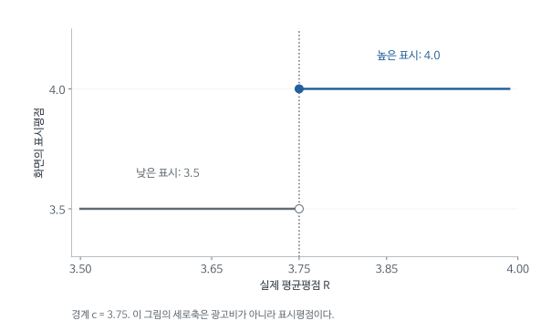

# Advertising Strategy in the Presence of Reviews - 심층요약과 수식 해설

2026-12-09, Week 13 / Session 15. Brett Hollenbeck, Sridhar Moorthy, Davide Proserpio (2019).

[원문 PDF](<Advertising strategy in the presence of reviews (2019).pdf>) | [개념 퀴즈](<Advertising strategy in the presence of reviews (2019)_QnA.md>) | [수식·모델 퀴즈](<Advertising strategy in the presence of reviews (2019)_수식모델퀴즈.md>) | [실무 Cheat Sheet](<Advertising strategy in the presence of reviews (2019)_실무CheatSheet.md>)


## 1. 좋은 리뷰를 얻은 호텔은 광고를 더 해야 할까

숙박을 예약하는 고객은 머물러 보기 전에 서비스 품질을 판단해야 한다. 호텔의 광고와 브랜드는 그 판단을 돕는 정보였고, 온라인 리뷰가 보급된 뒤에는 이전 투숙객의 경험도 쉽게 확인할 수 있게 되었다. Hollenbeck, Moorthy, Proserpio는 이렇게 소비자의 정보가 늘어났을 때 호텔이 광고예산을 어떻게 조정하는지 연구했다.

예상 방향은 처음부터 분명하지 않다. 좋은 평가를 받은 호텔은 그 장점을 더 많은 사람에게 알리려고 광고를 늘릴 수 있다. 반대로 리뷰가 고객을 충분히 유치한다면 유료광고를 줄일 수도 있다. 품질이 높은 호텔은 비용이나 객실 부족 때문에 광고를 줄일 수 있으므로, 좋은 호텔과 나쁜 호텔의 광고비를 단순히 비교하면 리뷰 정보의 역할을 분리하기 어렵다.

저자들이 서론에서 정리한 이론도 방향을 하나로 정하지 않는다. Nelson(1970, 1974)의 신호 논리에서는 품질이 높은 기업만 광고에 투자할 유인이 있으므로 품질과 광고비가 같은 방향으로 움직인다. 광고가 인지도를 높여 수요를 직접 늘리는 경우에는 공급 측 요인이 작용한다. 품질이 높을수록 한계비용이 크거나 객실이 먼저 차면 고객을 더 불러와도 얻는 이익이 작으므로 광고가 줄어든다. 일부 소비자가 구매 전에 품질을 아는 경우의 수요 측 효과는 모형에 따라 양수도 되고 음수도 된다. 여기에 가격과 광고를 둘러싼 기업 사이의 전략적 상호작용이 더해진다. 과거 실증연구도 일관된 관계를 찾지 못했다. Rotfeld와 Rotzoll(1976)은 12개 편의품 범주에서 광고하는 브랜드와 하지 않는 브랜드를 함께 분석하면 광고와 품질의 양의 상관을 찾았지만 광고하는 브랜드만 분석하면 그 상관이 나타나지 않았다. Caves와 Greene(1996)이 약 200개 범주를 분석한 결과에서는 상관의 중앙값이 0 근처였다. 원문은 이 연구들이 모두 상관분석이어서 품질의 비용 측 효과와 수요 측 효과를 분리하지 못했다고 지적한다.

저자들은 TripAdvisor가 평균 별점을 반 별 단위로 반올림하는 규칙을 이용했다. 원고의 예에서 실제 평균 3.74는 화면에 3.5로, 평균 3.75는 4.0으로 표시된다. 평가 평균은 0.01만큼 다른데 고객이 보는 표시는 반 별 달라진다. 3.75 바로 양쪽의 호텔들이 품질과 비용에서는 매끄럽게 이어진다면, 그 경계의 광고비 차이로 높은 표시평점에 대한 호텔의 반응을 추정할 수 있다. 이를 회귀불연속(regression discontinuity)설계, 줄여서 RD라고 한다.

이 설계가 앞의 이론 목록에서 식별하는 것은 수요 측 효과다. 평균평점이 3점인 호텔과 4.5점인 호텔을 비교하면 소비자 반응과 비용, 용량 요인이 함께 섞인다. 반올림 경계에서는 실제 평균평점이 거의 같으므로 참 품질과 그에 따른 한계비용도 거의 같다고 볼 수 있다. 그 자리에서 나타나는 광고비 차이는 소비자가 보는 정보가 달라진 데 따른 반응으로 해석되며, 저자들은 이를 "수요 측 인과효과"라고 부른다. 이 해석에는 원문 각주 2의 두 가정이 전제되어 있다. 소비자 대부분은 개별 리뷰 점수를 직접 평균 내지 않고 반올림된 표시만 본다. 호텔은 자기 참 품질을 안다. 원문 각주 4는 호텔 산업의 비용 대부분이 고정비라서 평균평점의 큰 차이에도 한계비용 차이는 크지 않을 것이라고 덧붙인다.

이 연구의 결과변수는 호텔이 지출한 광고비다. 소비자 구매가 광고 때문에 얼마나 늘었는지를 추정하는 회귀와는 방향이 다르다. 소비자가 접하는 평점 정보가 원인이고, 호텔의 광고 선택이 그에 대한 반응이다. 이 문서는 반올림 규칙이 비교집단(comparison group)을 만드는 방식과 그 비교가 광고비의 어느 부분을 설명하는지를 차례로 설명한다.

기업의 광고와 소비자의 리뷰는 모두 상품 정보를 전달하지만 누가 비용을 내고 어떤 동기로 작성하는지가 다르다. 호텔은 자기 장점을 강조하려고 광고비를 지불하고 투숙객은 자기 경험을 평가한다. 소비자가 리뷰를 쉽게 읽게 되면 호텔이 유료광고로 전달할 필요가 있었던 정보 일부를 이미 알고 있을 수 있다. 반대로 좋은 리뷰가 생겼다는 사실을 더 널리 알리고 싶어 광고를 늘릴 수도 있다. 어느 방향이 우세한지가 이 논문의 경험적 질문이다. 원문은 앞의 경우를 대체관계, 뒤의 경우를 보완관계라고 부른다. 표시평점이 좋아졌을 때 호텔이 광고를 줄이면 평점과 광고를 서로 대신하는 수단으로 다룬다는 뜻이고, 광고를 늘리면 함께 사용할수록 효과가 커지는 수단으로 다룬다는 뜻이다. 이 용어가 무엇을 확인하고 무엇을 확인하지 않는지는 10장에서 다시 다룬다.

관측된 높은 평점과 낮은 광고비의 상관에는 여러 설명이 성립할 수 있다. 원래 유명한 호텔은 평점도 높고 광고를 적게 할 수 있다. 서비스 개선에 돈을 쓴 호텔이 광고예산을 줄였을 수도 있다. 또 광고가 고객구성을 바꾸어 평점에 영향을 줄 가능성도 있다. 반올림 경계는 이런 큰 품질 차이를 비교하는 대신 거의 같은 실제 평가에서 화면표시만 크게 달라지는 경우를 찾게 해 준다.

따라서 처치의 경제적 의미는 호텔 서비스를 실제로 반 별만큼 개선하는 행위와 다르다. 이전 투숙객이 남긴 평균평점이 거의 같은 두 호텔 중 하나가 더 좋은 요약표시를 받는 차이다. 소비자 정보의 표현 방식에 대한 기업의 반응이라는 범위에서 결과를 해석해야 한다.

## 2. 지점의 리뷰와 브랜드 광고비를 연결하는 문제

호텔 리뷰는 개별 지점에 달리지만 광고는 호텔 한 곳이 집행하기도 하고 체인 본사가 여러 지점을 위해 집행하기도 한다. 평점과 광고비를 연결하려면 같은 의사결정 단위를 측정하고 있는지부터 확인해야 한다. 저자들이 여러 자료를 결합하고 검색광고 분석을 독립 호텔로 제한한 배경이 여기에 있다.

| 자료 | 제공 정보 | 결합 시 문제 |
|---|---|---|
| TripAdvisor | 호텔별 시점 있는 리뷰 | 각 호텔 지점과 브랜드가 다름 |
| Kantar | 브랜드-광고상품별 매체 광고비 | 체인 전체 광고와 지점 광고를 구별 |
| SpyFu | URL별 검색광고 지출 추정 | 체인 하위 URL별 지출을 분리하기 어려움 |
| STR | 호텔 특성, 체인, 객실, 일부 가격 | 모든 호텔의 가격자료가 있는 것은 아님 |

자료 결합에서 가장 어려운 단계는 Kantar 광고비를 TripAdvisor 호텔에 연결하는 작업이었다(원문 3.1절). Kantar는 광고비를 브랜드와 "광고상품" 단위로 기록한다. Best Western의 예에서 광고상품에는 "Best Western Hotels: Bethlehem PA"처럼 특정 지점을 가리키는 것도 있지만 "Best Western Hotels: Online"처럼 광고 유형을 가리키는 것, 주 관광청과 함께 낸 공동광고("Combo")도 있다. 저자들은 두 개 이상의 브랜드-상품 광고비가 섞인 Combo 상품을 제외하고 남은 15,973개 브랜드-상품 이름으로 구글을 검색했다. 상위 10개 결과 가운데 TripAdvisor 호텔 페이지가 하나로 특정되는 경우만 후보로 삼고, 이름 유사도가 높은 후보만 남긴 뒤 수작업으로 확인했다. 최종적으로 6,312개 브랜드-상품이 5,666개 호텔에 연결되었다. Kantar 표본의 약 40%다. 체인 전체 광고처럼 한 지점으로 특정되지 않는 상품은 이 과정에서 탈락한다. 연구가 보려는 것이 지점 평점에 반응하는 지점 광고이므로 이 탈락은 설계상 의도된 부분도 있다.

주요 매칭 패널은 2002-2015년 5,563개 호텔, 762,233개 호텔-연도-월 관측이다. 독립 호텔은 4,020개, 체인은 1,543개다. 이 호텔들에 달린 리뷰는 3,308,450개로 호텔당 약 594개다. STR 자료와는 3,996개 호텔(약 72%)이 연결되었고 그중 2,810개 호텔에 가격 자료가 있다. 12장의 가격 통제 분석이 부분표본으로 이루어지는 이유다. 이 수는 RD 추정에 실제 사용하는 관측 수와 다르다. 평점 문턱 근처이고 리뷰가 충분한 관측으로 좁히기 때문이다.

탈락이 많으면 남은 표본이 특이한 호텔로 치우쳤을 수 있다. 저자들은 매칭 표본과 전체 Kantar 표본을 비교했다(원문 3.2절). 매체별 평균 광고비는 매칭 표본 쪽이 전반적으로 작지만, 옥외와 인쇄에 가장 많이 지출하고 인터넷 디스플레이, 라디오, TV에 적게 지출하는 구성은 같았다. 체인의 STR 등급 분포도 비슷했다. 광고비가 양수인 달의 비율은 두 표본 모두 0.14, 체인 비율은 0.27과 0.26이었다. 관측된 몇 가지 특성이 비슷하다는 증거이며, 매칭 표본의 광고 반응이 전체 호텔과 같다는 보장까지 주지는 않는다.

검색광고를 포함한 지점 단위 분석은 독립 호텔에 제한된다. 체인 전체 광고비를 각 지점의 평점에 임의로 연결하면 한 지점 평점 변화의 반응이 아닌 브랜드 전체 의사결정을 설명하게 된다. 매칭 패널의 독립 호텔 4,020곳 중 SpyFu 검색광고 자료와 연결되는 곳은 3,520곳이다. 저자들은 이와 별도로 2006-2015년 독립 호텔 9,008곳, 439,506개 호텔-연도-월 관측의 검색광고 보조자료도 만들었다. 매칭 표본의 검색광고 결과가 더 큰 표본에서도 나타나는지 확인하는 용도이며 12.2절에서 다룬다.

원문 자료의 시간범위는 과거 기간이다. 당시 매체와 플랫폼의 제도적 설명을 현재 TripAdvisor 규칙이나 현재 광고시장의 상태로 일반화하지 않는다.

브랜드 광고의 비용을 지점별로 나누는 방식이 자의적이면 평점과 광고의 관계도 자의적일 수 있다. 예를 들어 체인 본사가 전국 캠페인을 늘렸는데 한 지점 평점만 상승했다면, 그 지점이 평점 때문에 광고를 늘린 것으로 볼 수 없다. 광고자료의 명칭과 URL을 호텔자료에 맞추는 과정에서 어떤 기업의 결정을 관찰할지가 정해진다. 파일 병합 이상의 작업이다.

독립 호텔은 자신의 이름과 광고주소가 비교적 직접 연결될 수 있어 검색광고의 지출 주체를 더 분명히 해석할 수 있다. 반면 체인의 검색광고가 본사 URL에 묶이면 개별 지점 광고와 분리하기 어렵다. 분석별 표본이 달라지는 이유를 이해해야 독립 호텔 검색광고 결과를 체인까지 포함한 기본 표본 결과와 같은 범위로 비교하지 않게 된다.

전체 패널의 큰 관측 수는 풍부한 시간정보가 있다는 뜻이지만 모든 관측이 경계효과 추정에 들어가는 것은 아니다. 각 경계 주변, 충분한 리뷰 수, 해당 광고자료와의 매칭이라는 조건을 통과해야 한다. 표마다 관측 수가 다른 것은 이 조건과 결과변수의 가용성이 달라졌기 때문이다.

### 2.1 기술통계의 역U자 관계만으로는 부족한 이유

RD 분석에 앞서 원문 4절은 자료 전체의 추세를 보여 준다. Table 1에서 2002년과 2015년을 비교하면 호텔당 리뷰 수는 연말 기준 1.71개에서 558.07개로 증가했고 평균 평점은 3.89에서 4.08로 상승했다. 광고가 있는 달의 비율은 0.18에서 0.12로 하락했다. 인터넷 디스플레이를 포함한 Kantar 매체 합계의 호텔당 월평균 광고비는 \$1,921에서 \$849로 약 56% 감소했고, 가장 크게 감소한 매체는 인쇄(\$1,576에서 \$526)였다. 인터넷 디스플레이는 \$73에서 \$162로 증가했다. 금액은 물가를 조정하지 않은 명목값이다. 검색광고 행은 독립 호텔만의 값이고 비교 시작 연도가 2006년이다.

평점과 광고비의 단면 관계는 Figure 6에 있다. 2002-2005년에는 점들이 흩어져 뚜렷한 모양이 없다. 2012-2015년에는 평균평점이 중간인 호텔의 로그광고비가 가장 크고 양 끝으로 갈수록 작아지는 역U자 모양이 나타난다. 독립 호텔의 검색광고(Figure 7)도 비슷하다. 저자들은 이 변화를 소비자가 TripAdvisor를 많이 이용하게 된 뒤에야 호텔이 리뷰에 반응하기 시작했다는 신호로 해석하고, 처음의 보완관계가 대체관계로 바뀌었다고 표현한다. 초기 그림은 잡음이 크다고 저자들 스스로 적었으므로 이 표현은 그림에 대한 해석으로 이해해야 한다.

이 그림으로 인과효과를 판단할 수는 없다. 평균평점이 3점인 호텔과 4.5점인 호텔은 참 품질, 비용, 고객층, 지역이 모두 다르다. 역U자 안에는 소비자 반응과 비용, 용량 요인이 섞여 있고, 광고가 고객 구성을 바꿔 평점에 영향을 주는 역방향 경로도 배제되지 않는다. 오른쪽으로 내려가는 구간만 보고 좋은 평점이 광고를 줄인다고 결론 내릴 수 없는 이유다. 4장부터 설명할 RD는 이 넓은 비교 대신 반올림 경계의 좁은 비교를 사용한다.

## 3. t는 월초, 결과는 그 뒤 지출 합계다

높은 표시평점을 받았다고 이미 계약한 광고를 그날 취소할 수는 없다. 기업이 정보를 확인하고 예산을 조정한 뒤 실제 광고비로 나타나기까지 시간이 걸린다. 평점을 측정한 시점과 결과를 측정하는 기간을 구분하는 이유다.

i는 호텔 지점, t는 월초다. 월초의 누적평균 평점을 러닝변수, 즉 표시 별점이 바뀌는 기준을 결정하는 점수로 사용하고 이후 6개월 광고 지출을 합산한 결과를 설명한다. 광고를 결정한 날과 실제 광고가 게재되어 비용이 집계되는 날이 다를 수 있기 때문이다. 저자들은 매체에 따라 광고 구매와 송출 사이가 0개월에서 6개월까지 벌어질 수 있다고 추측하고, 6개월을 합하면 월별 잡음도 줄어든다고 설명한다.

원문 각주 23은 이 합산의 비용도 인정한다. 저자들은 광고 결정 시점을 관측하지 못하고 돈이 지출된 시점만 관측한다. 6개월 합계에는 월초 평점과 무관한 이전 결정의 지출도 섞이므로 결과변수에 측정오차(measurement error)가 생긴다. 회귀분석(regression analysis)의 일반적인 성질로, 결과변수의 측정오차가 설명변수(explanatory variable)와 상관이 없으면 계수를 한쪽으로 치우치게 하지는 않고 잔차(residual)의 분산을 키워 표준오차를 크게 만든다. 저자들이 이 오차가 "효과를 찾기 더 어렵게 만들 뿐"이라고 쓴 것은 이런 뜻으로 이해할 수 있다.

원문은 [t,t+6 months]라는 구간을 사용한다. 실제 월별 자료에서 시작월을 포함해 몇 개 월을 더했는지까지는 코드 확인이 필요하다. 문서의 직관은 “평점을 측정한 뒤 이어지는 광고비”다.

연속된 t의 미래 지출 창은 서로 겹친다. 같은 호텔의 이달 6개월 합계와 다음 달 6개월 합계는 상당수 지출을 공유한다. 이 때문에 오차를 독립이라고 보기 어려울 수 있다. 원문 표는 robust standard errors라고 보고하며, 이를 임의로 호텔 군집 표준오차(clustered standard error)라고 바꾸어 적지 않는다. 실습에서 반복관측과 창 중첩에 맞는 추론을 검토할 필요가 있다.

월초 평점은 그 시점까지 소비자가 접할 수 있던 누적정보를 요약하고, 미래 광고비는 그 정보를 본 기업이 이후 조정할 선택을 측정하려는 것이다. 같은 달의 즉각적인 광고비만 분석하면 이미 집행이 결정된 광고가 많이 포함되어 반응을 놓칠 수 있다. 반대로 지나치게 긴 기간을 합하면 이후 새로 쌓인 리뷰와 다른 경영환경의 변화까지 많이 포함된다. 결과기간 선택은 반응 속도에 관한 판단을 담는다.

여섯 달 창이 겹친다는 것은 같은 지출이 여러 관측에 포함된다는 뜻이다. 이달 결과와 다음 달 결과가 비슷한 이유 중 일부는 실제로 같은 광고비를 공유하기 때문이다. 반복되는 관측을 독립적인 예산 결정으로 전부 세면 불확실성을 과소평가할 위험이 있다. 원문의 표준오차 표기를 정확히 보고하는 것과, 후속 분석에서 적절한 추론을 검토하는 것은 둘 다 필요한 일이다.

한 번 높은 표시를 받은 뒤 평점이 다시 낮아질 수도 있다. 따라서 추정 결과는 높은 표시가 영구적으로 유지된다는 실험과 같지 않다. 월초 정보에 따라 이후 일정기간 지출이 어떻게 다른지라는 관측 설계의 질문을 유지해야 한다.

### 3.1 겹치는 미래 지출 창은 어떻게 오차상관을 만드는가

앞뒤 월의 결과가 같은 지출을 포함한다는 말을 식으로 확인한다. 월 $t$의 지출을 $A_t$라 하고, 월별 지출을 정확히 여섯 달씩 더하는 교육용 정의 $S_t=A_t+\cdots+A_{t+5}$를 사용한다. 실제 보관 자료의 날짜 포함 규칙을 이 정의로 확정하는 것은 아니다. 다음 달의 합계 $S_{t+1}=A_{t+1}+\cdots+A_{t+6}$에서 $S_t$를 빼면 다음과 같다.

$$
S_{t+1}-S_t=A_{t+6}-A_t.
$$

가운데 다섯 달의 지출은 두 결과에 공통으로 들어가 서로 소거된다. 연속한 두 관측이 주는 새 정보는 한 달치뿐이다. 가장 단순한 오차모형으로 살펴보면 이 점이 더 명확하다. 월별 지출 충격 $u_t$가 서로 독립이고 분산이 $\sigma^2$라 해도 합산충격 $U_t=\sum_{k=0}^{5}u_{t+k}$에는 공통 항이 있다. 분산은 독립인 여섯 항의 분산을 더한 값이고, 공분산(covariance)은 $U_t$와 $U_{t+1}$에 함께 들어 있는 $u_{t+1},\dots,u_{t+5}$ 다섯 항의 분산을 더한 값이다.

$$
\operatorname{Var}(U_t)=6\sigma^2,\qquad
\operatorname{Cov}(U_t,U_{t+1})=5\sigma^2.
$$

이 가상 모형에서는 인접 합산충격의 상관계수가 $5/6$이다. 원문 로그광고 회귀의 실제 상관계수가 $5/6$이라는 뜻은 아니다. 로그변환, 계절성, 호텔별 지속충격까지 들어가면 달라진다. 원래 월 충격이 독립이어도 결과를 합산하는 방식 자체가 의존성을 만든다는 점을 보여 준다.

미래 지출을 합치면 광고 구매와 송출의 지연을 포착하고 잡음을 줄이는 장점이 있다. 그 대신 늘어난 월별 행 수를 독립 표본 수로 간주할 수는 없다. 이 자료 구조에 맞는 추론을 재현하려면 저자의 표준오차 구현을 확인해야 한다. 별도 군집화 분석을 추가한다면 원문과 다른 추론 절차라는 점도 기록한다.

## 4. 높은 표시평점을 받은 경우와 받지 않은 경우

반올림을 수식으로 쓰기 전에 같은 호텔의 두 상황을 생각한다. 현재 평균이 경계 근처인 호텔이 높은 표시평점을 받았을 때의 광고비와 낮은 표시평점을 받았을 때의 광고비가 비교하고 싶은 두 결과다. 실제로는 한 상황만 관찰되므로, 경계 반대편의 비슷한 호텔에서 다른 상황의 평균을 구한다. 아래 잠재결과(potential outcome) 기호는 이 비교를 나타낸다.

| 기호 | 의미 |
|---|---|
| R_it | 호텔 i의 t월초 평균 평점 |
| c | 반올림 문턱, 예: 3.75 |
| X_it=R_it-c | 문턱까지의 거리, 설명용 중심화 변수 |
| D_it=1(R_it≥c) | 높은 표시평점을 받는 쪽인지 |
| A_it | 이후 기간 광고비 |
| Y_it | 광고비를 변환한 결과변수 |
| Y_it(1), Y_it(0) | 높거나 낮은 표시평점 아래에서의 잠재 광고비 결과 |
| tau_c | 문턱 c에서의 국소 처치효과 |

여기서 처치는 거의 같은 평균평점에서 표시평점이 반 별 높은 상태를 받는 것이다. 평균평점 자체를 끌어올리는 행위와는 다르다. 예를 들어 c=3.75에서 D=1이면 화면에는 4.0이 표시되고 D=0이면 3.5가 표시된다.

러닝변수 $R$은 소비자들이 준 점수의 실제 평균이고 처치 $D$는 그 평균에 반올림 규칙을 적용한 표시상태다. 두 변수가 함께 변하지만 변화 크기는 다르다. 경계 바로 양쪽에서 $R$의 차이를 아주 작게 만들 수 있는 반면 $D$는 0에서 1로 완전히 바뀐다. RD가 이용하는 정보는 이 불균등한 변화다.

광고비 잠재결과 $Y(0)$와 $Y(1)$은 같은 호텔이 각 표시상태를 받았을 때 선택할 지출을 뜻한다. 호텔의 품질을 바꾸거나 고객 전체를 교체한 상황까지 동시에 뜻하지 않는다. 이 정의가 분명해야 높은 평점의 상관관계를 서비스 개선의 수익률로 오해하지 않는다.

이 자료에서 RD가 실제로 만드는 비교를 적으면 다음과 같다. 한 관측은 호텔-월이다. 같은 연도-월, 같은 브랜드 범주 안에서 월초 평균평점이 문턱 바로 위인 호텔-월과 바로 아래인 호텔-월의 이후 6개월 광고비를 비교한다. 회귀에는 호텔 고정효과(fixed effects)가 없고 브랜드 고정효과가 포함된다(6.2절). 따라서 비교의 대부분은 서로 다른 호텔 사이에서 이루어진다. 같은 호텔이 시간이 지나며 문턱을 넘는 경우도 표본에 들어오지만, 회귀가 그 호텔 자신의 전후 변화만 별도로 추출해 사용하는 구조는 아니다. 경계 양쪽 호텔이 평균적으로 비슷하다는 연속성 가정이 식별(identification)의 중심에 놓이는 이유다.

경계 양쪽의 호텔이 비슷하다고 기대하는 근거는 리뷰의 표본변동이다. 저자들은 평균평점을 참 품질의 불편추정치로 보되 어떤 투숙객이 리뷰를 남겼는지에 따라 흔들린다고 가정한다(원문 5절). 교육용 가상 수치로 개별 리뷰 점수의 표준편차가 1점이고 리뷰가 서로 독립이라고 하자. 리뷰가 $n$개일 때 평균의 표준오차는 $1/\sqrt{n}$이다. 리뷰 20개면 약 0.22, Table 3의 평균 리뷰 수에 가까운 259개면 약 0.062다. 참 품질이 3.70으로 문턱보다 0.05 낮은 호텔도 리뷰가 259개라면 평균평점이 3.75 이상으로 관측될 확률이 정규근사로 약 21%이고, 리뷰가 20개라면 약 41%다. 대역폭(bandwidth) ±0.05 안에서 호텔이 문턱의 어느 쪽에 놓이는지는 참 품질 못지않게 리뷰 표본의 우연에 달려 있다. 표준편차 1은 가정한 값이며, 원문이 이런 확률을 계산한 것은 아니다.

어느 문턱의 효과인지도 중요하다. 3.25를 넘어서 3.5로 표시되는 변화와 4.75를 넘어서 5.0으로 표시되는 변화는 소비자에게 다른 의미를 줄 수 있다. 논문이 개별 문턱 결과와 통합 결과를 함께 제시하는 이유다. 통합 계수는 여러 문턱의 정보를 모은 요약이며 각 문턱에서 똑같은 반응이 확정되었다는 뜻은 아니다.

<!-- learning-figure:review-rounding -->



*그림 설명: 본문의 표시평점 규칙을 그렸다. 광고비 결과의 점프나 추정효과는 표시하지 않았다.*

3.74와 3.75는 평균평점이 0.01 다르지만 화면에 표시되는 평점은 0.5 다르다. 이 불연속이 처치 변화다. 광고비의 효과를 알려면 별도로 경계 양쪽 광고비의 평균을 추정해야 하며, 이 계단만으로 광고비가 얼마나 변하는지 알 수는 없다.

<!-- /learning-figure -->

## 5. 왜 “경계의 오른쪽 평균 빼기 왼쪽 평균”인가

3.74 호텔과 3.75 호텔의 차이가 작아 보여도 두 호텔의 광고비 차이를 그대로 인과효과라고 할 수는 없다. 평균평점이 0.01 달라진 데 따른 자연스러운 광고비 차이도 있기 때문이다. RD는 양쪽 호텔의 평균 광고비를 경계까지 접근시켜 이 연속적인 차이가 사라지는 비교를 정의한다. 다음의 극한 기호는 그 접근 과정을 뜻한다.

관측결과를 잠재결과로 표현하면,

$$Y=D Y(1)+(1-D)Y(0).$$

문턱 바로 오른쪽에서는 D=1이므로 관측되는 평균은 처치 잠재결과 평균이다. 왼쪽은 D=0이다.

$$\mu_+=\lim_{r\downarrow c}E[Y\mid R=r]
=\lim_{r\downarrow c}E[Y(1)\mid R=r],$$

$$\mu_-=\lim_{r\uparrow c}E[Y\mid R=r]
=\lim_{r\uparrow c}E[Y(0)\mid R=r].$$

여기서 아래쪽 화살표는 r이 c보다 큰 값에서 c로 가까워진다는 극한 표기다. 연속성 가정은 각 잠재결과의 조건부 평균이 문턱에서 점프하지 않는다고 말한다. 이 가정을 이용하는 단계는 다음이다.

$$\mu_+=E[Y(1)\mid R=c],\qquad
\mu_-=E[Y(0)\mid R=c].$$

이제 두 식을 빼면,

$$\tau_c=\mu_+-\mu_-=E[Y(1)-Y(0)\mid R=c].$$

이는 전체 호텔 평균효과가 아닌 문턱에 있는 호텔의 효과다. 평균 1.5점 호텔이나 4.99점 호텔에도 같은 효과가 나타난다는 결론은 여기서 나오지 않는다.

연속성 가정은 광고비와 평점의 관계 자체를 허용한다. 실제 평점이 좋아질수록 광고 필요가 점진적으로 줄어들어도 된다. 다만 반올림이 없었다면 정확히 3.75라는 값에서 광고비의 잠재평균이 갑자기 바뀌지 않아야 한다. 그 지점에서 화면표시 외에 다른 제도도 바뀐다면 관측된 점프를 표시평점 하나에 귀속하기 어렵다. 원문 5.2절은 여기에 두 번째 가정을 더한다. 호텔이 광고 효과를 예상하고 처치 집단으로 스스로 이동하지 않아야 한다. 평균평점을 조작해 문턱을 넘을 수 있다면 이 가정이 깨지며, 8장의 검정들이 이 가능성을 점검한다.

개별 호텔 두 곳이 우연히 크게 다르더라도 경계 주변의 평균관계가 연속적일 수 있다. RD는 모든 이웃 호텔이 완전히 같은 쌍둥이라는 주장을 하지 않는다. 충분한 근처 관측을 이용해 양쪽의 조건부 평균을 추정하고 그 평균의 점프를 평가한다. 따라서 그림의 개별 점 하나보다 평균선과 불확실성을 함께 검토하는 것이 적절하다.

이 설계는 경계에 가까운 호텔에 관한 비교다. 서비스 평점이 아주 낮은 호텔은 소비자 신뢰, 브랜드, 광고전략에서 다를 수 있다. 작은 국소 변화의 효과를 넓은 품질 개선이나 평점 전 범위의 정책으로 확장할 때에는 이 차이를 추가로 고려해야 한다.

## 6. 회귀선 두 개를 사용해 RD 계수를 이해하기

실제 자료에는 경계에 무한히 가까운 호텔이 충분히 존재하지 않는다. 그래서 경계 양쪽의 가까운 관측치로 각각 회귀선을 추정하고, 두 선이 경계에 도달했을 때의 높이를 비교한다. 평균평점이 높아질 때 광고비가 원래 어떻게 변하는지는 좌우 기울기가 맡고, 표시평점이 달라져 생기는 불연속은 절편(intercept) 차이가 맡는다.

설명용으로 중심화한 X=R-c와 같은 통제항을 가진 다음 식을 생각한다.

$$Y=\alpha+\tau D+\beta X+\gamma DX+u.$$

D=0인 왼쪽은,

$$E[Y\mid X,D=0]=\alpha+\beta X.$$

D=1인 오른쪽은,

$$E[Y\mid X,D=1]=\alpha+\tau+(\beta+\gamma)X.$$

문턱 X=0을 대입하면 왼쪽은 alpha, 오른쪽은 alpha+tau다. 그 차이가 tau다. gamma는 오른쪽 기울기에서 왼쪽 기울기를 뺀 값이다.

가상 예로 alpha=7, tau=-0.07, beta=1, gamma=0.5이면 경계의 왼쪽 예측값은 7, 오른쪽은 6.93이다. 문턱에서 0.07 로그포인트(log points)만큼 내려간다. 오른쪽 기울기는 1.5이고 왼쪽은 1이다.

### 6.1 원문의 Avg Ratings 표기를 그대로 사용하면 생기는 문제

원문 식 (1), 원고 p.19는 다음과 같이 표기한다.

$$Y_{it}=\beta_1D_{it}+\beta_2R_{it}+\beta_3D_{it}R_{it}
+\alpha_i+\tau_t+\epsilon_{it}.$$

R이 정말 비중심화된 원점수라면 문턱 c에서 점프는 beta_1+beta_3 c다. beta_1만으로 점프를 해석하려면 R이 문턱에서 0이 되도록 중심화되어 있어야 한다. 원문은 beta_1을 점프라고 설명하지만 이 중심화 과정을 식에 분명히 적지 않는다.

따라서 여기서는 개념 설명에 X=R-c를 명시하며, 표의 Above Threshold 계수는 저자가 보고하는 RD 추정치로 인용한다. 저자 코드의 중심화 및 여러 문턱 통합 구현까지 확인한 것으로 간주하지 않는다. 중심화의 여부에 따라 계수에서 경계효과를 계산하는 식이 달라진다.

보고된 수치는 중심화 해석에 더 잘 부합한다. Table 4의 4.25 문턱 열에서 $\beta_1=-0.062$, $\beta_3=3.463$이다. Avg Ratings가 원점수라면 문턱에서의 점프는 $-0.062+3.463\times4.25\approx14.66$ 로그포인트가 된다. 광고비가 문턱에서 수백만 배 달라진다는 뜻이므로 Figure 9 (c)에서 보이는 약 0.1 로그포인트 정도의 하락과 부합하지 않는다. 나머지 문턱에서도 $\beta_1+\beta_3c$는 2.76(3.25), $-6.83$(3.75), $-16.49$(4.75)로 그림과 동떨어진다. 반면 기울기 계수를 평점 1점당 변화로 보고 대역폭 0.05를 곱하면, 3.25 문턱 왼쪽 선은 $3.409\times0.05\approx0.17$만큼 상승한다. Figure 9 (a)의 왼쪽 직선도 약 0.45에서 0.62로 비슷하게 상승한다. Figure 9의 가로축 제목도 "Distance from the Discontinuity"다(눈금은 원래 평점 값으로 적혀 있다). 네 문턱을 한 회귀에 합친 통합 추정도 문턱까지의 거리로 좌표를 맞추지 않으면 해석하기 어렵다. 이런 점에서 $\beta_1$을 문턱의 점프로 해석하는 원문의 설명은 표와 그림에 비추어 일관적이다. 다만 이는 보고된 수치에서 도출한 추론이며, 저자 코드로 확인한 사실로 적지 않는다.

### 6.2 alpha_i가 있다고 무조건 호텔 고정효과인가

원문 p.20(각주 24 포함)과 대부분의 표는 브랜드 고정효과와 연도-월 고정효과를 사용한다고 명시한다. 체인은 Marriott, Hilton 같은 브랜드로 묶고 독립 호텔은 공통 "independent" 범주 하나로 묶는다. 기호가 $\alpha_i$처럼 호텔 첨자 i를 달고 있더라도 개별 호텔 고정효과라고 설명하면 잘못이다. 독립 호텔만 사용하는 회귀(Table 6의 (3), (4)열, Table 5의 검색광고 열)에서는 Brand FE가 "No"로 표시되고, 부록의 Table 16과 Table 19에는 Brand FE 행이 없다. 독립 호텔은 모두 한 범주라 브랜드 고정효과가 상수항과 구별되지 않기 때문이다.

브랜드 효과는 같은 브랜드의 모든 지점에 공통인 수준 차이를 조정한다. 예를 들어 Marriott 지점들이 평균적으로 독립 호텔보다 광고비가 많다면 그 차이는 제거되지만, 같은 Marriott 안에서 도심 지점과 교외 지점의 고유한 차이는 남는다. 개별 호텔의 모든 불변 특성을 제거하지는 않는다. 경계 양쪽을 인과적으로 비교하려면 브랜드를 조정한 뒤에도 잠재 광고비가 문턱에서 연속이라는 가정이 필요하다.

양쪽 기울기를 별도로 허용하는 것은 높은 표시를 받은 호텔과 받지 않은 호텔에서 실제 평균평점의 작은 변화가 광고비와 다르게 관련될 수 있음을 허용한다. 기울기까지 반드시 같다고 제약하면 함수형태의 제한 때문에 경계의 점프가 잘못 추정될 수 있다. 반대로 복잡한 곡선을 무리하게 적합하면 적은 표본에서 선이 불안정해질 수 있어, 좁은 구간의 단순한 근사를 점검하는 접근이 필요하다.

중심화는 3.75를 기준으로 좌표의 0점을 옮기는 변환이며 자료의 경제적 내용은 그대로 둔다. 이렇게 하면 높은 표시 더미의 계수는 경계에서 두 선의 높이 차이와 바로 연결된다. 원점수를 그대로 사용하면 더미의 계수는 실제 평균평점 0에서의 두 직선 차이에 해당하여, 경계의 차이를 얻으려면 상호작용 기여를 더해야 한다. 같은 모형이라도 계수 하나의 해석은 좌표에 따라 달라진다.

브랜드 고정효과 역시 기호만 보고 추측해서는 안 된다. 같은 브랜드의 지점들이 공통으로 가진 광고수준을 조정하는 것과 같은 호텔의 모든 불변차이를 조정하는 것은 서로 다른 회귀다. 독립 호텔을 하나의 범주로 묶은 원문의 구현에서는 독립 호텔 각각의 고유 특성이 전부 사라지지 않는다. 경계에서의 연속성 가정이 계속 중심 역할을 하는 이유다.

## 7. 대역폭은 “얼마나 가까운 호텔까지 비교할까”다

경계 근처라는 표현을 실제 표본 선택으로 바꾸는 수치가 대역폭이다. 너무 멀리 떨어진 호텔까지 포함하면 고급 호텔과 저가 호텔의 장기적인 차이를 작은 직선 하나로 설명하려 하게 된다. 반대로 구간을 지나치게 좁히면 비교할 호텔이 부족하다. 저자들은 기본 구간을 정한 뒤 다른 구간에서도 결과가 유지되는지 확인한다.

기본 분석은 각 문턱에서 평균평점 ±0.05 이내, 리뷰 20개 이상인 호텔을 사용한다. c=3.75면 대략 3.70-3.80의 좁은 구간이다. 이 안에서도 좌우 기울기를 따로 허용한다.

대역폭을 작게 하면 호텔들이 더 비슷해질 가능성이 있지만 관측이 줄어 불확실성이 커진다. 크게 하면 더 많은 자료를 사용하지만 선형근사가 덜 정확해질 수 있다. 어느 한쪽 극단이 항상 나은 선택이 되지는 않는다. 저자들은 0.05를 "RD로서는 매우 작은 대역폭"이라고 부르며, 자료가 커서 이렇게 좁혀도 관측이 충분하다는 점을 이유로 든다.

원문 Table 13은 0.025, 0.05, 0.075의 대역폭을 비교한다. 원고 본문 p.33에 0.5라고 쓰인 부분은 표 머리글의 0.05와 불일치한다. 이 문서는 표 기준을 따른다.

Table 13의 Above Threshold는 대역폭 0.025, 0.05, 0.075에서 각각 $-0.107$(0.026), $-0.070$(0.018), $-0.032$(0.015)이고 관측 수는 33,523, 67,977, 100,292다. 세 계수 모두 5% 수준에서 유의하지만 대역폭이 넓을수록 절댓값이 작아진다. 순수 로그라는 조건에서 퍼센트로 환산하면 약 $-10.2\%$, $-6.8\%$, $-3.2\%$다. 95% 구간은 대략 $[-0.158,-0.056]$, $[-0.105,-0.035]$, $[-0.061,-0.003]$이다. 좁은 대역폭의 관측이 넓은 대역폭 표본에 모두 포함되므로 세 추정치는 서로 독립이 아니고, 구간이 겹치는지로 차이를 검정할 수는 없다. 원문은 이 크기 변화의 원인을 따로 분석하지 않는다. 7.1절의 편향(bias) 항처럼 넓은 구간의 곡선을 직선으로 근사한 오차가 점프 추정에 섞였을 가능성이 있지만, 표만으로 원인을 판정할 수는 없다. 표가 확인해 주는 것은 부호와 유의성의 유지이며, 효과 크기는 대역폭 선택에 따라 세 배 넘게 달라진다.

대역폭을 넓히면 더 많은 호텔을 사용하므로 평균선이 정밀해질 수 있다. 그러나 경계에서 멀어진 구간의 평점과 광고비 관계가 휘어 있다면 직선으로 경계까지 예측하는 과정에 편향이 생긴다. 대역폭을 줄이면 국소적인 비교에 가까워지지만 잡음이 큰 광고비를 설명할 정보가 줄어든다. 자료량과 근사의 정확성을 맞바꾸는 선택이다.

리뷰 20개 이상이라는 제한은 평균평점이 아주 적은 리뷰에 의해 크게 요동치는 관측을 줄이려는 설계와 연결된다. 리뷰가 한두 개뿐이면 별점 하나가 평균을 크게 움직인다. 다만 그 제한 때문에 초기 리뷰가 거의 없는 호텔에 대한 결과는 직접 말하기 어렵다. 표본 안정성을 높이는 선택이 동시에 적용대상을 좁힐 수 있음을 이해해야 한다.

<!-- learning-interactive:rating-rounding -->
**직접 조작해 보기: 반올림 문턱 주변의 창을 넓히거나 좁히면 점프 추정은 어떻게 달라지는가.** 호텔의 실제 평균평점을 3.74에서 3.75로 옮기면 표시 별점이 3.5에서 4.0으로 바뀌고, 리뷰 수를 줄이면 새 리뷰 하나가 평균을 문턱 너머로 옮길 수 있음을 확인할 수 있다. 아래 그림은 그 호텔에서 가장 가까운 문턱 주변의 모의 호텔-월 자료다. 호텔-월 수와 대역폭 0.05에서의 표준오차는 Table 4의 문턱별 값에 맞췄고, 점프 τ(기본값은 통합 추정 -0.070)와 평점 추세(기본값은 Table 6 (1)열의 문턱 왼쪽 기울기 1.035를 양쪽에 같게 둔 값)는 가상 설정이며, 원문 회귀의 연도-월, 브랜드 고정효과는 생략했다. 창을 넓히면 창 안 평균 비교에 추세 몫(추세 × h)이 섞여 부호까지 뒤집힐 수 있고, 원문 식 (1)처럼 양쪽 기울기를 두면 그 몫이 빠지는 대신 표준오차가 커지며, 창을 좁히면 관측 수가 줄어 추정치가 흔들린다. 더 알아보기: [Causal Inference: The Mixtape](https://mixtape.scunning.com/)
<!-- /learning-interactive -->

대역폭별 계수의 부호가 같더라도 크기가 얼마나 바뀌는지와 신뢰구간(confidence interval)을 함께 검토해야 한다. 조금만 창을 바꾸어도 추정치가 크게 달라진다면 함수근사나 표본 구성에 의존할 가능성을 검토한다. 별표의 유지 여부만으로 강건성을 판단하면 이런 정보를 놓친다.

### 7.1 아주 가까운 호텔끼리만 비교하면 왜 추정이 불안정해지는가

문턱까지 거리 $X=\bar r-c$가 작은 호텔들은 실제 평균평점이 비슷하다. 그러나 정확히 같은 점수의 무한히 많은 호텔은 없으므로 경계의 평균을 주변 자료로 추정해야 한다. 대역폭 $h$는 $-h\le X\le h$에 있는 자료를 사용하는 범위다.

대역폭을 줄이면 실제 평점과 광고의 매끄러운 관계를 직선으로 근사할 때 생기는 오차가 대체로 작아진다. 부드러운 함수에서 국소 선형 근사의 대표적인 선도 편향은 $h^2$ 차수다. 반면 경계 근처 관측 수가 대략 $nh$에 비례한다면 분산은 $1/(nh)$ 차수로 커진다. 원문의 대역폭을 다시 선정한 결과는 아니고, 표준적인 국소 선형 직관을 적은 것이다.

$$
\operatorname{MSE}(\widehat\tau)
=\operatorname{Bias}(\widehat\tau)^2+\operatorname{Var}(\widehat\tau)
\ \approx\ B^2h^4+\frac{V}{nh}.
$$

$B,V$는 함수의 곡률과 잡음 등 자료의 특성에 달린 상수다. 이 근사에서 범위를 절반으로 줄이면 편향은 약 1/4, 편향제곱은 약 1/16로 줄지만 분산은 약 두 배가 된다. 표준오차는 약 $\sqrt2$배다. 표본이 경계에 충분히 분포해 있다는 등 정규성 조건 아래의 설명이고, 평점이 이산적이며 리뷰 수가 다른 현실에서는 이런 비율이 정확히 성립하지는 않는다.

‘더 가깝다’는 비교가능성의 직관만으로 가장 좁은 범위를 택할 수 없는 이유다. 반대로 넓은 범위를 사용해 표준오차가 작아져도 경계에서 멀리 있는 호텔들의 곡선 모양에 결과가 의존할 수 있다. 여러 대역폭에서 부호와 크기, 불확실성을 함께 해석해야 어떤 절충을 했는지 알 수 있다.

## 8. 밀도검정과 공변량 검정은 어떤 질문에 답하는가

RD의 연속성은 화면 표시를 제외한 다른 요인이 경계에서 갑자기 달라지지 않는다는 가정이다. 호텔이 자신의 평균을 정확히 조절해 높은 표시 쪽으로 이동했다면 그 가정이 의심된다. 호텔의 수와 객실 규모, 브랜드 등 기초 특성의 분포를 살피는 검정은 이 대안 설명을 조사한다.

호텔이 문턱 직전일 때 정확히 가짜 리뷰 수를 맞춰 높은 쪽으로 넘어갈 수 있다면, 문턱 양쪽은 자연스럽게 비슷한 호텔이 아닐 수 있다. Figure 8과 Table 2는 평균평점 분포가 문턱에서 갑자기 집중되는지 점검한다. McCrary(2008)가 제안한 논리로, 호텔이 평점을 위로 조작한다면 문턱 바로 아래에는 호텔이 드물고 바로 위에는 집중되어 있어야 한다. 경쟁 호텔이 가짜 부정 리뷰로 끌어내린다면 반대 모양이 나타난다.

Table 2는 이 점검을 회귀로 수행한다. 평균평점 축을 0.0004점 너비의 구간으로 나누고, 각 구간에 속한 관측의 비율(밀도)을 결과변수로 삼아 같은 RD 식을 추정한다. Above Threshold 계수는 0.001(표준오차 0.001)로 유의하지 않다. 관측 수 251은 호텔 수가 아닌 구간의 개수다. 대역폭 ±0.05의 폭 0.1을 0.0004로 나누면 250이 되므로, 문턱까지의 거리를 기준으로 네 문턱을 겹친 구간 수와 일치하는 것으로 보인다. 원문에는 이 계산 설명이 없고, 표에 연도-월과 브랜드 고정효과가 "Yes"로 적혀 있어 구간 자료에 이 고정효과가 어떻게 들어갔는지도 불분명하다. Figure 8에서도 문턱 양쪽 ±0.15 범위의 밀도가 0.002 근처에서 평평하다. 원문 각주 26은 반올림 문턱 같은 둥근 숫자가 다른 값보다 흔하긴 하지만 4.15나 4.35 같은 다른 둥근 숫자보다 흔하지는 않다고 덧붙인다.

밀도는 평균평점 값이 어느 구간에 얼마나 많이 등장하는지를 나타낸다. 밀도가 균일해야 할 필요는 없고 경계에서 불연속적인 선별이 없어야 한다.

Table 3은 체인 여부, 객실 수, 리뷰 수, 호텔 등급, 위치, 회의시설, 브랜드와 가격을 비교한다. 관측된 기초 특성이 비슷하다는 증거는 식별의 설득력을 높인다. 미관측 특성의 연속성을 직접 증명하지는 못한다. 가격은 처치에 반응할 수 있어 완전한 사전변수로 보기 어렵다는 점도 원문이 지적한다.

Appendix C는 가짜 리뷰와 관련 있다고 알려진 지표를 문턱 양쪽에서 비교한다. 선행연구에 따르면 가짜 긍정 리뷰는 별 다섯 개인 경우가 많고, 가짜 리뷰어는 이전에 쓴 리뷰가 적다. Table 17은 별 다섯 개 리뷰 비율, 리뷰어당 이전 리뷰 수, 이전 리뷰가 없는 리뷰어 비율, 이전 리뷰가 6개 미만인 리뷰어 비율, 관리자 응답이 달린 리뷰 비율을 각각 결과변수로 삼아 같은 RD를 추정한다. 다섯 열의 Above Threshold는 0.005, $-0.012$, $-0.001$, $-0.000$, 0.001로 모두 유의하지 않다. 관리자 응답 비율 열에서는 상호작용항(interaction term)이 $-0.258$(0.098)로 1% 수준에서 유의하다. 이 계수는 문턱 양쪽의 기울기 차이를 나타내며 문턱에서의 점프와는 별개이고, 원문은 이 항을 따로 논의하지 않는다. Table 18은 텍스트 분석 프로그램 LIWC의 "진정성" 점수를 비교해 점프가 없음을 보인다(0.021, 표준오차 0.090).

Table 19는 방식이 다르다. Mayzlin 등(2014)은 소유주가 호텔 하나만 운영하는 독립 호텔이 가짜 긍정 리뷰를 더 많이 만든다고 보고했다. 저자들은 호텔을 2개 이상 운영하는 소유주의 독립 호텔만 선별해 광고비 RD를 다시 추정하고, $-0.116$(0.036, 관측 17,253)을 얻었다. 5개 이상 운영 소유주로 좁혀도 $-0.076$(0.034, 관측 15,445)이다. 조작 유인이 작은 호텔에서도 음의 점프가 유지된다는 증거다.

유의한 불연속이 없다고 모든 리뷰가 정직하다는 뜻은 아니다. 필요한 것은 조작이 있더라도 문턱을 기준으로 결과와 관련된 정밀 선별을 만들지 않는다는 조건이다.

밀도검정은 경계에서의 불연속만 검토한다. 인기가 좋은 호텔이 많아 분포가 한쪽으로 치우쳐도 경계에서 매끄럽게 이어질 수 있다. 문제는 높은 표시를 받는 쪽에 호텔이 갑자기 더 많이 모이는가다. 이는 호텔이 경계를 알고 정밀하게 평균평점을 조절했을 가능성과 연결된다.

조작이 전혀 없다는 주장보다 RD에 필요한 조건은 좁다. 전반적인 리뷰 조작이 있더라도 경계 직전 호텔이 특정한 방식으로 경계를 넘어 선별되지 않는다면 국소 비교가 유지될 여지가 있다. 반대로 작은 조작이라도 광고전략이 다른 호텔만 정확히 경계를 넘게 만든다면 문제가 된다. 검정은 플랫폼의 모든 리뷰 진위를 가리지 않으며, 경계에서의 비교가능성만 겨냥한다.

저자들은 Lee와 Lemieux(2010)를 인용해 이 조건을 "정밀한 통제"의 부재로 설명한다. 호텔이 평균평점에 어느 정도 영향을 줄 수 있어도 문턱의 위아래를 정확히 고를 수 없다면, 문턱 근처의 처치 배정은 무작위 실험(randomized experiment)에 가까워진다. 평균평점에서는 이런 정밀한 통제가 더 어렵다. 한 호텔이 가짜 긍정 리뷰를 쓰는 동안 경쟁 호텔은 가짜 부정 리뷰를 쓸 수 있기 때문이다. 원문은 그런 상황에서 평균을 움직이는 것은 결국 투숙객의 실제 경험이라고 본다.

공변량(covariate)의 연속성도 보조증거다. 객실 수나 위치처럼 표시평점 이전에 결정된 특성이 경계에서 같다면 기본적인 구성이 갑자기 바뀌는 우려를 줄인다. 하지만 관측하지 않은 경영능력까지 같다는 증명은 아니다. 가격처럼 표시평점 뒤 바뀔 수 있는 변수는 사전특성과 다른 성격이므로 결과표에서 어떤 역할로 사용되었는지 구분해 해석한다.

### 8.1 Table 3 발췌: 경계 바로 아래와 위의 호텔은 얼마나 비슷한가

앞 절에서 연속성 가정은 직접 검증할 수 없고, 관측된 사전특성의 균형으로 간접 점검한다고 설명했다. 원문 Table 3(PDF 파일 기준 26쪽, 원고 인쇄 23쪽)이 그 점검 결과다. 아래는 원문의 여덟 행과 네 열을 모두 옮긴 것이며 행 이름만 한국어로 번역했다. 원문 표에는 관측 수, 대역폭, 변수 단위에 관한 주석이 없고 유의수준(significance level) 표기만 있다.

| 특성 (원문 행 이름) | 경계 아래 평균 (Below) | 경계 위 평균 (Above) | 차이 | (표준오차) |
|---|---:|---:|---:|---:|
| 체인 소속 비율 (Hotel is part of a chain) | 0.38 | 0.38 | 0.002 | (0.004) |
| 객실 수 (Hotel rooms) | 197.70 | 195.40 | 2.34 | (1.96) |
| 리뷰 수 (Number of reviews) | 259.50 | 258.10 | 1.34 | (3.43) |
| 호텔 등급 (Hotel class) | 4.01 | 4.01 | $-0.004$ | (0.01) |
| 위치 (Hotel location) | 4.42 | 4.41 | 0.01 | (0.01) |
| 회의시설 보유 비율 (Hotel has meeting space) | 0.79 | 0.79 | 0.0009 | (0.003) |
| 브랜드 (Hotel brand) | 18.60 | 18.50 | 0.06 | (0.23) |
| 가격 (Hotel price) | 164.60 | 165.70 | $-1.16$ | (0.96) |

*출처: Table 3, "Randomization check: Comparison of hotel characteristics above and below the threshold", PDF 26쪽. 별표가 붙은 차이는 없다(유의수준 기준 * p<0.05, ** p<0.01, *** p<0.001).*

각 행은 하나의 호텔 특성이고, 앞의 두 열은 문턱 바로 아래와 바로 위 호텔의 평균이다. 차이 열의 부호는 아래 평균에서 위 평균을 뺀 방향이다. 가격 행에서 164.60에서 165.70을 빼면 $-1.10$이고 원문 차이는 $-1.16$이다. 객실 수도 197.70에서 195.40을 빼면 2.30인데 원문은 2.34다. 방향은 모두 "아래 빼기 위"와 일치하지만, 표시된 소수 둘째 자리까지 반올림한 값이라고 보면 이 차이 전체가 설명되지는 않는다. 원래 평균을 더 거칠게 반올림한 뒤 끝에 0을 붙였을 가능성은 있으나 표는 이를 설명하지 않는다. 여기서는 평균 열과 차이 열 모두 인쇄값을 유지한다. 괄호 안 값은 차이의 표준오차다.

대표 수치를 살펴보면, 객실 수는 경계 아래 호텔이 평균 약 2.3실 많고 표준오차가 1.96이라 차이가 표준오차의 1.2배 정도에 그친다. 리뷰 수 차이 1.34개는 표준오차 3.43보다 작다. 체인 비율은 양쪽 모두 38%, 회의시설 보유 비율은 양쪽 모두 79%다. 가격은 경계 위 호텔이 약 1.16 높지만 표준오차 0.96에 비해 크지 않다. 원문 본문은 가격을 STR의 평균 일일 객실요금(ADR) 자료로 설명하지만 Table 3 자체에는 통화 단위가 적혀 있지 않다.

이 표로 말할 수 있는 것은 경계 양쪽 호텔이 관측된 여덟 특성에서 개별적으로 통계적으로 뚜렷한 차이를 보이지 않는다는 점이다. 호텔이 평균평점을 정밀하게 조작해 특정 유형만 경계 위로 넘어갔다면 규모나 체인 여부에서 차이가 나타났을 가능성이 있는데, 그런 흔적은 이 표에 없다.

말할 수 없는 것도 분명하다. 첫째, 관측하지 않은 경영능력이나 광고 성향의 균형은 이 표로 확인되지 않는다. 둘째, 여덟 개 차이를 개별적으로 검토한 결과이며 모든 특성을 함께 검정한 결과는 표에 없다. 셋째, 원문도 지적하듯 가격은 표시평점에 반응할 수 있는 변수라서 엄밀한 사전특성이 아니다. 넷째, "브랜드" 행의 평균 18.6은 브랜드를 숫자 코드로 바꾼 값의 평균으로 보이며 경제적 크기로 해석할 수 없다. "위치"와 "등급"의 척도 역시 표에 정의되어 있지 않으므로 4.42나 4.01을 특정 별점 체계의 값으로 단정하지 않는다. 마지막으로 표에 관측 수가 없어서 각 표준오차가 몇 개 관측에서 나왔는지는 이 표만으로 알 수 없다.

## 9. Table 4와 Figure 9의 해석

Figure 9의 가로축은 각 경계 근처 평균 평점이고 세로축은 이후 6개월 광고비의 로그다. 점은 구간별 평균이며, 경계 좌우에 따로 그은 직선이 경계에서 위아래로 얼마나 떨어지는지 확인한다. RD 효과는 두 선이 문턱에서 벌어진 높이이며 오른쪽 선의 기울기와는 별개다. 원문은 3.25, 4.25, 4.75에서 절편 차이가 뚜렷하고 3.75에서는 덜 뚜렷하다고 적는다. 그림 (b)에서도 3.75의 좌우 직선은 문턱에서 거의 이어진다.

Table 4의 문턱별 Above Threshold는 다음과 같다.

| 문턱 | 계수 | 표준오차 | 해석 방향 |
|---|---:|---:|---|
| 3.25 | -0.156 | 0.044 | 표시평점 상승 후 광고 감소 |
| 3.75 | -0.028 | 0.032 | 음수이나 통계적으로 뚜렷하지 않음 |
| 4.25 | -0.062 | 0.029 | 광고 감소 |
| 4.75 | -0.108 | 0.042 | 광고 감소 |

네 계수를 아래 공식으로 퍼센트로 환산하면 약 $-14.4\%$(3.25), $-2.8\%$(3.75), $-6.0\%$(4.25), $-10.2\%$(4.75)다. 원문이 "문턱 위 호텔이 평균적으로 6%에서 15% 적게 쓴다"고 요약한 범위는 유의한 세 문턱의 값에 해당한다. 관측 수는 문턱별로 10,825, 22,113, 24,824, 10,215이며 평균평점 3.75와 4.25 근처의 호텔-월이 가장 많다. 3점 미만의 문턱은 관측이 부족해 추정하지 않았다. 원문 각주 27에 따르면 2015년에 평균평점이 3점 미만인 호텔은 5%가 되지 않는다. 네 문턱의 부호가 모두 음수라는 점을 근거로 저자들은 이후 분석에서 문턱을 통합한다.

Table 6의 통합 표본은 -0.070(0.018), 관측 67,977개다. 3.75 문턱의 추정은 불확실성이 크며, 통합 표본의 유의성은 이 개별 경계의 유의성과 다르다. 문턱별 반응 크기를 비교하려면 계수 차이를 별도로 검정한다.

로그결과를 지출 비율로 해석하는 일반적 공식은 다음과 같다.

$$\Delta\%=100(e^\tau-1).$$

로그 차이 $\tau=\log A_1-\log A_0$이면 $A_1/A_0=e^\tau$이므로 비율 변화가 $e^\tau-1$이 된다. 회귀의 $\tau$는 로그의 평균 차이이므로 엄밀히는 기하평균 광고비의 비율이다. $\tau$가 0에 가까우면 $e^\tau-1\approx\tau$라서 계수를 그대로 퍼센트처럼 해석해도 큰 차이가 없지만, $-0.229$처럼 크면 차이가 벌어진다. 순수 log A 모형이라면 tau=-0.070은 -6.76%다. 원문은 약 7% 감소로 해석한다. 가상으로 경계 왼쪽 광고비가 1,000달러라면 오른쪽은 약 932.39달러다. 이 값은 반 별 높은 표시를 받는 국소 처치효과(treatment effect)이며, 탄력성(elasticity)이나 별 한 개의 효과로 해석할 수 없다.

### 9.1 광고비 0에 관한 재현상의 주의

호텔은 광고하지 않는 기간이 많고 원문은 결과를 log ad spending이라고 부른다. 그러나 보관 원고는 전체 분석에서 0을 어떻게 로그변환했는지 충분히 명시하지 않는다. log(1+A)라면 exp(tau)-1은 A+1의 비율 변화이며 작은 A에서는 지출 비율과 다르다. 0을 제외했다면 표본 해석도 달라진다.

0이 얼마나 많은지는 원문의 다른 수치로 가늠할 수 있다. 매칭 표본에서 광고비가 양수인 달의 비율은 평균 0.14다(원문 3.2절). 6개월을 합하면 양수 비율은 이보다 높아지겠지만 그 값은 보고되지 않았다. 관측 수도 단서를 준다. Table 14에서 다음 1개월, 3개월, 6개월 창의 관측 수는 72,650, 70,793, 67,977로 창이 길수록 줄어든다. 0을 제외했다면 창이 길어질수록 합계가 양수가 되는 관측이 크게 늘어 관측 수를 늘리는 방향으로 작용했을 것이다. 또 부록 A의 extensive margin 회귀는 관측이 73,595개인데 기본 회귀의 67,977개는 그 약 92%다. 월별 양수 비율 0.14가 RD 표본에도 비슷하다면 여섯 달 중 한 달이라도 광고할 확률은 많아야 $6\times0.14=0.84$이므로, 0을 제외한 표본이 전체의 92%에 이르기는 어렵다. 두 점은 관측 감소가 표본 끝(2015년 12월) 근처에서 미래 창을 채우지 못한 관측이 빠진 결과이고, 광고비 0은 어떤 방식으로든 변환되어 표본에 남아 있다는 추측과 더 잘 부합한다. 다만 0.14는 RD 표본이 아닌 매칭 표본 전체의 값이고, 이 역시 관측 수에서 도출한 추론일 뿐 변환식은 원문에서 확인되지 않는다. 이 문서는 0값 처리 방식을 계속 미확인 사항으로 남긴다.

그래서 원문 보고치 “약 7%”와 순수로그 해설은 구분해 해석한다. 실습에서는 로그변환 코드를 확인하기 전 자동으로 1을 더하거나 0을 제외하지 않는다.

Figure 9에서 오른쪽 선이 왼쪽 선보다 경계에서 낮으면 높은 표시 쪽 호텔의 광고비가 낮다는 뜻이다. 오른쪽 선 자체가 우상향하더라도 경계의 점프는 음수일 수 있다. 기울기는 실제 평점의 연속적인 차이와 관련되고, 점프는 표시상태가 바뀌는 지점의 차이다. 두 모양을 구분해야 그림과 회귀계수의 관계를 해석할 수 있다.

3.75 문턱의 추정치가 유의하지 않다는 사실을 감추고 모든 경계에서 광고가 확실히 줄었다고 쓰면 원문보다 강한 결론이 된다. 반대로 한 문턱에서 불확실하다는 이유로 전체 자료의 음의 패턴이 없다고 할 수도 없다. 개별 경계는 표본과 변동성이 다르고 통합분석은 더 많은 정보를 모은다. 무엇을 함께 추정했는지에 따라 불확실성이 달라진다.

광고비 0의 처리는 경제적 해석에도 관계된다. 광고를 아예 하지 않는 결정과 광고하는 기업이 규모를 줄이는 결정이 함께 결과를 만들 수 있기 때문이다. 로그변환의 구현을 모르면 전체 감소율을 정확히 재현하기 어렵다는 한계를 밝혀야 한다. 저자의 약 7% 해석을 인용하는 것과 별도 코드로 같은 비율을 확인했다는 주장은 구분된다.

### 9.2 Table 5 발췌: 광고비를 매체별로 나누면

Table 4는 모든 매체를 합친 광고비에서 음의 점프를 보였다. 이 감소가 특정 매체 하나에서만 나온 것인지, 여러 매체에서 공통으로 나타나는지를 확인하려고 저자들은 같은 통합 RD를 매체별 광고비에 다시 적용했다. 원문 Table 5(PDF 파일 기준 29쪽, 원고 인쇄 26쪽)의 결과다. 아래는 주요 계수인 Above Threshold 행과 표본 정보만 발췌했고, Avg. Ratings와 상호작용항 행은 생략했다.

| 매체 | Above Threshold | (표준오차) | Brand FE | N | $R^2$ |
|---|---:|---:|:---:|---:|---:|
| Internet display | $-0.027^{***}$ | (0.008) | Yes | 67,977 | 0.029 |
| Internet search | $-0.206^{*}$ | (0.102) | No | 22,455 | 0.19 |
| Outdoor | $-0.017^{*}$ | (0.007) | Yes | 67,977 | 0.026 |
| Print | $-0.039^{*}$ | (0.015) | Yes | 67,977 | 0.094 |
| Radio | $-0.009^{*}$ | (0.004) | Yes | 67,977 | 0.055 |
| TV | $-0.011^{*}$ | (0.005) | Yes | 67,977 | 0.023 |

*발췌: Table 5, "Ad spending effects by media type", PDF 29쪽. 모든 열에 연도-월 고정효과가 있다. 종속변수(dependent variable)는 해당 매체의 이후 6개월 광고비 로그이며, 대역폭 0.05, 리뷰 20개 이상 호텔, robust 표준오차다. Internet search 열은 독립 호텔만 포함한다. * p<0.05, ** p<0.01, *** p<0.001.*

각 행은 종속변수만 바꾼 별도의 회귀이고, 계수는 높은 표시평점 쪽의 해당 매체 로그광고비가 문턱에서 얼마나 낮은지를 뜻한다. 다섯 개 매체는 같은 67,977개 관측을 사용하고, 검색광고만 독립 호텔 22,455개 관측이며 브랜드 고정효과가 없다. 독립 호텔은 브랜드 범주가 하나뿐이라 브랜드 고정효과를 포함할 여지가 없기 때문이다.

양의 광고비에 자연로그를 적용했다는 조건에서 대표 값을 앞 절의 공식 $100(e^\tau-1)$로 바꾸면 검색광고는 $-0.206$에서 약 $-18.6\%$, 인쇄는 $-0.039$에서 약 $-3.8\%$, 인터넷 디스플레이는 $-0.027$에서 약 $-2.7\%$다. 라디오 $-0.009$는 약 $-0.9\%$다. 원문은 이 순서를 들어 검색광고가 가장 크게 반응하고 인쇄, 인터넷 디스플레이, 옥외, TV가 뒤따르며 라디오가 가장 작게 반응한다고 정리한다. 여섯 계수가 모두 음수이고 5% 수준에서 유의하므로, 총광고비 감소가 한 매체의 변화로만 만들어졌다는 설명은 이 표와 부합하지 않는다.

주의할 점이 몇 가지 있다. 매체별 계수 크기를 그대로 "반응의 강도"로 비교하면 무리가 생긴다. 대부분의 호텔은 라디오나 TV에 광고비를 거의 지출하지 않는다. 0을 제외했는지, 상수를 더해 로그를 취했는지에 따라 분석 대상과 계수의 의미가 달라지므로 0값이 많은 매체일수록 9.1절의 로그처리 문제를 더 주의해야 한다. 평균 광고비가 작다는 사실만으로 로그 계수가 작아져야 하는 것은 아니다. 검색광고 열은 독립 호텔로 표본이 다르고 검색자료가 2006년부터만 있으므로, $-0.206$과 다른 열의 차이에는 매체 차이와 표본 차이가 섞여 있다. 또 매체 간 계수 차이를 직접 검정한 결과는 표에 없다. 앞의 퍼센트 환산도 0값 로그처리 방식이 확인되기 전에는 전체 광고비의 정확한 감소율로 확정할 수 없다. 원문은 robust 표준오차라고만 적으므로 호텔 단위 군집화 여부를 이 표에서 확인할 수 없으며, 이후 6개월의 광고비를 사용하는 월별 관측들은 결과 기간이 겹칠 수 있다는 점도 유의성 해석에 남는다. 끝으로 인쇄 열은 반올림된 값으로 비율을 계산하면 $0.039/0.015=2.6$이어서 1% 수준 경계 근처인데 원문은 별 하나로 표시했다. 반올림 전 값에 따라 달라질 수 있으므로 여기서는 원문 표기를 그대로 두었다.

## 10. 왜 리뷰와 광고가 대체관계라고 부르는가

앞의 계수는 표시평점을 더 높게 받은 호텔이 광고를 줄이는 방향을 보였다. 이 결과는 리뷰가 좋은 정보를 제공할수록 추가 광고에 의존할 필요가 줄어든다는 설명과 부합한다. 논문에서 말하는 대체관계는 이러한 기업의 예산 조정 행동을 가리킨다.

원문은 이 관계를 양쪽에서 표현한다. 높은 표시평점을 받은 호텔은 평점을 광고의 대체물로 다루고, 낮은 표시평점을 받은 호텔은 광고를 평점의 대체물로 다룬다. 같은 점프를 문턱 오른쪽과 왼쪽에서 본 것이다. 오른쪽 호텔은 광고를 덜 사용하고, 왼쪽 호텔은 부족한 표시평점을 광고로 메운다. 보완관계였다면 부호가 반대여야 한다. 표시평점이 높아진 호텔이 그 평점을 더 많은 사람에게 알리려고 광고를 늘려 문턱에서 양의 점프가 나타났을 것이다. 네 문턱의 점추정치, 통합 추정, 여섯 매체, 광고 여부와 지출 규모가 모두 음수였다는 점이 저자들이 대체관계라는 결론을 내린 근거다.

이 결과가 직접 보여 주는 것은 리뷰 정보가 좋아졌을 때 호텔이 선택하는 광고비의 변화다. 같은 광고비를 추가로 지출할 때 매출이 얼마나 늘어나는지가 평점에 따라 달라지는지까지 추정한 결과는 아니다.

원문 8절은 가능한 메커니즘을 제시하면서 "추측할 수밖에 없다"고 전제한다. Horstmann과 Moorthy(2003), Lei(2015)의 이론을 확장하면, 표시평점이 높은 호텔은 TripAdvisor에서 정보를 얻는 "정보를 가진 소비자"를 겨냥하고 표시평점이 낮은 호텔은 광고로 정보를 얻는 "정보가 없는 소비자"를 겨냥한다. 높은 평점 호텔이 광고를 줄이는 이유로 저자들은 두 가지를 든다. 이미 리뷰를 본 소비자에게 광고는 설득력이 크지 않고, 평점이 무료로 해 주는 일을 굳이 돈을 들여 광고로 할 이유가 없다. 낮은 평점 호텔은 사정이 반대다. TripAdvisor를 보는 소비자는 다른 조건이 같다면 평점이 높은 호텔을 고르므로, 이 호텔은 리뷰를 보지 않는 소비자를 광고로 찾을 수밖에 없다. 저자들은 높은 평점 호텔의 타깃 선택을 기회를 활용한 것으로, 낮은 평점 호텔의 선택을 필요에서 나온 것으로 표현한다.

남는 질문은 높은 평점 호텔이 정보가 없는 소비자까지 광고로 공략하지 않는 이유다. 저자들은 완결된 이론 모형이 필요하다고 유보하면서 "가격 희석"을 한 가능성으로 제시한다. 정보가 없는 소비자는 품질을 평균 수준으로 믿으므로, 이들을 겨냥하면 높은 품질에 맞는 높은 가격을 받기 어렵다. 그 세그먼트를 공략하는 기회비용이 높은 가격의 포기라는 뜻이다. 객실 용량이 제한되어 있으면 이 논리는 더 강해진다. 저자들은 정보를 가진 소비자의 비율이 커진 최근 기간에야 음의 관계가 뚜렷해졌다는 점(11장의 Table 9)을 이 설명의 방증으로 든다. 소비자별 정보 노출과 광고 타깃을 직접 측정해 이 경로를 분해한 것은 아니므로, 가격 희석과 용량제약도 결과와 부합하는 이론적 해석에 머문다.

저자들은 이 대체관계가 모든 산업에 성립하지는 않을 것이라고 본다. Dhar와 Moorthy(2017)는 제한 개봉 영화에서 광고가 평론가 리뷰와 보완관계라고 보고했다. 원문은 영화와 호텔의 차이로 세 가지를 든다. 영화는 리뷰와 관계없이 가격이 같고, 평론가 평점을 광고 문구에 넣을 수 있으며, 객실 같은 용량 제약이 없다. 원문 9절은 TripAdvisor가 호텔이 자기 TripAdvisor 평점을 광고 문구에 사용하는 것을 허용하지 않는다는 제도적 조건도 한계로 적는다. 좋은 평점을 광고에 활용할 수 있다면 높은 평점이 광고 한 단위의 효과를 키워 보완관계가 나타날 수 있다. 호텔에서 대체관계가 관찰된 것은 이런 가격, 광고 문구, 용량의 조건 아래에서의 결과다.

표시평점이 높아진 호텔이 광고를 줄인다는 반응은 경영자의 선택에 관한 결과다. 광고의 한계수익이 실제로 줄었을 수도 있고, 객실 수가 제한되어 추가 수요를 더 받기 어려워졌을 수도 있다. 혹은 좋은 평가를 보고 광고보다 가격조정을 택했을 수도 있다. 이 설명들은 모두 지출 감소와 양립할 수 있다.

이를 생산함수의 기술적 대체관계처럼 해석하면 추정한 범위를 벗어난다. 광고를 무작위로 늘리고 평점도 별도로 바꾸어 매출 반응의 상호작용을 추정한 실험은 아니다. 논문은 외생적으로 달라진 표시정보에 대한 광고 선택을 관찰한다. 매출의 교차편미분이나 최적 예산의 정확한 값을 직접 얻었다고 말할 근거는 없다. 결과가 어떤 메커니즘과 부합하는지 논의하되 하나의 원인으로 확정하지 않는 것이 원문의 태도와도 일치한다.

### 10.1 대체와 보완을 광고의 한계수익으로 적으면

관찰된 선택의 방향과 경제학에서 말하는 대체, 보완이 어떻게 연결되는지 교육용 보충 수식으로 정리한다. 원문에 없는 식이다. 광고비를 $a$, 표시평점 상태를 $D$(낮으면 0, 높으면 1), 광고비를 뺀 이익을 $\pi(a,D)=R(a,D)-a$라고 하자. $R$은 광고와 표시평점에 따라 달라지는 수입이다. 호텔이 이익을 최대화한다면 광고 한 단위의 추가 수입이 그 비용 1과 같아지는 곳에서 광고비 $a^*$를 고른다.

$$
\frac{\partial R}{\partial a}(a^*,D)=1.
$$

$D$를 연속변수처럼 보고 이 조건을 $D$로 미분하면(음함수 미분) 다음을 얻는다.

$$
\frac{\partial^2 R}{\partial a^2}\frac{da^*}{dD}+\frac{\partial^2 R}{\partial a\,\partial D}=0
\quad\Longrightarrow\quad
\frac{da^*}{dD}=-\frac{\partial^2 R/\partial a\,\partial D}{\partial^2 R/\partial a^2}.
$$

광고의 한계수익이 광고를 늘릴수록 줄어든다면 분모는 음수다. 그러면 $da^*/dD$의 부호는 분자 $\partial^2R/\partial a\,\partial D$의 부호와 같다. 높은 표시평점이 광고 한 단위의 추가 수입을 줄이면(대체) 최적 광고가 줄고, 키우면(보완) 최적 광고가 증가한다. 실제 $D$는 0과 1뿐이지만, $R$이 $a$에 대해 오목하고 모든 $a$에서 $\partial R/\partial a$가 $D=1$일 때 더 작다면 $a^*(1)<a^*(0)$이라는 같은 결론이 성립한다.

가상 예로 $R(a,D)=(10-2D)\ln(1+a)$라 하자. 조건 $(10-2D)/(1+a)=1$에서 $a^*=9-2D$이므로 낮은 표시에서는 9, 높은 표시에서는 7을 지출한다. 높은 표시가 광고의 한계수익을 낮추는 대체의 경우다. 반대로 $R(a,D)=(10+2D)\ln(1+a)$라면 $a^*$는 9에서 11로 늘어난다. 원문이 대비한 제한 개봉 영화의 결과는 이런 보완관계와 방향이 같다.

RD는 $a^*(1)$과 $a^*(0)$의 차이, 정확히는 로그광고비 평균의 차이를 추정한다. 호텔이 이익을 최대화하고 가격 같은 다른 선택이 고정되어 있다는 추가 가정 아래에서는 음의 점프가 높은 표시평점이 광고의 한계수익을 낮춘다는 뜻으로 이어진다. 원문은 $R$을 추정하지 않았고 가격도 표시평점에 반응할 수 있으므로(12장의 가격 통제), 이 연결은 해석의 틀로만 사용한다. 논문의 "대체"는 관찰된 선택의 방향을 요약한 말이다.

## 11. 호텔 유형과 시기에 따라 광고 반응이 다른가

Table 6에서 체인은 -0.024(0.029), 독립 호텔은 -0.088(0.022)다. 독립 호텔에 검색광고까지 포함하면 -0.229(0.099)이다. 원문도 체인과 독립의 계수가 서로 통계적으로 다른 것은 아니라고 적는다. 한쪽에 별표가 있고 다른 쪽에 없다는 것만으로 집단 차이를 증명할 수 없다.

Table 8은 지역 내 호텔 평점 표준편차가 작은 시장에서 더 큰 광고 반응을 보고한다. 여기서 분산은 같은 시장의 호텔들 사이에서 평균평점이 얼마나 다른지 나타낸다. Week 12의 VARCUM과 관측 단위가 다르다. 세부 수치와 해석의 한계는 11.2절에서 다룬다.

Table 9의 초기기간(2002-2005)은 -0.121(0.141), 후기기간(2012-2015)은 -0.106(0.024)다. 관측 수는 2,191과 34,496으로 16배 가까이 차이 난다. Table 1에서 2002년 말 호텔당 리뷰가 1.71개였던 점을 보면, 초기에는 리뷰 20개 이상 조건을 통과하는 호텔-월이 적었을 것이다. 초기 추정의 95% 구간은 대략 $[-0.397,\ 0.155]$로 넓어서 큰 음의 효과와 양의 효과를 모두 배제하지 못한다. 후기에는 표준오차가 작아져 음의 효과가 더 정밀하게 추정되었다. 점추정치의 절댓값은 초기 .121, 후기 .106으로 오히려 초기 쪽이 크다. 원문도 초기 점추정치가 크지만 잡음 때문에 유의하지 않다고 적는다. 저자들이 후기 효과를 "예상대로 더 강하다"고 할 때 비교한 대상은 전체 기간을 통합한 Table 6 (1)열의 $-0.070$이다. 저자들은 플랫폼의 보급과 함께 반응이 강해졌다고 해석하지만, 이 표에서 직접 확인되는 것은 후기 추정의 정밀성 증가와 후기 계수가 전체 통합 계수보다 크다는 점이다.

체인은 브랜드가 이미 품질에 관한 정보를 제공하므로 개별 지점의 표시평점 변화에 덜 민감할 수 있다는 가설을 생각할 수 있다. 독립 호텔은 그런 브랜드 신호가 약해 리뷰가 더 중요한 정보원일 수 있다. 표의 점추정치는 이 설명과 부합하지만, 두 집단 계수의 차이가 통계적으로 분명하지 않다는 원문의 유보도 함께 전달해야 한다.

시장 내 호텔평점의 표준편차는 경쟁호텔이 소비자에게 얼마나 다른 품질로 보이는지를 나타낸다. 호텔들의 평점이 비슷하면 반 별 높은 표시가 경쟁에서 두드러지는 차이를 만들 수 있다. 이는 한 호텔 안에서 리뷰어들이 같은 의견을 가졌는지 나타내는 분산과 다른 개념이다. ‘분산이 작을 때 효과가 크다’라는 문장만 외우면 관측 단위를 혼동하기 쉽다.

시기별 표에서는 유의성의 변화와 효과 크기의 변화를 분리해야 한다. 후기 표본이 커지고 잡음이 줄면 비슷한 크기의 계수를 더 정밀하게 얻을 수 있다. 후기의 별표가 강해졌다는 사실만으로 소비자의 리뷰 의존도가 반드시 더 커졌다고 증명할 수는 없다. 저자들의 시장 보급 설명과 표가 직접 보여 주는 차이를 구별해 평가한다.

### 11.1 Table 6: 통합 결과와 체인, 독립 호텔의 분리

앞에서 인용한 $-0.070$, $-0.024$, $-0.088$, $-0.229$는 모두 원문 Table 6(PDF 파일 기준 30쪽, 원고 인쇄 27쪽)에서 나왔다. 네 열이 서로 어떤 표본과 결과변수를 사용하는지 함께 검토해야 체인과 독립 호텔의 비교를 정확히 해석할 수 있어 표 전체를 옮긴다.

| | (1) 전체 호텔 | (2) 체인 | (3) 독립 | (4) 독립 (검색광고 포함) |
|---|---:|---:|---:|---:|
| Above Threshold | $-0.070^{***}$ | $-0.024$ | $-0.088^{***}$ | $-0.229^{*}$ |
| | (0.018) | (0.029) | (0.022) | (0.099) |
| Avg. Ratings | $1.035^{*}$ | 0.572 | $1.173^{*}$ | 1.839 |
| | (0.445) | (0.737) | (0.556) | (2.428) |
| Above Threshold × Avg. Ratings | 0.655 | 0.517 | 0.789 | 2.621 |
| | (0.591) | (0.982) | (0.738) | (3.315) |
| Year-month FE | Yes | Yes | Yes | Yes |
| Brand FE | Yes | Yes | No | No |
| N | 67,977 | 22,546 | 45,431 | 22,455 |
| $R^2$ | 0.079 | 0.21 | 0.012 | 0.18 |

*출처: Table 6, "Ad spending effects by hotel type", PDF 30쪽. 종속변수는 이후 6개월 광고비 로그다. (1)~(3)열은 검색광고를 포함하지 않는다. 통합 RD, 대역폭 0.05, 리뷰 20개 이상, robust 표준오차(괄호). * p<0.05, ** p<0.01, *** p<0.001.*

열은 표본과 결과변수의 조합이고, 첫 행이 경계에서의 점프다. (2)열 22,546과 (3)열 45,431을 더하면 (1)열 67,977과 정확히 같으므로, 체인과 독립 호텔은 전체 표본을 겹침 없이 나눈 것이다. (4)열은 (3)열과 같은 독립 호텔이지만 검색광고 자료가 있는 2006년 이후 관측만 사용하기 때문에 관측 수가 22,455로 절반 가까이 줄었다. 둘째와 셋째 행은 경계 왼쪽의 기울기와 좌우 기울기 차이로, 6장의 $\beta$와 $\gamma$에 해당한다.

양의 광고비의 자연로그 계수라는 조건에서 비율로 환산하면 전체 $-0.070$은 약 $-6.8\%$, 독립 호텔 $-0.088$은 약 $-8.4\%$, 검색광고를 포함한 독립 호텔 $-0.229$는 약 $-20.5\%$다. 원문은 독립 호텔 효과를 "약 9%"로 서술한다. 체인 $-0.024$는 약 $-2.4\%$이지만 표준오차 0.029보다 작아 95% 구간이 대략 $[-0.081,\ 0.033]$으로 0을 포함한다. 독립 호텔의 구간은 대략 $[-0.131,\ -0.045]$다.

두 구간이 겹친다는 점이 11장에서 말한 원문의 유보와 연결된다. 체인과 독립 호텔 표본은 겹치지 않지만 같은 시기와 시장의 충격을 공유할 수 있어 추정치의 독립성이 자동으로 성립하지는 않는다. 두 추정치의 공분산을 0이라고 추가로 가정해 근사하면 차이는 $0.064$, 표준오차는 $\sqrt{0.029^2+0.022^2}\approx0.036$이고 비는 약 1.76이다. 5% 수준의 기준 1.96에 못 미친다. 이 계산은 그 추가 가정에 따른 학습용 근사이며 원문이 보고한 검정 통계량은 아니지만, 원문의 "두 계수가 통계적으로 다르지 않다"는 서술과 방향이 같다.

이 표로 말할 수 있는 것은 전체 효과의 음의 점프가 주로 독립 호텔 쪽 추정에서 정밀하게 나타난다는 점이다. 말할 수 없는 것은 체인에는 효과가 없다는 결론이다. 체인 계수는 음수이고 불확실성이 커서 0과 구별되지 않을 뿐이다. (4)열의 $-0.229$가 (3)열보다 크다는 사실도 검색광고를 더한 효과만으로 해석할 수 없다. 표본 기간이 2006년 이후로 달라졌고 표준오차가 0.099로 커서 구간이 넓기 때문이다. 또 (2)열은 브랜드 고정효과를 사용하고 (3)열은 사용하지 않아 통제 구조가 다르며, $R^2$ 0.21과 0.012의 차이에는 브랜드 고정효과가 설명하는 변동이 섞여 있을 가능성이 크다. 점프 추정치의 품질을 $R^2$로 비교할 수는 없다.

### 11.2 체인을 나누어 보면 (Table 7), 시장 차별화에 따라 나누면 (Table 8)

체인 전체의 계수가 유의하지 않다는 결과를 두고, 저자들은 체인 안에서도 브랜드 힘이 다를 것이라고 보았다. Table 7은 체인을 소속 호텔 90개 미만과 초과(90개는 자료에서 체인 규모의 약 25백분위), STR 기준 럭셔리와 비럭셔리로 나눈 네 집단에서 RD를 추정한다. Above Threshold는 소형 비럭셔리 $-0.194$(0.093), 소형 럭셔리 $-0.125$(0.122), 대형 비럭셔리 $-0.007$(0.031), 대형 럭셔리 $-0.068$(0.072)이며 소형 비럭셔리만 5% 수준에서 유의하다. 네 열의 관측 수 2,110, 2,898, 12,900, 4,638을 더하면 Table 6 체인 열의 22,546과 같다. 저자들은 Ritz-Carlton이나 W처럼 규모는 작아도 이름이 널리 알려진 럭셔리 체인은 리뷰의 영향에서 보호받을 수 있다고 해석하고, 브랜드의 힘이 규모와 인지도 모두에 달려 있을 수 있다고 본다. 소형 비럭셔리 집단은 관측이 2,110개로 적고 95% 구간이 대략 $[-0.376,\ -0.012]$로 넓다. 네 집단 사이의 차이를 직접 검정한 결과도 없다. Table 7 주석은 종속변수를 "검색광고비 로그"라고 적는다. 그러나 체인 지점의 검색광고는 관측되지 않고 관측 수 합이 Table 6 체인 열과 같으며 본문도 Table 6 체인 결과를 나눈 분석으로 소개하므로, Table 6과 같은 총광고비(검색 제외)일 가능성이 크다. 부록 B 각주 30처럼 체인 전체 검색광고를 지점 수로 나눈 값을 썼을 가능성도 원문만으로는 배제할 수 없다. 원문의 표기 오류로 보이지만 확인할 방법은 없다.

Table 8은 시장을 STR의 대도시권(MSA)으로 정의하고, 시장별, 연도별로 호텔 평균평점의 표준편차를 계산해 중앙값 위아래로 나눈다. 저자들의 가설은 호텔 평점이 비슷하게 밀집한 시장일수록 반 별 높은 표시가 소비자의 선택을 좌우할 가능성이 커서 광고 반응도 크다는 것이다. 결과는 표준편차가 큰 시장 $-0.028$(0.024), 작은 시장 $-0.108$(0.025)이다. 퍼센트로는 약 $-2.8\%$와 $-10.2\%$이고, 관측 수 36,558과 31,419의 합은 통합 표본 67,977이다. 원문은 두 계수의 차이를 직접 검정하지 않았다. 두 추정치의 공분산을 0으로 가정하는 학습용 근사에서는 차이 0.080의 표준오차가 약 0.035, 비가 약 2.31이다. 두 표본이 같은 시기의 충격을 공유할 수 있으므로 이 비는 참고값으로만 사용한다. 이 비교는 시장을 무작위로 나눈 실험이 아니다. 평점 분산이 작은 시장은 도시 규모나 호텔 구성에서도 다를 수 있으므로, 차이가 평점의 결정력 때문이라는 해석은 저자들의 가설과 부합하는 결과로 해석한다.

## 12. 강건성 점검을 주장과 연결한다

| 검정 | 원문의 결과 | 줄이려는 우려 |
|---|---|---|
| 가짜 문턱 3.1, 3.6, 4.1, 4.6 | -0.015, SE 0.018 | 아무 지점이나 잘라도 점프가 생기는가 |
| 가격 통제 | -0.076에서 -0.072 | 가격 차이가 결과를 설명하는가 |
| 이차식 | -0.081 | 좌우 직선 가정에 민감한가 |
| 다른 대역폭 | 부호 유지, 크기 변동 | 이웃 범위 선택에 민감한가 |
| 다른 미래 합산창 | 음의 효과 | 특정 6개월 집계만 결과를 만드는가 |

표의 각 행은 기본 결과(통합 RD, $-0.070$)에 제기될 수 있는 반론 하나씩에 대응한다. 아래에서 행마다 무엇을 바꾸었고 결과가 무엇을 뜻하는지 설명한다.

가짜 문턱은 실제 표시가 바뀌지 않는 점수에 같은 분석을 적용한다(Table 10, 관측 69,971). 표시 변화가 원인이라면 실제 문턱에서 점프가 있고 이런 임의의 위치에서는 비슷한 점프가 없을 것으로 기대한다. 모든 위치에서 비슷한 하락이 나타난다면 평균평점과 광고비의 곡선을 잘못 근사했을 가능성이 생긴다. 결과는 $-0.015$(0.018)로 0에 가깝다. 이 검정은 원문 각주 5의 우려와도 연결된다. 문턱에서 먼 곳의 작은 평균 변화도 수요에 영향을 줄 수 있다. 3.48과 3.49는 같은 3.5로 표시되지만 TripAdvisor 순위에서는 3.49 호텔이 앞선다. 가짜 문턱의 결과는 이런 연속적인 순위 경로만으로는 점프가 생기지 않고 표시평점의 변화가 필요하다는 증거로 제시된다. 가짜 문턱 검정은 함수형태와 사건 특수성에 관한 증거다.

가격 통제(Table 11)는 STR에서 평균 일일 객실요금(ADR)을 받은 호텔만 사용한다(관측 36,412). 호텔이 표시평점에 반응해 광고와 함께 가격도 바꿀 수 있다는 반론을 점검하려는 것이다. 이 부분표본에서 가격을 넣기 전 계수가 $-0.076$(0.027)로 전체 표본의 $-0.070$과 비슷하고, 로그 가격을 넣은 뒤가 $-0.072$(0.026)다. 로그 가격의 계수 0.368은 가격이 높은 호텔-월일수록 광고비도 크다는 상관이며 인과효과로 해석하지 않는다. 가격을 통제한다고 인과모형이 반드시 나아지지는 않는다. 가격도 표시평점에 반응한다면 처치 후 변수일 수 있으므로 추정대상(estimand)의 경로를 바꾸거나 편향을 만들 수 있다. 여기서는 원문이 시행한 민감도 점검으로 이해한다.

가격을 추가한 분석에서는 가격이 어떤 위치에 있는지 생각해야 한다. 표시평점이 좋아져 가격을 올리고 그 결과 광고를 줄였다면 가격은 처치의 중간경로다. 가격을 통제한 계수는 그 경로 일부를 제외할 수 있다. 통제 뒤 계수가 비슷하다는 사실은 민감도에 관한 정보이지만, 통제가 많아졌으니 반드시 더 정확한 총효과가 되었다고 해석하지 않는다. 원문도 표시평점이 가격을 바꾸는지의 검정은 논문 범위 밖이라고 적는다.

이차식(Table 12, 원문 식 (2))은 식 (1)에 평균평점의 제곱항과 그 제곱항과 Above Threshold의 상호작용을 더해 문턱 양쪽에 곡선을 허용한다. 점프는 $-0.081$(0.027)로 선형 결과와 비슷하다. 이차항 계수의 표준오차가 34.6과 44.9로 매우 크다. ±0.05의 좁은 구간 안에서는 곡률을 추정할 정보가 거의 없다는 뜻이다. 다른 대역폭의 결과는 7장에서 설명했다.

합산창을 바꾼 결과(Table 14)는 다음 6개월 $-0.070$(0.018), 다음 3개월 $-0.056$(0.014), 다음 1개월 $-0.032$(0.009), 3개월 뒤부터 6개월까지 $-0.060$(0.015)이며 모두 0.1% 수준에서 유의하다. 창이 짧을수록 계수가 작은 것은 광고 구매와 송출 사이의 시차 때문에 짧은 창에 반응이 덜 담긴다는 3장의 설명과 부합한다. 3-6개월 창의 계수가 3개월 창과 비슷하다는 점은 평점을 확인한 뒤 몇 달이 지나서도 지출 차이가 유지된다는 해석과 부합한다.

Appendix A는 향후 광고를 할지 여부(extensive margin)와 기존 광고 경험 기업의 지출 규모(intensive margin)를 구분한다. 광고하지 않는 기간이 많기 때문에, 호텔이 광고를 아예 멈추는 방식으로 반응하는지 지출 수준만 조정하는지를 나누어 보려는 것이다. 전자의 결과변수는 향후 6개월 동안 광고했는지를 나타내는 더미이고(관측 73,595), 계수 -0.021(0.006)은 향후 광고 여부 확률 약 2.1%포인트 하락이다. 원래 확률 대비 2.1% 감소라는 뜻은 아니다. 원래 확률이 보고되지 않아 상대 감소율은 계산할 수 없다. intensive 분석은 이전 1년 광고 경험이 있는 기업 부분표본을 사용한다(관측 22,937). 계수 $-0.145$(0.041)는 순수 로그라는 조건에서 약 $-13.5\%$다. “현재 양의 광고비를 쓴 기업만”이라는 정의로 바꾸면 원문과 다르다.

광고 여부와 지출 규모를 나누어 보면 기업의 반응이 더 구체화된다. 일부 호텔이 광고를 시작하지 않거나 멈추는 변화와, 기존 광고기업이 예산을 줄이는 변화는 다른 의사결정이다. 원문의 intensive 표본이 이전 광고 경험으로 정해진다는 점을 알아야 사후 양의 지출을 조건으로 한 선택문제와 혼동하지 않는다.

### 12.1 광고를 하는 호텔 수와 광고하는 호텔의 지출을 나누면

전체 평균 광고비가 감소하는 경로를 수준변수로 분해한다. 광고비 $A\ge0$가 양수일 확률을 $p$, 광고비가 양수인 호텔의 평균 지출을 $\mu$라고 하면

$$
E[A]=P(A>0)E[A\mid A>0]=p\mu.
$$

광고하지 않는 호텔의 지출은 0이므로 그 집단의 항이 사라진다. 표시평점이 낮은 상태를 0, 높은 상태를 1로 쓸 때 전체 평균 차이를 전개하면

$$
p_1\mu_1-p_0\mu_0
=(p_1-p_0)\mu_0+p_0(\mu_1-\mu_0)+(p_1-p_0)(\mu_1-\mu_0).
$$

광고 확률의 변화, 양의 지출 평균의 변화, 두 변화가 동시에 생기는 부분이 모두 들어간다. 교육용 예로 $p_0=.40,\mu_0=1{,}000$, $p_1=.38,\mu_1=950$이라면 전체 평균은 400에서 361로 감소한다. 감소 39는 $-20-20+1$로 나뉜다. 광고 확률은 2%포인트, 양의 지출 평균은 5%, 전체 평균은 9.75% 감소한다. 어느 하나를 다른 것의 감소율로 바꾸어 쓰면 안 된다.

이 분해는 수준변수에 대한 교육용 식이며 원문의 로그광고비 계수와 직접 대응하지 않는다. 원문 intensive 분석의 표본은 이전 1년의 광고 경험으로 정해지며, 사후에 광고비가 양수인 호텔로 정한 표본과 다르다. 사후 $A>0$ 집단은 표시평점에 반응해 구성이 달라질 수 있어, 그 안의 평균 차이를 같은 호텔들의 인과적 지출 조정으로 곧바로 해석하면 선택 문제가 생긴다. 이전 광고 경험은 월초 평점보다 먼저 정해지므로 이 문제를 피하려는 선택으로 볼 수 있다. 원문의 두 분석이 무엇을 나누려는지 이해하되 각 표의 표본 정의를 유지해야 한다.

### 12.2 부록 B: 더 큰 검색광고 표본에서도 같은 방향인가

본문의 검색광고 결과(Table 5의 $-0.206$)는 Kantar와 매칭된 독립 호텔만 사용한다. 매칭 과정에서 표본이 선택되었다는 반론에 답하려고, 저자들은 SpyFu 자료 전체의 독립 호텔로 검색광고 RD를 다시 추정했다(Table 16). 통합 추정은 $-0.303$(0.064, 관측 57,433)으로 순수 로그라는 조건에서 약 $-26.1\%$다. 문턱별로는 3.75가 $-0.324$(0.143), 4.25가 $-0.271$(0.110), 4.75가 $-0.495$(0.105)로 음수이고 유의하다. 3.25 문턱은 $+0.272$(0.206)로 부호가 반대이지만 관측이 5,765개로 가장 적고 95% 구간이 대략 $[-0.132,\ 0.676]$이어서 유의하지 않다. 원문은 이 결과가 본문과 일관된다고만 적고 3.25의 양의 점추정치는 따로 논의하지 않는다. 독립 호텔만 사용하므로 Brand FE 행이 없다.

이 보조자료의 호텔 수는 원문 안에서 다르게 적혀 있다. 3.1절은 독립 호텔 9,008곳이라고 하고, 부록 B는 검색광고 자료가 있는 독립 호텔 10,398곳의 전체 표본이라고 한다. 10,398은 원문 3절에서 TripAdvisor로 얻은 독립 호텔 홈페이지 URL 수와 같고, 원문 3절은 그중 SpyFu 자료가 있는 곳을 9,718곳이라고 적는다. 어느 수가 Table 16의 표본인지는 원문으로 확인되지 않는다. 부록 B의 Figure 11은 체인의 검색광고를 체인 전체 지출을 소속 호텔 수로 나눈 값으로 채워 그렸다(원문 각주 30). 원문에서 이 배분은 Figure 11을 설명하는 각주에서만 언급된다.

## 13. 실습에서는 무엇을 직접 그릴까

아래는 원문 재현이 아닌 설명용 절차다. 자료와 코드가 없으므로 실행하지 않았다.

1. 문턱별로 평균평점에서 문턱값을 빼 X를 만든다.
2. X가 0 이상인지 D를 만들고 리뷰 수 20개 이상을 적용한다.
3. X의 히스토그램과 사전 특성의 경계 점프를 확인한다.
4. 좌우 구간별 결과 평균과 별도 회귀선을 그린다.
5. 중심화한 X, D, DX를 포함하고 문턱에서의 점프를 계산한다.
6. 문턱 통합 방법과 고정효과, 겹치는 결과 창의 표준오차를 명시한다.

단일 문턱 3.75에서 구조만 보여 주는 Stata 예시는 다음과 같다. ln_ads6는 0값 처리 및 집계정의까지 사전에 검증된 변수라고 가정한다.

```stata
generate distance = avg_rating - 3.75
generate above = distance >= 0 if !missing(distance)
regress ln_ads6 i.above##c.distance i.brand_id i.yearmonth ///
    if abs(distance) <= 0.05 & n_reviews >= 20, vce(robust)
```

이 명령이 모든 문턱을 통합한 Table 6의 재현은 아니다. 원문의 브랜드 고정효과를 hotel_id로 바꾸면 통제하는 수준이 달라져 별도의 모형이 된다. 호텔 군집 추론 등을 추가한다면 원문 복제와 별도의 방법론적 확장으로 표시한다.

실습 그림에는 가로축의 0이 어떤 원래 평점인지 적어 두는 것이 좋다. 서로 다른 문턱을 중심화한 뒤 한 그림에 합치면 0은 공통 경계지만 원래 표시 수준은 다르다. 각 문턱의 표본을 어떻게 가중하고 기울기를 어떻게 허용했는지가 통합 결과를 해석하는 데 필요하다.

회귀에 호텔 고정효과를 추가하거나 표준오차를 호텔로 군집화하는 분석은 유용한 확장일 수 있다. 다만 그런 변경을 원문과 동일한 재현이라고 부르면 어떤 차이가 결과를 바꿨는지 추적하기 어렵다. 기본 구현, 추가 가정, 변경된 추정대상을 따로 기록하면 재현과 방법론 검토를 함께 진행할 수 있다.

## 14. 반올림 규칙으로 알게 된 광고 반응

거의 같은 평균평점을 가진 호텔 사이에서도 화면의 별 개수가 달라지면 광고예산이 달라질 수 있다. 저자들은 높은 표시평점 쪽에서 광고비가 감소하는 평균적 패턴을 찾았다. 통합 추정으로 반 별 높은 표시가 이후 6개월 광고비를 약 7% 줄였고, 독립 호텔에서 더 뚜렷했다. 평점이 비슷하게 밀집한 시장의 점추정치가 더 컸고, 2012-2015년 추정치는 전체 기간 통합 추정치보다 컸다. 소비자가 이미 접한 평가정보가 기업의 유료 정보 제공에 영향을 준다는 해석이다. 저자들은 이 결과를 "소비자가 리뷰에 반응할 때에만 기업도 리뷰에 반응한다"는 문장으로 요약한다. 기간별 결과(Table 9)와 기술통계의 변화에 의존한 해석이며, 소비자의 리뷰 이용률을 직접 측정해 검정한 것은 아니다.

원문 9절은 이 연구의 한계를 세 가지로 적는다. 첫째, 문턱 근처의 효과는 말할 수 있지만 문턱에서 먼 곳에서 인과적으로 무슨 일이 일어나는지는 말할 수 없다. 가짜 문턱 결과는 표시가 바뀌지 않으면 효과가 없다는 방향을 시사할 뿐이다. 둘째, 평균평점이 크게 달라지는 경우에 비용 측 효과가 함께 작용하는지는 알 수 없다. 셋째, TripAdvisor가 호텔의 평점 광고 활용을 허용하지 않는다는 제도에 결과가 좌우될 수 있다.

이 효과를 호텔 전체의 광고규칙으로 일반화하려면 추가 판단이 필요하다. 경계에서 멀리 떨어진 호텔, 다른 브랜드, 다른 시기의 경쟁환경에서는 평점 정보의 가치가 달라질 수 있다. 특히 이 연구는 광고를 1% 줄이면 매출이 얼마나 달라지는지를 추정하지 않았다. 따라서 보고된 광고 감소율을 호텔의 최적 예산 삭감률로 바로 사용할 수는 없다.

실무자가 직접 얻는 메시지는 소비자에게 보이는 리뷰 정보가 기업의 광고 선택에도 영향을 준다는 것이다. 이 결과는 온라인 평판을 고객의 수요 반응만으로 평가할 때 놓치기 쉬운 공급자 행동을 보여 준다. 높은 표시평점을 받은 호텔이 광고를 줄이면 다른 호텔의 경쟁환경이나 매체 수요도 달라질 수 있지만, 그 시장 전체의 균형효과까지 현재 RD가 모두 측정한 것은 아니다.

연구를 예산 권고로 바꾸려면 광고를 줄인 결과 예약과 이익이 어떻게 달라지는지, 용량제약과 가격이 어떤지 추가 자료가 필요하다. 관찰된 평균 반응은 기업들이 실제로 무엇을 선택했는지를 알려 주며, 모든 호텔의 최적 선택이 무엇인지 직접 증명하지 않는다. 행동의 추정과 최적 정책의 계산을 구분하면 논문이 답한 질문의 범위가 분명해진다.

## 15. 세 리뷰 논문이 서로 다른 질문을 묻는 이유

가짜 리뷰 논문은 리뷰를 사려는 판매자의 유인과 실제 리뷰 축적의 판매효과를 다뤘다. 리뷰어 논문은 누가 작성한 평점에 소비자가 더 반응하는지 조사했다. 이 논문은 소비자에게 보이는 평점이 바뀐 뒤 기업의 광고 선택을 관찰했다. 같은 리뷰라는 자료를 사용하지만 비교하고 싶은 두 상황이 달라 DID, IV, RD가 각각 필요해졌다.

논문을 새로 읽을 때에도 먼저 변화의 원인과 그에 대한 결과를 문장으로 서술하면 회귀식을 이해하기 쉬워진다. 여기서는 ‘평균평점 경계에 있는 호텔이 반 별 높은 표시를 받았을 때 이후 광고비가 얼마나 달라지는가’가 그 문장이다. 표의 계수는 이 범위 안에서 해석한다.

세 논문을 비교할 때 같은 리뷰점수라는 변수명에 주목하기보다 무엇이 변한 것인지를 확인한다. 가짜 리뷰 논문은 구매하려던 리뷰가 삭제로 덜 남은 비교, 리뷰어 논문은 도구가 설명하는 평가와 작성자 구성의 비교, 호텔 논문은 같은 실제 평균 근처에서 표시 별점이 달라진 비교다. 모두 관측자료를 사용하지만 어떤 변동을 효과의 근거로 삼는지 다르다.

결과도 판매순위, 판매수량, 광고지출로 달라진다. 판매가 좋아진 결과를 광고가 효율적이라는 결과로 바꾸거나, 광고가 줄어든 결과를 소비자후생이 늘었다는 결과로 해석할 수는 없다. 세 연구의 차이는 방법론의 이름보다 처치와 결과의 단위에서 더 분명하게 드러난다. 원문 2절은 이 연구가 리뷰의 판매효과 연구에 주는 함의도 적는다. 평점이 바뀔 때 기업이 가격이나 광고를 함께 바꾼다면, 평점이 판매에 주는 효과로 보고된 값에는 평점 자체의 효과와 기업 반응의 효과가 섞여 있을 수 있다.

## 출처와 계산에 관한 메모

보관 PDF는 Toronto 저장소 표지, 논문 표지와 초록, 원고 본문 및 부록을 포함한 52쪽짜리 accepted manuscript다. 표지의 원고 날짜는 2019년 5월 25일이다. 출판 서지는 Marketing Science 38(5), 793-811이지만 아래 쪽수는 보관 원고의 인쇄 1-49쪽을 따른다.

원고 전체 텍스트와 주요 RD 수식 이미지를 확인했다. 원자료나 저자 코드로 회귀를 재현하지 않았다. 러닝변수 중심화와 광고 0값 로그처리는 원문 설명이 불충분하므로 해당 절에서 해석 범위를 적었다. 추가 수식과 가상 계산은 학습용이다.

2026-09-28 보강: PDF 52쪽 전체(본문, 부록 A-C)를 다시 대조해 이론적 배경과 수요 측 효과의 뜻(1장), 매칭 과정과 표본 점검, 기술통계의 역U자(2장, 2.1절), RD 비교의 구성과 리뷰 표본변동 계산(4장), 중심화에 관한 표와 그림의 정황 증거(6.1절), Table 2, 13, 17-19(7-8장), Table 4 환산과 0값 처리의 관측 수 단서(9장), 대체와 보완의 원문 논의와 한계수익 보충 수식(10장, 10.1절), Table 7, 8, 9 세부(11장, 11.2절), Table 10-12, 14, 15 수치와 부록 B Table 16(12장, 12.2절), 원문 한계(14장)를 보강하고 문체를 교정했다. 브랜드 고정효과 표기와 중심화, 0값 처리의 미확인 판단은 유지했다.
